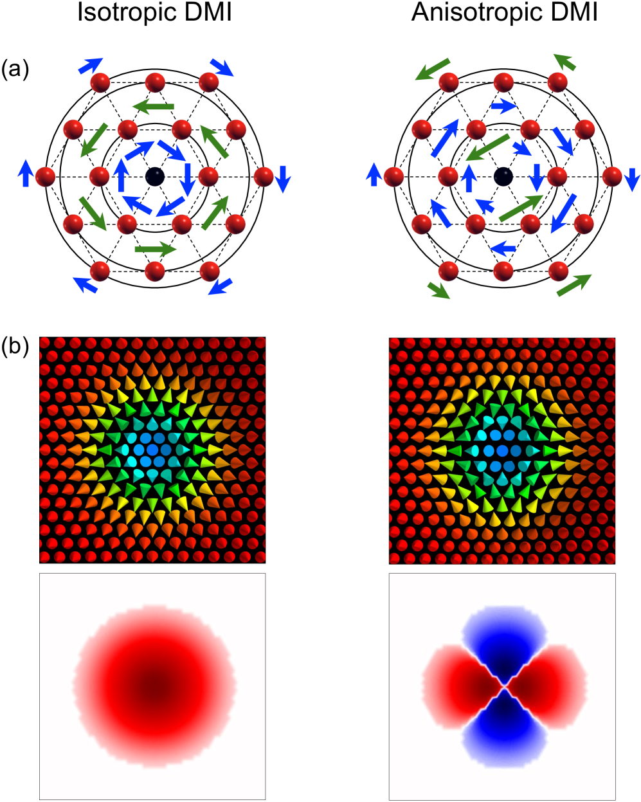
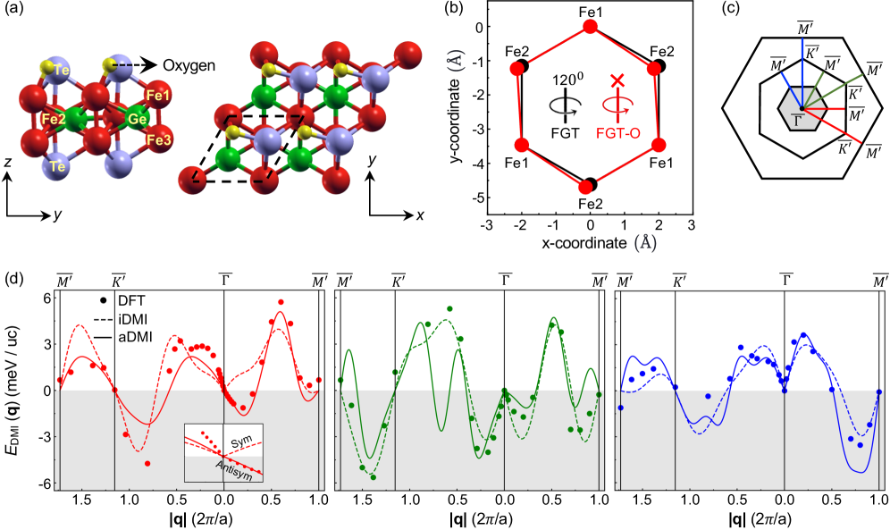
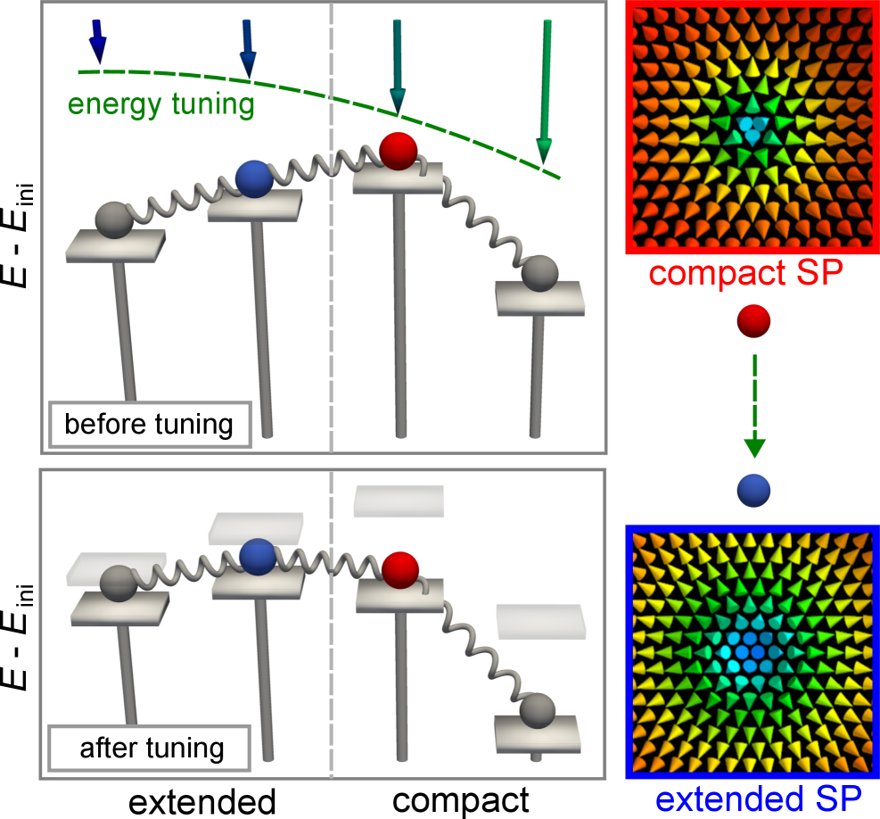
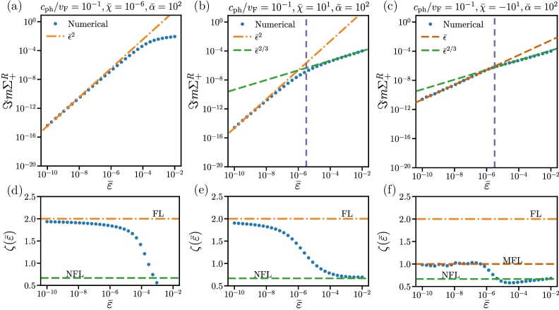
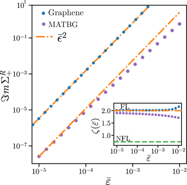
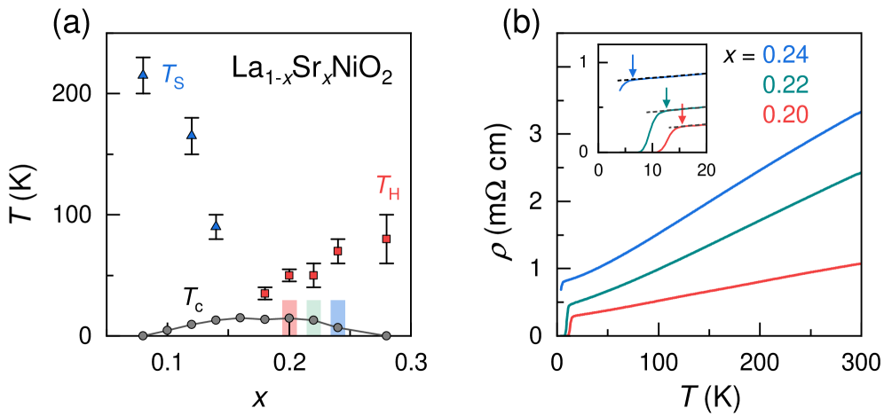
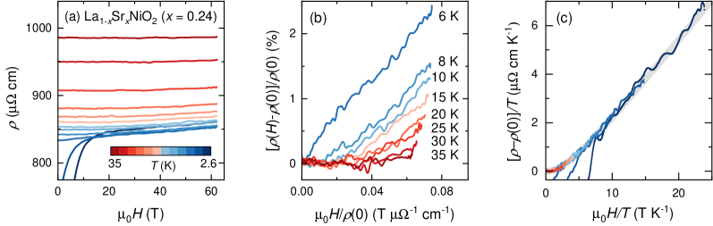
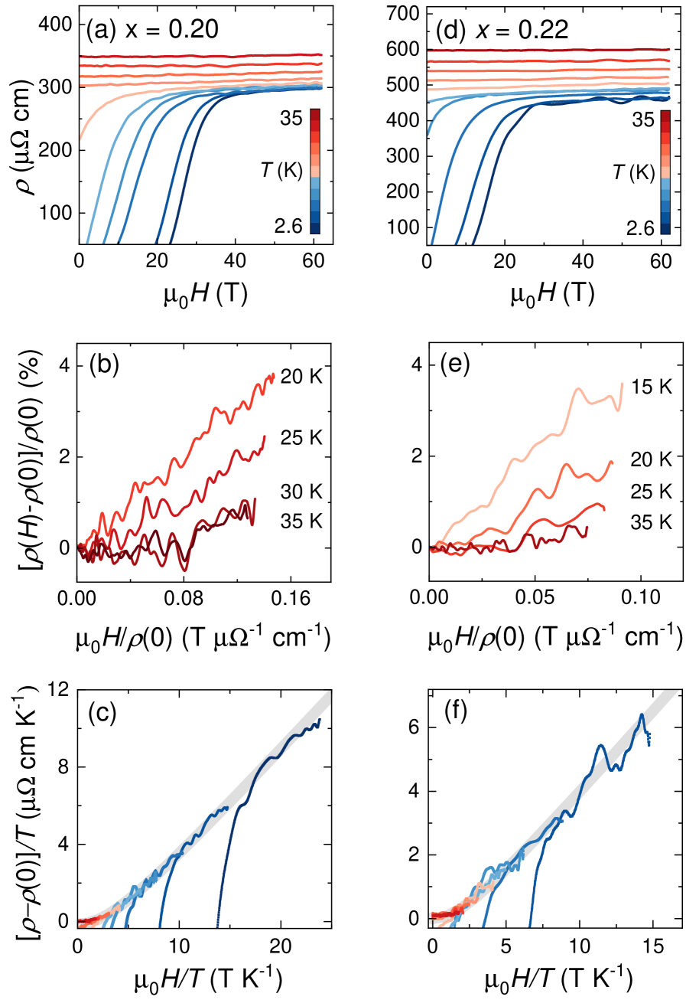
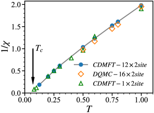
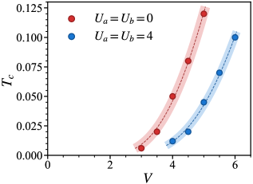

# 2026-03-22 物性物理

**作成日：** 2026年3月22日
**対象期間：** 2026年3月20日〜22日（直近72時間）

---

## 選定論文一覧

- [2603.18682] Extended Saddle Points Govern Long-Lived Antiskyrmions — Arya et al.
- [2603.17937] Non-Fermi-liquid behaviour of electrons coupled to gauge phonons — Gholap et al.
- [2603.17451] H-linear magnetoresistance in the T² resistivity regime of overdoped infinite-layer nickelate La₁₋ₓSrₓNiO₂ — Pan et al.
- [2603.18445] Spatially Indirect Exciton Condensation in Two-Dimensional Strongly Correlated Semimetals — Zeng, Mo & Wu
- [2603.18982] Photoemission Signatures of Photoinduced Carriers and Excitons in One-Dimensional Mott Insulators — Nakamoto, Murakami & Tsuji
- [2603.18906] Imaging short- and long-range magnetic order in a quantum anomalous Hall insulator — Vervelaki et al.
- [2603.18134] Light induced magnetization in d-wave superconductors — Dzero & Kozii
- [2603.17846] Pressure-induced Superconductivity in AgSbTe2 — Kazibwe et al.
- [2603.17796] Site-selective renormalization and competing magnetic instabilities in paramagnet Y₃Cu₂Sb₃O₁₄ — Zhou & Li
- [2603.17710] Electron-Hole Scattering Dichotomy and Anisotropic Warping in Quasi-Two-Dimensional Fermi Surfaces of UTe₂ — Kimata et al.

---

## 全体所見

今回の10本は、磁気ソリトンの熱安定性・非フェルミ液体理論・ニッケル酸化物超伝導の輸送異常という三つの独立した問題を軸としている。Arya et al.（2603.18682）は異方的DMIによる「拡張型鞍点」が室温でのアンチスキルミオン寿命を5桁以上延長するという第一原理的機構を解明しており、スピントロニクス応用に直結しうる。Gholap et al.（2603.17937）はゲージフォノンとの結合がDirac材料でマージナル非フェルミ液体を生む機構を理論的に定式化し、twisted bilayer grapheneの異常金属性への新しい解釈を提案した。Pan et al.（2603.17451）は過剰ドープ無限層ニッケル酸化物において、T²抵抗とH線形磁気抵抗の共存という奇妙な二律背反的輸送挙動を62 Tまでの高磁場実験で確立した。その他、強相関二次元半金属における軌道選択的励起子縮合（2603.18445）、1次元モット絶縁体中の励起子光電子分光シグネチャーの理論（2603.18982）、量子異常ホール絶縁体V-ドープ(Bi,Sb)₂Te₃の磁区構造の直接観察（2603.18906）、d波超伝導体における逆ファラデー効果理論（2603.18134）、熱電材料AgSbTe₂での圧力誘起超伝導（2603.17846）、フラストレート磁性体Y₃Cu₂Sb₃O₁₄の部位選択的軌道繰り込み（2603.17796）、UTe₂の準二次元フェルミ面の異方的歪みと電子–正孔散乱非対称性（2603.17710）を収録した。

---

## 重点論文の詳細解説

---

## 異方的DMIが実現するアンチスキルミオンの超長寿命

### 1. 論文情報

**タイトル：** [Extended Saddle Points Govern Long-Lived Antiskyrmions](https://arxiv.org/abs/2603.18682)
**著者：** Megha Arya, Moritz A. Goerzen, Lionel Calmels, Shiwei Zhu, Bhanu Jai Singh, Stefan Heinze, Dongzhe Li
**arXiv ID：** 2603.18682
**カテゴリ：** cond-mat.mes-hall
**公開日：** 2026年3月19日
**論文タイプ：** 理論＋第一原理計算（DFT スピンスパイラル法 + 原子論的スピン動力学 + 調和遷移状態理論）
**ライセンス：** CC Zero

---

### 2. どんな研究か

酸化された Fe₃GeTe₂ 薄膜において、異方的ジャロシンスキー–守谷相互作用（aDMI）が磁気ソリトン（アンチスキルミオン）の崩壊経路に「拡張型鞍点（extended saddle point）」を形成することを第一原理的に示した。拡張型鞍点はエントロピー寄与を大幅に抑制し、アンチスキルミオンの活性化エネルギーを通常のスキルミオンの約4倍（>120 meV）に高め、室温での寿命を同種の超薄膜系と比べて5桁以上延長することを明らかにした。DMI の方向依存性を精密に第一原理計算で抽出し、崩壊ダイナミクスの温度依存性がほぼ消失するという異常な寿命特性を定量的に予測した。

---

### 3. 研究の概要

**背景と目的：** スキルミオンおよびアンチスキルミオンは、スピントロニクス応用のための情報担体として注目されているが、室温での熱的安定性（寿命）は実用化の主要な障壁となっている。等方的DMI（iDMI）によるスキルミオンは崩壊が「コンパクトな遷移状態」を経由するため、エントロピー効果によって活性化エネルギー由来の寿命が著しく短縮される。一方、異方的DMI（aDMI）を持つ系ではアンチスキルミオンが安定化されることが知られていたが、その崩壊機構と寿命のエントロピー的側面は未解明であった。

**解こうとしている課題：** aDMI系のアンチスキルミオンがなぜ高い熱安定性を示すのか。崩壊の遷移状態（鞍点）の空間的性質はどのようなものか。寿命の温度依存性が iDMI系とどう異なるか。

**研究アプローチ：** 拡張Heisenbergハミルトニアン（交換結合 $J$、DMI $D$、磁気結晶異方性 $K$、ゼーマン項）を第一原理DFT計算（スピンスパイラル法）によってパラメータ抽出し、原子論的スピン動力学シミュレーションと調和遷移状態理論（HTST）を組み合わせてアンチスキルミオンの崩壊速度を定量計算した。

**対象材料系：** 酸化された Fe₃GeTe₂（表面酸化によって面内対称性が破れ、aDMI が発現）

**主な手法：** DFT スピンスパイラル計算（8×8超格子、3518ペア相互作用）、HTSTによる寿命のArrheniusプロット、spinakerコードによる原子論的シミュレーション

**主な結果：**
- aDMI はアンチスキルミオン崩壊において「空間的に伸展した鞍点（spatially extended saddle point）」を形成する。この鞍点では並進対称性が保たれ、ゼロモードが初期状態と鞍点状態の両方に存在し、エントロピー項がキャンセルする。
- 活性化エネルギー >120 meV（iDMI スキルミオンの約4倍の ~30 meV と比較）。
- 室温での寿命は > 0.2 ナノ秒、同種超薄膜系比で5桁以上の向上。
- 磁場0〜0.65 Tで寿命がほぼ温度依存せず（温度依存性の消失）、ソリトンサイズは 16.2 nm から 4.2 nm まで連続的に圧縮される。

**著者の主張：** aDMI による拡張型鞍点はアンチスキルミオンに固有の熱安定化機構であり、等方的系では原理的に生じない。この機構は酸化 Fe₃GeTe₂に限らず、aDMI を持つ磁性材料一般に波及する設計原理を与える。

---

### 4. 物性物理として重要なポイント

本研究の核心は、DMI の対称性（等方的か異方的か）が磁気ソリトンの崩壊経路の位相的性質を根本的に変えるという点にある。iDMI 系では、スキルミオン崩壊時に空間対称性が連続的に壊れるため、鞍点状態でゼロモードが消え、エントロピー因子が活性化エネルギーを実効的に低減してしまう。一方、aDMI 系のアンチスキルミオンは崩壊時も並進自由度が保たれるため、前指数因子中のエントロピー項が相殺する。これは調和遷移状態理論における「Hessian 固有値スペクトル」の構造的差異として定量化される。材料面では、Fe₃GeTe₂の表面酸化による面内対称性破れが aDMI の発現機構として重要であり、第一原理的に8×8超格子を要する精密計算が初めてこの機構を明示的に記述した。寿命のほぼ温度非依存な挙動は、通常の熱活性化過程では説明できず、エントロピーキャンセルという機構が直接証拠となる。スキルミオン物理の文脈でも、同じ材料系でスキルミオンとアンチスキルミオンの寿命が桁違いに異なるという予測は、実験的に検証可能な強い予言であり、実用的なアンチスキルミオン記憶素子設計への指針を与える。

---

### 5. 限界と注意点

本研究の寿命計算は調和遷移状態理論（HTST）に基づいており、非調和効果が無視されている。超低温や超小型ソリトンでは非調和的量子効果（量子トンネリング）が重要になりうるが、本計算の有効範囲は古典的熱活性化に限られる。Fe₃GeTe₂の「酸化」は実験室サンプルによって均一性が異なるため、DMI の定量的再現性には不確かさが残る。計算では8×8超格子を用いているが、最近接殻以外の相互作用の収束については検討の余地がある。また、本研究は平衡寿命を計算しているが、スピントロニクス応用では電流誘起ダイナミクス（スピン軌道トルク）下での寿命が重要であり、非平衡条件での安定性は未評価である。実験的な直接寿命測定（例えば時間分解磁気顕微鏡）による検証が不可欠である。

---

### 6. 関連研究との比較

スキルミオンの熱安定性問題は Bessarab et al.（2018, Nature Communications）やLeonov & Mostovoy（2015）によって理論的枠組みが整備されてきた。Fe₃GeTe₂での aDMI 発現はRaab et al.（2022, Nature Nanotechnology）やYao et al.によって実験的に示されており、アンチスキルミオン観測もその延長上にある。本研究の拡張型鞍点の概念は Lobanov et al.（2021, Physical Review B）が Bloch型スキルミオンで議論した前指数因子の重要性を aDMI 系に一般化したものであり、機構理解として質的前進がある。一方、既知の等方的系（Pd/Fe/Ir(111)等）でのスキルミオン寿命研究との比較において、aDMI 系のほうが原理的に有利であることが数値的に確立されたのは本研究が初めてである。今後は他の aDMI 材料（例えば D₂ₐ対称の Mn₁.₄Pt₀.₉Pd₀.₁Sn）への拡張や、電流注入下での寿命計算が期待される。

---

### 7. 重要キーワードの解説

**① アンチスキルミオン（antiskyrmion）**
スキルミオンと同じトポロジカル電荷 $Q = -1$（またはその符号に依存して $Q = +1$）を持ちながら、スピン巻き付きのパターンが方位角方向に交互に変化する磁気ソリトン。スキルミオンが回転対称なのに対し、アンチスキルミオンは $C_{2v}$ 対称性を持ち、異方的DMI環境下でのみ安定化される。スピン構造は $\mathbf{n}(\mathbf{r}) = (\sin\Theta\cos\Phi,\, \sin\Theta\sin\Phi,\, \cos\Theta)$ で記述され、$\Phi$ が方位角の関数として反転する点で通常のスキルミオンと区別される。

**② 異方的ジャロシンスキー–守谷相互作用（aDMI）**
DMI は隣接スピン $\mathbf{S}_i$ と $\mathbf{S}_j$ の間の反対称交換 $H_\mathrm{DM} = -\mathbf{D}_{ij}\cdot(\mathbf{S}_i\times\mathbf{S}_j)$ として記述される。等方的DMI（iDMI）では全方向で $\mathbf{D}_{ij}$ の方向が統一されているが、aDMI では結合方向によって $\mathbf{D}_{ij}$ の向きが異なる。これは面内反転対称性の破れによって生じ、スキルミオンではなくアンチスキルミオンを安定化する。

**③ 拡張型鞍点（extended saddle point）**
エネルギー地形上で、崩壊経路の遷移状態（鞍点）が一点ではなく空間的に伸展している状態。崩壊時の磁気ソリトンが特定の方向への並進自由度を保ちながら収縮するため、鞍点全体がほぼ同じエネルギーを持つ。これにより Hessian 行列のゼロ固有値が初期状態と鞍点状態の両方に存在し、調和遷移状態理論における前指数因子中のエントロピー項が相殺される。

**④ 調和遷移状態理論（HTST: Harmonic Transition State Theory）**
熱活性化過程の反応速度を調和近似で計算する理論。崩壊速度は
$$\Gamma = f_0 \exp\left(-\frac{E_\mathrm{a}}{k_B T}\right)$$
と書け、前指数因子 $f_0$ はエネルギー地形の曲率（Hessian の固有値）から決まる。ゼロモードが存在する場合は固有値積の比がキャンセルし、$f_0$ が特定のテンプレートに従う。本研究では $f_0$ のエントロピー寄与がキャンセルするため、寿命の温度依存性が Arrhenius 的活性化のみで支配される。

**⑤ 第一原理スピンスパイラル計算（ab initio spin spiral calculation）**
バンド計算において磁化が空間的に螺旋状に変化する状態（$\mathbf{m}(\mathbf{r}) = m(\cos(\mathbf{q}\cdot\mathbf{r}), \sin(\mathbf{q}\cdot\mathbf{r}), 0)$）をBloch定理の一般化で効率的に扱う手法。波数 $\mathbf{q}$ ごとのエネルギーを計算し、DMI 定数は $\partial E/\partial \mathbf{q}$ から抽出できる。本研究では8×8超格子を用いて7番目近接殻まで3518種類の相互作用対を考慮している。

**⑥ スピントロニクスにおける磁気ソリトン（magnetic soliton in spintronics）**
電流やスピン軌道トルクによって操作可能な局所的スピン構造体（スキルミオン、アンチスキルミオン、スキルミオニウム等）の総称。情報ビットとしての利用では、書き込み・読み取りに加えて「保持寿命（retention time）」が不揮発性メモリの要件を決める。室温での寿命が年オーダーであることが実用の目安とされており、本研究の>0.2 nsという予測は室温安定性の基礎的検討に相当する。

**⑦ トポロジカル電荷（topological charge）**
磁気テクスチャのトポロジーを特徴付ける整数
$$Q = \frac{1}{4\pi}\int \mathbf{n}\cdot\left(\frac{\partial\mathbf{n}}{\partial x}\times\frac{\partial\mathbf{n}}{\partial y}\right)d^2r$$
で定義される量。$Q = 0$ が常磁性状態（uniform state）、$Q = \pm 1$ がスキルミオン・アンチスキルミオンに対応する。トポロジカル電荷の変化を伴う崩壊はエネルギー障壁を超える必要があり、これが熱的安定性の起源となる。等方的連続体では $|Q|$ の変化がなければ崩壊しないが、離散格子では格子媒介の崩壊が許される。

---

### 8. 図

**図1：等方的DMI（iDMI）と異方的DMI（aDMI）の比較。** 三角格子上の各近接殻でのDMIベクトル方向を示す。iDMI系（左）ではすべての結合で $\mathbf{D}_{ij}$ が同じ面内方向を向くが、aDMI系（右）では結合方向によって向きが交互に反転する。この対称性の違いがスキルミオン（iDMI）とアンチスキルミオン（aDMI）の安定化を決定づける。エネルギー密度分布のパターンも対称性に応じて回転対称から $C_{2v}$ 対称に変化することが可視化されている。

**図2：酸化Fe₃GeTe₂の結晶構造とスピンスパイラル分散。** 表面酸化によって面内対称性が破れた構造の原子配置と、DFTスピンスパイラル計算によって得られたエネルギー分散曲線が示されている。高対称点（Γ, M, K）に沿った3つのパスでの計算結果を比較しており、等方的モデルがΓ点近傍で大きく失敗するのに対し、aDMIを含む精密計算が分散を正確に再現する。これがaDMI定数抽出の定量的根拠となっている。

**図3：外部磁場に対するアンチスキルミオンのサイズと活性化エネルギー。** 磁場0〜0.65 Tの範囲でアンチスキルミオンの実空間サイズ（16.2 nm→4.2 nm）と崩壊障壁（>120 meV）がどのように変化するかを示す。同じ条件でのiDMI系スキルミオン（約30 meV）との比較によって、aDMIによる4倍以上のエネルギー障壁増大が確認できる。この高い障壁が室温での超長寿命の直接的な起源である。

---

---

## ゲージフォノンとの結合が誘起する非フェルミ液体状態

### 1. 論文情報

**タイトル：** [Non-Fermi-liquid behaviour of electrons coupled to gauge phonons](https://arxiv.org/abs/2603.17937)
**著者：** Rutvij Gholap, Alexey Ermakov, Alexander Kazantsev, Mohammad Saeed Bahramy, Marco Polini, Alessandro Principi
**arXiv ID：** 2603.17937
**カテゴリ：** cond-mat.str-el; cond-mat.mes-hall
**公開日：** 2026年3月18日
**論文タイプ：** 理論（解析的自己エネルギー計算＋数値評価）
**ライセンス：** CC BY 4.0

---

### 2. どんな研究か

Dirac材料において、ひずみ誘起の「ゲージフォノン」（電子電荷密度ではなく電流と結合する横波フォノン）が電子準粒子に与える効果を解析的に定式化し、軌道磁気感受率の符号と減衰定数に依存して非フェルミ液体（NFL）あるいはマージナル・フェルミ液体（MFL）が出現することを示した。通常のフォノンや電子–電子相互作用では説明困難な Dirac 系の異常金属状態に対する格子的起源を理論的に提示した。とくに magic-angle twisted bilayer graphene（MATBG）が、単層グラフェンでは観測困難な NFL 偏差を顕在化させる自然な舞台であることを定量的に議論した。

---

### 3. 研究の概要

**背景と目的：** フェルミ液体から逸脱した金属状態（抵抗の T 線形性、準粒子消滅など）はモット転移近傍や銅酸化物超伝導体など強相関系で広く見られるが、弱相関の Dirac 材料でも MATBG を中心に同種の異常が報告されている。電子–電子相互作用（ゲージ場媒介交換）が NFL の一機構として古くから理論化されてきたが、格子自由度からの寄与は十分に探索されていなかった。

**研究アプローチ：** 電子–フォノン結合の一ループ自己エネルギーを計算し、横波音響フォノンの伝播関数（propagator）に電子–フォノン頂点補正（電子–正孔ループ）を繰り込む。系のパラメータは軌道感受率 $\chi$（または無次元量 $\bar{\chi}$）と無次元減衰因子 $\bar{\alpha}$（ランダウ減衰強度）の2つで特徴付けられる。

**対象材料系：** 一般的な Dirac 材料、とくに単層グラフェンおよびMATBG

**主な手法：** Keldysh-Matsubara法による遅延グリーン関数の解析的計算、自己無撞着な摂動論（一ループ自己エネルギー）

**主な結果：**
- $\bar{\chi} > 0$（反磁性的応答）の場合：低エネルギーで狭いフェルミ液体窓があり、それより高エネルギーでは $\Gamma \propto \varepsilon^{2/3}$ のNFL散乱率へのクロスオーバーが生じる。
- $\bar{\chi} < 0$（常磁性的応答）の場合：最低エネルギーでマージナル・フェルミ液体（$\Gamma \propto \varepsilon$）が出現し、さらに高エネルギーで強いNFLに移行する。
- MATBGでは単層グラフェン比で有効結合定数が大幅に増大し、NFL偏差がより低エネルギー（実験アクセス可能な領域）に現れる。
- ゲージフォノン機構は量子臨界点への近接を必要とせず、材料固有の軌道感受率・減衰定数のみで決まる。

**著者の主張：** ゲージフォノンは Dirac 材料における NFL の普遍的な格子的起源となりうる。

---

### 4. 物性物理として重要なポイント

本研究の着眼点は、「ゲージフォノン」という概念の導入にある。通常の電子–フォノン結合は電荷密度 $\delta\rho$ に結合する縦波フォノンが主役だが、ひずみ誘起の変形ポテンシャルは Dirac 系ではゲージポテンシャル $\delta\mathbf{A}$ として電流に結合する。この違いがフォノン伝播関数を横電流–電流感受率で修正し、ランダウ減衰を強く受けた「過減衰ゲージフォノン」という機能的分類子を生み出す。これは固体中の「ゲージ場」（電子流体力学やホログラフィックなフォノン理論との接点）の格子的類似であり、理論的に整合性のある枠組みが本研究で初めて詳細に構築された。実験的予測として、MATBGにおける ARPES やマイクロ波分光でのフェルミ液体窓の幅とNFLクロスオーバーエネルギーが材料パラメータから定量的に予測されており、検証実験との直接比較が可能である。ただし自己エネルギー計算は一ループ近似であり、頂点補正（Ward同一性による修正）や多重散乱の効果は考慮されていない。

---

### 5. 限界と注意点

本計算は一ループ近似の摂動論であり、結合定数が大きくなる強結合領域（MATBGのファン・ホーフ特異点近傍など）では摂動展開の有効性が保証されない。軌道感受率 $\chi$ の値および $\bar{\alpha}$ の推定には実験的不確かさがあり、MATBGでの具体的予測の精度はこれらのパラメータ誤差に敏感である。また、本理論は単一フォノンモードの寄与を扱っており、実際の材料では複数のフォノン枝が競合する。ゲージフォノン以外の散乱機構（クーロン相互作用、不純物、フォノン正常結合）との相対的寄与の切り分けは実験的に非自明である。グラフェン系固有の Dirac 分散という特殊性から、他の物質（例えばトポロジカル半金属や Weyl 半金属）への定量的拡張には個別の検討が必要である。

---

### 6. 関連研究との比較

電子がゲージ場に結合する場合の NFL は Holstein & Hertz（1973）以来の「電子–ゲージ場相互作用」理論の文脈で長く研究されてきた（Polchinski 1994, Nayak & Wilczek 1994など）。しかし電子–格子系でのゲージフォノン問題は、ひずみ工学の台頭とともに近年 Cortijo, Vozmediano ら（2012〜）が理論的に定式化し始めた。本研究はそれを自己エネルギーの観点から完成させたものとみなせる。MATBG への応用では、Cao et al.（2018）の実験以来多くの NFL 説明が提案されてきた（電子–電子相互作用主体、量子臨界ゆらぎ主体など）が、本研究は純粋に格子的・電子–フォノン的起源のみで NFL を説明する最初の定量的枠組みを与えており、機構の切り分けという点で独自の価値を持つ。今後は点欠陥制御や圧力印加でゲージフォノン寄与を可変した実験設計が重要となろう。

---

### 7. 重要キーワードの解説

**① ゲージフォノン（gauge phonon）**
電子の電荷密度ではなく電流（ベクトルポテンシャル $\mathbf{A}$）に結合するフォノン。Dirac 材料では二軸ひずみ（$u_{xx} - u_{yy}$, $u_{xy}$）が赤道面内のベクトルポテンシャルを誘起し、バレー間等価な「疑似ゲージ場」として作用する。結合ハミルトニアンは $H_\mathrm{ep} = v_F \mathbf{\sigma}\cdot\delta\mathbf{A}$ の形を取り、電荷密度でなく電流に応答する点で通常の電子–フォノン結合と本質的に異なる。

**② 非フェルミ液体（non-Fermi liquid, NFL）**
Landau のフェルミ液体理論の枠組みが破れた金属状態の総称。フェルミ液体では準粒子の散乱率 $\Gamma \propto \varepsilon^2$ だが、NFL では冪乗則が変わる（例：$\Gamma \propto \varepsilon^{2/3}$）かマージナル・フェルミ液体（$\Gamma \propto \varepsilon$）となる。抵抗率の温度依存性も NFL では $T$-線形や $T^{4/3}$ などが現れ、実験的指標として広く用いられる。

**③ マージナル・フェルミ液体（marginal Fermi liquid, MFL）**
散乱率がエネルギーに線形 $\Gamma \propto |\varepsilon|$ となる極限的な NFL。$\text{Im}\Sigma(\omega) \propto \max(|\omega|, k_BT)$ という自己エネルギー形式で記述される。銅酸化物高温超伝導体の正常相を説明するために Varma ら（1989）が提唱した。本研究では $\bar{\chi} < 0$ 領域でゲージフォノン機構によってMFLが自然に出現する。

**④ ランダウ減衰（Landau damping）**
粒子–ホール対生成によって集団モードが減衰する現象。金属中での電磁プラズマ波は電子–正孔連続体（Lindhard 関数の虚部が有限な領域）と重なると強く減衰する。本研究では横フォノンが電子–正孔対に吸収されることでゲージフォノンが「過減衰」領域に入り、分散の代わりに拡散的性格を持つようになる。この過減衰状態が NFL 自己エネルギーの起源となる。

**⑤ 一ループ電子–フォノン自己エネルギー（one-loop electron-phonon self-energy）**
電子グリーン関数の最低次補正
$$\Sigma(\mathbf{k}, \omega) = \int\frac{d\mathbf{q}}{(2\pi)^2}\int\frac{d\nu}{2\pi i}\,|g_\mathbf{q}|^2 G(\mathbf{k}-\mathbf{q}, \omega-\nu)D(\mathbf{q}, \nu)$$
を解析的に評価したもの。ここで $D(\mathbf{q},\nu)$ はフォノン伝播関数（電子–正孔ループで修正済み）、$g_\mathbf{q}$ はゲージ電子–フォノン結合定数。自己エネルギーの虚部が準粒子散乱率に直接対応する。

**⑥ Magic-angle twisted bilayer graphene（MATBG）**
グラフェン二層を約1.1°回転させた系（Bistritzer & MacDonald 2011で予言、Cao et al. 2018で実証）。この角度近傍でフラットバンドが出現し、電子の運動エネルギーが相互作用エネルギーより小さくなることで強相関状態が実現する。フェルミ速度が $v_F \sim 10^4$ m/s まで抑制され、状態密度が大幅に増大するため、電子–フォノン結合の実効的強さが単層に比べて大きくなる。

**⑦ 軌道磁気感受率（orbital magnetic susceptibility）**
外部磁場に対して電子軌道運動が誘起する磁化 $M = \chi H$ を記述する感受率の軌道成分。グラフェン系では Dirac コーンの特殊な幾何学（Berry 曲率とバンド曲率の積）によって $\chi$ の大きさと符号が制御される。$\chi < 0$ は反磁性（軌道補足が電場ゲージに抵抗）、$\chi > 0$ は常磁性的軌道応答に対応する。本研究では $\chi$ の符号が非フェルミ液体の種類（NFL か MFL か）を決定するため、材料設計の重要なパラメータとなる。

---

### 8. 図

**図1：ゲージフォノンを媒介とする一ループ電子自己エネルギーのダイアグラム。** ゲージフォノン伝播関数（波線）によって電子グリーン関数（実線）が繰り込まれる過程を示す。伝播関数内部に電子–正孔ループが含まれており（灰色の丸括弧）、ランダウ減衰がフォノン分散を修正していることが図示されている。この一ループ計算が本研究の中心的な解析的評価の対象である。

**図2：遅延自己エネルギーの虚部（準粒子散乱率）のエネルギー依存性。** 横軸は規格化エネルギー $\varepsilon/\varepsilon_0$、縦軸は $\text{Im}\Sigma$ を示す。上段（$\bar{\chi} > 0$）では低エネルギーでのフェルミ液体的 $\varepsilon^2$ 挙動から $\varepsilon^{2/3}$ NFLへのクロスオーバーが見られる。下段（$\bar{\chi} < 0$）では最低エネルギーで $\varepsilon^1$ のマージナル・フェルミ液体挙動が確認され、さらに高エネルギーで強いNFLスケーリングへ移行する。MATBG（赤）が単層グラフェン（青）に比べて遥かに低いエネルギーでクロスオーバーが生じることが一目で分かる。

*図3（単層グラフェンとMATBGの比較）については、HTMLバージョンからの図ファイル抽出が不完全だったため掲載を省略する。*

---

---

## 過剰ドープ無限層ニッケル酸化物におけるH線形磁気抵抗とT²抵抗の共存

### 1. 論文情報

**タイトル：** [H-linear magnetoresistance in the T² resistivity regime of overdoped infinite-layer nickelate La₁₋ₓSrₓNiO₂](https://arxiv.org/abs/2603.17451)
**著者：** Yong-Cheng Pan, Tommy Kotte, Toni Helm, Motoki Osada, Atsushi Tsukazaki, Yu-Te Hsu
**arXiv ID：** 2603.17451
**カテゴリ：** cond-mat.supr-con
**公開日：** 2026年3月18日
**論文タイプ：** 実験（高磁場磁気輸送測定、最大62 T）
**ライセンス：** CC BY 4.0

---

### 2. どんな研究か

高品質 La₁₋ₓSrₓNiO₂ 薄膜（$x = 0.20$〜$0.24$）について、パルス高磁場（最大62 T）中での磁気輸送を系統的に測定した。正常相の電気抵抗が30 K以下でT²に従うフェルミ液体的挙動を示す一方、磁気抵抗は高H/T領域でH線形となるという矛盾した輸送性質の共存を実験的に確立した。この「H線形MR + T²抵抗」という二律背反は銅酸化物や他の非従来型超伝導体では観測されておらず、無限層ニッケル酸化物の特異な散乱機構を示唆する。

---

### 3. 研究の概要

**背景と目的：** 無限層ニッケル酸化物 $R\text{NiO}_2$（$R$ = La, Nd 等）は銅酸化物と類似の正方 NiO₂ 面を持ちながら、超伝導機構においては電子構造・相関強度・電荷担体の性質で重要な違いがある。ドープ量を増やすと超伝導が抑制されるが、その正常状態の電子的性質（フェルミ液体か否か）は不明瞭であった。高磁場磁気輸送測定は超伝導を完全に抑制して正常相を直接探索する最も有効な手段の一つである。

**研究アプローチ：** 分子線エピタキシー（MBE）による高品質 LSNO 薄膜を基板 SrTiO₃ 上に作製し、低温（0.3〜10 K）・高磁場（0〜62 T）での縦方向抵抗率を測定。コーラー則（Kohler's rule）の検証と H/T スケーリングの解析を行った。

**対象材料系：** La₁₋ₓSrₓNiO₂（$x = 0.20, 0.22, 0.24$）薄膜／SrTiO₃ 基板

**主な手法：** パルス磁場輸送測定（ドレスデン高磁場研究所 HLD および他の施設）、Hall 抵抗測定、磁気抵抗の実験的フィッティング

**主な結果：**
- 三試料すべてで30 K以下の正常抵抗率が $\Delta\rho \propto T^2$ に従い、フェルミ液体的なイン弾性散乱の支配を示す。
- 磁気抵抗はコーラー則（$\Delta\rho/\rho_0 = f(H/\rho_0)$）に従わず、規格化磁気抵抗 $[\rho(H,T)-\rho(0,T)]/T$ が $H/T$ の普遍関数としてスケールする。
- このスケーリングは $\rho(H,T) = \mathcal{F}(T) + \sqrt{(\alpha T)^2 + (\gamma\mu_0 H)^2}$ という形式（二流体モデル的表示）でよく記述される。高H/T領域では実効的にH線形となる。
- コーラー則の破れは k空間異方性散乱（ホット・スポット散乱）を示唆する。Nd類似体（NSNO）では希土類磁気モーメントの効果が混入するが、La系ではこれが消えることで NiO₂ 面固有の物理が単独抽出できる。

**著者の主張：** H線形磁気抵抗とT²抵抗の共存は量子臨界点への近接のみで説明できず、k空間非等方的な弾性散乱チャネルの存在を示唆する。

---

### 4. 物性物理として重要なポイント

本研究の最も重要な貢献は、過剰ドープ La₁₋ₓSrₓNiO₂ の正常相が「フェルミ液体的T²抵抗」と「非フェルミ液体的H線形磁気抵抗」という互いに矛盾するように見える性質を同時に示すという実験的事実を、62 T の高磁場実験によって確立した点にある。T²抵抗は弾性–弾性散乱（フォノン等）の T 依存性を差し引いたイン弾性チャネルのフェルミ液体的性格を示すが、H線形MRはその散乱が磁場感受的な異方性を持つことを示しており、単純なフェルミ液体描像では矛盾する。この種の二律背反は銅酸化物（La₂₋ₓSrₓCuO₄ 過剰ドープ端）でも最近報告されており（Hussey et al.）、NiO₂ 面を共有する銅酸化物とニッケル酸化物の普遍的な輸送特性の一端を示している可能性がある。また、La 系で Nd 系の希土類磁性の寄与が消え、クリーンな比較が可能になった点は、ニッケル酸化物固有の物理を切り出す実験的制御として重要である。

---

### 5. 限界と注意点

測定に用いた薄膜は SrTiO₃ 基板上に作製されており、格子ミスマッチによる二軸応力の効果が電子状態に与える影響は完全には制御されていない。試料数が3試料と限られており、ドーピング依存性の全体像を把握するためには $x = 0.10$〜$0.30$ のより広い範囲での系統的測定が望まれる。H/T スケーリングの解釈（二流体モデルの物理的正当性）については、代替モデル（例えば量子臨界点近傍の Fermi liquid breakdown）との比較が必要である。コーラー則の破れが k空間非等方性に由来するという解釈は間接的であり、ARPES や量子振動による Fermi 面の直接測定との突き合わせが必要である。また、超伝導転移の直下のゆらぎ効果が正常相の磁気抵抗に寄与する可能性も排除されていない。

---

### 6. 関連研究との比較

無限層ニッケル酸化物の高磁場輸送研究は、Li et al.（2020, Nature Materials）の磁気抵抗報告以来、正常相の電子的性格を巡って論争が続いている。Pan et al.（本研究）は62 T という本分野で最高水準の磁場を達成しており、以前の研究で残されていた高H/T領域でのH線形スケーリングの確認に初めて成功した。Nd 類似体（NSNO）では Lu et al.（2022）が T-線形抵抗を報告しているが、La 系では本研究がT²を確立しており、稀土類磁性が散乱機構を大きく変えることが示唆される。銅酸化物との比較では、LSCO の過剰ドープ端（Hussey ら）でも H/T スケーリングと T² 抵抗の共存が報告されつつあり、NiO₂（CuO₂）面の共通物理の観点からの統一的理解が射程に入っている。今後は Hall 係数の温度・磁場依存性と組み合わせた多チャネル散乱モデルの構築が重要課題となる。

---

### 7. 重要キーワードの解説

**① 無限層ニッケル酸化物（infinite-layer nickelate）**
$R\text{NiO}_2$（$R$ = La, Nd, Pr 等）という化学式で表される、正方 NiO₂ 面が積層した構造を持つ銅酸化物類似物質。「無限層」とはアペックス酸素が存在せず、NiO₂ 面が正方プラケット状の局所配置を持つことを指す。Ni の形式原子価は $d^9$（$S = 1/2$）で銅酸化物の $d^9$ 状態と同形であるが、Ni $3d$ 軌道の伝播関数や希土類 $5d$/$4f$ 軌道との混成が銅酸化物と異なる。Li et al. の 2019 年の実験的発見以来、超伝導機構を探る主要舞台となっている。

**② コーラー則とその破れ（Kohler's rule and its violation）**
単純なフェルミ液体金属では、磁気抵抗 $\Delta\rho/\rho_0$ が $\omega_c\tau = H/\rho_0$ の普遍関数となるという経験則（コーラー則）。ここで $\omega_c$ はサイクロトロン周波数、$\tau$ はフェルミ面上の散乱時間。複数の散乱チャネルが異なる磁場感受性を持つ場合（k空間異方性散乱、ホット・スポット散乱など）はコーラー則が破れ、$\Delta\rho/\rho_0$ が $H/T$ でスケールするなどの振る舞いが現れる。

**③ H線形磁気抵抗（H-linear magnetoresistance）**
磁気抵抗が外部磁場 $H$ に比例して増加する振る舞い。Fermi 液体では高磁場で $\Delta\rho \propto H^2$（古典的オービタル効果）が期待されるが、H 線形は別の散乱機構を示唆する。線形磁気抵抗は：(a) 量子臨界点近傍（$T \to 0$ 限界）、(b) ディラック半金属でのランダウ準位効果、(c) k空間異方性散乱、などで現れる。本研究の LSNO での観測は機構 (c) が有力とされる。

**④ フェルミ液体（Fermi liquid）**
ランダウが提唱した、相互作用する電子系でも準粒子描像が保たれる金属状態。低温の非弾性（電子–電子）散乱率が $\Gamma_\mathrm{ee} \propto T^2$ となり、抵抗率が $\rho = \rho_0 + AT^2$（A係数はゾンマーフェルト–ウィルソン比に関連）となることが特徴的。本研究の LSNO は正常相抵抗率が T² を示し、イン弾性チャネルのフェルミ液体性を支持するが、磁気抵抗のH線形性がその解釈に制約を課す。

**⑤ k空間異方性散乱（k-space anisotropic scattering）**
フェルミ面上の準粒子が波数 $\mathbf{k}$ の方向に依存した不均一な散乱率を持つ状態。銅酸化物では $(\pi, 0)$ 方向の「ホット・スポット」で散乱が強く、$(\pi/2, \pi/2)$ 方向の「コールド・スポット」で弱い。このk依存性がコーラー則を破る主要機構とされており、ホール角の $T^2$ 依存性などに反映される。LSNO での MR 異常がこの機構を示唆するならば、NiO₂ 面でも同様のホット/コールド構造が存在する可能性がある。

**⑥ 高磁場パルス磁場測定（high-field pulsed field measurement）**
超伝導マグネットでは実現できない50〜100 Tクラスの磁場を、コイルに短時間大電流を流すことで発生させる技術。パルス幅は典型的に 10〜100 ms 程度で、サンプルには磁気抵抗・ホール効果・磁化などが高速データ取得される。本研究ではドレスデン高磁場研究所（HLD）の62 Tを用いており、これにより超伝導凝縮エネルギーをはるかに超える磁場での正常相輸送を直接測定できた。

**⑦ 上部臨界磁場 $H_{c2}$ とパウリ対破壊（upper critical field and Pauli depairing）**
超伝導状態を破壊するのに必要な磁場 $H_{c2}$。s波一重項超伝導では軌道効果（Cooper 対の軌道エネルギー増加）とパウリ効果（Zeeman エネルギーによるスピン一重項の対破壊）の二つの機構が働く。LSNO の $H_{c2}$ は数十 T 程度であり、62 T の測定では超伝導が完全に抑制されて正常相が直接観測できる。これが高磁場実験の物性物理的意義である。

---

### 8. 図

**図1：La₁₋ₓSrₓNiO₂のドーピング–温度相図と三試料の零磁場抵抗率。** 上段はドーピング $x$ に対する超伝導転移温度と正常相挙動の概略相図。下段は $x = 0.20, 0.22, 0.24$ 試料の温度依存抵抗率で、低温でのT²フィットが示されている。最適ドープ（$x \approx 0.16$）より高ドープ側でT²挙動が支配的となる様子が分かる。ドーピング増加に伴い残留抵抗率と T² 係数 A が体系的に変化している。

**図2：$x = 0.24$ 試料の等温磁気抵抗率とコーラー則の検証。** 主図は異なる温度での $\rho$ vs $\mu_0 H$ の等温線（62 Tまで）。挿入図のコーラープロット（$\Delta\rho/\rho_0$ vs $H/\rho_0$）では異なる温度の曲線が重ならず、コーラー則の明確な破れが示される。主図中の $[\rho(H,T)-\rho(0,T)]/T$ vs $\mu_0 H/T$ のプロットでは全温度の曲線が一本に収束しており、H/T スケーリングの成立が視覚的に明快に示されている。

**図3：$x = 0.20$ および $0.22$ 試料でのH/Tスケーリングの確認。** 二試料でも同様の H/T スケーリングが成立しており、コーラー則破れが過剰ドープ領域全般に共通の普遍的現象であることを示す。ドーピング依存性の解析から、スケーリング関数のパラメータ（$\alpha$ と $\gamma$）がドーピングにほぼ依存しないという追加の知見が得られており、散乱機構の安定性を示唆している。

---

---

## その他の重要論文

---

## 強相関二次元半金属における軌道選択的間接励起子縮合

### 1. 論文情報

**タイトル：** [Spatially Indirect Exciton Condensation in Two-Dimensional Strongly Correlated Semimetals](https://arxiv.org/abs/2603.18445)
**著者：** Yao Zeng, Shi-Cong Mo, Wéi Wú
**arXiv ID：** 2603.18445
**カテゴリ：** cond-mat.str-el
**公開日：** 2026年3月19日
**論文タイプ：** 理論（DMFT + 行列式量子モンテカルロ法）
**ライセンス：** CC BY 4.0

### 2. 研究概要

三角格子上の多軌道Hubbardモデル（電子バンドと正孔バンドが別の軌道に存在するセミメタル構造）に対して、動的平均場理論（DMFT）と行列式量子モンテカルロ法（DQMC）を適用し、強相関効果が励起子縮合転移温度 $T_c$ に与える影響を系統的に解明した。主な成果は三点ある。（1）サイト間クーロン相互作用 $U$ が有限の場合、$T_c$ は $U = 0$ の弱結合予測から大幅に抑制され（最大7倍）、電子–正孔密度が増すほど抑制が強くなる。（2）三軌道系に拡張すると、d軌道–p軌道間の軌道選択的ペアリングが優先的に凝縮し、d–d 軌道間の競合チャネルが $T_c$ をさらに約67%低下させる。（3）この機構は TiSe₂ や Ta₂NiSe₅ などの遷移金属カルコゲナイドで観測される「強い励起子結合エネルギーにもかかわらず低い $T_c$」という実験的パラドックスを定量的に説明しうる。単純な BCS–BEC クロスオーバーでは取り込めない「相関による競合チャネル抑制」という機構は、二次元励起子絶縁体の材料設計に重要な視点を提供する。

### 3. 重要キーワードの解説

**① 励起子絶縁体（excitonic insulator）** 半金属または小ギャップ半導体において、電子と正孔のクーロン引力が電子のバンドエネルギーを超えた場合に自発的に形成される電子–正孔束縛対（励起子）の凝縮体。BCS 的ペアリングの類推で記述でき、秩序変数は $\langle c^\dagger_k h_{-k} \rangle$ の有限期待値。TiSe₂ が代表的実験系。

**② 動的平均場理論（DMFT）** 多軌道Hubbardモデルを空間的に均一な一サイト問題（Anderson不純物モデル）に帰着させ、局所グリーン関数を自己無撞着に計算する手法。局所的量子揺らぎを正確に扱えるが、空間的非局所相関は無視する。多軌道問題への拡張が本研究で重要。

**③ 行列式量子モンテカルロ（DQMC）** フェルミオン系のHubbardモデルを虚時間経路積分で表し、補助フィールドによるDeterminant分解をモンテカルロサンプリングで評価する数値厳密解法。有限の符号問題が存在するが、本研究の三角格子モデルでは部分的に制御可能。

**④ 軌道選択的ペアリング（orbital-selective pairing）** 複数の軌道が存在するとき、特定の軌道の組み合わせ（例：d–p間）が優先的に電子–正孔対を形成する状態。対称性が許す全ペアリングチャネルが競合することで $T_c$ が抑制される機構として重要。

**⑤ BCS–BECクロスオーバー（BCS–BEC crossover）** クーパー対形成（BCS 側）から分子ボーズ–アインシュタイン凝縮（BEC 側）への連続的移行。励起子系でも、弱結合（広がった波動関数、TiSe₂型）から強結合（局在した励起子、Ta₂NiSe₅型）への変化がこの枠組みで記述される。

**⑥ 間接励起子縮合（spatially indirect exciton condensation）** 電子と正孔が実空間で異なる軌道（あるいは異なる層）に局在している場合の励起子凝縮。バンドギャップ方程式において対称性の低い状態が選ばれ、電荷秩序や軌道秩序との競合が重要になる。

**⑦ 三角格子フラストレーション（triangular lattice frustration）** 三角格子上の反強磁性的相互作用では最近接間のスピンを全て満たす配置が存在しない（幾何学的フラストレーション）。本研究では磁性ではなく電荷的自由度のフラストレーション（複数のペアリングチャネルの同等性）が $T_c$ 抑制をもたらす。

### 4. 図

**図1：二軌道Hubbardモデルの模式図。** 三角格子上の各サイトに電子バンド（上）と正孔バンド（下）の二軌道が存在し、サイト内クーロン反発 $U$ とサイト間軌道間引力 $V$ が示されている。この模型が TiSe₂ 類似の励起子絶縁体問題の基本的枠組みを与える。

**図2：逆ペアリング感受率の温度依存性。** $1/\chi$ の温度依存性を示し、発散によって励起子縮合転移温度 $T_c$ が決定される。$U = 0$（非相関）と $U \neq 0$（強相関）の比較によって、クーロン相互作用が $T_c$ を劇的に抑制する様子が一目瞭然に示されている。

**図3：サイト間引力 $V$ に対する $T_c$ の変化。** $U = 0$ と $U = 4$ の二つのケースで $T_c(V)$ を比較。両者ともBCS的指数関数的増加を示すが、有限 $U$ の場合は一貫して低い $T_c$ を示し、強相関による普遍的抑制効果を確認できる。

---

## 一次元モット絶縁体における光誘起励起子の光電子分光シグネチャー

### 1. 論文情報

**タイトル：** [Photoemission Signatures of Photoinduced Carriers and Excitons in One-Dimensional Mott Insulators](https://arxiv.org/abs/2603.18982)
**著者：** Taiga Nakamoto, Yuta Murakami, Naoto Tsuji
**arXiv ID：** 2603.18982
**カテゴリ：** cond-mat.str-el
**公開日：** 2026年3月19日
**論文タイプ：** 理論（数値計算：Krylov-空間時間依存法 + 単一粒子スペクトル関数計算）
**ライセンス：** arXiv 非独占的配布ライセンス

### 2. 研究概要

一次元モット絶縁体を光ドープした状態（フォトドープ）で励起された担体（ホロン/ダブロン）と、その担体が束縛して形成する励起子がどのような光電子スペクトル（PES）シグネチャーを示すかを、有限系での非平衡時間発展計算によって解析した。強相関系固有の分数的励起（スピノン・ホロン・ダブロン）が PES に与える影響が核心であり、（1）担体が非束縛の場合、PES はスピノン分散を反映した広いスペクトル構造を示す。（2）担体がダブロン–ホロン束縛励起子を形成すると、モットギャップ内にギャップ内ピークからなる「レプリカ構造」が出現し、そのギャップ内信号の分布が束縛の強さに敏感である。これにより、光電子分光（時間分解 ARPES など）が光誘起担体の束縛状態を識別し、強相関系の磁気的性質（スピン–電荷分離の程度）を読み取る手段として機能することが明らかにされた。この理論的枠組みは Sr₂CuO₃ や ETF 有機導体など実在の一次元モット絶縁体の時間分解 ARPES 実験に直接適用可能であり、ポンプ–プローブ光電子分光が強相関非平衡状態の診断ツールとなりうることを示している。

### 3. 重要キーワードの解説

**① スピン–電荷分離（spin-charge separation）** 一次元フェルミオン系（Luttinger液体）で、電子が独立して伝播する「スピノン」（スピン$\pm 1/2$、電荷0）と「ホロン」（電荷$\pm e$、スピン0）に分裂する現象。$H = H_\rho + H_\sigma$ と分解され、速度が異なることから動的特性が二つの独立した集団モードとして現れる。

**② ホロンとダブロン（holon and doublon）** モット絶縁体において各サイトが1電子で占有された基底状態から電子1個を取り除いた「ホロン」（空サイト、電荷$+e$）と、電子2個が同一サイトに占有された「ダブロン」（二重占有）の総称。光ドープによってダブロン–ホロン対が生成され、その後の散逸や束縛が非平衡物性を支配する。

**③ ギャップ内レプリカ構造（in-gap replica structure）** 光電子スペクトル中のモットギャップ内に現れる補助的なピーク構造。ダブロン–ホロン束縛励起子の形成に伴い、基底状態のPESがギャップ内の離散的なポールに「複製」される。各レプリカの位置とスペクトル重みが励起子結合エネルギーと波動関数の広がりを反映する。

**④ 時間分解ARPES（time-resolved ARPES）** ポンプ光で試料を励起し、その後プローブ光（紫外線・軟X線）で光電子を放出させて角度分解エネルギー分析を行う非平衡分光法。励起状態のバンド構造変化を~100 fsの時間分解能で追跡できる。光誘起相転移・光誘起超伝導・光ドープ状態の診断に広く用いられる。

**⑤ Hubbardモデルのフォトドープ（photodoping in the Hubbard model）** 半充填モット絶縁体（1サイト1電子）を光で励起してダブロン–ホロン対を生成した非平衡状態。実効的に有効温度が「電子的励起温度」で記述されることがあるが、分数励起の非平衡分布は単純な温度で特徴づけられず、スペクトル機能が平衡と大きく異なる。

**⑥ クリロフ空間時間発展法（Krylov-space time evolution）** 時間依存シュレーディンガー方程式 $i\partial_t|\psi\rangle = H|\psi\rangle$ を、ハミルトニアン $H$ のクリロフ部分空間 $\{|\psi\rangle, H|\psi\rangle, H^2|\psi\rangle, \ldots\}$ 上でのLanczos投影によって効率的に解く数値手法。有限系の完全対角化より格段に大きなシステムサイズを扱えるため、1次元モット絶縁体の動的相関関数計算に有用。

**⑦ 非平衡グリーン関数（nonequilibrium Green's function）** 非平衡状態の一粒子スペクトル関数 $A(\mathbf{k}, \omega, t) = -\frac{1}{\pi}\text{Im}G^R(\mathbf{k}, \omega, t)$ を時刻 $t$ に対して定義するための形式。Kadanoff-Baym方程式、Keldysh形式論が基盤となる。光ドープ後のスペクトル重みの時間発展がこの枠組みで計算される。

### 4. 図

本論文のライセンスは arXiv 非独占的配布ライセンスのため、原図の抽出は行わない。

---

## 量子異常ホール絶縁体における短距離・長距離磁気秩序のSQUIDイメージング

### 1. 論文情報

**タイトル：** [Imaging short- and long-range magnetic order in a quantum anomalous Hall insulator](https://arxiv.org/abs/2603.18906)
**著者：** Andriani Vervelaki, Boris Gross, Daniel Jetter, Katharina Kress, Timur Weber, Dieter Koelle, Kajetan M. Fijalkowski, Martin Klement, Nan Liu, Karl Brunner, Charles Gould, Laurens W. Molenkamp, Martino Poggio, Floris Braakman
**arXiv ID：** 2603.18906
**カテゴリ：** cond-mat.mtrl-sci; cond-mat.mes-hall
**公開日：** 2026年3月19日
**論文タイプ：** 実験（走査型SQUID顕微鏡）
**ライセンス：** arXiv 非独占的配布ライセンス

### 2. 研究概要

V ドープ (Bi,Sb)₂Te₃（VST）は磁場ゼロで量子異常ホール効果（QAH）を示すトポロジカル絶縁体系であり、そのホール電導が $e^2/h$ を完全に示す条件として、サンプル全体での強磁性秩序の均一性が重要とされてきた。本研究では走査型SQUID顕微鏡（SSM）を用いて VST 薄膜の磁区構造を25 mK の極低温で空間分解撮影し、磁区サイズが結晶学的グレイン（結晶粒）サイズとほぼ一致することを直接示した。さらに磁化反転は孤立核生成によってではなく、既存ドメイン壁の展開（domain expansion）によって進むことが磁場掃引中の逐次イメージングで確認された。この結果は、グレイン内では短距離の交換相互作用が支配する局所強磁性秩序があり、グレイン間では長距離的なフラストレートした結合がある複合的磁気秩序を示唆する。QAH 状態における「パーフェクト量子化」が実現しにくい機構として磁区が不均一に帯磁したままになることが知られており、本研究は磁区構造とトポロジカル輸送の直接対応を与えた初の空間分解実験として重要である。磁性トポロジカル絶縁体の磁性秩序制御・グレイン制御への材料設計指針にもなりうる。

### 3. 重要キーワードの解説

**① 量子異常ホール効果（quantum anomalous Hall effect, QAH）** 磁場がゼロでも磁性トポロジカル絶縁体の磁気秩序によるバンド反転でホール電導 $\sigma_{xy} = ne^2/h$（$n$：チャーン数）が量子化される現象。Haldane（1988）が理論提唱し、Chang et al.（2013）が磁性 TI で実証。チャーン絶縁体としての位相幾何学的性質を持つ。

**② スキャニングSQUID顕微鏡（scanning SQUID microscopy, SSM）** 超伝導量子干渉素子（SQUID）をプローブとして試料表面上で走査し、局所磁束（典型的に $10^{-7}\,\Phi_0/\sqrt{\text{Hz}}$ 程度の感度）を空間分解計測する磁気イメージング手法。μm〜nm 分解能で実空間の磁区構造・渦糸・磁気モーメントを非侵襲的に観察できる。

**③ 磁区と磁壁（magnetic domain and domain wall）** 磁性体中で磁化が一定方向に揃った領域（磁区）と、それらを境界付ける遷移領域（磁壁）。磁壁のエネルギーは交換エネルギーと磁気異方性エネルギーの競合で決まり、壁幅は $\delta_w = \pi\sqrt{A/K}$（$A$：交換スティフネス、$K$：異方性定数）で与えられる。磁区は外部磁場に対してドメイン壁の移動または核生成によって応答する。

**④ V-ドープ (Bi,Sb)₂Te₃（V-doped topological insulator）** 三族元素 Bi, Sb が混合された三次元トポロジカル絶縁体に少量のバナジウム（V）を磁気不純物としてドープしたもの。V の $3d$ 磁性と TI の表面状態が結合して自発磁化と交換ギャップ開口が生じ、QAH 効果の材料系として Chang et al.（2013）の実験に用いられた。

**⑤ チャーン数（Chern number）** トポロジカル絶縁体の価電子帯全体にわたるベリー曲率の積分
$$C = \frac{1}{2\pi}\int_\text{BZ}d^2k\,\Omega(\mathbf{k})$$
で定義される整数トポロジカル不変量。$|C| = 1$ のとき QAH 状態に対応し、端状態（チャーン絶縁体の端では散乱なしで電流が流れるカイラルエッジモード）の数がこの整数に等しい。

**⑥ 核生成vsドメイン展開（nucleation vs. domain expansion）** 磁化反転の二つの機構。核生成では熱ゆらぎによって逆向きの磁区種（nucleus）がランダムに生成してから成長する。ドメイン展開では既存のドメイン壁が磁場駆動で移動して磁化反転が伝播する。前者は非均一核生成（不純物・表面欠陥に依存）を示し後者は磁壁ピン止めの強さを反映するため、磁区構造と輸送特性の相関を理解する上で区別が重要。

**⑦ 長距離磁気秩序と短距離相関（long-range vs. short-range magnetic order）** 長距離秩序とは磁化の空間相関が熱力学的距離まで保たれる状態（自発磁化が有限）。短距離相関は有限相関長 $\xi$ 内でのみスピンが揃う状態（スピン液体・フラストレート系）。本研究は VST で同一サンプル内にグレイン内の短距離強磁性秩序とグレイン間の長距離結合が共存するという実空間証拠を初めて提供した。

### 4. 図

本論文のライセンスは arXiv 非独占的配布ライセンスのため、原図の抽出は行わない。

---

## d波超伝導体における光誘起磁化：逆ファラデー効果の理論

### 1. 論文情報

**タイトル：** [Light induced magnetization in d-wave superconductors](https://arxiv.org/abs/2603.18134)
**著者：** Maxim Dzero, Vladyslav Kozii
**arXiv ID：** 2603.18134
**カテゴリ：** cond-mat.supr-con
**公開日：** 2026年3月18日
**論文タイプ：** 理論（拡張Keldysh–Nambu準古典的計算）
**ライセンス：** CC BY 4.0

### 2. 研究概要

d波超伝導体にモノクロマティック光を照射した場合に生じる逆ファラデー効果（IFE：円偏光が静的磁化を誘起する現象）を、Keldysh–Nambu形式の準古典的Eilenberger方程式を用いて定量化した。超伝導状態では正常金属と異なり、準粒子（ボゴリューボフ粒子）の分岐不均衡が非ゼロの非線形・非局所応答を生み出す。d波対称性のノード構造が IFE の大きさと方向依存性に重要な役割を果たすことが示された。計算によると、誘起された電流および静的磁化の大きさは実験的に検出可能なレベルに達しており、例えば円偏光レーザーをd波超伝導体（YBa₂Cu₃O₇ など）に照射する実験設計への理論的指針を与える。IFE は時間反転対称性の局所的破れを光で制御する手段として注目されており、超伝導系での光制御超伝導・スピン流生成への応用が期待される。本研究は d 波超伝導体固有のノード構造と逆ファラデー効果の関係を初めて体系化しており、s波やp波超伝導体との比較的枠組みも提示されている。

### 3. 重要キーワードの解説

**① 逆ファラデー効果（inverse Faraday effect, IFE）** 円偏光電磁波が物質に照射されたとき、光の角運動量が電子系に移行して静的磁化 $\mathbf{M}_{dc}$ が誘起される現象。$\mathbf{M}_{dc} \propto \mathbf{E} \times \mathbf{E}^*$（$\mathbf{E}$：電場振幅）の形で記述され、2次の光–物質相互作用。正常金属・強磁性体での IFE は実験的に確立されているが、超伝導体での研究は少ない。

**② d波ギャップ構造（d-wave gap structure）** 銅酸化物高温超伝導体に典型的なペアリング対称性で、ギャップ関数が $\Delta(\mathbf{k}) = \Delta_0(\cos k_x - \cos k_y)$ の形を持ちフェルミ面上の4点（ノード）でゼロになる。ノード近傍では低エネルギー準粒子が存在し、s波と異なる熱・光学応答を示す。銅酸化物の ARPES やペネトレーション深さ測定で確立されている。

**③ Keldysh形式論（Keldysh formalism）** 非平衡量子系の多体問題を実時間経路積分で定式化する方法。「前向き」と「後向き」の二つの時間経路（Schwinger–Keldysh 経路）を導入し、遅延・先進・Keldysh グリーン関数の3成分で全情報を記述する。光励起系やドリフト拡散輸送など時間発展する非平衡問題に標準的に用いられる。

**④ Nambu表現（Nambu representation）** 超伝導体の電子–正孔の自由度を $\Psi^\dagger = (c^\dagger_\uparrow, c_{-\downarrow})$ という2成分スピノルで表現する方法。BdG（Bogoliubov-de Gennes）ハミルトニアンを自然に$2\times2$行列で記述でき、正常グリーン関数と異常グリーン関数（クーパー対振幅）を統一的に扱える。Keldysh–Nambu の組み合わせが超伝導非平衡問題の標準的形式。

**⑤ 分岐不均衡（branch population imbalance）** 超伝導体においてボゴリューボフ準粒子の電子的分岐（$E > 0$）と正孔的分岐（$E < 0$）の占有数が等しくない非平衡状態。光ドープによって一方の分岐に選択的に準粒子が注入されると生じ、2次光応答（IFE を含む）の発生源となる。

**⑥ 準古典的超伝導理論（quasiclassical superconductivity theory）** フェルミ波長に比べて長い空間変化を扱うための近似的枠組み。Eilenberger 方程式という準古典的グリーン関数（$\hat{g}(\mathbf{k}_F, \mathbf{r}, \varepsilon)$）に対する輸送方程式で記述され、ギャップ・電流・磁化などの巨視的量が計算可能。BCS の BdG 方程式より実用的で、磁場・不純物・界面の効果を取り込める。

**⑦ 光制御超伝導（optically controlled superconductivity）** レーザー光を用いて超伝導秩序パラメータ・準粒子数・Cooper対相関を時間的に操作する技術・概念の総称。ポンプ–プローブ実験による超伝導ギャップの動的変化（THz分光）、光誘起超伝導状態（K₃C₆₀）、光誘起磁化（本研究）などがこの文脈に含まれる。

### 4. 図

**図1：d波超伝導体への円偏光照射と誘起磁化の概略図。** 電場 $\mathbf{E}$ の円偏光がd波ギャップのノード構造（4ローブ状対称性）を持つ超伝導体に入射し、時間反転対称性が破れた直流磁化 $\mathbf{M}_{dc}$ を誘起する機構が示されている。ノード方向と偏光回転方向の関係が誘起磁化の符号と大きさを決定することが図示されており、理論のキー概念を視覚化している。

**図2：誘起された非線形電流密度の計算結果。** 準古典的Eilenberger方程式から導出された光誘起直流電流密度 $\mathbf{J}_{dc}$ の周波数依存性が示されている。光周波数がボゴリューボフ準粒子のエネルギーと共鳴する条件で電流が最大化される。ギャップエネルギー $2\Delta$ を閾値とした特徴的な周波数依存性がd波特有の構造を持つことが確認できる。

**図3：誘起磁化の大きさの温度依存性と超伝導秩序変数との比較。** $T_c$ 以下での IFE 磁化の温度依存性が超伝導ギャップ $\Delta(T)$ の温度依存性と相関する様子を示す。転移温度直下では IFE が急激に立ち上がり、実験的観測可能領域についての定量的見積もりが示されている。

---

## 熱電材料AgSbTe₂における圧力誘起超伝導の発見

### 1. 論文情報

**タイトル：** [Pressure-induced Superconductivity in AgSbTe2](https://arxiv.org/abs/2603.17846)
**著者：** Sudaice Kazibwe, Bishnu Karki, Wencheng Lu, Zhongxin Liang, Minghong Sui, Melissa Gooch, Zhifeng Ren, Pavan Hosur, Timothy A. Strobel, Ching-Wu Chu, Liangzi Deng
**arXiv ID：** 2603.17846
**カテゴリ：** cond-mat.supr-con
**公開日：** 2026年3月18日
**論文タイプ：** 実験（高圧電気抵抗・磁気輸送測定 + 第一原理計算）
**ライセンス：** CC BY 4.0

### 2. 研究概要

AgSbTe₂ は高い Seebeck 係数と本質的低熱伝導率で知られる熱電材料だが、圧力下の物性はほとんど探索されていなかった。本研究では0.38 GPa という極めて低い圧力で超伝導が出現し（$T_c = 3.2$ K）、減圧時に $T_c$ が7.4 K まで上昇するという印象的な圧力依存性を発見した。磁場依存性の輸送測定と電子構造計算から、加圧によってフェルミ準位近傍の状態密度が増大することが超伝導発現の起源であることが示された。AgSbTe₂ は平均結晶構造が Fm$\bar{3}$m（岩塩型）でありながら、Ag と Sb がランダムに占有するナノスケールの局所的無秩序を持ち、この点がフォノン散乱・熱電性能と超伝導の相互関係を探る上でユニークな材料系を提供する。熱電材料における圧力誘起超伝導は、電荷—格子結合の変容という観点から、超伝導と熱電性能の競合あるいは協調関係の理解に新しい実験的窓口を開く。

### 3. 重要キーワードの解説

**① 熱電材料（thermoelectric material）** 温度勾配を電力に変換（ゼーベック効果）または電力を熱流に変換（ペルティエ効果）する材料の総称。性能指数 $ZT = S^2\sigma T/\kappa$（$S$：ゼーベック係数、$\sigma$：電気伝導率、$\kappa$：熱伝導率）で評価される。AgSbTe₂は $ZT \sim 1.3$（~700 K）を達成する代表的な中温域熱電材料。

**② 圧力誘起超伝導（pressure-induced superconductivity）** 常圧では非超伝導の物質が外部圧力によって超伝導転移を示す現象。圧力はバンド構造・フォノン周波数・状態密度・化学的結合を変化させ、電子格子結合を強化する。SnTe, GeTe, Bi₂Se₃ などの類似カルコゲナイドでも圧力超伝導が報告されており、AgSbTe₂ はその系譜に連なる。

**③ Seebeck係数（Seebeck coefficient）** 温度差 $\Delta T$ に対する起電力 $\Delta V$ の比 $S = -\Delta V/\Delta T$ で定義される熱電性能の指標。フェルミ準位近傍のエネルギー勾配に依存し、$S \propto -(dln\sigma/dE)|_{E_F} \cdot k_BT$ と書ける（Mottの式）。状態密度の急激な変化（van Hove特異点など）があると大きな Seebeck 係数が得られる。

**④ 電子格子結合定数 $\lambda$（electron-phonon coupling constant）** McMillan式における超伝導転移温度 $T_c$ を決める主要パラメータで、フォノンスペクトル（Eliashberg関数 $\alpha^2 F(\omega)$）を通じて $\lambda = 2\int_0^\infty d\omega\,\alpha^2F(\omega)/\omega$ で定義される。$\lambda > 1$ が強結合、$\lambda \sim 0.1$〜0.5 が弱〜中程度結合。圧力によるフォノン硬化や電子状態密度変化が $\lambda$ を変える。

**⑤ ナノスケール化学的無秩序（nanoscale chemical disorder）** AgSbTe₂の結晶学的に等価なサイトに Ag と Sb がランダムに分布する局所的な陽イオン無秩序。平均構造は岩塩型だが短距離秩序が局所的に変動する。この無秩序がフォノン平均自由路を大幅に短縮し（ガラス的熱伝導率）、熱電性能を高める一方、超伝導の発現機構とも相互作用する可能性がある。

**⑥ 岩塩型構造（rock-salt structure）** NaCl型の face-centered cubic 構造で、2種類の原子が交互に正方八面体配位を形成する。AgSbTe₂ の平均構造は Fm$\bar{3}$m で岩塩型に属し、テルルが FCC を形成し、Ag と Sb がランダムに内挿する。圧力により局所構造が相転移し、超伝導と関連する構造変化が生じる可能性がある。

**⑦ デバイ–ウォーラー因子（Debye-Waller factor）** X線回折・中性子散乱において原子の熱振動によって散乱強度が減少する効果を記述する因子 $e^{-2W}$（$W = \langle u^2\rangle G^2/2$, $u$：原子変位、$G$：逆格子ベクトル）。大きなデバイ–ウォーラー因子はソフトフォノンや無秩序を反映し、本材料の異常な格子動力学（低熱伝導率の原因）と関連する。

### 4. 図

HTML バージョンからの図ファイル抽出が技術的に不完全だったため、本論文の原図は掲載できない。なお、本論文のライセンスは CC BY 4.0 であり、原則として図の引用は許諾されている。

---

## Y₃Cu₂Sb₃O₁₄における部位選択的軌道繰り込みと競合磁気不安定性

### 1. 論文情報

**タイトル：** [Site-selective renormalization and competing magnetic instabilities in paramagnet Y₃Cu₂Sb₃O₁₄](https://arxiv.org/abs/2603.17796)
**著者：** Yanpeng Zhou, Gang Li
**arXiv ID：** 2603.17796
**カテゴリ：** cond-mat.str-el; cond-mat.mtrl-sci
**公開日：** 2026年3月18-19日
**論文タイプ：** 理論（DFT＋DMFT、強結合モデル）
**ライセンス：** CC BY 4.0

### 2. 研究概要

量子スピン液体（QSL）候補として注目される常磁性体 Y₃Cu₂Sb₃O₁₄ は、異なる酸素配位環境を持つ2種類の銅サイト（Cu1 と Cu2）を含む。本研究ではDFT+DMFT計算を用いて、Cu1 と Cu2 の結晶場分裂が互いに全く反対の符号を持つことを示した。Cu1 サイトでは不対電子が $d_{z^2}$ 軌道に局在するのに対し、Cu2 では通常の $d_{x^2-y^2}$ 配置となる。この「部位選択的軌道繰り込み」の結果、サイト間の有効交換相互作用が複数の競合する磁気不安定性を生み出し、各々が長距離秩序形成を阻害し合う。弱いフラストレーション・協調的量子揺らぎ・軌道の多様性という三要素が組み合わさることで、この物質が長距離磁気秩序を持たない量子スピン液体的な基底状態を実現している可能性を支持する。Cu2の $d_{z^2}$ 軌道占有という非典型的な配位は従来の銅酸化物磁性体では稀であり、トポロジカルエッジ秩序や多極子秩序など新しい対称性破れの可能性も議論されている。

### 3. 重要キーワードの解説

**① 量子スピン液体（quantum spin liquid, QSL）** 長距離磁気秩序を形成せず絶対零度でも量子揺らぎが支配する磁気絶縁体相。フラストレーション、低次元性、量子揺らぎの三要素が重要。基底状態はトポロジカル的に縮退し、分数統計（アニオン）を持つ励起がある可能性がある。実験的特徴：比熱の低温 power-law 依存、磁化率のキュリー–ワイス則の大きな偏差、μSR での静的秩序の不在。

**② 部位選択的Mott転移（site-selective Mott transition）** 複数の格子サイトを持つ系で、一部のサイトだけが局在化（Mott絶縁体的）し残りが非局在化（金属的）となる非均一な電子状態。本研究の「部位選択的軌道繰り込み」はこれの軌道バージョンで、各サイトが異なる軌道のどれを活性化するかが独立に決まる。

**③ 結晶場分裂（crystal field splitting）** 配位子の電荷分布（電気的多極子）が $d$ 軌道の縮退を解く効果。正方錐体配位では $d_{z^2}$ と $d_{x^2-y^2}$ の分裂が生じ、その相対エネルギーは局所配位の幾何学（Cu–O 結合角・距離）に敏感。本研究ではCu1（三角プリズム的配位）とCu2（正方錐体配位）で結晶場分裂の符号が逆転する。

**④ DFT＋DMFT（density functional theory + dynamical mean-field theory）** 密度汎関数理論による帯状電子構造計算とDMFTによる局所相関効果（Hubbard $U$）の結合手法。DFT がバンドを決定し、DMFT がその上に Hubbard 繰り込みを適用する "merger" 法。強相関$d$・$f$電子系の実材料計算で最先端の手法。

**⑤ 有効交換相互作用（effective exchange interaction）** フーベッドモデルから摂動理論で導出されるスーパー交換 $J$ など、電荷自由度を積分した後の有効スピンモデルのパラメータ。$J > 0$ が反強磁性的、$J < 0$ が強磁性的。部位選択的軌道占有では隣接する軌道の組み合わせによって $J$ の符号・強さが劇的に変わる（Goodenough–Kanamori則）。

**⑥ フラストレーション（magnetic frustration）** スピン間の相互作用がすべて同時に満足できないとき（例：三角格子上の反強磁性）に生じる局所的な制約の競合。完全な古典的基底状態が存在しないため、量子揺らぎや温度揺らぎが相対的に重要となり、長距離秩序が抑制される。フラストレーション指数 $f = |\Theta_\mathrm{CW}|/T_N \gg 1$ がその強さの指標。

**⑦ 超交換相互作用（superexchange interaction）** 磁性イオン（例 Cu²⁺）が中間の非磁性イオン（例 O²⁻）を介した仮想的な電子ホッピングを通じて生じる間接的スピン交換。Anderson（1950）の摂動理論 $J \approx 4t^2/U$ で記述される（$t$：ホッピング積分、$U$：クーロン斥力）。銅酸化物超伝導体やフラストレート磁性体の磁気相図を決定する主要相互作用。

### 4. 図

HTML バージョンからの図ファイル抽出が技術的に不完全だったため、本論文の原図は掲載できない。なお、本論文のライセンスは CC BY 4.0 であり、原則として図の引用は許諾されている。

---

## UTe₂の準二次元フェルミ面における電子–正孔散乱の非対称性と異方的歪み

### 1. 論文情報

**タイトル：** [Electron-Hole Scattering Dichotomy and Anisotropic Warping in Quasi-Two-Dimensional Fermi Surfaces of UTe₂](https://arxiv.org/abs/2603.17710)
**著者：** Motoi Kimata, Jun Ishizuka, Freya Husstedt, Yusei Shimizu, Ai Nakamura, Dexin Li, Yoshiya Homma, Atsushi Miyake, Yoshinori Haga, Hironori Sakai, Yoshifumi Tokiwa, Shinsaku Kambe, Yo Tokunaga, Dai Aoki, Toni Helm, Youichi Yanase
**arXiv ID：** 2603.17710
**カテゴリ：** cond-mat.supr-con; cond-mat.str-el
**公開日：** 2026年3月18日
**論文タイプ：** 実験（磁気輸送測定）＋第一原理計算
**ライセンス：** arXiv 非独占的配布ライセンス

### 2. 研究概要

重フェルミオン超伝導体 UTe₂ のフェルミ面幾何学を磁気抵抗測定から系統的に決定し、バンド混成から生じた「強い異方的歪み（anisotropic warping）」を持つ準二次元フェルミ面構造を実験的に確立した。電子ポケットと正孔ポケットで散乱強度が異なるという「電子–正孔散乱非対称性（scattering dichotomy）」も観測された。DFT+U 計算と組み合わせることで、電子ポケットがスピン三重項超伝導の発現に本質的な役割を担うことが示唆された。UTe₂ では $f$ 電子と伝導電子の混成（近藤効果）がフェルミ面の著しい異方性を生み出しており、超伝導のペアリング対称性（A₁ᵤ vs B₁ᵤ, スピン三重項）を制約する実験的情報として重要である。この研究はフェルミ面形状と磁気揺らぎ（縦vs横）の方向性が超伝導ペアリングの選択に与える影響を議論する実験的基盤を提供し、UTe₂ の超伝導機構研究の最前線に位置づけられる。

### 3. 重要キーワードの解説

**① 重フェルミオン超伝導体（heavy-fermion superconductor）** $f$電子系（ランタノイド・アクチニド化合物）において近藤効果によって電子有効質量が自由電子の数十〜数百倍に増大した金属（重フェルミオン）を示す化合物が超伝導を示すもの。有効質量増大はフェルミ速度を抑制し、BCS的コヒーレンス長 $\xi_0 = \hbar v_F/\pi\Delta$ を極端に短くする。UTe₂ の有効質量は ~50–100$m_e$。

**② 近藤効果（Kondo effect）** 局在磁性不純物（$f$ 軌道など）と伝導電子の交換相互作用が繰り込み群的に増大し、低温（近藤温度 $T_K$ 以下）でスピン一重項（近藤一重項）を形成する効果。UTe₂ では $f$ 電子の近藤混成がバンド構造（重フェルミオンバンド）を形成する「近藤格子」として機能する。

**③ 異方的歪み（anisotropic warping）** 二次元的なフェルミ面が $k_z$ 方向（層間方向）に非均一に変形している状態。準二次元金属ではフェルミ面が円筒形に近いが、層間ホッピング $t_\perp$ の異方性によってフェルミ面の断面形状が $k_z$ に依存して変化する。シュブニコフ–ドゥ・ハース（SdH）振動の角度依存性から定量化できる。

**④ 磁気抵抗を用いたフェルミ面マッピング（Fermi surface mapping via magnetoresistance）** 磁場方向を変えながら磁気抵抗を測定することで、フェルミ面上の電子軌道を探索する手法。磁場に垂直なフェルミ面の断面積が量子振動（SdH）の周波数から決定される。角度依存磁気抵抗（AMRO）は準二次元系でのフェルミ面形状に鋭敏に応答する。

**⑤ 電子–正孔散乱非対称性（electron-hole scattering dichotomy）** フェルミ面上の電子型ポケット（電子が担体）と正孔型ポケット（正孔が担体）で散乱率あるいはインパクト的トロニーが異なる状態。UTe₂ のように電子・正孔の両ポケットが共存する系では、磁気揺らぎとの結合が各ポケットで異なるため散乱の非対称性が生じる。これはホール係数の符号変化や磁気抵抗の非対称性として実験観測される。

**⑥ スピン三重項ペアリング（spin-triplet pairing）** 詳細は重点論文セクション（2603.17905 の解説）を参照。UTe₂ では A₁ᵤ（$\mathbf{d}$ベクトルがa軸に平行）と B₁ᵤ（b軸に平行）のどちらのスピン三重項秩序変数が基底状態かが未解決の問題であり、フェルミ面の幾何学がその選択に関わると予想される。

**⑦ DFT+U 計算（DFT with Hubbard U correction）** 強相関 $f$ 電子の局在化を近似的に取り込む第一原理手法。純 DFT では $f$ 電子が過剰に非局在化するため、Hubbard 型の $+U$ 項 $H_U = \frac{U}{2}\sum_i n_i(1-n_i)$ を追加してギャップを開ける。$U$ の値が結果に大きく影響するため、実験値（磁気モーメント、フェルミ面）との比較によるキャリブレーションが必要。

### 4. 図

本論文のライセンスは arXiv 非独占的配布ライセンスのため、原図の抽出は行わない。

---
