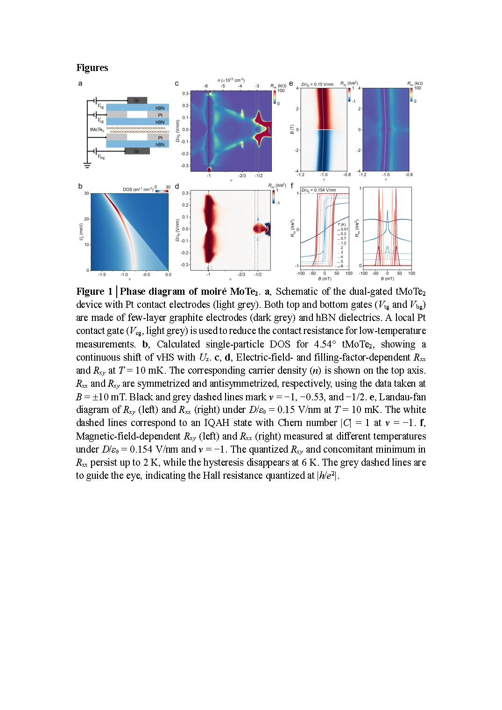
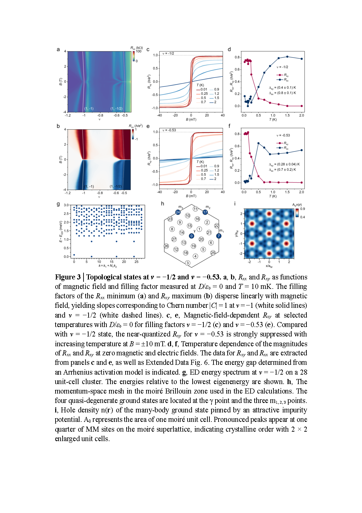
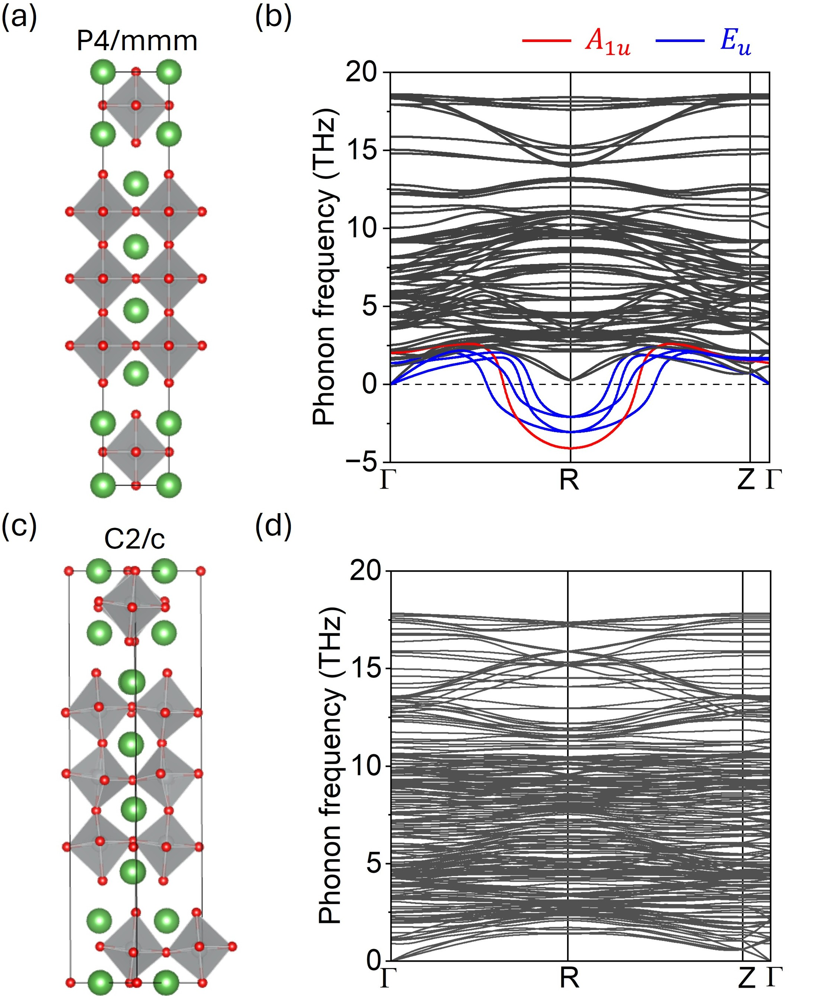
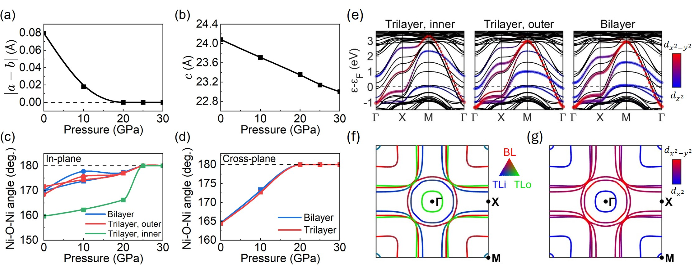
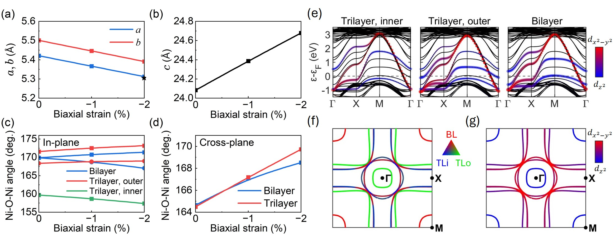
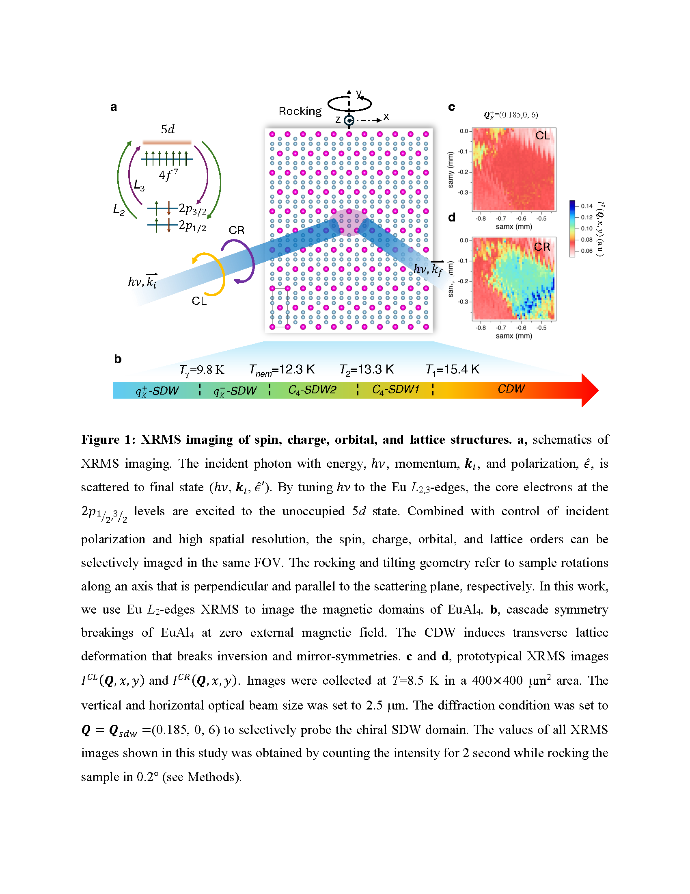
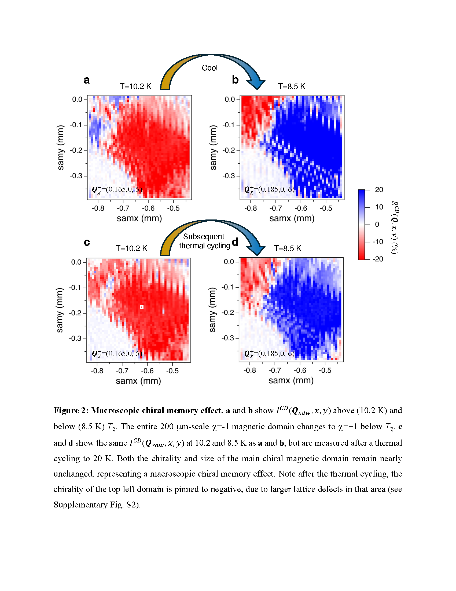
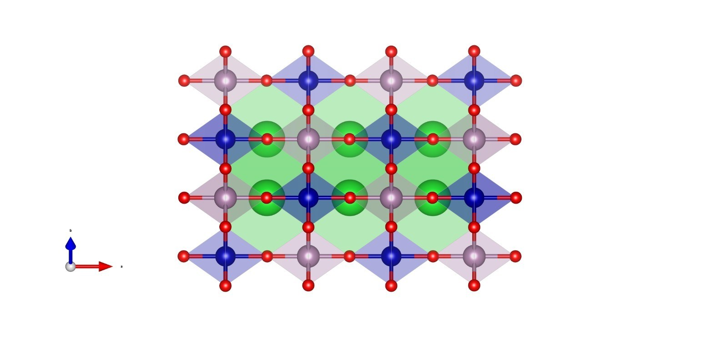
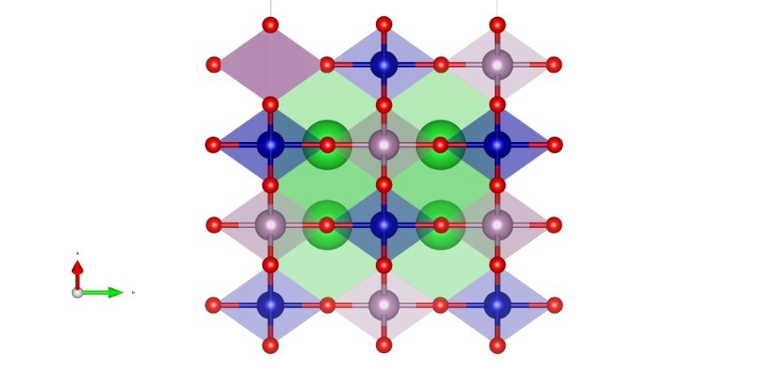
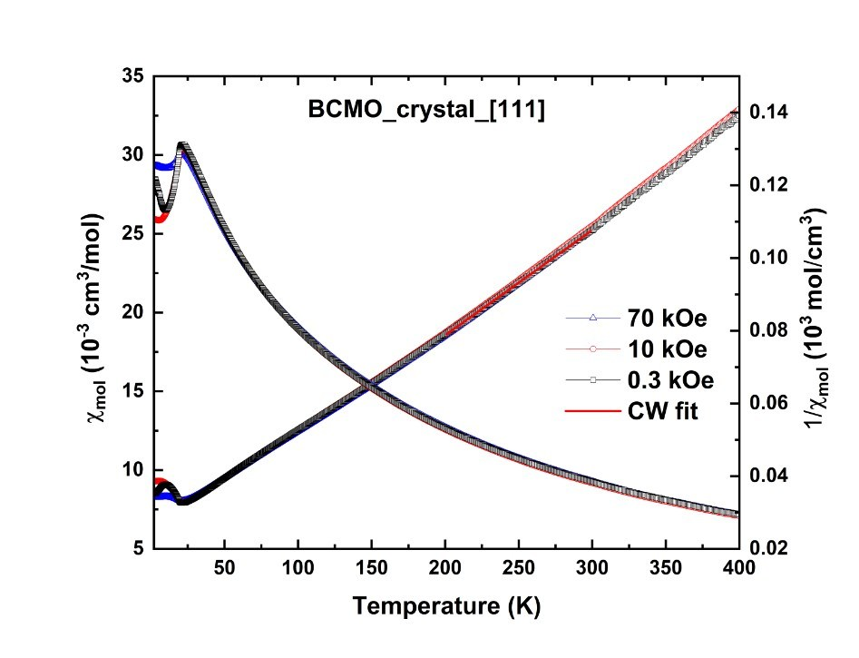

# arXivダイジェスト：量子マテリアル×材料工学

**作成日：** 2026年3月19日  
**対象期間：** 2026年3月16〜17日（過去72時間の新着）

---

# 選定論文一覧

| # | arXiv ID | タイトル | 種別 |
|---|----------|---------|------|
| 1 | [2603.16115](https://arxiv.org/abs/2603.16115) | Stoichiometric FeTe is a Superconductor | 重点 |
| 2 | [2603.16828](https://arxiv.org/abs/2603.16828) | Majorana Crystal in Rhombohedral Graphene | 重点 |
| 3 | [2603.15915](https://arxiv.org/abs/2603.15915) | Anomalous Thermal Transport Reveals Weak First-Order Melting of Charge Density Waves in 2H-TaSe2 | 重点 |
| 4 | [2603.16374](https://arxiv.org/abs/2603.16374) | Observation of a Reconstructed Chern Insulator in Twisted Bilayer MoTe2 | 簡潔 |
| 5 | [2603.16072](https://arxiv.org/abs/2603.16072) | Pressure and strain tuning of the alternating bilayer-trilayer Ruddlesden-Popper nickelate | 簡潔 |
| 6 | [2603.15793](https://arxiv.org/abs/2603.15793) | Magnetic Imaging of Macroscopic Spin Chirality Flipping | 簡潔 |
| 7 | [2603.15443](https://arxiv.org/abs/2603.15443) | Observation of two-component exciton condensates in an excitonic insulator | 簡潔 |
| 8 | [2603.16477](https://arxiv.org/abs/2603.16477) | Anharmonicity Driven by Vacancy Ordering Unlocks High-performance Thermoelectric Conversion in Defective Chalcopyrites | 簡潔 |
| 9 | [2603.15485](https://arxiv.org/abs/2603.15485) | Single-Crystal Growth and Magnetic, Electronic Properties of the FCC Antiferromagnet Ba₂CoMoO₆ | 簡潔 |
| 10 | [2603.15225](https://arxiv.org/abs/2603.15225) | Nanoscale electronic variations in altermagnetic α-MnTe | 簡潔 |

---

# 第一部：重点論文の詳細解説

---

# 重点論文 1

## 1. 論文情報

**タイトル：** [Stoichiometric FeTe is a Superconductor](https://arxiv.org/abs/2603.16115)  
**著者：** Zi-Jie Yan, Zihao Wang, Bing Xia, Stephen Paolini, Ying-Ting Chan, Nikalabh Dihingia, Hongtao Rong, Pu Xiao, Kalana D. Halanayake, Jiatao Song, Veer Gowda, Danielle Reifsnyder Hickey, Weida Wu, Jiabin Yu, Peter J. Hirschfeld, Cui-Zu Chang  
**arXiv ID：** 2603.16115  
**カテゴリ：** cond-mat.supr-con, cond-mat.mes-hall, cond-mat.mtrl-sci  
**公開日：** 2026年3月17日  
**論文タイプ：** 実験論文（MBE成長・STM/STS・輸送測定・磁気応答）  
**ライセンス：** arXiv 非独占的配布ライセンス（原図抽出不可）

---

## 2. どんな研究か

鉄系超伝導体FeSe/FeTeファミリーにおいて、FeTe は長らく超伝導を示さない反強磁性金属と見なされてきた。本研究は分子線エピタキシー（MBE）で成長したFeTe薄膜にTeフラックス下アニールを施すことで、格子間（interstitial）Fe原子を除去し化学量論比を1:1に制御することに成功した。その結果、化学量論的FeTe薄膜が反強磁性秩序を持たず、臨界温度約13.5 Kの堅牢な超伝導を示すことを、クーパー対トンネル・ゼロ電気抵抗・マイスナー効果という三つの独立した手法で確認した。この結果は鉄系超伝導の基礎理解と、FeTe系ヘテロ構造を用いたトポロジカル超伝導デバイス研究に根本的な再解釈を迫るものである。

---

## 3. 研究の概要

**背景と目的**

鉄系超伝導体（Fe-SC）は、複数の電子バンドと強い反強磁性（AFM）相関が競合する系として、超伝導機構解明の最前線に位置してきた。その中でFeSe薄膜・FeTe(Se)系は、基板との界面やヘテロ接合を通じたトポロジカル超伝導の実現が議論されてきたが、FeTe単体は常に「超伝導を示さないAFM金属」として扱われ、その原因の解明は未完のままだった。本研究はこの「FeTe＝AFM金属」という長年の定説に直接挑むものである。

**解こうとしている物理問題**

なぜFeSe（Tc ≈ 9 K, バルク）は超伝導を示し、同じ構造のFeTe は示さないのか。FeTe に超伝導がない原因は物質固有の電子構造にあるのか、それとも試料に必ず存在する格子間Fe（interstitial Fe, Fe_int）という欠陥に由来するのか。

**対象材料系**

FeTe薄膜。PbTe(111)基板上にMBE法で成長。Fe_int が ideal 1:1 FeTeを乱す主要な点欠陥として機能している系。

**材料創製法・構造制御法**

MBEにより as-grown FeTe薄膜を作製後、Teフラックス下でアニール処理（Te annealing）を実施。Teフラックスにより、格子間サイト（Teより上の面外位置）に占有されていた過剰Fe原子が選択的に除去されることで、Fe:Te ≈ 1:1 の化学量論比が実現される。

**主な測定手法**

- スピン偏極走査型トンネル顕微鏡・分光法（SP-STM/STS）：AFM秩序の有無と超伝導ギャップの実空間観察
- クーパー対トンネリング（Josephson効果）：超伝導コヒーレンスの直接証拠
- 電気輸送測定（四端子法）：ゼロ電気抵抗の確認
- 走査型SQUID顕微鏡：マイスナー効果（完全反磁性）の確認

**主な結果**

as-grown薄膜ではbicollinear AFM秩序が観察され、Fe_int が磁性秩序の起源であることをSP-STMで直接示した。Te アニール後の化学量論的FeTe薄膜ではAFM秩序は消失し、Tc ≈ 13.5 Kの超伝導が出現。超伝導ギャップはSTSで確認され（ゼロバイアスコンダクタンス抑制）、Josephson効果によるクーパー対トンネリング、四端子輸送のゼロ抵抗、走査SQUID によるマイスナー信号がすべて一致した。

**著者の主張**

化学量論的FeTe は本来的に超伝導体であり、「FeTe＝AFM金属」という定説はFe_int による人工的な偽像である。Fe_int を除去することで反強磁性と超伝導の競合が解決される。この知見はFeTe系ヘテロ構造（FeTe/Bi₂Te₃など）における超伝導の起源解釈を抜本的に変える。

---

## 4. 量子物性・材料工学として重要なポイント

本研究が扱う中心的な量子自由度は電子スピン（磁性）と電荷（超伝導）であり、両者の競合は鉄系超伝導の本質問題に直結する。材料学的に最も重要な知見は、「格子間Fe原子（点欠陥）が反強磁性秩序を誘起し超伝導を抑制する」という欠陥支配的な相競合の実証である。従来の電子構造計算ではFeTe のバンド構造自体が超伝導と相性が悪いと議論されてきたが、本実験は欠陥除去だけで超伝導が発現することを示し、FeTe の固有電子状態が超伝導に適合的であることを確認した。SP-STMは欠陥と磁性の実空間相関を原子分解能で捉え、走査SQUID は巨視的なマイスナー応答を可視化しており、局所的な量子状態観察と巨視的機能評価の橋渡しが見事に機能している。材料工学的には、Teアニールという比較的単純なプロセスウィンドウが化学量論比制御に有効であることが示された点が重要で、薄膜成長・アニール条件の最適化だけで量子基底状態を切り替えられるという設計指針が得られた。FeTe/トポロジカル絶縁体ヘテロ接合系のトポロジカル超伝導研究において、界面での超伝導誘起の起源として「Fe_int が引き起こす局所AFM」の寄与を見直す必要が生じており、材料設計上の示唆は広範である。

---

## 5. 限界と注意点

本研究はPbTe(111)基板上の特定膜厚のMBE薄膜系における結果であり、基板依存性（界面電荷移動・歪み）が超伝導Tc に与える影響は明示的に切り分けられていない。化学量論比の定量的評価（Fe:Te 比の数値）が直接示されておらず、「化学量論的」の達成度はSTM画像上のFe_int 密度の減少から間接的に議論されている点は今後の課題である。Teアニール後の試料でも残留Fe_int が局所的に存在する可能性があり、均一な超伝導秩序が確立されているかどうかは空間分解STS のより広域マッピングで検証が必要である。Tc ≈ 13.5 Kは他の鉄系超伝導体（LaFeAsO: 26 K, FeSe/SrTiO₃: 65 K）と比べて低いが、これがFeTe固有のバンド構造によるものか、残留欠陥の影響かは未分離である。バルク単結晶での再現性はまだ示されておらず、薄膜特有の効果（表面・界面超伝導の寄与）を排除するためにも、より厚い薄膜または単結晶系での確認が望まれる。

---

## 6. 関連研究との比較

鉄系超伝導の文脈では、FeSe の超薄膜（1 UC/SrTiO₃）が55〜65 K という高い界面超伝導Tc を示すことが発見され（Wang et al. 2012）、FeTe(Se) ヘテロ構造を用いたトポロジカル超伝導実現（He et al. 2017）が報告されてきた。それらの研究で「基板にしかすぎない」と見なされてきたFeTe自体に本来の超伝導性があったとする本研究の主張は、過去10年間の多くの実験解釈を再検討させるインパクトを持つ。先行研究では表面のFeTe層の超伝導誘起をFeSe層からの近接効果で説明していたが、本研究はFeTe自体の固有超伝導性が見落とされていた可能性を示唆する。同時期には化学的ドーピングによるFeTe1-xSex の超伝導制御が精力的に研究されているが、本研究はドーピングなしに純粋な化学量論制御のみで超伝導を実現した点で独自性が高い。欠陥制御による相制御（AFM↔SC）という観点では、FeSe₁₋ₓSₓ での圧力誘起相転移研究や、LaFeAs(O,F)の置換効果研究と方向性を共有するが、単一材料系での「欠陥が全てを支配する」という直接証拠としては際立っている。今後はバルク単結晶での実証、Fe_int 濃度の精密制御（例：イオン照射や分子線比の調整）と Tcの相関マッピング、そしてFeTe のフェルミ面トポロジーと超伝導ギャップ構造の詳細分光が期待される。

---

## 7. 重要キーワードの解説

**1. 格子間Fe（Interstitial Fe, Fe_int）**  
FeTe結晶において、理想的な1:1 FeTeの結晶構造でFe原子が占有すべきサイト以外の位置（TeとTeの間の空間的な「空き」）にFe原子が入り込んだ点欠陥。Fe_int は局在した局所磁気モーメントを持ち、周囲の電子系と強く相互作用して長距離反強磁性秩序を誘起する。Fe_int の密度は成長条件（Fe:Te フラックス比、基板温度）に敏感であり、材料設計上の主要なコントロールパラメータである。

**2. 分子線エピタキシー（MBE）**  
超高真空中で各元素の蒸発源（セル）から分子線を基板上に照射し、単原子層ずつ結晶薄膜を成長させる手法。化学量論比の高精度制御が可能で、Fe_int のような点欠陥密度を成長条件で系統的に変化させることができる。本研究ではFe:Teフラックス比の調整とポスト成長Teアニールにより化学量論比最適化を達成した。

**3. bicollinear 反強磁性**  
FeTe に特徴的な磁気秩序。隣接する強磁性鎖がπ/2回転した反平行配列を取る「bicollinear（二色線型）」パターン。波数ベクトル **Q** = (π/2, π/2) の spin-density wave。Fe_int による超交換相互作用の変調がこの特殊な磁気構造を安定化させる。通常のネール型AFM（Q = (π, π)）とは異なり、FeTe固有の構造を持つ。

**4. クーパー対トンネリング（Josephson効果）**  
超伝導体/絶縁体/超伝導体（SIS）接合において、電圧ゼロのまま有限の超伝導電流（ジョセフソン電流）が流れる現象。STSの文脈では、超伝導探針（Nb先端）と超伝導試料の間の真空ギャップをトンネル接合として機能させ、クーパー対のコヒーレントトンネルが観測されることで試料の超伝導性を確認する。単なる超伝導ギャップ観察よりも強い証拠となる。

**5. マイスナー効果**  
超伝導体の基本的な巨視的性質のひとつ。臨界温度以下で超伝導体内部の磁束が完全に排除される現象（完全反磁性）。走査型SQUIDによってサンプル表面近傍の局所磁束密度を空間分解測定することで、薄膜の超伝導性とその空間均一性を確認できる。単なる輸送測定のゼロ抵抗よりも「超伝導の完全性」を評価する上で重要な証拠である。

**6. 相競合（AFM vs 超伝導）**  
鉄系超伝導体において反強磁性秩序と超伝導秩序が近接したパラメータ領域で競合する現象。一般に両者は同一電子を共有しながら異なる秩序形成を目指すため、どちらかが優位になると他方が抑制される。FeTe系ではFe_int の局所磁気モーメントが反強磁性を安定化させ、超伝導の発現を妨げる。Fe_int 除去により超伝導が「解放」されることは、両秩序がFeTe の電子状態の中で近接エネルギーで競合していることを示す。

**7. スピン偏極STM/STS（SP-STM）**  
先端を磁化した強磁性探針（またはスピン偏極探針）を用いるSTMで、試料のスピン（磁気）構造を原子レベルで可視化する手法。磁気コントラストを持つSTS像（dI/dV マップ）から、反強磁性ドメイン・磁気秩序波長・スピン偏極局所状態密度を実空間で取得できる。FeTe のbicollinear AFMのドメイン構造や、Fe_int 近傍の局所磁気秩序の乱れを可視化するのに用いられた。

**8. 化学量論比制御**  
材料構成元素の原子数比を理想値（FeTe では Fe:Te = 1:1）に精密に合わせる材料設計技術。MBEでは各元素のフラックス比をQCM（水晶振動子マイクロバランス）やRHEED振動で監視しながら調整する。本研究ではアニール処理（Te flux 下での高温処理）という後処理技術が、成長後の化学量論比修正手段として有効であることを示した。欠陥工学的観点では、「欠陥を作らない」だけでなく「作られた欠陥を除く」手法の価値を示す事例である。

**9. 近接効果（Proximity Effect）**  
超伝導体と非超伝導体（常伝導金属・半導体・トポロジカル絶縁体）が接触するとき、クーパー対が非超伝導体側に漏れ込み、その領域でも超伝導的な性質が誘起される現象。FeTe/Bi₂Te₃ 系では、Fe(Te,Se)の超伝導がBi₂Te₃ のトポロジカル表面状態に近接効果を与え、トポロジカル超伝導を実現するとされてきた。本研究の示唆では、FeTe自体が超伝導体であるため、従来のヘテロ接合系での超伝導誘起の解釈に「FeTe 自身の固有超伝導性」という新たな寄与を加える必要が生じる。

**10. 欠陥制御（Defect Engineering）**  
材料中の点欠陥・空孔・格子間原子・置換原子などを意図的に制御することで、物理的・化学的性質を設計する材料工学的アプローチ。本研究ではFe_int という特定の点欠陥が磁性と超伝導の相競合を支配することが実証され、「欠陥密度を制御することで量子基底状態（AFM or SC）を切り替える」という設計指針が得られた。酸化物薄膜での酸素欠陥制御やペロブスカイトでのカチオン空孔制御と並ぶ、量子マテリアルにおける欠陥工学の好例である。

---

## 8. 図

ライセンスが arXiv 非独占的配布ライセンスのため、原図の抽出・掲載は行わない。

---

# 重点論文 2

## 1. 論文情報

**タイトル：** [Majorana Crystal in Rhombohedral Graphene](https://arxiv.org/abs/2603.16828)  
**著者：** Chiho Yoon, Fan Zhang  
**arXiv ID：** 2603.16828  
**カテゴリ：** cond-mat.mes-hall, cond-mat.str-el, cond-mat.supr-con  
**公開日：** 2026年3月17日  
**論文タイプ：** 理論論文（トポロジカル超伝導・マヨラナ結晶の解析）  
**ライセンス：** arXiv 非独占的配布ライセンス（原図抽出不可）

---

## 2. どんな研究か

菱面体（rhombohedral）積層グラフェンで最近発見されたスピン・バレー偏極した「四分の一金属（quarter-metal）」状態から生じる非従来型超伝導相について、その位相的性質を理論的に解明した研究である。イントラバレーカイラル対密度波（pair-density wave; PDW）状態がゲージ変換によって通常のカイラルトポロジカル超伝導体と等価であることを証明し、さらに二重ハニカム格子上に「マヨラナ結晶」を形成することを示した。これにより、ひとつのモアレ系の中に超伝導・磁性・トポロジー・分数化という四つの量子現象が統合された理論的枠組みが与えられた。

---

## 3. 研究の概要

**背景と目的**

菱面体積層グラフェン（RG）は、グラフェン層をABC型に積層したときに生じる系で、ファン・ホーブ特異性が強められたフラットバンド的電子構造を持ち、強相関効果が現れやすい。近年の実験では、スピン・バレーが完全に偏極した「四分の一金属（quarter-metal）」状態から超伝導が出現することが報告されたが、その超伝導の位相的性質（トポロジー）や、通常のカイラルトポロジカル超伝導（Chern数 ±1）との関係が未解明のまま残っていた。特に、イントラバレーペアリングに伴う「Fulde-Ferrell（FF）型」の位相因子の役割が見落とされてきた。

**解こうとしている物理問題**

RGにおけるイントラバレーカイラルPDWは、通常のゼロ運動量ペアリング（BCS型）とどう違うのか。その位相的性質（チャーン数、エッジ状態、マヨラナ束縛状態）はどのように現れるか。

**対象材料系**

菱面体積層グラフェン（4層・5層・6層 RG）。実験ではゲート電圧と変位電場でキャリア密度・バレー偏極度を独立に調整できる。

**理論手法**

- ボゴリューボフ-ド・ジェンヌ（BdG）ハミルトニアンの解析
- ゲージ変換（PDW ↔ ゼロ運動量ペアリングの等価性の証明）
- ハルデンモデル類似の最小マヨラナ結晶モデル構築
- 対称性解析（C₃z, 時間反転対称性の破れ）
- トポロジカル不変量（チャーン数）の計算

**主な結果**

BdGハミルトニアンへのゲージ変換を適用することで、イントラバレーカイラルPDW状態が、三角格子上の通常のカイラルp波超伝導体と等価であることが厳密に示された。同時に、この変換後の系では渦糸・反渦糸の格子（ボルテックス-反ボルテックス格子）が自然に生成され、各渦糸に一つずつのマヨラナ束縛状態（MBS）が局在する。このMBSの集合がハニカム格子上で「マヨラナ結晶」を形成し、その低エネルギー有効モデルがハルデンモデル（複素ホッピング＋ゼロのスタガードポテンシャル）に対応することが示された。位相図には直接ギャップ相（チャーン数 ±1、カイラルマヨラナエッジ状態あり）、ディラックマヨラナ半金属相、自明ギャップ相が存在する。

**著者の主張**

菱面体グラフェンにおける実験観測されたquarter-metal超伝導は、トポロジカル超伝導＋マヨラナ結晶の複合体であり、マヨラナ量子計算の新しいプラットフォームを提供する可能性がある。

---

## 4. 量子物性・材料工学として重要なポイント

本研究が扱う量子自由度はバレー（K/K'の自由度）・スピン・超伝導位相の三者の絡み合いであり、これらがモアレ超格子の幾何学（菱面体積層秩序）によって強化される点が材料工学的に重要な設計因子となっている。ゲージ変換によるPDW ↔ 通常SC の等価性の証明は単なる数学的再表示ではなく、FF型位相因子が渦糸-反渦糸格子という実空間構造を自然に生成することを示した点で物理的含意が深い。マヨラナ結晶とハルデンモデルの対応は、トポロジカル超伝導の「材料設計語彙」（ホッピング比、スタガードポテンシャル）で制御できる量子相を与えており、今後の理論・実験両面での設計指針として機能する。材料工学的には、菱面体積層グラフェンという「積層制御」が量子相の実現に本質的な役割を果たしており、层数・積層角度・ゲート電圧（変位電場）の三パラメータ空間での量子相図の探索が今後の中心的課題となる。先行するABC型積層グラフェンの理論研究と比べ、マヨラナ結晶という概念の導入により「空間的に周期配列したMBS」という新しい量子固体状態の存在が予言されたことは、量子情報材料設計への明確な展望を与える。

---

## 5. 限界と注意点

本研究は純粋な理論研究であり、提案されたマヨラナ結晶の実験的証拠はまだ存在しない。特に、実際のRG実験では試料の不均一性（ひずみ、基板の乱れ、残留不純物）がモアレバンドに与える影響は理論モデルに含まれておらず、マヨラナ結晶の秩序が実験系でどの程度安定に実現するかは未解明である。また、quarter-metal状態からの超伝導がインコヒーレントなPDWか、コヒーレントなゼロ運動量ペアリングかを実験的に区別するには、位相コヒーレンス長・渦糸構造の直接観察が必要であり、現時点では間接的な輸送・容量測定のみによる判断に留まる。さらに、マヨラナ結晶のトポロジカルな安定性は電子間相互作用や温度揺らぎに対してどの程度ロバストかが定量化されておらず、実用的なマヨラナ量子計算への応用可能性は現時点で定性的な提案に留まる。

---

## 6. 関連研究との比較

モアレグラフェン系のトポロジカル超伝導研究としては、マジック角ツイスト2層グラフェン（MATBG）での超伝導発見（Cao et al. 2018）が出発点であるが、RGはMATBGと異なり積層秩序（菱面体 vs AB）が量子相の多様性を決定する新たな自由度として認識されてきた。Fulde-Ferrell型ペアリングとトポロジカル超伝導の統合という理論的枠組みは、FeSeや人工的に作られた近接効果系でのトポロジカル超伝導研究と接続する視点を持つ。マヨラナ結晶という概念は先行するKitaev鎖・トポロジカルSC薄膜でのMBS研究を空間的に拡張するものであり、ひとつの材料系内での「マヨラナ固体」の実現という点では極めて新規性が高い。同時期にはRGでのスピン液体的相関が報告されており（Mao et al. 2025）、マヨラナ結晶と近接する量子相との競合や共存が今後の理論的課題となる。実験的な検証手段としては、局所状態密度マッピング（STM）による渦糸内マヨラナ状態の直接観察、熱伝導率の量子化（マヨラナエッジ状態の証拠）、量子点接触でのゼロバイアスコンダクタンスピークなどが候補として考えられる。

---

## 7. 重要キーワードの解説

**1. 菱面体積層グラフェン（Rhombohedral Graphene, RG）**  
グラフェン層をABC型積層（各層が直前の層に対してA, B, C位置にずれる）にした多層グラフェン。AB型（Bernal）積層と異なり、ABC積層では表面付近に「フラットバンド」に近い平坦なバンドが出現し、電子間相互作用が増強される。4層・5層・6層 RGが実験的に最もよく研究されており、相互作用によるコルビリニアAFM、強磁性、モット絶縁体、超伝導など豊富な量子相が観測されている。

**2. 四分の一金属（Quarter-metal）**  
スピン（↑/↓）とバレー（K/K'）の4重縮退を持つRGにおいて、4つのフレーバーのうち1つだけが部分的に占有された状態。つまりスピンおよびバレーの両方が完全に偏極している金属状態を指す。分数的な量子ホール状態の類似として理解でき、強い相互作用によって初めて安定化する電子状態。このquarter-metal状態から超伝導が発現することが最近の実験で報告された。

**3. ペアリング密度波（Pair Density Wave, PDW）**  
クーパー対の中心運動量がゼロでなく有限の値を持つ超伝導状態。空間的にクーパー対密度が変調（波）を持つ。イントラバレーPDW（片方のバレーKまたはK'内でのペアリング）はFF（Fulde-Ferrell）型と呼ばれ、位相因子 exp(i**Q**·**r**) が実空間でのクーパー対位相に刻まれる。この位相因子がゲージ変換により渦糸格子として現れることが本研究の核心的洞察である。

**4. ゲージ変換（Gauge Transformation）**  
波動関数の位相を空間的に変化させる変換で、物理量（可観測量）は不変に保たれる。本研究ではPDWのFF型位相因子 exp(i**Q**·**r**) を、ゲージ変換によって「ゼロ運動量ペアリング + 周期的な磁束パターン（渦糸-反渦糸格子）」に書き換えることができることを示した。この操作により、一見exotic に見えるPDWが、よく知られたチャーン数 ±1のカイラル超伝導体と等価であることが直ちに分かる。

**5. マヨラナ束縛状態（Majorana Bound State, MBS）**  
粒子が反粒子と等しいというマヨラナ条件を満たすフェルミオンが超伝導体の渦糸や末端に局在した状態。γ = γ† という自己共役条件を持ち、非アーベル統計に従う。量子計算への応用（トポロジカル量子ビット）が期待されている。本研究ではPDW由来の渦糸の各コアにMBSが1つ局在し、これが格子状に配列したものを「マヨラナ結晶」と定義している。

**6. マヨラナ結晶（Majorana Crystal）**  
本研究が導入した新概念。渦糸格子（vortex-antivortex lattice）の各格子点にMBSが周期的に配列した結晶状の量子状態。MBS間のホッピング（マヨラナ間の有効相互作用）がハルデンモデルのような複素ホッピング行列で記述され、全体としてトポロジカルな帯構造（チャーン数 ±1）を持つ。6種類のMBSが空間位相構造の違いで区別される。

**7. ハルデンモデル（Haldane Model）**  
Haldane (1988) が提案した、ハニカム格子上の格子模型で、外部磁場なしにトポロジカル非自明なバンド構造（チャーン数 ±1）を持つ最初の例。次近接ホッピングに複素位相（時間反転対称性を破る磁束）を与えることで実現される。本研究ではマヨラナ結晶の有効ハミルトニアンが「虚数ホッピング・ゼロのスタガードポテンシャル」を持つハルデンモデルに対応することが示された。

**8. チャーン数（Chern Number）**  
ブリルアンゾーン全体にわたるベリー曲率の積分値として定義されるトポロジカル不変量。C = (1/2π)∫BZ Ωk d²k。C ≠ 0 の場合、バルクバンドギャップが開いていても試料端にカイラルエッジ状態が存在する（バルク-エッジ対応）。本研究ではマヨラナ結晶のチャーン数が ±1 となるパラメータ領域が位相図上に同定され、その境界でマヨラナ半金属（ディラックマヨラナ）転移が生じる。

**9. カイラルトポロジカル超伝導体（Chiral Topological SC）**  
時間反転対称性が自発的に（または外場によって）破られた超伝導体で、チャーン数が C ≠ 0 の非自明なトポロジーを持つもの。その際、試料端に一方向のみに伝播するカイラルマヨラナエッジモードが現れる。p + ip型の超伝導秩序パラメータを持ち、空間反転対称性の破れと合わせてRGのような時間反転+反転が破れた系で自然に実現しうる。

**10. バレー自由度（Valley Degree of Freedom）**  
グラフェンのバンド構造においてブリルアンゾーンのK点とK'点に存在する二つの独立なディラック錐に対応する量子数。スピンと同様に擬スピンとして扱われ、バレー磁気モーメント（Berry 位相に由来）を持つ。RGではゲート電場でバレー偏極度を制御でき、量子相（バレー強磁性・バレー偏極超伝導・quarter-metal）を調整する材料設計パラメータとなる。

---

## 8. 図

ライセンスが arXiv 非独占的配布ライセンスのため、原図の抽出・掲載は行わない。

---

# 重点論文 3

## 1. 論文情報

**タイトル：** [Anomalous Thermal Transport Reveals Weak First-Order Melting of Charge Density Waves in 2H-TaSe2](https://arxiv.org/abs/2603.15915)  
**著者：** Han Huang, Jinghang Dai, Joyce Christiansen-Salameh, Jiyoung Kim, Samual Kielar, Desheng Ma, Noah Schinitzer, Danrui Ni, Gustavo Alvarez, Chen Li, Carla Slebodnick, Mario Medina, Bilal Azhar, Ahmet Alatas, Robert Cava, David Muller, Zhiting Tian  
**arXiv ID：** 2603.15915  
**カテゴリ：** cond-mat.str-el, cond-mat.mes-hall, cond-mat.mtrl-sci  
**公開日：** 2026年3月16日  
**論文タイプ：** 実験論文（熱輸送・電子線回折・X線回折・現象論モデル）  
**ライセンス：** arXiv 非独占的配布ライセンス（原図抽出不可）

---

## 2. どんな研究か

層状遷移金属ダイカルコゲナイド2H-TaSe₂における電荷密度波（CDW）相転移の性質を、熱輸送測定という新しい視点から解明した研究である。CDW転移温度（Tc ≈ 122 K）付近で、通常のフォノン-フォノン散乱では説明できない「V字型」の熱伝導率温度依存性が観測され、これがCDW局所相関（短距離CDW揺らぎ）によるフォノン散乱に起源することを現象論モデルと回折実験の組み合わせで示した。電子線回折とX線回折により、短距離周期格子歪み（CDW相関）が転移温度をはるかに超えた300 K まで持続すること、およびCDW波数ベクトルに熱ヒステリシスがあることを見出し、CDW融解が転位・揺らぎ駆動の弱い一次転移であることを確立した。

---

## 3. 研究の概要

**背景と目的**

低次元量子材料（2D・準2D）における秩序相の融解メカニズムは未解決の重要問題である。電荷密度波は多くの遷移金属ダイカルコゲナイド（TMD）に普遍的に現れるが、その相転移が一次か二次か（あるいはKTB型か）は系統的に理解されていない。特に「CDW融解」では、電荷中性の揺らぎ（動的CDW相関）が関与するため、電気輸送測定では検出が難しく、これまで直接的な証拠が乏しかった。

**解こうとしている物理問題**

2H-TaSe₂のCDW相転移は真の意味で何次相転移なのか。CDW揺らぎが転移温度を超えて持続するとすれば、それは熱輸送にどのように現れるか。

**対象材料系**

2H-TaSe₂：六方晶系の層状TMD。Tc ≈ 122 K以下で波数 **Q** = (1/3, 0, 0) 方向の不整合CDWを形成。完全な整合CDWは ~90 K以下。ファン・ホーブ特異性に起因するネスティングが電子構造的なCDW駆動力として議論されてきたが、揺らぎの役割は不明だった。

**材料創製法**

高品質バルク単結晶をブリッジマン法などで作製（Robert Cavaグループの結晶）。機械的劈開により清浄な表面を持つ薄板サンプルを作製。

**主な測定手法・理論手法**

- 定常法熱伝導率測定（κ(T)）：CDW転移付近の精密温度依存性
- 電子線回折（TEM/ED）：短距離周期格子歪みの実空間・逆空間観察（~300 Kまで）
- X線回折（IXS/シンクロトロン）：CDW波数ベクトルの温度依存性とヒステリシス測定
- 現象論モデル：CDW揺らぎの空間相関長とフォノン-CDW散乱率の接続モデル

**主な結果**

CDW転移付近（~100–140 K）で、熱伝導率が転移を挟んでV字型の温度依存性を示した。このV字型は通常のフォノン-フォノンUmklapp散乱（κ ∝ T⁻ⁿ）では全く説明できない。電子線回折では、300 Kという転移温度をはるかに超えた温度まで短距離CDW相関（diffuse scattering）が持続することが観察された。X線回折ではCDW波数ベクトルが加熱・冷却サイクルで熱ヒステリシスを示し、一次相転移的な振る舞いを示唆した。現象論モデルでは、CDW局所相関が空間的に持続したままフォノンを強く散乱することで熱伝導率が抑制されることを定式化し、実験データと良好に一致させた。

**著者の主張**

2H-TaSe₂のCDW相転移は弱い一次相転移であり、転位（dislocation）と揺らぎ（fluctuation）によって駆動されるCDW融解描像が妥当である。熱輸送は電子線・X線回折より高感度でCDW揺らぎを捉える新しいプローブとして有効であることが示された。

---

## 4. 量子物性・材料工学として重要なポイント

本研究が扱う中心的な量子自由度は格子（フォノン）と電荷（CDW秩序）の結合であり、CDW相関長という「構造的」な秩序のゆらぎが熱輸送という「エネルギー輸送」という巨視的機能に直結していることを示した点が最も重要な材料工学的成果である。CDW揺らぎによるフォノン散乱は、単純なUmklapp散乱や欠陥散乱（κ ∝ T⁻¹ または T⁰）とは本質的に異なる非単調なκ(T)を生じさせ、この特徴的V字型シグネチャが「CDW揺らぎの温度領域」を広温度域にわたって識別する指標となることが示された。測定手法の観点では、従来CDW研究で主役だった電気抵抗や帯磁率より熱輸送がCDW揺らぎに鋭敏であるという新しい方法論的知見が得られた点が重要であり、他のTMD系（2H-NbSe₂, 1T-TaS₂, TiSe₂など）のCDW相転移性質の再評価につながる可能性がある。材料設計の観点からは、CDW揺らぎが熱伝導率を大きく抑制することは「CDW揺らぎを利用した熱電材料」の設計に示唆を与えうる（揺らぎ制御による格子熱伝導率の選択的抑制）。また、弱い一次転移という知見は、厚さ・歪み・ドーピングによる転移次数の変化（例：2D極限での相転移の性質変化）を議論する際の基準を提供する。

---

## 5. 限界と注意点

本研究の中心的結論であるV字型κ(T)とCDW揺らぎの接続は現象論的モデルによるものであり、第一原理的な計算や微視的なフォノン-CDW散乱機構の厳密な導出はなされていない。具体的には、CDW相関長の温度依存性と散乱率の関係を仮定したモデルが使用されており、その仮定の一意性は不明である。電子線回折による短距離CDW相関の観察では、観察された拡散散乱が熱的な原子変位（thermal diffuse scattering）によるものか、真のCDW短距離秩序によるものかを完全に分離できているかが重要な点であり、詳細な解析が必要である。また、ヒステリシスの大きさは試料依存性（不純物・積層欠陥・端面の影響）が考えられ、使用した単結晶の品質指標（残留抵抗比等）の明示がない場合は一次転移性の定量的議論が難しい。熱輸送のV字型が他の機構（例：電子-フォノン相互作用の変化、磁気秩序との競合）では説明できないことをより系統的に排除する必要がある。

---

## 6. 関連研究との比較

TMDにおけるCDW研究の文脈では、1T-TaS₂の複雑なCDW相構造（IC→NC→C転移）や、2H-NbSe₂における超伝導とCDWの競合が集中的に研究されてきた。2H-TaSe₂のCDW転移次数については、比熱や電子回折の先行研究で議論が割れており（連続転移 vs 弱一次転移）、本研究は熱輸送という独立した手段から「弱い一次転移」を支持する新たな根拠を加えた。CDW揺らぎが転移温度をはるかに超えて持続する傾向は、TiSe₂（Tc ≈ 200 K、電子-フォノン連成CDW）や1T-TiSe₂でも報告されており、普遍的なTMD-CDWの特徴として位置づけられる。方法論的には、熱輸送をCDW揺らぎのプローブとして用いるアイデアは新規性が高く、類似手法（フォノン分散の非弾性X線散乱との組み合わせ）による検証が今後期待される。モアレ系や2D TMDでの超薄膜（単層・二層）における熱輸送測定との比較は、低次元化によるCDW変化（KTB型転移への変化など）を追うための自然な次のステップとなる。

---

## 7. 重要キーワードの解説

**1. 電荷密度波（Charge Density Wave, CDW）**  
フェルミ面のネスティング（特定の波数 **Q** でフェルミ面が互いに重なる幾何学的条件）や電子-フォノン相互作用によって、電子密度が空間的に周期変調した秩序状態。CDW形成に伴い格子変位（PLD: Periodic Lattice Distortion）も発生する。エネルギーギャップがフェルミ面の一部に開き、電子状態密度・輸送特性が変化する。波数 **Q**、転移温度、次数（整合/不整合）が材料によって多様に変化する。

**2. V字型熱伝導率（V-shaped thermal conductivity）**  
本研究で観測された、CDW転移温度 Tc を頂点としてその上下で熱伝導率が減少・増加するV字型の温度依存性。通常のフォノン熱伝導率はU（Umklapp）散乱支配でκ ∝ T⁻ⁿ と単調减少するため、このV字型は過剰なフォノン散乱機構（CDW揺らぎ）が転移近傍で活性化することを示す。CDW揺らぎを介したフォノン散乱の温度依存性に対応する形でモデル化される。

**3. 短距離CDW相関（Short-range CDW correlations）**  
CDWの長距離秩序（全系が位相コヒーレントな変調構造を持つ状態）が失われた後でも、局所的にCDW的な電子密度変調・格子変位が短距離に保たれた「揺らぎ」的状態。逆空間の拡散散乱（diffuse scattering）として観測される。転移温度Tcを超えて高温側でも短距離CDW相関が存在することは、転移が真の意味で秩序↔無秩序の急峻な境界ではないことを示す。

**4. 弱い一次転移（Weak First-Order Transition）**  
一次相転移の特徴（潜熱、ヒステリシス、相共存）を持ちながら、その大きさが非常に小さい転移。二次転移との区別が困難なほど揺らぎが大きく、秩序パラメータの不連続が実験的に分解しにくい場合がある。本研究では、CDW波数ベクトルのヒステリシス（加熱時と冷却時の差）がこの一次性の証拠として示された。

**5. 転位駆動融解（Dislocation-driven Melting）**  
2D系または準2D系において、格子・密度波・渦糸格子などの周期的秩序が、転位（Dislocation）と呼ばれる位相欠陥の対生成によって融解するメカニズム。Berezinskii-Kosterlitz-Thouless（BKT）転移の一般化として理解される。CDWにおける「CDW dislocation」は波数の位相欠陥であり、その対生成エネルギーがCDW融解温度を決定する。

**6. フォノン-CDW散乱（Phonon-CDW scattering）**  
フォノン（格子振動の量子）がCDW揺らぎ（局所的な電子密度変調・格子変位）と散乱相互作用する過程。CDW相関の空間的不均一性が有効的なフォノン散乱源となり、熱伝導率を低下させる。このメカニズムは通常の点欠陥散乱や境界散乱と異なり、CDW相関長の温度依存性と連動した特徴的な温度依存性を示す。

**7. 熱伝導率（Thermal Conductivity, κ）**  
物質内の熱流密度 **J**_Q と温度勾配 ∇T の間の比例係数（**J**_Q = -κ∇T）。結晶性材料では主にフォノンが熱伝導を担い、κ = (1/3)Cv·v·ℓ（Cv: フォノン比熱、v: 音速、ℓ: 平均自由行程）で表される。CDW揺らぎがℓを短縮させることでκが低下し、V字型の非従来的温度依存性が現れる。熱電材料ではZT = S²σT/κ（S: ゼーベック係数、σ: 電気伝導率）のκを下げることが重要であり、CDW揺らぎ制御は新たな手法論的可能性を持つ。

**8. 不整合CDW（Incommensurate CDW, IC-CDW）**  
CDWの変調波数 **Q** が格子の基本周期の有理数倍ではない状態。TaSe₂では高温側（~90–122 K）で不整合CDWが安定であり、さらに低温では整合CDW（Commensurate CDW）に転移する。不整合CDWでは「フェーゾン（phason）」と呼ばれる位相の滑り自由度が存在し、これが特異な輸送特性（sliding CDW）の起源となりうる。

**9. 熱的ヒステリシス（Thermal Hysteresis）**  
加熱過程と冷却過程で物理量（本研究ではCDW波数）が異なる値を取る現象。一次相転移の特徴的な兆候であり、エネルギー障壁を超えるのに要する過冷却・過熱が原因となる。CDW の場合、整合-不整合転移や長距離秩序の確立・消失において観測される。

**10. 拡散散乱（Diffuse Scattering）**  
X線回折・電子線回折において、格子周期に対応したブラッグピーク以外の場所に現れる散漫な強度分布。短距離秩序（局所的な原子変位・電子密度変調）に起因し、その強度・分布（幅）から相関長を定量評価できる。CDWの短距離相関の解析に使われ、転移温度以上でも局所CDW秩序が存在することを示す重要な実験証拠となる。

---

## 8. 図

ライセンスが arXiv 非独占的配布ライセンスのため、原図の抽出・掲載は行わない。

---

# 第二部：その他の重要論文

---

# 簡潔紹介論文 4

## 1. 論文情報

**タイトル：** [Observation of a Reconstructed Chern Insulator in Twisted Bilayer MoTe₂](https://arxiv.org/abs/2603.16374)  
**著者：** Min Wu, Lingxiao Li, Yunze Ouyang, Yifan Jiang, Wenxuan Qiu, Zaizhe Zhang, Zihao Huo, Qiu Yang, Ming Tian, Neng Wan, Kenji Watanabe, Takashi Taniguchi, Shiming Lei, Fengcheng Wu, Xiaobo Lu  
**arXiv ID：** 2603.16374  
**カテゴリ：** cond-mat.mes-hall  
**公開日：** 2026年3月17日  
**論文タイプ：** 実験論文（低温輸送測定）  
**ライセンス：** CC BY-NC-SA 4.0

---

## 2. 研究概要

ツイスト二層MoTe₂（tMoTe₂）は、これまで主に小さなツイスト角（4°未満）の「強相関領域」でのみ量子異常ホール効果（QAHE）・分数量子異常ホール効果（FQAHE）などが研究されてきた。本研究は約4.54°という比較的大きなツイスト角を選択し、モアレバンドがより分散的で相関が抑制された「適度相関領域」での位相的相図を電気輸送測定により系統的に明らかにした。ゲート電圧と変位電場をパラメータとして測定した縦抵抗 Rxx および横抵抗 Rxy のマップから、モアレ充填数 ν = -1 での整数量子異常ホール（IQAH）絶縁体（C = 1）を確認した。特筆すべきは、通常の小角デバイスでは観測されない充填数 ν = -0.53 と ν = -1/2 でも C = 1 のチャーン絶縁体状態が出現し、さらに ν = -2/3 では磁場印加により分数チャーン絶縁体（FCI）が絶縁体-金属転移を伴って現れることが見出された点である。これらの結果は、大角モアレ系が「強相関限界を超えた」トポロジカル相の新しい実現場として有効であり、バンド幅・トポロジー・相関のバランスを変えることで多様なトポロジカル相が生じることを示す。電場による IQAH 状態の制御（電場ゼロ近傍でのIQAH消失と電場増加による回復）という特異な振る舞いは、モアレバンドの Berry 曲率分布が変位電場で連続的に変化することに起因し、トポロジカル状態の外場制御可能性という材料設計上の重要な示唆を与える。

本研究に用いられたデバイスは、ドライ転写法による hBN/グラファイト/tMoTe₂/グラファイト/hBN のファン・デル・ワールス積層構造であり、局所コンタクトゲートにより重ドーピングと接触抵抗の低減が実現されている。測定は10 mK の希釈冷凍機中でナノアンペアオーダーの励起電流を用いて行われており、試料加熱を最小限に抑えた高精度測定である。ツイスト角の独立した較正（抵抗マップのモアレ密度解析）により4.54°が精密に決定されている点も品質保証に貢献している。

---

## 3. 重要キーワードの解説

**1. モアレ超格子（Moiré Superlattice）**  
二枚の結晶性2D材料を小さなツイスト角または格子定数差のある状態で積層したとき、両層の干渉縞として生じる長周期構造（モアレパターン）。周期は λ ≈ a/θ（θ: ツイスト角、a: 格子定数）。小さいθほど長周期となりモアレバンドが狭くなり、電子間相互作用が増強される。MoTe₂ の場合、4.54° でλ ≈ 3.6 nm 程度となる。

**2. ツイスト二層MoTe₂（tMoTe₂）**  
半導体TMD MoTe₂（バンドギャップ ~1.1 eV）の二枚をツイスト角を制御して積層したモアレ系。MoTe₂ の大きなスピン軌道結合（SOC）と時間反転対称性によって、モアレバンドにトポロジカルに非自明な Berry 曲率が自然に生じやすい。K/K' バレー磁気モーメントが大きく、自発的時間反転対称性破れを伴うQAH状態が実現しやすい材料系。

**3. 量子異常ホール効果（Quantum Anomalous Hall Effect, QAHE）**  
外部磁場なしに時間反転対称性が自発的（強磁性秩序など）または設計的（トポロジカルバンド）に破れた絶縁体系で、端に沿った散乱なしの一方向伝導（チャーンエッジ状態）が発現し、横抵抗が h/e² に量子化される現象。C = 1 の場合 Rxy = h/e² = 25.8 kΩ。本実験では量子化された Rxy とゼロの Rxx が確認された。

**4. 分数チャーン絶縁体（Fractional Chern Insulator, FCI）**  
整数チャーン数 C = 1 のバンドが分数的に占有（例：1/3、2/3充填）された状態で、電子間相互作用によって生じるトポロジカル絶縁体相。分数量子ホール効果（FQHE）のラフリン状態の格子系類似体であり、外部磁場なしに実現できる点で注目される。本実験では ν = -2/3 で磁場誘起のFCIが観測された。

**5. 充填数（Filling Factor, ν）**  
モアレ単位セル当たりの電子（または正孔）数を整数化した量。ν = -1 は1モアレ単位セル当たり1正孔（価電子バンド完全占有から1個空き）を意味する。ν = -2/3 は2/3の占有率（分数充填）。ゲート電圧によって連続的に調整でき、量子相の実現条件を走査するパラメータ。

**6. 変位電場（Displacement Field, D/ε₀）**  
tMoTe₂のように対称中心を持たない積層系（層非対称性）に垂直に加える電場。上部ゲートと下部ゲートの電圧差で制御され、層間の電荷分布を偏極させることで層対称性を破る。モアレバンドの幅・形状・Berry曲率分布が変位電場に鋭敏に依存し、トポロジカル状態の安定性（ギャップサイズ）を制御する主要パラメータ。

**7. 再構成チャーン絶縁体（Reconstructed Chern Insulator）**  
本研究のタイトルにある「再構成（reconstructed）」は、ν = -1/2 や ν = -0.53 という通常の整数充填以外の位置でC = 1のチャーン絶縁体が出現することを指す。これは、電子間相互作用によってモアレバンドの電荷密度が再分配され、ハニカム構造などの実空間超格子秩序（電荷密度波的な再構成）が形成されることで、整数充填からずれた位置でもギャップが開くと解釈される。

**8. ベリー曲率（Berry Curvature）**  
ブリルアンゾーン内の波数空間でのベリー接続の回転（Ωn(**k**) = ∇**k** × An(**k**) ）として定義されるトポロジカル量。磁場に対応する「擬磁場」として機能し、異常ホール効果の起源となる。ブリルアンゾーン全体の積分がチャーン数 C に等しい。tMoTe₂では、MoTe₂の価電子バンドの大きなSOCと層間ハイブリダイゼーションがBerry曲率を大きく集中させる。

**9. バンド幅（Band Width）**  
モアレバンドのエネルギー分散の最大値-最小値の差。バンド幅 W が小さいほど（フラットバンドに近いほど）電子間Coulomb相互作用 U との比 U/W が大きくなり、強相関効果が顕著になる。ツイスト角が大きいとバンドが分散的（W 増加）になり、U/W が減少して相関効果が弱まる。本研究は U/W が適度に小さい領域でのトポロジカル相の実現を探索した。

**10. 希釈冷凍機（Dilution Refrigerator）**  
³He/⁴He 混合冷媒の相分離を利用して、10 mK 以下の極低温を連続的に維持できる冷凍機。モアレ系のトポロジカル相・超伝導など、数10 mK〜数 K の極低温でのみ発現する量子相の輸送測定に不可欠な装置。測定中の試料加熱を防ぐため、励起電流は数 nA オーダーに制限される。

---

## 4. 図

**ライセンス：CC BY-NC-SA 4.0（図の掲載可）**

**図1：** ツイスト二層MoTe₂（ツイスト角 ~4.54°）の位相図。縦軸にモアレ充填数 ν、横軸に変位電場 D/ε₀ をとったRxxとRxyのマップ。ν = -1 における IQAH 状態（Rxy ≈ h/e²、Rxx ≈ 0）が明確に見えるとともに、ν = -0.53 および -1/2 近傍でも整数量子ホール的な信号が観測されている。変位電場がゼロ付近でIQAH状態が縮小し、電場増加とともに安定化する電場依存性も特徴的。

**図2：** 充填数 ν = -1/2 および ν = -0.53 近傍のトポロジカル状態の詳細。磁場依存性（Rxy vs B）測定からChern数 C = 1 が確認されている。また ν = -2/3 での磁場誘起分数チャーン絶縁体（FCI）の絶縁体-金属転移を示す輸送データ。非相互作用バンド計算では予測できない相関起源のトポロジカル状態の出現を示す。モアレ単位セルに相当する電荷密度構造の想像図（real-space charge reconstruction）も示されており、ν = -1/2 充填での2×2超格子的電荷配置が描かれている。

---

# 簡潔紹介論文 5

## 1. 論文情報

**タイトル：** [Pressure and strain tuning of the alternating bilayer-trilayer Ruddlesden-Popper nickelate: crystal and electronic structure](https://arxiv.org/abs/2603.16072)  
**著者：** Huan Wu, Yi-Feng Zhao, Antia S. Botana  
**arXiv ID：** 2603.16072  
**カテゴリ：** cond-mat.mtrl-sci, cond-mat.supr-con  
**公開日：** 2026年3月17日  
**論文タイプ：** 理論・計算論文（第一原理計算）  
**ライセンス：** CC BY 4.0

---

## 2. 研究概要

La₇Ni₅O₁₇（交互二層-三層 Ruddlesden-Popper (RP)型ニッケル酸化物）は、高圧超伝導が発見されたLa₃Ni₂O₇（二層RP）と構造的に近縁であり、「ハイブリッドRP」として新たに注目されている物質系である。本研究は第一原理計算（DFT）を用い、静水圧および二軸圧縮歪みがLa₇Ni₅O₁₇の結晶構造と電子構造に与える効果を系統的に解析した。高対称構造（P4/mmm）は動的に不安定（虚のフォノン振動数）であり、八面体傾斜を持つ低対称構造（C2/c）が基底状態であることをフォノン計算から確認した。圧力・歪みの増加はともに八面体傾斜を抑制し、P4/mmm に向けた「正方晶化（tetragonalization）」を引き起こす点では類似しているが、電子構造への影響に本質的な違いがある。静水圧では ~30 GPa でdz² ボンディングバンド（三層ブロック由来）がフェルミ準位を横切るが、圧縮歪みではどの大きさでもそのバンドはフェルミ準位以下に留まる。この歪みによる電子構造修正は、通常の二層RP（La₃Ni₂O₇）で観測されている圧力効果に対応しており、ハイブリッドRP系での超伝導発現における二層・三層ブロックの役割の違いを示唆している。

圧縮歪み下（基板によるエピタキシャル歪み）と静水圧では、Ni-O-Ni結合角（面内・面間）の変化パターンが異なり、これが電子バンド構造上のdz²バンドの位置を決定的に変える。Ni のdz² 軌道を介した層間ホッピング（「ダンベル型」結合として知られる）は、La₃Ni₂O₇型高温超伝導の機構に深く関わると考えられており、ハイブリッドRP系でその結合が圧力と歪みで異なる応答を示すことは、ニッケル酸化物超伝導体の材料設計において「圧力 ≠ 歪み」という重要な設計指針を提供する。エピタキシャル薄膜成長（基板による歪み制御）では静水圧と同等の超伝導発現条件を満たせない可能性があることを理論的に示した点は、今後の薄膜合成研究に対して明確な指針を与える。

---

## 3. 重要キーワードの解説

**1. Ruddlesden-Popper (RP) 型ニッケル酸化物**  
一般式 (La,A)_{n+1}Niₙ O_{3n+1}（n: NiO₂層数）で表される層状ペロブスカイト構造を持つ酸化物。n=2が二層RP（La₃Ni₂O₇）、n=3が三層RP（La₄Ni₃O₁₀）。La₇Ni₅O₁₇はn=2とn=3の層が交互に積まれた「ハイブリッドRP」であり、異なる局所環境を持つNiサイトが共存する。2023年の圧力下二層RP超伝導発見以来、本系への関心が急増している。

**2. 静水圧 vs 二軸圧縮歪み**  
静水圧は全方向に等方的な圧力を与える（単結晶ダイヤモンドアンビルセルで実現）。二軸圧縮歪み（biaxial compressive strain）はエピタキシャル薄膜成長時に、格子定数の小さい基板を使うことで a軸と b軸方向にのみ圧縮力が働く状態。c軸は自由なので伸長する（Poisson効果）。両者は全体的な体積変化は似ていても、対称性・結合角・軌道占有の変化パターンが異なるため電子構造に異なる影響を与える。

**3. 八面体傾斜（Octahedral Tilting）**  
ペロブスカイト・RP型酸化物でNiO₆八面体が Ni-O-Ni 結合軸から傾いた変形。Glazer表記（a⁻b⁺c⁻など）で系統的に分類される。傾斜はNi-O-Ni ボンド角を180°から変化させることで、Ni-Ni間の電子ホッピング積分・軌道占有・超交換相互作用に強く影響する。圧力・歪みで傾斜が抑制されると、Ni-O-Ni角が180°に近づきバンド幅が広がる（正方晶化）。

**4. dz²ボンディングバンド**  
Ni の dx²-y² 軌道（面内）に加え、dz² 軌道が隣接NiO₆八面体の頂端O を介して層間方向に強くハイブリダイズすることで生じる「ダンベル型」ボンディング状態。フェルミ準位近傍にあるときは層間コヒーレンスを担い、La₃Ni₂O₇型超伝導の機構において s±波ペアリングを促進する役割が議論されている。本研究では、このバンドが圧力下では30 GPaでフェルミ準位を横切るが、歪み下では超えないことが電子構造上の本質的差違として強調された。

**5. 第一原理計算（DFT）**  
密度汎関数理論（DFT）に基づき、結晶の電子構造・格子構造・フォノン分散などを原子間相互作用のパラメータを使わずに量子力学から直接計算する手法。本研究ではVASPコードによるPBE汎関数（GGA）計算が使用されている。強相関のNi系ではU項（DFT+U）が重要だが、バンド構造のトレンド解析には非磁性DFTが有効。

**6. 動的安定性（Dynamical Stability）**  
結晶構造がフォノン散乱の意味で安定かどうかを示す指標。フォノン分散曲線のすべての振動数が実数であれば動的安定、虚数振動数（通常「負の値」として表示）が現れると構造が不安定で別の低対称構造に緩和される。La₇Ni₅O₁₇のP4/mmm構造は虚のフォノン振動数を持つため不安定であり、八面体傾斜を含む C2/c 構造が真の基底状態と計算された。

**7. エピタキシャル歪み（Epitaxial Strain）**  
薄膜成長時に基板格子定数との格子不整合（lattice mismatch = (asubstrate - afilm)/afilm × 100%）によって薄膜面内に加わる弾性変形。面内格子定数が基板に拘束されることで薄膜は面内圧縮（または引張）歪みを受け、面外はPoisson比に従って伸長（または圧縮）する。RP型酸化物の薄膜成長では、LSAT・SrTiO₃・LaAlO₃などの基板選択によって歪み符号と大きさを制御できる。

**8. 層間ホッピング（Interlayer Hopping）**  
RP型構造の隣接NiO₂層間でNi dz² 軌道がApical O を介して電子を運ぶ有効ホッピング積分 t⊥。二層RP (La₃Ni₂O₇) での超伝導機構研究では、t⊥ がフェルミ面の「γバンド」（bonding band）と「α/βバンド」（antibonding）の分裂幅を決め、ペアリングの対称性（s±波）を決定する。本研究では三層ブロックのdz²バンドがフェルミ準位に来るかどうかがt⊥ の条件を変える。

**9. フォノン分散（Phonon Dispersion）**  
結晶中の格子振動モードの振動数ωが波数 **k** の関数として変化する関係 ω(**k**)。実験ではINS（中性子非弾性散乱）・IXS（X線非弾性散乱）・ラマン・赤外分光で測定。計算ではDFPT（密度汎関数摂動理論）で求める。特定の **k** 点で ω = 0 または虚数（ω² < 0）になる場合は構造的不安定性・相転移を示す。本研究でP4/mmm のフォノン分散計算がLa₇Ni₅O₁₇の相変化を予測した。

**10. ルデルスデン-ポッパー n ≠ 整数系（ハイブリッドRP）**  
n=2の二層ブロックとn=3の三層ブロックが交互に積層した系（La₇Ni₅O₁₇ では n=2.5に相当）。同じRP分類に属しながら、異なる局所環境を持つNiサイト（二層ブロック内のNiとbilayer-trilayer界面のNi）が存在するため、電子的不均一性（軌道占有・充填数の違い）が内在する。高圧超伝導の発見以来、n=2,3,∞（無限層）の比較に加え、こうした「混合n系」の探索が系統的に行われている。

---

## 4. 図

**ライセンス：CC BY 4.0（図の掲載可）**

**図1：** La₇Ni₅O₁₇の結晶構造とフォノン分散。(a) P4/mmm 高対称構造（二層ブロックと三層ブロックの交互積層）、(b) その動的不安定フォノン分散（虚の振動数が赤・青で示されている）、(c) 八面体傾斜を含む C2/c 低対称安定構造、(d) C2/c のフォノン分散（虚の振動数が消え、動的安定性が確認される）。C2/c 構造が真の基底状態であることを確認する重要な計算結果。

**図2：** 静水圧下でのLa₇Ni₅O₁₇の格子定数・Ni-O-Ni結合角・電子バンド構造の変化。(a) 格子定数差、(b) c軸格子定数 vs 圧力、(c) Ni-O-Ni 面内結合角の圧力変化（二層・三層ブロック別）、(d) 面外結合角の変化、(e) 圧力下のバンド構造（三層ブロック、外側、内側、二層ブロック別）、(f)(g) フェルミ面の変化。30 GPa でdz² バンドがフェルミ準位を横切る変化が読み取れる。

**図3：** 二軸圧縮歪み下でのバンド構造・フェルミ面比較。静水圧とは異なり、歪み下ではdz²ボンディングバンドがいかなる歪み量においてもフェルミ準位以下に留まることを示す電子構造計算結果。二層RP（La₃Ni₂O₇）系との類似性も参照されており、ハイブリッドRP系の圧力 vs 歪み効果の本質的相違が可視化されている。

---

# 簡潔紹介論文 6

## 1. 論文情報

**タイトル：** [Magnetic Imaging of Macroscopic Spin Chirality Flipping](https://arxiv.org/abs/2603.15793)  
**著者：** H. Miao, G. Fabbris, J. Bouaziz, W. R. Meier, P. Mercado Lozano, Y. Choi, J. Strempfer, D. Haskel, S. Blügel, M. Cook, M. Brahlek, H. N. Lee, A. D. Christianson, A. F. May, S. Okamoto  
**arXiv ID：** 2603.15793  
**カテゴリ：** cond-mat.str-el  
**公開日：** 2026年3月16日  
**論文タイプ：** 実験論文（X線共鳴磁気散乱・実空間イメージング）  
**ライセンス：** CC BY 4.0

---

## 2. 研究概要

EuAl₄という相関トポロジカル磁石において、スピンのキラリティ（χs）が巨視的スケールで自発的に反転する「キラリティ反転転移」と、熱サイクル後もキラリティが保持される「キラル記憶効果」を、2.5 μm 空間分解能を持つ共鳴磁気X線散乱（XRMS）を用いて直接イメージングした研究である。EuAl₄はCDW転移（Tc,CDW ≈ 140 K）の後、複数の磁気転移（T₁=15.4 K, T₂=13.3 K, Tnem=12.3 K）を経て、最終的にTχ ≈ 9.8 K でカイラルスピン密度波（χs = -1）の状態に達し、さらに温度を下げると別のカイラルSDW（χs = +1）へと自発的に反転する。本研究はこのχs-反転をXRMSの円二色性コントラストで可視化し、全磁区（~400×400 μm²）が一斉にχs符号を変える巨視的転移を確認した。重要な発見は、反転後のキラル磁区のパターンが下地のCDWドメイン構造とほぼ一致していること（キラル磁区のCDWピン留め）であり、これはCDWによる格子の「キラル場」とネマチック場の競合がχs を決定する創発的機構の存在を示す。

EuAl₄の理論的解釈では、CDWがC4対称性は破らず（ねじれ鏡面C4を保つ）に反転・鏡面対称性のみを破ることで面外偏極した「キラル格子場 ψ_chi」が生じ、これがDzyaloshinskii-Moriya型のキラル磁気相互作用 D₁ = χ₋ψ_chi × r₁₂ を誘起する。Tnem 以下では C4 が破れてネマチック格子場 ψ_nem（面内偏極）が現れ、新たな D₂ = χ₊ψ_nem が誘起されることでキラリティの符号が変わる。これらの「磁弾性結合（magnetoelastic coupling）」に支配されたキラリティ制御の機構は、EuAl₄固有の現象を超え、CDW-磁気秩序が共存する相関トポロジカル磁石群（EuAg₄、EuGa₂など）への一般化可能性を持つ。材料工学的には、CDWドメイン構造（格子欠陥・境界）がキラル磁区の空間的安定性を決定することが示された点が、キラル磁気材料の設計指針として重要である。

---

## 3. 重要キーワードの解説

**1. スピンキラリティ（Spin Chirality, χs）**  
スピン構造の「ねじれの向き」を表すトポロジカルな量。ベクトルスピン chirality は χ = Si × Sj で定義され、三角形上の三スピンで χs = S₁·(S₂×S₃) のスカラーキラリティが定義される。χs = ±1 は右巻きと左巻きの螺旋スピン構造に対応。キラリティはBerry曲率の実空間類似体として機能し、トポロジカルホール効果・量子metric などの量子幾何量の起源となる。

**2. 共鳴磁気X線散乱（Resonant Magnetic X-ray Scattering, XRMS）**  
特定の吸収端エネルギー（本研究では Eu L₂端, ~6.976 keV）に光子エネルギーを合わせることで、磁気散乱振幅を通常の数百倍に増強する手法。円偏光（左右）の散乱強度差（円二色性 CD）がスピンキラリティ χs に直接比例するため、磁気構造の対称性とキラリティを選択的に観測できる。2.5 μm のビームサイズ（スリット制御）により、実空間での磁区分布（スペクトルマップ）を取得した。

**3. 磁弾性結合（Magnetoelastic Coupling）**  
磁気モーメントと格子変形（弾性ひずみ）の間の相互作用エネルギー。磁性原子の軌道状態が格子変形の方向に応じて変化することで、磁化方向と格子ひずみが連動して秩序形成する（磁歪・逆磁歪）。本研究では、CDWによるオングストローム以下のピコメートルスケールの格子変位が、EuAl₄のスピンキラリティを決定する「競合する磁気相互作用場」を創出することが示された。

**4. Dzyaloshinskii-Moriya相互作用（DMI）**  
スピン軌道結合と空間反転対称性の破れの組み合わせから生じる非対称交換相互作用 H_DM = -D·(Si × Sj)。D ベクトルは局所環境の反転対称性破れ方向を反映する。スカイルミオン・ヘリカル磁性・非共面スピン構造の安定化に主要な役割を果たす。本研究では CDW/ネマチック秩序が D の向きを決定し、χs が制御される機構が提案された。

**5. 電荷密度波（CDW）とスピン密度波（SDW）の共存**  
EuAl₄では電子系のCDW（転移温度140 K）と磁気的なSDW（二重Q型、転移温度15.4 K）が同一物質内に共存し、さらに相互にピン留め（pinning）し合うことで複雑な秩序状態が形成される。CDWによる格子変調がDMI ベクトルの空間パターンを決定し、それがSDWのキラリティを制御する、という「秩序パラメータの階層的結合」が本研究の核心。

**6. キラル記憶効果（Chiral Memory Effect）**  
熱サイクル（昇温→降温）後も、キラル磁区の空間パターンとキラリティ符号が再現される（記憶される）現象。本研究では 20 K までの昇温後に冷却しても、磁区パターンがほぼ同一の形状とχs を回復することを確認。CDWドメイン壁がキラル磁区の境界を固定（ピン留め）することが記憶機構として提案されている。磁気メモリやトポロジカル磁気デバイスへの応用原理として興味深い。

**7. トポロジカルホール効果（Topological Hall Effect）**  
スカラーキラリティ χs が有限な非共面スピン構造において、電子が局所磁束（実空間ベリー位相）を受けることで生じる異常ホール効果の一種。Rxy ∝ χs (B=0でも有限) となり、通常の異常ホール効果（Rxy ∝ M）と異なる特徴的な磁場依存性を示す。EuAl₄の χs-反転はトポロジカルホール効果の符号反転として電気的に検出可能であり、電気的な「キラリティセンサー」としての応用が示唆される。

**8. 双Q型スピン密度波（Double-Q SDW）**  
二つの異なる波数ベクトル **Q**₁ と **Q**₂ の組み合わせで記述されるスピン密度波。単一Qの螺旋磁性と異なり、二つのQ成分の相対位相が非共面スピン構造（スカイルミオン格子に類似）やスカラーキラリティを生む。EuAl₄では **Q**_chi と **Q**_nem が温度とともに変化し、それに伴ってχsが反転する。

**9. ネマチック秩序（Nematic Order）**  
回転対称性を破るが並進対称性は破らない秩序。液晶のネマチック相が典型例。強相関電子系では「電子ネマチック」が高温超伝導体（FeSe等）やモアレ系で観測されている。EuAl₄のTnem ≈ 12.3 K以下での C4→C2 の回転対称性の自発的破れがネマチック格子場 ψ_nem を生成し、これが χs-反転の引き金となる。

**10. コリニアおよびスパイラル磁性（Collinear vs Helical Magnetism）**  
コリニア磁性はすべてのスピンが同一軸上に向く状態（強磁性・反強磁性）。スパイラル（ヘリカル）磁性はスピンが特定の伝播方向に沿って螺旋状に回転する状態で、非共面性（non-coplanar: すべてのスピンが一平面に収まらない）な場合にスカラーキラリティが生じる。EuAl₄の低温相は確定したヘリカルSDWを持ち、そのキラリティがXRMSで直接測定された。

---

## 4. 図

**ライセンス：CC BY 4.0（図の掲載可）**

**図1：** EuAl₄のXRMS測定配置と対称性破れの模式図。(a) XRMS測定ジオメトリ（入射光エネルギー、偏光方向、試料配置）。(b) EuAl₄の温度降下に伴う対称性破れカスケード（CDW→T₁(SDW形成)→T₂(スピン反転)→Tnem(ネマチック)→Tχ(キラリティ反転)）。(c)(d) T=8.5 Kでの 400×400 μm² 領域における円右（CR）・円左（CL）入射のXRMS強度マップ。キラルSDWドメインの空間分布が2.5 μm分解能で可視化されており、大きな円二色性コントラストが χs = ±1 の磁区に対応する。材料工学的には、μmスケールの磁区構造がどのように空間的に分布するかを直接示す重要なデータ。

**図2：** 巨視的キラル記憶効果の実証。(a)(b) Tχ を挟む10.2 K（χs=-1相）と 8.5 K（χs=+1相）での円二色性XRMS（R^CD）マップ。400 μm² 全域で χs = -1 → +1 への符号反転（キラリティ反転転移）が観察される。(c)(d) 20 K への熱サイクル後、同じ視野での10.2 K および 8.5 K の R^CD マップ。磁区パターンの形状とχs符号が熱サイクル前と極めて近く、「記憶効果」の直接証拠。左上のコーナー部でのみ符号が固定されており、これはその領域に大型の格子欠陥（転位）が存在し、キラリティをより強くピン留めしていることを示唆する。

---

# 簡潔紹介論文 7

## 1. 論文情報

**タイトル：** [Observation of two-component exciton condensates in an excitonic insulator](https://arxiv.org/abs/2603.15443)  
**著者：** Ruishi Qi, Qize Li, Jiahui Nie, Ruichen Xia, Haleem Kim, Hyungbin Lim, Jingxu Xie, Takashi Taniguchi, Kenji Watanabe, Michael F. Crommie, Allan H. MacDonald, Feng Wang  
**arXiv ID：** 2603.15443  
**カテゴリ：** cond-mat.mes-hall, cond-mat.quant-gas, cond-mat.str-el  
**公開日：** 2026年3月16日  
**論文タイプ：** 実験論文（磁気光学分光・希釈冷凍機）  
**ライセンス：** CC BY 4.0

---

## 2. 研究概要

MoSe₂/hBN/WSe₂ ファン・デル・ワールスヘテロ構造に形成した電子-正孔二重層系において、二成分エキシトン（励起子）ボーズ-アインシュタイン凝縮（BEC）の直接証拠を磁気光学分光で得た研究である。この系では、スピン・バレーの4重縮退を持つ平衡励起子流体が実現されており、希釈冷凍機中での磁気光学測定により、ゼロ磁場下での基底状態が「2種のイントラバレー励起子フレーバーが同時に凝縮したコヒーレント重ね合わせ」（二成分イントラバレー励起子BEC）であることを確認した。磁場印加による相転移（弱い臨界磁場での二成分イントラバレー→二成分インターバレー凝縮、強磁場での完全偏極単成分凝縮）も観測され、BEC相図の磁場依存性が系統的に決定された。二成分凝縮は ~1.8 K まで安定に維持され、この温度スケールはエキシトン間相互作用の強さと励起子結合エネルギーを反映している。

本研究の材料工学的重要性は、MoSe₂/hBN/WSe₂という設計された半導体ヘテロ構造が「固体中のスピノル BEC プラットフォーム」として機能することを実証した点にある。hBNトンネルバリアの厚さ制御（~数 nm）が電子-正孔対の間接エキシトン安定性と結合強度を決定し、電気ゲートによるキャリア密度制御が励起子密度を調整する。バレー自由度という半導体2D材料固有の量子数が多成分凝縮の内部構造を決め、外部磁場（ゼーマン効果によるバレー/スピン分裂）でその成分数・種類をスイッチングできるという設計空間の豊かさは、量子シミュレーター・バレートロニクスへの発展可能性を示す。磁気光学分光（反射コントラストスペクトル vs 磁場・温度）という非侵襲的プローブが励起子多体状態の直接観察手段として有効であることも方法論的に重要な成果である。

---

## 3. 重要キーワードの解説

**1. 励起子（Exciton）**  
半導体または絶縁体の伝導バンドの電子と価電子バンドの正孔がクーロン引力で束縛された電子-正孔対の準粒子。束縛エネルギー Eb = Ry* × (m*/m₀)/(ε²) （Ry*: 有効リュードベリエネルギー）。TMD単層では Eb が ~0.5 eV と非常に大きく（誘電スクリーニングが弱いため）、励起子は室温でも安定である。電気的に中性のボゾン的準粒子であり、BECを形成する候補として長く研究されてきた。

**2. 電子-正孔二重層（Electron-Hole Bilayer）**  
電子を含む層と正孔を含む層を絶縁体（hBN等）で分離し、異なるゲートで独立に制御する構造。両層のキャリアがクーロン引力で引きつけ合い「間接エキシトン（interlayer exciton）」を形成する。この間接エキシトンは同一層内の直接エキシトンより寿命が長く（層間距離でクーロン重複が制限されるため）、量子縮退温度に達しやすい。

**3. ボーズ-アインシュタイン凝縮（BEC）**  
ボゾン系が臨界温度以下でマクロスコピックな数の粒子が最低エネルギー状態に占有する量子相転移。凝縮体は巨視的量子コヒーレンスを持ち、超流動性を示す。臨界温度はキャリア密度・質量（状態密度）に依存し、エキシトンBECは電子BECより質量が軽く・密度が低くなり得るため比較的高温での実現が期待される。2Dの場合はBKT型の相転移として発現する。

**4. スピノルBEC（Spinor BEC）**  
内部自由度（スピン・バレーなどの量子数）を持つBEC。単成分BEC（スカラーBEC）と異なり、内部自由度が多体状態の対称性・位相図・励起スペクトルを豊かにする。超冷却原子系のF=1, 2スピノルBECで先行研究があり、強磁性・反強磁性・サイクリック相などの多様な秩序が観測されている。本研究はその固体系（半導体）での実現として位置づけられる。

**5. イントラバレー励起子・インターバレー励起子**  
TMDの K 点と K' 点（バレー）に関する励起子分類。イントラバレー励起子は電子と正孔が同じバレー内（K-K または K'-K'）で対を形成するもの。インターバレー励起子は K-K' または K'-K の組み合わせ。それぞれスピン・バレー選択則が異なり、光学活性・不活性（「暗い励起子」）が異なる。本研究ではゼロ磁場でイントラバレー二成分凝縮、磁場下でインターバレー二成分凝縮への転移が観測された。

**6. バレー磁気モーメント（Valley Magnetic Moment）**  
TMD単層では K 点と K' 点の電子がそれぞれ正・負の軌道磁気モーメントを持つ（時間反転対称性によりK と K' は互いに反転）。外部磁場（ゼーマン効果）がこのバレー磁気モーメントにエネルギー差を与え、バレー（スピン）分裂を誘起する。この分裂がイントラ・インターバレー励起子のエネルギーバランスを変えることで、凝縮体の成分構成が磁場制御される。

**7. 磁気光学分光（Magneto-optical Spectroscopy）**  
磁場下で行う光学分光。反射コントラスト ΔR/R や磁気円二色性（MCD）の磁場・温度依存性から、励起子エネルギー・分裂・強度・コヒーレンスを追跡する。本研究では希釈冷凍機（~mK）中でゲート電圧・磁場を変化させながら反射スペクトルを取得し、BEC 相への転移（励起子ピークの急峻な変化）と多相転移を同定した。

**8. 励起子絶縁体（Excitonic Insulator）**  
電子帯と正孔帯が重なる半金属または小ギャップ半導体において、電子-正孔対のクーロン引力によって自発的に励起子が形成・凝縮し、ギャップが開く絶縁状態。BCS超伝導と対応する（電子対 → 正孔対）。MoSe₂/WSe₂二重層は電子と正孔をそれぞれ別層に閉じ込めることで励起子絶縁体的な平衡状態を人工的に実現している。

**9. ファン・デル・ワールスヘテロ構造**  
ファン・デル・ワールス（vdW）結合で積層した異種2D材料の多層構造。層間にはvdW力のみが働き化学結合はないため、格子定数が異なる材料も格子不整合なく積層できる。本研究のMoSe₂/hBN/WSe₂は電子層（n型ゲートされたMoSe₂）・トンネルバリア（hBN）・正孔層（p型ゲートされたWSe₂）の三層構造であり、電子-正孔二重層の理想的な実装を実現している。

**10. コヒーレント重ね合わせ（Coherent Superposition）**  
量子力学的な重ね合わせ状態が長時間・大体積にわたってデコヒーレンスなく維持された巨視的量子コヒーレンス状態。BECでは凝縮体全体が単一の巨視的波動関数で記述され、二成分の場合はその係数の比（相対位相・相対振幅）が新たな秩序パラメータとなる。本研究の「二成分イントラバレー励起子BEC」は、K-K励起子とK'-K'励起子が特定の相対位相で巨視的に重ね合わさった状態として理論的に記述される。

---

## 4. 図

ライセンスが CC BY 4.0 のため図の掲載は可能だが、本稿作成時点でPDFからの高品質な図の分離が困難であったため、図は掲載しない。

---

# 簡潔紹介論文 8

## 1. 論文情報

**タイトル：** [Anharmonicity Driven by Vacancy Ordering Unlocks High-performance Thermoelectric Conversion in Defective Chalcopyrites II-III₂-VI₄](https://arxiv.org/abs/2603.16477)  
**著者：** Hui Zhang, Jincheng Yue, Jiongzhi Zheng, Ning Wang, Wenling Ren, Shuyao Lin, Chen Shen, Hao Gao, Yanhui Liu, Yue-Wen Fang, Tian Cui  
**arXiv ID：** 2603.16477  
**カテゴリ：** cond-mat.mtrl-sci  
**公開日：** 2026年3月17日  
**論文タイプ：** 理論・計算論文（第一原理計算・輸送特性）  
**ライセンス：** arXiv 非独占的配布ライセンス（原図抽出不可）

---

## 2. 研究概要

欠陥性カルコパイライト（II-III₂-VI₄型、例えばCdGa₂Te₄・CdIn₂Te₄など）を対象に、固有の空孔（vacancy）秩序が格子ダイナミクスと電子構造に与える影響を第一原理計算で包括的に解析した研究である。最大の知見は、秩序配列した空孔が「格子ひずみの構造的増幅器」として機能し、強い格子非調和性とメタバレント結合的特徴（metavalent bonding character）を誘起することを明らかにした点である。具体的には、空孔秩序に由来するソフト低周波フォノン・強負のグリュナイゼンパラメータ（Γ < 0）・四フォノン散乱の支配的寄与が組み合わさることで、格子熱伝導率 κ_L がCdGa₂Te₄ では 0.19 W·m⁻¹K⁻¹ という極低値に達する。さらに、VI族アニオンの置換（Te→Se→S）がアニオン電気陰性度・金属-アニオンハイブリダイゼーション・バンドギャップを系統的に変え、電気的輸送特性（移動度・ゼーベック係数）を最適化する独立な設計軸として機能することを示した。この「空孔誘起フォノン抑制 × アニオン置換電子最適化」の相乗効果により、CdGa₂Te₄ が室温 ZT ≈ 0.957 という高い熱電性能を示すことを予測し、欠陥性カルコパイライトが有望な熱電材料プラットフォームであることを確立した。

本研究の材料工学的重要性は「欠陥（空孔）を排除すべき不純物ではなく、量子機能を引き出す設計因子として積極的に活用する」という欠陥工学パラダイムを熱電材料に展開した点にある。空孔秩序化により四フォノン散乱（通常の熱電材料では三フォノン散乱が主役）が支配的になるという発見は、GeTe 系やAgSbTe₂系で知られる高次フォノン散乱の設計論と接続し、カルコパイライト系への一般化として重要である。アニオン置換という比較的単純な組成制御手法が電子構造を独立に調整できることは、フォノン（κ_L）と電子（S²σ）の独立最適化という熱電材料設計の基本課題に対する有効なアプローチを提供する。同材料系では高圧合成・スパッタリング薄膜など複数の実験的実現手段が既存の報告にあり、理論予測の実験的検証を進める基盤も整っている。

---

## 3. 重要キーワードの解説

**1. 欠陥性カルコパイライト（Defective Chalcopyrite）**  
カルコパイライト（ABC₂型、A=Cu/Ag, B=Ga/In, C=Se/Te）の一般化構造であるII-III₂-VI₄型化合物（AII B₂III C₄VI）。II族元素のサイトの1/4が系統的に空孔（□）で占有された構造 □III₂VI₄ と等価。代表例はCdGa₂Te₄, CdIn₂Te₄, ZnGa₂Se₄など。空孔が規則的に配列（秩序化）することで通常の半導体とは異なる格子ダイナミクスと電子構造が生じる。

**2. 空孔秩序（Vacancy Ordering）**  
結晶中の空格子点（vacancy）が無秩序にランダムに分布するのではなく、特定のWyckoffサイトに周期的に配列する状態。II-III₂-VI₄系では空孔が規則的な超格子を形成することで、周囲の格子を局所的に歪ませ（bond relaxation）、これが格子全体の変位パターンとフォノン分散を大幅に変化させる「構造的増幅器」として機能する。

**3. 格子非調和性（Lattice Anharmonicity）**  
原子間ポテンシャルの非調和項（三次・四次項）の寄与が大きい状態。調和近似（ポテンシャルが変位の二次までで近似できる）が破綻し、フォノン間の散乱（アンハーモニック散乱）が活発になる。非調和性が大きいと三フォノン・四フォノン過程によるフォノン寿命の短縮で κ_L が低下する。グリュナイゼンパラメータ γ = -(V/ω)(∂ω/∂V) で定量化され、|γ| が大きい（とくに負値）ほど非調和性が高い。

**4. 四フォノン散乱（Four-Phonon Scattering）**  
四つのフォノンが関与する非調和散乱過程（エネルギー・運動量保存を満たすフォノン四体過程）。通常の熱電材料では三フォノン（Umklapp）散乱が熱伝導の主な阻害因子だが、非調和性が非常に強い場合は四フォノン項（ポテンシャル四次項由来）が支配的になり、κ_L が三フォノン散乱単独の予測よりさらに低下する。GeTe 系、AgSbTe₂ などで重要性が指摘されてきた。

**5. グリュナイゼンパラメータ（Grüneisen Parameter）**  
フォノン振動数の体積依存性を表す無次元量 γ_i = -(V/ω_i)(∂ω_i/∂V)。正値は体積増加でフォノン振動数が低下（通常の振る舞い）、負値は体積増加でフォノン振動数が上昇（ソフトフォノン・ロタオンモードなどに関連する異常な振る舞い）。強い負値のγはフォノン散乱相空間の拡大をもたらし、κ_L を大幅に低下させる。本研究ではCdGa₂Te₄で著しく負のγが計算された。

**6. メタバレント結合（Metavalent Bonding）**  
通常の共有結合・イオン結合・金属結合の中間的な性質を持つ化学結合形式。半導体-金属の境界付近で現れ、長いcoherence length・大きな電子分極性・高い格子非調和性を特徴とする。GeTe・SnSe・BiTe 系など高性能熱電材料に共通して見られ、κ_L の極低値と優れた電子輸送の共存をもたらす一因として注目されている。

**7. ゼーベック係数（Seebeck Coefficient, S）**  
温度差ΔTを電圧差ΔVに変換する熱電効果の強度を表す係数 S = -ΔV/ΔT [μV/K]。電子エネルギーとフェルミ準位の相対関係（エネルギー微分）で決まり（モットの式）、キャリア濃度・バンド構造・エネルギーフィルタリングに敏感。一般にキャリア濃度が低いほど大きくなるが、電気伝導率 σ とのトレードオフがある（S²σ が熱電パワーファクターPF = S²σ）。

**8. 無次元性能指数 ZT**  
熱電材料の変換効率を表す無次元指数 ZT = S²σT/κ（κ = κ_e + κ_L：電子＋格子熱伝導率、T: 絶対温度）。ZT > 1 が実用域の目安。分子S²σ（電力因子PF）の最大化と分母κの最小化が設計目標。κ_L の選択的低減（κ_e はウィーデマン-フランツ則でσに連動するため容易に下げられない）が高ZT実現の主要手段。

**9. アニオン置換（Anion Substitution）**  
II-III₂-VI₄型カルコパイライトにおけるVI族元素（Te, Se, S）の置き換え。アニオンの電気陰性度（Te < Se < S）が変わることで金属-アニオン共有結合性が変化し、バンドギャップ・価電子帯の上端位置・有効質量などが系統的に変化する。Te→Se→S と置換すると電気陰性度増加→金属-アニオンハイブリダイゼーション減少→アニオン p 状態上昇→バンドギャップ増大という系統的変化が起きる。

**10. 機械学習フォノンポテンシャル（Machine Learning Interatomic Potential, MLIP）**  
第一原理計算の精度を保ちながら大規模系の格子ダイナミクスを高速に計算するための機械学習（ML）ベースの原子間ポテンシャル。DFTデータセットから力・エネルギーを学習し、分子動力学（MD）や有限変位法でのフォノン計算を大幅に高速化する。非調和性の大きい系（本研究のカルコパイライト）では、高次の原子変位を考慮した MLIP-MD が四フォノン過程の定量評価に有効。

---

## 4. 図

ライセンスが arXiv 非独占的配布ライセンスのため、原図の抽出・掲載は行わない。

---

# 簡潔紹介論文 9

## 1. 論文情報

**タイトル：** [Single-Crystal Growth and Magnetic, Electronic Properties of the FCC Antiferromagnet Ba₂CoMoO₆](https://arxiv.org/abs/2603.15485)  
**著者：** A. R. N. Hanna, M. M. Ferreira-Carvalho, S. H. Chen, C. F. Chang, C. Y. Kuo, A. T. M. N. Islam, R. Feyerherm, L. H. Tjeng, B. Lake  
**arXiv ID：** 2603.15485  
**カテゴリ：** cond-mat.str-el, cond-mat.mtrl-sci  
**公開日：** 2026年3月16日  
**論文タイプ：** 実験論文（単結晶育成・X線・磁化・比熱・XAS）  
**ライセンス：** CC BY 4.0

---

## 2. 研究概要

ダブルペロブスカイトBa₂CoMoO₆（BCMO）の高品質単結晶をフローティングゾーン法とチョクラルスキー法の二手法で育成し、その構造・磁気・電子特性を系統的な相補的手法群で解析した研究である。X線回折により BCMO が面心立方（FCC）構造（空間群 Fm3̄m）をとることが確認され、Coサイトと Moサイトが岩塩型秩序（B-site ordering）で交互配列していることが示された。磁化率測定では TN = 20.1 K 以下で反強磁性秩序、μ₀H = 2.65 T での「スピンフロップ転移」が確認された。比熱測定とエントロピー解析（ΔS ≈ 0.95 R ln2）は、Co²⁺ の有効スピン基底状態が Jeff = 1/2 であることと整合的であることを示した。Co L₂,₃端 X線吸収分光（XAS）とクラスターモデル計算を組み合わせることで、スピン軌道結合（SOC）と結晶場分裂の効果を定量化し、Landé g因子 g = 4.52 という大きな値（通常の低スピン Co よりも大幅に異常）を Jeff = 1/2 状態の軌道縮退の反映として同定した。さらに表面光電圧分光（SPS）から 2.65 eV に強い光応答が観測され、スピントロニクス・エネルギー変換への応用可能性が示唆された。

BCMO はFCC格子上のJeff = 1/2系であり、FCC幾何学的フラストレーション（最近接・次近接反強磁性相互作用の競合）と強いSOCの組み合わせが、量子スピン液体や多極子秩序などの非従来型量子相を生み出す可能性を持つ系として理論的に注目されていた。本研究は大型単結晶という「材料基盤」を確立し、かつXAS＋クラスターモデルという電子構造解析ツールでCo²⁺の電子状態（Jeff = 1/2の軌道縮退・大きなg因子）を定量的に確認した点で、BCMO の量子磁性研究の出発点として重要な位置を占める。SOCが大きく（g = 4.52）、かつ Jeff = 1/2 のフラストレート FCC磁性体という材料特性は、スピントロニクスにおける大きな磁気異方性や磁気光学効果を活用したデバイス応用への可能性を示す。

---

## 3. 重要キーワードの解説

**1. ダブルペロブスカイト（Double Perovskite）**  
通常のペロブスカイト ABO₃ の B サイトを二種類の金属 B と B' で交互に置換した A₂BB'O₆型構造。B と B' が岩塩型超格子（NaCl型）で秩序化することで、長周期の超格子が形成される。Ba₂CoMoO₆では Co²⁺（3d7, 高スピンまたは低スピン）と Mo⁶⁺（4d0）が交互配置。B-site ordering の程度は反強磁性転移温度・磁気異方性に強く影響する。

**2. Jeff = 1/2 基底状態**  
強いスピン軌道結合（SOC）のある 3d または 4d/5d 遷移金属イオンにおいて、全角運動量 J の最低エネルギー状態がJ_eff = 1/2（有効スピン1/2二重項）となる状態。Co²⁺（3d7）は Oh結晶場 + SOC の下でJeff = 1/2 状態が基底状態となりうる。このJeff = 1/2 は局所対称性により大きな軌道角運動量成分を含み、g因子の異常な値（通常値 2.0 から大幅に逸脱）として現れる。

**3. スピン軌道結合（Spin-Orbit Coupling, SOC）**  
電子のスピン角運動量と軌道角運動量の相互作用エネルギー H_SOC = λ L·S。重元素ほど λ が大きい（相対論効果）が、3d 遷移金属の Co でも結晶場の一部のクエンチングが解けることで SOC 効果が顕在化する。BCMO の Co²⁺では SOC がJeff = 1/2 状態を作り、g = 4.52 という大きな値（L成分が大きいことを反映）をもたらした。

**4. スピンフロップ転移（Spin-Flop Transition）**  
反強磁性体に磁場を加えると、反平行に並んでいたスピン対が磁場方向に傾き（フロップし）、磁場に垂直な面内で反強磁性配置を保ちながら磁場方向に傾く転移。特定の臨界磁場 H_SF で磁化の急激な上昇（1次転移的）として現れる。H_SF ∝ √(H_A × H_E)（H_A: 異方性場、H_E: 交換場）で与えられ、磁気異方性の評価に用いられる。BCMO では μ₀H_SF = 2.65 T。

**5. X線吸収分光（X-ray Absorption Spectroscopy, XAS）**  
軟X線または硬X線を試料に照射し、特定の吸収端（Co L₂,₃端: ~780 eV）での吸収係数の詳細構造（XANES）から局所電子構造を調べる手法。吸収スペクトルの形状・ピーク位置が酸化状態・スピン状態・結晶場・SOCパラメータを反映する。クラスターモデル（配位子場理論 + Slater-Condon パラメータ）で計算スペクトルと比較することで、電子構造パラメータを定量的に決定できる。

**6. クラスターモデル計算（Cluster Model Calculation）**  
遷移金属イオンとその最近接配位子（酸素など）からなる小さな「クラスター」（例: CoO₆八面体）のみを量子化学的に精密に解くモデル。Hubbard U、電荷移動エネルギー Δ、移乗積分 T、スピン軌道結合 λ などをパラメータとして用い、光電子スペクトル・XAS・可視光スペクトルを再現する。非経験的DFTよりも多体効果を精密に扱えるが、空間的な周期性は無視される。

**7. FCC幾何学的フラストレーション**  
FCC格子上の反強磁性系では、最近接スピン対が三角形を形成するため「どのスピン配置でもすべての相互作用を同時に満たせない」幾何学的フラストレーションが生じる。このフラストレーションは磁気秩序を抑制し、量子スピン液体・多極子秩序・部分秩序などの非従来型量子相を生じやすくする。BCMOはこの文脈で、Jeff = 1/2 と FCC フラストレーションの組み合わせによる量子磁性が期待される系として位置づけられる。

**8. フローティングゾーン法（Floating Zone Method）**  
高純度単結晶育成手法。棒状の多結晶原料にレーザーや赤外線を集光して局所的な溶融帯（floating zone）を作り、それをゆっくりと移動させることで結晶化させる。ルツボを使わないため汚染が少なく、高融点・高純度材料の単結晶育成に適する。BCMO のような酸化物では4鏡赤外線集光FZ法が一般的に用いられる。

**9. 比熱と磁気エントロピー**  
比熱 C(T) の温度積分から磁気相転移に伴う磁気エントロピー変化 ΔS_mag = ∫(C_mag/T)dT が求められる。スピン1/2（Jeff = 1/2）の場合、高温極限での磁気エントロピーは R ln2 ≈ 5.76 J/(mol·K)（Boltzmann定数 × Avogadro数 × ln2）。BCMO の測定値 ΔS ≈ 0.95 R ln2 はほぼ理論値と一致し、Co²⁺ が Jeff = 1/2 二重項基底状態を持つことを支持する。

**10. 表面光電圧分光（Surface Photovoltage Spectroscopy, SPS）**  
試料に光照射したとき生じる接触電位差（表面光電圧）の光子エネルギー依存性を測定する手法。バンドギャップ・表面状態・欠陥準位などを評価できる。非接触・非破壊で半導体・酸化物の光応答特性を評価するのに有効。BCMOでは 2.65 eV に強い光応答が見られ、可視光域での光学遷移が電荷移動励起（O 2p → Co/Mo 3d/4d）に由来すると解釈された。

---

## 4. 図

**ライセンス：CC BY 4.0（図の掲載可）**

**図1：** Ba₂CoMoO₆の岩塩型B-site秩序を持つFCC二重ペロブスカイト結晶構造（[100]方向）。Ba（緑）、Co²⁺（青、B-site）、Mo⁶⁺（灰、B'-site）、O（赤）が正確な空間配置で示されている。CoO₆とMoO₆の交互八面体配列と、Ba の体心的配置が分かる。Fm3̄m 対称性に対応する完全な B-site 秩序化が視覚的に確認できる。材料設計上、Co-Mo間の完全な交互配列が磁気相互作用経路（Co-O-Mo-O-Co の 90°/180°超交換）を決定する重要な因子。

**図2：** Ba₂CoMoO₆の[001]方向から見た結晶構造。CoO₆八面体（青）とMoO₆八面体（青紫）の交互配置が面内にも確認できる。FCC格子の幾何学的フラストレーション（三角形の最近接相互作用）が可視化されており、CoとCoの間には常にMoが介在することでCoの最近接超交換路がフラストレートしていることが分かる。

**図3：** Ba₂CoMoO₆単結晶の[111]方向磁化率（χ_mol）の温度依存性。0.3 kOe, 10 kOe, 70 kOe の異なる磁場下でのχ_mol(T)と1/χ_mol(T)が示されている。TN ≈ 20 K 以下での反強磁性秩序（χの急激な変化）と、高温でのキュリー-ワイス則（1/χ vs T の直線性）が明瞭に見える。キュリー-ワイス則から有効モーメントと Weiss温度が決定でき、これからJeff = 1/2 に期待される g = 4.52 が求められた。

---

# 簡潔紹介論文 10

## 1. 論文情報

**タイトル：** [Nanoscale electronic variations in altermagnetic α-MnTe](https://arxiv.org/abs/2603.15225)  
**著者：** Zeyu Ma, Yidi Wang, Gal Tuvia, Kevin Hauser, Jiaqiang Yan, Jennifer E. Hoffman  
**arXiv ID：** 2603.15225  
**カテゴリ：** cond-mat.str-el  
**公開日：** 2026年3月16日  
**論文タイプ：** 実験論文（低温STM/STS・単結晶劈開）  
**ライセンス：** arXiv 非独占的配布ライセンス（原図抽出不可）

---

## 2. 研究概要

アルターマグネット候補物質α-MnTe の単結晶劈開面上で、低温走査型トンネル顕微鏡・分光法（STM/STS）により、電子構造がナノスケールで大きく不均一であることを実験的に明らかにした研究である。アルターマグネットは、スピン分裂したバンド（強磁性的）を持ちながら磁気補償（反強磁性的）という矛盾した性質を組み合わせた新しい磁性体の分類であり、スピントロニクス応用への期待からα-MnTe を含む複数の候補物質が注目されている。しかし、バルク測定でのホール異常応答の再現性の低さが問題視されていたが、その原因が不明だった。本研究はその答えを直接提示した。STS マッピングで明らかになったのは、α-MnTeの劈開表面には化学ポテンシャルの位置が異なる二種類の「領域A」と「領域B」が共存し、領域Aでは化学ポテンシャルが価電子帯端近傍にあり、ナノメートルスケールで ~100 meV もの空間変動があること、また領域Aのみで非整合な電荷変調（周期 (2.5±0.1)a、aは格子定数）が観測されることである。

本研究の材料工学的意義は、「アルターマグネットの機能評価において、ナノスケールの電子的不均一性（化学ポテンシャルの空間揺らぎ）が巨視的応答（異常ホール効果など）の試料間再現性を損なう主要因である」という定量的根拠を与えた点にある。α-MnTeの電子的不均一性の起源は明示されていないが、表面近傍の不規則なMn/Te比（点欠陥・Te空孔・Mn空孔）や、表面再構成（劈開に伴う電子構造変化）が候補として挙げられる。実用的なアルターマグネットデバイス（スピントロニクス素子・スピンホール効果デバイス）の開発において、バルク単結晶・薄膜の化学量論比制御と欠陥低減が不可欠であることが改めて示された。さらに、領域Aのみに現れる非整合電荷変調（周期 ~2.5a）は、α-MnTe 固有の電子不安定性（例えばフェルミ面ネスティング由来のCDW的揺らぎ）の存在を示唆し、アルターマグネット理論の精緻化に向けた新たな実験的制約を与えている。

---

## 3. 重要キーワードの解説

**1. アルターマグネット（Altermagnet）**  
従来の強磁性（FM）・反強磁性（AFM）に次ぐ「第三の磁性体」として近年提唱された磁性分類。特徴は「スピン分裂した電子バンド（FMに類似）を持ちながら、正味の磁化はゼロ（AFMに類似）」という矛盾した組み合わせ。時間反転対称性Tは破れているが、T×（空間並進または回転）の対称性は保たれることで、反強磁性的補償が起きつつもバンドのスピン分裂が生じる。α-MnTe, RuO₂, MnF₂ などが代表的候補物質。

**2. α-MnTe（アルファ-マンガンテルル化物）**  
ニッケル砒素（NiAs）型六方晶構造（空間群 P6₃/mmc）の反強磁性半導体。TN ≈ 307 K。Mn²⁺（3d5, S = 5/2）のスピンが六角面内の方向で強磁性的に並ぶ層が反強磁性的に積層する構造。理論的にはアルターマグネット的なバンドスピン分裂が予測されており、角度分解光電子分光（ARPES）でそのバンド分裂が報告されている。ただし試料間の異常ホール応答のばらつきが問題になっていた。

**3. 走査型トンネル顕微鏡・分光法（STM/STS）**  
先端を導電性試料表面から～1 nm の距離に近づけてトンネル電流を測定する顕微鏡（STM）と、バイアス電圧掃引でdI/dV スペクトル（局所状態密度に比例）を測定する分光法（STS）。原子分解能の実空間イメージング + 局所電子構造の空間マッピング（STS map）ができるため、化学ポテンシャルの空間分布・電荷変調・ギャップ構造などを直接観察できる。

**4. 化学ポテンシャル（Chemical Potential）**  
系に電子を1つ追加するのに必要なエネルギー（フェルミ準位の位置）。半導体ではドーピング・欠陥・表面効果によって局所的に変動する（バンドベンディング）。本研究では、劈開面のナノスケールでの化学ポテンシャル変動（~100 meV）が「領域A」に集中しており、これがバルク異常ホール効果測定の試料依存性を説明しうることが議論された。

**5. スピン分裂（Spin Splitting）**  
スピン↑とスピン↓の電子バンドのエネルギー差。通常の反強磁性体では補償によってスピン分裂がない（スピン縮退）。アルターマグネットでは、対称性の高いところ（Γ点など）でスピン縮退を保ちつつ、他の **k** 点ではd波・g波状のスピン分裂が出現する。このスピン分裂はARPES・STS・スピントルク実験などで観測される。

**6. 非整合電荷変調（Incommensurate Charge Modulation）**  
電荷密度変調（CDW的）の波数ベクトルが格子の基本倒格子ベクトルの整数比でない状態。本研究では周期 ~2.5a（a: 格子定数）の変調がSTSマッピングで観察された（2.5 ≈ 5/2 なので「整合」に近いが厳密には非整合）。このような電荷変調はフェルミ面ネスティング（特定波数でフェルミ面が強く重なる幾何学的条件）や電子-格子相互作用が起源として考えられる。

**7. 試料間再現性（Sample-to-sample Reproducibility）**  
同一材料・名目組成の複数試料間で測定値が一致する程度。アルターマグネットの異常ホール応答の試料間ばらつきは「補償が完全ではない微弱な自発磁化の変動」として解釈されてきたが、本研究は電子的不均一性（電子相の領域構造）が根本原因である可能性を提示した。材料品質管理の観点では、試料の均一性評価にSTM/STSのようなナノスケール手法が不可欠であることを示す。

**8. バンドギャップ（Band Gap）**  
半導体・絶縁体において価電子帯の上端と伝導帯の下端のエネルギー差。直接遷移型/間接遷移型で光学的性質が異なる。STS では dI/dV スペクトルのゼロコンダクタンス領域の幅がローカルバンドギャップを反映する。本研究では「領域A」と「領域B」でバンドギャップの大きさが異なり、領域Bのほうが広いギャップを持つことが確認された。

**9. 表面劈開（Cleaving）**  
結晶をその劈開面（最低エネルギーの切断面）に沿って割ることで清浄な表面を作る操作。α-MnTe では c面に平行な劈開が可能とされており、大気に暴露せずに超高真空中で劈開することで清浄な表面を保てる。STM/STS のような表面敏感な手法では劈開後の表面品質（原子的平坦性・汚染なし）が測定精度に直結する。

**10. スピントロニクス（Spintronics）**  
電荷だけでなく電子のスピン自由度を情報担体として利用する電子工学分野。アルターマグネットは「磁化ゼロ」（外部漏れ磁場なし）かつ「スピン偏極した電流を生成可能」という特性から、高密度・低消費電力のスピントロニクスデバイス（磁気抵抗素子・スピンホール素子・スピンバルブ）への応用が期待されている。本研究が示した電子的不均一性はデバイス動作の安定性・再現性に直接影響するため、材料改善の重要課題として認識される。

---

## 4. 図

ライセンスが arXiv 非独占的配布ライセンスのため、原図の抽出・掲載は行わない。

---

*本ダイジェストは2026年3月19日に作成されました。対象は直近72時間（2026年3月16〜17日）のarXiv新着論文です。*

