# 2026-03-21 量子マテリアル

**作成日：** 2026年3月21日
**対象期間：** 2026年3月18〜21日（過去72時間の新着）

---

## 選定論文一覧

- [2603.18537](https://arxiv.org/abs/2603.18537) カゴメ平坦バンド二重項の共鳴観測（CsCr₆Sb₆）【重点】
- [2603.17905](https://arxiv.org/abs/2603.17905) UTe₂における四臨界点と多成分超伝導の熱力学的発見【重点】
- [2603.18906](https://arxiv.org/abs/2603.18906) 量子異常ホール絶縁体の局所・長距離磁気秩序の磁気イメージング【重点】
- [2603.19107](https://arxiv.org/abs/2603.19107) 強誘電体p波磁石：電気的スイッチング可能なスピン偏極状態
- [2603.19179](https://arxiv.org/abs/2603.19179) LSMO/SROスーパーラティスにおける界面磁気結合とスピンダイナミクス
- [2603.18672](https://arxiv.org/abs/2603.18672) レーザー光電子分光によるカゴメ金属CsCr₃Sb₅のフェルミ面観測
- [2603.18155](https://arxiv.org/abs/2603.18155) ドープ5d²二重ペロブスカイトにおけるポーラロン駆動八極子秩序スイッチング
- [2603.18445](https://arxiv.org/abs/2603.18445) 2次元強相関半金属における空間的間接励起子凝縮
- [2603.17777](https://arxiv.org/abs/2603.17777) 非磁性無秩序導入による量子臨界点到達：(Ca,Sr)₃Rh₄Sn₁₃
- [2603.18722](https://arxiv.org/abs/2603.18722) フェリ磁性体における直流電流駆動の可逆定常磁壁運動

---

## 全体所見

今回は2026年3月18〜21日の新着論文から10本を選定した。カゴメ量子金属の平坦バンド物理を実験的に深掘りした2本（2603.18537、2603.18672）、多成分超伝導とトポロジカル超伝導の理解に直結するUTe₂研究（2603.17905）、トポロジカル絶縁体・磁性トポロジカル絶縁体の材料・デバイス研究（2603.18906、2603.17868）がある。また、強誘電秩序と磁気秩序を組み合わせた新磁石クラス「p波磁石」の理論的予言（2603.19107）、酸化物ヘテロ構造の界面磁性・スピントロニクス（2603.19179）、強相関5d²ペロブスカイトの多極子秩序制御（2603.18155）、遷移金属カルコゲナイドにおける励起子絶縁体の理論（2603.18445）、量子臨界点の無秩序チューニング（2603.17777）、フェリ磁性体の慣性的磁壁ダイナミクス（2603.18722）を取り上げた。実験と理論・計算が相補する論文が多く、量子効果の材料学的制御と巨視的機能評価という観点から、いずれも重要な知見を提供している。

---

# 第一部：重点論文の詳細解説

---

# カゴメ平坦バンド二重項の共鳴観測

## 1. 論文情報

**タイトル：** [Observation of Resonance of Kagome Flat Band Doublet](https://arxiv.org/abs/2603.18537)
**著者：** Renjie Zhang, Bei Jiang, Xiangqi Liu, Hengxin Tan, Xuefeng Zhang, Mojun Pan, Quanxin Hu, Yiwei Cheng, Chengnuo Meng, Yudong Hu, Yufan Zhao, Runze Wang, Dupeng Zhang, Junqin Li, Zhengtai Liu, Mao Ye, Ziqiang Wang, Yaobo Huang, Gang Li, Yanfeng Guo, Hong Ding, Baiqing Lv
**arXiv ID：** 2603.18537
**カテゴリ：** cond-mat.str-el
**公開日：** 2026年3月19日
**論文タイプ：** 実験論文（ARPES・理論モデリング）
**掲載誌：** Nature Communications（受理済み）
**ライセンス：** arXiv 非独占的配布ライセンス（原図抽出不可）

---

## 2. どんな研究か

カゴメ金属CsCr₆Sb₆は、クロム原子が二層カゴメ格子を形成する準2次元物質であり、フェルミ面近傍に複数の平坦バンドを持つ。本研究はARPES（角度分解光電子分光）と理論モデリングを組み合わせ、この系に「平坦バンド二重項（flat band doublet）」と分散バンドが共存することを実験的に初めて直接観測し、冷却に伴って両者の間に劇的なスペクトル強度増強とハイブリダイゼーションが起きることを示した。この共鳴現象は従来の近藤格子描像では説明できず、カゴメ格子固有の幾何学的フラストレーションと反強磁性相互作用の絡み合いから生じる新しい量子現象として解釈される。

---

## 3. 研究の概要

**背景と目的**

カゴメ格子金属は、その幾何学的フラストレーションに由来する平坦バンドと、ファン・ホーフ特異点、ディラック点という三つの特徴的なバンド構造を持ち、電荷密度波（CDW）・超伝導・非従来型磁性などの競合相が現れる系として注目されてきた。特にAV₃Sb₅系（A = K, Rb, Cs）やRV₆Sn₆系が集中的に研究されてきたが、二層カゴメ構造を持つCsCr₆Sb₆は、これらとは異なりCr原子に由来する反強磁性的相関が支配的で、CDWや超伝導は報告されていない。この系の平坦バンドの起源と、磁性との関係を電子構造レベルで明らかにすることが本研究の動機である。

**解こうとしている物理問題**

二層カゴメ構造において、二枚のカゴメ層が層間結合（interlayer coupling）によってどのように平坦バンドを変調するか、また平坦バンドに内在する電子の局在傾向と反強磁性交換相互作用がどのように結びつくかという問いに答える。特に、低温で観測されるスペクトル強度の増強が近藤効果（局在f電子と伝導電子の混成）によるものか、それとも別の機構によるものかを判定する。

**対象材料系**

CsCr₆Sb₆：Cs原子を挟んだ二枚のCrSb層（各層がカゴメ格子）からなる準2次元金属。Cr 3d電子が平坦バンドの主体。Sbはポニクタイドとして格子骨格を形成。CsCr₃Sb₅やCsCr₆Sb₆ファミリーは近年の新しいカゴメ金属研究対象。

**材料創製法・構造制御法**

単結晶試料を用いたと推定される（詳細は論文本文参照）。ARPESの測定では、試料の清浄表面をin situ劈開して用いることが標準的。

**主な測定手法・理論手法**

- ARPES：多温度でのバンド構造・フェルミ面・スペクトル関数の詳細観測
- 密度汎関数理論（DFT）バンド計算：実験バンドの帰属と比較
- 多軌道ハバードモデル：相関効果を含む平坦バンド二重項の理論的記述

**主な結果**

フェルミ準位近傍に、層間結合によって分裂した二本の平坦バンド（平坦バンド二重項）を直接観測。これらは単独では孤立した平坦バンドとして振る舞うが、温度を下げると分散バンドとの間でスペクトル強度が増強し、両者のハイブリダイゼーション（共鳴）が顕在化する。この共鳴は反強磁性的スピン相関が発達する温度スケールと対応しており、近藤格子が示す典型的なコヒーレンスクロスオーバーとは異なるメカニズムを示唆する。

**著者の主張**

カゴメ二層金属における平坦バンド二重項の共鳴は、格子の幾何学的フラストレーションと反強磁性交換相互作用によって引き起こされる新しい量子現象であり、近藤効果とは本質的に異なる。この機構は単層・二層カゴメ金属における多体効果の理解に新しい視座を与える。

---

## 4. 量子物性・材料工学として重要なポイント

本研究が扱う量子自由度は、Cr 3d電子の局在-遍歴二重性とスピン自由度であり、カゴメ格子の幾何学的フラストレーションが平坦バンドという「局在性を内包した状態」を生む点が本質的である。二層積層による層間結合がこの平坦バンドをさらに二重項に分裂させ、系に複数の低エネルギー自由度を導入する。それらが反強磁性相互作用の発達とともに分散バンドと共鳴するという描像は、カゴメ金属特有の多体効果として重要である。測定手法としてのARPESは準粒子スペクトル関数$A(\mathbf{k},\omega)$を直接観測するものであり、ハイブリダイゼーション増強という「共鳴」現象を運動量・エネルギー空間で可視化できる点に優位性がある。材料設計の観点からは、積層数・層間距離・Cr-Sb結合角というパラメータが平坦バンド分裂幅を制御する因子として機能しており、組成・構造チューニングによる量子状態の設計指針として有望である。また、この研究がCDW・超伝導・非従来型磁性が競合する一般的なカゴメ金属の文脈に位置づけられることで、他のカゴメ系への波及効果も大きい。

---

## 5. 限界と注意点

「共鳴が反強磁性相互作用に由来する」という解釈は、ARPESスペクトルの温度依存性との対応から導かれており、反強磁性秩序の直接証拠（中性子回折や$\mu$SR等）が本論文内でどこまで示されているかは論文本文を参照する必要がある。近藤効果との区別については、Kondo温度に対応する特徴的エネルギースケールの不在や$f$軌道成分の非存在という状況証拠を根拠にするが、直接的な共鳴機構の確定には理論的なより精密な多体計算（例えばDMFT）が必要である。単結晶品質や積層秩序の制御がスペクトルにどの程度影響するかも明示的に議論すべき点である。ARPESは表面敏感な手法であるため、バルク電子状態との対応を確認するためのバルク感度の高い測定（軟X線ARPES等）による補完が理想的である。

---

## 6. 関連研究との比較

AV₃Sb₅系（CsV₃Sb₅等）やRV₆Sn₆系の研究で確立された、カゴメ金属の平坦バンド・ファン・ホーフ特異点・ディラック点という三重構造の枠組みを、二層系・磁性カゴメ金属へと拡張した点が本研究の位置づけである。CsCr₃Sb₅や関連系ではフェルミ面の観測が進んでいるが（2603.18672など同日の論文も参照）、二重項の「共鳴」という動的な多体効果の観測は本研究が初めてとなる。磁性と平坦バンド物理の絡み合いは、コバルトカゴメ系（Co₃Sn₂S₂）でも議論されているが、二層カゴメ構造という新しいプラットフォームを提供した点で独自性がある。Nature Communicationsへの受理はこの新規性と結果の品質を保証するものといえる。

---

## 7. 重要キーワードの解説

**1. カゴメ格子（kagome lattice）**
角共有三角形が並ぶ2次元格子。各サイトの配位数が4で、幾何学的フラストレーションが強い。バンド構造において$E(\mathbf{k}) = \text{const.}$の平坦バンドと、ディラック錐、ファン・ホーフ特異点が共存する。磁性・超伝導・位相的性質が競合する舞台として近年注目。

**2. 平坦バンド（flat band）**
運動量$\mathbf{k}$に依らずエネルギーがほぼ一定なバンド$E(\mathbf{k}) \approx E_0$。群速度$v = \hbar^{-1}\partial E/\partial \mathbf{k} \approx 0$、状態密度が発散。電子が実空間で局在化しやすく、多体効果（磁性・超伝導・Wigner結晶化）が増強される。カゴメ格子では幾何学的フラストレーションによる量子干渉が平坦バンドを生む。

**3. 平坦バンド二重項（flat band doublet）**
二層カゴメ構造において、上下二枚のカゴメ層が層間結合$t_\perp$で結合すると、元の平坦バンドが結合状態・反結合状態に分裂して二本の平坦バンドが生じる。このエネルギー分裂は$\sim 2t_\perp$程度。二重項内での電子の量子状態は層の線形結合で記述される。

**4. ARPES（角度分解光電子分光）**
光子エネルギー$h\nu$の光を試料に照射し、放出される光電子の運動量$\mathbf{k}$とエネルギー$E$を同時計測する手法。スペクトル関数$A(\mathbf{k},\omega) = -\frac{1}{\pi}\text{Im}G(\mathbf{k},\omega)$を直接観測できる。バンド構造・フェルミ面・自己エネルギー（相互作用効果）をk空間で可視化する最強のツールの一つ。

**5. スペクトル強度の増強（spectral weight enhancement）**
多体相互作用が発達するとき、特定の$(\mathbf{k},\omega)$点での$A(\mathbf{k},\omega)$が増大する現象。近藤格子では$T < T_K$（近藤温度）でフェルミ準位近傍に強度が集中する「近藤共鳴」が生じる。本研究では近藤効果とは異なる機構による強度増強が示された。

**6. ハイブリダイゼーション（hybridization）**
異なるバンド（または状態）が混成すること。平坦バンドと分散バンドがk空間で交差する付近でハイブリダイゼーションが起きると、アンチクロッシング（避け交差）が生じ、ギャップが開く。本研究では低温でのアンチクロッシング増大が「共鳴」として観測された。

**7. 反強磁性相関（antiferromagnetic correlations）**
最近接スピンが反平行に配列する傾向。カゴメ格子では幾何学的フラストレーションが完全な反強磁性秩序を妨げうるが、短距離の反強磁性相関は温度を下げるにつれて発達する。この短距離相関が平坦バンド二重項の共鳴に関与することが本研究の主張。

**8. 近藤効果（Kondo effect）**
局在磁気モーメント（例えば$f$電子）と伝導電子が交換相互作用$J\mathbf{s}\cdot\mathbf{S}$により低温でスクリーニングされる現象。特徴的温度$T_K \propto \exp(-1/J\rho_0)$以下でフェルミ準位に鋭いコヒーレント共鳴が生じ、重い電子（有効質量$m^*\gg m_e$）が現れる。本研究では$f$電子がなく近藤格子的解釈は否定される。

**9. ファン・ホーフ特異点（van Hove singularity）**
状態密度$D(E) = \int \frac{d^2k}{(2\pi)^2}\delta(E - E(\mathbf{k}))$が発散（2次元では対数発散）する点。$\nabla_\mathbf{k}E(\mathbf{k}) = 0$となる$\mathbf{k}$点付近で生じる。カゴメ格子では$M$点付近に複数のファン・ホーフ特異点が存在し、CDWや超伝導への不安定性を誘発する。

**10. 幾何学的フラストレーション（geometrical frustration）**
三角形や四面体などの格子構造において、全ての相互作用を同時に最小化できないために基底状態が高度に縮退する現象。カゴメ格子の平坦バンドはこのフラストレーションに起因する量子干渉の産物であり、多体効果の種として機能する。

---

## 8. 図

本論文はarXiv非独占的配布ライセンス（arXiv nonexclusive-distrib）のため、原図の抽出・掲載は行わない。

---

# UTe₂の四臨界点と多成分超伝導の熱力学的発見

## 1. 論文情報

**タイトル：** [Thermodynamic Discovery of Tetracriticality and Emergent Multicomponent Superconductivity in UTe₂](https://arxiv.org/abs/2603.17905)
**著者：** Sahas Kamat, Jared Dans, Shanta Saha, Artem D. Kokovin, Johnpierre Paglione, Jörg Schmalian, B. J. Ramshaw
**arXiv ID：** 2603.17905
**カテゴリ：** cond-mat.supr-con
**公開日：** 2026年3月18日
**論文タイプ：** 実験論文（パルスエコー超音波分光・圧力下測定）+ 理論解析
**ライセンス：** CC BY 4.0

---

## 2. どんな研究か

ウラン化合物UTe₂は、スピン三重項トポロジカル超伝導体の有力候補であり、多成分超伝導秩序パラメータの実現が長年議論されてきた。本研究はパルスエコー超音波分光を用い、圧力・磁場・温度の三次元相図を精密に決定することで、UTe₂が「四臨界点（tetracritical point）」を持つことを熱力学的に発見した。この四臨界点においてSC1・SC2という二つの超伝導相が合流し、その競合から真の多成分超伝導が創発することを示した。この結果はUTe₂の超伝導が非アーベル的エニオン（マヨラナ粒子）を宿しうるトポロジカル多成分状態であるという解釈を、熱力学的側面から強力に支持する。

---

## 3. 研究の概要

**背景と目的**

UTe₂はスピン三重項超伝導体の有力候補として2019年に発見されて以来、Tc（最大～20 K at pressure）が比較的高く、複数の超伝導相（SC1とSC2）が磁場・圧力下で競合することが磁気・輸送・NMR測定から示唆されてきた。しかし、SC1とSC2の関係が「二つの独立した超伝導相が圧力で交代する」のか「多成分秩序パラメータが共存する単一多成分相から相分離する」のかが未解決であった。特に、SC1とSC2が同一の相図内でどのように接続されるかを熱力学的に確定することが急務であった。

**解こうとしている物理問題**

UTe₂の圧力-磁場-温度相図において、SC1相とSC2相がどのような臨界点で接続されるか。単純な一次転移でも二次転移でもなく、四臨界点（tetracritical point）という特殊な多臨界構造が存在するか否か。また、SC1/SC2境界がSC12（多成分混合相）を経由するか、それとも直接的な一次相境界であるかを熱力学的に判定する。

**対象材料系**

UTe₂単結晶。ウランを含む重い電子系の強相関化合物。空間群$Immm$（$D_{2h}^{25}$）、正方晶に近い斜方晶構造。Uイオンはチェーン状に配列し、スピン三重項超伝導の舞台となる。

**材料創製法・構造制御法**

高品質単結晶（flux法または化学的気相輸送法で作製）を圧力セルに封入し、静水圧下（0〜2 GPa程度）で測定。圧力はUTe₂のSC1-SC2相境界を調整する主要な外部パラメータ。

**主な測定手法**

パルスエコー超音波分光（pulse-echo ultrasound spectroscopy）。二種類の弾性定数$c_{55}$（横波モード）と$c_{33}$（縦波モード）を圧力・磁場・温度の関数として精密測定する。超伝導転移は弾性定数の異常（ソフト化または硬化）として鋭敏に現れ、熱容量や磁気測定では見えにくい多臨界構造を捉えることができる。

**主な結果**

- 圧力$P^*$（四臨界圧力）において、$c_{55}$の特異な音速異常が検出された。
- この圧力でSC1・SC2の相境界が一点に収束する四臨界点が確認された。
- 四臨界点周辺では、SC1とSC2の秩序パラメータが強く競合し、その競合によってSC1相への再入り（re-entrance）が駆動される。
- 磁場-温度相図を複数の圧力で取得し、三次元（$H$-$T$-$P$）相図を構築。SC1・SC2の相境界が二つの面として描かれ、四臨界点はその交線上の特異点として位置づけられた。
- 理論的には、二つの競合する秩序パラメータ$\eta_1$（SC1）・$\eta_2$（SC2）を持つGinzburg-Landauモデルで記述され、$\eta_1^2\eta_2^2$の結合定数が正（反発的競合）の場合に四臨界点が生じることを示した。

**著者の主張**

UTe₂は単一の超伝導秩序パラメータを持つ系ではなく、SC1とSC2という本質的に異なる多成分超伝導秩序が競合・共存する系である。四臨界点の発見は、この多成分性が熱力学的に確立された証拠であり、UTe₂が時間反転対称性を自発的に破る（$p_x + ip_y$型等の）多成分超伝導体である可能性を強く支持する。

---

## 4. 量子物性・材料工学として重要なポイント

本研究の本質は、スピン三重項超伝導体UTe₂の秩序パラメータ空間の構造を弾性率測定という熱力学的プローブで解明した点にある。関連する量子自由度はUraniumu $5f$電子のスピン・軌道・電荷自由度が強く結びついた重い電子状態であり、スピン三重項ペアリングはスピン軌道相互作用と時間反転対称性の組み合わせによって保護される。超音波測定が多臨界点の同定に優れている理由は、弾性定数$c_{\mu\nu}$が秩序パラメータのゆらぎに対して二次微分的に結合する（$c_{\mu\nu} \propto \partial^2 F/\partial \epsilon_\mu \partial \epsilon_\nu$）ため、熱容量や磁化では分解できない僅かな特異性も検出できるからである。材料工学的観点からは、圧力印加という手段がSC1/SC2の比率を精密に制御する設計変数として機能することが明確になった。今後、UTe₂薄膜・接合デバイスへの応用を見据えると、エピタキシャル歪みが圧力と等価な役割を担い、量子相図を意図的に走査できる可能性がある。多成分超伝導の確立は、非アーベルエニオン（マヨラナ零モード）の生成と位相量子計算への道を開く材料設計指針としても重要である。

---

## 5. 限界と注意点

超音波測定は弾性異常を検出するが、秩序パラメータの対称性（スピン三重項か一重項か、軌道対称性は何か）を直接同定するわけではない。SC1・SC2の内部構造（ギャップ関数の形状、スピン状態）の確定にはNMR奈良特・熱伝導・中性子回折・ポーラライズド中性子回折などの補完的実験が必要。また、四臨界点の位置（$P^*$）が試料依存性を示す可能性（単結晶の純度・化学量論比・内部歪みの影響）は明示的に評価すべき点である。理論解析に用いたGinzburg-Landauモデルは唯象論的であり、実際のフェルミ面構造やスピン軌道結合の異方性を考慮した微視的理論による裏付けが求められる。四臨界点が真に熱力学的意味での多臨界点（各相の転移が二次転移の交点）であるかの検証にも、さらなる精密測定が必要。

---

## 6. 関連研究との比較

UTe₂の超伝導は2019年のRanほかによる発見以来、磁化・NMR・比熱・輸送・中性子散乱・STMなど多数の手法で研究されてきた。SC1とSC2の存在は2021〜2022年の圧力下比熱測定（TaminatほかやAishwaryaほか）で示唆されたが、相図の接続形式は不明確であった。本研究は超音波という感度の高い熱力学プローブを用い、三次元相図を一貫した実験から構築した点で先行研究を大きく前進させている。同時期に発表された2603.17710（UTe₂の電子-正孔散乱二色性）や2601.02192（準粒子干渉）と合わせると、UTe₂研究の集中的な加速が見られる。トポロジカル超伝導という文脈では、Sr₂RuO₄の多成分論争と類似した問いを立てているが、UTe₂はより高いTcと明確な三重項指標を持つ点で研究上の優位性がある。

---

## 7. 重要キーワードの解説

**1. スピン三重項超伝導（spin-triplet superconductivity）**
クーパー対がスピン一重項（$S=0$、反平行スピン）ではなくスピン三重項（$S=1$、同一方向スピン等）を形成する超伝導。BCS理論を超えた非従来型超伝導の一種。波動関数が空間的に奇パリティ（$p$波等）となる場合が多く、トポロジカル超伝導と密接に関連。UTe₂やSr₂RuO₄が代表例。

**2. 四臨界点（tetracritical point）**
二種類の異なる対称性破れ（ここではSC1とSC2）の相境界が一点に収束する多臨界点。各相境界が二次転移である場合に生じる。四臨界点近傍では強いゆらぎと臨界発散が現れ、弾性定数や比熱に特徴的な異常を与える。ビクリティカル点（bicritical）との違いは、四臨界点では両相が互いに斥力的相互作用をもち共存しない点にある。

**3. 多成分超伝導秩序パラメータ（multicomponent superconducting order parameter）**
超伝導が単一の複素スカラー場$\Delta$ではなく、複数の成分（例：$\eta_1, \eta_2$）で記述されるとき、それらを多成分秩序パラメータと呼ぶ。$\eta_1 + i\eta_2$のような組み合わせが自発的に時間反転対称性を破り、トポロジカルな非自明状態（Chern数$\neq 0$）を実現しうる。

**4. パルスエコー超音波分光（pulse-echo ultrasound spectroscopy）**
高周波音波パルスを試料に入射し、反射エコーの位相・振幅から弾性定数$c_{ij}$を精密測定する手法。転移点で$c_{ij}$が急変（ソフト化）するため、熱容量や磁化と相補的な熱力学情報を与える。分解能は$\delta c/c \sim 10^{-6}$程度。

**5. 弾性定数$c_{55}$・$c_{33}$**
$c_{55}$は横波（せん断波）剛性、$c_{33}$は$c$軸方向の縦波剛性を表す弾性テンソル成分。UTe₂の斜方晶対称性の下でこれらは独立。超伝導転移・磁気転移・構造転移に伴って特定の$c_{ij}$成分が異常を示すため、どの成分が変化するかが秩序パラメータの対称性に関する情報を与える。

**6. 重い電子系（heavy fermion system）**
$4f$または$5f$電子が伝導電子と近藤効果で混成した結果、有効質量が自由電子の数百倍に達する強相関電子系。比熱係数$\gamma$が非常に大きい。UTe₂はU $5f$電子を持ち、この文脈でも重い電子的性格を持つ。強い電子相関がスピン三重項超伝導のペアリング接着剤として機能すると考えられている。

**7. Ginzburg-Landau自由エネルギー（Ginzburg-Landau free energy）**
超伝導転移付近での自由エネルギー展開$F = a|\eta|^2 + b|\eta|^4 + \ldots$。多成分系では$F = a_1|\eta_1|^2 + a_2|\eta_2|^2 + b_1|\eta_1|^4 + b_2|\eta_2|^4 + \gamma|\eta_1|^2|\eta_2|^2 + \ldots$となり、$\gamma > 0$（反発）のとき相分離（SC1またはSC2のどちらか一方が選択）が生じ、四臨界点の出現条件につながる。

**8. 再入り超伝導（re-entrant superconductivity）**
温度を下げると超伝導転移が起き、さらに低温で一度正常相に戻り、その後再び超伝導に入る現象。あるいは磁場印加で一旦消えた超伝導が高磁場で再現する場合も指す。UTe₂では圧力・磁場の関数として複雑な再入り的相図が現れており、SC1とSC2の競合の表れである。

**9. トポロジカル超伝導（topological superconductivity）**
バルクにエネルギーギャップを持ちながら、試料端やボルテックスコアに保護されたゼロエネルギー束縛状態（マヨラナ零モード）が現れる超伝導。時間反転対称性の自発的破れを伴う多成分超伝導（$p_x + ip_y$型）はChern数$=1$の位相を実現しうる。UTe₂がこの候補。

**10. マヨラナ零モード（Majorana zero mode）**
反粒子が自身と同一（$\gamma = \gamma^\dagger$）であるマヨラナフェルミオンの束縛状態。トポロジカル超伝導のボルテックスコアや試料端に現れる。非アーベルエニオン統計に従い、二つのマヨラナ零モードを組み合わせると非局所的なフェルミオン状態を形成する。この非局所性が位相的に保護された量子情報の担い手となる。

---

## 8. 図

**図1：UTe₂の提案された温度-圧力相図。**SC1（低圧相）とSC2（高圧相）の相境界が四臨界点（黒星印）に向かって収束する様子を示す概念図。超音波測定以前は、この特殊な多臨界点の存在が未確定であった。四臨界点において二つの超伝導秩序パラメータの競合が最も激しくなり、多成分超伝導状態の創発が熱力学的に要求される。（CC BY 4.0、Kamat et al., arXiv:2603.17905）

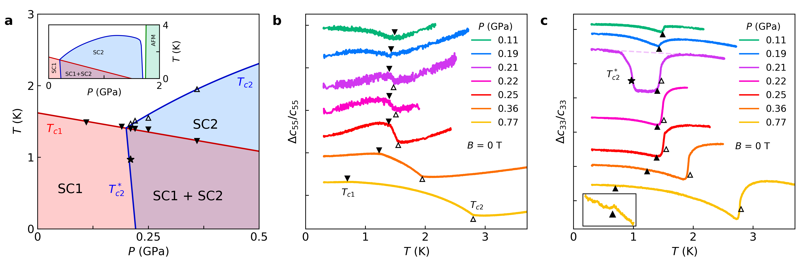

**図2：UTe₂の四臨界点近傍の相図と弾性定数測定。**異なる圧力下における$c_{55}$および$c_{33}$の温度依存性。超音波の弾性定数は超伝導転移・相境界において鋭い異常を示す。特定の圧力$P^*$（四臨界圧力）近傍でSC1・SC2の転移が一点に収束し、弾性異常の形状が質的に変化することが四臨界点の熱力学的証拠となる。（CC BY 4.0、Kamat et al., arXiv:2603.17905）

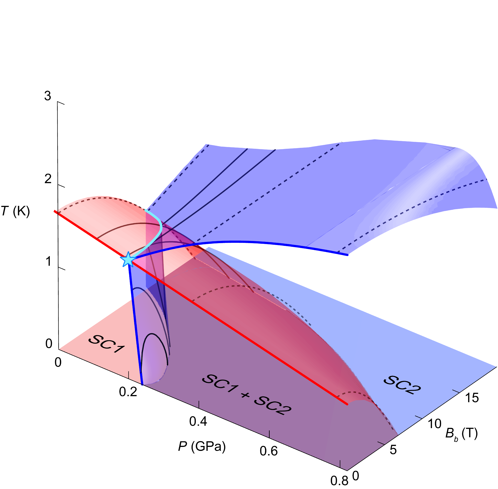

**図3：固定圧力における磁場-温度相図。**複数の圧力値でのSC1・SC2の磁場-温度相境界（それぞれ$c_{55}$・$c_{33}$データから決定）。この2次元断面を圧力軸に並べることで、3次元相図（$H$-$T$-$P$）が構築される。SC1とSC2の相境界が磁場方向や圧力によって非対称な形で交差することが、多成分秩序パラメータの異方性を示唆する。（CC BY 4.0、Kamat et al., arXiv:2603.17905）

---

# 量子異常ホール絶縁体における磁気秩序の実空間イメージング

## 1. 論文情報

**タイトル：** [Magnetic Order in Quantum Anomalous Hall Insulator](https://arxiv.org/abs/2603.18906)
**著者：** Andriani Vervelaki, Boris Gross, Daniel Jetter, Markus Trupke, Sara Kuhlmann, Toshihiro Sato, Shunsuke Ohya, Masaaki Tanaka, Martino Poggio
**arXiv ID：** 2603.18906
**カテゴリ：** cond-mat.mtrl-sci, cond-mat.mes-hall
**公開日：** 2026年3月19日
**論文タイプ：** 実験論文（走査型SQUIDオンチップ顕微鏡・AFM・磁気リコンストラクション）
**ライセンス：** CC BY 4.0

---

## 2. どんな研究か

量子異常ホール効果（QAHE）を示すV添加（Bi,Sb）₂Te₃薄膜において、磁化反転過程でのナノスケール磁気構造を走査型SQUIDオンチップ顕微鏡で直接観察した実験研究である。局所的な磁化反転は結晶学的グレイン内の短距離磁気相互作用と、グレイン間をまたぐ長距離強磁性結合が共存することで説明されることを示した。この二つの磁気秩序スケールの共存が、QAHE観測時に見られる「不完全な量子化」や不均一なコエルシビティの起源を材料学的に説明し、QAHEデバイスの性能改善に向けた材料設計指針を与える。

---

## 3. 研究の概要

**背景と目的**

QAHEはトポロジカル絶縁体に磁気秩序を導入（磁性元素の添加）することで実現されるゼロ磁場での量子化ホール効果である。V添加（Bi₁₋ₓSbₓ）₂Te₃（VBST）薄膜はその代表的な実験系であり、低温（～1 K）でChern数$C = 1$に対応する量子化ホール抵抗$h/e^2$が観測されている。しかし、QAHE状態の完全な量子化や磁化過程の理解には、薄膜の磁気ミクロ構造——特に磁区の形成・反転過程——を実空間でナノスケールから解明することが必要であった。

**解こうとしている物理問題**

VBST薄膜の磁化反転がどのように局所的に進行するか。グレイン境界・結晶欠陥・組成不均一性に起因する局所磁場分布と、巨視的なヒステリシスとの対応を明らかにする。また、「局所磁気相互作用（グレイン内）」と「長距離強磁性結合（グレイン間）」がどのように共存するかを定量的に示す。

**対象材料系**

V₀.₁₅(Bi₁₋ₓSbₓ)₁.₈₅Te₃薄膜。MBE法で作製した5〜10 nmの薄膜。SrTiO₃基板上。VがBi/Sbサイトを置換し、局在磁気モーメントを導入する。バルクの磁気秩序は強磁性的であるが、薄膜では化学的不均一性やVの空間的偏析が問題になる。

**材料創製法・構造制御法**

分子線エピタキシー（MBE）による薄膜成長。V添加量、Bi/Sb比、基板温度、成長速度が薄膜の磁気性質に影響。一部の試料はキャッピング層なし（uncapped）でAFM測定に使用。

**主な測定手法**

- 走査型SQUIDオンチップ顕微鏡（scanning SQUID-on-chip microscopy）：薄膜直上でナノスケールの磁束（$B_z^{ac}$）を面内磁場走査で非破壊に測定。空間分解能 ≈ 150 nm。
- 原子間力顕微鏡（AFM）：表面形態（グレイン・テラス）の観察。
- 磁化リコンストラクション：測定した磁気浮遊磁場から反転問題を数値解法で解き、磁化の2Dマップを再構成。

**主な結果**

- 磁場掃引に伴う$B_z^{ac}$マップで、磁化反転が不均一に進行することを直接観察。
- コエルシビティ付近では、特定の局所領域が先に反転し（ニュークレーション）、周囲へ伝播（ドメイン拡大）する過程が可視化された。
- リコンストラクションにより、反転した領域の境界がAFMで測定したグレイン境界と強く相関することを確認。
- グレイン内：局所的な交換相互作用が短距離磁気秩序を形成。
- グレイン間：長距離の強磁性的双極子結合が全体のコヒーレンスを支える。
- この二スケールの磁気秩序が共存することで、部分的な磁化反転状態（雑音的中間状態）が生じ、QAHE量子化の不完全性と関連すると解釈された。

**著者の主張**

VBST薄膜の磁化反転は、グレイン内短距離相互作用とグレイン間長距離結合という二種類の磁気秩序が共存することで支配される。この材料学的な磁気不均一性がQAHE状態の「不完全な量子化」に直結しており、高品質QAHE実現には結晶グレイン構造の均一化が本質的な改善指針になる。

---

## 4. 量子物性・材料工学として重要なポイント

量子異常ホール効果はバンドトポロジー（Chern数）と磁気秩序（交換場によるバンド反転）の結合から生じるが、その実際の観測精度は磁気ミクロ構造の均一性に強く依存する。本研究はこの「量子効果と材料微細構造の関係」を磁気イメージングで直接可視化した点に核心がある。走査型SQUIDは数百ナノメートルの空間分解能で磁気浮遊磁場を感度高く測定でき（感度$\sim 10^{-4}\Phi_0/\sqrt{\text{Hz}}$）、薄膜の非破壊観察に適する。磁化リコンストラクションという逆問題解析は不均一性を定量化するツールとして有効であり、他のトポロジカル磁性薄膜系（例：MnBi₂Te₄系、磁性モアレ系）への応用可能性が高い。材料設計の観点からは、グレイン境界の低減（基板温度・成長速度最適化）・V分布の均一化（共蒸着制御）・Sb/Bi比の局所変動抑制が重要な改善パラメータとして浮かび上がる。これはQAHEデバイスの精密化（量子標準、低消費電力論理素子）に直結する設計指針である。

---

## 5. 限界と注意点

SQUIDイメージングの空間分解能（〜150 nm）はグレイン内の微細な磁気構造を完全には解像できない可能性があり、よりサブ100 nm分解能の測定（例：窒素欠陥中心（NV）磁気イメージング）による補完が理想的。磁化リコンストラクションは逆問題であり、解の一意性は仮定する磁化分布モデルに依存する。また、測定は低温（QAHEが観測される温度域近傍）で実施されていると推定されるが、温度依存した磁区構造の変化と輸送測定結果との直接対応付けは論文内でどこまで示されているかを確認が必要。VBST以外のQAHE系（MnBi₂Te₄等）への一般化可能性も、グレイン構造が根本的に異なる系では自明でない。

---

## 6. 関連研究との比較

V添加TI薄膜のQAHEは2013年の最初の観測（Changほか、Science）以来、輸送測定を中心に研究が進んできた。磁気イメージングを用いたQAHE薄膜の磁区研究は近年増加しているが、走査型SQUIDによるナノスケール磁気浮遊磁場の定量的リコンストラクションと、AFMによるグレイン構造との直接比較を組み合わせた研究は本論文が先駆的である。MnBi₂Te₄系における磁区観察研究（Deng, Liu, et al. 2020）と比較すると、VBSTはグレイン構造が顕著であり、この材料学的特性が量子効果に与える影響の定量評価という点で異なる貢献をしている。長距離・短距離磁気秩序の共存という概念は、CDW系や量子スピン液体における秩序の共存議論と類比的であり、トポロジカル系の磁気不均一性研究の普遍的枠組みを提供する。

---

## 7. 重要キーワードの解説

**1. 量子異常ホール効果（quantum anomalous Hall effect, QAHE）**
ゼロ磁場でChern数$C = 1$に対応する量子化ホール抵抗$\rho_{xy} = h/e^2$が現れる現象。トポロジカル絶縁体に磁気秩序を導入することでバンドが反転し、カイラルエッジ状態が形成される。QAHEはバルクバンドが完全なエネルギーギャップを持ちながら端に散逸のない1次元輸送チャネルを有する。

**2. トポロジカル絶縁体（topological insulator）**
バルクはバンドギャップを持つ絶縁体でありながら、表面（端）にはスピン運動量ロッキングしたディラック型の金属状態が存在する物質。時間反転対称性によって保護されており、Bi₂Se₃、Bi₂Te₃、(Bi₁₋ₓSbₓ)₂Te₃が代表例。磁性添加でQAHEが実現する。

**3. Chern数（Chern number）**
ブリルアンゾーン全体にわたるベリー曲率の積分$C = \frac{1}{2\pi}\int_{BZ} \Omega_n(\mathbf{k}) d^2k$（整数値）。$C \neq 0$はバンドが位相的に非自明であることを示す。QAHEではChern数が量子化ホール伝導率$\sigma_{xy} = Ce^2/h$に直結する。

**4. 走査型SQUIDオンチップ顕微鏡（scanning SQUID-on-chip microscope）**
超伝導量子干渉素子（SQUID）を微小チップ上に集積し、試料表面を走査して磁気浮遊磁場を高感度で2次元マッピングする装置。感度は$\sim 10^{-4}\Phi_0/\sqrt{\text{Hz}}$（$\Phi_0 = h/2e$は磁束量子）。試料と非接触で磁気構造を観察できる。

**5. 磁化リコンストラクション（magnetization reconstruction）**
測定した磁気浮遊磁場$B_z(x,y)$から元の磁化分布$M(x,y)$を数値的に逆算する手法。逆問題であり一般に非唯一だが、薄膜の面内磁化・一様膜厚などの制約を用いることで物理的に合理的な解が得られる。反復最適化アルゴリズムが用いられる。

**6. 磁区（magnetic domain）**
磁化が同一方向に揃った均一な領域。隣接する磁区の間には磁壁（domain wall）が存在し、磁化が徐々に方向を変える。外部磁場の変化により磁区は核生成・成長・消滅を繰り返す（ヒステリシス）。磁区の空間スケールは交換相互作用・磁気異方性・双極子相互作用のバランスで決まる。

**7. グレイン境界（grain boundary）**
多結晶薄膜において結晶方位が異なる粒（グレイン）が接する界面。原子配列の不整合により局所的な欠陥・歪み・化学的偏析が生じる。磁性系ではグレイン境界が磁壁のピン止め点（ピニングサイト）として機能し、コエルシビティを増大させる。QAHEではグレイン均一性が輸送特性の均質性に影響する。

**8. コエルシビティ（coercivity, 保磁力）**
磁化を反転させるのに必要な外部磁場の強さ。材料の磁気異方性・欠陥密度・磁区サイズに依存する。局所的なコエルシビットの不均一性は磁化反転の空間的不均一性（部分的反転状態）をもたらし、輸送特性のヒステリシス形状を決める。

**9. カイラルエッジ状態（chiral edge state）**
QAHE（またはQHE）で試料端に現れる1次元の伝導チャネル。電流は一方向のみに流れ（chirality）、バックスキャッタリングがない。Chern数$C = 1$なら試料の一辺に一本のカイラルエッジ状態が存在し、その抵抗は$h/e^2$に量子化される。

**10. 交換相互作用（exchange interaction）**
電子の波動関数の重なりと泡立て原理から生じるスピン間の実効的相互作用$J\mathbf{S}_i \cdot \mathbf{S}_j$（ハイゼンベルグ模型）。$J > 0$は反強磁性、$J < 0$は強磁性を好む。VBST中のVイオン間の交換相互作用が強磁性秩序の起源。グレイン内とグレイン間では実効的な$J$が異なりうる。

---

## 8. 図

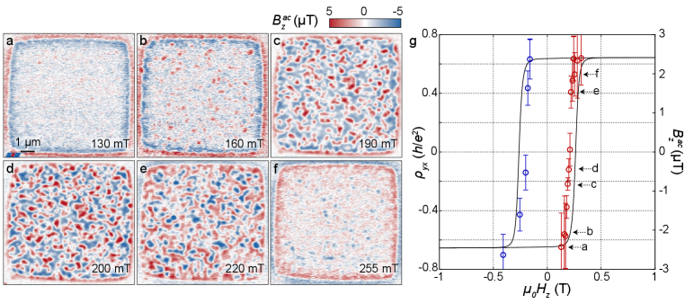

**図1：VBST薄膜の磁場掃引に伴う$B_z^{ac}$マップの変化。**外部磁場を片側から反転させる過程でSQUID顕微鏡が捉えた磁気浮遊磁場の空間分布（a〜f）。明暗のコントラストが磁化の方向（上向き・下向き）を示す。磁化反転は一様ではなく、特定の領域から核生成し周囲に伝播する不均一な過程であることが直接可視化されている。この不均一性の起源を明らかにすることが本研究の核心。（CC BY 4.0、Vervelaki et al., arXiv:2603.18906）

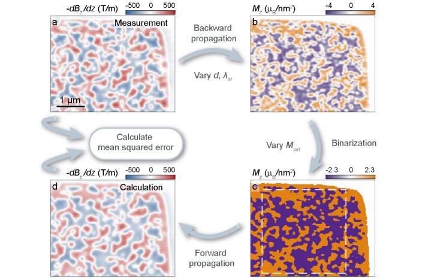

**図2：コエルシビティ磁場における磁化パターンのリコンストラクション。**測定した$-dB_z/dz$マップ（a）から数値的に磁化分布を逆算する反復最適化手順の結果。SQUIDと試料間距離（〜150 nm）を校正した上で逆問題を解き、薄膜面内の磁化ベクトル分布を推定する。リコンストラクションにより、磁場イメージング単独では見えにくい磁区の輪郭と境界位置が定量的に決定される。（CC BY 4.0、Vervelaki et al., arXiv:2603.18906）

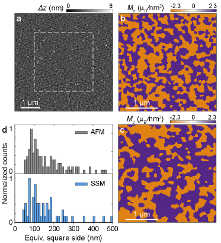

**図3：表面形態（AFM）とリコンストラクション磁化マップの比較。**（a）AFMで測定したVBST薄膜の高さマップ（グレインとグレイン境界が可視化）。（b）対応する磁化リコンストラクション結果。グレイン境界（AFMで検出）と磁区境界（磁化マップで検出）の空間的対応関係が明確に示される。グレイン内では均一な磁化方向が維持され（短距離秩序）、グレイン間は長距離双極子結合でコヒーレンスを保つという二スケール磁気秩序の直接的証拠。（CC BY 4.0、Vervelaki et al., arXiv:2603.18906）

---

# 第二部：その他の重要論文

---

# 強誘電体p波磁石：電気的に切り替わるスピン偏極状態

## 1. 論文情報

**タイトル：** [Ferroelectric $p$-wave magnets](https://arxiv.org/abs/2603.19107)
**著者：** Jan Priessnitz, Anna Birk Hellenes, Riccardo Comin, Libor Šmejkal
**arXiv ID：** 2603.19107
**カテゴリ：** cond-mat.mtrl-sci, cond-mat.mes-hall
**公開日：** 2026年3月19日
**論文タイプ：** 理論・第一原理計算論文
**ライセンス：** arXiv 非独占的配布ライセンス（原図抽出不可）

---

## 2. 研究概要

強誘電秩序と磁気秩序の結合（マルチフェロイクス）は低消費電力エレクトロニクスへの応用が期待されながら、時間反転対称性（TRS）を壊さずにスピン分裂を実現する材料系は乏しかった。本研究はスピン・磁気群理論を用い、非共線的な反強磁性配列をもつ強誘電体において時間反転対称なp波（およびf波）スピン偏極絶縁状態が実現できることを示した。対称性分類によりCrystalline-, Exchange-, SOC-driven の三種の極性対称性破れ機構を同定し、50種超の候補材料リストを作成した。第一原理計算によりGdMn₂O₅がTRSを保ちながら純粋なp波スピン偏極バンド構造を持ち、自発分極の反転（電場印加）によってスピン偏極の方向をスイッチできることを示した。

このp波磁石という新概念は、TRSを保ちながらもk空間で異なるスピン縮退を持つ「アルターマグネティズム（altermagnetism）」の拡張として位置づけられ、マルチフェロイクス材料設計に新しい自由度を与える。強誘電スイッチングとスピン偏極の連動という機能は、超低消費電力スピントロニクスデバイス（強誘電スピンバルブ・強誘電スピンFET）への道を開く。候補材料GdMn₂O₅は既知の実験系であり、実験的検証が容易な点も重要である。

---

## 3. 重要キーワードの解説

**1. p波磁石（p-wave magnet）** 運動量空間でp波的（$\mathbf{k}$の奇関数）なスピン分裂を持つ磁性体。時間反転対称性を保ちながらスピン縮退を破る。

**2. アルターマグネット（altermagnet）** TRSを保ちネット磁化がゼロながら、k空間でスピン分裂するバンド構造を持つ新規磁性体クラス。d波・g波・i波型などがある。

**3. 強誘電体（ferroelectric）** 外部電場なしに自発電気分極を持ち、電場で分極方向を反転できる物質。BiFeO₃、BaTiO₃、GdMn₂O₅などが例。

**4. 非共線的反強磁性（noncollinear antiferromagnetism）** スピンが単一軸に沿わず、複数方向に配列する反強磁性。ネット磁化はゼロだが、スピン配置の空間パターンが対称性を低下させる。

**5. マルチフェロイクス（multiferroics）** 強誘電・強磁性（または反強磁性）など複数の秩序が共存する物質。電気-磁気結合（magnetoelectric coupling）が機能性の鍵。

**6. スピン群理論（spin group theory）** スピン空間操作と結晶空間操作を独立に扱う対称性の枠組み。TRS保持下でのスピン分裂の分類に用いる。

**7. 第一原理計算（first-principles calculation）** 経験的パラメータを用いず電子構造を計算する手法。密度汎関数理論（DFT）+スピン軌道結合を含めた計算でバンド構造を評価。

**8. 電気的スイッチング（electrical switching）** 電場によって物性を変化させること。強誘電スイッチング（分極反転）によりスピン偏極方向を反転できることが本研究の核心。

**9. スピン偏極（spin polarization）** あるk点での電子のスピン方向の偏り度合い。$P = (n_\uparrow - n_\downarrow)/(n_\uparrow + n_\downarrow)$。p波磁石では奇関数的なk依存性を持つ。

**10. 極性対称性破れ（polar symmetry breaking）** 結晶の空間反転対称性（$\mathcal{I}$）が破れ電気双極子が生じること。GdMn₂O₅では結晶構造・交換相互作用・SOCがいずれも寄与する。

---

## 4. 図

本論文はarXiv非独占的配布ライセンスのため、原図の抽出・掲載は行わない。

---

# LSMO/SROスーパーラティスにおける界面磁気結合とスピンダイナミクス

## 1. 論文情報

**タイトル：** [Interface magnetic coupling and magnetization dynamic of La₂/₃Sr₁/₃MnO₃ single layer and (La₂/₃Sr₁/₃MnO₃/SrRuO₃)ₙ (n = 1, 5) superlattice on SrTiO₃(001) substrate](https://arxiv.org/abs/2603.19179)
**著者：** Ilyas Noor Bhatti, Rachna Chaurasia, Kazi Rumanna Rahman, Sukhendu Sadhukhan, Amantulla Mansuri, Imtiaz Noor Bhatti
**arXiv ID：** 2603.19179
**カテゴリ：** cond-mat.str-el, cond-mat.mtrl-sci
**公開日：** 2026年3月19日
**論文タイプ：** 実験論文（薄膜成長・XRD・XPS・FMR・磁化測定）
**ライセンス：** CC BY 4.0

---

## 2. 研究概要

La₂/₃Sr₁/₃MnO₃（LSMO）は強磁性金属ペロブスカイトの代表系、SrRuO₃（SRO）は弱強磁性金属ペロブスカイトであり、両者はRu-Mnの界面において交換結合が生じる。本研究はSrTiO₃(001)基板上にMBE法またはPLDで成長させたLSMO単層膜・[LSMO/SRO]₁二層膜・[LSMO/SRO]₅五層超格子を作製し、XRD・XRR・AFM・XPSで構造・組成を評価の上、磁化測定（SQUID VSM）とFMR（強磁性共鳴）でスピンダイナミクスを詳細に調べた。五層超格子では室温においても界面Ru-Mn交換結合に由来する「二段階磁化反転（two-step switching）」が明確に現れ、単層に比べてギルバートダンピング定数$\alpha$が小さく（磁化緩和が抑制）、FMR線幅も良好であることが示された。

この界面交換結合と繰り返し積層によるスピンダイナミクス改善の結果は、LSMO/SROへテロ構造のスピントロニクスデバイスへの応用（スピンバルブ・スピン注入源・磁気メモリ）に直接的な設計指針を提供する。特に積層数$n$が界面効果の巨視的発現を制御するパラメータとして機能することが示されており、酸化物ヘテロ構造を用いた量子磁性機能の材料工学的調整手法として重要な知見である。

---

## 3. 重要キーワードの解説

**1. La₂/₃Sr₁/₃MnO₃（LSMO）** Mnサイトが混合原子価（Mn³⁺/Mn⁴⁺）のペロブスカイト強磁性金属。二重交換相互作用によりTc ≈ 370 Kの強磁性。100%スピン偏極キャリアを持ちスピントロニクスに有望。

**2. SrRuO₃（SRO）** ペロブスカイト型金属的強磁性体（Tc ≈ 160 K）。Ru 4d電子が伝導に寄与。SOCが大きく、巨大な異常ホール効果を示す。強磁性電極として利用。

**3. 界面交換結合（interfacial exchange coupling）** LSMO/SRO界面でMnとRuのd電子が直接または超交換を通じて結合する磁気相互作用。強磁性的または反強磁性的。界面原子層の秩序と乱れに敏感。

**4. 二段階磁化反転（two-step magnetization switching）** 磁化-磁場曲線（M-H曲線）で二段階のスイッチングが現れる現象。LSMO層とSRO層のコエルシビティが異なるため、各層が独立に反転する。界面交換結合があるとこの反転が変調される。

**5. ギルバートダンピング定数（Gilbert damping constant, $\alpha$）** LLG方程式中の磁化緩和項の係数$\alpha$。スピン歳差運動の減衰速度を決める。$\alpha$が小さいほど磁化緩和が遅く（長寿命）、スピン移送や磁化ダイナミクスへの応用に有利。

**6. 強磁性共鳴（ferromagnetic resonance, FMR）** マイクロ波磁場が強磁性体の歳差周波数に共鳴する現象。共鳴磁場からキッテル式で有効磁気異方性を、線幅から$\alpha$を決定できる。薄膜・ヘテロ構造のスピンダイナミクス評価の標準手法。

**7. X線回折・反射率（XRD/XRR）** XRDでペロブスカイト(001)配向と格子定数を、XRRで積層周期・界面ラフネス・膜厚を評価する。スーパーラティスでは周期に由来するサテライトピークが現れ界面品質を反映する。

**8. キッテル式（Kittel formula）** FMRの共鳴磁場$H_{\rm res}$と周波数$f$の関係式。面内磁場に対し$f = \frac{\gamma}{2\pi}\sqrt{H_{\rm res}(H_{\rm res} + 4\pi M_{\rm eff})}$。有効磁化$M_{\rm eff}$から磁気異方性を決定できる。

**9. 二重交換相互作用（double exchange interaction）** LaMnO₃にSrをドープしてMn³⁺-Mn⁴⁺混合原子価を導入すると、酸素サイトを介して電子がホッピングしながら平行スピン（強磁性）を促進する相互作用。LSMOの強磁性の主要機構。

**10. 積層周期（superlattice period）** 超格子の単位セル繰り返し数$n$。$n$が増えると界面総面積・界面結合の寄与が増大。本研究では$n=1$と$n=5$の比較で界面効果の$n$依存性を定量した。

---

## 4. 図

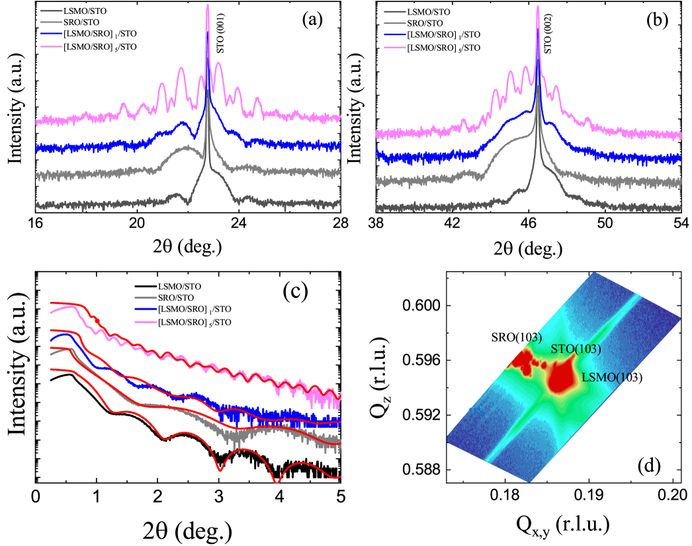

**図1：LSMO/STO単層膜および[LSMO/SRO]₅超格子のX線構造評価。**（a,b）$2\theta/\omega$スキャンにおける（001）・（002）ブラッグピークと超格子サテライトピーク。ピーク数字は積層数を示す。（c）X線反射率（XRR）と計算フィット（赤線）。（d）（103）反射の逆格子空間マッピング。エピタキシャル成長と格子整合の確認、および各層の膜厚・周期の精密決定に使用。（CC BY 4.0、Bhatti et al., arXiv:2603.19179）

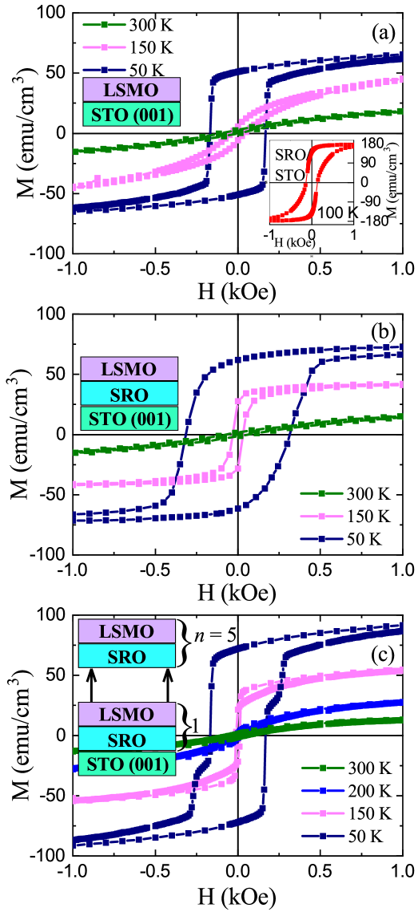

**図2：AFMによる表面形態の観察。**（a）LSMO/STO単層膜、（b）[LSMO/SRO]₁二層膜の表面形態画像と線プロファイル（c,d）。ステップ・テラス構造が確認され、界面ラフネスが小さいことを示す。表面品質が磁気特性と界面結合の強度に直結するため、材料設計上の重要指標。（CC BY 4.0、Bhatti et al., arXiv:2603.19179）

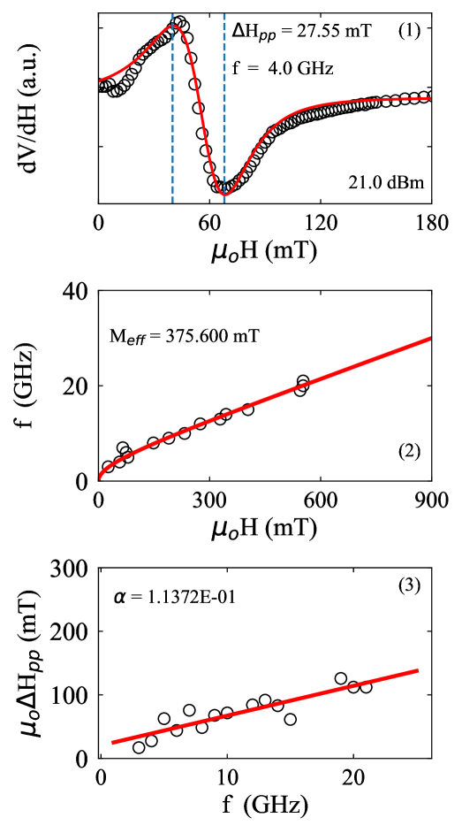

**図3：各試料の等温磁化測定（300 K・150 K・50 K）。**（a）LSMO/STO単層、（b）[LSMO/SRO]₁、（c）[LSMO/SRO]₅の$M$-$H$曲線。[LSMO/SRO]₅では50 Kで明瞭な二段階磁化反転が観察され、LSMO層とSRO層の異なるコエルシビティが界面交換結合の下で現れることを示す。各図の挿入図は積層模式図。（CC BY 4.0、Bhatti et al., arXiv:2603.19179）

---

# レーザー光電子分光によるカゴメ金属CsCr₃Sb₅のフェルミ面観測

## 1. 論文情報

**タイトル：** [Fermi Surface of Kagome Metal CsCr₃Sb₅ Observed by Laser Photoemission Microscopy](https://arxiv.org/abs/2603.18672)
**著者：** Hayate Kunitsu, Iori Ishiguro, Natsuki Mitsuishi, Shunsuke Tsuda, Koichiro Yaji, Zehao Wang, Pengcheng Dai, Yoichi Yamakawa, Hiroshi Kontani, Takahiro Shimojima
**arXiv ID：** 2603.18672
**カテゴリ：** cond-mat.str-el
**公開日：** 2026年3月19日
**論文タイプ：** 実験論文（レーザーARPES・DFT計算）
**ライセンス：** CC BY 4.0（arXiv HTML非対応のため原図抽出不可）

---

## 2. 研究概要

CsCr₃Sb₅はAV₃Sb₅型カゴメ金属（A = Cs, Rb, K）ファミリーの亜族であり、電荷密度波（CDW）や超伝導を示さない磁性カゴメ金属として近年注目されている。本研究はレーザーARPES（光電子分光顕微鏡）を用い、CsCr₃Sb₅のフェルミ面を精密に決定し、DFT計算と比較した。実験と計算の対応を通じて、フェルミ面のトポロジーがCr 3d電子の軌道自由度に強く依存することを明らかにした。またバンド分散の詳細から軌道依存の電子相関の強さを推定し、Cr 3d系でも軌道選択的なメット転移的振る舞いが生じうることを示唆する。

CsCr₃Sb₅のフェルミ面が精密に決定されたことで、CDW・超伝導が抑制されている原因のバンド構造的理解が深まる。AV₃Sb₅系と直接比較することで「カゴメ金属のどの電子構造因子がCDW・超伝導を支えるか」という問いへの答えに近づく。またCr 3d系固有の軌道選択的相関効果の検出は、カゴメ格子における強相関物理の新側面を開く。

---

## 3. 重要キーワードの解説

**1. CsCr₃Sb₅** Cs原子間にCr₃Sb₅層が積層した準2次元カゴメ金属。CsV₃Sb₅と同型構造だがCr 3d電子系。CDW・超伝導を示さず磁性的。

**2. レーザーARPES（laser ARPES）** 真空紫外レーザー（$h\nu \sim 7$ eV）を光源とする高分解能ARPES。エネルギー分解能$\sim 1$ meV、運動量分解能$\sim 0.005$ Å$^{-1}$で通常ARPESを超える精度でバンド構造を測定可能。

**3. フェルミ面（Fermi surface）** 運動量空間でフェルミエネルギー$E_F$に対応する等エネルギー面$E(\mathbf{k}) = E_F$。金属の電気・磁気・超伝導特性を決定する基本量。ARPESで$\omega = 0$（$E_F$）での強度マップとして観測。

**4. 軌道選択的相関（orbital-selective correlation）** 複数の軌道（例：$d_{xy}$, $d_{xz}$, $d_{yz}$）が異なる強さの電子相関を持つ現象。ある軌道が遍歴的（金属的）で、他が局在的（モット絶縁体的）となる「軌道選択的モット転移」が極端な例。鉄系超伝導体や強相関酸化物で議論されてきた。

**5. ファン・ホーフ特異点（van Hove singularity）** 状態密度の発散点。カゴメ格子では$M$点付近に現れ、CDW不安定性の起源となる。CsCr₃Sb₅では同様の点の位置とフィリングがCDW抑制の鍵かもしれない。

**6. DFT計算との比較** 局所密度近似（LDA）またはGGA+Uに基づくバンド計算結果と実験ARPESを対比することで、相関効果の大きさ（バンドの繰り込み係数$m^*/m_{\rm band}$）が評価できる。

**7. カゴメ金属（kagome metal）** カゴメ格子を持つ金属系の総称。平坦バンド・ディラック点・ファン・ホーフ特異点が共存し、電子相関・トポロジー・超伝導・CDWが競合する舞台。

**8. 軌道自由度（orbital degree of freedom）** $d$電子系で$t_{2g}$（$d_{xy}$, $d_{xz}$, $d_{yz}$）や$e_g$（$d_{x^2-y^2}$, $d_{z^2}$）などの軌道の種類が物性に与える影響。軌道秩序・軌道揺らぎ・軌道選択性が多体物理の豊かさを生む。

**9. バンドの繰り込み（band renormalization）** 電子-電子相互作用によって群速度（バンド傾き）が抑制される効果。繰り込み係数$Z = m_{\rm band}/m^*$。相関が強いほど$Z < 1$となりバンドが平坦化・スペクトル重みが再分配される。

**10. Cr 3d系カゴメ（Cr-based kagome）** Vを含むAV₃Sb₅と違い、Cr 3d電子は局在傾向が強く磁性を持ちやすい。磁性と平坦バンドの共存というカゴメ金属の新局面を代表する系。

---

## 4. 図

本論文はCC BY 4.0ライセンスだが、arXivのHTML版が利用不可のため原図の抽出ができなかった。

---

# ドープ5d²二重ペロブスカイトにおけるポーラロン駆動八極子秩序スイッチング

## 1. 論文情報

**タイトル：** [Polaron-Driven Switching of Octupolar Order in Doped 5d² Double Perovskite](https://arxiv.org/abs/2603.18155)
**著者：** Dario Fiore Mosca, Lorenzo Celiberti, Leonid V. Pourovskii, Cesare Franchini
**arXiv ID：** 2603.18155
**カテゴリ：** cond-mat.str-el
**公開日：** 2026年3月18日
**論文タイプ：** 理論・計算論文（DFT+SO・平均場モデル・ポーラロン超セル計算）
**ライセンス：** CC BY 4.0

---

## 2. 研究概要

5d² オスマウム二重ペロブスカイトBa₂CaOsO₆（BCOO）はスピン軌道相互作用（SOC）が支配的な$J_{\rm eff}=2$基底状態を持ち、磁気八極子（octupole）が主要な秩序パラメータとなる稀有な系である。本研究はNa添加によるホールドープ（$d^1$ポーラロン導入）がこの八極子秩序に与える影響を、ポーラロン超セルDFT+SO計算と平均場モデルで系統的に調べた。ドープしたホールは格子歪みを引き連れた小ポーラロンを形成し、ポーラロン結晶場（polaron crystal field）が$J_{\rm eff}=2$基底状態多重項を追加分裂させることで、強秩序型八極子（F$\mathcal{O}$）から反強秩序型八極子（AF$\mathcal{O}$）への転移（スイッチング）をもたらすことを示した。この転移は外部刺激（キャリアドーピング）で八極子秩序を制御できる新原理を提供する。

多極子秩序（特に四極子・八極子）の制御は、電気磁気多極子効果・非従来型の電磁応答・隠れた対称性破れの誘起など、先端的な量子機能材料開発のフロンティアに位置する。本研究が示した「ポーラロンによる八極子スイッチング」は、$5d$系強相関絶縁体における多極子秩序の電気的・化学的制御に向けた理論的基盤を与えており、類似のSOC支配系（イリジウム酸塩・レニウム酸化物等）への一般化可能性が高い。

---

## 3. 重要キーワードの解説

**1. $J_{\rm eff}=2$基底状態** SOCが$t_{2g}$結晶場と競合するとき、5d²イオンでは全角運動量$J_{\rm eff}=2$の五重縮退基底が実現する。磁気双極子モーメントは消去（$\langle J^z \rangle = 0$）され、四極子・八極子が主要な多極子となる。

**2. 磁気八極子（magnetic octupole）** 磁気多極展開の三次モーメント$\mathcal{O} = \langle J_x J_y J_z \rangle$。双極子より高次の対称性で保護され、直接的な磁気測定では検出しにくい「隠れた秩序」の一種。

**3. 小ポーラロン（small polaron）** 電荷キャリアが格子変形（フォノン雲）を引き連れて局在した準粒子。ホッピングはフォノン援助的で活性化型。格子変形がキャリアを捕捉し（格子の自己トラッピング）、電子-格子相互作用が強い系（ペロブスカイト酸化物等）で典型的。

**4. ポーラロン結晶場（polaron crystal field）** ポーラロン格子変形に由来して生じる追加の結晶場。$J_{\rm eff}=2$基底多重項をさらに分裂させ、有効交換相互作用（IEI）の対称性・大きさを変える。

**5. 超交換相互作用（superexchange, inter-site exchange interaction, IEI）** 直接重なりのない$d$サイト間を酸素$p$軌道が仲介する有効磁気相互作用。交換経路の軌道対称性によって強磁性または反強磁性的。多極子版では八極子-八極子交換$V^{xyz}$が現れる。

**6. 平均場モデル（mean-field model）** 量子多体問題で各サイトの秩序パラメータ（ここでは八極子$\langle J_x J_y J_z \rangle$）を自己無撞着に決定する近似。相転移温度$T_O$とドーピング依存性の定量的予言に使用。

**7. 強秩序型八極子 vs 反強秩序型八極子（F$\mathcal{O}$ vs AF$\mathcal{O}$）** 隣接サイトの八極子モーメントが同符号（強秩序）か交互（反強秩序）かの違い。対称性が異なり、電磁応答・電気磁気効果の性質が変わる。

**8. DFT+SO（DFT with spin-orbit coupling）** スピン軌道相互作用を含む第一原理計算。5d系では相対論効果が本質的で、DFT+SOは基底状態の電子構造を正確に記述するために必須。

**9. 二重ペロブスカイト（double perovskite, A₂BB'O₆）** ABO₃ペロブスカイトのB/B'サイトが規則的に交替する構造。Ba₂CaOsO₆はA=Ba, B=Ca, B'=Osの例。B'/Bの岩塩型規則配列がイオンの局所対称性を高め多極子秩序を促進。

**10. スイッチング（switching）** 外部刺激（ドーピング・電場・温度・磁場・圧力）によって物性の状態を切り替えること。本研究では化学的ドーピング（Na添加）が八極子秩序の種類（F$\mathcal{O}$↔AF$\mathcal{O}$）を切り替えるスイッチングとして機能する。

---

## 4. 図

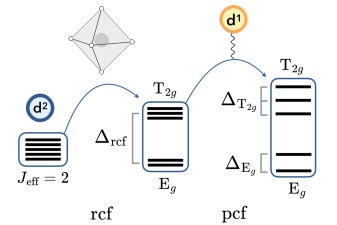

**図1：$J_{\rm eff}=2$基底状態の結晶場分裂模式図。**左：SOCによる五重縮退$J_{\rm eff}=2$基底状態（GSM）。中：八面体結晶場（rcf）により$T_{2g}$-$E_g$分裂。右：ポーラロン結晶場（pcf）がさらにnon-Kramers準位を分裂。このエネルギー準位変化が超交換相互作用の符号・大きさを変え、八極子秩序スイッチングの微視的起源となる。（CC BY 4.0、Mosca et al., arXiv:2603.18155）

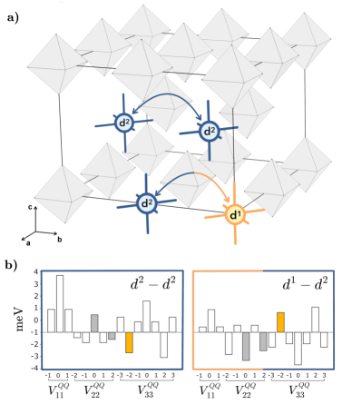

**図2：ポーラロン超セルと交換相互作用の計算結果。**（a）ポーラロン超セルの模式図。$d^2$-$d^2$および$d^1$-$d^2$交換経路を青・橙矢印で示す。（b）八極子-八極子交換相互作用$V^{xyz}$（黄色ハイライト）を含む対角IEI行列。有効交換経路の対称性変化がF$\mathcal{O}$からAF$\mathcal{O}$へのスイッチングを駆動することを示す。（CC BY 4.0、Mosca et al., arXiv:2603.18155）

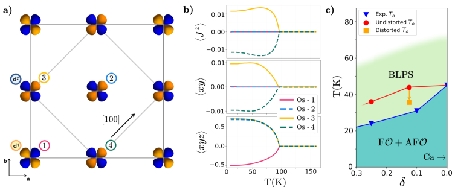

**図3：ドーピングに伴う八極子秩序転移の変化。**（a）Ba₂Ca₁₋δNaδOsO₆のF$\mathcal{O}$・AF$\mathcal{O}$秩序の模式図（上面図）。（b）温度の関数としての双極子・四極子・八極子の平均場秩序パラメータ。（c）ドーピング量$\delta$に対する秩序化温度$T_O$の変化（実験値：青三角、計算値：赤丸）。ドーピングによって$T_O$が系統的に変化し、八極子の秩序型が切り替わる過程が実験・理論の一致とともに示される。（CC BY 4.0、Mosca et al., arXiv:2603.18155）

---

# 2次元強相関半金属における空間的間接励起子凝縮

## 1. 論文情報

**タイトル：** [Spatially Indirect Exciton Condensation in Two-Dimensional Strongly Correlated Semimetals](https://arxiv.org/abs/2603.18445)
**著者：** Yao Zeng, Shi-Cong Mo, Wéi Wú
**arXiv ID：** 2603.18445
**カテゴリ：** cond-mat.str-el
**公開日：** 2026年3月19日
**論文タイプ：** 理論・計算論文（DMFT+QMC・ハバードモデル）
**ライセンス：** CC BY 4.0

---

## 2. 研究概要

遷移金属カルコゲナイド1T-TiSe₂やTa₂NiSe₅は「励起子絶縁体（excitonic insulator）」の候補として注目されているが、強いクーロン相関（$d$電子系）を持つため、弱相関理論（BCS/BEC的描像）で扱えないという根本的な問題があった。本研究は三角格子上の二・三軌道ハバードモデルをDMFT（動的平均場理論）+量子モンテカルロ（QMC）で数値的に解き、強相関効果が電子-正孔ペア凝縮温度$T_c$に与える影響を系統的に調べた。主要な結果は、(1)オンサイトのハバードU が$T_c$を強く抑制する、(2)複数の電子-正孔ペア形成チャネル間の競合がさらに$T_c$を押し下げる——という二重の抑制機構の発見である。これにより、1T-TiSe₂やTa₂NiSe₅で観測される「強い励起子束縛エネルギーに比べて著しく低い$T_c$」という実験的謎を定性的に説明する。

この研究は強相関励起子凝縮という新しい理論的枠組みを確立した点で重要である。励起子絶縁体の転移温度制御には、Uの大きさ（化学組成・酸化状態のチューニング）とバンドオーバーラップ（歪み・圧力・組成制御）が鍵となることを示しており、これらを材料パラメータとして意図的に調整することで$T_c$の向上が可能になるという材料設計指針を提供する。DMFTの枠組みは単軌道から多軌道への拡張が可能であり、Ta₂NiSe₅・WTe₂・MoS₂ヘテロ構造など様々な2D相関半金属系への適用が期待される。

---

## 3. 重要キーワードの解説

**1. 励起子絶縁体（excitonic insulator）** バンドオーバーラップが小さな半金属（またはバンドギャップが小さな半導体）で、伝導帯電子と価電子帯正孔の引力相互作用（クーロン力）が運動エネルギーを上回ってクーパーペア的な束縛状態（励起子）を形成し、自発的に凝縮した状態。

**2. 空間的間接励起子（spatially indirect exciton）** 電子と正孔が空間的に異なるサブ格子・層・オービタルに局在した状態で形成する励起子。空間的直接励起子（同一サブ格子）と対比される。1T-TiSe₂ではTi-Se間の空間的分離が「間接性」を生む。

**3. DMFT（動的平均場理論, dynamical mean-field theory）** 格子問題を有効単サイト問題（Anderson不純物モデル）に写像し、自己エネルギーの局所近似$\Sigma(\mathbf{k},\omega) \approx \Sigma(\omega)$のもとで自己無撞着に解く手法。局所量子ゆらぎ（時間的）を厳密に扱えるが、空間的非局所相関は近似的。

**4. ハバードU** 同一サイトに二電子が占有するときのクーロン反発エネルギー$U = E(d^{n+1}) + E(d^{n-1}) - 2E(d^n)$。$U$が大きいほど電子は局在しやすくなり（Mott絶縁体的傾向）、$T_c$の抑制につながる。

**5. 量子モンテカルロ（QMC）** 虚時間経路積分をMonte Carloサンプリングで解く数値手法。DMFT補助不純物問題の厳密解法として用いる（CT-QMC等）。符号問題（sign problem）が強相関ドープ系では困難だが、半金属（電子-正孔対称）系では比較的軽微。

**6. 電子-正孔ペアリングチャネル（electron-hole pairing channel）** 複数のバンド・軌道・副格子が存在するとき、電子-正孔ペアが形成される組み合わせが複数ある。異なるチャネルが同時に競合すると、どのチャネルも凝縮温度を十分に高められない（フラストレーション効果）。

**7. 1T-TiSe₂** Seの$p$バンド（価電子帯）とTiの$d$バンド（伝導帯）がフェルミ準位付近でわずかにオーバーラップする三方晶（1T）構造のTiSe₂。200 K以下で電荷密度波（CDW）転移を示し、励起子絶縁体機構の関与が長年議論されている。

**8. Ta₂NiSe₅** NiとTaの鎖が交互に並ぶ半金属。~325 KでCDW様の構造転移を示し、励起子絶縁体の強力な候補とされる。多軌道・多バンドの複雑さを持つ。

**9. バンドオーバーラップ（band overlap）** 電子バンドの最小値が正孔バンドの最大値より低い（半金属的）オーバーラップ量$\delta$。$\delta > 0$ならば自由キャリアがあり励起子凝縮の駆動力となる。$\delta$が小さいほどBEC极限（実空間励起子）に近い。

**10. BCS-BEC クロスオーバー（BCS-BEC crossover）** 弱結合（BCS：Cooper対の大きなコヒーレンス長）から強結合（BEC：小さな実空間束縛対の凝縮）への連続的な変化。励起子絶縁体はこのクロスオーバーの枠組みで理解されるが、強相関（大きなU）は両端のいずれにも収まらない新しい制度を開く。

---

## 4. 図

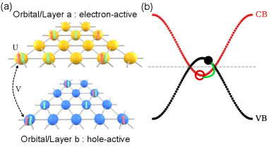

**図1：ハバードU依存の凝縮温度$T_c$。**DMFT+QMCにより計算された励起子絶縁体転移温度$T_c$のオンサイトU依存性。Uが増大するにつれて$T_c$が系統的に低下することが示される。弱相関BCS描像では予測されないこの抑制が、実験系（1T-TiSe₂・Ta₂NiSe₅）で観測される低$T_c$を説明する核心的結果。（CC BY 4.0、Zeng et al., arXiv:2603.18445）

**図2：多軌道系における電子-正孔ペアリングチャネル間の競合。**（三軌道モデルでの計算結果）複数のペアリングチャネル（軌道の組み合わせ）が競合するとき、それぞれが他を抑制し合い$T_c$がさらに押し下げられる。二軌道系との比較でこの競合効果が定量的に示される。励起子絶縁体の設計において「軌道数と対称性」が$T_c$を決める重要因子であることを示唆。（CC BY 4.0、Zeng et al., arXiv:2603.18445）

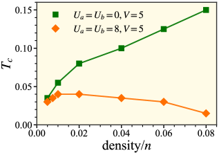

**図3：相転移の温度依存性。**励起子秩序パラメータ（電子-正孔対凝縮の振幅）の温度依存性。Uが大きいほど相転移が二次から一次へ変化する傾向も示される。この相転移の性質の変化は実験的に観測可能な熱的異常（比熱ジャンプ・潜熱）と対応し、実験との比較指針を与える。（CC BY 4.0、Zeng et al., arXiv:2603.18445）

---

# 非磁性無秩序導入による量子臨界点への到達：(Ca,Sr)₃Rh₄Sn₁₃

## 1. 論文情報

**タイトル：** [Reaching Quantum Critical Point by Adding Non-magnetic Disorder in Single Crystals of Superconductor (Ca_x Sr_{1-x})₃Rh₄Sn₁₃](https://arxiv.org/abs/2603.17777)
**著者：** Elizabeth H. Krenkel, Makariy A. Tanatar, Romain Grasset, Marcin Kończykowski, Shuzhang Chen, Cedomir Petrovic, Alex Levchenko, Ruslan Prozorov
**arXiv ID：** 2603.17777
**カテゴリ：** cond-mat.supr-con, cond-mat.mtrl-sci
**公開日：** 2026年3月18日
**論文タイプ：** 実験論文（電子線照射・電気抵抗・ホール効果）
**ライセンス：** CC BY 4.0

---

## 2. 研究概要

(Ca$_x$Sr$_{1-x}$)₃Rh₄Sn₁₃は電荷密度波（CDW）と超伝導（SC）が競合する系で、Ca濃度$x$の増加でCDW転移温度が下がり量子臨界点（QCP）に近づくが、$x$によるチューニングには試料作製の困難が伴う。本研究では電子線照射（2.5 MeV電子、点欠陥導入）を用い、特定の組成（$x = 0.75$）の単結晶に非磁性無秩序を系統的に導入し、CDW秩序を照射量の関数として段階的に抑制した。CDWが消滅する照射量でT線形抵抗率（$\rho \propto T$）が出現し、量子臨界的なプランク的散乱（Planckian dissipation）の特徴を示すことを確認した。組成$x = 0.75〜0.85$の範囲にQCPが存在することを精密に決定し、照射後の超伝導$T_c$がQCP近傍で増大・変調されることも示した。

この研究の重要性は「非磁性点欠陥が量子臨界点のチューニングパラメータとして機能する」という原理の実証にある。組成変化と等価な役割を欠陥密度が担えることで、同一組成の単結晶のみを使って量子相図を体系的に走査できる。$T$線形抵抗率とQCP近傍の超伝導増強という結果は、電荷密度波揺らぎが超伝導ペアリンググルーとして機能するという解釈と整合する。この手法は(Ca,Sr)₃Rh₄Sn₁₃に限らず、CDWと超伝導が競合する系（銅酸化物・有機超伝導体・鉄系等）に広く応用可能である。

---

## 3. 重要キーワードの解説

**1. 量子臨界点（quantum critical point, QCP）** 絶対零度における連続相転移点。QCP近傍では量子ゆらぎが支配し、$T$線形抵抗率・非フェルミ液体的比熱・超伝導増強などの異常が生じる。古典臨界点とは異なり、ゆらぎは時空間全域に広がる。

**2. 電荷密度波（CDW）** 伝導電子の密度が空間的に周期変調した秩序状態。フェルミ面のネスティングやフォノン不安定性が起源。転移温度$T_{\rm CDW}$以下でギャップが開き、電気抵抗に異常が現れる。

**3. 電子線照射（electron irradiation）** 高エネルギー電子（2.5 MeV）を単結晶に照射し、原子をはじき出して点欠陥（フレンケル対）を均一に導入する手法。欠陥密度は照射量（C/cm²）で精密制御可能。導入される欠陥は非磁性であるため磁気的影響を排除できる。

**4. プランク的散乱（Planckian dissipation）** 輸送散乱時間$\tau_{\rm tr}$がプランク定数と熱エネルギーのみで決まる$\tau_{\rm tr} = \hbar/(k_BT)$を満たす状態。T線形抵抗率はこれに対応する「最大散乱」の状態であり、非フェルミ液体・量子臨界系で特徴的に現れる。

**5. T線形抵抗率（$\rho \propto T$）** 抵抗率が温度に比例する異常。通常の金属ではフォノン散乱により$\rho \propto T^5$（低温）または$\propto T$（室温以上）だが、QCP近傍の低温で$T$線形が生じるのは量子臨界ゆらぎに起因する。

**6. 残留抵抗率（residual resistivity, $\rho_0$）** $T \to 0$での抵抗率。散乱体（不純物・欠陥）の密度に比例（マチーセン則）。照射量とともに$\rho_0$が増大することで欠陥導入量を定量できる。

**7. CDW転移温度$T_{\rm CDW}$の抑制** 点欠陥がCDWの長距離コヒーレンスを乱し、$T_{\rm CDW}$を低下・消滅させる。$T_{\rm CDW} \to 0$がQCPに対応する照射量。

**8. ホール係数（Hall coefficient, $R_H$）** 横磁気抵抗の係数$R_H = 1/(ne)$（単純金属近似）。キャリア密度や符号（電子型・正孔型）を反映。CDW転移でフェルミ面が再構成されると$R_H$が急変する。照射後の$R_H$変化がキャリア再分配の情報を与える。

**9. フレンケル対（Frenkel pair）** 原子がはじき出されて格子間に入り、元の位置に空格子点が残った点欠陥対。電子線照射で導入される主要な欠陥種。非磁性で点状（短距離散乱体）のため、系の量子状態を化学的に変えず量子相図を純粋に走査するのに適している。

**10. 超伝導$T_c$のドーム（superconducting dome）** QCP近傍で$T_c$が最大値を取り、QCPから遠ざかるにつれ減少するドーム状の相図。CDWゆらぎ・スピンゆらぎ・電荷ゆらぎがQCP近傍で高まり超伝導ペアリングを増強するという機構が提唱されている。

---

## 4. 図

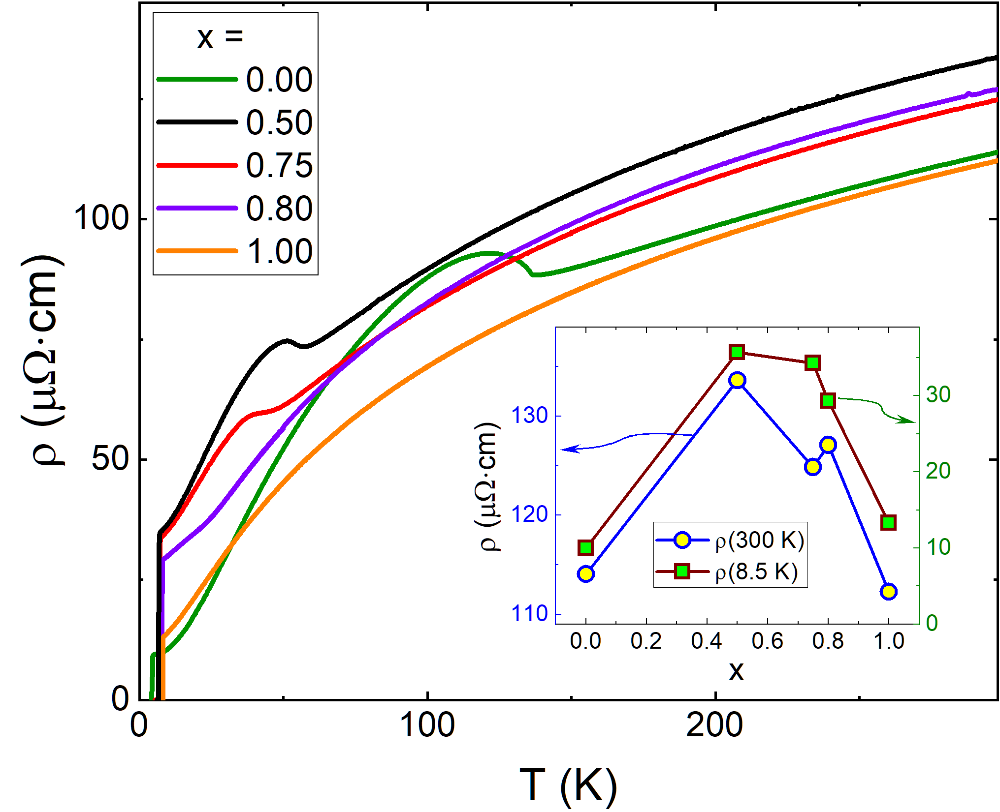

**図1：照射前の(Ca$_x$Sr$_{1-x}$)₃Rh₄Sn₁₃の温度依存抵抗率。**各組成$x$に対して$\rho(T)$を示す。CDW転移に伴うキンク（$T_{\rm CDW}$）と超伝導転移（$T_c$）が見られる。Caを増やすほどCDW転移温度が下降し、量子臨界組成（$x \approx 0.75〜0.85$）に近づくことが分かる。挿入図は二つの特徴温度の組成依存性。（CC BY 4.0、Krenkel et al., arXiv:2603.17777）

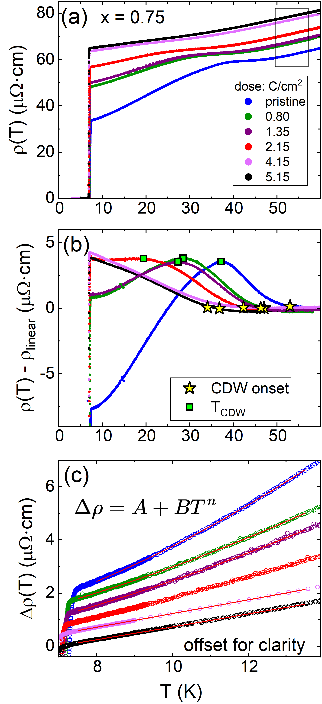

**図2：$x=0.75$組成に対する電子線照射の効果。**照射量を増やすにつれてCDW転移（$T_{\rm CDW}$、黄色星印）が段階的に低下・消失し、超伝導転移（$T_c$）が変調される様子が抵抗率曲線として示される。CDWが消失した照射量でT線形抵抗率が現れることが量子臨界点到達の証拠。（CC BY 4.0、Krenkel et al., arXiv:2603.17777）

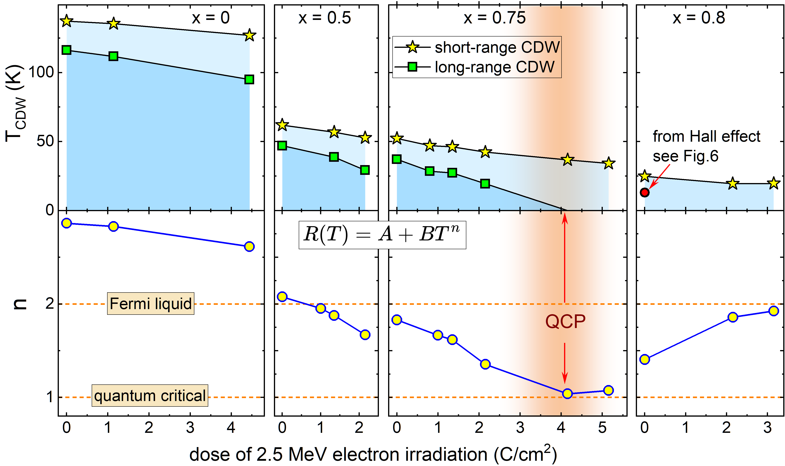

**図3：CDW転移温度と抵抗率指数の照射量依存性。**（上段）各組成の$T_{\rm CDW}$の照射量（点欠陥量）依存性。（下段）$\rho = \rho_0 + AT^n$でフィットした指数$n$の変化。$n=1$（T線形）がQCPに対応する照射量で実現することが示される。組成変化と照射による二つのチューニング軸を組み合わせることで量子相図の2次元マッピングが可能。（CC BY 4.0、Krenkel et al., arXiv:2603.17777）

---

# フェリ磁性体における直流電流駆動の可逆定常磁壁運動

## 1. 論文情報

**タイトル：** [Reversible Steady Domain-Wall Motion Driven by a Direct Current](https://arxiv.org/abs/2603.18722)
**著者：** K. Y. Jing, X. R. Wang, H. Y. Yuan
**arXiv ID：** 2603.18722
**カテゴリ：** cond-mat.mes-hall
**公開日：** 2026年3月19日
**論文タイプ：** 理論・マイクロ磁気シミュレーション論文
**ライセンス：** CC BY 4.0

---

## 2. 研究概要

磁壁（domain wall, DW）の電流駆動運動はレーストラックメモリ等の磁気メモリデバイスの中心的原理であるが、従来の強磁性体では電流の方向が固定されると磁壁も一方向にしか進まない。本研究はフェリ磁性体（二副格子反強磁性的結合で正味磁化がゼロに近い系）が角運動量補償点（AMCP）近傍にある場合、磁壁の慣性ダイナミクスが定常（steady）かつ可逆（reversible）な運動を可能にすることを理論的・マイクロ磁気的に示した。電流密度の大きさだけで磁壁の進む方向（順方向または逆方向）が制御でき、同一の直流電流から双方向の磁壁変位が引き出せることを3段階の運動レジームとして体系的に記述した。

この「電流強度で方向を制御できる磁壁」という原理は、従来の磁場・電流方向による制御とは本質的に異なる新しいスピントロニクス制御モードであり、低消費電力・高速・可逆な磁気メモリ・センサへの応用が期待される。フェリ磁性体の角運動量補償という特殊な材料条件（例：GdFeCo合金・希土類-遷移金属合金のGd/Fe比調整、または反強磁性的に結合した二層磁性薄膜）は、組成制御によって精密に調整できるため、材料工学的な実現可能性が高い。AMCPの存在と磁壁の慣性的ダイナミクスを組み合わせた設計は、反強磁性スピントロニクスの進展とも連携する。

---

## 3. 重要キーワードの解説

**1. フェリ磁性体（ferrimagnet）** 二つ以上の副格子が反平行に磁化しているが、副格子の磁化が等しくないため正味磁化がゼロにならない磁性体。GdFeCo・希土類-遷移金属合金が代表例。反強磁性に近い性質（低ストレイフィールド）と強磁性的な書き込みやすさを兼備。

**2. 角運動量補償点（angular momentum compensation point, AMCP）** フェリ磁性体において、二つの副格子のスピン角運動量の合計がゼロになる温度（または組成）。磁化補償点（MCP、正味磁化ゼロ）と区別される。AMCP近傍では磁気歳差の有効ジャイロ磁気比$\gamma_{\rm eff} \to 0$となり、磁壁の慣性的（反強磁性体的）ダイナミクスが現れる。

**3. 磁壁の慣性ダイナミクス（inertial dynamics of domain wall）** 磁壁が電流（またはトルク）によって加速・減速する際に、慣性モーメントのような質量的な項が効く描像。反強磁性体またはAMCP近傍のフェリ磁性体ではこの慣性項が支配的となり、非線形な速度-電流関係が生じる。

**4. 定常磁壁運動（steady domain-wall motion）** 磁壁が一定の速度で連続的に進む状態。非定常運動（振動・停止・崩壊）と対比される。定常運動では磁壁の傾き角（チルト角）が固定され、Walkerブレークダウンを超えた安定な運動が可能。

**5. 可逆磁壁運動（reversible domain-wall motion）** 同一の外部駆動（この場合、電流の「強さのみ」）を変化させることで磁壁の進む方向を反転できること。電流の「符号」を変えることなく方向制御できる点が従来系との根本的違い。

**6. スピン移送トルク（spin transfer torque, STT）** 電流の伝導電子がスピン角運動量を磁化に移送することで発生するトルク。磁壁を駆動する主要な機構の一つ。$\tau_{\rm STT} \propto j_e (\mathbf{m} \times \partial_x \mathbf{m})$。

**7. LLG方程式（Landau-Lifshitz-Gilbert equation）** 磁化ダイナミクスの基礎方程式：$\dot{\mathbf{m}} = -\gamma \mathbf{m} \times \mathbf{H}_{\rm eff} + \alpha \mathbf{m} \times \dot{\mathbf{m}} + \tau_{\rm STT}$。フェリ磁性体では副格子ごとに連立したLLG方程式を解く必要がある。

**8. Walkerブレークダウン（Walker breakdown）** 強磁性体において電流（または磁場）が臨界値を超えると磁壁の定常運動が崩れ、振動的不安定運動に移行する現象。AMCP近傍フェリ磁性体ではこれが拡張・変調される。

**9. レーストラックメモリ（racetrack memory）** 磁性ナノワイヤー中に多数の磁壁をシフトレジスター的に移動させてデータを読み書きする不揮発性メモリ概念（Parkin 2008）。高速・高密度・低消費電力が利点。磁壁の可逆制御は書き込み精度向上に直結。

**10. 副格子間結合定数（inter-sublattice coupling constant）** フェリ磁性体の二副格子間の交換結合$J_{12}$。$J_{12}$の大きさがAMCPの位置・磁壁慣性の強さ・可逆運動の電流窓幅を決める材料設計パラメータ。

---

## 4. 図

**図1：フェリ磁性体頭尾型磁壁と定常磁壁速度の模式図。**（a）頭尾型（head-to-head）フェリ磁性体磁壁の構造模式図。（b）直流電流による定常磁壁速度の三つの運動レジーム（青・橙・緑領域）。電流密度$j$の増加に伴って磁壁が負方向（逆進）から正方向（前進）へと切り替わる「可逆性」の核心が示される。AMCP近傍の慣性項が三つのレジームの分岐を生む。（CC BY 4.0、Jing et al., arXiv:2603.18722）

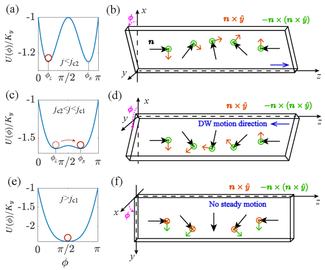

**図2：各電流密度レジームでのポテンシャル地形とスピントルク解析。**（a,b）$j < j_{c2}$、（c,d）$j_{c2} < j < j_{c1}$、（e,f）$j > j_{c1}$の三領域でのポテンシャル（実効エネルギー地形）と磁壁チルト角へのトルク方向（橙・緑矢印）。中間レジームで安定チルト角が反転することが可逆運動の微視的起源。（CC BY 4.0、Jing et al., arXiv:2603.18722）

**図3：磁壁速度-電流密度特性と応用提案。**（左）AMCP近傍での磁壁速度$v$対電流密度$j$の関係（マイクロ磁気シミュレーション点・理論曲線）。可逆運動の電流窓幅が正味スピン密度と副格子間結合の関数として示される。（右）磁壁運動ベースのセンサ概念図、および電流パルス印加後の磁壁変位の時間発展。同一の直流電流で双方向の変位が得られることが実証されている。（CC BY 4.0、Jing et al., arXiv:2603.18722）

