# 2026-03-21 量子機能デバイス

**作成日：** 2026年3月21日
**対象期間：** 2026年3月17日〜21日（直近72時間）

---

## 選定論文一覧

1. [量子材料バリアを用いたジョセフソン接合の機能設計：磁性・強相関・強誘電バリアの統合レビュー](#paper1) — 2603.17921
2. [原子スケール設計に基づくSb₂Te光導波路デバイスの高精度光フォノン計算](#paper2) — 2603.18468
3. [MBE成長Al/InAs/(Ga,Fe)Sbヘテロ構造における超伝導・強磁性の競合とジョセフソンダイオード効果](#paper3) — 2603.17101
4. [LaAlO₃/SrTiO₃界面2次元電子ガスのトポロジカル超伝導とマヨラナモード](#paper4) — 2603.18621
5. [電子流体力学的整流素子：GaAs 2DEGにおける電子テスラバルブ](#paper5) — 2603.16443
6. [干渉超伝導ナノワイヤを用いたDayemループ量子ビット設計](#paper6) — 2603.17214
7. [ScAlNの低抗電場化機構：構造軟化と動的原子相関の協奏](#paper7) — 2603.18710
8. [コルビノ型量子ホール系でのペルチェ冷却：ランダウ準位充填率依存性](#paper8) — 2603.18922
9. [フォノン偏極分離によるスピン格子熱輸送の制御と異常磁場依存性](#paper9) — 2603.18137
10. [1T-NbSe₂上グラフェンの人工超格子：電荷密度波駆動の自発的対称性破れ制御](#paper10) — 2603.15787

---

## 全体所見

今回は、量子材料バリアのジョセフソン接合における機能設計（磁性・強相関・強誘電）を包括的にレビューした論文を中心に、超伝導・強磁性半導体ヘテロ構造の実験研究、カルコゲナイド相変化材料を用いたフォトニックコンピューティングデバイスの原子スケール設計、LAO/STO界面のトポロジカル超伝導理論など、材料設計からデバイス機能へのつながりが明確な論文群を選定した。

各論文の位置づけを簡潔に述べると：2603.17921はQMJJというデバイス概念を磁性・相関・強誘電の3系統で整理した設計指針型レビュー；2603.18468はSb₂Teの準安定結晶相の発見から7ビット光プログラミングを実証した「原子からデバイスへ」の完結例；2603.17101はMBE成長ヘテロ構造で超伝導ダイオード効果と磁性起源の非相反輸送を実証した実験研究；2603.18621はLAO/STO 2DEGの多バンドモデルによるトポロジカル相図を与える理論研究；2603.16443はGaAs高移動度2DEGで電子流体力学的整流（10倍以上の整流比）を初めて実証；2603.17214はナノワイヤの量子干渉でトランズモン量子ビットに必要な非線形性を回復させる設計提案；2603.18710はML力場でScAlNの分極スイッチング機構を解明し設計指針を提示；2603.18922はコルビノ型QH系でのペルチェ係数の解析的定式化と冷却実証；2603.18137はスピン格子相互作用の対称性から磁場依存熱輸送異常を説明する理論；2603.15787はvdWヘテロ構造超格子エンジニアリングで対称性破れを構造的に制御した実験。

---

## 重点論文の詳細解説

---

## 1. 量子材料バリアを用いたジョセフソン接合の機能設計：磁性・強相関・強誘電バリアの統合レビュー

### 論文情報

| 項目 | 内容 |
|------|------|
| タイトル | [Quantum-Material Josephson Junctions: Unconventional Barriers, Emerging Functionality](https://arxiv.org/abs/2603.17921) |
| 著者 | Kathryn A. Pitton, Michiel P. Dubbelman, Trent M. Kyrk, Houssam El Mrabet Haje, Yaozu Tang, Roald J.H. van der Kolk, Yaroslav M. Blanter, Mazhar N. Ali |
| arXiv ID | 2603.17921 |
| カテゴリ | cond-mat.supr-con; cond-mat.mtrl-sci |
| 公開日 | 2026年3月18日（改訂：3月19日） |
| 論文タイプ | レビュー論文 |
| ライセンス | CC BY 4.0 |

### どんな研究か

ジョセフソン接合（JJ）のバリア層を、磁性・強相関・強誘電といった「内部自由度を持つ量子材料」に置き換えることで生じる新機能を体系的にレビューした論文である。従来の受動的バリアとは異なり、量子材料バリアはジョセフソン効果をスピン・相関・分極の状態依存プローブとして機能させ、0-π-φ接合、スピン三重項変換、非相反輸送、超伝導メモリ、フィールドフリー・ジョセフソンダイオード効果など、多様なデバイス機能を可能にする。

### 研究の概要

**背景と目的：** ジョセフソン接合はSQUID・超伝導量子ビット・電圧標準など超伝導デバイスの基本素子だが、バリアが非超伝導体の場合にその材料物性を積極的に利用する方向性（QMJJ: Quantum-Material Josephson Junction）が近年急速に発展している。本レビューはQMJJの3つのバリアファミリーを対象とする。

**磁性バリア：** 一様交換場を持つ強磁性バリアではクーパー対のコヒーレンス長が抑制されるが、非コリニア磁性や磁壁構造を導入することでスピン一重項→三重項変換が起き、長距離スピン三重項超電流が実現する。アルターマグネット（ゼロ正味磁化でバンドスピン分裂を持つ）は、磁場なしでの非相反ジョセフソン輸送・SC ダイオード効果・有限運動量クーパーペアリング（FFLO的状態）を理論的に可能にする。さらにアルターマグネットバリアではMajorana束縛状態の安定化も予測されている。

**強相関バリア：** Mott絶縁体・金属絶縁体転移近傍でバリアのCPR（電流-位相関係）が大きく変化する。弱相関金属ではSNS型の非正弦波CPR、Mott絶縁体側ではトンネル型の正弦波に近づく。Kagome Mott絶縁体（Nb₃X₈, X=Cl,Br,I）をバリアに用いたvdWヘテロ構造では、外部磁場なしでのジョセフソンダイオード効果が実証され（Dubbelman et al., arXiv 2512.17099）、ダイオード効率はバリアの相関強度に依存する。

**強誘電・マルチフェロイックバリア：** 残留分極を持ちスイッチ可能な強誘電バリアはJJの透過率を非揮発的に制御し、超伝導メモリ・メモリスティブ動作を可能にする。CuInP₂S₆・NiI₂・HZO系など多様なvdWおよびペロブスカイト強誘電体でのSC/FE/SC接合が報告されており、THz励起・ゲート電圧・光照射による分極制御も展望されている。

**観測された主な結果・デバイス含意：**
- NiI₂バリアJJでのSC整流（I_c⁺=600μA, I_c⁻=718μAの非対称性）
- KagomeMott絶縁体バリアでの外場フリーJJダイオード（Nb₃Cl₈/Nb₃Br₈/Nb₃I₈で相関依存ダイオード効率）
- 強誘電JJでの超伝導記憶動作（分極状態依存の超電流制御）
- 実験的未開拓領域として：アルターマグネットバリア、カイラル量子ドットJJ、マルチフェロイックバリアの光制御

### 量子機能デバイスとして重要なポイント

QMJJにおける核心は、バリアの量子自由度（スピン構造・相関・分極）がジョセフソンのCPRに直接刻印されるという点にある。従来の受動バリアではCPRは接合の幾何学と材料定数のみで決まるが、QMJJではバリアのスピン状態・相関強度・分極向きによってCPRが能動的に制御できる。これは「材料内部自由度をデバイス応答の制御ノブとして使う」という設計思想であり、外部磁場・ゲート電圧・光・THz等の外場による非接触制御が可能になる。特に、強相関Kagome系でのフィールドフリーJJダイオードはSC整流素子の実用的設計条件（磁場不要・電気的チューナブル）を満たす最近の重要成果であり、スピントロニクス回路・量子コンピューティング素子へのアーキテクチャ上のインパクトは大きい。

### 限界と注意点

本論文はレビュー論文であるため、各系での主張の検証深度に差がある。磁性バリアについては実験的証拠が豊富だが、アルターマグネットバリアはほぼ理論予測のみで実験例はほとんどない。強相関バリアのCPRの直接測定（位相感応測定）は行われておらず、Kagome系のJJダイオード効果の機構（相関起源か界面効果かトポロジカル効果か）は未解明のまま残る。強誘電バリアについては、JJ動作中の分極安定性（電流・熱ゆらぎ耐性）や疲労・クリープ挙動が未評価の系が多い。各バリアファミリー間の比較も定量的でなく、どのバリア設計が最もデバイスとして優位かの指針は与えられていない。

### 関連研究との比較

JJ研究の歴史は長く、強磁性バリアJJや強誘電トンネル接合は独立した分野として発展してきたが、本レビューの特徴は「量子材料バリア」という統一的視点でこれらを整理し、CPRを共通の観測量として比較した点にある。Buzdin (Rev. Mod. Phys. 2005)による強磁性近接効果の古典的レビューから20年を経て、vdW材料の登場によって界面設計の自由度が飛躍的に増した現状を反映している。特にKagome系JJダイオード（Wu et al., Nature 2022; Dubbelman et al., arXiv 2025）はSC整流効果の実験的確立として重要な先行研究であり、本レビューはその設計論的拡張として位置づけられる。

今後の展開として特に重要なのは、アルターマグネット系でのJJデバイス実証と、強誘電バリア系での非揮発的SC記憶の統合デバイス化である。vdW積層技術の精度向上により、バリア層の原子層厚制御・ツイスト角制御がQMJJの新たな設計パラメータとして機能する可能性も高い。

### 重要キーワードの解説

1. **ジョセフソン効果 (Josephson effect)：** 二つの超伝導体を弱結合（絶縁体・常伝導体・弱い超伝導体）で結ぶと、位相差φに依存した超電流 I_s = I_c sin(φ) が流れる（DC効果）。電圧V印加時には角周波数ω = 2eV/ℏで超電流が振動する（AC効果）。CPR（電流-位相関係）はバリアの物性により正弦波から大きく変形しうる。

2. **0-π-φ接合：** 通常のJJはφ=0が安定基底状態（0接合）。強磁性バリアでは交換場によるクーパー対の位相ずれが蓄積し、φ=πが安定になるπ接合が生じる。φ接合はφ≠0,πで安定なCPRを持ち、非対称バリア（SOC+交換場の組み合わせ）で実現される。

3. **スピン三重項超電流 (spin-triplet supercurrent)：** 通常のs波超伝導ではクーパー対はスピン一重項（↑↓）。非コリニア磁性バリアで局所磁化方向が変化すると、スピン1重項→3重項変換が起き、スピン完全偏極の強磁性体中でも長距離伝播できる三重項超電流が生成される。

4. **アルターマグネット (altermagnet)：** 反強磁性と同様にゼロ正味磁化を持つが、時間反転対称性とリアル空間対称性の組み合わせでのみ等価であるため、運動量空間でスピン分裂した電子バンドを持つ。代表材料：RuO₂, MnTe。外部磁場なしでスピン分極した輸送を担える点でスピントロニクスへの応用が期待される。

5. **強相関バリア・Mott絶縁体：** 電子間クーロン相互作用がバンド幅より大きいとき、バンド理論では金属のはずの系がMott絶縁体になる。JJバリアとしてのMott絶縁体は、金属絶縁体転移近傍で超電流・CPRが劇的に変化し、相関強度のチューニングがデバイスパラメータとして機能する。

6. **ジョセフソンダイオード効果 (Josephson diode effect)：** 正方向と逆方向の臨界電流が異なる（I_c⁺ ≠ |I_c⁻|）非相反超電流輸送。整流比η = (I_c⁺ − |I_c⁻|)/(I_c⁺ + |I_c⁻|)で定量化される。時間反転対称性の破れ＋空間反転対称性の破れが同時に必要で、磁性・SOC・非対称構造の組み合わせで実現される。

7. **強誘電トンネル接合 (ferroelectric tunnel junction, FTJ)：** 超薄膜強誘電体をトンネルバリアとして挟んだ接合。分極状態によりトンネル透過率が変わる（トンネル電気抵抗効果，TER）。SC電極と組み合わせると超電流も分極依存になり、超伝導メモリ素子として機能しうる。

### 図

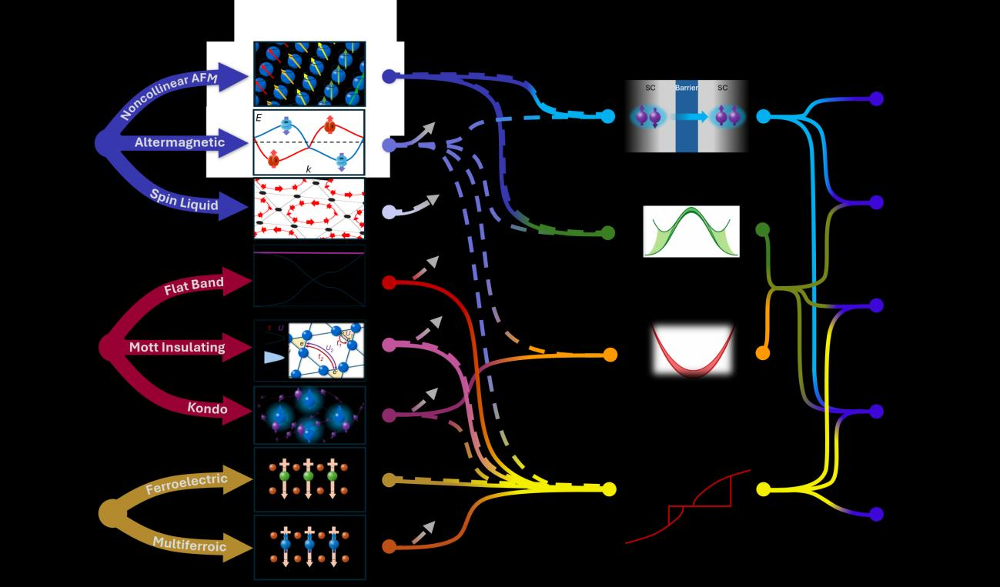

**図1：** QMJJのバリアクラス概略図。磁性バリア（強磁性・非コリニア・アルターマグネット）、強相関バリア（Mott絶縁体・相関金属・Kagome系）、強誘電・マルチフェロイックバリアの3系統と、それぞれで予測・実証されている現象（0-π-φ接合、スピン三重項変換、ダイオード効果、SC記憶等）が整理されている。破線は理論予測のみの経路、実線は実験的に確認された経路を示す。量子材料バリアをどの系で選択するかによって得られるJJ機能が異なることが一目で把握できる。

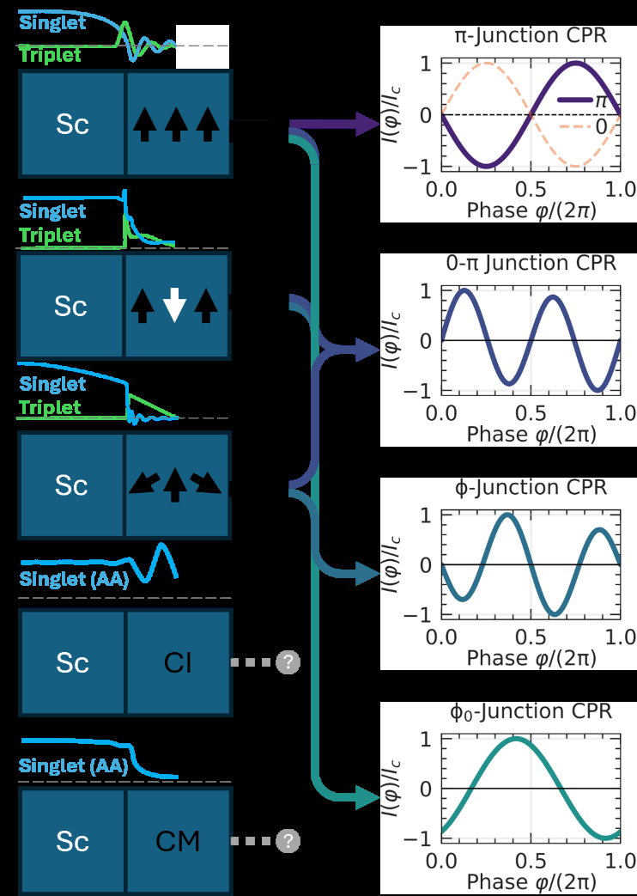

**図2：** 各バリアファミリーにおけるJJの概略図と空間的ペア振幅・CPR状態のまとめ。強相関絶縁体（CI）・強相関金属（CM）についてはFreericks et al.の異常平均を用いたペア振幅近似が示されている。CPRの形状（正弦波・非正弦波・符号反転）と空間的ペア振幅分布がバリア材料によってどう変化するかが視覚的に整理されており、設計指針として有用。

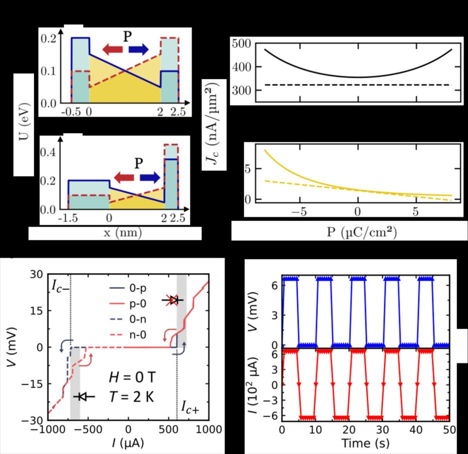

**図3：** 強誘電JJにおける分極制御超電流。(a) 対称・非対称の誘電体-強誘電体-誘電体バリアのポテンシャルプロファイルと分極方向依存の臨界電流密度計算。(b) NiI₂バリアJJのV-I特性（電流スイープ方向別）。I_c⁺=600μA, I_c⁻=718μAの非対称性（整流動作範囲をシャドウで示す）。(c) 超電流整流の実証（I_bias=±650μA）。強誘電分極が超電流の大きさと方向選択性を非揮発的に制御できることを示す最新の実験結果。

---

## 2. 原子スケール設計に基づくSb₂Te光導波路デバイスの高精度光プログラミング

### 論文情報

| 項目 | 内容 |
|------|------|
| タイトル | [Optimization of all-optical phase-change waveguide devices for photonic computing from the atomic scale](https://arxiv.org/abs/2603.18468) |
| 著者 | Hanyi Zhang, Wanting Ma, Wen Zhou, Xueqi Xing, Junying Zhang, Tiankuo Huang, Ding Xu, Xiaozhe Wang, Riccardo Mazzarello, En Ma, Jiang-Jing Wang, Wei Zhang |
| arXiv ID | 2603.18468 |
| カテゴリ | cond-mat.mtrl-sci |
| 公開日 | 2026年3月19日 |
| 論文タイプ | 実験・理論統合研究 |
| ライセンス | CC BY 4.0 |

### どんな研究か

カルコゲナイド系相変化材料（PCM）Sb₂Teの準安定結晶相（無秩序菱面体晶相）の光学特性をDFT計算・実験の両面から解明し、「短いほど良い」という反直観的な導波路設計戦略を導いた研究である。この戦略に基づいて作製したSb₂Te/SOI光導波路デバイスで、単一セルで7ビット超（158レベル）の光プログラミングを達成し、全光位相変化メモリとして世界記録を更新した。

### 研究の概要

**背景と目的：** フォトニックニューロモルフィックコンピューティングでは、相変化材料の光透過率を多値制御することで1セルに多ビット情報を格納・処理できる。従来はGST（Ge₂Sb₂Te₅）系が主流だが、オン/オフ比（プログラミングウィンドウ）と光学損失の両立が困難だった。Sb₂Te（ST）は非常に速い結晶化速度が知られているが、その光学特性の詳細は未解明だった。

**材料・構造：** SOI（Silicon-on-Insulator）導波路上に薄膜（厚さhST=10nm、長さdST可変）のSb₂Teを堆積したプラナー導波路型デバイス。

**計算・実験手法：**
- DFT（ハイブリッド汎函数）による非晶質（a-ST）・準安定結晶（m-ST）・安定結晶（g-ST）の3相の電子状態・光学定数計算
- AIMD（ab initio分子動力学）によるメルトクエンチ法での非晶質モデル生成
- FDTD（有限差分時間領域法）による導波路デバイス設計シミュレーション
- XRD・Raman分光・HAADF-STEM・原子EDS・透過率実験

**主な結果：**
- DFT計算がm-ST（無秩序菱面体晶相）の光学コントラストがg-ST（安定結晶）よりも大きいことを予測。この「逆方向の光学変化」はGSTとは逆であり、先行研究では確認されていなかった。
- HAADF-STEMにより160°C焼結ST（m-ST）と300°C焼結ST（g-ST）の構造差を原子スケールで確認。m-STのSbとTeの局所乱れがm-STの光学特性に対応。
- 「短いほど良い」戦略（dST=1μm）：導波路長を短縮するとa-ST状態での透過率が増加（42.8%→80.3%）し、光損失が低減、かつm-ST状態でのプログラミングウィンドウが維持される。
- dST=1μm、全光学的プログラミング（パルスレーザー）で158透過率レベル（>7ビット精度）を実証。これは全光位相変化メモリの世界記録。
- MNIST手書き文字認識の予測精度シミュレーションで、158レベル時に高精度（ほぼデジタル精度に近い）を達成。

### 量子機能デバイスとして重要なポイント

本研究の本質は「原子秩序が光学的コントラストを逆転させる」という非直観的機構を計算で先行予測し、それを実験で確認した上でデバイス最適化まで完結させた点にある。Sb₂Teにおける準安定相（m-ST）の発見的意義は、結晶相の秩序度と光学応答の関係がGSTとは逆であるという点で材料設計原理を書き換えるものだ。「短いほど良い」戦略は直観と逆だが、m-STの大きな光コントラストを活かすためには光学損失（k値の増大）をデバイス長で補償するより、短いセルで高コントラストを取る方が有利という定量的根拠を持つ。フォトニックニューロモルフィックコンピューティングの観点では、7ビット超の多値プログラミングは脳型アナログ演算に必要なシナプス重みの精度を確保する上で重要な閾値を超えた成果である。

### 限界と注意点

本研究はSb₂Te単一系に特化しており、他のカルコゲナイド（GST, InSe-Te等）との系統的比較はない。158レベルの達成は実証されているが、長期安定性（結晶状態間の熱的なクリープ・疲労）は評価されていない。フォトニックデバイスとしての実用温度範囲（室温近傍での安定性）と動作速度（GHz帯域での全光スイッチング速度）の評価も今後の課題。また、DFT計算の近似（ハイブリッド汎函数を用いても非晶質モデルのサイズ依存性・配位数分布の揺らぎ）が光学定数の定量的精度に影響しうる。

### 関連研究との比較

GST系の光学的相変化デバイスは商業製品（再書き込み可能光ディスク、PCMメモリ）として確立されており、フォトニックコンピューティングへの応用は2017年頃から急速に発展した（Rios et al., Nature Photonics 2015など）。Sb₂Te系はGSTより高速結晶化が知られるが、光学デバイスとしての詳細な評価は少なかった。本研究は計算予測の実験検証→デバイス最適化という「原子からデバイスへ」の完結したフローを示した点で、PCM系光デバイス研究における方法論的貢献も大きい。158レベルという世界記録は、従来のGST系や他PCM系の光記録精度（数十レベル）を大きく上回り、フォトニックニューロモルフィックコンピューティングの実用化に向けた重要な技術的マイルストーンとなる。今後、doped Sb-Te系や多層構造での拡張、シリコンフォトニクス集積との組み合わせが期待される。

### 重要キーワードの解説

1. **相変化材料 (phase-change material, PCM)：** 結晶相と非晶質相の間で可逆的に遷移できる材料。光・電気パルスでナノ秒〜マイクロ秒で相転移し、電気抵抗や光反射率が大きく変わる。情報記録・処理への応用が広い。

2. **準安定結晶相（m-ST）：** Sb₂Teが300°C以上で安定になる六方晶相（g-ST）とは異なる、約160°Cの熱処理で形成される無秩序菱面体晶相。SbとTeの原子位置がランダムに混合した構造で、安定結晶と非晶質の中間的光学定数を持つ。

3. **光学定数 n, k（屈折率・消衰係数）：** 複素屈折率 ñ = n + ik。nが光の位相速度、kが吸収を決める。kが大きいほど光損失が大きい。PCMデバイスでは相変化による n, k の変化（コントラスト）がプログラミングウィンドウを決める。

4. **SOI光導波路 (silicon-on-insulator waveguide)：** シリコンフォトニクスの基板プラットフォーム。絶縁体（SiO₂）上のSi層が光を全反射で閉じ込め伝播させる。PCM薄膜をSi導波路上に堆積することで、相変化による透過率制御が可能になる。

5. **FDTD法（有限差分時間領域法）：** マクスウェル方程式を時空間で離散化してシミュレートする電磁界計算法。導波路の電場分布・透過スペクトルを精度良く計算できる。PCM導波路設計の最適化に標準的に使われる。

6. **フォトニックニューロモルフィックコンピューティング：** ニューラルネットワークの演算（行列積・積和演算）を光学的に実行するコンピューティングアーキテクチャ。PCMセルがシナプス重みのアナログ記憶素子として機能する。低消費電力・高並列性が特徴。

7. **DFT（密度汎函数理論）・ハイブリッド汎函数：** 電子構造を第一原理的に計算する方法。標準的なGGA汎函数よりも計算精度が高いハイブリッド汎函数（HF交換の一部を混合）を使うことで、光学定数の計算精度が向上する。Sb₂Te系のような半導体・準金属系でのバンドギャップ精度に重要。

### 図

**図1：** Sb₂Teの第一原理計算結果。(a) 液体・非晶質・準安定結晶・安定結晶の4相間の多段階相転移経路。(b) 3固相の状態密度（DOS）：a-STは明確なギャップを持ち、g-STは擬ギャップ、m-STはフェルミ準位付近に窪みを持つ。(c) ハイブリッド汎函数で計算した屈折率n・消衰係数kのスペクトル。m-STとa-STのコントラストがg-STとa-STより大きい（特に1500nm以上）ことが示され、m-STを活用した設計の優位性の理論的根拠となる。

**図2：** ST薄膜の構造・光学特性評価。(a) 各焼結条件でのXRDパターン（m-ST相とg-ST相のピーク位置比較）。(b) ラマンスペクトル（相識別のフィンガープリント）。(c) 測定された光学定数n, kスペクトル（計算予測との比較）。DFT計算がm-STの光学特性逆転を正確に予測していることを実験的に確認。これにより「計算による材料予測→デバイス設計」という方法論の有効性が示される。

**図3：** ST薄膜の原子スケール構造解析。(a,b) 160°C焼結（m-ST）と300°C焼結（g-ST）のHAADF-STEM像。(c,d) 対応するEDS原子マッピング（Sb, Te分布）。m-STでは原子位置が規則的でなくSbとTeが混合した状態が観測され、g-STでは規則的な積層構造が確認される。この構造差が光学定数の差（m-STの大きなコントラスト）の直接的原因であることを示す重要な実験証拠。

---

## 3. MBE成長Al/InAs/(Ga,Fe)Sbヘテロ構造における超伝導・強磁性の競合とジョセフソンダイオード効果

### 論文情報

| 項目 | 内容 |
|------|------|
| タイトル | [Interplay of superconductivity and ferromagnetism in ferromagnetic semiconductor-based Josephson junctions](https://arxiv.org/abs/2603.17101) |
| 著者 | Hirotaka Hara, Lukas Baker, Axel Leblanc, Shingen Miura, Keita Ishihara, Melissa Mikalsen, Patrick J. Strohbeen, Jacob Issokson, Masaaki Tanaka, Javad Shabani, Le Duc Anh |
| arXiv ID | 2603.17101 |
| カテゴリ | cond-mat.supr-con; physics.app-ph |
| 公開日 | 2026年3月17日 |
| 論文タイプ | 実験研究 |
| ライセンス | CC BY 4.0 |

### どんな研究か

東大・NYU共同研究で、強磁性半導体(Ga,Fe)Sbを含む全エピタキシャルAl/InAs/(Ga,Fe)Sbヘテロ構造をMBEで成長し、近接効果による超電流と強磁性の競合を実験的に明らかにした論文。デバイスは明確な超電流・多重アンドレーエフ反射・ゲート可変超電流を示し、特に強磁性由来の非対称フラウンホーファーパターン・磁束ジャンプ・非相反臨界電流（超伝導ダイオード効果）を観測した。強磁性半導体ヘテロ構造がSC-FM競合の研究と超伝導ダイオードデバイス開発の新プラットフォームになることを示した。

### 研究の概要

**材料設計：** GaAs(001)基板上に低温MBE（250°C以下）でAlSb/AlAs緩衝層→(In,Ga)As（19%In, 5nm）→InAs（15nm）→(Ga,Fe)Sb（14.6%Fe, 20nm）をin situで連続成長し、最後に-40°C以下でAl（10nm）を成長。Fe偏析を抑制するため全工程を超高真空内で完結させ、原子的に急峻なAl/(In,Ga)As界面を実現した。

**界面・結晶性の評価：** TEM（透過型電子顕微鏡）でAl[111]方向の面内成長とAl/(In,Ga)As界面の急峻性を確認。シュブニコフ・ドハース振動から移動度μ=3.2×10³ cm²V⁻¹s⁻¹を評価。磁気円偏光二色性（MCD）とSQUID磁力計が(Ga,Fe)Sbの強磁性履歴を明確に示した（5Kでの保磁場≈0.7mT）。

**ジョセフソン接合デバイス：** 電子線リソグラフィーで定義した接合（幅W×長さL）を30mKで測定。ゼロ抵抗状態と臨界電流を観測。dI/dVスペクトルで多重アンドレーエフ反射（MAR）ピーク（n=±1〜±6）を同定し、フィッティングから超伝導ギャップΔ=171μeVを決定。ゲート電圧Vgによる超電流の連続的制御（Vg<0で電子密度・超電流が単調減少）を確認。

**非相反輸送・超伝導ダイオード効果：** 垂直磁場B下でのフラウンホーファーパターンが著しく非対称（磁場掃引方向依存の磁束ジャンプ、非対称ローブ構造）。臨界電流の正逆方向比（非相反性η）が磁場に対して反対称（時間反転対称性の破れを示唆）。FFT解析で超電流が接合端部に集中する傾向を確認（エッジ状態の可能性）。ゲート電圧掃引でフラウンホーファーパターンが複数のピーク構造を示し、フェルミ準位依存のエッジチャネルの存在を示唆。

### 量子機能デバイスとして重要なポイント

本研究の鍵は、in situ MBE成長による原子的急峻な界面の実現にある。従来のFMS（強磁性半導体）を用いたSC/FM接合研究の多くはex situ作製で界面品質が低く、信頼性の高い近接超電流の評価が困難だった。本研究ではAl/(In,Ga)As界面の清浄性を直接確認し、MARピークという直接的な近接超電流の証拠を得た。さらに、電気ゲートで交換エネルギーとキャリア密度の両方を同時制御できるという強磁性半導体特有の機能が、超伝導ダイオード効率のゲートチューナビリティとして実証されている。非対称フラウンホーファーパターン・磁束ジャンプ・非相反臨界電流はすべて強磁性からの誘起効果に起因し、Majoranaエッジ状態の前駆的証拠とも解釈しうる。SC-FM競合×半導体ゲート制御というプラットフォームは、スケーラブルな超伝導スピントロニクス素子・トポロジカル量子ビット基板として重要な設計戦略を提示している。

### 限界と注意点

非相反臨界電流の観測は強磁性誘起と解釈されているが、界面の非対称性・試料形状の不完全性なども寄与しうる。エッジ状態の証拠はFFT解析とフラウンホーファーのノードリフティングによる間接的なものであり、直接的なエッジモード観測（弾道輸送やゼロバイアス伝導ピーク等）は示されていない。移動度3.2×10³ cm²V⁻¹s⁻¹は平均自由行程～100nm程度を示唆し、拡散輸送体制にある可能性がある。また、測定は単一試料・単一デバイス設計での結果であり、再現性・サイズ依存性の系統的評価は今後の課題。

### 関連研究との比較

先行するFMS-JJ研究の多くはNb/(In,Fe)As系（Nagase et al.等）でex situ作製であり、長距離近接効果・ヒステリシスが観測されているものの界面品質の不確定性が残っていた。本研究はAl/InAs系（既に確立されたゲートモン・Majoranaプラットフォーム）の界面設計を流用することで、in situかつ原子的急峻な界面を実現した点で質的に前進している。比較系としてはAl/InAs/InP系の強磁性ゲート接合（Shabani group等）があるが、FMSを積層することで内部交換場を利用できる点が本系の独自性である。超伝導ダイオード効果の観点では、最近のSOI系・Rashba系でも報告例があるが、ゲート制御可能なFMS起源のダイオードは新プラットフォームとしての意義が大きい。今後、スピン三重項超電流の探索（長距離超電流のFe濃度依存性）と、Majorana物理への接続（トポロジカル転移の磁場-ゲート相図の探索）が期待される。

### 重要キーワードの解説

1. **近接効果 (proximity effect)：** 超伝導体と常伝導体が清浄な界面で接触すると、クーパー対の波動関数が常伝導側に染み出て近接超電流が生じる。界面の透明性（バリアの低さ）が近接超電流の大きさを決める。Al/InAs系はSchottkyバリアが低く近接効果が大きいことで知られる。

2. **多重アンドレーエフ反射 (multiple Andreev reflection, MAR)：** JJにバイアス電圧V=2Δ/ne（n=整数）を印加すると、アンドレーエフ反射が繰り返し起き、dI/dV特性に特定電圧位置でのピーク構造（サブギャップ構造）が現れる。近接超電流とギャップの直接的証拠。

3. **フラウンホーファーパターン：** 均一な電流分布を持つJJを垂直磁場下で測定すると、臨界電流がI_c(B)∝|sin(πΦ/Φ₀)/(πΦ/Φ₀)|の干渉パターンを示す（フラウンホーファー回折に類似）。Φ₀=h/2eは磁束量子。非対称パターンはエッジ電流・不均一電流分布・時間反転対称性の破れを示す。

4. **超伝導ダイオード効果：** 正・逆方向の臨界電流が異なる非相反超伝導輸送（I_c⁺≠|I_c⁻|）。SC整流素子として機能する。強磁性体・SOC・反転対称性の破れの組み合わせで生じる。

5. **強磁性半導体 (ferromagnetic semiconductor, FMS)：** 半導体のキャリア制御性と強磁性の交換相互作用を合わせ持つ材料。(Ga,Mn)As, (In,Fe)As, (Ga,Fe)Sb等。ゲート電圧でキャリア濃度・交換エネルギーを制御できる。

6. **MBE（分子線エピタキシー）：** 超高真空中で材料を加熱蒸発させ、基板上に原子層単位で結晶薄膜を成長させる技術。原子的急峻な界面と高純度結晶性が得られる。FMS/半導体/SC界面の設計に不可欠。

7. **type-III バンドアライメント（broken gap）：** InAsとGaSbのバンドアライメントでは、InAsの伝導帯下端がGaSbの価電子帯上端より低くなる「broken gap」が生じる。これにより界面に自発的な電荷移動が起き、InAs側に電子が局在する。この空間的分離がInAs中の大きな磁気近接効果（スピン分裂18meV）の原因。

### 図

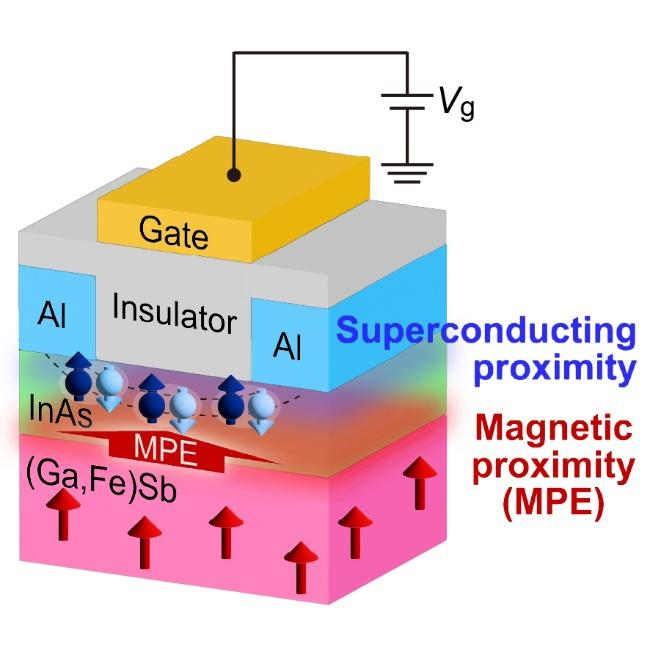

**図1：** 本研究の概念図。Al超伝導電極からInAs層への近接超電流と、(Ga,Fe)Sb強磁性半導体層からInAsへの磁気近接効果（交換スピン分裂）の両方がInAs層に同時に誘起される仕組みを図示。ゲート電圧によってInAs中のキャリア密度と交換スピン分裂が同時に制御可能であり、これがプラットフォームとしての独自性の核心。Al/InAs/(Ga,Fe)Sb積層設計とゲート電極配置が示されている。

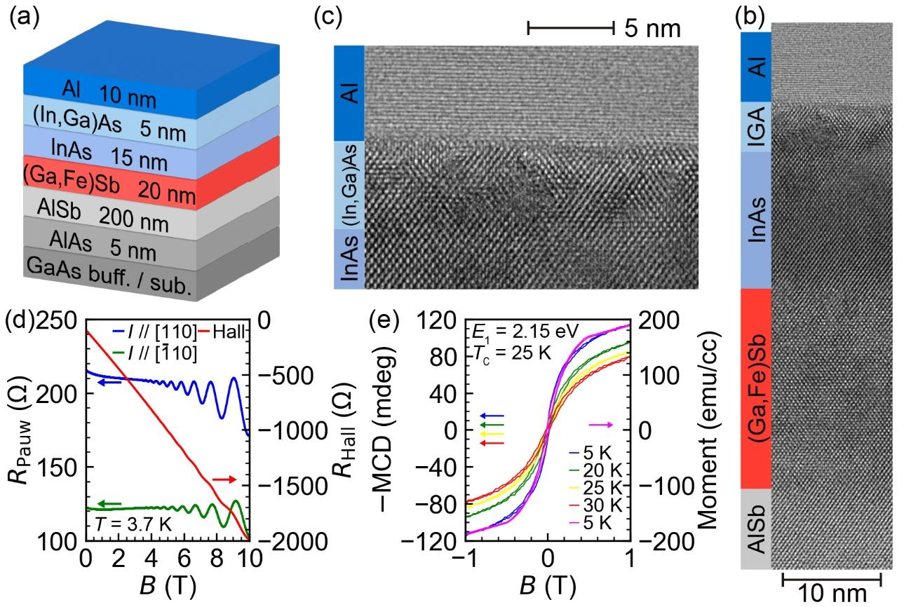

**図2：** ヘテロ構造の構造・磁気特性評価。(a) MBE成長条件と積層図。(b,c) TEM断面像：(In,Ga)As/InAs/(Ga,Fe)Sbの亜鉛ブレンド結晶構造とAl[111]成長方向、Al/(In,Ga)As界面の急峻性を確認。(d) シュブニコフ・ドハース振動から移動度の推定。(e) MCD・SQUID磁気ループ（保磁場0.7mT、強磁性確認）。材料創製品質の多面的な実証。

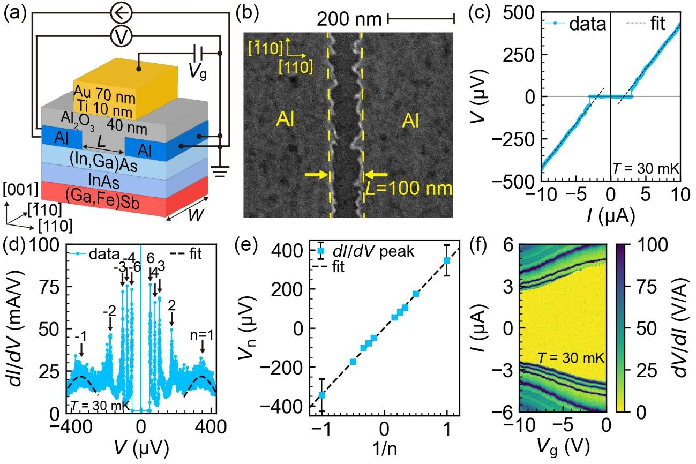

**図3：** ジョセフソン接合デバイスの輸送測定。V-I特性によるゼロ抵抗超電流の確認、dI/dV-V特性でのMAR多重ピーク（n=±1〜6、Δ=171μeV）、ゲート電圧Vgによる超電流の連続的制御。非対称フラウンホーファーパターン（掃引方向依存の磁束ジャンプ・非相反ローブ構造）と非相反性ηの磁場依存性（反対称性）が示され、強磁性誘起の時間反転対称性破れと超伝導ダイオード効果の直接証拠となる。

---

## その他の重要論文

---

## 4. LaAlO₃/SrTiO₃界面2次元電子ガスのトポロジカル超伝導とマヨラナモード

### 論文情報

| 項目 | 内容 |
|------|------|
| タイトル | [Topological superconductivity of a two-dimensional electron gas at the (001) LaAlO₃/SrTiO₃ interface](https://arxiv.org/abs/2603.18621) |
| 著者 | Piotr Żeberek, Paweł Wójcik |
| arXiv ID | 2603.18621 |
| カテゴリ | cond-mat.mes-hall; cond-mat.supr-con |
| 公開日 | 2026年3月19日 |
| 論文タイプ | 理論研究 |
| ライセンス | CC BY 4.0 |

### 研究概要

LAO/STO界面に形成されるt₂g軌道構造を持つ2次元電子ガス（2DEG）のトポロジカル超伝導とMajorana零モードを、現実的な多バンド強束縛モデルで理論的に解析した研究。垂直磁場では2D系でトポロジカル転移が起き、側方閉じ込め（ナノワイヤ化）によって面内磁場でもトポロジカル相に移行できることを示した。一部の軌道バンドは局在長が異常に長く、実験的に典型的なナノワイヤサイズ（数十格子）ではMajoranaを観測しにくいことも指摘した。

**重要性：** LAO/STO界面は超伝導・SOC・強磁性を共存させられる酸化物界面の代表系であり、Majoranaクビットに向けた材料プラットフォームとして高い関心を集めている。本研究は軌道多重度（dxy, dxz, dyz）を明示的に扱い、どのバンドがトポロジカル転移に寄与するか・バンド依存の臨界磁場・ナノワイヤ幅依存の位相図を与えることで、デバイス設計上の定量的指針を提供している。Wannierセンタフロー解析によるバルクトポロジカル不変量の計算とエッジ状態のリアルスペース確認が揃っており、主張の信頼性は高い。

### 重要キーワードの解説

1. **t₂g軌道分裂：** SrTiO₃のTi 3d電子はO₆八面体場でt₂g（dxy, dxz, dyz）とe_g（dx²-y², dz²）に分裂。LAO/STO界面ではdxyが最低エネルギーで占有され、dxz, dyzが少し上にある。軌道の異方性がSOC・バンドトポロジーに大きく影響する。

2. **ラシュバスピン軌道結合 (Rashba SOC)：** 空間反転対称性の破れた系では電子のスピンが運動量に垂直に結合するラシュバ効果が生じる。H_R = α_R (σ×k)·ẑ。界面2DEGでは界面ポテンシャル勾配がラシュバ効果の起源。

3. **Chern数：** トポロジカル不変量の一つ。2Dバンド構造のベリー曲率を全Brillouinゾーン積分した量。非ゼロChern数はトポロジカル非自明な相を示し、バルク-エッジ対応によりエッジ状態の数を決める。

4. **Majorana零モード：** 自身の反粒子に等しいフェルミオン励起。トポロジカル超伝導体のエッジに現れ、非アーベル統計と量子コンピューティングへの応用が期待される。実験的には零バイアスコンダクタンスピーク（ZBP）として観測が試みられる。

5. **Wannierセンタフロー：** バンド構造のトポロジーを、仮想的な局在ワニエ関数の「中心」が準運動量の一周期で何回巻き付くかで定量化する解析。Chern数・Z₂不変量の視覚的計算法。

6. **ヘリカルバンド（螺旋バンド）：** SOCにより上下スピン成分が逆の分散を持つバンド対。LAO/STOの2DEGでは化学ポテンシャルに依存してヘリカルバンドの底部が占有され始める閾値でトポロジカル相転移が起きる。

7. **局在長（coherence/localization length）：** Majoranaモードの波動関数が端部から指数減衰するスケール長。局在長がナノワイヤ長より長いと両端のMajoranaが混成してゼロエネルギーから外れてしまう（有限サイズ効果）。設計上はξ≪ナノワイヤ長が必要。

### 図

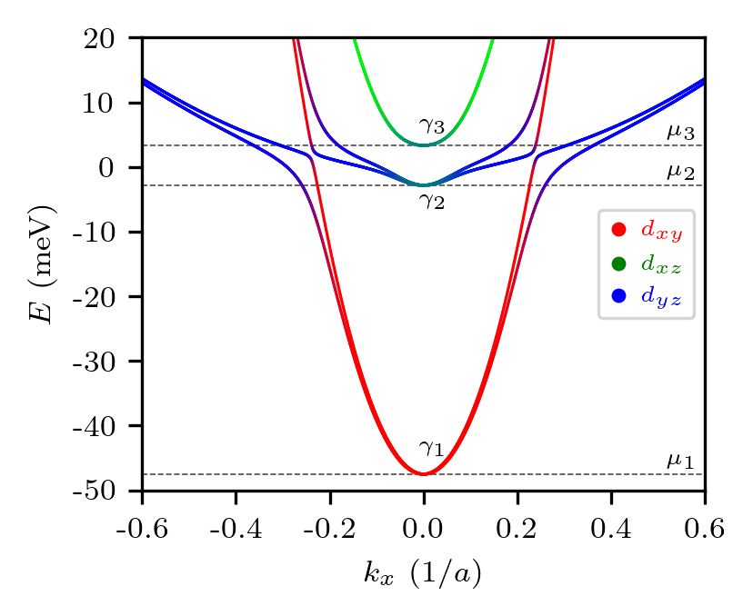
**図1：** LAO/STO 2DEGの分散関係（kx方向）。横軸は面内運動量kx、縦軸はエネルギー。t₂g各軌道（dxy, dxz, dyz）に起因する複数のバンドとSOC分裂が示される。化学ポテンシャルμlはヘリカルバンド底部に対応し、トポロジカル転移の開始点となる。

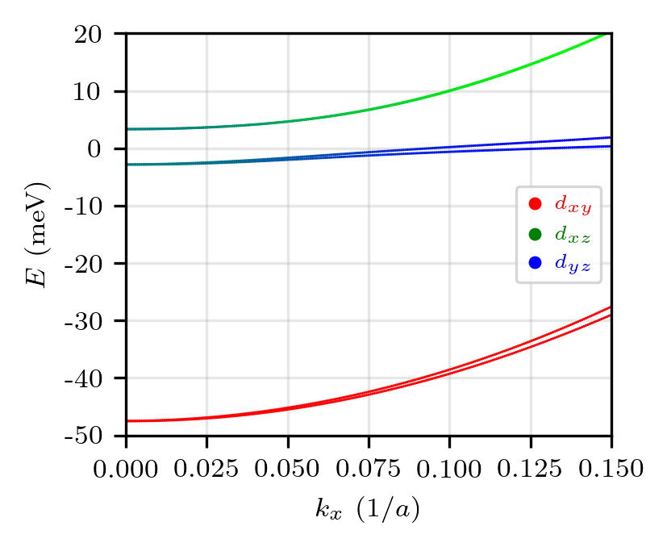
**図2：** 化学ポテンシャルと垂直磁場Bzの関数としてのChern数分布図（位相図）。バンドγ1, γ2, γ3ごとに異なるトポロジカル相領域（Chern数±1）が色分けで示され、トポロジカル転移の臨界磁場がバンド依存であることが分かる。バンドγ1はγ2, γ3と符号が逆転しており、軌道自由度がトポロジカル設計の重要パラメータであることを示す。

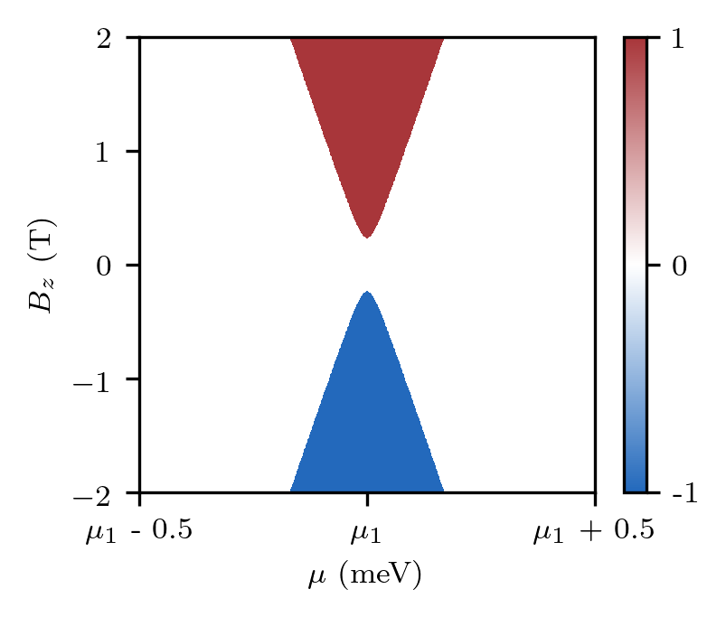
**図3：** ナノワイヤ化（側方閉じ込め）したLAO/STO超伝導体の端部波動関数（|Ψ|²）のリアルスペース分布。Majorana零モードの存在を直接示す。幅ny=12格子の細いナノワイヤで面内磁場By印加時にMajorana状態が端部に局在していることが確認できる。

---

## 5. 電子流体力学的整流素子：GaAs 2DEGにおける電子テスラバルブ

### 論文情報

| 項目 | 内容 |
|------|------|
| タイトル | [Electron Tesla valve](https://arxiv.org/abs/2603.16443) |
| 著者 | Daniil I. Sarypov, Dmitriy A. Pokhabov, Arthur G. Pogosov, Evgeny Yu. Zhdanov, Andrey A. Shevyrin, Askhat K. Bakarov |
| arXiv ID | 2603.16443 |
| カテゴリ | cond-mat.mes-hall |
| 公開日 | 2026年3月17日 |
| 論文タイプ | 実験研究 |
| ライセンス | CC BY 4.0 |

### 研究概要

テスラバルブ（可動部なしで流体の一方向流を整流する流体素子）の電子版をGaAs/AlGaAs 2次元電子ガスでリソグラフィ成形し、正逆方向で10倍以上の抵抗差（急峻な整流）を実証した研究。4K付近でのT<20Kでl_MR>Wかつl_ee<Wという流体力学的条件下で動作し、乱流状態の出現が整流の起源であることを示した。これは電子乱流状態の最初の固体素子デバイスとしての観測を意味する。

**重要性：** 電子が電子-電子衝突支配の粘性流体として振る舞う「電子流体力学」体制は、グラフェン・GaAs 2DEG・半金属等の高移動度系で近年盛んに研究されているが、これをデバイス機能に直結した実証例は稀少だった。本研究は整流比>10という明確な機能指標を示し、「テスラバルブ効果のスケーリング（幅依存性）」「参照試料（ループなし）での整流なし」という制御実験も行っており、電子流体力学的整流の起源を説得力あるかたちで示している。将来の無移動部・無磁場の電子整流素子への設計指針を与える。

### 重要キーワードの解説

1. **電子流体力学体制：** 電子の運動量緩和長l_MRが素子幅Wより長く、かつ電子間散乱長l_eeがWより短いとき（l_ee<W<l_MR）、電子集団が粘性流体として振る舞う。固体中では4K以下の高移動度系でのみ実現する。

2. **テスラバルブ (Tesla valve)：** N. Teslaが1916年に特許取得した形状非対称流路。流体が一方向には低抵抗で流れ、逆方向には渦と乱流により抵抗が大きくなる受動整流素子。可動部がなく堅牢。

3. **整流比（ダイオシティ Di）：** Di = (R_rev − R_fwd)/R_fwd（逆方向と順方向の抵抗の差の比）。Di>1が整流素子として実用的な値の目安。本研究では>10を達成。

4. **乱流状態：** 流速（電流）が臨界値を超えると層流から乱流に遷移する。電子流体でも同様のレイノルズ数的閾値が存在し、本研究の急峻なI-V非線形性の起源とされる。

5. **GaAs/AlGaAs 2DEG：** GaAsとAlGaAsの組成差によるバンドオフセットで量子井戸に閉じ込められた2次元電子系。液体ヘリウム温度で移動度10⁶cm²/Vs超が得られ、電子流体力学実験の標準プラットフォーム。

6. **バリスティック輸送・拡散輸送：** 電子の平均自由行程l_MRが素子サイズより長ければバリスティック（弾道的）輸送、短ければ拡散輸送。流体力学体制はその中間的条件で実現する。

7. **二次元電子流体の粘性：** 電子間クーロン衝突に起源する剪断粘性η~ℏn/(k_BT)が電子流体力学を支配。粘性が大きいほど乱流への転移は遅れ、小さいほど早く転移する。温度依存性が体制の判定に使われる。

### 図

**図1：** (a) テスラバルブの原設計（Teslaの特許より）。(b) GaAs/AlGaAs 2DEGデバイスの断面模式図。(c) 作製したテスラバルブの光学顕微鏡像（四端子測定配線付き）。流路幅Wとループ形状が示され、電子テスラバルブの素子設計が直視できる。

**図2：** (a) 異なる幅のテスラバルブ光学像。(b) 4KでのI-V特性：順方向・逆方向で明確な整流（10倍超の抵抗差）が観測される。(c,d) DC電流の関数としての抵抗と整流比Di：閾値電流以上で急峻なDiの増大（乱流転移に対応）が示される。機能デバイスとしての整流特性の定量的評価。

**図3：** 整流比の温度依存性。T<20Kで電子流体力学体制（l_MR>W, l_ee<W）が成立し、整流が発現する。T>20Kでは散乱長のスケールが素子サイズを下回り整流が消失する。特性長l_MR, l_eeの温度依存性と整流発現条件の対応が示され、電子流体力学的機構の証拠となる。

---

## 6. 干渉超伝導ナノワイヤを用いたDayemループ量子ビット設計

### 論文情報

| 項目 | 内容 |
|------|------|
| タイトル | [A Dayem Loop Qubit Based on Interfering Superconducting Nanowires](https://arxiv.org/abs/2603.17214) |
| 著者 | Cliff Sun, Alexey Bezryadin |
| arXiv ID | 2603.17214 |
| カテゴリ | cond-mat.supr-con |
| 公開日 | 2026年3月17日 |
| 論文タイプ | 理論研究 |
| ライセンス | CC BY 4.0 |

### 研究概要

2本の並列超伝導ナノワイヤで形成されたDayemループ（超伝導ループ）に磁場を印加すると、リトル-パークス効果（LP効果）により量子ビット周波数が磁束に対して振動・非調和性を持つことを示した理論研究。個々のナノワイヤが細いほど（低超電流時）電流-位相関係（CPR）が線形化し通常のトランズモンに必要な非線形性が失われるが、2本のワイヤの量子干渉が立方非線形性を回復させることを示した。また現実的な低温実験条件に向けたべき乗則フェノメノロジカルモデルも提案した。

**重要性：** 超薄膜・ナノワイヤ超伝導体（NbN, TaN, Re等）は既存のAl/Nbトランズモンより長い準粒子寿命・放射損失低減が期待されるが、細いナノワイヤほどJJの非線形性が失われるという根本的な問題がある。本研究は「2ワイヤ干渉で非線形性を回復する」という設計アイデアを定量的に示し、Dayemループ量子ビットの設計パラメータ（ループ面積・磁場・ワイヤ幅）を与えている。フラックス量子ビットと トランズモンの中間的な特性を持つ新アーキテクチャとして重要。

### 重要キーワードの解説

1. **リトル-パークス効果 (Little-Parks effect)：** 超伝導ループに磁場を印加すると、磁束Φが半整数磁束量子（Φ₀/2）付近で超電流が最大化・減少する周期的振動（周期Φ₀=h/2e）が見られる。この効果が量子ビット周波数の磁束依存振動と非調和性の源となる。

2. **電流-位相関係 (CPR)：** ジョセフソン素子の超電流I_sと量子位相差φの関係。通常のJJではI_s=I_c sinφ（正弦波型）。ナノワイヤでは極細になるほど線形関係（I_s∝φ）に近づき非線形性が弱まる。トランズモン動作には非線形性が必須。

3. **トランズモン量子ビット (transmon qubit)：** ジョセフソン接合と容量から成る超伝導量子ビット。コサイン型ポテンシャルU(φ)=-E_J cosφの非調和性がqubitのアンハーモニシティを生む。非線形性（E_J/E_C比）が量子ビット動作の鍵。

4. **Dayemブリッジ（ナノブリッジ）：** 超伝導膜を局所的に細く絞った構造。ジョセフソン弱リンクとして機能し、接合の作製が簡便だがCPRの非線形性が低下しやすい。

5. **量子干渉 (quantum interference in superconductors)：** SQUID型配置（2ワイヤ並列ループ）では、2経路を通る超電流の位相差が磁束量子で制御され、干渉による超電流振動が生じる。この干渉がCPRの非線形性を回復させるメカニズムとして機能。

6. **アンハーモニシティ (anharmonicity)：** 量子ビットの第0→1励起エネルギーと第1→2励起エネルギーの差。アンハーモニシティが有限でないと隣接準位への漏れが生じて量子ゲート忠実度が低下する。|α|≳100MHz程度が実用的に必要。

7. **べき乗則CPRモデル：** 超低温・超細ナノワイヤでは通常のKulik-Omel'yanchuk（KO-1/KO-2）モデルが適用困難な場合があり、I_s∝sin^n(φ/2)型のフェノメノロジカル表現が提案された。nが小さいほど非線形性が弱い。

### 図

**図1：** Dayemループ量子ビットの概念図。2本の並列ナノワイヤがループを形成し、磁束Φを印加する配置。個々のワイヤの線形的CPRが、ループ干渉によって量子ビット動作に必要な非線形性を回復することを模式的に示す。

**図2：** 磁束Φ（Φ₀単位）の関数として量子ビット周波数f₀₁のリトル-パークス型振動とアンハーモニシティαの計算結果。半整数磁束量子点でf₀₁が最大・非調和性が回復することが示され、動作磁場点の設計指針を与える。

**図3：** べき乗則CPRモデルの指数nを変化させたときの量子ビット特性の変化。n→1（線形CPR）でアンハーモニシティが消失し、n=1.5〜2では干渉による回復が有効であることが示される。ナノワイヤ幅・材料パラメータからnを推定し量子ビット設計に接続する道筋を示す。

---

## 7. ScAlNの低抗電場化機構：構造軟化と動的原子相関の協奏

### 論文情報

| 項目 | 内容 |
|------|------|
| タイトル | [Origin of Reduced Coercive Field in ScAlN: Synergy of Structural Softening and Dynamic Atomic Correlations](https://arxiv.org/abs/2603.18710) |
| 著者 | Ryotaro Sahashi, Po-Yen Chen, Teruyasu Mizoguchi |
| arXiv ID | 2603.18710 |
| カテゴリ | cond-mat.mtrl-sci |
| 公開日 | 2026年3月19日 |
| 論文タイプ | 計算研究（ML力場+分子動力学） |
| ライセンス | CC BY 4.0 |

### 研究概要

スカンジウム添加窒化アルミニウム（ScAlN）は低電圧強誘電メモリ応用に向けて急速に注目されているが、Sc添加量増加に伴う抗電場（E_c）の低下機構が未解明だった。本研究はML力場（機械学習力場）を用いた分子動力学シミュレーションにより、E_c低下が（1）Sc添加による格子軟化（エネルギーバリア低下）と（2）Scの大きな熱的変位とAl-Scの協調変位（動的原子相関）という2つの独立した機構の相乗効果であることを明らかにした。

**重要性：** ScAlNは既存の強誘電体（HZO、BaTiO₃）と比較してCMOS互換プロセス（PVD成膜）・高抵抗・大分極を持ち、メモリ・圧電MEMS・RF応用への展開が期待される。E_cの制御はデバイスの書き込み電圧直結のパラメータであり、Sc濃度設計の定量的指針を与える本研究はデバイス工学上の意義が大きい。ML力場の精度が十分高い（ab initio相当）ことを検証した上での分子動力学計算であり、従来のNEB法では捉えにくかった有限温度でのスイッチング機構を直接観察した点も方法論的に優れている。

### 重要キーワードの解説

1. **抗電場 (coercive field, E_c)：** 強誘電体の分極を反転させるのに必要な電場の大きさ。低E_cは低電圧動作・低消費電力に直結し、デバイス設計上の最重要パラメータの一つ。

2. **ScAlN（スカンジウム添加AlN）：** ウルツ鉱型AlNにScを添加した材料。Sc濃度を上げるとE_cが低下し分極反転が容易になるが、機構が未解明だった。スパッタ等のPVDで成膜可能でCMOS互換性が高い。

3. **機械学習力場 (ML force field)：** DFT計算データからニューラルネットワーク（NNP等）でポテンシャルエネルギー面を学習した原子間力場。DFTに近い精度でMDの長時間・大系シミュレーションが可能。

4. **格子軟化 (structural softening)：** Sc置換によりAlNの剛性率（弾性定数）が低下し、分極反転時のエネルギーバリアが下がる現象。有効ポテンシャルが平坦化される。

5. **動的原子相関（協調変位）：** 熱ゆらぎで隣接原子が連動して動く傾向。Sc周辺のAl原子がScの変位に追随して協調変位することで、スイッチング障壁をさらに低下させる。単純な格子軟化モデルでは捉えられない有限温度効果。

6. **分極スイッチング機構：** ウルツ鉱型強誘電体では、分極は全Nイオンと全金属イオンの相対変位の総和。スイッチングは反転した分極ドメインの核生成→壁移動で進む。本研究では均一核生成モデルで計算。

7. **NEB法（nudged elastic band法）：** 始状態と終状態が固定されたときの最小エネルギー経路（MEP）を計算する手法。静的（T=0）でのスイッチングバリアを評価できるが、有限温度での協調変位・エントロピー効果は考慮されない。

### 図

**図1：** ScAlNの結晶構造とSc添加位置。ウルツ鉱型格子中のAlをScが置換した配置、ScとAlの原子半径差と局所格子歪みが示される。Sc周辺の軟化領域と動的変位の大きさが強調されており、2つのE_c低下機構の起源が構造的に直感で理解できる。

**図2：** 機械学習MDシミュレーションによる分極反転ダイナミクス。Sc濃度依存のエネルギーバリア変化と、格子軟化・協調変位の2成分への分解が示される。同等の計算精度（ab initio比較）も確認されており、ML力場のScAlNへの適用妥当性が示される。

**図3：** Sc濃度を変えたときの抗電場（計算値）の変化と、2機構の寄与の分解。構造軟化成分と動的相関成分の相加的低下が定量的に示されており、低電圧強誘電メモリ向けSc組成最適化の設計指針を直接提供する。

---

## 8. コルビノ型量子ホール系でのペルチェ冷却：ランダウ準位充填率依存性

### 論文情報

| 項目 | 内容 |
|------|------|
| タイトル | [Peltier cooling in Corbino-geometry quantum Hall systems](https://arxiv.org/abs/2603.18922) |
| 著者 | Akira Endo, Yoshiaki Hashimoto |
| arXiv ID | 2603.18922 |
| カテゴリ | cond-mat.mes-hall |
| 公開日 | 2026年3月19日 |
| 論文タイプ | 実験・理論統合研究 |
| ライセンス | CC BY 4.0 |

### 研究概要

量子ホール（QH）系のコルビノ型（同心円状）電極配置でペルチェ係数を解析的に導出し、整数ランダウ準位充填率ν直上（直下）で大きな負（正）値をとることを示した。実験では、半径方向電流を印加したとき外縁の電子温度がバス温度以下に冷却されることを実証した。障害・温度変化がペルチェ係数の大きさと符号挙動に影響することも解析された。

**重要性：** 量子ホール系の熱電効果はゼーベック係数測定として研究されてきたが、ペルチェ冷却（電流で熱を能動的に輸送して冷却する量子機能）を量子ホールプラトー付近で直接実証した例は少ない。冷却が「浴温以下」に到達したことは、量子ホール自由度を熱制御機能に直接使うデバイス概念の実証であり、将来の希釈冷凍機不要の局所冷却素子に向けた設計指針を与える。コルビノ配置という幾何学的選択が渦電流なしの純粋な径方向熱輸送を実現する点も設計上のポイント。

### 重要キーワードの解説

1. **ペルチェ効果：** 電流を流すと接合部で熱の吸収・放出が起きる熱電効果。ペルチェ係数Π（またはゼーベック係数S=Π/T）で定量化。固体冷却素子（ペルチェ素子）の動作原理。

2. **コルビノ型電極配置：** 中心電極と外縁円形電極を持つ同心円ディスク構造。QH系では電流が径方向のみに流れ、ホール電圧が方位角方向に現れる。エッジ状態の影響を排除してバルク輸送を測定できる。

3. **ランダウ準位 (Landau level)：** 垂直磁場下での2D電子の量子化エネルギー準位（E_n=(n+1/2)ℏω_c, ω_c=eB/m）。各Landau準位は縮退度eB/h（面積あたり）を持ち、化学ポテンシャルがLandau準位間にあるとき量子ホール状態になる。

4. **充填率ν：** 全電子面密度n_sをLandau準位の縮退度で割った量（ν=n_s h/eB）。整数νで量子ホール状態が実現し、ρ_xy=h/νe²が量子化される。ν直上・直下でペルチェ係数が極大になるのはフェルミ準位がLandau準位端部のエネルギー依存DOS構造を感じるため。

5. **ゼーベック係数（熱起電力）：** 温度差に対して生じる開回路電圧の比（S=ΔV/ΔT）。ペルチェ係数Πとは熱力学的関係Π=ST（Kelvin関係）で結ばれる。

6. **電子温度測定：** サブケルビン精度の熱電対・量子ドット温度計・ジョンソンノイズ温度計などで電子温度を直接測定。ペルチェ冷却では電子温度がフォノン浴温度より下がることが鍵。

7. **QH熱電素子：** 量子ホール状態の大きなゼーベック係数（S~k_B/e×ρ_xy構造由来の大きな値）とゼロ磁気抵抗を組み合わせた高効率熱電素子。極低温での局所冷却への応用が期待される。

### 図

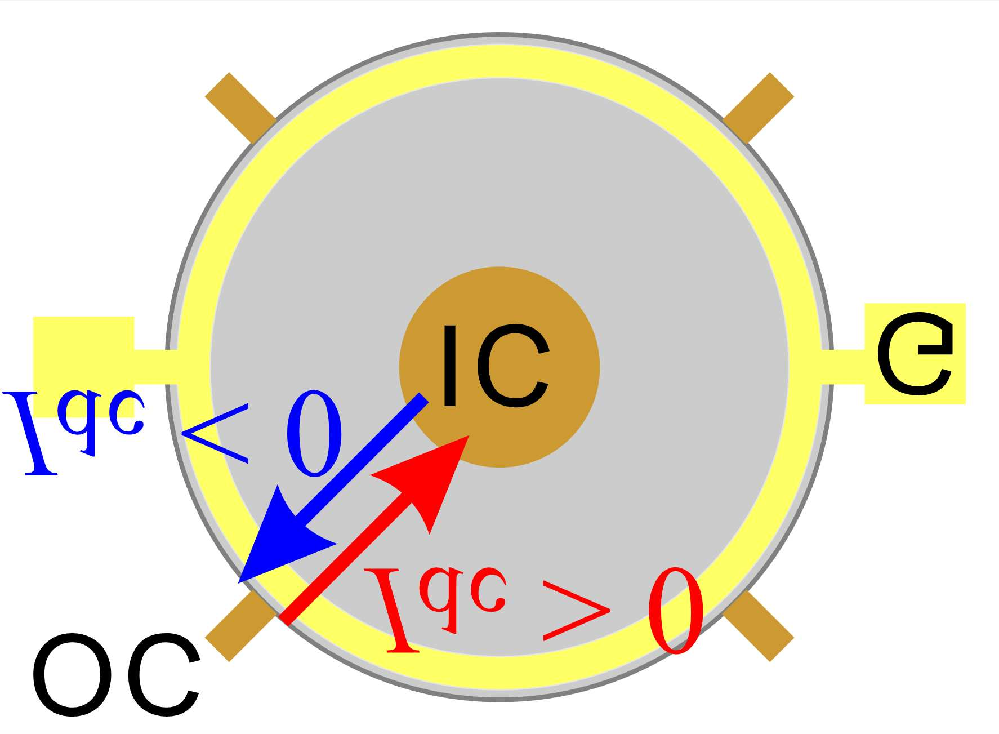
**図1：** コルビノ型QH系のデバイス模式図とペルチェ係数Πのランダウ準位充填率ν依存性。ν=整数直上で大きな負値、直下で正値を示すノコギリ波状の理論曲線が示される。コルビノ配置での径方向電流と外縁温度変化の測定配置も示される。整数QHプラトー付近でのペルチェ係数の増大が冷却機能の発現条件を明示する。

---

## 9. フォノン偏極分離によるスピン格子熱輸送の制御と異常磁場依存性

### 論文情報

| 項目 | 内容 |
|------|------|
| タイトル | [Disentangling Shear and Compression Phonons: Route to Anomalous Magnetothermal Transport](https://arxiv.org/abs/2603.18137) |
| 著者 | Haoting Xu, Antoine Matar, Hae-Young Kee |
| arXiv ID | 2603.18137 |
| カテゴリ | cond-mat.str-el |
| 公開日 | 2026年3月18日 |
| 論文タイプ | 理論研究 |
| ライセンス | CC BY 4.0 |

### 研究概要

フラストレート磁性体での磁場依存熱輸送の異常（磁場に対してピーク-ディップ-ピーク構造を示す熱電流の特異な磁場依存性）を、対称性制約されたスピン格子結合による「剪断フォノン・圧縮フォノンの選択的スピン結合」として説明した理論研究。強いSOCを持つMott絶縁体に対して有効スピン-フォノンハミルトニアンを導出し、Landauer輸送フレームワーク＋厳密対角化で熱電流の磁場依存性を計算した。

**重要性：** スピン-格子結合を介した熱輸送制御は、磁場・温度で調節可能な熱流スイッチや熱整流素子への応用が期待される。本研究は「どのフォノン偏極モードがどのスピン自由度と結合するか」という材料設計の観点を明確にした点で、SOC強磁性Mott絶縁体系（α-RuCl₃、Na₂IrO₃、CrI₃等）の熱デバイス設計指針を与える。ピーク-ディップ-ピーク構造がSOC強度と磁場の競合で決まり、材料パラメータで調節可能であることも示している。

### 重要キーワードの解説

1. **スピン-フォノン結合：** スピン自由度とフォノン（格子振動）が相互作用するとき、熱を運ぶフォノンの散乱・共鳴がスピン状態に依存する。これが磁場依存の熱輸送異常を生む。

2. **圧縮フォノン・剪断フォノン：** 格子振動の偏極モード分類。圧縮モード（縦波）は体積変化を伴い、剪断モード（横波）は形状変化を伴う。対称性によりそれぞれ特定のスピン演算子と結合し、磁場域が異なる。

3. **Mott絶縁体：** 電子間クーロン反発でバンド理論上は金属なのに絶縁体になった系。強相関電子系の代表例。スピン自由度が局在し格子と強く結合しやすい。

4. **Landauer輸送形式：** フォノンのコヒーレント輸送をシリーズ接続の散乱問題として定式化。透過率T(ω)を用いて熱電流I_Q∝∫T(ω)ℏω[n_BE(ω,T_L)-n_BE(ω,T_R)]dωと表す。

5. **厳密対角化 (exact diagonalization)：** 有限サイズスピン系のハミルトニアンを数値的に完全対角化して固有状態・固有エネルギーを得る手法。近似なしに強相関を扱えるが系サイズが制限される。

6. **ピーク-ディップ-ピーク構造：** 熱電流の磁場B依存性でB=0付近・中間値・高値の3領域でそれぞれ極値が現れる特徴的パターン。圧縮・剪断フォノンが異なる磁場域で熱輸送に寄与することから生まれる。

7. **キタエフ・ハイゼンベルクモデル：** 蜂の巣格子上の磁性体（α-RuCl₃等）に現れるキタエフ型異方的スピン相互作用を含む模型。SOCの強い系での磁気相転移・スピン液体・熱輸送の理論的基盤として広く使われる。

### 図

**図1：** スピン-フォノン結合のモード選択的機構の概念図。圧縮フォノン・剪断フォノンがそれぞれ異なるスピン演算子に結合する対称性制約を図解。各モードが熱輸送に寄与する磁場域が異なることが示される。

**図2：** Landauer + 厳密対角化で計算した熱電流の磁場依存性。ピーク-ディップ-ピーク構造が明確に現れ、実験で報告された磁場依存熱輸送異常（α-RuCl₃等）を定性的に再現している。圧縮・剪断各モードの寄与の分解が示される。

**図3：** SOC強度・スピン-フォノン結合定数パラメータを変化させたときのピーク-ディップ-ピーク構造の変化。材料パラメータで熱輸送異常を調節できることを示し、SOC強磁性Mott絶縁体の熱デバイス設計パラメータとして有用な指針を与える。

---

## 10. 1T-NbSe₂上グラフェンの人工超格子：電荷密度波駆動の自発的対称性破れ制御

### 論文情報

| 項目 | 内容 |
|------|------|
| タイトル | [Tailoring spontaneous symmetry breaking in engineered van der Waals superlattices](https://arxiv.org/abs/2603.15787) |
| 著者 | Keda Jin, Lennart Klebl, Zachary A. H. Goodwin, Junting Zhao, Felix Lüpke, Dante M. Kennes, Jose Martinez-Castro, Markus Ternes |
| arXiv ID | 2603.15787 |
| カテゴリ | cond-mat.mes-hall |
| 公開日 | 2026年3月16日 |
| 論文タイプ | 実験・理論統合研究 |
| ライセンス | CC BY 4.0 |

### 研究概要

1T-NbSe₂の電荷密度波（CDW）を超格子テンプレートとして利用し、その上に積層したグラフェンのディラックコーンをミニブリルアンゾーンのΓ点またはK点に折りたたんだ2種類のvdW超格子を作製した実験・理論統合研究。Γ点折りたたみ系はC₃対称性を保つが、K点折りたたみ系では自発的対称性破れが生じ、その起源が電子ではなく**構造的不安定性**（フォノン的変位の自発的発生）にあることをSTM/STS・理論計算で解明した。

**重要性：** vdWヘテロ構造では通常ツイスト角がモアレ超格子の主制御パラメータだが、本研究はCDWという**基板の量子秩序**を外場なし・ツイスト角変化なしに超格子の対称性を制御するための設計因子として使うという新概念を提案した。折りたたみ点（Γ/K）の選択という単純な設計変数が対称性破れの有無を決定し、グラフェン中に電子相関起源ではない「構造的」対称性破れを誘起できることを示した。相関・トポロジカル量子相の設計自由度を大きく広げる方法論的貢献がある。

### 重要キーワードの解説

1. **電荷密度波 (CDW)：** 結晶格子と電子密度が共に周期変調した状態。1T-NbSe₂では~35Kで発現し、√13×√13の超周期構造をとる。この超周期がグラフェンへの超格子テンプレートとして機能する。

2. **バンドフォールディング（ディラックコーン折りたたみ）：** 実格子の周期に合わせてブリルアンゾーン（BZ）が縮小（折りたたみ）され、ディラック点がミニBZの特定の高対称点に移動する。Γ点折りたたみとK点折りたたみでは生じる電子構造と対称性が根本的に異なる。

3. **自発的対称性破れ (spontaneous symmetry breaking)：** ハミルトニアンが持つ対称性を基底状態が破る現象。本研究ではK点折りたたみ系でC₃対称性が破れた電子状態が実現し、STMでの像の非対称性として観測された。

4. **構造的不安定性：** 電子的起源ではなくフォノンの不安定化（ソフトモード）から生じる格子変形。本研究ではC₃破れの起源が電子系の自発的秩序ではなく、格子変位（原子的な構造歪み）にあることが確認された。

5. **vdWヘテロ構造：** ファンデルワールス力で積層した異種2D物質の多層構造。ツイスト角・積層順・層数・基板の量子秩序などを設計パラメータとして使えるエンジニアリングプラットフォーム。

6. **STM/STS（走査型トンネル顕微鏡/分光）：** 原子分解能で表面の局所電子状態密度を実空間・エネルギー空間で測定できる手法。vdW超格子の電子構造のリアルスペース可視化に適する。

7. **モアレ超格子：** 格子定数の僅かに異なる2層を積層・あるいは小角ツイストすると現れる大周期（数nm〜数十nm）の超構造。ツイスト角が主設計パラメータ。本研究はCDWを新たな超格子生成メカニズムとして位置づけ、ツイスト角ゼロでも超格子を設計できることを示した。

### 図

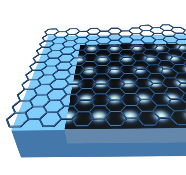
**図1：** 1T-NbSe₂ CDW上グラフェンの2種類の超格子の模式図と電子構造。Γ点折りたたみ（C₃対称保存）とK点折りたたみ（C₃対称破れ）の2配置での電子状態の違いがバンド図として示される。CDW超周期がグラフェンのディラックコーンを異なる高対称点に折りたたむことで、全く異なるトポロジー・対称性を持つ電子状態が実現することを示す。

**図2：** STM像による実空間での対称性の可視化。Γ折りたたみ系（C₃対称性保存）とK折りたたみ系（C₃対称性破れ）のSTM像の比較。K折りたたみ系での非対称なSTM模様が自発的対称性破れの直接的実験証拠となる。

**図3：** 理論計算による構造的不安定性の解析。K折りたたみ系での格子変位（構造変形）を考慮した理論STM像が実験像と一致することを示す。電子的起源でなく格子（フォノン的）起源の対称性破れであることを示す決定的な証拠となる計算結果。

---

*本ダイジェストは横浜国立大学における量子機能デバイス研究のための参考資料として作成されました。*
