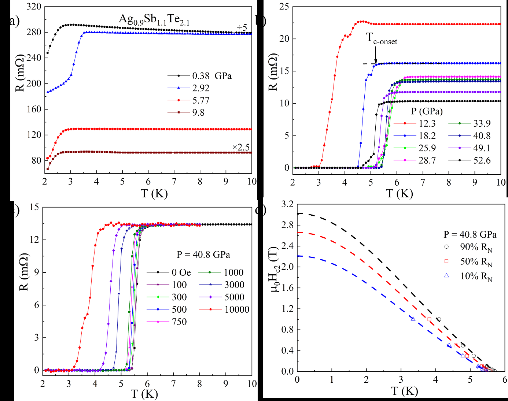
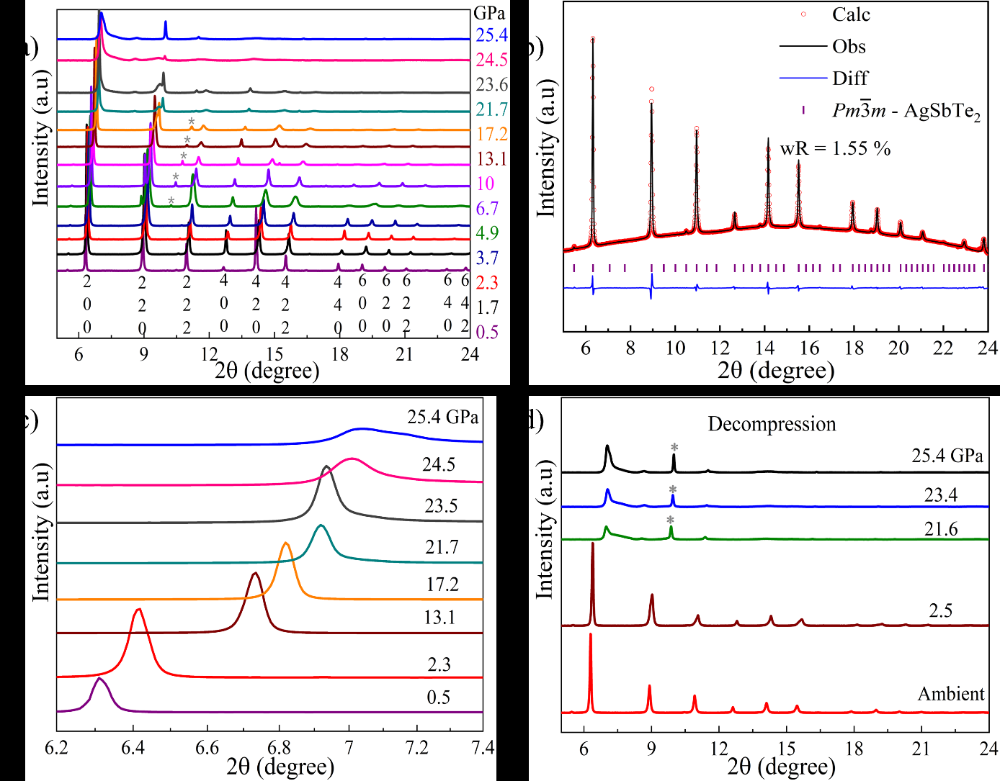
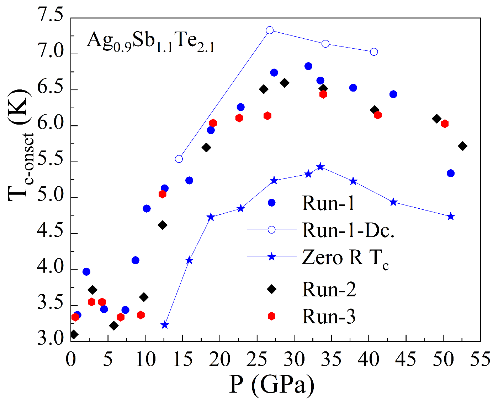

# 2026-03-22 量子機能デバイス

**作成日：** 2026年3月22日
**対象期間：** 2026年3月19日〜22日（直近72時間）

---

## 選定論文一覧

1. [2603.16412] Zheng Sun et al. — ツイスト角依存相図：ねじれ二層 MoTe₂ における分数トポロジカル相から超伝導への進化
2. [2603.18685] Ze-Yong Yuan et al. — p波磁性体を用いた時間反転対称スピンバルブおよびスピントランジスタ
3. [2603.18753] Enrico Della Valle et al. — Ge 量子井戸における歪みと閉じ込めが正孔サブバンドを形成する直接観察
4. [2603.17846] Sudaice Kazibwe et al. — 熱電材料 AgSbTe₂ における圧力誘起超伝導
5. [2603.19148] Subhashree Chatterjee et al. — van der Waals 強誘電体 CuInP₂S₆ における光強誘電結合と界面バンド変調
6. [2603.17308] Wenhui Du et al. — アルター磁性体における異方的スカーミオンホール効果の電界スイッチング
7. [2603.18182] Alejandro Simon et al. — 第一原理計算による超高速ダイナミクスと光誘起超伝導
8. [2603.17657] Hiroya Sakurai, Yoshihiko Takano — 二層・三層結晶構造を持つランタンニッケル酸化物の超伝導
9. [2603.18823] Harsh Varshney, Amit Agarwal — 時間反転対称性のある縦方向非相反電荷輸送
10. [2603.18885] Pouria Emtenani et al. — 超ワイドバンドギャップ ルタイル型 GeO₂ における温度依存異方的熱輸送の微視的起源

---

## 全体所見

今回の10本は、量子機能材料の設計・評価・デバイス化という観点から多角的に充実した選定となった。ツイスト二次元材料の相図制御と超伝導出現、p波磁性体という新規量子磁性状態を活用したスピントロニクスデバイス設計、Ge量子井戸の正孔サブバンドの直接観察という3本を重点論文とし、いずれも材料設計因子と機能発現が明確に結びついた研究である。残り7本は、熱電材料の圧力誘起超伝導、光強誘電結合と光メモリ応用、電界制御スカーミオン輸送、光誘起超伝導の第一原理計算、ニッケル酸化物新規超伝導体、非相反輸送デバイスの理論、超ワイドバンドギャップ材料の異方熱輸送と多岐にわたる。

各論文の位置づけを1文で要約する。(1) ねじれ二層MoTe₂において分数QAHE相と超伝導相がツイスト角連続変数によってつながれることを初めて実証した。(2) p波磁性体の運動量依存スピン分裂を利用した磁場・スピン軌道結合不要のスピンバルブ・スピントランジスタ設計を提案した。(3) ひずみ・閉じ込め効果を受けた埋込みGe量子井戸の正孔サブバンド構造を軟X線ARPESで直接観測し、ホールスピン量子ビット設計の実験基盤を確立した。(4) 熱電材料AgSbTe₂が0.38 GPaという超低圧でTc 3.2 Kの超伝導を示し、高圧でTc 7.4 Kまで上昇することを報告した。(5) van der WaalsフェロセラミックCuInP₂S₆において光照射がバンドベンディング・強誘電スイッチング・Cu⁺イオン緩和を同時変調するという光強誘電結合を示した。(6) アルター磁性モノレイヤーCaMnSnにおいてスカーミオンホール効果の方向性が電場印加で可逆反転することを計算で示した。(7) 実空間軸Eliashberg方程式の第一原理解法によりK₃C₆₀とCaC₆での光誘起超伝導ギャップを予測した。(8) La₃Ni₂O₇型の二層・三層ニッケル酸化物の高圧超伝導と物質探索の現状を整理したレビューである。(9) 時間反転対称な非磁性材料で不純物散乱由来の縦方向非相反輸送が起こりうることを示し、42の点群で許容されることを明らかにした。(10) ルタイル型GeO₂の異方熱伝導率（47.5 vs 32.5 W/mK）が単純なフォノン三体散乱では説明できないことを実験と計算の統合で解明した。

---

## 重点論文の詳細解説

---

## ねじれ角によるトポロジカル相から超伝導への進化：ねじれ二層 MoTe₂ の量子相図

### 1. 論文情報

**タイトル：** [Twist-angle evolution from valley-polarized fractional topological phases to valley-degenerate superconductivity in twisted bilayer MoTe₂](https://arxiv.org/abs/2603.16412)
**著者：** Zheng Sun, Fan Xu, Jiayi Li, Yifan Jiang, Jingjing Gao, Cheng Xu, Tongtong Jia, Kehao Cheng, Jinyang Zhang, Wanghao Tian, Kenji Watanabe, Takashi Taniguchi, Jinfeng Jia, Shengwei Jiang, Yang Zhang, Yuanbo Zhang, Shiming Lei, Xiaoxue Liu, Tingxin Li
**arXiv ID：** 2603.16412
**カテゴリ：** cond-mat.mes-hall
**公開日：** 2026年3月17日
**論文タイプ：** 実験・実証研究
**ライセンス：** arXiv 標準ライセンス（非商業的再配布可）

### 2. どんな研究か

ねじれ二層MoTe₂（tBMoTe₂）のツイスト角を3.8°から5.78°まで系統的に変化させることで、自発的バレー偏極を伴う分数量子異常ホール（FQAH）状態から、バレー縮退型の超伝導状態へと量子相が連続的に変化することを初めて示した研究である。ねじれ角という単一パラメータにより、強相関トポロジカル相・相関絶縁体・超伝導を一つの物質系で統一的に制御できることを実証し、モアレ量子材料が多様な量子デバイス機能を包含するプラットフォームであることを裏付けた。

### 3. 研究の概要

**背景と目的：** ねじれ二層MoTe₂（tBMoTe₂）は、近年ツイスト角2°付近でFQAH状態（分数チャーン数を伴う相関トポロジカル絶縁体）が報告されたが、より大きなツイスト角でどのような相が現れるか、またFQAH相と超伝導相がどう関係するかは未解明だった。本研究は、ツイスト角を3.8°から5.78°まで段階的に変えた複数試料を作製し、相図の全貌を描くことを目的とした。

**解こうとしている物理・工学上の課題：** モアレ系における量子相の連続的変化（位相ダイアグラム）と、トポロジカル相と超伝導相の接続関係という基礎物理的課題、さらにその知識を将来のトポロジカル量子コンピューティングデバイス設計に役立てるという工学的課題がある。

**対象材料系・構造系：** MoTe₂ホモ二層のツイスト二次元ヘテロ構造（ツイスト角3.8°、4.56°、4.85°、5.14°、5.78°の5試料）。hBNでカプセル化し、グラファイトゲートを備えた標準的なモアレデバイス構成。

**主な測定手法：** 低温磁気輸送測定（ゲート電圧制御）、ホール抵抗・縦抵抗の磁場・ゲート依存性測定。超伝導ギャップの直接評価は難しいが、抵抗消失から超伝導転移温度および相境界を特定。

**主な結果：**
- ツイスト角3.8°では、整数または分数充填での異常ホール効果（量子化ホール抵抗）とバレー偏極が顕著で、FQAH状態の特徴が明確に現れる。
- ツイスト角を増やすにつれ（4.56°〜5.14°）、バレー偏極の自発性は弱まり、代わりに電子相関に起因する絶縁相（相関絶縁体相）が現れる。
- ツイスト角5.78°では、相関絶縁体相に隣接して超伝導相が出現する。超伝導転移は特定のキャリア充填密度で観測され、温度依存抵抗の急激な消失として確認される。
- バレー縮退（二つのバレーが等価に参与する状態）が超伝導の発現に対応しており、バレー偏極型の小角度側とは対照的である。
- tBWSe₂等の類似系で報告されていた超伝導に近い現象と整合する結果が得られ、遷移金属ダイカルコゲナイドのモアレ系に普遍的な相図の存在が示唆される。

**観測された量子効果：** 分数量子異常ホール効果、バレー偏極型の相関トポロジカル絶縁体、相関絶縁体、バレー縮退型超伝導。

**評価された巨視的機能：** ホール抵抗の量子化（トポロジカル輸送）、超伝導抵抗消失（Tc評価）、ゲート電圧による相境界制御。

**デバイス的含意：** ツイスト角一つの変数でFQAH相・相関絶縁体・超伝導を切り替えられるため、量子相切り替えデバイスやトポロジカル量子ビットのプラットフォームとして有望。バレーの偏極/縮退が量子相の鍵であることから、バレートロニクス素子と超伝導素子の同一基板上集積の可能性を示す。

**著者の主張：** ツイスト角という連続パラメータによって、ひとつのモアレ系の中でFQAH相・相関絶縁体・超伝導相が連続的につながっていることを実験的に示した初の報告である。

### 4. 量子機能デバイスとして重要なポイント

ねじれ二層MoTe₂系の最も重要な特徴は、**ツイスト角という単一の構造パラメータによって、複数の異なる量子位相が一つの材料プラットフォーム上に実現される**点にある。モアレポテンシャルはバンド幅と電子間相互作用の比率（U/W）を支配し、これがトポロジカル秩序・電荷秩序・超流動的凝縮の間の競合を調整する。小さなツイスト角ではバンド幅が狭く電子間相互作用が支配的（バレー偏極FQAH相）、角度が大きくなるとバンド幅が増えた結果U/Wが低下し、まず電荷秩序（相関絶縁体）が現れ、さらに角度増大により電子相関の性質が超伝導ペアリングを促す領域が現れる。材料的には、MoTe₂のhBNカプセル化と電子的品質の高さが必要条件であり、BNとグラファイトゲートによる平坦なポテンシャル環境がクリーンな量子相の観測を可能にしている。デバイス設計上の重要な示唆は、同じデバイス上でゲート電圧によって量子相を切り替えられる点であり、トポロジカル量子ビットと超伝導量子ビットを同一基板上で使い分ける将来構造に向けた重要な知見である。

### 5. 限界と注意点

各試料は異なるツイスト角を持つ個別デバイスであり、同一デバイスでのツイスト角連続チューニングは実現していない。そのため、報告されている相図はサンプル間のばらつきを内包しており、それぞれのデバイスの局所的なストレスや欠陥の影響が各相の位置を若干シフトさせている可能性を排除できない。超伝導発現については、転移の鮮明さや転移温度が試料依存性を持つことが予測される。また、超伝導の「バレー縮退」という特徴は間接的な証拠（ホール抵抗の符号消失等）に基づいており、直接的な対称性解析（例：偏光光学応答や中性子散乱）による検証は未了である。さらに最低ツイスト角（3.8°）でのFQAH状態と最大ツイスト角（5.78°）での超伝導の間の「途中の相」（4.56°〜5.14°付近）が本当に単純な相関絶縁体なのか、それともより複雑な秩序（ネマティック・バレー液晶・電荷密度波的秩序）を持つのかについて、本研究だけでは結論付けにくい。

### 6. 関連研究との比較

tBMoTe₂は、2023年のFQAH発見報告（Zeng et al., Cai et al., Park et al. 等）以来、モアレ物理の最注目系の一つとなってきた。これらの初期研究は主にツイスト角2°前後での現象に集中し、FQAHの整数・分数充填状態を詳細に調べるものが多かった。本研究が新しい点は、ツイスト角をより広い範囲（3.8°〜5.78°）にわたって系統的に変化させ、**FQAH相と超伝導相の双方が同一材料系で連続的につながった相図**を示したことにある。類似研究として、ねじれ二層WSe₂（tBWSe₂）でも超伝導と相関絶縁体の隣接が報告されており（2024年）、本研究との整合性を示す。また、ねじれ二層グラフェン（TBG）における"magic angle"超伝導とMott絶縁体の競合との類似点も注目される。

材料設計・デバイス設計の指針として、ツイスト角がU/W比の主要な制御パラメータであるという理解は、今後の同系材料（tBWSe₂、tBNbSe₂等）の量子相探索において設計指針として直接活用できる。特に「バレー偏極→超伝導転移の境界付近」の角度域が、トポロジカル超伝導相の実現に有望である可能性があり、将来的にはマヨラナ準粒子の探索の舞台になり得る。

### 7. 重要キーワードの解説

**① 分数量子異常ホール効果 (Fractional Quantum Anomalous Hall Effect, FQAH)**
外部磁場なしに、整数でない量子化ホール抵抗 $R_{xy} = h/(νe^2)$（ν は 1/3、2/3 等の分数）を示す現象。モアレ系では強い電子間相互作用と非自明なバンドトポロジー（チャーン数）が重なって実現する。単なる整数 QAH より電子相関が本質的に重要で、物質設計においてフラットバンド（バンド幅の極小化）が必要条件となる。

**② モアレポテンシャル (Moiré Potential)**
二枚の結晶格子をわずかにずらしてつなげると生まれる長周期の周期ポテンシャル。ツイスト角 $θ$ に対して、モアレ周期は $λ_M ≈ a/(2\sin(θ/2))$（$a$：格子定数）で与えられる。角度が小さいほど周期が長くなり、フラットバンドが形成されやすい。

**③ バレー偏極 (Valley Polarization)**
MoTe₂ や MoS₂ 等の遷移金属ダイカルコゲナイドでは、ブリルアン域の K 点と K' 点（バレー）が時間反転対称の制約から等価に存在する。バレー偏極とは、一方のバレー（K または K'）のみが優先的に占有されている状態で、バレートロニクスにおける情報担体となる。

**④ 相関絶縁体 (Correlated Insulator)**
バンド理論では金属と予測される充填率でも、電子間クーロン相互作用 U がバンド幅 W を上回ると（U/W > 1）、電子が格子上に局在化して絶縁体になる。モット絶縁体がその典型例。本系では特定のゲート電圧（充填率）で電子間反発が輸送を禁止する。

**⑤ ツイスト角チューニング (Twist Angle Tuning)**
二次元材料を積層するときのずれ角を変えることで、バンド幅・モアレ周期・フラットバンド幅・フェルミ面形状などを系統的に制御する手法。デバイス作製後の角度制御は難しいが、設計段階での材料パラメータとして機能し、「ツイストロニクス」分野の基盤となっている。

**⑥ バレー縮退型超伝導 (Valley-Degenerate Superconductivity)**
K バレーと K' バレーの両方が等しく超伝導ペアリングに参与する状態。バレー偏極型では一方のバレーのみが超伝導ペアを形成するが、縮退型では Cooper ペアの形成が両バレー対称的に起こる。スピン一重項/三重項の混合比とも関係し、位相的超伝導の候補状態を内包する可能性がある。

**⑦ 遷移金属ダイカルコゲナイド (Transition Metal Dichalcogenide, TMD)**
MoTe₂、MoS₂、WS₂、WSe₂ 等の化学式 MX₂（M = Mo, W; X = S, Se, Te）の二次元層状物質。単層では直接バンドギャップ・スピン-バレー結合・強い谷分極を示し、ヘテロ構造・モアレ系構築に広く用いられる。Te 系は軌道混成が大きく比較的小さいバンドギャップを持ち、FQAH 相の実現に有利である。

### 8. 図

本論文は arXiv 標準ライセンス（nonexclusive-distrib/1.0）のため、原図の抽出・転載は行わない。

---

## p波磁性体を基盤とする時間反転対称スピンバルブ・スピントランジスタの設計

### 1. 論文情報

**タイトル：** [Time reversal reserved spin valve and spin transistor based on unconventional p-wave magnets](https://arxiv.org/abs/2603.18685)
**著者：** Ze-Yong Yuan, Jun-Feng Liu, Pei-Hao Fu, Jun Wang
**arXiv ID：** 2603.18685
**カテゴリ：** cond-mat.mes-hall, cond-mat.mtrl-sci
**公開日：** 2026年3月19日
**論文タイプ：** 理論・デバイス設計研究
**ライセンス：** arXiv 標準ライセンス（非商業的再配布可）

### 2. どんな研究か

時間反転対称性を保ちながら反転対称性を破る新クラスの磁性体「p波磁性体（p-wave magnet, PWM）」の運動量依存スピン分裂を利用し、磁場もスピン軌道結合も不要なスピンバルブとスピントランジスタを設計した理論研究である。PWM/常磁性金属/PWMのトリレイヤー構造でスピンバルブを実現し、中央のPWMを縦方向強度ベクトルを持つ層に置き換えることでスピントランジスタ（SFET 類似）を構成している。電気的なスピン偏極制御が可能で、従来の Datta-Das 型 SFET の本質的問題（異なる横モードの位相不揃い）を解決できる点が際立っている。

### 3. 研究の概要

**背景と目的：** スピントロニクスデバイスの主要課題は、磁場やスピン軌道結合（SOC）を必要とせずにスピン偏極輸送を制御することにある。強磁性体ベースのスピンバルブや Rashba 型スピントランジスタはそれぞれ外部磁場依存または SOC 材料が必要であり、集積回路への応用に制約がある。本研究は、近年提案・実験実証された p波磁性体（PWM）がもつ「非相対論的スピン-運動量ロッキング」を利用して、これらの制約を克服したデバイス設計を提案する。

**解こうとしている物理・工学上の課題：** スピン選択輸送の電気的制御を、時間反転対称性（TRS）を保ちかつ SOC なしで実現すること。また、Datta-Das SFET において諸横モードの位相がずれることで起きる「完全ゼロ状態」実現困難という根本的問題の解決。

**対象材料系・構造系：** p波磁性体（実験的実現例として NiI₂、Gd₃Ru₄Al₁₂ 等）を電極に用いた二端子接合。スピンバルブは PWM₁/NM/PWM₂（NM：常磁性金属）のトリレイヤー。スピントランジスタは PWM₁/PWM_c/PWM₂（PWM_c：中央层のPWM、縦方向強度ベクトル）。

**主な測定手法・理論手法：** タイトバインディングハミルトニアン（正方格子モデル）、Landauer-Büttiker 形式によるコンダクタンス計算、格子グリーン関数・再帰的自己エネルギー法。

**主な結果：**
スピンバルブにおいて、二つの PWM の強度ベクトルが平行配置では高コンダクタンス、反平行配置では低コンダクタンス（理想的には完全ゼロ）となる高いオン/オフ比が得られる。特に負のフェルミエネルギー域でスピン分裂フェルミ円が空間的に完全分離し、反平行配置でのスピンミスマッチが完全電流阻止を実現する。スピントランジスタでは、中央PWMの縦強度ベクトル αₓ と長さ Lₓ によって決まる位相 $2α_x L_x$ の変化でコンダクタンスが周期的に変化し、$2α_xL_x = (2n+1)π$ でゼロコンダクタンス、$2nπ$ で最大コンダクタンスとなる。全横モードが同じ位相で歳差運動するため、Datta-Das 型の問題が根本的に解消されている。

**観測された量子効果：** 運動量依存スピン分裂（非相対論的 SOC 模倣）、スピン選択トンネリング、スピンコヒーレント歳差運動。

**評価された巨視的機能：** コンダクタンスのオン/オフ比（スピンバルブ機能）、コンダクタンスの周期的変調（スピントランジスタ機能）。

**デバイス的含意：** 磁場・SOC 不要の純電気制御スピンデバイス。PWM の強度ベクトルの電気的スイッチング（すでに NiI₂ 等で実証済み）を利用すれば、ゲート電圧一本でスピン状態を制御できる低消費電力スピントロニクス素子が実現できる。

**著者の主張：** p波磁性体の非相対論的スピン-運動量ロッキングがスピンバルブおよびスピントランジスタの機能を支え、かつ従来の Datta-Das 型 SFET の根本的問題を解決するという設計原理を示した。

### 4. 量子機能デバイスとして重要なポイント

p波磁性体（PWM）という新しい磁性秩序分類が量子スピントロニクスデバイスに与えるインパクトの核心は、**非相対論的スピン-運動量ロッキング**である。通常の Rashba 系では SOC がスピン-運動量結合を与えるが、これは軽元素ではごく小さく、また材料・デバイス設計の自由度を制限する。PWM では、空間反転対称性の破れによる交換場の運動量依存性が「磁気的スピン-運動量ロッキング」を与える。強度ベクトルの向き（縦 vs 横）という材料設計パラメータがデバイス機能（スピンバルブ vs スピントランジスタ）を決定するという明快な対応があり、材料設計からデバイス設計への直接的な指針となる。特にスピントランジスタの設計では、全横モードが等しい位相で歳差運動するという「モード普遍性」が、Datta-Das 型との本質的違いであり、完全な電気的スピン制御を可能にする。現時点では理論提案だが、NiI₂ や Gd₃Ru₄Al₁₂ での電気的スイッチング実証が進んでいることから、薄膜化・接合化が次のステップとなる。

### 5. 限界と注意点

本研究は純粋な理論・計算提案であり、実験検証は未実施である。タイトバインディングモデルを使用しており、実際の材料の複雑なバンド構造（多軌道効果、第一近接以外のホッピング等）や界面構造依存性は考慮されていない。また、スピン輸送の位相コヒーレンスが保たれることを前提としており、室温での位相破壊散乱やフォノン散乱の影響は無視されている。実際に PWM 薄膜・接合を作製した場合の界面乱れ（界面ラフネス、拡散等）がスピン選択効果を著しく低下させる可能性がある。さらに、強度ベクトルの「電気的スイッチング」は実証されているが、接合中のスイッチング速度・耐久性・再現性についての議論は本研究にはない。

### 6. 関連研究との比較

PWM という分類は 2024〜2025 年頃に理論的に提唱され（Mazin, Šmejkal らのグループ）、アルター磁性（altermagnet）、d波磁性、p波磁性等の「無磁化非コリニア磁性体」の大きな枠組みの一部として注目を集めてきた。スピントロニクスへの応用としては、アルター磁性体を使ったスピン電流生成・スピントルクスイッチング研究が先行しているが、それらの多くは SOC を必要とする AHE や逆スピンホール効果経由の素子化が主流であった。本研究の新しい点は、**TRS を保ちかつ SOC なしにスピンバルブ・スピントランジスタを構成できる**という設計的合理性にある。特にスピントランジスタにおける「全モード同位相歳差運動」は、2012年の Datta-Das 提案以来問題だった点を原理的に解消するものであり、設計上の進展といえる。

今後の展開としては、第一原理計算による具体的な NiI₂ 接合の設計（膜厚・格子整合条件等）、作製プロセスの確立、そして低温輸送測定での実証が求められる。材料設計の指針として、強度ベクトルの大きさ（スピン分裂のエネルギースケール）と電気的チューナビリティの両立が重要であり、今後の材料探索の評価軸となる。

### 7. 重要キーワードの解説

**① p波磁性体 (p-Wave Magnet, PWM)**
時間反転対称性（TRS）を保ちながら空間反転対称性を破る磁性体の一分類。ブリルアン域上でスピン分裂エネルギーが $\mathbf{k}$ に対して p 波（奇関数）的に変化する（$E_↑(\mathbf{k}) - E_↓(\mathbf{k}) \propto k_x$ または $k_y$）。これは Rashba 効果と似ているが起源は SOC でなく交換相互作用の反転対称性破れによる。

**② アルター磁性体 (Altermagnet)**
TRS は破れているが、$\mathbf{k}$ 空間でスピン分裂が d 波・g 波等の偶関数的に現れる磁性秩序の分類。MnTe、RuO₂ 等が候補材料。p波磁性体はアルター磁性との概念的親族にあたるが、TRS を保つ点が異なる。

**③ 運動量依存スピン分裂 (Momentum-Dependent Spin Splitting)**
電子のスピン上向き・下向きのバンドが $\mathbf{k}$ の関数として異なるエネルギーを持つ状態。$E_↑(\mathbf{k}) \neq E_↓(\mathbf{k})$ であることを示し、スピン偏極電流の自発的発生や選択的輸送を可能にする。材料中での起源は SOC（Rashba 型）か磁気秩序の対称性（アルター磁性・p波磁性型）かによって分類される。

**④ Landauer-Büttiker 形式**
量子輸送を「多端子散乱行列」で記述する形式論。コンダクタンス $G = (e^2/h) \sum_{n,m} |t_{nm}|^2$（トランスミッション係数の和）として与えられ、スピン依存性を取り入れればスピンバルブのコンダクタンスを定量的に計算できる。

**⑤ Datta-Das スピントランジスタ**
1990 年に Datta と Das が提案した、Rashba 型 SOC を持つ二次元電子ガスをゲート制御してスピン歳差を変調するスピン電界効果トランジスタ（SFET）。原理は明快だが、異なる横モードが異なる速度で歳차運動するため完全ゼロ状態が実現しないという根本的問題がある。p波磁性体ベースの設計はこの問題を解決する。

**⑥ スピンバルブ (Spin Valve)**
強磁性層/非磁性スペーサー/強磁性層の三層構造で、二つの強磁性層のスピン相対配向（平行・反平行）によってコンダクタンス（抵抗）が変化する素子。GMR（巨大磁気抵抗）効果がその代表例。本研究では強磁性体を p波磁性体に置き換え、TRS を保ったままスピン選択輸送を実現する。

**⑦ スピン選択トンネリング (Spin-Selective Tunneling)**
特定のスピン状態の電子のみが接合を透過し、他のスピン状態の電子は反射・阻止される量子トンネリングの選択性。p波磁性体の場合、スピン分裂フェルミ円が接合両端で一致（平行配置）するか不一致（反平行）かによって透過率が大きく変化する。

### 8. 図

本論文は arXiv 標準ライセンス（nonexclusive-distrib/1.0）のため、原図の抽出・転載は行わない。

---

## Ge 量子井戸の正孔サブバンドを決定する歪みと閉じ込めの直接観察

### 1. 論文情報

**タイトル：** [Direct observation of strain and confinement shaping the hole subbands of Ge quantum wells](https://arxiv.org/abs/2603.18753)
**著者：** Enrico Della Valle, Arianna Nigro, Miki Bonacci, Nicola Colonna, Andrea Hofmann, Michael Schüler, Nicola Marzari, Ilaria Zardo, Vladimir N. Strocov
**arXiv ID：** 2603.18753
**カテゴリ：** cond-mat.mtrl-sci
**公開日：** 2026年3月19日
**論文タイプ：** 実験・計算統合研究
**ライセンス：** arXiv 標準ライセンス（非商業的再配布可）

### 2. どんな研究か

SiGe バリア中に埋め込まれたひずみ Ge 量子井戸の価電子サブバンド構造を、軟 X 線角度分解光電子分光（SX-ARPES）によって初めて直接観測した研究である。歪みと量子閉じ込めの双方が正孔サブバンド形成に本質的な役割を果たすことを実験的に確認し、正確な理論記述にはバリア材料の閉じ込めポテンシャルを陽に取り入れる必要があることを示した。Ge 系ホールスピン量子ビットや高移動度トランジスタの設計に向けた実験的基盤を確立している。

### 3. 研究の概要

**背景と目的：** Si/SiGe 系 Ge 量子井戸（QW）は、正孔スピンの長いコヒーレンス時間とゲート電気的制御性の高さから、ホールスピン量子ビット（量子コンピュータ素子）の有力プラットフォームとして注目されている。また高移動度 pMOSFET への応用も活発に議論されている。量子デバイス設計の基礎として、Ge QW の正孔サブバンド構造（ひずみによる重正孔・軽正孔の分裂、量子サイズ効果による離散化）を実験的に決定することは不可欠だが、埋め込み構造の電子構造は今まで間接的な推定に頼っていた。

**解こうとしている物理・工学上の課題：** ひずみと閉じ込めポテンシャルの両方が絡み合った Ge/SiGe QW の価電子バンド構造を直接観測し、モデル計算との対応を取ることで、設計精度を向上させること。

**対象材料系・構造系：** SiGe バリア層（Si₀.₇Ge₀.₃程度組成）に挟まれたひずみ Ge 量子井戸（数 nm 厚）。試料は標準的な MBE 成長 Si/SiGe/Ge/SiGe ヘテロ構造。

**材料創製法・構造制御法：** 分子線エピタキシー（MBE）による Si/SiGe ヘテロ構造成長。Ge 層の膜厚と SiGe 組成によってひずみ量と閉じ込め強さを制御。

**主な測定手法：** 軟 X 線 ARPES（SX-ARPES、10–1000 eV 程度の光子エネルギー）：通常の UV-ARPES と比べて、より深い（数 nm〜10 nm）埋め込み層へのアクセスが可能。また、$k_z$（面直方向運動量）の分解能が改善され、量子井戸閉じ込め状態の特定に有利。
計算手法：密度汎関数理論（DFT）によるバンド構造計算、タイトバインディングモデリング。

**主な結果：**
- 4つの価電子サブバンドが明確に分解して観測され、それぞれ重正孔（HH）・軽正孔（LH）・スピン軌道分裂帯（SO）成分の混合を持つひずみ量子化状態として同定された。
- ひずみ（Si₁₋ₓGeₓバリアから受ける二軸圧縮）はHHとLHの縮退を解き、サブバンドの順番（エネルギー配列）を決定する。
- SiGeバリアの閉じ込めポテンシャルを陽に考慮したモデルのみが実験と一致し、Ge バルクのひずみバンド構造だけでは不十分であることが実証された。
- 界面でのバレンスバンドオフセット（VBO）を 144±30 meV と定量決定した。

**観測された量子効果：** 量子閉じ込めによるサブバンド離散化、ひずみ誘起 HH-LH 分裂、SOC 起源のスピン軌道分裂。

**評価された巨視的機能：** サブバンド構造の直接決定（設計精度の向上）、VBO の定量決定（界面設計パラメータ）。

**デバイス的含意：** ホールスピン量子ビットでは、第一・第二サブバンドのエネルギー差がスピン操作周波数に影響する。本研究で得られた VBO や閉じ込めポテンシャルの実験値は、量子ビット設計シミュレーションの入力パラメータとして直接活用できる。高移動度 pMOSFET の設計においても、サブバンドの実効質量や各サブバンドの占有率が移動度に影響するため、実験検証済みのバンド構造パラメータは不可欠である。

**著者の主張：** SX-ARPES により埋め込み Ge QW の正孔サブバンドを初めて直接観測し、バリア閉じ込めポテンシャルが設計に本質的であることを実験的に示した。

### 4. 量子機能デバイスとして重要なポイント

Ge/SiGe 量子井戸はホールスピン量子ビットの主要プラットフォームであり、本研究が提供した「サブバンド構造の実験直接決定」は、量子デバイス設計の精度を根本的に向上させる。従来のシミュレーションは、Ge バルクのひずみパラメータだけを入力として用いてきたが、本研究はこの近似が不十分であることを実証し、「バリア SiGe の閉じ込めポテンシャル」が必須の設計変数であることを確立した。具体的には、VBO 値 144±30 meV という実験値が量子ビット設計シミュレーションの精度改善に直接寄与する。量子機能デバイスとしての観点からは、ひずみによる HH-LH 分裂の大きさが正孔 g テンソルとスピン軌道 splitting を支配し、ひいてはスピン操作速度（Rabi 周波数）とデコヒーレンス経路を決定するため、本実験データはデバイス性能予測の基礎となる。Si Ge 系というグループ IV の「CMOS 親和性」の高さも、実用デバイスへの展開可能性を裏付けている。

### 5. 限界と注意点

SX-ARPES の測定は特定の試料品質（表面平坦性・バリア層膜厚等）に強く依存する。特に SX-ARPES は照射面積が比較的大きいため、局所的な試料不均一性（SiGe 組成揺らぎ、界面ラフネス）が実測スペクトルのブロードニングとして現れ、サブバンドエネルギーの決定精度を制限する可能性がある。また、測定は光電子放出を用いるため、実際のデバイス動作環境（ゲート電場印加中）でのバンド構造を直接測定しているわけではなく、ゲート電圧による電場による量子井戸形状変化（Stark シフト）は考慮されていない。VBO の値 144±30 meV は比較的大きな誤差を含んでおり、デバイス設計の精緻化には更なる測定が必要である。さらに、スピン分解 ARPES による各サブバンドのスピン偏極直接観測は未実施であり、スピン軌道混合の詳細は計算への依存が残る。

### 6. 関連研究との比較

Si/SiGe 系のホールスピン量子ビット研究は、Dobrovitski ら（2010年代）以降急速に発展し、最近では 2025 年頃に単一量子ビット・二量子ビットゲートの高精度動作が報告されている（例：Intel, Delft 大グループ）。その設計には Ge QW のサブバンド構造が重要だが、実験的直接観測は本研究以前には存在しなかった。電子系の Si QW サブバンドは通常の UV-ARPES で比較的容易に観測可能だが、正孔系（価電子帯）では埋め込み構造と複雑な軌道混成の問題があり、軟 X 線 ARPES の利用が必要だった。関連する研究として、SiGe/Ge/SiGe 系の低温輸送実験や磁気輸送測定（De Franceschi, Zumbühl グループ等）があるが、これらはサブバンドを間接的に推定するものであった。本研究の貢献は、間接推定から直接観測への転換にある。

材料設計・デバイス設計の指針として、VBO と QW 膜厚の組み合わせがサブバンド間隔を決定するという実験的知識は、量子ビット設計の「バンド構造エンジニアリング」に直接応用できる。次の展開としては、スピン分解 SX-ARPES によるスピン偏極の直接観測や、ゲート電圧印加下でのその場（in-situ）測定が期待される。

### 7. 重要キーワードの解説

**① 軟 X 線角度分解光電子分光（SX-ARPES）**
100〜1000 eV 程度の軟 X 線を用いた ARPES。通常の UV-ARPES（20〜100 eV）と比べて光電子の平均自由行程が長く（数〜十数 nm）、バリア層に埋め込まれた量子井戸への深さ方向のアクセスが可能。$k_z$ 分解能が改善され、二次元的な量子閉じ込め状態と三次元的なバリア状態の区別も容易になる。

**② 重正孔（HH）・軽正孔（LH）**
フォックバンドから派生した价電子帯の二つの主要なサブバンド。ブロッホ角運動量 $|J=3/2, m_J=±3/2\rangle$（HH）と $|J=3/2, m_J=±1/2\rangle$（LH）で特徴付けられる。バルク Ge では $k=0$ で縮退しているが、二軸ひずみによってエネルギーが分裂し、量子閉じ込めによってさらに量子化される。

**③ バレンスバンドオフセット（VBO, Valence Band Offset）**
ヘテロ接合界面において、二種の材料のバレンス帯最大値（VBM）がエネルギー的にずれる量。$\Delta E_v = E_v^{\rm Ge} - E_v^{\rm SiGe}$ で定義される。量子井戸設計においては、VBO が閉じ込めポテンシャルの深さを決定し、正孔の局在状態・サブバンドエネルギー・実効 g 因子に直接影響する。

**④ ホールスピン量子ビット（Hole-Spin Qubit）**
半導体量子ドットに閉じ込められた単一正孔のスピン自由度を量子ビットとして利用するデバイス。正孔は電子より大きいスピン軌道相互作用を持つため、マイクロ波だけでなく電気的（電場）なスピン操作（電気双極子スピン共鳴、EDSR）が可能という利点がある。Si/Ge 系では核スピンノイズが少なく、長いスピンコヒーレンス時間が期待される。

**⑤ 二軸圧縮ひずみ（Biaxial Compressive Strain）**
Ge 層を SiGe バッファ上にエピタキシャル成長する際、Ge の格子定数 ($a_{\rm Ge}$ = 5.658 Å) が SiGe の格子定数より大きいため、Ge 層は面内で圧縮され面直方向に伸びる。この二軸ひずみが HH-LH 縮退を解き、$k=0$ での HH-LH 分裂 $\Delta E \propto b|\varepsilon_{xx}-\varepsilon_{zz}|$ をもたらす（$b$ は Bir-Pikus 変形ポテンシャル）。

**⑥ 量子閉じ込め効果（Quantum Confinement Effect）**
量子井戸の幅 $L_w$ が十分小さい（数 nm 〜数十 nm）場合、面直方向に閉じ込められた粒子のエネルギーが離散化する効果。サブバンドエネルギーは近似的に $E_n \approx n^2 \pi^2 \hbar^2 / (2m^* L_w^2)$ で与えられ（無限井戸近似）、$m^*$ が小さい LH は HH より大きな閉じ込めエネルギーを持つ。

**⑦ 密度汎関数理論（DFT）**
電子の多体問題を「交換相関汎関数」を用いて一体問題に置き換える第一原理計算法。本研究では、SiGe/Ge/SiGe ヘテロ構造の電子構造（特に VBO の決定とサブバンド計算）に使用されている。材料設計においては、組成・構造を変えたシミュレーション可能性から、「計算スクリーニング→実験検証」という材料設計サイクルの基盤となる。

### 8. 図

本論文は arXiv 標準ライセンス（nonexclusive-distrib/1.0）のため、原図の抽出・転載は行わない。

---

## その他の重要論文

---

## 熱電材料 AgSbTe₂ における低圧誘起超伝導の発見

### 1. 論文情報

**タイトル：** [Pressure-induced Superconductivity in AgSbTe2](https://arxiv.org/abs/2603.17846)
**著者：** Sudaice Kazibwe, Bishnu Karki, Wencheng Lu, Zhongxin Liang, Minghong Sui, Melissa Gooch, Zhifeng Ren, Pavan Hosur, Timothy A. Strobel, Ching-Wu Chu, Liangzi Deng
**arXiv ID：** 2603.17846
**カテゴリ：** cond-mat.supr-con
**公開日：** 2026年3月18日
**論文タイプ：** 実験研究
**ライセンス：** CC BY 4.0

### 2. 研究概要

優れた熱電特性（ZT > 2 class）で知られる I-V-VI₂ 型化合物 AgSbTe₂ が、わずか 0.38 GPa という超低圧で超伝導転移（Tc = 3.2 K）を示すことが発見された。Tc は圧力増加とともに上昇し、減圧過程では 7.4 K に達する。室温シンクロトロン XRD 測定により、AgSbTe₂ は 21.7 GPa まで立方晶（Fm3m 相）を保ち、それ以上の圧力で長距離秩序が消失するが、減圧により再結晶化することが確認された。第一原理バンド計算では、圧力印加がフェルミ準位近傍の状態密度（DOS）を著しく増大させ、電子-フォノン結合強度を高めることで超伝導が誘起されることが示された。

AgSbTe₂ は熱電材料として広く研究されており、低熱伝導率（~0.7 W/mK）と高い Seebeck 係数が共存する。その物性の起源には、Ag/Sb サイトの原子秩序・無秩序、「ローンペア電子」由来の格子非調和性、ポーラロン的電子-フォノン相互作用等が関わるとされている。本研究が明らかにした「熱電材料が低圧超伝導体に変換される」という発見は、熱電と超伝導という一見異なる二つの機能が同一材料の電子構造の調整によって実現しうることを示し、I-V-VI₂ 族材料の量子相探索に新たな視点を与える。圧力印加による DOS 増大というメカニズムは、化学的置換や歪み工学によっても再現できる可能性があり、材料設計の選択肢を広げる。

### 3. 重要キーワードの解説

**① I-V-VI₂ 型化合物**
AgSbTe₂ が属する化合物族。I 族（Ag, Cu 等）、V 族（Sb, Bi 等）、VI 族（Te, Se 等）元素の組み合わせ。「ローンペア電子」を持つ V 族元素の軌道効果と、高い結晶対称性が共存し、熱電材料として優秀。Ag/Sb サイト秩序が熱電特性を大きく左右する。

**② 超伝導転移温度 Tc**
物質が超伝導状態に入る温度。本研究では電気抵抗がゼロになる温度として定義。Ginzburg-Landau フィッティングにより上部臨界磁場 $H_{c2}(0)$ を外挿し、Cooper ペアの破壊磁場強度を決定した。

**③ 上部臨界磁場 $H_{c2}$**
超伝導状態が消失する印加磁場強度の上限。高い $H_{c2}$ は強い電子-フォノン結合または強いスピン軌道散乱を反映する。Ginzburg-Landau 理論では $H_{c2}(T) \approx H_{c2}(0)[1-(T/T_c)^2]$ と表せる。

**④ シンクロトロン XRD（放射光 X 線回折）**
高輝度放射光を用いた X 線回折。高圧下（ダイアモンドアンビルセル中）での精密な格子定数変化・相転移観察が可能。本研究では APS（Advanced Photon Source）の GSECARS ビームラインを使用した。

**⑤ フェルミ準位近傍の状態密度（DOS at Fermi Level）**
BCS 型超伝導では、電子-フォノン結合定数 $\lambda \propto N(E_F) V$ であり（$N(E_F)$：フェルミ準位の DOS、$V$：有効ペアポテンシャル）、$N(E_F)$ が大きいほど高い Tc が期待される。圧力によって DOS が増大するメカニズムが本研究の鍵。

**⑥ ローンペア電子 (Lone Pair Electrons)**
Sb や Bi の 5s² 軌道に局在する孤立電子対。結晶の非調和振動・格子歪みを誘起し、フォノン散乱を増大させることで熱伝導率を下げる熱電性能向上の鍵因子。また圧力下での電子再配列にも関与し、状態密度変化の一因となりうる。

**⑦ 電子-フォノン結合 (Electron-Phonon Coupling)**
電子とフォノン（格子振動量子）の相互作用。BCS 型超伝導ではこの結合が Cooper ペアを形成させる「糊」として機能する。結合定数 $\lambda$ が大きいほど Tc は高くなる傾向があり（McMillan 式 $T_c \propto \omega_D \exp[-1/(N(E_F)V)]$ 参照）。

### 4. 図

**Fig. 1** — 圧力下での電気輸送測定（R-T 曲線・Hc2 評価）

*Ag₀.₉Sb₁.₁Te₂.₁ の加圧下電気抵抗-温度（R-T）特性。(a) 0.38〜10 GPa での R-T プロット：0.38 GPa（Tc 約 3.2 K）から高圧側に向けて超伝導転移が明確に確認できる。(b) 12.3〜52.6 GPa での R-T プロット：高圧側での転移挙動。(c) 40.8 GPa での温度-磁場測定：磁場増加とともに Tc が低下し、超伝導の本質的証拠となる。(d) Ginzburg-Landau フィッティングによる上部臨界磁場 Hc2 の温度依存性：90%, 50%, 10% 抵抗降下基準での評価。圧力による超伝導相の出現が量子機能デバイスの観点から最も直接的に示されている図。*

**Fig. 2** — 放射光 XRD による構造解析

*室温でのシンクロトロン XRD パターンの圧力依存性。(a) 25.4 GPa までの回折パターン変化：立方晶 Fm3m 相が 21.7 GPa まで維持され、それ以降のピーク消失が非晶質化（長距離秩序消失）を示す。(b) 0.5 GPa でのリートベルト精密化：実験データと精密化結果の対応が良好で、出発構造の純粋性を示す。(c) (200) ブラッグ反射の圧力依存変化：高圧に伴う系統的な高角シフト（格子収縮）と 24.5 GPa 以上でのピークブロードニング。(d) 減圧時の回折パターン：常圧への回帰で再結晶化が確認される。構造安定性が超伝導と熱電機能の橋渡しに重要。*

**Fig. 3** — Tc の圧力依存性

*Ag₀.₉Sb₁.₁Te₂.₁ の超伝導転移温度 Tc の圧力依存性（最大 55 GPa）。加圧過程（実塗りシンボル）と減圧過程（空白円）の両方が示されており、減圧時に Tc が最大 7.4 K に達することがわかる。★印はゼロ抵抗基準での Tc 値。広い圧力レンジにわたって超伝導が持続し、立方晶構造安定範囲（〜21.7 GPa）内で Tc が単調増加する様子が、フェルミ準位 DOS の増大メカニズムと整合している。*

---

## van der Waals 強誘電体 CuInP₂S₆ における光強誘電結合と光スイッチング

### 1. 論文情報

**タイトル：** [Photoferroelectric Coupling and Polarization-Controlled Interfacial Band Modulation in van der Waal Compound CuInP2S6](https://arxiv.org/abs/2603.19148)
**著者：** Subhashree Chatterjee, Rabindra Basnet, Rajeev Nepal, Ramesh C. Budhani
**arXiv ID：** 2603.19148
**カテゴリ：** cond-mat.mtrl-sci
**公開日：** 2026年3月19日
**論文タイプ：** 実験研究（Nanoscale 掲載済み）
**ライセンス：** arXiv 標準ライセンス

### 2. 研究概要

van der Waals 型の層状強誘電体 CuInP₂S₆（CIPS）において、光照射（光励起）が強誘電スイッチング・バンドベンディング・Cu⁺ イオン動的緩和を同時かつ可逆的に変調するという「光強誘電イオン結合（Photoferroionic coupling）」を、圧電力顕微鏡（PFM）・ケルビン探針顕微鏡（KPFM）・導電性 AFM を組み合わせた手法で実証した。CIPS は Cu⁺ イオンの二位置（上部・下部テラヘドラルサイト）間の秩序-無秩序に由来する強誘電性を持ち、光照射により生成した電子-正孔対がイオン移動を促進しながらバンドベンディングを可逆に変化させる。この光強誘電イオン結合機構は、光アドレス可能な強誘電メモリ・オプトエレクトロニクススイッチ・ニューロモーフィックデバイスへの応用が期待されると主張されている。

CuInP₂S₆ は、I-III-VI₂ 型の二次元van der Waals積層化合物で、約 315 K の強誘電-常誘電転移点を持つ。多層フレーク（バルク～数 nm 厚）で強誘電性を示し、しかも光機能性と組み合わさることが本研究で明確にされた点が新しい。光電気的スイッチングと極性制御を同一材料・同一デバイス上で行えるという設計シンプルさは、2D 材料ベースの機能性メモリデバイス開発の観点から重要であり、Cu イオン移動度という「イオン的自由度」を光で制御するという視点は、ニューロモーフィック（可塑性）素子の動作モデルとの親和性が高い。

### 3. 重要キーワードの解説

**① 光強誘電結合 (Photoferroelectric Coupling)**
光照射（光励起）が強誘電分極の向き・大きさ・スイッチング閾値を変調する効果。光生成キャリアによるスクリーニング（分極の遮蔽）、内部電場の変化、界面バンドベンディング変調等が複合する。CIPS ではさらにイオン移動（Cu⁺）が加わる「光強誘電イオン」結合が特徴。

**② CuInP₂S₆ (CIPS)**
Cu-In-P-S 系の二次元層状化合物。強誘電転移は Cu⁺ イオンの二位置（テトラヘドラルサイト）間の秩序化に起因する「イオン型」強誘電性。バンドギャップは約 2.5 eV で可視光応答性がある。最近注目されている「強誘電イオン」（ferroionic）系の代表例。

**③ 圧電力顕微鏡（PFM, Piezoresponse Force Microscopy）**
AFM 探針に電圧を印加し、材料の圧電応答（変位）を検出することで局所的な強誘電分域構造・分極向きを nm スケールでマッピングする手法。光照射前後での分域変化の評価に使用された。

**④ ケルビン探針顕微鏡（KPFM）**
局所的な接触電位差（表面電位）を測定する AFM 技術。バンドベンディング（表面空間電荷層の深さ）の変化を反映する表面電位の光照射依存性を定量評価するために使用された。

**⑤ バンドベンディング (Band Bending)**
半導体・強誘電体表面・界面近傍での空間電荷層形成に伴い、バンドエッジエネルギーが位置によって傾く現象。光照射によるキャリア生成がバンドベンディングを変化させ、スイッチング電圧や整流特性に影響する。

**⑥ ニューロモーフィックデバイス (Neuromorphic Device)**
神経シナプスの可塑性（電気的刺激履歴によるコンダクタンス変化）を模倣した電子素子。強誘電材料では、分極状態の段階的書き換え（アナログメモリ）が可塑性機能に対応する。光刺激での可逆なイオン移動・分極変調は、光ニューロモーフィック素子の実現に有望。

**⑦ van der Waals 強誘電体**
層間結合が弱い van der Waals 力によって積層された二次元強誘電材料（CuInP₂S₆、α-In₂Se₃、WTe₂ 等）。機械的剥離が容易で、膜厚を数原子層まで薄くでき、ヘテロ構造への集積や強誘電特性の面外/面内方向制御が可能。

### 4. 図

本論文は arXiv 標準ライセンス（nonexclusive-distrib/1.0）のため、原図の抽出・転載は行わない。

---

## アルター磁性体における異方的スカーミオンホール効果の電場反転

### 1. 論文情報

**タイトル：** [Symmetry-Driven Electrical Switching of Anisotropic Skyrmion Hall Effect in Altermagnets](https://arxiv.org/abs/2603.17308)
**著者：** Wenhui Du, Kaiying Dou, Ying Dai, Zeyan Wang, Baibiao Huang, Yandong Ma
**arXiv ID：** 2603.17308
**カテゴリ：** cond-mat.mtrl-sci
**公開日：** 2026年3月18日
**論文タイプ：** 理論・計算研究
**ライセンス：** arXiv 標準ライセンス

### 2. 研究概要

アルター磁性体（altermagnet）において、その対称性に由来する「サブレティス依存異方的交換相互作用とDzyaloshinskii-Moriya相互作用（DMI）」が、スカーミオンのホール角（横方向速度）に強い異方性と電流方向依存性をもたらすことを理論的に示した。外部電場によってアルター磁性対称性を反転させると、この異方的スカーミオンホール効果の符号が可逆的に切り替わることを、モノレイヤー CaMnSn の第一原理・マイクロ磁気計算で実証した。スカーミオンホール効果は通常スカーミオンの横方向偏向（電流方向からの「漏れ」）として問題視されるが、本研究はその符号を電場で制御することで、スカーミオン軌道の精密電気制御に向けた新たな設計原理を与える。

アルター磁性体は、近年 RuO₂、MnTe 等で実験的に注目が集まり、磁場なしの非ゼロ異常ホール効果やスピン流生成が報告されている。本研究の新しい点は、アルター磁性体の対称性（時間反転対称性 × 実空間回転の積で表される磁気対称性）がスカーミオンダイナミクスに与える具体的影響を定量化し、かつ**電場印加でその対称性ごと反転できる**ことを示した点にある。材料としては、フェロバレンス磁性体（ferroaxial magnet）との境界領域に位置するモノレイヤー CaMnSn を選択し、対称性から予想される異方的 DMI ベクトル分布と第一原理計算の整合性を確認した。設計指針として、サブレティスごとの DMI 符号・大きさの制御が可能な結晶対称性を持つ材料（特に空間群に「螺旋軸」または「鏡面＋時間反転」操作を含む系）を探索することが重要である。

### 3. 重要キーワードの解説

**① アルター磁性体 (Altermagnet)**
磁気秩序を持つが正味の磁化はゼロ（反強磁性的）で、かつ時間反転対称性と実空間回転（または鏡映）の積が保存される磁性体。ブリルアン域上でスピン分裂エネルギーが d 波・g 波等の偶関数状に変化する点でアンチフェロ磁性とも強磁性とも異なる第三のカテゴリ。RuO₂、MnTe、MnF₂ 等が候補材料。

**② スカーミオン (Skyrmion)**
スピン場のトポロジカルな渦巻き状構造体。トポロジカル数（スカーミオン数）$N_{sk} = \frac{1}{4\pi}\int \mathbf{m}\cdot(\partial_x\mathbf{m}\times\partial_y\mathbf{m})d^2r$ が整数値を持ち、小さな磁場・電流で動かせる一方、位相的安定性が高い。磁気メモリやニューロモーフィック素子への応用が期待されるナノスケール磁気粒子。

**③ スカーミオンホール効果 (Skyrmion Hall Effect)**
電流がスカーミオンを駆動する際に、Magnus 力的な横方向成分が生じることでスカーミオンが電流方向から偏向する現象。偏向角（ホール角）$\Theta_{SH} = \arctan(v_y/v_x)$ で定量される。この偏向は実用デバイス（ナノトラック磁気メモリ等）での制御を困難にする要因となっている。

**④ Dzyaloshinskii-Moriya 相互作用（DMI）**
空間反転対称性の欠如した磁性体において、スピン軌道相互作用が誘起する反対称交換相互作用 $\mathbf{D}_{ij}\cdot(\mathbf{S}_i\times\mathbf{S}_j)$。スカーミオンの安定化（スピン渦構造の形成）に必須の相互作用であり、DMI ベクトル $\mathbf{D}_{ij}$ の向きがスカーミオンの巻き数（Néel 型・Bloch 型）を決定する。

**⑤ 電場反転型磁気対称性操作**
電場を印加することで結晶の空間反転対称性または磁気対称性を切り替え、磁気秩序の特定のパラメータを反転させる操作。アルター磁性体では、電場によってサブレティスの占有が入れ替わることで交換相互作用・DMI の符号が一括反転し、スカーミオン軌道の方向が切り替わる。

**⑥ マイクロ磁気シミュレーション**
スピン場の連続体近似（ランダウ-リフシッツ-ギルバート（LLG）方程式）に基づく磁化ダイナミクス計算。スカーミオンの電流駆動運動・ホール角・安定性を計算する際に広く使用される。本研究では、第一原理計算から得た磁気パラメータ（異方性定数、DMI 定数、交換積分）をマイクロ磁気計算に入力して、スカーミオン軌道を計算している。

**⑦ CaMnSn モノレイヤー**
本研究で採用した理論計算対象のモノレイヤー磁性体。Ca-Mn-Sn の六方晶構造を持ち、アルター磁性的な磁気秩序を示すと予測される。フェロバレンス磁性体（ferroaxial magnet）の対称性と重複する領域に位置し、電場によるサブレティス対称性反転が有効な材料設計の典型例とされている。

### 4. 図

本論文は arXiv 標準ライセンス（nonexclusive-distrib/1.0）のため、原図の抽出・転載は行わない。

---

## 第一原理計算による光誘起超伝導の機構解明と材料予測

### 1. 論文情報

**タイトル：** [Ultrafast dynamics and light-induced superconductivity from first principles](https://arxiv.org/abs/2603.18182)
**著者：** Alejandro Simon, James Shi, Eva Kogler, Reed Foster, Dominik Spath, Emma Batson, Pedro N. Ferreira, Mihir Sahoo, Rohit Prasankumar, Phillip D. Keathley, Karl K. Berggren, Christoph Heil
**arXiv ID：** 2603.18182
**カテゴリ：** cond-mat.supr-con
**公開日：** 2026年3月18日
**論文タイプ：** 計算・理論研究
**ライセンス：** arXiv 標準ライセンス

### 2. 研究概要

実周波数軸上で Migdal-Eliashberg 方程式を直接解く ab-initio 計算フレームワークを構築し、超短パルス光照射後の非平衡超高速ダイナミクス（ポンプ-プローブ実験の再現）および光誘起超伝導の機構解明を初めて第一原理レベルで実現した。Pb と LaH₁₀ の実験ポンプ-プローブデータを定量的に再現することでフレームワークの有効性を検証した後、K₃C₆₀ における中赤外パルス照射による光誘起超伝導ギャップの発現を計算し、そのメカニズムがフォノン結合ピーク（~170 meV）近傍への準粒子励起による Cooper ペアリング促進であることを明らかにした。さらに、同様の機構が CaC₆（カルシウムインターカレートグラファイト）でも機能しうることを予測し、光誘起超伝導が従来認識より多くの材料系で達成可能であることを示した。

光誘起超伝導の制御は、超高速スイッチング超伝導デバイス（THz 帯超伝導スイッチ、光アドレス可能な超伝導量子干渉素子等）に向けた基礎的知見となる。K₃C₆₀ や CaC₆ が既存の研究蓄積のある「実験的に扱いやすい」材料系である点は重要で、本フレームワークを使った「材料スクリーニング」が現実的に可能である。特に「フォノン結合スペクトルのピーク位置とポンプパルスエネルギーを一致させる」という設計原理の明示は、光誘起超伝導材料の設計指針として有用である。

### 3. 重要キーワードの解説

**① Migdal-Eliashberg 方程式**
電子-フォノン相互作用を介した超伝導ペアリングを記述する自己無撞着方程式。超伝導ギャップ $\Delta(\omega)$、質量繰り込み $Z(\omega)$、対称化 $\chi(\omega)$ を周波数の関数として決定する。BCS 理論の拡張版で、強い電子-フォノン結合（$\lambda > 0.5$）の材料に適用される。本研究では虚数軸から実周波数軸への解析接続を避け、直接実軸解法を採用した。

**② Eliashberg スペクトル関数 $\alpha^2F(\omega)$**
電子-フォノン結合の周波数依存強度を表す関数。$\lambda = 2\int_0^\infty \alpha^2F(\omega)/\omega \, d\omega$ として結合定数に関係する。$\alpha^2F(\omega)$ にピークがある周波数でのポンプパルス照射が光誘起超伝導の共鳴条件となる。

**③ ポンプ-プローブ分光**
超短パルスレーザー（ポンプ）で材料を励起した後、微小時間遅延を変えながら別のパルス（プローブ）で光学応答（透過率・反射率変化）を測定する手法。非平衡状態の超高速ダイナミクス（電子-フォノン弛緩、超伝導ギャップ形成・消失等）を時間分解で追跡できる。

**④ K₃C₆₀（カリウムドープフラーレン）**
フラーレン C₆₀ 結晶のアルカリ金属インターカレート化合物。Tc ≈ 18 K（アンビエント圧力）の超伝導体。中赤外ポンプパルスによる光誘起超伝導の増強が 2014 年に Mitrano et al. (Fausti グループ) によって実験報告されたが、その機構については議論が続いていた。本研究はその機構を第一原理で特定した。

**⑤ CaC₆（カルシウムインターカレートグラファイト）**
グラファイトの層間に Ca が挿入された超伝導体（Tc ≈ 11.5 K）。電子-フォノン結合が比較的強く（λ ≈ 0.8〜1.0）、特定のフォノンモード（Ca 層内振動）への強い結合がある。本研究が光誘起超伝導の第二候補として予測した材料。

**⑥ 非平衡準粒子分布**
光励起によってフェルミ分布から大きく逸脱した電子・フォノン分布状態。ポンプパルスが電子系を高エネルギーに励起し、続いて電子-フォノン散乱によって熱平衡に向かう。超伝導相へのスイッチングが起きるのは、非平衡分布が Cooper ペアリングを促進する特定の準粒子エネルギー分布を形成したときである。

**⑦ フォノンボトルネック効果**
電子系が光励起後にフォノン系へエネルギーを移す際、一部のフォノンモードが電子系から多量のエネルギーを受け取って非熱的（過熱）状態になるために、電子-フォノン平衡化が遅れる現象。LaH₁₀ で顕著に現れ、複数の緩和タイムスケールを生む。本フレームワークは LaH₁₀ のポンプ-プローブデータ（多重タイムスケール）を再現した。

### 4. 図

本論文は arXiv 標準ライセンス（nonexclusive-distrib/1.0）のため、原図の抽出・転載は行わない。

---

## 二層・三層構造ランタンニッケル酸化物の超伝導：物質探索と機構研究の現状

### 1. 論文情報

**タイトル：** [Superconducting Lanthanum Nickel Oxides with Bilayered and Trilayered Crystal Structures](https://arxiv.org/abs/2603.17657)
**著者：** Hiroya Sakurai, Yoshihiko Takano
**arXiv ID：** 2603.17657
**カテゴリ：** cond-mat.supr-con
**公開日：** 2026年3月18日
**掲載誌：** Journal of Physics: Condensed Matter, 38, 073002 (2026)
**論文タイプ：** レビュー論文
**ライセンス：** arXiv 標準ライセンス

### 2. 研究概要

高圧下で超伝導が発見されたランタンニッケル酸化物（La₃Ni₂O₇：Tc ≈ 80 K；La₄Ni₃O₁₀：Tc ≈ 40 K）に関するレビューである。これらは Ruddlesden-Popper 系の層状ニッケル酸化物であり、CuO₂ 面の代わりに NiO₂ 面が積層した「擬二次元」の電子構造を持つ点で銅酸化物高温超伝導体と類似している。著者らは、(1) 組成多様性の拡張（La サイト、Ni サイト、酸素量のドーピング）、(2) 元素置換等による Tc 向上と常圧超伝導の実現、(3) 超伝導機構の解明（Ni の $d_{z^2}$ 軌道と $d_{x^2-y^2}$ 軌道の役割、電子-フォノン対 vs 電子-電子相互作用ペアリング、スピン揺らぎ等）の3方向を論じている。

ニッケル酸化物超伝導は、銅酸化物（cuprate）との比較において Ni の $d$ 電子構造・フント結合・軌道自由度の違いが鍵であり、材料設計面では「高圧安定化」から「化学圧力・格子歪みによる常圧超伝導化」への道筋が最重要課題とされる。薄膜合成・エピタキシャル歪み制御・ヘテロ構造設計による Tc 向上の可能性にも言及されており、材料工学的アプローチの重要性が強調されている。レビューとして分野全体の指針を整理した論文であるが、CBED（収束電子線回折）や放射光を使った高圧下精密構造解析と超伝導特性の相関という実験課題も体系的に示されている点で、研究者への実用的な情報提供となっている。

### 3. 重要キーワードの解説

**① Ruddlesden-Popper 相 (RP phases)**
一般式 A_{n+1}B_nO_{3n+1} で表される積層型ペロブスカイト系化合物。La₃Ni₂O₇ は n=2（二層型 RP）、La₄Ni₃O₁₀ は n=3（三層型 RP）に対応。NiO₂ 面の積層数 n が増えるほど二次元性が緩和される。ニッケル酸化物では n=∞ 対応の「無限層型」（LaNiO₂）とも区別される。

**② La₃Ni₂O₇**
二層 RP 型ニッケル酸化物。高圧（14〜40 GPa）下で Tc ≈ 80 K の超伝導が実現。Ni の $d_{z^2}$ バンドと $d_{x^2-y^2}$ バンドの共存と軌道間相互作用が超伝導機構の鍵とされる。常圧では斜方晶構造を持ち超伝導を示さないため、構造（高圧相）と超伝導の関係が議論されている。

**③ $d_{z^2}$ 軌道の役割**
La₃Ni₂O₇ の超伝導には、ニッケルの $d_{z^2}$ 軌道（面直方向に伸びる）と $d_{x^2-y^2}$ 軌道（面内方向）の間の軌道間ペアリングが重要とする理論的提案がある。これは銅酸化物の $d_{x^2-y^2}$ 主導型超伝導とは本質的に異なり、強相関ニッケル酸化物独自のペアリング機構の可能性を示す。

**④ 化学圧力 (Chemical Pressure)**
元素置換（例：La サイトへの Pr, Nd 等の導入、Ni サイトへの Cu, Co 等のドーピング）によって格子を化学的に圧縮・膨張させ、物理的な高圧効果を模倣する手法。高圧下でしか実現しない超伝導を常圧で再現するための材料設計戦略の一つ。

**⑤ スピン揺らぎ型超伝導ペアリング**
磁気的スピン揺らぎを媒介とした Cooper ペア形成機構。d 波対称性の超伝導ギャップを生む傾向があり、銅酸化物高温超伝導の主流機構候補。ニッケル酸化物でもスピン揺らぎの関与が議論されているが、Ni の大きなフント結合（多軌道効果）を考慮した議論が必要とされる。

**⑥ エピタキシャル歪み制御による Tc 調整**
基板との格子不整合を利用して薄膜に面内歪みを印加し、電子構造（バンド幅、DOS、軌道占有率）を制御することで Tc を調整する手法。ニッケル酸化物薄膜においても、STO、LSAT、NGO 等の基板選択が Tc 最適化に重要とされる。

**⑦ 放射光高圧 XRD/非弾性 X 線散乱**
高圧超伝導の研究には、ダイアモンドアンビルセル中での放射光 X 線回折（構造決定）や非弾性 X 線散乱（IXS、フォノン分散測定）が不可欠。特に La₃Ni₂O₇ の高圧相での Ni-O 結合長・NiO₂ 面間距離の精密決定が超伝導機構理解の鍵であり、これらの実験データが理論・計算との比較に使われる。

### 4. 図

本論文は arXiv 標準ライセンス（nonexclusive-distrib/1.0）のため、原図の抽出・転載は行わない。

---

## 時間反転対称性を保つ縦方向非相反電荷輸送の普遍機構

### 1. 論文情報

**タイトル：** [Longitudinal Nonreciprocal Charge Transport with Time Reversal Symmetry](https://arxiv.org/abs/2603.18823)
**著者：** Harsh Varshney, Amit Agarwal
**arXiv ID：** 2603.18823
**カテゴリ：** cond-mat.mes-hall
**公開日：** 2026年3月19日
**論文タイプ：** 理論研究
**ライセンス：** arXiv 標準ライセンス

### 2. 研究概要

磁性体や外部磁場なしに（すなわち時間反転対称性 TRS を保ったまま）縦方向非相反電荷輸送（Nonreciprocal Charge Transport, NCT）が生じる機構として、「不純物散乱による非対称散乱（skew scattering および side-jump）」が普遍的役割を果たすことを理論的に示した。この機構では、電流 $j \propto E + \gamma E^2$（$\gamma$ は非相反係数）のような非線形応答が得られ、第二高調波信号や整流電流として観測可能である。対称性解析によって、この TRS 保存型 NCT が 42 の結晶点群で許容されることを示した。具体例として Bernal 積層二層グラフェンを取り上げ、Lifshitz 転移近傍でのバン・ホーフ特異点で非相反係数が約 40% に達し、最近の実験観測と一致することを示した。

非相反電荷輸送は、「電流方向によってコンダクタンスが異なる」という整流効果であり、ダイオード・整流器・スイッチング素子の量子物理基盤として重要である。特に「磁性体不要」「磁場不要」で非相反性を実現できる点は、低消費電力デバイスへの応用の観点で大きな利点を持つ。Berry 曲率（バンドの幾何学的位相情報）が側ジャンプ速度と非対称散乱率の双方を支配するという発見は、Berry 曲率工学（トポロジカルバンド設計）と非相反輸送デバイスを結びつける概念的な橋渡しとなる。Bernal 積層二層グラフェンの Lifshitz 転移点近傍での大きな非相反性は、電気的チューナビリティ（ゲート電圧による充填率制御）と組み合わせることで、電気的に制御可能な量子整流デバイスとして有望である。

### 3. 重要キーワードの解説

**① 非相反電荷輸送 (Nonreciprocal Charge Transport, NCT)**
電流 $+I$ と $-I$ に対してコンダクタンスが異なる現象、すなわち $R(+I) \neq R(-I)$。二次電気応答（$j \propto E^2$ 項）として現れ、スピン軌道結合・磁気秩序・Berry 曲率等によって誘起される。整流効果と同義で、ダイオード動作の量子物理的起源の一つ。

**② skew scattering（斜め散乱）**
不純物散乱において、入射電子と散乱電子の間に「左右非対称な散乱振幅」が生じる現象。スピン軌道相互作用や Berry 位相効果がある場合に現れ、異常ホール効果の機構の一つ。本研究では、非対称な skew scattering が縦方向（電流方向）の非線形輸送を引き起こすことが示された。

**③ side-jump（サイドジャンプ）**
散乱イベントの際に電子の位置が横方向に跳躍する効果。Berry 曲率と関係し、異常ホール効果の別の機構として知られる。本研究では skew scattering とともに非相反縦輸送に寄与することが示された。

**④ Berry 曲率（ベリー曲率）**
結晶中の電子バンドが持つ幾何学的位相（Berry 位相）の運動量空間での微分量。$\Omega_n(\mathbf{k}) = -2\,\text{Im}\sum_{m\neq n}\langle n|\partial_{k_x}H|m\rangle\langle m|\partial_{k_y}H|n\rangle/(E_m-E_n)^2$ で定義される。異常ホール効果・スピンホール効果・非線形ホール効果等の「幾何学的輸送現象」の源。

**⑤ Lifshitz 転移 (Lifshitz Transition)**
ゲート電圧や圧力によってフェルミ面のトポロジー（フェルミ面の形や数）が変化する電子状態転移。Bernal 積層二層グラフェンでは、中性点付近でフェルミ面形状が変化し、バン・ホーフ特異点（DOS の発散）が現れる。この転移近傍で Berry 曲率が大きくなり、非線形輸送が増強される。

**⑥ 非線形応答 (Nonlinear Response)**
電場 $E$ に対して電流が $j = \sigma E + \beta E^2 + \gamma E^3 + \cdots$ のように非線形に応答すること。本研究では $\beta E^2$ 項（二次非線形応答）が非相反輸送を与え、この係数 $\beta$ が Berry 曲率と不純物散乱の積として書けることを示した。

**⑦ Bernal 積層二層グラフェン**
A-B スタッキング（Bernal 積層）を持つ二層グラフェン。この構造は空間反転対称性を持つが、ゲート電場印加によって上下非対称（電気的バイアス）にすることで、空間反転対称性の破れが誘起される。バレー選択的 Berry 曲率が生じ、非線形ホール効果・非相反輸送が出現する。Lifshitz 転移が電気的制御可能なため、チューナブル整流デバイスの実験的プラットフォームとして有望。

### 4. 図

本論文は arXiv 標準ライセンス（nonexclusive-distrib/1.0）のため、原図の抽出・転載は行わない。

---

## 超ワイドバンドギャップ ルタイル GeO₂ における温度依存異方熱輸送の微視的起源

### 1. 論文情報

**タイトル：** [Microscopic Origin of Temperature-Dependent Anisotropic Heat Transport in Ultrawide-Bandgap Rutile GeO2](https://arxiv.org/abs/2603.18885)
**著者：** Pouria Emtenani, Marta Loletti, Felix Nippert, Eduardo Bede Barros, Zbigniew Galazka, Hans Tornatzky, Christian Thomsen, Juan Sebastian Reparaz, Riccardo Rurali, Markus R. Wagner
**arXiv ID：** 2603.18885
**カテゴリ：** cond-mat.mtrl-sci
**公開日：** 2026年3月19日
**論文タイプ：** 実験・計算統合研究
**ライセンス：** arXiv 標準ライセンス

### 2. 研究概要

超ワイドバンドギャップ半導体として近年パワーデバイス用途で注目されているルタイル型 GeO₂ において、熱伝導率の強い温度依存異方性（室温：47.5 W/mK（[001]方向）vs 32.5 W/mK（[100]方向））の微視的起源を、実験（ラマン分光・膜熱伝導率測定）と計算（第一原理フォノン計算・ボルツマン輸送方程式）の統合で解明した。通常の三体フォノン散乱（Normal process + Umklapp process）のみでは観測される温度依存性（T 依存が通常の $T^{-1}$ より急峻）を説明できず、高次フォノン散乱（四体過程）の寄与が重要であることを示した。異方性の起源はフォノン速度（各方向のアコースティックブランチ勾配）とフォノン寿命の方向依存性に帰着し、低温ではより高周波数フォノンが寄与することで異方性が増大することも明らかにした。加えて、Al との界面熱抵抗を測定し、主に弾性フォノン散乱（弾性的熱境界抵抗）が支配的であることを示した。

パワーエレクトロニクスデバイスでは、作動中の発熱管理（熱設計）が性能・信頼性に直結し、熱伝導率の異方性はデバイスアーキテクチャ設計（結晶方位選択・基板設計）に直結する。ルタイル GeO₂ は SnO₂ と同構造で、比誘電率・電子移動度・電圧耐性の観点から β-Ga₂O₃ の代替材料として研究されているが、熱輸送の基礎的理解は遅れていた。本研究の実験・計算統合アプローチによる「四体フォノン過程の重要性の実証」は、次世代パワー半導体材料設計（高熱伝導率化、異方性最適化、界面熱抵抗低減）における計算材料科学の応用可能性を示す。

### 3. 重要キーワードの解説

**① 超ワイドバンドギャップ半導体 (UWBG semiconductor)**
バンドギャップが 3.4 eV（GaN のバンドギャップ）を超える半導体。代表例：Ga₂O₃（4.8〜5.3 eV）、AlN（6.2 eV）、BN（5.9 eV）、ルタイル GeO₂（4.7 eV）。高絶縁破壊電場・低オン抵抗の特性を持ち、次世代パワーデバイス（インバータ、EV 充電器等）の半導体材料として注目。

**② ルタイル型結晶構造**
TiO₂ のルタイル相と同じ正方晶構造（空間群 P4₂/mnm）。GeO₂ はこの構造で、[001] 方向（c 軸）と [100] 方向（a 軸）でフォノン伝播特性が異なるため、熱伝導率に方向依存性が生まれる。

**③ フォノン散乱（三体・四体過程）**
フォノン同士の非調和相互作用による散乱。三体過程（Umklapp/Normal）は通常の熱伝導率の $T^{-1}$ 依存性の主要原因。四体（四次非調和性）過程は、非調和ポテンシャルの四次項が関与し、特に高温や大きな非調和性を持つ材料で重要になる。$T^{-2}$ 以上の急峻な温度依存性が四体過程の目安とされる。

**④ ボルツマン輸送方程式 (Boltzmann Transport Equation, BTE)**
フォノン分布関数の時間発展を記述する輸送理論の基礎方程式。定常状態での熱伝導率を $\kappa = \frac{1}{NV}\sum_\lambda C_\lambda v_\lambda^2 \tau_\lambda$ として計算する（$C_\lambda$：モード別比熱、$v_\lambda$：群速度、$\tau_\lambda$：緩和時間）。散乱時間の計算には第一原理フォノン-フォノン散乱行列要素を用いる。

**⑤ 界面熱抵抗（カピッツァ抵抗）**
異種材料の界面でフォノンが散乱されることによって生じる熱輸送抵抗。$R_{TBR} = \Delta T / Q$（$Q$：熱流）で定義され、弾性散乱（Diffuse Mismatch Model, DMM または Acoustic Mismatch Model, AMM）と非弾性散乱の寄与がある。パワーデバイスの放熱設計においては、半導体/電極界面の $R_{TBR}$ が重要なボトルネックとなる。

**⑥ ラマン分光 (Raman Spectroscopy)**
光の非弾性散乱を利用してフォノンモードのエネルギー・対称性を非破壊で評価する手法。本研究では温度依存ラマン測定によってフォノンモードの広がり（線幅）と周波数シフトから、フォノン非調和性の大きさと温度依存性を評価した。

**⑦ 熱境界抵抗の弾性/非弾性成分**
界面熱抵抗には「弾性成分」（フォノンのエネルギーを変えずにモードが変換される）と「非弾性成分」（フォノンが界面で分裂・合体してエネルギーが変化する）がある。本研究では GeO₂/Al 界面において弾性成分が支配的であることが実験・計算の比較で示された。この理解は、界面材料選択・表面処理による熱抵抗低減設計に指針を与える。

### 4. 図

本論文は arXiv 標準ライセンス（nonexclusive-distrib/1.0）のため、原図の抽出・転載は行わない。

---

*本ダイジェストは、arXiv に掲載された論文の公開情報（アブストラクト・本文・図）をもとに作成しました。図の転載については各論文のライセンス条件に従っています。*
