# 2026-03-23 量子機能デバイス

**作成日：** 2026年3月23日
**対象期間：** 2026年3月17日〜20日（直近1週間の未報告論文）

---

## 選定論文一覧

1. [2603.18682] Megha Arya et al. — 拡張サドル点が支配する長寿命アンチスカーミオン：Fe₃GeTe₂での新安定化機構
2. [2603.17122] Emmanuel V. C. Lopes et al. — 空孔誘起電子再構築による二次元トポロジカル相エンジニアリング
3. [2603.18959] Umberto Filippi et al. — 二次元ペロブスカイト上のナノ結晶超格子ヘテロ構造：光エネルギー集光系の決定論的作製
4. [2603.17868] Damian Brzozowski et al. — 超薄膜 Bi₂Te₃ におけるサブストレート制御成長とトポロジカル輸送
5. [2603.18134] Maxim Dzero, Vladyslav Kozii — d 波超伝導体における光誘起磁化：逆ファラデー効果の微視的理論
6. [2603.18351] Andre Juliao et al. — 拡散接合部を越えて連続する Nb₃Sn 超電流：接合超伝導膜の工学的実証
7. [2603.18747] Daniel Dick et al. — Si/SiGe/Si ランダム合金における量子閉じ込め：組成ゆらぎとバンド構造設計
8. [2603.15325] Xiang-Bin Han et al. — 強誘電体とフォノンカイラリティの結合：電場によるフォノン手性スイッチング
9. [2603.18058] Dongyu Bai et al. — 機械学習分子動力学による強誘電体分極ダイナミクスの解明
10. [2603.19027] Pablo Vidal García et al. — 高磁場応用向け Nb₃Sn コーティングのマイクロ波渦糸運動評価

---

## 全体所見

今回の10本は、スピントロニクス・トポロジカル物性・超伝導工学・強誘電体デバイスという量子機能デバイスの主要分野を横断する選定となった。重点論文3本は、アンチスカーミオン安定化の新パラダイム・二次元欠陥工学によるトポロジカル相制御・ペロブスカイトヘテロ構造の光ハーベスティングと、いずれも量子効果の起源・材料設計因子・デバイス機能が有機的につながった研究である。残り7本は、Bi₂Te₃薄膜成長制御・d波超伝導体光スイッチング・Nb₃Sn超伝導工学・シリコン量子ビット材料・フォノンカイラリティ・強誘電体シミュレーション・Nb₃Sn渦糸評価と多岐にわたる。

各論文の位置づけ：(1) aDMI誘起の拡張サドル点により、アンチスカーミオン寿命が室温で5桁向上し、温度非依存の熱安定性が実現されることを第一原理計算で示した。(2) 二次元半導体の空孔が誘起するダングリングボンド状態を設計することで、QSH・QAH・ワイル半金属を実現できることを計算で実証し、308材料への高スループット展開を示した。(3) CsPbBr₃ナノ結晶超格子をPEA₂PbBr₄二次元ペロブスカイト上に決定論的に核生成させ、励起強度・温度依存エネルギー移動を定量評価した。(4) Bi₂Te₃薄膜の成長形態が格子整合より基板粗さに支配され、これが表面トポロジカル輸送と体積伝導のバランスを決定することをPLD実験で示した。(5) Keldysh-Nambu準古典枠組みで d 波超伝導体の逆ファラデー効果を計算し、光誘起直流磁化の周波数依存性を定量評価した。(6) ブロンズブロックの拡散接合とNb₃Sn同時形成プロセスにより、接合部を横断する連続超電流を磁気光学イメージングで実証した。(7) Si/SiGe/Si量子井戸のバンドギャップと帯端が、nm厚さ・Ge組成・局所合金ゆらぎの複合作用を受けることを拡張ヒュッケル法+有限量子井戸モデルで定量的に解析した。(8) トリグリシン硫酸塩の強誘電スイッチングがフォノンカイラリティの可逆切り替えを引き起こすことをMOKE・ラマン分光で実証した。(9) 機械学習分子動力学（MLMD）が強誘電体の分極スイッチング・ドメイン形成・トポロジカル極性構造の解析を可能にし、デバイス設計にどうつながるかを展望した。(10) 蒸気錫拡散とDCスパッタリングの2手法で作製したNb₃Snコーティングのマイクロ波渦糸運動を高磁場下で特性評価し、成膜法間で比較した。

---

## 重点論文の詳細解説

---

## 拡張サドル点機構によるアンチスカーミオンの室温安定化：Fe₃GeTe₂での設計指針

### 1. 論文情報

**タイトル：** [Extended saddle points govern long-lived antiskyrmions](https://arxiv.org/abs/2603.18682)
**著者：** Megha Arya, Moritz A. Goerzen, Lionel Calmels, Shiwei Zhu, Bhanu Jai Singh, Stefan Heinze, Dongzhe Li
**arXiv ID：** 2603.18682
**カテゴリ：** cond-mat.mes-hall
**公開日：** 2026年3月19日
**論文タイプ：** 第一原理計算・スピンダイナミクス理論
**ライセンス：** CC0 1.0（パブリックドメイン）

### 2. どんな研究か

異方的ジャロシンスキー–守谷相互作用（aDMI）が磁気ソリトン（アンチスカーミオン）の崩壊遷移状態を「拡張サドル点」に変えることで、室温での寿命が等方的系と比べて5桁以上向上することを、酸化Fe₃GeTe₂を対象として第一原理計算と調和遷移状態理論で明らかにした。従来のエネルギー障壁の「高さ」ではなく、遷移状態の「形状」（空間的広がり）が安定化の鍵であることを示した点が本質的な新規性である。

### 3. 研究の概要

**背景と目的：** スカーミオン・アンチスカーミオンは磁気メモリ素子の情報担体候補であるが、室温での熱安定性が課題とされてきた。通常、安定化にはエネルギー障壁の増大が図られてきたが、本研究は遷移状態の幾何学的性質という新機構に着目した。

**対象材料系：** 酸素吸着 Fe₃GeTe₂（FGT-O）。酸素が表面に吸着することで三回対称性が破れ、異方的DMIが発現する。FGT は van der Waals 磁性体で、2次元に近い磁性が実現しやすい。

**材料創製・構造制御法：** 実験系ではなく計算研究。FGT の第一原理計算に Full-Potential Linearized Augmented Plane Wave（FLAPW）法を使用し、スピンスパイラル状態のエネルギーを評価。複数高対称点のデータに最小二乗フィッティングを適用することで、サイト依存の aDMI テンソルを定量抽出する手法を開発した。

**主な結果：**
- FGT-O ではRMSD 0.15 Åの格子歪みが三回対称を破り、等方 DMI では再現できない高対称点方向依存のスピンスパイラル分散が現れる。
- 最小エネルギー経路（GNEB 法）の計算で、等方 DMI 系ではサドル点が空間的に局在するのに対し、aDMI 系ではサドル点がアンチスカーミオンの形状を大きく保ちながら空間的に拡張することを発見。
- この「拡張サドル点」では、初期状態とサドル点双方に並進ゼロモードが存在し、エントロピー寄与が相殺される。その結果、寿命の温度依存性が消え、室温での寿命が等方系の10⁻⁸秒に対して約10⁻³秒以上（5桁超向上）となる。
- エネルギー障壁は 120 meV 超であり、熱安定性の観点から磁気情報記録デバイスの要件（通常数十〜100 meV 程度）を満たす。

**観測された量子効果：** トポロジカル磁気ソリトン（アンチスカーミオン）のトポロジカル保護と熱ゆらぎによる崩壊メカニズムの競合。

**評価された巨視的機能：** 熱安定性（寿命）、エネルギー障壁高さ、遷移状態エントロピー。

**デバイス的含意：** 「エネルギー障壁を高くする」という従来指針とは異なり、「遷移状態形状を制御する」という新たな設計軸を提示。材料設計において aDMI の大きさと磁気異方性のバランスが寿命を支配することを明示しており、材料スクリーニングの指針となる。

**著者の主張：** aDMI が誘起する拡張サドル点は、エネルギー障壁の大きさに依らずエントロピー寄与を抑制する新機構であり、温度非依存の熱安定性という前例のない安定化レジームを実現する。

### 4. 量子機能デバイスとして重要なポイント

本研究の最大の貢献は、トポロジカル磁気ソリトンの熱安定性を「エネルギー」ではなく「エントロピー」制御という観点から再定式化した点にある。支配的な量子自由度はスピンとDMI（スピン軌道相互作用由来の非対称交換相互作用）であり、これが異方的になることで遷移状態の空間的広がりが生まれる。材料設計の観点では、**表面酸化や歪み付与によってaDMIを誘起できる** ことが示されており、従来「有害な副産物」とされた表面修飾を積極的な機能設計要素として使う方向性が開かれる。デバイス設計上、温度非依存の寿命は動作温度域の拡張に直結し、常温動作スカーミオンメモリへの応用可能性が高まる。FGT は van der Waals 積層・二次元薄膜化が容易であるため、他のvdW磁性体への設計原理の移植が現実的であり、本機構は FGT 特有でなく「aDMI を持つ対称性低下系」に普遍的に適用可能と考えられる。

### 5. 限界と注意点

本研究は純粋に計算研究であり、実験での直接検証はない。特に、FGT-O の酸素吸着構造の詳細（吸着サイト・濃度・秩序）はモデル化された仮定に基づいており、実試料では表面酸化の不均一性が aDMI の空間的ゆらぎを生み出すと予想される。また、スピンダイナミクス計算に使用したスピナカー（Spinaker）コードは 8×8 スーパーセル（約 2000 スピン）で実施されており、実際のナノ構造の境界条件・欠陥・有限サイズ効果については評価されていない。さらに、調和遷移状態理論（HTST）はサドル点近傍をハーモニック近似で扱うため、大変位の非調和効果が強い系では過大評価・過小評価のリスクがある。実際のデバイスで問題となるジュール加熱・電流駆動ダイナミクス・ピンニングセンターとの相互作用については、本研究では論じられていない。

### 6. 関連研究との比較

スカーミオンの熱安定性に関するパイオニア的研究として、Bessarab et al.（2018年、Nat. Commun.）による HTST を用いたスカーミオン寿命評価が挙げられる。この研究では等方的 DMI 系でのエネルギー障壁制御が示されたが、エントロピー寄与については正の寄与（寿命短縮方向）のみが議論された。本研究はアンチスカーミオンに焦点を当て、aDMI によってエントロピー寄与が「消える」という逆方向の現象を初めて示した点で革新的である。アンチスカーミオン研究としては、Nayak et al.（2017年、Nature）が Mn₁.₄Pt₀.₉Pd₀.₁Sn ハーフホイスラー合金での実験報告を行っており、本理論研究はその背景にある安定化機構の理解に直結する。二次元 van der Waals 磁性体での計算研究としては、FGT の等方 DMI 系でのスカーミオン計算（Albarracín-Gutiérrez et al. 等）と比較して、aDMI の定量抽出手法の点で方法論的にも新しい。デバイス設計への波及性として、vdW 磁性体の表面改質・界面 DMI 工学のための材料設計指針として即戦力になりうる。

### 7. 重要キーワードの解説

**① 異方的ジャロシンスキー–守谷相互作用 (anisotropic DMI, aDMI)**
スピン軌道相互作用と交換相互作用の複合効果によって生まれる非対称交換 $\mathcal{H}_{DMI} = -\mathbf{D}_{ij} \cdot (\mathbf{S}_i \times \mathbf{S}_j)$ において、DMI ベクトル $\mathbf{D}_{ij}$ がサイト依存で大きさや向きが異なる場合を指す。等方 DMI では対称性の高い渦状スカーミオンが安定化されるが、aDMI では楕円・矩形などの変形構造が現れ、特定のスカーミオン種（アンチスカーミオン等）が選択的に安定化される。

**② アンチスカーミオン (Antiskyrmion)**
磁気テクスチャのトポロジカル数 $N_{sk} = \frac{1}{4\pi} \int \mathbf{m} \cdot (\partial_x \mathbf{m} \times \partial_y \mathbf{m}) \, dx \, dy$ が $-1$ であるソリトン。通常のスカーミオン（$N_{sk} = +1$）と対称な対称変換で結ばれており、aDMI を持つ系で安定化される。デバイス応用上、スカーミオンとアンチスカーミオンの対生成・対消滅がエラー機構になる一方で、コア・クラウン型メモリセルの候補にもなっている。

**③ 拡張サドル点 (Extended Saddle Point)**
遷移状態理論において、初期状態から最終状態への経路上のポテンシャルエネルギー極大点を「サドル点」という。「拡張」サドル点とは、サドル点が一点ではなくある空間的広がりを持ち、並進方向にエネルギーがほぼ平坦なプラトー状になっている遷移状態を指す。この場合、サドル点における振動モード（並進ゼロモード）が初期状態と同様に存在するため、エントロピーの差が消え、寿命の温度依存性が弱まる。

**④ 調和遷移状態理論 (Harmonic Transition-State Theory, HTST)**
遷移速度を $k = \frac{\prod_i \nu_i^{(IS)}}{\prod_{i}' \nu_i^{(SP)}} \exp(-E_b / k_B T)$ で評価する手法（$\nu_i$：ノーマルモード振動数）。サドル点での虚数モードを除いた振動数積の比がエントロピー因子に対応し、これが拡張サドル点では初期状態との比が1に近づく。GNEB（Geodesic Nudged Elastic Band）法で最小エネルギー経路を求めてから HTST を適用する。

**⑤ 測地線 Nudged Elastic Band 法 (GNEB)**
磁気配置空間における最小エネルギー経路を求めるための計算手法。スピン空間の計量を球面上の計量として扱い（測地線）、各スピン配置をバネでつないだ「バンド」をエネルギー勾配に沿って緩和させることで、遷移状態を含む崩壊経路を求める。通常の NEB 法に比べてスピン多様体の幾何学を正確に扱える。

**⑥ 並進ゼロモード (Translational Zero Mode)**
系の並進対称性に起因する振動数ゼロのソフトモード。孤立したスカーミオンはどの方向にもコストなく平行移動できるため、その位置自由度に対応するモードの振動数はゼロになる。サドル点においてこのゼロモードが保持されるかどうかが、エントロピー因子（HTST の前指数因子）の大きさを決定し、本研究の鍵となる。

**⑦ van der Waals 磁性体 (vdW Magnet)**
層間がファンデルワールス力で結合した磁性体の総称。Fe₃GeTe₂、CrI₃、CrBr₃ 等が代表例。機械的剥離や CVD で原子層レベルの薄膜・ヘテロ構造が作製できる。層間結合が弱いため、表面・界面の影響が大きく、界面 DMI や界面誘起相転移が起こりやすい。二次元磁性デバイスの材料基盤として重要。

### 8. 図

ライセンスは CC0 1.0（パブリックドメイン）であり、図の掲載条件として指定された CC BY 系ライセンスに該当しないため、原図の掲載は行わない。

---

## 二次元半導体への空孔設計によるトポロジカル量子相の創出

### 1. 論文情報

**タイトル：** [Engineering Quantum Phases in Two Dimensions via Vacancy-Induced Electronic Reconstruction](https://arxiv.org/abs/2603.17122)
**著者：** Emmanuel V. C. Lopes, Felipe Crasto de Lima, Caio Lewenkopf, Adalberto Fazzio
**arXiv ID：** 2603.17122
**カテゴリ：** cond-mat.mtrl-sci
**公開日：** 2026年3月17日
**論文タイプ：** 第一原理計算・理論研究（高スループット計算含む）
**ライセンス：** CC BY 4.0

### 2. どんな研究か

本来トポロジカル的に自明な二次元半導体において、原子空孔によって生じるダングリングボンド状態の集合的相互作用が、量子スピンホール（QSH）・量子異常ホール（QAH）・ワイル半金属の3種のトポロジカル相を実現できることを示した研究である。欠陥を「ノイズ」ではなく「設計要素」として再定義し、308 種類の二次元材料への高スループット適用で 164 材料が候補候補となることを示した。

### 3. 研究の概要

**背景と目的：** トポロジカル絶縁体・トポロジカル半金属の実現には、通常スピン軌道相互作用の強い重元素系材料や特定のバンド反転条件が必要とされる。しかし、軽元素系の二次元半導体においてもトポロジカル相を実現するための「材料設計の自由度」を広げることが、デバイス集積の観点から重要な課題である。本研究は、原子空孔という加工的手段でこれを達成する設計指針を提示した。

**解こうとしている物理・工学上の課題：** 自明な絶縁体であるシリコン薄膜・II-VI系2D半導体等を、加工によってトポロジカル材料に変換できるか。また、その相境界はどの材料パラメータで制御されるか。

**対象材料系・構造系：** HgI（QSH）、GeS₂（QAH）、AgI（ワイル）の3系を代表として詳細解析。いずれも二次元構造（単層）。高スループット計算では C2DB（Computational 2D Materials Database）から選定した 308 材料・768 の空孔配置を対象とした。

**材料創製法・構造制御法：** 計算では VASP（Wien2k系）+ Wannier関数フレームワーク。実験への接続として、電子ビーム照射・イオン照射・プラズマ処理等による空孔形成が提案されている。

**主な測定手法・計算手法：**
- DFT（PBE汎関数、VASP）によるバンド構造・状態密度計算
- ワニエ関数を用いたトポロジカル不変量（$\mathbb{Z}_2$・チャーン数）計算
- タイトバインディング模型による相図解析
- 1000 配置のアンサンブル統計で空間的ゆらぎの影響を評価

**主な結果：**
- 空孔密度 $\eta$ と空孔間ホッピング $t'$（スピン軌道結合 $\lambda$ で規格化）が相図を支配し、$t'/\lambda > 0.75$ でトポロジカル相が出現する。
- HgI では空孔密度 $\eta = 5.6 \times 10^{13}$ vac/cm² で QSH 相転移（バンドギャップ 1.28 eV の自明半導体から）。
- GeS₂ では空孔誘起磁化 0.47 μ_B/空孔でQAH相（チャーン数 +1）。
- AgI ではワイル点が形成され、2次元ワイル半金属が実現。
- 高スループット解析で 164 材料（68.8%の真空空孔配置系）がフェルミ準位に固定されたダングリングボンド状態を持ち、トポロジカル転移候補として同定された。

**観測された量子効果：** QSH エッジ状態・QAH チャーン絶縁体・2次元ワイル点。
**評価された巨視的機能：** トポロジカル不変量の変化・エッジ電流（計算）・輸送の無散逸性（予測）。
**デバイス的含意：** 既存の半導体薄膜加工プロセスでトポロジカルデバイス機能を付与できる可能性。空孔密度 $10^{13}$–$10^{14}$ cm⁻² は現行の電子ビーム照射技術で到達可能な範囲である。
**著者の主張：** 欠陥工学によるトポロジカル相エンジニアリングは特定材料に依存しない普遍的手法であり、広範な二次元材料ライブラリに適用可能。

### 4. 量子機能デバイスとして重要なポイント

本研究の材料設計上の核心は、「空孔が単独では局在した欠陥状態を作るだけだが、一定密度に達したとき空孔間ホッピング $t'$ が SOC $\lambda$ と拮抗し、集合的に非自明なトポロジーを持つ有効バンドを形成する」というメカニズムにある。これは材料のバルク電子構造に依存しない「外部から付加したサブスペース」のトポロジカル性であり、設計自由度が高い。デバイス的に重要なのは、**空孔密度が量子相のチューニングパラメータになる**点であり、空孔形成量を制御することで QSH $\to$ QAH $\to$ ワイルへの相転移が誘導できることを示している。また、QSH エッジ状態は散逸のない電流輸送（スピンフィルタリング）、QAH はゼロ磁場での量子ホール効果と直結しており、スピン注入素子・非磁性スピンフィルタ・トポロジカル量子ビットの基盤として有望である。他系への一般化として、本メカニズムは軽元素系でも SOC が適切であれば成立するため、Si・Ge 系 2D 材料への展開も示唆される。

### 5. 限界と注意点

全体として計算研究であり、実験的検証は現時点で存在しない。提案された空孔密度 $\eta \sim 10^{13}$–$10^{14}$ cm⁻² は技術的に到達可能とされているが、実際の試料では空孔の空間分布が無秩序であり、計算で仮定した秩序配置との乖離が大きい可能性がある。論文は 1000 配置のアンサンブルで「空間ゆらぎに対するロバスト性」を評価しているが、長距離の空孔間相関・クラスタリング・表面再構築効果は考慮されていない。また、DFT-PBE は相関効果を過小評価する傾向があり、特に GeS₂ での QAH 相の磁化予測は +U 補正や HSE06 汎関数での再検証が望ましい。高スループット計算で 164 材料が「候補」とされたが、これはダングリングボンド状態がフェルミ準位近傍にあるという条件のみに基づき、実際のトポロジカル不変量まで全材料で計算されているわけではない点に注意が必要。

### 6. 関連研究との比較

欠陥エンジニアリングによるトポロジカル相制御の文脈では、グラフェンの水素化・フッ化による Kekulé 歪みと QSH 相発現の理論（Weeks et al. 2011, Science）が先駆的研究として位置づけられる。ただし、この研究では吸着原子種が均一に秩序配列することが前提であり、本研究の「無秩序空孔の集合効果」とは機構が異なる。また、単空孔の in-gap 状態をトポロジカル保護に結びつけた研究（例：MoS₂ の S 空孔と Kondo 効果）とも区別される。最も近い先行研究は、2D 材料の高スループット計算によるトポロジカル候補材料スクリーニング（Choudhary et al. 2022 等）であるが、本研究はバルク材料の性質に依存せず「欠陥密度」という外部制御パラメータでトポロジカル性を ON/OFF する新視点を付加している。将来的には、イオン照射量によるリアルタイムトポロジカル相制御や、位置選択的空孔形成によるトポロジカルエッジパスのパターニングへの展開が期待される。

### 7. 重要キーワードの解説

**① ダングリングボンド状態 (Dangling Bond State, DBS)**
原子空孔の形成により生じる「切れた結合」に由来する局在電子状態。通常はギャップ内または帯端近傍に形成される。隣接空孔との間でホッピング積分 $t'$ が生じ、空孔密度が高まると集合的なバンドを形成する。SOC $\lambda$ との競合が本研究の相図の主軸。

**② 量子スピンホール効果 (Quantum Spin Hall Effect, QSH)**
時間反転対称性が保たれた $\mathbb{Z}_2$ トポロジカル絶縁体における端・エッジ状態。アップスピンとダウンスピンが逆向きに流れるスピン流エッジチャネルが形成され、トポロジカル保護により逆散乱が抑制される。ホール抵抗ではなく、スピン流輸送として機能評価される。

**③ 量子異常ホール効果 (Quantum Anomalous Hall Effect, QAH)**
外部磁場なしに磁気秩序が破った時間反転対称性によって生じる量子化ホール効果 $\sigma_{xy} = e^2/h$（チャーン数 $C = 1$）。本研究では空孔誘起磁化（GeS₂ の場合 0.47 μB）による時間反転対称性破れが QAH 相を実現する。

**④ ワイル半金属 (Weyl Semimetal)**
2次元系では、時間反転または反転対称が破れた系でワイル点（バンドの線形交差点）が形成される。AgI の空孔系では 2 次元ワイル点が出現し、フェルミアーク表面状態が現れる。輸送特性としてカイラル異常・負の磁気抵抗・異常ホール効果が現れる。

**⑤ C2DB（Computational 2D Materials Database）**
DFTで計算された 2次元材料の電子構造・安定性・対称性・トポロジカル性質を集約したデータベース（Haastrup et al. 2018、Gjerding et al. 2021）。本研究ではここから単層・非磁性・安定・バンドギャップあり・軽元素の候補を 308 材料に絞り込んだ。

**⑥ タイトバインディング模型 (Tight-Binding Model)**
原子軌道の最局在ワニエ関数を基底として電子のホッピングをハミルトニアンで記述するモデル。$\mathcal{H} = \sum_{ij} t_{ij} c_i^\dagger c_j + \lambda \sum_i \mathbf{L}_i \cdot \mathbf{S}_i + ...$。第一原理計算と組み合わせてトポロジカル不変量を安定かつ高速に計算するために使用される。

**⑦ トポロジカル不変量（$\mathbb{Z}_2$・チャーン数）**
$\mathbb{Z}_2$ 不変量は時間反転対称 TI の「奇・偶」を識別するトポロジカル量で、$\nu = 1$ がトポロジカル相を示す。チャーン数 $C = \frac{1}{2\pi} \int_{BZ} \Omega(\mathbf{k}) d^2k$（$\Omega$：ベリー曲率）は磁気系（QAH）での整数量であり、量子化ホール伝導度 $\sigma_{xy} = C e^2/h$ に対応する。

### 8. 図

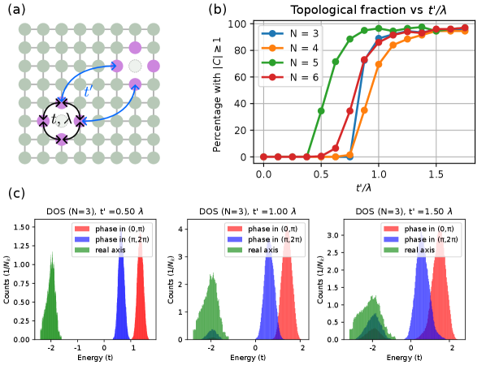
**図1：空孔局所環境と位相転移図。** (左) 各空孔のダングリングボンド状態（紫球）、サイト内スピン軌道結合 $\lambda$、同一空孔内ホッピング $t$、空孔間ホッピング $t'$ を示す模式図。(中) $t'/\lambda$ 比に対してトポロジカル非自明系の割合が急増するしきい値が存在することを示す図（$t'/\lambda \gtrsim 0.75$ で転移）。(右) 状態密度の進化と蓄積位相によるトポロジカル判定。機能発現の鍵は空孔間相互作用 $t'$ がSOC $\lambda$ に拮抗するという普遍的競合機構にある。

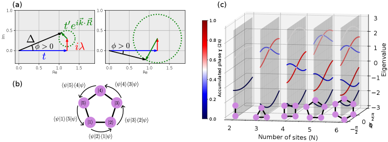
**図2：ハミルトニアン項と蓄積位相の複素平面表現。** (上) 空孔間相互作用が弱い場合と強い場合のハミルトニアン項ベクトル。(下) 空孔サイクルにわたって蓄積される位相値と対応する固有状態。位相蓄積がゼロでなければ非自明トポロジーを示す。材料工学的には、この「位相蓄積」が空孔密度と配置の設計指針に直接対応する。

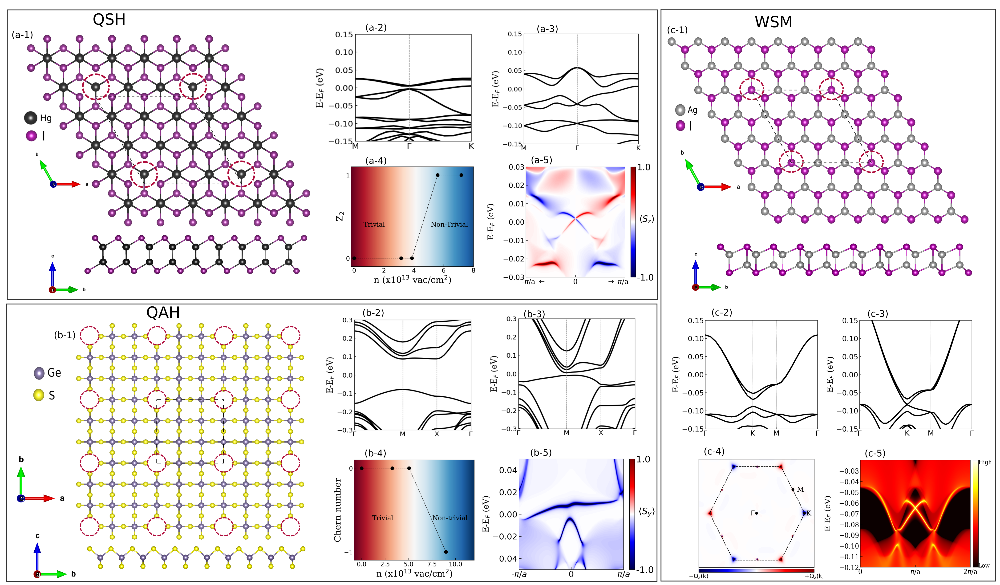
**図3：空孔設計で誘起される3つのトポロジカル相。** (上段) HgI における量子スピンホール相：低空孔密度（自明）から高空孔密度（QSH、エッジ状態あり）へのバンド構造変化。(中段) GeS₂ における量子異常ホール相：空孔磁化による時間反転対称性破れとチャーン数 +1 の実現。(下段) AgI における 2 次元ワイル半金属：ワイル点の出現とフェルミアーク。デバイス材料選定の観点で、QSH はスピンフィルタ、QAH はゼロ磁場ホール素子、ワイル半金属は異常ホール磁気センサとして機能する。

---

## 二次元ペロブスカイト–ナノ結晶超格子ヘテロ構造による決定論的光エネルギー集光

### 1. 論文情報

**タイトル：** [Deterministic nucleation of nanocrystal superlattices on 2D perovskites for light-funneling heterostructures](https://arxiv.org/abs/2603.18959)
**著者：** Umberto Filippi, Alexander Schleusener, Simone Lauciello, Roman Krahne, Dmitry Baranov, Liberato Manna, Masaru Kuno
**arXiv ID：** 2603.18959
**カテゴリ：** cond-mat.mtrl-sci
**公開日：** 2026年3月19日
**論文タイプ：** 実験研究（材料合成・光物性評価）
**ライセンス：** CC BY 4.0

### 2. どんな研究か

二次元層状ペロブスカイト PEA₂PbBr₄ マイクロ結晶の側面および上面を核生成サイトとして、CsPbBr₃ ナノ結晶超格子を決定論的に成長させ、コア・クラウン型またはコア・シェル型のヘテロ構造を形成した。この構造が「エネルギー集光系」として機能し、励起強度・温度に応じて二次元ペロブスカイトからナノ結晶超格子へのエネルギー移動の経路と効率が制御できることを時間分解 PL 測定で定量評価した。

### 3. 研究の概要

**背景と目的：** 光合成複合体は、アンテナ分子が光を集め、反応中心へエネルギーを伝達するという階層的光捕集構造を持つ。これを人工的に再現する「光ハーベスティングヘテロ構造」の作製は、太陽電池・LED・光化学センサ等への応用が期待される。しかし、材料的非互換性と転写工程の困難さが課題だった。本研究は、2D ペロブスカイトの結晶面をテンプレートとして直接成長させるワンポット的な手法を開発した。

**対象材料系：** CsPbBr₃ ナノ結晶超格子（受容体・アクセプタ）と PEA₂PbBr₄ 二次元層状ペロブスカイトマイクロ結晶（供与体・ドナー）のヘテロ接合。いずれも有機アミン（PEA = フェネチルアミン）またはオレイン酸・オレイルアミンでパッシベーション。

**材料創製法：**
1. 反溶媒支援晶析法で PEA₂PbBr₄ マイクロ結晶を基板上に作製。
2. CsPbBr₃ ナノ結晶分散液を傾けた基板上にドロップキャスト。溶媒蒸発時に 2D 結晶表面が優先核生成サイトとなり、コア・クラウン配置またはコア・シェル配置で超格子が成長。
3. in situ PL でナノ結晶の 10 meV ブルーシフトを観測 → 成長中のサイズ縮小を確認。

**主な測定手法：** 走査型電子顕微鏡（SEM）、X 線回折、蛍光寿命イメージング顕微鏡（FLIM）、時間分解 PL（TRPL）、励起強度・温度依存 PL。

**主な結果：**
- 低励起強度（$\lesssim 1430$ nJ/cm²）では、ドナー（2DLP）寿命が 1790 ps → 980 ps に短縮、アクセプタ（超格子）寿命が 3200 ps → 3900 ps に延長。エネルギー移動時定数 $\approx 640$ ps を抽出。フェルスター半径 $\approx 67$ nm は幾何学的に合理的。
- 高励起強度（$\gtrsim 1430$ nJ/cm²）では、ドナー側の双励起子形成が抑制され、アクセプタ側で双励起子が促進されるというエネルギー移動による励起子数制御が観測された。
- 低温（80 K）では、ドナー側の輻射再結合が速くなり、単一励起子チャネルでのエネルギー移動が増強。アクセプタの輻射寿命が延び、発光が増強された。

**観測された量子効果：** 一重項フェルスター共鳴エネルギー移動（FRET）、双励起子（Biexciton）形成、量子閉じ込め（ナノ結晶）。
**評価された巨視的機能：** 発光寿命・強度・エネルギー移動効率・励起強度依存スイッチング。
**デバイス的含意：** 発光素子（LED）や光検出器における励起光の指向的収集と高効率放射の組み合わせに直結。光集光デバイスの自己組織化合成プロセスとして実装可能。
**著者の主張：** 自己組織化とテンプレート成長を組み合わせた本手法は、二次元ペロブスカイトと量子ドット系一般に適用できる普遍的合成戦略であり、生物的光捕集の人工模倣への実用的経路を提供する。

### 4. 量子機能デバイスとして重要なポイント

本研究で機能発現の鍵となる量子効果は、**フェルスター共鳴エネルギー移動（FRET）** である。FRET の速度は $k_{FRET} \propto (R_0/r)^6$（$R_0$：フェルスター半径）に従い、ドナー-アクセプタ距離 $r$ に強く依存する。本系でのフェルスター半径 67 nm は、二次元ペロブスカイトとナノ結晶超格子の面積接触という幾何学的配置により、効率的な近距離エネルギー移動を可能にしている。材料設計上の重要な発見は、**2D ペロブスカイト上のナノ結晶超格子が「単結晶に近い配向」を持つこと**であり、これが均一な FRET パスウェイを保証している。デバイス設計の観点では、励起強度によってシングル励起子/双励起子どちらのチャネルで機能するかが変わるという「モード切り替え」が示されており、パワー依存の光変調器や非線形光学素子への応用が考えられる。また、低温での寿命延長は LEDの量子効率向上（排熱設計が良ければ）にもつながる知見である。

### 5. 限界と注意点

本研究の試料はドロップキャスト法による自己組織化であり、核生成位置の完全な制御性は示されていない。コア・クラウン型とコア・シェル型の選択的制御条件も明確ではなく、再現性・歩留まりの定量評価が必要。フェルスター半径 67 nm という値はドナーの量子収率・発光スペクトルのオーバーラップ積分等の仮定に依存しており、誤差見積もりは記載されていない。TRPL の解析は多指数フィッティングに基づいており、異なる核内/核間ドメインの寄与の分離が困難。励起状態の帰属（自由励起子 vs. 束縛励起子 vs. トラップ状態）については本文でも一部不確定な点が残っている。さらに、鉛含有ペロブスカイトという材料系は環境・毒性面での課題を持ち、実用デバイスへの直接展開には代替材料（鉛フリーペロブスカイト）での検証が必要である。

### 6. 関連研究との比較

ペロブスカイトナノ結晶と2D ペロブスカイトのヘテロ接合については、前駆体混合や転写プロセスを用いた先行研究が複数存在するが（Li et al. 2021, Nano Lett. 等）、これらは材料的非互換性や転写ダメージの問題を抱えていた。本研究の独自性は、「2D 結晶面への直接核生成」というワンポット手法であり、プロセスの簡略化と構造の均一性という点で進歩がある。また、フォルスター半径 67 nm という値は、有機–有機 FRET（通常数 nm）や量子ドット–有機分子 FRET（数〜20 nm）に比べて格段に大きく、ペロブスカイト系の高い遷移双極子モーメントが効いている。光合成模倣の観点では、Scholes et al. によるクロロフィル系 FRET（2D ディスクアンテナ）との比較が示唆的であり、本系はより単純な化学系で類似機能を達成している。将来展開として、非鉛ペロブスカイト（例：Cs₂AgBiBr₆）での同様のヘテロ構造形成や、垂直積層型フォトダイオードへの組み込みが考えられる。

### 7. 重要キーワードの解説

**① フェルスター共鳴エネルギー移動 (FRET)**
ドナーの励起状態から非放射的にアクセプタへエネルギーが移る双極子–双極子相互作用機構。速度定数 $k_{FRET} = \frac{1}{\tau_D} \left(\frac{R_0}{r}\right)^6$ で与えられる（$\tau_D$：ドナー寿命、$r$：距離、$R_0$：フェルスター半径）。$R_0$ は通常 1〜20 nm だが、ペロブスカイト系では数十 nm に達し、長距離エネルギー移動が可能。

**② 二次元層状ペロブスカイト（2DLP）**
$\text{(RNH}_3)_2 \text{MX}_4$ 型の Ruddlesden-Popper 構造を持つペロブスカイト（本研究では PEA₂PbBr₄）。有機アンモニウム層が無機 PbBr₄ 層を挟む量子井戸構造を形成し、強い励起子束縛エネルギー（数百 meV）と明確な発光特性を持つ。高い遷移双極子モーメントが FRET ドナーとして有利。

**③ 双励起子 (Biexciton)**
同一ナノ結晶内に2つの励起子が共存する励起状態。Coulomb 相互作用により単一励起子と異なるエネルギーを持つ。本研究では高励起強度でドナー側の双励起子形成が抑制され、アクセプタ側で促進されることが確認された。双励起子の増幅発光（ASE）や非線形光応答への利用が研究されている。

**④ ナノ結晶超格子 (Nanocrystal Superlattice)**
サイズ均一なナノ結晶がファンデルワールス力や配位子架橋により規則的に配列した集合体。単純立方・面心立方・体心立方等の超格子構造をとる。電子・エネルギーのミニバンド形成により、単結晶に近い均一なエネルギー移動パスが形成される。

**⑤ コア・クラウン型ヘテロ構造**
中心（コア）に一つの結晶があり、その側面に別の材料が取り囲む（クラウン）構造。本研究では PEA₂PbBr₄ マイクロ結晶の側面に CsPbBr₃ 超格子が成長したもの。コア・クラウン構造は励起子の側面間 FRET を最適化し、コア・シェルは垂直方向の FRET を促進する。

**⑥ 時間分解フォトルミネッセンス（TRPL）**
パルスレーザー励起後の発光強度の時間変化を測定する手法。寿命（1/e 減衰時間）から非輻射遷移速度・エネルギー移動速度を分離して定量できる。本研究ではドナー寿命の短縮（FRET によるクエンチ）とアクセプタ寿命の延長（FRET 後の緩和）を同時追跡し、FRET 時定数 640 ps を抽出した。

**⑦ 量子収率 (Photoluminescence Quantum Yield, PLQY)**
吸収した光子数に対する発光光子数の比。$\text{PLQY} = k_r / (k_r + k_{nr} + k_{FRET})$。本系ではドナーの PLQY が高いほど FRET 効率が大きくなるため、パッシベーション（欠陥準位の除去）が FRET 設計の前提条件。鉛ハライドペロブスカイトの高い PLQY（80〜99%）が本系の高 FRET 効率を可能にしている。

### 8. 図

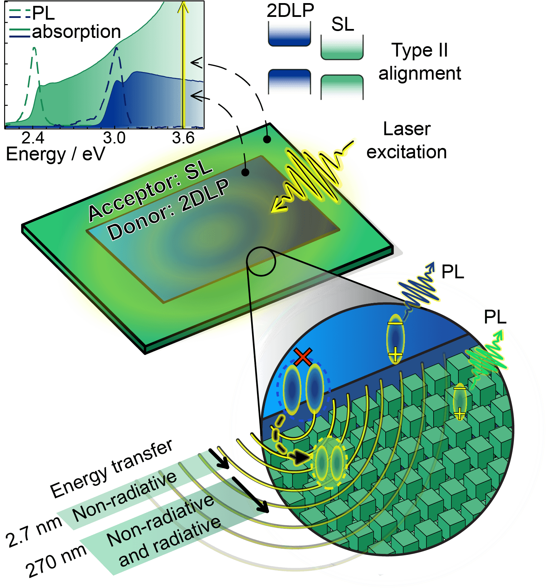
**図1：ヘテロ構造設計とエネルギー移動スキーム。** 2次元ペロブスカイト（ドナー、広バンドギャップ側）とナノ結晶超格子（アクセプタ、狭バンドギャップ側）のバンドアライメントと光励起後のエネルギー移動方向を示す。FRET によるアクセプタへの指向性エネルギー集光がデバイス動作の基本である。材料設計上、ドナー発光スペクトルとアクセプタ吸収スペクトルのオーバーラップが FRET 効率を支配する。

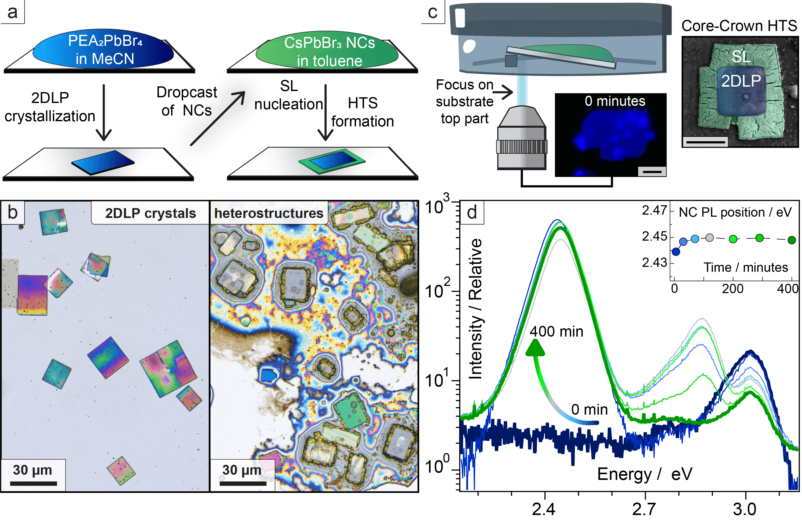
**図2：CsPbBr₃ 超格子の決定論的核生成と構造キャラクタリゼーション。** (a) 2段階合成プロセス（2DLPマイクロ結晶作製 → ナノ結晶ドロップキャストと溶媒蒸発）のスキーム。(b) 光学顕微鏡：2DLP 表面でのコア・クラウン型成長。(c) SEM と in situ PL：ナノ結晶成長中の 10 meV ブルーシフトがサイズ縮小を示す。2D ペロブスカイト表面の選択的濡れ性がナノ結晶超格子の配向性を高める鍵。

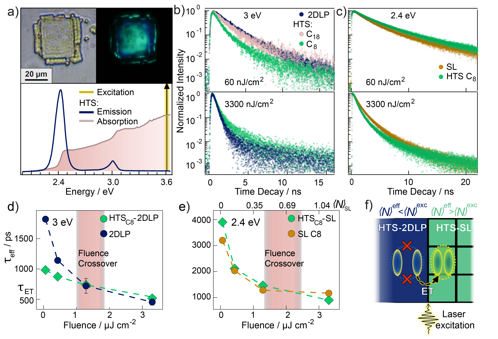
**図3：エネルギー移動ダイナミクスの励起強度依存評価。** (上) 励起強度を変化させたときのドナー（短縮）・アクセプタ（延長）の発光寿命変化。FRET 時定数 $\approx 640$ ps を示す。(下) 高励起強度での双励起子チャネル活性化：ドナーで双励起子が抑制され、アクセプタで促進されるクロスオーバー挙動。デバイス動作への示唆として、励起密度による動作モード（単一励起子 FRET vs. 双励起子 FRET）の切り替えが光変調機能に利用できる。

---

## その他の重要論文

---

## 超薄膜 Bi₂Te₃ のトポロジカル輸送を決める基板支配型成長機構

### 1. 論文情報

**タイトル：** [Substrate-controlled nucleation and growth kinetics in ultrathin Bi₂Te₃ films](https://arxiv.org/abs/2603.17868)
**著者：** Damian Brzozowski, Sander R. Hønnås, Egil Y. Tokle, Jørgen A. Arnesen, Ingrid G. Hallsteinsen
**arXiv ID：** 2603.17868
**カテゴリ：** cond-mat.mtrl-sci
**公開日：** 2026年3月18日
**論文タイプ：** 実験研究（薄膜成長・輸送評価）
**ライセンス：** arXiv 標準ライセンス（非商業的再配布可）

### 2. 研究概要

**第1段落（研究の全体像）：**
パルスレーザー堆積法（PLD）で、4種類の基板（マイカ・SrTiO₃・BaF₂・Si₃N₄）上に超薄膜 Bi₂Te₃ を成長させ、成長形態・構造・輸送特性を系統比較した。マイカと SrTiO₃（表面粗さ小）では 5 重層（QL）単位のテラス状積層成長が観測され、BaF₂・Si₃N₄（粗面）では島状成長となった。重要な発見は、成長形態を支配するのは格子整合よりも**基板表面粗さ**であるという点である。電気輸送測定では、マイカおよび SrTiO₃ 上の試料で弱反局在（WAL）シグネチャが確認され、位相コヒーレントなトポロジカル表面輸送が実現した。一方、SrTiO₃ 上では欠陥密度の増大（強い核生成エネルギーに起因）によりキャリア密度が最も高く（$10^{20}$ cm⁻³）、体積伝導との分離が課題となる。

**第2段落（重要性）：**
この研究は Bi₂Te₃ 超薄膜における「トポロジカル表面輸送 vs. バルク伝導」のバランスが、格子整合という従来指標ではなく基板表面形態によって制御されることを示した点で材料設計上重要である。基板選択が欠陥密度・キャリア密度を通じてトポロジカルデバイス動作に直結することが示され、高移動度・低体積伝導を両立する基板設計の指針が得られた。マイカ基板は van der Waals 界面が形成されることでクリーンな表面トポロジー輸送に最も有利であり、低消費電力スピンデバイス・量子コンピューティング基盤材料の成膜プロセス最適化に直接応用できる。

### 3. 重要キーワードの解説

**① 弱反局在 (Weak Anti-Localization, WAL)**
スピン軌道相互作用が強い系で電子が閉じたループを周回するとき、スピンの berry 位相 $\pi$ の蓄積により干渉項が負（建設的干渉→破壊的干渉）になる現象。磁場印加で弱反局在を壊す → 正の磁気伝導。トポロジカル表面状態のシグネチャとして利用される。

**② 五重層 (Quintuple Layer, QL)**
Bi₂Te₃ の基本積層単位 Te–Bi–Te–Bi–Te（約 1 nm）。各 QL は van der Waals 力で結合。トポロジカル表面状態は QL 厚さに依存し、6 QL 以下では表面と底面の状態がハイブリダイズする（バンドギャップ開口）。

**③ パルスレーザー堆積法 (PLD)**
ターゲット材料にパルスレーザーを照射して蒸発させ、基板上に成膜する手法。化学量論比の保存性が高く、酸化物・カルコゲナイドなど複雑組成材料の薄膜化に適する。本研究では真空中・高温基板上で QL 分解能の制御成長を実現。

**④ 格子整合 vs. 基板粗さ**
格子整合（Lattice Match）は基板と薄膜の面内格子定数の一致度であり、歪み・転位密度を支配する従来の成長設計指針。しかし本研究では、粗い表面の BaF₂（格子整合が比較的良い）よりも平滑な SrTiO₃（格子不整合が大きい）で順序正しいテラス成長が得られたことから、**界面エネルギー** の均一性が支配的因子であることが示された。

**⑤ 体積伝導 (Bulk Conduction)**
Bi₂Te₃ のバルク内のキャリア（Te空孔・Bi-Te逆置換等の欠陥由来）による電気伝導。トポロジカル表面状態の検出には体積伝導を最小化することが必要であり、欠陥の少ない成長条件が求められる。

**⑥ キャリア密度 (Carrier Density)**
単位体積あたりの自由電荷担体数（$n$: cm⁻³）。ホール測定から評価される。SrTiO₃ 上試料での $n \sim 10^{20}$ cm⁻³ は体積伝導が支配的なことを示し、輸送実験でのトポロジカル表面状態の分離が困難。マイカ上では相対的に低い $n$ が期待され、表面優勢の伝導が可能。

**⑦ van der Waals エピタキシー**
van der Waals 力で結合した基板上に vdW 力で結合した薄膜を成長させる手法。化学結合がないため界面での歪み蓄積がなく、格子整合条件が緩和される。マイカ・hBN・グラファイト等が典型的な vdW 基板。Bi₂Te₃ の QL 積層成長には vdW エピタキシーが自然な選択。

### 4. 図

ライセンスが arXiv 標準ライセンスであるため、原図の掲載は行わない。

---

## d 波超伝導体の光応答：逆ファラデー効果による直流磁化の誘起

### 1. 論文情報

**タイトル：** [Light induced magnetization in d-wave superconductors](https://arxiv.org/abs/2603.18134)
**著者：** Maxim Dzero, Vladyslav Kozii
**arXiv ID：** 2603.18134
**カテゴリ：** cond-mat.supr-con
**公開日：** 2026年3月18日
**論文タイプ：** 理論研究（微視的計算）
**ライセンス：** CC BY 4.0

### 2. 研究概要

**第1段落（研究の全体像）：**
Keldysh–Nambu 準古典枠組みを用いて、d 波超伝導体に単色光が照射されたときに発生する直流磁化（逆ファラデー効果）を微視的に計算した。d 波ギャップのノード構造が非線形・非局所的な直流電流応答を決定し、s 波超伝導体と定性的に異なる周波数依存性を示すことが明らかになった。特に、分岐占有数の不均衡が非自明な dc 応答を生み出すメカニズムが定式化された。

**第2段落（重要性）：**
光誘起磁化という概念は、超高速スピントロニクス・超高速光磁気記録・光制御超伝導素子という3つの応用文脈で重要性を持つ。本理論が示す d 波特有の応答（ノード由来の低周波増強・特定周波数での符号反転等）は、CuO₂ 面を持つ銅酸化物高温超伝導体（LSCO・YBCO 等）の光ポンプ実験との比較基準となり、「どの周波数域でどの大きさの磁化が誘起されるか」という設計指針を提供する。光によって超伝導ペアを壊さずに（または利用して）磁化を操作できる可能性が開かれる。

### 3. 重要キーワードの解説

**① 逆ファラデー効果 (Inverse Faraday Effect, IFE)**
円偏光照射によって物質中に静的磁化（または磁気モーメント）が誘起される非線形光磁気効果。磁場応答を $M_{dc} \propto E_\omega \times E_\omega^*$ で記述できる。通常の（正の）ファラデー効果とは逆に、光が磁化を作る。フェムト秒パルスを用いた超高速光磁気制御の基礎機構。

**② d 波ギャップ (d-wave Gap)**
銅酸化物高温超伝導体の超伝導ギャップが $\Delta(\mathbf{k}) = \Delta_0 (\cos k_x - \cos k_y)$ という $d_{x^2-y^2}$ 対称性を持つこと。ブリルアン域の $(±\pi, 0), (0, ±\pi)$ 付近でギャップが最大（$\Delta_0$）となり、$(±\pi/2, ±\pi/2)$ 方向でノード（ゼロ点）を持つ。ノード方向の準粒子は散逸源となり、非線形応答を特徴付ける。

**③ Keldysh–Nambu 準古典形式 (Keldysh-Nambu Quasiclassical Formalism)**
超伝導系の非平衡輸送を記述するグリーン関数法。Keldysh 形式は非平衡状態（外場・光照射）を扱い、Nambu 形式はエレクトロン・ホールの Bogoliubov 変換を行列で記述。準古典近似（Fermi 波長 $\ll$ コヒーレンス長）で Eilenberger 方程式に帰着し、ギャップ構造・散乱・準粒子分布を同時に自己無撞着に解く。

**④ 分岐占有数不均衡 (Branch Population Imbalance)**
超伝導体において電子的励起枝（エレクトロン様）と正孔的励起枝（ホール様）の占有数が光照射等により不均衡になる状態。$Q^* = \sum_k (f_{ek} - f_{hk})$ で定義される charge imbalance とも関連する。本研究では、この不均衡が d 波系での非自明 dc 電流応答の駆動源となることが示された。

**⑤ 直流電流成分 (dc Current Response)**
交流電場 $E = E_0 e^{-i\omega t} + c.c.$ に対して、非線形応答として $j_{dc} \propto |E_0|^2$ で生じる直流電流（2次非線形効果）。これが空間的に非一様ならば誘起磁化 $\mathbf{M} = \nabla \times \mathbf{A}$ が現れる（逆ファラデー効果の dc 磁化成分）。

**⑥ ノード (Node) 方向の準粒子**
d 波超伝導体のノード方向（$\Delta \to 0$ の $\mathbf{k}$ 方向）では低エネルギー準粒子が存在する。これらは散乱・吸収のチャネルとなり、光応答の低周波側に余分な寄与をもたらす。s 波超伝導体（完全ギャップ）との応答の差異の主因。

**⑦ 超高速光磁気制御 (Ultrafast Magneto-optical Control)**
フェムト秒レーザーパルスによって磁化状態をサブピコ秒〜ピコ秒オーダーで操作する技術。光スイッチング・超高速磁気記録への応用が研究される。超伝導体における逆ファラデー効果は、超伝導秩序パラメータと磁気秩序の競合・共存を光で操作できる点で、次世代超伝導デバイス（Josephson メモリ・超伝導光スイッチ）への接続が考えられる。

### 4. 図

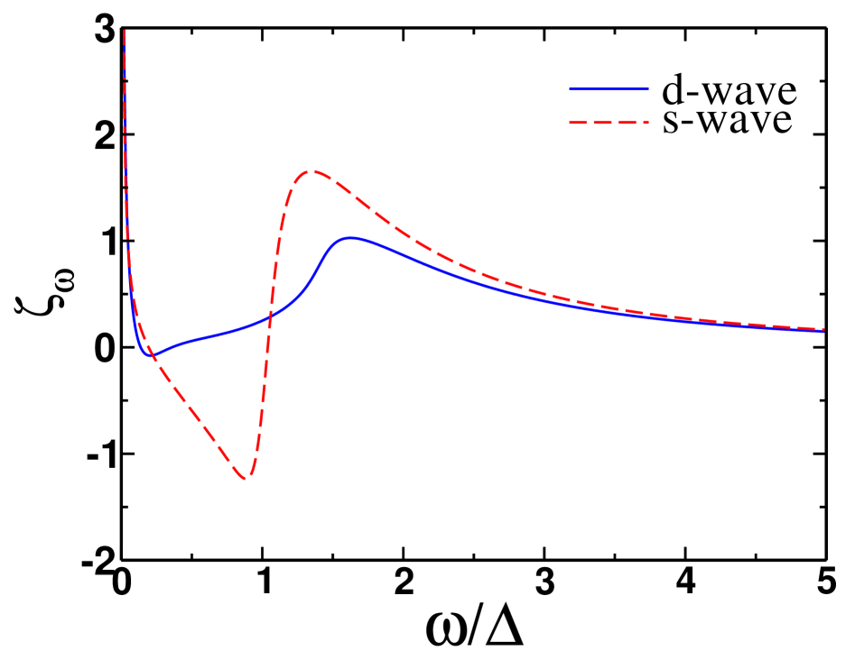
**図1：逆ファラデー効果の前因子 $\zeta_\omega$ の周波数依存性の比較。** s 波（完全ギャップ）と d 波（ノードあり）で定性的に異なる周波数依存性が示される。d 波では低周波側にノード方向準粒子由来の余分な応答が現れる。この差異が銅酸化物超伝導体の光実験での測定結果を d 波と s 波で識別するための診断指標となる。

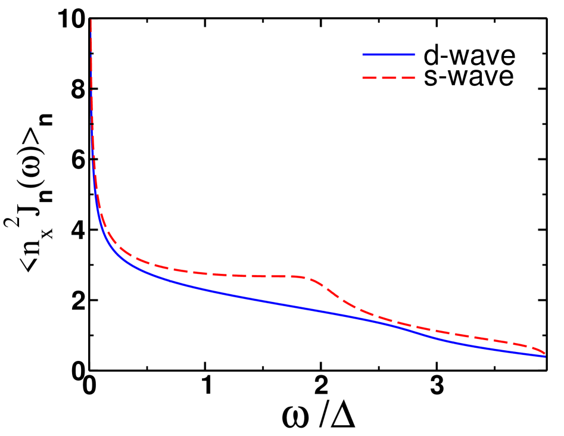
**図2：逆ファラデー効果の強度を決める関数 $\langle n_x^2 \delta J_n(\omega) \rangle_n$ の周波数依存。** この量が直接 dc 磁化の大きさを決定する。特定の周波数域（超伝導ギャップ近傍）で増強が見られ、光源の選択による磁化誘起の最適化ができることを示す。デバイス設計上、使用すべき光源の中心波長選定指針となる。

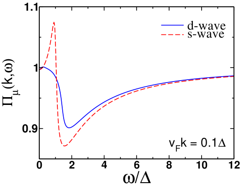
**図3：dc 電流応答を決める分極関数 $\Pi_\mu(\mathbf{k}, \omega)$ の s 波・d 波比較。** 運動量依存性が弱いことが確認され、準古典近似の自己無撞着な有効性を支持する。d 波では特定の $\mathbf{k}$ 方向（ノード付近）での応答が異なるプロファイルを示す。

---

## Nb₃Sn 超伝導膜の拡散接合横断超電流：加速器用超伝導空洞への工学的経路

### 1. 論文情報

**タイトル：** [Nb₃Sn Films Exhibiting Continuous Supercurrent Across a Diffusion Bonded Seam](https://arxiv.org/abs/2603.18351)
**著者：** Andre Juliao, Wenura Withanage, Nikolya Cadavid, Anatolii Polyanskii, Lance D Cooley
**arXiv ID：** 2603.18351
**カテゴリ：** cond-mat.supr-con, physics.acc-ph
**公開日：** 2026年3月18日
**論文タイプ：** 実験研究（材料加工・超伝導評価）
**ライセンス：** CC BY 4.0

### 2. 研究概要

**第1段落（研究の全体像）：**
ブロンズ（Cu-Sn 合金）ブロックを接合し、Nb 蒸気雰囲気中で～715°C に加熱することにより、接合部を横断した Nb₃Sn 薄膜の同時形成を実現した。2 種類のプロセス—ホットブロンズ（HB）レシピと冷間 Nb 堆積（CB）レシピ—を開発し、HB レシピで作製した試料について磁気光学イメージング（MOI）を用いて超電流の連続性を 9 K で直接観察した。SEM・XRD による膜厚・相純度評価と組み合わせて、接合界面での Nb₃Sn 成長連続性と Tc（約 16.5 K）の確認を行った。

**第2段落（重要性）：**
Nb₃Sn は Nb に比べ高い Tc（18 K）・高い上部臨界磁場 Hc₂（~30 T）を持つが、内面形状が複雑な超伝導 RF 空洞への均一コーティングが技術的課題だった。本研究は「分割した部品をコーティング後に接合する」のではなく「接合と同時にコーティングする」という逆転の発想で、接合部でも連続超電流が流れる膜を実現した。これは大型加速器（CERN, KEK 等）の次世代超伝導 RF 空洞（SRF cavity）設計において、複雑形状対応コーティングへの実用的経路を示すものであり、量子コンピュータ用超伝導回路の基板接合技術にも転用可能な方法論である。

### 3. 重要キーワードの解説

**① Nb₃Sn 超伝導体**
A15 型結晶構造（Pm-3n）を持つ金属間化合物超伝導体。Tc ≈ 18 K、上部臨界磁場 Hc₂(0) ≈ 29 T（4.2 K）。従来の Nb（Tc 9.2 K）より高 Tc・高磁場対応であり、次世代加速器磁石・SRF 空洞・高温超伝導との複合系での活用が研究される。脆性が高く加工性に課題がある。

**② 拡散接合 (Diffusion Bonding)**
高温・加圧下で異種または同種金属界面の原子拡散により化学結合を形成する固相接合法。本研究では Cu-Sn ブロンズ同士の接合に適用し、接合界面でも連続した Nb₃Sn 膜が形成される条件を探索した。

**③ 磁気光学イメージング（MOI）**
ファラデー効果を利用した磁束密度の二次元可視化手法。超伝導体表面に磁気光学指示体（Bi-ガーネット薄膜等）を密着させ、外部磁場下での磁束侵入パターンを光学像として取得。超電流障壁（クラック・非超伝導相）があれば磁束侵入の異常として現れる。接合部での超電流連続性の確認に直接使用された。

**④ ブロンズ法 (Bronze Process)**
Cu-Sn ブロンズ中で Nb 線材に熱拡散を施して Nb₃Sn を合成する古典的手法。磁石応用では広く使われるが、表面コーティングへの応用では「外側から Nb 蒸気を供給」する変形版が SRF 空洞に用いられる。本研究はブロンズ自体を接合基材かつ Sn 供給源として使う新戦略。

**⑤ SRF 空洞 (Superconducting Radio-Frequency Cavity)**
粒子加速器で荷電粒子を加速するための超伝導共振空洞。表面抵抗が極めて小さいため高い加速電場（数十〜数百 MV/m）を低損失で実現できる。現行は Nb 製が主流だが、Nb₃Sn コーティングにより動作温度を 4 K から 2 K に引き上げずに性能向上が期待される。

**⑥ 上部臨界磁場 (Upper Critical Field, Hc₂)**
第II種超伝導体が磁束侵入でありながら完全に常伝導に転じる臨界磁場。GL 理論で $H_{c2} = \Phi_0 / (2\pi \xi^2)$ ($\xi$：コヒーレンス長)。Nb₃Sn の高 Hc₂ は大型高磁場磁石への適用可能性を意味し、量子コンピュータ用冷凍磁石への組み込みにも関係する。

**⑦ 超伝導コヒーレンス長 (Superconducting Coherence Length, ξ)**
超伝導秩序パラメータ（ペア波動関数）の空間的減衰長。Nb₃Sn では $\xi \approx 3$–4 nm と短く、界面粗さ・欠陥密度に敏感。接合界面でコヒーレンス長スケールの乱れがあれば超電流が遮断される可能性があり、本研究の MOI 測定が「連続超電流」を示したことの意義が大きい。

### 4. 図

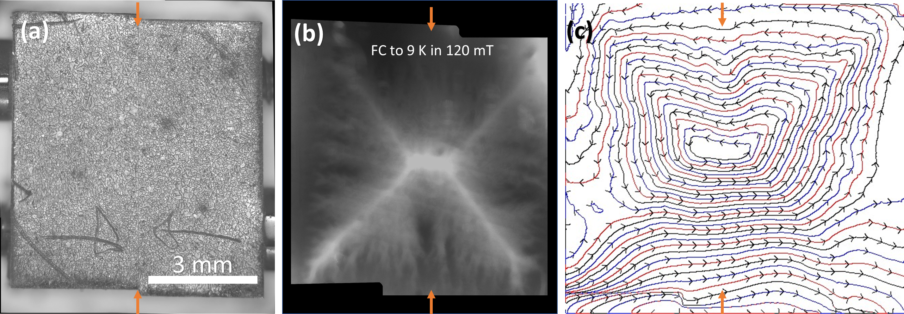
**図1：磁気光学イメージングによる接合部での超電流連続性の可視化。** (a) HB レシピで作製した Nb₃Sn 膜の平面 MOI 像。接合部（中央の縦線）をはさんで磁束侵入パターンに乱れがなく、超電流が連続して流れることを示す。(b) 接合なし試料との比較。デバイス工学上、接合部での超電流遮断が素子欠陥になる SRF 空洞・超伝導回路への直接的な品質保証指標。

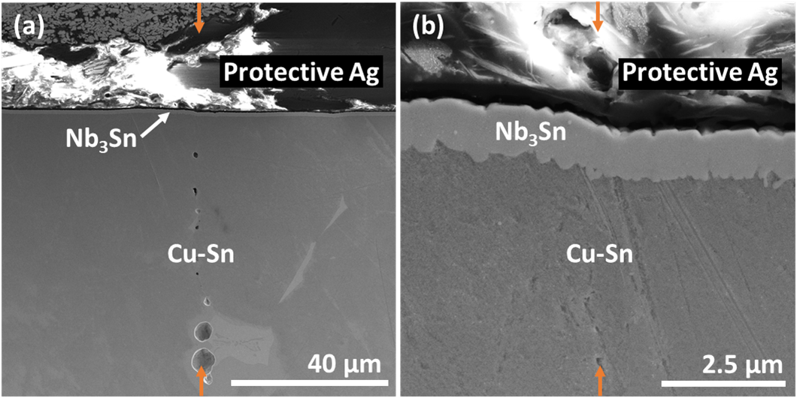
**図2：HB レシピ接合部の SEM 断面像。** 接合界面をまたいで均一な Nb₃Sn 層が形成されていることが示される。界面粗さ・空隙・第二相の有無が超電流連続性を左右する材料設計因子であり、SEM による直接確認は品質管理の基礎データ。

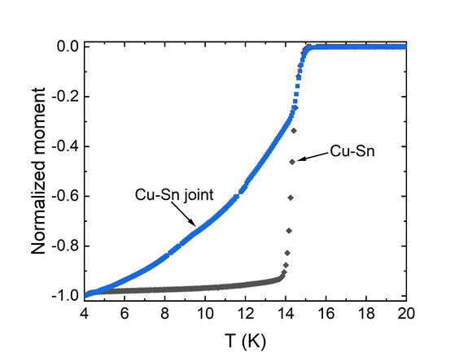
**図3：磁気モーメントの温度依存性（M-T 曲線）。** 接合を含む試料で Tc ≈ 16.5 K の超伝導転移が確認された。Tc が純 Nb₃Sn（18 K）より低いのはブロンズ成分（Cu）の一部取り込みが示唆されるが、明確な単一転移が接合部での相連続性を支持する。

---

## Si/SiGe/Si 量子井戸の量子閉じ込め：組成ゆらぎが設計を左右する

### 1. 論文情報

**タイトル：** [Quantum confinement in semiconductor random alloys: a case study on Si/SiGe/Si](https://arxiv.org/abs/2603.18747)
**著者：** Daniel Dick, Florian Fuchs, Sibylle Gemming, Jörg Schuster
**arXiv ID：** 2603.18747
**カテゴリ：** cond-mat.mes-hall
**公開日：** 2026年3月19日
**論文タイプ：** 計算研究（電子構造・量子井戸モデリング）
**ライセンス：** CC BY 4.0

### 2. 研究概要

**第1段落（研究の全体像）：**
拡張ヒュッケル（EHT）理論を用いて、数 nm 厚の SiGe ランダム合金量子井戸（Si/SiGe/Si 構造）における量子閉じ込め効果を系統的に計算した。SiGe 層の膜厚・Ge 組成・局所 Ge 組成ゆらぎがバンドギャップ・伝導帯端・価電子帯端に与える影響を定量評価し、有限量子井戸（FQW）モデルとの比較により精度と計算コストのバランスを検証した。Ge 含有量の増加（バンドギャップ縮小効果）が量子閉じ込め（バンドギャップ拡大効果）によって相殺されることを明示し、nm スケールでの局所合金ゆらぎが設計誤差の主因となることを示した。

**第2段落（重要性）：**
Si/SiGe/Si 量子井戸は Ge 系スピン量子ビットの材料基盤であり、ゲート定義された量子ドット内でのホールスピン・電子スピンの閉じ込めエネルギーは膜厚とGe組成の精密制御に依存する。本研究は「層厚1〜2 nm のスケールでは局所Ge組成ゆらぎが量子閉じ込めエネルギーに無視できない不均一性をもたらす」ことを定量的に示しており、次世代 Si 量子ビットの設計仕様（膜厚公差・組成公差）を決める実用的指針となる。特に価電子帯側の強い閉じ込めと伝導帯側の弱い閉じ込めという非対称性は、ホール量子ビット（$p$ 型 Si/SiGe）の設計で考慮すべき定量情報を提供する。

### 3. 重要キーワードの解説

**① ランダム合金効果 (Random Alloy Effects)**
SiGe のように Si/Ge がランダムに配置された合金では、局所組成が統計的にゆらぐ。バルクでは平均化されるが、nm スケールの量子井戸では局所 Ge 組成のゆらぎがエネルギーバンド端の空間ゆらぎ（アロイディスオーダー）として現れ、量子ドットの閉じ込めエネルギーに直接影響する。

**② 拡張ヒュッケル法 (Extended Hückel Theory, EHT)**
各原子の価電子軌道（Slater 型基底関数）でハミルトニアンを構成し、対角要素に原子イオン化ポテンシャルを用いる半経験的電子構造法。DFT より計算コストが大幅に低く、数万原子の超セル計算が可能。Si/SiGe 系のバンドギャップ・バンドオフセット計算に実績がある。

**③ 有限量子井戸モデル (Finite Quantum Well, FQW)**
無限高さの電位障壁の代わりに有限の電位障壁 $V_0$ を持つ量子井戸モデル。波動関数が障壁に染み出す（tunneling tail）ため、無限井戸より低いエネルギー準位を与え、実系により近い。$E_n$ は超越方程式の解として得られ、数値的に解く必要がある。

**④ バンドオフセット (Band Offset)**
ヘテロ接合界面での伝導帯端 $\Delta E_c$ または価電子帯端 $\Delta E_v$ のエネルギー差。量子井戸の閉じ込めエネルギーを決定する主要パラメータ。Si/SiGe では $\Delta E_v$ が大きく（正孔の強閉じ込め）、$\Delta E_c$ が小さい（電子の弱閉じ込め）という非対称性が特徴的。

**⑤ ホール量子ビット (Hole Spin Qubit)**
$p$ 型 Si/SiGe 量子井戸内のゲート定義量子ドットに閉じ込めたホール（正孔）のスピン自由度を量子ビットとして使う技術。ホールは重い正孔と軽い正孔の混合（価電子帯の複雑性）とスピン軌道相互作用により、電気的スピン操作が電子スピン量子ビットより容易とされる。

**⑥ コヒーレンス長・閉じ込めエネルギー**
量子ドット内の閉じ込めエネルギー $E_1 \propto \hbar^2 \pi^2 / (2m^* L^2)$ は量子ビットのエネルギー準位間隔を決め、熱励起による量子ビットエラーと関係する（操作温度の上限に直結）。膜厚 $L$ と有効質量 $m^*$ の精密設計が必要。

**⑦ スーパーセル法 (Supercell Method)**
結晶の単位胞を複数繰り返したスーパーセルを計算対象とすることで、欠陥・合金・界面などの非周期的構造を第一原理または半経験的手法で扱う方法。EHT との組み合わせで数千〜数万原子のランダム合金配置を多数計算してアンサンブル平均・標準偏差を評価することが本研究の方法論の核心。

### 4. 図

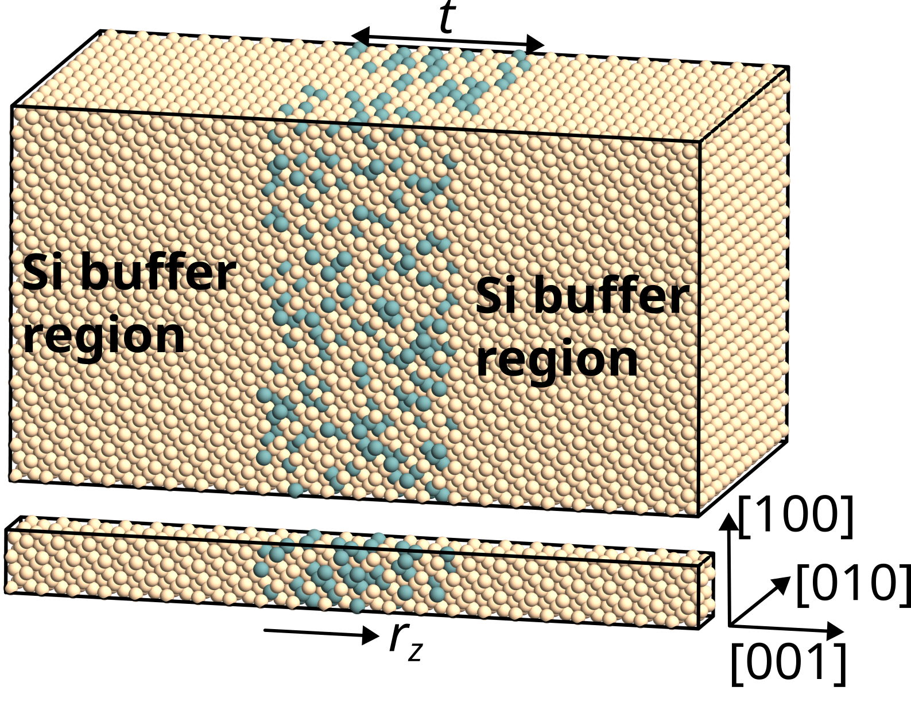
**図1：Ge 30% の SiGe 量子井戸を Si で挟んだ 3 nm 厚スーパーセル。** ランダムに分布した Si（青）・Ge（金）原子と、計算の局所解析に使用した 36 個のサブセルを示す。nm スケールのランダム組成ゆらぎが量子閉じ込めエネルギーを不均一化させる起源であることが可視化される。量子ビット作製において、この局所組成ゆらぎが「見えにくい設計誤差」として作用する。

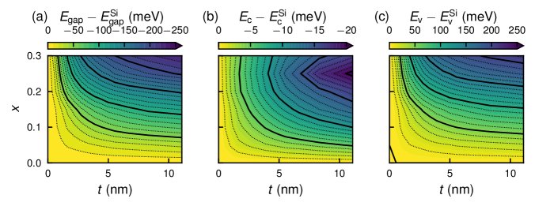
**図2：バンドギャップ（上）・伝導帯端（中）・価電子帯端（下）の膜厚（1〜8 nm）と Ge 組成（15〜30%）依存性。** 薄層化（量子閉じ込め）によるバンドギャップ拡大が Ge 量増加（バンドギャップ縮小）と拮抗することが定量的に示される。量子ビット設計で重要な「目標閉じ込めエネルギーを達成するための膜厚・組成のトレードオフマップ」として直接利用できる。

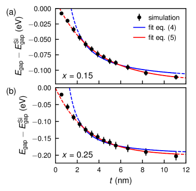
**図3：有限量子井戸（FQW）モデルと EHT 計算の比較。** 無限井戸（実線）と有限井戸（点線）での基底状態波動関数の染み出し。FQW モデルが EHT の結果を良く再現することが示され、設計段階での高速な予測ツールとして活用できる。量子ビットの閉じ込めポテンシャル設計に際し、障壁高さ（バンドオフセット）の精確な入力が重要なことを改めて示す。

---

## 強誘電スイッチングで手性が反転するフォノン：スピントロニクスへの新経路

### 1. 論文情報

**タイトル：** [Coupled Ferroelectricity and Phonon Chirality](https://arxiv.org/abs/2603.15325)
**著者：** Xiang-Bin Han, Cong Yang, Rui Sun, Xiaotong Zhang, Thuc Mai, Zhengze Xu, Aryan Jouneghaninaseri, Xiaoning Jiang, Rahul Rao, Yi Xia, Dali Sun, Jun Liu, Xiaotong Li
**arXiv ID：** 2603.15325
**カテゴリ：** cond-mat.mtrl-sci
**公開日：** 2026年3月13日
**論文タイプ：** 実験研究（光物性・強誘電評価）
**ライセンス：** arXiv 標準ライセンス（非商業的再配布可）

### 2. 研究概要

**第1段落（研究の全体像）：**
トリグリシン硫酸塩（TGS）強誘電体を用いて、電場による分極スイッチングがフォノンカイラリティを可逆的に反転させることを実証した。磁気光学カー効果（MOKE）と偏光ラマン分光による測定で、強誘電常誘電転移温度（Tc ≈ 49°C）以上ではフォノンカイラリティが消失し、強誘電相でのみ電場によるカイラリティ制御が可能であることが示された。水晶のような固定カイラリティ材料とは異なり、TGS では「ラセミ強誘電状態」において電場印加で +/-カイラリティを切り替えられるという新機能が発見された。

**第2段落（重要性）：**
フォノンカイラリティは、角運動量を持つ格子振動モードであり、スピン角運動量との交換（スピン–フォノン相互作用）を通じて磁化操作やスピン流生成に関与しうる。電場によってフォノンカイラリティを切り替えられるという本発見は、「電場制御型スピン–フォノン変換素子」という新デバイス概念につながる可能性がある。また、偏光ラマンと MOKE の組み合わせによるフォノンカイラリティの非接触・非破壊計測は、圧電/強誘電材料の新たな評価手法として汎用性を持つ。

### 3. 重要キーワードの解説

**① フォノンカイラリティ (Phonon Chirality)**
格子振動（フォノン）モードが角運動量を持つ性質。円偏光フォノン（右回りまたは左回り）として記述され、フォノン角運動量 $l_\nu = \sum_\kappa m_\kappa (\mathbf{u}_\kappa \times \dot{\mathbf{u}}_\kappa)_z$ で定義される。通常は対称な結晶では正逆カイラルモードが縮退するが、カイラル構造や外場によって縮退が解ける。

**② スピン–フォノン相互作用 (Spin-Phonon Coupling)**
スピン自由度と格子振動が結合する相互作用。磁性体では磁気秩序の変化が格子を変形させ（磁歪）、逆に格子振動がスピンに影響を与える。フォノン角運動量がスピン角運動量と交換できる場合、スピン流生成・スピン緩和の新経路となる。

**③ 磁気光学カー効果 (Magneto-Optical Kerr Effect, MOKE)**
磁気的に秩序化した材料に線偏光が入射・反射されるとき、偏光面が回転する効果。通常は磁化の検出に使われるが、本研究ではフォノンカイラリティの変化に伴う光学的異方性の変化を捉えるために使用された。

**④ 強誘電体の分極スイッチング**
外部電場によって強誘電体の自発分極ベクトルの向きが反転する現象。ヒステリシス特性を持ち、不揮発性メモリ（FeRAM）・トンネル接合型強誘電体メモリ（FTJ）の動作原理。本研究では分極スイッチングとフォノンカイラリティ反転が一対一対応することが示された。

**⑤ ラセミ強誘電状態 (Racemic Ferroelectric State)**
強誘電ドメインが +P と −P の両方を等量含み、マクロな分極はゼロだがドメインレベルではカイラリティを持つ状態。外部電場で一方のドメインを優勢にすることで、マクロなフォノンカイラリティが発現する。本研究の中核概念。

**⑥ 偏光ラマン分光 (Polarization-Resolved Raman Spectroscopy)**
入射光と散乱光の偏光方向を制御したラマン測定。フォノンモードの対称性・異方性・カイラリティを識別できる。右回り円偏光と左回り円偏光で散乱強度が異なれば、フォノンカイラリティの存在を示す。

**⑦ トリグリシン硫酸塩 (Triglycine Sulfate, TGS)**
分子式 (NH₂CH₂COOH)₃·H₂SO₄。Tc ≈ 49°C の水素結合型強誘電体。自発分極 $P_s \approx 2.8$ μC/cm²。単結晶育成が容易で強誘電特性研究のモデル材料として広く使われる。本研究ではその「ラセミ性」（+/-ドメイン共存）がフォノンカイラリティ制御に不可欠な役割を担う。

### 4. 図

ライセンスが arXiv 標準ライセンスであるため、原図の掲載は行わない。

---

## 機械学習分子動力学が拓く強誘電体の分極ダイナミクス設計

### 1. 論文情報

**タイトル：** [Polarization Dynamics in Ferroelectrics: Insights Enabled by Machine Learning Molecular Dynamics](https://arxiv.org/abs/2603.18058)
**著者：** Dongyu Bai, Ri He, Junxian Liu, Liangzhi Kou
**arXiv ID：** 2603.18058
**カテゴリ：** cond-mat.mtrl-sci
**公開日：** 2026年3月18日
**論文タイプ：** レビュー・展望論文
**ライセンス：** arXiv 標準ライセンス（非商業的再配布可）

### 2. 研究概要

**第1段落（研究の全体像）：**
本論文は、量子力学精度の力場（ポテンシャルエネルギー面）を機械学習でエンコードした分子動力学（MLMD）が、強誘電体材料の分極スイッチング・ドメイン壁運動・トポロジカル極性構造（渦・スカーミオン・反スカーミオン）の大規模シミュレーションをどのように可能にするかを展望する。第一原理計算（DFT）は精度が高いが数百原子・数ピコ秒が限界なのに対し、MLMD は数万〜数億原子・数ナノ秒スケールの動力学を量子力学的精度で扱えるため、強誘電体のデバイス動作（スイッチング速度・疲労・クリープ）に関わるマルチスケール現象への橋渡しとなる。主要な課題として①長距離静電効果のモデリング、②マルチフェロイック系での格子–スピン相互作用の記述、③大規模データ効率的な学習という3点が挙げられた。

**第2段落（重要性）：**
強誘電体は FeRAM・FTJ（強誘電体トンネル接合メモリ）・圧電センサ・ニューロモルフィックコンピューティング素子の材料基盤であり、分極スイッチング速度・耐久性・保磁電場低減はデバイス性能の直接指標となる。本展望論文が示す MLMD の方向性は、「どの組成・界面設計・歪み条件でスイッチングが速くなるか」という材料設計問いに量子精度の動力学的回答を与えるポテンシャルを持つ。特に ScAlN・HZO（Hf₀.₅Zr₀.₅O₂）等の新型強誘電体の非平衡ダイナミクス解析への応用は急務であり、本論文が示す方向性は計算材料科学コミュニティへの実用ロードマップとなる。

### 3. 重要キーワードの解説

**① 機械学習分子動力学 (Machine Learning Molecular Dynamics, MLMD)**
DFT 計算で生成した構造・エネルギー・力のデータセットを用いてニューラルネットワーク（NNP）やカーネル法（GAP 等）でポテンシャルエネルギー面を学習し、DFT 精度で MD シミュレーションを実行する手法。DeePMD・NequIP・MACE 等のアーキテクチャが代表的。

**② 分極スイッチング (Polarization Switching)**
外部電場によって強誘電体の自発分極方向が反転するダイナミクス。ドメイン核生成・ドメイン壁移動・完全反転という3段階で進む。スイッチング速度はナノ〜マイクロ秒スケールで、MLMD による大セルシミュレーションで初めて経路・速度論の定量解析が可能になる。

**③ トポロジカル極性構造 (Topological Polar Structures)**
強誘電体中に自発形成される渦（vortex）・スカーミオン・反スカーミオン・メロン等の局所分極テクスチャ。PbTiO₃/SrTiO₃ 超格子や BiFeO₃ 薄膜での観察が有名。トポロジカル数で分類され、デバイス動作での情報担体・局所スイッチングの単位となりうる。

**④ 保磁電場 (Coercive Field, Ec)**
強誘電体の P-E ヒステリシスループで分極がゼロになる外部電場値。Ec の低減は低消費電力スイッチング素子設計の直接目標。欠陥・界面・歪み・ドーピングが Ec を制御する主要因子で、MLMD により微視的機構の解明が可能。

**⑤ 長距離静電効果 (Long-range Electrostatic Effects)**
強誘電体では分極が局所的でなく長距離の双極子–双極子相互作用（$\propto 1/r^3$）が支配的なため、局所ポテンシャル近似が破綻しやすい。Ewald 和・DSF（Damped Shifted Force）法等の長距離補正が ML ポテンシャルに組み込まれる必要があり、本論文が課題の第一に挙げている。

**⑥ ニューロモルフィックコンピューティング (Neuromorphic Computing)**
強誘電体メモリのアナログ的な分極状態を「シナプス重み」として使用する非フォン・ノイマン型計算パラダイム。スパイキングニューラルネットワークや Hopfield ネットワークのハードウェア実装に強誘電体薄膜が用いられる。MLMD による動的挙動の理解はシナプス特性（可塑性・疲労・保持性）の材料設計に必要。

**⑦ Hf₀.₅Zr₀.₅O₂（HZO）強誘電体**
HfO₂ に Zr を加えることで安定化する斜方晶相（Pca2₁）が強誘電性を示す次世代強誘電体薄膜。CMOS 互換プロセス（ALD 成膜）で数 nm まで薄膜化でき、FeRAM・FeFET への集積が実証されている。ScAlN と並び、MLMD による分極ダイナミクス解析が急務の材料系。

### 4. 図

ライセンスが arXiv 標準ライセンスであるため、原図の掲載は行わない。

---

## 高磁場対応 Nb₃Sn コーティングの渦糸運動：2 つの成膜法の性能比較

### 1. 論文情報

**タイトル：** [Microwave Vortex Motion Characterization of Nb₃Sn Coatings for Applications in High Magnetic Fields](https://arxiv.org/abs/2603.19027)
**著者：** Pablo Vidal García, Andrea Alimenti, Dorothea Fonnesu, Davide Ford, Alessandro Magalotti, Giovanni Marconato, Cristian Pira, Sam Posen, Enrico Silva, Kostiantyn Torokhtii, Nicola Pompeo
**arXiv ID：** 2603.19027
**カテゴリ：** cond-mat.supr-con, physics.acc-ph
**公開日：** 2026年3月19日
**論文タイプ：** 実験研究（超伝導特性評価）
**ライセンス：** arXiv 標準ライセンス（非商業的再配布可）

### 2. 研究概要

**第1段落（研究の全体像）：**
蒸気錫拡散法（VTD）と DC マグネトロンスパッタリング（DCMS）の 2 手法で作製した Nb₃Sn コーティング試料について、誘電体装荷マイクロ波共振器を用いた表面インピーダンス測定を高磁場下で実施し、渦糸の流束フロー抵抗率・ピン留め定数を抽出した。両試料の比較により、渦糸運動パラメータはほぼ同等であることが示され、成膜法間でコーティングの微視的特性に大きな差がないことが確認された。同時に、コーティング膜の最適化余地（ピン留め増強・表面粗さ低減等）が両手法に共通して存在することも指摘された。

**第2段落（重要性）：**
Nb₃Sn SRF 空洞では磁場中での渦糸運動が表面抵抗増大（損失）の主因となる。高磁場動作（25 mT 以上）ではピン留め強化が不可欠であり、そのためには異なる成膜法がどの程度のピン留め特性を持つかの定量比較が必要だった。本研究は VTD と DCMS という 2 大主流成膜法の渦糸運動パラメータが同等であることを定量的に示した初の体系的報告であり、SRF 空洞の材料最適化戦略（どちらの成膜法に注力すべきか）に対して中立的かつ定量的な基礎データを提供する。加速器用途にとどまらず、Nb₃Sn を採用する高磁場核磁気共鳴（NMR）磁石・量子コンピュータ用超伝導磁石の設計にも参照される知見となる。

### 3. 重要キーワードの解説

**① 渦糸流束フロー抵抗率 (Flux-Flow Resistivity, ρff)**
第II種超伝導体に外部磁場を印加すると磁束量子（渦糸）が侵入し、電流が流れると渦糸が動いてエネルギー散逸が生じる。$\rho_{ff} = \rho_n B / B_{c2}$（Bardeen-Stephen 近似）で与えられ、正常状態抵抗率 $\rho_n$ と上部臨界磁場 $B_{c2}$ が支配する。SRF 空洞での渦糸損失の主因。

**② ピン留め定数 (Pinning Constant, kp)**
渦糸と欠陥（ピン留めセンター）との相互作用強度を表す定数。$F_p = k_p u$（$u$：渦糸変位）で近似され、マイクロ波帯での渦糸振動応答から抽出できる。ピン留めが強いほど渦糸運動が抑制され、SRF 空洞の表面抵抗が低下する。

**③ 表面インピーダンス (Surface Impedance, Zs)**
超伝導体の電磁波に対する応答を $Z_s = R_s + iX_s$（$R_s$：表面抵抗、$X_s$：表面リアクタンス）で記述。$R_s$ が SRF 空洞の品質係数 $Q_0 \propto 1/R_s$ を決定する。マイクロ波測定で精密評価できる。

**④ 誘電体装荷マイクロ波共振器 (Dielectric-Loaded Microwave Resonator)**
高品質因子の誘電体（通常サファイアまたはアルミナ）と超伝導試料を組み合わせたマイクロ波共振器。試料の微小な表面抵抗変化を共振周波数シフト・$Q$ 値変化として高感度に検出できる。薄膜・コーティングの表面インピーダンス評価に適する。

**⑤ 蒸気錫拡散法 (Vapor Diffusion Process, VTD/VT)**
Nb 基板または Nb ライニング SRF 空洞を Sn 蒸気雰囲気（約 1100°C）に暴露し、表面近傍に Nb₃Sn を合成する手法。Fermilab・Cornell 等の加速器研究所で標準的に使われる。膜厚・粒径・Sn 組成分布の制御が品質に直結する。

**⑥ DC マグネトロンスパッタリング (DCMS)**
磁場強化型スパッタリングにより Nb₃Sn を直接堆積する手法。CERN・INFN 等で開発が進む。VTD より低温プロセスが可能で、複雑形状空洞へのコーティングに有利な面もあるが、化学量論比制御が難しい。本研究で VTD と同等の渦糸特性が示されたことは DCMS の信頼性向上に寄与する。

**⑦ SRF 空洞の品質因子 (Quality Factor, Q0)**
超伝導 RF 空洞の共振エネルギー損失を表す指標。$Q_0 = \omega U / P_{loss}$（$U$：蓄積エネルギー、$P_{loss}$：壁損失）。Nb 空洞で $10^{10}$〜$10^{11}$ が典型値。高磁場動作では渦糸損失が $Q_0$ を低下させる主因となり、ピン留め強化が最重要課題。

### 4. 図

ライセンスが arXiv 標準ライセンスであるため、原図の掲載は行わない。
