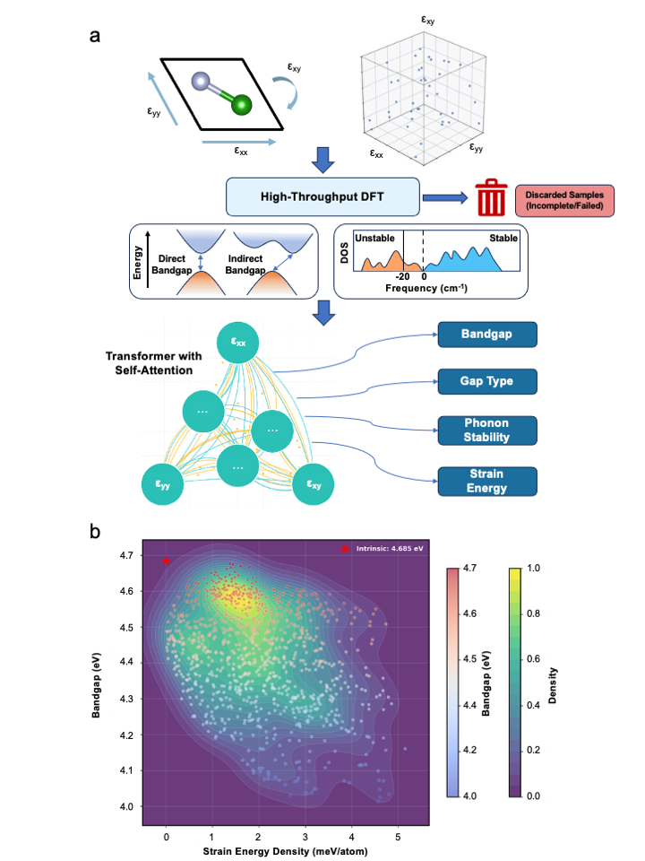
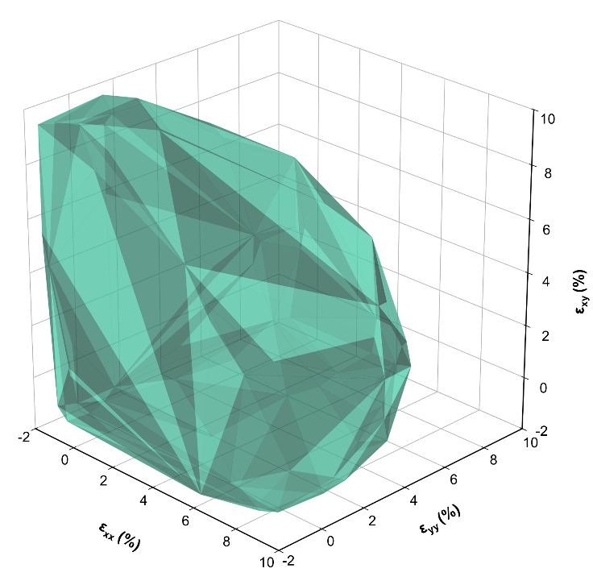
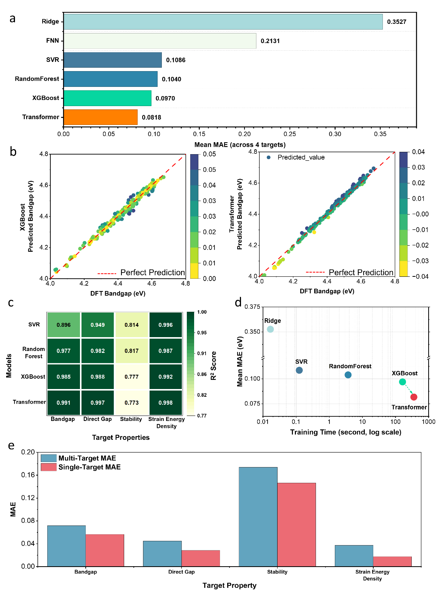
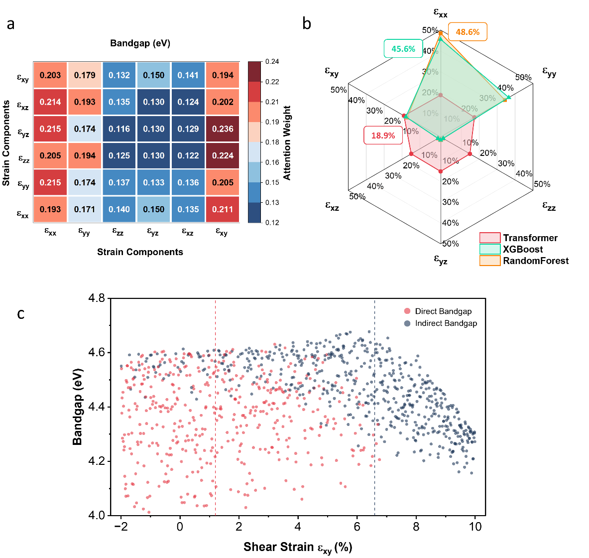
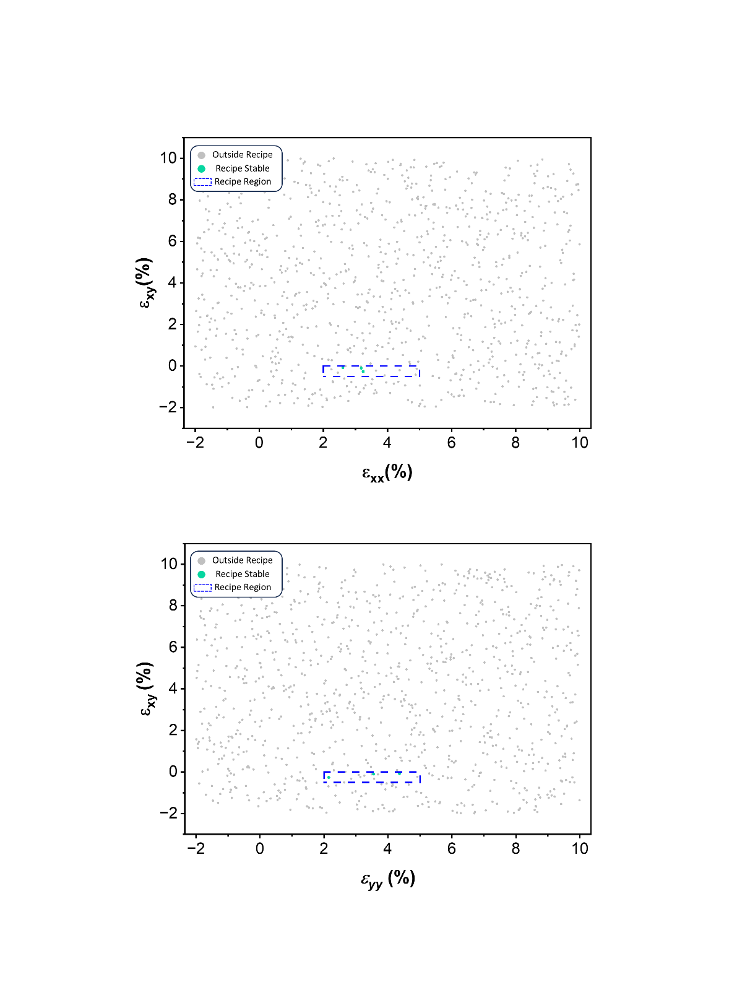

# 2次元材料のひずみ空間をTransformerで縮約する

**執筆日**: 2026-03-23
**トピック**: 2次元材料のひずみエンジニアリングにおける解釈可能なTransformerサロゲートモデル
**注目論文**: 2603.20141
**参照した関連論文数**: 7本

---

## 1. 導入：なぜ今この話題か

グラフェンの発見（2004年）以来、原子一層の厚みしか持たない「2次元(2D)材料」は、次世代エレクトロニクスや光電子デバイスの有力候補として急速に注目を集めてきた。六方晶窒化ホウ素(h-BN)、二硫化モリブデン(MoS₂)をはじめとする2D材料群は、バルク結晶では見られない独特の電子・光学・力学特性を示す。その中でも「ひずみエンジニアリング（strain engineering）」は、材料組成を変えることなく、機械的変形だけで電子バンド構造を制御できる強力な手法として確立されている。

ところが、2D材料が被るひずみは本来3成分（面内二軸方向のεxx、εyy、および面内せん断のεxy）を持つ多次元空間であり、これを網羅的に第一原理計算（DFT）で探索しようとすると膨大な計算コストがかかる。仮に各成分を10ステップでサンプリングするだけでも1000点以上のDFT計算が必要となり、さらにフォノン安定性まで評価するとなると事実上の壁となる。

この問題を打ち破ることができるのが機械学習（ML）サロゲートモデルだ。しかし従来のMLアプローチには「精度か解釈可能性かのトレードオフ」という根本的な課題があった。精度の高いCNN（畳み込みニューラルネットワーク）はブラックボックス的で何を学んでいるか分からず、解釈可能なランダムフォレストは特徴間の相互作用を捉えにくい。

2026年3月に発表された注目論文（Ma et al., arXiv:2603.20141）は、自己注意機構（self-attention）を核とするTransformerアーキテクチャを2D材料のひずみ工学に初めて導入し、DFTレベルの高精度（バンドギャップ予測MAE = 0.0103 eV）を達成しながら、なぜその予測が成り立つかという物理的な解釈まで自動的に与えることに成功した。さらに注目すべきは、attentionマップの解析から「せん断ひずみ（εxy）がバンドギャップとフォノン安定性の両方を支配する物理的ハブである」という新しい知見が引き出されたことだ。

---

## 2. 解決すべき問い

### ひずみエンジニアリングとは何か

結晶格子に外力を加えると原子間距離が変化し、電子の感じるポテンシャルエネルギーランドスケープが変わる。これがひずみ誘起のバンド構造変調の本質だ。2D材料では面外の束縛がないため面内ひずみへの応答が特に大きく、数パーセントのひずみでバンドギャップを数百meV変化させることができる。また直接ギャップ型と間接ギャップ型の間の転移（direct-indirect transition）もひずみで制御可能で、発光デバイスの設計に直結する。

### DFTサロゲートモデルとは何か

DFT（密度汎関数理論）は現代の第一原理材料計算の標準手法で、量子力学に基づいて電子状態を自己無撞着に解く。信頼できる結果が得られる一方で、1点の計算に数時間から数日を要することもある。サロゲートモデルとは、「DFTの入力（ここではひずみテンソル）→DFTの出力（バンドギャップ等）」という写像をMLで近似し、DFTの1/1000以下の計算コストで同等の予測精度を実現するモデルのことだ。

### TransformerとAttentionの基礎

Transformerは2017年に自然言語処理の分野で提案されたアーキテクチャで、「自己注意機構（self-attention）」と呼ばれる仕組みを中核に持つ。入力シーケンスの各要素が他の全要素に対してどれだけ「注意を向けるべきか」を重み（attention weight）として学習し、それによって要素間の相互作用を明示的に表現する。本論文では、ひずみテンソルの6成分（εxx、εyy、εxy、さらにVoigt記法に基づく計6成分）を「トークン列」として入力し、attention機構がどのひずみ成分ペアが強く相互作用するかを自動的に学習する仕組みとなっている。

*図1. 注目論文（2603.20141）より（CC0）。(a) ラテンハイパーキューブサンプリング→DFT→フォノン計算→ML学習という自動化ワークフロー。(b) ひずみエネルギー密度とバンドギャップの関係を示す密度プロット。ゼロひずみ点（赤い星印）のバンドギャップは4.685 eVで、大半のひずみ構造はそこから減少する方向に分布している。*

---

## 3. 注目論文は何を新しく示したのか

### 多次元ひずみ空間の系統的サンプリング

Ma et al. はまず「ラテンハイパーキューブサンプリング（Latin Hypercube Sampling, LHS）」を用いて、εxx、εyy、εxy を -2% から +10% の範囲で均等に1000点サンプリングした。LHSは各次元の投影が均一になるよう設計された確率的サンプリング手法で、通常のランダムサンプリングより少ない点数で空間を効率良くカバーできる。各サンプル点に対してVASP（DFTコード）とPhonopy（フォノン計算コード）を完全自動化したパイプラインで実行し、最終的に992点で収束したデータセットを構築した。

対象材料は**六方晶窒化ホウ素（h-BN）**モノレイヤーである。h-BNは約4.7 eVの広いバンドギャップと高い熱的安定性、優れた力学的特性を持ち、2D材料のプロトタイプとして広く研究されている。DFTで計算されたゼロひずみでのバンドギャップは4.685 eVであった。

### フォノン安定性の地形

*図2. 注目論文（2603.20141）より（CC0）。ひずみ空間(εxx, εyy, εxy)における安定・不安定領域の分布を三次元凸包で可視化。安定な554点を囲む半透明のポリヘドロン（162枚の三角形面からなる）が示される。安定領域はゼロひずみ付近に集中し、ひずみが大きくなるほど不安定になりやすい。*

992点のデータのうち、フォノン安定な構造は554点（55.8%）、不安定は438点（44.2%）だった。図2の三次元凸包可視化は、安定領域がひずみ原点付近に偏在しており、ひずみ空間のかなりの部分がフォノン不安定（格子崩壊しやすい）であることを示す。これは「ひずみ空間を闇雲に探索すると約半数で不安定構造にぶつかる」ことを意味し、実験的・計算的な探索をどこへ集中すべきかの重要な指針となる。

### Transformerの予測精度

*図3. 注目論文（2603.20141）より（CC0）。(a) 6モデル（Transformer、XGBoost、Random Forest、SVR、FNN、XGBoost-ST）のMAE比較。(b) XGBoostとTransformerのバンドギャップ予測値 vs DFT値の散布図。(c) 4つの物性ターゲットに対するR²のヒートマップ。(d) 平均MAEと学習時間のトレードオフ。TransformerはPareto最前線からは外れるが最高精度を実現。(e) マルチターゲットモデルとシングルターゲットモデルの比較。*

モデル性能の比較を見ると、Transformerは4ターゲット同時予測でMAE = 0.0818 eVと最も高い全体精度を達成した。バンドギャップ単体では**MAE = 0.0103 eV、RMSE = 0.0136 eV、R² = 0.991**という驚異的な精度を示した。PBEレベルDFT自体の不確実性が典型的に10〜20 meVであることを考えると、このML予測はDFTと同等の精度を持つと言える。

XGBoostも競争力のある精度（バンドギャップMAE = 0.0135 eV、R² = 0.985）を示したが、Transformerは複数物性の同時予測においてより安定した高性能を発揮した。一方、FNN（全結合ニューラルネットワーク）は大幅に劣る性能（MAE = 0.2131 eV）を示し、アーキテクチャの選択が決定的に重要であることを示す。

### Attentionが教えてくれた物理

*図4. 注目論文（2603.20141）より（CC0）。(a) Transformerの自己注意ヒートマップ。明るいセルほど2成分間の強い結合を表す。εxy（せん断ひずみ）が最大の注意を受けていることに注目。(b) 古典的ML（XGBoostとRandom Forest）の特徴量重要度とTransformer attentionの比較。古典MLはεxxを主要因とランク付けするが、Transformerはεxyを相互作用ハブとして特定。(c) バンドギャップのセン断ひずみ依存性。直接ギャップ型（赤）は原点付近に集中し、間接ギャップ型（青）は大きなεxyで広がる。*

最も重要な発見は、Transformerの注意ヒートマップ（図4a）の解析から得られた。8ヘッドの自己注意を4エンコーダ層にわたって集計した6×6の注意重み行列を見ると、εxy（せん断ひずみ）への注意が突出して高い。具体的には、εyy→εxy（23.6%）、εxx→εxy（22.4%）、εxx→εxy（21.1%）と、他成分からεxyへの「流入」が最大となっている。

この発見の物理的意味は深い。2D六方晶格子（h-BNの結晶構造）では、面内二軸方向のひずみ（εxx、εyy）は六回対称性を維持したまま格子を拡縮させるのに対して、せん断ひずみ（εxy）は格子の対称性を破り（回転対称性の消失）、電子バンドの縮退解消や価電子帯・伝導帯の大幅な再配置を引き起こす。つまり「εxyが相互作用ハブである」という注意ヒートマップの示す構造は、格子物理に基づいた本物の物理的洞察を反映していたのだ。

また図4cは、直接ギャップ型の構造がεxy ≈ 0付近に集中し、εxyが大きくなると間接ギャップ型へ転移することを明確に示す。これは半導体光デバイスの設計においてせん断ひずみ制御が決定的に重要であることを意味する。

### 実用的なひずみレシピの特定

*図5. 注目論文（2603.20141）より（CC0）。実験的・計算的に実現可能なひずみ領域の特定。εxx、εyy ∈ [2%, 5%]、εxy ≈ 0% のウィンドウでは、97.7%の予測成功率と90.7%のフォノン安定性が保証される。この「安全ウィンドウ」は4.2〜4.6 eVの目標バンドギャップを実現する。*

Transformerとフォノン安定性データを組み合わせた網羅的スクリーニングの結果、具体的な「ひずみレシピ」として **εxx, εyy ∈ [2%, 5%]、εxy ≈ 0%** の窓が特定された。この窓内では97.7%の予測成功率と90.7%のフォノン安定性が保証され、4.2〜4.6 eVの目標バンドギャップを安定に実現できる。εxyを0付近に抑えることが本質的に重要であるという結論は、attentionの物理解釈と完全に整合する。

---

## 4. 背景と文脈：この注目論文はどこに位置づくか

### ひずみ工学MLの先駆研究

2D材料への機械学習の応用において、先駆的存在はShiら（2019年、PNAS）による「deep elastic strain engineering」の研究だ。彼らはダイヤモンド結晶のバンド構造を多次元ひずみ空間でニューラルネットワークを使って予測することに成功し、テラヘルツ電子移動度を実現するひずみ状態の予測などで大きな反響を得た。その後、Tsymbalovら（2021年、npj Computational Materials）は畳み込みニューラルネットワーク（CNN）を用いて半導体のバンド構造全体とモビリティテンソルをひずみの関数として予測することに成功したが、このCNNアプローチには「3次元ブリルアンゾーン全体のエネルギーグリッド」という高コストな入力が必要で、かつ解釈可能性が乏しかった。

注目論文の位置づけは明確だ。従来のCNN的アプローチが「広帯域入力・高コスト・解釈不能」であったのに対し、**Transformerアプローチは「ひずみテンソル6成分のみの軽量入力・DFT級精度・attention可視化による物理解釈」を同時に実現**した革新的な一歩だ。

### 2D材料のML予測：他の物性へ

同様の課題は他の物性にも存在する。Javed and Ali（arXiv:2501.01092）は、2D材料データベース（C2DB）に収録された数百種類の2D材料について、励起子束縛エネルギー（EBE）の機械学習予測を試みた研究だ。GW近似やBethe-Salpeter方程式といった高精度な多体摂動理論は計算コストが非常に高く、DFT+MLサロゲートでそれを代替することの価値は大きい。

この研究では、ランダムフォレストを用いてPBEバンドギャップや構造パラメータからGW-EBEを予測し、MAE〜0.20 eVの精度を達成した（R² = 0.98）。バンドギャップ予測のMAE = 0.0103 eVを達成した注目論文と比べると精度は劣るが、これは予測対象の物理的複雑さの違い（励起子は電子-正孔相関という多体効果を含む）を反映している。

より広い観点では、Ko et al.（arXiv:2503.03837）が開発した**MatGL（Materials Graph Library）**はグラフニューラルネットワーク（GNN）を材料科学に応用するオープンソースフレームワークを提供する（CC BY 4.0）。M3GNet、MEGNet、CHGNet、TensorNet、SO3Netなどの最新アーキテクチャの実装と、事前学習済みの汎用原子間ポテンシャル（FMM）を含んでおり、材料のML研究者が自分のデータセットでファインチューニングするための共通基盤として位置づけられている。注目論文が「ひずみテンソル→物性」というシンプルな写像の精緻化に焦点を当てているのに対し、MatGLはより汎用的な「原子構造→物性」のパイプラインを提供する、という補完的な関係にある。

---

## 5. メカニズム・解釈・比較

### Attentionが物理を「見る」メカニズム

Transformerの自己注意機構が物理的洞察を提供できる理由は、その数学的構造にある。注意重み行列は入力特徴の全ペア間の類似度（query-key内積）をソフトマックスで正規化したものであり、特定の出力を予測する際にどの入力ペアの相互作用が重要かを直接的に量化する。これは従来の「特徴量重要度（feature importance）」とは質的に異なる。特徴量重要度は各特徴の「単独の寄与」を評価するのに対して、Attentionは「特徴間の協調効果」を捉える。

Slautin et al.（arXiv:2508.15493）は強誘電体PbTiO₃薄膜という別の材料系で、同様のAttention解釈可能性の威力を示した。彼らはSHAP解析と注意重みを比較し、Transformer attentionが構造内の「意味のある局所的特徴」を自動的に発見する能力において従来の解釈手法に勝ることを実証した。材料系は異なるが、「注意機構が材料構造の中の重要な物理的要素を選択的に強調する」という普遍的なメカニズムが確認されており、注目論文の知見を強く支持している。

### せん断ひずみが「カギ」である理由

h-BNのような六方晶格子では、ブラベ格子の対称性が電子バンド構造を決定的に支配する。面内等方的な二軸ひずみ（εxx = εyy、εxy = 0）は六回対称性を保つため、K点とK'点の等価性（時間反転対称性＋空間反転対称性の組み合わせ）が維持される。しかしせん断ひずみ（εxy ≠ 0）が加わると、この対称性が破れ、縮退していたバンドが分裂し、直接-間接ギャップ転移のような定性的な変化が生じやすくなる。

Attention機構がεxyを「相互作用ハブ」として自動同定したという事実は、MLモデルが構造物理の本質を何千もの計算例から帰納的に「発見」したことを意味する。この対称性論的な解釈は事後的に確認されたものだが、ML→物理解釈という逆方向の知識抽出の成功例として際立っている。

### 古典MLとTransformerの相互補完性

注目論文はXGBoostとTransformerを比較するだけでなく、両者が「相補的な視点」を提供することを明確にした。XGBoostはεxxを最大寄与特徴量（45.6%）とランク付けするが、これは「単変量的に最もバンドギャップへの影響が大きい」という情報に対応する。一方Transformerはεxyとεxx・εyyとの相互作用に最大の注意を向け、「格子破壊を引き起こすトリガーとしてのεxy」という「多変量的な協調効果」を捉える。どちらかが間違っているのではなく、見ている「特徴量の役割」が異なるのだ。

これはXGBoost的な線形・独立的思考とAttention的な非線形・相互作用思考の本質的な違いを象徴しており、実用的には「まずXGBoostで主要特徴量を絞り込み、Transformerで相互作用を解析する」という2段階ワークフローが最も効率的な戦略となりうる。

---

## 6. 材料・手法・応用への広がり

### h-BNから先へ：2D材料全般への展開

h-BNはひずみ工学研究のプロトタイプとして有用だが、実際の応用では遷移金属ダイカルコゲナイド（TMD）群が中心的な役割を担う。MoS₂（~1.8 eVギャップ）、WS₂（~2.0 eV）、WSe₂などは直接ギャップを持ち、フォトデテクター・LED・太陽電池への応用が活発に研究されている。

Kleiner and Refaely-Abramson（arXiv:2507.09363）は、WS₂モノレイヤーにおいてひずみが励起子の輸送に与える影響を第一原理計算で解析した。不均一なひずみ分布が作るポテンシャルランドスケープ上で、励起子が「超弾道的伝播（super-ballistic propagation）」を示すという驚くべき結果が得られた。これは注目論文のバンドギャップ予測という静的な観点からさらに踏み込み、励起子のダイナミクス（動的側面）にひずみが与える影響を示すもので、将来的には「ひずみ分布を最適化することで励起子の輸送を制御するデバイス設計」という新しい方向性を示唆する。

同様に、KocabasらのMoS₂とMoSe₂の熱伝導率研究（arXiv:2509.13798）は、機械学習原子間ポテンシャルを用いた高精度フォノン散乱解析を実施し、4フォノン過程の寄与が一部で主張されるほど大きくないことを実証した。熱管理とひずみ制御は実際のデバイスにおいて密接に絡み合う問題であり、熱的安定性と電子特性の同時最適化という課題において、注目論文のマルチターゲット予測フレームワークは自然な延長線上にある。

### データ駆動型の高スループット材料探索

高スループット探索の文脈では、Leら（arXiv:2601.09123）が機械学習原子間ポテンシャル（MLIP）と確率的自己無撞着調和近似（SSCHA）を組み合わせ、4669種類の無機化合物について温度依存フォノンを一括計算した研究が参考になる。この研究はM3GNetポテンシャルをフォノン予測用にファインチューニングし、精度を4倍向上させることに成功した。1000点規模のDFT計算から始まる注目論文のアプローチと、数千種類の材料をカバーするこの研究の間には、データ規模と材料多様性において大きなギャップがあり、両者を橋渡しする「ファウンデーションモデル+ファインチューニング」というアプローチの重要性が浮かび上がる。

Boland et al.（arXiv:2502.04603）のJanus 2D-バルクヘテロ構造研究も示唆に富む。約1000の異なるヘテロ接合構造をDFT + MLで体系的に解析し、接合エネルギーとz軸方向分離距離をそれぞれMAE = 0.05 eV/atom、0.14 Åの精度で予測した。「バルク金属の特性がヘテロ構造の熱力学的安定性を支配する」という発見は、2D-3D複合材料設計における材料選択の指針として重要だ。注目論文が「ひずみ→バンドギャップ」の制御を扱うのに対して、この研究は「接合→安定性」を扱っており、どちらもデバイス設計の実現可能性評価において不可欠な情報を与える。

### GNNフレームワークとの統合

Ko et al.のMatGL（arXiv:2503.03837）が示すように、材料MLの研究基盤はグラフニューラルネットワークを中心に急速に整備されつつある。GNNは原子構造をグラフ（原子＝ノード、化学結合＝エッジ）として自然に表現し、並進・回転・反転対称性（SE(3)等変性）を構造的に保証できる。注目論文のTransformerはひずみテンソルという少数次元の入力に特化しているが、これをGNNベースの汎用ポテンシャルと組み合わせることで、「構造最適化＋ひずみ応答の予測」を統合した次世代サロゲートモデルの構築が展望できる。

---

## 7. 基礎から理解する

### ひずみテンソルとVoigt記法

弾性ひずみは一般的に3×3のテンソル量で表される。2次元材料では面外成分が小さいため、面内成分（εxx、εyy、εxy）が支配的となる。Voigt記法ではこれを1次元ベクトルで表現し（εxx, εyy, εzz, εyz, εxz, εxy）、注目論文では6次元入力ベクトルとしてTransformerに渡している。εxxは x方向の「引き伸ばし/圧縮」、εyyはy方向の同様の変形、εxyは「平行四辺形状のゆがみ」（せん断）を表す。

### バンドギャップ：直接型と間接型

半導体のバンドギャップには2種類ある。直接ギャップ（direct gap）とは、価電子帯の最高点（VBM）と伝導帯の最低点（CBM）が同じk点に位置するもので、光を直接吸収・放出できる（LEDや光検出器に向く）。間接ギャップ（indirect gap）は、VBMとCBMが異なるk点にあり、光吸収・放出時にフォノンの助けが必要となる（効率が低い）。h-BNは通常間接ギャップだが、注目論文の結果はεxy≈0の適度なひずみ下で直接ギャップ的な振る舞いに近い領域が存在することを示している。

### フォノン安定性と虚数モード

結晶構造の安定性はフォノン（格子振動の量子）分散関係で判定できる。安定な構造ではフォノン分散の全ブランチが正の振動数（実数）を持つ。逆に「虚数モード（imaginary mode）」が現れた場合、その構造は力学的に不安定で自発的に別の構造へ変形することを意味する。注目論文では、各ひずみ状態についてフォノン計算を行い「虚数モードの有無」を安定性の判定基準として用いた。フォノン安定性マップの55.8%が安定であるという結果は、ひずみ空間の約半分が実験的に実現不可能な「禁止領域」であることを意味し、安全なひずみウィンドウを同定することの重要性を強調する。

### ラテンハイパーキューブサンプリング

多次元空間の効率的なサンプリング手法。各次元をN等分した区間から、各区間につき1点だけ選ぶ（マキシミン規準で点間距離を最大化する改良版を使用）。これにより、ランダムサンプリングで生じやすい「偏り」（ある領域に点が集中し、他の領域がスカスカになる現象）を避けつつ、少ない点数で空間を均一にカバーできる。注目論文の1000点サンプリングはこの手法のおかげで3次元ひずみ空間を効率良く被覆できた。

---

## 8. 重要キーワード10個の解説

1. **深部弾性ひずみ工学（Deep Elastic Strain Engineering）**: バルク材料や2D材料に意図的に大きな弾性ひずみ（通常1〜10%以上）を加えることで、バンドギャップ・移動度・光学的性質などを大幅に変調させる材料設計手法。従来は「ひずみ = 欠陥の原因」として避けられてきたが、弾性域内なら劇的な物性変調が可能とわかってきた。

2. **DFTサロゲートモデル**: 密度汎関数理論（DFT）による第一原理計算の入出力関係をMLで近似し、DFT計算の数千〜数万倍の速度で同等の物性予測を実現する計算モデル。マテリアルズインフォマティクスの中核技術。

3. **自己注意機構（Self-Attention）**: Transformerの根幹となる演算。入力シーケンスの各要素が他の全要素に対して「どれだけ関連するか」を動的に重み付けする仕組み。重みは「query（何を探すか）」と「key（何があるか）」の内積から計算される。

4. **マルチターゲット学習（Multi-Target Learning）**: 一つのMLモデルで複数の物性（バンドギャップ・フォノン安定性・ひずみエネルギー密度など）を同時に予測する学習戦略。関連する物性間の相関を活用して汎化性能を向上させられる一方、負の転移（negative transfer）と呼ばれる性能低下も起こりうる。

5. **フォノン安定性（Phonon Stability）**: 結晶構造の力学的安定性を示す指標。フォノン分散に虚数振動数が現れない状態が「安定」。ひずみが大きすぎると虚数モードが出現し、材料が構造相転移を起こす。2D材料のデバイス設計では「ひずみ許容限界」を知るために不可欠。

6. **グラフニューラルネットワーク（GNN）**: 原子構造をグラフ（原子=ノード、結合=エッジ）として表現し、近傍原子との情報伝播により結晶の物性を予測するニューラルネットワーク。並進・回転対称性を構造的に組み込める点が特徴。M3GNet、CHGNetなど多くの実装が公開されている。

7. **励起子束縛エネルギー（Exciton Binding Energy, EBE）**: 電子と正孔がクーロン引力で束縛して形成する励起子を解離させるのに必要なエネルギー。2D材料では誘電スクリーニングの低下によりバルクより数十〜数百倍大きく（〜数百meV）、光デバイスの動作に本質的な影響を与える。GW+BSE計算で精度よく求められるが計算コストが高い。

8. **Voigt記法**: 弾性テンソル（または応力テンソル・ひずみテンソル）を対称性を使って6成分ベクトルで表現する記法。(εxx, εyy, εzz, εyz, εxz, εxy)の順に並べる。行列演算を低次元化して扱いやすくする際に標準的に使用される。

9. **ラテンハイパーキューブサンプリング（LHS）**: 多次元パラメータ空間を効率的かつ均一にサンプリングする手法。各次元を等間隔N区間に分割し、各区間から1点ずつ選ぶことで投影の均一性を保証する。コンピュータ実験計画法の標準技術として、機械学習の学習データ生成にも広く用いられる。

10. **直接-間接ギャップ転移（Direct-Indirect Gap Transition）**: 半導体のバンドギャップが直接遷移型から間接遷移型へ（またはその逆）切り替わる現象。ひずみや電場、積層数の変化などで誘起されうる。この転移に伴い発光効率が劇的に変化するため、光デバイス設計における重要な物性変化点となる。

---

## 9. まとめと今後の論点

本稿では、arXiv:2603.20141（Ma et al.）を中心に、2次元材料のひずみ空間をTransformerサロゲートモデルで探索するアプローチを解説した。この研究の最も重要な貢献は次の三点に集約できる。

第一に、**DFTレベルの予測精度（MAE = 0.0103 eV）と解釈可能性を同時に達成**したこと。従来のサロゲートモデルは精度と解釈可能性がトレードオフにあったが、Transformerの注意機構がこの制約を克服した。

第二に、**注意ヒートマップから「せん断ひずみが相互作用ハブである」という物理的洞察が自動的に抽出された**こと。これはMLが単なる予測ツールを超え、物理的仮説生成ツールとして機能しうることを実証する重要な事例だ。

第三に、**フォノン安定性を含むマルチターゲット予測と、実験的に実現可能な「安全なひずみウィンドウ」の特定**が達成されたこと。これはひずみ工学の実験設計を直接的に支援するものだ。

### 今後の論点と残された課題

**材料の汎化性**: 本研究はh-BN一材料に特化している。MoS₂やWSe₂など異なる2D材料への転移学習（transfer learning）や、ファウンデーションモデルを用いた汎用サロゲートの構築が次の課題だ。

**フォノン動力学への拡張**: 現状はフォノン安定性の「有無」のみを予測しているが、フォノン分散曲線全体を予測するより詳細なモデルへの拡張が望まれる。これにより熱伝導率や格子力学的応答の予測も可能になる。

**実験的バリデーション**: サロゲートモデルの予測を実際の実験（ナノインデンテーション、圧電デバイス、転移金属ダイカルコゲナイドの伸張実験など）で検証することが不可欠だ。KleinerらのWS₂での励起子超弾道的伝播のような予測外の現象が、実験で追随確認されることを期待する。

**多軸ひずみの実験的制御**: 通常の引張・圧縮実験では単軸ひずみしか実現しにくいが、注目論文の「安全ウィンドウ」を実現するためには面内二軸ひずみの精密制御が必要だ。MEMSデバイスや圧電基板上への転写などの実験手法の開発と連携することが重要になる。

**GNNとの統合**: Ko et al.のMatGLのようなGNNフレームワークとTransformerサロゲートを統合することで、「任意の原子構造→ひずみ応答→電子物性」を予測する汎用パイプラインの構築が現実的な射程に入ってきた。

最終的に、この研究が示すメッセージは「機械学習は予測ツールであるだけでなく、物理の探偵でもある」というものだ。Attentionが教えてくれた「εxyは相互作用ハブ」というシンプルな知見が、ひずみ空間の安全操業窓の設計に直結したように、今後のMLベース材料研究では「なぜその予測が正しいか」という解釈可能性こそが、新しい物理的法則の発見につながる最重要な情報源になると考えられる。

---

## 10. 参考にした論文一覧

| 役割 | arXiv ID | 著者 | タイトル | ライセンス |
|------|----------|------|----------|------------|
| 注目論文 | 2603.20141 | Ma, Zheng, Zhang, Chen, Wang | Transformer-based prediction of two-dimensional material electronic properties under elastic strain engineering | CC0 |
| 関連 | 2508.15493 | Slautin, Pratiush, Liu, Funakubo, Shvartsman, Lupascu, Kalinin | Attention-Based Explainability for Structure-Property Relationships | CC BY 4.0 |
| 関連 | 2501.01092 | Javed, Ali | Machine Learning-Driven Insights into Excitonic Effects in 2D Materials | CC BY 4.0 |
| 関連 | 2502.04603 | Boland, Gorelik, Singh | Fundamental Factors Governing Stabilization of Janus 2D-Bulk Heterostructures with Machine Learning | CC BY 4.0 |
| 関連 | 2503.03837 | Ko, Deng, Nassar, Barroso-Luque, Liu, Qi, Liu, Ceder, Miret, Ong | Materials Graph Library (MatGL), an open-source graph deep learning library for materials science and chemistry | CC BY 4.0 |
| 関連 | 2507.09363 | Kleiner, Refaely-Abramson | Strain-induced exciton mobility in layered WS₂ from first principles | arXiv nonexclusive |
| 関連 | 2509.13798 | Kocabas, Keceli, Gurel, Milosevic, Sevik | Thermal Conductivity Limits of MoS₂ and MoSe₂: Revisiting High-Order Anharmonic Lattice Dynamics with Machine Learning Potentials | arXiv nonexclusive |
| 関連 | 2601.09123 | Lee, Li, He, Xia | Data-Driven Exploration and Insights into Temperature-Dependent Phonons in Inorganic Materials | arXiv nonexclusive |
