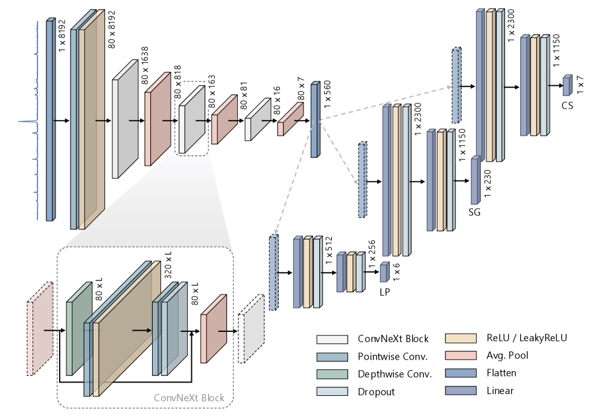
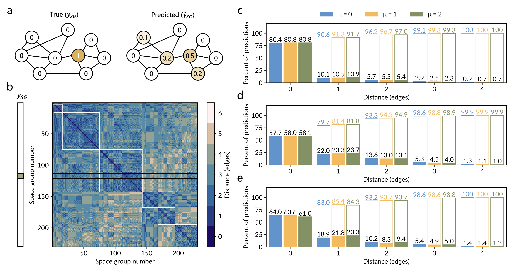
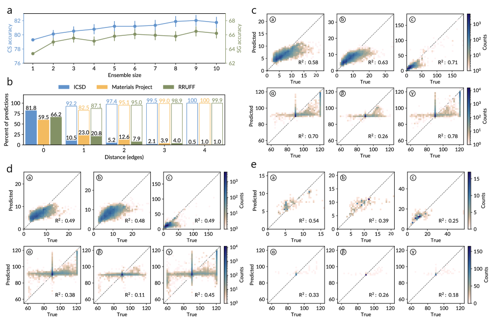
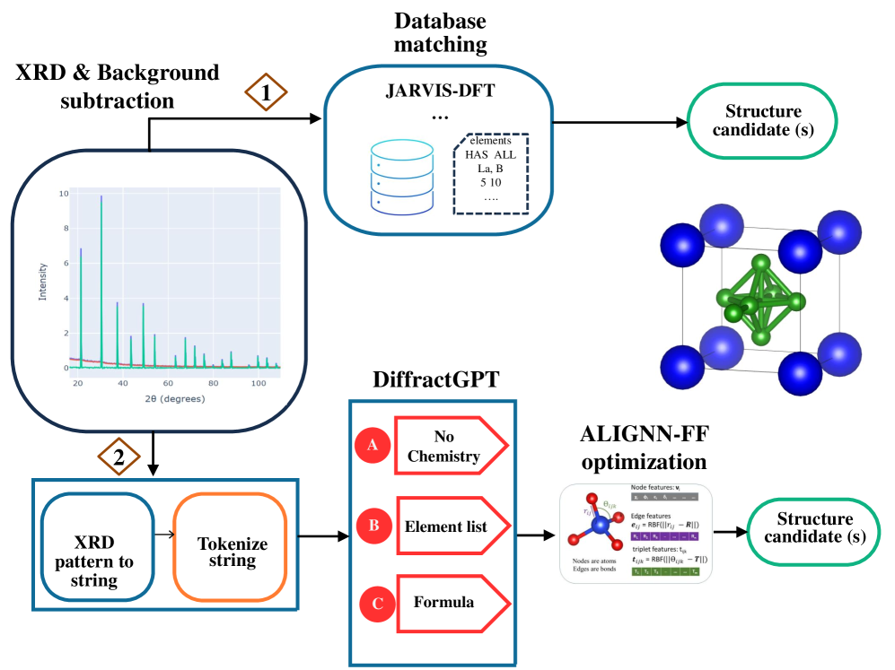
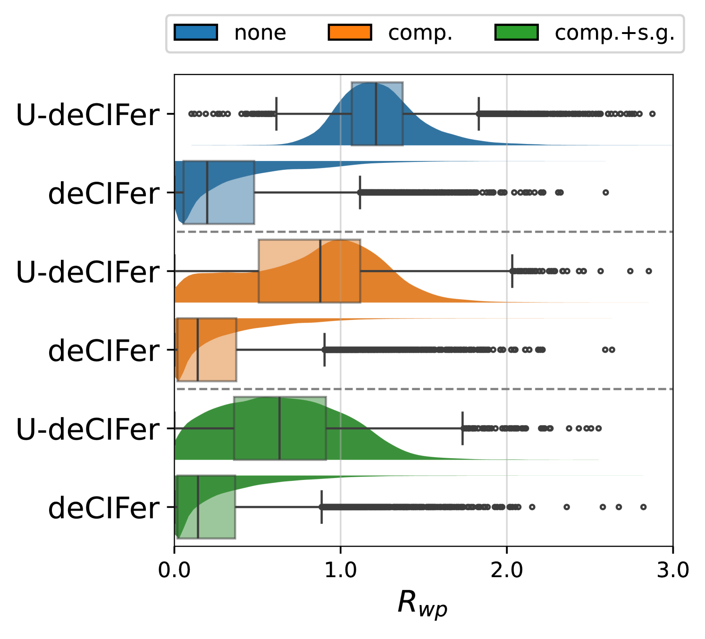
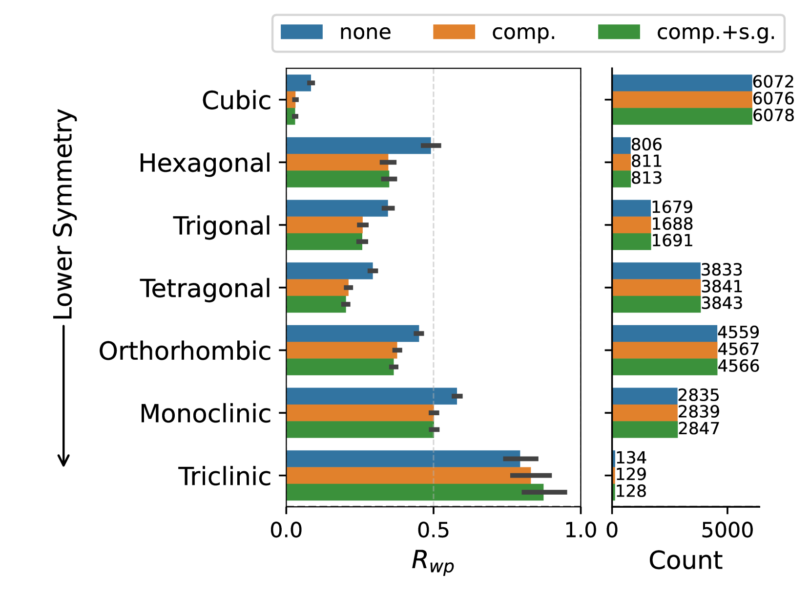
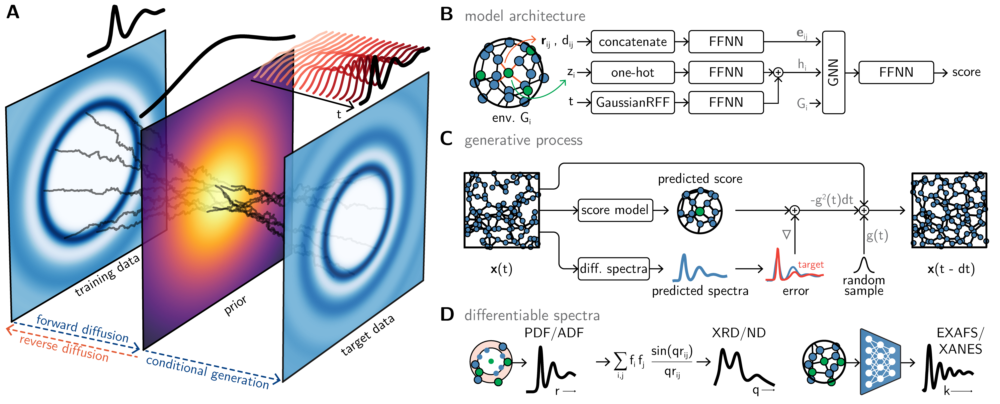
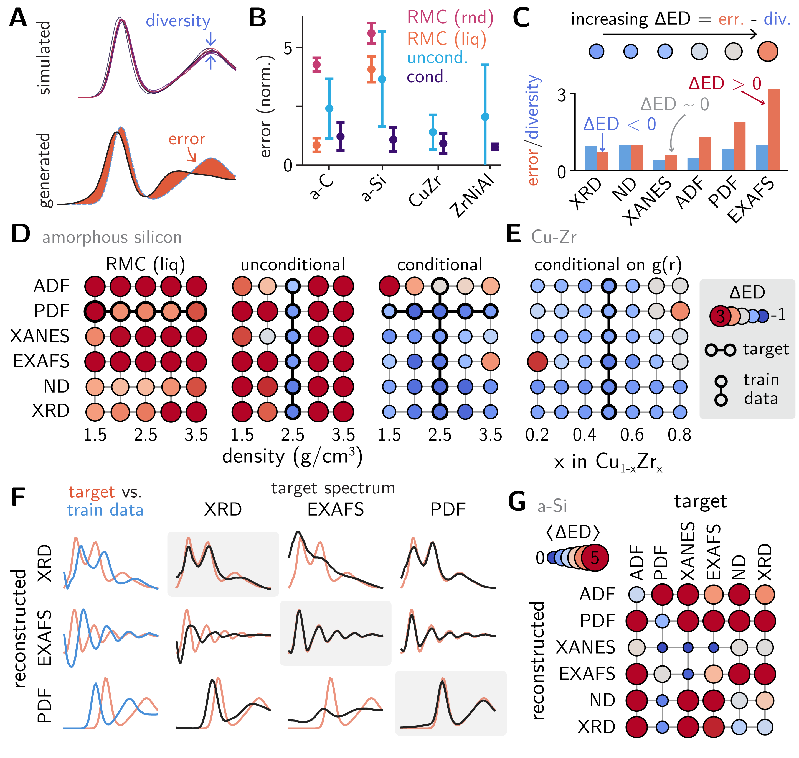

# 回折パターンからAIが構造を読み解く時代：粉末X線回折の自動結晶学解析と生成モデルが拓く材料探索の新展開

- **執筆日**: 2026-03-25
- **トピック**: 粉末X線回折（PXRD）の深層学習による自動結晶学解析
- **注目論文**: arXiv:2603.23367（AlphaDiffract）
- **参照した関連論文数**: 6本
- **primary broad area**: 放射光・量子ビーム
- **secondary broad area**: 計算材料科学

---

## 1. 導入：なぜ今この話題か

新しい材料を合成したとき、最初に行う問いはシンプルだ。「この試料は何という結晶構造をしているのか？」この問いに答えるための最も汎用的な手法が、**粉末X線回折（Powder X-ray Diffraction, PXRD）**である。試料を粉末状にしてX線を照射するだけで、どの結晶系に属するか、格子定数はいくらか、空間群はどれかを原理的に知ることができる。特別な前処理も不要で、測定自体は数分から数十分で終わる。

ところが、今この手法をめぐって深刻なボトルネックが生じている。高スループット合成、マテリアルズ・インフォマティクスに基づく材料探索、電池・触媒・半導体材料の大規模スクリーニング——これらの現代的な材料研究では、一日に何十から何百もの試料を合成することが珍しくない。その一方で、PXRDパターンを人が解析して結晶構造情報を取り出す作業は、数十年来ほとんど変わっていない。まずピーク位置を探し、インデックス付けのアルゴリズム（DICVOLやTREORなど）でd間隔を計算し、可能な空間群を絞り込み、最終的にリートベルト解析で構造精密化を行う。この一連の作業は熟練した結晶学者でさえ一試料あたり数時間を要することもあり、自動化が強く求められていた。

こうした背景のもと、2026年3月、Andrejevicらはさかのぼって3年間の「深層学習によるPXRD自動解析」の流れを一歩前進させる論文 **AlphaDiffract**（arXiv:2603.23367）を発表した。31百万以上のシミュレーションパターンで学習した1つの統一モデルが、PXRDパターンを入力とし、**結晶系・空間群・格子定数のすべてを単一推論で出力する**というものだ。この論文は、従来のアプローチが抱えていた「分類と回帰の分離」「一部のBravais格子しか対応しない」「模擬データから実験データへの汎化」という三つの壁を同時に越えようとした。

本稿では、AlphaDiffractを起点に、PXRD自動解析の現在地と、これに関連する深層学習・生成モデルの研究潮流を立体的に解説する。なぜこの問題が難しいのか、どのような手法が試みられてきたのか、そして「単なる分類」から「完全な構造決定」へとAIが進化する際に何が鍵となるのかを順に見ていこう。

---

## 2. 解決すべき問い

### PXRDパターンには何が書き込まれているのか

PXRDパターンは、結晶格子に由来するブラッグ反射の集合体だ。回折角 $2\theta$ にピークが現れる条件はブラッグの法則

$$2d_{hkl} \sin\theta = n\lambda$$

で与えられる。ここで $d_{hkl}$ は面指数 $(hkl)$ で指定される結晶面間隔、$\lambda$ はX線の波長、$n$ は整数の回折次数である。ピーク位置から格子定数（格子ベクトルの長さ $a, b, c$ と角度 $\alpha, \beta, \gamma$）を求めることができ、ピークの有無と強度から空間群の対称性を推測できる。

問題は、測定された実験データには必ず「ノイズ・ピーク幅・バックグラウンド」が乗ることだ。結晶子サイズが小さければピークはブロードになり（シェラー方程式 $\beta = K\lambda / (L\cos\theta)$）、格子ひずみがあればさらに複雑な形状を示す。複数の相が混在すれば多重のピーク群が重なり合う。アルゴリズム的な手法はこれらの外乱に対して脆弱であり、実験データでは失敗することも多い。

### なぜ空間群の自動決定が難しいのか

地球上のすべての結晶構造は230個の空間群のいずれかに属する。しかし230は少なくない。空間群には階層的な対称性関係（最大部分群関係）があり、たとえば立方晶系の *Fm$\overline{3}$m*（No. 225）はその部分群である *R$\overline{3}$m*（No. 166）や *P4/mmm*（No. 123）と非常によく似たPXRDパターンを示すことがある。また、実験的に多い空間群（*P2₁/c*、*Pbca*、*P$\overline{1}$など）が訓練データの大半を占め、まれな空間群の学習が困難になるというクラスインバランスの問題もある。

さらに根本的な困難として、**同形回折（homometric structures）**の問題がある。異なる原子配列が全く同一のPXRDパターンを生成することがあり得る（主に強度情報の位相問題）。これは原理的な限界であり、PXRD単独では解決できない。

### 模擬データから実験データへの乖離：sim-to-real gap

深層学習モデルを訓練するには大量のラベル付きデータが必要だが、実験PXRDデータは収集コストが高く、バイアスもある（ICSDデータベースに登録された構造は特定の元素系や対称性に偏っている）。そのため、モデルを結晶構造データベースから生成した**シミュレーションパターン**で訓練し、実験データに汎化させる戦略が基本となる。

しかしシミュレーションパターンと実験パターンの間には「sim-to-real gap」がある。実験では、ピーク幅はKα₂線との重畳で非対称になり、バックグラウンドは装置・試料台・散漫散乱で変動し、優先配向効果がパターン全体の強度比を歪める。この乖離を埋めるためのデータ拡張戦略が、最近の研究の中心的テーマの一つとなっている。

---

## 3. 注目論文は何を新しく示したのか

### AlphaDiffractの統一アーキテクチャ

Andrejevicら（arXiv:2603.23367）が提案したAlphaDiffractの核心は、「分類と回帰を1つのモデルに統合する」という設計思想にある（図1）。

*図1: AlphaDiffractのアーキテクチャ。1D ConvNeXtバックボーンが8192点のPXRDパターンを処理し、3つの専用予測ヘッドが結晶系（7クラス）、空間群（230クラス）、格子定数（6値：$a,b,c,\alpha,\beta,\gamma$）を同時予測する。（Andrejevic et al., arXiv:2603.23367, CC BY-NC-SA 4.0）*

バックボーンには **1D ConvNeXt** を採用した。ConvNeXtはトランスフォーマーの設計原則（深みのある畳み込み、転置ボトルネック、大きなカーネル）をCNNに取り込んだ現代的なアーキテクチャで、8192点の入力パターンを段階的にダウンサンプリングして560次元の特徴ベクトルへと圧縮する。このベクトルを3つの独立したMLPヘッドに渡すことで、結晶系の7クラス分類、空間群の230クラス分類、および6個の格子定数の回帰を並列に実行する。

訓練データは過去に類を見ない規模で、ICSD（無機結晶構造データベース）とMaterials Projectから収集した312,267種の結晶構造から合計**3100万以上のシミュレーションパターン**を生成した。sim-to-real gapへの対処として、各構造から100個のパターンを生成する際に、マイクロひずみ（peak broadening parameter $\eta_{\rm strain}$）、結晶子サイズ（シェラーパラメータ $L$）、装置関数の広がりをランダムにサンプリングしてデータ拡張した。

### 結晶学的知識を損失関数に埋め込む：GEMD損失

AlphaDiffractで特に注目すべき技術革新は、**Graph Earth Mover's Distance（GEMD）損失**だ（図2）。

*図2: GEMD損失関数。空間群間の最大部分群関係グラフを用いて、予測空間群と正解空間群の「結晶学的距離」を計算し、遠い誤りほど大きなペナルティを与える。（Andrejevic et al., arXiv:2603.23367, CC BY-NC-SA 4.0）*

通常の分類損失（交差エントロピー）は、どの空間群への誤分類も同等に扱う。しかし結晶学的には、*P2₁/c*（単斜晶）を*C2/c*（単斜晶、同じ結晶系の部分群）と間違えるのと、*Fm$\overline{3}$m*（立方晶）と間違えるのでは意味が全く異なる。

GEMDは230個の空間群を最大部分群関係でつないだグラフ上の距離として誤り量を定義し、「遠い空間群への誤分類はより大きなペナルティを受ける」という損失関数を実現する。これにより、モデルは単に最大確率の空間群を当てるだけでなく、**結晶学的に意味のある誤りのみを犯す**よう学習される。予測が正解から1エッジ以内に収まる割合（部分正解率）は85%以上を達成した。

### 性能評価：RRUFFデータセットでの実証

*図3: (a) アンサンブルモデルの結晶系・空間群精度（RRUFF実験データ）。(b) 格子定数の予測値対実測値の相関プロット（R²値を含む）。（Andrejevic et al., arXiv:2603.23367, CC BY-NC-SA 4.0）*

実験データによるベンチマークには **RRUFF鉱物データベース**（約5,000パターン）を使用した。結果は以下の通りである。

| 指標 | AlphaDiffract | 従来ベースライン |
|------|:---:|:---:|
| 結晶系精度 | **81.7%** | 27.0% |
| 空間群精度 | **66.2%** | 3.3% |
| 格子定数MAPE | ~20% | — |

結晶系・空間群については従来手法を大幅に上回ったが、格子定数の相対誤差は約20%にとどまり、Rietveld精密化の初期値として直接使用するには精度が不足する点が課題として残された。推論速度は単一GPUで700〜870パターン/秒（約1.3ms/パターン）であり、高スループット測定での実用に耐えうる。

---

## 4. 背景と文脈：この注目論文はどこに位置づくか

### 深層学習PXRD解析の系譜

深層学習をPXRDに適用する研究の最初期は2018〜2019年頃に遡る。Vecsei らは100,000以上のICSD由来パターンでCNNを訓練し、実験データで82%の結晶系精度を達成した（arXiv:1812.05625）。しかしこれは**分類のみ**であり、格子定数は予測しなかった。

Schopmans, Reiser, Friederichら（arXiv:2303.11699）は2023年に重要なブレークスルーを示した。ICSDデータベースが特定の空間群・元素系に強くバイアスしている問題に対し、「空間群対称操作を使って**完全にランダムな原子座標の合成結晶**を生成する」アプローチを提案したのだ（図4）。

*図4: 合成結晶生成アルゴリズムのフローチャート（上）と分散計算システムの概要（下）。ランダムな原子座標を空間群対称操作で変換することで、ICSDにない構造型を大量に生成できる。（Schopmans et al., arXiv:2303.11699, CC BY 4.0）*

このアプローチにより、1時間あたり数百万の独自生成パターンで訓練可能となり、ICSDのみを使った場合の56.1%に対して**79.9%**の空間群精度を達成した。AlphaDiffractはこの合成データ戦略を継承しつつ、さらに大規模（31M→）かつ多様なデータ拡張を組み合わせた。

### 「分類」から「完全な構造決定」へ

従来の深層学習手法が「どの結晶系・空間群か」を当てる分類問題に留まっていたのに対し、2024〜2025年には「原子構造そのものを出力する」生成モデルアプローチが台頭してきた。

AlphaDiffractは格子定数（6つの実数値）の回帰まで踏み込んだ点で、この世代移行の橋渡し的な位置にある。PXRDパターンから単一のモデルで「分類＋回帰」を統合的に解く最初の本格的な試みとして評価できる。

---

## 5. メカニズム・解釈・比較：多様なアプローチはどこで分かれ、どこでつながるか

### 対照学習によるアプローチ：XCCP

AlphaDiffractが「パターン → ラベル/数値」の直接マッピングを学ぶ教師あり手法であるのに対し、XCCP（arXiv:2511.04055, Ueno ら, 2025年11月）は全く異なるパラダイムを取る。

XCCPは**対照学習（contrastive learning）**に基づく。PXRDパターンと結晶構造を共通の埋め込み空間に射影し、「同じ構造から来たパターンと構造は近く、異なる構造は遠くなる」ように訓練する。テスト時には、入力パターンに最も近い埋め込みを持つ既知構造をデータベースから検索する（**構造検索**）形式となる。

特筆すべき技術的特徴は、射影ヘッドに**コルモゴロフ-アーノルドネットワーク（KAN）**を採用したことだ。KANは学習可能な一変数関数をエッジに配置した神経回路網であり、通常の重み行列による線形変換と非線形活性化の組み合わせとは異なり、より表現力の高い非線形変換を学習できる。XCCPは「長距離秩序」と「対称性情報」を捉える2つの専門家（dual-expert）設計を採用し、構造検索精度0.89、空間群同定精度0.93を達成した。特に、学習していない組成の多主成分合金（MPEA）に対してゼロショット転移性能を示した点は実用上重要である。

### 大規模言語モデルによる構造生成：DiffractGPTとdeCIFer

AIによる構造決定の最前線では、PXRDパターンを入力として**原子構造を直接生成する**生成モデルが登場している。

**DiffractGPT**（arXiv:2508.08349, Choudhary ら, 2025年8月）は、70億パラメータのMistral言語モデルをLoRAでファインチューニングし、XRDパターンから原子座標を出力するモデルだ（図5）。

*図5: DiffractGPTのワークフロー。XRDパターンを数値列にトークン化し、LLMが格子定数と原子座標を文字列として出力する。（Choudhary et al., arXiv:2508.08349, CC BY 4.0）*

XRDパターン（180点）をテキストトークンに変換し、化学式なしの場合・元素リスト付きの場合・完全な化学式付きの場合の3シナリオで評価した。化学式付きでは格子定数の平均絶対誤差が0.17 Å（化学式なしの場合0.28 Å）、生成構造のRMSD 0.07 Åを達成した。

**deCIFer**（arXiv:2502.02189, Nolen ら, 2025年2月）はより専門化された自己回帰言語モデルだ（図6, 7）。

*図6: deCIFerのアーキテクチャ概要。PXRDパターンをエンコーダで512次元ベクトルに圧縮し、デコーダonly Transformerが結晶情報ファイル（CIF）形式のテキストを自己回帰的に生成する。（Nolen et al., arXiv:2502.02189, CC BY 4.0）*

*図7: deCIFerの性能評価。上：PXRD条件付けの有無による Rwp 分布の比較。下：各結晶系での性能内訳。PXRD条件付けにより構造マッチ率が87.1%から94.5%に向上した。（Nolen et al., arXiv:2502.02189, CC BY 4.0）*

deCIFerは2,300万の結晶構造で学習したデコーダのみTransformer（8層、2,772万パラメータ）で、CIF（Crystallographic Information File）形式の結晶構造テキストを逐次生成する。PXRD条件付けにより、**94%のマッチ率**を達成した。さらに重要な点は、Rwp（残差重み付きプロファイル因子）が低い生成構造がほぼ正しい構造に対応しており、信頼性指標として使えることだ。

### 3つのアプローチの比較

| アプローチ | 代表モデル | 出力 | 強み | 限界 |
|---|---|---|---|---|
| 教師あり分類＋回帰 | AlphaDiffract | 結晶系・空間群・格子定数 | 高速（1ms）、統合出力 | 原子座標は得られない |
| 対照学習・検索 | XCCP | 最近傍構造の同定 | ゼロショット転移、高精度 | データベースにない構造は同定不可 |
| 自己回帰生成 | deCIFer, DiffractGPT | 完全なCIF（原子座標含む） | 完全な構造を出力 | 計算コスト高、希少構造に弱い |

三者はそれぞれ異なる問いに答えている。「この試料がどの鉱物か素早く知りたい」ならAlphaDiffract、「未知系に近い既知構造を高精度に探したい」ならXCCP、「完全な結晶構造をゼロから決めたい」ならdeCIFer/DiffractGPTが適するだろう。これらを**パイプライン的に組み合わせる**のが今後の方向性として有望だ——AlphaDiffractで結晶系と空間群の仮説を生成し、deCIFerで詳細構造を予測し、Rietveld精密化で検証する、という流れである。

### PXRDGenとの接続：エンコーダ＋拡散モデルの統合

**PXRDGen**（arXiv:2409.04727, 2024年）はこの方向の先駆けとして、事前学習済みXRDエンコーダと拡散/フローベースの生成モデルを組み合わせ、Rietveld精密化まで一連のパイプラインとして統合した。単一サンプルで82%、20サンプルで96%のマッチ率を達成し、軽原子の位置決定・元素識別・重なりピークの分解という従来困難だった問題にも取り組んでいる。

---

## 6. 材料・手法・応用への広がり

### アモルファス材料へ：GLASSによるスペクトル逆問題

ここまで見てきた手法は結晶性材料を前提としていた。しかし実際の材料の多くは——アモルファスシリコン、ガラス、触媒、リチウムイオン電池の電極——完全な長距離秩序を持たない。こうしたアモルファス材料の構造決定は、XRD単独では原子対分布関数（PDF）の解析に帰着するが、それでも一意的な構造は決まらない。

2026年3月に発表されたGLASS（arXiv:2603.23210）は、このアモルファス構造決定問題に生成モデルで挑む画期的な手法だ（図8）。

*図8: GLASSのアーキテクチャ概要。(A) スコアベース拡散モデルとスペクトル条件付けの概念図。(B) GNNを用いたスコアモデル。(C) 逆時拡散による構造生成過程。(D) PDF・XAS等の微分可能なスペクトル計算モジュール。（from arXiv:2603.23210, CC BY-SA 4.0）*

GLASSは**スコアベース拡散モデル**にスペクトル条件付けを組み込んだフレームワークだ。低精度DFT計算で得た初期構造を事前分布とし、実験スペクトル（PDF、X線吸収、中性子回折など複数モダリティを利用可能）を目標として逆拡散過程で現実的なアモルファス構造を生成する。

ベンチマーク評価（図9）では、アモルファスシリコン・硫黄の液液相転移・ボールミル処理氷の3つの実験系で、GLASSが逆モンテカルロ（RMC）法を上回る構造精度を達成した。

*図9: GLASSのベンチマーク比較。各スペクトルモダリティの情報量比較（中段）と、アモルファスシリコン・硫黄・氷での構造再現精度の比較。PDF（原子対分布関数）が最も情報量が高かった。（from arXiv:2603.23210, CC BY-SA 4.0）*

GLASSが示した重要な副産物は、**各スペクトルモダリティの情報量の序列**である。PDFが最も高い構造情報を持ち、次いで角度分布関数（ADF）、XRD、中性子回折と続き、XANES/EXAFSは補完的役割を果たす。複数のスペクトルを組み合わせることで、単一手法では解けなかった構造が解明できる可能性を定量的に示した点は、今後の多モーダル材料キャラクタリゼーションに向けた重要な知見だ。

### 電子回折・ラマン分光への展開

PXRD以外の回折・分光データへの深層学習適用も急速に進んでいる。

電子後方散乱回折（EBSD）への深層学習適用（arXiv:2504.21331）では、5,148の立方晶相からのダイナミカルシミュレーションパターンで学習したモデルが、実験EBSDパターンで90%以上の空間群精度を達成した。

ラマン分光では、SpectraFormer（arXiv:2601.04445）がトランスフォーマーを使ってSiC基板の背景信号を参照測定なしに除去し、これまで見えていなかったバッファー層の振動特徴を抽出することに成功した。これはグラフェン成長のリアルタイム最適化への応用を開く。

これらは個別の材料系への特殊化だが、共通するのは「物理シミュレーションで大量の訓練データを生成し、実験データへ転移学習する」という設計思想だ。AlphaDiffractが示した大規模合成データ戦略は、これらの分野でも応用可能な汎用的アプローチといえる。

### 自律的なビームライン実験への道

最終的な展望として、これらのAI解析ツールが放射光ビームラインやラボX線装置に直接統合される形が見えてくる。AlphaDiffractの推論速度（<2ms/パターン）は、測定と解析をほぼリアルタイムで並行実行できることを意味する。「試料を照射→AIが即時に結晶系を判定→次の実験条件を決定」という**自律実験（autonomous experiment）**のサイクルが、高スループット材料合成スクリーニングで実現しつつある。

---

## 7. 基礎から理解する

### ブラッグの法則と粉末回折の原理

結晶は格子面の間隔 $d_{hkl}$ を持つ反射面として機能する。波長 $\lambda$ のX線が格子面に角度 $\theta$ で入射するとき、面間隔 $d_{hkl}$、波長 $\lambda$、回折角 $\theta$、整数 $n$ の間に

$$2 d_{hkl} \sin\theta = n\lambda \quad \text{（ブラッグの法則）}$$

が成り立つ。単結晶では各反射が特定の方向にのみ現れるが、粉末試料では多数の微結晶がランダムに配向しているため、各 $(hkl)$ 反射が錐面（デバイ-シェラーリング）を形成し、検出器上で $2\theta$ の角度にリングとして現れる。この特性から試料の前処理が不要で、実験が容易になる。

シェラー方程式 $\beta_{hkl} = K\lambda / (L\cos\theta)$（ここで $K \approx 0.9$ は形状因子、$L$ は結晶子サイズ、$\beta_{hkl}$ はピークの半値幅）は、ピーク幅から結晶子サイズを推定するために用いられる。

### 結晶系・ブラベー格子・空間群の階層

結晶の対称性は階層的に分類される。

- **結晶系（crystal system）**: 7種類（三斜、単斜、直方、正方、三方/菱面体、六方、立方）。格子定数の拘束条件（例：立方晶では $a=b=c$, $\alpha=\beta=\gamma=90°$）で区別される。
- **ブラベー格子（Bravais lattice）**: 14種類。7結晶系に格子の中心化タイプ（P: 単純、I: 体心、F: 面心、C/A/B: 底面心）を組み合わせたもの。
- **点群（point group）**: 32種類。回転・反転・鏡映操作を含む結晶の回転対称性。
- **空間群（space group）**: 230種類。点群の操作に並進対称操作（らせん軸・映進面）を加えた結晶の全対称性。

空間群の記法（ヘルマン-モーガン記号）では、例えば *P2₁/c* は「単純格子 (P)、$2_1$ らせん軸（[010]方向）、$c$ 映進面」を意味する。

### リートベルト解析と精密化

空間群と格子定数が判明したら、次は**リートベルト（Rietveld）解析**で完全な原子構造を決定する。リートベルト法は実験パターン $y_i^{\rm obs}$ と計算パターン $y_i^{\rm calc}$ の差

$$S = \sum_i w_i (y_i^{\rm obs} - y_i^{\rm calc})^2$$

を最小化する（$w_i$ は重み）非線形最小二乗法であり、原子位置・温度因子・占有率・格子定数などを同時精密化できる。結果の信頼性は残差因子 $R_{\rm wp} = \sqrt{S / \sum_i w_i (y_i^{\rm obs})^2}$ で評価される（良好な精密化では $R_{\rm wp} < 10\%$ 程度）。

AIモデルの出力（空間群仮説・格子定数初期値）はこのリートベルト精密化の「入力」として使える。従来はこの初期値をアルゴリズムが失敗した場合に専門家が手動で与えていたが、AIがこれを自動化することで全プロセスの自動化が実現する。

### コンボリューションニューラルネットワーク（CNN）と1D信号処理

PXRDパターンは2θ軸上の1次元強度信号である。**1次元CNN（1D-CNN）**は、局所的なフィルタを畳み込むことでピーク位置・幅・形状といった局所特徴を階層的に抽出する。

ConvNeXtはCNNにトランスフォーマーの知見を取り込んだアーキテクチャで、各ブロックで「深みのある畳み込み（depthwise conv、各チャネルで独立に畳み込む）→ レイヤーノルム → 線形層 → GELU活性化 → 線形層」の構造をとる。大きなカーネルサイズ（例：7×7）により、通常のCNNより広い受容野を一回の畳み込みで持つ。

### 地球移動距離（Earth Mover's Distance, EMD）と損失関数設計

確率分布 $P$ と $Q$ の間のWasserstein距離（EMD）は、$P$ を $Q$ に変換するために必要な「移動コスト」の最小値として定義される。

$$W_1(P, Q) = \inf_{\gamma \in \Gamma(P,Q)} \mathbb{E}_{(x,y) \sim \gamma} [c(x,y)]$$

ここで $\Gamma(P,Q)$ は周辺分布が $P$ と $Q$ となる結合分布の集合、$c(x,y)$ は点 $x$ を $y$ へ移動するコスト関数。AlphaDiffractのGEMD損失では、空間群の最大部分群グラフ上のホップ数をコスト関数として使用し、各空間群上の予測確率分布と正解空間群のデルタ分布の間のEMDを計算している。

---

## 8. 重要キーワード10個の解説

**1. 粉末X線回折（PXRD）**
多数の微結晶がランダム配向した粉末試料にX線を照射し、得られる回折環（デバイ-シェラーリング）の強度を回折角 $2\theta$ の関数として記録したもの。ブラッグの法則 $2d\sin\theta=n\lambda$ によって格子面間隔 $d$ が決まり、結晶構造情報を与える。非破壊で前処理不要という利点から、材料キャラクタリゼーションの最重要手法の一つ。

**2. 空間群（space group）**
結晶の周期的対称性を記述する数学的な群。点群の対称操作（回転・反転・鏡映）に並進対称（らせん軸 $n_m$・映進面 $a,b,c,n,d$）を加えた230種類が存在する。空間群が決まれば、原子の配置が取り得るWyckoff位置が定まり、構造解析の出発点となる。

**3. インデックス付け（indexing）**
PXRDパターンのピーク位置 $2\theta_i$ から格子定数 $(a,b,c,\alpha,\beta,\gamma)$ を求め、各ピークに面指数 $(hkl)$ を割り当てる操作。従来はDICVOL, TREOR, McMaille などのアルゴリズムを使うが、不純物・優先配向・ピーク重畳があると失敗することがある。

**4. リートベルト（Rietveld）解析**
既知の空間群・格子定数の初期モデルを用い、実験PXRDパターンとの差を最小化する非線形最小二乗精密化。原子位置・熱振動パラメータ・占有率・格子定数を同時精密化できる。結果の信頼性は残差 $R_{\rm wp} = \sqrt{\sum w_i(y_i^{\rm obs} - y_i^{\rm calc})^2 / \sum w_i (y_i^{\rm obs})^2}$ で評価される。

**5. sim-to-real gap（シミュレーション-実験乖離）**
シミュレーションデータで訓練したモデルが実験データで性能低下する現象。PXRDでは、ピーク幅の非対称性・Kα₂ダブレット・バックグラウンド変動・優先配向・試料吸収などが理想的なシミュレーションに含まれない。データ拡張（ランダムなピーク幅・ノイズ・バックグラウンド付加）が主な対処法。

**6. 対照学習（contrastive learning）**
「同じクラスのサンプルは近い表現、異なるクラスのサンプルは遠い表現を持つべき」という損失関数で学習する自己教師あり学習手法。PXRDへの応用（XCCP）では、同一構造から来たパターンを近い埋め込みに、異なる構造から来たパターンを遠い埋め込みにマッピングし、未見の組成系に対するゼロショット転移を実現する。

**7. コルモゴロフ-アーノルドネットワーク（KAN）**
通常のMLPが各ニューロン間の固定した重み行列で線形変換を行うのに対し、KANは各エッジに学習可能な**一変数関数**（スプラインなど）を配置した神経回路網。コルモゴロフ-アーノルドの表現定理「任意の多変数連続関数は一変数連続関数の組み合わせで表現できる」に基づく。XCCPでは射影ヘッドに使用され、回折パターンの非線形特徴抽出能力を向上させた。

**8. 自己回帰言語モデル（autoregressive language model）**
系列データを前の出力を条件として次のトークンを予測するTransformerアーキテクチャ。GPTに代表される。deCIFerでは結晶情報ファイル（CIF）テキストを一文字（トークン）ずつ生成することで、PXRD条件付きの結晶構造決定を実現。CIF形式（原子座標・空間群・格子定数を記述する標準テキスト形式）を自然言語として扱う点が新しい。

**9. 原子対分布関数（PDF: Pair Distribution Function）**
アモルファス材料や液体・ナノ粒子の局所構造を表す関数 $G(r)$。原子間距離 $r$ での原子ペアの存在確率を平均密度からの偏差として表す。X線・中性子回折の全散乱データをフーリエ変換して求める。結晶では長距離秩序のピークが続くが、アモルファスでは短・中距離秩序に由来するピークのみが現れる。GLASSの評価ではPDFが最も情報量の高いスペクトルモダリティだった。

**10. 拡散モデル（diffusion model）**
確率的生成モデルの一種。前向き過程でデータにノイズを段階的に加えてガウス分布に近づけ、逆向き過程（スコア関数 $\nabla_x \log p(x)$ の学習）でノイズからデータを復元する。GLASS では逆向き過程に実験スペクトルを条件として組み込むことで、スペクトルと整合したアモルファス構造を直接サンプリングする。

---

## 9. まとめと今後の論点

AlphaDiffractが示したのは、「深層学習が古典的な結晶学ワークフローをエンドツーエンドで代替できる」という概念実証だ。31Mという規模の学習データと物理的に意味のあるGEMD損失の組み合わせで、RRUFF実験データにおいて81.7%の結晶系精度・66.2%の空間群精度を達成した。推論速度（<2ms）は高スループット測定との実時間統合を可能にする。

周辺研究を合わせて見ると、この分野の「次の問い」はいくつかの方向に分岐している。

**格子定数の精度向上**：現在のAlphaDiffractの格子定数誤差（~20% MAPE）はRietveld精密化の初期値として使うには粗い。deCIFerのような「完全なCIF生成」アプローチが格子定数精度でも優れているか否かは今後の重要な比較点だ。

**組成情報とのフュージョン**：DiffractGPTが示したように、化学式を与えることで性能が著しく向上する。蛍光X線（XRF）や誘導結合プラズマ（ICP）分析と組み合わせた**マルチモーダルAI解析**が現実的な実装形態として有望だ。

**アモルファス・ナノ結晶・欠陥構造**：GLASSの成功は、「完全な結晶秩序がない系」へのAI構造解析の拡張が可能なことを示した。欠陥・ドーピング・ナノ粒子での構造決定は次の重要課題だ。

**実験との自律統合**：放射光ビームラインや卓上型X線装置に解析AIを直接組み込み、「測定→判定→次の測定条件決定」の自律サイクルを実現する自律材料科学（autonomous materials science）の実現は間近に迫っている。

**未知構造・新物質への対応**：現在のモデルは既知の結晶構造タイプを暗示的に学んでいる。全く新しい構造型（新規超伝導体・新規熱電材料など）で性能が低下する可能性があり、Schopmansらの合成結晶生成のようなデータ拡張戦略の更なる深化が必要だ。

深層学習によるPXRD自動解析は、材料科学者の実験ワークフローを変革する段階に確実に近づいている。AlphaDiffractはその道程の重要なマイルストーンであり、周辺の生成モデル研究と合わせて「AI材料キャラクタリゼーション」という新分野の輪郭が鮮明になりつつある。

---

## 10. 参考にした論文一覧

| # | arXiv ID | タイトル | 著者 | 年 | 役割 | ライセンス |
|---|---|---|---|---|---|---|
| 1 | 2603.23367 | AlphaDiffract: Automated Crystallographic Analysis of Powder X-ray Diffraction Data | Andrejevic et al. | 2026 | 注目論文 | CC BY-NC-SA 4.0 |
| 2 | 2603.23210 | Generative Inversion of Spectroscopic Data for Amorphous Structure Elucidation (GLASS) | — | 2026 | 関連：アモルファス構造決定 | CC BY-SA 4.0 |
| 3 | 2511.04055 | KAN-Enhanced Contrastive Learning for Crystal Structure Identification (XCCP) | Ueno et al. | 2025 | 関連：対照学習アプローチ | CC BY 4.0 |
| 4 | 2508.08349 | DiffractGPT: Generative Pre-Trained Transformer for Crystal Structure Determination from XRD | Choudhary et al. | 2025 | 関連：LLMアプローチ | CC BY 4.0 |
| 5 | 2502.02189 | deCIFer: Autoregressive Language Model for Crystal Structure Prediction from PXRD | Nolen et al. | 2025 | 関連：自己回帰生成モデル | CC BY 4.0 |
| 6 | 2303.11699 | Neural networks trained on synthetically generated crystals can extract structural information from ICSD PXRD | Schopmans et al. | 2023 | 関連：合成データ訓練の先駆 | CC BY 4.0 |
| 7 | 2409.04727 | PXRDGen: End-to-End Neural Network Pipeline for Crystal Structure Determination from PXRD | — | 2024 | 関連：エンコーダ＋拡散パイプライン | arXiv non-excl. |

---

*本記事で使用した図は、各論文のライセンス表記に従い attribution を付して掲載しています。AlphaDiffractの図はCC BY-NC-SA 4.0、GLASS/deCIFer/DiffractGPT/Schopmansの図はCC BY 4.0またはCC BY-SA 4.0に基づき非商業目的での再利用が許可されます。*
