# TaIrTe₄モノレイヤーのプログラマブル超格子メモリ：トポロジーと電子相関が生み出す新しい量子機能

**執筆日**: 2026-03-23
**トピック**: TaIrTe₄モノレイヤーにおける自発的超格子形成と不揮発性メモリ効果
**重要論文**: arXiv:2603.19404
**参照した関連論文数**: 8本

---

## 1. 導入：なぜ今この話題か

「記憶」とは何か。脳神経科学では、シナプスの可塑性が記憶の基盤となる。コンピュータでは、フリップフロップ回路や磁気ドメインがビットを保持する。量子コンピューターの文脈では、量子状態そのものに情報を宿らせようとする試みがある。しかし物性物理の視点から見れば、固体における「メモリ」の本質は、対称性の自発的な破れと、それが作り出す多安定状態にある。

従来の強誘電体は電荷の双極子を、強磁性体はスピンの向きを使って情報を記録する。これらに共通する原理は、秩序変数が2つ以上の安定状態を持ち、外場によって切り替えられ、外場を除いても状態を保持するという「不揮発性（nonvolatile）」の性質である。だが今、全く異なる自由度——格子構造そのもの——を使った新しいメモリが、トポロジカル絶縁体の世界で発見された。

近年、ファン・デル・ワールス（vdW）型の2次元材料は量子物性研究の最前線として急速に注目を集めている。特に、スピン軌道相互作用とバンドトポロジーが組み合わさることで生じる「量子スピンホール（QSH）絶縁体」は、エッジに保護されたヘリカル伝導チャネルを持つ特異な物質状態である。最初にQSH効果が実験的に確認されたのはHgTe量子井戸（2007年）であったが、近年はモノレイヤーWTe₂やTaIrTe₄など、vdW単層材料においても室温に近い温度でQSH状態が観測されるようになった〔レビュー: arXiv:2505.18335〕。

さらに2024年、TaIrTe₄モノレイヤーではもう一つのQSH状態——電子ドーピングによって誘起される相関誘起ギャップ内にも保護されたエッジ状態が現れるという「デュアルQSH絶縁体」——が発見され、強相関電子系とトポロジーの融合という研究課題を体現する材料として急浮上した〔arXiv:2403.15912〕。その直後の数ヵ月で、ARPES（角度分解光電子分光法）によるバンド構造の直接観測〔arXiv:2601.11504〕、理論計算による多彩な相図の解明〔arXiv:2506.18412〕など、この物質に関する研究が集中的に報告された。

そして2026年3月、TaIrTe₄研究グループは再び驚くべき発見を報告した。モノレイヤーTaIrTe₄に「自発的に超格子が出現し、それを電気的に書き込み・消去できる不揮発性メモリとして機能させることができる」という発見である（arXiv:2603.19404）。この超格子は数ナノメートル周期という微細な構造を持ち、元の単位格子の面積の実に100倍近くまで単位格子が拡張される。そしてこの構造は70K以上でも安定であり、数日間持続する。さらに驚くべきことに、超格子のON/OFFによって、トポロジカルフラットバンドや分数充填の絶縁体状態が制御できることが示唆された。

本記事は、この発見を核として、TaIrTe₄におけるトポロジーと電子相関の相互作用という大きな文脈の中で、この現象が何を意味するのかを、学部4年生にも理解できるように解説することを目的とする。

---

## 2. このトピックを読むための見取り図

この記事を貫く中心的な問いは次の4つである。

**問い1**: TaIrTe₄とはどんな物質で、なぜ量子スピンホール絶縁体の研究で注目されるのか？
→ 関連論文: arXiv:2403.15912, arXiv:2601.11504, arXiv:2505.18335

**問い2**: 重要論文arXiv:2603.19404は何を新しく発見したのか？「プログラマブル超格子メモリ」とはどういう現象か？
→ 主に重要論文2603.19404が中心

**問い3**: 格子と電子という2つの自由度が「結合」して記憶効果を生み出すメカニズムとは何か？他の類似物質（WTe₂など）では何が起きているか？
→ 関連論文: arXiv:2505.20837, arXiv:2506.18412, arXiv:2403.15912

**問い4**: この発見は何を「開く」のか？分数充填状態、トポロジカルフラットバンド、デバイス応用への展開とは？
→ 関連論文: arXiv:2506.10657, arXiv:2412.02937, arXiv:2501.16699

---

## 3. 重要論文は何を新しく示したのか

**論文情報**

- タイトル: "Programmable, Spontaneous Superlattice Memory in a Monolayer Topological Insulator"
- arXiv: 2603.19404
- 著者: Jian Tang ら
- 分類: cond-mat.mes-hall, cond-mat.str-el
- ライセンス: CC BY-NC-ND 4.0
- 提出日: 2026年3月

**何が新しいのか**

従来、超格子と言えば2種類の材料を交互に積層することで人為的に作るものか、ツイストビレイヤーグラフェン（TBG）のようにモアレ（moiré）パターンとして外部から刷り込まれるものだった。いずれも「固定された」構造であり、一度作ればON/OFFを切り替える手段はない。

この論文が示したのは、モノレイヤーTaIrTe₄という単一の材料において、超格子が「自発的に」現れ、かつそれを電気的なドーピング（ゲート電圧）によって「書き込み・消去」できるという事実である。この自発的超格子は、元の格子（~0.47 nm²の単位格子面積）から約~62 nm²の超格子単位格子が生じるという途轍もない体積比の変化を伴う——これは単位格子面積がほぼ100倍以上変化することを意味する。

**測定手法の組み合わせ**

この発見を可能にしたのは、複数の相補的測定手法の組み合わせである。

- **線形輸送測定**（Linear transport）: 縦方向抵抗Rₓₓの温度・ゲート電圧依存性
- **非線形ホール測定**（Nonlinear Hall）: 第2高調波Hall電圧V²ωの測定。これはベリー曲率双極子（Berry curvature dipole, BCD）に敏感で、秩序の変化を線形測定よりはるかに鋭敏に検出できる
- **ラマン分光**（Raman spectroscopy）: フォノン振動モードから格子の周期変化を検出
- **走査型トンネル顕微鏡/分光法**（STM/STS）: 実空間での格子・電子構造を原子スケールで可視化

この組み合わせが重要な理由は、電子的秩序と格子的秩序を独立に・同時に・異なるスケールで観測できるからである。特に非線形ホール測定は、線形抵抗では検出が難しいQSH状態の微細な変化を「2桁以上」の感度で検出でき、隠れた電子秩序（hidden state）の発見に決定的な役割を果たした。

**Figure 1から見える双QSH状態**

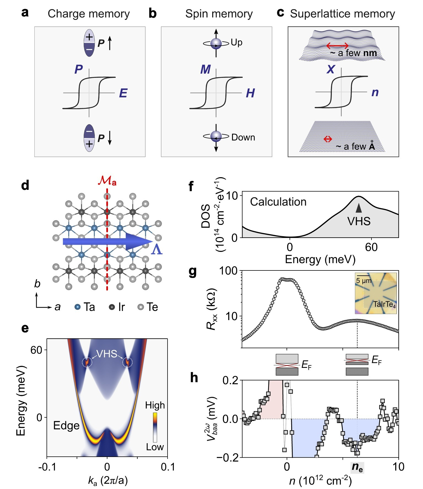

*Figure 1. モノレイヤーTaIrTe₄における双QSH状態の非線形ホール特性。左: TaIrTe₄の結晶構造（Ta–Irの交互鎖）。右: キャリア密度に対する縦抵抗Rₓₓと非線形Hall電圧V²ωの変化。電荷中性点（n=0）と相関ギャップ（nₑ ≈ +6.5×10¹²cm⁻²）の2箇所で絶縁体的な振る舞いが現れ、双QSHが確認される。（出典: arXiv:2603.19404, CC BY-NC-ND 4.0, unmodified）*

TaIrTe₄の結晶は、TaとIrが交互に並んだ鎖構造を持つ（Fig.1左）。重要な非対称性として、TaとIrのサイトが異なるため鏡映対称性は保たれるが空間反転対称性は破れている。これがベリー曲率双極子の存在を許し、非線形ホール効果の基盤となる。

縦抵抗の測定では2つのピークが現れる（Fig.1右）。一つはゲート電圧がゼロ（電荷中性点）に対応し、単粒子的なQSHギャップに対応する。もう一つはより高い電子密度nₑ ≈ 6.5×10¹²cm⁻²で現れ、これはバンド構造中のファン・ホーブ特異点（van Hove singularity, VHS）に起因する相関誘起のギャップである。重要なのは、両ギャップともにエッジ伝導が量子化されており、これが「デュアルQSH」の証拠となっている。

**Figure 2: 低温で現れる「隠れた状態」**

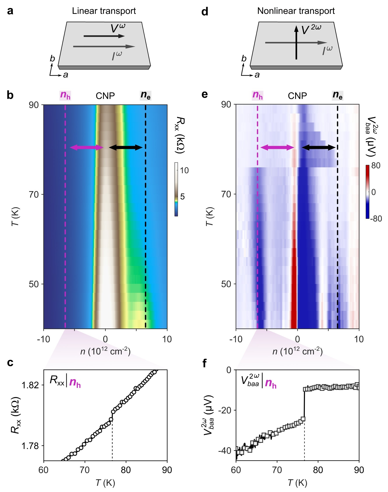

*Figure 2. 温度依存測定における「隠れた状態」の出現。nₕ ≈ -nₑ付近に76K以下で新たなピークが出現する。非線形ホール電圧V²ωはRₓₓよりも2桁以上の高感度でこの状態変化を検出する。（出典: arXiv:2603.19404, CC BY-NC-ND 4.0, unmodified）*

76K以下で温度を下げると、ホール側（nₕ ≈ -nₑ）の対称位置に新たなピークが出現する（Fig.2）。これが「隠れた状態（hidden state）」と名付けられた相である。線形抵抗では確かにピークが現れるが弱い。ところが非線形ホール電圧V²ωはこのピークを「線形抵抗よりも2桁以上」の感度で検出する。この感度の差は決定的であり、非線形ホール効果がベリー曲率に直接結合している（すなわち電子のトポロジカル性質を反映している）ことを示す。

**Figure 3: メモリ効果のプロトコル依存性**

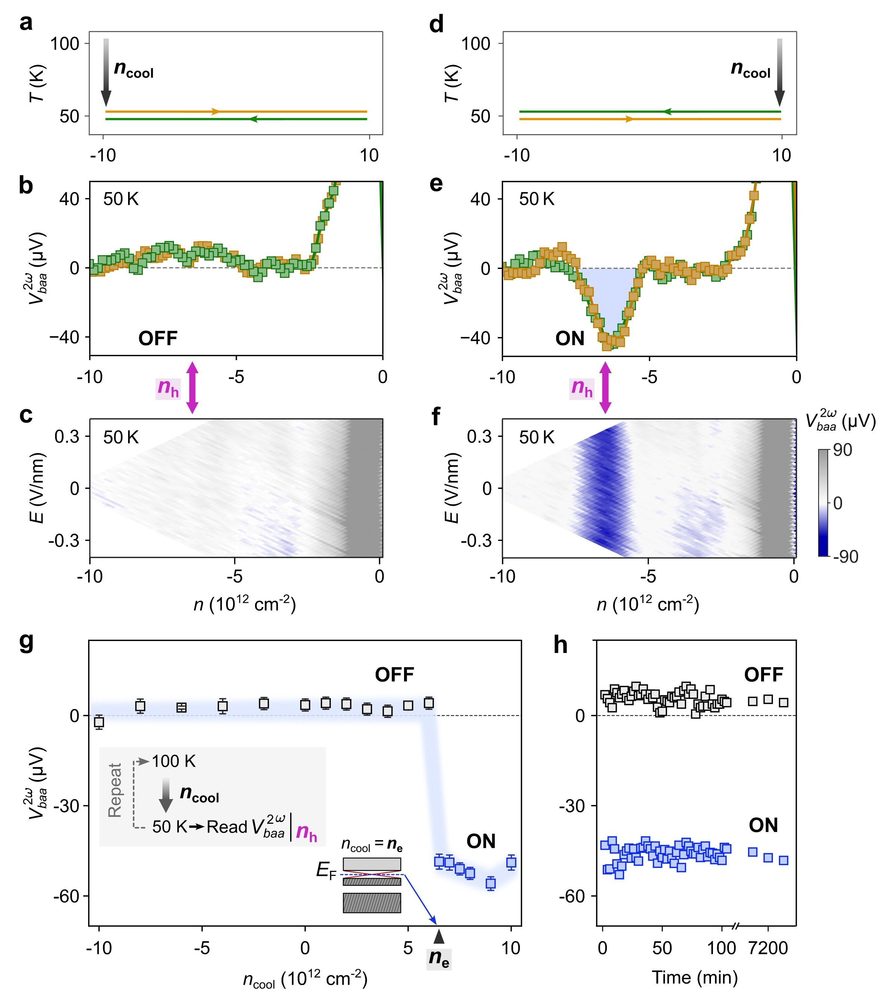

*Figure 3. 冷却プロトコル依存のメモリ効果。大きなホール密度（n < 0）で冷却するとhidden state OFF、大きな電子密度（n > 0）で冷却するとONになる。どちらの状態も数日間持続する。（出典: arXiv:2603.19404, CC BY-NC-ND 4.0, unmodified）*

ここからが真に驚くべき発見である。「冷却時にどのキャリア密度の状態にあったか」によって、低温でhidden stateがONになるかOFFになるかが決まる（Fig.3）。具体的には、大きなホール密度（n ≈ -10×10¹²cm⁻²）で冷却するとhidden state OFF、大きな電子密度（n ≈ +10×10¹²cm⁻²）で冷却するとhidden state ONとなる。そしてどちらの状態も、その後ゲート電圧を変化させても「数日間」持続する——これが不揮発性メモリとしての振る舞いである。

このプロトコル依存性が示すのは、low T（低温）に入る際に系が「どちらの安定状態に落ちるかを選択する」という物理像である。まるで磁石を外場の中で冷却する「フィールドクール（FC）」と外場なしで冷却する「ゼロフィールドクール（ZFC）」の違いのように、電気的なドーピング状態が「書き込み条件」として機能する。

**Figure 4: 電気的スイッチングの実証**

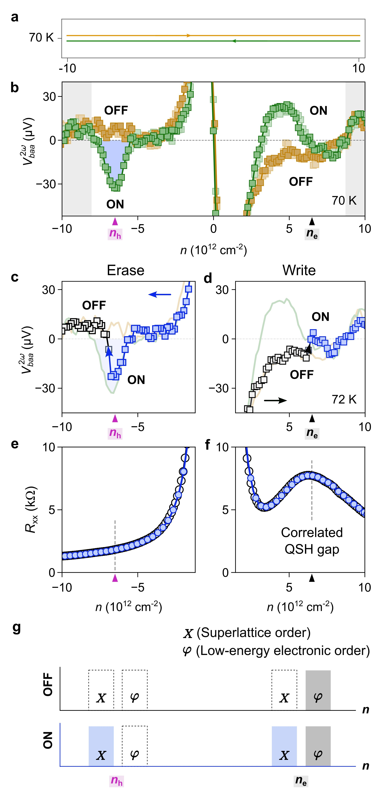

*Figure 4. 固定温度（70 K）での電気的スイッチング。キャリア密度のスイープによりhidden stateのON/OFFが再現可能に切り替わる。2回のスイープが完全に重なることで再現性が確認される。（出典: arXiv:2603.19404, CC BY-NC-ND 4.0, unmodified）*

さらに重要なのは、固定温度（70 K）でゲート電圧（キャリア密度）を掃引するだけで、hidden stateがON/OFFに切り替わることが示されたことだ（Fig.4）。これはもはや「冷却」という不可逆なプロセスを必要としない、完全に電気的な読み書き操作である。しかも2回のスイープが完全に重なり、再現性が実証されている。nₑ付近の線形抵抗ピーク（対応するRₓₓのピーク）は状態によらず常に存在するのに対し、nₕ付近の非線形ホール応答はON/OFF状態で明瞭な差を示す。これは電子秩序と格子秩序が「独立かつ結合している」という論文の核心的主張を実験的に支持している。

---

## 4. 背景と文脈：この重要論文はどこに位置づくか

### TaIrTe₄とはどのような物質か

TaIrTe₄は、タンタル（Ta）、イリジウム（Ir）、テルル（Te）からなる三元系層状化合物で、vdWギャップによって単層に劈開できる。バルク結晶は当初「タイプII型ワイル半金属」の候補として注目を集め、非線形ホール効果や光起電力などの非平衡・非線形応答の研究で活発に使われてきた〔arXiv:2412.02937〕。

しかし研究が進むにつれ、モノレイヤー（1層）に厚さを薄くすると、バルクとは異なるトポロジカルな性質が現れることが分かってきた。2024年に発表されたarXiv:2403.15912は、モノレイヤーTaIrTe₄において2つのQSH状態が存在するという「デュアルQSH絶縁体」を初めて実験的に確認した画期的な論文である。

デュアルQSHとは何か（Fig.: 2505.18335より）：

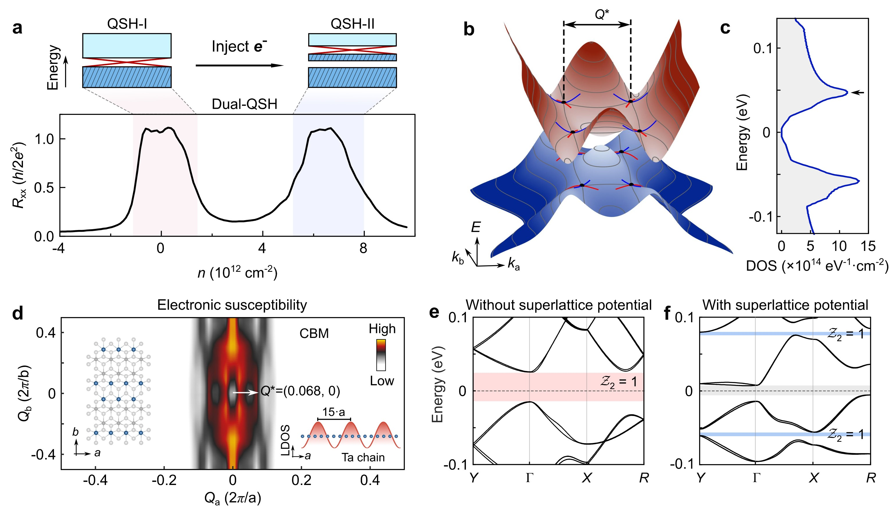

*Figure A. デュアルQSH絶縁体の概念図。電荷中性点での単粒子ギャップ内のQSH状態（左）と、電子ドーピングによる相関ギャップ内でのQSH状態（右）の2つが共存する。（出典: arXiv:2505.18335, Jian Tang et al., CC BY 4.0）*

電荷中性点（charge neutrality point, CNP）では、スピン軌道相互作用によって生じる単粒子的なバンドギャップ内にQSH状態が存在する。これは他のQSH材料（WTe₂など）と共通の機構である。一方、TaIrTe₄特有の現象として、電子密度をnₑまで増やすと、バンド中のVHSでの状態密度の集中が電子間相互作用を増強し、相関誘起のギャップが開く。驚くべきことに、このギャップ内にも保護されたエッジ伝導チャネルが存在する——これが「2個目のQSH状態」である。

### バンド構造の直接測定が明かした電子・正孔の非対称性

2026年1月に発表されたarXiv:2601.11504は、マイクロARPES（micro-ARPES: 空間分解能を持つ角度分解光電子分光法）を使ってモノレイヤーTaIrTe₄のバンド構造を直接測定した重要な実験論文である。

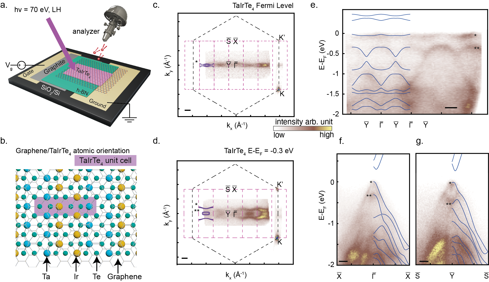

*Figure B. モノレイヤーTaIrTe₄のin-operandoマイクロARPESセットアップ。グラフェン上のTaIrTe₄マイクロデバイスに対し、空間分解ARPESでバンド構造を直接測定する。ブリルアンゾーンおよび等エネルギー面のマップを示す。（出典: arXiv:2601.11504, CC BY 4.0）*

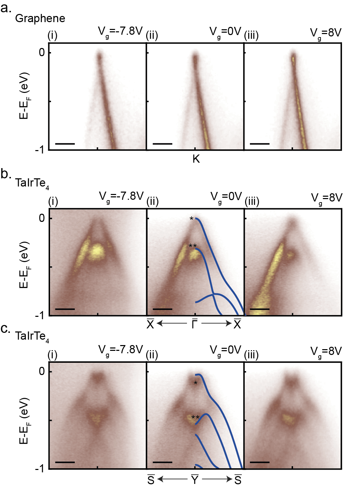

*Figure C. ゲート電圧依存バンド構造の変化。正孔ドープ（左）、中性（中央）、電子ドープ（右）の3条件でのバンド分散を示す。電子ドーピング時にバンドリノーマライゼーション（単純剛体バンドシフトではなくギャップの縮小）が起きることが分かる。（出典: arXiv:2601.11504, CC BY 4.0）*

この研究が明らかにした最重要の発見は、TaIrTe₄の「電子・正孔ドーピング非対称性」である。

- **正孔ドープ**（負のゲート電圧）: バンドが単純に剛体シフトし、フェルミレベルが価電子帯に入る。予想通りの挙動。
- **電子ドープ**（正のゲート電圧またはセシウム蒸着）: バンドは単純シフトせず、代わりにバンドギャップそのものが縮小する「バンドリノーマライゼーション」が起きる。

このリノーマライゼーションの微視的起源は、追加された電子が伝導帯を単純に占有するのではなく、価電子帯のバンドを再構成することにある。計算によれば、電子が加わることでVHSのエネルギー位置が変化し、その結果としてバンドギャップが縮小する。この発見は、TaIrTe₄のゲート依存挙動を理解するうえで根本的に重要であり、単純な「剛体バンドシフト」を仮定した従来の解釈を修正する必要があることを示している。

また、このVHSの位置（フェルミレベルの下方~0.05 eV）は、電子ドーピングでnₑに達したときに実験的に観測されるVHS由来のピーク位置と整合しており、デュアルQSH状態の起源を直接支持するデータとなっている。

### vdW型QSH材料の全体像

TaIrTe₄の話を位置づけるために、vdW型QSH材料のより広い文脈も整理しておこう〔arXiv:2505.18335〕。

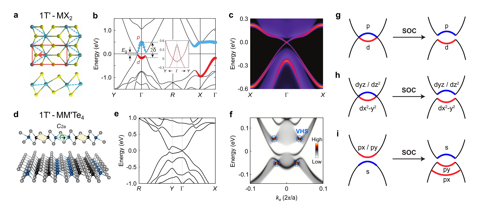

*Figure D. vdW型量子スピンホール材料の全体像。1T'-MX₂族（WTe₂など）とMM'X₄族（TaIrTe₄など）のバンド構造と特性の比較。（出典: arXiv:2505.18335, Jian Tang et al., CC BY 4.0）*

vdW型QSH材料は主に2つの族に分類される。一つは1T'-MX₂族（M=W,Mo、X=Te,Se）で、WTe₂がその代表例である。WTe₂は量子化されたエッジ伝導が100K近くまで観測されており〔Fei et al., Science 2017〕、後述するように励起子絶縁体相や超伝導相との競合という面白い物理も持つ。もう一つはMM'X₄族で、TaIrTe₄がその代表である。MM'X₄族はサイト非対称性（TaとIrが異なる）から非線形ホール効果をより大きく示し、またデュアルQSH状態という特有の現象が観測される。

どちらの材料系でも、2次元特有の電子相関の増強が、トポロジーと絡み合った新しい量子相（励起子絶縁体、電荷密度波、超伝導など）を生み出すという共通テーマがある。

---

## 5. メカニズム・解釈・比較

### 2つの秩序変数と自由エネルギーの安定性

中心論文の最も重要な理論的貢献は、「電子秩序」と「格子秩序」という2つの秩序変数が独立でありながら結合しているというモデルである。

**電子秩序変数φ**: nₑのVHS付近で生じる電荷・スピン密度波（CDW/SDW）的な電子の自発的秩序。これはnₑに達すると常に出現する（Rₓₓのピークは常にON）。

**格子秩序変数X**: 超格子の変位振幅。これが非ゼロになると超格子相が出現するが、X=0（通常格子）とX≠0（超格子）の両方が局所的な安定点（エネルギー極小）として共存できる。

この2つを結合させた自由エネルギーの形は、次のように書ける：

$$F(\varphi, X; T, n) = F_{\rm lattice}(X) + F_{\rm electron}(\varphi) + F_{\rm coupling}(\varphi, X)$$

ここで格子部分の安定性を保つには6次以上の多項式が必要であり、これが「双安定性（bistability）」を実現する。耦合項λφXにより、電子秩序が成長するnₑ付近では格子が超格子へと遷移しやすくなる。しかし一度超格子が形成されると、その後電子秩序の状態（φ）が変化しても格子秩序Xは元の位置（X≠0）に留まる——これが不揮発性の由来である。

直感的に言い換えると、電子秩序は「引き金（trigger）」として機能するが、超格子の記憶を保持しているのは格子の多安定性である。これはちょうど、磁石に外場をかけると磁化が反転するが（電子秩序の役割）、外場を切っても磁化は新しい状態に留まる（格子秩序の記憶性）という強磁性体のヒステリシスと類似した構造を持つ。

### WTe₂との比較：CDW・励起子絶縁体との絡み

TaIrTe₄の双安定超格子を理解するうえで、もう一つのQSH材料であるモノレイヤーWTe₂の事例が示唆に富む比較対象となる。

WTe₂モノレイヤーでは長らく「中性状態で絶縁体になるのはなぜか」が論争的な問題であった。最有力候補は「励起子絶縁体（excitonic insulator）」——電子と正孔が自発的にペアを組んで凝縮した状態——であり、これは一種のCDW秩序として解釈できる。2025年5月に報告されたarXiv:2505.20837は、フーリエ変換走査型トンネル分光法（FT-STS）を用いて、WTe₂のトポロジカルエッジモードにCDW秩序変数の空間的変調が刻印されているという直接証拠を示した。

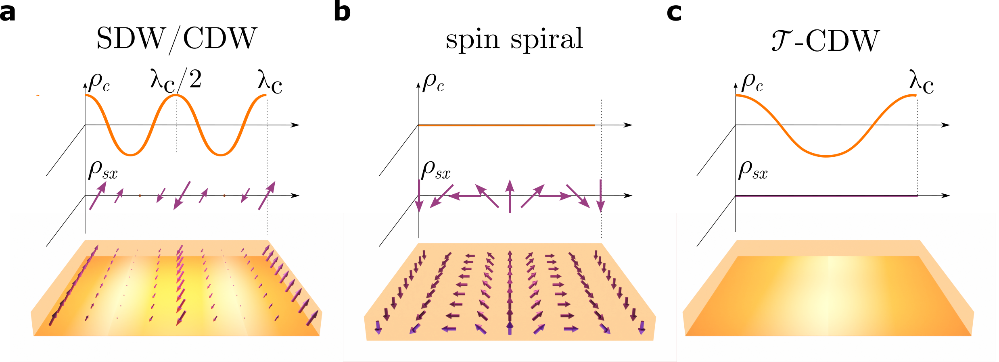

*Figure E. WTe₂モノレイヤーにおける励起子相の概念図。SDW/CDW相（上）、スピンスパイラル相（中）、T-CDW相（下）の3種類の秩序が実空間・逆空間でどのように区別されるかを示す。（出典: arXiv:2505.20837, Watson et al., CC BY 4.0）*

この発見は、「QSH材料の電荷ギャップ形成に電子相関が本質的に関わる」という共通テーマをWTe₂でも確認するものである。TaIrTe₄のケースとの重要な違いは、WTe₂では電荷中性点でのギャップが励起子凝縮によって生じるのに対して、TaIrTe₄では単粒子ギャップ（CNP）と相関ギャップ（nₑ）の2つが存在し、しかも後者が超格子形成と連動するという多段階の物理が展開される点である。

また、WTe₂では超伝導相がゲートによって誘起されることが知られており、最新のarXiv:2501.16699はそのWTe₂超伝導の「非BCS型」量子臨界的な特性を報告している。TaIrTe₄でも圧力下での超伝導が報告されており〔2018年〕、超格子形成がさらなる新しい超伝導相や他の量子相を誘起するかどうかは今後の重要な問いとなる。

### ラマン分光が語る格子の双安定性

電子的な測定だけでは「格子が本当に変わっているのか」は分からない。中心論文が格子変化の直接証拠として提示したのがラマン分光測定である。

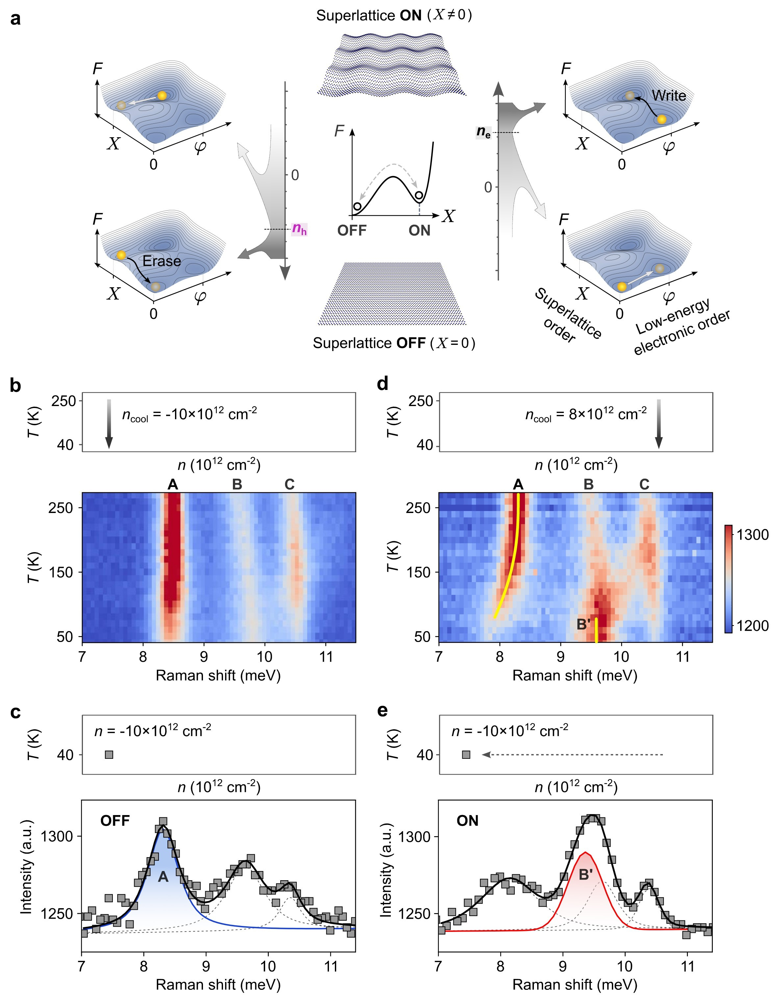

*Figure 5. ラマン分光によるON/OFF状態の区別。OFF状態では通常の3本のフォノンピーク（A, B, C）が観測される。ON状態ではピークAが軟化してB'という新しいピークが出現する。このB'ピークは温度一定でゲートを変化させても持続し、格子の双安定性の直接証拠となる。（出典: arXiv:2603.19404, CC BY-NC-ND 4.0, unmodified）*

超格子OFFの状態：通常の格子周期に対応する3本のフォノンピーク（A、B、C）が観測される。
超格子ONの状態：ピークAが低周波側に約0.5 meVシフト（軟化）し、新たなピークB'が出現する。

特に重要なのは、温度を固定した状態でゲート電圧（キャリア密度）を変化させてもB'ピークが消えないという事実だ。ラマンスペクトルは電子密度に直接依存しないため、B'ピークの持続は格子そのものが異なる安定状態（超格子構造）に留まっていることを意味する。これによって「電子秩序は変化しても格子秩序は記憶を保持する」という理論モデルが実験的に確認された。

### 理論計算が示す多彩な相図

arXiv:2506.18412（"Interaction-Driven Topological Transitions in Monolayer TaIrTe₄"）は、ハートリー・フォック計算と輸送測定の組み合わせによって、モノレイヤーTaIrTe₄の相図を系統的にマッピングした研究である。相図上には、量子スピンホール絶縁体（QSHI）、自明な絶縁体（trivial insulator）、高次トポロジカル絶縁体（HOTI）、金属相など多様な相が存在することが示された。

特に興味深いのは、VHS付近で電子相互作用がしきい値を超えると自発的対称性の破れが起き、複数の絶縁体相間の「相互作用駆動型トポロジカル転移」が起きるという予測である。これはTaIrTe₄が単純な1種類のトポロジカル絶縁体ではなく、「電子相関が空間の中でトポロジーを変えていく」という動的な舞台であることを示す。ひずみや誘電的環境の違いによって相の安定性が変わるため、複数のデバイスで測定した場合に結果が異なることがあるという事実（実験的に確認されている）も、この豊かな相図によって説明される。

---

## 6. 材料・手法・応用への広がり

### 超格子ONで現れる分数充填絶縁体状態

中心論文の最も野心的な発見の一つが、超格子をONにした場合にのみ観測される「分数充填絶縁体状態」である。

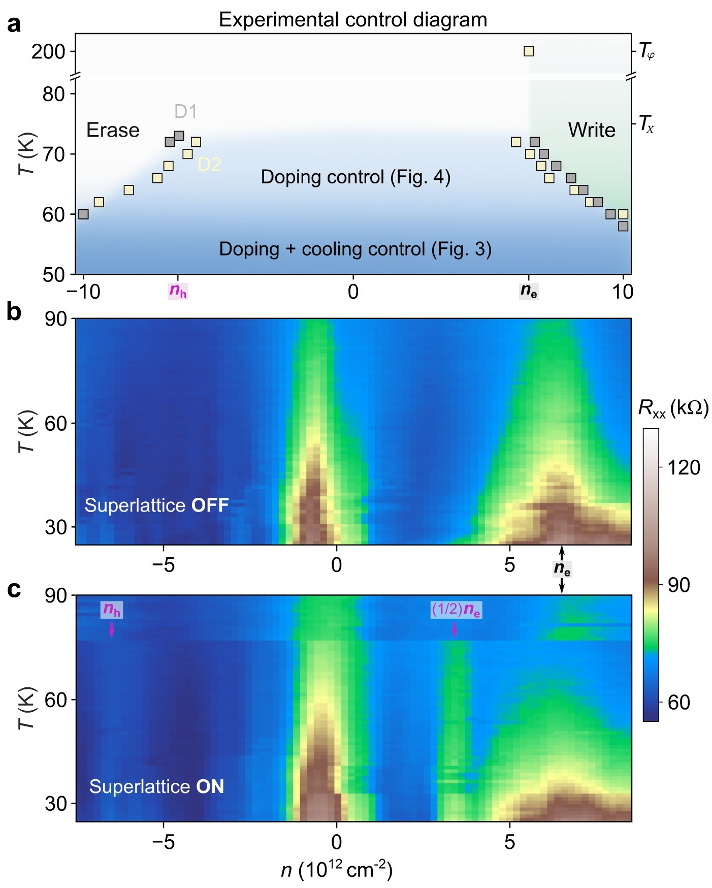

*Figure 6. TaIrTe₄の電気的制御相図と分数充填状態の出現。（左）超格子のON/OFF状態を書き込む温度・キャリア密度の境界線。（右）超格子ONの状態でのみ、nₑ/2（超格子半充填）に対応する位置に追加の絶縁体ピークが出現する。このピークは75 K以上で超格子の消失とともに消える。（出典: arXiv:2603.19404, CC BY-NC-ND 4.0, unmodified）*

超格子が形成されると、ブリルアンゾーンが折りたたまれてフラットバンドが生じる。これはモアレ系（例：ツイストビレイヤーグラフェン）と原理的に類似したフラットバンド物理の登場を意味する。重要な違いは、モアレ超格子が「設計されたもの」であるのに対して、TaIrTe₄の超格子は「自発的に形成されるもの」であり、かつ電気的にON/OFFできるという点である。

超格子のフラットバンドが形成されると、電子の有効質量が増大して相互作用効果が相対的に増強される。nₑ/2という「超格子の半充填」では、各超格子サイトに1電子が入った状態——これはちょうどハーフフィリングのモット絶縁体に対応する——が実現し、交換・相関相互作用によって絶縁体化しうる。論文はこの状態の起源として以下の候補を挙げている：

- **電荷密度波（CDW）**: 超格子をさらに2倍に変調する
- **モット絶縁体**: Hubbard型の強相関由来の絶縁体化
- **スピン秩序（Stoner不安定性）**: 磁気秩序が伴う絶縁体化
- **分数量子スピンホール状態**: 時間反転対称性を保ちながらトポロジカル秩序を持つ状態

このうちどの機構が実際に支配的かは、現時点では未解決である。ただし超格子のON/OFFによってこの状態を「スイッチできる」という事実は、特定の機構を検証するための強力な実験ツールを提供する。

### TaIrTe₄の非線形ホール効果とデバイス応用

バルクおよびフュー・レイヤーのTaIrTe₄は、非線形ホール効果（Nonlinear Hall Effect, NLHE）のプラットフォームとして先行研究でも注目されていた。arXiv:2506.10657は、3次の非線形ホール応答（third-order NLHE）が電場によって調節できることを示した。23K以下では不純物散乱が支配的になり、それ以上ではBerry接続分極率（Berry-connection polarizability）が支配的になるという2つの温度域における振る舞いの違いが報告されている。

また、arXiv:2412.02937では、数層のTaIrTe₄に直流電流を流すと線形な異常ホール効果が生じるという「軌道異常ホール効果（orbital anomalous Hall effect）」が報告された。これはスピンではなく電子の軌道自由度に由来する異常ホール応答であり、電流による対称性の自発的な破れという観点から、新しいタイプのスピントロニクス・オービトロニクス応用への道を開くものと期待されている。

超格子が形成されたTaIrTe₄では、これらの非線形応答がさらに増強・変調される可能性がある。超格子によって折りたたまれたバンドは、新たなベリー曲率ホットスポット（Berry curvature hot spots）を生み出すため、非線形ホール信号の大きさや符号が変わることが予想される。これは、中心論文でも非線形ホール測定がhidden stateの最も鋭敏なプローブとして機能した事実と整合している。

### 今後の展望：モアレを超えた「自発的フラットバンド工学」

モアレ超格子研究では、ツイスト角を精密に制御することで「魔法角（magic angle）」を実現し、フラットバンドと強相関状態を作る。しかしこのアプローチは「構造を固定する」ことを前提とする。TaIrTe₄の自発的超格子メモリは、全く異なる方向性を示す：超格子を自発形成させ、さらに電気的に書き込み・消去できるという「可変フラットバンド工学」の新しいパラダイムである。

ここには以下の展望がある。

1. **トポロジカル量子コンピューター向け制御**：超格子ON/OFFでQSHエッジ状態と相関絶縁体状態を切り替えることができれば、特定の量子状態を目的に応じて「選択」することが可能になる。

2. **不揮発性スピントロニクスデバイス**：格子の双安定性を使った不揮発性メモリセルは、スピン自由度を使ったMRAMとは異なる動作原理を持ち、より低消費電力での操作が期待できる。

3. **分数トポロジカル相の探索**：超格子の充填をさらに細かく制御することで、分数量子スピンホール効果やトポロジカル秩序を持つ新相の探索が可能になる。

4. **他vdW材料への展開**：類似の双安定超格子が他のvdW材料（例：他のMM'Te₄族化合物）でも実現可能かどうかの探索が重要な課題となる。

---

## 7. 基礎から理解する

### 量子スピンホール効果とは何か

まず「スピンホール効果」から始めよう。通常のホール効果では、電流を流している導体に垂直な方向に電圧が生じる。これは磁場中でのローレンツ力によるが、磁場がなくても生じる「異常ホール効果（AHE）」は強磁性体で知られる。

スピンホール効果（SHE）は、外部磁場なし・磁化なしの状態で、電流に対して垂直方向にスピン流が生じる現象である。原理はスピン軌道相互作用（SOC）による「スピン依存の散乱」または「ベリー曲率によるスピン依存の速度」にある。

$$\mathbf{J}_s = \sigma_{sH} \, (\hat{z} \times \mathbf{E})$$

ここで$\mathbf{J}_s$はスピン流、$\sigma_{sH}$はスピンホール伝導率、$\mathbf{E}$は電場である。

QSH絶縁体は「バルクが絶縁体でありながら、エッジに量子化されたスピン流（ヘリカルエッジ状態）が存在する状態」である。エッジでは、上向きスピンの電子は右に、下向きスピンの電子は左に進む（これを「ヘリカル」という）。時間反転対称性によって、互いに逆向きに進むスピン上下の散乱は禁止されており、エッジ伝導は散乱なしで量子化される：

$$G_{\rm edge} = \frac{e^2}{h} \times N_{\rm edge}$$

ここで$N_{\rm edge}$はエッジチャネル数（TaIrTe₄のデュアルQSHでは$N_{\rm edge}=2$）。

### ファン・ホーブ特異点と電子相関

ファン・ホーブ特異点（VHS）とは、バンド分散の「平坦な部分」つまり群速度$v_g = \nabla_k E = 0$となる$k$点近傍で、状態密度$D(E)$が発散（またはピークを持つ）箇所のことである：

$$D(E) \propto \int \frac{d^dS}{|\nabla_k E(\mathbf{k})|}$$

2次元系では、VHSでの状態密度は対数的に発散する。これは電子間相互作用の効果を劇的に増強する。具体的には、VHSでの占有電子数が特定の密度になると、電子間クーロン斥力や交換相互作用が「ハートリー・フォックセルフエネルギーのネスティング不安定性」を引き起こす。その結果として自発的な対称性の破れ（CDW、SDW、超伝導など）が起きやすくなる。TaIrTe₄のnₑはまさにこのVHSへの充填密度に対応している。

### ベリー曲率と非線形ホール効果

トポロジカル材料の物性を理解する中核的な概念が「ベリー曲率（Berry curvature）」$\boldsymbol{\Omega}(\mathbf{k})$である：

$$\Omega_n(\mathbf{k}) = -2 \, {\rm Im} \sum_{m \neq n} \frac{\langle n\mathbf{k}|v_x|m\mathbf{k}\rangle\langle m\mathbf{k}|v_y|n\mathbf{k}\rangle}{(E_m - E_n)^2}$$

ここで$|n\mathbf{k}\rangle$はブロッホ状態、$v_x, v_y$は速度演算子である。QSH絶縁体では各バンドのベリー曲率の$k$空間積分（チャーン数）が整数値をとる。

非線形ホール効果は、時間反転対称性は保ちながら空間反転対称性が破れた系で現れ、ベリー曲率双極子（BCD）が駆動する：

$$D_i = \int \frac{d\mathbf{k}}{(2\pi)^d} f(\mathbf{k}) \frac{\partial \Omega_z(\mathbf{k})}{\partial k_i}$$

非線形ホール電流は$J_y^{(2)} \propto D_x E_x^2$のように電場の2乗に比例し、一般に2倍周波数（$2\omega$）で観測される。TaIrTe₄の鎖方向の鏡映対称性（$M_y$）は空間反転対称性を破りつつ時間反転対称性を保つため、非線形ホール効果が許容される。超格子の形成はこのBCDの大きさと方向を変え、新しい対称性の破れも伴いうるため、非線形ホール信号が超格子の最鋭敏なプローブになる。

### ギンツブルグ・ランダウ理論による双安定性の理解

双安定メモリ効果を理解するには、ギンツブルグ・ランダウ（GL）の自由エネルギー展開が有用である。格子秩序変数$X$に対して：

$$F_{\rm lattice}(X) = a_2 X^2 + a_4 X^4 + a_6 X^6$$

通常の2次相転移では$a_4 > 0$で、$a_2$が温度低下とともに負になるとX≠0の状態が安定化する（連続的に変化）。しかし$a_4 < 0$（かつ$a_6 > 0$で安定化）の場合は1次相転移となり、$X=0$と$X\neq0$の2つの安定点が共存できる温度・パラメータ領域（「双安定領域」）が存在する。TaIrTe₄の超格子は、電子秩序との結合項$\lambda\varphi X$によって$a_4$の有効値が温度・ドーピングによって変化し、適切な条件で双安定性が実現するというシナリオで説明される。

誤解しやすい点として：双安定性はエネルギー的に2つの安定点が「同程度のエネルギー」を持つことを意味するのではない。一方が「絶対安定（global minimum）」であっても、もう一方がエネルギー障壁で守られた「局所的安定（local minimum）」であれば、実験時間スケールでは両状態が安定に観測できる。TaIrTe₄ではX=0（通常格子）が実は熱力学的により安定かもしれないが、超格子状態が障壁によって保護されているため「数日間」持続するのである。

---

## 8. 重要キーワード10個の解説

**1. 量子スピンホール絶縁体（Quantum Spin Hall Insulator, QSHI）**

バルクが絶縁体でありながら、エッジに時間反転対称性によって保護されたヘリカル伝導チャネルを持つ2次元トポロジカル絶縁体。ヘリカルとは、右進む電子がスピンアップ、左進む電子がスピンダウンであることを意味し、後方散乱が禁止されて$G=e^2/h$の量子化エッジ伝導が実現する。TaIrTe₄はデュアルQSH絶縁体として知られ、電荷中性点と電子ドーピング時のVHS付近の2箇所でQSH状態が現れる。通常のQSH絶縁体（WTe₂など）と区別される特有の性質である。

**2. ファン・ホーブ特異点（Van Hove Singularity, VHS）**

バンド構造中で群速度$\nabla_k E = 0$となる$k$点（すなわちバンドの「底」「天井」「鞍点」）付近で状態密度$D(E)$が発散あるいはピークをもつ点。2次元では対数発散。TaIrTe₄では価電子帯のVHSがフェルミレベル近傍（~0.05 eV下）にあり、電子ドーピングでこのVHSが埋まる密度nₑで状態密度が急増し、電子相互作用を増強して相関誘起ギャップの開口を引き起こす。モアレ系の魔法角における平坦バンドのVHSと類似した役割を果たす。

**3. ベリー曲率（Berry Curvature）**

ブリルアンゾーン内のブロッホ状態のゲージポテンシャルの「磁場」類似量$\boldsymbol{\Omega}(\mathbf{k}) = \nabla_k \times \boldsymbol{A}(\mathbf{k})$。ここで$\boldsymbol{A}(\mathbf{k}) = i\langle u_{n\mathbf{k}}|\nabla_k|u_{n\mathbf{k}}\rangle$はベリー接続。外磁場なしで異常ホール効果を生み出す源であり、QSH絶縁体のバルクバンドのチャーン数はベリー曲率の$k$空間積分。トポロジカル相の指標として本質的な概念。通常のバンド計算で電子の「位相」情報が失われることがあるが、ベリー曲率は位相幾何的な量として計算できる。

**4. 非線形ホール効果（Nonlinear Hall Effect, NLHE）**

空間反転対称性が破れた（時間反転対称性が保たれた）系で、電場の2乗に比例したホール電圧が現れる現象。ベリー曲率双極子（BCD）$D_i$が駆動し、交流電場$E_x = E_0\cos(\omega t)$に対して$2\omega$の周波数でホール電圧が測定される。TaIrTe₄は鎖方向の非対称性（TaとIrサイト）によりBCDを持ち、通常の線形輸送測定より遥かに高い感度でQSH状態の変化や超格子の形成・消滅を検出できる。中心論文でhidden stateを発見した主要な測定プローブ。

**5. 電荷密度波（Charge Density Wave, CDW）**

固体中で電子の電荷密度が空間的に周期変調する秩序状態。波数$\mathbf{q}$で変調された状態は、ブリルアンゾーン上の$\mathbf{k}$から$\mathbf{k}+\mathbf{q}$へのネスティング（フェルミ面の部分的な重なり）によって引き起こされることが多い。CDWは格子変位（Peierlsひずみ）を伴うことが多く、格子と電子の結合の典型例。WTe₂の励起子絶縁体はT-CDW型の秩序として解釈でき、TaIrTe₄の超格子も広義のCDW的な電子格子結合の産物と考えられる。T-CDWとは時間反転対称性を保つCDW秩序の変種。

**6. 励起子絶縁体（Excitonic Insulator）**

バンドギャップが小さい絶縁体や半金属において、価電子帯の正孔と伝導帯の電子がクーロン引力によって自発的にペアを形成（「励起子凝縮」）し、コヒーレントな秩序を持つ絶縁体状態。BCSの超伝導との類似性（フォノンによるペアリング→クーロン引力によるペアリング）が古くから指摘されている。WTe₂の中性絶縁体ギャップは励起子凝縮起源と解釈されており（arXiv:2505.20837はその直接証拠を提示）、CDWとの競合・共存が起きる。TaIrTe₄との比較では、後者の相関ギャップがどの程度励起子的な成分を持つかは未解明。

**7. 不揮発性メモリ（Nonvolatile Memory）**

電源を切っても情報が消えない記憶素子・材料状態。強誘電体（FeRAM）、強磁性体（MRAM）、相変化材料（PCM）などが従来の不揮発性メモリの原理として知られる。TaIrTe₄の超格子メモリは「格子のトポロジカル自由度」を使った新しいタイプの不揮発性メモリであり、双安定な格子秩序変数がエネルギー障壁によって保護されることで実現する。「数日間」の安定性と70K以上での動作がすでに確認されており、材料工学的な改良によってさらに動作温度の上昇が期待される。

**8. モアレ超格子（Moiré Superlattice）**

2枚の結晶格子をわずかにひねり（ツイスト）または格子定数の異なる材料を積層することで生じる長周期の干渉縞パターン。ツイストビレイヤーグラフェン（TBG）では特定のツイスト角（「魔法角」~1.1°）でフラットバンドが実現し、モット絶縁体や超伝導が観測された（2018年Cao et al.）。TaIrTe₄の自発的超格子はモアレ超格子と「フラットバンドを形成する」という効果は共通するが、外部からツイストを与えるのではなく材料固有の不安定性から自発的に生じる点で本質的に異なる。さらに電気的なON/OFFが可能という点でモアレ系を凌駕する可変性を持つ。

**9. 高次トポロジカル絶縁体（Higher-Order Topological Insulator, HOTI）**

通常のトポロジカル絶縁体（TI）は次元の1つ低いエッジ/面に伝導状態を持つが（バルク-エッジ対応）、HOTIはさらに次元の低い「コーナー状態」や「ヒンジ状態」を持つ。2次元HOTIでは頂点に局在した導電的なコーナー状態が現れる。arXiv:2506.18412の計算では、TaIrTe₄の相図内にHOTI相が予測されており、VHSへの電子充填によるトポロジカル相転移の経路上でHOTIが安定化する可能性がある。自発的超格子が形成されるとブリルアンゾーンの折りたたみが起き、HOTIのコーナー状態の配置・数が変わる可能性があり、超格子メモリとトポロジカル相の精密制御との関連が今後の課題となる。

**10. 双安定性（Bistability）とヒステリシス**

ある物理パラメータ（温度、圧力、電場など）の変化に対して、系が2つの安定状態の間で非連続的に遷移し、かつ「上から増やした場合」と「下から増やした場合」で遷移点が異なる（ヒステリシス）現象。強磁性体のB-Hループが代表例。TaIrTe₄では格子秩序変数$X$がGL自由エネルギーの2つの局所極小（$X=0$と$X\neq0$）に対応し、双安定領域内では冷却プロトコルや電気的スイープ方向によってどちらの状態に到達するかが決まる。双安定性の鍵はエネルギー障壁の高さであり、これが大きいほど不揮発性の持続時間（retention time）が長くなる。TaIrTe₄で観測された「数日間」の持続は、障壁が熱エネルギーkTを十分に超えていることを示す。

---

## 9. まとめと今後の論点

本記事で解説したTaIrTe₄モノレイヤーの「プログラマブル超格子メモリ」（arXiv:2603.19404）は、「トポロジカル材料における格子・電子相関の結合」という現代物性物理の中心課題を体現する発見である。QSH絶縁体という量子幾何学的に豊かな舞台の上で、電子秩序（VHS由来の相関ギャップ）と格子秩序（超格子構造）が独立かつ結合して動作し、結果として「電気的に書き込み・消去可能な不揮発性格子メモリ」を実現したという意味で、この発見は材料物理・デバイス物理・量子情報の各分野にとって重要な意義を持つ。

重要論文が特に注目されるべき点は2つある。一つは「2つの独立した秩序変数の結合による双安定性」という概念的な枠組みの提示で、これは固体メモリ機能の新しいパラダイムを与える。もう一つは「超格子ON/OFFによる分数充填絶縁体状態の制御」という実験的示唆で、これはモアレ系と並ぶ「トポロジカルフラットバンドへの新ルート」を開く。

一連の関連論文を合わせて見ると、この分野はTaIrTe₄とWTe₂という2つのvdW型QSH材料を軸に、「格子秩序・電子相関・トポロジーの三位一体」という大きな研究課題へと収束しつつある。WTe₂での励起子凝縮の直接観測（arXiv:2505.20837）、TaIrTe₄のバンド構造のリノーマライゼーション（arXiv:2601.11504）、相互作用駆動型トポロジカル転移の体系的予測（arXiv:2506.18412）はそれぞれ異なる側面から同じ問いに迫っている。

次に何を勉強すると理解が深まるか？まずバンドトポロジーの基礎としてBernevig & Hughes "Topological Insulators and Topological Superconductors"（Princeton UP）を薦める。電子相関とトポロジーの交差について知りたければ、Cao et al. 2018（Nature）のツイストビレイヤーグラフェンの論文と、その理論的背景であるBistritzer & MacDonald（PNAS 2011）が入門として適切である。非線形ホール効果の理論はSonoube, Ganz, Senthil（Nature Physics 2019）が出発点として最適であり、日本語では東北大学・英正樹先生らのレビューも参考になる。

---

## 10. 参考にした論文一覧

**重要論文（anchor）**

[1] J. Tang et al., "Programmable, Spontaneous Superlattice Memory in a Monolayer Topological Insulator," arXiv:2603.19404 (2026). ライセンス: CC BY-NC-ND 4.0.

**関連論文**

[2] J. Tang et al., "Observation of the dual quantum spin Hall insulator by density-tuned correlations in a van der Waals monolayer," *Nature* 627, 515–521 (2024); arXiv:2403.15912. ライセンス: arXiv nonexclusive-distrib 1.0.

[3] J. Tang et al., "Quantum spin Hall effects in van der Waals materials," arXiv:2505.18335 (2025). ライセンス: CC BY 4.0.

[4] L. Watson et al., "Observation of charge density wave excitonic order parameter in topological insulator monolayer WTe₂," arXiv:2505.20837 (2025). ライセンス: CC BY 4.0.

[5] J. Tang et al., "Visualization of Tunable Electronic Structure of Monolayer TaIrTe₄," arXiv:2601.11504 (2026). ライセンス: CC BY 4.0.

[6] J. Tang et al., "Interaction-Driven Topological Transitions in Monolayer TaIrTe₄," arXiv:2506.18412 (2025). ライセンス: arXiv nonexclusive-distrib 1.0.

[7] J. Song et al., "Unconventional Superconducting Phase Diagram of Monolayer WTe₂," arXiv:2501.16699 (2025). ライセンス: arXiv nonexclusive-distrib 1.0.

[8] T. Li et al., "Electric field control of third-order nonlinear Hall effect," arXiv:2506.10657 (2025). ライセンス: CC BY 4.0.

[9] C. Li et al., "Orbital anomalous Hall effect in the few-layer Weyl semimetal TaIrTe₄," arXiv:2412.02937 (2024). ライセンス: CC BY 4.0.
