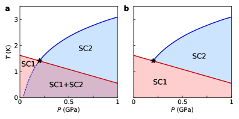
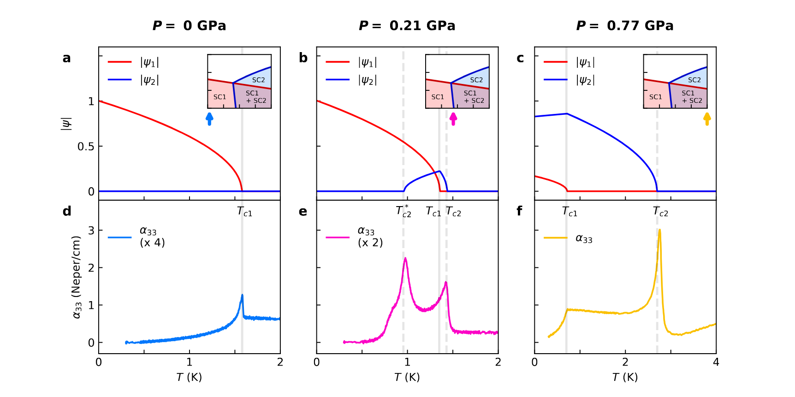
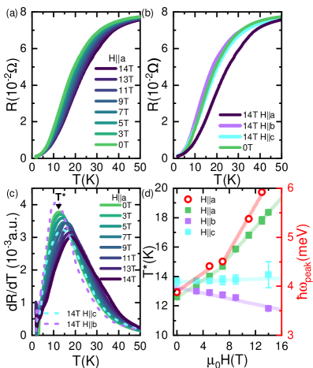

# UTe₂の多成分超伝導：スピン三重項・トポロジカル超伝導とその相図の解明

**執筆日**: 2026-03-23
**トピック**: UTe₂における多成分超伝導・ペア密度波・電荷密度波の競合と共存
**注目論文**: arXiv:2603.17905
**参照した関連論文数**: 8本

---

## 1. 導入：なぜ今UTe₂が注目されるのか

超伝導体の中には、クーパー対がスピン一重項（singlet）ではなくスピン三重項（triplet）を組むとされる、いわゆる「奇パリティ超伝導」の候補物質がいくつか知られている。その中でも、2019年に報告されたウランテルル化合物 UTe₂ は、スピン三重項かつトポロジカル超伝導の候補として物性物理学界の強い注目を集め続けている。常圧での転移温度は約1.6 Kと低いながら、きわめて異常な磁気的・熱力学的特性を示し、さらに加圧によって別の超伝導相が出現するという稀有な相図を持つ。

UTe₂ が特に注目される理由のひとつは、その「再入相転移（reentrant transition）」である。特定の圧力・磁場条件下で、超伝導状態が一度消えてから再び現れるという挙動が観測されており、これは通常の超伝導体では見られない現象だ。さらに、走査型トンネル顕微鏡（STM）を用いた近年の実験では、UTe₂ の表面において電荷密度波（CDW）やペア密度波（PDW）など複数の電子秩序が絡み合って存在することが明らかになってきた。これらの知見は、UTe₂ の超伝導が単純なBCS型ではなく、複数の秩序変数が競合・共存する多成分系である可能性を強く示唆している。

2026年3月に発表された注目論文（arXiv:2603.17905）は、超音波を使った精密な熱力学測定によって、UTe₂ の圧力－温度相図に「四重臨界点（tetracritical point）」が存在することを発見した。これは、異なる二つの超伝導秩序変数が互いに競合しながら出会う特別な点であり、多成分超伝導の理論的枠組みを実験的に検証した重要な成果だ。同時期に、STMによるCDW・PDWの観測や、中性子散乱による近藤混成の測定など、UTe₂ を多角的に解明しようとする研究が相次いでおり、この物質の理解が急速に深まりつつある。

本記事では、注目論文の四重臨界点の発見を核として、UTe₂ における多成分超伝導の全体像を描き出す。超伝導の対称性、相図の構造、近藤物理、密度波秩序、フェルミ面の幾何という複数の視点から、いまこの物質で何が分かり、何が謎として残っているかを整理する。

---

## 2. 今回の軸となる問い

本記事が取り組む中心的な問いは以下の4つである。

**問い①：UTe₂ の超伝導は本当に「多成分」なのか？**
加圧によって出現するSC1とSC2という二つの超伝導相は、独立した秩序変数を持つのか、それとも同一のオーダーパラメーターが変形したものなのか。注目論文（2603.17905）は超音波測定によって四重臨界点を発見し、これに答える。

**問い②：UTe₂ 表面で観測される密度波秩序の正体は何か？**
STM実験（2603.08688, 2603.12097, 2601.02192）は、UTe₂ に複数のCDWとPDWが存在することを示した。これらは超伝導の「母体」なのか「競合相手」なのか。

**問い③：近藤混成と超伝導はどのように関係するか？**
UTe₂ は重い電子系であり、局在したウランの4f電子が伝導電子と混成（近藤効果）することで重い準粒子が生まれる。この混成の性質が、中性子散乱（2603.17037）や磁気抵抗測定（2603.17710, 2603.17235）によって明らかにされつつある。

**問い④：UTe₂ はトポロジカル超伝導体か？**
奇パリティのペアリングが実現すれば、表面にマヨラナ端状態が現れるトポロジカル超伝導体となりうる。STM・STS実験（2602.02490）はその直接証拠を与えようとしている。

これらの問いは相互に関連しており、UTe₂ の理解には熱力学・輸送測定・分光測定・理論計算を統合する必要がある。

---

## 3. 注目論文は何を新しく示したのか

**書誌情報**
- タイトル: "Thermodynamic Discovery of Tetracriticality and Emergent Multicomponent Superconductivity in UTe₂"
- 著者: Sahas Kamat, Jared Dans, Shanta Saha, Artem D. Kokovin, Johnpierre Paglione, Jörg Schmalian, B. J. Ramshaw
- arXiv: 2603.17905（2026年3月）
- ライセンス: CC BY 4.0

**何を扱っているか**
UTe₂ に圧力をかけると、常圧での超伝導相（SC1）とは異なる高圧の超伝導相（SC2）が出現し、両相が共存する領域が存在することが知られていた。しかし、この二相の境界がどのような熱力学的性質を持つのか、特に二つの二次相転移が出会う「三重点」の存在は理論的に禁止されており、この矛盾が長らく未解決だった。

**新規性と主結果**
本研究では、超音波共鳴（パルスエコー超音波法）によって弾性率（c₅₅ および c₃₃）を精密に測定し、従来の相図に存在しなかった新しい相境界（転移温度 Tc2*）を発見した。この境界は音速の「上昇ジャンプ」という特徴的なシグネチャを持ち、再入超伝導に対応する。

最も重要な発見は、SC1とSC2が出会う点が「三重点」ではなく「**四重臨界点**（tetracritical point）」であるということだ。四重臨界点とは、相空間において4つの相が接する特別な点を指す。ここでは、SC1だけの相、SC2だけの相、SC1とSC2が共存する混合相、そして常伝導相の4つが一点で出会う。

*Figure 1. UTe₂ の温度－圧力相図の二つのシナリオ（左：三重点、右：四重臨界点）。注目論文は右の四重臨界点シナリオを実験的に確認した（出典: arXiv:2603.17905, CC BY 4.0, unmodified）.*

*Figure 2. UTe₂ の四重臨界点付近の実験的相図と弾性率 c₃₃ の温度依存性。c₃₃ の「上昇ジャンプ」が新しい転移温度 Tc2* を示す（出典: arXiv:2603.17905, CC BY 4.0, unmodified）.*

**理論的枠組み**
著者らは二成分のギンツブルク・ランダウ（GL）自由エネルギーを構築した：

$$F = F_1 + F_2 + \frac{\gamma_1}{2}|\psi_1|^2|\psi_2|^2 + \frac{\gamma_2}{4}(\psi_1^2\psi_2^{*2} + \text{h.c.})$$

ここで ψ₁ は SC1（常圧超伝導相）、ψ₂ は SC2（高圧誘起超伝導相）の秩序変数。第三項の γ₁ は両相の密度結合（競合）を表し、第四項の γ₂ は位相ロッキング（位相同期）を表す。この理論は、SC1がSC2の成長を強く抑制（γ₁ > 0）することで再入挙動を説明し、四重臨界点の存在を予言する。γ₂ が有限であれば、混合相では時間反転対称性が破れる可能性があり、これがトポロジカル超伝導相への入り口となりうる。

*Figure 4. UTe₂ の磁場－温度－圧力の三次元相図。SC1（青）とSC2（赤）の相境界面とその交線（四重臨界線）が可視化されている（出典: arXiv:2603.17905, CC BY 4.0, unmodified）.*

*Figure 5. SC1とSC2の秩序変数（|ψ₁|, |ψ₂|）の温度依存性と超音波減衰。三つの代表圧力において、二成分GLモデルが実験データをよく再現していることがわかる（出典: arXiv:2603.17905, CC BY 4.0, unmodified）.*

**なぜこの論文が今回の核となるか**
これまでの研究では、UTe₂ の複数の超伝導相が独立した秩序変数を持つかどうか、理論的な推測に留まっていた。本研究は熱力学的測定によって多成分性を実証し、二つの超伝導成分が競合する明確な証拠を与えた。これはSTM実験で観測されるPDW・CDWの解釈にも直接影響を与え、UTe₂ 研究全体の骨格を組み直す重要な一歩となっている。

---

## 4. 背景と文脈：UTe₂ の発見から現在まで

UTe₂ は2019年に超伝導が発見されて以来、数々の異常な性質が次々と報告されてきた。まず、BCSの弱結合理論では説明できないほど大きな比熱ジャンプ（2γTc 以上）が観測され、強結合・非従来型超伝導の可能性が示された。次に、磁場に対する超伝導の頑健さが異常で、a軸方向には35 Tを超える高磁場まで超伝導が生き残る一方、磁場を再び下げると「再入超伝導相」が出現する。さらに、加圧によって約0.3 GPa付近で転移温度が一度下がった後、別の超伝導相（SC2）が現れ、Tc ~ 2 Kまで上昇するという複雑な相図を持つ。

これらの観測事実は、UTe₂ のペアリングがスピン一重項でなくスピン三重項（$\vec{d}$ ベクトルで記述される）であることを示唆する。スピン三重項超伝導は、超流動 ³He やSr₂RuO₄ でも議論されてきたが、UTe₂ はその最も有力な候補として浮上した。さらに、奇パリティのクーパー対は時間反転対称性を破らずにトポロジカル超伝導を実現する条件を満たしうるため、UTe₂ はマヨラナ準粒子の実現舞台としても期待されている。

2025年から2026年にかけて、STM実験が飛躍的な進展をもたらした。Aishwarya らは低温分光イメージングによって準粒子干渉（QPI）を直接観測し、電荷密度波ギャップの温度依存性や、円形フェルミポケットの存在を明らかにした（2601.02192）。また、Wang & Davis は超伝導探針を用いたSTM（Andreev分光）によって、B₃ᵤ 対称性を持つ奇パリティ三重項秩序変数の可視化に成功し、トポロジカル表面バンドの証拠を提出した（2602.02490）。これらはUTe₂ のペアリング対称性論争に重要な実験的制約を与えた。

一方、重い電子系であるUTe₂ の正常状態の性質も重要な研究課題だ。近藤効果とは、局在スピン（Uの4f電子）と伝導電子の間の反強磁性的な相互作用によって、低温でスピン一重項状態が形成され、バンドが混成（hybridization）されて「重い準粒子」が生まれる現象である。Halloran らの中性子散乱実験（2603.17037）は、UTe₂ の近藤混成がa軸方向の磁場に対して特に敏感であることを示し、7 T付近での混成の変化が電気抵抗の特徴的な温度 T* の変化と一致することを明らかにした。

---

## 5. メカニズム・解釈・比較

### UTe₂ の超伝導ペアリング機構：何が分かっているか

UTe₂ のペアリング機構については、未解決の問いが多い。しかし近年の複数の実験から、いくつかの重要なピースが揃ってきた。

**オーダーパラメーターの対称性**
Wang & Davis（2602.02490）は、Andreev分光とQPI 画像によって、UTe₂ の超伝導ギャップが B₃ᵤ 対称性を持つ奇パリティ三重項（節線を持つ）であることを示した。B₃ᵤ 対称性はウランの鎖方向（a軸）に節線（ノード）を持つ。これは非チラルな超伝導体であることを意味し、「時間反転対称性を破らない」トポロジカル超伝導の一形態である可能性がある。

**フェルミ面の幾何**
Kimata ら（2603.17710）は角度依存磁気抵抗振動（AMRO）によって、UTe₂ のフェルミ面が準二次元的な矩形断面を持ち、二本の直交する一次元バンドが混成したものであることを明らかにした。特に、電子ポケットと正孔ポケットで散乱率が大きく異なることを発見し、電子ポケットが超伝導発現に主要な役割を担うと結論した。Ishizuka & Yanase（2603.17235）による第一原理計算はAMROの結果を再現し、a軸周りの磁場傾斜が顕著な磁気抵抗振動を引き起こすことを理論的に示した。

**近藤混成と超伝導の関係**
Halloran ら（2603.17037）の中性子散乱実験は、UTe₂ の近藤混成励起がa軸磁場に強く依存することを示した。7 Tの臨界磁場付近で低エネルギーのスペクトル重みが抑制される一方、高エネルギー側が増強するという振る舞いは、混成の性質が磁場で変化することを意味する。この変化は輸送測定における T* の変化とも一致しており（図6参照）、近藤混成の変調が超伝導の磁場応答（再入超伝導相の出現）に直接関係している可能性を示唆する。

*Figure 6. UTe₂ の各結晶軸方向の電気抵抗の温度依存性と外部磁場依存性。T* の磁場依存性（パネルd）が中性子散乱のピーク位置と一致することが分かる（出典: arXiv:2603.17037, CC BY 4.0, unmodified）.*

*Figure 1. UTe₂ の中性子非弾性散乱強度マップ（(0kl)面）。a軸磁場の増大（0T→3T→7T→11T）に伴い、ブリルアンゾーン境界付近の散乱強度が系統的に変化する（出典: arXiv:2603.17037, CC BY 4.0, unmodified）.*

### CDW・PDWの競合：表面と体積の物理

一方、STMで観測される電荷密度波とペア密度波は、バルクの超伝導とどう関係するのか。Zhu ら（2603.08688）は、ベクトル磁場を印加しながら行ったSTM実験で、UTe₂ に二種類のCDW変調が存在することを発見した。ひとつは超伝導転移温度 Tc をまたいでも生き残る変調（非整合ピーク）、もうひとつは Tc 付近で消える変調（温度依存ピーク）である。特に、磁場方向による選択的な抑制パターンから、後者がスピン三重項ペア密度波（PDW）の「娘秩序」として現れる整合CDWであることを示した。

Sharma ら（2603.12097）は、a軸方向のわずか1.7 Tの磁場によって「互い違いCDW（staggered CDW）」が完全に消滅することを見出した。同じ磁場で、近藤共鳴ピークと混成ギャップも同時に変化する。この軌道選択的な効果は、Teの5p軌道とUの5f軌道の間の混成チャンネルと、Uの6d軌道とUの5f軌道の間の混成チャンネルが競合しており、磁場でそのバランスが切り替わるという「軌道選択的近藤効果」モデルによって解釈された。

> **備考（図について）**: 2603.08688 および 2603.12097 のHTMLバージョンはarXivに掲載されていないため、図は取得できなかった。これらの論文の中心的な結果は本文で詳述している。図の配置候補として、STMの局所状態密度マップと磁場依存性を示す図を挿入すると読者の理解を大きく助けると思われる。

### 大スケールへの拡張：Replica STM

UTe₂ に限らず、PDWは近年様々な超伝導体で提案されているが、その空間的広がりを実証することは難しい。Águeda Velasco ら（2602.19678）が開発した「Replica STM（R-STM）」法は、原子スケールの変調を数百 nm のメゾスコピックスケールにわたって追跡できる手法で、FeSe では100 nm 以上にわたってPDMが均一に存在することを示した。UTe₂ でも同様の手法が適用されており、大局的な電子秩序の空間均一性の検証に向けて研究が進んでいる。

---

## 6. 材料・手法・応用への広がり

### 他の非従来型超伝導体との比較

UTe₂ の多成分超伝導は、他の非従来型超伝導体との比較によって位置づけが明確になる。超流動 ³He はスピン三重項の最も確立した例であり、A相（チラル p 波）とB相（時間反転対称 p 波）という二相が存在し、圧力－温度相図に「ポリクリティカル点（polycritical point）」を持つことで知られる。UTe₂ の四重臨界点は、この³He の相図との強い類比を示す。

Sr₂RuO₄ はかつてスピン三重項超伝導の有力候補とされていたが、NMR実験によって否定され、現在では単成分超伝導と考えられている。対して UTe₂ は、四重臨界点の発見によって多成分性が熱力学的に実証された点で際立っている。

### 測定手法の相補性

本トピックに関わる各種測定手法の比較を整理すると：

- **超音波測定**（本論文）：バルクの熱力学的情報を精密に抽出。弾性率のジャンプから転移の性質（一次/二次）を識別できる。
- **STM/STS**：表面の局所電子状態を原子分解能で観察。CDW・PDWの空間変調や超伝導ギャップの異方性を可視化できる一方、バルクを代表しない可能性がある。
- **中性子散乱**：磁気励起の運動量依存性と磁場依存性を測定。近藤混成のバルク的な性質にアクセスできる。
- **AMRO（角度依存磁気抵抗振動）**：フェルミ面の形状を実空間で検証。理論計算との比較が可能。

これらの手法が測る「スケール」と「位置（表面/バルク）」の違いに注意することが重要だ。特に、STMで見えるCDW・PDWが表面特有の現象なのか、バルクにも存在するのかは、本質的な問題として残っている。

### 応用可能性

UTe₂ がトポロジカル超伝導体であると確認された場合、最も重要な応用はマヨラナ準粒子のホストとしての利用である。マヨラナ準粒子は、非アーベリアンエニオンとしての統計を持ち、トポロジカル量子コンピューティングの「素子」として有望視されている。しかし、現状ではUTe₂ の極低温・高圧環境が必要であり、実用化への道は遠い。それよりも近い価値は、多成分超伝導や時間反転対称性の破れを制御可能な「モデル系」としての役割であろう。

---

## 7. 基礎から理解する

### スピン三重項超伝導とは何か

通常の金属超伝導（BCS理論）では、クーパー対は反対スピンの電子（↑↓ - ↓↑）で形成され、スピン一重項（スピン0）を持つ。この場合、オーダーパラメーターはスカラー $\Delta$ で書ける（s波、d波など）。

スピン三重項超伝導では、クーパー対は同スピン（↑↑）または（↑↓ + ↓↑）、（↓↓）という3種類のスピン状態を持ち、オーダーパラメーターはベクトル $\vec{d}(\mathbf{k})$ で記述される：

$$\Delta_{\alpha\beta}(\mathbf{k}) = [\vec{d}(\mathbf{k}) \cdot \vec{\sigma}](i\sigma_y)_{\alpha\beta}$$

ここで $\vec{\sigma}$ はパウリ行列、$\alpha, \beta$ はスピン指標。スピン三重項ペアリングは「奇パリティ」（$\vec{d}(-\mathbf{k}) = -\vec{d}(\mathbf{k})$）を持つ場合に、フェルミ統計と矛盾しない（クーパー対の波動関数全体が反対称）。UTe₂ では、a軸方向に $\vec{d}(\mathbf{k})$ が整列しているモデルが有力視されている。

### ギンツブルク・ランダウ理論と多成分超伝導

ギンツブルク・ランダウ（GL）理論は、転移温度付近で秩序変数の空間変化を記述する現象論的理論である。スカラーの秩序変数 $\psi$ に対するGL自由エネルギーは：

$$F = a|\psi|^2 + \frac{b}{2}|\psi|^4 + c|\nabla\psi|^2$$

$a = a_0(T-T_c)$ が転移温度で符号が変わり、$b > 0$ で超伝導転移（二次転移）が起きる。二成分系では、$\psi_1$ と $\psi_2$ を持つ拡張GL理論が必要で、注目論文はこれを用いて四重臨界点の存在を予言した。

**誤解しやすい点：**
「多成分」とは必ずしも「二つの超伝導体の混合物」ではない。例えば、チラルp波超伝導（$p_x + ip_y$）は単一の超伝導相でも複素スカラーとして記述されるが、内部的な位相構造を持つ。UTe₂ の場合、SC1（常圧相）とSC2（高圧相）が「別々のオーダーパラメーター」を持つという意味での多成分性が、今回の四重臨界点の発見によって示された。

### トポロジカル超伝導とは何か

トポロジカル超伝導（TSC）は、超伝導ギャップがk空間でトポロジカルに非自明な構造を持ち、表面（端）にギャップレスな表面（端）状態を持つ超伝導体である。最も重要な例は、一次元のキタエフチェーン模型で、端にマヨラナゼロモード（MZM）が現れることが示されている。

奇パリティのスピン三重項超伝導（p波, f波など）は、一般に時間反転不変（TRS保存）のトポロジカル超伝導を実現しやすい。UTe₂ が B₃ᵤ 対称性を持つ（節線を持つ非チラル三重項）超伝導体であれば、チラルでないため時間反転対称性を保ちながらトポロジカル超伝導相となりうる（DIII対称クラス）。Wang & Davis（2602.02490）が (0$\bar{1}$1) 表面に見出したAndr'eev 伝導の増強は、これと整合する。

### ペア密度波（PDW）とは何か

通常の超伝導では、クーパー対の重心運動量 $\mathbf{Q} = 0$ であり、オーダーパラメーター $\Delta$ は空間的に一様である。ペア密度波（PDW）とは、$\mathbf{Q} \neq 0$ のクーパー対が凝縮した状態で、$\Delta(\mathbf{r}) = \Delta e^{i\mathbf{Q}\cdot\mathbf{r}}$ のように空間変調する超伝導秩序である。PDWはLO（ラーキン・オブチャニコフ）状態とも呼ばれ、古くから磁場中の超伝導で議論されてきた。UTe₂ では、PDWが自発的に（磁場なしで）現れる可能性があり、これが「スピン三重項ペアリングから来る特異な不安定性」として注目されている。

---

## 8. 重要キーワード10個の解説

**① スピン三重項超伝導（spin-triplet superconductivity）**
クーパー対のスピン状態が三重項（S=1）である超伝導。オーダーパラメーターはベクトル $\vec{d}(\mathbf{k})$ で記述され、奇パリティを持つ場合は空間反転によって符号が変わる。スピン一重項（d波など）と異なり、磁場に対して異方的な応答を示す。UTe₂ は最も有力な候補物質であり、強磁性揺らぎが媒介するスピン三重項ペアリングが理論的に提案されている。

**② 四重臨界点（tetracritical point）**
相空間において4つの相が一点で接する特別な点。二成分GL理論では、二つの秩序変数の競合係数 $\gamma_1 > 0$ のとき、相図に四重臨界点が生まれる。今回の注目論文（2603.17905）がUTe₂ において発見した。三重点（three-phase point）が二次相転移の交点として熱力学的に禁止されるのに対し、四重臨界点は許容される。

**③ ペア密度波（pair density wave, PDW）**
クーパー対の重心運動量 $\mathbf{Q} \neq 0$ で形成される空間変調した超伝導秩序。$\Delta(\mathbf{r}) \propto e^{i\mathbf{Q}\cdot\mathbf{r}}$ と表される。通常の超伝導（$\mathbf{Q} = 0$）や電荷密度波（CDW）の複合秩序として現れることもある。UTe₂ では、STM実験（2603.08688）によってTc 以上でもPDWが生き残ることが示唆されており、スピン三重項ペアリングの特異な性質を反映している可能性がある。

**④ 近藤効果（Kondo effect）**
局在磁性不純物または局在f電子が伝導電子と反強磁性的に結合し、低温で「近藤スクリーニング」が起きることで局在スピンが消える現象。ウランの4f電子を持つUTe₂ は近藤格子系であり、周期的な近藤スクリーニングによって重い電子（有効質量が電子質量の数百倍）が形成される。近藤混成のエネルギーギャップがSTM（2603.10552, 2603.12097）や中性子散乱（2603.17037）で直接観測されている。

**⑤ 弾性率（elastic modulus）**
固体の変形に対する抵抗を表すテンソル量。超音波の速度は弾性率の平方根に比例するため、弾性率の温度・圧力・磁場依存性を測定することで、相転移における秩序変数の変化を非侵襲的に検出できる。注目論文では弾性率 c₃₃（c軸方向の縦波弾性率）の「上昇ジャンプ」が新しい相境界の発見に使われた。

**⑥ 再入超伝導（reentrant superconductivity）**
温度を下げると一度超伝導状態になった後、さらに温度を下げると常伝導に戻り、さらに下げると再び超伝導になる現象。または、磁場を増加させると超伝導が消え、さらに磁場を増加させると超伝導が再び現れる現象。UTe₂ では磁場 H ∥ b 軸で後者が観測される。多成分GLモデルでは、SC1がSC2の成長を競合的に抑制し、SC2だけが残る再入相領域が形成されることで再入超伝導が生まれる。

**⑦ 準粒子干渉（quasiparticle interference, QPI）**
STMを用いた分光イメージングで、欠陥や不純物によって散乱された準粒子の干渉パターンを観測する手法。フーリエ変換STMとも呼ばれ、散乱ベクトルの分布からフェルミ面の形状を実空間で可視化できる。UTe₂ では（2601.02192, 2602.02490）がQPIを用いてフェルミ面トポロジーとCDWネスティングベクトルを明らかにした。

**⑧ 奇パリティ（odd parity）**
結晶の空間反転操作 $\mathbf{k} \to -\mathbf{k}$ に対してオーダーパラメーターが符号を変える性質。$\Delta(-\mathbf{k}) = -\Delta(\mathbf{k})$。スピン一重項（偶パリティ）と対称に、奇パリティはフェルミ統計から正当化されるためにスピン三重項と対応する。奇パリティ超伝導は一般にトポロジカル超伝導の実現に有利であり、表面に保護されたマヨラナ端状態を生じさせうる。

**⑨ マヨラナ準粒子（Majorana fermion）**
粒子と反粒子が同一であるフェルミオン。超伝導体の準粒子励起（ボゴリューボフ準粒子）は電子と正孔の重ね合わせであり、条件が整えばマヨラナ粒子として振る舞う。トポロジカル超伝導体の端に現れるゼロエネルギーのマヨラナ束縛状態（MZM）は非アーベリアンエニオンであり、トポロジカル量子計算の実現素子として注目されている。UTe₂ の (0$\bar{1}$1) 表面で観測されるゼロエネルギー状態（2602.02490）はMZMの候補である。

**⑩ 近藤ハイブリダイゼーション波（Kondo hybridization wave, KHW）**
近藤格子における電子混成の空間的な周期変調秩序。通常の近藤格子では混成が空間的に一様であるが、KHWでは「軽い電子と重い電子が交互に空間を占める」スーパーラティス構造が形成される。UTe₂ において（2603.10552）が初めてSTMで直接観測した。CDWを伴い、フェルミ準位付近にエネルギーギャップを開く。超伝導との相互作用がスピン三重項ペアリングの選択に関与する可能性がある。

---

## 9. まとめと今後の論点

UTe₂ は、スピン三重項・奇パリティ・トポロジカル超伝導の3つの性質を同時に持つ可能性があり、それが多くの研究者を引きつける最大の理由である。2026年3月に発表された注目論文（2603.17905）は、超音波測定によって UTe₂ の圧力－温度相図に四重臨界点が存在することを発見し、常圧超伝導相（SC1）と高圧超伝導相（SC2）が互いに異なる秩序変数を持つ多成分超伝導体であることを熱力学的に実証した。この成果は、UTe₂ の理論的枠組みに根本的な変更を迫るものである。

関連論文群を合わせて眺めると、UTe₂ では複数の秩序が競合・共存する複雑な量子相が形成されていることがわかる。電荷密度波（CDW）とペア密度波（PDW）の共存（2603.08688）、近藤混成の空間変調（2603.10552）、磁場による電子秩序の方向選択的制御（2603.12097）、そして奇パリティ超伝導オーダーパラメーターの可視化（2602.02490）が、それぞれ異なる手法から同一の物質を多角的に照らしている。

今後の最重要論点は、（1）SC1とSC2の混合相で時間反転対称性が本当に破れているか（チラル超伝導かどうか）、（2）PDWとCDWがバルクの現象かそれとも表面特有の効果か、（3）近藤混成と超伝導ペアリングの直接的な因果関係の解明、の3点である。次の理解の深化には、圧力下でのSTMや、偏極中性子散乱によるスピン感度の高い測定などが期待される。

UTe₂ の研究をさらに深めたい読者には、³He の超流動相図（スピン三重項の原型）、トポロジカル超伝導の対称クラス（特にDIII）、近藤格子の電子論（アンダーソン模型、周期アンダーソン模型）、ペア密度波の理論（Agterberg, Himeda ら）を学ぶことを勧める。

---

## 10. 参考にした論文一覧

| 役割 | arXiv ID | タイトル | 著者 | 年月 | ライセンス |
|------|----------|---------|------|------|-----------|
| **注目論文** | 2603.17905 | Thermodynamic Discovery of Tetracriticality and Emergent Multicomponent Superconductivity in UTe₂ | Kamat et al. | 2026-03 | CC BY 4.0 |
| 関連 | 2603.17710 | Electron-Hole Scattering Dichotomy and Anisotropic Warping in Quasi-Two-Dimensional Fermi Surfaces of UTe₂ | Kimata et al. | 2026-03 | arXiv default |
| 関連 | 2603.17235 | Field-angle dependence of magnetoresistance in UTe₂ | Ishizuka & Yanase | 2026-03 | arXiv default |
| 関連 | 2603.17037 | Field-direction sensitivity of Kondo hybridization in UTe₂ | Halloran et al. | 2026-03 | CC BY 4.0 |
| 関連 | 2603.12097 | Directional Manipulation of a Staggered Charge Density Wave and Kondo Resonance in UTe₂ | Sharma et al. | 2026-03 | CC BY 4.0 |
| 関連 | 2603.10552 | Observation of Kondo hybridization wave in UTe₂ | Yu et al. | 2026-03 | arXiv default |
| 関連 | 2603.08688 | Discovery of intertwined pair density and charge density wave orders in UTe₂ | Zhu et al. | 2026-03 | CC BY 4.0 |
| 関連 | 2602.19678 | Bridging atomic and mesoscopic length scales with Replica Scanning Tunneling Microscopy | Águeda Velasco et al. | 2026-02 | CC BY 4.0 |
| 関連 | 2602.02490 | Visualizing the Odd-parity Superconducting Order Parameter and its Quasiparticle Surface Band in UTe₂ | Wang & Davis | 2026-02 | CC BY 4.0 |
| 関連 | 2601.02192 | Visualizing the low-energy electronic structure of the triplet superconductor UTe₂ through quasiparticle interference | Aishwarya et al. | 2026-01 | CC BY 4.0 |
