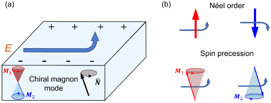
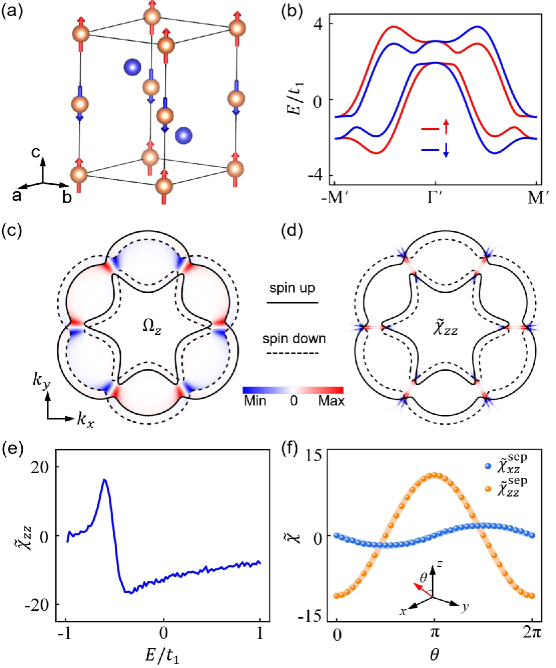
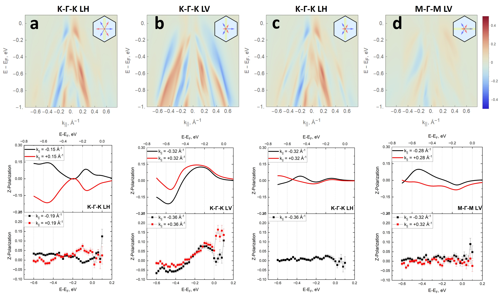
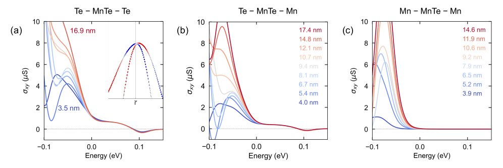
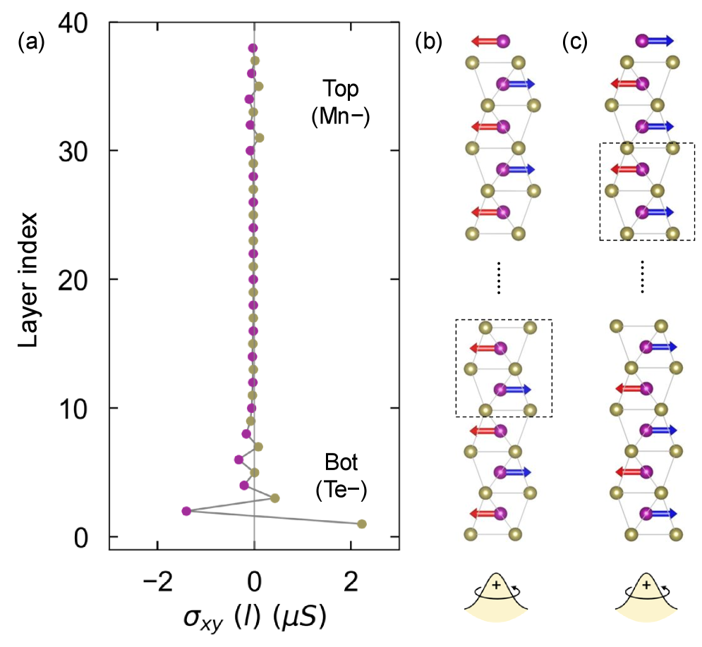
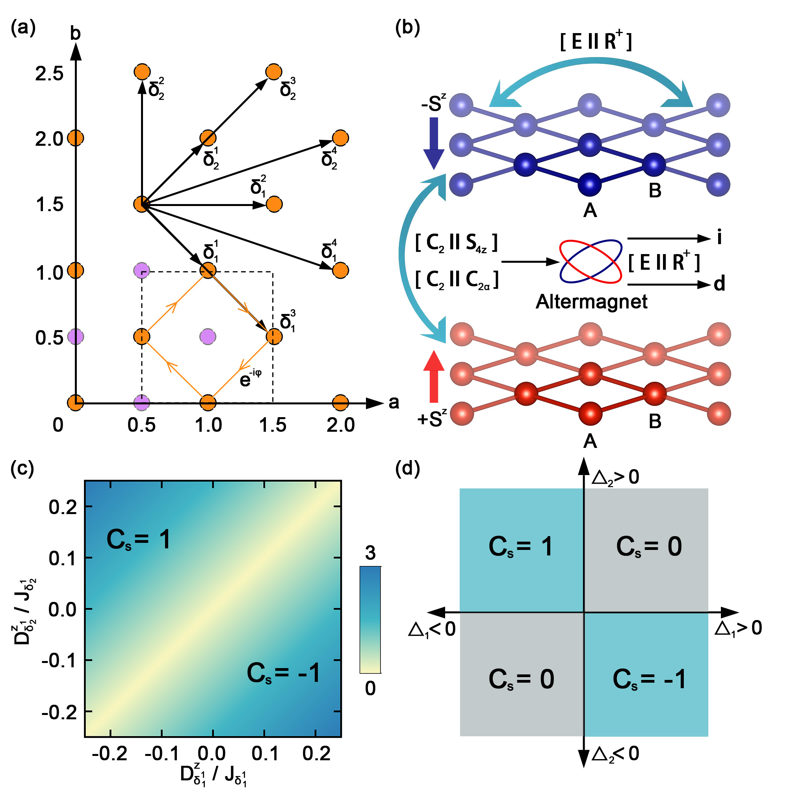
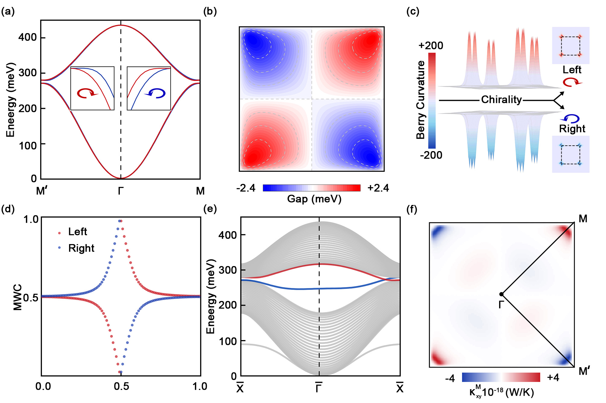
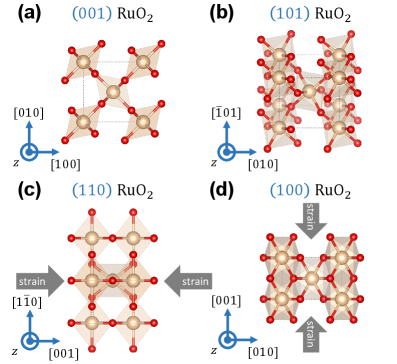
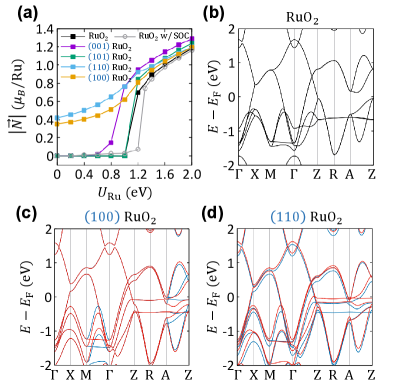
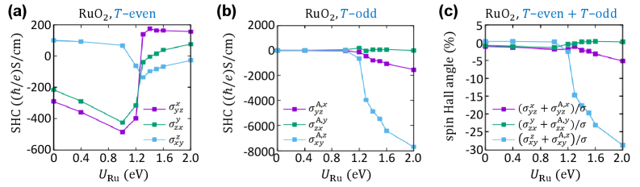

# 2026-03 アルターマグネットにおけるホール効果とトポロジカル物性の新展開

---

## 1. 導入：なぜ今この話題か

磁性体の世界は長らく「強磁性体」と「反強磁性体」という二項対立で整理されてきた。強磁性体は正味の磁化を持ち、電子のスピンが一方向に揃っている。反強磁性体はスピンが交互に反転して正味の磁化はゼロとなる。この分類は教科書的に正しいが、21世紀に入って結晶対称性の視点から磁性を再検討すると、このどちらにも当てはまらない第3のカテゴリが存在することが明らかになってきた——それが**Altermagnet**である。

アルターマグネットは正味の磁化がゼロ（反強磁性的）でありながら、電子のバンド構造が時間反転対称性を破るような**運動量依存のスピン分裂**を示す。この性質は強磁性体にも反強磁性体にも見られない独自のものであり、内部の磁気秩序がスピン格子の「交互（alternating）」パターンと結晶点群の回転対称性の組み合わせから生まれる。CrSb、MnTe、RuO₂などの実在材料がアルターマグネットの候補として次々と同定され、実験・理論・計算の各分野で研究が急加速している。

なぜ今この話題が特に盛んなのか。第一に、異常ホール効果（AHE）を始めとする輸送現象がアルターマグネットで実験的に観測され始め、その起源をめぐる議論が白熱しているからである。従来の常識では「正味磁化がゼロならAHEはゼロ」のはずが、実際には有限のAHEが薄膜MnTeなどで報告されている。第二に、マグノン（スピン波量子）の物理とアルターマグネットの接続が始まっており、トポロジカルなマグノン輸送や磁気誘起ホール効果など新しい概念が提唱されている。第三に、スピントロニクスへの応用として、正味磁化がゼロでありながら強い電気信号（スピンホール電流）が得られるという利点が注目され、RuO₂系での材料探索が活発化している。

これらの進展が相互に絡み合い、2025〜2026年にかけてアルターマグネティズムは凝縮系物理の中でも最もアクティブな話題の一つとなっている。本稿では2026年3月に公開された中心論文を中心に、関連5本のプレプリントを組み合わせながら、「**アルターマグネットにおけるホール効果とトポロジカル物性**」というテーマを多角的に解説する。

---

## 2. 今回の軸となる問い

今回の6本を通して追うべき中心問題は以下の3点である。

**問い①：アルターマグネットではどのような新しいホール効果が現れるのか？**
正味の磁化ゼロという制約の中で、どのような物理的機構がホール電流を生み出すのか。その担い手は電子なのか、マグノンなのか、あるいは表面状態なのか。

**問い②：磁気励起（マグノン）のトポロジーはアルターマグネット固有の性質をどう反映するのか？**
バンド電子のトポロジーと同様に、マグノンも「カイラル（chirality）」や「スピンチャーン数」を持てるのか。そのような位相的性質はどのように観測できるのか。

**問い③：アルターマグネットの物性は材料・界面設計によってどこまで制御できるのか？**
ひずみや表面終端（termination）、層間結合といった材料設計パラメータが輸送・磁気特性をどう変えるのか。実験との比較でどのような矛盾が生じており、それをどう解決するか。

---

## 3. 中心論文の詳細解説

### 論文情報

- **タイトル：** Magnon-Driven Anomalous Hall Effect in Altermagnets
- **著者：** Zheng Liu, Yang Gao, Qian Niu
- **arXiv ID：** 2603.19737
- **カテゴリ：** cond-mat.mes-hall, cond-mat.mtrl-sci
- **公開日：** 2026年3月20日
- **URL：** https://arxiv.org/abs/2603.19737
- **ライセンス：** Creative Commons Attribution 4.0 (CC BY 4.0)

### 主張と新規性

本論文は、アルターマグネットにおける**「マグノン駆動異常ホール効果（Magnon-Driven Anomalous Hall Effect）」**を理論的に提案する。従来の異常ホール効果（AHE）は電子のバンド構造中のベリー曲率に起源を持ち、強磁性体に特有の現象とされてきた。アルターマグネットでは時間反転対称性（$\mathcal{T}$）が破れているが、そのネール秩序（反強磁性的な秩序）の対称性によって静的なAHEが対称性禁止になる場合がある。

本論文の核心的なアイデアは、**コヒーレントに励起されたカイラルマグノン（chiral magnon）が電子運動と結合することで、動的なホール電流を生じさせる**という点にある。つまりマグノン（磁気波）のキラリティーが電子の輸送を左右するという新しいメカニズムである。

*Figure 1. マグノン駆動異常ホール効果の概念図。(a) ネールベクターの歳差運動によって駆動されるホール型応答、(b) アルターマグネットにおけるマグノン駆動AHEの物理的起源。静的なAHEが対称性禁止になっているCrSbの対称性を持つモデルでも、マグノンを介して有限のホール信号が現れることを示す。（出典: arXiv:2603.19737, CC BY 4.0, unmodified）*

### 扱う物質系・手法

中心論文はCrSbの結晶対称性を持つモデルを題材とする。CrSbはプロトタイプのアルターマグネットとして近年注目されており、静的なAHEは対称性によって禁止されている材料系である。理論的手法として**密度行列摂動論（density-matrix perturbation theory）**と対称性解析を組み合わせ、マグノンが励起された状態での電子の応答を計算している。

具体的には、ネールベクターがコヒーレントに歳差運動（precession）をする状況——例えばマイクロ波や光によって磁気共鳴が励起された状態——を考え、その条件下での横方向（ホール）電流を求めている。

### 重要結果

*Figure 2. アルターマグネット最小モデルにおけるマグノン駆動AHE。(a) 六方晶格子の構造、(b) スピン軌道結合なしのバンド構造。スピン依存のフェルミ面とベリー曲率分布（c）、マグノン駆動ホール応答係数の空間分布（d）、フェルミエネルギー依存性（e）、ネールベクターの回転に伴う角度依存性（f）を示す。（出典: arXiv:2603.19737, CC BY 4.0, unmodified）*

主な結果を整理すると以下の通りである。第一に、マグノン駆動AHEはマグノンの歳差運動のキラリティーのみに依存し、その符号は歳差の向きによって反転する。第二に、このメカニズムは静的なAHEとは異なる対称性条件を持ち、静的AHEが禁止されている系でも動的AHEが許容される。第三に、フェルミエネルギーとネールベクターの角度によってホール応答を系統的に制御できる。

### なぜこれが今回の中心か

アルターマグネットの輸送物性の中で「ホール効果はどこから来るか」という問いに対し、「マグノン」という新しい担い手を示したことが斬新である。同じMnTeやCrSb系を扱う関連論文群と組み合わせることで、静的AHE（表面状態起源）と動的AHE（マグノン起源）という複数の機構が並立する豊かな物理像が浮かび上がる。

---

## 4. 関連する5本の論文の解説

### 関連論文①：α-MnTeにおけるスピンテクスチャの実験的検証

- **タイトル：** Discerning ground state and photoemission-induced spin textures in altermagnetic α-MnTe
- **著者：** D. A. Usanov, S. W. D'Souza, A. Dal Din, J. Krempaský, F. Guo, O. J. Amin, C. Polley, M. Leandersson, G. Carbone, B. Thiagarajan, T. Jungwirth, L. Šmejkal, J. Minár, P. Wadley, J. H. Dil
- **arXiv ID：** 2603.16635
- **カテゴリ：** cond-mat.str-el
- **公開日：** 2026年3月17日
- **URL：** https://arxiv.org/abs/2603.16635
- **ライセンス：** CC BY-NC-ND 4.0

#### 中心論文との関係

中心論文が理論・計算によってマグノン駆動AHEという新機構を提案するのに対し、本論文は**実験**の立場からアルターマグネットのスピン構造を直接観測する。材料はα-MnTe——アルターマグネットの最有力候補の一つ——であり、スピン分解光電子分光（SARPES: Spin- and Angle-Resolved Photoemission Spectroscopy）を用いてバンド分散中のスピン偏極パターンを測定している。

#### 何を付け加えるか

本論文の重要な貢献は、「測定されたスピンテクスチャが必ずしも物質の基底状態を直接反映しない」という警告である。光電子分光では光子が電子を励起する過程（光電効果）自体が余分なスピン偏極を誘起することがあり（光電子放出誘起スピンテクスチャ）、これを基底状態のスピン分裂と区別することが難しい。著者らは第一原理計算と一段階光電子放出シミュレーションを組み合わせてこの問題を詳細に解析し、適切な実験条件（光子エネルギー、光偏光、ドメイン配向）を指定することで真のアルターマグネティックスピン分裂を取り出せることを示した。

*Figure 1. α-MnTeのアルターマグネティックd波様スピン分裂の対称性の図示。逆格子空間における面外スピン偏極の対称性パターンと高対称点を示す。（出典: arXiv:2603.16635, CC BY-NC-ND 4.0, unmodified）*

*Figure 2. SARPESによって測定されたスピン分解光電子スペクトル（上部）と計算との比較（下部）。磁気ドメインの配向と光偏光の条件を系統的に変えることで、基底状態由来のスピンテクスチャと光電子放出プロセス由来の成分を分離する。（出典: arXiv:2603.16635, CC BY-NC-ND 4.0, unmodified）*

#### この論文を入れることで何が深まるか

実験がどこまでアルターマグネティズムを「直接見ている」のかという方法論的な問いを導入することで、議論の精度が上がる。中心論文が予測するマグノン駆動AHEも、将来の実験検証においてこのような「測定アーティファクト」の問題に直面する可能性があり、本論文はその模範的な対処法を示している。

---

### 関連論文②：MnTe薄膜における表面状態起源の異常ホール効果

- **タイトル：** Emergent Anomalous Hall Effect from Surface States in the Altermagnet MnTe Thin Films
- **著者：** Yufei Zhao, Saswata Mandal, Chao-Xing Liu, Binghai Yan
- **arXiv ID：** 2603.12259
- **カテゴリ：** cond-mat.mtrl-sci, cond-mat.mes-hall
- **公開日：** 2026年3月12日
- **URL：** https://arxiv.org/abs/2603.12259
- **ライセンス：** CC BY 4.0

#### 中心論文との関係

本論文は中心論文と同じ「アルターマグネットにおけるAHE」というテーマを扱うが、機構が全く異なる。中心論文はマグノン（動的励起）を担い手とするのに対し、本論文は**バルクギャップ中の表面状態（surface states）**が低温・低エネルギーのAHEを支配することを第一原理計算で示す。

#### 何を付け加えるか

実験で観測されているMnTe薄膜のAHEは矛盾した報告が多く、符号や大きさが試料依存であるという問題があった。著者らはこの矛盾の原因として**表面化学（surface chemistry）の違い**を特定した。TeキャッピングがあるとAHEの符号がInP基板上の場合と逆転することを計算で示し、界面設計がホール応答を決定的に変えることを明らかにした。

*Figure 1. MnTeのスピン軌道結合を含む表面バンド構造（Te終端）。バルクバンドとギャップ内表面状態の対応を示す。バルクのg波様スピンテクスチャと表面の完全スピン偏極という対比が読み取れる。（出典: arXiv:2603.12259, CC BY 4.0, unmodified）*

*Figure 2. 各種終端（Te/Te, Te/Mn, Mn/Mn）の薄膜における膜厚・エネルギー依存性の異常ホール伝導率。薄膜では表面の寄与がバルクを圧倒することが示されている。（出典: arXiv:2603.12259, CC BY 4.0, unmodified）*

*Figure 3. 層分解した異常ホール伝導率のプロファイル（厚いTe-MnTe-Mn スラブ）。AHEは界面・表面近傍の数層に集中していることが示されている。（出典: arXiv:2603.12259, CC BY 4.0, unmodified）*

#### この論文を入れることで何が深まるか

「アルターマグネットのAHEはバルクか表面か」という問いに、明確な「表面が支配的」という答えを出した。この知見は中心論文のマグノン駆動AHEと対比的に考えると、「静的・低温では表面状態が支配的だが、マイクロ波照射などでマグノンを励起した状態では動的なマグノン機構も生きてくる」という整合的な描像を提供する。

---

### 関連論文③：二層アルターマグネットにおけるマグノニック量子スピンホール効果

- **タイトル：** Magnonic Quantum Spin Hall Effect with Chiral Magnon Transport in Bilayer Altermagnets
- **著者：** Bo Yuan, Yingxi Bai, Ying Dai, Baibiao Huang, Chengwang Niu
- **arXiv ID：** 2601.21172
- **カテゴリ：** cond-mat.mtrl-sci
- **公開日：** 2026年1月29日
- **URL：** https://arxiv.org/abs/2601.21172
- **ライセンス：** CC BY 4.0

#### 中心論文との関係

中心論文がマグノンと電子の**混成（結合）**によるAHEを論じるのに対し、本論文は**マグノンのみのトポロジカル物性**、すなわちマグノニック量子スピンホール効果（Magnonic QSHE）を扱う。マグノンを「ボゾン版電子」として捉えてトポロジカルバンド理論を適用するアプローチであり、スピンチャーン数が整数値を取るヘリカルエッジ状態を予測する。

#### 何を付け加えるか

著者らは二層アルターマグネットV₂WS₄を題材に、d波型アルターマグネティズムが非ゼロのスピンチャーン数（$C_s = 1$）を持つマグノニック位相を実現することを示す。このヘリカルエッジ状態は散逸のない（dissipationless）スピン電流を担う「スピントロニクスの高速道路」として機能しうる。

*Figure 1. 二層アルターマグネットモデルの構造と位相図。チェッカーボード副格子を持つ二層系の模式図（上）と、DMI（ジャロシンスキー・守谷相互作用）と交換相互作用のパラメータ空間における磁気位相図（下）。アルターマグネティックな秩序がトポロジカル相を支持する領域が示されている。（出典: arXiv:2601.21172, CC BY 4.0, unmodified）*

*Figure 2. V₂WS₄二層のマグノニックバンド構造。キラリティーで着色されたカイラルマグノンバンド（上）、スピン分裂エネルギーのベリー曲率分布（中）、スピンチャーン数を示すワニエセンターの進化（下）。$C_s = 1$ のトポロジカル相が確認できる。（出典: arXiv:2601.21172, CC BY 4.0, unmodified）*

#### この論文を入れることで何が深まるか

「マグノン＋アルターマグネット＝トポロジカル」という方程式を電子系とは独立に確立する。中心論文との比較で、アルターマグネット中のマグノン物理には（i）電子との混成を通じた動的AHE（中心論文）と（ii）純粋なマグノントポロジー（本論文）という2つの側面があることが明確になる。

---

### 関連論文④：RuO₂薄膜におけるひずみ誘起アルターマグネティックスピン分裂

- **タイトル：** Strain-Driven Altermagnetic Spin Splitting Effect in RuO₂
- **著者：** Seungjun Lee, Seung Gyo Jeong, Jian-Ping Wang, Bharat Jalan, Tony Low
- **arXiv ID：** 2602.11602
- **カテゴリ：** cond-mat.mtrl-sci
- **公開日：** 2026年2月12日
- **URL：** https://arxiv.org/abs/2602.11602
- **ライセンス：** CC BY 4.0

#### 中心論文との関係

中心論文はCrSbのモデルを題材に使い、MnTe関連論文はMnTeを扱う。本論文は別の材料系、**RuO₂**に焦点を当てる。RuO₂は当初アルターマグネットの有力候補として提案されたが、その後多くの研究でバルク状態では非磁性であるという結果が出て混乱が生じていた。本論文はこの矛盾を「**基板から受けるひずみ**がアルターマグネティズムを誘起する」という機構によって解決する。

#### 何を付け加えるか

第一原理計算（DFT+U）を用い、TiO₂基板上に成膜されたRuO₂薄膜では（110）および（100）配向の試料において圧縮ひずみがネールベクターを誘起することを示す。一方、（001）、（101）配向では非磁性のままである。この配向依存性が過去の実験結果の矛盾（磁性あり vs. 磁性なし）を定量的に説明する。

*Figure 1. 各配向（(001), (101), (110), (100)）のRuO₂薄膜の結晶構造（上段）と、ハバードUパラメータに対するネールベクターの大きさ（下段）。(110)・(100)配向のみでひずみによる磁化が誘起されることが示されている。（出典: arXiv:2602.11602, CC BY 4.0, unmodified）*

*Figure 2. TiO₂基板上に完全ひずみした各配向RuO₂のネールベクター大きさのU依存性（上）と代表的なバンド構造（下）。ひずみによってアルターマグネティックスピン分裂が誘起・増強される様子がバンド構造に反映されている。（出典: arXiv:2602.11602, CC BY 4.0, unmodified）*

*Figure 3. バルクRuO₂の時間反転偶・奇スピンホール伝導率（SHC）とスピンホール角のU依存性。アルターマグネティックな秩序に由来する$\mathcal{T}$奇SHCがひずみ誘起磁性の近傍で増大する。（出典: arXiv:2602.11602, CC BY 4.0, unmodified）*

#### この論文を入れることで何が深まるか

アルターマグネティズムが**材料固有の性質ではなく、外部制御（ひずみ、界面）によって誘起・チューニングできる**ことを示す。RuO₂という材料はすでにスパッタリング等で薄膜成膜の技術が成熟しており、デバイス応用への道筋が見えやすい。関連論文②のMnTeにおける界面効果とあわせると、「界面・ひずみエンジニアリングでアルターマグネット特性を設計する」という設計原理が浮かび上がる。

---

### 関連論文⑤：アルターマグネットにおけるコーナー状態と例外点の制御

- **タイトル：** Tailoring Corner States and Exceptional Points in Altermagnets
- **著者：** Xiao-Ming Zhao, Cui-Xian Guo, Xin-Ran Ma, Xiao-Ran Wang, Su-Peng Kou
- **arXiv ID：** 2603.19378
- **カテゴリ：** cond-mat.mes-hall
- **公開日：** 2026年3月19日
- **URL：** https://arxiv.org/abs/2603.19378
- **ライセンス：** arXiv非独占配布ライセンス（図の再利用不可、本文のみ参照）

*※本論文の図はライセンス上の制約により本稿には掲載しない。文章による解説のみ行う。*

#### 中心論文との関係

本論文はアルターマグネットに**非エルミート物理（Non-Hermitian physics）**を組み合わせるという、もう一段階踏み込んだ理論的展開を論じる。中心論文や関連論文①〜④がエルミートな（散逸なし）ハミルトニアンを扱うのに対し、本論文は**解離（dissipation）**を持つ開放系を考え、そこに現れるトポロジカルコーナー状態と**例外点（Exceptional Points）**を議論する。

#### 何を付け加えるか

著者らは、解離が局所的な磁気テクスチャに「ロック」されている（つまり解離が一様でなく磁気副格子に整合した虚部の交換場を生成する）ことで、通常の反強磁性体には見られないトポロジカル相転移が起きることを示す。この非エルミート位相では、「**ハイブリッドスキン-トポロジカルモード**」と呼ばれる境界状態が現れ、その局在位置は結晶の端の副格子終端の種類によって決定的に制御できる。さらに、例外点のアニヒレーション・生成がアルターマグネティックなd波非等方性によって拘束されることも解析的に証明している。

#### この論文を入れることで何が深まるか

現実の磁性体は常に何らかの散逸（フォノン散乱、スピン緩和等）を伴う。この論文は「散逸の存在がアルターマグネットのトポロジカル物性に与える影響」を正面から扱い、「散逸が敵ではなく新たな位相を生む源泉になりうる」という視点を提供する。スピントロニクスデバイスの実際の動作では散逸は避けられないため、非エルミートアルターマグネットの理解は応用上も重要になりうる。

---

## 5. 6本を通じた比較と整理

### 共通して見えてきたこと

6本の論文が共通して浮かび上がらせるのは、「**アルターマグネットはその対称性の多様さゆえに、同じ"ホール効果"という言葉の下に複数の異なる機構が潜む**」という事実である。MnTeというほぼ同じ材料系を扱いながら、中心論文はマグノン、関連論文②は表面状態というまったく異なる担い手を議論している。これは矛盾ではなく、実験条件（温度、周波数、膜厚、終端）によって支配的な機構が切り替わることを意味している。

### 一致している点

全6本が異口同音に強調するのは、**結晶対称性（特に空間反転対称性の欠如ではなく、磁気点群の回転対称性）がスピン物性の鍵**であるという点だ。アルターマグネットのスピン分裂は時間反転（$\mathcal{T}$）の破れと空間回転（$C_n$）の組み合わせによって保護されており、この対称性の特殊さが「正味磁化ゼロ＋有限スピン分裂」というパラドックスを正当化する。RuO₂でも、MnTeでも、V₂WS₄でも、この対称性論が中心にある。

### 食い違っている点

RuO₂に関しては、本論文群も含めて「磁性があるかないか」の議論が続いている。関連論文④は「ひずみがあれば磁性が出る」という結論だが、実験的には観測されたスピンホール信号の解釈が一意ではない。α-MnTeのスピンテクスチャについても、関連論文①が「光電子分光では必ずしも基底状態を直接見ていない」と警告しており、過去の多くの実験データの再解釈が必要になりうる。

### 手法による見え方の違い

| 手法 | 関連論文 | 何が見えるか |
|------|----------|-------------|
| SARPES実験 | 2603.16635 | スピン分裂バンド構造（ただし光電子効果の補正が必要） |
| 第一原理計算 | 2603.12259, 2602.11602 | 表面状態・ひずみ依存性・界面効果 |
| 密度行列摂動論 | 2603.19737 | マグノンと電子の動的応答 |
| トポロジカルバンド論 | 2601.21172 | マグノニックチャーン数・エッジ状態 |
| 非エルミート理論 | 2603.19378 | 散逸存在下のコーナー状態・例外点 |

### 未解決な点・今後重要になりそうな論点

1. **マグノン駆動AHEの実験的観測**：中心論文の予測は理論的に明確だが、実際にマイクロ波でマグノンを励起しながらホール電流を測定するという実験は未実施である。CrSbやMnTeでのポンプ-プローブ実験が待たれる。

2. **表面状態 vs. バルク寄与の分離**：薄膜では表面が支配的（関連論文②）だが、バルク単結晶ではバルク機構が無視できない。厚みに依存した測定で明確に分離できるか。

3. **RuO₂の磁性の確定**：ひずみで誘起された磁性が実際にスピン分裂バンドをもたらすかを中性子散乱やXMCDで直接確認する実験が必要である。

4. **非エルミート効果の実測**：理論的に予言されたコーナー状態や例外点を磁性体で実際に観測した例はまだ少なく、アルターマグネットでの実証が今後の課題となる。

---

## 6. 学部4年生向けの基礎解説

### アルターマグネットとは何か

磁性体を分類するとき、最も基本的な量は「正味の磁化（magnetization）$M$」である。強磁性体では $M \neq 0$、反強磁性体では $M = 0$ である。アルターマグネットは $M = 0$ であるという点で反強磁性的だが、**スピンアップのサイトとスピンダウンのサイトが結晶対称性（回転・鏡映など）で関係づけられているが、空間反転（inversion）によっては関係づけられない**という特殊な構造を持つ。

この結果、電子のバンド構造は時間反転対称性 $\mathcal{T}$ を破るにもかかわらず、空間反転の対称性 $\mathcal{P}$ も破れているように見えない。具体的には、$k$ 空間でのスピン分裂が

$$E_\uparrow(\mathbf{k}) \neq E_\downarrow(\mathbf{k}), \quad E_\sigma(\mathbf{k}) = E_\sigma(-\mathbf{k})$$

という性質を持つ（偶関数的なスピン分裂）。通常の強磁性スピン分裂は $E_\uparrow(\mathbf{k}) \neq E_\downarrow(\mathbf{k})$ かつ $E_\sigma(\mathbf{k}) \neq E_\sigma(-\mathbf{k})$ だが、アルターマグネットはd波、g波などの**偶パリティ型スピン分裂**を示す。

### 異常ホール効果（AHE）の基礎

通常のホール効果は磁場 $B$ をかけたときに電圧（ホール電圧）が横方向に現れる現象で、$\rho_{xy} \propto B$ である。これに対し、強磁性体では磁場なしに磁化 $M$ に比例したホール抵抗が現れる——これが**異常ホール効果（Anomalous Hall Effect, AHE）**である。

AHEの微視的起源はバンド電子の**ベリー曲率（Berry curvature）** $\Omega_n(\mathbf{k})$ に帰着する：

$$\sigma_{xy} = -\frac{e^2}{\hbar} \sum_n \int_{\text{BZ}} f_n(\mathbf{k}) \, \Omega_n(\mathbf{k}) \, \frac{d^3k}{(2\pi)^3}$$

ここで $f_n(\mathbf{k})$ はフェルミ分布関数、$\Omega_n(\mathbf{k}) = -2 \,\mathrm{Im} \sum_{n' \neq n} \frac{\langle n\mathbf{k}|v_x|n'\mathbf{k}\rangle\langle n'\mathbf{k}|v_y|n\mathbf{k}\rangle}{(E_n - E_{n'})^2}$ はバンド$n$の$z$方向ベリー曲率である。

通常の反強磁性体では $\mathcal{T}$ 対称性があれば $\sigma_{xy} = 0$ だが、アルターマグネットでは $\mathcal{T}$ が破れているためバンド構造にベリー曲率が生まれる。ただし対称性によっては全ベリー曲率の積分がゼロになってAHEが禁止される場合もある——中心論文のCrSbモデルがまさにこの状況であり、静的AHEはゼロだがマグノンを介した動的AHEはゼロでないことが示された。

### マグノンとは何か

マグノン（magnon）はスピン波（spin wave）の量子、すなわちスピンの集団振動の量子化された1粒子状態である。フォノンが格子振動の量子であるのと同様に、マグノンは磁気秩序の乱れ（スピンの揺らぎ）の量子として定義される。ボゾンとして扱われ、エネルギー分散 $\omega(\mathbf{k})$ を持つ。

マグノンのキラリティー（chirality）とは、スピンの歳差運動の回転方向のことである。左巻き（反時計回り）と右巻き（時計回り）のマグノンを区別すると、アルターマグネット中ではこの2種類のマグノンが異なるエネルギーを持つ（カイラルスピン分裂）。中心論文では、このカイラルマグノンが電子に結合することで横方向のホール電流を誘起することを示した。

### 誤解しやすい点

**「アルターマグネットは反強磁性体の一種か？」** ——答えは「見方による」。正味磁化がゼロという意味ではYes、しかし時間反転対称性を破るスピン分裂バンドを持つという意味ではNOである。伝統的な反強磁性体（例：NiO）はバンドがスピン縮退しているが、アルターマグネットでは縮退が解ける。

**「AHEはアルターマグネットでは常にゼロか？」** ——答えはNO。対称性によっては禁止されない場合もある（MnTe表面など）。禁止される場合でも、本稿の中心論文のようにマグノンを介した動的AHEは存在しうる。

---

## 7. 重要キーワード10個の解説

### キーワード①：アルターマグネット（Altermagnet）

正味磁化がゼロでありながら、電子バンドが運動量依存のスピン分裂を示す第3の磁気秩序相。結晶点群の回転対称性（鏡映や回転）がスピンアップ副格子とスピンダウン副格子を互いに移し合うが、空間反転では移し合えない構造を持つ。この条件のもとでスピン分裂は偶パリティ（d波、g波型）となり、$E_\sigma(\mathbf{k}) = E_\sigma(-\mathbf{k})$ が成立する。強磁性体（$M \neq 0$、バンドは運動量によらず均一にスピン分裂）・通常の反強磁性体（$M = 0$、バンド縮退）と区別される。代表的な材料としてMnTe、CrSb、RuO₂、MnF₂などが挙げられる。本稿の6本すべてにおける舞台設定となる概念である。

### キーワード②：異常ホール効果（Anomalous Hall Effect, AHE）

磁化や磁気秩序に起因して、外部磁場なしに横方向ホール電流が流れる現象。$\rho_{xy} = R_0 B + R_s M$ の形で表され、第2項が異常成分。微視的起源はブロッホ電子のベリー曲率の $k$ 空間積分であり、バンド構造が時間反転対称性を破ることが必要条件。強磁性体でよく知られるが、アルターマグネットでも表面状態（関連論文②）やマグノン機構（中心論文）を通じて発現する。反強磁性体の磁気秩序研究の間接的プローブとしても利用される。

### キーワード③：ベリー曲率（Berry Curvature）

運動量空間上でのブロッホ波動関数の「曲率」。バンド$n$の $k$ 点における Berry 曲率は $\Omega_n(\mathbf{k}) = \nabla_\mathbf{k} \times \mathcal{A}_n(\mathbf{k})$ で定義され、$\mathcal{A}_n = i\langle u_{n\mathbf{k}}|\nabla_\mathbf{k}|u_{n\mathbf{k}}\rangle$ はベリー接続（Berry connection）。ベリー曲率の $k$ 空間積分がバンドのチャーン数を与え、ゼロ以外であれば量子化されたホール電流が生じる（量子異常ホール効果）。本稿の文脈では、時間反転対称性の破れたアルターマグネットでベリー曲率が非自明な分布を持ち、AHEやトポロジカルマグノン物性の起源となる。

### キーワード④：マグノン（Magnon）

磁気秩序（強磁性・反強磁性）の集団振動モードの量子。スピンが整列した基底状態からの微小な偏差（スピン波）を量子化したものであり、フォノンの磁気版に相当するボゾン準粒子。エネルギー分散 $\omega(\mathbf{q})$ を持ち、低温での熱容量やスピン輸送に寄与する。中心論文では「カイラルマグノン」——歳差運動に右巻き/左巻きのキラリティーを持つマグノン——がアルターマグネットの電子と結合してホール電流を誘起することが示された。関連論文③では二層アルターマグネットのトポロジカルマグノンが量子スピンホール効果に類似した境界状態を持つことが示される。

### キーワード⑤：スピンホール効果（Spin Hall Effect, SHE）とアルターマグネット型SHE

電荷電流が流れると横方向にスピン電流が生じる効果。通常のSHEはスピン軌道結合を持つ非磁性体でも起きる（$\mathcal{T}$偶型）。一方、アルターマグネットでは磁気秩序に起因する時間反転奇（$\mathcal{T}$奇）SHCも発現する。関連論文④では、RuO₂において通常の$\mathcal{T}$偶SHCとアルターマグネット由来の$\mathcal{T}$奇SHCが同時に存在し、ひずみによって後者が増強されることが示された。両者を実験で区別するには磁場中の詳細測定が必要で、アルターマグネット固有のスピントロニクス機能を検出するための重要な指標となる。

### キーワード⑥：スピン分解角度分解光電子分光（SARPES）

通常の角度分解光電子分光（ARPES）に加え、放出された光電子のスピン偏極を測定する実験手法。スピン分裂したバンド構造を $k$ 空間で直接可視化できる。アルターマグネットの「運動量依存スピン分裂」の直接証拠を得るための最有力手法の一つ。ただし関連論文①が詳細に示したように、光電効果プロセス自体（光偏光、行列要素効果）がスピン偏極に寄与するため、基底状態の純粋なスピン分裂を取り出すには系統的な光子エネルギー・偏光依存測定と理論計算との比較が不可欠である。

### キーワード⑦：ネールベクター（Néel Vector）

反強磁性体・アルターマグネットにおける磁気秩序の向きを表すベクトル $\mathbf{L} = \mathbf{M}_A - \mathbf{M}_B$（A副格子とB副格子の磁化の差）。強磁性体の磁化ベクトルに対応するが、$\mathbf{L}$ は時間反転で符号が変わる（$\mathcal{T}$奇）。アルターマグネットのスピン分裂やホール効果はネールベクターの向きに依存し、ネールベクターを外場で制御することが「アルターマグネットスイッチング」の基礎となる。中心論文のマグノン駆動AHEでは、ネールベクターの歳差運動がマグノン励起に対応し、その角度と周波数がホール応答を決める。

### キーワード⑧：非エルミート物理と例外点（Non-Hermitian Physics and Exceptional Points）

量子力学の通常の枠組みでは、ハミルトニアンはエルミートであり固有値は実数である。しかし開放系（散逸のある系）や利得・損失を持つ系はエルミートでないハミルトニアンで記述されることがある。この場合、固有値は複素数となり、**例外点（Exceptional Points）**と呼ばれる特殊なパラメータ値で2つ以上の固有値と固有ベクトルが同時に縮退する。例外点の近傍では電磁波センシングの劇的な増感など特異な応答が生じる。関連論文⑤はアルターマグネット特有の磁気テクスチャがこのような非エルミート効果と「ロック」する新しい位相を生み出すことを理論的に示した。

### キーワード⑨：スピンチャーン数（Spin Chern Number）

電子系の量子スピンホール効果を特徴づける位相的不変量の磁気版。スピン $z$ 成分が良い量子数である（$S_z$ 保存）条件下で、スピンアップとスピンダウンの部分空間それぞれのチャーン数の差として定義される：$C_s = (C_\uparrow - C_\downarrow)/2$。$C_s \neq 0$ ならヘリカルエッジ状態が存在し、スピンアップ電子が右方向、スピンダウン電子が左方向に流れる（または逆）。関連論文③ではこの概念をマグノン系に拡張し、V₂WS₄二層アルターマグネットのマグノンが $C_s = 1$ を実現することを示した。この位相的に保護されたマグノンエッジ状態は散逸のないスピン輸送チャンネルとして機能しうる。

### キーワード⑩：ひずみエンジニアリング（Strain Engineering）

薄膜成膜において基板との格子定数のミスマッチを利用し、意図的にひずみをかけることで材料の物性を制御する手法。エピタキシャル成膜で格子整合が取れない場合、薄膜には基板の格子定数に合わせた圧縮または引張りひずみが加わる。磁性体では、ひずみがスピン軌道相互作用・結晶場・対称性に影響を与えることで磁気異方性・磁化の大きさ・磁気秩序の有無自体を変えることができる。関連論文④ではひずみがRuO₂の非磁性→アルターマグネット転移を引き起こすことを示し、ひずみを「アルターマグネティズムのスイッチ」として利用できる可能性を示唆した。

---

## 8. まとめ

一言で言えば、本稿のテーマは「**アルターマグネットという第3の磁気秩序が持つ多彩なホール効果・トポロジカル物性の全貌解明**」である。正味磁化がゼロという制約の中で、運動量依存のスピン分裂という独特の電子構造がいかに豊かな物理現象を生み出すかを、6本の論文が相補的に明らかにした。

中心論文（arXiv:2603.19737）は特に印象深い貢献をしている。静的AHEが対称性禁止になっているアルターマグネットでも、カイラルマグノンを励起することで動的AHEが生じるというメカニズムは、「どの観測量のどの成分が対称性に守られているのか」という問いに対する鋭い回答であり、今後のアルターマグネット研究の方向性を示す試金石となる。

最近の関連論文群を合わせて見ると、分野は2つの方向へ向かっていると言える。一方は「**実験による確定**」——α-MnTeのSARPES実験（2603.16635）やRuO₂の系統的薄膜研究（2602.11602）が示すように、アルターマグネティズムの実験的シグネチャーを確実に特定するための精密測定が急務である。もう一方は「**機能探索**」——マグノニックQSHE（2601.21172）や非エルミートコーナー状態（2603.19378）が示す通り、スピントロニクス・デバイス応用に直結するトポロジカル保護状態の実現が理論的に続々と提案されている。

この分野をさらに深く理解するために次のステップとして勧めるのは、まず磁気点群・スピン空間群の対称性解析（Šmejkalらのレビュー論文、2022年Nature Reviews Physics）を押さえ、次いでトポロジカルバンド理論の基礎（Berryphase、チャーン数）を固めることである。さらにSARPES実験の実際の測定プロセスと解釈の難しさ（行列要素効果）を理解すると、本稿の論文群がなぜここまで測定条件の詳細にこだわるかが腑に落ちるだろう。

---

*記事作成日：2026-03-23*
*ライセンス情報：本稿の図はすべて原論文のCC BY 4.0またはCC BY-NC-ND 4.0ライセンスのもとで使用（unmodified）。各図のキャプションにライセンスおよび出典を明記。2603.19378の図はarXiv非独占配布ライセンスのため非掲載とし、文章による説明に限定した。*
