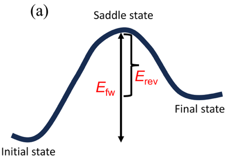
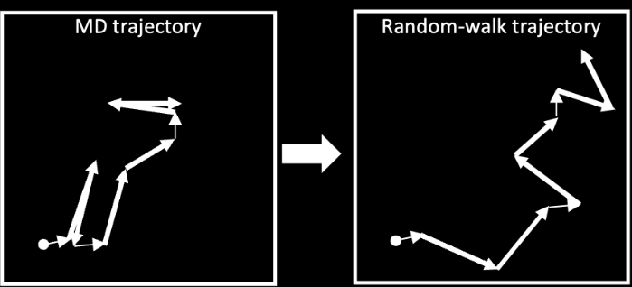
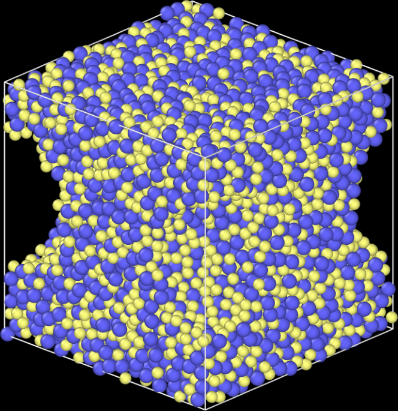
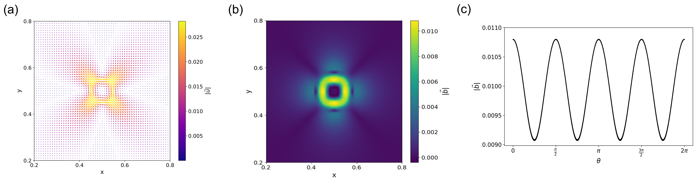
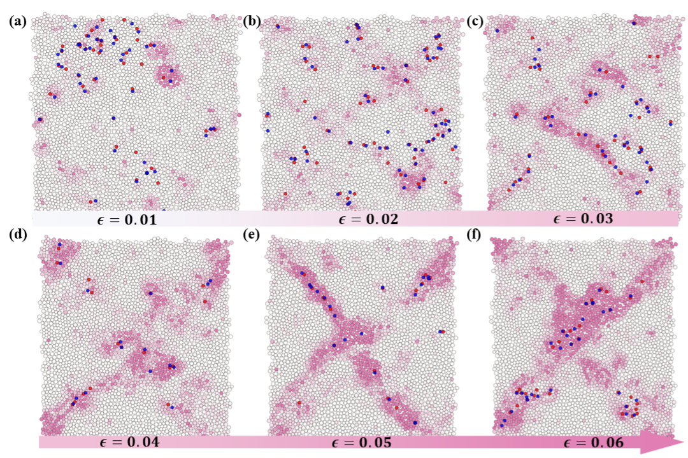
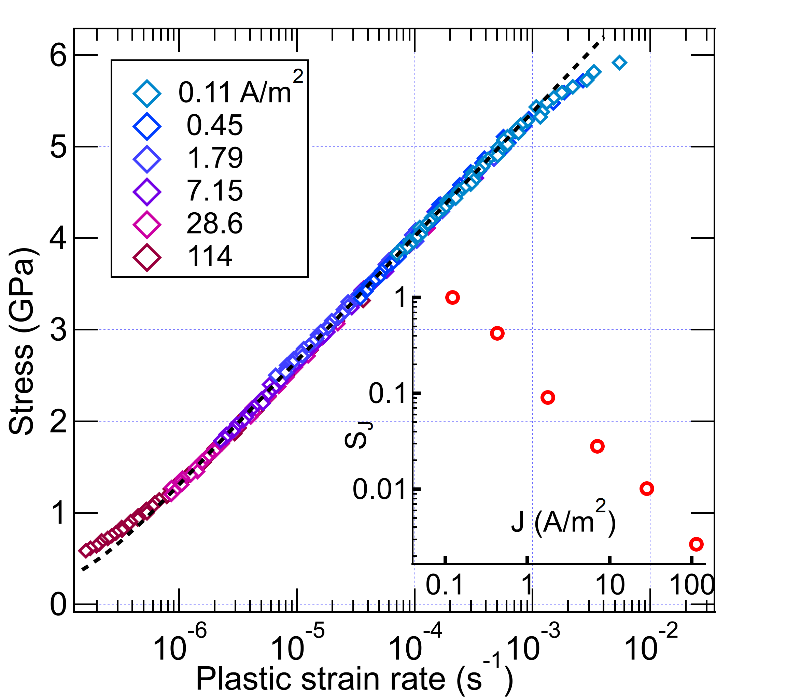
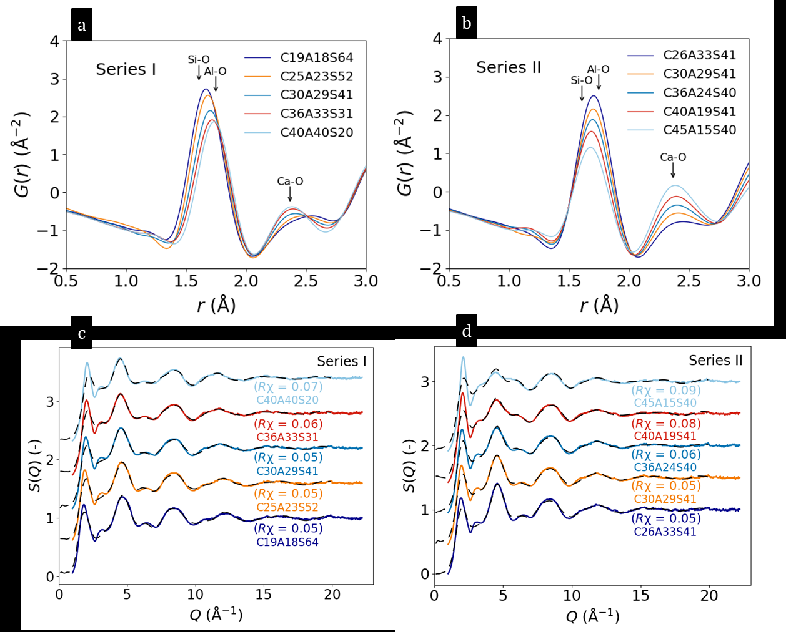

# アモルファス固体のエネルギーランドスケープと力学特性
## ― 非対称拡散障壁が解き明かす構造・動力学・変形の連関 ―

- **執筆日**: 2026-03-24
- **トピック**: amorphous-energy-landscape
- **Primary broad area**: 材料創製・プロセス
- **Secondary broad area**: 非平衡ダイナミクス
- **注目論文**: arXiv:2603.18317
- **参照した関連論文数**: 6本

---

## 1. 導入：なぜ今、アモルファス固体のエネルギーランドスケープに注目するのか

アモルファス固体（非晶質固体）は、ガラスウィンドウや光ファイバー、金属ガラス製品、半導体デバイスの絶縁膜など、私たちの身の回りに溢れている材料である。にもかかわらず、その「なぜ固いか」「どこで折れるか」「どのように流れるか」という力学特性は、結晶材料と比べて驚くほど理解が浅い。

結晶材料では、原子は周期的に配列しており、転位（ dislocation）という欠陥が塑性変形を担うというクリアな描像がある。しかしアモルファス材料には、そもそも「格子」が存在しない。原子配列は局所的な短距離秩序を持ちながらも、長距離では完全にランダムだ。このため、「どの原子が、いつ、どの方向に動いて変形が起こるか」を予測することは、長年にわたって材料科学の未解決問題の一つであり続けてきた。

この問いに答えるための概念的枠組みとして、ポテンシャルエネルギーランドスケープ（Potential Energy Landscape, PEL）という概念が1980年代後半から注目されてきた。PELとは、N個の原子からなる系の全ポテンシャルエネルギーを、$3N$ 次元の構造空間上の「地形」として描いた概念図である。谷底（local minimum）は安定な原子配置（固有構造, inherent structure）に対応し、その間の峠（saddle point）を越える活性化過程が、拡散や塑性変形に対応する。

ではなぜ今、あらためてこの枠組みが重要なのか。答えは二つある。

第一に、**分子動力学（MD）シミュレーションの計算能力と機械学習ポテンシャル（MLIP）の急速な発展**により、ナノ秒・ナノメートルスケールの原子運動を高精度かつ大規模に追跡できるようになったことである。これにより、拡散・粘性・塑性変形を原子レベルで直接観察し、エネルギー障壁の統計的特性を系統的に調べることが可能になった。

第二に、**実験的計測技術の革新**——特に電子線照射を制御変数として使う手法や、ナノビーム電子回折による局所構造解析の精緻化——により、アモルファス材料の構造と力学応答の関係を直接的に検証する道が開かれてきたことである。

2026年3月、カリフォルニア大学とウィスコンシン大学マディソン校のグループは、「非対称なエネルギー障壁が相関運動を介してガラスの拡散を支配する」という新しい知見をarXivに発表した（arXiv:2603.18317）。この論文は「局所的な障壁の高さ」ではなく「前進障壁と後退障壁の非対称性」が拡散の活性化エネルギーを規定するという、従来の直感に反する発見を示している。そして驚くべきことに、この知見は金属ガラス、シリカガラス、Lennard-Jonesガラスという化学的に全く異なる三種類のアモルファス系に共通して成り立つという。

本稿では、この注目論文を核として、アモルファス固体における拡散・粘性流動・塑性変形を統一的に理解するための最新の研究動向を解説する。ランドスケープの幾何学が原子運動をどう制約するか、その制約が力学変形においてどう現れるか、そしてそれを直接観察・利用する実験的アプローチはどこまで来ているかを、順を追って見ていこう。

---

## 2. 解決すべき問い

アモルファス固体の構造と力学特性をつなぐ研究が目指す問いは、大きく三つに整理できる。

**問い1：なぜ低障壁の局所再配列が、巨大な活性化エネルギーをもつ拡散につながるのか？**

ガラスの中では、個々の原子が近傍原子と入れ替わる際に越える障壁（局所障壁）は、数百メV（メガ電子ボルト）程度であることが多い。しかし、拡散係数 $D$ を温度依存性から読み出すと、見かけの活性化エネルギーは1〜2 eVにも達する。なぜ「小さな山をたくさん越える過程」が「大きな山を越える過程」と同等になるのか？この謎は長年未解決であった。

**問い2：原子スケールの局所再配列は、どのように集団化して「塑性変形」へと成長するか？**

結晶では転位という集団的なキャリアが存在する。アモルファスでは？ せん断変換帯（Shear Transformation Zone, STZ）という概念が提案されているが、それがトポロジカルに定義できるか、どう空間的に相関するかは、ここ数年急速に明らかになりつつある。

**問い3：ガラスの種類（酸化物ガラス、金属ガラス、コロイド系）を超えて、普遍的な力学応答の枠組みは存在するか？**

シリカガラスは Si-O 結合が強固なネットワークを形成し、金属ガラスは密充填した金属原子の集合体だ。コロイドガラスはサブミクロン粒子の懸濁液である。これらは化学的に全く異なるが、塑性変形の様式に共通点はあるのか？ もしあるとすれば、それはどのような構造的・幾何学的要因が支配しているのか？

これらの問いは互いに絡み合っており、「PELの統計的性質」「局所再配列のトポロジー」「実験的観察手法」という三つの軸で同時に進展しつつある。

---

## 3. 注目論文は何を新しく示したのか

### 非対称エネルギー障壁と相関運動（arXiv:2603.18317）

Annamareddy ら（2026）の論文の中心的主張を理解するには、まず「相関因子」という概念を押さえる必要がある。

原子がランダムウォーク（前の移動方向に無関係にランダムに跳ぶ）をするなら、拡散係数は単純に $D_{\rm rw} = \lambda^2 / (6\tau)$（$\lambda$：跳び距離、$\tau$：平均滞在時間）と書ける。しかし実際のガラス中の原子は、「一歩前進してから、また元に戻る」という前後相関のある運動をしやすい。この効果を表すのが相関因子 $f$ であり、実際の拡散係数は

$$D = f \cdot D_{\rm rw}$$

と分解できる（$0 < f \leq 1$）。$f=1$ は完全なランダムウォーク、$f < 1$ は後退運動の影響で拡散が抑制されていることを意味する。

同論文の主要な発見は：**ガラスの拡散において、$f$ が拡散係数 $D$ と強い正相関を持ち（$\log f \propto \log D$、$R^2 \approx 0.996$）、見かけの活性化エネルギーのほとんどが $f$ の温度依存性に由来する**という点である。つまり、「なぜ拡散の活性化エネルギーが大きいか」の答えは「個々の局所障壁が高いから」ではなく、「前進してもすぐ元に戻ってしまう（後退確率が高い）から」なのだ。

**図1**: アモルファス固体のポテンシャルエネルギーランドスケープの模式図（arXiv:2603.18317, CC BY 4.0）。初期状態から鞍点を越えて最終状態へ移行する際、前進障壁 $E_{\rm fw}$（=鞍点 − 初期状態のエネルギー）と後退障壁 $E_{\rm rev}$（=鞍点 − 最終状態のエネルギー）は一般に異なる。この非対称性（$E_{\rm fw} \neq E_{\rm rev}$）が相関運動の程度を決める。

では、なぜ後退確率が高くなるのか？ 鍵は「エネルギーランドスケープの非対称性」にある（図1参照）。あるアモルファス原子が局所的な障壁を越えて「前進」すると、多くの場合、前進先の局所最小エネルギーの方が出発点よりも高い（不安定）。このとき後退障壁 $E_{\rm rev}$ は前進障壁 $E_{\rm fw}$ より小さくなり、原子は元の位置に戻りやすい。これが「前進してから戻る」相関運動の起源であり、見かけの活性化エネルギーを増大させるメカニズムである。

$$E_{\rm app} \approx E_{\rm fw} + \Delta E_{\rm corr}(E_{\rm fw}, E_{\rm rev})$$

ここで $\Delta E_{\rm corr}$ は相関起因の補正項であり、$E_{\rm fw}$ と $E_{\rm rev}$ の非対称性に依存する。

**図2**: 実際のMDシミュレーションにおける原子軌跡（左）と、相関を除去したランダムウォーク軌跡（右）の比較（arXiv:2603.18317, CC BY 4.0）。実軌跡では折り返し（前後相関）が顕著に見られるのに対し、ランダムウォーク軌跡では直進的に拡散している。この違いが相関因子 $f$ として定量化される。

重要な点は、この機構が金属ガラス（CuZr）・シリカガラス（SiO₂）・単成分Lennard-Jonesガラスという、化学的に異なる三系統で普遍的に成立することである。これは、この相関メカニズムが特定の化学結合に依存せず、**アモルファス構造が持つ幾何学的な不規則性そのものから生じる普遍的な現象**であることを示唆している。

さらに同論文は、表面での拡散加速についても重要な知見を与えている。表面での見かけの活性化エネルギーが小さいのは「局所障壁が低いから」ではなく、「相関（後退確率）が弱くなるから」であるという。これは材料の表面拡散や結晶化ダイナミクスの制御に重要な示唆をもつ。

---

## 4. 背景と文脈：この注目論文はどこに位置づくか

### ガラス転移とポテンシャルエネルギーランドスケープの現代的理解

アモルファス固体の物性を理解するための理論的枠組みとして、Goldstein（1969）以来、PELの概念が中心的役割を果たしてきた。液体を冷却していくと、まず超冷却液体（結晶化しないまま過冷却された液体）が形成される。この過程でポテンシャルエネルギーランドスケープ上の「谷」（inherent structure）の探索がスローダウンし、ガラス転移温度 $T_g$ 以下では系が特定の谷に「閉じ込められ」、ガラスが形成される。

ガラス転移付近の動力学異常の一つが、Stokes-Einstein（SE）則の破れである。液体では通常、拡散係数 $D$ と粘性率 $\eta$、温度 $T$ の間に SE 則

$$D = \frac{k_{\rm B} T}{C \eta r}$$

（$C$：定数、$r$：粒子半径）が成立する。しかし超冷却液体では、特定の温度域以下でこの関係が破れ、$D$ が SE 則から予測される値より大きくなる。これは粘性を担う大きな構造再配列と、拡散を担う小さな「流動性の島」が分離する動的不均一性の表れとして理解されてきた。

2026年1月、Ma らのグループ（arXiv:2601.13046）は、Cu₅₀Zr₅₀金属ガラス形成液体のMDシミュレーションにより、この動的異常の熱力学的起源を探った。彼らは温度-密度相図上に「Griffiths的な領域（Griffiths-like region）」を特定した。この領域は、液相・気相・ガラス相が「フラストレーション状態」で共存する熱力学的に特異な点であり、等圧熱容量 $C_p$ の極大と SE 則破れの開始温度が一致することを示した（図3）。

**図3**: Cu₅₀Zr₅₀ 金属ガラス形成液体のMDシミュレーションセル（arXiv:2601.13046, CC BY 4.0）。青球：Cu原子、黄球：Zr原子。このシステムを様々な温度・密度条件でシミュレーションし、Griffiths的な領域を特定した。

この「Griffiths的領域」という概念は、注目論文の議論と深く共鳴する。SE則の破れは「相関因子 $f$ の温度依存性」として理解できる。つまり、高温では $f \approx 1$（ランダムウォーク的）だが、温度が下がってGriffiths的領域に近づくと構造的フラストレーションが強まり、エネルギー障壁の非対称性が増大して $f$ が急減する。これがSE則の破れとして観測される、というストーリーが浮かぶ。

### 構造から「柔らかさ」へ：局所構造と塑性変形の橋渡し

もう一つの重要な背景は、「局所構造指標（local structure descriptor）」の発展である。アモルファス固体中で塑性変形を起こしやすい局所構造（「柔らかい（soft）」部位）を、変形前の原子配置から予測できるかという問いは、長年挑戦されてきた。Voronoi多面体による解析から、機械学習を用いたsoftness場の計算まで、多くのアプローチが提案されてきた。これらの研究と注目論文の発見を繋げると、「局所的にエネルギー障壁の非対称性が大きい（前進してもすぐ戻るような）構造」が力学的に「柔らかい」部位と対応している可能性が高く、今後の精密な検証が期待される。

---

## 5. メカニズム・解釈・比較：拡散から塑性変形へ

### せん断変換帯（STZ）とEshelby介在物

アモルファス固体の塑性変形の基本単位として、Argon（1979）が提案した「せん断変換帯（Shear Transformation Zone, STZ）」がある。STZとは、約10〜100個の原子からなる局所的な領域が協同的にせん断変換（準等体積的な局所せん断歪み）を経る過程である。個々のSTZは小さく、せん断帯（shear band）にはならないが、これらが空間的に相関して連結すると、巨視的なせん断帯（shear band）を形成し、最終的な破壊につながる。

力学的には、一つのSTZは弾性体中の「Eshelby介在物（Eshelby inclusion）」としてモデル化できる。Eshelbyの理論（1957）によれば、均一なせん断歪み $\epsilon^*$ を受けた球状介在物は、まわりの弾性マトリクスに特徴的な四重極型（quadrupolar）の応力場・変位場を作り出す。この長距離弾性場が、離れた場所のSTZ活性化を「誘発」する機構として機能する。

### Eshelby事象のトポロジカルな同定（arXiv:2505.23069）

Bera ら（2025）のarXiv:2505.23069では、Eshelby的な塑性事象を**連続Burgersベクトル**というトポロジカル量によって一意に同定する手法を提案している。

結晶中のBurgersベクトルは、転位を囲む閉回路の変位の和として定義される離散的な量である。著者らはこれをアモルファス系に拡張し、連続変位場 $\mathbf{u}(\mathbf{r})$ に対して

$$\mathbf{b}(\mathcal{C}) = \oint_{\mathcal{C}} d\mathbf{u} = \oint_{\mathcal{C}} \frac{\partial u_i}{\partial x_j} dx_j$$

と定義した（積分路 $\mathcal{C}$ は閉回路）。この積分が非ゼロになるのは、「変位場が特定のループを囲む Eshelby 的な四重極構造」を持つ時に限られる。このループを「Burgersリング（Burgers ring）」と呼び、個々の塑性事象の中心と向きを特定できる。

**図4**: Eshelby介在物まわりのBurgersベクトル場の強度（左：$|\mathbf{b}|$ の空間分布、中：連続Burgersベクトル場）とその角度依存性（右）（arXiv:2505.23069, CC BY 4.0）。四重極対称性を持つ介在物のまわりにBurgersリングが形成される。

この手法は従来のD²_min法（非アフィン変位の大きな領域を特定する方法）や渦度に基づく方法と比較して、塑性事象の中心をより精確に特定でき、複数の事象が重なった場合にも分離できるという利点がある。

### 2次元実験系における塑性変形のトポロジカル描像（arXiv:2507.03771）

Wang らは2次元の光弾性ディスク系（顆粒系）を用いた実験で、変位場のトポロジカル欠陥（渦型欠陥：巻き数 $w=+1$、反渦型欠陥：巻き数 $w=-1$）が「塑性のキャリア」として機能することを実証した（arXiv:2507.03771）。

巻き数（winding number）とは、閉曲線を一周したとき変位ベクトルが何回転するかを数えた整数値であり、

$$w = \frac{1}{2\pi} \oint \nabla \theta \cdot d\mathbf{l}$$

として定義される（$\theta$ は変位ベクトルの角度）。Burgersリングと類似した概念だが、こちらは実空間での変位場のトポロジーを直接可視化するものだ。

実験系を純粋せん断変形させると、小ひずみ領域（弾性域）では欠陥は散在して相関が弱いが、降伏点（$\epsilon \approx 0.03$）付近で欠陥密度が急増し、その後45°方向に空間的に整列・集中して局在化する。この過程が巨視的なせん断帯の形成に対応する（図5）。

**図5**: 2次元アモルファス顆粒系（純粋せん断変形）における、異なるひずみ $\epsilon$ での非アフィン変位 $D^2_{\rm min}$（ピンク色）とトポロジカル欠陥（赤・青点）の空間分布（arXiv:2507.03771, CC BY 4.0）。$\epsilon$ の増加とともに、散在していた欠陥が集積・整列し、対角方向にせん断帯が形成されていく様子が明瞭に見える。

この2次元実験結果とBurgersリングの理論的描像は、相互に補完している。STZによる局所変換（Eshelby事象）がBurgersリング（またはトポロジカル欠陥）として表現でき、それらの空間的相関とクラスター化がせん断帯形成に直結する、という統一的な絵が描けてきた。

注目論文（2603.18317）との関係で言えば、「非対称エネルギー障壁が支配する相関運動」はSTZ活性化のミクロな起源と見なせる。前進してすぐ後退する原子運動が繰り返されるうちに、ある閾値を超えた時点で後退が起きずに「真の塑性事象」として固定化され、STZ（Eshelby事象）として発現する——こうした描像が浮かぶ。これは今後の検証が求められる重要な仮説だ。

---

## 6. 材料・手法・応用への広がり

### 電子線照射で制御する非晶質ケイ酸塩の塑性流動（arXiv:2603.19816）

アモルファス材料の塑性流動を実験的に精密に研究することは、通常の応力印加では変形挙動を独立に制御しにくいという困難がある。Bourguignon らは電子線照射を「第2の制御変数」として利用することで、この困難を突破した（arXiv:2603.19816）。

電子線照射により、ガラス中に「自己捕捉励起子（Self-Trapped Exciton, STE）」が生成される。STEは約1 μs の寿命を持つ準安定な電子的励起状態であり、Si-O ネットワークを一時的に弱体化させることで、熱活性化による再配列を補助する「ソフト欠陥」として機能する。電子線電流密度 $J$（A/m²）を変えることで、STEの個数密度を制御でき、それによって塑性ひずみ速度 $\dot{\varepsilon}_p$ を広い範囲で変えることができる。

この手法から得られた最も重要な知見が「時間-電流重ね合わせ（time-current superposition）」の発見である。異なる電流密度で測定した応力-塑性ひずみ速度曲線は、横軸（ひずみ速度）をスケーリング因子 $s_J \propto J^{-c}$（$c \approx 0.87$）でシフトすると一本の「マスター曲線」に重なる（図6）。これは粘弾性体における「時間-温度重ね合わせ」の電流版であり、電流密度変化が実効的に「時間の加速」として作用していることを意味する。

**図6**: 異なる電子線電流密度（0.11〜114 A/m²）での応力 vs 塑性ひずみ速度データを、時間-電流重ね合わせによりシフトして得たマスター曲線（arXiv:2603.19816, CC BY 4.0）。挿入図：スケーリング因子 $s_J$ の電流密度依存性。5桁以上のひずみ速度範囲を一本の曲線で記述できる。

この結果は、プラスチック流動曲線が Eyring 速度論に従う形

$$\dot{\varepsilon}_p = A \sinh\left(\frac{\sigma}{B}\right)$$

で記述できることと整合する。しかしより興味深いのは、**この流動則の温度依存性が既存の理論モデルと矛盾する**という発見だ。温度を $T=300$ K から $T=873$ K まで変えても、マスター曲線自体の形は大きく変わらないが、その温度依存性のパターンが熱活性化モデルの予測と合わない。これは、注目論文（2603.18317）が示した「相関運動による見かけの活性化エネルギー増大」という機構が、この矛盾の一部を説明できる可能性を示しており、今後の理論的再検討が求められる。

### 結合交換と酸化物ガラスの破壊靭性（arXiv:2601.16940）

力学特性の中でも「破壊靭性 $K_{\rm Ic}$」は、材料がクラックに抵抗する能力を定量化する重要なパラメータだ。Johansen ら（2026）は、カルシウムアルミノシリケートガラス（CaO-Al₂O₃-SiO₂系、工業ガラスに広く使用）の破壊靭性と原子構造の関係を、実験（X線全散乱とシングルエッジプリクラック曲げ試験）と分子動力学シミュレーションの組み合わせで調べた（arXiv:2601.16940）。

このガラス系では、Al³⁺ イオンが[AlO₄]（4配位）と[AlO₅]（5配位）の間で配位数を切り替える「結合交換（bond switching）」という局所的な構造変化が起こりうる。シミュレーションから、このAl原子の配位数変化（結合交換）の活性度が、破壊靭性と正の相関を持つことが示された。

**図7**: 2つのガラス系列（Series I：SiO₂濃度変化、Series II：Al/Ca比変化）の動径分布関数 $G(r)$（上段）と構造因子 $S(Q)$（下段）（arXiv:2601.16940, CC BY 4.0）。Si-O, Al-O, Ca-O のピーク位置が明瞭に確認でき、組成変化に伴う局所構造の変化が読み取れる。

このAl結合交換という描像は、注目論文の「エネルギー障壁の非対称性」と接続できる。破壊靭性の高いガラスでは、クラック先端での結合交換が盛んに起こり、エネルギーを散逸させ、亀裂進展を抑制する。この結合交換自体が「局所的な再配列障壁」を超える過程であり、その前進・後退のしやすさ（障壁非対称性）が、材料の靭性を規定していると見なせる。つまり、エネルギーランドスケープの幾何学が、破壊靭性という巨視的力学量を支配しているという視点が成立する。

### コロイドガラスにおける二重降伏現象（arXiv:2503.07436）

材料のスケールをナノから数百ナノメートルに拡大すると、コロイド粒子の懸濁液もガラスのような力学応答を示す。Mutneja と Schweizer は、引力と斥力が共存する高密度コロイドサスペンションの降伏挙動について、顕微鏡的な理論を構築した（arXiv:2503.07436）。

引力強度が強い系では、「一次降伏（まず引力結合が切れる）」と「二次降伏（ケージを壊して大変位が可能になる）」という**二段階降伏（double yielding）**が現れる。これは「二つの特徴的な障壁高さ」が順次克服される過程として理解できる。同論文では、引力強度・充填率・変形速度の三つのパラメータからなる「相図」で、単一降伏・プラスチック的応答・二重降伏の境界を理論的に予測し、実験と定性的に一致することを示した。

この知見は、注目論文のランドスケープ描像と深く整合する。コロイド系の「二段階降伏」は、PEL上での「引力井戸（短距離）」と「ケージ（近距離相互作用全体）」という二層構造の障壁に対応する。二つの障壁の非対称性（それぞれの前進・後退障壁の差）が、二段階降伏の出現とその条件を規定しているのだ。このアナロジーは、金属ガラスやシリカガラスにも「異なる特徴的スケールの二段階障壁」が存在する可能性を示唆する。

---

## 7. 基礎から理解する

### 7.1 ポテンシャルエネルギーランドスケープ（PEL）

$N$ 個の原子からなる系のポテンシャルエネルギーは、全原子座標 $\{\mathbf{r}_i\}$（$i=1,\ldots,N$）の関数 $U(\mathbf{r}_1, \ldots, \mathbf{r}_N)$ として定義される。これを $3N$ 次元の空間に描いた「地形図」がポテンシャルエネルギーランドスケープ（PEL）である。

**局所極小（inherent structure, IS）**：PEL上の谷底に対応し、エネルギー極小配置を表す。温度 $T$ での系のアンサンブル平均は、多数のISへの訪問頻度で記述される。

**鞍点（saddle point）**：二つのISを結ぶ最小エネルギー経路上の最大値で、一つの方向で極大・残り全方向で極小になっている点。原子が一つのISから別のISに移行するには、この鞍点を越える必要がある。

**活性化エネルギー**：$E_a = E_{\rm saddle} - E_{\rm IS}$（前進障壁の場合）。Boltzmann因子 $\exp(-E_a/k_{\rm B}T)$ が遷移確率を決める。

### 7.2 拡散係数と相関因子

原子の拡散係数は、平均二乗変位（MSD）から

$$D = \lim_{t\to\infty} \frac{\langle |\mathbf{r}(t) - \mathbf{r}(0)|^2 \rangle}{6t}$$

として定義される。Bardeen-Herringの相関因子理論によれば、

$$D = f \cdot D_{\rm rw}$$

ここで $D_{\rm rw} = \frac{\lambda^2}{6\tau_0}$ は相関のないランダムウォークの拡散係数（$\lambda$：跳び距離、$\tau_0$：平均滞在時間）、相関因子は

$$f = 1 + 2 \sum_{k=1}^{\infty} \langle \cos\theta_k \rangle$$

と書ける（$\theta_k$ は $k$ 番目の跳びと最初の跳びのなす角度の余弦の平均）。後退運動（$\theta = \pi$、$\cos\theta = -1$）が多ければ $f < 1$ となり拡散が抑制される。

前進確率 $p_f \propto \exp(-E_{\rm fw}/k_{\rm B}T)$、後退確率 $p_r \propto \exp(-E_{\rm rev}/k_{\rm B}T)$ とすると、

$$\langle \cos\theta_1 \rangle \approx -\frac{p_r}{p_f + p_r} + \cdots = -\frac{1}{1 + \exp\left(\frac{E_{\rm fw} - E_{\rm rev}}{k_{\rm B}T}\right)} + \cdots$$

すなわち $E_{\rm fw} > E_{\rm rev}$（非対称性が大きい）ほど $\langle \cos\theta_1 \rangle \to -1/2$ に近づき、$f$ が小さくなる。これが注目論文の主張の数式的表現である。

### 7.3 せん断変換帯（STZ）理論

Argon（1979）のSTZ理論では、アモルファス材料中の局所領域（数十原子程度）が協同的なせん断変換を経ることで、塑性変形が起きると考える。STZの活性化自由エネルギーは、

$$\Delta G_{\rm STZ} = \Delta F_0 - \tau \Omega_{\rm act}$$

ここで $\Delta F_0$ は無応力時のSTZ活性化自由エネルギー、$\tau$ は局所せん断応力、$\Omega_{\rm act}$ は活性化体積（$\sim 1$ nm³）。

流動応力の温度依存性は、$\tau_y \propto 1 - (T/T_g)^{2/3}$ の形で記述でき、これは実験とよく対応する。Falk-Langer（1998）らはSTZ密度（反応座標）を状態変数として導入し、せん断帯形成の連続体理論（STZ動力学モデル）を構築した。

### 7.4 Eshelby介在物と変位場の四重極構造

弾性体（せん断弾性率 $\mu$）中に球形介在物（体積 $V$、固有ひずみ $\varepsilon^*_{ij}$）があるとき、まわりの変位場は

$$u_i(\mathbf{r}) = \frac{\mu \varepsilon^*_{kl}}{8\pi(1-\nu)} \partial_l G_{ik}^{(0)}(\mathbf{r}) V + \cdots$$

となり、遠方では $\sim r^{-2}$ で減衰する。せん断変換（$\varepsilon^*_{12} = \varepsilon^*_{21} \neq 0$）の場合、変位場は四重極型（角度依存性 $\propto \sin 2\theta \cos 2\phi$）を示す。この長距離弾性場が、離れたSTZを誘発する「弾性協同性」の源となる。

### 7.5 連続Burgersベクトルと巻き数

結晶のBurgersベクトル $\mathbf{b} = \oint d\mathbf{u}$（$\mathbf{u}$ は変位場）をアモルファス系に拡張したのが連続Burgersベクトルである。閉曲線 $\mathcal{C}$ に沿った積分

$$b_i = \oint_{\mathcal{C}} \frac{\partial u_i}{\partial x_j} dx_j$$

は、変位場に不連続性（転位状の位相奇点）を囲む場合のみ非ゼロとなる。Eshelby事象は四重極対称の変位場を持ち、その「中心」を囲む適切な閉曲線上でこの積分がリング状に明確な値を持つ（Burgersリング）。

巻き数（winding number）は2次元変位場の方位角 $\theta(\mathbf{r}) = \arctan(u_y/u_x)$ について、

$$w = \frac{1}{2\pi} \oint_{\mathcal{C}} \nabla \theta \cdot d\mathbf{l} \in \mathbb{Z}$$

と定義される整数値である。$w = +1$ が渦型、$w = -1$ が反渦型欠陥に対応し、純粋にトポロジカルな性質（連続変形で変わらない）をもつ。

---

## 8. 重要キーワード10個の解説

**1. アモルファス固体（amorphous solid）**
長距離周期秩序を持たない固体状態。原子配列は完全なランダムではなく、ボンド長・ボンド角に対応する短距離秩序（数 Å 〜 数十 Å）を持つが、結晶のような数 μm スケールの長距離秩序はない。数式的には、動径分布関数 $g(r) = \frac{V}{N^2}\langle \sum_{i \neq j} \delta(\mathbf{r} - \mathbf{r}_{ij})\rangle$ において、近距離ピークは明瞭だが長距離では $g(r) \to 1$ に収束する。

**2. ポテンシャルエネルギーランドスケープ（PEL）**
$N$ 原子系の全ポテンシャルエネルギーを $3N$ 次元配置空間上の「地形」として表した概念。谷底＝固有構造（IS）、峠＝遷移状態（saddle point）に対応。ガラス形成の物理、拡散、粘性、塑性変形のすべてをランドスケープの「探索ダイナミクス」として統一的に理解する枠組みを提供する。

**3. 相関因子（correlation factor, $f$）**
拡散係数の真値と「相関なし」ランダムウォーク拡散係数の比。$D = f \cdot D_{\rm rw}$, $f = 1 + 2\sum_{k=1}^{\infty}\langle\cos\theta_k\rangle$。$0 < f \leq 1$。アモルファス系では後退運動の確率が高く $f \ll 1$ となりやすく、これが拡散の見かけの活性化エネルギーを局所障壁より大幅に増大させる（本稿注目論文の主張）。

**4. エネルギー障壁の非対称性（asymmetry of energy barriers）**
ある局所最小から鞍点を越えて別の局所最小へ移行する際、前進障壁 $E_{\rm fw}$（初期状態から鞍点まで）と後退障壁 $E_{\rm rev}$（終状態から鞍点まで）が一般に異なること（$E_{\rm fw} \neq E_{\rm rev}$）。アモルファス固体のエネルギーランドスケープは局所的に非対称な「非対称二重井戸」構造を多数持ち、これが相関因子を低下させ、巨視的な活性化エネルギーを増大させる。

**5. せん断変換帯（Shear Transformation Zone, STZ）**
アモルファス固体中の数十原子程度からなる局所領域が、準等体積的な協同せん断変換を経て不可逆的な原子再配列を起こす過程。塑性変形の基本単位。活性化自由エネルギーは $\Delta G = \Delta F_0 - \tau \Omega_{\rm act}$（$\tau$：局所せん断応力、$\Omega_{\rm act}$：活性化体積〜数 nm³）。温度と応力依存性を持ち、十分な応力下で「試験的な後退」がなくなった再配列がSTZとして固定化される。

**6. Eshelby介在物（Eshelby inclusion）**
均一線形弾性体中に埋め込まれた、固有ひずみ $\varepsilon^*_{ij}$ を持つ局所領域のモデル。Eshelby（1957）の等価介在物理論により、介在物まわりの変位・応力場を解析的に計算できる。STZの弾性場はEshelby介在物に等価であり、まわりの弾性場が $r^{-2}$ の四重極型で減衰するため、離れたSTZを引き起こす長距離的な弾性相互作用を記述する。

**7. 動的不均一性（dynamic heterogeneity）**
ガラス形成液体の冷却過程で、原子の運動速度（拡散率）が空間的に大きく不均一になる現象。「速く動く原子群（mobile clusters）」と「遅く動く原子群（immobile clusters）」が共存し、そのクラスターサイズは $T_g$ に近づくにつれて発散的に成長する。Stokes-Einstein則の破れや相関因子の温度依存性とも密接に関係する。

**8. Stokes-Einstein関係式の破れ**
液体では通常 $D\eta/T = {\rm const.}$ が成立するが、ガラス形成液体では $T_g$ より少し高い温度域で $D$ が SE則の予測より数桁大きくなる現象（decoupling）。この温度域では動的不均一性が顕著であり、「流動性の高い局所領域」が $D$ を支配する一方、$\eta$ は「遅い領域」に制御されるためと解釈される。Griffiths的な熱力学的フラストレーション領域（arXiv:2601.13046）との相関が新たに報告されている。

**9. 破壊靭性（fracture toughness, $K_{\rm Ic}$）**
材料がモードI（開口型）クラックの進展に抵抗する能力を表すパラメータで、単位は MPa·m^(1/2)。$K_{\rm Ic} = \sigma_c \sqrt{\pi a}$（$\sigma_c$：臨界応力、$a$：初期クラック半長）の関係があり、大きいほど破壊しにくい。酸化物ガラスでは Al 原子の結合交換（配位数変化）の活性度と正の相関を持つことが、arXiv:2601.16940 により実験・シミュレーションで示された。

**10. 時間-電流重ね合わせ（time-current superposition）**
異なる電子線電流密度 $J$ で測定した応力-ひずみ速度データが、ひずみ速度軸を因子 $s_J \propto J^{-c}$（$c \approx 0.87$）でシフトすることで一本のマスター曲線に重なる現象（arXiv:2603.19816）。粘弾性の「時間-温度重ね合わせ」に類似し、電流密度が実効的に「時間スケール」を変更する変数として機能していることを意味する。電子照射で生成される自己捕捉励起子（STE）が流動サイトの密度を制御するメカニズムに基づく。

---

## 9. まとめと今後の論点

本稿では、アモルファス固体のエネルギーランドスケープと力学特性をつなぐ最新の研究動向を、2026年3月発表の注目論文（arXiv:2603.18317）を中心に整理した。

注目論文の核心的なメッセージは：**アモルファス固体の拡散における見かけの活性化エネルギーは、局所再配列の障壁高さではなく、前進・後退障壁の非対称性がもたらす相関運動によって支配される**——という点である。この知見は、金属ガラス・シリカ・LJガラスという化学的に全く異なる3系で普遍的に成立し、アモルファス構造が持つ幾何学的不規則性そのものに起源を持つ。

この発見を取り巻く関連研究をまとめると：

- **ガラス転移の熱力学的起源**（arXiv:2601.13046）: Griffiths的フラストレーション領域が Stokes-Einstein 則の破れを引き起こし、これが障壁非対称性の温度依存性と対応する可能性がある。

- **局所降伏面の構造依存性**（arXiv:2603.16905、本稿では文章で引用）: 局所降伏面の各特徴がSTZに対応し、圧力感受性を含む3パラメータのSchmid-Mohr-Coulombモデルで記述できる。

- **トポロジカル欠陥としての塑性キャリア**（arXiv:2507.03771）: 2次元実験系で変位場の巻き数欠陥が塑性キャリアとして機能し、そのクラスター化がせん断帯形成を引き起こす。

- **Eshelby事象のBurgersリング同定**（arXiv:2505.23069）: 連続Burgersベクトルが塑性事象を一意に同定し、その中心と向きを精確に特定できる。

- **電子線照射下でのシリカ塑性流動**（arXiv:2603.19816）: 時間-電流重ね合わせが成立するが、温度依存性が既存モデルと矛盾し、相関因子機構による再解釈が示唆される。

- **結合交換と破壊靭性**（arXiv:2601.16940）: Al原子の配位数変化（結合交換）の活性度が破壊靭性と相関し、局所障壁の非対称性が破壊挙動を制御する可能性がある。

### 今後の重要な論点

**論点1**：相関因子 $f$ の空間分布（局所的な相関因子）を原子シミュレーションで計算し、「局所的な軟らかさ（softness）」や「STZの前駆体構造」との空間相関を精密に検証できるか？ これが達成されれば、アモルファス材料設計（どの局所構造を増やせば強靭になるか）への具体的な指針が得られる。

**論点2**：障壁非対称性の統計分布を支配する「短距離秩序の定量指標」は何か？ 5配位多面体の割合、Voronoi多面体の形状パラメータ、あるいは機械学習で学習したdescriptorのどれが、$E_{\rm fw} - E_{\rm rev}$ の分散と最も強く相関するか？

**論点3**：機械学習ポテンシャル（MLIP）を用いた大規模シミュレーションにより、Eshelby事象の弾性相互作用をより現実的な多成分系（工業ガラス組成）で追跡できるか？ 特に、破壊靭性や延性-脆性転移温度を組成設計から予測する逆問題への接続が期待される。

**論点4**：時間-電流重ね合わせ（arXiv:2603.19816）の温度依存性の矛盾は、相関因子機構の他に何が考えられるか？ 電子線誘起のネットワーク切断（永続的構造変化）が塑性流動場を変えている可能性も排除されておらず、実験的な検証が必要だ。

**論点5**：コロイド系の二重降伏（arXiv:2503.07436）で予測された「相図」は、金属ガラス系に類似の二段階応答として観測できるか？ 引力ポテンシャルを模擬する異種原子間相互作用の変化（例：Cu-Zr系の組成比）が、二重降伏の出現に対応するかは未検証の問いである。

アモルファス固体の力学特性は、「構造無秩序の中に宿るエネルギーランドスケープの幾何学」によって決まる。この幾何学を定量化し、設計変数として操作できれば、軽量・高強度・高靭性の次世代金属ガラスや、脆性破壊を抑制した高機能窓ガラスの実現に直結する。PELの観点、トポロジーの観点、実験的制御の観点が融合しつつある現在、アモルファス力学特性の研究は新たな加速段階に入ったと言えるだろう。

---

## 10. 参考にした論文一覧

| No. | arXiv ID | タイトル | 著者 | 分類 | ライセンス |
|-----|-----------|---------|------|------|-----------|
| 1 | [2603.18317](https://arxiv.org/abs/2603.18317) | Asymmetric Energy Landscapes Control Diffusion in Glasses | Annamareddy et al. | 注目論文 | CC BY 4.0 |
| 2 | [2603.19816](https://arxiv.org/abs/2603.19816) | Amorphous Silicates -- Time-Current Superposition and the Dynamics of Plastic Flow in the Glassy State | Bourguignon et al. | 関連論文 | CC BY 4.0 |
| 3 | [2601.16940](https://arxiv.org/abs/2601.16940) | Connecting bond switching to fracture toughness of calcium aluminosilicate glasses | Johansen et al. | 関連論文 | CC BY 4.0 |
| 4 | [2601.13046](https://arxiv.org/abs/2601.13046) | Griffiths-like region explains the dynamic anomaly in metallic glass-forming liquids | Ma et al. | 関連論文 | CC BY 4.0 |
| 5 | [2507.03771](https://arxiv.org/abs/2507.03771) | Topological defects govern plasticity and shear band formation in two-dimensional amorphous solids | Wang et al. | 関連論文 | CC BY 4.0 |
| 6 | [2505.23069](https://arxiv.org/abs/2505.23069) | Burgers rings as topological signatures of Eshelby-like plastic events in glasses | Bera et al. | 関連論文 | CC BY 4.0 |
| 7 | [2503.07436](https://arxiv.org/abs/2503.07436) | Microscopic Theory of Nonlinear Rheology and Double Yielding in Dense Attractive Glass Forming Colloidal Suspensions | Mutneja & Schweizer | 関連論文 | CC BY 4.0 |
| 8 | [2603.16905](https://arxiv.org/abs/2603.16905) | Quantifying the Features of an Amorphous Solid's Local Yield Surface | Fajardo et al. | 参考文献（図なし） | arXiv非独占ライセンス |

---

*本稿で使用した図はすべて Creative Commons Attribution 4.0 International (CC BY 4.0) ライセンスのもとで公開されている論文から引用し、適切な帰属表示を付した。*
