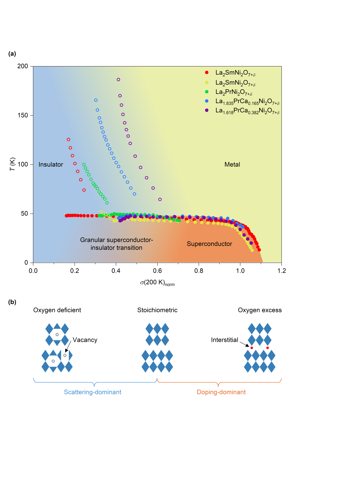
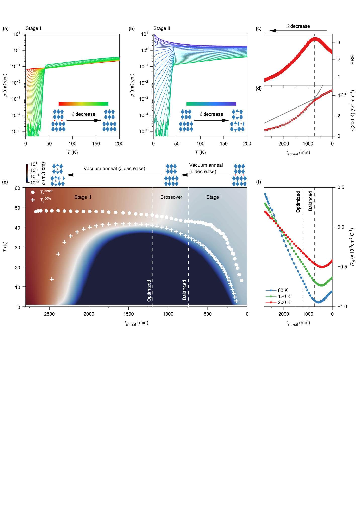
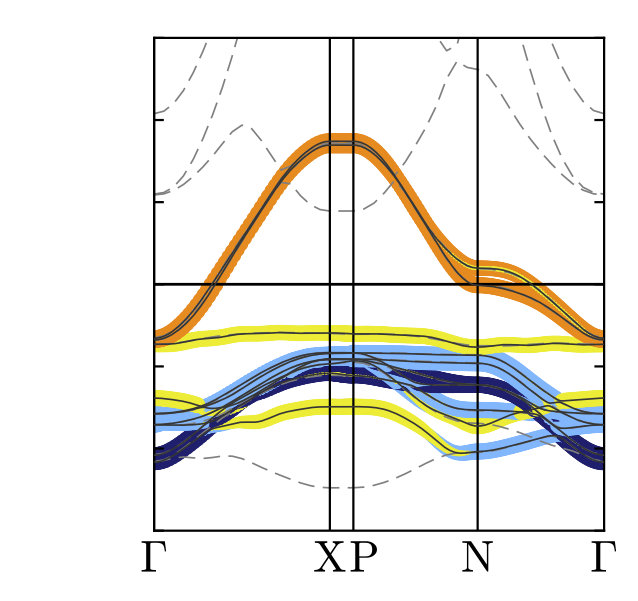
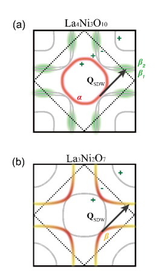

# ビレイヤーニッケル酸化物超伝導体：酸素化学量論が描く「半ドーム型」超伝導相図の謎

**執筆日**: 2026-03-23
**トピック**: ビレイヤーニッケル酸化物超伝導体（La₃Ni₂O₇系薄膜）における酸素化学量論依存超伝導相図
**注目論文**: arXiv:2603.12196
**参照した関連論文数**: 9本

---

## 1. 導入：なぜ今ニッケル酸化物超伝導が熱いのか

2023年、中国科学院の孫虎（Hao Sun）らが率いる研究グループが、*Nature* 誌上で衝撃的な発見を報告した——ペロブスカイト系ニッケル酸化物 La₃Ni₂O₇ が高圧下（約14 GPa以上）で転移温度（Tc）約80 Kという高温超伝導を示す、というものだ [Sun et al., *Nature* 621, 493 (2023)]。銅酸化物（カプレート）超伝導体が1986年に発見されて以来、高温超伝導の舞台はほぼカプレートの独占状態にあったが、ニッケル（Ni）はCuと同じ遷移金属でd電子を持ちながらも、長らく高温超伝導の候補になり切れなかった。その「眠れる隣人」が、高圧という舞台でついに力を発揮したのである。

しかしこの発見には大きな制約があった——超伝導は高圧下でのみ発現し、通常の実験室条件（常圧）では観測できないという点だ。そこで2024年から2025年にかけて、薄膜合成技術を用いた常圧超伝導の実現に向けた競争が一気に加速した。エピタキシャル歪みを利用して圧力の効果を模倣する手法により、La₂PrNi₂O₇や関連組成の薄膜においてTc ≈ 40〜80 Kという超伝導が常圧で実現され、世界各地のグループが競って追証・改良を試みた。

この薄膜研究が進むにつれ、一つの重要な事実が浮かびあがってきた——ニッケル酸化物薄膜の超伝導は、**酸素化学量論（oxygen stoichiometry）**、すなわち結晶中の酸素の過不足に対して非常に敏感である、という点だ。酸素が少し多すぎても、少し少なすぎても、超伝導は急速に失われてしまう。これはカプレート超伝導体の「ドーピング依存性」と類似する問題であり、ニッケル酸化物における超伝導メカニズムの鍵を握る可能性を示唆する。

2026年3月、スタンフォード大学・SLACのHwangグループおよびShenグループは、この酸素化学量論を系統的かつ連続的に制御することで、ビレイヤーニッケル酸化物薄膜における**「超伝導半ドーム（superconducting half-dome）」**相図を初めて実験的に明らかにした（arXiv:2603.12196）。カプレートで有名な「超伝導ドーム」は左右ほぼ対称な山型をなすが、ニッケル酸化物の場合はその半分——右半分だけが現れるという非対称な形状を持つ。この非対称性の起源と意味が、現在の凝縮系物理における中心的な論点の一つとなっている。

---

## 2. このトピックを読むための見取り図

この記事では、以下の四つの問いを軸に論じる。

**問い1：超伝導半ドームとは何か？なぜカプレートと違い非対称なのか？**
酸素過剰側と欠損側で超伝導の消滅機構が根本的に異なることを、注目論文（arXiv:2603.12196）が示している。関連する論文として、酸素化学量論とNi価数の変化を追った X線吸収分光の結果も参照する。

**問い2：超伝導の起源となるペアリング機構は何か？**
bilayer La₃Ni₂O₇ における dz² 軌道の結合-反結合分裂を出発点とする s±波超伝導の理論（arXiv:2603.13604）と、軌道-空間ビレイヤーモデルによる新化合物La₃Ni₂O₆の予測（arXiv:2603.11771）を中心に、競合するスピン密度波秩序との関係を検討する。

**問い3：スピン密度波競合秩序はどのような役割を果たすか？**
ビレイヤーLa₃Ni₂O₇とトリレイヤーLa₄Ni₃O₁₀のスピン密度波ギャップをラマン散乱で比較した研究（arXiv:2602.02174）と、1313型La₃Ni₂O₇多形体での磁気秩序（arXiv:2601.13090）を通じて、競合秩序と超伝導の関係を立体的に見る。

**問い4：ニッケル酸化物超伝導体の全体像はどうなっているか？**
インフィニットレイヤー系（arXiv:2603.17451）や三層系、還元型La₃Ni₂O₆（arXiv:2603.11771）も含めたニッケル酸化物超伝導ファミリー全体の整理を試みる（arXiv:2603.17657 のレビューも参照）。

---

## 3. 注目論文は何を新しく示したのか

**書誌情報**
- 著者: Yidi Liu, Bai Yang Wang, Jiarui Li, Yaoju Tarn, et al.（スタンフォード大学・SLAC・コーネル大学・フダン大学）
- タイトル: "A superconducting half-dome in bilayer nickelates"
- arXiv: 2603.12196 [cond-mat.supr-con]（2026年3月12日投稿）
- ライセンス: CC BY 4.0

### 主要な新知見

この論文の核心は、ビレイヤーニッケル酸化物薄膜（La₂SmNi₂O₇₊δ: LSNO、La₂PrNi₂O₇₊δ: LPNO、および Ca 添加系）の酸素化学量論 δ を連続的かつ可逆的に変化させることで、**超伝導転移温度 Tc が δ=0（酸素ストイキオメトリー点）を頂点として非対称に減少し、最終的に超伝導が消滅する**ことを実験的に示した点にある。

研究グループが発見した「超伝導半ドーム」の特徴を一言で表すならば：

> 酸素が増えすぎると（δ>0）→ キャリアドーピング過剰で超伝導消滅（金属状態へ）
> 酸素が減りすぎると（δ<0）→ 強い散乱で超伝導消滅（粒状超伝導体-絶縁体転移）

前者と後者では消滅の仕方が根本的に違う。δ>0 の「酸素過剰」側では、格子間位置に入り込んだ余分な酸素原子が主にホールドーピングとして働き、Tc はゆっくりと、かつ可逆的に低下して最終的に金属状態に転じる。一方 δ<0 の「酸素欠損」側では、酸素空孔が強い乱れ散乱を引き起こし、Tc は急速かつ不可逆的に低下し、絶縁体-超伝導体量子転移（SIT）を引き起こす。

*Figure 1. ビレイヤーニッケル酸化物の超伝導半ドーム相図（出典: arXiv:2603.12196, CC BY 4.0, unmodified）。(a) 温度Tを縦軸、室温付近（200 K）での規格化伝導率σ(200K)_norm を横軸にとった相図。複数の組成（LSNO, LPNO, LPCNO等）を含む試料が一つの半ドームを形成し、超伝導相（Superconductor）、金属相（Metal）、絶縁体相（Insulator）、粒状超伝導体-絶縁体転移領域（Granular SC-insulator transition）の境界を示す。(b) 酸素欠損（Vacancy/散乱支配）、ストイキオメトリー（最適）、酸素過剰（Interstitial/ドーピング支配）の三つの状態の概念図。*

特に注目すべき点は、異なる希土類組成（Sm、Pr）やアルカリ土類元素（Ca）のドーピングを持つ試料がすべて同一の「半ドーム」上に乗ることだ——これはこの半ドームがビレイヤーニッケル酸化物に普遍的な特性であることを意味する。σ(200K)_norm という「規格化」伝導率を横軸に用いることで、絶対的なキャリア密度ではなく「正常状態の金属度」が超伝導ドームの位置を決める普遍的なパラメータであることが浮かびあがる。

*Figure 2. 酸素化学量論の連続チューニングによる超伝導の進化（出典: arXiv:2603.12196, CC BY 4.0, unmodified）。(a)(b) 真空アニール（酸素を段階的に除去）に伴う抵抗率ρ(T)の変化。Stage I（酸素過剰→ストイキオメトリー）では超伝導が徐々に誘起される。Stage II（ストイキオメトリー→欠損）では超伝導転移の残留がある一方で絶縁体的振る舞いが急速に発達する。(e) アニール時間を横軸にとった2次元カラーマップで「半ドーム」の実空間での出現を示す。(f) ホール係数RHの変化：酸素過剰→ストイキオメトリー→欠損に伴い負→ゼロ→正へと変化する。*

---

## 4. 背景と文脈：高圧から薄膜へ——ルドルスデン-ポッパー相超伝導の系譜

### La₃Ni₂O₇の結晶構造と電子配置

La₃Ni₂O₇ はルドルスデン-ポッパー（Ruddlesden-Popper; RP）系列 Aₙ₊₁BₙO₃ₙ₊₁ の n=2 化合物である。構造的には、二枚のNiO₂平面が結晶学的に結合した「ビレイヤーブロック」が LaO 岩塩型絶縁体層を挟んで積層した形を取る（図3参照）。Ni イオンの名目電荷は La₃Ni₂O₇ では Ni²·⁵⁺（3d⁷·⁵ 相当）、あるいは Ni²⁺/Ni³⁺ の混合状態として理解できる。

この構造の最も重要な特徴は、ビレイヤー内の二枚のNiO₂層が **頂端酸素（apical oxygen）** を介して強く結合している点だ。この頂端酸素を介した Ni-O-Ni 経路が層間ホッピング t⊥ を生み出し、バンド構造上では dz² 軌道が結合-反結合バンドに分裂する。この分裂エネルギーは超伝導ペアリングに直接関与すると考えられている（後述）。

カプレート超伝導体（CuO₂面を持つ LaₙCuₙO₃ₙ₊₁ 系）と比較すると、同じ RP 構造を持ちながら、Ni (3d) と Cu (3d) の違いにより電子配置が異なる。Cu²⁺ (3d⁹) は dx²-y² 軌道にホール一つを持つシンプルなモット絶縁体の出発点を持つが、Ni²·⁵⁺ は複数の軌道（dz²、dx²-y²）への電子配置が競合する多軌道系となる。

### 高圧超伝導の発見とその後の展開

Sun らによる2023年の発見以降、世界各地での検証が相次いだ。本論文 arXiv:2603.12196 が引用している Hou et al. 2024 (Chin. Phys.) でも独立した高圧超伝導の確認が報告されており、La₃Ni₂O₇ のバルク結晶が圧力下で Tc ≈ 80 K を持つことは今や確立された事実と言える。しかし結晶試料では常圧超伝導は実現しない——このギャップを埋めるべく、2024〜2025年に**薄膜アプローチ**が本格化した。

スタンフォードグループ（Hwang研究室）は圧縮歪みを持つ SrLaAlO₄(001) 基板上に La₂PrNi₂O₇ 薄膜を堆積し、常圧での Tc ≈ 40 K（onset）を達成した [Liu et al., *Nat. Mater.* 24, 1221 (2025)]。エピタキシャル歪みは格子定数の圧縮を通じてバルク高圧実験の効果を模倣する——La₃Ni₂O₇ の場合、圧縮歪みが dz² 軌道の占有率や層間ホッピングに影響し、超伝導に適したバンド構造へと誘導する。

Sakurai & Takano の総説（arXiv:2603.17657）は、n=2（ビレイヤー）の La₃Ni₂O₇ のみならず n=3（トリレイヤー）の La₄Ni₃O₁₀ でも圧力下超伝導（Tc ≈ 30〜40 K）が発見されたことを概説しており、**RP ニッケル酸化物全体がHighTcの新しいファミリーを形成しつつある**ことが示唆されている。

---

## 5. メカニズム・解釈・比較：dz²ペアリングとスピン密度波競合の構図

### ペアリングメカニズムをめぐる理論的論争

La₃Ni₂O₇ の超伝導機構は現在、活発な議論の的となっている。最も広く議論されているシナリオは次の二つだ。

**シナリオA：dz²軌道の結合-反結合分裂を介した s±波超伝導**

Watanabe, Sakakibara, Kuroki (arXiv:2603.13604) は、変分モンテカルロ法（VMC）を用いたビレイヤー2軌道ハバードモデルの計算により、以下のメカニズムを提唱している。ビレイヤー内の dz² 軌道が頂端酸素を介した強い層間ホッピング t⊥ によって**結合（bonding）バンド**と**反結合（antibonding）バンド**に分裂する。この分裂により近距離スピン揺らぎが強まり、それを媒介として s±波超伝導が誘起される——すなわち、結合バンドと反結合バンドの超伝導ギャップの符号が逆転する状態だ。また、軌道混成（orbital hybridization）を通じて dx²-y² チャンネルへも超伝導相関が伝播するため、実際には両軌道が比較可能な超伝導相関を示す、という「階層的ペアリング構造」を予測する。

**シナリオB：軌道空間ビレイヤーモデル（OSBM）**

Kamiyama ら（arXiv:2603.11771）は異なる視点から、**軌道空間ビレイヤーモデル（Orbital-Space Bilayer Model; OSBM）**を提唱する。このモデルでは、物理的な層間ホッピング t⊥ の代わりに、同一サイト内の多軌道間の**軌道エネルギー差 ΔE** がビレイヤー系の「層間ホッピング」と等価な役割を果たす。具体的には、頂端酸素を持たない還元型化合物 **La₃Ni₂O₆**（La₃Ni₂O₇ から酸素を一個除いた化合物）では、Ni の dx²-y² 軌道と他のd軌道の間に大きな ΔE が生じ、これが dz² 系の t⊥ と同様の「incipient band」条件を生み出し、ホールドーピング時に s±波超伝導が誘起されると予測する。この予測は、La₃Ni₂O₆ を新規超伝導候補として実験的検証を促すものだ。

*Figure 5. La₃Ni₂O₆ の電子バンド構造（出典: arXiv:2603.11771, CC BY 4.0, unmodified）。オレンジ色で強調されたバンドは主に dx²-y² 軌道由来、青・黄色のバンドは dz² 等の他のd軌道に由来する。dx²-y² 軌道がフェルミ準位付近に形成する「incipient band」（フェルミ面をギリギリかすめるバンド）がペアリングを増強すると予測される。*

### スピン密度波との競合：ビレイヤーとトリレイヤーの比較

超伝導と競合する可能性がある秩序として、**スピン密度波（SDW）** が重要な位置を占める。La₃Ni₂O₇ と La₄Ni₃O₁₀ では、バルク常圧では超伝導は発現せず SDW 相転移が観測されており、圧力（または歪み）によって SDW が抑制されるとともに超伝導が出現するという「競合」関係が示唆されている。

Jun Shu ら（arXiv:2602.02174）は、偏光分解電子ラマン散乱という手法を用いて、ビレイヤー La₃Ni₂O₇ とトリレイヤー La₄Ni₃O₁₀ のSDWギャップの運動量空間構造を精密に比較した。

*Figure 3. La₄Ni₃O₁₀（トリレイヤー、上段）と La₃Ni₂O₇（ビレイヤー、下段）におけるSDWギャップの運動量依存性（出典: arXiv:2602.02174, CC0 1.0 Public Domain, unmodified）。カラーで強調された領域がSDWギャップが開いているフェルミ面ポケット。La₄Ni₃O₁₀ ではブリルアンゾーン中心のαポケットと端部のβポケットの一部にギャップが開くのに対し、La₃Ni₂O₇ では βポケットのみにギャップが開く、という対照的なパターンが明らかになっている。*

La₄Ni₃O₁₀ におけるSDWギャップのエネルギーは約55 meV、La₃Ni₂O₇ では約37 meVと推定されており、ギャップの大きさと形状の違いがそれぞれの材料で観測される超伝導Tcの違いと関連している可能性がある。このような層数依存のSDWギャップ構造の解明は、超伝導とSDWのどちらが「本当の」基底状態かという問いに答えるための重要な手がかりだ。

さらに、1313型 La₃Ni₂O₇ 多形体（単層と三層が交互に積層した特殊な構造）においては、常圧でも65 GPaまでの加圧でも超伝導は観測されず、代わりに170 KでのSDW転移のみが確認されている（Zhang ら, arXiv:2601.13090）。この事実は、**超伝導の発現にはビレイヤーの対称な積層構造が不可欠**であることを示唆する。

### 輸送特性の視点から：「奇妙な金属」シグナチャー

超伝導メカニズムの手がかりは輸送特性にも潜んでいる。Pan ら（arXiv:2603.17451）は、インフィニットレイヤーニッケル酸化物 La₁₋ₓSrₓNiO₂（過剰ドープ域 x=0.20〜0.24）に対して62テスラのパルス磁場を印加した精密磁気輸送測定を行い、二つの重要な事実を見出した。

*Figure 4. インフィニットレイヤーニッケル酸化物 La₁₋ₓSrₓNiO₂ の相図と抵抗率（出典: arXiv:2603.17451, CC BY 4.0, unmodified）。(a) Srドーピング量 x に対する超伝導転移温度Tc,onset（上）と特性温度Ts（下）のプロット。x=0.2〜0.24 の過剰ドープ域で測定。(b) 3試料の抵抗率ρ(T)の温度依存性。いずれも低温で超伝導転移を示す。*

第一の発見は、磁気抵抗（MR）が高磁場・高温比（H/T）の極限で**H線形（μ₀H に比例）**の振る舞いを示す点だ。これは通常金属で成立するKohlerの法則（MR ∝ H²）に違反しており、「奇妙な金属（strange metal）」のシグナチャーとして知られる異常な散乱機構を示唆する。第二の発見は、これと同一の試料において30 K以下の正常状態抵抗率が**T²則**に従うという点だ——これはフェルミ液体の特徴的な振る舞いである。

奇妙なことに、同じ試料で「非フェルミ液体的な磁気輸送」と「フェルミ液体的な温度依存性」が共存する。この二律背反は、ニッケル酸化物の電子相関が非常に複雑であることを示しており、単純な準粒子描像では捉えられない多体効果が働いていることを示唆する。なお、このインフィニットレイヤー系では Ni が Ni¹⁺（3d⁹）状態に近く、Cu²⁺（3d⁹）のカプレートと電子配置が最も近い化合物であるという点でも、比較の観点から重要な参照系となっている。

---

## 6. 材料・手法・応用への広がり

### ニッケル酸化物超伝導体ファミリーの全体像

本研究を俯瞰すると、現在知られているニッケル酸化物超伝導体は大きく三つのファミリーに分類できる。

**（1）ルドルスデン-ポッパー（RP）系：高圧型**

| 化合物 | 構造 | Tc（高圧） | 状態 |
|--------|------|-----------|------|
| La₃Ni₂O₇ | ビレイヤー (n=2) | ~80 K @ 14 GPa | 確立 |
| La₄Ni₃O₁₀ | トリレイヤー (n=3) | ~30〜40 K | 確立 |
| La₃Ni₂O₇ (薄膜) | ビレイヤー | ~40〜80 K（常圧） | 活発研究中 |
| La₃Ni₂O₆ (還元型) | ビレイヤー* | 予測のみ | 未検証 |

*頂端酸素なし、実際には単層 NiO₂ 層に近い

**（2）インフィニットレイヤー系：常圧型**

La₁₋ₓSrₓNiO₂ や Nd₁₋ₓSrₓNiO₂ などに代表される、2次元 NiO₂ 層が LaO/NdO 絶縁体層で挟まれた構造。Nd₀.₈Sr₀.₂NiO₂ での常圧超伝導（Tc ≈ 9〜15 K）が2019年に発見されており（Li et al., *Nature* 2019）、こちらは薄膜でのみ超伝導が実現する。RP系に比べてTcは低いが、実験的アクセシビリティが高い参照系として重要な役割を果たす。

Sakurai & Takano の総説（arXiv:2603.17657）は、RP系と I-L系を包括的に整理し、超伝導メカニズム解明のための実験的課題として「高圧下での中性子散乱・NMRなどの精密測定」の困難を指摘している。薄膜技術の進歩による常圧超伝導系の確立は、こうした実験的制約を打ち破る重要な突破口となりうる。

### 酸素制御手法の意義：合成・物性制御の新パラダイム

注目論文（arXiv:2603.12196）が示した「酸素化学量論による連続チューニング」の手法は、単なる相図の決定にとどまらず、**ニッケル酸化物薄膜研究のパラダイムを変える可能性**を持つ。従来、薄膜の超伝導転移温度を制御するためには成長条件の最適化（基板、温度、圧力）が主要な手段だったが、この研究は成長後に酸素量を可逆的に変化させることで電子相図を系統的に探索できることを示した。

具体的な手法は「オゾンアニール（酸化）」と「真空アニール（還元）」を段階的に組み合わせるものだ。重要なのはこのプロセスが**可逆的**であること——同一の薄膜サンプル上で、酸素量を増やしたり減らしたりしながら Tc の変化を追跡できる。これはカプレートでのキャリアドーピング制御技術の精神を引き継ぎながら、ニッケル酸化物特有の酸素敏感性を逆手に取った巧みなアプローチだ。

### 応用への道：高Tc常圧超伝導の実現に向けて

注目論文は、半ドームの酸素欠損側の端（δ < 0 でさらに電子ドープした領域）では Tc,onset が上昇し続けることも示唆している。これは「電子ドーピングを乱れなく導入できれば、より高いTcが実現できる可能性」を意味する。この可能性は arXiv:2603.17657 のレビューにおいても言及されており、新しい構造モチーフ（例えば La₃Ni₂O₆ のように頂端酸素を持たない系）の合成が一つの方向性として提案されている。

また、注目論文が示した相図は、カプレートでの「最適ドープ→過剰ドープ」の議論と類似の普遍的な物理を反映している可能性があり、**高温超伝導の普遍的な相図の理解**にも示唆を与える。

---

## 7. 基礎から理解する

### ルドルスデン-ポッパー構造とは

ルドルスデン-ポッパー（RP）相 Aₙ₊₁BₙO₃ₙ₊₁ は、ペロブスカイト層（ABO₃ で表現）とロックソルト絶縁体層（AO）が交互に積層した層状構造を持つ酸化物だ。La₃Ni₂O₇ の場合は n=2 に対応し、二枚の NiO₂ 平面（各 Ni は6配位：4つの面内酸素＋1つの頂端酸素×2）が連結されたビレイヤーブロックを形成する。

以下に各記号の意味を整理する（La₃Ni₂O₇ の場合）：
- 化学式 La₃Ni₂O₇ は A=La, B=Ni, n=2 に対応
- NiO₂ 平面は CuO₂ 平面（カプレートの超伝導面）と等価
- 頂端酸素 O_ap を介した Ni-O-Ni 結合が層間電子ホッピング t⊥ を決定
- t⊥/t（層間ホッピング / 層内ホッピング比）は約0.5〜0.7 と推定され、強い三次元性を持つ

### Ni の電子配置と多軌道効果

La₃Ni₂O₇ の Ni は形式電荷 +2.5 に対応し、3d 電子数が 7.5（Ni²⁺: 3d⁸ と Ni³⁺: 3d⁷ の中間）となる。d 軌道は結晶場（正方対称）により以下のように分裂する：

- **eg 軌道**（高エネルギー側）：dx²-y² と dz²
- **t₂g 軌道**（低エネルギー側）：dxy, dyz, dxz

常圧では主に dz²（層間方向）と dx²-y²（面内方向）の２軌道がフェルミ準位近傍に存在し、多軌道ハバードモデルによる理論的扱いが不可欠となる。重要なのは：

$$H = \sum_{k,\sigma} \varepsilon_k^{z^2} c_{kz^2\sigma}^{\dagger} c_{kz^2\sigma} + \sum_{k,\sigma} \varepsilon_k^{x^2-y^2} c_{k,x^2-y^2,\sigma}^{\dagger} c_{k,x^2-y^2,\sigma} + t_{\perp} \sum_j c_{j,1}^{\dagger} c_{j,2} + \text{h.c.} + U\sum n_{j\uparrow}n_{j\downarrow}$$

ここで $t_{\perp}$ はビレイヤー間の dz² 軌道ホッピング、$U$ はオンサイトクーロン斥力（ハバードU）。dz² 軌道が $t_{\perp}$ によって結合（bonding）/反結合（antibonding）バンドに分裂することが、La₃Ni₂O₇ に固有のペアリングを生む源泉とされる。

### 超伝導転移のシグナチャーを測る：XAS と輸送測定

実験的に酸素化学量論の変化を追跡するために、X線吸収分光（XAS）が有力な手法として活用される。arXiv:2603.12196 の fig3 が示すように：

- Ni の L吸収端（~850〜870 eV）のスペクトル形状が酸素量に敏感に応答し、酸素過剰で Ni³⁺成分が増加、酸素欠損で Ni²⁺成分が増加する
- O の K吸収端（~527〜535 eV）は、酸素空孔の形成と格子間酸素の挿入に対する指紋として機能する

輸送測定においては、Tc に加えて以下の量が超伝導の「質」の指標となる：

- **ρ(T) の温度依存性**：T² 則（フェルミ液体）か T 線形（奇妙な金属）か
- **残差抵抗比（RRR）** = ρ(200K)/ρ(60K)：結晶の質と乱れの指標
- **ホール係数 RH**：正（ホールドープ）か負（電子ドープ）か

注目論文（arXiv:2603.12196）では、ホール係数が酸素過剰（δ>0）で負、ストイキオメトリー（δ≈0）でほぼゼロ、酸素欠損（δ<0）で正へと変化することを示している。この複雑な符号変化は複数のバンドにまたがるキャリア輸送（多バンド効果）によるものと解釈され、La₃Ni₂O₇ の多軌道的性質を反映している。

### 誤解しやすい点

*La₃Ni₂O₇ はカプレートと「似て非なる」存在である*

よく言われる「ニッケル酸化物はカプレートの類似体」という説明は一面的だ。共通点（正方 MO₂ 格面、強相関電子、RP 構造）がある一方で、重要な違いも多い：

1. Ni は Cu と異なり dz² 軌道が超伝導に直接関与する可能性がある
2. 圧力（または歪み）が不可欠という事実は、電子構造の「チューニング」が必要であることを示す
3. 超伝導相図の「ドーム」が非対称（半ドーム）であること自体、カプレートとは異なるメカニズムの可能性を示唆する
4. バンド幅と局在の競合が異なる様相を示す可能性がある

これらの違いを正確に認識することが、ニッケル酸化物固有のメカニズム解明のための出発点となる。

---

## 8. 重要キーワード10個の解説

### ① ルドルスデン-ポッパー相 (Ruddlesden-Popper phase)

層状ペロブスカイト酸化物の一族で、一般式 Aₙ₊₁BₙO₃ₙ₊₁ で表される。A はランタン等のランタニド・アルカリ土類元素、B は遷移金属（Ni, Cu, Mn等）。n=1 が単層（例: La₂CuO₄）、n=2 がビレイヤー（例: La₃Ni₂O₇）、n=3 がトリレイヤー（例: La₄Ni₃O₁₀）。高温超伝導カプレートの多くがこの構造をとる。B-O₂ 平面と AO ロックソルト絶縁体層の交互積層が、強い電子相関と超伝導に適した二次元的電子系を作り出す。今回の文脈では n=2 および n=3 のニッケル系が主役。

### ② 超伝導半ドーム (superconducting half-dome)

通常の「超伝導ドーム」はドーピング量を横軸にとったとき左右ほぼ対称な山型を示す（カプレート等）。一方、ビレイヤーニッケル酸化物において arXiv:2603.12196 が明らかにした相図は「右半分だけ」の形状：電子過剰側（酸素欠損）は強い散乱による量子転移で急激に超伝導が消滅し、ホール過剰側（酸素過剰）は緩やかに消滅してそのまま金属状態となる。この非対称性は、酸素欠損（空孔）と過剰（格子間挿入）が引き起こす物理的影響の根本的非対称性を反映する。

### ③ 酸素化学量論 (oxygen stoichiometry / δ)

結晶中の酸素占有度のことで、名目組成からの偏差 δ で表す（La₃Ni₂O₇₊δ において δ>0 が過剰、δ<0 が欠損）。酸化物超伝導体では酸素量がキャリア密度（ドーピング量）と乱れ散乱の両方を制御するため、超伝導相図の位置を決める最重要パラメータの一つ。La₃Ni₂O₇ においては δ ≈ 0（ストイキオメトリー）近傍でTcが最大となり、わずかなずれでも Tc が大きく変化する。これはNiO₂ビレイヤーユニットの「電子的脆弱性」を反映している。

### ④ スピン密度波 (spin-density wave / SDW)

スピン磁化率が特定の波数ベクトル **Q** で発散することで形成される、スピンの周期的変調状態。金属中で電子のフェルミ面の「ネスティング」（フェルミ面上の粒子-ホール対が同じ **Q** で散乱されやすい形状）が強い場合に安定化する。La₃Ni₂O₇ バルクでは常圧でSDW秩序が発生し、圧力によって抑制されると超伝導が現れる。SDW と超伝導の競合は、鉄系超伝導体やカプレートでも広く見られる普遍的な現象であり、「SDWの揺らぎがクーパーペアを媒介する」という機構が提案されることも多い。

### ⑤ s±波対称性 (s±-wave symmetry)

複数のバンドを持つ超伝導体で提案されるギャップ関数の対称性の一種。すべてのバンドで s 波（等方的）のギャップを持つが、あるバンド（例: dz² の結合バンド）のギャップ符号が別のバンド（反結合バンドや dx²-y² バンド）と反対になる。超伝導体の「分類」としては s 波（異常な節なし）だが、異なるバンド間で符号反転がある点が重要で、特定の散乱で不安定化する。La₃Ni₂O₇ では dz² の結合-反結合分裂が s±波の実現に寄与すると理論的に予測されている（arXiv:2603.13604）。スピン揺らぎ媒介の超伝導メカニズムと自然に整合する。

### ⑥ dz²軌道とペアリング (dz² orbital)

Ni の d 軌道のうち、z 軸（結晶の積層方向）に向いた電子密度の強い軌道。La₃Ni₂O₇ では頂端酸素を介した層間ホッピング t⊥ が dz² 軌道を通じて大きく、この軌道の電子が「結合バンド」と「反結合バンド」に分裂することがビレイヤー系に特有の超伝導メカニズムの起点となる。カプレートでは dx²-y² のみがフェルミ準位に関与するのに対し、La₃Ni₂O₇ では dz² も同様に重要な役割を果たすため、単軌道ハバードモデルでは記述が不十分で、少なくとも2軌道モデルが必要となる。

### ⑦ 奇妙な金属 (strange metal)

電気抵抗率が温度に対して線形（ρ ∝ T）で変化する非フェルミ液体状態。通常の金属（フェルミ液体）では ρ ∝ T²（低温）または ρ ∝ T（電子-フォノン散乱が支配的な高温）だが、奇妙な金属では線形則が広い温度域にわたって成立し、「プランク散乱（散乱率 ∝ kBT/ℏ）」という量子力学的上限に達した散乱機構が働いていると考えられる。高温超伝導体のドープ量最適点付近の正常状態で普遍的に観測され、磁気抵抗の非コヘラー則（H線形MR）とも関連する。インフィニットレイヤーニッケル酸化物の過剰ドープ域でも類似したシグナチャーが観測されている（arXiv:2603.17451）。

### ⑧ 超伝導体-絶縁体転移 (superconductor-insulator transition / SIT)

温度がゼロに近い極低温でも超伝導状態から絶縁状態へ（または逆へ）移行する量子相転移。キャリア密度、乱れ（disorder）の大きさ、磁場などの制御パラメータを変えることで引き起こされる。2次元薄膜では特に乱れの大きな役割が知られており、「ボースの局在化」（超伝導クーパーペアが局在化することで絶縁体化）や「フェルミオンの局在化」（クーパーペアが壊れて電子が局在化）などのメカニズムが議論されている。注目論文では酸素欠損が強い散乱源となり SIT を引き起こすことが示されており、臨界指数 zν≈2.5 は量子パーコレーションモデルと整合する。

### ⑨ 格子間酸素ドーピング (interstitial oxygen doping)

結晶格子の通常のサイト（酸化物では酸素は特定の結晶サイトを占有）ではなく、格子の隙間（格子間位置）に余分な酸素原子が入り込むドーピング形態。La₃Ni₂O₇₊δ において δ>0 の場合、この格子間酸素が NiO₂ 面のキャリア密度（ホール）を増やすためドーピング効果をもたらす。カプレートの代表例 La₂CuO₄₊δ でも同様の格子間酸素ドーピングが重要であり、ニッケル酸化物との比較が示唆に富む。格子間位置にある酸素は結晶の対称性を局所的に乱すため、わずかながら散乱効果ももたらすが、酸素空孔に比べると散乱が格段に弱い。

### ⑩ 軌道空間ビレイヤーモデル (Orbital-Space Bilayer Model / OSBM)

arXiv:2603.11771 で提唱された多軌道モデル。物理的に二枚の層を持つ「実空間ビレイヤー」（La₃Ni₂O₇ の構造的ビレイヤー）ではなく、同一層内の複数の d 軌道（dx²-y² と dz² など）が「見かけ上のビレイヤー」として機能するというモデル。軌道間のエネルギー差 ΔE が、実空間ビレイヤーにおける層間ホッピング t⊥ と等価な役割を果たす。このモデルによれば、La₃Ni₂O₆（頂端酸素を持たない La₃Ni₂O₇ の還元体）でもホールドープにより s±波超伝導が実現できる可能性があり、新材料探索の指針を与えるものとして注目される。

---

## 9. まとめと今後の論点

ビレイヤーニッケル酸化物 La₃Ni₂O₇ をはじめとする RP 系ニッケル酸化物超伝導体は、2023年の高圧超伝導発見から3年足らずで、薄膜での常圧超伝導実現、酸素化学量論による相図の系統的制御、そして理論的メカニズムの複数シナリオが同時進行で展開するという、高度にダイナミックな研究領域に成長した。

注目論文（arXiv:2603.12196）の核心は、ビレイヤーニッケル酸化物の超伝導相図が「半ドーム型」という非対称な形を持つことを実験的に確立し、その非対称性の起源を「格子間酸素（ドーピング支配）」と「酸素空孔（散乱支配）」の物理的非対称性に帰着させた点にある。同時に、異なる希土類・アルカリ土類組成を持つ複数の化合物が共通の半ドームを形成するという「普遍性」の発見は、ビレイヤー NiO₂ 構造に固有の超伝導相図が存在することを示唆し、機構解明への強力な制約条件を提供する。

今後の論点として特に重要なのは以下の三点だ。第一に、超伝導半ドームの左半分——電子ドープ側でどのような相が実現するか——の探索だ。酸素欠損 δ<0 をさらに深く進めると理論的には別種の超伝導相や磁気秩序が現れる可能性があり、新たな薄膜合成技術（例えば電気化学的ゲーティング）による探索が期待される。第二に、s±波のギャップ構造の直接的な実験検証だ。走査トンネル顕微鏡（STM）や角度分解光電子分光（ARPES）による超伝導ギャップの運動量依存性の測定は、dz²/dx²-y² 軌道のペアリング機構を識別する決定的証拠となりうる。第三に、La₃Ni₂O₆ など新規ニッケル酸化物の合成とその超伝導探索だ（arXiv:2603.11771）——OSBM の予測が実証されれば、高温超伝導の設計指針として大きな意義を持つ。

次に学ぶべきトピックとして、カプレート超伝導体の相図（Emery-Kivelsonのストライプ理論、擬ギャップ相、d波超伝導）の基礎を理解した上でニッケル酸化物との比較を深めることを勧める。また、多軌道ハバードモデルの変分モンテカルロ法や、電子ラマン散乱の対称性選則の基礎も、この分野を追いかけるうえで有益な武器となるだろう。

---

## 10. 参考にした論文一覧

### 注目論文

| arXiv ID | 著者 | タイトル | ライセンス |
|----------|------|---------|---------|
| 2603.12196 | Y. Liu, B.Y. Wang et al. | A superconducting half-dome in bilayer nickelates | CC BY 4.0 |

### 関連論文

| arXiv ID | 著者（代表） | タイトル | 役割 | ライセンス |
|----------|------------|---------|------|---------|
| 2603.17657 | H. Sakurai, Y. Takano | Superconducting Lanthanum Nickel Oxides with Bilayered and Trilayered Crystal Structures | 背景・総説 | Non-exclusive (JPCM) |
| 2603.17451 | Y.-C. Pan et al. | H-linear magnetoresistance in the T² resistivity regime of overdoped infinite-layer nickelate La₁₋ₓSrₓNiO₂ | 輸送特性・比較 | CC BY 4.0 |
| 2603.13604 | H. Watanabe et al. | Hierarchical structure of primary and hybridization-induced superconducting correlations in bilayer nickelates | ペアリング理論 | Non-exclusive |
| 2603.12924 | X. Shen, W. Ku | Orbital dimerization-induced first-order structural phase transition: a case study in La₃Ni₂O₇ | 構造・軌道物理 | Non-exclusive |
| 2603.11771 | S. Kamiyama et al. | Theoretical proposal of superconductivity in hole-doped reduced bilayer nickelate La₃Ni₂O₆ | 新化合物予測・OSBM | CC BY 4.0 |
| 2602.02174 | J. Shu et al. | Contrasting Momentum-Selective Spin-Density-Wave Gaps in Bilayer and Trilayer Nickelates | SDWギャップ比較 | CC0 1.0 |
| 2601.13090 | M. Zhang et al. | Spin-density-wave transition in monolayer-trilayer La₃Ni₂O₇ single crystals | 1313型SDW | CC BY-NC-ND 4.0 |
| 2601.15858 | S. Sharma et al. | Structural stability, electronic structure, and magnetic properties of the single-layer trilayer La₃Ni₂O₇ polymorph | 構造安定性・電子構造 | Non-exclusive (PRB) |
| 2507.10399 | Q. Li et al. | Enhanced superconductivity in the compressively strained bilayer nickelate thin films by pressure | 歪み+圧力効果 | Non-exclusive |

---

*本レビュー記事はスケジュール実行タスクにより自動生成されたものです。figure の帰属は各キャプションに明記されています。*
