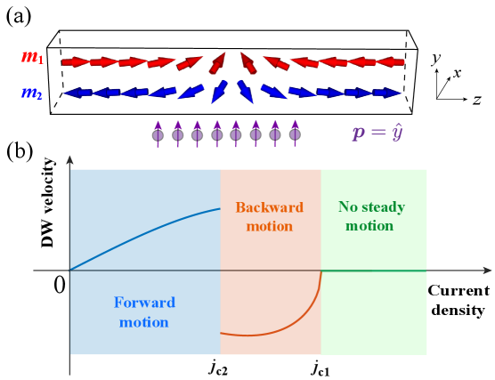
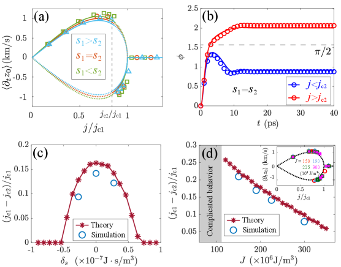
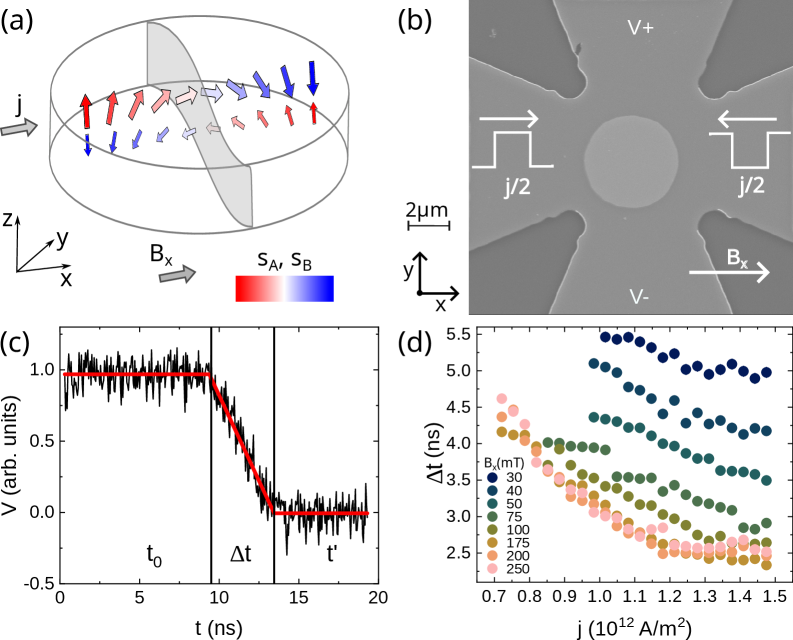
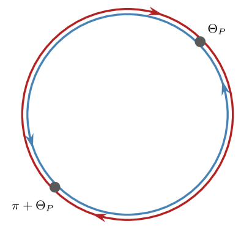
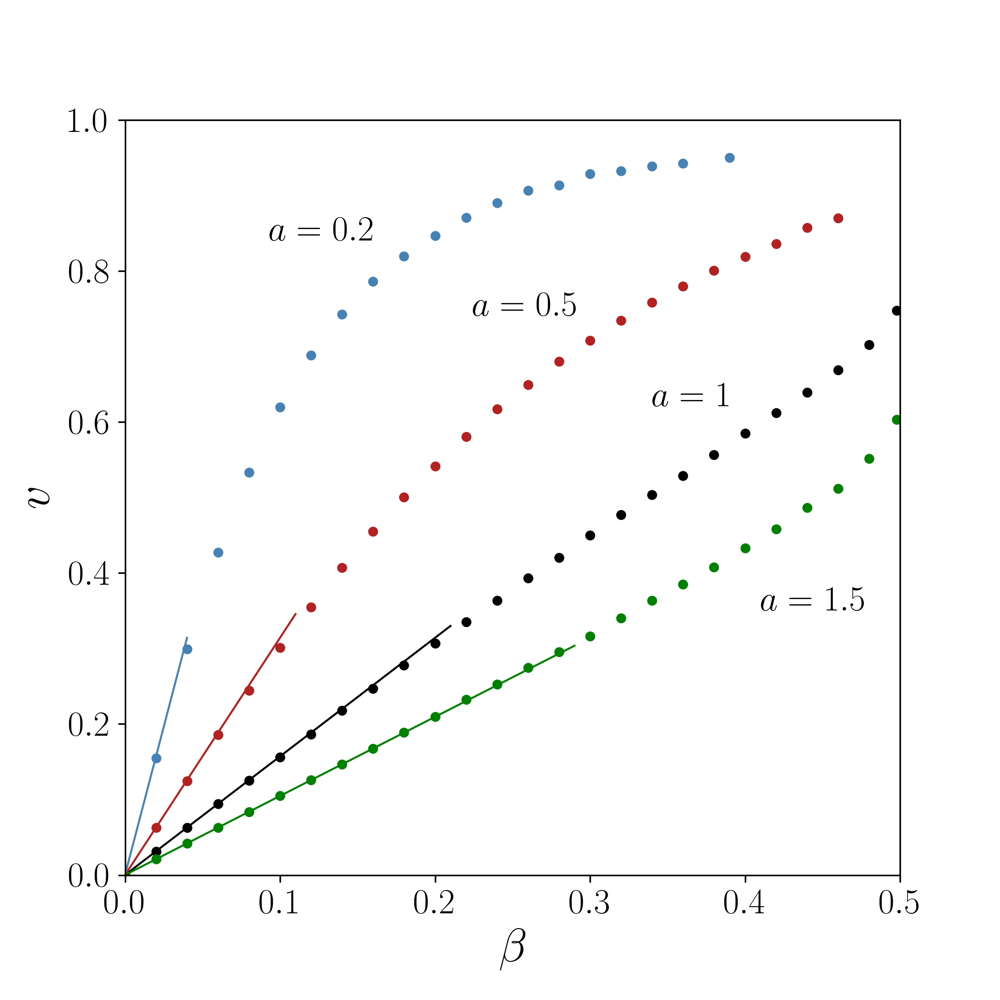
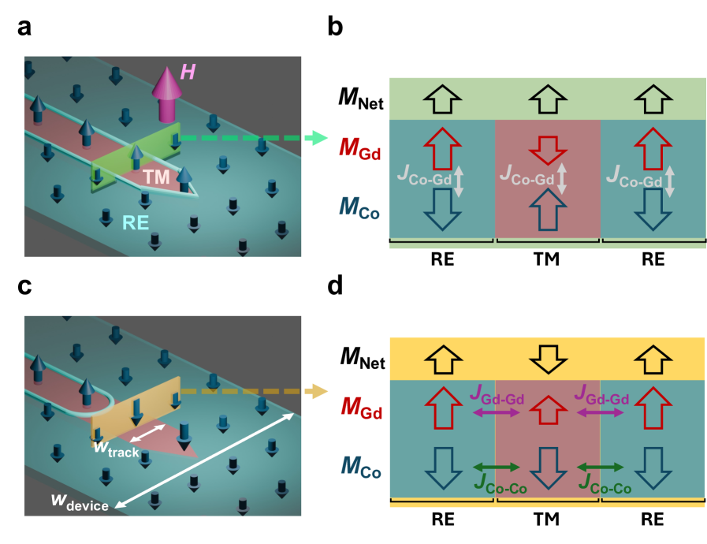
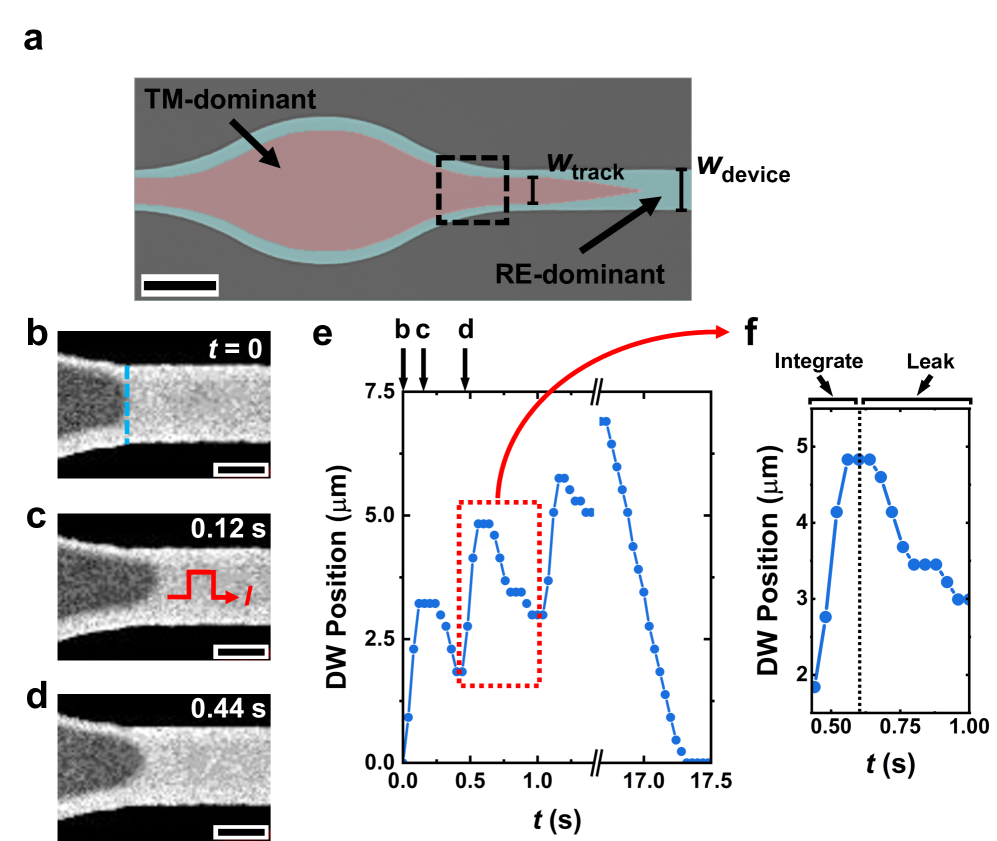
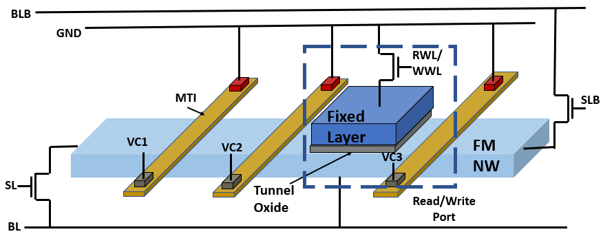
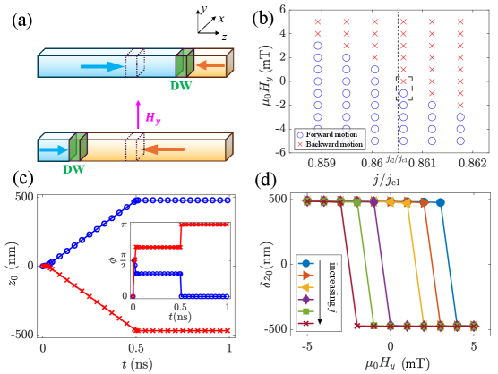

# フェリ磁性体における磁壁ダイナミクスの新潮流：慣性・相対論・双安定性

- **執筆日**: 2026-03-24
- **トピック**: フェリ磁性体の磁壁ダイナミクス（慣性・相対論的挙動・直流電流駆動の双安定性）
- **注目論文**: arXiv:2603.18722
- **参照した関連論文数**: 8本

---

## 1. 導入：なぜ今、磁壁ダイナミクスが再び熱くなっているのか

磁壁（magnetic domain wall, DW）とは、磁化の向きが一方から他方へと連続的に回転する空間的な境界領域である。スピントロニクス研究の最前線では、この磁壁を「情報の担い手」として制御しようとする「レーストラックメモリ」構想が2000年代から議論されてきた。磁壁を電流で動かし、ナノワイヤ上の決まった場所に「ビット」として格納するというアイデアだ。

しかし今、磁壁ダイナミクスの研究は単なるメモリへの応用にとどまらず、より根本的な物理現象へと向かっている。キーワードは「相対論的挙動」と「スピン慣性」である。

磁壁はある意味で粒子のように振る舞う。この「粒子」はスピン波（マグノン）を伝える媒質の中を走っており、その最大速度はスピン波の群速度によって決まる。これは特殊相対論でいう光速制限に対応しており、磁壁がスピン波速度に近づくと幅が縮み、その上限を超えることができない。この「磁気の特殊相対論」は純粋な物理的面白さとともに、テラヘルツ（THz）領域での磁気デバイス動作という技術的含意を持つ。

さらに、これまで「過渡的にのみ現れる効果」と見なされてきたスピン慣性（spin inertia）が、実は定常的な動作モードをも根本から変えることが、2026年3月に発表された注目論文（arXiv:2603.18722）によって示された。それは「直流電流（DC）の向きを変えずに電流の大きさだけを変えることで、磁壁の進行方向が可逆的に切り替わる」という、これまでの常識を覆す現象である。

*図1：フェリ磁性体中のヘッドツーヘッド（head-to-head）磁壁の構造模式図（左）と、直流電流密度 $j$ に対する定常磁壁速度 $\langle v \rangle$ の概念図（右）。電流密度が $j_{c2}$ と $j_{c1}$ の間にある「双安定領域」では、同じ電流値で前進・後退の二通りの定常状態が共存することを示す。CC BY 4.0 (arXiv:2603.18722)*

---

## 2. 解くべき問い：「磁壁は直流電流で逆向きに動けるか？」

磁壁の電流駆動は、スピン移行トルク（spin transfer torque, STT）またはスピン軌道トルク（spin-orbit torque, SOT）によって引き起こされる。通常、電流方向が磁壁の進行方向を決める：電流の向きを変えれば磁壁も逆走し、同じ方向の電流に対しては磁壁は一方向にしか動かない。

フェリ磁性体では、二つの反強磁性結合した副格子の角運動量が打ち消し合う「角運動量補償点」（angular momentum compensation point, AMCP）付近で、磁壁に質量的な振る舞いが現れることが知られていた。しかし従来の解釈では、この「質量」は過渡的な振る舞い（電流をオンした瞬間の加速・減速）に影響するだけで、十分に時間が経過した**定常状態**は質量の有無によらず同じだとされてきた。

注目論文（2603.18722）が提起した問いは：「もし慣性（質量）効果が強く現れたとき、フェリ磁性体の磁壁は**定常状態においても**これまでにない振る舞いをするのではないか？」というものである。

答えはYesだった。磁壁傾斜角のダイナミクスが「双安定ポテンシャル」の中の粒子に相当するとき、慣性によって二つの安定状態のどちらかに落ち込むことができる。そして二つの安定状態は**逆向きの速度**に対応する。これが「可逆的な磁壁運動」の本質だ。

---

## 3. 注目論文は何を新しく示したのか

### 双安定ポテンシャルと慣性がもたらす逆向き運動

arXiv:2603.18722（K. Y. Jing, X. R. Wang, H. Y. Yuan）は、フェリ磁性ナノワイヤ中の磁壁ダイナミクスを集合座標（collective coordinate）法で定式化し、磁壁の位置 $z_0$ と傾斜角 $\phi$ の連立方程式を導出した。AMCP 付近では、ネール（Néel）ベクトル方程式を Walker 型の磁壁プロファイルに代入すると、傾斜角 $\phi$ の運動方程式は次の形になる：

$$\frac{s^2}{4J} \frac{\partial^2 \phi}{\partial t^2} = -\alpha s \frac{\partial \phi}{\partial t} - K_y \sin(2\phi) + \frac{\pi}{2} \tau_{\mathrm{FL}} \cos(\phi)$$

ここで $s$ はネットスピン密度（net spin density）、$J$ は副格子間の交換結合定数、$\alpha$ はギルバート減衰定数、$K_y$ は磁気異方性定数、$\tau_{\mathrm{FL}}$ はフィールドライクトルクの強さである。左辺の $\frac{s^2}{4J} \frac{\partial^2 \phi}{\partial t^2}$ 項が「慣性（質量）」に相当し、AMCP 付近で $s \to 0$ となるとき最も重要になる（分母の $4J$ も変わるため）。

この方程式は、$\phi$ という「座標」を持つ粒子が、電流依存的なポテンシャル中を動く問題に対応する：

$$U(\phi) = -K_y \cos^2(\phi) - \frac{\pi}{2} \tau_{\mathrm{FL}} \sin(\phi)$$

このポテンシャルはパラメータ $\eta = \frac{\pi(\alpha s \tau_{\mathrm{FL}} + \delta s \tau_{\mathrm{DL}})}{4\alpha s K_y}$ によって形状が変わる：
- **$\eta < 1$（電流 $j < j_{c1}$）**：ポテンシャルに**二つの極小**（双安定）が存在する
- **$\eta \geq 1$（電流 $j \geq j_{c1}$）**：ポテンシャルに極小は一つだけになり、定常速度はゼロになる

二つの安定点 $\phi_L \in (0, \pi/2)$ と $\phi_R = \pi - \sin^{-1}(\eta)$ では、$\sin(\phi_L) = \sin(\phi_R)$ であるが $\cos(\phi_L) > 0 > \cos(\phi_R)$ となる。磁壁速度は $\langle v \rangle \propto \cos(\phi_f)$ で決まるため、同じ電流密度 $j$ でも、$\phi_L$ に落ち込んだときは前進（$v > 0$）、$\phi_R$ に落ち込んだときは後退（$v < 0$）となる。

慣性がない（$\frac{s^2}{4J} \to 0$）場合は、系は常に最初の安定点 $\phi_L$ に落ち込み、前進運動しか起きない。しかし AMCP 付近で有限の慣性がある場合、$\phi$ の初期速度や初期値によっては $\phi_R$ へ達することが可能になる。つまり「電流の大きさ」という一つのパラメータで方向制御ができるのである。

*図2：異なる電流密度（$j_{c2} < j < j_{c1}$ の双安定領域）におけるポテンシャル $U(\phi)$ の地形。二つの極小が存在し、慣性によってどちらの安定点に落ち込むかが変わる。CC BY 4.0 (arXiv:2603.18722)*

### 数値検証と臨界電流密度の分析

論文はさらに、マイクロマグネティクスシミュレーション（LLG 方程式の数値解）によってこの予測を検証した。図3に示すように、電流密度 $j$ を $j_{c2}$ と $j_{c1}$ の間に設定し、初期傾斜角を変えると、磁壁が前進・後退の二通りの定常状態に収束することを確認した。また、双安定ウィンドウ（$j_{c2} < j < j_{c1}$）の幅はスピン密度差 $\delta s$（二副格子のスピン密度の差）と結合強度 $J$ に依存することも示した。

*図3：数値計算による検証結果。（a）磁壁速度の電流密度依存性（前進・後退の両ブランチが $j_{c2}$ と $j_{c1}$ の間で共存）、（b）傾斜角の時間発展（同一電流密度でも初期条件で異なる安定状態に到達）、（c）スピン密度パラメータ依存性。CC BY 4.0 (arXiv:2603.18722)*

---

## 4. 背景と文脈：この論文はどこに位置づくか

### フェリ磁性体の角運動量補償点がなぜ特別か

フェリ磁性体（ferrimagnet）は二つ以上の磁気副格子が反強磁性的に結合した磁性体であり、代表的な材料は GdFeCo（ガドリニウム-鉄-コバルト合金）や YIG（イットリウム鉄ガーネット）など。净磁化（net magnetization）が有限であるため外部磁場に応答できる一方で、温度や組成を調整することで净角運動量をゼロ（AMCP）に近づけられる。

AMCP では、ネール（Néel）ベクトルで記述した運動方程式に $\frac{s^2}{4J}$ という質量項が有効に現れる。この状況は純粋な反強磁性体（$s = 0$ 常に）とも強磁性体（質量の起源が異なる）とも異なる独自の物理領域であり、「相対論的磁気ソリトン（relativistic magnetic soliton）」の実験的研究対象として近年注目を集めてきた。

2025年8月に発表された実験論文（arXiv:2508.13950, Diona et al.）は、非晶質フェリ磁性体 GdFeCo において磁壁が「相対論的」に振る舞うことを実証した。電流誘起の磁壁速度がスピン波群速度（spin-wave group velocity）$v_{g,\max}$：

$$v_{g,\max} = \frac{2A}{d s_T}$$

（$A$: 交換相互作用定数、$d$: 格子間距離、$s_T$: 全スピン密度）に漸近し、これを超えることができない「速度限界」の存在が確認された（測定値 $\approx 1.7$ km/s，限界値 $\approx 2$ km/s）。

*図4：非晶質フェリ磁性体 GdFeCo での電流誘起磁壁速度測定結果（Diona et al., 2025）。異なる Gd 組成の三サンプルについて速度が異なるスピン波速度（$\approx 2$ km/s）に飽和する様子を示す。この相対論的な速度飽和が AMCP 付近の特殊な動力学の証拠となる。CC BY-NC-ND 4.0（改変なし，原図のまま使用, arXiv:2508.13950)*

### 非均一系における「ロケット力学」

2026年1月の論文（arXiv:2601.21068, Diona et al.）は、組成が空間的に勾配している非均一フェリ磁性体における磁壁の「ロケット的」加速を予測した。磁壁の全質量 $m_{tot}(q)$ が位置 $q$ に依存する場合、運動方程式には「変数質量の相対論的ダイナミクス」が現れる。磁壁が質量の低い領域に移動するにつれて慣性質量が減少し、運動量保存からロケット推進力と類似した加速が生じる。さらに、スピン波速度 $v_g(q)$ の空間勾配 $v_g'(q)$ から生じる力が、速度が $v_g$ に近づいたときに支配的になり、速度限界の空間変化を磁壁が「追いかける」挙動が予測された。この研究は、非均一性を積極的に活用することでTHzデバイス動作に向けた磁壁加速の設計指針を提供する。

### 強磁性体でのスピン慣性との共鳴

同じく2026年3月に発表された arXiv:2603.10310（Bassant et al.）は、強磁性体における**スピン慣性（spin inertia）**効果が磁壁ダイナミクスをどう変えるかを分析した。通常の Landau-Lifshitz-Gilbert（LLG）方程式はスピン慣性を含まないが、ネルキング（Nöring）項と呼ばれる2階時間微分項を導入すると「質量を持つ」磁壁となる。この論文では、減衰なし（$\alpha = 0$）の場合に磁壁ダイナミクスがカオス的になること、そして減衰がある場合に磁場駆動の磁壁速度が従来の予測を有意に上回ることを示した。この結果は、フェリ磁性体の文脈（2603.18722）で見られた慣性効果の重要性と軌を一にしており、「慣性」が磁壁物理の統一的キーコンセプトとして浮上しつつあることを示唆する。

---

## 5. メカニズム・解釈・比較：「双安定」はなぜ生じるか

### ウォーカー崩壊との対比

磁壁ダイナミクスの教科書的な説明では、「ウォーカー崩壊（Walker breakdown）」という概念が重要だ。駆動力（磁場または電流）が閾値（ウォーカー限界）を超えると、磁壁の傾斜角 $\phi$ が安定点に留まれずに連続回転を始め、速度が時間平均的に下がる。この崩壊の有無が低電流・高電流域の分岐点となる。

2603.18722 の注目論文が示した双安定性は、ウォーカー崩壊とは本質的に異なる。双安定領域では $\phi$ は安定点（$\phi_L$ または $\phi_R$）のいずれかに収束して**定常的な**動きが実現されており、発散的な動力学（崩壊）ではない。二つの安定点の違いは傾斜角の「どちら側の谷か」という違いであり、このどちらに落ち込むかが「前進か後退か」を決める。

また、ウォーカー崩壊を回避するための手法として知られていた反強磁性体系（後述）と比べた場合、フェリ磁性体の双安定機構は「同一電流で双方向制御」という別の特徴を持つ。

### 反強磁性体磁壁との比較

arXiv:2509.22241（Theodorou & Komineas, 2025）は、反強磁性体（antiferromagnet, AFM）における磁壁がスピン軌道トルクによってどのように動くかを理論・数値的に分析した。

AFM 磁壁は本質的に「質量がない（or 非常に小さい）」系に近い。この論文の主な発見は：（i）スピン電流の偏極方向が面内方向のとき磁壁が定常的に伝播する、（ii）面外偏極では磁壁が歳差運動する、（iii）複合偏極では振動的な運動が生じる、である。特に、面内偏極駆動での磁壁速度は解析的に $v = \frac{\pi}{2} \frac{\beta}{\alpha}$（$\beta$: スピンホール角に比例、$\alpha$: Gilbert 減衰）と表せ、ウォーカー崩壊が実質的に存在しない高速動作が可能であることが示された。

*図5：反強磁性体（AFM）中の磁壁プロファイルの典型的なスナップショット（Theodorou & Komineas, 2025）。AFM 磁壁は質量がほぼゼロで高速動作が可能だが、フェリ磁性体の双安定性とは異なる動力学を示す。CC BY 4.0 (arXiv:2509.22241)*

フェリ磁性体（特に AMCP 付近）と AFM を比べると、フェリ磁性体は「調整可能な質量」を持ち、磁気モーメントが有限なため外部磁場や通常の STT/SOT で操作しやすい一方、AFM は最高速だが電気的読み出しや操作が難しいというトレードオフがある。2603.18722 の双安定性は、フェリ磁性体ならではの「慣性の質的効果」であり、AFM では生じにくいメカニズムである。

*図6：AFM 磁壁の定常速度（数値計算）と解析近似（$v = \frac{\pi}{2}\beta/\alpha$）の比較（Theodorou & Komineas, 2025）。ウォーカー崩壊なしに単調増加する速度特性を示す。CC BY 4.0 (arXiv:2509.22241)*

---

## 6. 材料・手法・応用への広がり

### ニューロモルフィックデバイスとしての磁壁

磁壁の「自走」現象を利用した革新的なデバイス構想が arXiv:2508.14252（Brock et al., 2025）によって提案された。Co-Gd フェリ磁性薄膜の局所的な交換結合（lateral exchange coupling, LEC）を工学的に制御することで、磁壁が電流なしに「自発的に」走り、かつ自動的にリセットされるニューロン型デバイスを実現した。

具体的には、TM（遷移金属）優勢領域を RE（希土類）優勢領域の中に埋め込み、LEC によって引き起こされる自発磁化反転（磁壁の自走）を「ニューロンの漏洩」として利用する。スピン軌道トルク（SOT）による電流パルスが「ニューロンへの入力」に対応し、磁壁が積分的に動いては漏洩リセットするという「漏洩積分発火（leaky integrate-and-fire）」モデルを磁気デバイスで実装した。

*図7：CoGd フェリ磁性体トラックにおける自走磁壁の模式図と実験結果（Brock et al., 2025）。LEC によって磁壁が境界方向へ引き寄せられ自発的に走る様子を示す。SOT 電流によってリセットできる。CC BY 4.0 (arXiv:2508.14252)*

*図8：SOT 電流パルスを「シナプス入力」として与えたときの磁壁ニューロンの応答（Brock et al., 2025）。複数の連続パルスに対して磁壁位置が積分的に移動し、電流停止後には LEC によって自動リセットされる。CC BY 4.0 (arXiv:2508.14252)*

この研究は、2603.18722 で示された「電流強度で方向制御」という概念と組み合わせた場合、単純な二値記憶を超えた「電流プログラマブルな自律ダイナミクス」実現の可能性を示唆する。

### 磁性トポロジカル絶縁体を用いた制御可能なピン止め

arXiv:2510.10369（Hoque & Bhanja, 2025）は、磁気トポロジカル絶縁体（MTI）と強磁性ナノワイヤを組み合わせることで、従来のトポグラフィカルなノッチによるピン止め（pinning）を電気的に制御可能なピン止めに置き換えることを提案した。MTI ナノバーとの交差点で生じる交換相互作用が磁壁のピン止めポテンシャルを生成し、外部電流を変えることでその深さを制御できる。

*図9：磁気トポロジカル絶縁体（MTI）を用いたプログラマブルピン止め構造の模式図（Hoque & Bhanja, 2025）。MTI ナノバーと強磁性ナノワイヤの交差部で交換相互作用が磁壁ピン止めポテンシャルを生成し、電流によって制御できる。CC BY 4.0 (arXiv:2510.10369)*

### DW スカーミオン：トポロジカル磁壁テクスチャの動力学

arXiv:2504.12653（Kim et al., 2025）は、反強磁性体中の磁壁スカーミオン（domain-wall skyrmion, DWSK）の電流駆動ダイナミクスを理論・数値的に解析した。通常の反強磁性スカーミオンではホール角がほぼゼロになるのに対して、DW スカーミオンは磁壁上に局在したトポロジカル構造のため、異方的なスピン配置から生じる有限のホール角が観測される。電流方向の特定の「主軸」に一致した場合のみスカーミオンが直進する条件も導出された。

磁壁上のスカーミオンという概念は、磁壁そのものの制御（並進・方向）と、その上に乗ったトポロジカル情報体（スカーミオン）の制御を同時に行えるという二重の自由度を持つ点で独自の可能性を持つ。

### 確率的磁壁ダイナミクスと AI 応用

arXiv:2507.17193（Wang et al., 2025）は、磁壁の熱ゆらぎによる確率的運動をそのまま「ベイズ確率」の源として活用するスピントロニクス計算ハードウェアを提案した。CIFAR-10 画像分類において通常の 28 nm CMOS 実装と比較して 7 桁の効率向上を主張するとともに、「不確かさを定量化できる AI」という次世代要件への対応を示した。磁壁の確率的ダイナミクスという従来「ノイズ」として排除されていた特性が、逆に「リソース」として活用される視点の転換は、今後の磁気デバイス研究の一つの方向性を示している。

---

## 7. 基礎から理解する

### 磁壁の微視的構造とエネルギー

磁性体の中で磁化の向きが連続的に変化する領域が**磁壁（domain wall）**である。典型的な1次元磁壁の中で磁化角度 $\theta(x)$ は：

$$\theta(x) = 2 \arctan\left[\exp\left(\frac{x - x_0}{\Delta}\right)\right]$$

という形（Walker profile）で変化する。ここで $x_0$ は磁壁中心位置、$\Delta$ は磁壁幅である：

$$\Delta = \sqrt{\frac{A}{K}}$$

$A$ は交換スティフネス（exchange stiffness）定数 [J/m]、$K$ は磁気異方性定数 [J/m³]。$A$ が大きい（交換相互作用が強い）ほど、$K$ が小さいほど磁壁は広くなる。

磁壁の全エネルギー（単位面積当たり）は：

$$\sigma = 4\sqrt{AK}$$

この量が小さいほど磁壁を作るコストが低い。

### Thiele 方程式：磁壁の「粒子的」記述

磁壁を1個の粒子として扱う「集合座標」近似では、Thiele 方程式が基本記述式となる：

$$\mathbf{G} \times \dot{\mathbf{q}} - \alpha \underline{\mathbf{D}} \dot{\mathbf{q}} + \mathbf{F}_{ext} = 0$$

ここで、$\mathbf{q}$ は磁壁の一般化座標（位置と傾斜角のベクトル）、$\mathbf{G}$ はジャイロベクトル（磁気トポロジカル数から生じる回転力）、$\underline{\mathbf{D}}$ は散逸テンソル、$\mathbf{F}_{ext}$ は外部トルクによる力。磁壁の質量 $m_{DW}$ が存在する場合は慣性項 $m_{DW} \ddot{\mathbf{q}}$ が加わる。

### スピン移行トルクとスピン軌道トルク

**スピン移行トルク（STT）**は、スピン偏極した電流が磁気テクスチャを通過する際に角運動量を移行することで生じる：

$$\boldsymbol{\tau}_{STT} = -\frac{\hbar}{2e} \frac{j_e P}{M_s} (\mathbf{m} \cdot \nabla)\mathbf{m}$$

$j_e$: 電流密度、$P$: スピン分極率、$M_s$: 飽和磁化、$\mathbf{m}$: 単位磁化ベクトル。

**スピン軌道トルク（SOT）**は重金属/強磁性体界面でスピンホール効果を利用して生じる：

$$\boldsymbol{\tau}_{SOT} = \frac{\hbar}{2e} \frac{\theta_{SH} j_e}{M_s d} \mathbf{m} \times (\hat{\sigma} \times \mathbf{m})$$

$\theta_{SH}$: スピンホール角、$\hat{\sigma}$: 注入スピン偏極方向、$d$: 磁性層の厚さ。SOT では電流は強磁性層に直接流れなくても制御できる特徴がある。

### フェリ磁性体の角運動量補償点

フェリ磁性体は二副格子モデルで記述できる。副格子1（磁化 $M_1$）と副格子2（磁化 $M_2$）の角運動量（スピン密度）をそれぞれ $s_1 = M_1 / \gamma_1$、$s_2 = M_2 / \gamma_2$ とおく（$\gamma_i$ はジャイロ磁気比）。

**磁化補償点（MCP）**：$M_1 = M_2$、净磁化ゼロ
**角運動量補償点（AMCP）**：$s_1 = s_2$、净スピン密度 $s_T = s_1 - s_2 = 0$

AMCP では、ネール（Néel）ベクトルで記述した方程式においてネールベクトルの運動方程式が「反強磁性型」に近づく。一般に磁壁速度 $v_{DW}$ は $v_{DW} = \Delta \tau_{DL} / (\alpha s_T / s_{T,0})$ のように $s_T$ に反比例するため、$s_T \to 0$ で速度が増大する。磁壁質量（有効質量）も $m \propto s_T^2 / J$ と書けるため、AMCP 付近で有限の質量が現れる。

### Lorentz 収縮と速度限界

反強磁性的に結合した二副格子系では、磁壁はサイン-ゴルドン（sine-Gordon）方程式の解として記述できるソリトンになる：

$$\frac{\partial^2 \theta}{\partial t^2} - v_g^2 \frac{\partial^2 \theta}{\partial x^2} + \frac{\omega_0^2}{2} \sin(2\theta) = 0$$

$v_g$ はスピン波群速度、$\omega_0$ は共鳴角周波数。このソリトン解は速度 $v$ で移動するとき、その幅が Lorentz 収縮：

$$\Delta(v) = \Delta_0 \sqrt{1 - v^2/v_g^2}$$

を示し、$v \to v_g$ で幅がゼロに近づく。実際の速度は $v_g$ を超えられず、フェリ磁性体 GdFeCo では $v_g \approx 1.4$–$2.1$ km/s という「磁気的光速」が存在する（2508.13950）。

---

## 8. 重要キーワード10個の解説

**1. 磁壁（Domain Wall, DW）**
強磁性・フェリ磁性体において、隣接する磁区の間で磁化方向が連続的に回転する遷移領域。Bloch 壁（磁化が面外で回転）と Néel 壁（面内で回転）がある。幅 $\Delta = \sqrt{A/K}$ で、$A$（交換スティフネス）と $K$（磁気異方性）の比で決まる。

**2. 角運動量補償点（AMCP）**
フェリ磁性体において二副格子の角運動量（スピン密度）が相殺し、净スピン密度 $s_T = 0$ になる温度または組成点。$s_T = M_1/\gamma_1 - M_2/\gamma_2$ のゼロ点。AMCP 付近では磁壁が反強磁性的な高速ダイナミクスを示す。

**3. スピン慣性（Spin Inertia）**
磁化方向の変化に対する「質量的な応答」。通常の Landau-Lifshitz-Gilbert 方程式には現れないが、Nöring 項（2階時間微分項）を加えると現れる：$m_{DW} \ddot{q} + \alpha D \dot{q} = F_{ext}$。この質量 $m_{DW}$ が磁壁の「慣性」を与える。

**4. 双安定ポテンシャル（Bistable Potential）**
一つの系が二つの安定状態を持つポテンシャルエネルギー地形。本記事の文脈では、磁壁傾斜角 $\phi$ のポテンシャル $U(\phi) = -K_y \cos^2\phi - \frac{\pi}{2}\tau_{FL}\sin\phi$ が二極小を持つ場合（電流 $j < j_{c1}$）に対応。どちらの極小に落ち込むかによって磁壁速度の向きが決まる。

**5. ウォーカー崩壊（Walker Breakdown）**
磁壁駆動力が臨界値（ウォーカー限界）を超えると、傾斜角 $\phi$ が安定点に留まれず連続回転を始め、平均速度が低下する現象。ウォーカー限界: $H_W = \frac{\alpha K_y}{\mu_0 M_s}$。反強磁性体やフェリ磁性体では抑制または消失する場合がある。

**6. スピン移行トルク（STT）**
スピン偏極電流が磁気テクスチャを通過する際に局所的な磁化方向に角運動量を移行する効果。STT による磁壁速度はアダバテック項（$\beta u$）と非アダバテック項（$u$）の和で表される：$v_{DW} = \frac{\beta u}{\alpha + \beta} \cdot \frac{1}{...}$。ここで $u = P j_e \mu_B/(e M_s)$ はドリフト速度。

**7. スピン軌道トルク（SOT）**
重金属（Pt、Wなど）のスピンホール効果によって生成されたスピン流が隣接強磁性層に注入されることで生じるトルク。スピンホール角 $\theta_{SH}$ で特徴づけられる。通常 STT に比べてスイッチング効率が高く、書き込みと読み出しを分離しやすい。

**8. ジャロシンスキー・守谷相互作用（DMI）**
隣接スピン間の非対称な交換相互作用 $\mathbf{D}_{ij} \cdot (\mathbf{S}_i \times \mathbf{S}_j)$。重金属/強磁性界面の反転対称性の破れ（界面型 iDMI）から生じる。ネール型磁壁やスカーミオンの安定化と手性（chirality）決定に重要。本文の LEC-driven DW ニューロン（2508.14252）でも磁壁のエッジキャントに寄与している。

**9. 磁壁スカーミオン（Domain-Wall Skyrmion）**
磁壁上に局在したトポロジカルな磁気テクスチャ（磁気的渦巻き）。バルクスカーミオンのトポロジカル数 $Q = 1$ を持ちながら、一次元磁壁に沿って運動する。反強磁性系の磁壁スカーミオン（2504.12653）では、その異方的スピン配置が有限のホール角を生み出す。

**10. サイン-ゴルドンソリトン（Sine-Gordon Soliton）**
方程式 $\partial_{tt}\theta - v_g^2 \partial_{xx}\theta + \omega_0^2 \sin\theta = 0$ の厳密解。磁壁はこのソリトンとして記述でき、速度 $v$ で移動するとき Lorentz 因子 $\gamma = (1 - v^2/v_g^2)^{-1/2}$ に従って幅が収縮する。この「磁気的相対論」は $v < v_g$ という速度上限を与え、実験的に GdFeCo で確認されている（2508.13950）。

---

## 9. まとめと今後の論点

今回取り上げた一連の研究は、「磁壁は電流の向きで一方向にしか動かせない」という常識に対して、複数の角度から異議を唱えている。

arXiv:2603.18722 の注目論文は、フェリ磁性体の AMCP 付近で電流の「大きさ」だけで磁壁の進行方向が切り替わるという双安定性を、傾斜角の慣性ダイナミクス（双安定ポテンシャル中の質量粒子）として理論的に解明した。この発見の意義は大きく三点にまとめられる：

（1）**慣性が定常状態を変える**：スピン慣性はこれまで過渡現象にのみ影響すると思われていたが、定常的な運動モードの多様性を生み出せる。

（2）**デバイス設計の新展開**：電流の大きさという一つのアナログ量で磁壁の双安定を制御できるため、磁場センサや単一ポート可変デバイスへの応用が提案されている（図4の磁場センサ模式図）。

（3）**「磁気慣性」の普遍性**：同時期の論文（2603.10310 の強磁性体スピン慣性、2601.21068 の非均一フェリ磁性体の変数質量）は、慣性効果がさまざまな磁壁系で普遍的に現れることを示唆する。

今後の重要な論点としては、以下が挙げられる：

第一に、**実験的実証**：2603.18722 の理論予測はマイクロマグネティクスシミュレーションで確認されているが、実際の GdFeCo や類似フェリ磁性体で双安定的な逆転が観測されるかどうかは未確認である。AMCP 付近の組成制御や温度制御が重要な実験パラメータとなる。

第二に、**有限温度・熱ゆらぎ効果**：双安定ポテンシャルが存在するとき、熱ゆらぎはどちらの安定点に落ちるかの確率に影響する。確率的磁壁ダイナミクスの活用（2507.17193 的なアプローチ）と双安定性の組み合わせは、物理的確率コンピューティングの新しい方向性となりうる。

第三に、**反強磁性体・フェリ磁性体系の統一的理解**：AMCP 付近のフェリ磁性体は「反強磁性的ダイナミクス」への連続的な接続を持つ。2509.22241 の AFM 磁壁解析との統一的な枠組みの構築が理論的に重要な課題である。

第四に、**磁壁スカーミオンとの統合**：2504.12653 の反強磁性 DW スカーミオン研究が示すように、トポロジカルな内部自由度と磁壁の並進自由度の結合は複雑で豊かなダイナミクスを生む。フェリ磁性体上でも同様の DW スカーミオンが生成・制御できれば、情報密度のさらなる向上につながる。

*図10：双安定磁壁ダイナミクスを利用した磁場センサの提案概念図（Jing et al., 2026）。電流強度を調整することで磁壁の前進・後退を切り替え、わずかな磁場変化を「変位」として高感度に検出する。CC BY 4.0 (arXiv:2603.18722)*

---

## 10. 参考にした論文一覧

| No. | arXiv ID | 著者 | タイトル | 役割 | ライセンス |
|-----|----------|------|---------|------|---------|
| 1 | [2603.18722](https://arxiv.org/abs/2603.18722) | K. Y. Jing, X. R. Wang, H. Y. Yuan | Reversible Steady Domain-Wall Motion Driven by a Direct Current | **注目論文** | CC BY 4.0 |
| 2 | [2603.10310](https://arxiv.org/abs/2603.10310) | A. L. Bassant et al. | Spin Inertia as a Driver of Chaotic and High-Speed Ferromagnetic Domain Walls | 強磁性体スピン慣性・比較対象 | arXiv standard |
| 3 | [2601.21068](https://arxiv.org/abs/2601.21068) | P. Diona et al. | Rocket-like Dynamics of Ferrimagnetic Domain Walls in Graded Materials | 非均一フェリ磁性体の変数質量相対論 | arXiv standard |
| 4 | [2508.13950](https://arxiv.org/abs/2508.13950) | P. Diona, L. Maranzana, S. Artyukhin, G. Sala | Observation of relativistic domain wall motion in amorphous ferrimagnets | 相対論的DW運動の実験実証 | CC BY-NC-ND 4.0 |
| 5 | [2509.22241](https://arxiv.org/abs/2509.22241) | G. Theodorou, S. Komineas | Antiferromagnetic domain walls under spin-orbit torque | AFM系との比較・別手法 | CC BY 4.0 |
| 6 | [2508.14252](https://arxiv.org/abs/2508.14252) | J. A. Brock et al. | Engineering and exploiting self-driven domain wall motion in ferrimagnets for neuromorphic computing | ニューロモルフィック応用 | CC BY 4.0 |
| 7 | [2510.10369](https://arxiv.org/abs/2510.10369) | A. Hoque, S. Bhanja | Controllable Domain Wall Memories with Magnetic Topological Insulator | デバイス応用・ピン止め制御 | CC BY 4.0 |
| 8 | [2504.12653](https://arxiv.org/abs/2504.12653) | W. Kim, J. S. Seo, S. K. Kim | Current-driven dynamics of antiferromagnetic domain-wall skyrmions | DWスカーミオン・トポロジカル拡張 | arXiv standard |
| 9 | [2507.17193](https://arxiv.org/abs/2507.17193) | T. Wang et al. | Spintronic Bayesian Hardware Driven by Stochastic Magnetic Domain Wall Dynamics | 確率的DW・AI応用 | arXiv standard |
