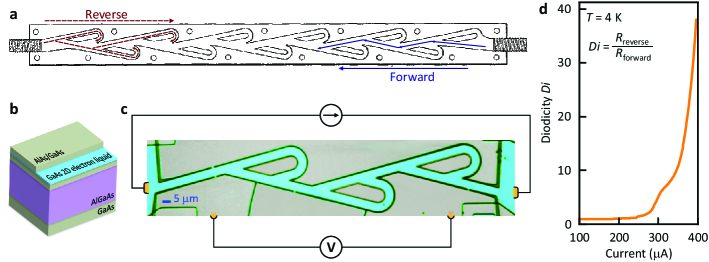
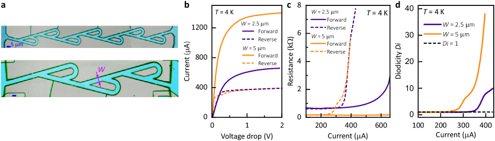
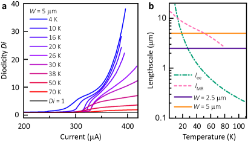
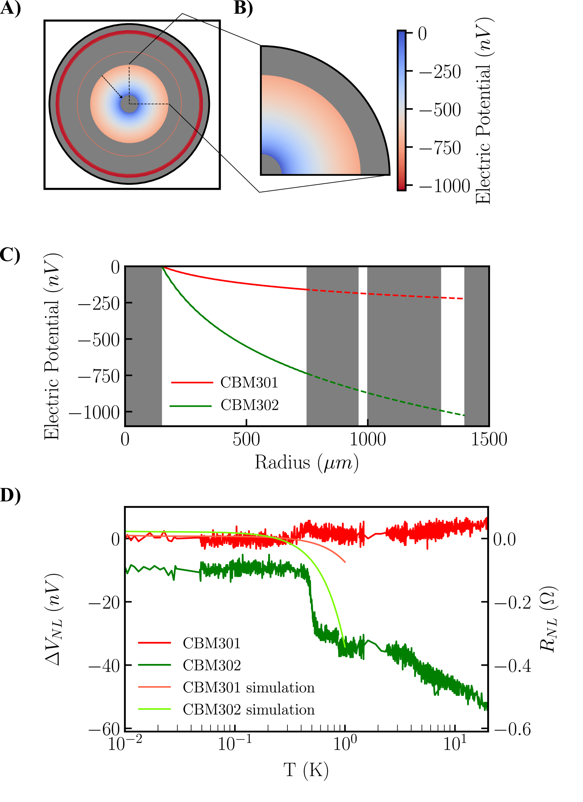
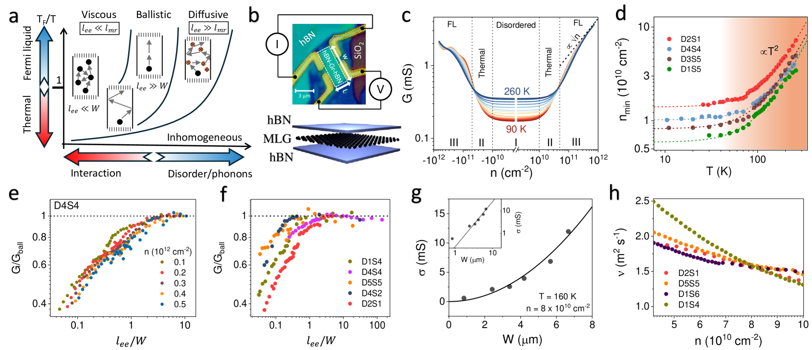
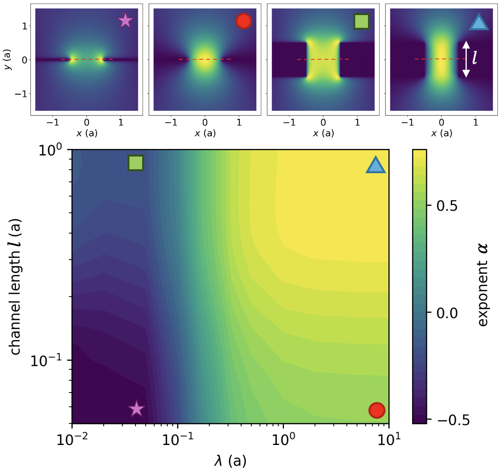
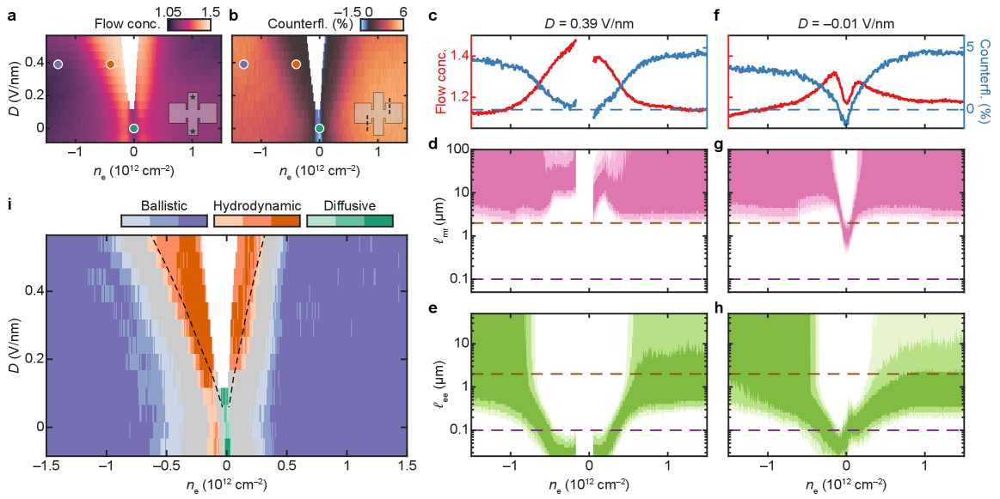
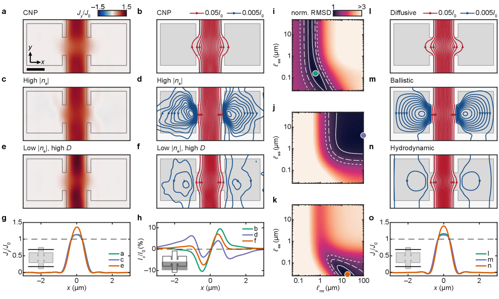

# 「電子テスラバルブ」の実現：流体的電子が示す整流と乱流への入口

- **執筆日**: 2026-03-24
- **トピック**: 高移動度 GaAs 2次元電子系における固体電子テスラバルブの実現と電子乱流の示唆
- **注目論文**: 2603.16443
- **参照した関連論文数**: 8本

---

## 1. 導入：電子が「流体」として振る舞うとはどういうことか

固体中の電子は、通常、個々がランダムに動き回りながら格子の不完全性に衝突する粒子として扱われる。この粒子的描像は「ドルーデ模型」として100年以上にわたり電気伝導の基礎をなしてきた。しかし近年、**電子同士が頻繁に衝突し合い、集団的な「流体」として振る舞う**ことが実験的に確かめられつつある。

水や空気が流れるとき、個々の分子の運動量は分子間衝突によって素早く再分配され、マクロな速度場として記述できる。これと同じことが電子系でも起こる条件がある。すなわち、電子‐電子散乱長 $\ell_{ee}$（電子が互いに衝突するまでに進む距離）が、系のサイズ $W$ や運動量緩和長 $\ell_{MR}$（不純物や格子との衝突で電子の運動量が失われるまでの距離）よりも十分短いとき、

$$\ell_{ee} \ll W \ll \ell_{MR}$$

電子液体はナビエ‐ストークス方程式に従うような「粘性流体」として振る舞う。これを**電子流体力学体制**（hydrodynamic regime）と呼ぶ。

この状況が実現されるのは、超高純度の物質（グラフェン、GaAs/AlGaAs ヘテロ構造など）を低温で用いるときである。グラフェンや 2次元電子系（2DEG）では、フォノンが凍結し不純物散乱が小さくなる数ケルビン以下で、電子‐電子クーロン散乱が支配的となり、電子液体的な輸送が現れる。

電子流体力学が面白いのは、単に流体力学の比喩的な説明にとどまらず、**流体力学的な現象がそのまま固体電子系でも観測される**からである。電子の渦（ホワールプール）[2408.00182]、超音速流とショック波 [2509.16321]、そして今回の注目論文が示す**電子テスラバルブによる整流と乱流遷移の示唆** [2603.16443] は、その最前線の成果である。

---

## 2. 解決すべき問い

電子流体力学の研究が活発になって久しいが、これまでの実験の多くは「流れのイメージング」か「負の非局所抵抗」などの線形応答の検証に集中してきた。しかし流体力学の世界では**非線形効果**こそが豊かな現象をもたらす。たとえば：

- **層流から乱流への遷移**（レイノルズ数が閾値を超えると流れが乱れる）
- **テスラバルブ**（移動部品なしに流れを一方向に整流するパッシブ素子）
- **ド・ラバルノズル**（超音速流とショックを生み出すノズル形状）

これらの非線形流体現象を電子系で実現・観測できるか、という問いが、近年の電子流体力学研究の中心的テーマとなりつつある。

とりわけ長年の未解決問題が、「**電子乱流**」の存在である。Reynolds 数が大きくなると流れが乱流に転移することは古典流体では常識だが、固体電子系では理論的に予言されていながら、実験的証拠は皆無に近かった。電子の乱流状態は新しい電子液体の相として理論的に予測されており、その実証は凝縮系物理学の重要な未開拓領域である。

---

## 3. 注目論文は何を新しく示したのか

### 3.1 電子テスラバルブの概念と設計

Sarypov et al. (2603.16443) は、高移動度 GaAs/AlGaAs ヘテロ構造の 2次元電子ガス（2DEG）の中に、**固体電子テスラバルブ**をリソグラフィで作製した。

テスラバルブとは、ニコラ・テスラが 1920 年に特許を取得した受動型流体ダイオードで、弁や可動部品を持たずに流れを一方向に整流する。前進方向（順方向）では流体はほぼ直線的に流れるが、逆方向では流体がループ状のバイパスに流れ込んで干渉し、大きな抵抗を生じる。高いレイノルズ数（乱流領域）では整流比（diodicity; 逆方向抵抗 / 順方向抵抗）が特に大きくなる。

電子版テスラバルブでは、GaAs/AlGaAs ヘテロ構造内の 2DEG を、テスラバルブと同じ形状（直線チャネルに非対称ループが連なる構造）にパターニングする。

*Fig. 1: 電子テスラバルブの設計と実装。(a) テスラのオリジナル特許に基づく流体弁のスキーム、(b) GaAs/AlGaAs ヘテロ構造の断面（2DEG層を示す）、(c) リソグラフィで作製した電子テスラバルブの光学顕微鏡写真、(d) 測定配置と整流比。(Sarypov et al., arXiv:2603.16443, CC BY 4.0)*

### 3.2 整流比 10 倍以上：驚くべき実験結果

この実験の核心的な結果を図 2 に示す。

*Fig. 2: 電子テスラバルブの電気特性。様々なチャネル幅を持つバルブの電流‐電圧特性（4 K）で、逆方向に顕著な非線形性が現れる。順方向と逆方向の抵抗の比（diodicity D）は電流増大とともに急増し、最大で 10 倍を超える。(Sarypov et al., arXiv:2603.16443, CC BY 4.0)*

4 K という低温において、電流を増大させると逆方向の抵抗が急激に増大し、整流比が 10 倍以上に達した。特徴的なのはこの変化が**閾値的（abrupt）**であること——電流がある値を超えると、抵抗が急激にジャンプする。これはまさに、古典的なテスラバルブで乱流が生じるときの振る舞いに対応している。

比較のため、同じ素材でループ構造を持たない直線チャネルを作製したところ（Fig. 4 of original paper）、整流比はほぼ 1 のまま（対称）であった。このことは、整流がチャネル幾何学に由来するものであって、電子‐電子散乱が存在しなければ実現しないことを強調している。

### 3.3 温度依存性：電子乱流への示唆

*Fig. 3: 整流比の温度依存性（4 K から 70 K）と特性長スケールの比較。整流が消える温度は、電子‐電子平均自由行程 $\ell_{ee}$ がデバイスの幅 $W$ と同程度になる温度に対応する。(Sarypov et al., arXiv:2603.16443, CC BY 4.0)*

整流比は温度上昇とともに消える（70 K では事実上消失する）。興味深いのは、整流が消える温度が、電子‐電子平均自由行程 $\ell_{ee}$ がバルブ幅 $W$ に匹敵するようになる温度と一致することである。これは、整流効果が純粋に「電子流体の粘性と非線形効果」に起因していることを示す強い証拠である。

機構は次のように理解できる：電子が流体的に振る舞う（$\ell_{ee} \ll W$）ときのみ、テスラバルブ形状が流れの非対称性を生み出し、逆方向に乱流的な乱れが生じる。$\ell_{ee}$ が大きくなるにつれ電子が弾道的になり、流体的な非線形効果が消えて整流も消える。

---

## 4. 背景と文脈：この注目論文はどこに位置づくか

### 4.1 電子流体力学の実験的進展

電子流体力学の実験的証拠は 2016 年以降に急速に積み重なってきた。グラフェンでは電子の渦（ホワールプール）を示す負の非局所抵抗が観測され、さらに 2024 年には室温での電流渦がナノスケールの磁気センサーを用いて直接撮像された [2408.00182]。

GaAs/AlGaAs 2DEG でも電子流体力学体制が実証されている。Vijayakrishnan et al. (2405.17588) は、同心円環状のコルビノ幾何学を持つ GaAs/AlGaAs 2DEG で非局所輸送測定を行い、電流経路から遠く離れた場所でも粘性的な流れが存在することを示した。ナビエ‐ストークス方程式によるシミュレーションが 1 K 以下の実験データとよく一致しており（Fig. 4 に示す）、電子の粘性輸送の直接的な証拠を与えている。

*Fig. 4: GaAs/AlGaAs コルビノ環における粘性電子流。(a) ナビエ‐ストークス方程式シミュレーションの流れ場、(b) 実験データとシミュレーションの比較（1 K 以下）。電流経路から遠い場所でも粘性的な非局所輸送が観測される。(Vijayakrishnan et al., arXiv:2405.17588, CC BY 4.0)*

### 4.2 グラフェンにおける量子臨界電子流体

単層グラフェンのディラック点近傍では、電子と正孔が対称的に存在し（アンビポーラ体制）、電子流体は相対論的量子流体的な性質を持つ。Majumdar et al. (2501.03193) は超高純度グラフェンデバイスで電気・熱伝導率を同時測定し、量子臨界伝導率が複数のデバイスで $(4\pm1)e^2/h$ という普遍値に収束することを実証した（図 5）。さらに、ヴィーデマン‐フランツ則の破れが古典的な期待値の 200 倍以上に達し、熱粘性率がホログラフィック予測（$\eta_s \sim \hbar n / 4\pi k_B T$）に因子 4 以内で近づくことも示した。

*Fig. 5: 超高純度グラフェンにおける量子臨界電子流体。粘性電子流の輸送体制（上段）、電気伝導率の温度依存性（中段）、および量子臨界伝導率の普遍性（下段）。(Majumdar et al., arXiv:2501.03193, CC BY 4.0)*

これらの先行研究が示すように、GaAs 2DEG とグラフェンはいずれも電子流体力学の実験的検証に優れたプラットフォームである。注目論文 [2603.16443] は、この文脈の中で、「線形応答の観測」から「非線形・乱流的な機能デバイス」へと研究の焦点を大きく前進させた。

---

## 5. メカニズム・解釈・比較

### 5.1 テスラバルブの整流メカニズム：乱流が鍵

古典的なテスラバルブで整流が起きるメカニズムは次のようなものだ。順方向では流体は直線チャネルを流れ、ループはほとんど寄与しない。逆方向ではループへの流れ込みが起き、ループを出た流れと直線チャネルの流れが衝突・干渉する。この干渉により、**レイノルズ数** $\text{Re} = vL/\nu$（ここで $v$ は代表速度、$L$ は代表長さ、$\nu$ は動粘性率）が高い（乱流的な）条件では逆方向抵抗が急増する。

電子版でも同じ論理が働く。電子流体の動粘性率 $\nu_{el}$ は近似的に

$$\nu_{el} \approx \frac{1}{4} v_F \ell_{ee}$$

で与えられる（ここで $v_F$ はフェルミ速度）。これは電子ガスにおける気体論的な粘性率の表式に対応している。低温・高純度条件では $\ell_{ee}$ が長くなるため $\nu_{el}$ が大きく、通常は Re が小さく層流的である。しかし十分な電流（ドリフト速度）を印加すると Re が増大し、閾値で乱流遷移が起きる。

これが今回の実験における「整流比の閾値的増大」の物理的起源と解釈される。

### 5.2 幾何学による電子流の制御：理論的裏付け

Haidari-Jafari et al. (2601.17229) は、ブリンクマン方程式（ナビエ‐ストークス方程式に運動量緩和項を加えたもの）を使い、幾何学的な障害物が粘性電子流にどのような効果をもたらすかを理論的に解析した。

$$\eta \nabla^2 \mathbf{v} - \frac{\mathbf{v}}{\ell_{MR}^2} = \nabla P$$

ここで $\eta$ は粘性率、$\mathbf{v}$ は速度場、$\ell_{MR}$ は運動量緩和長（$= \sqrt{\eta/\sigma_0}$）、$P$ は圧力である。彼らの主要な発見は、**鋭い障害物が局所的に電流を増強し、遠方では流れを抑制する**「幾何学的スキン効果」の存在である。

*Fig. 6: 幾何学的スキン効果。障害物近傍での電流増強と遠方での抑制を示す位相図。（Haidari-Jafari et al., arXiv:2601.17229, CC BY-SA 4.0）*

この理論は、テスラバルブ形状における逆方向流れの抵抗増大にも示唆を与える。テスラバルブのループ構造は局所的な流れを大きく乱し、非線形・乱流的な転移を促進しやすい幾何学となっている。

### 5.3 非線形電子流の最前線：超音速流と非相反輸送

注目論文と同系統の非線形電子流体現象として、超音速電子流とショック波の観測 [2509.16321] も注目される。Berdyugin et al. は二層グラフェンでド・ラバルノズル型の形状を作製し、電子が「電子的音速」を超えて流れ、ショック波的な振る舞いを示すことを報告した。電子的音速 $c_s$ は

$$c_s = \sqrt{\frac{ne^2 d}{2\epsilon_0 \epsilon m^*}}$$

（ここで $n$ はキャリア密度、$d$ はゲートとの距離、$m^*$ は有効質量）で与えられる。この超音速流の観測は、電子液体の非線形・圧縮性効果の直接的な証拠であり、今回のテスラバルブにおける乱流的な振る舞いと同じ「電子流体力学の非線形領域」への踏み込みである。

さらに Kirkinis et al. (2503.01955) は、時間反転対称性の破れた非中心対称導体における流体電子輸送の非相反性（非互恵性）を理論的に解析した。このような系では粘性率が流れの速度に線形比例する速度依存粘性が現れ、通常の障害散乱支配の体制に比べて非相反効果が大幅に増強される。テスラバルブが整流（非相反性）を実現するデバイスである観点から、この理論的枠組みは今後の設計指針として重要となる。

### 5.4 フラットバンドグラフェンにおける電子流体のイメージング

Krebs et al. (2603.11175) は、バイアスされた二層グラフェンを走査型超伝導磁気センサーで直接撮像し、キャリア密度と変位場の相空間全体にわたる輸送体制マップを作製した（図 7）。

*Fig. 7: バイアス二層グラフェンにおける輸送体制の相図。弾道的・流体力学的・拡散的の三つの体制が、キャリア密度（$n$）と変位場（$D$）の関数として示される。フラットバンド領域で流体力学体制が最も強く現れる。(Krebs et al., arXiv:2603.11175, CC BY 4.0)*

特筆すべきは、フラットバンド領域では電子‐電子散乱長が **50 nm 程度**（フェルミ波長と同程度）まで短くなることを見出した点である。これは電子流体力学デバイスの大幅な「ミニチュア化」を可能にするものであり、注目論文の GaAs 系と異なるアプローチながら、電子流体力学の材料基盤を広げる重要な成果である。

また同論文は、高電流印加時に流れの非線形性が現れることも示しており、テスラバルブで観測された非線形整流と同じ物理的基盤（高 Re 数での非線形効果）を持つことが示唆される。

---

## 6. 材料・手法・応用への広がり

### 6.1 材料系の多様性

電子流体力学の研究は今や複数の材料系で進行している。

GaAs/AlGaAs ヘテロ構造では、極低温（1 K 以下）で最高クラスの移動度（$\mu > 10^7$ cm²/Vs）が実現でき、電子‐電子散乱が支配的な「清潔な」電子液体が得られる。今回の注目論文 [2603.16443] はこの系を用いており、ナビエ‐ストークス的な電子流体を実証する古典的なプラットフォームである。

グラフェン（単層・多層）では、ディラック電子の線形分散によりフェルミ速度が $v_F \approx 10^6$ m/s と大きく、相対論的流体力学が適用できる。室温でも電子流体的な効果が観測される点 [2408.00182] はデバイス応用に有利である。さらにバイアス二層グラフェンでは、ゲート電圧で有効質量（バンド曲率）を連続的に制御できるため [2603.11175]、電子‐電子散乱長を電気的にチューニングでき、「電子流体力学体制のオンデマンド制御」が可能になりつつある。

WTe₂ などのワイル半金属やトポロジカル半金属でも電子液体的な輸送が報告されており、電子の渦の直接観測 [2202.02798] などが実現されている。これらの系では、異常ホール効果や奇数粘性率（Hall viscosity）などの非自明なトポロジカル効果と流体力学的効果が絡み合うことが予想される。

### 6.2 電子流体力学の測定手法

電子流体力学体制の検証には複数の相補的な手法が使われている。

**電気輸送測定**は最も基本的な手法で、ホールバーや特殊形状の試料における局所・非局所抵抗を測定する。負の非局所抵抗は電子渦の存在を示す間接的証拠となる。Madhogaria et al. (2602.16847) はグラフェン FET の四端子電気輸送測定から粘性的な寄与を系統的に抽出する現象論的手法を開発し、デバイスごとの大きなばらつきをどのように解釈するかという実験的課題にも取り組んでいる。

**ナノスケールイメージング**は電子流の空間分布を直接可視化する強力な手法である。NV センターや SQUID-on-tip を探針とした走査型磁気顕微鏡は、電流経路が生み出す微小磁場をナノメートル分解能で計測できる。Krebs et al. (2603.11175) はこの手法をフラットバンド二層グラフェンに適用し、輸送体制の「リアルスペース地図」を初めて描き出した（図 8）。

*Fig. 8: 走査型超伝導磁気センサーによる電流流れパターンのイメージング。弾道的・流体力学的・拡散的の三体制が異なるキャリア密度・変位場条件で示される。(Krebs et al., arXiv:2603.11175, CC BY 4.0)*

### 6.3 機能デバイスへの展開

今回の注目論文の最も重要な意義は、**電子流体力学を「機能デバイス」に応用した最初の例**の一つであることだ。従来の電子流体力学の研究は主に「現象の実証」に集中していたが、テスラバルブの実現は「機能の実証」であり、流体デバイスの設計思想（フルイディクス; fluidics）を電子系に直接移植できることを示した。

可動部品なし・半導体接合なしで動作する電子整流素子は、p-n 接合に代わる新原理デバイスとして興味深い。ただし現状は極低温（4 K）での動作に限られており、室温でのデバイス応用には、より短い $\ell_{ee}$（よりカップリングが強い材料）や、バンド工学による $\ell_{ee}$ の短縮 [2603.11175] が必要となる。

さらに、Kirkinis et al. (2503.01955) が示した「時間反転対称性の破れた系での非相反輸送の増強」を利用すれば、磁化状態に依存して整流比が変化する「磁気的に制御可能な電子テスラバルブ」も原理的に構想できる。

---

## 7. 基礎から理解する

### 7.1 ドルーデ模型から電子流体力学へ

通常の金属電気伝導は**ドルーデ模型**で記述される。電子は不純物や格子振動に散乱されながら電場 $E$ で加速され、電流密度 $j$ が生まれる：

$$\mathbf{j} = \sigma_0 \mathbf{E}, \qquad \sigma_0 = \frac{ne^2 \tau_{MR}}{m^*}$$

ここで $n$ はキャリア密度、$e$ は電気素量、$\tau_{MR}$ は運動量緩和時間（不純物散乱）、$m^*$ は有効質量である。この描像では電子同士の散乱は（全運動量を保存するため）直接は抵抗に寄与せず、無視される。

ところが電子‐電子散乱時間 $\tau_{ee}$ が十分短くなると、電子は互いに頻繁に衝突してローカルな熱平衡（局所平衡）を達成する。このとき電子系は密度 $n$ と流速 $\mathbf{u}$ で特徴づけられる「流体」として振る舞い、**ナビエ‐ストークス方程式**が適用できる：

$$\rho \left( \frac{\partial \mathbf{u}}{\partial t} + (\mathbf{u} \cdot \nabla) \mathbf{u} \right) = -\nabla P + \eta \nabla^2 \mathbf{u} + \mathbf{f}_{ext} - \frac{\rho \mathbf{u}}{\tau_{MR}}$$

ここで $\rho = m^* n$ は電子の質量密度、$P$ は圧力（電荷中性条件では化学ポテンシャルと関係）、$\eta$ はずり粘性率（shear viscosity）、$\mathbf{f}_{ext} = en\mathbf{E}$ は外力項、最後の項は不純物散乱による運動量緩和を表す。

電気伝導の文脈では $\mathbf{j} = en\mathbf{u}$ として電流密度と速度場を結びつけると、電子の Stokes 方程式（低 Re 数）が得られる：

$$\mathbf{j} = \sigma_0 \mathbf{E} + \eta \nabla^2 \mathbf{u}$$

これがドルーデ項（第1項）に加えて、粘性的な非局所拡散項（第2項）を含む「電子流体力学方程式」の本質である。

### 7.2 電子の動粘性率とレイノルズ数

2次元フェルミ気体における動粘性率（kinematic viscosity）$\nu = \eta/\rho$ は、気体運動論的な計算から：

$$\nu_{el} \approx \frac{1}{4} v_F \ell_{ee}$$

と評価される。ここで $v_F$ はフェルミ速度、$\ell_{ee} = v_F \tau_{ee}$ は電子‐電子散乱平均自由行程である。GaAs 2DEG では典型的に $v_F \sim 10^5$ m/s、$\ell_{ee} \sim 1$ µm（4 K）程度なので、$\nu_{el} \sim 0.025$ m²/s となる。水の動粘性率 $\nu_{water} \approx 10^{-6}$ m²/s と比較すると電子液体は極めて粘性が高い。

**レイノルズ数**は流体の「慣性力 / 粘性力」の比であり、乱流遷移の指標となる：

$$\text{Re} = \frac{v \cdot W}{\nu_{el}} = \frac{4 v_{drift} W}{v_F \ell_{ee}}$$

ここで $W$ はチャネル幅、$v_{drift} = j/ne$ は電子のドリフト速度である。テスラバルブの実験では、十分に大きな電流（$\sim$ µA）を流すと $v_{drift}$ が増大して Re が閾値（古典流体では $\text{Re} \sim 2000$）を超え、乱流的な転移が起きると考えられる。

### 7.3 電子液体の輸送体制：4つの体制

電子輸送の体制は、3つの長さスケールの大小関係によって決まる：

| 体制 | 条件 | 物理的描像 |
|------|------|-----------|
| 弾道的（ballistic） | $\ell_{ee}, \ell_{MR} \gg W$ | 電子はチャネル内を壁のみに散乱しながら自由に飛ぶ |
| 流体力学的（hydrodynamic） | $\ell_{ee} \ll W \ll \ell_{MR}$ | 電子が互いに頻繁に衝突し流体として振る舞う |
| 拡散的（diffusive/Ohmic） | $\ell_{MR} \ll W$ | 不純物散乱が支配；通常の Ohm の法則 |
| 流体力学的乱流 | Re ≫ 1（流体体制内） | 非線形対流項が重要；速度場が乱れる |

注目論文は、4つ目の「乱流」体制への最初の実験的示唆を与えている。

### 7.4 粘性のマクロな観測：ポアズイユ流

円管や平板間を流れる粘性流体では、**ポアズイユ流**（Poiseuille flow）と呼ばれる放物線型の速度プロファイルが現れる：

$$v(y) = \frac{v_{max}}{W^2/4} \left( \frac{W^2}{4} - y^2 \right) = v_{max} \left( 1 - \frac{4y^2}{W^2} \right)$$

ここで $y$ はチャネル中央からの距離、$W$ はチャネル幅、$v_{max}$ は中央の最大速度。電子流体でも同様なポアズイユ的プロファイルが期待されており、ナビエ‐ストークスシミュレーション [2405.17588] やイメージング実験 [2603.11175] によってその存在が確かめられている。

流量 $Q$（単位幅あたり）は粘性率で決まる：

$$Q = \int_{-W/2}^{W/2} v(y) \, dy = \frac{v_{max} W}{1.5} \propto \frac{W^3 \nabla P}{\eta}$$

この関係は電子流体力学的な整流デバイスの設計において、チャネル幅 $W$ と粘性率 $\eta$（$= m^* n \nu_{el}$）が重要なパラメータであることを示している。

---

## 8. 重要キーワード 10 個の解説

**① 電子流体力学体制（hydrodynamic regime）**

電子‐電子散乱が支配的で（$\ell_{ee} \ll W$）かつ不純物散乱が弱い（$W \ll \ell_{MR}$）とき、電子系がナビエ‐ストークス方程式に従う流体として振る舞う条件。「電子流体力学体制」とも呼ばれる。この体制が実現されると、渦形成、ポアズイユ流プロファイル、スーパーバリスティック輸送など、通常の Ohm の法則では予測できない現象が現れる。

**② テスラバルブ（Tesla valve）**

ニコラ・テスラが 1920 年に特許を取得した、可動部品なしで流体を一方向に整流するパッシブ素子。非対称なループ形状が逆方向の流れに大きな抵抗を与える。整流効果は高レイノルズ数（乱流体制）でより顕著になり、整流比（diodicity）が 10 以上に達する。今回の注目論文はこの原理を電子液体に応用した。

**③ 整流比・ダイオダシティ（diodicity, D）**

テスラバルブなどの整流デバイスの性能指標で、逆方向と順方向の抵抗比として定義される：

$$D = \frac{R_{reverse}}{R_{forward}}$$

今回の電子テスラバルブでは $D > 10$ が達成された。一般的な p-n ダイオードでは整流比は指数関数的に大きくなれるが、テスラバルブは受動素子であり $D$ は有限値にとどまる。

**④ レイノルズ数（Reynolds number, Re）**

流体の「慣性力 / 粘性力」の無次元比で、流体力学的な体制を特徴づける：

$$\text{Re} = \frac{v L}{\nu}$$

ここで $v$ は特徴的な流速、$L$ は特徴的な長さ、$\nu = \eta/\rho$ は動粘性率。Re $\lesssim 1$ は低粘性（Stokes 流れ）、Re ~ 2000 以上で乱流遷移が起きる（古典流体の管内流）。電子液体では電流に比例した $v_{drift}$ と電子‐電子平均自由行程 $\ell_{ee}$ から決まる $\nu_{el}$ によって Re が定まる。

**⑤ 動粘性率（kinematic viscosity, ν）**

粘性率（せん断粘性率）$\eta$ を密度 $\rho$ で割った量：$\nu = \eta/\rho$。流れのパターンを決める無次元数（レイノルズ数）に直接現れる。電子液体では気体運動論的な議論から $\nu_{el} \approx v_F \ell_{ee} / 4$ と近似される。グラフェン近傍では量子臨界点での粘性率がホログラフィックな下限（AdS/CFT 対応から导かれる $\eta/s = \hbar/4\pi k_B$、ここで $s$ はエントロピー密度）に近づくことが報告されている [2501.03193]。

**⑥ 運動量緩和長（momentum relaxation length, $\ell_{MR}$）**

電子が不純物や格子との散乱で運動量を失うまでに進む距離。$\ell_{MR} = v_F \tau_{MR}$ と表される。電子流体力学体制では $\ell_{MR} \gg W$ が要求されるため、超高純度試料（GaAs/AlGaAs ヘテロ構造や hBN 封入グラフェン）を用いることが必要。ブリンクマン方程式では $\ell_{MR}^2 = \eta/\sigma_0$ と定義され（$\sigma_0$ は Drude 伝導率）、電子流の空間的な「染み出し」長を決める。

**⑦ ポアズイユ流（Poiseuille flow）**

粘性流体が平行板間や円管内を定常に流れるとき現れる放物線型速度プロファイル。境界条件（no-slip 条件）と粘性によって生じる。流量は管の半径（または板間距離）の 4 乗に比例し、粘性率に反比例する（Hagen-Poiseuille 則）。電子流体では移動度に上限が現れる「スーパーバリスティック」効果として現れ、単純なバリスティック輸送予測（Sharvin 伝導度）を超える伝導が観測される。

**⑧ ブリンクマン方程式（Brinkman equation）**

ナビエ‐ストークス方程式に運動量緩和項を加えた方程式で、電子流体力学に特に有用：

$$\eta \nabla^2 \mathbf{u} - \frac{\eta}{\ell_{MR}^2} \mathbf{u} = \nabla P - en\mathbf{E}$$

右辺は駆動力（電場と圧力勾配）、左辺の第 1 項は粘性力（空間的な速度勾配を均す）、第 2 項は運動量緩和を表す。$\ell_{MR} \to \infty$ でナビエ‐ストークス方程式、$\ell_{MR} \to 0$ でドルーデ模型に帰着する。Haidari-Jafari et al. (2601.17229) はこの方程式を用いて幾何学的スキン効果を解析した。

**⑨ 幾何学的スキン効果（geometric skin effect）**

粘性電子流において、障害物や狭窄部の近傍で電流が局所的に増強され、遠方では抑制される現象。ブリンクマン方程式の解析から [2601.17229]、障害物付近では流体が加速される一方、障害物から離れた場所では運動量緩和によって速度が減衰するためにこの分布が生まれる。通常の弾道的輸送では観測されず、粘性的な流体力学的輸送の特徴的な証拠となる。

**⑩ ホログラフィック粘性限界（holographic viscosity bound）**

AdS/CFT 対応（反ド・ジッター空間 / 共形場理論の対応）というひも理論から導かれた、粘性率とエントロピー密度の比の下限：

$$\frac{\eta}{s} \geq \frac{\hbar}{4\pi k_B}$$

ここで $\eta$ はずり粘性率、$s$ は体積あたりのエントロピー密度。この下限は「最もパーフェクトな流体」の上限をも意味し、クォーク‐グルーオンプラズマや冷却原子系などでほぼ達成されることが知られている。グラフェンの量子臨界点近傍においても [2501.03193] この限界に因子 4 以内で近づくことが実験的に確かめられており、電子液体が「ほぼ理想的な流体」であることを示している。

---

## 9. まとめと今後の論点

### 9.1 注目論文の意義の再確認

Sarypov et al. (2603.16443) の電子テスラバルブは、以下の点で電子流体力学研究の新たなマイルストーンである。

**新規性の核心**: 流体力学的な非線形デバイス——整流素子——を固体中の電子流体で初めて実現した。しかもその整流比が 10 倍以上という大きな値を示し、閾値的な転移（乱流遷移の示唆）を伴っていること。

**物理的意義**: 電子乱流は長年の予言であったが、固体中では実験的検証が困難であった。今回の閾値的な整流比増大は、電子乱流への傍証となる初めての実験的証拠と解釈できる（直接観測ではないが）。

**応用への示唆**: 流体デバイス（フルイディクス）の設計思想を電子系に適用できることを実証し、新原理の固体電子デバイス設計の地平を拓いた。

### 9.2 今後の論点と課題

1. **電子乱流の直接観測**: 整流比の閾値的転移は乱流の示唆にとどまる。電子乱流を確認するには、電流のリアルタイムイメージングによる「乱れた流れ」の直接観察が必要である。走査型磁気センサー [2603.11175] や NV センター顕微鏡はその候補技術となる。

2. **室温動作への道**: 現状は 4 K 以下での動作に限られる。室温での電子流体力学デバイスを実現するには、グラフェン（既に室温でも電子渦が観測 [2408.00182]）や、より強い電子‐電子相互作用を持つ材料系（強相関系、フラットバンド系 [2603.11175]）の活用が鍵となる。

3. **非相反性の設計**: Kirkinis et al. (2503.01955) の理論が示すように、時間反転対称性の破れた材料を用いることで整流比をさらに増強できる可能性がある。磁場や磁化によるチューナブルな電子テスラバルブは魅力的な展開先である。

4. **電子流体力学の本格的デバイス応用**: テスラバルブに続き、電子ポンプ、流体論理ゲート（ANDやORに相当する流体デバイス）、渦ベースのメモリ素子など、流体デバイスの概念全般を電子系に移植する試みが加速することが予想される。

5. **グラフェン以外の 2D 材料**: TaIrTe₄、WTe₂ などのトポロジカル半金属では、奇数粘性率（Hall viscosity）やトポロジカルな効果と流体力学的効果が重なる可能性があり、電子流体力学の新しい局面が開けるかもしれない。

---

## 10. 参考にした論文一覧

| 番号 | arXiv ID | タイトル | 役割 | ライセンス |
|------|----------|---------|------|-----------|
| [1] | [2603.16443](https://arxiv.org/abs/2603.16443) | Electron Tesla valve | **注目論文** | CC BY 4.0 |
| [2] | [2603.11175](https://arxiv.org/abs/2603.11175) | Imaging flat band electron hydrodynamics in biased bilayer graphene | 関連：可視化 | CC BY 4.0 |
| [3] | [2602.16847](https://arxiv.org/abs/2602.16847) | Electron viscosity and device-dependent variability in four-probe electrical transport in ultra-clean graphene FETs | 関連：測定手法 | CC BY 4.0 |
| [4] | [2601.17229](https://arxiv.org/abs/2601.17229) | Geometry-Induced Skin Effect in Electron Hydrodynamics | 関連：理論 | CC BY-SA 4.0 |
| [5] | [2501.03193](https://arxiv.org/abs/2501.03193) | Universality in quantum critical flow of charge and heat in ultra-clean graphene | 関連：グラフェン量子臨界 | CC BY 4.0 |
| [6] | [2405.17588](https://arxiv.org/abs/2405.17588) | Two-dimensional hydrodynamic viscous electron flow in annular Corbino rings | 関連：GaAs 粘性流 | CC BY 4.0 |
| [7] | [2503.01955](https://arxiv.org/abs/2503.01955) | Nonreciprocity of hydrodynamic electron transport in noncentrosymmetric conductors | 関連：非相反輸送理論 | arXiv 非独占 |
| [8] | [2509.16321](https://arxiv.org/abs/2509.16321) | Supersonic flow and hydraulic jump in an electronic de Laval nozzle | 関連：超音速電子流 | arXiv 非独占 |
| [9] | [2408.00182](https://arxiv.org/abs/2408.00182) | Observation of current whirlpools in graphene at room temperature | 関連：渦の直接観測 | Science/AAAS |

---

*本記事の執筆にあたっては、図版の再利用可否を厳密に確認しました。CC BY 4.0 および CC BY-SA 4.0 ライセンスの論文からのみ図版を使用し、arXiv 非独占ライセンスおよび商業誌版権の論文については図版を使用せず文章による説明にとどめました。*
