# BCC 金属・セラミックスにおけるき裂進展の計算材料科学：分子動力学・機械学習ポテンシャル・フェーズフィールド法の最前線

- **執筆日**: 2026-03-24
- **トピック**: BCC 金属・セラミックスの破壊メカニズムと計算材料科学的アプローチ
- **注目論文**: 2603.14883
- **参照した関連論文数**: 6本

---

## 1. 導入：なぜ今この話題か

金属や構造セラミックスが突然、予告なく割れる——「脆性破壊」は材料工学において最も根本的かつ危険な現象のひとつだ。航空機のエンジン翼、核融合炉のプラズマ対向壁、宇宙往還機の熱防護システム。これらすべての設計は、材料がどこまで破壊に耐えられるかを正確に予測できるかどうかにかかっている。

とりわけボディセンタード立方（BCC）構造を持つ金属、典型的にはタングステン（W）やモリブデン（Mo）は厄介だ。高温では延性的（変形しながら壊れる）な挙動を示すのに、ある温度を境に突然、脆性的（変形なしに割れる）へと転じる。この「脆性–延性遷移温度（DBTT: Ductile-to-Brittle Transition Temperature）」は実験的によく知られているが、「原子スケールで何が起きているか」については長い間、決定的な説明が得られていなかった。

2026年3月、Hussein らのグループは分子動力学（MD）シミュレーションを多スケールで実施し、タングステン単結晶の脆性破壊が「転位枯渇 → 双晶核生成 → ディスコネクションの積み重なり → き裂核生成」という明確なカスケードで進行することを示した（2603.14883）。この発見は、これまで唯象論的にしか理解されていなかった DBTT の原子論的メカニズムを具体的に提示し、新たな材料設計指針への道を開くものだ。

一方、同時期の関連研究では、機械学習インターアトミックポテンシャル（MLIP）を用いたセラミック破壊の定量予測（2503.18171）、フェーズフィールド法による脆性–延性遷移の連続体モデリング（2603.18040）、深層学習と変分原理を組み合わせた異方性フェーズフィールド（2603.20120）、結晶塑性との連成による粒径効果（2501.13882）、そして熱–力学連成モデルによるセラミックスの温度依存破壊（2603.04753）が相次いで報告されている。

これらはバラバラに見えて、実は「マルチスケール・マルチフィジックスでき裂進展を理解・予測する」という一つの大きな潮流を形成している。本記事では、この潮流の全体像を，注目論文を軸に据えながら俯瞰する。

---

## 2. 解決すべき問い

この分野が現在直面している核心的な問いは、以下の数点に整理できる。

**問い1：BCC 金属の脆性破壊はいかなる原子論的カスケードで進むのか？**
転位が枯渇したあと、タングステンはどのようにして双晶を形成し、それがなぜき裂に繋がるのか。実験では TEM 観察で双晶とき裂の共存が確認されているが、時間分解・空間分解の動的描像が欠けていた。

**問い2：水素などの不純物はどのように脆性化を加速させるのか？**
核融合炉では水素同位体（重水素・三重水素）がタングステン表面に照射され、水素バブルを形成する。これがどのようにき裂を誘発するかを原子スケールで追うには、W-H 二元系を精度よく記述できるポテンシャルが必要だ。

**問い3：セラミックスの異方性破壊はどこまで定量予測できるのか？**
TiB₂ や ZrB₂ などの遷移金属二ホウ化物は航空宇宙・切削工具材料として注目されるが、そのき裂進展は結晶方位・モード比に強く依存する。第一原理データに基づく MLIP でこれを網羅的に予測できるか？

**問い4：フェーズフィールド法は実験の破壊挙動をどこまで再現できるのか？**
フェーズフィールド法は偏微分方程式でき裂を「場」として扱い、界面追跡を必要としない強力な手法だ。しかし塑性との連成、温度依存性、異方性をどう組み込むかは各グループで異なる戦略がとられており、精度と汎用性のトレードオフが問われている。

これらの問いは互いに独立ではない。原子論的なメカニズムを連続体モデルに「橋渡し」することこそが、この分野の本質的な挑戦であり、本記事で紹介する研究群の共通テーマだ。

---

## 3. 注目論文は何を新しく示したのか

### タングステンの脆性破壊における"転位枯渇→双晶→ディスコネクション"カスケード

Hussein ら（2603.14883, CC BY 4.0）は、BCC タングステン単結晶ピラーを対象に、表面を持った多スケール MD シミュレーションを系統的に実施した。初期状態に1/2⟨111⟩プリズマティック転位ループを導入した試料を軸方向に圧縮し、温度・ひずみ速度・転位密度などのパラメータを広範囲で変化させた。

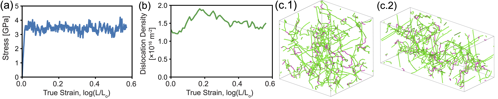
*図1. 周期境界条件下での低温・高ひずみ速度シミュレーション。延性的な転位運動が観察される。Hussein et al., arXiv:2603.14883 (2026), CC BY 4.0.*

シミュレーションが明らかにした脆性破壊の進行シーケンスは次のとおりだ：

1. **転位枯渇（Dislocation starvation）**：自由表面を持つ試料では、転位は表面から脱出しやすいため、変形初期に消耗されてしまう。これによってバルク内の移動転位密度が急激に低下し、応力が上昇する。

2. **双晶核生成（Twin nucleation）**：転位による変形ができなくなった系は、別の変形モードとして双晶を選ぶ。低温では熱活性化が乏しく、双晶は連続的に成長し、試料内部を占領する。

3. **ディスコネクションの積み重なり（Disconnection pile-up）**：双晶境界はコヒーレント（原子の対称性が保たれた）部分とインコヒーレント（乱れた）部分に分かれる。インコヒーレント双晶境界上に存在する「ディスコネクション」（転位と段差の複合的な欠陥）が、隣接するインコヒーレント部分から次々と進入・積み重なる。

4. **き裂核生成**：ディスコネクションが十分に積み重なると、インコヒーレント境界セグメントに沿って き裂が核生成・進展する。

*図2. 自由表面を持つ試料での脆性破壊シミュレーション。転位枯渇に続く双晶形成とき裂核生成が捉えられている。Hussein et al., arXiv:2603.14883 (2026), CC BY 4.0.*

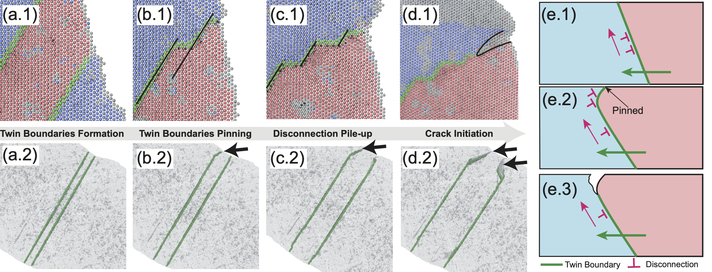
*図3. ディスコネクション積み重なりのメカニズム詳細。コヒーレント双晶境界（CTB）とインコヒーレント境界セグメント（ITB）の役割分担が示されている。Hussein et al., arXiv:2603.14883 (2026), CC BY 4.0.*

この研究の最大の貢献は、**DBTT を支配するのが「転位運動 vs. 双晶形成 vs. き裂進展」の競合**であることを原子レベルで直接示した点にある。さらに実験との比較（TEM 像で双晶ポケットとき裂経路の共存を確認）も行っており、シミュレーションの予測を実験が支持している。

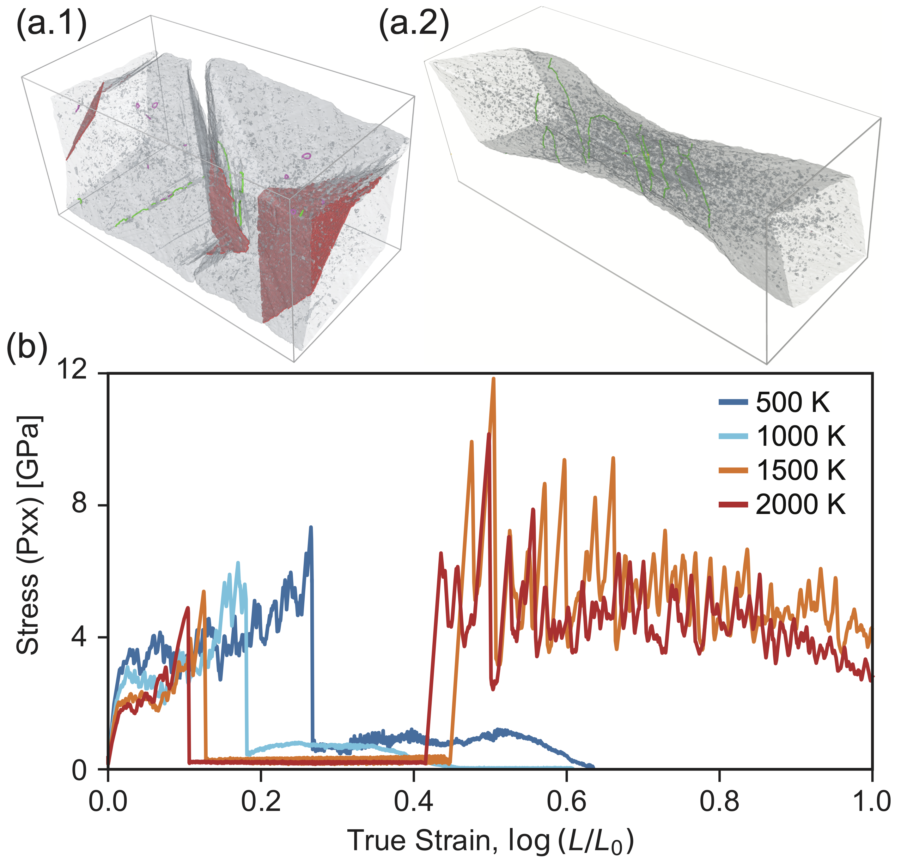
*図4. MD シミュレーションにより予測された DBTT と、初期転位密度依存性。転位密度を高めることで DBTT を低下（延性化）できることが示される。Hussein et al., arXiv:2603.14883 (2026), CC BY 4.0.*

設計への含意は明快だ。初期転位密度を高めること（たとえば前変形や合金化による転位源の増加）で転位枯渇を遅らせ、双晶形成とき裂核生成を抑制できれば、DBTT を低下させられる——つまりタングステンを「より延性的に」することが原理的に可能だ。

---

## 4. 背景と文脈：注目論文はどこに位置づくか

### Griffith 理論から現代の計算手法まで

き裂の力学は 1920 年代に Griffith が定式化した「エネルギー論」に端を発する。き裂が長さ $a$ だけ進展すると、弾性ひずみエネルギーが解放される一方、新たな破面を作るために表面エネルギーが消費される。平衡条件から「Griffith の破壊基準」が導かれる：

$$G = G_c = 2\gamma_s$$

ここで $G$ は**エネルギー解放率**（き裂が単位面積進展するごとに解放されるエネルギー）、$G_c$ は臨界値、$\gamma_s$ は固体の表面エネルギーだ。$G_c$ は**破壊靭性** $K_{Ic}$ と弾性定数を通じて $G_c = K_{Ic}^2 / E'$ の関係にある（平面ひずみ条件）。

1974 年には Rice と Thomson がき裂先端での転位放出条件を考察し、「き裂先端から転位が放出されやすい材料は延性的になる」という**Rice–Thomson 規準**を提唱した。この規準の左辺（転位放出に必要なエネルギー $G_d$）と右辺（破壊に必要なエネルギー $G_c$）の比 $G_d/G_c$ が 1 より大きいと延性的、1 より小さいと脆性的と判定される。しかし、この規準は平衡論的であり、動的な過程（転位枯渇、双晶形成、熱活性化など）を含まなかった。

**従来の MD の限界と MLIP の登場**：転位の動的挙動を追うためには分子動力学法が必要だが、従来の経験的ポテンシャル（EAM: Embedded Atom Method など）は第一原理データを経験的に近似したものであり、特定の欠陥構造に対する精度が不十分な場合があった。近年、ニューラルネットワークや線形回帰を用いた**機械学習インターアトミックポテンシャル（MLIP: Machine Learning Interatomic Potential）**が登場し、第一原理（DFT）の精度を保ちながら MD の速度を実現できるようになった。

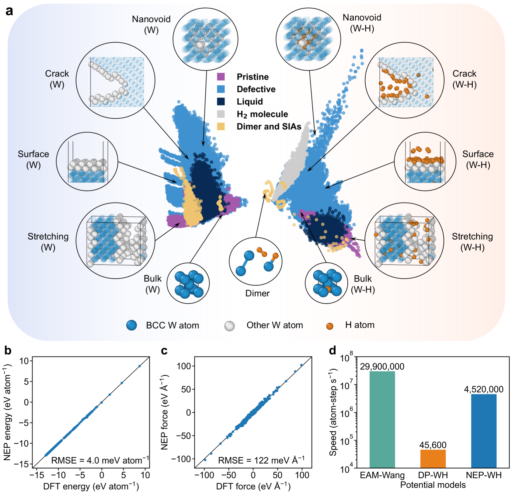
*図1. タングステン–水素系の NEP（Neuroevolution Potential）モデル。(a) 訓練データセットの分布、(b)-(c) DFT 参照値との比較（エネルギー・力）。Bao et al., arXiv:2508.20350 (2025), CC0.*

Bao ら（2508.20350, CC0）はタングステン–水素系を対象に、GPUMD フレームワーク上の NEP（Neuroevolution Potential）を用いた機械学習 MD シミュレーションを実施した。NEP は、DFT 計算で作成した 57,400 構造の訓練データから、高精度なポテンシャルエネルギー面を学習し、EAM や BOP（Bond-Order Potential）などの従来ポテンシャルよりも精度の高い水素挙動の再現を実現した。特に、ナノボイド内での水素トラッピングエネルギーや水素分子の動径分布関数（RDF）において、DFT-MD との優れた一致を示している。

---

## 5. メカニズム・解釈・比較

### 5.1 水素脆化のMLMD解析

核融合炉ではタングステン表面へのプラズマ照射によりナノボイドが形成され、ボイド内に水素が蓄積してバブルを形成する。Bao ら（2508.20350）のシミュレーションは、水素濃度が高まるにつれてき裂発生応力が急激に低下することを定量化した。

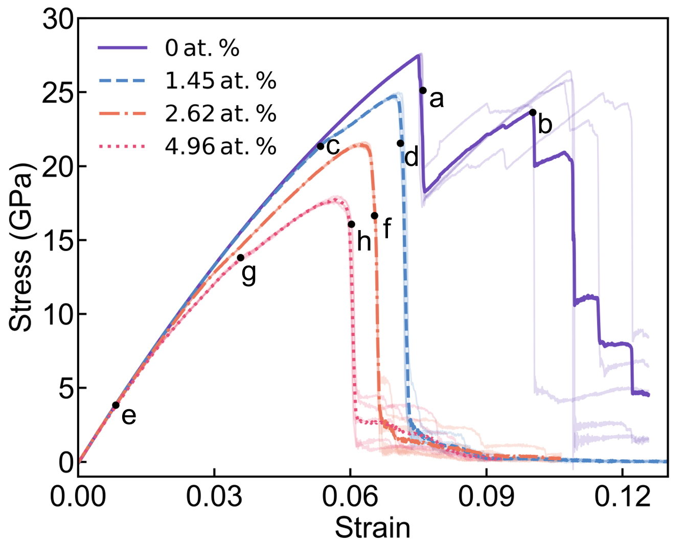
*図5. 1 nm ナノボイドを含むタングステンの [100] 方向引張応力–ひずみ曲線。水素濃度の増加（0→4.96 at.%）とともに破壊応力が顕著に低下する。Bao et al., arXiv:2508.20350 (2025), CC0.*

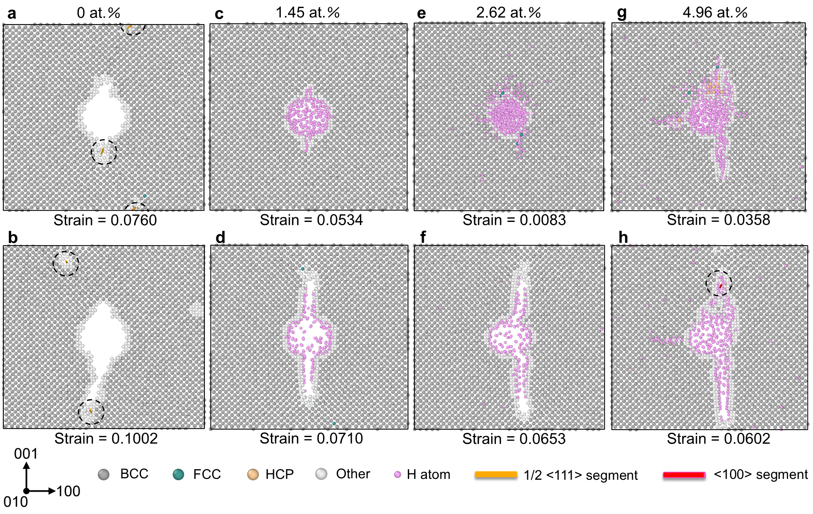
*図6. 異なる水素濃度下でのき裂核生成および進展の原子配置（CNA による相識別）。水素クラスターの形成がき裂先端の拡大を加速させる。Bao et al., arXiv:2508.20350 (2025), CC0.*

重要なのは、水素が {100} 面上に平面クラスターを形成し（低濃度）、さらに高濃度では六方最密（HCP）様の構造を持つ水素リッチ領域を形成する（高濃度）という点だ。HCP 領域は体積膨張を引き起こし、局所応力集中を高め、き裂核生成を著しく促進する。

Hussein ら（注目論文）の「転位枯渇→双晶→ディスコネクション」カスケードと Bao らの「ボイド周囲の水素クラスター→局所応力集中→き裂」は、発端は異なるが、いずれも「欠陥の集積がき裂核生成サイトを提供する」という共通の論理構造を持つ。

### 5.2 セラミックスの異方性破壊：MLIP による定量予測

Lin ら（2503.18171, CC BY-NC-ND 4.0）は、六方晶 α 構造を持つ TiB₂、ZrB₂、HfB₂（遷移金属二ホウ化物）の破壊挙動を、ab initio データに基づく MLIP で系統的に調べた。

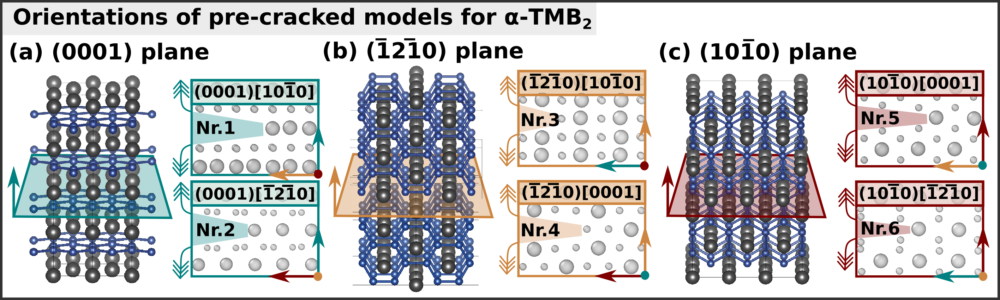
*図2. 六方晶系ダイボライドに設定した 6 種類の低指数き裂配置（き裂面とき裂前面の組み合わせ）。Lin et al., arXiv:2503.18171 (2025), CC BY-NC-ND 4.0.*

応力拡大係数 $K_I$ を制御した「K-controlled simulation」を実施することで、臨界 $K_{Ic}$ をき裂方位・負荷モードの関数として体系的に決定した。

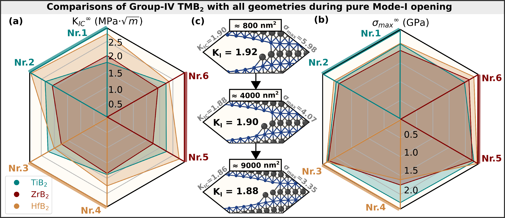
*図4. TiB₂、ZrB₂、HfB₂ の全 6 配置についての外挿破壊靭性 $K_{Ic}$（左）および破壊強度（右）。材料間・配置間の系統的な相違が定量化されている。Lin et al., arXiv:2503.18171 (2025), CC BY-NC-ND 4.0.*

主要な知見を整理する。まず、$K_{Ic}$ の値は 1.7〜2.9 MPa·√m の範囲にあり、これは多結晶ダイボライドの実験値と整合する。次に、TiB₂ では純粋モード I よりも混合モード（Mode I + Mode II）での破壊抵抗が最も低くなる。モード混合比によってき裂経路が {0001} 基底面から錐面へと転換する現象も捉えられており、これはナノインデンテーション実験での観察と一致する。

従来、セラミックスの方位依存破壊を第一原理的に予測する試みは、計算コストのためにサイズ・温度に制約があった。MLIP を用いることで、より大きなモデル（数万原子）・より多くの配置を短時間でカバーできるようになり、設計に直結する「き裂方位チャート」の作成が現実的になった点が重要だ。

### 5.3 フェーズフィールド法：脆性–延性遷移の連続体的記述

Hussein らの MD は「原子スケール」の知見を与えるが、構造部材の「部品スケール（mm〜cm）」での破壊挙動を扱うには、連続体力学的な手法が必要になる。**フェーズフィールド法（Phase-Field Method, PFM）** は、き裂を滑らかな「損傷場」 $d(\mathbf{x})$（$d=0$: 健全、$d=1$: 完全破壊）で近似し、その時間発展を変分原理から導かれる偏微分方程式で記述する。

フェーズフィールド破壊の基本エネルギー汎関数は：

$$\mathcal{E}(u, d) = \int_\Omega \left[ \psi_e(\varepsilon, d) + G_c \gamma(d, \nabla d) \right] d\Omega$$

ここで $u$ は変位場、$\psi_e$ は劣化弾性ひずみエネルギー密度、$G_c$ は破壊エネルギー、$\gamma(d, \nabla d)$ はき裂密度汎関数で以下のように表される：

$$\gamma(d, \nabla d) = \frac{1}{2\ell} d^2 + \frac{\ell}{2} |\nabla d|^2$$

$\ell$ は「正則化長さ」（き裂幅を決める数値パラメータ）であり、物理的なき裂幅に対応させて校正される。

Kubendran Amos（2603.18040, CC BY 4.0）は、この基本枠組みに温度依存した弾塑性モデルを組み込み、単一の「軽量フェーズフィールド代理モデル」で 77 K〜293 K の範囲にわたる脆性–延性遷移を再現することに成功した。

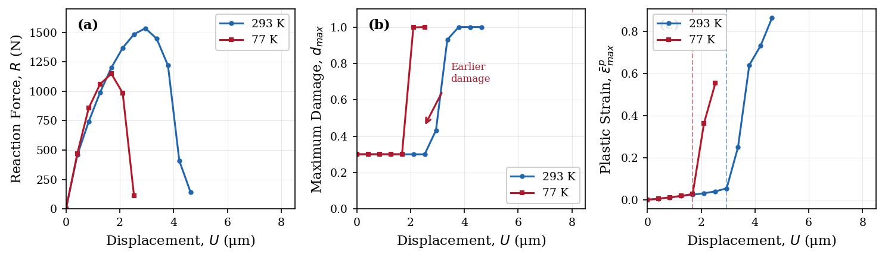
*図3. 単辺切り欠き試験片の温度依存破壊応答。293 K（室温）では延性的な変形後に破壊、77 K（極低温）では脆性的に急峻な破壊が生じる。Kubendran Amos, arXiv:2603.18040 (2026), CC BY 4.0.*

*図4. 荷重変位の 4 段階での損傷場コンター（室温 293 K と極低温 77 K）。室温では広い塑性域を伴いながら損傷が広がるのに対し、77 K では鋭くき裂が局在する。Kubendran Amos, arXiv:2603.18040 (2026), CC BY 4.0.*

鍵となるアイデアは、「**温度に応じて劣化指数 $n$ と破壊靭性 $G_c(T)$ を系統的にシフトさせる**」というシンプルな写像だ。高温では $n=2$（延性的な劣化）、低温では $n=3.5$（急峻な脆性的劣化）を用い、材料特性の温度依存性（降伏応力・弾性率）も実験値でフィットする。

*図7. シミュレーションにより再現された DBTT 曲線（ピーク荷重 vs. 温度）。実験の S 字型遷移曲線とよく対応している。Kubendran Amos, arXiv:2603.18040 (2026), CC BY 4.0.*

### 5.4 粒径依存破壊：結晶塑性との連成

実際の構造材料は多結晶体であり、粒径は破壊靭性に大きな影響を与える。Scherer ら（2501.13882, CC BY-NC-SA 4.0）はフェーズフィールド破壊モデルと転位密度ベースの結晶塑性を結合し、多結晶 BCC 鋼における粒径依存破壊を系統的に解析した。

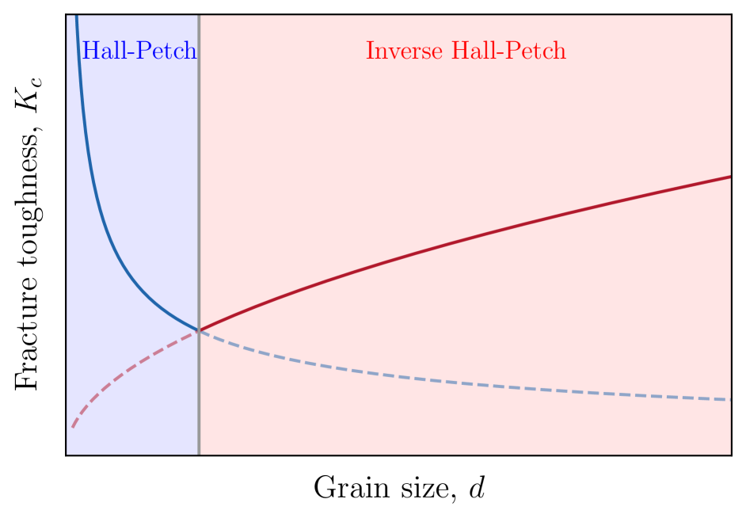
*図1. (a) 粒径と破壊靭性の非単調な関係（実験データ）。小粒径域では Hall–Petch 的強化、大粒径域では逆 Hall–Petch 型の低下が見られる。Scherer et al., arXiv:2501.13882 (2025), CC BY-NC-SA 4.0.*

最も重要な発見は、「**き裂核生成は小粒径ほど起きにくい（Hall–Petch）が、き裂進展は大粒径ほど起きにくい（逆 Hall–Petch）**」という非単調な破壊靭性–粒径関係だ。核生成段階では転位の平均自由行程が粒界で制限されるため、小粒径が有利だが、き裂が一旦核生成すると大粒径試料では多くの転位が蓄積できてき裂先端を鈍化させる。この競合が「中間粒径で最も破壊靭性が低い」という実験的に観察されていた矛盾を初めて計算で解明した。

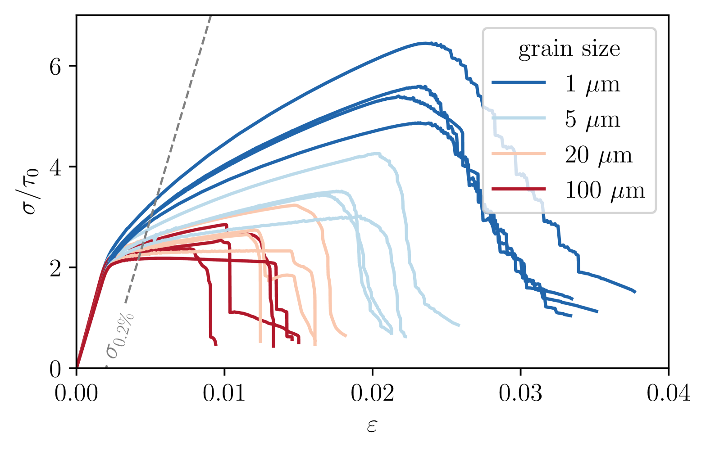
*図6. 4 種の粒径（1, 5, 20, 100 µm）に対するき裂核生成シミュレーションの応力–ひずみ曲線。粒径が大きいほど高応力まで耐えられるが、核生成後の挙動は逆転する。Scherer et al., arXiv:2501.13882 (2025), CC BY-NC-SA 4.0.*

Hussein ら（注目論文）の「転位密度が DBTT を支配する」という知見と、Scherer らの「粒径 → 転位蓄積量 → 破壊靭性」というメカニズムは、同じ転位物理を異なる計算手法で照射している点で相補的だ。

---

## 6. 材料・手法・応用への広がり

### 6.1 異方性セラミックスへの深層学習フェーズフィールド

Plungė ら（2603.20120, CC BY 4.0）は、変分型物理情報深層学習（Deep Ritz Method, DRM）とB-スプライン基底関数を組み合わせた「深層学習フェーズフィールド」を提案した。

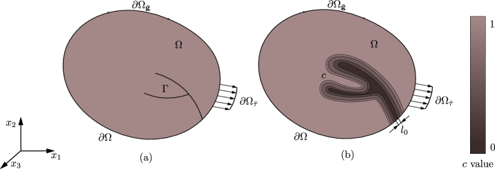
*図1. 連続体 Ω 上のき裂 Γ と、フェーズフィールド近似における損傷場 d の模式図。Plungė et al., arXiv:2603.20120 (2026), CC BY 4.0.*

この手法の特長は、**高次の異方性き裂密度汎関数** $\gamma_c(\theta)$（$\theta$: き裂面法線の方位角）を変分最小化問題として扱える点だ。立方晶・直交晶の方位依存き裂表面エネルギーを正確に取り込むことができ、有限要素法（FEM）と同等の精度を保ちながら、コードの実装を大幅に簡素化できる。

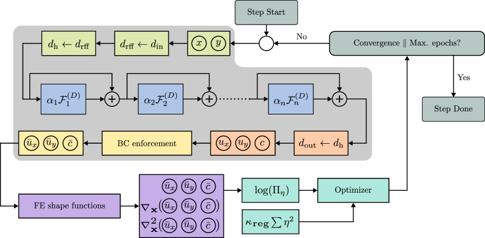
*図3. DRM ワークフロー。ニューラルネットワークが変位場・損傷場を近似し、エネルギー汎関数の最小化を通じて解を求める。Plungė et al., arXiv:2603.20120 (2026), CC BY 4.0.*

一方、Sun ら（2603.04753, CC BY-NC-ND 4.0）は宇宙機の熱防護システムに使われる α-SiC（α-炭化ケイ素）を対象に、弾性・損傷フェーズフィールド・熱伝導を三方向に連成したモデルを MOOSE フレームワーク上で構築した。20℃から 1400℃の広い温度域で、曲げ強度・モード I/II 破壊靭性いずれも実験値と整合する予測を実現した。特に **修正 G 基準** を用いた混合モード破壊包絡線の温度依存性予測は、実際の構造設計に直結する情報を提供している。

この SiC の熱–力学連成モデルは、「フェーズフィールドは脆性材料なら材料系を問わず適用できる」という普遍性を示す例だ。タングステン（金属）→ダイボライド（セラミックス）→ SiC（高温セラミックス）という材料系の多様性を横断して、同一の計算フレームワークが機能することがわかる。

### 6.2 スケールとフィジックスを橋渡しする

3 つの計算手法を整理すると、互いに相補的な役割分担が見えてくる：

| 手法 | 代表的なスケール | 強み | 弱み |
|------|----------------|------|------|
| 第一原理 MD (AIMD) | 数百〜数千原子、ps | DFT 精度、電子構造 | 系の大きさ・時間の制約 |
| MLIP-MD | 数十万〜百万原子、ns | 高精度・高速 | 訓練データの範囲外は不確実 |
| フェーズフィールド法 | mm〜cm | 亀裂形状・分岐・連成 | 原子スケールの物理を直接扱えない |

これらの手法を「ボトムアップに橋渡し」することが今後の大きな課題だ。たとえば、MLIP-MD から得た **き裂先端のコヒーシブゾーンパラメータ** をフェーズフィールドモデルに引き渡す手法、あるいは MLIP から表面エネルギー $\gamma_s$ や破壊靭性の方位依存性を自動的に抽出してフェーズフィールドの入力とする「自動パラメータキャリブレーション」は、現在研究が活発に進んでいる領域だ。

---

## 7. 基礎から理解する

### 7.1 Griffith 破壊力学とエネルギー解放率

き裂長さ $a$ を持つ無限板に均一引張応力 $\sigma$ が加わる場合を考える。Griffith (1921) は、き裂が長さ $\delta a$ だけ進展するときの全エネルギー変化を議論した：

$$\frac{d \Pi}{d a} = \underbrace{-\frac{\partial U_e}{\partial a}}_{>0: \text{弾性ひずみエネルギー解放}} + \underbrace{\frac{\partial U_s}{\partial a}}_{>0: \text{表面エネルギー増加}}$$

弾性力学の解析解から弾性ひずみエネルギー $U_e = \pi \sigma^2 a^2 / E$ （平面応力）なので：

$$G = -\frac{\partial U_e}{\partial a} = \frac{\pi \sigma^2 a}{E}$$

き裂進展の臨界条件は $G = G_c = 2\gamma_s$ で与えられ、これが **Griffith 基準** だ。

**応力拡大係数** $K_I$ はき裂先端の応力場を特徴付ける量で：

$$\sigma_{ij} = \frac{K_I}{\sqrt{2\pi r}} f_{ij}(\theta) + \text{(高次項)}$$

$r$ はき裂先端からの距離、$f_{ij}(\theta)$ は方向依存の無次元関数。$K_{Ic}$ は **破壊靭性**（材料固有のき裂進展抵抗）であり、$G_c = K_{Ic}^2 / E'$（ $E' = E$ 平面応力、$E' = E/(1-\nu^2)$ 平面ひずみ）。

### 7.2 Rice–Thomson 規準：延性か脆性か

1974 年に Rice と Thomson は、き裂先端から転位が放出される条件を定量化した。き裂先端からすべり面に沿って転位を放出するのに必要なエネルギー $G_d$ と、き裂が進展するのに必要なエネルギー $G_c$ を比較する：

$$\frac{G_d}{G_c} = \frac{\mu b^2}{G_c a_0} \cdot f(\theta)$$

$\mu$: せん断弾性率、$b$: バーガースベクトルの大きさ、$a_0$: 格子定数、$\theta$: すべり面とき裂面のなす角。

$G_d/G_c < 1$ なら転位放出が優先 → 延性的破壊、$G_d/G_c > 1$ なら き裂進展が優先 → 脆性破壊、と判定される。

BCC タングステンでは $G_d/G_c > 1$（脆性側）だが、この規準は静的な判定であり、Hussein らの MD が明らかにした「動的な転位枯渇と双晶形成」の効果は含まれていない。現代的な計算研究は、この静的規準を「動的プロセスへ拡張する」試みと見なすことができる。

### 7.3 フェーズフィールド法の数理

フェーズフィールド破壊のモデル方程式は、エネルギー汎関数：

$$\mathcal{E}(u, d) = \int_\Omega \left[ (1-d)^2 \psi_e^+(\varepsilon) + \psi_e^-(\varepsilon) + \frac{G_c}{2} \left( \frac{d^2}{\ell} + \ell |\nabla d|^2 \right) \right] d\Omega$$

の最小化から、以下の連成方程式として導出される：

$$\text{平衡方程式：} \quad \nabla \cdot \boldsymbol{\sigma}(u, d) = \mathbf{0}$$

$$\text{損傷発展方程式：} \quad \frac{G_c}{\ell}\left( -\ell^2 \Delta d + d \right) = 2(1-d) \psi_e^+(\varepsilon)$$

ここで $\psi_e^+$ は引張側の弾性ひずみエネルギー（損傷に寄与する）、$\psi_e^-$ は圧縮側（損傷に寄与しない）を表す「スプリット」を採用している。正則化長さ $\ell$ は、$K_{Ic}$ や $G_c$ と整合するように $\ell \sim G_c E / K_{Ic}^2$ のスケールで設定することが多い。

損傷の「不可逆性」を保証するために、損傷場には既往の最大値を保持する **履歴場** $\mathcal{H}$ を導入することが標準的な実装だ：

$$d(\mathbf{x}, t) = \max_{s \leq t} \left\{ d(\mathbf{x}, s) \right\}$$

### 7.4 機械学習ポテンシャル（NEP）の仕組み

NEP（Neuroevolution Potential）は、Fan らが開発した MLIP の一手法で、GPUMD（GPU Molecular Dynamics）フレームワーク上で動作する。エネルギーを原子ごとのサイト寄与の和 $E = \sum_i E_i$ として表現し、各 $E_i$ はニューラルネットワーク（NN）で原子近傍環境の記述子（球面調和展開による対称不変量）から予測される：

$$E_i = \text{NN}\big(\{q_n^i\}\big)$$

$q_n^i$ は原子 $i$ の近傍構造を記述する Chebyshev 展開の展開係数（動径成分）と球面調和関数（角度成分）の積。NN のパラメータは、DFT で計算したエネルギー・力・ビリアル応力との差を最小化するように（進化的アルゴリズムで）学習される。

NEP の強みは GPU への親和性の高さであり、数十万原子系を ns スケールで扱うことができ、従来の DFT-MD に比べて $10^3$〜$10^5$ 倍の計算速度を達成できる。一方で、訓練データから大きく外れた配置（高圧・強変形下など）では精度が低下するため、「active learning」（シミュレーション中に精度低下を検知し、DFT 計算でデータを補完する）との組み合わせが標準的になりつつある。

---

## 8. 重要キーワード 10 個の解説

**1. 破壊靭性 $K_{Ic}$**
材料がき裂の進展に抵抗する能力を表す材料定数。単位は MPa·√m。き裂先端近傍の応力場の大きさ $K_I$（応力拡大係数）がこの値に達したとき、き裂が自発的に進展する。$K_{Ic}$ が大きいほど「割れにくい」材料。典型値：タングステン単結晶 1〜3 MPa·√m、鉄鋼 50〜200 MPa·√m。

**2. エネルギー解放率 $G$**
き裂が単位面積 $A$ だけ進展するときに解放される弾性ひずみエネルギー：
$$G = -\frac{d\Pi}{dA}$$
$\Pi$ は系の全ポテンシャルエネルギー。臨界値 $G_c$ は材料の破壊エネルギー（表面エネルギーの 2 倍）に相当し、$G_c = K_{Ic}^2/E'$ の関係で $K_{Ic}$ と結ばれる。

**3. 応力拡大係数 $K_I$, $K_{II}$, $K_{III}$**
き裂先端近傍の応力場を支配するパラメータ。モード I（開口型）、モード II（面内せん断）、モード III（面外ねじり）の 3 種類。線形弾性破壊力学（LEFM）の下では、き裂先端応力 $\sigma_{ij} \propto K/\sqrt{r}$（$r$: き裂先端からの距離）。

**4. 脆性–延性遷移温度（DBTT）**
BCC 金属が低温で脆性的に、高温で延性的に破壊する境界温度。タングステンでは～300℃、α-鉄では～−20℃。転位の移動度（ペイエルス応力の温度依存性）と双晶形成の競合で決まる。Hussein らの研究は、DBTT が転位密度によっても制御できることを示した。

**5. フェーズフィールド法**
き裂を空間的に滑らかな損傷場 $d(\mathbf{x}) \in [0, 1]$ で表現する連続体モデル。き裂先端の特異性を回避でき、複雑なき裂分岐・合体を自然に扱える。数学的基礎は Bourdin–Francfort–Marigo (2000) の変分的破壊モデル。正則化長さ $\ell$ がき裂幅を制御するパラメータ。

**6. 分子動力学法（MD）**
$N$ 個の原子のニュートン方程式 $m_i \ddot{\mathbf{r}}_i = -\nabla_i E_{pot}$ を数値積分して、原子の軌跡を時間発展させる手法。ポテンシャルエネルギー $E_{pot}$ の選択（EAM, BOP, MLIP など）が精度を左右する。タイムステップは通常 1〜5 fs。

**7. 機械学習インターアトミックポテンシャル（MLIP）**
DFT データを訓練データとして、ニューラルネットワークや線形回帰モデルでポテンシャルエネルギー面を学習したポテンシャル。記述子（原子近傍環境の対称不変量）を特徴量とし、$E_{pot} = \sum_i \text{NN}(\text{記述子}_i)$ として表現される。DFT 精度を保ちながら MD より $10^3$〜$10^5$ 倍高速。代表的実装：NEP, DeePMD, GAP, NequIP。

**8. 転位（Dislocation）**
結晶中の線状格子欠陥。刃状転位・らせん転位・混合転位に分類される。バーガースベクトル $\mathbf{b}$（転位の「強さ」と「方向」を表すベクトル）で特徴付けられる。転位の移動が塑性変形の担い手であり、延性破壊では転位がき裂先端を鈍化（ブランティング）させる。

**9. 双晶境界（Twin Boundary, TB）**
結晶を鏡映対称に積み重ねたとき生じる界面。コヒーレント TB（CTB）では原子面の対称性が完全に保たれ、インコヒーレント TB（ITB）では乱れた原子配置を持つ。Hussein らが示したように、タングステンでは ITB 上のディスコネクションが き裂核生成サイトとなる。

**10. ディスコネクション（Disconnection）**
双晶境界上に存在する「転位成分（変位）と段差成分（高さ）の複合欠陥」。バーガースベクトル $\mathbf{b}_d$（双晶変位）と段差の高さ $h$ を持つ。双晶境界の移動（双晶成長）はディスコネクションの移動で起きる。Hussein ら（2603.14883）は、ITB セグメントに積み重なったディスコネクションが局所的な応力集中をもたらし、き裂核生成の引き金になることを示した。

---

## 9. まとめと今後の論点

本記事で概観した研究群は、き裂進展の計算材料科学が「単一スケール・単一手法」から「マルチスケール・マルチフィジックスの統合」へと大きくシフトしていることを示している。

Hussein ら（2603.14883）のタングステン多スケール MD は、BCC 金属の DBTT を支配するのが「転位枯渇 → 双晶 → ディスコネクション積み重なり」のカスケードであることを原子スケールで明確化した。この知見は、MLIP-MD による水素脆化の定量的解析（2508.20350）とも整合し、「欠陥の集積がき裂核生成を誘発する」という普遍的な論理を補強する。

セラミックスについては、Lin ら（2503.18171）が MLIP を使った K-controlled MD によって遷移金属二ホウ化物の方位・モード依存破壊を系統的に定量化し、破壊靭性チャートの構築という実用的な目標への道筋を示した。

連続体スケールでは、フェーズフィールド法が脆性–延性遷移（2603.18040）、粒径依存破壊（2501.13882）、高温セラミックス破壊（2603.04753）、さらには深層学習との融合による異方性破壊（2603.20120）に至るまで急速に拡張されている。

**今後の主要な論点**を挙げる：

1. **スケール橋渡しの自動化**：MLIP-MD から算出したコヒーシブゾーンパラメータや破壊エネルギーを、フェーズフィールドモデルへ自動的に受け渡すパイプラインの構築。これにより「原子スケールの物理を反映した部材スケール破壊シミュレーション」が実現する。

2. **熱活性化プロセスの記述**：DBTT 近傍では熱活性化による転位運動・双晶形成が不可避だ。MD の時間スケール（ns）は実験（s〜時間）より遙かに短く、比較には加速 MD 法（NEB、ハイパーダイナミクス）の導入が必要。

3. **多軸・動的荷重下での破壊**：実際の構造部材は多軸応力・衝撃・疲労サイクルにさらされる。現在の MLIP-MD は準静的引張が主体であり、疲労き裂進展や爆発的な動的負荷への拡張が急務だ。

4. **不純物・欠陥の複合効果**：核融合炉のタングステンでは水素・ヘリウム・中性子損傷が同時に存在する。複数の不純物・欠陥を含む MLIP の開発と、それに基づく破壊シミュレーションは、材料設計において不可欠なステップだ。

5. **深層学習フェーズフィールドの実用化**：Plungė ら（2603.20120）が示した DRM ベースのフェーズフィールドは、異方性材料へのスケーラビリティを持つ。実際の工業材料（繊維強化複合材、積層セラミックスなど）への適用拡大が期待される。

計算材料科学の進展により、「なぜ割れるか」から「いつ・どこに・どのように割れるか」を定量的に予測し、さらには「割れにくい材料・微細構造を設計する」という逆問題の解法まで視野に入ってきた。この統合的アプローチが、核融合炉材料・次世代航空宇宙材料・超高温構造セラミックスの設計指針を変えていくだろう。

---

## 10. 参考にした論文一覧

| # | arXiv ID | タイトル | 著者（筆頭） | ライセンス | 役割 |
|---|----------|---------|------------|-----------|------|
| 1 | 2603.14883 | Ductility and Brittle Fracture of Tungsten by Disconnection Pile-up on Twin Boundaries | Hussein et al. | CC BY 4.0 | 注目論文（anchor） |
| 2 | 2508.20350 | Atomistic understanding of hydrogen bubble-induced embrittlement in tungsten enabled by machine learning molecular dynamics | Bao et al. | CC0 | MLIP-MD による水素脆化解析 |
| 3 | 2503.18171 | Machine-Learning Potentials Predict Orientation- and Mode-Dependent Fracture in Refractory Diborides | Lin et al. | CC BY-NC-ND 4.0 | セラミックス異方性破壊のMLIP予測 |
| 4 | 2603.18040 | Lightweight phase-field surrogate for modelling ductile-to-brittle transition through phenomenological elastoplastic coupling | Kubendran Amos | CC BY 4.0 | フェーズフィールドによる DBT モデリング |
| 5 | 2603.20120 | Deep learning-based phase-field modelling of brittle fracture in anisotropic media | Plungė et al. | CC BY 4.0 | 深層学習+変分フェーズフィールド |
| 6 | 2501.13882 | Grain-size dependence of plastic-brittle transgranular fracture | Scherer et al. | CC BY-NC-SA 4.0 | 結晶塑性+フェーズフィールドで粒径依存破壊を解析 |
| 7 | 2603.04753 | Damage Prediction of Sintered α-SiC Using Thermo-mechanical Coupled Fracture Model | Sun et al. | CC BY-NC-ND 4.0 | SiC の熱–力学連成フェーズフィールド |

---

*本記事で使用した図はすべてライセンス確認済みです。各図のキャプションに出典・ライセンスを明記しています。CC BY-NC-ND 4.0 ライセンスの図（2503.18171, 2603.04753）はオリジナルのまま使用し、トリミング・注釈追加・色変更等の改変は行っていません。CC BY-NC-SA 4.0 ライセンスの図（2501.13882）は非商用利用の範囲内で使用しています。*
