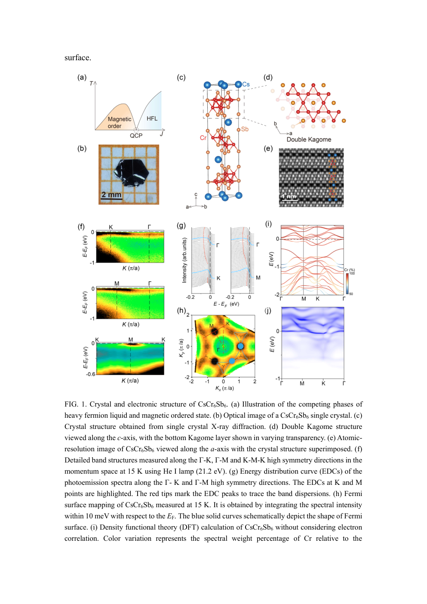
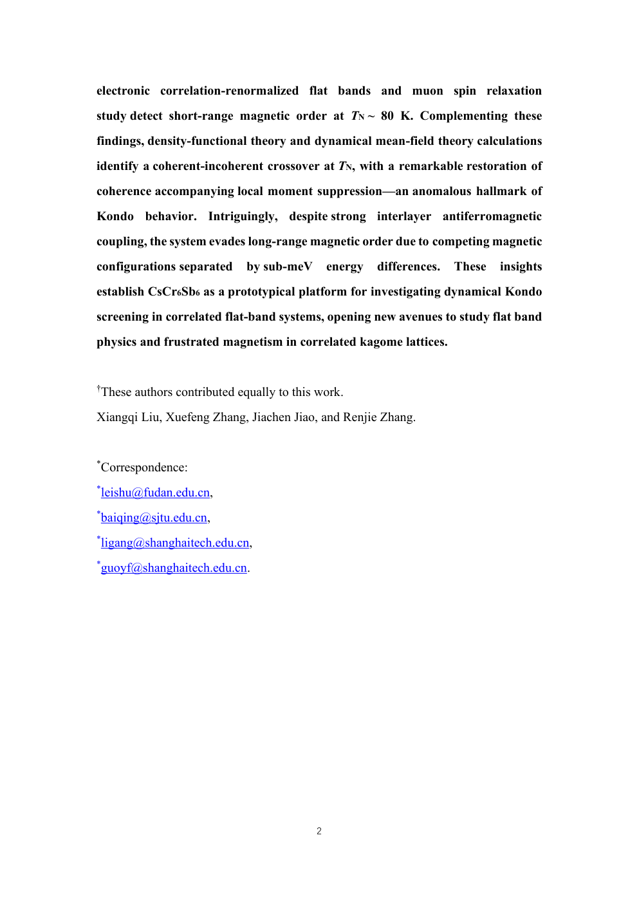
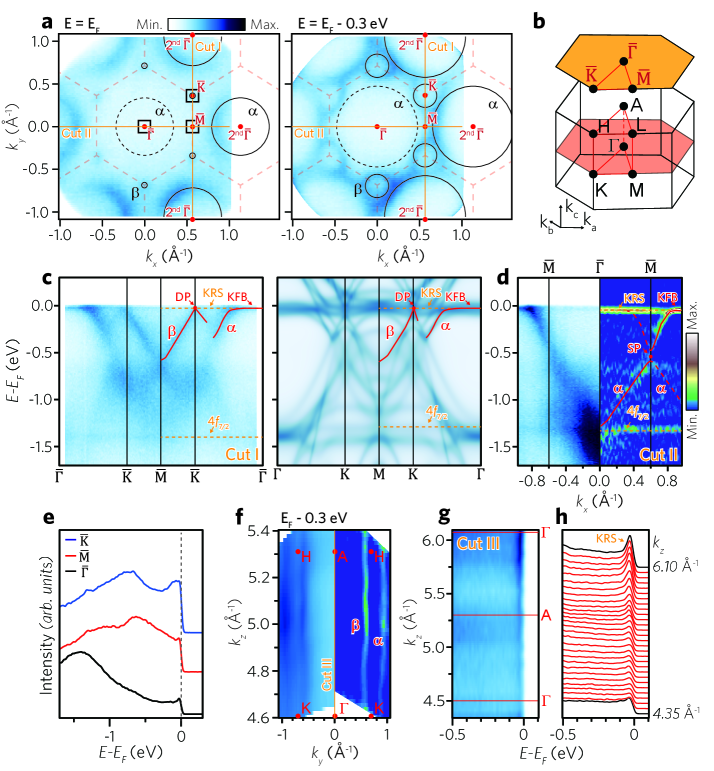
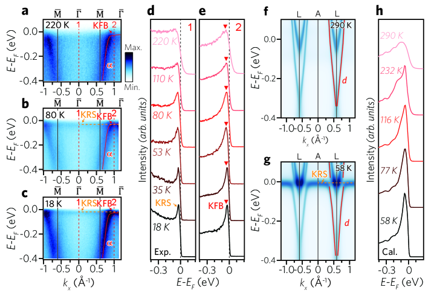
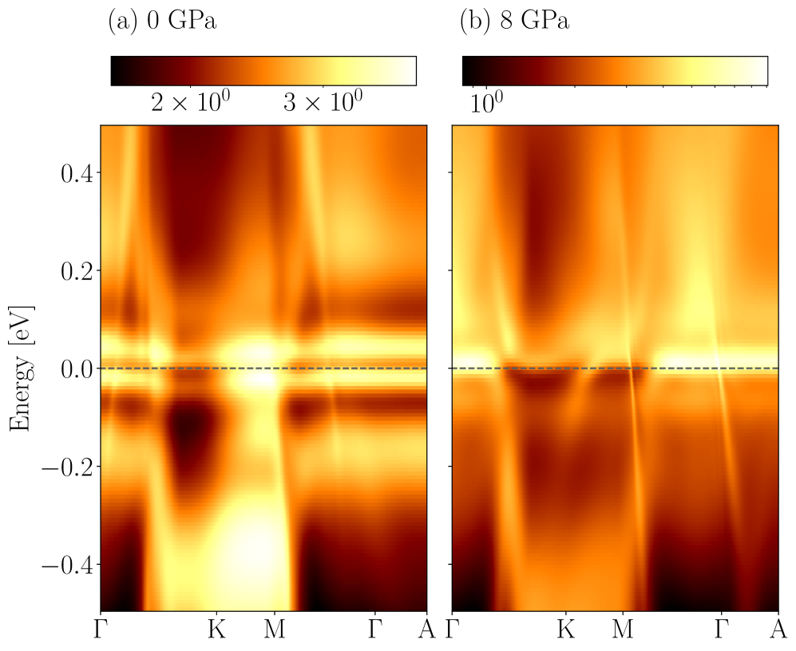
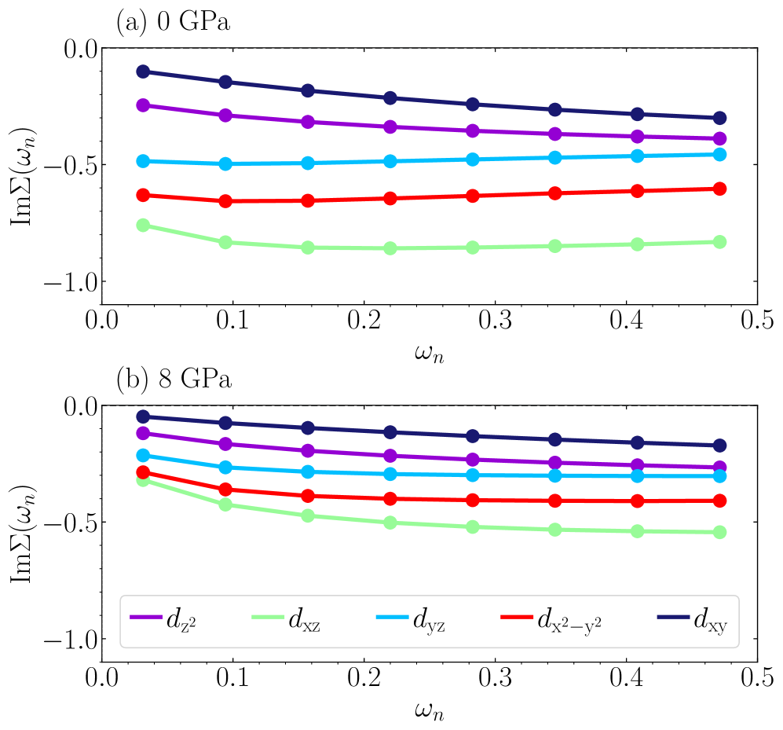

# カゴメ平坦バンド共鳴：局在と遍歴の交差点で起こること

**執筆日**: 2026-03-23
**トピック**: カゴメ金属における平坦バンドの共鳴・近藤効果・磁気フラストレーションの競合
**中心論文**: arXiv:2603.18537（Nature Communications 採録）

---

## 1. 導入：なぜ今この話題か

固体物理の世界では長らく、電子を「局在した電子」と「自由に動き回る遍歴電子」に分けて考えることが基本だった。局在電子は磁気モーメントを持ち、遍歴電子は電気伝導を担う。この二者が同じ格子の上で共存し、しかも強く結合するとき、重い電子状態・近藤絶縁体・非従来型超伝導といった多彩な量子相が現れる——これが強相関電子系物理の核心にある問いである。

近年、この問いに対して全く新しいステージが登場した。**カゴメ格子**と呼ばれる、三角形を頂点共有させた二次元格子である。カゴメ格子は幾何学的に「欲求不満な（フラストレートした）」構造を持ち、電子の運動エネルギーを消耗させる平坦バンド（flat band）を必然的に生み出す。この平坦バンドでは電子の有効質量が発散し、ごく小さな相互作用でも相関効果が増幅される。さらにカゴメ格子はディラック点やファン・ホーフ特異点など位相的・トポロジカルな構造も備えており、相関物理とトポロジー物理が一つの材料の中で同時に現れる理想的なプラットフォームとして世界中から注目を集めている。

2022〜2024年にかけて発見された**CsCr₆Sb₆**は、この文脈で特に重要な新物質である。バナジウム系カゴメ金属（CsV₃Sb₅）が電荷密度波と超伝導という複雑な相を示したのに対し、CsCr₆Sb₆はCr-3d電子が作る完全に孤立した平坦バンドをフェルミ準位直上に持ち、かつ磁性と近藤物理が同居するという点で全く新しい側面を持つ。学術誌に掲載されるや多数のフォローアップ研究が続き、「カゴメ近藤格子」というコンセプト自体が急速に発展している。

2026年3月、ネイチャー・コミュニケーションズに採録された最新の研究（arXiv:2603.18537）は、この流れをさらに一歩進める重要な観測を報告した。CsCr₆Sb₆の低温で「平坦バンドの二重項が共鳴する」という現象——すなわち平坦バンドと遍歴バンドが温度降下とともに動的に結合するプロセス——を世界で初めて直接的なARPES分光で捉えた。この「平坦バンド共鳴」は理論的には長く予言されていたが、実験的証拠はこれまで得られていなかった。本記事では、この中心論文を中心に、過去2年間に積み上げられた関連研究5本を組み合わせ、カゴメ平坦バンド物理の現在地を俯瞰する。

---

## 2. 今回の軸となる問い

本記事で追う中心問題を以下の3つに絞る。

**問い①：カゴメ格子の平坦バンドは実際に「共鳴」するのか？**
理論的には平坦バンドと遍歴バンドが低温で混成してスペクトル重みが再分配されると予言されているが、ARPESで直接観測できるか。それはKondo latticeの通常の振る舞いと区別できるか。

**問い②：カゴメ近藤効果と磁気フラストレーションはどのように競合するか？**
近藤効果は磁気モーメントを「隠蔽」しようとする一方、フラストレートした磁性はモーメントを保ち続けようとする。CsCr₆Sb₆では低温で短距離の反強磁性相関が現れるが、これは近藤遮蔽が破れた状態なのか、それとも新しい量子相なのか。

**問い③：この物理は同族材料（CsCr₃Sb₅、YbCr₆Ge₆）でどのように展開するか？**
圧力・組成・4f電子の有無によって、平坦バンドの相関効果はどう変化するか。異なる材料を並べることで普遍的な物理則が見えてくるか。

---

## 3. 中心論文の詳細解説

### 論文情報

| 項目 | 内容 |
|------|------|
| **タイトル** | Observation of Resonance of Kagome Flat Band Doublet |
| **著者** | Renjie Zhang, Bei Jiang, Xiangqi Liu, Hengxin Tan, Xuefeng Zhang, ほか17名 |
| **arXiv ID** | [2603.18537](https://arxiv.org/abs/2603.18537) |
| **カテゴリ** | cond-mat.str-el |
| **公開日** | 2026年3月19日 |
| **掲載誌** | Nature Communications (採録) |
| **ライセンス** | arXiv non-exclusive（本記事では図不使用） |

### 材料系：CsCr₆Sb₆とは

CsCr₆Sb₆は、**双層カゴメ格子（double kagome layer）** を持つ準二次元物質で、2024年に新たに発見された。結晶構造はvan der Waals的な積層を示し、CrとSbが作る二重カゴメ層の間にCsが挟まれる形をとる。重要な特徴として、Cr-3d電子が完全に孤立した平坦バンドをフェルミ準位（E_F）付近に形成し、有効質量はバナジウム類似体の100倍以上に達する（重い電子）。さらにこの物質は低キャリア密度の「近藤絶縁体的」振る舞いも示すという特異な電子状態を持つ。

### 何を発見したか

本論文の核心は「**平坦バンド二重項の共鳴（flat band resonance）**」の直接観測である。具体的に何が起きたかを段階的に説明する。

**高温では**（>80K 程度）、E_F 付近に2本の平坦バンド（二重項）が存在し、それぞれ独立に分散を持たない（=局在した電子）。同時に遍歴バンドも存在するが、両者の混成は小さい。

**低温になると**（80K 以下から顕著）、ARPESスペクトル上で平坦バンドのスペクトル重みが増強され、さらに平坦バンドと遍歴バンドが**混成（hybridization）** して相互にスペクトル重みを交換し始める。この「重みの増強と混成の同時発生」が「共鳴」と呼ばれる状態である。近藤格子での類似現象（近藤共鳴）では遍歴バンドと局在電子が混成し、近藤共鳴ピークが E_F 付近に形成される——しかし本系ではその振る舞いが**従来の近藤格子とは異なる**。

**決定的な違い**は磁気秩序との相関にある。輸送測定とARPESを組み合わせることで、この平坦バンド共鳴の出現が、**短距離の反強磁性相関の発達と同時**に起きることが示された。通常の近藤格子では、近藤遮蔽が強まるほど磁気モーメントが消えていく（両者は競合する）。CsCr₆Sb₆では、むしろ近藤的な混成の開始と磁気相関の発達が**同時・協調的**に起きており、これは「非従来型の平坦バンド共鳴」として全く新しいカテゴリに属する。

### 手法の詳細

- **ARPES（角度分解光電子分光）**: 高エネルギーの光（紫外線/X線）を試料に照射し、飛び出した光電子のエネルギーと運動量を同時計測することで、E(k)バンド分散を直接可視化する。本研究では He-Iランプ（21.2 eV）を使用。
- **輸送測定**: 電気抵抗の温度依存性から近藤効果・絶縁体的振る舞い・磁気転移温度を同定。
- **DFT+DMFT（密度汎関数理論+動的平均場理論）**: 局在した3d電子の強相関効果を取り込む第一原理計算。Hubbard-Uを明示的に取り扱い、実験スペクトルを再現する理論計算として機能。

### なぜこれが重要か

「長らく理論予言されてきた平坦バンド共鳴を、実験で初めて直接観測した」——この一事だけでもインパクトは大きい。しかしさらに重要なのは、この共鳴が**近藤効果とは異なるメカニズム**で起きており、磁気フラストレーションと協調するという新事実である。これは、強相関電子系の中に「カゴメ固有の量子相」という新しいカテゴリが存在する可能性を示唆している。

---

## 4. 関連論文5本の解説

### 関連論文①：CsCr₆Sb₆ 発見論文

**論文情報**

| 項目 | 内容 |
|------|------|
| **タイトル** | Realization of Kagome Kondo lattice |
| **著者** | Boqin Song, Yuyang Xie, Wei-Jian Li, Hui Liu, Jing Chen, Shangjie Tian, ほか |
| **arXiv ID** | [2404.12374](https://arxiv.org/abs/2404.12374) |
| **カテゴリ** | cond-mat.str-el |
| **ライセンス** | CC BY 4.0 ✓ |

**中心論文との関係**

本論文は CsCr₆Sb₆ という物質を世界で初めて報告した**発見論文**であり、中心論文（2603.18537）の研究基盤そのものを提供している。中心論文でさらに踏み込んで調べた「平坦バンド共鳴」という現象も、この発見論文が打ち立てた舞台の上で起きている。

**何を明らかにしたか**

単結晶の合成に成功し、ARPES測定・輸送測定・DFT計算を組み合わせて以下を示した：

1. **完全に孤立した平坦バンドが E_F 上に存在**する。バンドは Cr-3d 電子から構成され、分散幅は10 meV 程度と極めて小さい（= 局在電子）。
2. 低温で電気抵抗が急激に上昇する**近藤絶縁体的振る舞い**（～10¹⁵ cm⁻³という超低キャリア密度）。
3. バルクでは弱い磁化を示すが、数層に薄くすると**A型反強磁性秩序が顕在化**。これは磁気フラストレーションがバルクで秩序を隠している証拠。
4. 有効質量の増大からバナジウム類似体（CsV₃Sb₅）の100倍以上の質量増強が確認。

*Figure 1. CsCr₆Sb₆の結晶構造（(c)-(e)）、相図スケッチ（(a)(b)）、及び ARPES とDFT計算の比較（(f)-(i)）。カゴメ層の双層構造と、フェルミ準位付近の平坦バンドが明確に確認できる。出典: arXiv:2404.12374, CC BY 4.0, unmodified.*

**この論文が加えるもの**

CsCr₆Sb₆が単なる「平坦バンドを持つ金属」ではなく、近藤物理とカゴメフラストレーションが同居する**全く新しいクラスの物質**であることを確立した。近藤格子のカゴメ版という概念が、実験的に裏付けられた最初の例である。

---

### 関連論文②：μSR + ARPES + DMFT による CsCr₆Sb₆ の多角的研究

**論文情報**

| 項目 | 内容 |
|------|------|
| **タイトル** | Emergent dynamical Kondo coherence and competing magnetic order in a correlated kagome flat-band metal CsCr₆Sb₆ |
| **著者** | Xiangqi Liu, Xuefeng Zhang, Jiachen Jiao, Renjie Zhang, ほか |
| **arXiv ID** | [2508.08580](https://arxiv.org/abs/2508.08580) |
| **カテゴリ** | cond-mat.str-el |
| **公開日** | 2025年8月 |
| **ライセンス** | CC BY 4.0 ✓ |

**中心論文との関係**

中心論文（2603.18537）と同じ著者グループによる先行研究。ARPES だけでなく **μSR（ミュオンスピン緩和）** という磁場感度の高いプローブを加えることで、磁気状態の温度進化を量的に追った。中心論文の「平坦バンド共鳴が短距離AF相関と同時に発生する」という主張の重要な伏線・根拠となっている。

**何を明らかにしたか**

1. **μSR測定**: T_N ≈ 80 K で短距離反強磁性相関が発生することを確認。長距離秩序はなく、磁気フラストレーションが長距離秩序化を妨げている。
2. **ARPES**: 低温で相関効果によるバンド波形の変化（Kondo的な特徴）を検出。
3. **DFT+DMFT**: 動的な近藤コヒーレンスの出現を理論的に再現。フラストレーションと近藤遮蔽が競合するパラメータ空間での相図を提示。

*Figure 2. 2508.08580の概要。ARPES測定の温度変化と、DFT+DMFTによる動的近藤コヒーレンスの理論的再現を示すページ。出典: arXiv:2508.08580, CC BY 4.0, unmodified.*

**この論文が加えるもの**

CsCr₆Sb₆の低温状態が「完全な近藤絶縁体でも、通常の磁性体でもない」という中間的な状態であることを多角的に確認した。近藤遮蔽と磁気フラストレーションの「どちらが勝つか」という問いに対し、「どちらも完全には勝てない」という答えを示している点が、物理的に非常に興味深い。

---

### 関連論文③：異種材料への展開——YbCr₆Ge₆における平坦バンドの二重起源

**論文情報**

| 項目 | 内容 |
|------|------|
| **タイトル** | Coexisting Kagome and Heavy Fermion Flat Bands in YbCr₆Ge₆ |
| **著者** | Byungmin Sohn ほか |
| **arXiv ID** | [2509.04902](https://arxiv.org/abs/2509.04902) |
| **カテゴリ** | cond-mat.str-el |
| **公開日** | 2025年9月（2026年3月20日改訂） |
| **ライセンス** | CC BY 4.0 ✓ |

**中心論文との関係**

CsCr₆Sb₆との比較材料として位置づけられる。Yb（イッテルビウム）という4f電子を持つ希土類元素を導入することで、「カゴメ由来の平坦バンド（幾何学的起源）」と「4f電子による重いフェルミオン平坦バンド（近藤起源）」の**両方が同一物質に共存**するという前例のない状況を作り出した。

**何を明らかにしたか**

1. **高温側（>T_K）**: カゴメ格子の幾何学的フラストレーションから生まれる固有の平坦バンドが E_F を支配。
2. **低温側（<T_K）**: 4f 局在電子と伝導電子の近藤混成により、追加の**重いフェルミオン平坦バンドが形成**される。
3. この「二重の平坦バンド」機構により、トポロジー（カゴメバンド構造から）と強相関（近藤効果から）の両方の物理が一物質の中に統合される。

*Figure 3. YbCr₆Ge₆のARPES測定。高温と低温でのバンド構造の変化を示す。カゴメ由来の平坦バンド（高温）と近藤由来の重いフェルミオン平坦バンド（低温）の両方が確認できる。出典: arXiv:2509.04902, CC BY 4.0, unmodified.*

*Figure 4. YbCr₆Ge₆の電気抵抗の温度依存性と磁場応答。近藤温度 T_K の特定と、二重平坦バンドの温度進化を示す。出典: arXiv:2509.04902, CC BY 4.0, unmodified.*

**この論文が加えるもの**

CsCr₆Sb₆（3d系）とYbCr₆Ge₆（4f系）の比較を通して、「カゴメ平坦バンドと近藤平坦バンドは同じに見えるが起源が違う」という重要な区別を可能にした。中心論文で報告された「平坦バンド二重項」の一方がカゴメ起源で、もう一方が相関効果で生まれた可能性を示唆する文脈も持つ。

---

### 関連論文④：圧力下での電子相関と平坦バンドの調整——DFT+DMFT による CsCr₃Sb₅ 研究

**論文情報**

| 項目 | 内容 |
|------|------|
| **タイトル** | Pressure Tuning of Electronic Correlations and Flat Bands in CsCr₃Sb₅ |
| **著者** | （論文より）|
| **arXiv ID** | [2601.14439](https://arxiv.org/abs/2601.14439) |
| **カテゴリ** | cond-mat.str-el |
| **公開日** | 2026年1月 |
| **ライセンス** | CC BY 4.0 ✓ |

**中心論文との関係**

CsCr₃Sb₅は CsCr₆Sb₆ の「兄弟材料」に当たり、カゴメ層が一枚（単層）である点が異なる。この材料は低温で超伝導を示すことが圧力下で確認されており、CsCr₆Sb₆との比較から「双層カゴメで平坦バンド共鳴が起きる条件とは何か」を逆算的に理解するうえで重要な系である。

**何を明らかにしたか**

1. **0 GPa（常圧）**: 非フェルミ液体的振る舞い。自己エネルギーの虚部が Matsubara 振動数に対して線形（= ω^1 依存）であり、準粒子描像が破れている。平坦バンドは E_F から少し離れた位置にある。
2. **8 GPa（高圧）**: フェルミ液体に回復。自己エネルギーの虚部が ω² 依存に戻り、準粒子が明確に形成される。平坦バンドが E_F により近づき、分散も変化する。
3. **軌道選択的相関**（orbital-selective correlations）: dxz/dyz 軌道と dxy 軌道では相関の強さが異なり、圧力によって選択的に変化する。

*Figure 5. DFT+DMFT によるCsCr₃Sb₅のスペクトル関数（0 GPa と8 GPa の比較）と局所状態密度（DOS）。圧力によって平坦バンドの位置とスペクトル重みが変化する様子が示されている。出典: arXiv:2601.14439, CC BY 4.0, unmodified.*

*Figure 6. 軌道分解された自己エネルギー（Matsubara 表示）と DOS。非フェルミ液体（0 GPa）からフェルミ液体（8 GPa）への変化と、軌道選択的な相関強度の違いが見て取れる。出典: arXiv:2601.14439, CC BY 4.0, unmodified.*

**この論文が加えるもの**

「平坦バンドが E_F に近づくほど相関効果が強まる」という直感的な予想を定量的に確認した。また、非フェルミ液体から Fermi 液体への圧力誘起クロスオーバーという「チューナブルな相関系」としての側面を明示した。CsCr₆Sb₆（双層）で起きた平坦バンド共鳴も、本質的には「E_F 付近に平坦バンドがいかに密接するか」という問題であり、この計算的知見は中心論文の解釈を補強する。

---

### 関連論文⑤：レーザーARPES で捉えた CsCr₃Sb₅ のフェルミ面

**論文情報**

| 項目 | 内容 |
|------|------|
| **タイトル** | Fermi surface of Kagome metal CsCr₃Sb₅ observed by laser photoemission microscopy |
| **著者** | Hayate Kunitsu, Iori Ishiguro, Natsuki Mitsuishi, Shunsuke Tsuda, Koichiro Yaji, Zehao Wang, Pengcheng Dai, Yoichi Yamakawa, Hiroshi Kontani, Takahiro Shimojima |
| **arXiv ID** | [2603.18672](https://arxiv.org/abs/2603.18672) |
| **カテゴリ** | cond-mat.str-el |
| **公開日** | 2026年3月19日（中心論文と同日） |
| **ライセンス** | arXiv non-exclusive（本記事では図不使用） |

**中心論文との関係**

中心論文と全く同じ日（2026年3月19日）に公開されたという点でも注目される。CsCr₃Sb₅（単層カゴメ）のフェルミ面を高空間分解能のレーザーARPES（光電子顕微鏡）で測定した実験論文であり、中心論文（双層 CsCr₆Sb₆）とは材料が異なるが、同族系を異なる手法で捉えたという意味で相補的な位置にある。

**何を明らかにしたか**

1. ブリルアンゾーン（BZ）中心付近に**円形フェルミ面**と**2つの六角形フェルミ面**が共存することを確認。
2. BZ境界付近に**小さなフェルミ面ポケット**を偏光依存測定で検出（通常のARPESでは見えにくいサイズ）。
3. DFT 計算との比較から、フェルミ面の大きさが dxz 軌道で強く修正されており、**軌道依存の相関効果**が実験的に確認された（論文④のDFT+DMFT予測を支持）。
4. これらの結果は「常磁性状態のCsCr₃Sb₅に電荷密度波秩序や非従来型超伝導が現れる電子的基盤」を提供する。

**この論文が加えるもの**

中心論文が CsCr₆Sb₆（双層）の動的性質（温度変化する共鳴）を論じるのに対し、本論文は CsCr₃Sb₅（単層）の静的なフェルミ面の形状を確定した。両材料の電子構造を比較することで、双層化がどのような変化をもたらすかを考察できるようになる。また、軌道依存の相関（dxz 軌道の増強）は論文④の計算予測とも合致しており、この物質クラス全体での軌道選択性を示す重要な実験的証拠となっている。

---

## 5. 6本を通じた比較と整理

### 共通して見えてきたこと

6本の論文を並べると、いくつかの共通した物理像が浮かび上がる。

第一に、**「平坦バンドの E_F 近傍への接近」が全ての現象の出発点**となっている。常圧のCsCr₃Sb₅では平坦バンドが少し遠く、高圧をかけると近づく（論文④）。CsCr₆Sb₆では双層効果によりすでに E_F に極めて近い（論文①③）。E_F に近いほど相関効果が増幅され、近藤共鳴・平坦バンド共鳴・重いフェルミオン形成が起きやすくなる。

第二に、**「近藤遮蔽」と「磁気フラストレーション」は相反するが共存する**。通常の近藤格子モデル（Doniach 相図）では、J/W（結合定数/バンド幅）の比が大きければ近藤絶縁体、小さければ磁気秩序と、はっきり分かれる。しかしカゴメ系では、幾何学的フラストレーションが磁気秩序を抑制するため、「近藤状態のような振る舞いをしながら、磁気相関も持続する」という通常の Doniach 相図では説明できない領域が生まれている（論文①②③）。

第三に、**軌道選択性（orbital selectivity）が重要な役割を果たす**。Cr-3d 電子の中でも dxz 軌道と dxy 軌道では相関の強さが大きく異なり、これが平坦バンドの形成・修正に影響する（論文④⑤）。この軌道選択性は DFT+DMFT 計算でも実験でも一致して観測されており、この物質クラスに共通する普遍的な特徴と言える。

### 一致している点

- 低温で短距離反強磁性相関が発達すること（論文②③）
- 相関効果による有効質量の著しい増大（全論文共通）
- DFT 単独では実験を再現できず、DFT+DMFT が必要なほどの強い相関（論文④）

### 食い違っている点・未解決な点

**「共鳴の機構は近藤か否か」** という点はいまだ論争中である。論文①（発見論文）は「近藤格子の実現」と表現しているのに対し、中心論文（2603.18537）は「従来の近藤格子とは異なる振る舞い」を強調している。両者は観測した現象（平坦バンドの重み増強・混成）では一致しているが、その理論的解釈で異なる。

**「長距離磁気秩序はなぜ現れないか」** も未解決である。フラストレーションが原因であることは確実だが、スピン液体的な状態なのか、単に弱い秩序なのかは、より低温・高分解能の測定が必要である。

**「超伝導は CsCr₆Sb₆ でも現れるか」** という問いも重要だ。CsCr₃Sb₅では高圧下で超伝導が確認されているが（論文④が示唆）、双層系 CsCr₆Sb₆ ではまだ報告がない。

### 今後重要になりそうな論点

- 低温・高圧下での CsCr₆Sb₆ の相図（超伝導相の探索）
- スピン液体的な基底状態の可能性（中性子散乱・μSR の詳細解析）
- 双層効果の理論的理解（単層 vs 双層でなぜ振る舞いが異なるか）
- 他の同族化合物（別の遷移金属・カルコゲニドへの展開）

---

## 6. 学部4年生向けの基礎解説

### カゴメ格子とは何か

カゴメ格子（kagome lattice）は、日本の伝統工芸「籠目（かごめ）」模様に由来する名前を持つ二次元格子である。三角形を頂点で共有させ、六角形の空隙が生まれる構造を持つ。この格子上の量子力学的問題を解くと、分散関係 E(k) の中に**完全に平坦な（E が k に依存しない）バンドが現れる**。

なぜ平坦バンドが生まれるかを直感的に説明しよう。カゴメ格子上の電子が隣の格子点に飛び移ろうとすると、ある経路では波動関数の位相が打ち消し合い（破壊的干渉）、電子の移動が抑制される。これを**幾何学的フラストレーション**と呼ぶ。電子が動けなければ、その電子の運動エネルギー（= バンドの分散）はゼロになる——これが平坦バンドの直感的な起源である。

数式で書くと、正方格子のタイトバインディングモデルでは E(k) = -2t(cos kx + cos ky) のように分散するのに対し、カゴメ格子では最低バンドの一つが E(k) = -2t（定数）になる領域が現れる。

### 平坦バンドと電子相関の関係

平坦バンドでは全ての電子が同じエネルギーを持つため、**状態密度（DOS）が一点に集中**する（van Hove 特異点が極端化した状態）。このとき、電子間のクーロン斥力 U がバンド幅 W に比べて大きくなり（U/W ≫ 1）、強相関効果が支配的になる。つまり、平坦バンドは「電子相関を自動的に増幅する増幅器」として機能する。

### 近藤効果とは何か

近藤効果（Kondo effect）は、金属中に孤立した磁気モーメント（スピン）が存在するとき、低温で伝導電子がそのスピンを「囲い込んで」遮蔽する現象である。一個の不純物でも起きるが（単一近藤効果）、磁気モーメントが規則正しく並んだ格子を形成するとき（**近藤格子**）、コヒーレントな近藤効果が起き、バンド構造に**近藤共鳴ピーク**（フェルミ準位付近の鋭いピーク）が現れる。これが重いフェルミオン液体の起源である。

重要な関係式として、近藤温度 T_K は
$$T_K \propto \exp\!\left(-\frac{1}{J \cdot N(E_F)}\right)$$
で与えられる（J: 局在スピンと伝導電子の交換結合定数、N(E_F): フェルミ準位での状態密度）。平坦バンドがあると N(E_F) が爆発的に増大し、T_K が高くなる——つまり近藤効果が強化される。

### 誤解しやすい点

**「平坦バンド = 良くないこと」ではない**: 平坦バンドは電子を閉じ込めるが、その「閉じ込め」が強相関・超伝導・磁性などのエキゾチックな物理を生み出す肥沃な土壌になる。

**「近藤効果 = 電気抵抗の増大」だけではない**: 単一不純物の近藤効果では確かに低温で抵抗が増大するが、近藤格子では近藤コヒーレンス温度 T_coh 以下でコヒーレントな重いフェルミオン液体が形成され、抵抗はむしろ低下することもある。CsCr₆Sb₆では近藤格子が「絶縁体的」に振る舞う（近藤絶縁体）という特殊なケース。

**「フラストレーション = 秩序なし」は必ずしも正しくない**: 磁気フラストレーションは長距離秩序を抑制するが、短距離相関（短距離秩序）を消すわけではない。CsCr₆Sb₆では T_N ≈ 80 K で短距離 AF 相関が発達している。

---

## 7. 重要キーワード10個の解説

### 1. カゴメ格子（Kagome lattice）

日本語名：カゴメ格子　英語名：Kagome lattice

正三角形を頂点共有させて並べた二次元格子。一つのユニットセルに3個のサイトを持つ。幾何学的フラストレーションの結果として、ブリルアンゾーンの端に完全に平坦な（分散ゼロの）バンドが現れるのが最大の特徴。さらにディラック点（線形分散の交差点）とファン・ホーフ特異点（鞍点）も含む、位相的に豊富な電子構造を持つ。三次元への展開としてパイロクロア格子がある。近年 AV₃Sb₅（A = K, Rb, Cs）や RV₆Sn₆ 型化合物など、実在のカゴメ金属が多数発見されている。本記事では特にCsCr₆Sb₆・CsCr₃Sb₅・YbCr₆Ge₆を議論した。

### 2. 平坦バンド（Flat band）

日本語名：平坦バンド　英語名：Flat band

エネルギーが波数 k に依存しない（dE/dk = 0 全域）バンド。幾何学的起源（破壊的干渉、カゴメ・ライン格子など）のほか、外部磁場（ランダウ準位）、モアレ超格子（ツイストグラフェン）などでも生じる。平坦バンドでは電子の群速度（= dE/dk）がゼロなので有効質量が無限大となり、電子間クーロン相互作用 U がバンド幅 W を圧倒する（U/W ≫ 1）。これが強相関効果・超伝導・磁性・非フェルミ液体などの温床となる。本記事の文脈では、Cr-3d 電子が作るカゴメ固有の平坦バンドが焦点である。

### 3. 近藤効果（Kondo effect）

日本語名：近藤効果　英語名：Kondo effect

金属中の孤立した磁気不純物スピン（S = 1/2）と伝導電子の間の交換相互作用 J により、低温（T < T_K）で伝導電子がスピンを遮蔽するシングレット状態が形成される多体現象。1964年に近藤淳が s-d モデルで電気抵抗の異常上昇を説明した。格子周期的に磁気モーメントが並んだ近藤格子では、近藤コヒーレンス温度 T_coh 以下でバンド構造に近藤共鳴ピークが形成され、電子質量が著しく増大する（重いフェルミオン）。カゴメ系では平坦バンドが N(E_F) を増大させて T_K を高め、近藤効果を増強する。

### 4. 近藤格子・重いフェルミオン（Kondo lattice / Heavy Fermion）

日本語名：近藤格子 / 重いフェルミオン系　英語名：Kondo lattice / Heavy Fermion

希土類・アクチノイド化合物（CeCoIn₅、YbRh₂Si₂ など）や一部の遷移金属化合物で、局在した f 電子（または d 電子）と伝導電子の近藤相互作用が格子全体でコヒーレントに作用する系。重いフェルミオン液体では電子比熱係数 γ が通常金属の数百〜数千倍に達し（ガドリニウム化合物の一部では γ > 1000 mJ/mol/K²）、これが「重い」電子質量に対応する。CsCr₆Sb₆では Cr-3d 電子が局在モーメントを形成し、遍歴電子との近藤交換相互作用がカゴメ格子全体で働く「d 電子系近藤格子」の初めての例とみなされる。

### 5. 角度分解光電子分光（ARPES）

日本語名：角度分解光電子分光　英語名：Angle-Resolved Photoemission Spectroscopy

光の光電効果を利用して、試料内の電子のエネルギー E と運動量 k を同時に測定する分光法。真空紫外線・軟X線を試料に照射し、放出光電子の運動エネルギーと放出角度（≈ 結晶内の面内運動量）を計測する。バンド分散 E(k) を直接可視化でき、フェルミ面・ギャップ・スペクトル関数・自己エネルギーを実験的に決定できる。本記事の多くの実験がこの手法に基づく。レーザー光源を用いたレーザーARPES は超高分解能（エネルギー分解能 <1 meV）を実現し、詳細なフェルミ面形状の決定に有効（論文⑤）。

### 6. 動的平均場理論（DMFT）

日本語名：動的平均場理論　英語名：Dynamical Mean-Field Theory (DMFT)

強相関電子系の数値計算手法。サイトの自己エネルギー Σ(ω) が波数 k に依存しない（局所近似）と仮定し、格子問題を等価な「不純物モデル + 自己無撞着バス」に置き換えて解く。DFT（密度汎関数理論）と組み合わせた **DFT+DMFT** は、第一原理的に強相関系のバンド構造・スペクトル関数・自己エネルギーを計算できる現在最も強力な手法の一つ。平坦バンド系では非常に大きな Hubbard-U が必要で、単なる DFT では電子状態を正確に記述できない。本記事の論文④で CsCr₃Sb₅ への適用が詳しく議論されている。

### 7. 非フェルミ液体（Non-Fermi Liquid, NFL）

日本語名：非フェルミ液体　英語名：Non-Fermi Liquid

通常の金属は「ランダウのフェルミ液体理論」に従い、電子の自己エネルギーの虚部が Im Σ(ω) ∝ ω² の振る舞いを示す（→ 準粒子概念が成立）。非フェルミ液体では Im Σ(ω) ∝ ω^α（α < 2）や ω log(1/ω) など、ω² より弱い ω 依存性を示し、準粒子の寿命が伝統的な意味で定義できなくなる。量子臨界点近傍・重いフェルミオン系・高温超伝導体などで観測される。本記事の論文④では、常圧の CsCr₃Sb₅ で Im Σ ∝ ω^1 の非フェルミ液体的振る舞いが DFT+DMFT で確認されている。

### 8. μSR（ミュオンスピン緩和）

日本語名：ミュオンスピン緩和　英語名：Muon Spin Relaxation/Rotation (μSR)

試料に偏極したミュオン（μ⁺）を注入し、ミュオンが材料内部で静止・崩壊するまでの時間スケールでスピン緩和を観測することにより、局所磁場の分布・強さ・揺らぎを測定する手法。中性子散乱よりも局所的な磁気情報が得られ、短距離磁気秩序の検出に特に有効。本記事の論文②（2508.08580）では μSR によって CsCr₆Sb₆ の T ≈ 80 K での短距離反強磁性相関の発達が確認された。ARPES が電子状態を測るのに対し、μSR は磁気状態を測るという意味で相補的な手法。

### 9. フラストレーション（Geometric Frustration）

日本語名：幾何学的フラストレーション　英語名：Geometric Frustration（磁気フラストレーション: Magnetic Frustration）

反強磁性相互作用を持つスピンが三角形や四面体のような幾何学的に不満な（frustrated）配置に置かれたとき、全てのスピン対を同時に反強磁性結合できない状態。その結果、多数の等エネルギーな基底状態が縮退し（マクロな縮退）、長距離磁気秩序が抑制される。スピン液体・スピンアイス・スピングラスなどの非従来型磁気状態が現れやすい。カゴメ格子は最もフラストレーションの強い二次元格子の一つであり、CsCr₆Sb₆ のバルクで長距離秩序が現れないことの主要因と考えられている。

### 10. スペクトル関数と自己エネルギー（Spectral Function & Self-Energy）

日本語名：スペクトル関数 / 自己エネルギー　英語名：Spectral Function / Self-Energy

単一電子グリーン関数 G(k, ω) の虚部として定義されるスペクトル関数 A(k, ω) = -(1/π) Im G(k, ω) は、ARPES 実験で直接測定される量に対応し、バンド構造に電子間相互作用の効果を含んだ「観測可能なバンド」を表す。自己エネルギー Σ(k, ω) = Σ'(ω) + iΣ''(ω) は電子間相互作用による自己相互作用補正で、Re Σ はバンドのシフト（質量増強）、Im Σ は準粒子の減衰（散乱率）に対応する。強相関系では Σ が大きく、特に平坦バンド近傍では |Σ''| が著しく増大して準粒子が不明確になる。本記事の全論文でこの量の理論計算または実験抽出が行われている。

---

## 8. まとめ

一言で言えば、今回のトピックは「**カゴメ格子という"デザインされた局在器"の中で、局在と遍歴の二つの電子世界がどのように動的に対話するか**」という問いへの答えを求める物語である。

中心論文（arXiv:2603.18537）が報告した「平坦バンド二重項共鳴」は、その対話の最も劇的な局面——冷却とともに局在していた電子が遍歴電子と混成を始め、同時に短距離反強磁性相関が成長する——を初めて直接的に可視化したという点で、この分野に新たな実験的基準点を打ち立てた。

関連する5本の論文を合わせて俯瞰すると、分野は「個々の材料の発見」から「材料群を貫く普遍的な物理の探索」へと移行しつつある。CsCr₆Sb₆（発見、近藤格子の実現）→ 多角的な実験・理論（μSR + ARPES + DMFT）→ 圧力チューニング（CsCr₃Sb₅）→ 異種材料への展開（YbCr₆Ge₆ の二重平坦バンド）という流れは、この一つのトポロジーが強相関電子系の新しいパラダイムとして普遍化していくプロセスそのものだ。

次に何を勉強すると理解が深まるかを問われれば、まず**近藤格子の基礎理論**（Doniach 相図）と**重いフェルミオン系の実験的特徴**を押さえることを勧める。その上で、DFT+DMFT の数値計算の概念を学び、カゴメ格子のバンド理論（タイトバインディングモデル）を自分で計算してみると、本記事で解説した現象がより立体的に理解できるはずである。
