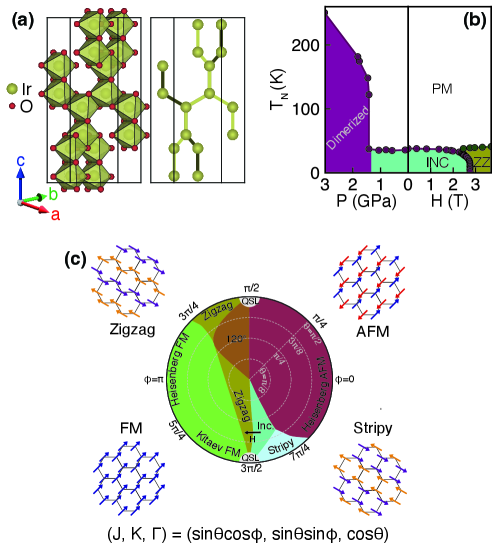
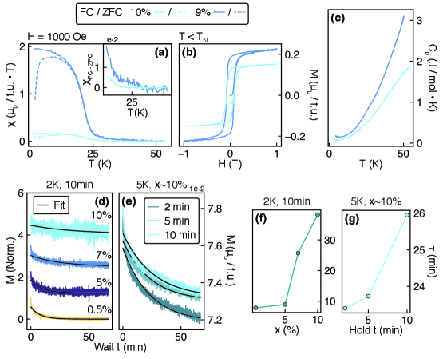
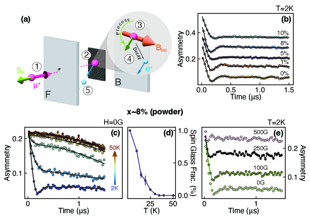
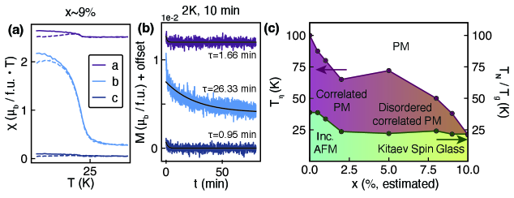
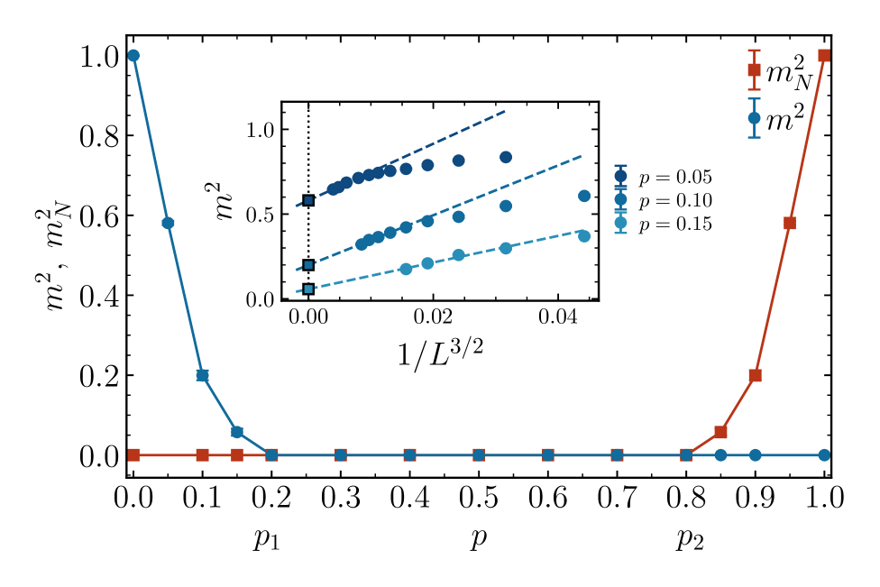
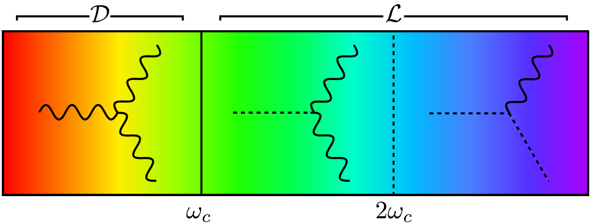
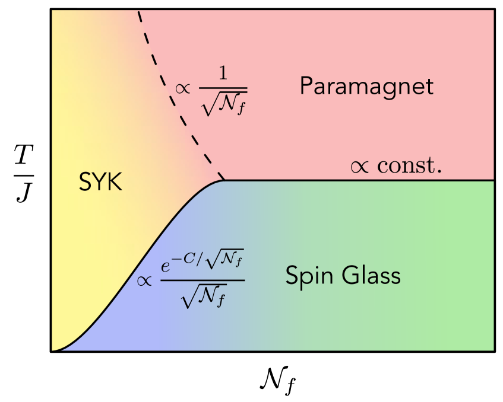
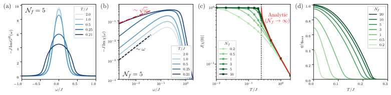
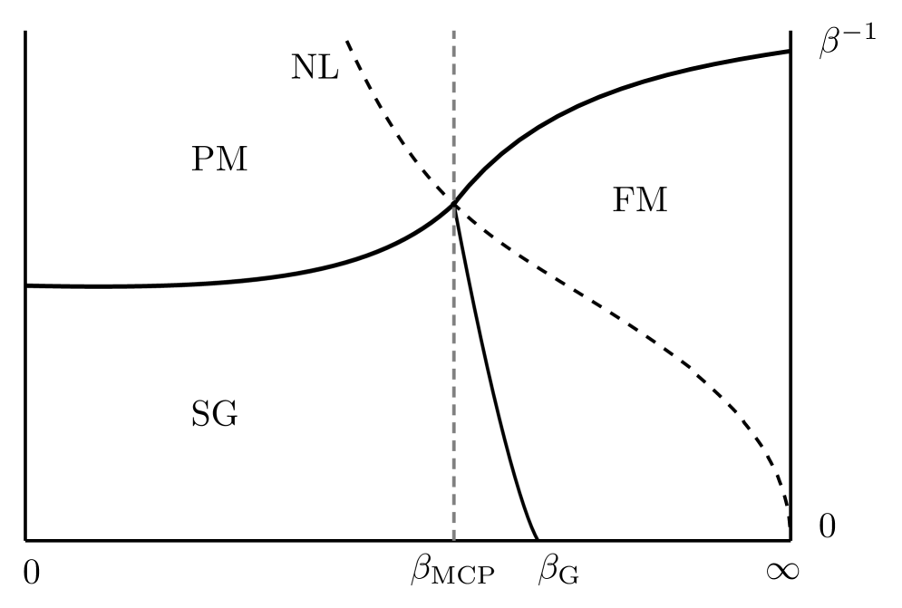

# Kitaev交換相互作用が生む異方的スピングラスと磁気緩和の物理

- **執筆日**: 2026-03-24
- **トピック**: Kitaevスピングラスと磁気緩和：フラストレーションと秩序の境界
- **注目論文**: arXiv:2601.22280
- **参照した関連論文数**: 7本

---

## 1. 導入：スピングラスはなぜ「物理の難問」であり続けるのか

磁石を冷やしていくと、多くの物質では特定の温度でスピンが整列し、強磁性体や反強磁性体として安定する。しかし自然界には、冷やしても決して秩序立った磁気構造を形成せず、代わりにスピンが「凍りついた」ようにランダムな方向を向いて動けなくなる物質が存在する。これが**スピングラス**（spin glass）である。

スピングラスは単なる「磁石の失敗作」ではない。スピングラス物理は、**クエンチされたランダム性**（quenched disorder）と**フラストレーション**（frustration）という2つの要素が組み合わさったとき、系がどのように複雑なエネルギー地形を形成し、非平衡なダイナミクスを示すかという、凝縮系物理学の根幹に関わる問いを提起してきた。

近年、スピングラス研究は新たな局面を迎えている。従来のAuFe合金やCuMn合金に加え、二次元ファンデルワールス物質（Fe₃GeTe₂）での2次元スピングラスの発見（arXiv:2403.02088）、量子光学キャビティを使ったスピングラスの量子シミュレーション（arXiv:2505.22658）、さらにはKitaev量子スピン液体と隣接する「Kitaevスピングラス」の実現という新概念の登場によって、分野の地平が大きく広がっている。

本記事では、2026年1月に報告されたKitaevイリジウム酸化物β-Li₂RuₓIr₁₋ₓO₃における**異方的Kitaevスピングラス**（arXiv:2601.22280）を軸に据え、スピングラスの現代的な全体像を解説する。この注目論文が新しく示したのは、磁気的無秩序（スピングラス）がKitaev交換相互作用の特徴的な異方性を保持できるという驚くべき事実である。これは、量子スピン液体（quantum spin liquid）の近傍相としてのスピングラスという新しい理解への窓を開く。

*図1：β-Li₂IrO₃の結晶構造（ハニカム格子）と、Ru濃度xに対する磁気相図。J–K–Γ模型の理論的な磁気状態も示されている。(arXiv:2601.22280, CC BY 4.0)*

---

## 2. 解決すべき問い：フラストレーション系における秩序と無秩序の境界

スピングラスを理解するうえで中心的な問いは、「なぜスピンは磁気秩序を形成せず、集団的に凍結するのか」である。この問いは一見シンプルに見えて、実は非常に深い。

通常の強磁性体では全てのスピンが同じ方向を向こうとする。反強磁性体では隣接スピンが反平行になろうとする。ところが、スピングラスの基本要素である**フラストレーション**が生じると、全てのスピンが同時に「満足する」ことができない。正三角形の頂点に配置された3つのスピンが全て反平行になれないことは、その直感的な例である。

さらに**クエンチされたランダム性**、すなわち冷却時に固定される不規則な結合定数があると、系は複雑なエネルギー地形を持つようになり、多数の準安定状態（局所エネルギー極小）が出現する。スピングラスはその中の一つに「トラップ」されて凍結するのである。この描像は**エドワーズ–アンダーソン（EA）模型**として定式化された（1975年）。

本記事が注目するKitaev系では、さらに特別な問いが加わる。Kitaev模型は、交換相互作用が**結合方向に依存する強い異方性**を持ち（x結合、y結合、z結合が独立に働く）、これが幾何学的フラストレーションと組み合わさって量子スピン液体という特殊な位相を生み出す。では、この高度に異方的なKitaev系に磁気的不純物を導入し、スピングラスを実現したとき、スピングラスはKitaev交換の異方性を記憶しているのだろうか？　それとも無秩序によって打ち消されるのだろうか？

この問いに答えたのが、2026年1月のarXiv:2601.22280である。

---

## 3. 注目論文は何を新しく示したのか

### β-Li₂IrO₃：Kitaevスピングラスの実現

β-Li₂IrO₃は、Irイオンがハニカム格子を形成するKitaev系の代表的な物質である。この物質は低温で反強磁性秩序を示すが、Kitaev型相互作用の痕跡が強く残っている。そこに希薄なRu不純物（x ≲ 10%）を導入したβ-Li₂RuₓIr₁₋ₓO₃において、注目論文（arXiv:2601.22280）は以下の実験ツールを組み合わせ、包括的な磁気的特性評価を行った。

- **磁気測定**（磁化率、交流磁化率）
- **熱容量**（交流法）
- **共鳴弾性X線散乱（REXS）**：Ir L₃端を用いた磁気Braggピーク観察
- **ミューオンスピン緩和（μSR）**：局所磁場の時間発展を直接観察

#### 主な発見

希薄ドーピング（x ≲ 10%）において、長距離反強磁性秩序が抑制され、代わりに**スピングラス相**が安定化される。ここで特筆すべきは、このスピングラスが**強い磁気異方性を保持している**点である。

磁化率の方向依存性と熱残留磁化（thermoremanent magnetization, TRM）は、c軸方向とab面内で明確に異なる振る舞いを示す。特にb軸方向が依然として「易軸」として機能しており、これはKitaev交換相互作用に起源を持つ結晶対称性の効果が、スピングラス状態においても消えていないことを意味する。

*図2：中間ドープ濃度における磁気ヒステリシスの出現、広がった熱容量の異常、および熱残留磁化（TRM）の緩和。スピングラスの特徴的な署名が明確に見える。(arXiv:2601.22280, CC BY 4.0)*

#### μSRによる磁気緩和の直接観察

μSR測定は、スピングラス転移の最も直接的な証拠を提供した。純粋なβ-Li₂IrO₃では、低温でミューオンの歳差運動が明確な振動として観察され、長距離反強磁性秩序を示す。しかし、Ruドーピングによってスピングラスが実現すると、この振動は消え、代わりに指数関数的な緩和が支配的になる。これはスピンが特定の方向ではなく、ランダムに凍結していることを示す。

*図3：μSR非対称スペクトル。低ドープ（左）では反強磁性秩序に対応した振動が見られるが、スピングラス相（右）では振動が消え、緩やかな指数関数的緩和に置き換わる。(arXiv:2601.22280, CC BY 4.0)*

#### なぜ「異方的スピングラス」は珍しいのか

通常のスピングラス（例：CuMnやAuFe）では、ランダムな結合がスピンをランダムな方向に凍結させるため、系全体として磁気異方性を持たないか、持っていても微弱である。しかしKitaev系では、Kitaev交換相互作用が結合の方向ごとに独立した磁気異方性を決定し、これは不純物導入程度では消えない。その結果、**無秩序な凍結（スピングラス）と方向依存性の高い磁気特性（Kitaev異方性）が共存する**という、通常のスピングラス描像では説明のつかない状態が生まれた。

*図4：磁化率とTRMの方向依存性。b軸方向が依然として易軸として機能しており、Kitaev交換相互作用に由来する対称性がスピングラス状態においても保持されていることを示す。(arXiv:2601.22280, CC BY 4.0)*

---

## 4. 背景と文脈：スピングラス研究の現在地

### 古典スピングラスから現代へ

スピングラスの概念は1970年代に金属合金（AuFe, CuMn）において確立された。Edwards–Anderson（1975年）はクエンチされたランダム交換相互作用を持つ格子模型を提案し、局所スピンの二乗平均により定義されるEAオーダーパラメータ

$$q_{\mathrm{EA}} = \left[\langle S_i \rangle_t^2\right]_J$$

（角括弧は熱力学的平均、$[\cdots]_J$はランダム結合についての平均を表す）を導入した。これにより、スピングラスが通常の常磁性体とは異なる「秩序状態」であることが定式化された。

引き続いてSherrington–Kirkpatrick（SK）模型（1975年）は全結合ランダムイジング系を解析的に扱い、**レプリカ法**と**レプリカ対称性の破れ（RSB）**というスピングラス物理の中核概念を生み出した（Parisi, 1979年）。これはスピングラスが単一のエネルギー谷ではなく、階層的に入れ子になった多数の純粋状態から構成されることを示す。

包括的なレビュー（arXiv:2512.19818）は、これらの古典的な理論枠組みから最近の計算材料科学・機械学習への接続まで、現代のスピングラス物理を網羅的に整理している。

### 新材料系：2次元スピングラス

スピングラスの次の大きな展開の一つは2次元（2D）材料での実現である。arXiv:2403.02088は、ファンデルワールス物質Fe₃GeTe₂において、Fe原子のランダムな分布から生じるスピングラス相を初めて報告した。この研究では、交流磁化率の強い周波数依存性、**時効（aging）**、**カオス（chaos）**、**記憶効果（memory effect）**が確認され、重要なことにこれらの現象が単位格子厚の試料（すなわち2次元極限）においても持続することが示された。これにより、ファンデルワールス積層や電気的ゲーティングによるスピングラス状態の高度な調節可能性が開かれた。

### Kitaev系の特殊性

β-Li₂IrO₃は、Kitaevハニカム系の代表的な実験材料である。Kitaev模型の基本ハミルトニアンは

$$\mathcal{H}_K = -K \sum_{\langle ij \rangle_\gamma} S_i^\gamma S_j^\gamma$$

と書かれ、$K$はKitaev相互作用の強度、$\gamma \in \{x, y, z\}$は結合の方向ラベル、$S_i^\gamma$は$\gamma$成分のスピン演算子を表す。この相互作用は**Ising型**だが結合の方向によって成分が異なるため、格子上で強いフラストレーションが生じ、量子スピン液体が実現する。

β-Li₂IrO₃の現実のハミルトニアンは、Kitaev相互作用$K$に加えてハイゼンベルク交換$J$やΓ相互作用も含む$J$-$K$-$Γ$模型で記述される。希薄Ruドーピングは長距離秩序を壊すが、より長距離まで到達するKitaev交換の痕跡は残存する。これが「異方的スピングラス」を実現させる。

---

## 5. メカニズム・解釈・比較：磁気緩和はスピングラスの何を語るか

### μSRが測る「スピンの時間」

ミューオンスピン緩和（μSR）は、試料中に打ち込まれた正ミューオン（μ⁺）の偏極緩和を測定する局所プローブ技術である。ミューオンは磁気モーメントを持ち、周囲の電子スピンが作る局所磁場を感じて歳差運動する。この緩和率$\lambda$は

$$P(t) = A \cdot \exp(-\lambda t) \cos(\omega_\mu t + \phi)$$

（$P(t)$：ミューオン偏極率、$\omega_\mu = \gamma_\mu B_{\rm loc}$：ラーモア周波数、$\gamma_\mu$：ミューオンの磁気回転比）

のように時間発展し、局所磁場$B_{\rm loc}$と磁場の揺らぎの情報を直接与える。スピングラス相では周囲のスピンが凍結するため、$\omega_\mu$の振動は見えなくなり、$\lambda$が大きくなる傾向がある。注目論文（2601.22280）では、この振動の消失がKitaevスピングラス転移の強力な証拠として使われた。

### 熱残留磁化と時効

**熱残留磁化（thermoremanent magnetization, TRM）**は、スピングラスの「記憶」を示す最もわかりやすい実験量の一つである。系を磁場中でスピングラス転移温度$T_g$以下に冷却し、その後磁場をゼロにしても残存する磁化がTRMである。この磁化が時間とともに緩和していく様子が、スピングラスのダイナミクスを反映する。

注目論文では、TRMの時間緩和が方向依存性（b軸 vs ab面内）を示すことを確認した。この異方的なTRM緩和こそが、Kitaev交換に由来する磁気異方性がスピングラス状態においても生き残っていることの直接証拠となる。

### スピン波の局在：半古典論からの洞察

スピングラス状態においてスピン波（マグノン）はどのように伝播するのだろうか。arXiv:2603.22077による2次元ハイゼンベルクスピングラスの半古典的分析は、この問いに対して重要な洞察を与える。

*図5：反強磁性ボンド確率$p$を変化させたときの磁化（強磁性）とネール秩序パラメータの振る舞い。FM相、SG相、AFM相の3つの相が現れる。(arXiv:2603.22077, CC BY 4.0)*

同研究は、ホルスタイン–プリマコフ変換を通じてスピン波ハミルトニアンを対角化し、各固有状態の局在性を$r$パラメータ（固有値統計）と分形次元（フラクタル次元）で評価した。主な結果は以下の通りである。

- **FM/AFM相**：低エネルギー励起は非局在（delocalized）であり、無秩序があっても移動度端（mobility edge）以下のモードは空間的に広がっている
- **スピングラス相**：全エネルギー帯域にわたって弱い局在（weak localization）が見られ、これはアンダーソンZ分類クラスDと整合する

*図6：各エネルギー帯域での励起の伝播メカニズム概念図。局在励起と非局在励起の間の相互作用が長時間ダイナミクスに関係する。(arXiv:2603.22077, CC BY 4.0)*

この結果は、スピングラス相においてスピン波が局在し、通常の流体力学的記述（スピン拡散など）が単純には成立しないことを示唆する。ただし著者らは、高次の量子補正（スピン波間の相互作用）が長時間で局在を解除し（ergodicity restoration）、最終的には流体力学が回復する可能性を指摘している。

### 量子スピングラスとSYK臨界点

さらに根本的な問いとして、量子揺らぎ（温度ゼロでも残る量子効果）がスピングラスの性質をどのように変えるかがある。arXiv:2603.11263は、無限距離量子ハイゼンベルクスピングラスを$1/\mathcal{N}_f$展開（$\mathcal{N}_f$はフェルミオンの「フレーバー」数）で解析し、次の重要な結果を得た。

*図7：温度$T$とフレーバー数$\mathcal{N}_f$の相図。大きな$\mathcal{N}_f$では古典的なスピングラス転移が見られるが、小さな$\mathcal{N}_f$では転移温度が急激に抑制され、SYK臨界性に近づく。(arXiv:2603.11263, CC BY 4.0)*

大きな$\mathcal{N}_f$（弱い量子揺らぎ）では、常磁性からスピングラスへの転移温度$T_c$が温度独立で現れる。しかし小さな$\mathcal{N}_f$（強い量子揺らぎ）では、$T_c$が指数関数的に抑制され

$$T_c \sim \frac{J}{\sqrt{\mathcal{N}_f}} \exp\!\left(-\frac{C}{\sqrt{\mathcal{N}_f}}\right)$$

というBCS的な形となる。この抑制は、系が**サチェフ–葉–北野（SYK）相**に近接していることを示す。SYK相はスケール不変な「非フェルミ液体」的スピン動特性をもち、スペクトル密度が$\chi''(\omega) \propto \mathrm{sgn}(\omega)|\omega|^{1/2}$という特徴的なべき乗則を示す。

*図8：フェルミオンスペクトル密度（上段）とスピン動的感受率（下段）。高温ではOhmic的振る舞いを示すが、低温ではsub-Ohmic（$\chi'' \propto |\omega|^{1/2}$）への転換が見られ、SYK臨界性の痕跡が現れる。(arXiv:2603.11263, CC BY 4.0)*

これは、Kitaevスピングラス（2601.22280）がKitaev量子スピン液体に隣接するのと類似して、量子スピングラスもSYK相（量子カオスと深く関連した非平衡臨界状態）の近傍にあることを示唆する。

---

## 6. 材料・手法・応用への広がり

### 計算手法：テンソルネットワークによる相図の精密化

実験と理論に加え、計算手法の進歩もスピングラス物理に新しい展開をもたらしている。arXiv:2603.18486は、西森線（Nishimori line）上の修正イジングスピングラスをテンソルネットワークサンプリングで解析し、スピングラス転移と強磁性転移が**別々の臨界温度**を持つことを精密に決定した（$L=256$まで）。

*図9：エドワーズ–アンダーソン（EA）模型の概略相図。常磁性相（PM）、強磁性相（FM）、スピングラス相（SG）の境界と西森線（Nishimori line）が示されている。スピングラス転移と強磁性転移が分離した臨界点を持つことが計算で確認された。(arXiv:2603.18486, CC BY 4.0)*

さらに、この転移の臨界指数（$\nu \approx 1.55$–$1.59$）が標準的なEA模型とは異なる普遍性クラスに属することも明らかにされた。これはスピングラス臨界現象の多様性を示しており、Kitaevスピングラスのような異常な系がさらに別の普遍性クラスを形成する可能性を示唆する。

### スペクトル法による臨界点の検出

arXiv:2603.03513（PRL掲載）は、3次元エドワーズ–アンダーソン臨界点において、オーバーラップ行列の固有値分布がWignerの半円分布からガウス分布へとクロスオーバーするという発見を報告した。このスペクトル的指標は、従来のマルチレプリカ相関計算より計算効率が高く、新しい臨界点検出ツールとなり得る。

### 量子シミュレーションプラットフォーム

スピングラス物理の検証に、量子光学の手法を用いたアプローチも注目を集めている。arXiv:2505.22658（PRL掲載）は、光学キャビティ内の超冷却原子を使って最大25スピンのイジングスピングラスを実装し、**レプリカ対称性の破れ（RSB）**と**超距離構造（ultrametric structure）**を実験的に確認した。このシステムは、スピングラスの時効・若返り（aging and rejuvenation）研究のための孤立した「顕微鏡的」プラットフォームとして機能し、理論予測の定量的検証を可能にする。

---

## 7. 基礎から理解する

### スピングラスとは何か：フラストレーションとランダム性の相乗効果

スピングラスを理解するには、まず**フラストレーション**の概念を押さえる必要がある。三角形の頂点3つにスピンを置き、全隣接ペアが反強磁性的（反平行に揃おうとする）に相互作用するとしよう。3つのスピンが全て反平行になる構造は存在しないため、必ずどこかに「不満」が残る。これがフラストレーションである。

$$\mathcal{H}_{\mathrm{EA}} = -\sum_{\langle ij \rangle} J_{ij} S_i S_j$$

ここで$J_{ij}$は結合定数（正なら強磁性的、負なら反強磁性的）であり、クエンチされたランダム性を持つ（ガウス分布または±$J$分布）。この単純に見えるハミルトニアンが、スピングラス特有の複雑なエネルギー地形を生み出す。

### μSR（ミューオンスピン緩和）の原理

μSRは磁気相転移を局所レベルで観察できる強力な手法である。正ミューオン（$\mu^+$）は陽子質量の約1/9、寿命$\tau_\mu = 2.197\,\mu\mathrm{s}$のレプトンである。試料中に打ち込まれたミューオンは、局所磁場$\mathbf{B}_{\mathrm{loc}}$の下でスピン歳差運動し、その偏極緩和$P(t)$が測定される。

$$\frac{dP}{dt} = \gamma_\mu \mathbf{B}_{\mathrm{loc}} \times \mathbf{P}$$

$\gamma_\mu = 2\pi \times 135.5\,\mathrm{MHz/T}$はミューオンの磁気回転比。磁気的に秩序した相では$B_{\mathrm{loc}}$が一定かつ強く、振動（歳差）が見える。スピングラス相では$B_{\mathrm{loc}}$の大きさがランダムだが時間的に固定されるため、緩和は指数関数的に近い形になる（Kubo–Toyabe関数からガウス型緩和への転換が典型的）。

### レプリカ対称性の破れ（RSB）

スピングラス理論の最も深い概念の一つが**レプリカ対称性の破れ（replica symmetry breaking, RSB）**である。スピングラスのランダム結合$J_{ij}$による平均を計算するため、「レプリカ法」では同一ハミルトニアン（同じ$J_{ij}$）を持つ$n$個のコピー（レプリカ）を導入する。

異なるレプリカ$a$と$b$の間のオーバーラップ$q^{ab} = N^{-1}\sum_i \langle S_i^a \rangle \langle S_i^b \rangle$が、Parisiが示したように**超距離的な階層構造**（ultrametric structure）をもつとき、レプリカ対称性が「破れている」という。物理的には、スピングラスのエネルギー地形が階層的に入れ子になった無数の谷から構成され、系が異なる谷へ移ることが困難な状態を表している。

$$P(q) = \sum_{\alpha,\beta} w_\alpha w_\beta \delta(q - q^{\alpha\beta})$$

ここで$P(q)$はオーバーラップ分布、$w_\alpha$は各純粋状態$\alpha$の熱力学的重み。RSBがあるとき、$P(q)$は単一のデルタ関数ではなく有限の広がりを持つ。

### Kitaev模型とハニカム格子

Kitaev模型（2006年）は、ハニカム格子上のスピン1/2系において**厳密に解けるトポロジカルスピン液体**を実現する。ハミルトニアン

$$\mathcal{H} = -K_x \sum_{x\text{-bonds}} S_i^x S_j^x - K_y \sum_{y\text{-bonds}} S_i^y S_j^y - K_z \sum_{z\text{-bonds}} S_i^z S_j^z$$

において、$K_x, K_y, K_z > 0$がトポロジカル量子スピン液体相を与える。このモデルは、遍歴するマヨラナフェルミオンと$\mathbb{Z}_2$ゲージ場の結合として厳密解が求まる（マトリックス積状態不要の解析的可解性）。β-Li₂IrO₃は強いスピン–軌道結合を持つIrイオンが実効的にスピン1/2として振る舞うKitaev候補材料であり、完全なKitaev液体ではないが$J$-$K$-$Γ$模型で記述される。

### SYK模型と量子カオス

サチェフ–葉–北野（SYK）模型は$N$個のマヨラナフェルミオンが全結合ランダム相互作用で結ばれた系であり、以下のハミルトニアンを持つ：

$$\mathcal{H}_{\mathrm{SYK}} = \frac{1}{4!} \sum_{i,j,k,l} J_{ijkl}\, \chi_i \chi_j \chi_k \chi_l$$

$J_{ijkl}$はランダムな四体相互作用（$\langle J_{ijkl}^2 \rangle = 3!J^2/N^3$）、$\chi_i$はマヨラナフェルミオン演算子。$N \to \infty$極限で、フェルミオングリーン関数はべき乗則$G(\tau) \propto |\tau|^{-1/2}$を示し、システムは**最大量子カオス**（リャプノフ指数がプランク単位の上限を実現）を示す。量子スピングラスのSYKへのクロスオーバーは、スピングラス-SYK系が同一フレームワークで理解できることを示し、量子情報、量子重力（AdS/CFT）との深いつながりへの扉を開く。

---

## 8. 重要キーワード10個の解説

### 1. スピングラス (Spin glass)

**定義**：ランダムな磁気相互作用とフラストレーションにより、スピンが長距離秩序を持たずに低温で凍結した磁気状態。

スピングラスは常磁性体でも強磁性体でも反強磁性体でもない第四の磁気状態。ガラス転移温度$T_g$以下でEAオーダーパラメータ$q_{\mathrm{EA}} = [\langle S_i \rangle^2]_J > 0$が有限になる。

### 2. フラストレーション (Frustration)

**定義**：格子のトポロジーと相互作用の組み合わせにより、全ての結合を同時に満足させることができない状態。

三角形格子上の反強磁性体が典型例。Kitaev模型では、結合の方向依存性が特殊なフラストレーション（量子フラストレーション）を生む。

### 3. エドワーズ–アンダーソン（EA）モデル

**定義**：ランダム結合$J_{ij}$を持つ格子スピン模型：$\mathcal{H} = -\sum_{\langle ij \rangle} J_{ij} S_i S_j$。

$J_{ij}$がガウス分布$P(J_{ij}) = (2\pi J^2)^{-1/2}\exp(-J_{ij}^2/2J^2)$に従う場合がEA模型の標準形。オーダーパラメータ$q_{\mathrm{EA}}$の有限性がスピングラス相を定義する。

### 4. レプリカ対称性の破れ (Replica symmetry breaking, RSB)

**定義**：スピングラスのエネルギー地形が階層的に入れ子になった多数の純粋状態から成り、それらの間のオーバーラップ$q^{\alpha\beta}$が連続分布$P(q)$を持つ状態。

Parisiのフルスタッピング型RSBでは、$P(q)$が$q_{\mathrm{min}}$から$q_{\mathrm{EA}}$の間に連続分布を持つ。RSBは超距離（ultrametric）構造と等価であり、ある状態$\alpha, \beta, \gamma$について$d(\alpha, \gamma) \le \max(d(\alpha, \beta), d(\beta, \gamma))$が成立する。

### 5. ミューオンスピン緩和 (μSR)

**定義**：試料中に注入した偏極ミューオンのスピン緩和を測定することで、局所磁場の大きさと時間変動を探る実験手法。

緩和率$\lambda$は局所磁場の揺らぎに比例し、スピン揺らぎの相関時間$\tau_c$と結びつく：$\lambda \propto \gamma_\mu^2 \langle B_\perp^2 \rangle \tau_c$（モチダ–飯塚式）。スピングラス凍結では$\tau_c \to \infty$となり、$\lambda$が急増する。

### 6. 熱残留磁化 (Thermoremanent magnetization, TRM)

**定義**：スピングラスをTg以上から磁場中でTg以下に冷却し、その後磁場をゼロにしたときに残る磁化。

$$M_{\mathrm{TRM}}(t) = M_0 \exp\!\left[-\left(\frac{t}{\tau}\right)^\beta\right]$$

の引き延ばされた指数関数（stretched exponential）で緩和することが多い（$0 < \beta < 1$）。異方的スピングラス（2601.22280）ではこの緩和が方向依存性を示す。

### 7. 時効 (Aging)

**定義**：スピングラス相において、測定量がTg以下に滞在した時間（待機時間$t_w$）に依存する現象。単純な平衡系では現れない非平衡効果。

スピングラスは$t_w$の間に「成長」した相関長$\xi(t_w)$を記憶しており、$t_w$が変わると同じ温度でも緩和曲線が変化する。$C(t+t_w, t_w) \ne C(t)$（時間並進不変性の破れ）が時効の数学的表現。

### 8. Kitaev交換相互作用

**定義**：ハニカム格子の各結合が、結合の方向$\gamma$に対応したスピン成分のみ$S_i^\gamma S_j^\gamma$を結合する、方向依存型の強いイジング相互作用。

強いスピン–軌道結合と特定の幾何学的条件（ハニカム格子上のoctahedral配位）が必要。β-Li₂IrO₃では$J$–$K$–$Γ$模型が適用される。Kitaev相互作用$K < 0$（強磁性）の場合に量子スピン液体が実現する。

### 9. 量子スピン液体 (Quantum spin liquid, QSL)

**定義**：磁気的相互作用が強くても絶対零度まで磁気秩序を形成せず、強く絡み合った量子状態（多体エンタングルメント）が基底状態となる磁性体。

Kitaevスピン液体はその厳密解が知られる稀有な例。実験的には比熱の冪乗則、中性子散乱での励起の広がりなどが指標となる。注目論文の「異方的スピングラス」はQSLとスピングラスの中間的な相であり、QSL研究の新展開を与える。

### 10. SYK（サチェフ–葉–北野）モデル

**定義**：$N$個のマヨラナ（またはコンプレックス）フェルミオンが全結合ランダム四体相互作用で結ばれた、厳密に解けるスピン/フェルミオン系。

$N \to \infty$では低エネルギー挙動が$\mathcal{N} = 0$の超共形場理論（共形対称性を持つ）に対応し、AdS₂/CFT₁（反ドジッター時空2次元との双対性）の重力模型となる。量子スピングラスのSYKへのクロスオーバー（2603.11263）は、スピングラス物理と量子情報・量子重力が接点を持つことを示す。

---

## 9. まとめと今後の論点

本記事では、β-Li₂RuₓIr₁₋ₓO₃における異方的Kitaevスピングラスの発見（arXiv:2601.22280）を軸に、スピングラス・磁気緩和の現代的な展開を解説した。

**この注目論文が示した最重要点**は、希薄磁気不純物によって生じたスピングラスが、その親物質（Kitaev系β-Li₂IrO₃）に由来するKitaev交換の特徴的な異方性を保持できるという事実である。μSR、TRM、REXS、熱容量という複数の手法の組み合わせが、この「異方的スピングラス」の多面的な理解を可能にした。

**今後の重要な論点**は以下の通りである。

1. **KitaevスピングラスとQSLの相境界**：希薄ドープ系でKitaev量子スピン液体の近傍相としてのスピングラスはどこまで理解できるか。压力やゲートチューニングによる相変化の探索が有望である。

2. **スピングラス相のスピン波ダイナミクスの観測**：半古典理論（2603.22077）が予測した「弱い局在」とその高次補正（スピン波間相互作用による非エルゴード性解除）を実験的に検証できるか。非弾性中性子散乱や熱伝導度が鍵となる。

3. **量子スピングラスのSYKクロスオーバーの実現**：量子揺らぎが強い系（例：磁気的に希薄なKitaev系）でのSYK的スペクトル特性の観測は、実験的に到達可能か。低温・低ドープ領域での磁気スペクトル測定が課題。

4. **2次元スピングラスの普遍性**：Fe₃GeTe₂で見つかった2次元スピングラス（2403.02088）や、Kitaevイリジウム薄膜へのドーピングで、2次元特有のRSBや時効現象が実現するか。ファンデルワールス系の調節可能性が有利に働く。

5. **テンソルネットワーク・スペクトル法の Kitaev系への適用**：arXiv:2603.18486やarXiv:2603.03513のような計算手法をKitaev–スピングラス模型に適用することで、相図の精密化や普遍性クラスの決定が可能となる。

スピングラス物理は、量子スピン液体、SYK模型、低次元物質、量子シミュレーションへの多方向の接続を通じて、今後数年でさらなる展開を見せると期待される。

---

## 10. 参考にした論文一覧

| # | arXiv ID | タイトル | 役割 | ライセンス |
|---|----------|---------|------|-----------|
| 1 | [2601.22280](https://arxiv.org/abs/2601.22280) | Anisotropic Kitaev Spin Glass in Li₂RuₓIr₁₋ₓO₃ | **注目論文** | CC BY 4.0 |
| 2 | [2603.22077](https://arxiv.org/abs/2603.22077) | Semiclassical picture of the Heisenberg spin glass in two dimensions: from weak localization to hydrodynamics | スピン波局在の理論（背景・比較） | CC BY 4.0 |
| 3 | [2603.11263](https://arxiv.org/abs/2603.11263) | Crossover to Sachdev-Ye-Kitaev criticality in an infinite-range quantum Heisenberg spin glass | 量子スピングラスの動力学（比較・拡張） | CC BY 4.0 |
| 4 | [2603.18486](https://arxiv.org/abs/2603.18486) | Phase Transitions in a Modified Ising Spin Glass Model | テンソルネットワーク計算（手法・比較） | CC BY 4.0 |
| 5 | [2403.02088](https://arxiv.org/abs/2403.02088) | Realization of a Spin Glass in a two-dimensional van der Waals material | 2D vdW系スピングラス（材料の広がり） | CC BY 4.0 |
| 6 | [2603.03513](https://arxiv.org/abs/2603.03513) | q-Gaussian Crossover in Overlap Spectra towards 3D Edwards-Anderson Criticality | スペクトル法による臨界点検出 | arXiv 標準（図不使用） |
| 7 | [2505.22658](https://arxiv.org/abs/2505.22658) | A multimode cavity QED Ising spin glass | 量子光学シミュレーション（応用） | arXiv 標準（図不使用） |
| 8 | [2512.19818](https://arxiv.org/abs/2512.19818) | Spin Glasses: Disorder, Frustration, and Nonequilibrium Complexity | 総合レビュー（背景） | arXiv 標準（図不使用） |

---

*本記事における図の使用について：図を掲載した論文（arXiv:2601.22280、2603.22077、2603.11263、2603.18486）は全てCreative Commons Attribution 4.0 International（CC BY 4.0）ライセンスのもとで公開されており、著作者表示を条件として再利用が明確に許可されている。各図キャプションに出典を明記した。*
