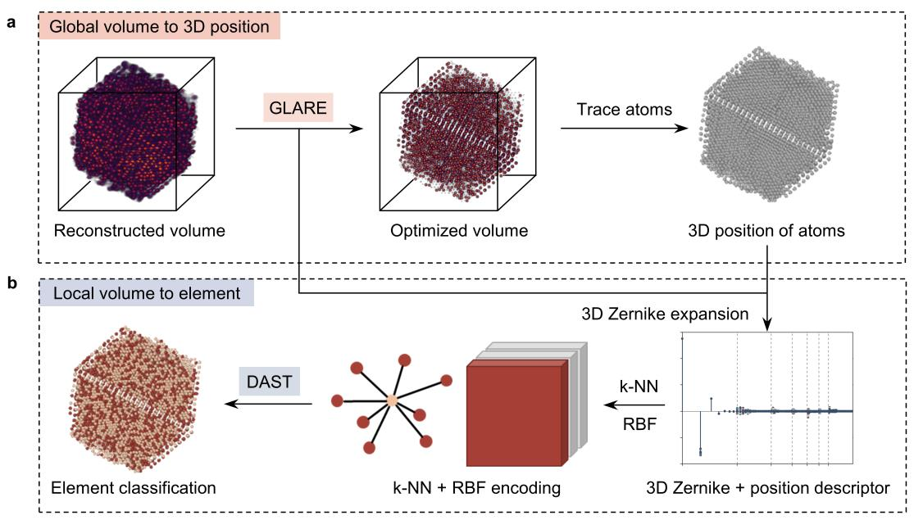
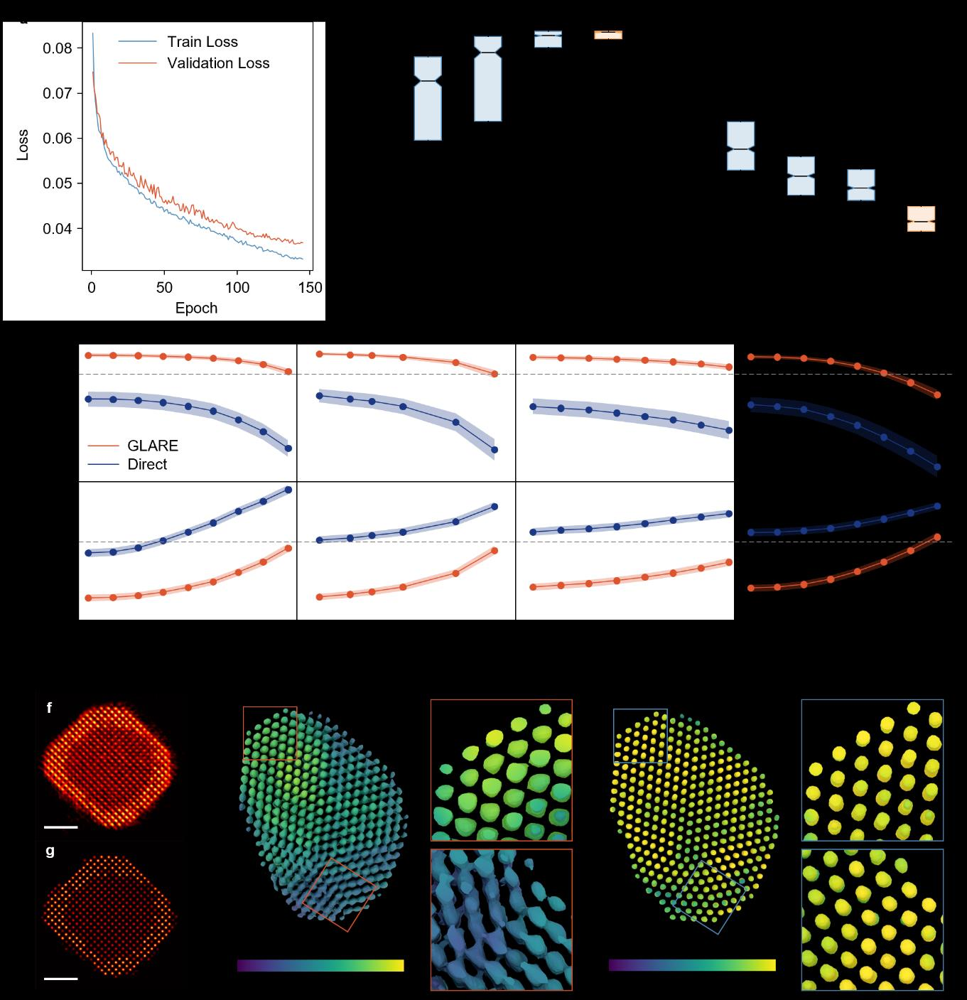
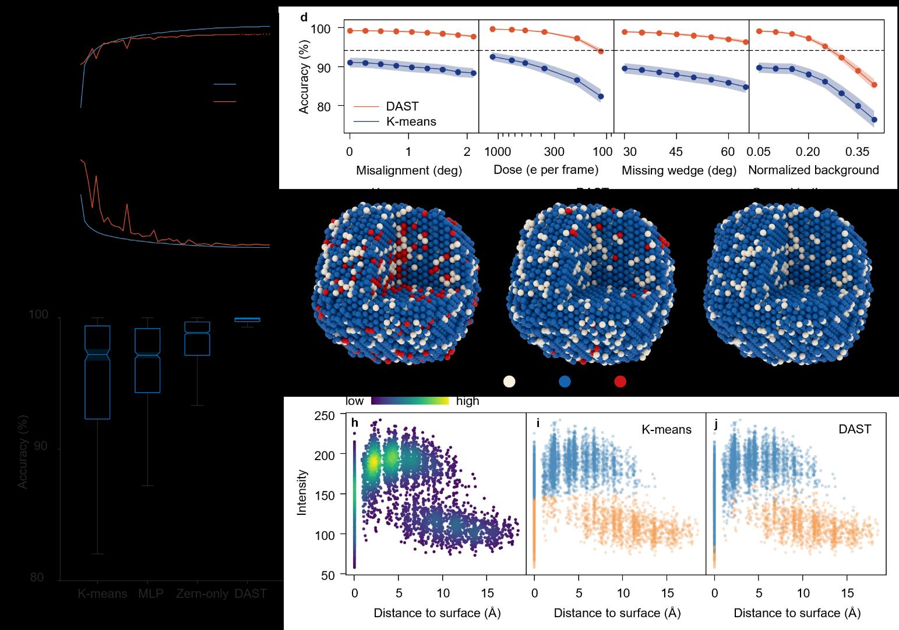
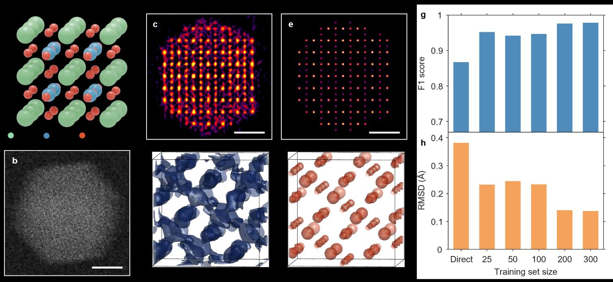
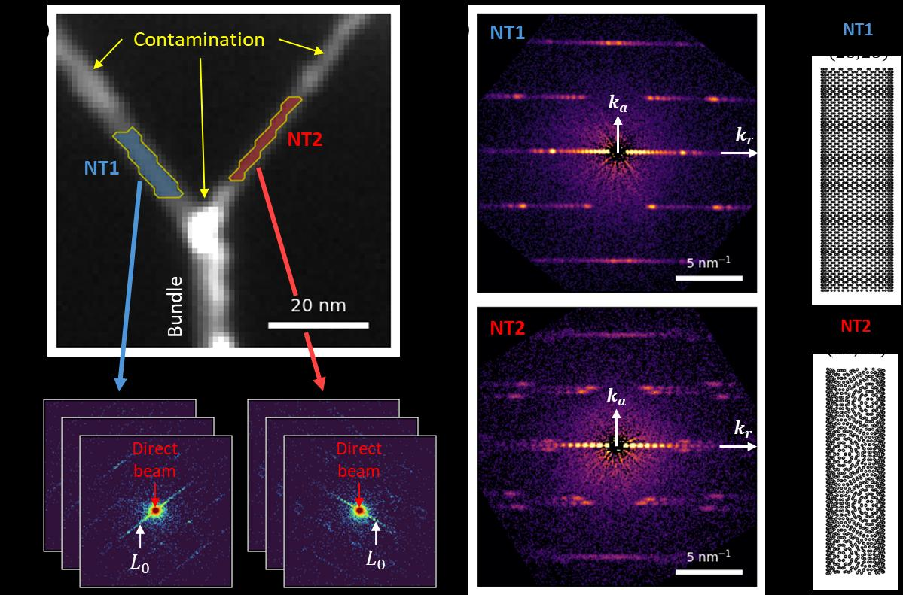
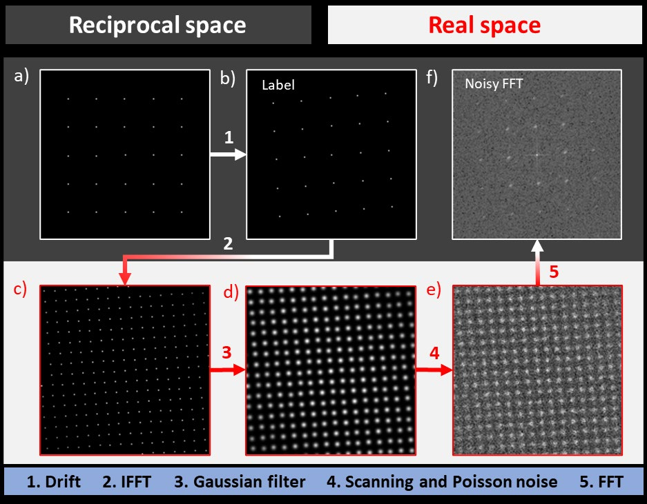

# 原子を「見る」から「分かる」へ：低ドース原子電子トモグラフィーを変革する物理インフォームドAI

**執筆日**: 2026-03-23
**トピック**: 低ドース原子電子トモグラフィーのための物理インフォームドニューラルネットワーク (PANN)
**Primary broad area**: 放射光・量子ビーム
**Secondary broad area**: 計算材料科学
**注目論文**: 2603.19942
**参照した関連論文数**: 8本

---

## 1. 導入：なぜ今この話題か

材料の性質を原子スケールで理解したい——この欲求は材料科学・物性物理の核心にある。結晶構造はX線回折で精密に決定できるが、それはあくまで空間平均であり、非周期的な局所欠陥や界面の構造、ナノ粒子内部の原子配列は見えてこない。その壁を突き破る技術が**原子電子トモグラフィー（Atomic Electron Tomography; AET）**だ。走査透過型電子顕微鏡（STEM）を用いて多方向から取得した2次元投影像を計算処理することで、ナノ粒子の3次元原子座標と元素種を直接決定できる。

しかしAETには長年の制約があった。**電子線による試料ダメージ（ビームダメージ）**だ。電子は荷電粒子であり、試料を照射するたびに原子をはじき飛ばしたり、化学結合を切断したりする。この問題を軽減するには照射電子線量（ドース）を下げるしかないが、低ドース撮影では信号対雑音比（SNR）が著しく低下し、3次元再構成の精度も劣化する。鉛ハライドペロブスカイト（CsPbBr₃など）や有機‐無機ハイブリッド材料は、従来の標準ドースの1/100以下の低ドースでしか耐えられない。このジレンマが長らくAETの適用対象を金属ナノ粒子などの堅牢な系に限定してきた。

2026年3月、北京大学のJihan Zhouグループは物理インフォームドニューラルネットワーク（Physics-Aware Neural Networks; PANN）というフレームワークを発表し、このジレンマを正面から突破した [2603.19942]。ANNに「物理的制約」を組み込み、低ドームAETデータから高精度な原子座標・元素同定を実現したのだ。この進展は、これまで電子線に弱すぎて3次元原子イメージングが事実上不可能だった材料群へのAET適用を切り拓く可能性を持つ。

さらに時代の文脈として、電子顕微鏡分野における深層学習の台頭が加速している。4D-STEM（4次元走査透過型電子顕微鏡法）[2510.25286]、周波数領域ニューラルネットワークによるSTEM像のデノイジング [2505.01789]、強誘電体の分極マッピングへのML適用 [2603.15582] など、電子ビームを用いた量子ビーム計測とAI技術の融合は急速に進んでいる。これらを俯瞰しながら、PANNの位置づけと今後を考察する。

---

## 2. 解決すべき問い

### 2.1 ビームダメージと低ドースのジレンマ

AETの基本プロセスを整理する。試料を傾け角度を変えながら、各傾斜角でHAADF（高角度環状暗視野）-STEM像を撮影する。これが**チルトシリーズ**と呼ばれる一連の2次元投影データだ。チルトシリーズからGENFIREやRESIREなどの反復的アルゴリズムで3次元ボリュームを再構成し、その後に各原子位置を特定（原子トレーシング）して最終的な原子モデルを得る。

このプロセスで避けられない問題が3つある。

**① 低ドース条件下の雑音**：電子線量を減らすほど、各ピクセルに到達する電子数が減り、ショット雑音（ポアソン統計に従うランダム雑音）が支配的になる。再構成ボリューム中の原子ピークはノイズに埋もれ、原子の特定が困難になる。

**② ミッシングウェッジ（Missing Wedge）問題**：試料をステージで傾けられる最大角度には限界がある（通常 ±70°〜±75°程度）。残りの角度範囲は「ウェッジ状の欠損領域」としてフーリエ空間に残る。この欠損情報により、再構成ボリュームには「引き伸ばしアーチファクト」が生じ、本来球形の原子ピークが扁平な楕円体として現れる（図1参照）。

**③ アライメント誤差の伝播**：チルトシリーズの各像を再構成に使う前に、それぞれの回転軸を精密にアライメントする必要がある。このアライメントに誤差があると、再構成ボリュームにぼけやアーチファクトが生じ、原子座標の精度に直接影響する。

従来の手法では、こうしたノイズと欠損を補うため「標準ドース」（〜5×10⁵ e⁻ Å⁻²）での撮影が前提とされてきた。しかしCsPbBr₃のような有機-無機ペロブスカイトは、わずか8,000 e⁻ Å⁻²程度のドースで結晶構造が破壊される。この10倍以上の差が、従来AETとビームダメージに弱い材料の間に横たわる壁だ。

### 2.2 先行するML手法の限界

機械学習のAETへの応用はすでに試みられていた。3次元ResUNetを使ったPtナノ粒子の再構成最適化手法が報告されているが、この手法は「1元素・単結晶」という特定系に過特化しており、多元素・多形態の粒子への汎化が困難で、ゴーストアトム（本来存在しない偽の原子ピーク）の発生が問題であった。元素種の同定では、反復的アルゴリズムが用いられてきたが、計算コストが高く、パラメータ依存性も大きい。

根本的な問題は「厳密な低ドース条件下でのベンチマーク評価が欠如していた」ことだ。AETを真に普遍的で信頼性の高い計測手法にするには、低ドース条件でも頑健に機能する、汎化性能の高いML手法が必要だった。

---

## 3. 注目論文は何を新しく示したのか

Zhang et al. (2026) [2603.19942] が提案するPANNは2段階のニューラルネットワーク（NN）からなる（**図1**）。

**ステージ1：GLARE（Global-Local AET ResUNet 3D）による体積精緻化**

低ドース再構成ボリュームを入力として受け取り、3次元ResUNetが雑音除去と幾何学的歪みの補正を行う。特徴的なのは、「グローバルコンテキストブランチ」の存在だ。これは画像全体の統計情報（特徴量の平均・分散）をFiLM（Feature-wise Linear Modulation）レイヤーを通じてローカルなフィルタ処理に与える仕組みで、局所的な雑音除去だけでなく、粒子全体の整合性を保った補正を可能にする。GLARE精緻化後にRogerポリノミアル原子トレーシングアルゴリズムで各原子の3D座標を特定する。

**ステージ2：DAST（Distance-Aware Set Transformer）による元素同定**

各原子座標を中心に周囲のボクセル密度を3次元ゼルニケ多項式展開でエンコードし、局所的な電子密度分布の特徴量（記述子）を生成する。この記述子と原子座標をグラフ表現に落とし込み、グラフアテンションTransformerに入力して元素種を分類する。原子座標情報を距離依存性として組み込むことで、単純な輝度クラスタリングでは弁別できない「コアシェル界面付近の原子」も正確に同定できる。

**ベンチマーク評価の設計**

PANNの評価には42,588個のシミュレーションボリュームが使用された。この規模のベンチマークデータセットは従来の研究には存在しなかった。各ボリュームはHAADF-STEMのシミュレーションパイプラインで生成されており、以下の現実的な誤差因子を組み込んでいる：アライメント誤差（角度・並進）、ドース変動、ミッシングウェッジ、バックグラウンドコントラスト、ガウス雑音、デフォーカスなど。このような多様な条件での検証により、PANNの汎化性能が正当に評価されている。

**主な結果**

PANNは標準的なノイズ条件下で、原子座標誤差（RMSD）を直接トレーシングの約0.24 Åから約0.10 Åへと半分以下に低減した（**図2**）。全体的な原子回収率（座標と元素種の両方を正しく同定する確率）は、93%から99%へと向上した。比較対象となったResUNetやSwin Transformerと比べても、GLAREは顕著に優れた性能を示した（中央値F1スコア：直接トレーシング0.9666、ResUNet 0.9848、Swin 0.9955、GLARE 0.9978）。

低ドース実験データへの適用では、1/6ドース（標準ドースの1/6、約9.3×10⁴ e⁻ Å⁻²）から得た構造が、標準ドース再構成と95%の一致率を達成した（従来手法では75%）。これは、実験電子ドースを大幅に削減しても信頼性の高い構造解析が可能であることを示す（**図4**）。

*図1: PANNワークフロー全体像。(a) GLAREモデルによる3Dボリュームの精緻化と原子座標の取得。(b) 3Dゼルニケ展開係数とグラフアテンションTransformerによる元素分類。[Zhang et al., arXiv:2603.19942, CC BY-NC-ND 4.0]*

---

## 4. 背景と文脈：この注目論文はどこに位置づくか

### 4.1 AETの誕生と発展

AETの礎は、電子線トモグラフィーの理論と収差補正STEMの技術的成熟にある。2000年代以降、収差補正電子顕微鏡の普及により原子分解能での2次元STEM像が安定して取得できるようになった。これを多角度から撮影してCTスキャンのように3次元化する発想がAETだ。

決定的な技術ブレークスルーは2010年代に登場したGENFIRE（Generalized Fourier Iterative REconstruction）アルゴリズムだ。欠損したフーリエ空間情報を反復的に補完するこのアルゴリズムにより、ミッシングウェッジ問題が大幅に緩和された。さらにRESIRE（Real-Space Iterative Reconstruction）はリアル空間での反復アルゴリズムにより、複雑なナノ構造の3D再構成精度を高めた。これらのアルゴリズムにより、FePt合金ナノ粒子の全原子座標決定や高エントロピー合金の局所化学的不均一性の可視化など、革新的な成果が生まれた。

Juhyeok LeeとYongsoo Yangによる2025年のレビュー論文 [2506.16104] は、AETと深層学習の融合に関する最近の進展を体系的にまとめている。この総説が指摘するように、深層学習のAET導入は（1）ノイズ除去・欠損補完、（2）再構成品質向上、（3）原子追跡の自動化・精密化の3点で革新をもたらした。

### 4.2 PANNが解決する問題の新しさ

先行研究が残した課題は「低ドース条件下での汎化性能」と「元素同定の信頼性」の両立だ。PANNは先行するUNetベースのアプローチが抱えていた「単一元素・単結晶への過適合」問題を、42,588サンプルにわたる多様なベンチマークと、物理的制約を内包したネットワーク設計で解決した。

特に注目されるのは、PANN論文が「低ドース条件での定量的ベンチマーク」を初めて体系的に構築した点だ。AETの実用化には再現性と定量的検証が不可欠であり、その基盤を提供したという貢献は、個別の手法改善にとどまらない。

---

## 5. メカニズム・解釈・比較

### 5.1 GLAREネットワークの設計原理

GLAREの核心は、**物理知識を「アーキテクチャ」に埋め込む**という設計哲学にある。

標準的なResUNetは局所的な畳み込みでノイズを除去するが、AETのアーチファクト（特にミッシングウェッジによる方向依存的な歪み）は**グローバルな一貫性**を必要とする補正だ。GLAREはFiLMレイヤーを通じたグローバルコンテキストブランチを追加することで、「このボリューム全体でどのような構造・組成を持つ粒子なのか」という大域的な文脈情報をローカルな補正に活かす。

結果として、GLAREは直接トレーシング比で角度ミスアライメントに対しF1スコアの低下が顕著に緩和されており、実験的に必然的に存在するアライメント誤差（≤2°）に対する頑健性が確認されている（**図2**）。

*図2: GLAREネットワークの性能評価。(a) 学習・検証損失曲線。(b,c) F1スコアとRMSDの比較（直接トレーシング、ResUNet、Swin、GLAREの比較）。(d,e) 各誤差因子（ミスアライメント、電子ドース、ミッシングウェッジ、バックグラウンド強度）に対するF1スコアとRMSDの変動。(f,g) Pd@Ptコアシェルナノ粒子の実験データへの適用例。[Zhang et al., arXiv:2603.19942, CC BY-NC-ND 4.0]*

### 5.2 DASTと3Dゼルニケ記述子の役割

元素同定における革新は**3Dゼルニケモーメント**にある。各原子の周囲3ピクセル半径の局所ボクセル強度分布を、3次元ゼルニケ多項式展開で記述することで、**原子の局所電子密度の"形"を定量化**する。これをグラフアテンションTransformerに入力し、原子座標情報（距離依存性）を同時に利用することで、強度だけに依存したK-means法よりはるかに高い分類精度（平均99.50%）を達成した。

アブレーション実験（各コンポーネントを除いた比較実験）が明快な結論を示している：「原子座標のみ」では検証精度約55%で頭打ちとなり、ゼルニケ記述子が元素分類に本質的な寄与をもたらすことが確認されている（**図3**）。

*図3: DASTネットワークの性能評価。(a,b) 精度・損失曲線。(c) K-means、MLP、Zern-onlyDASTとの精度比較。(d) 各誤差因子に対する精度変動。[Zhang et al., arXiv:2603.19942, CC BY-NC-ND 4.0]*

### 5.3 ガウスパラメータ化アプローチとの比較

Singh et al. (2025) [2512.15034] は全く異なる発想のAET改善手法を提案している。原子を**学習可能なガウス関数**（位置・振幅・幅がパラメータ）としてモデル化し、その集合として原子構造を直接最適化する。物理的事前知識（原子は本質的に強い局在性を持つ）をモデルのパラメータ化に内包することで、従来のボクセルベース再構成より少ないパラメータ数で高い分解能を得ている。

PANNとガウスパラメータ化の違いは「何に物理知識を入れるか」の差だ。PANNはネットワークアーキテクチャとFeature Modulationに物理制約を入れ、「すでに行われた再構成結果の事後補正」を担う。ガウスパラメータ化は再構成アルゴリズム自体を物理的に設計する「事前的アプローチ」といえる。両者は相補的であり、ガウスパラメータ化で得た粗い原子モデルをPANNでさらに精緻化するパイプラインも考えられる。

### 5.4 PhaseT3Mとの比較：分解能へのアプローチ

Lee et al. (2026) [2504.16332] が*Nature Communications*で発表したPhaseT3Mは、電子クライオトモグラフィーに非線形位相回復を導入し、コバルト酸化物ナノ粒子で1.6 Å分解能を達成した。これはSTEMの多スライス散乱（厚い試料での電子多重散乱）を直接モデリングするベイズ最適化アプローチだ。

PhaseT3Mがターゲットとする問題は「非線形散乱コントラスト」であり、PANN が解く「低ドーム雑音と元素同定」とは本質的に別の次元の問題だ。ただし両者が示すことは一致している：「電子トモグラフィーの限界を突破するには、物理モデルとMLの統合が不可欠である」という命題だ。将来的には、位相情報を利用した低ドース撮影（電子線量を30〜50%削減できる）とPANNを組み合わせることで、より広い材料系への適用が期待される。

---

## 6. 材料・手法・応用への広がり

### 6.1 ビームダメージに弱い材料への適用：CsPbBr₃ペロブスカイト

PANNの最も重要な応用先が電子線感受性材料だ。CsPbBr₃ナノ粒子は太陽電池・LEDへの応用から基礎研究まで広く注目されているが、その構造・欠陥解析は「ビームダメージで壊す」問題から長らく阻まれてきた。

PANNは5,000 e⁻ Å⁻²という極低ドースでのCsPbBr₃トモグラフィーデータから、F1スコア0.9715・RMSD 0.1269 Åという高精度な原子構造を取得することに成功した（**図5**）。わずか300サンプルのファインチューニングデータでこの性能を達成したことも注目に値する（ファインチューニング効率の高さを示す）。

*図5: CsPbBr₃へのGLARE-CPBの適用。(a) CsPbBr₃の結晶モデル。(b) 低ドース多スライスシミュレーションSTEM像。(c-f) 精緻化前後のボリュームスライスと等値面表示の比較。(g,h) 異なるファインチューニングデータサイズに対する性能評価。[Zhang et al., arXiv:2603.19942, CC BY-NC-ND 4.0]*

### 6.2 高エントロピー合金の核生成：AETが明かす中間状態

Yuan et al. (2025) [2504.11325] は、高エントロピー合金（HEA）ナノ粒子の核生成・成長過程をAETでリアルタイムに追跡した。数千個の核を原子スケールで分析し、「核のコアから界面に向かって局所的な構造秩序が減少し、それが局所的な化学秩序と相関する」という**勾配核生成経路モデル**を提案した。このモデルは、核生成自由エネルギー障壁が単一のバリアではなく連続的な中間状態を経由することを示唆し、古典核生成理論を更新する。

この研究は「低ドース問題」よりも「AETで何を見るか」の実例として重要だ。HEAは複数の主成分元素が原子スケールで不均一に分布しており、元素種の精確な同定（DASTが解く問題）が研究の前提となる。PANNのような高精度元素同定手法の整備が、このような応用研究を支える。

### 6.3 ねじれ二層グラフェンの炭素原子3次元イメージング

Kim et al. (2025) [2504.08228] はプトコグラフィックAET（pAET）を用いて、ねじれ二層グラフェン中の炭素原子位置を0.11 Åという超高精度で3次元決定した。軽元素（炭素）は通常HAADF-STEMでコントラストが小さく、AETに不向きとされてきた。pAETは電子線の位相情報を利用することでこの問題を克服している。発見されたのはメロン様・スカーミオン様の**カイラル格子歪み**で、これはvan der Waals力に起因する3次元的なトポロジカル構造歪みだ。

低ドース低コントラスト材料へのAET拡張という文脈でPANNと繋がる。PANNは強度の低い原子ピークに対する感度の向上（低ドース条件でのF1スコア向上）をもたらしており、軽元素AETへの応用も視野に入る。

### 6.4 4D-STEMによる補完的アプローチ：カーボンナノチューブのカイラリティ決定

Louiset et al. (2025) [2510.25286] は4D-STEMを用いて単層カーボンナノチューブ（SWCNT）のカイラリティを精密決定した。4D-STEMは、収束電子線の各走査点での回折パターン（2Dの逆空間情報）を空間的に記録する技術で、電子ビームとの相互作用情報を2D実空間 × 2D逆空間の4次元データとして蓄積する。

SWCNTのカイラリティ（(n, m)指数で表されるチューブの巻き方）は電子的性質（金属性か半導体性か）を決定するが、従来の手法には「局所分解能が低い」「バンドル（束）内での分析が困難」などの制約があった。4D-STEMは1750 e⁻ Å⁻²という低ドースで複数ナノチューブのカイラリティを同時決定でき、さらに電子プトコグラフィーで原子スケールの欠陥も可視化している（**図S1**）。

*図S1: 4D-STEMによるSWCNTカイラリティマッピング手順。(a) 仮想ADF像と回折パターン。(b,c) 前処理後の回折パターン（アキラル・カイラルナノチューブ）。(d,e) 対応するナノチューブ構造モデル。[Louiset et al., arXiv:2510.25286, CC BY 4.0]*

4D-STEMとAETは相補的だ。4D-STEMは1次元・2次元的な局所構造情報を高い空間分解能で取得するのに対し、AETは非周期構造の3次元情報を直接取得する。両技術のML融合は、電子顕微鏡の情報抽出能力を劇的に拡大する方向にある。

### 6.5 周波数領域DNNによる原子分解能デノイジング

Pinto-Huguet et al. (2025) [2505.01789] は全く異なる切り口から同じ問題（低SNR下での原子分解能解析）に取り組んだ。彼らのアプローチは「実空間でなく周波数（逆空間）領域でU-Netを訓練し、有意な周波数成分を選択的に強調する」というものだ（**図S2**）。

実験FFT（フーリエ変換パターン）をU-Netに入力し、有効な周波数成分に対応するバイナリマスクを予測する。このマスクで元のFFTをフィルタリングし、逆FFTで実空間に戻すことで、原子構造の情報を保持しつつノイズを除去したSTEM像を得る。Ge量子井戸とWS₂モノレイヤーへの適用で、従来難しかった軽元素の直接可視化や高精度ひずみ解析が可能になっている。

*図S2: 周波数領域DNNデノイザーのパイプライン。(左) 訓練データ生成：各種材料・方位・撮影条件のFFTシミュレーション。(右) 推論：実験FFT → U-Net → マスク → フィルタリング → 逆FFT → デノイジング像。[Pinto-Huguet et al., arXiv:2505.01789, CC BY 4.0]*

PANNとの概念的な差異は「入力の空間」にある。PANNは再構成ボリューム（3D実空間）を精緻化するのに対し、このデノイザーは個別の2D STEM像（2D周波数空間）を処理する。両者の組み合わせ、すなわち「周波数領域デノイジングしたSTEM像からAETを行い、さらにPANNで精緻化する」という統合パイプラインは、低ドース撮影精度を連鎖的に向上させる可能性を持つ。

### 6.6 強誘電体の分極マッピング：4D-STEM × MLの応用例

Martinc et al. (2026) [2603.15582] はKNbO₃-NaNbO₃系強誘電体における分極方向のマッピングを4D-STEMとMLで行い、「シミュレーション訓練データと実験データの間の分布シフト（ドメインギャップ）」が最大の課題であることを示した。これはMLを電子顕微鏡に適用する際の普遍的な問題点であり、PANNのファインチューニング戦略（300サンプルで新材料系に適応）と同じ課題だ。

特に重要な知見は、「分類ミスが欠陥位置と相関する」という発見だ。誤分類されたパターンは試料中の構造欠陥部分と一致しており、ドメインウォールや点欠陥の自動検出への転用可能性を示している。

---

## 7. 基礎から理解する

### 7.1 HAADF-STEMとはなにか

HAADF（High-Angle Annular Dark Field）-STEMは、収束電子ビームを試料上で走査し、大角度（高角度環状検出器：通常70〜200 mrad）に散乱された弾性散乱電子を検出する方式だ。散乱強度は原子番号の約2乗（Z²）に比例する（正確にはZ^n で n≈1.6〜2）ため、重い元素ほど明るく見える（Zコントラスト）。

数式で表すと、HAADF-STEM像の強度は：

$$I_\mathrm{HAADF}(\mathbf{r}) \approx \sum_i Z_i^n \cdot |\psi(\mathbf{r} - \mathbf{r}_i)|^2$$

ここで $\mathbf{r}$ は電子プローブの走査位置、$\mathbf{r}_i$ はi番目の原子の位置、$Z_i$ はその原子番号、$\psi$ はプローブの波動関数（収束した電子波）を表す。$n$ は通常1.6〜2。

この強度の「原子番号依存性」こそがAETで元素種を同定できる理由だ。ただし実際には、試料の厚さや結晶の傾き、チャネリング効果（電子が原子列に沿って「チャネル」を通るように進む効果）により、単純なZ依存性からのずれが生じる。これがDASTの元素分類を単純な強度閾値法（K-means）で行えない根本的な理由だ。

### 7.2 電子線トモグラフィーと投影定理

トモグラフィーの数学的基礎は**Radon変換**と**フーリエスライス定理（中心断面定理）**にある。

対象物の3Dボリューム $f(\mathbf{r}) = f(x,y,z)$ をある傾斜角 $\theta$ で投影した2D像 $p_\theta(u,v)$ は：

$$p_\theta(u,v) = \int f(u, v, w) \, dw$$

ここで $(u,v,w)$ は傾斜後の座標系だ。フーリエスライス定理は、「傾斜角 $\theta$ での投影のフーリエ変換は、3Dフーリエ空間の $\theta$ に対応する2D中心断面（スライス）に等しい」と述べる：

$$\hat{p}_\theta(k_u, k_v) = \hat{f}(k_u, k_v, 0)$$

（$\theta=0$ の場合）

すなわち、多方向の2D投影データを集めることで3Dフーリエ空間を再構成でき、逆フーリエ変換で3D密度分布 $f(\mathbf{r})$ が得られる。GENFIREやRESIREはこの枠組みを反復的に精緻化する。

**ミッシングウェッジの問題**は、使用できる傾斜角度が ±75° 程度に限られるため、3Dフーリエ空間のうち「ウェッジ状の領域」（通常ビーム軸方向）の情報が欠損することから生じる。この欠損を補完するのにGLAREのグローバルコンテキストブランチが機能する。

### 7.3 ResUNetの構造

ResUNet は、画像セグメンテーション用に開発された UNet アーキテクチャと ResNet（残差ネットワーク）を組み合わせたニューラルネットワークだ。

**UNet部分**：エンコーダ（ダウンサンプリング）とデコーダ（アップサンプリング）が対称構造をなし、スキップコネクションで対応する解像度の特徴マップを結合する。これにより、「粗い特徴（全体形状）」と「細かい特徴（局所テクスチャ）」の両方を活用できる。

$$y_\mathrm{Dec}^{(l)} = f\!\left(\mathrm{Up}\!\left(y_\mathrm{Dec}^{(l+1)}\right) \oplus y_\mathrm{Enc}^{(l)}\right)$$

ここで $\mathrm{Up}$ はアップサンプリング、$\oplus$ はチャネル方向の連結、$y_\mathrm{Enc}^{(l)}$ はエンコーダのスキップ特徴マップ。

**ResNet部分**：各層に残差接続（ショートカット）を加えることで、勾配消失問題を緩和し深いネットワークの安定学習を実現する：

$$y = \mathcal{F}(x) + x$$

**GLAREの追加要素（FiLM）**：Feature-wise Linear Modulationは、条件付け情報（グローバルコンテキスト）$c$ からスケール係数 $\gamma$ とバイアス係数 $\beta$ を生成し、特徴マップ $x$ を変調する：

$$\mathrm{FiLM}(x | c) = \gamma(c) \cdot x + \beta(c)$$

これにより、個々の局所パッチの補正がボリューム全体の文脈（粒子の形状、組成分布など）に依存するようになる。

### 7.4 3Dゼルニケ多項式と局所記述子

ゼルニケ多項式は、単位球内で定義された完全直交基底系であり、3次元密度分布を回転不変な係数（モーメント）で表現するのに適している。

3次元ゼルニケ展開は：

$$f(\mathbf{r}) = \sum_{n=0}^{\infty} \sum_{l=0}^{n} \sum_{m=-l}^{l} c_{nl}^m Z_{nl}^m(\mathbf{r})$$

ここで $Z_{nl}^m(\mathbf{r})$ は3次元ゼルニケ基底関数（動径次数 $n$、角運動量量子数 $l$、磁気量子数 $m$）、$c_{nl}^m$ が展開係数（Zernike moments）だ。

これを原子の局所密度（各原子の周囲3ピクセル半径のボクセル強度分布）に適用することで、「原子周囲の電子密度の3D形状」を回転不変かつコンパクトな特徴ベクトルとして表現できる。異なる化学種が同じ強度でもその「周囲の形」が違えば弁別できる、というアイデアだ。

### 7.5 グラフアテンションTransformer

グラフニューラルネットワーク（GNN）は、原子を「ノード」、原子間の近傍関係を「エッジ」としたグラフ上でメッセージパッシングを行う。各原子の表現はその近傍原子との相互作用により更新される：

$$h_i^{(t+1)} = \phi\!\left(h_i^{(t)}, \bigoplus_{j \in \mathcal{N}(i)} \psi(h_i^{(t)}, h_j^{(t)}, e_{ij})\right)$$

ここで $h_i^{(t)}$ はノード $i$ の $t$ ステップ目の特徴ベクトル、$\mathcal{N}(i)$ は近傍ノードの集合、$e_{ij}$ はエッジ特徴（距離、方向など）。**アテンション機構**を導入することで、「どの近傍原子が元素同定に重要か」を動的に学習できる。DASTではさらに**距離依存性**（Distance-Aware）をエッジ特徴に明示的に組み込み、表面・バルク・界面の違いをエンコードしている。

---

## 8. 重要キーワード10個の解説

### 1. 原子電子トモグラフィー（Atomic Electron Tomography; AET）

走査透過型電子顕微鏡（STEM）で試料を複数の傾斜角から撮影したチルトシリーズを、反復的な3次元再構成アルゴリズムで処理することで、**非周期構造の3次元原子座標と元素種を直接決定**する手法。X線回折が空間平均構造を与えるのに対し、AETは局所的な欠陥・界面・相分離などの不均一構造を原子スケールで可視化できる。精度は通常0.1〜0.3 Å程度で、原子間距離（典型的に2〜3 Å）の1/10〜1/20の精度で座標決定が可能。

### 2. HAADF-STEM

高角度環状暗視野走査透過型電子顕微鏡法（High-Angle Annular Dark Field Scanning TEM）。収束電子ビームを走査しながら、高角度（70〜200 mrad）に散乱した電子を環状検出器で検出する。検出強度は原子番号 $Z$ の約2乗に比例するため「Zコントラスト像」と呼ばれ、重い原子ほど明るく映る。原子分解能で元素種のコントラストを直感的に可視化でき、AETの標準的なデータ取得モードとして使用される。

### 3. 電子ドース（Electron Dose）

電子顕微鏡で試料に照射される電子の量を表す単位で、単位面積あたりの電子数（e⁻ Å⁻²）で表される。ドースが大きいほど信号対雑音比（SNR）は向上するが、ビームダメージ（ノックオン損傷、ラジオリシスなど）も増大する。通常のAETには $\sim 5 \times 10^5$ e⁻ Å⁻² 程度が使用されるが、CsPbBr₃のようなビーム感受性材料では $\leq 8000$ e⁻ Å⁻² しか許容されない。低ドース条件下では $I \sim \sqrt{N}$ のポアソン雑音が支配的となり（$N$ は検出電子数）、SNRは $\propto \sqrt{N}$（スタンダードドースの1/6では SNR が $1/\sqrt{6} \approx 0.41$ 倍に低下）。

### 4. ミッシングウェッジ（Missing Wedge）

電子トモグラフィーで試料を傾けられる角度範囲が ±70°〜±75° に限られるため、3Dフーリエ空間の「ウェッジ（楔）状の領域」に対応するデータが欠損する問題。この欠損により再構成像にはビーム軸方向（傾斜軸に垂直な方向）に「引き伸ばしアーチファクト」が生じ、球状原子ピークが楕円体状に歪む。定量的には、±75°の傾斜範囲では全フーリエ空間の約18%が欠損する（$1 - (\alpha_\mathrm{max}/90°)$ の形で近似的に評価できる）。GENFIRE等の反復アルゴリズムや、GLAREのようなNN法が補完する対象となる。

### 5. ResUNet

画像の意味セグメンテーション用アーキテクチャ UNet（スキップコネクション付きエンコーダ-デコーダ）に、残差接続（Residual Connection）を組み合わせたニューラルネットワーク。残差接続 $y = \mathcal{F}(x) + x$ により、勾配消失問題を抑制して深いネットワークの安定した学習を可能にする。3次元ボリュームに適用した3D-ResUNetはAETの体積精緻化に特に有効で、GLAREはこれにグローバルコンテキストブランチを追加したものだ。

### 6. 3Dゼルニケモーメント（3D Zernike Moments）

単位球上の完全直交基底 $Z_{nl}^m(\mathbf{r})$ を用いて3次元密度分布を展開したときの係数。$n$ は動径次数、$l$ は角運動量量子数、$m$ は磁気量子数（$|m| \leq l$, $l \leq n$, $n-l$ 偶数）。これらの係数は**回転不変性**を持つため、原子の向き依存性によらず一意な局所構造記述子として機能する。展開は $f(\mathbf{r}) = \sum_{n,l,m} c_{nl}^m Z_{nl}^m(\mathbf{r})$ で、DASTでは各原子周囲の局所ボクセル密度を入力として展開係数を計算し、元素同定の特徴量として使用する。

### 7. グラフアテンションTransformer（DAST）

原子集合をグラフ（ノード=原子、エッジ=原子間相互作用）として表現し、アテンション機構を持つTransformerで処理するニューラルネットワーク。注意重みは $a_{ij} = \mathrm{softmax}(\mathbf{q}_i^\top \mathbf{k}_j / \sqrt{d})$ で計算され（$\mathbf{q}_i, \mathbf{k}_j$ はクエリ・キーベクトル、$d$ は次元数）、「どの近傍原子が元素同定に重要か」を動的に学習する。DASTでは原子間距離 $r_{ij}$ をエッジ特徴に組み込み（Distance-Aware）、表面・界面・バルクという空間的文脈を活用した元素分類を可能にする。

### 8. 4D-STEM（4次元走査透過型電子顕微鏡法）

収束電子ビームを試料上で2次元走査しながら、各走査点で2次元電子回折パターン（CBED; 収束ビーム電子回折）を記録する技術。得られるデータは2次元実空間 × 2次元逆空間の4次元データセットで、ピクセル化検出器（数十 ns/フレームの読み出し速度）の実用化により2010年代後半から急速に普及した。カイラリティマッピング、分極マッピング、ひずみマッピング、電位マッピングなど多様な解析に応用でき、さらに電子プトコグラフィーとの組み合わせで原子分解能の位相情報も取得可能。

### 9. 電子プトコグラフィー（Electron Ptychography）

走査点ごとの回折パターン（4D-STEMデータ）から、複数のパターン間の「重なりした領域の拘束」を利用して試料の透過関数（位相と振幅）を再構成する手法。従来の直接像形成（ABF、HAADF）と異なり、電子線の**位相情報**を直接回収できるため、軽元素（C、N、O など）の検出感度が飛躍的に高い。また信号効率が高いため、同じ分解能をHAADF-STEMの1/10〜1/100のドースで達成できる可能性があり、ビームダメージ低減に有効。PhaseT3M [2504.16332] やpAET [2504.08228] はこの路線の最前線だ。

### 10. ペア分布関数（Pair Distribution Function; PDF）

原子間距離 $r$ の分布を定量化する関数で、距離 $r$ から $r + dr$ の範囲に原子対が見つかる確率密度を表す：

$$g(r) = \frac{V}{N^2} \left\langle \sum_{i \neq j} \delta(r - r_{ij}) \right\rangle$$

ここで $V$ はボリューム、$N$ は原子数、$r_{ij}$ は原子 $i, j$ 間の距離。シャープで高いピークは高い原子秩序を示し、広いピークや低強度は無秩序・歪みを示す。AETで得た原子モデルからPDFを計算することで、精緻化の品質が定量的に評価できる（GLAREによる精緻化でPDFピークがシャープになることが図4に示されている）。X線散乱による実験PDFとの比較で、再構成の正確性も独立に検証できる。

---

## 9. まとめと今後の論点

### PANNが示す意義

PANNが示した最も重要な成果は、「低ドースAETの汎化ベンチマーク」の確立だ。42,588サンプルにわたる多様な条件での体系的評価により、ML手法の性能を客観的に比較・検証する基盤が初めて整った。このような基準がなければ、様々なML手法が出てきても「本当に実用的か」の判断ができない。

技術的には、(1) グローバルコンテキスト付き3D-ResUNetによる体積精緻化と、(2) 3DゼルニケモーメントとグラフアテンションTransformerによる元素同定を統合した二段階フレームワークは、AETの再現性と精度の限界を大きく塗り替えた。CsPbBr₃での低ドース実証は、ペロブスカイト太陽電池・量子ドット・有機LEDなどの構造研究に直接的な影響を持つ。

### 残された課題と今後の論点

**① 多元素系への拡張**：現在のDASTは2元素系のみで検証されている。3元素以上の複雑な合金・セラミックスへの拡張には、元素間の識別がより困難になるため、訓練データの多様性拡充と分類頭部の設計見直しが必要だ。

**② エンドツーエンド学習への統合**：現在のPANNは「前処理→再構成（GENFIRE等）→PANN精緻化」という多段パイプラインだ。チルトシリーズの入力から直接原子モデルを出力するエンドツーエンドの学習スキームが構築できれば、個々の段階での誤差累積を防ぎ、よりシームレスなワークフローが実現する。

**③ インサイチュ・4D-STEMとの融合**：材料の相変態、界面反応、ナノ粒子の成長過程などをリアルタイムで3次元追跡する「ダイナミックAET」への展開が期待される。4D-STEMのプトコグラフィーとPANNを組み合わせることで、より少ないドースで時間分解3D原子構造解析が可能になるかもしれない。

**④ シム-実験ギャップ（ドメインギャップ）**：MLを電子顕微鏡に適用する際の普遍的な課題だ [2603.15582]。PANNはファインチューニング（300サンプルで新材料系に適応）でこれを部分的に解決しているが、「ゼロショット汎化」（ファインチューニングなしでの新材料系への適用）は依然として難しい。基礎物理モデルとデータ駆動学習の最適なバランスの探索が続いている。

**⑤ 量子ビーム法全般への波及**：「物理インフォームドAI + 量子ビーム」という手法論は、X線トモグラフィー（nanoXPEEM [2512.17252]）、中性子散乱、シンクロトロンX線回折など他の量子ビーム計測にも波及しつつある。これらの計測法共通の課題——線量制限、欠損データ補完、ノイズ処理——に対する統一的なML解法の構築が、次世代の「量子ビーム計測科学」を形成するだろう。

---

## 10. 参考にした論文一覧

| # | arXiv ID | タイトル（省略形） | 役割 | ライセンス |
|---|----------|------------------|------|-----------|
| 1 | [2603.19942](https://arxiv.org/abs/2603.19942) | Physics-aware neural networks enable robust AET via low-dose imaging | 注目論文 | CC BY-NC-ND 4.0 |
| 2 | [2512.15034](https://arxiv.org/abs/2512.15034) | A Gaussian Parameterization for Direct Atomic Structure Identification in Electron Tomography | 比較手法 | arXiv非排他 |
| 3 | [2506.16104](https://arxiv.org/abs/2506.16104) | Advancing atomic electron tomography with neural networks（Applied Microscopy 2025） | 背景レビュー | arXiv非排他 |
| 4 | [2504.16332](https://arxiv.org/abs/2504.16332) | PhaseT3M: 3D Imaging at 1.6 Å Resolution via Electron Cryo-Tomography（Nature Comm. 2026） | 比較手法 | arXiv非排他 |
| 5 | [2504.08228](https://arxiv.org/abs/2504.08228) | Three-dimensional imaging of individual carbon atoms | 応用例（軽元素AET） | arXiv非排他 |
| 6 | [2504.11325](https://arxiv.org/abs/2504.11325) | Crystal nucleation and growth in high-entropy alloys by AET | 応用例（HEA核生成） | arXiv非排他 |
| 7 | [2510.25286](https://arxiv.org/abs/2510.25286) | Advanced structural characterization of SWCNTs with 4D-STEM | 関連手法（4D-STEM） | CC BY 4.0 |
| 8 | [2505.01789](https://arxiv.org/abs/2505.01789) | Enhancing atomic-resolution in electron microscopy: A frequency-domain DL denoiser | 関連手法（FFT-DL） | CC BY 4.0 |
| 9 | [2603.15582](https://arxiv.org/abs/2603.15582) | Benchmarking ML Approaches for Polarization Mapping in Ferroelectrics Using 4D-STEM | 関連応用（分極マッピング） | CC BY 4.0 |

> **図のライセンス注記**：
> - 2603.19942 の図（fig1〜fig5）：CC BY-NC-ND 4.0 のもとで転載（改変なし、非商用、著作権者クレジット付与）
> - 2510.25286 の図（figS1）：CC BY 4.0 のもとで転載（Louiset et al. クレジット付与）
> - 2505.01789 の図（figS2）：CC BY 4.0 のもとで転載（Pinto-Huguet et al. クレジット付与）
> - 上記以外の論文の図は転載していない（arXiv 非排他ライセンスのため）
