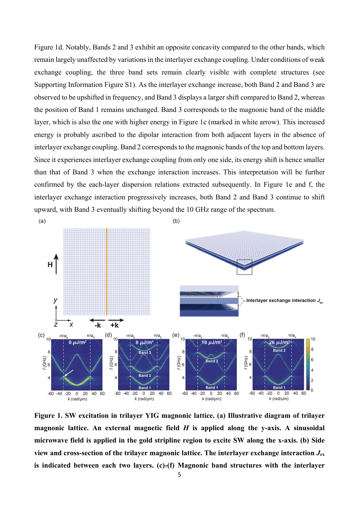
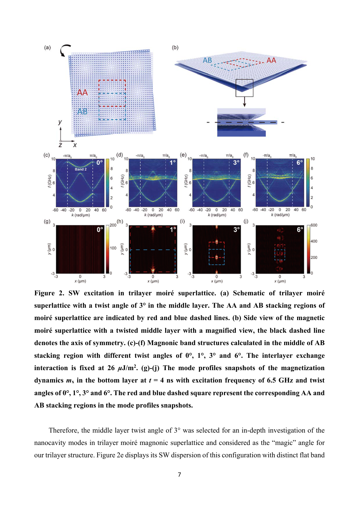
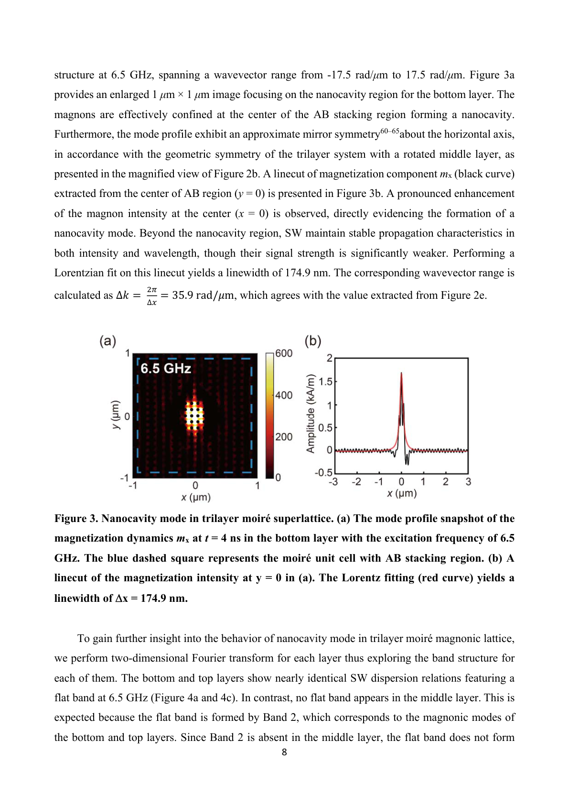
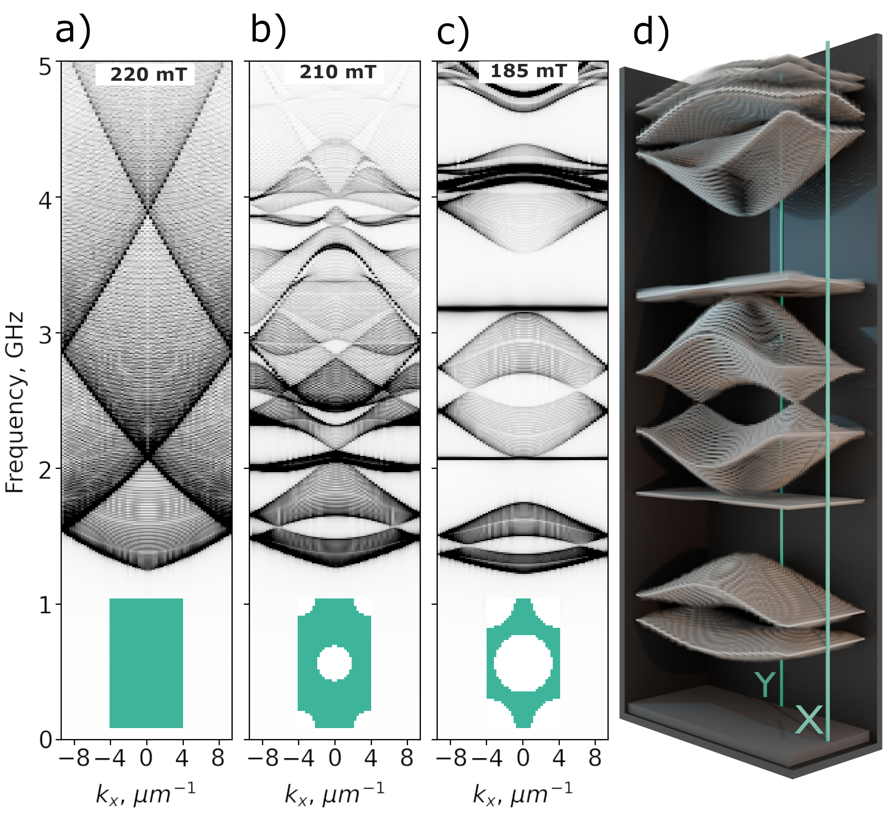
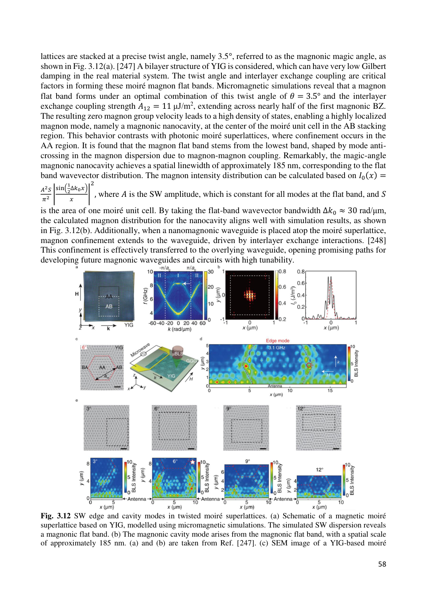
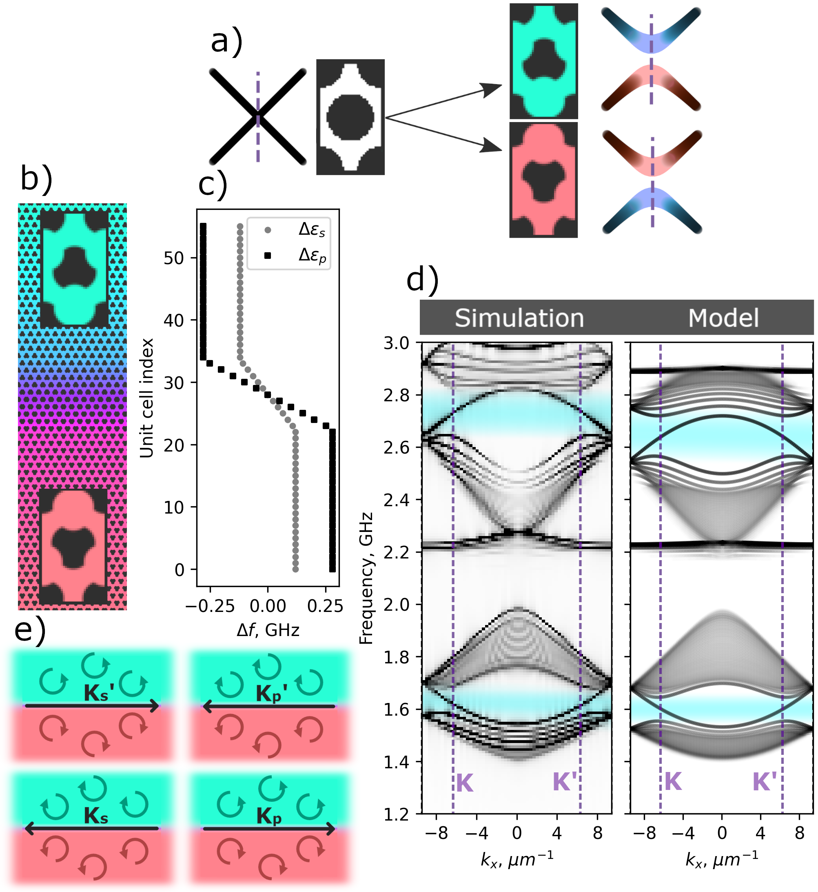
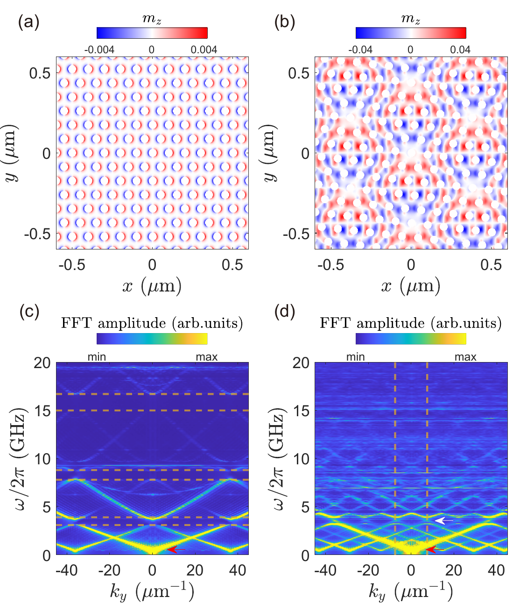
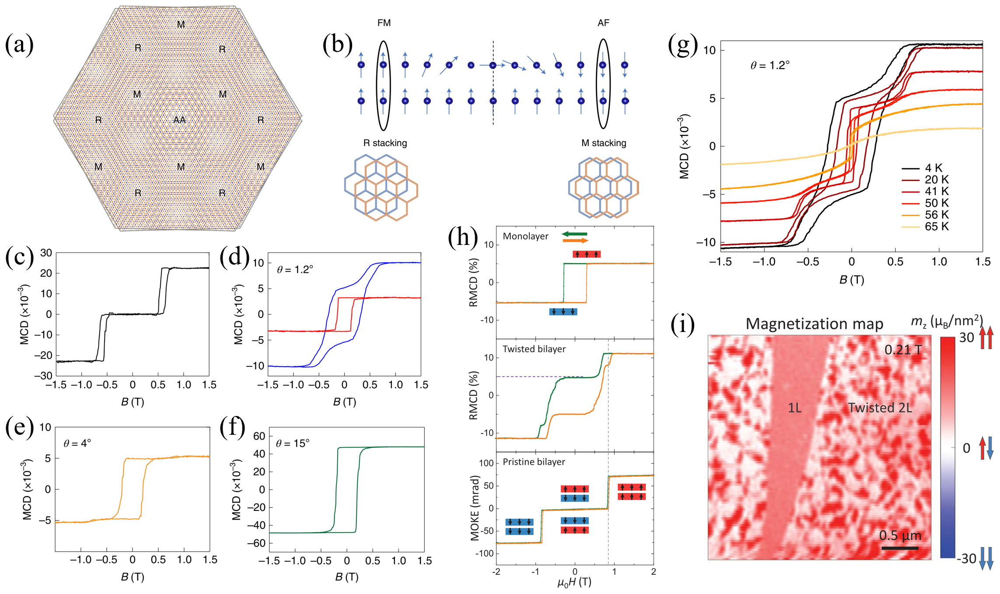

# モアレ・マグノニクス：ねじれた磁性体でスピン波を自在に制御する

**執筆日**: 2026-03-23
**トピック**: モアレ超格子を用いたスピン波（マグノン）の工学的制御
**注目論文**: 2603.19729
**参照した関連論文数**: 7本

---

## 1. 導入：なぜ今モアレ・マグノニクスか

2018年、MITのCao らによる発見が凝縮系物理の世界を一変させた。グラフェン二層をわずか約1.1度だけ回転させてずらすと、電子が金属でも絶縁体でもない奇妙な「魔法の角度（マジックアングル）」状態に突入し、さらに絶対零度付近では超伝導まで現れたのだ。この現象の鍵は「モアレ超格子」にある。二枚の格子が微小な角度でずれて重なると、長周期の干渉縞（モアレパターン）が生まれ、電子には従来の単結晶にはない巨大な周期ポテンシャルが現れる。その結果、バンド構造が激しくリフォームされ、電子は「フラットバンド」と呼ばれる分散のほぼゼロのバンドに閉じ込められる。この研究潮流はツイストグラフェンにとどまらず、MoTe₂などの遷移金属ダイカルコゲナイド、さらにトポロジカル系へと急拡大した。

ところが近年、同じ「ねじり」という操作が電子ではなくスピン波（マグノン）の世界にも持ち込まれつつある。スピン波とは磁性体中のスピンの集団的な歳差運動が波として伝わる現象であり、その量子単位をマグノンという。スピン波は電子と違いジュール熱を生まず、情報をナノスケールで低散逸に運べる次世代デバイスの候補として世界中で注目されている。この分野を「マグノニクス（Magnonics）」と呼ぶ。ここにモアレの考え方を導入した「モアレ・マグノニクス」が、現在凝縮系物理と材料科学の最前線で急速に立ち上がってきた [2602.08587]。

モアレ・マグノニクスの魅力は、ツイスト角という一つのパラメータで、スピン波のバンド構造、グループ速度、空間分布、さらにはトポロジーまでを精密に制御できる点にある。2023年にPhysical Review Xに掲載された初の実験観測 [2304.01001] では、ナノ構造磁性格子を2枚ねじった「磁性モアレ格子」においてスピン波のエッジモードとキャビティモードが初めて観測され、その後、磁性モアレでのフラットバンドを利用したマグノンの166ナノメートルスケールへの閉じ込め [2410.05765] が理論・数値計算で示された。そして2026年3月、同じ研究グループはこれを3層構造に拡張し、ツイスト角のチューニングでナノキャビティモードを精密制御できることを実証した [2603.19729]。まさに「モアレ・マグノニクス」が技術的な実現可能性を急速に高めている局面だ。

一方で、この動きは人工的なナノ加工磁性構造にとどまらない。CrI₃やMoTe₂のような二次元磁性体をねじると、電子系のモアレとは全く異なるメカニズムでスピン波のトポロジーが変化し、逆方向にしか進めないカイラルエッジモードや、反対のチャーン数を持つトポロジカルマグノンバンドが出現する [2502.11010]。さらに、ねじれた磁性界面ではマグノンと励起子が異例の結合をみせる [2506.10080]。こうした展開が重なり、「モアレ・マグノニクス」はいま急速に独立した研究潮流として成立しつつある [2509.04045]。

---

## 2. 解決すべき問い

本記事では、以下の4つの問いを軸にしてモアレ・マグノニクスの全体像を描く。

**問い1「モアレ超格子はどうやってスピン波のバンドを作り直すのか？」**　単層の磁性体をパターニングしてもスピン波バンドはある程度工学できる（2601.03210）。しかしモアレ構造は、これに加えて層間の磁気的結合が空間的に変調されるため、バンドに全く新しい特徴が現れる（2410.05765）。この比較で「モアレならではの効果」を解明する。

**問い2「なぜ三層構造が新しいのか？」**　注目論文（2603.19729）は、二層から三層への拡張が本質的に新しい自由度と物理をもたらすことを数値的に示した。三層の中間層をねじることで、外層と中間層の反位相ナノキャビティという従来の二層では起こりえない現象が生まれる。

**問い3「モアレ磁性体でどんなトポロジーと非線形物理が出てくるか？」**　ねじれた磁性体ではトポロジカルマグノンが発現し（2502.11010）、ドメイン壁にカイラルエッジモードが現れる。また非線形マグノン過程が増強され、マグノニック周波数コムという新現象も生まれる（2507.10922）。

**問い4「モアレ・マグノニクスはどこへ向かうか？」**　ナノキャビティ、マグノン波束制御、トポロジカル情報伝達、さらにはモアレ磁性体と他の励起（励起子、フォノン）との結合（2506.10080）まで、応用の地平はどこに広がっているのか。

---

## 3. 注目論文は何を新しく示したのか

**書誌情報**　arXiv:2603.19729「Twist-Tuned Magnonic Nanocavity Mode in a Trilayer Moiré Superlattice」（著者：Tianyu Yang, Gianluca Gubbiotti, Marco Madami, Haiming Yu, Jilei Chen）。投稿日：2026年3月20日。ライセンス：CC BY 4.0。

**扱う系と手法**　yttrium iron garnet（YIG）薄膜を六角形パターンに穴を開けたアンチドット格子（antidot lattice）を三枚重ね、**中間層のみ**をツイスト角 θ だけ回転させた三層磁性モアレ超格子を対象とする。数値シミュレーション（マイクロマグネティクス計算）によりスピン波のバンド構造と空間モードプロファイルを系統的に解析した（図1参照）。

*Figure 1. 注目論文の中心系：三層YIGモアレ磁性格子。(a) 三層構造と印加磁場 H の配置、および(b) 側面スケッチ（上下外層に対して中間層をねじる）。(c)–(f) 層間交換結合を変えながら計算したマグノニックバンド構造。外部磁場はy方向に印加され、マイクロ波でスピン波を励起する（出典: arXiv:2603.19729, CC BY 4.0, unmodified）.*

**主な新規性と中心結果**　最大の新知見は、**三層モアレ構造にはツイスト角3度で「ナノキャビティモード」が形成され、そのモードが外層と中間層の間で逆位相（antiphase）を示す**という点だ。具体的には、θ = 3° では6.5 GHz 付近にフラットバンドが生じ、そのバンド周波数でスピン波を励起すると、マグノンのエネルギーがモアレ格子の AB スタッキング領域の中心に空間幅 **175 nm** で集中する。これが「ナノキャビティモード」である。

*Figure 2. ツイスト角依存性。(a)(b) 三層モアレ超格子の模式図（AAおよびABスタッキング領域を色分け）。(c)–(f) ツイスト角 0°, 1°, 3°, 6° でのマグノニックバンド構造。(g)–(j) 対応するスピン波強度分布（6.5 GHz 励起）。θ = 3° でのみ顕著なナノキャビティ形成が確認される（出典: arXiv:2603.19729, CC BY 4.0, unmodified）.*

重要な点は、三層系は二層系とは異なり、**外層の二枚でのみキャビティモードが形成され、中間層では形成されない**という「外層特有」の振る舞いを示すことだ。これはスピン波のエネルギーが「中間層マグノンバンド」と「外層マグノンバンド」に分かれ、中間層に対応するバンドが AB スタッキング領域でフラットバンドを形成しないからだと説明される。

*Figure 3. ナノキャビティモードの精密評価。(a) 下外層（θ = 3°、f = 6.5 GHz 励起、t = 4 ns）でのスピン波強度スナップショット。青破線でモアレ格子単位胞の AB 領域を示す。(b) y = 0 でのスピン波振幅の横断プロファイル（黒実線）とローレンツフィット（赤曲線）。半値全幅 Δx = 174.9 nm（出典: arXiv:2603.19729, CC BY 4.0, unmodified）.*

この研究がなぜ今回のトピック記事の核になるのか。それは、「スピン波ナノキャビティ」という機能が**磁場という制御パラメータに加え、ツイスト角という「構造的自由度」によって実現できる**ことを初めて三層系で実証したからだ。二層から三層に「一層足すだけ」で新しいモード対称性が現れ、スピン波の空間分布を外層・中間層で独立制御できる可能性が開く。これはマグノニクスデバイス設計に新しい次元を加えるものである。

---

## 4. 背景と文脈：この注目論文はどこに位置づくか

### 4.1 電子系モアレから磁性系モアレへ

「モアレ」は本来、二枚の規則的なメッシュが重なった干渉縞（空間的うなり）のことを指す。二次元材料の場合、同じ結晶を角度 θ だけねじって重ねると、波長 λ_M ≈ a / θ（θ が小さい場合の近似、a は格子定数）の超周期が現れる。電子はこの長周期ポテンシャルに感じ、バンド構造が再構成されてフラットバンドが生じる。ツイストグラフェンにおけるマジックアングル（θ ≈ 1.1°）はこのフラットバンドを電子のフェルミエネルギー近傍に持ってきたとき、電子-電子相関が急激に強まって超伝導や磁性が現れる [2509.04045]。

磁性系でも同じアイデアは有効だろうか？　磁性体のスピン波バンドはスピン間の磁気的交換相互作用とダイポール（双極子）相互作用によって決まる。二層の磁性体を重ねてねじると、層間の交換結合が AA スタッキング領域と AB スタッキング領域で異なるため、モアレ超格子のスケールで磁気ポテンシャルが空間変調される。これがスピン波のバンドを根本的に書き換える。

しかし実際に「磁性モアレ超格子」を作るには技術的困難がある。二次元磁性体（CrI₃, MoTe₂など）は数ナノメートルの薄さで作れるが、ねじった時にバンド構造がどう変わるかは長らく不明だった。また人工的な磁性格子（YIG アンチドット格子など）は加工精度に限界がある。そこで 2023年、Phys. Rev. X に掲載された実験 [2304.01001] が大きなマイルストーンとなった。YIG製のナノ構造磁性格子を二枚重ねてねじり、Brillouin光散乱（BLS）分光法でスピン波モードを直接観測したところ、モアレエッジモードとキャビティモードが実験的に確認されたのだ。

### 4.2 マグノニック結晶：単層から積層へ

「マグノニック結晶」は磁性材料を周期的にパターニングして人工的なバンド構造（バンドギャップ）を作る概念で、フォトニック結晶（光に対する人工周期構造）のスピン波版に当たる。最もシンプルな実装は磁性薄膜に周期的な穴（アンチドット格子）を形成することだ。これだけでスピン波に対してフォトニックバンドギャップに相当する「マグノニックバンドギャップ」が開き、特定の周波数のスピン波を禁止できる。

近年、このアンチドット格子に六角形対称を持たせると、グラフェン様の電子バンドをスピン波で模倣できることが分かってきた [2601.03210]。アンチドットの径を大きくするにつれ、バンド構造はディラック点（線形交差）を持つグラフェン的なものから、フラットバンドを含むカゴメ格子的なものへと変化する（図4、後述）。さらに反転対称性を破ると K 点でギャップが開き、バレー霍爾（バレー・ホール）絶縁体のスピン波版として機能する位相境界沿いにトポロジカルなエッジモードが現れる。

*Figure 4. 六角形アンチドット格子でのマグノニックバンド構造の変化。穴の大きさを増やすにつれ（左から右）、連続磁性膜→小さい穴（d/a = 0.4）→大きい穴（d/a = 0.8）とバンド構造が変化する。外部磁場は220 mT, 210 mT, 185 mT。大きな穴でフラットバンドとグラフェン的ディラック点が出現する（出典: arXiv:2601.03210, CC BY 4.0, unmodified）.*

この単層系の成果を踏まえ、次のステップとして「二枚の磁性格子を積層してねじる」という実験が 2024〜2025 年に一気に進んだ。積層することで層間の交換結合という新しい自由度が加わり、フラットバンドの起源や空間的な閉じ込め特性が単層とは質的に異なるものになる [2410.05765]。

---

## 5. メカニズム・解釈・比較

### 5.1 フラットバンドはどのように生まれるか

モアレ磁性格子でのフラットバンド形成のメカニズムを一言で言えば、「複数のマグノンバンドが避け合い（反交差）し、ある波数（k = 0 近傍）でグループ速度がゼロになる」である。もう少し丁寧に述べよう。

二層のYIGアンチドット格子が θ = 3.5° の角度でずれている場合 [2410.05765]、下層の格子（k の分散関係を持つ）と上層の格子（回転されて同じ分散を持つが波数空間での向きが違う）は、層間交換結合 $J_{ex}$ によって結合する。波数空間でこの二つのバンドを描くと、ある k 点で交差しそうになる領域が生じる。この「交差しそうな点」では反交差（避け合い）が起き、バンドが分裂して隙間が開く。さらに、より高次のバンドが複数絡み合うと、反交差が重なって広い k 範囲にわたってほぼゼロの分散（フラットバンド）が生まれる（図5）。

*Figure 5. モアレ磁性格子（YIGアンチドット、θ = 3.5°）でのフラットバンドとナノキャビティ形成（総説 [2602.08587] の Fig. 3.12 を引用）。(a) SW帯域構造：フラットバンドがブリルアンゾーン中心近傍に出現。(b) ナノキャビティモードの空間強度分布：ABスタッキング領域中心への集中。SEM画像（c）は実際のYIGモアレ格子。(a)(b) は Ref. [247]（= arXiv:2410.05765）より引用（出典: arXiv:2602.08587, CC BY 4.0, unmodified）.*

具体的には [2410.05765] の数値計算によると、ブリルアンゾーン中心（k = 0）に出現するフラットバンドは波数幅 **Δk ≈ 40 rad/μm** と広く、このバンドに対応するスピン波は AB スタッキング領域に幅 **166 nm** で空間的に閉じ込められる。グループ速度がゼロ（フラットバンド）なので、スピン波はその位置で長時間滞留するため密度が高まり、「ナノキャビティ」として機能する。

三層系の注目論文 [2603.19729] では、このメカニズムがさらに精緻化される。三層構造では「外層2枚が作るサブバンド」と「中間層が単独で作るサブバンド」が共存する。θ = 3° では外層由来のバンド2がフラットバンドを形成するため、ABスタッキング領域でのキャビティは外層に現れる。一方、中間層由来のバンド（バンド3）は対応する k 範囲でフラットにならないため、中間層にはキャビティが形成されない。この「外層のみにキャビティが形成される」という反位相性は、三層モアレならではの新しい自由度だ。

### 5.2 トポロジカルマグノン：モアレが拓くトポロジー

モアレ磁性体では、フラットバンドだけでなくトポロジカルな現象も現れる。二次元系のバンドには「チャーン数（Chern number）」という位相的不変量が定義でき、これがゼロでない場合、バンドギャップ内にバンドの端（端面や界面）に沿って一方向にしか進めないカイラルエッジモードが束縛される。

ツイスト二層 MoTe₂（ν = 1 のホールドープ）では、量子異常ホール（QAH）絶縁体相においてマグノンが 「チャーン数 +1 と −1 の二本のトポロジカルマグノンバンド」を持つことが理論的に示された [2502.11010]。このトポロジーはハルデーン（Haldane）モデルと同じ構造を持ち、ドメイン壁でカイラルマグノンエッジモードが現れることも計算で確かめられた。この結果は、モアレ磁性体が「電子のトポロジカル絶縁体」と同様に、マグノンに対して位相的に非自明な構造を持ちうることを示しており、将来の「トポロジカル・マグノニクスデバイス」に向けた理論的基盤を提供する。

また、単層六角形アンチドット格子でも [2601.03210]、外部磁場で反転対称性を破るとバレー・ホール類似のマグノンバンドが現れ、異なるバレー偏極を持つ二領域の界面にエッジモードが局在する（図6）。

*Figure 6. 六角形アンチドット格子でのトポロジカルマグノンエッジモード。(a) バレー偏極が反転する2つの領域を隣接させた試料の模式図。(b) 界面に沿ったマグノン伝搬のシミュレーション（出典: arXiv:2601.03210, CC BY 4.0, unmodified）.*

### 5.3 非線形マグノン物理：マグノニック周波数コム

モアレ構造はスピン波の線形物理（バンド構造・グループ速度）を変えるだけでなく、**非線形相互作用も大きく変調する**。[2507.10922] では、ねじれた二層磁性結晶にマイクロ波を二周波（ω₁ と ω₂）で照射すると、三マグノン過程が増強され「マグノニック周波数コム（magnonic frequency comb, MFC）」が生成されることを示した。

周波数コムとは、ω₁ と ω₂ の和・差・高調波などの組み合わせ周波数が等間隔に並んだスペクトル列のことだ。レーザーの光周波数コムが精密計測に革命をもたらしたように、マグノニック周波数コムはスピントロニクスデバイスでの信号処理や精密計測への応用が期待される。ねじれ角がゼロの場合と比べて、有限のねじれ角では磁気モーメントの非共線（non-collinear）配列が生じ、これが三マグノン散乱の選択則を破って相互作用を強めるという仕組みだ。

*Figure 7. ねじれた磁性結晶でのマグノン分散。(a) 非ねじれ（θ = 0）の場合のz成分磁化分布。(b) 13°ねじれた場合のモアレパターン。(c) 非ねじれのマグノン分散関係。(d) 13°ねじれの場合の分散。ねじれによりバンドギャップ位置と形状が大きく変化する（出典: arXiv:2507.10922, CC BY 4.0, unmodified）.*

---

## 6. 材料・手法・応用への広がり

### 6.1 YIGアンチドット格子：実験の主舞台

現在のモアレ・マグノニクス実験の主要材料はガーネット（yttrium iron garnet, YIG）の薄膜をパターニングしたアンチドット格子である。YIGはマグノンの減衰（ダンピング）が非常に小さく、長距離スピン波伝搬が可能で、かつ化学的安定性も高い。アンチドット格子に加工することで人工的な磁性格子（マグノニック結晶）として機能させ、Brillouin光散乱（BLS）分光法や磁気力顕微鏡などで直接観測できる。

二枚のYIGアンチドット格子を正確なツイスト角で重ねてモアレ超格子を作る技術は、ナノ転写印刷（nanoimprint）や電子ビームリソグラフィ（EBL）の発展によってmicron スケールで実現されてきている [2304.01001]。特に、BLS 分光と透過型磁気光学顕微鏡の組み合わせが、スピン波のモードプロファイルを実空間と波数空間の両方で測れる強力なツールとして使われている [2602.08587]。

### 6.2 二次元van der Waals磁性体への展開

もう一つの舞台は、CrI₃、Fe₃GeTe₂、MoTe₂などのvan der Waals二次元磁性体である。これらは原子層レベルの薄さで単離でき、スコッチテープ法などで基板上に積み重ねてねじることができる。電子系では既に、ツイスト MoTe₂ が分数量子ホール状態の観測で大きな話題を呼んだが、磁性系でも急速に研究が進んでいる [2509.04045]。

ツイスト角によって層間の交換結合が変化し、局所的に強磁性（FM）カップリングや反強磁性（AF）カップリングになる領域が混在するモアレ磁性テクスチャーが形成される（図8）。この空間変調された磁気状態の上でスピン波を励起すると、前節で述べたトポロジカルマグノン [2502.11010] が発現する。

*Figure 8. モアレ磁性体における層間磁気結合。(a) モアレ超格子の対称単位胞内でのR・Mスタッキング位置の配置。(b) Rスタッキング（強磁性カップリング）とMスタッキング（反強磁性カップリング）の違い。(c)–(g) 異なるツイスト角（1.2°, 4°, 15°）でのMCDヒステリシスループ。(h) モノレイヤー、ツイスト二層、非ねじれ二層の磁気光学応答の比較。(i) 磁化マップ（1L と twisted 2L の共存）（出典: arXiv:2509.04045, CC BY 4.0, unmodified）.*

### 6.3 ツイスト界面での励起子−マグノン結合

ねじれた磁性界面では、これまで想定外だった励起の結合が起こる。[2506.10080] は van der Waals反強磁性体 CrSBr の「ツイン・ツイスト（twin-twist）」構造（特殊なツイスト角 ≈ 72°）を調べ、一方の面の励起子（電子−正孔対）が反対側の面のマグノンを選択的に励起することを発見した。これはスピン移送トルク（spin-transfer torque）を介した電子トンネリングによるメカニズムで、「励起子→電子トンネル→スピントルク→マグノン励起」という多段階の結合が実現している。この結果はモアレ磁性界面が「光でマグノンを制御する」新しいプラットフォームになり得ることを示唆する。

### 6.4 応用の地平

これらの知見を統合すると、モアレ・マグノニクスの応用の方向性として次のものが見えてくる。

第一は**ナノスケールのマグノン導波路・キャビティ**だ。モアレ誘起フラットバンドを利用した170 nm 幅のナノキャビティ（[2603.19729], [2410.05765]）は、スピン波の局所的な密度増大を生み出し、マグノン−フォノン・マグノン−フォトン結合の増強に使える。

第二は**位相論的スピン波回路**である。トポロジカルマグノンのエッジモードは散乱に強く（後方散乱禁止）、信号の一方向伝搬を保証するため、ノイズ耐性の高いスピン波回路の素子になる [2502.11010]。

第三は**マグノニック周波数コム発生器**だ。高品質のマグノニックコムをねじれ角制御で作れれば、スピントロニクスを使った精密発振器やスペクトル分析器への応用が考えられる [2507.10922]。

---

## 7. 基礎から理解する

### 7.1 スピン波の基礎とマグノンとは

磁性体の中では隣り合うスピンが磁気的交換相互作用によって平行（強磁性）または反平行（反強磁性）に並ぼうとする。外部磁場 H の下でスピンは磁場の方向を軸に歳差運動する（ラーモア歳差）。隣接スピンの歳差がわずかにずれると、この位相差が波として伝わっていく。これがスピン波であり、その量子単位がマグノンだ。

強磁性体中のスピン波の分散関係は、交換相互作用が支配的な短波長領域では：

$$\omega(k) = \frac{2\gamma J S}{\hbar} (1 - \cos ka) \approx \gamma J S k^2 a^2$$

の二次分散（k² 型）に近づく。一方、長波長（小さい k）ではダイポール相互作用も重要で、スピン波の伝播方向（波数 k のベクトル）と磁場の向きの相対関係によって分散関係が複雑に変化する。この異方性が「マグノニックデバイス」設計に重要なパラメータになる。

フラットバンドは $\partial\omega / \partial k = 0$（グループ速度ゼロ）の極端な場合だ。電子系では電子-電子相関によって強磁性や超伝導が出現しやすくなるのに対し、スピン波系のフラットバンドはマグノンの空間閉じ込め（ナノキャビティ形成）や状態密度の集中（非線形相互作用の増強）をもたらす。

### 7.2 モアレ超格子の幾何学

二枚の格子（格子定数 a）をツイスト角 θ でずらして積層した時、モアレ超格子の周期は：

$$
\lambda_M \approx \frac{a}{2\sin(\theta/2)} \approx \frac{a}{\theta}
$$

（θ が小さいとき）で与えられる。例えば a = 100 nm の格子で θ = 3° の場合、λ_M ≈ 100 nm / 0.052 ≈ 1.9 μm となり、原格子の約19倍の超周期が生まれる。このスケールがマグノンのド・ブロイ波長と同程度になると強い相互作用が起きる。

磁性モアレの場合、AA スタッキング領域（二枚の穴が正確に重なる）と AB スタッキング領域（片方が半周期ずれた位置）では磁場の空間プロファイルが異なる。AB 領域では内部の反磁化場（demagnetization field）が弱く、フラットバンドでのマグノンエネルギー最小点となるため、マグノンはここに閉じ込められる [2410.05765]。

### 7.3 層間交換結合の役割

磁性超格子の層間交換結合 $J_{ex}$（単位: μJ/m²）は積層構造の物理を支配する重要なパラメータだ。モアレ磁性格子では、AA スタッキング領域の $J_{ex}$ は AB スタッキング領域のそれより強い。この空間変調された $J_{ex}$ が実効的なポテンシャルとなり、スピン波の「質量」を位置依存的に変え、フラットバンドとキャビティの空間的な選択性を生む [2603.19729]。

注目論文 [2603.19729] の数値計算では、$J_{ex}$ が弱い（0 µJ/m²付近）とすべてのバンドが外層・中間層を区別せず混ざり合うが、有限の $J_{ex}$（26 µJ/m² 程度）を入れると外層バンドと中間層バンドが分離し、外層由来のバンドのみがフラットバンドを形成するようになることが示されている（図1 c〜f）。

### 7.4 Brillouin光散乱分光法による実験観測

モアレ・マグノニクスの実験観測で最もよく使われる手法が Brillouin光散乱（BLS）分光法だ。BLS では単色レーザーを磁性体に当て、マグノンとのラマン散乱（非弾性散乱）で周波数シフトしたフォトンを検出する。散乱光と入射光の周波数差がマグノンのエネルギーに、波数差がマグノンの波数に対応するため、マグノンのバンド分散を直接計測できる。

さらに、マイクロフォーカス BLS（μ-BLS）や空間分解能をもつ BLS 顕微鏡では、スピン波の空間プロファイルまで測定でき、モアレキャビティモードやエッジモードの実空間観測が可能になっている [2304.01001]。一方で、理論・数値計算面では、マイクロマグネティクス（micromagnetics）と呼ばれる連続体の磁化ダイナミクスシミュレーション（Landau-Lifshitz-Gilbert方程式の数値解）が広く使われ、バンド構造やモードプロファイルを精度よく再現できる [2603.19729, 2410.05765]。

---

## 8. 重要キーワード10個の解説

**1. マグノン／スピン波（Magnon / Spin wave）**
磁性体中で隣接スピンが協調して行う集団的な歳差運動の波動が「スピン波」で、その量子単位（準粒子）が「マグノン」である。フォノンが格子振動の量子単位であるように、マグノンは磁化の振動の量子単位だ。スピン波は熱よりも低い散逸でスピン角運動量を運べる点で、スピントロニクスデバイスに有望視される。

**2. マグノニック結晶（Magnonic crystal）**
磁性材料を周期的に空間変調した人工構造のこと。フォトニック結晶が光を制御するように、マグノニック結晶はスピン波を制御する。アンチドット格子（穴の周期配列）が典型的な実装で、バンドギャップの形成、スピン波速度の制御、局在モードの形成などが可能になる。

**3. モアレ超格子（Moiré superlattice）**
二枚の（磁性）格子を微小なツイスト角 θ でずらして積層したとき生じる長波長の干渉縞構造のこと。超格子の周期は λ_M ≈ a/θ で与えられ（a は元の格子定数）、AAスタッキング（穴が重なる）とABスタッキング（穴がずれる）が空間的に交互に現れる。この長周期ポテンシャルがスピン波のバンドを大きく書き換える。

**4. フラットバンド（Flat band）**
バンド分散 ω(k) がほぼゼロのグループ速度 ∂ω/∂k ≈ 0 を持つバンドのこと。スピン波的には「どこへも伝わらない局在した振動モード」に相当する。状態密度が特定周波数に集中し、非線形相互作用の増強、強い空間閉じ込め（ナノキャビティ）、マグノンBEC（ボーズ-アインシュタイン凝縮）のような集団現象の素地となる。モアレ超格子のフラットバンドは、ツイスト角を「魔法の角度」付近に設定したときに現れる。

**5. ナノキャビティモード（Nanocavity mode）**
フラットバンド周波数で励起されたスピン波が特定の領域（ABスタッキング域）に幅 ~100–200 nm で集中して局在したモードのこと。光のキャビティモード（共振器）のスピン波版に相当する。マグノン密度の局所的増大を利用して、マグノン-フォノン結合やマグノン-フォトン結合の増強に使える。

**6. 層間交換結合（Interlayer exchange coupling, IEC）**
積層磁性体において、非磁性層を介して隣り合う磁性層のスピン間に働く間接的な交換相互作用のこと。磁性体を直接接触させる場合も類似の直接的な交換結合が働く。IEC の符号が正（強磁性）か負（反強磁性）かによって、スピン波の層間混成のしかたが変わり、バンド構造を大きく変える。モアレ超格子では IEC が位置によって変化するため、スピン波に独特の空間変調ポテンシャルが生じる。

**7. ベリー曲率とチャーン数（Berry curvature, Chern number）**
バンド理論においてブロッホ状態がパラメータ空間（波数空間）を動くとき、波動関数の位相が幾何学的（非力学的）に積み上がる現象が「ベリー位相」で、その曲率が「ベリー曲率 Ω(k)」だ。ベリー曲率を第一ブリルアンゾーン全体で積分して 2π で割った量がチャーン数 C（整数値）であり、C ≠ 0 であればそのバンドは位相論的に非自明で、バンドギャップ内に端面エッジモード（カイラル・エッジモード）が必ず現れる（バルク-端対応）。マグノンにもチャーン数が定義でき [2502.11010]、C = ±1 のトポロジカルマグノンが twisted MoTe₂ に存在する。

**8. AAスタッキング / ABスタッキング（AA / AB stacking）**
積層した二枚の格子で、穴の位置が一致している領域を「AAスタッキング」、一方が半格子定数ずれている領域を「ABスタッキング」と呼ぶ（電子系のツイストグラフェンに倣った命名）。磁性モアレ格子では、AAスタッキング域は高い内部場を持ち、ABスタッキング域では内部場が弱くなるため、マグノンはABスタッキング域に局在しやすい。

**9. Brillouin光散乱（Brillouin light scattering, BLS）**
単色レーザーを磁性体に照射したとき、マグノン（やフォノン）との非弾性散乱により散乱光の周波数がシフトする現象を利用したスペクトル分光法。ストークス散乱（マグノン放出）とアンチストークス散乱（マグノン吸収）の両側波帯を分析することで、マグノンの周波数と波数（分散関係）を直接測定できる。μ-BLS（顕微鏡型）では空間分解能も持ち、スピン波の実空間マッピングが可能だ。

**10. マジックアングル（Magic angle）**
ツイスト二層グラフェンで電子のフラットバンドが電子の化学ポテンシャル近傍に来る特定のツイスト角 θ_magic ≈ 1.1° の概念を拡張した名称。磁性モアレ格子でも「フラットバンドが顕著に出現して最もよいキャビティモードが得られる」ツイスト角をマジックアングルと呼ぶことがある。[2410.05765] では θ ≈ 3.5° がこれに相当し、[2603.19729] では三層構造で θ = 3° が最適角として特定された。一般には材料・形状・層間結合に依存し、電子系の ≈1.1° とは全く異なる値をとる。

---

## 9. まとめと今後の論点

「モアレ・マグノニクス」とは、二枚（あるいは複数枚）の磁性格子をわずかにねじって積層することで、スピン波のバンド構造を工学的に設計し、フラットバンド、ナノキャビティ、トポロジカルエッジモード、非線形周波数コムなどの新機能を実現する新興分野だ。電子系のモアレ研究が「ねじるだけで超伝導が現れる」という驚きを世界に届けたように、磁性系では「ねじるだけでスピン波を数百ナノメートルに閉じ込められる」「ねじるだけでトポロジカルマグノンが生まれる」という新しい驚きが今次々と生まれている。

注目論文 [2603.19729] はこの流れの中で、二層から三層という一見シンプルな拡張が「外層のみにナノキャビティが現れる」という質的に新しい現象をもたらすことを示した点で重要だ。三層の対称性（中間層のみをねじる）が外層と内層の間に新しいモード対称性を作り出し、将来の多層モアレ磁性体設計への道を開く。

関連論文を総合すると、この分野は今後いくつかの方向に向かうと考えられる。一つは「人工磁性格子（YIG等）での実験的検証」で、三層モアレキャビティモードの直接観測、非線形周波数コムの実験実証などが近い将来の課題だ。もう一つは「van der Waals二次元磁性体での展開」で、トポロジカルマグノン [2502.11010] や励起子-マグノン結合 [2506.10080] が実験で確かめられると分野は一気に加速するだろう。さらに、機械学習を使ったモアレ磁性体の高速設計・発見 [2509.04045] も今後数年で重要な手段になると予想される。

この分野の理解を深めるには、まず「モアレ電子系の基礎（ツイスト二層グラフェンの物理）」を学ぶことをお勧めする。次に「スピン波とマグノニック結晶の基礎（Landau-Lifshitz-Gilbert 方程式、Bloch スピン波理論）」を押さえた上で、本記事で引用した総説論文 [2602.08587] を読むと、この分野の全体像がつかめるだろう。

---

## 10. 参考にした論文一覧

### 注目論文

1. **arXiv:2603.19729** — T. Yang, G. Gubbiotti, M. Madami, H. Yu, J. Chen, "Twist-Tuned Magnonic Nanocavity Mode in a Trilayer Moiré Superlattice," arXiv (March 2026). **[ライセンス: CC BY 4.0]**

### 関連論文

2. **arXiv:2602.08587** — J. Chen, H. Yu, R. Gallardo, P. Landeros, G. Gubbiotti, "Magnon confinement and trapping at the nanoscale," *Applied Physics Reviews* (投稿中、February 2026). **[ライセンス: CC BY 4.0]**　*役割: モアレ・マグノニクスを含むマグノン閉じ込え全体の総説。背景・比較用文献。*

3. **arXiv:2601.03210** — B. Kaman, J. Lim, Y. Liu, A. Hoffmann, "Emulating 2D Materials with Magnons," arXiv (January 2026). **[ライセンス: CC BY 4.0]**　*役割: 単層六角形アンチドット格子でのグラフェン模倣バンド構造とトポロジカルマグノンの理論計算。背景文献。*

4. **arXiv:2509.04045** — F. Zhuo, Z. Dai, K. Chang, H. Yang, Z. Cheng, "Moiré spintronics: Emergent phenomena, material realization and machine learning accelerating discovery," *Applied Physics Reviews* (accepted, September 2025). **[ライセンス: CC BY 4.0]**　*役割: モアレスピントロニクス全体（モアレ磁性交換・モアレスキルミオン・モアレマグノン）の総説。背景・展望文献。*

5. **arXiv:2507.10922** — M. Li, Z. Jin, Z. Zeng, P. Yan, "Frequency comb in twisted magnonic crystals," arXiv (July 2025). **[ライセンス: CC BY 4.0]**　*役割: ねじれた磁性結晶でのマグノニック周波数コム生成。非線形物理と応用の文献。*

6. **arXiv:2506.10080** — Y. Sun *et al.*, "Electron-magnon coupling at the interface of a 'twin-twisted' antiferromagnet," arXiv (June 2025). **[ライセンス: CC BY-NC-ND 4.0]**　*役割: ツイスト界面でのエキシトン-マグノン結合という新現象。応用への展開文献。*

7. **arXiv:2502.11010** — W.-X. Qiu and F. Wu, "Topological magnons and domain walls in twisted bilayer MoTe₂," *Phys. Rev. B* **112**, 085132 (2025). **[ライセンス: 非独占 arXiv ライセンス]**　*役割: ツイスト二層MoTe₂でのトポロジカルマグノン理論。比較・対照文献。*

8. **arXiv:2410.05765** — J. Chen, M. Madami, G. Gubbiotti, H. Yu, "Magnon confinement in a nanomagnonic waveguide by a magnetic Moiré superlattice," arXiv (October 2024). **[ライセンス: CC BY 4.0]**　*役割: 二層モアレ格子でのフラットバンドとマグノン閉じ込めの数値実証。直接的先行研究。*

---

*本記事で使用した図はすべて各論文の著作権表示に基づく。CC BY 4.0 ライセンス論文の図は原図のまま使用（unmodified）し、帰属表示を各キャプションに記した。CC BY-NC-ND 4.0 論文（2506.10080）の図については本文中に使用せず、文章での説明にとどめた。arXiv 非独占ライセンス論文（2502.11010）の図についても同様に使用しなかった。*
