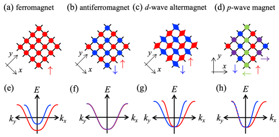
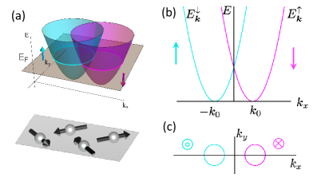
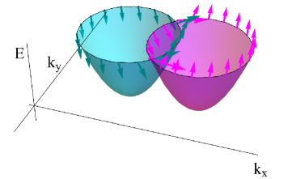
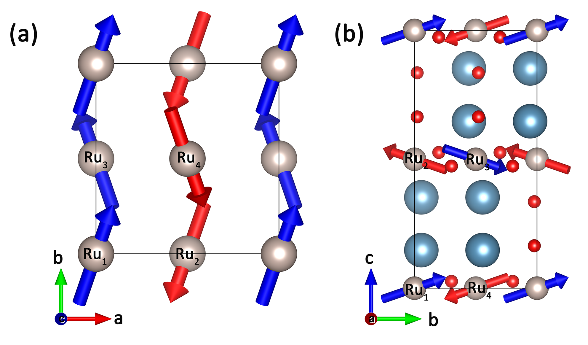
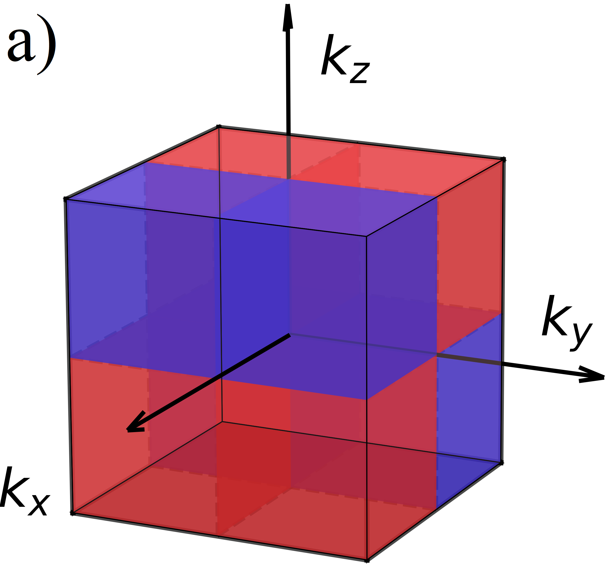
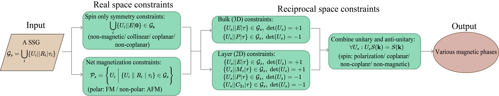
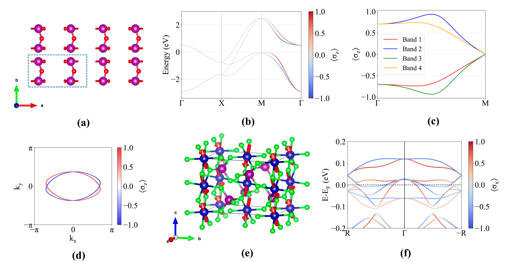
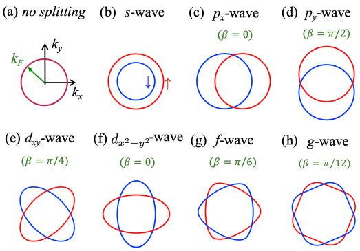

# p波磁性体：磁気秩序の新たな分類が拓くノンコリニア・スピントロニクス

**執筆日**: 2026-03-23
**トピック**: 強誘電体p波磁性体
**重要論文**: arXiv:2603.19107
---

## 1. 導入：なぜ今この話題か

磁性体の分類は、長い間「強磁性体（ferromagnet）」と「反強磁性体（antiferromagnet）」という二項対立で語られてきた。強磁性体はスピンが一方向に揃い、磁化という巨視的な量を持つ。反強磁性体はスピンが交互に逆向きに並び、正味の磁化はゼロになる。この区別は直感的に分かりやすく、20世紀の磁性物理学の礎となった。

ところが、2020年代に入って「アルタマグネット（altermagnet）」という新たな概念が脚光を浴びるようになった。アルタマグネットは正味の磁化ゼロという反強磁性的な性質を持ちながら、バンド構造において d 波・g 波といった偶パリティの運動量依存スピン分裂を示す。これはスピン軌道相互作用を必要とせず、純粋に磁気対称性だけで生じる「非相対論的スピン分裂」である。MnTeやRuO2など具体的な物質での実験的確認が相次ぎ、アルタマグネットはスピントロニクスの新しい舞台として急速に注目を集めた。

そして2025〜2026年、今度は「p波磁性体（p-wave magnet）」という概念が浮上し、cond-mat の新着論文の流れを変えつつある。p波磁性体もまた正味の磁化ゼロを持つが、今度は奇パリティ（p波・f波・h波）のスピン分裂を示す。これはアルタマグネットとは異なる実空間の磁気構造——非共面（noncollinear）な磁気秩序——から生じるものであり、全く新しい対称性クラスに属する。2025年にはGd₃(Ru,Rh)₄Al₁₂を用いた初の実験的実証（Nature 掲載）が報告され、理論・計算・実験・デバイス応用の各面から関連論文が急増している。

本稿では、2026年3月19日に公開された「強誘電体p波磁性体（Ferroelectric p-wave magnets）」を重要論文として据え、その周囲に集まる最近の関連プレプリント群を読み解くことで、「p波磁性体とは何か」「なぜ今これほど注目されているのか」「次に何が起きそうか」を、ひとつながりの読み物として整理する。

*Figure 1. 強磁性体・反強磁性体・アルタマグネット・p波磁性体それぞれにおける格子構造、バンド分散、スピン偏極の比較概念図。スピン分裂のパターンが系統的に異なることが分かる（出典: arXiv:2502.15400, CC BY 4.0, unmodified）.*

---

## 2. 今回の軸となる問い

本稿が追う中心問題は、以下の四つの問いに集約される。

第一の問い：p波磁性体は、反強磁性体やアルタマグネットとどう違うのか——対称性と磁気構造の観点から何が異なるのか。

第二の問い：「強誘電性とp波磁性が共存するとどうなるか」——電気的スイッチングは可能か、どのような物質で実現できるか。

第三の問い：p波磁性体を超伝導体と組み合わせると何が起きるか——トポロジカル超伝導・イジング超伝導・マヨラナ状態の新しい舞台となるか。

第四の問い：p波磁性体を用いたスピントロニクスデバイス（スピンバルブ、スピントランジスタ、マグノニクス）の実現可能性はどの程度あるか。

---

## 3. 重要論文の詳細解説

### 論文情報

- タイトル：Ferroelectric p-wave magnets
- 著者：Jan Priessnitz, Anna Birk Hellenes, Riccardo Comin, Libor Šmejkal
- arXiv ID：2603.19107
- カテゴリ：cond-mat.mtrl-sci, cond-mat.mes-hall
- 公開日：2026年3月19日
- URL：https://arxiv.org/abs/2603.19107
- ライセンス：arXiv nonexclusive-distrib/1.0（図の転載不可）

### 主張と新規性

この論文の核心にある主張はシンプルかつ鮮烈だ：「強誘電性とp波磁性は共存できるだけでなく、電気的に切り替え可能な形で結びつく」。より正確に言えば、非共面な磁気副格子を持つ強誘電体の中に、時間反転対称性を保ちながらp波・f波型のスピン偏極バンド構造が現れることを、対称性分類と第一原理計算の両面から示した。

従来のアルタマグネットは偶パリティ（d波、g波）のスピン分裂を持つ。その「奇パリティ版」に相当するのがp波磁性体だが、これまで「p波磁性体は反強磁性体（antiferromagnet）の一種ではないか」「アルタマグネットとどう区別するのか」という概念的混乱があった。本論文はスピン磁気群論（spin and magnetic group theory）を駆使し、強誘電性との結合という新しい切り口からこの問いに答えた。

### 物質系・手法

主要物質として扱われるのはマルチフェロイクスGdMn₂O₅である。この物質はビスマス鉄酸化物（BiFeO₃）と並ぶ古典的なマルチフェロイクス物質として知られており、Mnスピンによる磁気秩序と格子の強誘電変位が同時に現れる。著者らは第一原理計算（DFT）によりGdMn₂O₅の磁気構造——Mnスピンがx軸から±18.5°の角度で傾いた共面型（coplanar）——がp波型のスピン分裂を生むことを示した。

手法の要は「スピン群」と「磁気群」の組み合わせによる体系的な対称性解析である。これにより、強誘電的奇パリティ波磁性体を三タイプに分類した：

- Type-I：結晶歪みによる極性秩序
- Type-IIa：磁気秩序が極性対称性の破れを誘起（非相対論的）
- Type-IIb：スピン軌道相互作用が必要

52個の候補物質を特定し、そのうち40個がType-IIに属するという。これはアルタマグネットの強誘電体版（ferroelectric altermagnet）ではType-Iが多数を占めるのと対照的で、p波磁性体の強誘電性が磁気秩序によって誘起される傾向が強いことを示している。

### 主要結果

最も重要な結果は、GdMn₂O₅において「強誘電分極の向きとp波スピン分裂の強さ・符号を同時にスイッチできる」ことを理論的に示した点だ。磁気モーメントの相対角度をパラメータとして変化させると、電気分極と交換スピン分裂はともに正弦関数的に変化し、強誘電的スイッチング（つまり分極の向きを反転させる操作）がスピン偏極の符号を同時に反転させる。

これは強誘電メモリと磁性スピントロニクスを融合させるための原理的根拠となる。著者らは、金属的p波磁性体と絶縁体的p波磁性体の二層構造を使ったスピンフィルター読み出しデバイスの概念を提案している。ライセンスの都合上、論文中の図を本稿に転載することはできないが、要点を文章で補う。

主要な図（Figure 1）は、(a)アルタマグネットのd波スピン分極（節面をもつ）、(b) BiFeO₃の磁気構造、(c) GdMn₂O₅のp波スピン分極（節面がない）、(d) GdMn₂O₅の共面磁気構造を比較している。節面の有無がアルタマグネットとp波磁性体の視覚的な区別点となっている。

### なぜ今回の中心なのか

Libor Šmejkalはアルタマグネット概念の提唱者として知られるが、今回の論文は「その次のステップ」を示すものとして位置づけられる。アルタマグネット（偶パリティ）とp波磁性体（奇パリティ）を「対称性分類の双子」として捉え直す視点は、磁性物理学の体系的な整理に貢献する。また、電気的スイッチングという実用的な観点から具体的な物質を示した点が、実験家・応用研究者に向けた明確なメッセージを発している。

---

## 4. 関連論文の解説

### 関連論文 1：p波磁性の微視的起源

- タイトル：Microscopic origin of p-wave magnetism
- 著者：Johannes Mitscherling, Jan Priessnitz, Clara K. Geschner, Libor Šmejkal
- arXiv ID：2603.09736
- カテゴリ：cond-mat.mes-hall, cond-mat.mtrl-sci, cond-mat.str-el
- 公開日：2026年3月10日
- URL：https://arxiv.org/abs/2603.09736
- ライセンス：arXiv nonexclusive-distrib/1.0（図の転載不可）

重要論文が「どの物質でp波磁性体が実現するか」を示したのに対し、この論文は「なぜp波スピン分裂が生じるのか」という微視的な起源を解明する。

キーとなる概念は「サイト補償スピン密度（site-compensated spin density）」だ。p波・f波・h波型の反アルタマグネット（anti-altermagnet; 著者らはこう呼ぶ）では、異なるサイトに局在したスピンが逆向きに射影されると正味の磁化はゼロになるが、その射影方向が運動量の奇関数になっているため、バンド構造では奇パリティのスピン分裂が現れる。

具体的にはCeNiAsOという物質を用いて第一原理計算を行い、解析的な表式を導出している。「全てのスピンを持つ二サイト強束縛ハミルトニアンのスピン偏極に対する一般的な分類と解析的表式」を提供することで、今後の候補物質探索に使える普遍的なツールを提供した点が重要だ。

この論文を入れることで、重要論文で「何が起きているか」が示され、本論文で「なぜ起きるか」が示されるという補完的な関係が成立する。p波磁性の微視的メカニズムを理解すれば、第一原理計算や機械学習を用いた候補物質サーチに直結する。

---

### 関連論文 2：p波磁性体を使ったスピンバルブとスピントランジスタ

- タイトル：Time reversal reserved spin valve and spin transistor based on unconventional p-wave magnets
- 著者：Ze-Yong Yuan, Jun-Feng Liu, Pei-Hao Fu, Jun Wang
- arXiv ID：2603.18685
- カテゴリ：cond-mat.mes-hall, cond-mat.mtrl-sci
- 公開日：2026年3月19日
- URL：https://arxiv.org/abs/2603.18685
- ライセンス：arXiv nonexclusive-distrib/1.0（図の転載不可）

p波磁性体の実用化に向けた最もデバイス指向な論文だ。

スピンバルブは通常、二つの強磁性体層の磁化の相対向きで電気抵抗が変わるデバイスだが、p波磁性体を使った場合、「スピン軌道相互作用も正味の磁化も不要」というのが最大の特徴だ。通常の強磁性スピンバルブでは磁場で磁化を反転させる必要があるが、p波磁性体の場合は「交換場ベクトル（exchange-field vector）」の相対向きで電子透過率が制御される。

提案されているスピントランジスタは、従来のDatta-Das型（強磁性体＋Rashba効果）とは全く異なる原理で動作する：中央の磁性層が「全横モードで同一の歳差周波数をもつ均一なスピン歳差」を実現し、磁場方向を変えることでON/OFF制御ができる。純粋な磁気的機構で動作し、スピン軌道相互作用に依存しないため、SOCが弱い軽元素材料でも動作しうる点が魅力的だ。

---

### 関連論文 3：p波磁性体における創発的超伝導相

- タイトル：Emergent superconducting phases in unconventional p-wave magnets: Topological superconductivity, Bogoliubov Fermi surfaces and superconducting diode effect
- 著者：Amartya Pal, Paramita Dutta, Arijit Saha
- arXiv ID：2603.03221
- カテゴリ：cond-mat.supr-con, cond-mat.mes-hall, cond-mat.str-el
- 公開日：2026年3月3日
- URL：https://arxiv.org/abs/2603.03221
- ライセンス：arXiv nonexclusive-distrib/1.0（図の転載不可）

超伝導体とp波磁性体を組み合わせた系（あるいはp波磁性体自身が超伝導になる場合）を平均場理論で調べた理論論文だ。

最も注目すべき結果は、「Rashbaスピン軌道相互作用も外部磁場も必要なく、p波磁性体だけでトポロジカル超伝導（TSC）が実現できる」という点だ。TSCはマヨラナフェルミオンを端に宿すため、トポロジカル量子計算の舞台として重視されている。従来のTSC実現には強いSOCが必要だったが、p波磁性体はその代役を果たす。

相図は豊かで、以下の相が連続的につながる：

- 通常BCS超伝導（ゼロ運動量のクーパー対）
- ギャップのあるFulde-Ferrell（FF）相（有限運動量のクーパー対）
- ギャップのないFF相およびLarkin-Ovchinnikov（LO）相（ボゴリューボフ・フェルミ面が出現）

さらに超伝導ダイオード効果（正方向と逆方向で臨界電流が異なる）が自然に出現する。その効率は最大約33%に達するという。

この論文を加えることで、p波磁性体が「スピントロニクス材料」としてだけでなく「トポロジカル量子材料のプラットフォーム」として機能する可能性が浮き彫りになる。

---

### 関連論文 4：van der Waals ヘテロ構造における奇パリティ磁性

- タイトル：Odd-Parity Magnetism and Gate-Tunable Edelstein Response in van der Waals Heterostructures
- 著者：Hanbyul Kim, Chan Bin Bark, Seik Pak, Gibaik Sim, Moon Jip Park
- arXiv ID：2602.11251
- カテゴリ：cond-mat.str-el, cond-mat.mes-hall
- 公開日：2026年2月11日
- URL：https://arxiv.org/abs/2602.11251
- ライセンス：arXiv nonexclusive-distrib/1.0（図の転載不可）

この論文は、p波磁性体を「デザインする」方法を提案している。具体的には、ストライプ型反強磁性体（sAFM）の層を積層したvdWヘテロ構造を用いると、最近接のRKKY交換相互作用が対称性によって消えてしまい、より高次の重交換相互作用（biquadratic interaction）が有効相互作用として現れ、奇パリティ磁気秩序が安定化される。

重要なのは「ゲート電圧による電子填充を変えることで、p波的（奇パリティ）状態とコリニア（直線的）状態の間を切り替えられる」という点だ。奇パリティ状態では電流誘起スピン偏極（エーデルシュタイン効果）が現れ、コリニア状態では消える。このゲート可変エーデルシュタイン効果は、スピン軌道相互作用に依存しない「非相対論的スピントロニクス」の具体的な実験提案として価値が高い。

候補物質としてGdTe₃（単層でもストライプ磁性を保つvdW物質）と鉄系薄膜が挙げられており、現在急速に発展している二次元磁性体研究との接続点をなしている。

---

### 関連論文 5：p波磁性体における非相対論的イジング超伝導

- タイトル：Nonrelativistic-Ising superconductivity in p-wave magnets
- 著者：Maxim Khodas, Libor Šmejkal, I. I. Mazin
- arXiv ID：2601.19829
- カテゴリ：cond-mat.supr-con, cond-mat.mes-hall
- 公開日：2026年1月27日
- URL：https://arxiv.org/abs/2601.19829
- ライセンス：CC BY 4.0

p波磁性体の超伝導に関する理論論文の中で、最も根本的な問いに踏み込んでいる：「p波磁性体が超伝導になったとき、クーパー対はどんな性格を持つか」。

答えは驚くべきものだ。スピン分裂のある系での超伝導を考えると、クーパー対は純粋なスピン一重項でも三重項でもなく、「一重項と三重項の50:50の混合状態」になる。この非相対論的イジング超伝導（NR-IS）と呼ばれる状態は、スピン軌道相互作用によるイジング超伝導（Ising SC）と類似しているが、根本的に異なる：SOC系では分裂がmeVオーダーなのに対し、NR-ISでは交換相互作用によりeVオーダーの分裂が生じる。

保護機構も異なる：従来のイジング超伝導では面直方向の磁場に強く、面内磁場でペアブレイクが起きる。NR-ISでは磁場を加えると s+p+ip' という混合対称性のユニタリでない状態に変化し、再入射超伝導（re-entrant SC）が生じうる。

*Figure 2. p波磁性体のスピン分裂バンド構造の概念図。上パネルは運動量空間でのスピン偏極の向きを示し、下パネルは実空間での非共面磁気秩序に対応する。p波対称性によりスピン偏極が k_x の奇関数になっていることが見て取れる（出典: arXiv:2601.19829, CC BY 4.0, unmodified）.*

*Figure 3. 外部交換場をかけた場合のバンド構造変化。スピンが場の方向に傾くが、バンド分散は1次近似では変わらない。逆運動量の2状態が時間反転＋スピン回転対称性で結ばれることがクーパー対の一重項・三重項混合を保証する（出典: arXiv:2601.19829, CC BY 4.0, unmodified）.*

---

### 関連論文 6：Ca₂RuO₄におけるp波磁性の条件

- タイトル：Interplay between Relativistic Spin-Momentum Locking and Breaking of Inversion Symmetry: conditions for p-wave magnetism
- 著者：Amar Fakhredine, Giuseppe Cuono, Jan Skolimowski, Silvia Picozzi, Carmine Autieri
- arXiv ID：2602.21871
- カテゴリ：cond-mat.mtrl-sci
- 公開日：2026年2月25日
- URL：https://arxiv.org/abs/2602.21871
- ライセンス：CC BY 4.0

アルタマグネットの有力候補物質Ca₂RuO₄を舞台として、「空間反転対称性の破れがどんな条件でp波磁性を生み出すか」を系統的に調べた計算論文だ。

対称なCa₂RuO₄はd波のアルタマグネットだが、強誘電歪みや反強誘電歪みを加えると節面（nodal plane）の一部が消え、スピン分裂がp波的性格を帯びる。特定の方向への強誘電変位はRashba型SOCを生じさせて節面を消すが、その方向と磁気秩序（ネール・ベクトル）の相対関係で最終的なスピン偏極の対称性が決まるという精緻な議論を展開している。

*Figure 4. Ca₂RuO₄の斜方晶構造。b軸方向のスピン配列（A型磁気配置）と若干のカンティング（a軸・c軸成分）を示している（出典: arXiv:2602.21871, CC BY 4.0, unmodified）.*

*Figure 5. SOCなしでのスピン運動量ロッキング。d波対称性（節面 k_x=0 と k_z=0）を持つ非相対論的スピン分裂が見える（出典: arXiv:2602.21871, CC BY 4.0, unmodified）.*

この論文は「p波磁性体はアルタマグネットの特殊な変形体としても現れる」という視点を提供し、候補物質探索において「既知のアルタマグネット＋適切な歪み」という設計指針を与える。

---

### 関連論文 7：スピン空間群による磁気秩序の統一分類

- タイトル：A Unified Symmetry Classification of Magnetic Orders via Spin Space Groups: Prediction of Coplanar Even-Wave Phases
- 著者：Ziyin Song, Ziyue Qi, Chen Fang, Zhong Fang, Hongming Weng
- arXiv ID：2512.08901
- カテゴリ：cond-mat.mtrl-sci
- 公開日：2025年12月9日
- URL：https://arxiv.org/abs/2512.08901
- ライセンス：CC BY 4.0

スピン空間群（Spin Space Group, SSG）を使って、強磁性・反強磁性・アルタマグネット・p波磁性体を一貫したフレームワークで分類した理論論文だ。

SSG作用素 {U_s || U_r} はスピン回転 U_s と空間変換 U_r の対になっており、実空間と運動量空間で異なる変換則を与える。特に運動量空間の変換には det(U_s) という因子が現れ、これが実空間では区別できない磁気秩序を運動量空間で区別可能にする鍵となる。

このフレームワークから「共面型偶波磁性体（coplanar even-wave magnet）」という新しい磁気相が予言されたことが特筆される。これは実空間で非共線（コプレーナー）だが、運動量空間では偶波（even-wave）の共線スピン偏極を示すという一見矛盾した性質を持つ。CoCrO₄がこの候補として挙げられ、第一原理計算で確認されている。

*Figure 6. SSGに基づく磁気秩序分類のフローチャート。実空間の制約と逆空間の制約を組み合わせることで、強磁性・反強磁性・アルタマグネット・p波磁性体・共面型偶波磁性体が体系的に整理される（出典: arXiv:2512.08901, CC BY 4.0, unmodified）.*

*Figure 7. 共面型d波磁性体のモデルと第一原理計算結果。(a)実空間格子モデル、(b)バンド構造と射影スピン偏極、(c)高対称経路沿いのスピン偏極、(d) d波異方性のフェルミ面、(e) CoCrO₄の磁気構造、(f)第一原理バンド構造（出典: arXiv:2512.08901, CC BY 4.0, unmodified）.*

---

### 関連論文 8：非慣習的磁性体における超伝導現象の総覧

- タイトル：Superconducting phenomena in systems with unconventional magnets
- 著者：Yuri Fukaya, Bo Lu, Keiji Yada, Yukio Tanaka, Jorge Cayao
- arXiv ID：2502.15400
- カテゴリ：cond-mat.supr-con, cond-mat.mes-hall, cond-mat.mtrl-sci
- 公開日：2025年2月21日（v3: 2025年8月4日）
- URL：https://arxiv.org/abs/2502.15400
- 掲載誌：J. Phys.: Condens. Matter 37, 313003 (2025)
- ライセンス：CC BY 4.0

アルタマグネット（d波）とp波磁性体の双方を扱う包括的なレビュー論文（57ページ、23図）で、非慣習的磁性体と超伝導体を接合した系で何が起きるかを系統的にまとめている。

d波アルタマグネット・p波磁性体ともに「正味の磁化ゼロ（反強磁性的）」かつ「非相対論的バンドスピン分裂（強磁性的）」という二面性を持つ。超伝導ジャンクションに組み込んだ場合、この二面性が特異な振舞いを生む：

- アンドレーフ反射の変調
- 特定モードでの完全透過（アンドレーフ反射の超伝導バージョンのKleinトンネル）
- ∞ギャップ超伝導とペアリングシンメトリー変換
- マヨラナ状態の出現

このレビューを参照することで、重要論文が開拓する「強誘電p波磁性体」という材料系が超伝導近接効果の文脈でどんな意味を持つかが見通せる。

*Figure 8. 各磁性体クラスのバンド構造模式図。強磁性体（FM）、反強磁性体（AFM）、アルタマグネット（AM）、p波磁性体（pWM）の格子と分散関係の比較。pWMはFMのような分裂があるがネット磁化はゼロという独特な位置づけが分かる（出典: arXiv:2502.15400, CC BY 4.0, unmodified）.*

*Figure 9. 各磁性体クラスのフェルミ面のスキーム。通常金属（NM）、FM、p波磁性体（pWM）、d波アルタマグネット（dAM）、f波磁性体（fWM）、g波アルタマグネット（gAM）の比較。pWMのフェルミ面はFMと同様に上下スピンで完全に分離するが形状は異なる（出典: arXiv:2502.15400, CC BY 4.0, unmodified）.*

---

### 関連論文 9：金属的p波磁性体の実験的実証

- タイトル：Metallic p-wave magnet with commensurate spin helix
- 著者：Rinsuke Yamada et al. (Max Hirschberger グループほか)
- arXiv ID：2502.10386
- カテゴリ：cond-mat.str-el, cond-mat.mtrl-sci
- 公開日：2025年2月14日
- 掲載誌：Nature 646, 837-842 (2025)
- URL：https://arxiv.org/abs/2502.10386
- ライセンス：arXiv nonexclusive-distrib/1.0（図の転載不可）

p波磁性体を実験で初めて実証したランドマーク的論文だ（Nature掲載）。

物質はGd₃(Ru₁₋δRhδ)₄Al₁₂というインターメタリックで、RhをRu部位に5%程度置換することでフェルミ準位を調整し、整合スピンヘリックス（N=6の公約数を持つ）状態を安定化させた。この磁気構造は時間反転×半格子並進の対称性と180°スピン回転×並進対称性を同時に満たすため、p波型の奇パリティスピン分裂を持つ。

実験的証拠として際立っているのは以下の二点だ：まず、輸送異方性（focused ion beamで加工したデバイスで測定）がスピン偏極ベクトルの向きと整合している。次に、ゼロ磁場での異常ホール効果が600 S/cm超という大きな値を示す——これは反強磁性体としては異例で、ベリー曲率の寄与が示唆される。

重要論文（絶縁体的p波磁性体）との対比として、この実験論文は「金属的p波磁性体」という相補的な側面をカバーする。両者を並べることで、p波磁性体の絶縁体・金属という二つの顔が浮かび上がる。

---

### 関連論文 10：反アルタマグネットのマグノンと非相対論的熱エーデルシュタイン効果

- タイトル：Antialtermagnetic Magnons and Nonrelativistic Thermal Edelstein Effect
- 著者：Robin R. Neumann, Rodrigo Jaeschke-Ubiergo, Ricardo Zarzuela, Libor Šmejkal, Jairo Sinova, Alexander Mook
- arXiv ID：2603.05415
- カテゴリ：cond-mat.mes-hall
- 公開日：2026年3月5日
- URL：https://arxiv.org/abs/2603.05415
- ライセンス：arXiv nonexclusive-distrib/1.0（図の転載不可）

p波磁性体の磁気励起（マグノン）に着目した論文だ。バンド電子だけでなく磁気励起もp波的なスピンテクスチャを持つことを示し、それが「非相対論的磁気熱エーデルシュタイン効果」——温度勾配によって誘起される非平衡磁化——を生むことを明らかにした。

マグノンの分散も「運動量空間でのスピン偏極がp波的な角度依存性を示す」という特徴を持つ。絶縁体的p波磁性体（スピンのみが活性）ではバンド電子の輸送は起きないが、マグノンを通じたスピン流・熱スピン流は可能だ。これはマグノニクス応用への新しい扉を開く。

また一部のモデルでは、マグノン偏極が全体として一つの軸に揃う「共線的スピンテクスチャ」を示すモデルも存在し、これがエーデルシュタイン効果の角度依存性を決定づける。SOCなしで磁気熱効果が生じるという点は、省エネルギーマグノニクスとして将来的な応用が期待される。

---

## 5. 全体を通じた比較と整理

### 共通して見えてきたこと

10本の論文を通じて浮かび上がる最大の共通点は、「p波磁性体は単一の現象ではなく、磁性の新しい分類軸を表している」という認識の広がりだ。重要論文が示すように、強誘電体・アルタマグネット・vdWヘテロ構造・インターメタリックと、全く異なる物質系でp波的スピン分裂が実現しうる。この普遍性が分野横断的な研究爆発を引き起こしている。

また、「非相対論的」であることが多くの論文で繰り返し強調される。スピン軌道相互作用（SOC）に依存しないため、軽元素物質でも機能し、エネルギースケールが大きく（meVではなくeV）、現象の理解と設計が理論的に明快だという利点がある。

### 一致している点

全論文が「p波磁性体のスピン分裂は非相対論的起源であり、SOCなしでも存在しうる」という点で一致している。また、「正味の磁化はゼロである」という点も共通認識だ。

### 食い違っている・補完的な点

超伝導との関係については論文間で見え方が異なる。関連論文5（2601.19829）はIzing超伝導という単一の新奇ペアリング状態を中心に据えるのに対し、関連論文3（2603.03221）はより広い相図（BCS、FF、LO、TSC）を提示している。これは両論文が「p波磁性体の超伝導」を異なる角度から見ているためで、矛盾というより相補的関係だ。

候補物質についても見解に幅がある。重要論文はGdMn₂O₅という酸化物マルチフェロイクスを中心に据えるが、関連論文9（Nature, 2502.10386）はGd₃RuRhAl₁₂というインターメタリックで実験的実証をした。酸化物系とインターメタリックでは物性が大きく異なり、応用への道筋も変わってくる。

### 手法による見え方の違い

スピン群・磁気群による対称性解析（2512.08901, 2603.19107）は「何が可能か」を予言するが、「具体的にどう観測するか」は別問題だ。第一原理計算（2603.09736, 2602.21871）は具体的な物質予測に強い一方、モデル依存性がある。輸送実験（2502.10386）は「本当に起きているか」の最終確認だが、一種類の物質でしか実証されていない。理論・計算・実験が互いを補い合う構造が明確だ。

### 未解決な点と今後の論点

- 電気的スイッチングを実験で確認した論文はまだない（理論提案のみ）
- p波磁性体の直接的なスピン角度分解光電子分光（ARPES）データが少ない
- p波磁性体の超伝導とマヨラナ状態の実験的証拠は全くない
- どのような物質でp波磁性体と超伝導が共存するか（本質的には非相関の問題？）
- 有限温度・乱れ（disorder）によるスピン分裂の安定性

---

## 6. 基礎的な解説

### 磁気群と時間反転対称性

磁性体の電子構造を記述するには、「空間対称性」と「時間反転対称性（T）」の両方を考慮する必要がある。時間反転操作 T はスピンの向きを反転させる：T|↑⟩ = |↓⟩、T|↓⟩ = −|↑⟩ 。

非磁性体では T が単独で対称性として存在し、すべてのバンドはクラマーズ縮退（E↑(k) = E↓(k)）を持つ。強磁性体では T が破れ、すべての k でスピン分裂 E↑(k) ≠ E↓(k) が生じる（正味の磁化あり）。

### スピン空間群と磁気分類

アルタマグネットのスピン分裂は、「時間反転と結晶回転の組み合わせ」が対称性として残ることに由来する。Mn₂Au を例にとると、TRn という操作（T＋n次回転Rn）が対称性となり、k 点によっては E↑(k) ≠ E↓(k) だが、BZ全体を積分すると正味の磁化はゼロになる。このとき分裂の符号変化は d波（偶パリティ）の角度依存性を示す：

$\Delta E(\mathbf{k}) \propto k_x k_y$ （d波アルタマグネットの例）

p波磁性体では、対称性が異なる：時間反転と並進の組み合わせ T|t| ではなく、時間反転とスピン回転の組み合わせが有効対称性になる。これにより分裂が奇パリティ（p波型）になる：

$\Delta E(\mathbf{k}) \propto k_x$ （単純なp波モデルの例）

実空間では、磁気モーメントが非共面（noncollinear）に配置する必要がある。コリニア（全部同じ軸方向）ではd波にしかならず、コプレーナー（同一平面内で傾く）またはノンコプレーナー（三次元的に傾く）ではじめてp波が可能になる。

### 実験で何を見るか

スピン分裂した電子構造は以下の手法で観測できる：

スピン角度分解光電子分光（spin-ARPES）：各 k 点でのスピン偏極を直接測定。アルタマグネット検証で使われてきた最強の手法。p波磁性体では「k_x の奇関数」的な偏極パターンが見えるはずだ。

異常ホール効果（AHE）：ベリー曲率の積分（ホール伝導度）として現れる。Gd₃RuRhAl₁₂では600 S/cm超の巨大AHEが観測された。

輸送異方性：p波スピン分裂は電子散乱の異方性を生むため、結晶回転と抵抗率の変化を対応させることで検出できる。

非線形ホール効果：p波磁性体では時間反転に対して奇な成分が現れ、直流電流に対して二倍周波数の横電圧（非線形AHE）が生じうる。

### 誤解しやすい点

「p波磁性体はp波超伝導体と何が違うか？」という混乱が起きやすい。p波超伝導体はクーパー対の軌道波動関数がp波対称性（奇パリティ、L=1）を持つもので、Sr₂RuO₄が候補として長年議論されてきた（ただし現在は論争中）。p波磁性体は超伝導とは全く無関係で、通常の磁性体の中でのバンド電子のスピン偏極の運動量空間パターンがp波対称性を持つという概念だ。両者は「p波」という言葉を共有するが、物理的内容は全く異なる。

また、「スピン軌道相互作用（SOC）は全く不要か？」という点も注意が要る。非相対論的p波スピン分裂はSOCなしで生じる。しかし、現実の物質では何らかのSOCは存在し、それがスピン分裂パターンに修正を加えることがある。完全なSOCフリーを要求しているのではなく、「支配的なメカニズム」が非相対論的交換相互作用であるということだ。

---

## 7. 重要キーワード10個の解説

### (1) p波磁性体（p-wave magnet）

磁気秩序を持つ物質のうち、正味の磁化がゼロ（反強磁性的）でありながら、運動量空間のバンド構造においてp波（奇パリティ、 $\Delta E(-\mathbf{k}) = -\Delta E(\mathbf{k})$ ）のスピン分裂を持つもの。類似概念のアルタマグネット（d波型の偶パリティ分裂）とは、実空間での磁気構造（アルタマグネットはコリニアまたはコプレーナー、p波磁性体はコプレーナーまたはノンコプレーナー）と運動量空間の分裂パターン（偶か奇か）で区別される。今回の論文群の中では、全ての議論の出発点となる物質クラス。

### (2) アルタマグネット（altermagnet）

正味の磁化がゼロでありながら、d波（$\Delta E \propto k_x k_y$）やg波型のバンドスピン分裂を持つ磁性体。時間反転対称性 T は破れているが、T と結晶点群の特定の回転操作 C_n の積 TC_n が対称性として残ることが本質。MnTe、RuO₂、MnF₂などが候補。p波磁性体（奇パリティ）と区別するための基準として今回の論文群で繰り返し参照される。

### (3) 非相対論的スピン分裂（nonrelativistic spin splitting）

電子バンドの上下スピンの縮退を解く機構のうち、スピン軌道相互作用（SOC）を必要としないもの。強磁性体における交換分裂や、アルタマグネット・p波磁性体での磁気対称性に起因する分裂がこれに当たる。SOCに基づく分裂（Rashba効果など）に比べてエネルギースケールが大きく（meVではなくeVオーダー）、スピン緩和が遅い傾向がある。今回の論文群ではこの特徴が繰り返し強調され、軽元素材料への展開や超伝導との相互作用で新機能が期待される。

### (4) スピン空間群（spin space group, SSG）

空間群（結晶の空間的対称操作の集合）をスピン回転も含む形に拡張した群。要素は $\{U_s || U_r\}$ と書かれ、スピン回転 $U_s$ と結晶の空間変換 $U_r$ が独立に作用する。実空間と運動量空間では $U_s$ の行列式 $\det(U_s)$ の分だけ変換則が異なり、これが「実空間では区別できないが運動量空間では区別できる磁気秩序」を分類する鍵となる。今回の論文 2512.08901 でこのフレームワークを用いて新しい磁気秩序（共面型偶波磁性体）が予言された。

### (5) 強誘電性（ferroelectricity）

結晶が自発的な電気分極（誘電分極）を持ち、外部電場で分極方向が反転できる性質。ヒステリシス曲線を示す。強磁性との組み合わせを「マルチフェロイクス（multiferroics）」と呼ぶ。今回の重要論文 2603.19107 では、強誘電性とp波磁性の共存（ferroelectric p-wave magnet）が示され、電場による強誘電スイッチングがスピン分裂の符号変換を引き起こすという新原理が提案された。電場でスピン状態を書き換えるデバイスへの応用が期待される。

### (6) イジング超伝導（Ising superconductivity）

スピン軌道相互作用が強い二次元系（典型例：2H-NbSe₂, MoS₂ など）での超伝導状態の一種。SOCによるバンドスピン分裂（z方向に揃ったスピン偏極）がクーパー対を「イジング的」に保護し、通常のパウリ対破壊限界（Pauli limit）を大幅に超えた磁場まで超伝導が生き残る。今回の論文 2601.19829 では、SOCではなくp波磁性体の非相対論的交換場による「非相対論的イジング超伝導（NR-IS）」が提案された。クーパー対が一重項と三重項の50:50混合になるという新奇性が際立つ。

### (7) ボゴリューボフ・フェルミ面（Bogoliubov Fermi surface）

超伝導状態でありながら、ボゴリューボフ準粒子（超伝導の準粒子励起）がゼロエネルギーのフェルミ面状の連続励起スペクトルを持つ相。通常の超伝導ではエネルギーギャップが全運動量空間で開くが、時間反転対称性が破れたノンユニタリー超伝導状態などではギャップのない「フェルミ面」が残る場合がある。今回の論文 2603.03221 では、p波磁性体に外部磁場をかけた際にボゴリューボフ・フェルミ面が出現することが示された。

### (8) トポロジカル超伝導（topological superconductivity, TSC）

バンドトポロジーの観点から「非自明」な超伝導状態の総称。バルクには超伝導ギャップがあるが、表面・端には閉じないギャップのある（マヨラナ）境界モードが存在する。通常の実現には強いSOCと磁場や磁性が必要とされてきたが、今回の論文 2603.03221 では「SOCも外部磁場も不要でp波磁性体だけでTSCが実現できる」という結果が示された。巻き数（winding number）が2のトポロジカル不変量と、それに対応するマヨラナ平坦端モードが特徴。

### (9) エーデルシュタイン効果（Edelstein effect）

電流（電子の定常流）を流すと非平衡スピン偏極が生じる現象（直流エーデルシュタイン効果）。SOCのある系（Rashba系など）では電流方向と垂直なスピン偏極が誘起される。今回のvdWヘテロ構造の論文 2602.11251 では、SOCなしのp波磁性体においても「非相対論的エーデルシュタイン効果」が生じることが示された。また関連論文 2603.05415 では、マグノン系での熱版エーデルシュタイン効果（温度勾配→スピン偏極）が示された。SOC不要という特徴から、有機物・軽元素系での応用が期待される。

### (10) 超伝導ダイオード効果（superconducting diode effect）

超伝導体で電流の方向によって臨界電流が異なる現象（|J_c^+| ≠ |J_c^−|）。整流性（一方向性）があるため「ダイオード」と呼ばれる。時間反転対称性と空間反転対称性が同時に破れているとき（例：磁場中のSOCある薄膜超伝導体、またはモアレ系）に現れる。今回の論文 2603.03221 では、p波磁性体の超伝導が自然に超伝導ダイオード効果を持ち、効率が最大約33%に達することが示された。エネルギー損失ゼロの整流デバイスへの応用が議論されている。

---

## 8. まとめ

p波磁性体とは、「正味の磁化ゼロ」という反強磁性的な性質を持ちながら、「奇パリティ（p波・f波・h波）のスピン分裂バンド構造」という強磁性的な電子特性を持つ新しい磁性体クラスだ。アルタマグネットが「偶パリティ版」の非相対論的スピン分裂磁性体であるのに対し、p波磁性体はその「奇パリティ版」として位置づけられる。

重要論文（2603.19107）が示したのは、この概念に「強誘電性」という新しい次元を付加するアイデアだ。GdMn₂O₅という古典的マルチフェロイクスにおいて、p波スピン分裂と強誘電分極が同一の磁気構造から同時に生まれ、電場による一体的スイッチングが可能であることを理論・計算の両面から実証した。これはスピントロニクスデバイスの設計に向けた具体的な処方箋であり、今後の実験的検証が強く期待される。

一連の関連論文を合わせて俯瞰すると、分野は四つの方向に向かっていることが見えてくる。(1)理論・対称性解析：磁気秩序の普遍的分類がSSGフレームワークで整備されつつある。(2)材料探索：第一原理計算・高通量計算を使った候補物質スクリーニングが加速する。(3)超伝導との結合：TSC・イジング超伝導・ダイオード効果という豊かな超伝導相図がp波磁性体で実現可能と示され、実験的検証が急務。(4)デバイス応用：スピンバルブ・スピントランジスタ・マグノニクスへの具体的な設計提案が出始めている。

次のステップとして理解を深めるには、まず固体の磁気対称性と空間群の基礎（Dresselhaus の "Group Theory" や Litvin の磁気対称性の教科書）を押さえた上で、Šmejkal らによるアルタマグネットのレビュー（arXiv:2205.09024）を読み、その奇パリティ版としてp波磁性体を位置づけることが早道だ。実験手法としては spin-ARPES の基礎と、異常ホール効果のベリー曲率解釈（Thouless-Kohmoto-Nightingale-den Nijs 公式）を理解しておくと、今後の論文を読む際の見通しが良くなる。

---

*本稿で使用した図の帰属 (Attribution)*

- Figure 1, 8, 9: Fukaya et al., arXiv:2502.15400, J. Phys.: Condens. Matter 37, 313003 (2025). CC BY 4.0. Unmodified.
- Figure 2, 3: Khodas, Šmejkal, Mazin, arXiv:2601.19829. CC BY 4.0. Unmodified.
- Figure 4, 5: Fakhredine et al., arXiv:2602.21871. CC BY 4.0. Unmodified.
- Figure 6, 7: Song et al., arXiv:2512.08901. CC BY 4.0. Unmodified.

*ライセンスの都合上、以下の論文からは図を転載していない（本文で説明を補った）:*
*2603.19107, 2603.09736, 2603.18685, 2603.03221, 2602.11251, 2502.10386, 2603.05415*
