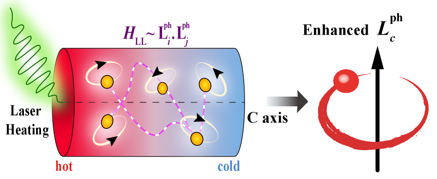
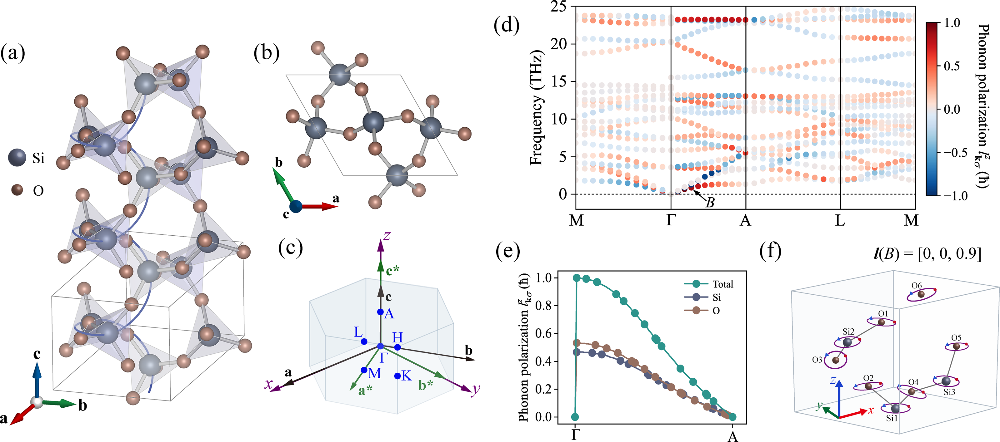
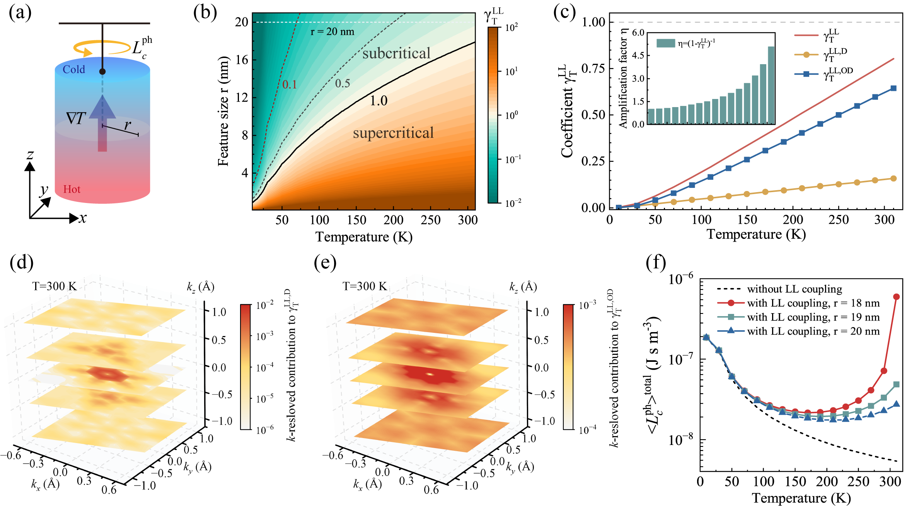
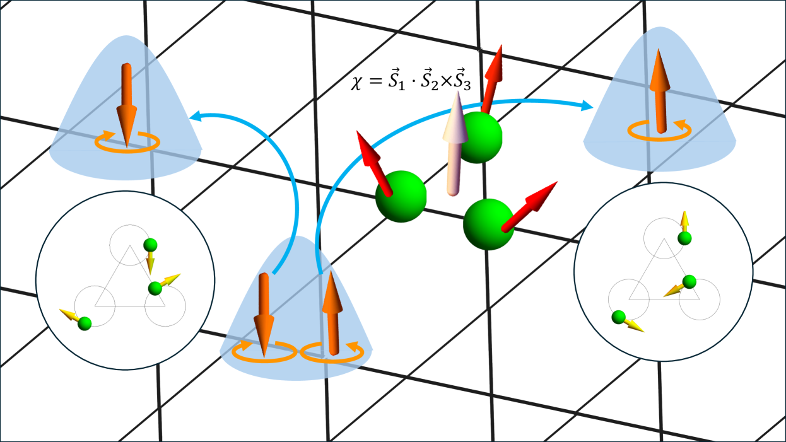
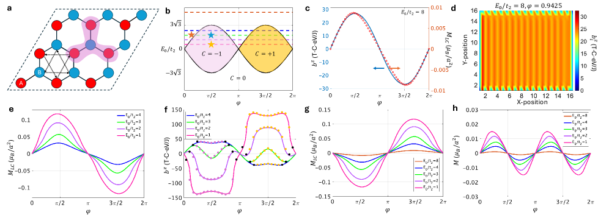
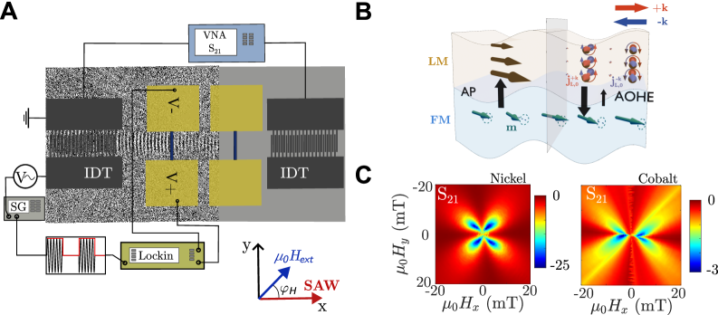
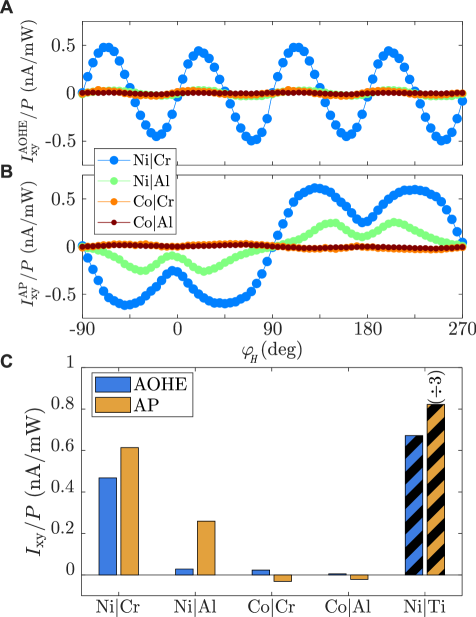
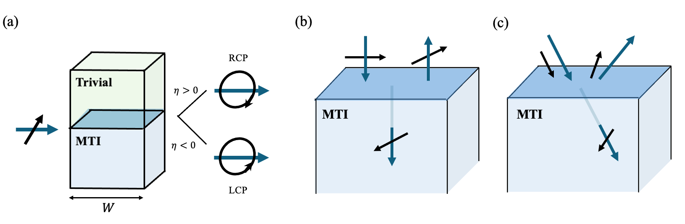

# カイラルフォノンの角運動量と軌道ゼーベック効果

**執筆日**: 2026-03-28
**トピック**: カイラルフォノンの角運動量と軌道ゼーベック効果
**注目論文**: 2603.25019
**参照した関連論文数**: 7本

---

## 1. 導入：なぜフォノンが「角運動量」を持てるのか

固体中の熱を運ぶのはフォノン（phonon）と呼ばれる格子振動の量子である。フォノンは電荷を持たないため、長らく「磁気的にニュートラルな粒子」と見なされてきた。しかし近年、カイラル（鏡像対称性を持たない）結晶構造の中では、フォノンが**角運動量**を持ち、さらに**磁気モーメント**まで獲得できることが明らかになってきた。

直感的に言えば、カイラル結晶中では原子が「螺旋状」に配置されているため、その振動も回転成分を含む。回転する荷電粒子が磁気モーメントを生じるのと同じ理由で、原子の回転振動も等価的な磁気モーメントを生む。これが**カイラルフォノン**（chiral phonon）の本質である。

さらに驚くべきことに、このような系に温度勾配（温度差）をかけると、熱流に乗ってフォノンが流れ、それとともにフォノンの角運動量も一方向に輸送される。これが**軌道ゼーベック効果**（orbital Seebeck effect）と呼ばれる現象であり、2026年初頭に実験的に観測されたと報告された \[Nabei et al., 2026\]。

ところが実験で観測されたフォノンの磁気モーメントは、単純な理論計算の予測値より**約2桁も大きい**。この「巨大なフォノン磁気モーメント」はどこから来るのか——これが今回の注目論文（arXiv:2603.25019）が解き明かそうとした中心的な謎である。

---

## 2. 解決すべき問い：軌道ゼーベック効果の「巨大性」の起源

軌道ゼーベック効果でいう「軌道」とは、電子の軌道角運動量（orbital angular momentum, OAM）ではなく、フォノン自体の角運動量（phonon angular momentum, PAM）のことを指す場合が多い。カイラル絶縁体ではスピン軌道相互作用がなくても、フォノンが角運動量 $\langle L_c^{\rm ph} \rangle$ を持てる。この量は温度勾配 $\partial T / \partial x_c$ に比例して増大する：

$$
\langle L_c^{\rm ph} \rangle_{\rm NL} = \gamma^{\rm NL} \frac{\partial T}{\partial x_c}
$$

ここで $\gamma^{\rm NL}$ は「非局所（nonlocal）」な応答係数であり、結晶の音子分散と構造から決まる。問題は、この素朴な計算では実験値を再現するのに**数桁足りない**点だった。

従来の理論は次の二種類の機構を検討してきた。

**内因性機構（intrinsic mechanism）**：フォノンのベリー曲率（Berry curvature）に由来するフォノン磁気モーメントで、電子の量子幾何と電子フォノン結合を通じて生じる \[Chen et al., 2025; Ren et al., 2021\]。

**外因性機構（extrinsic mechanism）**：電子フォノン散乱での非断熱過程から来るスキュー散乱（skew scattering）やサイドジャンプ（side jump）への寄与 \[Xue et al., arXiv:2501.03204\]。

いずれの機構も単独では巨大なフォノン磁気モーメントを説明できない。注目論文はここに、まったく別の視点——フォノン角運動量同士の**長距離相互作用**——を持ち込んだ。

---

## 3. 注目論文は何を新しく示したのか

Sun, Zhong, Yao, Zhou, Zhang（arXiv:2603.25019, 2026年3月）は、カイラル絶縁体における熱的に誘起されたフォノン角運動量の「内因的増幅機構」として、**Heisenberg型フォノン角運動量間長距離結合（L-L結合）** を提案した。

### 対称コマ型カイラル絶縁体の自由エネルギー

彼らのモデルの出発点は、古典力学の剛体回転の概念を固体に拡張することである。カイラル絶縁体全体を「対称コマ（symmetric top）」とみなし、全角運動量 $\mathbf{L}$ を

$$
\mathbf{L} = \mathbf{L}^{\rm rot} + \mathbf{L}^{\rm ph}
$$

と分解する。ここで $\mathbf{L}^{\rm rot}$ は剛体回転の角運動量、$\mathbf{L}^{\rm ph}$ はフォノンによる角運動量（PAM）である。ハミルトニアンの交差項として、

$$
H_{\rm LL} = \frac{1}{2I_A}\left(\mathbf{L}^{\rm ph}\right)^2 + \frac{1}{2}\left(\frac{1}{I_C} - \frac{1}{I_A}\right)\left(L_c^{\rm ph}\right)^2
$$

が現れる。ここで $I_A$, $I_C$ はそれぞれ主軸に直交する方向と対称軸 $c$ 方向の慣性モーメントである。

この $H_{\rm LL}$ が鍵となる。これは単純に見えるが、異なるフォノンモード間の**長距離結合**を表しており、ひとつのフォノンモードの角運動量が他のモードの角運動量に影響を与える——まさにHeisenbergスピンモデルにおけるスピン間相互作用と同型の相互作用である。

*図1：arXiv:2603.25019 より（CC BY 4.0）。カイラル絶縁体における温度勾配下でのフォノン角運動量（PAM）の自己無撞着増幅の概念図。L-L結合が正のフィードバックループを形成し、巨大なフォノン磁気モーメントを実現する。*

### 自己無撞着増幅とその定式化

この L-L 結合を自己無撞着場近似（mean-field approximation）で取り扱うと、PAM の期待値に対して以下の自己無撞着方程式が得られる：

$$
\langle L_c^{\rm ph} \rangle_{\rm total} = \frac{\gamma^{\rm NL}}{1 - \gamma^{\rm LL}} \frac{\partial T}{\partial x_c}
$$

ここで $\gamma^{\rm LL}$ は L-L 結合の強さを表す無次元パラメータである。増幅因子は

$$
\eta = \frac{1}{1 - \gamma^{\rm LL}}
$$

となり、**$\gamma^{\rm LL} \to 1$ に近づくにつれて $\eta$ は発散する**。すなわち、系が「臨界」に近づくほど巨大なPAMが実現する、という機構である。

著者らは $\alpha$-石英（SiO$_2$）に対してこの理論を適用し、室温付近で**最大2桁の増幅**が生じることを示した。これは実験で観測された巨大フォノン磁気モーメントの大きさを定量的に説明できる。

### α-石英の結晶構造と計算結果

$\alpha$-石英は三方晶系に属するカイラル絶縁体で、SiO$_4$ 四面体が $c$ 軸まわりに螺旋状に連なった構造を持つ。この螺旋構造が右巻き・左巻きの二種類の鏡像異性体（enantiomer）を生み出し、それぞれが逆符号のPAMを持つ。

*図2：arXiv:2603.25019 より（CC BY 4.0）。(a, b) α-石英の結晶構造（SiO$_4$ 四面体の螺旋配列）。(c) ブリルアンゾーンと高対称点。(d) フォノン分散（各モードを円偏光度で着色）。(e) Γ-A方向の原子種投影。(f) 点 B でのフォノンモードの実空間原子運動の可視化。*

温度・試料サイズによる増幅効果の計算結果を Fig. 3 に示す。室温（300 K）近傍で $\gamma^{\rm LL}$ が大きくなり、半径 20 nm の円柱試料で約5倍の増幅が生じる。系のサイズが大きくなるほど（慣性モーメントが増すほど）、臨界条件に近づき、より大きな増幅が期待される。

*図3：arXiv:2603.25019 より（CC BY 4.0）。(a) 温度勾配下の円柱試料の模式図。(b) L-L 係数 $\gamma^{\rm LL}$ の温度-サイズ位相図。(c, d) 半径 20 nm での温度依存性と増幅因子 $\eta$。(e) ブリルアンゾーン分解されたPAM寄与。(f) 異なる試料半径でのPAM密度の温度依存性。*

この計算から、増幅は主に**非対角 L-L 結合チャネル**（異なるフォノンモード間の結合）が支配していることも明らかにされた。対角成分（同一モード内の自己作用）だけでは不十分で、モード間の協同作用が本質的であることを示す重要な知見である。

---

## 4. 背景と文脈：カイラルフォノン研究の系譜

### カイラルフォノンの発見と基礎概念

カイラルフォノンの概念は2015年にモノレイヤー六方晶格子における谷フォノンホール効果の理論として提案された \[Zhang & Niu, 2015\]。カイラルフォノンとは、原子が一定の回転方向（右回り・左回り）で振動するモードであり、フォノンの「角運動量」$\ell\hbar$（$\ell = \pm 1$）を持つ。

重要なのは、カイラルフォノンが格子対称性からその存在が保証される点である。六回回転軸を持つ系では、K点や K' 点のフォノンが必然的に円偏光（circularly polarized）となる。この性質は現在では二次元材料から三次元カイラル結晶まで広く認められている。

### フォノン磁気モーメントの多様な機構

カイラルフォノンが磁気モーメントを持てることは「軌道磁気モーメントのフォノン類似体」として理論的に提唱されてきた。主な機構は以下の通りである：

**ベリー曲率由来（Born有効電荷経由）**：フォノンのモード間結合から生じるベリー曲率を通じ、各モードが磁気モーメントを持つ。$m_\nu^{(\rm ph)} \propto \sum_\nu \Omega_\nu(\mathbf{k})$（$\Omega_\nu$: フォノンモード$\nu$のベリー曲率）。

**電子-フォノン結合由来**：電子の軌道磁化とフォノンの結合を通じ、電子のトポロジーがフォノン磁気モーメントに転写される \[Hu et al., 2021\]。強相関電子系や磁性体でも類似の効果が理論化されている \[Wang et al., 2025\]。

**外因性機構（スキュー散乱・サイドジャンプ）**：これはXue et al.（arXiv:2501.03204）が系統的に定式化したものだ。電子フォノン散乱の非断熱的補正（Berry curvatureの非局所性）から来る寄与であり、電子系のスキューホール効果と完全に並行する構造を持つ。重要なのは、外因性成分が内因性成分と同程度の大きさになりうることである。

今回の注目論文が示した L-L 結合機構は、これらのいずれとも独立した**集団的・協同的増幅**という新しい物理であり、フォノン磁気モーメントの三番目の機構として位置づけられる。

### スピンゼーベック効果との類比

電子系では、磁性体の熱流がスピン流を生成する**スピンゼーベック効果**（SSE）がよく知られている。SSEでは温度勾配 $\nabla T$ により磁子（マグノン）が流れ、スピン蓄積が生じる。軌道ゼーベック効果はこれのフォノン版であり、スピン軌道相互作用なしに（非磁性カイラル絶縁体でも）熱流から角運動量流が得られる点が本質的な違いである。

Nishimura et al.（arXiv:2505.23083, CC BY-NC-ND 4.0）は音響カイラルフォノンによるスピン流生成の理論を展開し、ジャイロ磁気応答（格子回転による顕微鏡的バーネット効果）を通じてスピン電流が生成されることを示した。この研究は「フォノン角運動量 → スピン角運動量」という変換の定式化として重要であり、軌道ゼーベック効果をスピントロニクスへ接続する橋渡しとなっている。

---

## 5. メカニズムの深化：L-L 結合の物理と競合機構の比較

### L-L 結合の物理的直感：コリオリカとの類比

L-L 結合を直感的に理解するには、**剛体コマの力学**を思い起こすと良い。コマが回転しているとき、外力を加えると「摂動の方向と直角」に歳差運動が生じる（ジャイロ効果）。これはコリオリカの一種である。カイラル絶縁体全体をひとつの「コマ」と見なすと、フォノン角運動量 $L^{\rm ph}$ と試料全体の角運動量 $L^{\rm rot}$ の間に、コリオリカ型の結合 $H_{\rm cor} = (1/I_A) \mathbf{L} \cdot \mathbf{L}^{\rm ph}$ が生まれる。

さらに本質的なのは、$\mathbf{L}^{\rm ph}$ を平均場（mean field）として扱ったとき、残りのフォノンモードが感じる有効磁場 $B_{\rm eff} \propto \langle L^{\rm ph} \rangle$ が生じることだ。この有効磁場が逆にフォノンの角運動量をさらに大きくする——正のフィードバックループ（Fig. 1参照）が形成される。臨界条件 $\gamma^{\rm LL} = 1$ は、この正帰還が無限大となる「相転移点」に対応する。

### 外因性機構との比較：スキュー散乱のフォノン版

Xue et al.（arXiv:2501.03204）の外因性機構（非独占的ライセンス）と比較すると、L-L 結合機構の特徴がより際立つ。外因性機構はフォノンが不純物や欠陥で散乱される際の「スキュー」——すなわち左右非対称な散乱——から来るものであり、原理的にはいかなる試料でも存在する。これは電子系のスキューホール効果と完全に対応する。

一方、L-L 結合機構は試料が「整合したカイラル結晶」でなければ働かない。$\alpha$-石英のような螺旋構造を持つ純粋なカイラル絶縁体が理想的な舞台である。また L-L 結合の増幅は試料サイズに依存するため（慣性モーメント $I_A, I_C$ はサイズとともに増大）、**ナノ試料では小さく、バルク試料では大きな増幅**が期待される。実験条件や試料形状をコントロールすれば、両機構の相対寄与を分離できるかもしれない。

Thermal Hall 効果との関連でも興味深い比較ができる。Oh & Nagaosa（arXiv:2408.01671）は、モット絶縁体においてスカラースピンカイラリティが誘起する緊急ラマン相互作用を通じ、円偏光カイラルフォノンのスキュー散乱が熱ホール効果をもたらすことを示した。

*図4：arXiv:2408.01671 より（CC BY 4.0）。フォノンスキュー散乱の模式図。非共面スピン構造によるスカラースピンカイラリティが緊急ラマン相互作用を生み出し、左右円偏光フォノンを非対称に散乱させる。軌道磁化を介した機構（arXiv:2507.22436）と合わせて、フォノン熱ホール効果を引き起こす普遍的な機構群をなす。*

また Oh（arXiv:2507.22436）は同様の枠組みを軌道磁化に対して拡張し、軌道磁化が誘起する創発磁場 $b_z \sim 10^1$–$10^2$ T 相当の強さにより、実験の熱ホール角 $10^{-4}$–$10^{-2}$ を半定量的に再現することを示した。

*図5：arXiv:2507.22436 より（CC BY 4.0）。軌道磁化（青いドーム形状の波動関数）を介してフォノン（赤球）がスキュー散乱される様子の模式図。この機構は磁性秩序を必要とせず、軌道磁化のある系で普遍的に熱ホール効果を引き起こしうる。*

これらをまとめると、フォノン系の「ホール系列」——熱ホール（$\kappa_{xy}$）、フォノン角運動量ホール、軌道ゼーベック——は互いに深く関連しており、その根底にある物理は「カイラルフォノンの非対称輸送」にある。

---

## 6. 材料・手法・応用への広がり

### カイラル音響フォノンによる軌道電流生成

フォノン角運動量の応用として最も即物的なのは、「フォノンで軌道電流を駆動する」という概念である。Rovirola et al.（arXiv:2512.08385）は実験的にこれを実証した。

彼らは LiNbO$_3$ 基板上にくし形電極（IDT）を作製し、表面弾性波（surface acoustic wave, SAW）を発生させた。このSAWがニッケル/クロム（Ni/Cr）二層膜を通過すると、横電圧——軌道ホール効果と軌道ポンピングの両方に由来——が生じた。

*図6：arXiv:2512.08385 より（CC BY 4.0）。実験セットアップ。LiNbO$_3$ 基板上のIDTがSAWを生成し、FM/LM（強磁性/軽金属）二層膜を照射する。音響軌道ホール効果（AOHE）と音響軌道ポンピング（AP）の模式図。*

特筆すべきは「電気的に駆動した場合よりもSAW駆動の方が軌道電流の生成効率が格段に高い」という結果である。また Ni/Al や Co 系では信号がほぼゼロだったのに対し、Ni/Cr と Ni/Ti で顕著な信号が観測された。これは軌道ホール伝導率、フォノン-軌道結合、界面軌道透過率の組み合わせが物質選択性を決める証拠であり、**物質設計で軌道電流を最大化できる**可能性を示している。

*図7：arXiv:2512.08385 より（CC BY 4.0）。各種FM/LM積層試料における音響軌道ホール効果（AOHE）と音響軌道ポンピング（AP）の振幅比較。Ni/Cr と Ni/Ti が突出して大きい信号を示す。*

### 磁性トポロジカル絶縁体中の円偏光フォノン制御

Chatterjee & Liu（arXiv:2603.17274）は、磁性トポロジカル絶縁体（MTI）の界面でフォノンを「偏光フィルター」として機能させられることを示した。

MTIの表面では表面フォノンホール粘性（surface phonon Hall viscosity, PHV）が存在し、これによって界面に沿った音響波が円偏光（右円偏光 RCP / 左円偏光 LCP）を選択的に透過させる。具体的には：

1. 線形偏光の音響波を界面に入射する
2. PHVが有効な界面ではバルクモード周波数より低周波数の界面モードが形成される
3. この界面モードは RCP または LCP の一方のみ
4. MTIの磁化方向を反転させると、RCP と LCP が入れ替わる

*図8：arXiv:2603.17274 より（CC BY 4.0）。磁性トポロジカル絶縁体界面を用いたフォノン偏光フィルターの概念図。線形偏光音響波が界面を通ると、磁化方向によってRCP（右円偏光）またはLCP（左円偏光）に変換される。また音響ファラデー回転（Acoustic Faraday Rotation）も生じる。*

この「フォノン円偏光スイッチ」は、磁化によってフォノン角運動量を制御できることを意味する。軌道ゼーベック効果と組み合わせれば、「磁化で向きを制御できる熱誘起軌道電流源」という新しいデバイス概念が浮かび上がる。

### 軌道電流とスピン電流の接続

Sato, Kato, Manchon（arXiv:2511.11272, 非独占的ライセンス）の理論は、カイラルフォノンが軌道二極子の蓄積（orbital dipole accumulation）を引き起こすことを示した。ここで重要なのは、軌道四極子モーメントとの結合を通じて静的な軌道蓄積が生じることで、スピン軌道相互作用なしで済む点である。この軌道蓄積はさらにスピン軌道変換（spin-to-orbital conversion）を通じてスピン蓄積に変換できるため、「カイラルフォノン → 軌道電流 → スピン電流」という変換チェーンの全体像が見えてくる。

以下に、本記事で取り上げた現象の全体像を俯瞰した関係図を示す。

| 現象 | 主な物理量 | 典型材料 | 関連論文 |
|---|---|---|---|
| 軌道ゼーベック効果 | PAM, $\langle L^{\rm ph} \rangle$ | α-石英 | 2603.25019 |
| フォノン熱ホール効果 | $\kappa_{xy}$ | モット絶縁体, YMnO₃ | 2408.01671, 2507.22436 |
| 音響軌道ホール効果 | 軌道電流 | Ni/Cr 二層膜 | 2512.08385 |
| フォノン偏光制御 | 円偏光フォノン | 磁性TI界面 | 2603.17274 |
| スピンゼーベック (フォノン版) | スピン電流 | カイラル絶縁体/金属接合 | 2505.23083 |
| 軌道蓄積 | 軌道二極子 | 一般的なカイラル絶縁体 | 2511.11272 |

---

## 7. 基礎から理解する

ここでは、本記事の理解に必要な基礎概念を丁寧に説明する。

### カイラルフォノンとは

「カイラル（chiral）」とはギリシャ語で「手」を意味し、右手と左手のように鏡像が重なり合わない幾何学的性質をいう。カイラルフォノンとは、**原子が回転成分を持つ振動モード**のことであり、各原子が反時計回り（$\ell = +1$）または時計回り（$\ell = -1$）の円形軌道を描く。

通常の音響フォノンや光学フォノンは「線形偏光」であり、原子は直線的に振動する。一方カイラルフォノンは「円偏光」であり、原子は楕円または円軌道を描く。この違いは電磁波における直線偏光と円偏光の違いに完全に対応する。

カイラルフォノンは：
- 鏡像対称性（inversion symmetry）を持たない結晶で実現する
- ブリルアンゾーン端の高対称点（K, K' など）に現れやすい
- 谷自由度（valley degree of freedom）と結びつく

### フォノン角運動量（PAM）

フォノン角運動量（phonon angular momentum, PAM）は、各フォノンモードが持つ角運動量の格子和として定義される。量子力学的には、フォノン $(\mathbf{k}, \nu)$ の角運動量演算子は

$$
\hat{\ell}_{\mathbf{k}\nu} = -i\hbar \sum_{\alpha,\beta} \epsilon_{\alpha\beta z} \left( \mathbf{e}_{\mathbf{k}\nu}^{(\alpha)} \right)^* \frac{\partial}{\partial q_{\mathbf{k}\nu}^{(\alpha)}} \mathbf{e}_{\mathbf{k}\nu}^{(\beta)}
$$

と書ける。ここで $\mathbf{e}_{\mathbf{k}\nu}^{(\alpha)}$ はフォノン偏光ベクトルの $\alpha$ 成分、$\epsilon_{\alpha\beta z}$ はLevi-Civitaシンボルである。

全PAMは、各 $(\mathbf{k}, \nu)$ モードにおけるボーズ-アインシュタイン分布 $n_{\mathbf{k}\nu}$ を重みとした和

$$
L^{\rm ph} = \sum_{\mathbf{k},\nu} \ell_{\mathbf{k}\nu} \left( n_{\mathbf{k}\nu} + \frac{1}{2} \right)
$$

として与えられる。熱平衡ではカイラリティ（$+1$ と $-1$）が打ち消し合って $\langle L^{\rm ph} \rangle = 0$ だが、温度勾配がある場合は $n_{\mathbf{k}\nu}$ が $\mathbf{k}$ 依存の偏りを持ち、有限の $\langle L^{\rm ph} \rangle$ が生じる。

### ゼーベック効果と軌道ゼーベック効果

**ゼーベック効果**（Seebeck effect）とは、導体に温度勾配 $\nabla T$ をかけたとき、電圧（起電力）が発生する現象である：

$$
\mathbf{E} = S \nabla T
$$

ここで $S$ はゼーベック係数（単位 V/K）、$\mathbf{E}$ は電場である。熱電変換（thermoelectric conversion）の基本原理であり、温度差から電力を取り出せる。

**軌道ゼーベック効果**はこの類推で定義される。カイラル絶縁体に温度勾配をかけたとき、電荷流（電流）ではなく**角運動量流（軌道電流）**が発生する：

$$
J_L = \sigma_{\rm OS} \nabla T
$$

ここで $\sigma_{\rm OS}$ は軌道ゼーベック係数、$J_L$ は角運動量流密度（またはその空間積分である蓄積量）である。この効果は電荷の移動を伴わないため、電気的絶縁体でも生じるのが特徴である。

### バーネット効果と回転誘起磁化

**バーネット効果**（Barnett effect）は、物体を機械的に回転させると磁化が誘起される現象である（1915年にバーネットが発見）。逆に磁化した物体は角運動量を持つ（アインシュタイン-ド・ハース効果）。これらは「磁気モーメント = 角運動量 × ジャイロ磁気比 $\gamma$」という関係

$$
\mathbf{m} = \gamma \mathbf{L}
$$

を反映している。フォノン角運動量による「フォノン磁気モーメント」もこれと同型であり、「回転するイオンが局所的なバーネット効果を通じて磁化を誘起する」と解釈できる。Nishimura et al. のスピンゼーベック効果の理論もこの微視的バーネット効果を基礎においている。

### ベリー曲率とフォノンホール効果

量子力学系では、ハミルトニアンがパラメータ空間（ここでは波数 $\mathbf{k}$）に依存するとき、固有状態には**ベリー位相**（Berry phase）が付随する。ブリルアンゾーン全体での積分がベリー曲率（Berry curvature）であり：

$$
\Omega_\nu(\mathbf{k}) = -2 \operatorname{Im} \sum_{\nu' \neq \nu} \frac{\langle \nu, \mathbf{k} | \partial_{k_x} H | \nu', \mathbf{k} \rangle \langle \nu', \mathbf{k} | \partial_{k_y} H | \nu, \mathbf{k} \rangle}{(\omega_\nu - \omega_{\nu'})^2}
$$

フォノンのベリー曲率は、**フォノンホール熱伝導率**（intrinsic phonon Hall effect）を決める：

$$
\kappa_{xy}^{\rm ph} = -\frac{k_B^2 T}{\hbar V} \sum_{\mathbf{k},\nu} c_2\left(n_{\mathbf{k}\nu}\right) \Omega_\nu(\mathbf{k})
$$

ここで $c_2(x) = (1+x)\left[\ln\frac{1+x}{x}\right]^2 - (\ln x)^2 - 2{\rm Li}_2(-x)$（${\rm Li}_2$: ポリログ関数）、$n_{\mathbf{k}\nu}$ はボーズ-アインシュタイン分布である。磁性絶縁体では磁場やスピン軌道結合によって $\Omega_\nu \neq 0$ となり、フォノンが横方向に流れる（フォノン熱ホール効果）。

---

## 8. 重要キーワード10個の解説

**① カイラルフォノン（chiral phonon）**
鏡像対称性を持たない結晶中で、原子が円形または楕円形の軌道を描く格子振動モード。角運動量 $\ell\hbar$（$\ell = \pm 1$）を持ち、谷自由度と結びつく。電磁波の円偏光に対応する。

**② フォノン角運動量（PAM: phonon angular momentum）**
フォノンモードが持つ角運動量の和。熱平衡ではゼロだが、温度勾配下では有限値を持ち、熱流と同方向に輸送される。フォノン磁気モーメントの起源のひとつ。

**③ L-L 結合（Heisenberg型フォノン角運動量間長距離結合）**
注目論文（2603.25019）が提案した新機構。カイラル絶縁体全体を対称コマとみなしたとき、異なるフォノンモードの角運動量同士が $H_{\rm LL} = (1/2I_A)(\mathbf{L}^{\rm ph})^2 + \ldots$ で結合する相互作用。正のフィードバックループで巨大なPAMを生む。

**④ 増幅因子 $\eta$（amplification factor）**
$\eta = 1/(1 - \gamma^{\rm LL})$。L-L 結合の強さ $\gamma^{\rm LL} \to 1$ で発散し、PAMが理論的に無限大に増幅される。実際には散乱で制限されるが、$\alpha$-石英では最大2桁の増幅が計算される。

**⑤ 軌道ゼーベック効果（orbital Seebeck effect）**
カイラル絶縁体に温度勾配をかけたとき、フォノン角運動量（または電子の軌道角運動量）が輸送される現象。スピン軌道相互作用なしで生じ、熱から軌道電流を生成できる。2026年に $\alpha$-石英で実験的に観測された。

**⑥ 音響軌道ホール効果（AOHE: acoustic orbital Hall effect）**
表面弾性波（SAW）のようなカイラル音響フォノンが横方向に軌道電流を生成する効果。Rovirola et al.（2512.08385）が Ni/Cr 系で実験実証。電気的駆動より効率が高いと報告された。

**⑦ フォノン熱ホール効果（phonon thermal Hall effect）**
フォノンが磁場・スピンカイラリティ・軌道磁化などにより横方向に偏向し、熱伝導率の横成分 $\kappa_{xy} \neq 0$ が生じる効果。内因性（ベリー曲率由来）と外因性（スキュー散乱由来）の二種類がある。

**⑧ スキュー散乱（skew scattering）**
不純物や磁性ゆらぎによるフォノン散乱が左右非対称になる効果。電子のホール効果の外因性機構と完全に並行する。フォノン熱ホール効果や軌道ゼーベック効果の外因性機構として機能する（Xue et al., 2501.03204）。

**⑨ バーネット効果（Barnett effect）**
回転する物体に磁化が誘起される現象（$\mathbf{m} = \gamma \mathbf{L}$）。フォノン磁気モーメントの概念的基礎であり、カイラルフォノンによるスピン電流生成（Nishimura et al., 2505.23083）の微視的機構として使われる。

**⑩ 表面フォノンホール粘性（surface phonon Hall viscosity, PHV）**
磁性トポロジカル絶縁体の表面に存在するフォノン輸送の横方向粘性。Chatterjee & Liu（2603.17274）が示すように、PHVにより界面フォノンモードが円偏光化し、外部磁化で偏光方向を制御できる。フォノン「光学スイッチ」の原理となる。

---

## 9. まとめと今後の論点

本記事の中心的なメッセージは次の通りである。カイラル絶縁体 $\alpha$-石英で観測された巨大なフォノン磁気モーメントを説明するために、Sun et al.（2603.25019）は「Heisenberg型 L-L 結合」という新しい集団的増幅機構を提案した。この機構は、フォノン角運動量同士の長距離相互作用が正帰還ループを形成し、熱的に誘起された角運動量を最大2桁増幅するというものである。

この一本の理論論文を軸に、周辺の研究群は「カイラルフォノン角運動量の物理」という大きな地図を描きつつある：

- 熱から軌道電流を生成する（軌道ゼーベック効果）
- カイラルSAWで軌道電流を制御する（音響軌道ホール効果：2512.08385）
- 磁化でフォノンの円偏光を制御する（磁性TI界面フォノンフィルター：2603.17274）
- スピン電流との接続を理論化する（2505.23083, 2511.11272）
- フォノン熱ホール効果の多様な機構を体系化する（2408.01671, 2507.22436）

今後の主要な論点は以下である：

**実験的検証の課題**：L-L 結合は試料サイズに依存するため、バルク試料とナノ構造を系統的に比較することで存在を検証できるはずである。また実験的に $\gamma^{\rm LL}$ を直接測定する手法の確立が急務である。

**他のカイラル材料への展開**：$\alpha$-石英以外のカイラル絶縁体（セレン、テルル、カイラルMOFなど）でも同様の増幅が起きるか。螺旋構造の巻きパラメータと $\gamma^{\rm LL}$ の関係の体系的理解が求められる。

**軌道電流デバイスへの応用**：音響波で制御できる軌道電流は、スピントロニクスを「オービタルトロニクス（orbitronics）」へ拡張する可能性を秘めている。フォノン角運動量 → 軌道蓄積 → スピン流という変換チェーンを実用デバイスレベルで実現するには、界面透過率や材料選択の最適化が鍵となる。

**L-L 結合の非線形効果**：$\gamma^{\rm LL} \to 1$ の臨界近傍では、本記事で扱った線形応答理論が破綻し、非線形効果や量子ゆらぎが重要になる。これは「フォノン版スピン液体」に相当する新しい相の可能性を示唆するかもしれない。

フォノンが「角運動量を持ち、熱から軌道・スピン電流を生成し、デバイスへの応用まで見通せる」という事実は、格子振動物理の意外な豊かさを示している。材料工学と物性物理が交差するこの分野は、今後数年でさらなる展開が期待される。

---

## 10. 参考にした論文一覧

| # | arXiv ID | 著者 | タイトル | 年 | ライセンス | 役割 |
|---|---------|------|---------|-----|-----------|------|
| 1 | 2603.25019 | H. Sun et al. | Origin of Giant Phonon Magnetic Moment in Orbital Seebeck Effect: a Heisenberg-type L-L Coupling | 2026 | CC BY 4.0 | **注目論文** |
| 2 | 2603.17274 | A. Chatterjee, C.-X. Liu | Phonon circular birefringence and polarization-filter in Magnetic Topological Insulators | 2026 | CC BY 4.0 | 関連（応用） |
| 3 | 2512.08385 | M. Rovirola et al. | Chiral-phonon generation of orbital currents in light transition metals | 2025 | CC BY 4.0 | 関連（実験） |
| 4 | 2511.11272 | T. Sato, T. Kato, A. Manchon | Orbital Accumulation Induced by Chiral Phonons | 2025 | 非独占的 | 関連（理論） |
| 5 | 2507.22436 | T. Oh | Thermal Hall effect induced by phonon skew-scattering via orbital magnetization | 2025 | CC BY 4.0 | 関連（比較） |
| 6 | 2505.23083 | N. Nishimura et al. | Theory of spin Seebeck effect activated by acoustic chiral phonons | 2025 | CC BY-NC-ND 4.0 | 関連（スピン接続） |
| 7 | 2501.03204 | R. Xue et al. | Extrinsic Mechanisms of Phonon Magnetic Moment | 2025 | 非独占的 | 関連（外因性機構） |
| 8 | 2408.01671 | T. Oh, N. Nagaosa | Phonon thermal Hall effect in Mott insulators via skew-scattering by the scalar spin chirality | 2024 | CC BY 4.0 | 関連（比較） |

**図のライセンス帰属：**
- Figs. 1–3 (注目論文 arXiv:2603.25019)：CC BY 4.0, © 2026 Sun, Zhong, Yao, Zhou, Zhang
- Fig. 4 (arXiv:2408.01671)：CC BY 4.0, © 2024 Oh and Nagaosa
- Fig. 5 (arXiv:2507.22436)：CC BY 4.0, © 2025 Oh
- Figs. 6–7 (arXiv:2512.08385)：CC BY 4.0, © 2025 Rovirola et al.
- Fig. 8 (arXiv:2603.17274)：CC BY 4.0, © 2026 Chatterjee and Liu
