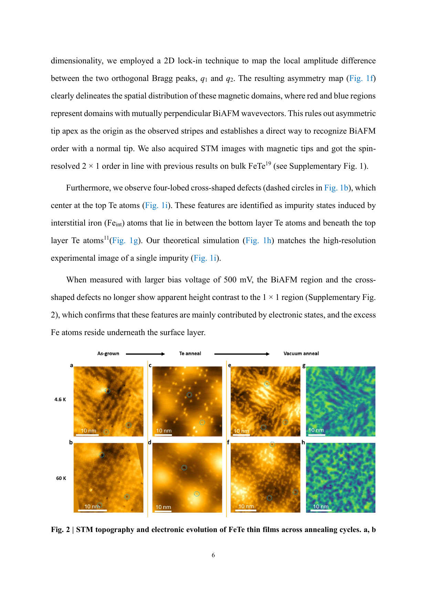
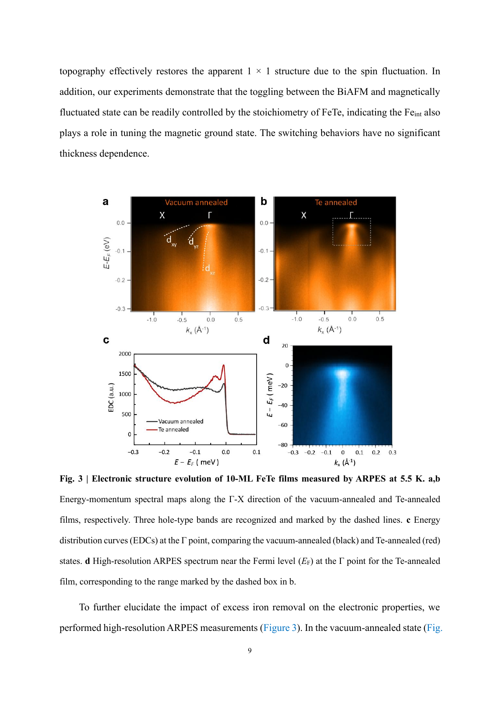
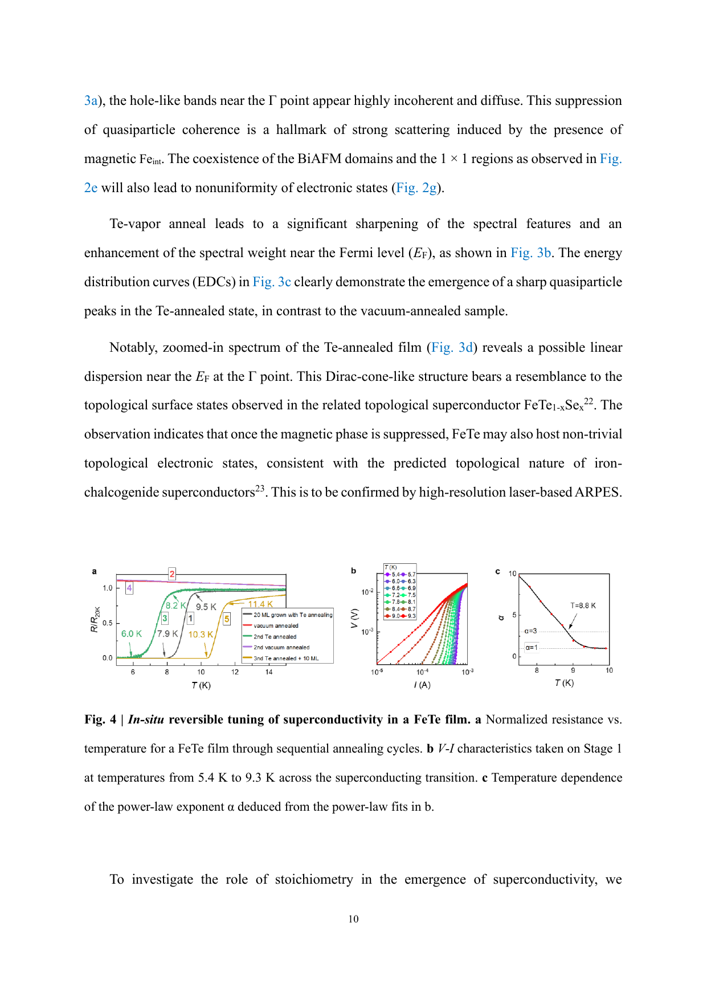
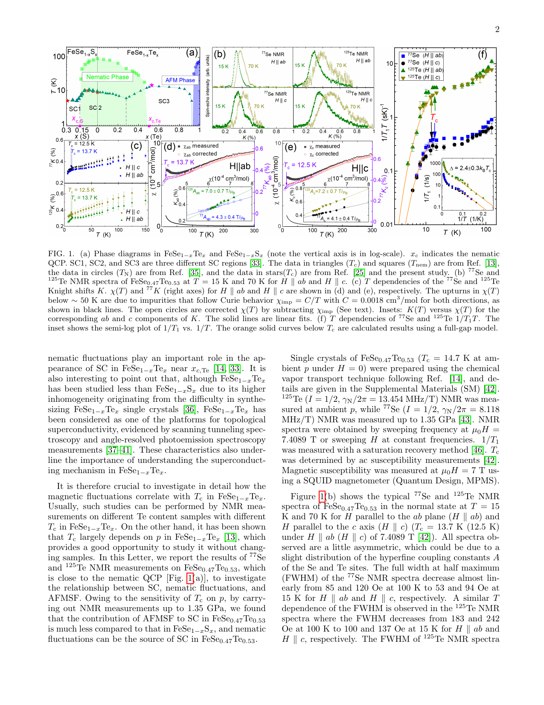
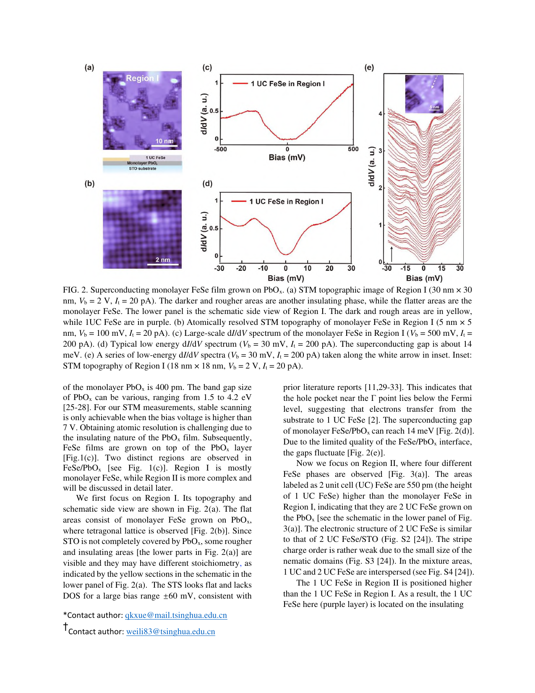

# FeTe の内因性超伝導：格子間鉄原子が隠していた超伝導体の実体

**執筆日**: 2026-03-23
**トピック**: 鉄テルル化物（FeTe）の化学量論制御による内因性超伝導の発見と鉄カルコゲナイド超伝導の新展開
**注目論文**: arXiv:2603.16115
**参照した関連論文数**: 7本

---

## 1. 導入：なぜ今この話題か

鉄系超伝導体（iron-based superconductors, IBS）は2008年の LaFeAsO における超伝導の発見以来、銅酸化物に次ぐ高温超伝導体ファミリーとして精力的に研究されてきた。その中でも、鉄カルコゲナイド系は構造が単純で、超伝導転移温度 $T_c$ や磁気秩序を外部パラメータで幅広く制御できることから、特に重要な実験プラットフォームとして位置づけられてきた。

鉄カルコゲナイドの親化合物であるFeTe（鉄テルル化物）は、長らく鉄系超伝導体研究者の頭を悩ませる存在であった。Fe(Se$_{1-x}$Te$_x$) 系において、Te 置換量を増やすと $T_c$ は低下し、FeTe 端（$x=1$）では超伝導が消失し、代わりに双線型反強磁性（bicollinear antiferromagnetic, BiAFM）秩序が現れる。FeSe では 8 K 程度の超伝導が見られるのに、なぜ FeTe は超伝導しないのか？これは15年以上にわたって未解決のままだった重要な問いである。

2026年3月、Zi-Jie Yan らは Nature に掲載予定の論文（arXiv:2603.16115）において、この謎に決定的な答えを示した。すなわち、**「FeTe が超伝導しなかったのは、材料が内在的に超伝導を示さないのではなく、結晶成長時に混入する格子間 Fe 原子（interstitial iron atoms）が超伝導を抑制していたためである」**。Te アニール処理によって格子間 Fe を除去した化学量論的 FeTe 薄膜では、BiAFM 秩序が消え、$T_c \approx 13.5$ K の頑健な超伝導が現れる。この発見は FeTe の位置付けを根本から変え、Fe(Se,Te) 系全体の理解に新たな視点をもたらす。

同時期に発表された関連研究群を見ると、この発見が孤立したものではないことがよくわかる。SrTiO$_3$ 基板上のひずみ FeTe 薄膜でも同様の化学量論制御が有効であることが示され（arXiv:2602.14398）、Fe(Se,Te) のネマティック揺らぎ [arXiv:2505.11732]・スピン揺らぎ [arXiv:2503.03473] の研究、さらには FeTe を用いた磁性トポロジカル絶縁体ヘテロ構造でのトポロジカル超伝導探索 [arXiv:2312.04353] が並走して進んでいる。FeTe という「非超伝導体」が「鉄カルコゲナイド超伝導の核心」として再評価される転換点に、私たちは立ち会っているのだ。

---

## 2. 今回の軸となる問い

この記事を通じて答えを探す中心問題を 4 つ設定する。

**問い1：なぜ FeTe は「超伝導しない」と考えられてきたのか？**
→ FeTe の結晶成長プロセスにおける格子間 Fe 原子の役割と、それが引き起こす BiAFM 秩序の物理。関連論文：2602.14398、2603.16115。

**問い2：化学量論制御は何を変えるのか？超伝導への経路は何か？**
→ 化学量論的 FeTe で超伝導が現れるメカニズム。電子構造の変化とパリング機構の問題。関連論文：2603.16115、2602.14398、2505.11732、2503.03473。

**問い3：FeTe の超伝導は Fe(Se,Te) 系や他の鉄系超伝導体とどのようにつながるか？**
→ ネマティック揺らぎ・スピン揺らぎとの関係、FeSe/基板界面との比較。関連論文：2505.11732、2503.03473、2508.11018。

**問い4：FeTe を核にしたヘテロ構造はどのような新機能を生み出すか？**
→ 磁性トポロジカル絶縁体/FeTe ヘテロ構造でのトポロジカル超伝導、マヨラナ零エネルギーモードの可能性。関連論文：2312.04353、2308.00930、2508.03427。

---

## 3. 注目論文は何を新しく示したのか

**書誌情報**：
- **タイトル**：Stoichiometric FeTe is a Superconductor
- **著者**：Zi-Jie Yan, Zihao Wang, Bing Xia, Stephen Paolini, 他12名
- **arXiv ID**：2603.16115
- **掲載誌**：Nature（受理済み）
- **投稿日**：2026年3月17日

### 主張と新規性

本論文の中心的主張はシンプルで強力である：**化学量論的な FeTe は本来的に超伝導体である**。これまで FeTe が超伝導しないと思われてきた理由は、成膜プロセスで不可避的に混入する格子間 Fe（Fe$_{\rm int}$）原子であり、この「不純物」が除去されると超伝導が発現する、というものだ。

実験グループは分子線エピタキシー（MBE）法で FeTe 薄膜を作製した後、Te フラックスによるアニール処理（Te-vapor annealing）を行って格子間 Fe 原子を除去した。この「化学量論化処理」を施した薄膜は：

1. **BiAFM 秩序の消失**：スピン偏極走査トンネル顕微鏡（SP-STM）で確認
2. **零電気抵抗**：$T_c \approx 13.5$ K での超伝導転移
3. **マイスナー効果**：磁場排除の確認
4. **クーパー対トンネリング**：走査トンネル分光（STS）でギャップ構造を直接観測

という超伝導の決定的な証拠を示した。

### なぜこの論文が核となるか

FeTe は Fe(Se$_{1-x}$Te$_x$) 系の「$x=1$ 端点」として何十年も研究されてきたが、常に「超伝導しない側」として扱われてきた。もし FeTe が本来超伝導体であるならば、Fe(Se,Te) 系全体の相図の解釈が変わり得る。また FeTe は単純な構成元素からなる二元化合物であるため、FeSe（単層膜の高温界面超伝導で有名）と並んで「鉄カルコゲナイドにおける超伝導の本質」を問う格好の舞台となる。

---

## 4. 背景と文脈：この注目論文はどこに位置づくか

### 鉄カルコゲナイド超伝導体の概要

鉄カルコゲナイド超伝導体は Fe と カルコゲン（S, Se, Te）からなる最もシンプルな鉄系超伝導体である。PbO 型構造をもち、Fe が正方形格子を形成し、その上下にカルコゲン原子が交互に配置される（「11 型」構造）。この FeSe の発見（2008年）は、鉄系超伝導体が必ずしも砒素や酸素を必要としないことを示し、以来盛んに研究されている。

Fe(Se$_{1-x}$Te$_x$) の相図では（図1参照）、FeSe 端（$x=0$）でのネマティック秩序と超伝導が共存し、Te 置換を増やすとネマティック量子臨界点（nematic quantum critical point, nQCP）付近で $T_c$ が最大となり、さらに Te-rich 側では反強磁性秩序が競合し $x \to 1$ で超伝導が消える（少なくともそう思われてきた）。

### FeTe における格子間 Fe の役割

バルク FeTe では、$\sim 70$ K で双線型反強磁性（BiAFM）秩序が形成される。双線型とは、最近接スピンが反平行ではなく、次近接スピンが反平行となるプレーナー型の秩序で、FeSe の縞状反強磁性とは異なる。この BiAFM 秩序の安定化に決定的な役割を果たしているのが格子間 Fe 原子（Fe$_{\rm int}$: 組成式 Fe$_{1+y}$Te の $y$ に相当）である。

格子間 Fe は Te 層の 2Fe $\times$ 1Fe のスーパーセルに由来する不占位置に収まり、局在スピンを持つ磁性不純物として振る舞う。$y$ の値が 0.04〜0.17 の範囲でバルク FeTe の BiAFM の強度や構造が決まることが古くから知られていた（arXiv:2109.10740 等）。しかし薄膜において格子間 Fe をほぼ完全に除去する手法は、arXiv:2602.14398（Xu et al., Feb 2026）と本注目論文（2603.16115）が初めて実現したと言える。

### 界面超伝導の先行研究との接続

FeTe 単独での超伝導が困難であったためか、これまで FeTe を用いた超伝導の報告は主に二種類あった：(a) Fe(Te,Se) や Fe(Te,S) などの混晶系、(b) FeTe を酸素や空気に曝したり、異種材料の界面・ヘテロ構造にしたりすることで誘起される「界面超伝導」または「界面効果起因の超伝導」。後者の代表例は磁性トポロジカル絶縁体との積層系（arXiv:2312.04353, Science 2023）であり、この系では FeTe 上に成長した磁性 TI 層に界面誘起超伝導が生じ、強磁性＋超伝導＋トポロジカル帯構造の「3 点セット」が実現している。

しかし本注目論文は、この「界面効果」が本質ではなく、FeTe 自体の内因的な性質として超伝導が存在することを示した点で、先行研究を超えるインパクトを持つ。

---

## 5. メカニズム・解釈・比較

### BiAFM 秩序と超伝導の競合：化学量論制御の効果

Xu らのグループ（arXiv:2602.14398）は SrTiO$_3$（STO）基板上に MBE 成長させた FeTe 薄膜を用い、Te アニール処理と真空アニール処理を繰り返すことで磁気秩序と超伝導を可逆的に切り替えることに成功している。

*Figure 1. FeTe 薄膜のアニール処理に伴う STM トポグラフ・電子状態密度マップの変化。as-grown 状態（左列）では BiAFM ドメインが広がっているが、Te アニール後（中列）では BiAFM ドメインが消失し、さらに真空アニールで（右列）再び磁気的な対称性の兆候が現れる。上段（4.6 K）、下段（60 K）での比較も示されている（出典: arXiv:2602.14398, unmodified, CC BY-NC-ND 4.0）.*

この「可逆性」は格子間 Fe 原子の量を連続的に制御できることを意味し、$y \to 0$ で BiAFM が消え超伝導が現れるという対応関係を直接実証している。

ARPES（角度分解光電子分光）による電子構造の測定（arXiv:2602.14398 の Figure 3）では、真空アニール（格子間 Fe が多い）状態では $\Gamma$ 点付近のバンドが非干渉的でブロードであるのに対し、Te アニール（格子間 Fe が少ない）状態では急峻な分散が出現し、準粒子コヒーレンスが顕著に改善されていることが明らかになった。

*Figure 2. FeTe 薄膜の ARPES バンド分散。真空アニール状態（a）と Te アニール状態（b）の比較。Te アニール後はフェルミレベル付近に Dirac コーン様の線形分散が現れ、準粒子コヒーレンスが向上する。下段（c, d）は対応するエネルギー分布曲線（EDC）と高分解能 ARPES スペクトルを示す（出典: arXiv:2602.14398, unmodified, CC BY-NC-ND 4.0）.*

また第一原理計算（DFT）によるエネルギー比較では、格子間 Fe がない完全化学量論的 FeTe の場合、ダイマー型 AFM 秩序とトリマー型 AFM 秩序のエネルギー差が小さく、BiAFM 秩序が安定でないことが示された（Table 1 in arXiv:2602.14398）。これは格子間 Fe こそが BiAFM の安定化因子であるという直観を支持する。

*Figure 3. FeTe 薄膜の超伝導の可逆的な制御。（a）規格化抵抗の温度依存性をアニールサイクルごとに比較。Te アニール処理のたびに超伝導転移が明瞭になる。（b）超伝導転移温度 $T_c$（5.4 K〜9.3 K）をまたぐ $I$-$V$ 特性。（c）超伝導転移でのべき乗則解析（出典: arXiv:2602.14398, unmodified, CC BY-NC-ND 4.0）.*

Xu ら（2602.14398）の薄膜では $T_c \approx 10$ K、注目論文（2603.16115）では $T_c \approx 13.5$ K を達成しており、この差は基板（STO 対 真空中成長）や薄膜厚さのわずかな違いに起因すると考えられる。

### スピン揺らぎとネマティック揺らぎ：パリング機構の論点

FeTe が超伝導になるメカニズムとして何が重要なのか、これは Fe(Se,Te) 系全体の文脈で重要な問いとなる。鉄系超伝導体の超伝導メカニズムには「スピン揺らぎ媒介」と「ネマティック揺らぎ媒介」の 2 つの主要な提案がある。

Ding ら（arXiv:2505.11732, PRL 2025）は、FeSe$_{0.47}$Te$_{0.53}$（$T_c \approx 14.7$ K）に対する$^{77}$Se・$^{125}$Te の NMR 測定を圧力下で行い、Fe(Se,Te) 系において反強磁性スピン揺らぎよりも**ネマティック揺らぎが超伝導により大きく寄与する**という結論を導いた。

*Figure 4. Fe(Se,Te) と FeSe(S) の相図と NMR スペクトル。（a）ネマティック量子臨界点（nQCP）が存在する FeSe$_{1-x}$Te$_x$ と FeSe$_{1-x}$S$_x$ の相図（縦軸：対数スケール）。（b, c）異なる磁場方向（$H \parallel ab$、$H \parallel c$）での $^{77}$Se、$^{125}$Te NMR スペクトル。（d-f）ナイトシフトや核スピン格子緩和率の温度依存性（出典: arXiv:2505.11732, unmodified, CC BY 4.0）.*

この結果は、FeSe$_{1-x}$S$_x$ 系でスピン揺らぎが主役であるのとは対照的であり、Fe(Se,Te) が nQCP 付近に位置していることを考えると、FeTe の超伝導においてもネマティック揺らぎが重要な役割を持つ可能性を示唆する。

一方、Li ら（arXiv:2503.03473, PRX 2025）は CaKFe$_4$As$_4$（四層型鉄砒素系、$T_c = 35$ K）の超伝導相でのみ観測される特徴的なカインク（屈曲）構造を ARPES で検出し、11 meV と 13 meV のエネルギーに対応するスピン共鳴モードとの電子−スピン結合を直接明示した。この結果は、鉄系超伝導体においてスピン揺らぎが電子間引力を媒介するという $s_\pm$ 波描像を強力に支持する。FeTe でも $\Gamma$ 点付近のホールバンドと M 点付近の電子バンドを繋ぐ $(\pi, \pi)$ スピン揺らぎが潜在的に存在しており、化学量論制御で BiAFM が除かれたときに同様のスピン揺らぎを介した超伝導が発現した可能性がある。

### 実験・理論の一致と課題

実験面での重要な一致点は：BiAFM 秩序と超伝導が競合しており、一方が存在するともう一方が抑制されるという「相互排除」の関係。理論面からは、格子間 Fe が局在スピンとして振る舞い、これが Fe 面内のスピン構造を固定することで超伝導ペアリングを壊すという描像で理解できる。

一方、課題として残るのは：(1) 化学量論的 FeTe の超伝導ギャップ対称性（$s_\pm$、$s_{++}$、$d$ 波のどれか？）、(2) バルク FeTe 単結晶での同様の制御の可能性、(3) Fe(Se,Te) 系の相図の再解釈（$x=1$ 端でも超伝導が存在するとすれば、何が相図を複雑にしていたのか）、である。

---

## 6. 材料・手法・応用への広がり

### FeSe/基板界面系との比較：「界面」vs「内因性」超伝導

単層 FeSe を SrTiO$_3$ などの基板上に成長させると、$T_c$ がバルク FeSe の 8 K から劇的に向上する（場合によっては 65 K 超）現象が 2012 年に報告されて以来、「界面型超伝導」が鉄系超伝導体研究の一大テーマとなってきた。

Kobayashi ら（arXiv:2508.11018, PRB 2025）は FeSe/SrTiO$_3$ 薄膜（2.5 nm および 5 nm 厚）のネルンスト効果測定から超伝導揺らぎを調べ、インターフェース近傍の限られた層で電荷移動が生じていることを示した。また 2.5 nm 膜で現れる擬ギャップが超伝導起源ではなく別の電子秩序から来ている可能性を指摘した。この結果は、FeSe/STO の高 $T_c$ 増強を完全に界面フォノンや電荷移動だけでは説明できない可能性を示し、引き続き論争的な状況にある。

一方 Guo ら（arXiv:2502.13857, Feb 2025）は FeSe/PbO$_x$ ヘテロ構造において、PbO$_x$ 基板との界面でも複数の FeSe モノレイヤーで超伝導が現れることを STS で実証した（ギャップ 5〜14 meV）。また $\sqrt{5}\times\sqrt{5}$ 型 Se 空孔秩序をもつ絶縁相も発見しており、界面条件や化学量論がいかに敏感に電子状態を変えるかを示している。

*Figure 5. FeSe/PbO$_x$ ヘテロ構造における超伝導。（a）STM トポグラフ（Region I）。（c-d）Region I の 1 UC FeSe での STS スペクトル（低エネルギーに超伝導ギャップが明瞭に見える）。（e）Region I の高バイアス STS スペクトル。（b）Region II（Se 空孔秩序をもつ絶縁相）の STM 像（出典: arXiv:2502.13857, unmodified, CC BY-NC-ND 4.0）.*

これら FeSe 系の研究と FeTe の本研究を並べてみると、共通のテーマが浮かび上がる：**鉄カルコゲナイド超伝導体における超伝導発現は、鉄・カルコゲン原子の精密な配置（化学量論・秩序・界面電荷移動）に対して極めて敏感である**、ということだ。

### トポロジカル超伝導への応用展開：FeTe ヘテロ構造

FeTe を用いた最も野心的な応用の一つが、「チラルトポロジカル超伝導」の実現である。Yi らのグループ（arXiv:2312.04353, Science 2023）は、磁性トポロジカル絶縁体（MTI）と FeTe の MBE 積層ヘテロ構造において、MTI 層に界面誘起超伝導が生じ、強磁性＋超伝導＋トポロジカルバンド構造という 3 要素の共存を実証した。上部臨界磁場がパウリ常磁性限界を超えるという非自明な特性も観測されており、このヘテロ構造が非等価なスピン三重項超伝導ペアリングや、ウェーハスケールでのマヨラナモード実現のプラットフォームになり得ることが示唆されている。

さらに注目すべきは García-Díez らの計算研究（arXiv:2508.03427, Aug 2025）で、バルク FeSe に一軸ひずみや温度誘起の対称性低下（正方晶→斜方晶）を加えると、バンドトポロジーが変化して強いトポロジカル絶縁体相が現れることを DFT + DMFT で示した。FeTe においても類似のメカニズムが働く可能性があり、化学量論的 FeTe の超伝導と「自然なトポロジカル面状態」の共存が期待される。

もし Fe(Se,Te) 系がバルクでトポロジカル超伝導体であるなら（arXiv:2312.10453, 2023 等の理論予測を参照）、その磁束ヴォルテックスコアにマヨラナゼロモード（Majorana zero modes, MZM）が現れるはずである。Machida & Hanaguri（arXiv:2308.00930）は、Fe(Se,Te) のヴォルテックスコアで得られる零バイアス伝導ピーク（ZVBS）が本当に MZM 由来かどうかを判定するための実験戦略を詳細に論じている。現時点では ZVBS は観測されているが、それが MZM 由来なのか通常のキャリアゾーク状態なのかを区別するには、ショットノイズ倍増や스핀偏極測定など次世代の実験が必要とされる。今回の注目論文で FeTe 自体の超伝導と電子構造が明確化されたことで、こうしたトポロジカル探索が一層加速することが期待される。

---

## 7. 基礎から理解する

### FeTe の結晶構造と格子間鉄原子

FeTe は PbO 型構造（空間群 $P4/nmm$）をもつ。正方形格子上に Fe が並び、その上下に Te 原子が交互に配置される。Fe は正四面体型の Fe-Te$_4$ 環境に置かれる。重要なのは「格子間サイト」の存在で、Te 層の下の空洞（2Fe $\times$ 1Fe スーパーセルに 1 個の「浮遊サイト」が存在）に余剰 Fe が入り込む。この格子間 Fe$_{\rm int}$ は磁気モーメントをもち、近隣 Fe サイトのスピン相関を強める役割をする。

化学式で言えば、実際に成長するバルク FeTe は Fe$_{1+y}$Te（$y = 0.04$〜$0.17$）であり、$y = 0$（化学量論）こそが本来の化合物である。

### ネマティック秩序とは何か

鉄系超伝導体には、超伝導に先立って「電子ネマティック秩序（electronic nematic order）」が現れることが多い。これは格子の対称性（正方晶の $C_4$ 回転対称）が電子系で自発的に破れ、$x$ 方向と $y$ 方向の等価性がなくなる状態だ。構造相転移（正方晶→斜方晶）を伴うことが多いが、本質的には電子のオービタル占有の異方性または磁気相関の方向依存性に起因する。

FeSe では磁気秩序を伴わないネマティック転移が $T_s \approx 90$ K で生じ、その下で超伝導が現れることがわかっている。Fe(Se,Te) で Te 量を増やすと $T_s$ が下がり、ネマティック量子臨界点（nQCP）付近で超伝導が最も強くなる傾向がある（図4参照）。化学量論的 FeTe ではネマティック秩序がどのように現れるかはこれから解明されるべき問題だ。

### $s_\pm$ 波超伝導と逆符号パリング

鉄系超伝導体では、超伝導ギャップが $\Gamma$ 点付近のホールバンドと M 点付近の電子バンドで符号が逆転するという「$s_\pm$ 波」が有力なペアリング対称性として提案されている。

\[
\Delta_\mathbf{k} = \Delta_0 \cos k_x \cos k_y
\]

のような波数依存性をもち、$(\pi, \pi)$ 方向のスピン揺らぎがネストを介してパリングを媒介するという描像だ。CaKFe$_4$As$_4$ での ARPES 実験（arXiv:2503.03473）はこの描像を直接支持している。FeTe での $s_\pm$ 波の確認は今後の重要な課題である。

### 走査トンネル顕微鏡・分光（STM/STS）の役割

STM は表面のトポグラフを原子分解能で観察できる顕微鏡だ。STS（走査トンネル分光）では、チップと試料間のトンネル電流の偏微分 $dI/dV$ を電圧の関数として測定することで局所状態密度（LDOS）を知ることができる。超伝導体に対しては、$dI/dV$ がギャップ内でゼロに落ちる「Ｕ字型」または「V字型」の特徴が現れる。

注目論文（2603.16115）でのクーパー対トンネリング測定は、常伝導チップ・超伝導試料系で通常見られるボゴリウボフ準粒子ピークのほか、超伝導体-絶縁体-超伝導体（SIS）型トンネルに特有の「$2\Delta$」ピーク（アンドレーエフ反射の特徴）を観測した可能性がある。これが FeTe の超伝導ギャップを局所的に証明する。

### 注意すべき点：「界面効果」との区別

FeTe 薄膜における超伝導は、以下のような界面効果によって誘起されることがある：(a) 基板から FeTe 層への電荷移動、(b) 基板の酸化による FeTe 表面の Te$_x$O$_y$ 生成→STS で観測されやすい. 注目論文および 2602.14398 はともにこれらの効果を排除するために工夫しており、特に 2602.14398 では「高純度の FeTe 薄膜を STO 上に成長させて、酸素ドーピングや界面効果なしに内因的超伝導を実現」していることを強調している。

---

## 8. 重要キーワード 10 個の解説

**1. 格子間鉄原子（Interstitial iron atoms, Fe$_{\rm int}$）**

FeTe の正規 Fe サイトとは異なる、結晶格子の隙間に入り込んだ余剰 Fe 原子のこと。Fe$_{1+y}$Te の $y > 0$ に対応する。格子間 Fe は磁気モーメントを持ち、双線型反強磁性（BiAFM）秩序を安定化させると同時に準粒子コヒーレンスを破壊し、超伝導を抑制する。本注目論文の発見の核心は、「$y \to 0$ にすれば FeTe 自体が超伝導体になる」という事実の実証である。

**2. 双線型反強磁性秩序（Bicollinear antiferromagnetic order, BiAFM）**

FeTe で見られる非通常型の反強磁性秩序。最近接ではなく次近接の Fe スピンが反平行になる構造で、伝播ベクトルは $(\pi/2, \pi/2)$（または $(\pi, 0)$ 超格子）。通常の鉄系超伝導体で見られる縞状（stripe）AFM（伝播ベクトル $(\pi, \pi)$ 近傍）と区別される。格子間 Fe が存在するとこの秩序が安定化され、超伝導と排他的関係にある。

**3. 化学量論制御（Stoichiometry control）**

化合物を構成する元素の比（化学量論比）を意図的に変化させ、材料の物性を制御すること。本研究では、Te アニール処理によって余剰 Fe（格子間 Fe）を選択的に除去し、組成を Fe:Te = 1:1 に近づけることで超伝導を誘起した。鉄系超伝導体において、微量な不純物や欠陥が電子状態を劇的に変える「敏感性」を示す典型例である。

**4. ネマティック秩序・ネマティック量子臨界点（Nematic order / Nematic quantum critical point, nQCP）**

鉄系超伝導体でよく見られる電子ネマティック秩序は、正方晶の $C_4$ 回転対称が自発的に破れ、$x$ と $y$ 方向の非等価性が生じる状態。構造相転移（正方晶→斜方晶）を伴う。ネマティック量子臨界点（nQCP）はネマティック転移温度がゼロまで抑制される組成・圧力・ドーピング条件下で現れ、その近傍で「非従来型超伝導」が最も強くなると考えられている。Fe(Se,Te) 系では Te 量増加でネマティック転移が抑えられ、$x \approx 0.5$ 付近で nQCP に近く $T_c$ が最大になる。

**5. スピン揺らぎ媒介超伝導（Spin-fluctuation-mediated superconductivity）**

反強磁性スピン揺らぎが電子間の引力を媒介し超伝導クーパー対を形成するメカニズム。フォノン（格子振動）ではなく磁気的揺らぎが糊の役割をするため「非従来型」と呼ばれる。鉄系超伝導体の $s_\pm$ 波超伝導における主要なパリング機構として提案されており、CaKFe$_4$As$_4$ の ARPES（arXiv:2503.03473）では電子−スピン共鳴モード結合が直接観測された。FeTe でも BiAFM 秩序が抑制された後、近距離スピン揺らぎが超伝導ペアリングを担う可能性がある。

**6. $s_\pm$ 波対称性（$s_\pm$-wave symmetry）**

鉄系超伝導体で有力な超伝導秩序パラメータの対称性。$s$ 波（ノード無し）だが、$\Gamma$ 点付近のフェルミ面（ホールポケット）と M 点付近（電子ポケット）でギャップの符号が逆転する。結合演算子で書けば $\Delta_k \sim \cos k_x + \cos k_y$ 型。$(\pi, \pi)$ スピン揺らぎとのフェルミ面ネスティングによってこのペアリングが誘起されると考えられている。通常の $s_{++}$ 波とは非磁性不純物散乱に対する感受性が異なり、$s_\pm$ 波は非磁性不純物でも $T_c$ が強く抑制される。

**7. 界面超伝導（Interfacial superconductivity）**

異種材料の界面または薄膜表面の特定層にのみ現れる超伝導。単層 FeSe/SrTiO$_3$ が代表例で、電荷移動・界面フォノン結合・バンドの再構成によって $T_c$ がバルクより大幅に向上する。このメカニズムはいまだ完全解明には至っておらず、FeTe 薄膜の超伝導と「界面効果」との切り分けが研究上の重要な課題となっている。本注目論文では、STO 基板上でありながら界面効果を排して FeTe 固有の内因性超伝導を実証した。

**8. トポロジカル超伝導（Topological superconductivity, TSC）**

超伝導体のバルクが「トポロジカルに非自明」な電子帯構造をもつ状態。バルクギャップを維持しつつ、表面または縁に「トポロジーで保護されたギャップレス励起」が存在する。Fe(Se,Te) はバンド反転に起因するトポロジカルな表面ディラック状態と超伝導が共存するため、本質的なトポロジカル超伝導体候補として研究されている（arXiv:2312.10453 等）。化学量論的 FeTe のトポロジカル特性の解明は今後の重要課題。

**9. マヨラナゼロモード（Majorana zero modes, MZM）**

トポロジカル超伝導体の磁束ヴォルテックスコアやエッジに現れる、粒子と反粒子が同一の「マヨラナフェルミオン」に対応するゼロエネルギーの境界状態。STM/STS ではヴォルテックスコアの $dI/dV$ に「零バイアスピーク（ZVBS）」として現れる。Fe(Se,Te) の MZM 探索は精力的に行われているが、ZVBS が本当に MZM 由来かどうかの確定には、ショットノイズの 2 倍増加や스핀偏極測定などが必要とされる（arXiv:2308.00930）。MZM は「非アーベルエニオン」として、トポロジカル量子計算の基本素子として期待されている。

**10. 走査トンネル顕微鏡・分光（Scanning tunneling microscopy / spectroscopy, STM/STS）**

STM は金属チップと試料表面間の量子トンネル電流を利用した原子分解能の顕微鏡。$dI/dV$ vs $V$ の測定（STS）により局所電子状態密度（LDOS）を実空間マップとして得ることができ、超伝導ギャップ、磁気秩序（スピン偏極 STM）、電荷密度波、マヨラナ状態など、多彩な凝縮相の空間不均一性を「原子スケールで」観察できる強力な手法である。本論文群では FeTe の BiAFM 秩序の消失、格子間 Fe 原子の像、超伝導ギャップのすべてを STM/STS で捉えている。

---

## 9. まとめと今後の論点

本記事の中心にある発見を一言で言えば、**「FeTe はもともと超伝導体だったが、格子間 Fe 原子という「隠れた犯人」が超伝導を15年以上隠蔽し続けていた」** ということだ。化学量論制御という一見地道な実験技術が、鉄カルコゲナイド超伝導の根本理解を変えた。

注目論文（2603.16115）は、複数の独立した実験手法（SP-STM、STS、抵抗測定、マイスナー効果）で化学量論的 FeTe の超伝導（$T_c \approx 13.5$ K）を実証しており、その信頼性は高い。同時期の Xu ら（2602.14398）の結果と合わせて考えると、「格子間 Fe → BiAFM → 超伝導抑制」という経路は確立しつつある。

今後の論点は明確だ。第一に、化学量論的 FeTe の超伝導ギャップ対称性（$s_\pm$ か $d$ 波か）の決定は急務で、これには $\mu$SR、中性子散乱、ARPES、比熱などの実験が必要だ。第二に、バルク FeTe 単結晶での化学量論制御が可能かどうか、薄膜特有の現象ではないかを確認する必要がある。第三に、Fe(Se,Te) 系の相図を化学量論制御の視点で再描画することで、「Te 量増加で超伝導が消える」現象が「$y$ 増加（格子間 Fe 増加）で超伝導が消える」という新しい解釈が成立するか検証される。第四に、FeTe のトポロジカルバンド構造（arXiv:2508.03427 の FeSe との類比）と超伝導の共存確認が、マヨラナ探索（arXiv:2308.00930）の文脈で非常に重要となる。

さらに理解を深めたい方には、鉄カルコゲナイド超伝導の包括的なレビューとして Hirschfeld（2016）、FeSe 物理の最新レビューとして Coldea & Watson（2019）を勧める。また nQCP と超伝導の関係については、Metlitski & Sachdev の理論研究が参考になる。

---

## 10. 参考にした論文一覧

### 注目論文

| arXiv ID | タイトル | 著者 | 雑誌 | 年 |
|----------|---------|------|------|-----|
| 2603.16115 | Stoichiometric FeTe is a Superconductor | Zi-Jie Yan, Zihao Wang, Bing Xia, Stephen Paolini et al. | Nature (accepted) | 2026 |

### 関連論文

| arXiv ID | タイトル | 著者 | 雑誌・投稿先 | 年 |
|----------|---------|------|------|-----|
| 2602.14398 | Reversible tuning of magnetic order and intrinsic superconductivity in strained FeTe thin films via stoichiometry control | Hao Xu, Jing Jiang, Xuesong Gai et al. | preprint | 2026 |
| 2505.11732 | Role of Nematic Fluctuations on Superconductivity in FeSe$_{0.47}$Te$_{0.53}$ Revealed by NMR under Pressure | Qing-Ping Ding, Juan Schmidt, Sergey L. Bud'ko, Paul C. Canfield, Yuji Furukawa | Physical Review Letters 134, 226002 | 2025 |
| 2503.03473 | Revealing the electron-spin fluctuation coupling by photoemission in CaKFe$_4$As$_4$ | Peng Li, Yuzhe Wang, Yabin Liu et al. | Physical Review X | 2025 |
| 2508.11018 | Study on fluctuations of interface-enhanced superconductivity in ultrathin FeSe/SrTiO$_3$ by the Nernst effect | Tomoki Kobayashi, Ryo Ogawa, Atsutaka Maeda | Physical Review B 112, 094525 | 2025 |
| 2508.03427 | Symmetry-breaking-induced topology in FeSe | Mikel García-Díez, Jonas B. Profe, Augustin Davignon, Steffen Backes, Roser Valentí, Maia G. Vergniory | preprint | 2025 |
| 2312.04353 | Interface-Induced Superconductivity in Magnetic Topological Insulator-Iron Chalcogenide Heterostructures | Yi et al. | Science | 2023 |
| 2308.00930 | Searching for Majorana quasiparticles at vortex cores in iron-based superconductors | Tadashi Machida, Tetsuo Hanaguri | Annual Review of Condensed Matter Physics (review) | 2023 |

---

## 図のライセンス情報まとめ

| 図番号 | ソース論文 | ライセンス | 改変 |
|--------|-----------|-----------|------|
| Fig. 1 | arXiv:2602.14398 | CC BY-NC-ND 4.0 | unmodified |
| Fig. 2 | arXiv:2602.14398 | CC BY-NC-ND 4.0 | unmodified |
| Fig. 3 | arXiv:2602.14398 | CC BY-NC-ND 4.0 | unmodified |
| Fig. 4 | arXiv:2505.11732 | CC BY 4.0 | unmodified |
| Fig. 5 | arXiv:2502.13857 | CC BY-NC-ND 4.0 | unmodified |
