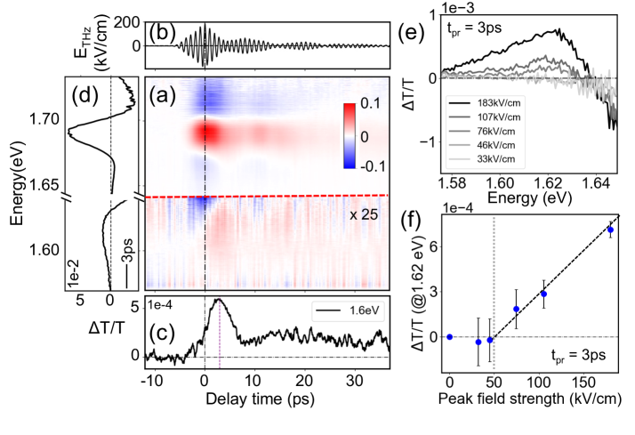
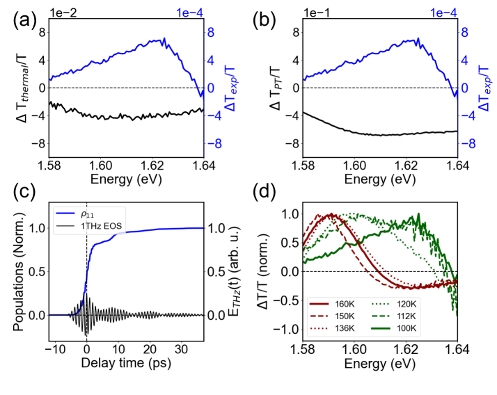
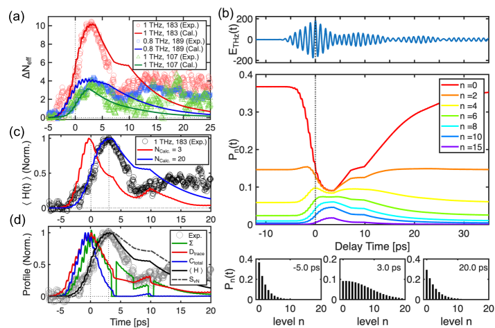
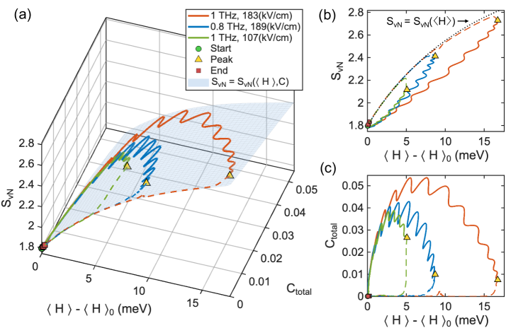
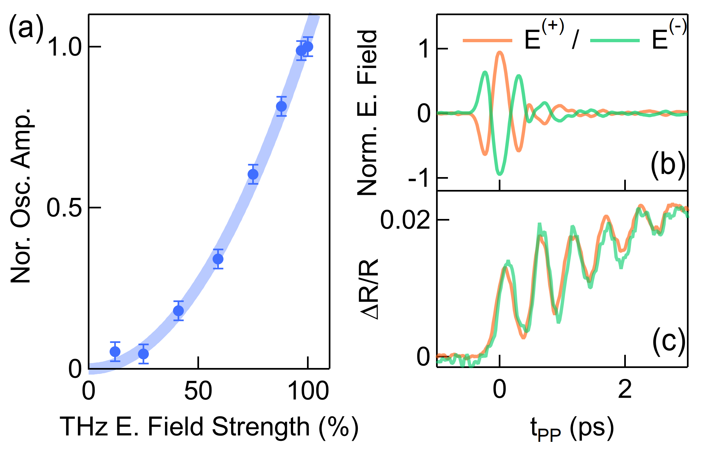
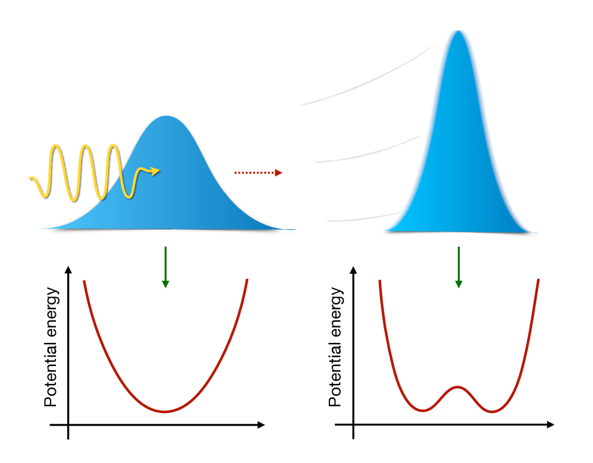
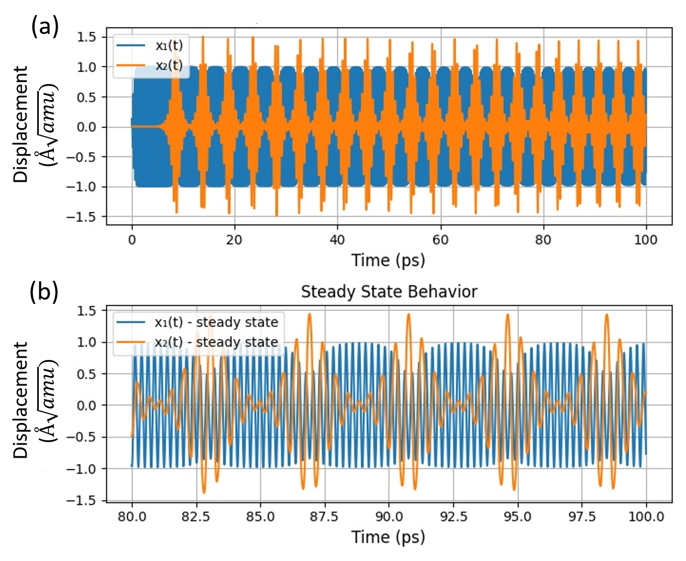

# 強駆動フォノンが拓く量子熱力学の新地平：コヒーレンスという第三の熱力学変数

- **執筆日**: 2026-03-25
- **トピック**: 超高強度THz駆動フォノンの量子熱力学とコヒーレンス拡張型熱力学的閉包
- **注目論文**: 2603.22632
- **参照した関連論文数**: 6本

---

## 1. 導入：なぜ今この話題か

「物質の内側の格子振動を光で直接操る」——この夢が、テラヘルツ（THz）レーザー技術の急速な進歩によって実現しつつある。固体中の原子は静止しているわけではなく、常に集団的な振動、すなわち**フォノン**を行っている。赤外線活性なフォノンモードはその振動方向に電気双極子の変化を伴うため、同じ周波数の電磁波——THz領域に多いこれらのモードでは周波数0.1〜10 THz程度——で共鳴的に励起できる。

2010年代初頭から、Cavalleriグループをはじめとする研究者たちが「非線形フォノニクス（nonlinear phononics）」という新分野を切り拓いてきた。強力なTHzパルスで赤外活性フォノンを大振幅に駆動すると、非線形フォノン-フォノン結合を通じてラマン活性フォノンも励起され、結果として光誘起超伝導、超高速磁気秩序制御、強誘電転移の誘起など、夢のような現象が次々と報告されてきた。しかしその一方で、基礎的な問いは長らく未解決のまま残っていた。

**「強く駆動されたフォノンの熱力学的状態をどう記述するべきか？」**

通常の熱平衡系では「温度」一つで状態が記述できる。しかし非平衡状態では温度という概念そのものが揺らぐ。特に、量子力学的な観点から見ると、強く駆動された系では**量子コヒーレンス**——密度行列の非対角成分——が重要な役割を果たすはずだが、これを熱力学変数として明示的に組み込んだ理論体系はなかった。

2026年3月に公開されたプレプリント [Qu et al., 2603.22632] は、この問いに対する実験的・理論的な答えを初めて与えた。彼らはペロブスカイト型太陽電池材料として知られる MAPbI₃ （メチルアンモニウム鉛ヨウ化物、以下 MAPI）を用い、TELBE 加速器ベースTHz施設の強力なパルスで1 THzフォノンモードを共鳴駆動した。その結果、ある閾値電場を超えると電子的応答に約3 psの特徴的な遅延が現れ、通常の「有効温度」描像では説明できないことを実証した。さらにLindbladマスター方程式による解析から、この系の非平衡状態がエネルギーと量子コヒーレンスの2変数で統一的に記述できる——「コヒーレンス拡張型熱力学的閉包」——ことを初めて示した。

この発見は、フォノン物理学と量子熱力学という二つの分野をつなぐ橋渡しとなる可能性を持ち、量子材料の光制御や量子コンピューティングへの応用においても重要な含意を持つ。

*図1：THz励起実験の概要と閾値以上で現れる約3 psの遅延応答。(a) MAPIのTHzポンプによる差分透過スペクトル、(c) 探針エネルギー1.6 eVでの時間分解応答（遅延が明瞭に見える）。[Qu et al., arXiv:2603.22632, CC BY 4.0]*

---

## 2. 解決すべき問い

### 平衡から遠く離れた量子系をどう記述するか

熱平衡にある系の状態は、温度 $T$ あるいはそれと等価なボルツマン分布

$$P_n = \frac{e^{-E_n/k_BT}}{Z}, \quad Z = \sum_n e^{-E_n/k_BT}$$

で完全に特徴づけられる。ここで $E_n$ は第 $n$ エネルギー準位の固有エネルギー、$k_B$ はボルツマン定数、$Z$ は分配関数である。この枠組みでは**密度行列**（density matrix）の非対角成分はゼロ——量子コヒーレンスは存在しない。

しかし強いTHzパルスが1 THzフォノンモードを共鳴的に駆動すると、フォノンは量子コヒーレントな重ね合わせ状態に置かれる。問題は「このような状態の熱力学的記述に何が必要か」である。

考えられるアプローチはいくつかある。第一は「有効温度 $T_{\rm eff}$」描像：系があたかも高温の平衡状態にいるかのように扱う。第二は「量子コヒーレントな非平衡状態をそのままフルの密度行列 $\rho$ で扱う」アプローチだが、これは膨大な自由度を持ち実用的でない。

Qu ら [2603.22632] が立てた問いはより鋭い：**「フルの密度行列より低次元だが有効温度より高次元な、ちょうどよい記述変数の組が存在するか？」**

具体的には次の3つの問いに集約できる：

1. **閾値以上で何が起きるのか？** — 従来の3準位や有効温度モデルでは説明できない遅延応答の物理的起源は何か？

2. **量子コヒーレンスは熱力学変数として機能するか？** — ボン・ノイマンエントロピー $S_{\rm vN} = -{\rm Tr}[\rho \ln \rho]$ がエネルギーとコヒーレンスの関数として閉じるか？

3. **Lindbladダイナミクスはこれをどこまで記述できるか？** — 開放量子系理論の枠組みで実験結果を再現できるか？

---

## 3. 注目論文は何を新しく示したのか

### 実験：閾値電場と3 psの遅延

Qu ら [2603.22632] の実験装置の核心は、TELBE加速器施設が供給する「狭帯域、超高強度THz光源」である。従来のTHz源と比べて**3桁高い分光輝度**を持ち、ピーク電場190 kV/cm、帯域幅0.1 THz（FWHM）の1 THz近傍パルスを提供する。

試料はMAPI（MAPbI₃）の薄膜であり、温度100 Kで正方晶→斜方晶転移が起きた後の低温相を用いた。この相では1 THz付近に強い赤外活性フォノンモードが存在し、Morseポテンシャルで記述できるアンハーモニックな振動子として振る舞う。

**近赤外（NIR）ポンプ-プローブ分光**によって電子的応答を時間分解した。具体的には、白色光スーパーコンティニューム（800 nm fsパルスから生成）を探針とし、1.55〜1.72 eVのサブギャップ吸収の変化を高速CMOSカメラで分光検出した。

主要な観測結果は以下の2点である：

**（1）閾値電場の存在**：THz電場が〜50 kV/cm 以下では、通常のフォノン-電子結合の枠組みで説明できる応答が見られる。しかしこの閾値を超えると、電子的応答の立ち上がりに**〜3 ps の顕著な遅延**が現れる（図1）。

**（2）代替説明の棄却**（図2）：考えられる代替説明——（a）THz吸収による単純な加熱、（b）相転移の誘起、（c）Franz-Keldysh効果——を丁寧に排除。温度依存性の差分透過スペクトルとの比較、光学的ブロッホ方程式による解析を通じて、どれも3 psの遅延を説明できないことを示した。

*図2：3 ps遅延が単純な加熱や相転移では説明できないことを示す比較実験。[Qu et al., arXiv:2603.22632, CC BY 4.0]*

### 理論：20準位Lindbladモデルと参加数の爆発

遅延の真の起源を理解するため、著者らはフォノンを**開放量子系**として扱う**Lindbladマスター方程式**

$$\dot{\rho} = -\frac{i}{\hbar}[H, \rho] + \sum_k \left(L_k \rho L_k^\dagger - \frac{1}{2}\{L_k^\dagger L_k, \rho\}\right)$$

を解いた。ここで $H$ はMorseポテンシャルによるアンハーモニックフォノンのハミルトニアン（THz電場との結合を含む）、$L_k$ は環境（格子浴）との結合を表すジャンプ演算子である。

Morseポテンシャルのハミルトニアンをアンハーモニシティパラメータ $\chi_e$ を用いて書くと：

$$H_0 = \hbar\omega_0\left[\left(n+\frac{1}{2}\right) - \chi_e\left(n+\frac{1}{2}\right)^2\right]$$

$\omega_0$ は調和項の角振動数、$n = a^\dagger a$ は数演算子。アンハーモニシティにより**高準位ほど準位間隔が狭くなり**、強く駆動するほど多くの準位が有効に関与する。

どれだけ多くの準位が関与しているかを定量化する**有効参加数（effective participation number）**：

$$N_{\rm eff}(t) = \left(\sum_n P_n(t)^2\right)^{-1}, \quad P_n(t) = \rho_{nn}(t)$$

は、閾値電場以下では $N_{\rm eff} \approx 2$〜$3$（数準位のみ関与）だが、閾値を超えると $N_{\rm eff}$ が急増する。

*図3：Lindbladシミュレーションと実験の比較。（c）20準位モデルは3 ps遅延を再現するが、3準位打ち切りは失敗する。（d）エントロピー、コヒーレンス、エネルギー、参加数の時間発展。[Qu et al., arXiv:2603.22632, CC BY 4.0]*

**20準位モデルは実験の3 ps遅延を再現し、3準位打ち切りモデルは失敗する**——これが多準位関与の直接証拠である。

### 核心的発見：コヒーレンス拡張型熱力学的閉包

最も重要な結果は**図4**に示される「熱力学的閉包（thermodynamic closure）」だ。

考察する量として：
- **エネルギー** $\langle H \rangle = {\rm Tr}[\rho H]$
- **量子コヒーレンス** $C_{\rm total}(t) = \sum_{n \neq m} |\rho_{nm}(t)|^2$（密度行列の非対角成分の総和）
- **ボン・ノイマンエントロピー** $S_{\rm vN}(t) = -{\rm Tr}[\rho \ln \rho]$

著者らは、異なる3種類の駆動条件（共鳴・非共鳴・異なる電場強度）での密度行列の時間発展軌跡を計算した。各軌跡は高次元の密度行列空間を動くが、驚くべきことに、**これらすべての軌跡が $(\langle H \rangle, C_{\rm total})$ 平面上の一つの曲面に折り畳まれる**。すなわち：

$$S_{\rm vN} = S_{\rm vN}\!\left(\langle H \rangle,\, C_{\rm total}\right)$$

という関係が成立する。これが「コヒーレンス拡張型熱力学的閉包」の意味である。

従来の有効温度描像では、エネルギーが同じでも異なる位相を持つ状態が区別できない（すべて同一の有効温度に対応してしまう）。しかし $C_{\rm total}$ を加えることでこの縮退が解け、非平衡状態が一意に特定できる。

*図4：3種類の駆動条件での密度行列軌跡がエネルギー-コヒーレンス-エントロピーの曲面に収束する様子。左：エントロピー-エネルギー双曲線の破れ（コヒーレンスの寄与）、右：コヒーレンスで縮退が解ける。[Qu et al., arXiv:2603.22632, CC BY 4.0]*

---

## 4. 背景と文脈：この注目論文はどこに位置づくか

### 非線形フォノニクスの系譜

2011年頃、Cavalleriグループは光学的非線形フォノン-フォノン結合を利用した「非線形フォノニクス」の概念を提唱した。強力な中赤外（MIR）または遠赤外パルスで特定の**赤外活性フォノン**を大振幅に励起すると、非線形結合により**ラマン活性フォノン**も準静的に変位し、結晶構造の変化が起きる。これをトリガーに光誘起超伝導（K₃C₆₀、YBa₂Cu₃O₇等）、磁気秩序の超高速切り替え、フェロ電気転移の誘起などが報告されてきた。

2026年3月のプレプリント [Simon et al., 2603.18182] は、この文脈をさらに推し進め、**第一原理計算**でK₃C₆₀やLaH₁₀における光誘起超伝導を定量的に再現することに成功した。彼らのアプローチは、実時間軸のMigdal-Eliashberg方程式を数値的に解くもので、光励起後のキャリアが電子-フォノン結合の強い状態に共鳴的に移行することが光誘起超伝導の本質だと示した。

このような「フォノンを光で制御して新しい相を実現する」研究の流れにおいて、Qu ら [2603.22632] の仕事は重要な基礎的問いに答える。**「強く駆動されたフォノンモードの熱力学的状態は何か？」**——この答えなしには、なぜ光誘起相転移が起きたり起きなかったりするかを理解することは難しい。

### THz技術の進歩とTELBE施設

フォノンの強非線形駆動を実現するには、THz帯域における高強度・狭帯域な光源が必要である。従来のTHz技術は非線形結晶やアンテナを用いたものが主流で、ピーク電場は数kV/cmが限界だった。しかし加速器ベースのTHz施設が登場し、状況は一変した。

ドイツのHelmholtz-Zentrum Dresden-Rossendorfに設置された**TELBE**（Transiently Emitting Linac Based Emitter）は、自由電子レーザーの原理を利用したTHz超放射光源であり、1 THz近傍で**190 kV/cmのピーク電場**、従来比**1000倍の分光輝度**を実現する。これにより、フォノンを量子力学的な多準位状態に持ち込むことが初めて可能になった。

### MAPIペロブスカイトとそのフォノン特性

MAPI（MAPbI₃）は現在最も研究されている**有機-無機ハイブリッドペロブスカイト**の代表格であり、太陽電池材料として急速に発展している材料だ。この材料が非線形フォノニクスの研究対象として特に適している理由がある。

第一に、1 THz付近に**アンハーモニシティの大きな軟モードフォノン**が存在する。Morseポテンシャルのアンハーモニシティパラメータ $\chi_e = 1.7 \times 10^{-4}$ は通常の固体より1桁程度大きく、これが強駆動時の多準位関与を促進する。

第二に、**有機カチオン（CH₃NH₃⁺）の回転運動**がフォノンに特殊な散逸経路を与える。これがLindbladモデルで記述される「浴との結合」に対応する。

同様の「有機-無機ペロブスカイトにおけるTHz非線形フォノニクス」のアプローチは、Urban ら [2503.02529] が2D層状ハイブリッドペロブスカイトに適用し、THz駆動によるフォノン指紋（phonon fingerprints）から隠れた反転対称性破れを観測している。これは、THz非線形フォノニクスが2D系での対称性探索にも有効であることを示す。

---

## 5. メカニズム・解釈・比較

### なぜ「3 ps」という時間スケールが現れるか

3 ps という遅延時間の物理的起源は、**多準位への励起の広がり**に求められる。

閾値以下の弱い駆動では、フォノン系は2〜3準位間を振動するコヒーレントな運動（Rabi振動に類似）をする。この場合、電子的応答はTHz励起とほぼ同時に現れる。

閾値以上の強い駆動になると、アンハーモニシティにより高準位ほど準位間隔が狭まるため、系は梯子を上るように多くの準位へ**ポピュレーションが広がっていく**。この過程に要する時間が〜3 psであり、その間は電子的応答が遅延する。これを定量化したのが有効参加数 $N_{\rm eff}(t)$ である：

$$N_{\rm eff}(t) = \left(\sum_n [\rho_{nn}(t)]^2\right)^{-1}$$

弱駆動では $N_{\rm eff} \approx 1$〜$2$（数準位のみ）、強駆動では時間とともに増大し最終的に $N_{\rm eff} \sim 10$ 以上に達する。

### Lindbladモデルの検証と非Markovian効果

Lindbladマスター方程式による20準位モデルは実験を定量的に再現する。しかし同月に公開されたErikssonら [2603.08027] の研究は、この記述をより精緻化する視点を与えている。

彼らは大規模分子動力学シミュレーションを用いてフォノン浴の「ノイズカーネル」と「散逸カーネル」を直接計算し、Markovian（記憶のない）とnon-Markovian（記憶のある）ダイナミクスの間の移行がピコ秒時間スケールで起きることを示した。

具体的には、フォノン-浴の結合が弱い場合はLindbladマスター方程式（Markovian近似）が良い近似だが、結合が強い場合は浴の記憶効果（non-Markovian性）が重要になる。さらに興味深いことに、**individual phonon modeの動力学から熱産生を直接推論できる**ことも示しており、これはQu ら [2603.22632] の実験での熱力学的解析を補完する結果だ。

### THz非線形フォノニクスの別の例：スピンラダー系NaV₂O₅

同様のTHz非線形フォノニクスが異なる材料系でも観測されている。Giorgianni ら [2512.03691] はスピンラダー化合物 α'-NaV₂O₅ において、単色THzパルスで**ゾーン折り畳みラマン活性フォノン**を共鳴的に励起することに成功した。

このプロセスは**IRRS（Infrared-Raman Sum-difference Scattering）**と呼ばれ、まず赤外活性フォノン（IRフォノン）がTHzパルスで励起され、それとのアンハーモニック結合を通じてラマン活性フォノンが間接的に励起される非線形過程である。

励起されたラマンフォノンの振幅の**THz電場強度に対する2乗スケーリング**（$A_{\rm Raman} \propto E_{\rm THz}^2$）を観測し（図3に示す）、これが2次過程（IRRS）の証拠であることを実証した。

*図3：α'-NaV₂O₅におけるラマン活性フォノン励起振幅のTHz電場強度依存性。2乗スケーリング（$E^2$）が非線形フォノニクス機構の証拠。[Giorgianni et al., arXiv:2512.03691, CC BY 4.0]*

MAPIとNaV₂O₅を比較すると、共通点は「THz電場による非線形フォノン動力学」であるが、物理的機構は異なる。MAPIではアンハーモニシティによる多準位量子状態の生成、NaV₂O₅ではIR-ラマン非線形結合によるゾーン折り畳みフォノンの選択的励起。どちらも「THz光場と格子の非線形結合」を扱うが、量子熱力学的描像が求められるのは特に多準位関与が著しいMAPIの場合だ。

### 量子フォノニクスの理論的側面：フォノン圧搾と量子揺らぎ

非線形フォノニクスをより量子力学的な視点で扱ったのがLibbi & Kozinsky [2512.04041]の「量子非線形フォノニクスの理論」だ。

*図1：強いTHzパルスでフォノンモードを変位させると格子揺らぎが圧搾（squeezing）される様子の概念図。[Libbi & Kozinsky, arXiv:2512.04041, CC BY 4.0]*

通常の量子調和振動子では、位置の分散（量子揺らぎ）は常に零点揺らぎ以上の値をとる。しかしLibbi らは**4次の非調和性まで厳密に扱った解析的枠組み**を構築し、「平衡位置からフォノンモードを変位させる強いパルスが、格子の量子揺らぎを圧搾（squeezing）する」ことを示した。すなわち：

$$\langle (\Delta \hat{x})^2 \rangle < \langle (\Delta \hat{x})^2 \rangle_{\rm zero-point}$$

この**フォノン圧搾**は量子情報処理の観点から重要で、フォノンモードをスクイーズド状態（squeezed state）として操作できる可能性を示す。また強誘電性量子常誘電体（quantum paraelectric）材料——SrTiO₃ など——での光誘起強誘電転移とも関連する。

Qu ら [2603.22632] の研究では**密度行列の非対角成分**（コヒーレンス）が重要な役割を果たすことが示されたが、Libbi らの枠組みでは**量子揺らぎの圧搾**という別の量子効果が前面に出る。どちらも「強く駆動された格子の量子的性質」を扱っており、今後これらの枠組みの統合が課題となる。

---

## 6. 材料・手法・応用への広がり

### フォノニックな周波数コムへの展開

Qu ら [2603.22632] が示した「強く駆動されたフォノンが量子多準位状態に遷移する」という描像は、集団的な非線形フォノン動力学と密接に関係する。その先の展開として、Rangwala & Ganesan [2602.07462] が InMnO₃ における**固体状態フォノニック周波数コム**を報告している。

*図1：InMnO₃ におけるTHz駆動による Higgs モード（振幅モード）と Goldstone モード（位相モード）の非線形結合によって生成されるフォノニック周波数コム。[Rangwala & Ganesan, arXiv:2602.07462, CC BY 4.0]*

光学分野の「光周波数コム」がレーザー技術に革命をもたらしたように、固体中のフォノンで等間隔周波数コムが形成できれば、THz計測・通信への応用が開ける。彼らは連立運動方程式を数値的に解き、THz駆動がHiggsモードを通じてGoldstoneモードを励起し、両者の非線形結合によりコム構造が生まれることを示した。コム間隔はTHz電場強度や減衰定数でチューナブルであり、材料設計の方向性も示唆している。

これはQu ら [2603.22632] が発見した「多準位量子状態の生成」の集団的・古典的極限に相当するとも解釈でき、量子効果が重要な微弱駆動域と古典的集団モードが支配する強駆動域との架け橋を描いている。

### 光誘起量子相転移へのリンク

「フォノンの熱力学的状態を理解する」ことの最終的な応用として、光誘起超伝導や光誘起量子相転移がある。Simon ら [2603.18182] は、K₃C₆₀フラーレン化合物での光誘起超伝導を第一原理計算で再現した。彼らのメカニズムは「MIRパルスがフォノンを変位させ、電子-フォノン結合の強い状態にキャリアを共鳴的に遷移させる」というもので、Migdal-Eliashberg方程式の実時間軸解法で定量的に確認された。

この記述では「フォノンがどのような熱力学的状態にあるか」が超伝導ギャップの大きさや持続時間に直接影響する。Qu ら [2603.22632] が確立した「コヒーレンス拡張型熱力学的記述」は、光誘起超伝導の微視的理論と接続することで、どのような駆動条件が超伝導を促進するかを予測する枠組みを提供しうる。

また量子幾何学的観点から、Hu ら [2508.03257] は光誘起コヒーレントフォノンの生成が**電子-フォノン結合のシフトベクトル**と**量子幾何テンソル**に根ざした量子幾何学的過程であることを示した。非中心対称結晶（BaTiO₃、SnSe等）での強誘電分極制御がフォノン光誘起で実現できる可能性を示しており、これも「フォノンを量子状態として精密制御する」という方向性と合致する。

---

## 7. 基礎から理解する

### 7.1 フォノンとは何か

固体中の原子は互いに結合しており、平衡位置からのずれが隣の原子へと伝わる。この集団的振動の量子を**フォノン（phonon）**と呼ぶ。量子調和振動子として扱うと、フォノンのエネルギーは：

$$E_n = \hbar\omega\left(n + \frac{1}{2}\right), \quad n = 0, 1, 2, \ldots$$

$\omega$ は振動の角周波数、$\hbar$ はプランク定数を $2\pi$ で割ったもの。$n$ はフォノンの**個数（occupation number）**で、$n=0$ が**零点振動**状態（最も低いエネルギー状態）。

固体では「並進運動を扱う音響フォノン」と「光学活性な光学フォノン」に分類される。THz領域（0.1〜10 THz）には光学フォノンが多く存在し、MAPIの1 THzモードも光学フォノンの一種だ。

### 7.2 アンハーモニシティとMorseポテンシャル

現実の固体では原子間ポテンシャルは調和振動子（放物線）でなく、非対称な**アンハーモニック**形状をとる。この効果を最もシンプルに表すのが**Morseポテンシャル**：

$$V(x) = D_e\left(1 - e^{-\alpha x}\right)^2$$

ここで $D_e$ は結合解離エネルギー、$\alpha$ はポテンシャルの幅を決めるパラメータ。このポテンシャルの準位間隔は

$$\Delta E_n = \hbar\omega_0\left[1 - 2\chi_e(n+1)\right]$$

と**$n$ の増大とともに徐々に狭くなる**（$\chi_e > 0$）。この「ラダー上の段差が均一でない」性質が、強い駆動による多準位励起の鍵だ。

### 7.3 Lindbladマスター方程式

量子力学系が環境（浴）と弱く結合している場合、系の時間発展を記述する有力な枠組みが**Lindbladマスター方程式**だ：

$$\frac{d\rho}{dt} = -\frac{i}{\hbar}[H, \rho] + \sum_k \gamma_k \left(L_k \rho L_k^\dagger - \frac{1}{2}\{L_k^\dagger L_k, \rho\}\right)$$

各項の意味：
- $-\frac{i}{\hbar}[H, \rho]$：ハミルトニアン $H$ による系のユニタリ（可逆な）発展
- $L_k$：**ジャンプ演算子（jump operator）**——環境との結合を通じた量子ジャンプ（例：フォノンの放出 $L_k = a$、吸収 $L_k = a^\dagger$）
- $\gamma_k$：ジャンプレート（緩和率）
- $\{A, B\} = AB + BA$：反交換子

この方程式はMarkovian近似（浴の記憶時間が系の緩和時間より十分短い場合）のもとで成立し、密度行列の完全正値・トレース保存な時間発展を保証する。

### 7.4 ボン・ノイマンエントロピーと量子コヒーレンス

**ボン・ノイマンエントロピー（von Neumann entropy）**は量子情報の「乱雑さ」を測る量：

$$S_{\rm vN} = -{\rm Tr}[\rho \ln \rho] = -\sum_i \lambda_i \ln \lambda_i$$

ここで $\lambda_i$ は密度行列 $\rho$ の固有値。純粋状態（$\rho = |\psi\rangle\langle\psi|$）では $S_{\rm vN} = 0$、最大混合状態では $S_{\rm vN} = \ln N$（$N$ は次元数）。

熱平衡状態では $S_{\rm vN}$ は熱力学的エントロピー $S = k_B \ln Z + E/T$ と一致する。しかし非平衡状態では必ずしも一致しない。

**量子コヒーレンス（quantum coherence）**は密度行列の非対角成分で測られる：

$$C_{\rm total}(t) = \sum_{n \neq m} |\rho_{nm}(t)|^2$$

$C_{\rm total} = 0$ は密度行列が対角（純粋なポピュレーション分布）であることを意味し、$C_{\rm total} > 0$ は量子的重ね合わせ状態が存在することを示す。

Qu ら [2603.22632] の核心的発見は、**$S_{\rm vN}$、$\langle H \rangle$、$C_{\rm total}$ の3量がひとつの曲面関係で結ばれる**ことだ。これは量子コヒーレンスが独立した熱力学変数として機能することを示す初めての実証的証拠だ。

### 7.5 熱力学的閉包とは何か

「熱力学的閉包（thermodynamic closure）」とは、高次元の微視的変数（ここでは密度行列の全要素）が少数の巨視的変数で完全に記述できる（「閉じる」）ことを意味する。

熱平衡では閉包は単純：エネルギー $E$ だけで密度行列が一意に決まる（正準分布）。つまり $S = S(E)$ という1変数関数で閉じている。

非平衡ではこの閉包が一般的には成立しない——高次元の密度行列は原理的に膨大な自由度を持つ。しかし Qu ら は、特定の物理条件下（弱アンハーモニック開放フォノン系）で：

$$S_{\rm vN} = f(\langle H \rangle, C_{\rm total})$$

という**コヒーレンスを加えた2変数閉包**が実現することを示した。これは「量子コヒーレンスを熱力学の第三の変数」として認める一般化熱力学理論への扉を開く。

---

## 8. 重要キーワード10個の解説

**1. フォノン（phonon）**
固体中の格子振動の量子。エネルギー $E_n = \hbar\omega(n + 1/2)$ を持つボーズ粒子（boson）。$n$ はフォノン数演算子 $\hat{n} = a^\dagger a$ の固有値で、$a, a^\dagger$ はフォノンの消滅・生成演算子。調和近似では準位間隔は均一だが、アンハーモニシティにより高次準位ほど狭くなる。

**2. テラヘルツ（THz）分光**
0.1〜10 THz（波長30〜3000 μm）の電磁波を用いた分光法。固体の光学フォノン・フォノンポラリトン・ソフトモードはこの帯域に存在することが多い。THz時間領域分光（THz-TDS）では電場波形 $E(t)$ を直接測定でき、複素誘電関数を位相情報込みで得られる。近年の加速器ベースTHz源（TELBE等）は $10^6 〜 10^{10}$ V/m 級の高電場を実現。

**3. 非線形フォノニクス（nonlinear phononics）**
強い電磁波で赤外活性フォノンを大振幅に励起し、非線形フォノン-フォノン結合を通じて物質状態を制御する手法。結合係数 $g$ を用いると、赤外モード $Q_{\rm IR}$ とラマンモード $Q_{\rm R}$ の結合は $V_{\rm coupl} \approx g Q_{\rm IR}^2 Q_{\rm R}$ で記述され、$Q_{\rm IR}$ が大きくなると準静的に $Q_{\rm R}$ が変位する。これにより結晶構造変化、超伝導、磁性変化が誘起できる。

**4. Lindbladマスター方程式**
開放量子系の時間発展を記述するマスター方程式の標準形。密度行列 $\rho$ の時間発展を：
$$\dot{\rho} = \mathcal{L}[\rho] = -\frac{i}{\hbar}[H,\rho] + \sum_k (L_k \rho L_k^\dagger - \frac{1}{2}\{L_k^\dagger L_k, \rho\})$$
と書く。Markovian近似（浴の相関時間が系の緩和時間より十分短い）のもとで成立し、完全正値・トレース保存な時間発展を保証する。

**5. ボン・ノイマンエントロピー（von Neumann entropy）**
量子系の「混合度」を測るエントロピー：$S_{\rm vN} = -{\rm Tr}[\rho \ln \rho] = -\sum_i \lambda_i \ln \lambda_i$（$\lambda_i$ は $\rho$ の固有値）。純粋状態では $S_{\rm vN} = 0$、熱平衡状態では熱力学エントロピーに一致。量子情報理論でのエントロピーの基本量であり、Qu ら [2603.22632] では非平衡フォノン状態の熱力学変数として機能することが示された。

**6. 量子コヒーレンス（quantum coherence）**
密度行列 $\rho$ の非対角成分 $\rho_{nm}$ ($n \neq m$) が存在する状態。量子重ね合わせ状態にある指標。Qu ら が用いた全コヒーレンス量は $C_{\rm total} = \sum_{n \neq m}|\rho_{nm}|^2$。環境との相互作用（デコヒーレンス）によって時間とともに減少するが、THzパルスによる強制駆動の間は有限に保たれる。

**7. 有効参加数（effective participation number）**
$N_{\rm eff}(t) = (\sum_n P_n^2)^{-1}$（$P_n = \rho_{nn}$）。有効的に占有されている量子状態の個数を測る。$N_{\rm eff} = 1$ は単一状態に集中、$N_{\rm eff} = N$ は全準位に均等分布を意味する。逆参加率（IPR）の逆数としても知られ、局在-非局在転移の指標として量子多体系でも用いられる。

**8. アンハーモニシティ（anharmonicity）**
原子間ポテンシャルの調和近似からのずれ。Morseポテンシャルでは高次準位ほど準位間隔 $\Delta E_n = \hbar\omega_0[1 - 2\chi_e(n+1)]$ が縮小するパラメータ $\chi_e$ で特徴づけられる。熱膨張・熱伝導・格子緩和・フォノン寿命の温度依存性などに本質的な役割を果たす。MAPIでは $\chi_e \sim 10^{-4}$（通常の固体の数倍〜1桁大）。

**9. フォノン圧搾（phonon squeezing）**
量子フォノン状態における位置（または運動量）の不確定性を、もう一方を犠牲にして零点揺らぎ以下に減少させる操作。数式では $\langle(\Delta \hat{x})^2\rangle < \langle(\Delta \hat{x})^2\rangle_{\rm ZPF}$ を実現すること。光のスクイーズドステートの類似体であり、Libbi & Kozinsky [2512.04041] は非線形フォノニクスによる強駆動でこれが自然に実現されることを理論的に示した。

**10. 熱力学的閉包（thermodynamic closure）**
高次元の微視的状態空間（密度行列全体）が少数の巨視的変数の関数として閉じる性質。熱平衡では $S = S(E)$（エネルギーのみの1変数閉包）。Qu ら [2603.22632] は強駆動フォノン系において $S_{\rm vN} = f(\langle H \rangle, C_{\rm total})$（エネルギー＋コヒーレンスの2変数閉包）が成立することを発見した。これは非平衡量子系の縮約された熱力学記述の実験的確立として重要な意味を持つ。

---

## 9. まとめと今後の論点

### まとめ

強力なTHzパルスで格子振動（フォノン）を共鳴的に駆動する「非線形フォノニクス」の実験が、量子熱力学の基礎的な問いに答える舞台となった。

Qu ら [2603.22632] はペロブスカイト MAPI の1 THzフォノンモードを TELBE 施設で強駆動し、閾値電場（〜50 kV/cm）以上で電子応答に〜3 psの特徴的遅延が現れることを発見した。20準位Lindbladモデルはこの遅延を定量的に再現し、その起源がMorseポテンシャルのアンハーモニシティによる**多量子準位への集団励起**であることを明らかにした。

最大の発見は「コヒーレンス拡張型熱力学的閉包」：ボン・ノイマンエントロピー $S_{\rm vN}$ がエネルギー $\langle H \rangle$ と量子コヒーレンス $C_{\rm total}$ の2変数関数として統一的に記述できる。**量子コヒーレンスが独立した熱力学変数として機能する**という実験的実証は、量子熱力学の理論的枠組みに新たな基盤を与える。

周辺の研究と合わせると、

- スピンラダー系 NaV₂O₅ でのTHz非線形フォノニクス [2512.03691] は、同種の効果が有機-無機ペロブスカイト以外でも普遍的に観測されることを示す
- 量子非線形フォノニクスの理論 [2512.04041] は強駆動によるフォノン圧搾という量子効果の理論的基盤を与える
- 非Markovian熱産生の理論 [2603.08027] はLindbladモデルの限界を押し広げる
- フォノニック周波数コム [2602.07462] はフォノン非線形効果の応用への展開を示す
- 光誘起超伝導の第一原理計算 [2603.18182] は最終的な応用目標としての光制御量子相転移を示す

という重層的な研究景観が浮かび上がる。

### 今後の論点

**論点1: コヒーレンス拡張型閉包の普遍性**
Qu ら [2603.22632] が示した2変数閉包は、MAPIのMorseポテンシャルフォノンという特定の系で実証された。これが他の材料系（NaV₂O₅、SrTiO₃等）や多モード系でも成立するかは未検証だ。特に複数のフォノンモードが結合する場合、閉包の次元（変数の数）は増えるのか、それとも何らかの普遍性があるのかは重要な問いだ。

**論点2: 量子コヒーレンスの実験的直接測定**
現状の実験では $C_{\rm total}$ は理論（Lindbladシミュレーション）から推定している。これを直接測定する手法——例えばフォノン状態のホモダイン検出、フォノン状態トモグラフィーなど——の開発が重要な課題だ。

**論点3: 非Markovian効果と閉包の破れ**
Eriksson ら [2603.08027] が示すように、浴との結合が強い場合はMarkovian近似が破れる。この場合、コヒーレンス拡張型閉包はどこまで成立するか。記憶効果（non-Markovian）をパラメータとして閉包の精度を系統的に調べることで、閉包の適用条件が明らかになる。

**論点4: フォノン圧搾と量子技術への応用**
Libbi & Kozinsky [2512.04041] のフォノン圧搾理論は、固体フォノンを「量子資源」として活用する可能性を示す。量子センシング（フォノン版GW干渉計）、量子メモリ、量子通信への応用が理論的には考えられるが、実験的実証はこれからだ。

**論点5: 光誘起超伝導・相転移の微視的制御**
Simon ら [2603.18182] の光誘起超伝導の理解と、Qu ら の熱力学的記述を接続することで、「どのような量子熱力学的状態のフォノンが相転移を最も効率的に誘起するか」を定量的に予測できるようになると期待される。これはエネルギー効率の高い超高速物性制御技術の設計指針になりうる。

---

## 10. 参考にした論文一覧

| # | arXiv ID | タイトル | 著者（代表） | ライセンス | 役割 |
|---|----------|---------|------------|----------|------|
| 1 | [2603.22632](https://arxiv.org/abs/2603.22632) | Generalized thermodynamic closure in ultrafast phonon dynamics | Qu et al. | CC BY 4.0 | **注目論文（anchor）** |
| 2 | [2512.04041](https://arxiv.org/abs/2512.04041) | Quantum theory of nonlinear phononics | Libbi & Kozinsky | CC BY 4.0 | 理論的背景（フォノン圧搾） |
| 3 | [2512.03691](https://arxiv.org/abs/2512.03691) | THz light driven coherent excitation of a zone-folded Raman-active phonon mode in α'-NaV₂O₅ | Giorgianni et al. | CC BY 4.0 | 実験的比較（別材料系） |
| 4 | [2603.08027](https://arxiv.org/abs/2603.08027) | Non-Markovian heat production in ultrafast phonon dynamics | Eriksson et al. | arXiv standard | 補完的理論（非Markovian） |
| 5 | [2602.07462](https://arxiv.org/abs/2602.07462) | Spontaneous Symmetry Breaking and Collective Higgs–Goldstone Dynamics in Solid-State Phononic Frequency Combs | Rangwala & Ganesan | CC BY 4.0 | 応用・拡張（周波数コム） |
| 6 | [2503.02529](https://arxiv.org/abs/2503.02529) | THz-Driven Coherent Phonon Fingerprints of Hidden Symmetry Breaking in 2D Layered Hybrid Perovskites | Urban et al. | CC BY-NC-ND 4.0 | 関連実験（2Dペロブスカイト） |
| 7 | [2508.03257](https://arxiv.org/abs/2508.03257) | Microscopic Theory of Light-Induced Coherent Phonons Mediated by Quantum Geometry | Hu et al. | arXiv standard | 理論的背景（量子幾何） |
| 8 | [2603.18182](https://arxiv.org/abs/2603.18182) | Ultrafast dynamics and light-induced superconductivity from first principles | Simon et al. | arXiv standard | 応用への広がり（光誘起超伝導） |

---

*本記事の図（注目論文および関連論文から引用）はすべて CC BY 4.0 ライセンスの下で公開されているものを使用しました。図の使用にあたっては元論文の著者・arXiv ID を明記するという帰属義務（attribution）を果たしています。*

*primary broad area: フォノン・熱輸送 / secondary broad area: 非平衡ダイナミクス*
