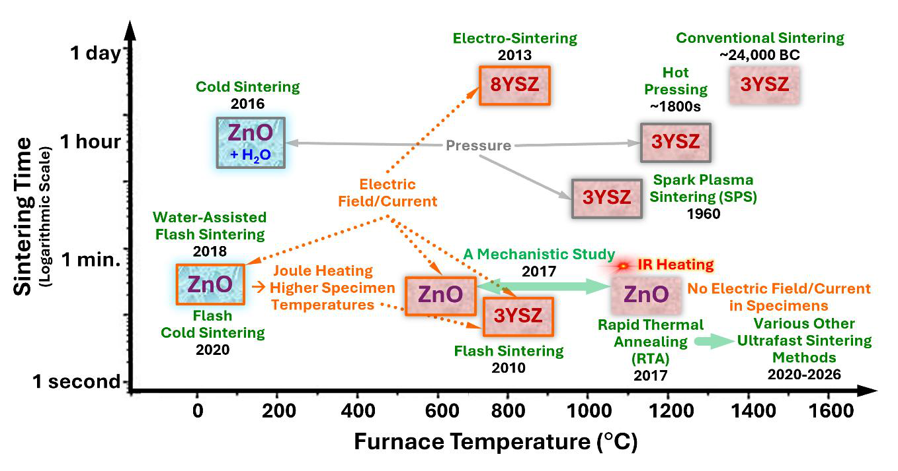
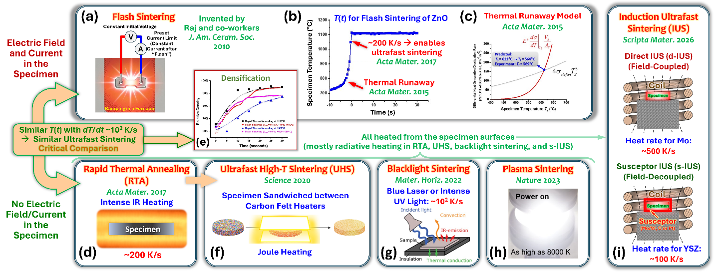
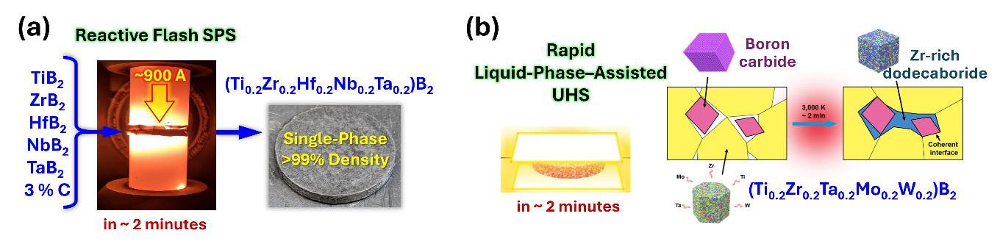
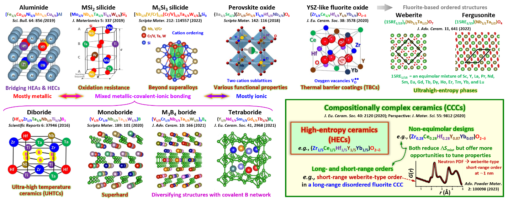
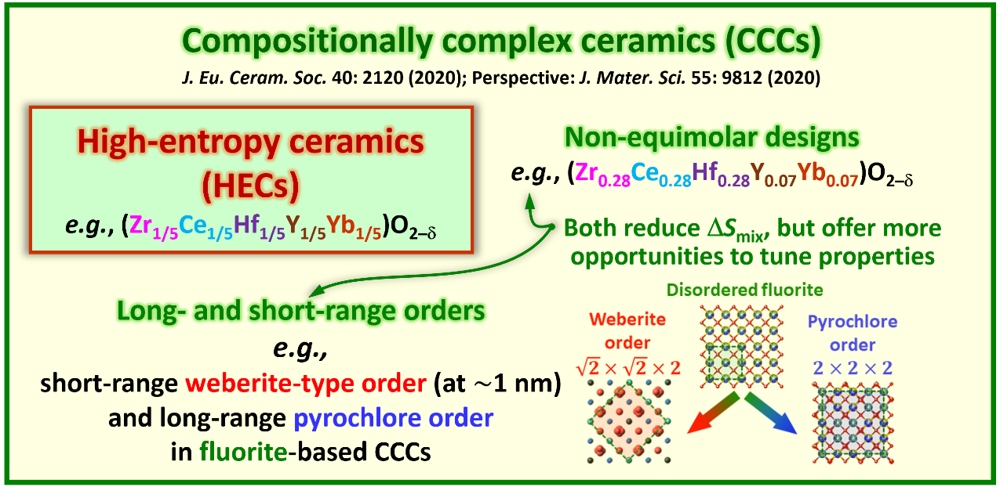
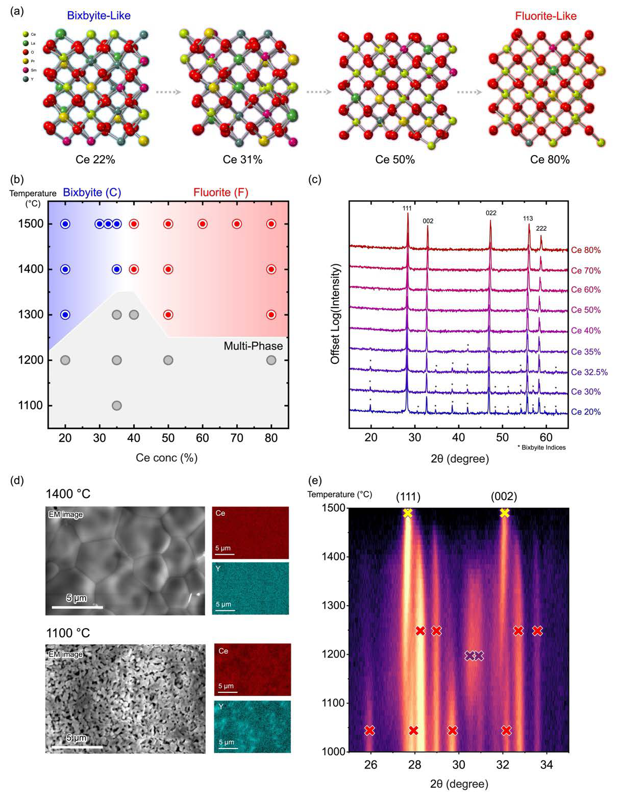
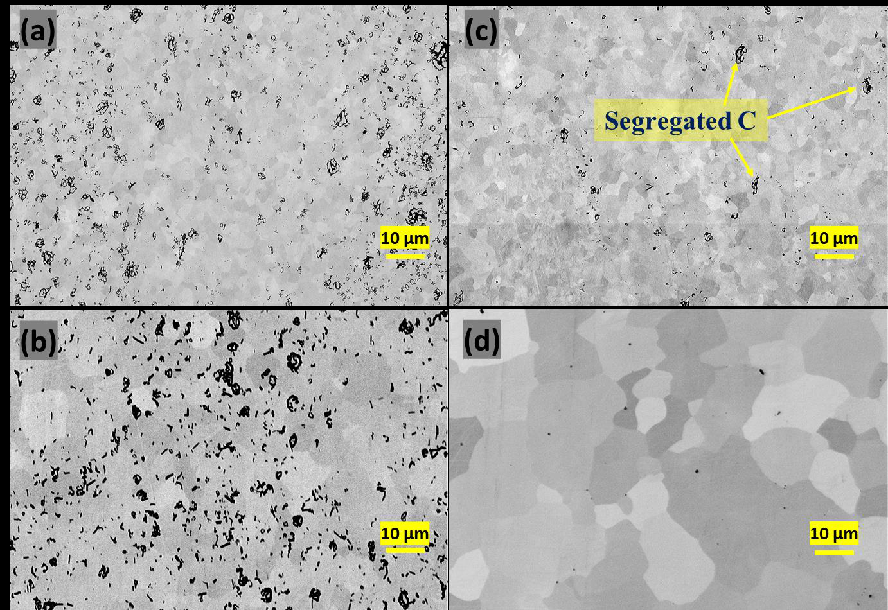
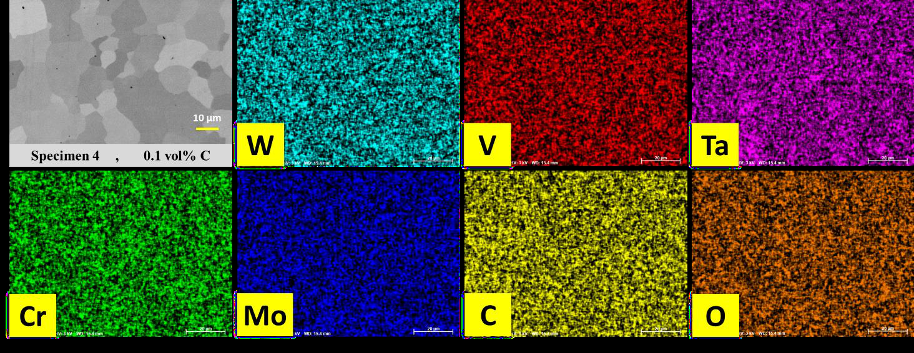

# 超高速焼結と高エントロピーセラミックス — 超高速プロセスが拓く材料創製の新地平

- **執筆日**: 2026-03-25
- **トピック**: 超高速焼結（フラッシュ焼結・UHS・BLS など）と高エントロピー／組成複合型セラミックスの高速合成
- **注目論文**: 2603.23423
- **参照した関連論文数**: 6本

---

## 1. 導入：なぜ今この話題か

セラミックスの焼結（sintering）は、人類が火を制御するようになった約26,000年前から利用してきた最も古い製造技術の一つである。現在に至っても、従来の焼結プロセスは800〜2000 °C で数時間から数十時間にわたる加熱を必要とする。これは莫大なエネルギー消費とCO₂排出を伴い、コスト的にも環境的にも課題がある。

一方、2010年代以降、材料科学の最前線では「高エントロピー合金（HEA）」に触発された**高エントロピーセラミックス（HEC）**が急速に発展している。HECは5種以上の元素を等モル比で固溶させた多主成分セラミックスであり、超高温耐性、低熱伝導率、化学的安定性など、単一成分では得られない特性を示す。しかし、HECの組成空間は広大（元素の組み合わせが無数に存在）であり、従来の長時間焼結では高スループットな探索は事実上不可能である。

ここで登場するのが**超高速焼結（ultrafast sintering）**だ。わずか数秒から1分程度でセラミックスを高密度化するこの技術群は、エネルギー効率の改善にとどまらず、**高エントロピー・組成複合型セラミックスの高スループット材料探索プラットフォーム**としての潜在力を持つ。

2026年3月、カリフォルニア大学サンディエゴ校のJian Luo教授が*Engineering Transformative Materials*誌の創刊号に投稿したPerspective論文「Ultrafast Sintering」（arXiv:2603.23423）は、この分野の最前線を俯瞰的にまとめた重要論文である。Luo教授はフラッシュ焼結の機構解明に中心的に貢献してきた研究者であり、本論文は超高速焼結の全体像と今後の展望を示す羅針盤となる。

本記事では、この注目論文を核として、周辺の関連研究（高エントロピーセラミックスの概念的発展 [2510.05629]、高エントロピー炭化物の特性評価 [2510.13130]、超高温セラミックスの計算的弾性チューニング [2512.13204]、高エントロピー酸化物の相変態 [2512.03881]、エントロピー安定化酸化物の局所構造 [2507.03804]）を交えながら、「超高速プロセス × 多主成分セラミックス」という現代材料科学の交差点を解説する。

---

## 2. 解決すべき問い

### 問い1：なぜ超高速焼結が必要なのか？

従来の焼結技術の制約は、主に以下の3点に集約される。

1. **時間・エネルギーコスト**：炉の加熱・冷却に要する時間が長く、スループットが低い
2. **微細構造制御の困難さ**：長時間の高温保持で粒成長が進み、ナノ粒子や非平衡相の維持が難しい
3. **多成分系の合成困難**：高エントロピー材料では多種元素の均一分散が必要で、拡散が遅い元素の組み合わせでは単相化が難しい

超高速焼結は加熱速度を**10²〜10⁴ K/min（~数百〜数千 K/s）**まで引き上げることで、これらの制約を根本的に打開する可能性を持つ。

### 問い2：フラッシュ焼結の物理はどこまで理解されたか？

2010年の「フラッシュ焼結」発見以来、その機構には諸説が乱立してきた。「フレンケル欠陥の雪崩的生成説」「熱暴走説」「電気化学的欠陥生成説」などが提案されたが、統一的な描像は長らく得られていなかった。*焼結の超高速化は電場がなくても実現できるのか？*——この問いが、超高速焼結の概念を大きく広げた。

### 問い3：HECの広大な組成空間をどう探索するか？

高エントロピーセラミックスにおける「エントロピー最大化（等モル比）」という設計則は本当に最適なのか、という根本的疑問も生じている。**非等モル設計**や**短距離秩序（short-range order, SRO）**を積極的に利用した「組成複合型セラミックス（compositionally complex ceramics, CCC）」への発展 [2510.05629] は、設計空間をさらに拡大し、従来の長時間焼結では追いきれない広大な空間が生まれている。

---

## 3. 注目論文は何を新しく示したのか

arXiv:2603.23423「Ultrafast Sintering」（Jian Luo, 2026）は、現在利用可能な超高速焼結技術を体系的に整理し、その機構と今後の科学的・技術的課題を示したPerspective論文である。

### 焼結技術の歴史的位置づけ

図1（**Fig. 2 of 2603.23423**）に示す焼結時間 vs. 炉温度のマップは、従来技術からフラッシュ焼結・UHSへの進化を一望できる。ゾル-ゲル焼結やスパーク・プラズマ焼結（SPS）が「温度を下げる」方向に進化してきたのに対し、フラッシュ焼結・超高速焼結群は「時間を極限まで短縮する」方向に進化している。

*Fig.1: 各種焼結技術を焼結時間と炉温度で整理したマップ。従来焼結からフラッシュ焼結、RTA、UHSなどの超高速法まで、技術の発展方向が一目でわかる。（出典: Luo, arXiv:2603.23423, CC BY 4.0）*

### 多様な超高速焼結法の体系化

本論文が明確に整理した大きな貢献の一つは、「電場ありの系」と「電場なしの系」を含む**複数の超高速焼結法の統一的体系化**である。

*Fig.2: フラッシュ焼結、RTA（急速熱処理）、UHS（超高温瞬間焼結）、ブラックライト焼結、プラズマ焼結、IUS（誘導超高速焼結）の概念図比較。加熱源と試料配置の違いが整理されている。（出典: Luo, arXiv:2603.23423, CC BY 4.0）*

各手法の特徴を比較すると：

| 手法 | 加熱源 | 電場/電流 | 加熱速度 | 代表的な温度 |
|------|--------|---------|---------|------------|
| フラッシュ焼結 | ジュール加熱（試料） | あり（高電場） | ~200 K/s | 800–1500 °C（炉温） |
| RTA（急速熱処理） | 赤外線加熱 | なし | ~200 K/s | ~1400 °C（試料） |
| UHS | グラファイトフェルト | なし | ~数百 K/s | ~3000 °C（炉上限） |
| BLS（ブラックライト焼結） | 青色レーザー/UV | なし | ~10² K/s | 〜1600 °C |
| IUS（誘導超高速焼結） | 誘導コイル | 間接的 | ~100–200 K/s | 〜1400 °C |

### フラッシュの機構：「熱-電気的連動暴走」の発見

Luo グループが2015年に報告した重要な知見は、**フラッシュ焼結の開始は熱-電気的連動暴走（coupled thermal–electrical runaway）によって説明できる**というものである。導電率がアレニウス的に温度上昇とともに増大する材料では、ジュール加熱の増加が放射冷却の増加を超えた瞬間に熱暴走が生じる。この定量モデルは、ZnO・YSZなど約20種の材料でフラッシュ開始温度を予測することに成功した。

さらに決定的な知見として、2017年のLuoグループの研究は、**電場のないRTA実験においても、フラッシュ焼結と同様の「超高速緻密化」が~200 K/sという加熱速度を与えると達成できる**ことを示した。この結果は、電場が焼結を加速する主因ではなく、**超高い加熱速度と高い焼結温度こそが超高速緻密化の本質**であることを示唆する。

### 反応性超高速焼結とHEC合成

注目論文のもう一つの重要な論点は、**反応性超高速焼結（reactive ultrafast sintering）**——合成と焼結を一工程で同時に完了させる手法——とHEC・CCC合成との組み合わせである（Fig. 4 of 2603.23423）。

*Fig.3: 反応性フラッシュSPSと急速液相支援UHSによる高エントロピーホウ化物合成の例。2分以内に5成分高エントロピーホウ化物(Hi0.2Zr0.2Hf0.2Nb0.2Ta0.2)B₂を99%以上の相対密度で合成できる。（出典: Luo, arXiv:2603.23423, CC BY 4.0）*

---

## 4. 背景と文脈：この注目論文はどこに位置づくか

### 高エントロピーセラミックスの誕生と発展

高エントロピーの概念がセラミックスに最初に適用されたのは2015年、Rost らによる**エントロピー安定化酸化物（entropy-stabilized oxide, ESO）**の報告である。(Co₀.₂Cu₀.₂Mg₀.₂Ni₀.₂Zn₀.₂)O というロックソルト型5元素酸化物が、加熱時に単相固溶体へ相変態し、冷却で戻る「エントロピー安定化」を示した。これはHEA（高エントロピー合金）のセラミックス版の幕開けであった。

翌2016年にはLuoグループから**高エントロピーホウ化物（HEB）**、2018年には**高エントロピーペロブスカイト酸化物**、2019年には**高エントロピーシリサイド**が相次いで報告され、HECの家族が急速に拡大した。Luo教授のもう一つの関連論文「From High-Entropy Ceramics to Compositionally Complex Ceramics and Beyond」[arXiv:2510.05629] は、この発展の全体像を一望できるPerspectiveである。

*Fig.4: HECの各種ファミリー（アルミナイド、シリサイド、ペロブスカイト酸化物、フルオライト酸化物、ホウ化物、モノホウ化物等）の結晶構造と代表組成の概観。（出典: Luo, arXiv:2510.05629, CC BY 4.0）*

### HECからCCCへ：エントロピー最大化は本当に最適か？

[2510.05629] が提起する根本的問いは、「**HECにおけるエントロピーは本当に高いのか？また、それを最大化することは常に望ましいのか？**」である。

等モル設計（各元素を等量使用）は確かに配置エントロピー $\Delta S_\text{mix}$ を最大化するが、実際には以下の問題がある：
- 局所的な化学秩序（SRO）や格子歪みがエントロピーを低下させる
- 最適特性は等モル組成とは限らない（例：(Zr₀.₂₈Ce₀.₂₈Hf₀.₂₈Y₀.₀₇Yb₀.₀₇)O₂−δ）
- 長距離または短距離の規則構造が形成されうる

これを踏まえて提唱されたのが**CCC（Compositionally Complex Ceramics）**という概念である。CCCは非等モル設計を許容し、SROや長短距離秩序の存在も許容する。結果として、設計空間はHECよりもはるかに広大になる（Fig. 5 参照）。

*Fig.5: 高エントロピーセラミックス（HEC）から組成複合型セラミックス（CCC）への概念的発展。HECはエントロピーを最大化するが、CCCは非等モル設計や短距離秩序を積極的に利用して特性を向上させる可能性を持つ。（出典: Luo, arXiv:2510.05629, CC BY 4.0）*

ここに、超高速焼結との接点が生まれる。CCCの組成空間は文字通り無限に近く、従来の長時間焼結では1組成の合成・評価に数時間〜数日かかる。超高速焼結を用いれば、数秒〜数分で1試料を合成・緻密化でき、**高スループット材料探索プラットフォーム**として機能する。

---

## 5. メカニズム・解釈・比較

### 5.1 超高速緻密化の機構候補

超高速焼結がなぜ可能なのかを説明する仮説は現在3つが競合している：

**仮説1：非平衡粒界（GB）の形成**
超高い加熱速度では粒界が熱平衡に達する前に焼結が進行し、**拡散係数が増大した非平衡（非晶質的）粒界**が一時的に形成されるというものである。Zhang らの実験では、事前に焼結（pre-sintering）した試料はUHS中の緻密化速度が低下することが観察されており、これは「非平衡粒界の存在」を間接的に支持する。

**仮説2：粒界プレメルティング**
超高温・超短時間の条件では、**粒界でのプレメルティング（premelting）的な液相様無秩序化**が生じ、粒界の実効拡散係数が通常のアレニウス外挿より大幅に上昇するという仮説である。YSZの球差補正STEMで無秩序化粒界が観察されており、本仮説の検証が期待される。

**仮説3：活性化エネルギーの見かけ上の低下**
複数の超高速焼結研究で、見かけ上の活性化エネルギーが従来法より低い値を示している。これは非平衡輸送機構が支配的になっていることを示唆する。

3つの仮説は互いに矛盾しないが、どれが支配的かは材料系・条件によって異なる可能性がある。

### 5.2 電場効果：「電場なし」でも同じ？

2017年のLuoグループの実験が示した最も重要な知見の一つは、「**電場のないRTAでも、電場ありのフラッシュ焼結と同等の超高速緻密化が達成できる**（同様の温度プロファイルを与えた場合）」ということである。これは電場が超高速緻密化の必要条件ではないことを意味する。

ただし、電場は焼結に対して全く影響がないわけではない。Chen グループが示した**イオン泳動による電界焼結（electro-sintering）**——電流によって気孔が泳動し、従来より数百℃低い温度で焼結が完了する——は、電場の独自効果の明確な例である。また、電場による粒界相変態（GB phase transition）を制御して非対称粒成長や傾斜組織を作製できることもLuoグループが実証している。

### 5.3 高エントロピー系の相挙動：単相化の「窓」

高エントロピーセラミックスの合成では、「単相固溶体が本当に形成されているか」の確認が重要である。[2512.03881]はセリウムを含むランタニド系高エントロピー酸化物において、組成（Ceモル比）と焼結温度に依存した相図（bixbyite / fluorite / multi-phase）を実験的に決定した。

*Fig.6: Ce含有高エントロピーランタニド酸化物の相図。横軸Ce濃度、縦軸温度に対して、bixbyite相・fluorite相・多相共存領域が示されている。薄膜堆積では、低Ce濃度でも高エントロピーfluorite相をキネティック的に安定化できる。（出典: Yang et al., arXiv:2512.03881, CC BY-NC-SA 4.0）*

この研究で示されたように、焼結温度と組成の「窓」を正確に制御することが単相HEC合成の鍵であり、超高速焼結ではその「窓」を通過する速度が極めて速い——これは非平衡相の安定化にも利用できる。

---

## 6. 材料・手法・応用への広がり

### 6.1 高エントロピー炭化物の特性：何が得られるのか

[2510.13130]が示した(Cr,Mo,Ta,V,W)C 高エントロピー炭化物の詳細な特性評価は、HEC研究の実証的側面を示す好例である。

**結晶構造**：ロックソルト型（FCC）の単相構造を示し、炭素過剰量が増えると格子定数が増加する（C原子の過剰充填）。X線回折パターンは(111)、(200)、(220)、(311)、(222)の回折ピークを示し、単相性を確認している（Fig.7 の XRDパターン参照）。

**微細組織**：SEMで観察した微細組織（Fig.7）では、焼結温度の上昇とともに粒成長が進むことが確認できる。炭素過剰量が最も少ない試料（0.1 vol%）では特に大きな粒径が得られる。

*Fig.7: (Cr,Mo,Ta,V,W)C 高エントロピー炭化物セラミックスの微細組織（後方散乱電子SEM像）。炭素過剰量と焼結温度を変えた4試料の比較。(d)は0.1 vol%炭素過剰の最も緻密な試料で、明確な結晶粒が観察できる。（出典: Sarikhani et al., arXiv:2510.13130, CC BY 4.0）*

**元素分布の均一性**：EDSマッピング（Fig.8）は、5種の金属元素（W, V, Ta, Cr, Mo）が格子全体に均一に分布していることを示す。これがロックソルト型単相HECの証左である。

*Fig.8: (Cr,Mo,Ta,V,W)C 高エントロピー炭化物の走査型電子顕微鏡像（左上）および各元素（W, V, Ta, Cr, Mo, C, O）のエネルギー分散型X線分析マッピング。全元素が均質に分布しており、単相固溶体の形成を確認できる。（出典: Sarikhani et al., arXiv:2510.13130, CC BY 4.0）*

**熱・電気特性**：熱伝導率は室温の~7 W/m·K から200 °Cの~12 W/m·K へ線形増加する。単一成分炭化物（例：TaCは ~22 W/m·K）と比較すると低い値であるが、これはHECにおける**フォノン散乱の増大**（多種元素による格子乱れが格子熱伝導を抑制）と整合する。電気抵抗率は~120–137 μΩ·cm で良好な金属的導電性を示し、ビッカース硬度は~29 GPa と極めて高い。

### 6.2 計算的アプローチ：弾性特性のチューニング

HECの実験的探索と相補的に、機械学習ポテンシャルによる計算的手法が加速している。[2512.13204]はロックソルト型炭化物UHTC（超高温セラミックス）において、MASSユニバーサルMLポテンシャル（MACE-MPA-0）をfine-tuningし、バイナリ・ターナリ・高エントロピー混合物の弾性定数を予測した。

重要な発見として：
- 弾性定数は「混合則（rule of mixtures）」から大きく外れる——HECだけでなく二元系・三元系でも
- これは格子ミスマッチによる歪み（distortion）が支配的で、組成調整によって弾性特性をチューニングできることを意味する
- 三成分系 **HfC-VC-ZrC** が「合成可能性」と「靭性（ヤング率の低減）」のバランスが最良と特定された

この知見は、「高エントロピー化すればするほど良い」という単純な見方を否定し、**低エントロピー領域の多成分化（CCCの考え方）でも特性チューニングが可能**であることを示唆する。同時に、超高速焼結は計算で予測した組成を迅速に実験検証するための高スループット合成ツールとして機能する。

### 6.3 局所構造と「エントロピー安定化」の実態

[2507.03804]（Jiang et al.）は、代表的なESO (Mg₀.₂Co₀.₂Ni₀.₂Cu₀.₂Zn₀.₂)O において、**化学的短距離秩序（SRO）と局所格子歪みが共存**していることをDFT計算と実験の組み合わせで示した。局所的な陽イオン配列は完全にランダムではなく、特定の元素対が近接しやすいという傾向がある。これは配置エントロピーを局所的に低下させるが、材料の特性には複雑な影響を与える可能性がある。

この知見は[2510.05629]の主張——「SROを積極的に利用したCCC設計」——と直接対応しており、「エントロピー最大化」という単純な設計指針の限界を示す。

### 6.4 応用分野への波及

超高速焼結 × HEC/CCCの組み合わせが開拓する応用分野は広い：

- **超高温構造材料（UHTCs）**：極超音速機の外壁・核融合炉の構造材・航空宇宙エンジン部品。HECのホウ化物・炭化物は融点3000 °C超で理想的
- **固体電池セラミックス電解質**：Li含有高エントロピー酸化物を反応性UHSで合成する研究が進む
- **熱遮蔽コーティング（TBC）**：高エントロピーフルオライト酸化物は低熱伝導率と高い相安定性を示す
- **放射線環境材料**：複数元素による欠陥自己修復機能（[2401.01418]）が期待される
- **高スループット材料探索プラットフォーム**：1バッチ数秒で試料合成 → 機械学習と組み合わせて広大な組成空間をスクリーニング

---

## 7. 基礎から理解する

### 7.1 焼結の物理：なぜ粒子が密着するのか

**焼結（sintering）**とは、粉末成形体を溶融点以下の温度で加熱し、粒子間の接触部から原子拡散によって焼結体を緻密化するプロセスである。粒子間の**表面エネルギー（γ）**の低減が駆動力となる。

焼結の進行は3段階に分けられる：
1. **初期段階**：粒子間にネック（neck）が形成される。ネック半径 $x$ はネック成長則に従う：
$$\left(\frac{x}{a}\right)^n = \frac{B}{a^m} t$$
ここで $a$ は粒子半径、$t$ は時間、$n$・$m$・$B$ は拡散機構に依存する定数。

2. **中期段階**：気孔の連結した通路が収縮し、相対密度が約70〜90%に達する。

3. **末期段階**：孤立した閉気孔が残り、粒成長が顕著になる。

従来の焼結では第2・3段階での**粒成長（grain growth）**が問題となる。粒成長の速度は：
$$\bar{d}^n - \bar{d}_0^n = K t \exp\left(-\frac{Q}{RT}\right)$$
ここで $\bar{d}$ は平均粒径、$n$ は粒成長指数（通常2〜4）、$K$ は定数、$Q$ は活性化エネルギー、$R$ は気体定数、$T$ は絶対温度。

超高速焼結では、**焼結温度での滞在時間 $t$ を秒単位に短縮**することで粒成長を抑制しつつ、高い緻密化を達成する。

### 7.2 フラッシュ焼結の熱暴走モデル

フラッシュ焼結の熱暴走は、試料の**電気伝導率のアレニウス的温度依存性**から生じる。試料に電圧 $V$ が印加されている場合、試料の電力密度（ジュール加熱）は：
$$P_\text{Joule} = \sigma(T) E^2$$
ここで $\sigma(T) = \sigma_0 \exp(-E_a / k_B T)$ はアレニウス型の電気伝導率、$E$ は電場強度。一方、試料からの放射冷却パワーは：
$$P_\text{rad} = \varepsilon \sigma_\text{SB} (T^4 - T_\text{env}^4) \cdot A/V$$
ここで $\varepsilon$ は放射率、$\sigma_\text{SB}$ はシュテファン-ボルツマン定数、$T_\text{env}$ は環境温度、$A/V$ は試料の表面積/体積比。

温度が上昇すると $P_\text{Joule}$ はアレニウス的に急増する一方、$P_\text{rad}$ は $T^4$ に従うため比較的緩やかに増加する。ある臨界温度 $T_c$ で $dP_\text{Joule}/dT > dP_\text{rad}/dT$ となると熱暴走が起き、これが「フラッシュ」の瞬間となる。Luoグループはこのモデルを使って~20種の材料のフラッシュ開始温度を精度よく予測した。

### 7.3 配置エントロピーと混合エントロピー

高エントロピーセラミックスにおける**配置エントロピー**（configurational entropy）$\Delta S_\text{config}$ は、理想混合として次式で表される：
$$\Delta S_\text{config} = -R \sum_{i=1}^{N} x_i \ln x_i$$
ここで $R$ は気体定数（8.314 J/mol·K）、$x_i$ は成分 $i$ のモル分率、$N$ は成分数。

等モル比（$x_i = 1/N$）のとき $\Delta S_\text{config}$ は最大値 $R \ln N$ をとる。成分数 $N = 5$ のとき $\Delta S_\text{config}^\text{max} = R \ln 5 \approx 1.61R \approx 13.4$ J/mol·K。

一般に $\Delta S_\text{config} \geq 1.5R$ のとき「高エントロピー」と定義することが多い。しかし実際の固溶体では：
- SRO（短距離秩序）によって有効エントロピーが低下する
- 格子歪みエネルギーが混合エンタルピー $\Delta H_\text{mix}$ を増大させる（不安定化）
- 焼結温度での混合自由エネルギー $\Delta G_\text{mix} = \Delta H_\text{mix} - T\Delta S_\text{mix}$ がゼロ以下のとき単相が安定

これが[2510.05629]の言う「エントロピーは本当に最大化されているか？」という問いの本質である。

### 7.4 超高温セラミックス（UHTC）の役割

UHTCは融点が3000 °C以上のセラミックス群であり、主に遷移金属のホウ化物・炭化物・窒化物が含まれる（TiB₂, HfB₂, ZrC, HfC など）。その弾性率は200〜500 GPa と非常に高く（鋼鉄の2〜3倍）、脆性破壊の問題がある。[2512.13204]が示したように、**高エントロピー化または多成分化によってヤング率を40 GPa 程度低下させる**ことができれば、熱衝撃耐性が大幅に向上する。ヤング率 $E$ と破壊靭性 $K_\text{Ic}$ の関係は近似的に：
$$K_\text{Ic} \approx 0.1 \sigma_f \sqrt{\pi a} \propto \frac{\text{（破壊強度）}}{\sqrt{E}}$$
であることから、$E$ の低減は靭性向上に直結する。

---

## 8. 重要キーワード10個の解説

### ① フラッシュ焼結（Flash Sintering）
電場（数十〜数百 V/cm）を印加しながら試料を炉で加熱すると、臨界温度（炉温度〜800〜1000 °C）で電流が急増し、ジュール加熱によって試料が急速昇温・緻密化する現象。2010年に Raj らによって YSZ で発見。フラッシュ開始の機構は**熱-電気的連動暴走**で説明される（Luo グループ、2015年）。

### ② 超高温瞬間焼結（Ultrafast High-Temperature Sintering, UHS）
試料をグラファイトフェルトで挟み、フェルトへの通電（ジュール加熱）によって試料を数千 °C まで秒単位で昇温する焼結法（2020年、Hu グループ、Science誌掲載）。電場が試料に直接かからないため材料の電気的特性に依存しない汎用性が特長。加熱速度は $10^3 \sim 10^4$ °C/min。

### ③ 熱暴走（Thermal Runaway）
ある系において発熱速度が冷却速度を超えると自己増幅的に温度が上昇する現象。フラッシュ焼結では、アレニウス型の電気伝導率 $\sigma(T) \propto e^{-E_a/k_BT}$ によるジュール加熱の急増が、放射冷却（$\propto T^4$）の増加を超えると熱暴走が生じる。モデル：$P_\text{Joule} > P_\text{rad}$ のとき $dT/dt > 0$ が加速的に成長。

### ④ 高エントロピーセラミックス（High-Entropy Ceramics, HEC）
5種以上の主要元素をほぼ等モル比で混合した、単相セラミックス固溶体。配置エントロピー $\Delta S_\text{config} = -R\sum x_i \ln x_i \geq 1.5R$ を持つ。酸化物・ホウ化物・炭化物・窒化物など多様な種類がある。2015年の ESO、2016年の高エントロピーホウ化物が先駆け。

### ⑤ 組成複合型セラミックス（Compositionally Complex Ceramics, CCC）
HECの概念を拡張し、**非等モル比**での多主成分設計を含む広義のセラミックス。短距離秩序（SRO）や長距離秩序が存在しても構わない（むしろ活用する）。「エントロピー最大化より特性最大化」を目指す。設計空間はHECより広大で、機械学習による高スループット探索と親和性が高い。

### ⑥ エントロピー安定化（Entropy Stabilization）
多成分系の混合エンタルピー $\Delta H_\text{mix}$ が正（不安定化方向）であっても、配置エントロピー寄与 $-T\Delta S_\text{config}$ が $\Delta H_\text{mix}$ を超えると Gibbs 自由エネルギー $\Delta G_\text{mix} = \Delta H_\text{mix} - T\Delta S_\text{config} < 0$ となり単相固溶体が安定化される現象。加熱時に単相化し、冷却で再分離する「可逆的エントロピー安定化」も存在する。

### ⑦ 短距離秩序（Short-Range Order, SRO）
平均的な結晶構造（長距離秩序、LRO）では原子配置がランダムに見えても、1〜2 nm スケールの局所構造では特定の原子対が近接しやすいという傾向が存在する場合、これを化学的短距離秩序（chemical SRO）という。SROはX線回折では検出が難しく、中性子散乱や高分解能電子顕微鏡が有効。高エントロピー材料では SRO が配置エントロピーを低下させる一方、局所格子歪みと組み合わさって特性に独自の影響を与える。

### ⑧ 反応性超高速焼結（Reactive Ultrafast Sintering）
元素粉末や前駆体の**合成（synthesis）と緻密化（densification）を1ステップで同時に完了**させる超高速焼結の一形態。高エントロピーホウ化物や炭化物の合成に適用され、2分以内に99%以上の相対密度を達成する例がある。化学反応の発熱エネルギーと電場・熱エネルギーが協同的に作用する複雑なプロセスであり、機構解明が進行中。

### ⑨ 超高温セラミックス（Ultra-High Temperature Ceramics, UHTC）
融点が3000 °C以上の遷移金属系セラミックス（TiB₂, ZrB₂, HfB₂, ZrC, HfC, TaC など）。極超音速機・核融合炉・ロケットノズル等の極限環境に適用される。機械的脆性が課題であり、高エントロピー化・多成分化（CCC化）による靭性向上が研究されている。ヤング率の支配方程式：$E = \frac{\sigma}{\varepsilon}$ で、$E$ の低減が変形能と熱衝撃耐性の向上につながる。

### ⑩ 粒界相転移（Grain Boundary Phase Transition）
粒界の原子構造・組成・秩序が連続的または不連続的に変化する現象で、2次元の「粒界相」の観点から理解される。Luoグループが精力的に研究しており、電場印加によって粒界相転移を誘起・制御することで粒成長の方向や速度を操作できることが示された。超高速焼結においては、粒界プレメルティング（液相様無秩序化）が超高速緻密化の機構として提唱されており、粒界相転移の概念と密接に関連する。

---

## 9. まとめと今後の論点

### まとめ

超高速焼結技術は、2010年のフラッシュ焼結発見から急速に多様化し、現在ではフラッシュ焼結（電場あり）・RTA・UHS・BLS・プラズマ焼結・IUSといった手法群が整備された。Luoグループをはじめとする研究により、超高速緻密化の本質は「超高い加熱速度 × 高焼結温度」であり、電場はその必要条件ではないことが確立された。

一方、高エントロピーセラミックスは酸化物・ホウ化物・炭化物・窒化物など多様なファミリーへと拡大し、さらに「組成複合型セラミックス（CCC）」という発展的概念によって非等モル設計・短距離秩序利用というより広い設計空間が拓かれた。

この2つのトレンドの交差点に**反応性超高速焼結**という強力なツールが登場し、広大なCCC組成空間を高スループットで探索するプラットフォームとしての期待が高まっている。機械学習ポテンシャルによる計算的特性予測 [2512.13204] との連携も、実験と計算の双方向サイクルを加速させるだろう。

### 今後の重要な論点

1. **機構の解明**：超高速緻密化の支配機構（非平衡粒界 vs. 粒界プレメルティング vs. 低活性化エネルギー）の実験的検証。球差補正TEM や原子分解能中性子散乱を用いたin situ観察が鍵。

2. **スケールアップ**：圧力なし（pressureless）での超高速焼結を大型・複雑形状の試料へ拡張するための温度均一性の確保と装置設計。

3. **非平衡相の制御的合成**：超高速プロセスで形成される非平衡相・微細組織を意図的に安定化し、機能材料として利用する設計論の確立。

4. **SROの定量化と利用**：短距離秩序がHEC・CCCの特性に与える寄与を定量化し、SROを積極的に設計に組み込む理論・実験・計算フレームワークの構築。

5. **高スループット探索との統合**：超高速焼結 + ロボット実験 + 機械学習による、CCCの莫大な組成空間の系統的スクリーニング。

---

## 10. 参考にした論文一覧

| No. | arXiv ID | タイトル | 著者 | 役割 | ライセンス |
|-----|----------|---------|------|------|-----------|
| 1 | [2603.23423](https://arxiv.org/abs/2603.23423) | Ultrafast Sintering | Jian Luo | **注目論文** | CC BY 4.0 |
| 2 | [2510.05629](https://arxiv.org/abs/2510.05629) | From High-Entropy Ceramics to Compositionally Complex Ceramics and Beyond | Jian Luo | HECからCCCへの概念的発展 | CC BY 4.0 |
| 3 | [2510.13130](https://arxiv.org/abs/2510.13130) | Thermal and Electrical Properties of (Cr,Mo,Ta,V,W)C High-Entropy Carbide Ceramics | Sarikhani et al. | HEC炭化物の特性評価（実験） | CC BY 4.0 |
| 4 | [2512.13204](https://arxiv.org/abs/2512.13204) | Computational Tuning of the Elastic Properties of Low- and High-Entropy Ultra-High Temperature Ceramics | Magorrian et al. | 計算的弾性特性チューニング（ML） | CC BY 4.0 |
| 5 | [2512.03881](https://arxiv.org/abs/2512.03881) | Resolving Structural Transitions in Lanthanide High-Entropy Oxides | Yang et al. | HEO相図と相変態（実験） | CC BY-NC-SA 4.0 |
| 6 | [2507.03804](https://arxiv.org/abs/2507.03804) | Exploring the Complex Landscape of Entropy Stabilized Oxides | Jiang et al. | SROと局所構造（実験＋DFT） | arXiv非独占的配布 ※図不使用 |

---

*本記事で使用した図は、各論文のライセンス（CC BY 4.0 または CC BY-NC-SA 4.0）に基づき適切に使用しています。CC BY-NC-SA 4.0 ライセンスの図（arXiv:2512.03881）は非商業的学術目的での使用であり、同条件共有（CC BY-NC-SA 4.0）に準拠します。arXiv:2507.03804 については arXiv 非独占的配布ライセンスのため図の再使用を行わず、本文中で内容を参照するにとどめました。*
