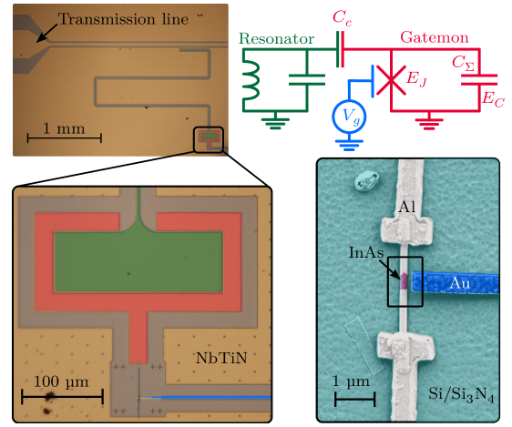
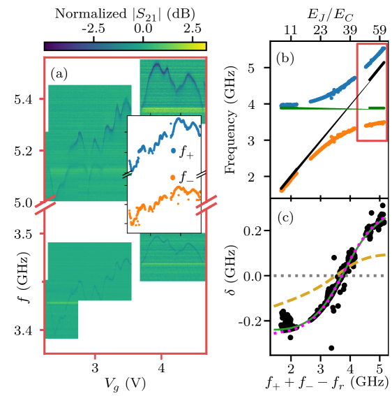
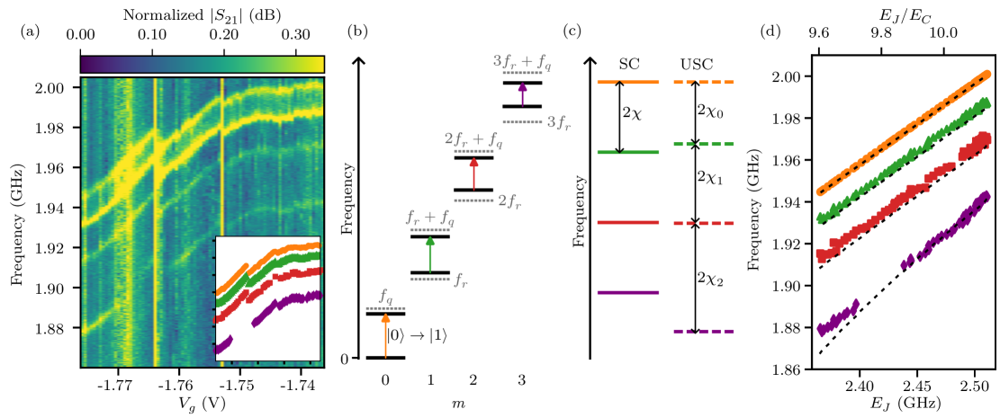
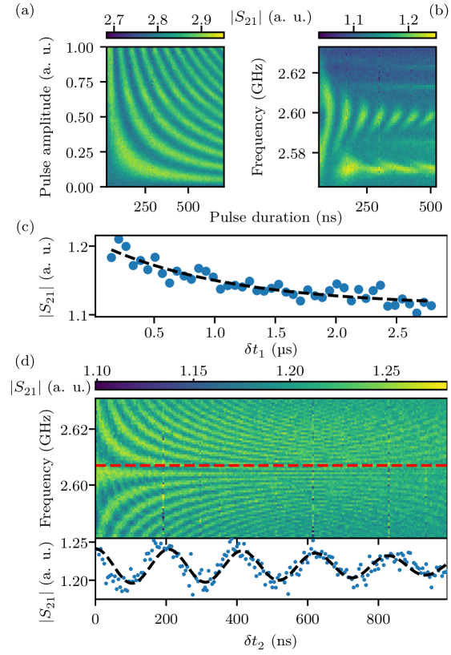
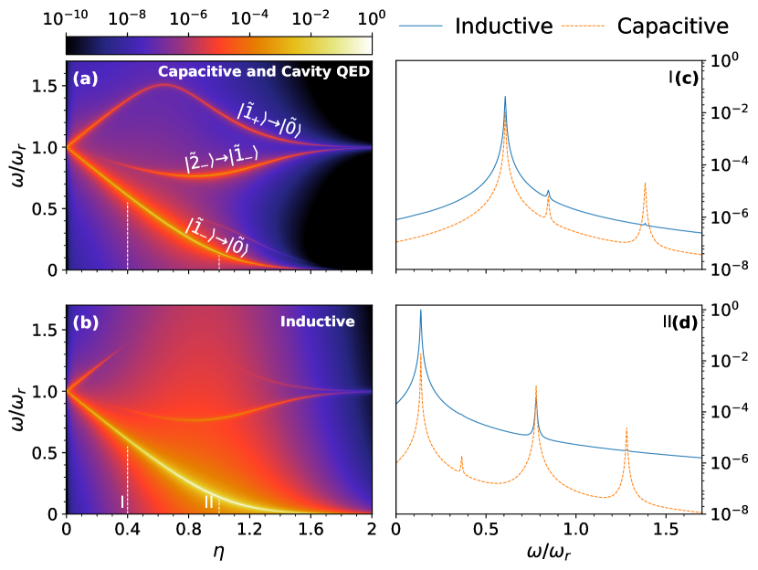
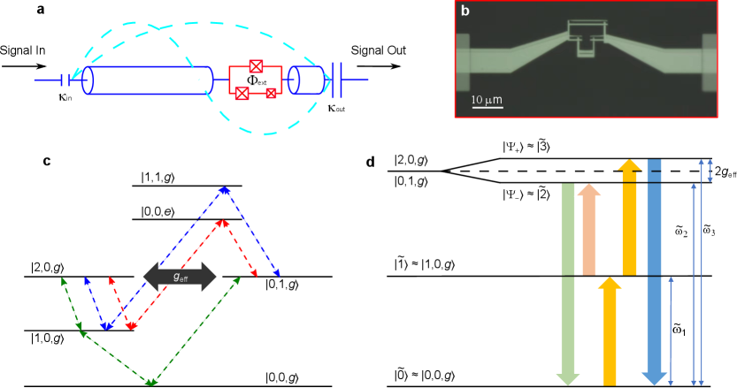

# 超強結合回路量子電気力学の新展開：ゲート可変トランズモン量子ビットで開く未踏の結合領域

- **執筆日**: 2026-03-25
- **トピック**: 超強結合（USC）回路量子電気力学と半導体‑超伝導体ハイブリッド量子ビット
- **注目論文**: 2603.19438
- **参照した関連論文数**: 6本

---

## 1. 導入：なぜ今この話題か

量子コンピュータの実現に向けて、超伝導量子ビットを使った「回路量子電気力学（circuit quantum electrodynamics, circuit QED）」は最も進んだプラットフォームの一つだ。その中核をなすのは、量子ビット（人工原子）と共振器（光子の箱）の間の「光と物質の結合」である。

長い間、この結合は「強結合（strong coupling）」と呼ばれる領域で議論されてきた。ここでは量子ビットと共振器が互いに可逆的にエネルギーを交換し（真空ラビ振動）、量子情報の操作が可能になる。しかしその背後には「回転波近似（rotating-wave approximation, RWA）」という近似が隠されていた。RWA は「反共鳴項（counter-rotating terms）」を無視することで、系の解析を大幅に単純化する。多くの実験系では RWA は正当化されており、その近似のもとで得られる有効ハミルトニアンをジェインズ‑カミングス（Jaynes-Cummings, JC）模型と呼ぶ。

では、結合強度 $g$ が共振器周波数 $\omega_r$ に匹敵するほど大きくなったら何が起きるだろうか？この「超強結合（ultrastrong coupling, USC）」領域（$g/\omega_r \gtrsim 0.1$）では、RWA はもはや成り立たない。光子数保存が破れ、基底状態そのものに「仮想光子（virtual photons）」が存在するという驚くべき物理が現れる。さらに結合が $g/\omega_r \gtrsim 1$ を超えると「深強結合（deep strong coupling, DSC）」と呼ばれる、まったく新しい量子多体的領域に入る。

USC は理論的に予言されて久しいが、実験的な探索はそれほど容易でなかった。特に難しかったのは、「USC を達成しながら、同時に量子ビットのコヒーレントな制御を維持する」という両立条件だ。USC 実現のために結合を強めると、しばしばコヒーレンス時間が犠牲になる。また結合強度は材料・構造に強く依存するため、実験的なチューニングの幅が狭かった。

こうした状況に対して、2026年3月に投稿された注目論文（arXiv:2603.19438）は、InAs ナノワイヤーを基盤にした「ゲートモン（gatemon）」量子ビットを用いて、USC 領域（$g/\omega_r \approx 0.16$）でのコヒーレント制御を初めて明確に実証した。この成果は、「超強結合」と「ゲート可変性」と「量子コヒーレンス」の三つを同時に実現したという点で、回路 QED の研究史における一つの節目を刻むものだ。

---

## 2. 解決すべき問い

この分野が向き合ってきた問いは、次のように整理できる。

**問い1：RWA の限界を超えたとき、回路 QED デバイスはどのような振る舞いを示すか？**

JC 模型のもとでは光子数は保存し、スペクトルは等間隔のラダー（はしご）構造を持つ。しかし USC 領域では量子ラビ（Quantum Rabi）模型が適切な記述を与え、反共鳴項によってスペクトルは大きく修正される。どのような実験観測量にそれが反映されるかを明らかにすることが、理論・実験の共通課題だ。

**問い2：USC を実現しながら、量子ビットを「使える」状態に保てるか？**

超伝導量子ビットで USC を達成した先行事例（特にフラックス量子ビット系）では、コヒーレンス時間が短く、ゲートや測定という量子計算の基本操作を実施することが難しかった。「USC + コヒーレント操作」という組み合わせを実証できるか、が次のステップだった。

**問い3：USC 領域の特有の物理を応用に活かせるか？**

USC 特有の光子数保存則の破れや仮想光子の存在は、非古典的な光子状態の生成や量子模擬（quantum simulation）への応用が期待される。これらの応用を見据えたとき、どのようなプラットフォームが最も有望か？

---

## 3. 注目論文は何を新しく示したのか

### 3.1 デバイス：InAs ナノワイヤー・ゲートモン＋共振器

注目論文（Casal Iglesias *et al.*, arXiv:2603.19438）のデバイスは、InAs/Al ハイブリッド・ナノワイヤーで構成されたジョセフソン接合（JJ）を持つゲートモン量子ビットと、λ/4 型共面導波路共振器から成る（図1）。

ゲートモンとは、ナノワイヤーや量子ドットなど半導体系 JJ を用いたトランズモン量子ビットの一種で、サイドゲート電圧によって JJ の臨界電流（ひいては量子ビットの周波数）を電気的に制御できるのが特徴だ。従来のアルミニウム系トランズモンがジョセフソン接合の交換によってのみ周波数を固定するのに対し、ゲートモンはゲート電圧によりリアルタイムで周波数を変化させることができる。

このデバイスで特筆すべきは、理論的な真空結合強度 $g_0/2\pi \approx 821$ MHz を達成するよう設計されている点だ。共振器周波数は $f_r = 3.885$ GHz で、これにより $g_0/\omega_r \approx 0.21$ という USC パラメーターが見込まれた。実験では、ゲート電圧スイープを通じて $g/2\pi \approx 643$ MHz、$g/\omega_r \approx 0.12$〜0.20 の範囲で USC を確認した。

*図1. ゲートモン量子ビットと共面導波路共振器からなる回路QEDデバイス。左：デバイス全体の疑似カラー走査電子顕微鏡像。中央：InAs/Al ナノワイヤーJJ の拡大像（幅 200〜250 nm）。右：回路模式図。(arXiv:2603.19438, CC BY 4.0)*

### 3.2 単一音調分光：JC 模型からの逸脱

単一音調（single-tone）分光では、共振器の透過スペクトルをゲート電圧の関数として測定した（図2）。その結果、量子ビットと共振器の交差点付近で回避交差（avoided crossing）が現れ、その分裂幅から結合強度 $g$ を抽出できる。

JC 模型の範囲では、この回避交差は対称な形を示す。しかし測定されたスペクトルは、$g/\omega_r \approx 0.16$ という非自明な値を持ち、フィッティングには量子ラビ模型が必要であることが示された。

*図2. ゲート電圧に対する単一音調分光スペクトル。回避交差の非対称性と幅から、$g/2\pi \approx 643$ MHz、$g/\omega_r \approx 0.16$ の超強結合が確認された。(arXiv:2603.19438, CC BY 4.0)*

### 3.3 二音調分光：光子数依存の遷移

USC 領域の特徴がもっとも鮮明に現れたのは、二音調（two-tone）分光だ（図3）。共振器に異なる光子数 $m = 0, 1, 2, 3$ を入れた状態での量子ビット遷移周波数を測定すると、JC 模型が予測する等間隔の分散シフトからはずれた「光子数依存の遷移エネルギー」が観測された。

これは量子ラビ模型の特徴的な帰結だ。JC 模型では、共振器光子数が変わっても量子ビットの遷移周波数は $\pm g^2/\Delta$（$\Delta$：離調、分散シフト）として均一に変化するにすぎない。しかし量子ラビ模型では、光子数の増加に伴って、エネルギー準位の非均等な離散化が生じる。実験はこの非均等性を明確に観測し、USC 領域では JC 模型では理解できない新しい物理が働くことを実証した。

*図3. 二音調分光による光子数依存の量子ビット遷移。共振器光子数 $m=0,1,2,3$ に対応する遷移エネルギーが JC 模型の予測から系統的にずれており、量子ラビ模型が正確な記述を与える。(arXiv:2603.19438, CC BY 4.0)*

### 3.4 時間領域：コヒーレント操作の実証

より重要な成果の一つが、時間領域での測定だ（図4）。ラビ振動、緩和時間 $T_1 = 1.1 \,\mu\text{s}$、デコヒーレンス時間 $T_2^* = 1.2 \,\mu\text{s}$ が測定され、USC 領域においてもコヒーレントな量子ビット操作が維持されていることが実証された。

この $T_1$ および $T_2^*$ の値は、USC 体制外で動作する通常のゲートモンと比べても遜色ない。著者らは、デコヒーレンスの主因が USC 特有の経路ではなく、ナノワイヤー・プラットフォーム特有の電荷雑音であると分析している。つまり USC 体制そのものがコヒーレンスを損なっているわけではなく、材料系の改良によってさらなるコヒーレンス向上の余地があることを示唆する。

*図4. 時間領域測定。ラビ振動（左）、緩和時間 $T_1 = 1.1\,\mu$s（中央）、位相コヒーレンス時間 $T_2^* = 1.2\,\mu$s（右）が USC 体制で測定された。(arXiv:2603.19438, CC BY 4.0)*

---

## 4. 背景と文脈：この注目論文はどこに位置づくか

### 4.1 光と物質の結合の系譜

「光と物質の結合」の研究は、量子光学の誕生にまでさかのぼる。真空ラビ振動が実験で観測されたのは1992年（単原子光学共振器）であり、その後、この強結合体制は原子物理学の基盤となった。超伝導量子ビットを用いた回路 QED がこの分野に参入したのは2004年で、物質ベースの強結合を $g/\omega_r \sim 10^{-4}$ から一気に $g/\omega_r \sim 0.01$ の水準に引き上げた。

USC（$g/\omega_r \gtrsim 0.1$）が初めて実験で達成されたのは2009年、フラックス量子ビット‑共振器系でのことだ。その後も USC の記録は更新され続け、DSC に達した報告もある。しかし多くの USC 実現系では、コヒーレント制御の実証が困難だった。フラックス量子ビットは強結合を得やすい反面、充電エネルギーを小さくするため電荷雑音に弱く、また周波数のチューニング範囲が限られる。

ゲートモン系は、これらの問題への一つの解答として登場した。InAs などの半導体‑超伝導体ハイブリッド接合は、外部ゲート電圧によって JJ の透過率（ひいては $E_J$）を連続的に変化させられる。これは物理的なフラックスに依存するトランズモンに比べて、「電気的に柔軟」という利点を持つ。注目論文は、この柔軟性を USC の探索に活用した最初の成功例だ。

また、回路 QED としての位置づけとして、Napoli *et al.*（arXiv:2408.16558, Phys. Rev. Research 7, 033037, 2025）の理論研究が重要な文脈を提供する。この論文は、USC 体制における回路 QED のスペクトルが、同等のパラメーターを持つ空洞 QED（cavity QED）とどのように異なるかを系統的に解析した（図5）。重要な知見は、**観測に用いる結合ポートの種類（誘導型 vs 容量型）によって、USC 体制のスペクトル特徴が根本的に変わる**という点だ。これは回路 QED 特有の「配線の幾何学」が、物理観測量に直接影響することを示しており、実験解釈の上で見落とせない。

*図5. USC 体制における回路 QED の放射スペクトル（理論計算）。上段：容量結合、下段：誘導結合。結合定数 $\eta = g/\omega_0$ の増加とともにスペクトルが大きく変化し、特定の遷移ラインが「消失」する（clumping/quenching）現象が見られる。(arXiv:2408.16558, CC BY 4.0)*

### 4.2 半導体‑超伝導体ハイブリッド量子デバイスの現在地

半導体‑超伝導体ハイブリッド量子ビットの全体像を概観するうえで、Pita-Vidal *et al.*（arXiv:2512.23336, Physics Reports, 2025）のレビュー論文が有益だ。このレビューは168ページにわたり、ゲートモン、アンドレエフ量子ビット、マヨラナ‑ゼロモード利用の位相保護量子ビットなど、複数のアーキテクチャを包括的に整理している。

このレビューが示す重要な点は、「半導体‑超伝導体系の電気的チューナビリティは、単なる周波数調整を超えた価値を持つ」ということだ。たとえばジョセフソン結合の強さそのものをゲートで操作することで、量子ビットのトポロジカル保護度合いを外場で変えられる可能性がある（後述）。USC の探索においても、同じ「電気的チューナビリティ」が鍵を握る。

---

## 5. メカニズム・解釈・比較

### 5.1 なぜゲートモンで USC が実現できたのか

USC を達成するには $g/\omega_r$ を大きくしなければならない。トランズモン系での真空結合強度は、

$$
g_0 = \frac{e}{\hbar} \sqrt{\frac{\hbar \omega_r}{2 C_r}} \cdot \frac{C_g}{C_\Sigma}
$$

の形で表せる（$e$：電気素量、$C_r$：共振器容量、$C_g$：ゲート容量、$C_\Sigma$：島の全容量）。大きな $g_0$ を得るには、$C_g/C_\Sigma$ を大きくする（つまり量子ビットを共振器に強く容量結合する）か、$\omega_r$ を下げるかしかない。しかし $\omega_r$ を下げると量子ビット操作速度が犠牲になる。

ゲートモン系でも基本的な制限は同じだが、InAs/Al ナノワイヤー JJ は通常の Al/Al$_2$O$_3$/Al トンネル JJ に比べてジョセフソンエネルギー $E_J$ のゲート依存性が極めて大きく、$E_J/E_C$ の比を広い範囲でチューニングできる。これにより、$g/\omega_r$ のスイートスポット付近（量子ビット周波数が共振器周波数に近い領域）で探索を行いやすい。今回の実験で $g/2\pi \approx 643$ MHz が達成されたことは、ゲートモン系の設計が USC に適していることを示している。

また、反共鳴項が重要になる USC では、系の正しい記述に量子ラビ模型が必要だ：

$$
H_{\text{Rabi}} = \hbar\omega_r \left(a^\dagger a + \frac{1}{2}\right) + \frac{\hbar\omega_q}{2}\sigma_z + \hbar g (a^\dagger + a)(\sigma_+ + \sigma_-)
$$

ここで $a^\dagger, a$ は共振器の光子生成・消滅演算子、$\sigma_z, \sigma_\pm$ はパウリ演算子、$\omega_q$ は量子ビット周波数だ。JC 模型との違いは、$\hbar g (a^\dagger \sigma_+ + a \sigma_-)$ という「共鳴項」に加えて $\hbar g (a \sigma_- + a^\dagger \sigma_+)$ という「反共鳴項」（または「カウンターローテーティング項」）が含まれる点だ。

二音調分光で観測された「光子数依存の非均等な遷移エネルギー」は、この反共鳴項が存在することによってエネルギー準位が歪み、JC のラダー構造が崩れることの直接的な証拠だ。

### 5.2 USC 効果の比較：フラックス量子ビット系との違い

過去の USC 実証で中心的役割を担ってきたフラックス量子ビット系（例えばNature Communications 2025に掲載の Wang *et al.*、arXiv:2401.02738）では、同様の量子ラビ模型の効果として「1光子状態と2光子状態の強結合」が観測された（図6）。この実験では USC 条件下で、フラックス量子ビットが2つの共振器モードを仲介し、単光子と2光子フォック状態の間に59 MHz の有効結合が生じることを示した。第2高調波発生（SHG）の効率は、平均光子数1以下のレジームで約0.1に達しており、USC 体制の「光子数保存則の破れ」が実用的な非線形量子光学を可能にすることを実証している。

*図6. フラックス量子ビットを用いた回路QEDデバイスの模式図と単光子‑2光子フォック状態間の強結合。USCの反共鳴項が2モード間の非線形結合を誘起する。(arXiv:2401.02738, CC BY 4.0)*

フラックス量子ビット系との比較で、今回のゲートモン系が持つ独自の強みは「電気的チューナビリティ」だ。フラックス量子ビットは磁束によって周波数を変えるが、局所的な磁束制御は近接した量子ビット間のクロストークを引き起こしやすい。一方、ゲートモン系の静電ゲートはより局所的な制御が可能で、スケールアップされた多量子ビット系での USC 活用に適している。

しかし、ゲートモン系の弱点は電荷雑音への感受性だ。今回の実験でも、$T_2^*$ の主要な制限要因はナノワイヤー‑ゲート界面の電荷揺らぎであった。Napoli *et al.*（arXiv:2408.16558）が示したように、USC 体制で観測可能な量子ラビ効果は観測方法（出力ポート）に強く依存するため、この雑音源の抑制がスペクトルの精密測定を可能にする鍵となる。

### 5.3 コヒーレンス：USC の壁か、材料の問題か

今回測定された $T_1 \approx 1.1 \,\mu\text{s}$、$T_2^* \approx 1.2 \,\mu\text{s}$ は、USC 体制の回路 QED デバイスとして初めて実用的なコヒーレンスを示した成果だ。これは、USC 体制が本質的にコヒーレンスを壊すものではないことを意味する。

Giavaras *et al.*（arXiv:2503.05284）は、フルシェル型ナノワイヤー JJ を用いたパリティ保護量子ビットを理論的に提案・解析している（図7）。この設計では、磁束量子 $\Phi_0$ 付近で JJ ポテンシャルが二重井戸型に変化し、クーパー対パリティ固有状態がコヒーレンスを保護する機構が働く。デコヒーレンス経路のうち電荷誘起の緩和が抑制されるため、理論的な $T_2^\mu$ は数十マイクロ秒に達すると見積もられる。ゲートモンとパリティ保護の二つのレジームを同一プラットフォーム上で切り替えられるという提案は、USC 実験と量子エラー訂正的保護の融合という将来の方向性を示唆している。

---

## 6. 材料・手法・応用への広がり

### 6.1 超伝導量子ビット用材料の最前線

量子ビットのコヒーレンスは材料品質に直結する。Polakovic *et al.*（arXiv:2603.23402）は、ニオブ（Nb）薄膜の蒸着温度を変えることで内部品質因子（$Q_i$）が大幅に変化することを、磁気光学イメージングと磁場侵入深さ測定の組み合わせで明らかにした。低品質膜では磁場遮蔽が弱く、超伝導ギャップ内に欠陥準位が形成されることが示唆された。これは USC 用高 $Q$ 共振器の設計にとって重要な知見であり、材料‑量子ビット性能の接続を定量的に示す事例だ。

### 6.2 界面工学とジョセフソン接合の長距離化

半導体‑超伝導体ハイブリッドデバイスのもう一つの課題は、超伝導体と半導体材料間の界面品質だ。Fernández-Lomana *et al.*（arXiv:2603.23148）は、MoRe/Au 電極をあらかじめパターニングした基板に van der Waals トポロジカル材料を転写する「プレパターン底面電極」アーキテクチャを提案した。このアプローチでは、従来のトップコンタクト製法で生じる界面汚染・劣化を回避でき、より大きな $I_c R_N$ 積と長距離ジョセフソン結合が得られた。これはトポロジカル量子ビット（マヨラナ系）のプラットフォームとして重要な前進だが、USC 探索においても「清浄なジョセフソン接合で結合強度を極限まで高める」という目的に通じる技術的背景だ。

### 6.3 ゲート可変パラメトリック増幅器との統合

gate-tunable 量子ビットと同じ半導体‑超伝導体材料系（InAs ナノワイヤー）を用いたジョセフソン・パラメトリック増幅器（arXiv:2510.00305）も近年登場しており、ゲート電圧で共鳴周波数を約1 GHz チューニングしながら20 dB 超のゲインと量子限界に近い雑音を示している。USC 量子ビットの読み出しには高感度増幅器が必須であり、量子ビットと増幅器を同一の InAs ナノワイヤー・プラットフォーム上に統合できるという見通しは、USC 探索実験の完結した量子回路実装に向けた重要な路線を開く。

---

## 7. 基礎から理解する

### 7.1 ジェインズ‑カミングス（Jaynes-Cummings）模型

回路 QED を理解する出発点は JC 模型だ。二準位系（量子ビット）と単一モードの電磁場（共振器）が弱く結合している場合、ハミルトニアンは

$$
H_{\text{JC}} = \hbar\omega_r \left(a^\dagger a + \frac{1}{2}\right) + \frac{\hbar\omega_q}{2}\sigma_z + \hbar g (a^\dagger \sigma_- + a \sigma_+)
$$

と書ける。ここで、

- $\hbar$：ディラック定数
- $\omega_r$：共振器（光子場）の角周波数
- $a^\dagger, a$：共振器の光子生成・消滅演算子（$[a, a^\dagger]=1$）
- $\omega_q$：量子ビットの遷移角周波数
- $\sigma_z$：量子ビットの反転演算子（$\sigma_z |{+}\rangle = +|{+}\rangle$、$\sigma_z |{-}\rangle = -|{-}\rangle$）
- $\sigma_+ = |{+}\rangle\langle{-}|$、$\sigma_- = |{-}\rangle\langle{+}|$：量子ビットの昇降演算子
- $g$：光と物質の結合定数（単位: rad/s）

$a^\dagger \sigma_-$ は「共振器が光子を放出し量子ビットが励起される」、$a \sigma_+$ は「共振器が光子を吸収し量子ビットが基底状態に戻る」という保存過程を表す。これを「回転波近似（RWA）」のもとで保持した相互作用と呼ぶ。

このモデルの固有値は $|n, \pm\rangle$ という「ドレストステート（dressed state）」として解析的に得られ（$n$：光子数）、エネルギースペクトルは等間隔のラダー（梯子）構造を成す：

$$
E_{n,\pm} = \hbar\omega_r n \pm \hbar\sqrt{g^2 n + \Delta^2/4}, \quad \Delta = \omega_q - \omega_r
$$

この等間隔性は「光子数保存」の帰結だ。

### 7.2 量子ラビ（Quantum Rabi）模型とUSC

USC では RWA が使えない。正しいハミルトニアンは「量子ラビ模型」：

$$
H_{\text{Rabi}} = \hbar\omega_r \left(a^\dagger a + \frac{1}{2}\right) + \frac{\hbar\omega_q}{2}\sigma_z + \hbar g (a^\dagger + a)(\sigma_+ + \sigma_-)
$$

$(a^\dagger + a)$ はそれぞれ光子の生成と消滅を同時に含む「位置演算子」的な項であり、相互作用に「$a^\dagger \sigma_+$」（光子を作りながら量子ビットを励起するという、エネルギー保存に反する「反共鳴項」）と「$a \sigma_-$」（光子を壊しながら量子ビットを脱励起する反共鳴項）が含まれる。

USC の基準は $\eta \equiv g/\omega_r$ で与えられ：

| 体制 | $\eta$ の目安 | 特徴 |
|------|------------|------|
| 強結合（SC） | $\eta < 0.1$ | RWA 有効、JC 模型が良い近似 |
| 超強結合（USC） | $0.1 \lesssim \eta < 1$ | RWA 不成立、反共鳴項が重要 |
| 深強結合（DSC） | $\eta \gtrsim 1$ | 光子数とスピンの積が保存量でなくなる |

USC では基底状態が「ドレスト真空（dressed vacuum）」となり、光子数の期待値が $\langle 0_\text{Rabi} | a^\dagger a | 0_\text{Rabi} \rangle > 0$ となる。これを「仮想光子（virtual photons）」が基底状態に存在すると表現する。

### 7.3 ゲートモン量子ビットの原理

ゲートモンの基礎となるトランズモン量子ビットは、超伝導島とジョセフソン接合からなる「コーパーペア・ボックス」を、大きなシャント容量 $C_S$ でより無感受性にした設計だ。そのハミルトニアンは

$$
H_{\text{transmon}} = 4E_C (N - N_g)^2 - E_J \cos\varphi
$$

ここで、

- $E_C = e^2/(2C_\Sigma)$：充電エネルギー（$C_\Sigma$：全容量）
- $N$：超伝導島上のクーパー対数演算子
- $N_g$：ゲート電荷（外部ゲート電圧で制御）
- $E_J$：ジョセフソンエネルギー
- $\varphi$：超伝導位相差

$E_J / E_C \gg 1$ の条件（トランズモン体制）では、エネルギーは $N_g$ にほぼ依存しなくなり、電荷雑音への感受性が大幅に減る。ゲートモンでは $E_J$ が InAs ナノワイヤー JJ の透明度によって決まり、これをゲート電圧 $V_g$ で $E_J(V_g)$ と連続的に変えられる。

量子ビット周波数は $E_J$ に依存し、おおよそ

$$
f_{01} \approx \sqrt{8 E_J E_C} - E_C \quad (\text{トランズモン近似、} E_J/E_C \gg 1)
$$

で与えられる。 $E_J$ をゼロ近くまで下げれば $f_{01}$ は大きく下がり、共振器との結合比 $g/\omega_q$ が増大する（ただしトランズモン体制を外れる点に注意が必要）。

---

## 8. 重要キーワード10個の解説

### 1. 超強結合（Ultrastrong Coupling, USC）

**定義**：量子ビットと共振器の結合定数 $g$ が共振器の角周波数 $\omega_r$ に対して $\eta = g/\omega_r \gtrsim 0.1$ を満たす体制。この条件のもとでは回転波近似（RWA）が成立しなくなり、光子数保存が破れる。

**数式**：USC の基準となる無次元結合定数
$$\eta = \frac{g}{\omega_r}$$
$\eta < 0.1$（強結合）、$0.1 \le \eta < 1$（超強結合）、$\eta \ge 1$（深強結合）と区分される。

### 2. 回転波近似（Rotating-Wave Approximation, RWA）

**定義**：光と物質の相互作用ハミルトニアン $H_{\rm int} = \hbar g (a^\dagger + a)(\sigma_+ + \sigma_-)$ を展開すると、共鳴項 $(a^\dagger \sigma_- + a \sigma_+)$ と反共鳴項 $(a^\dagger \sigma_+ + a \sigma_-)$ の二種類が現れる。RWA は反共鳴項を「速く振動するため時間平均でゼロになる」として無視する近似。$g \ll \omega_r$ のときに正当化されるが、USC では成立しない。

### 3. 量子ラビ模型（Quantum Rabi Model）

**定義**：RWA を行わない、完全な光‑物質相互作用モデル。ハミルトニアンは
$$H_{\text{Rabi}} = \hbar\omega_r \left(a^\dagger a + \frac{1}{2}\right) + \frac{\hbar\omega_q}{2}\sigma_z + \hbar g (a^\dagger + a)(\sigma_+ + \sigma_-)$$
2011年に Braak によって解析解が発見されるまで、厳密な固有値は知られていなかった。USC 以上のすべての光‑物質結合体制を記述する。

### 4. ジェインズ‑カミングス模型（Jaynes-Cummings Model, JCM）

**定義**：量子ラビ模型に RWA を適用した近似モデル。$H_{\rm JC} = \hbar\omega_r a^\dagger a + \frac{\hbar\omega_q}{2}\sigma_z + \hbar g (a^\dagger \sigma_- + a \sigma_+)$ という形を持ち、光子数 $n$ を保存する。固有状態はドレストステート $|n,\pm\rangle$ で与えられ、エネルギーは解析的に $E_{n,\pm} = \hbar\omega_r n \pm \hbar\sqrt{g^2 n + \Delta^2/4}$ と求まる。

### 5. ゲートモン（Gatemon）

**定義**：半導体（例：InAs）‑超伝導体（例：Al）ハイブリッドのジョセフソン接合を持つトランズモン型量子ビット。外部ゲート電圧によってジョセフソンエネルギー $E_J$ を連続的に制御できる。従来のアルミトランズモン（$E_J$ は固定）と異なり、周波数チューニングに磁場が不要なため、電気的に柔軟な量子回路の構築が可能。

### 6. トランズモン量子ビット（Transmon Qubit）

**定義**：コーパーペア・ボックス量子ビットにシャント容量 $C_S$ を付加して $E_J/E_C \gg 1$ を実現したデバイス。$E_J/E_C$ を大きくすることで電荷雑音への感受性を排除する。遷移周波数は $f_{01} \approx \sqrt{8E_J E_C}/h - E_C/h$ で与えられ、$E_J$ の制御によってチューニングされる。現在最も広く使われている超伝導量子ビット。

### 7. 分散シフト（Dispersive Shift）

**定義**：JC 体制での量子ビット‑共振器の有効相互作用。離調 $\Delta = \omega_q - \omega_r$ が大きいとき（$\Delta \gg g$）、有効ハミルトニアンは
$$H_{\rm disp} = \hbar(\omega_r + \chi \sigma_z) a^\dagger a + \frac{\hbar\tilde{\omega}_q}{2}\sigma_z$$
となる。$\chi = g^2/\Delta$ が分散シフトで、量子ビットの状態によって共振器周波数が $\pm\chi$ だけずれることを示す。これを利用して量子ビットを非破壊測定できる。USC では $\chi$ の光子数依存性が現れる。

### 8. 仮想光子（Virtual Photons）

**定義**：量子ラビ模型の基底状態（USC での「真の真空」）は JC 真空と異なり、有限の光子数期待値 $\langle a^\dagger a \rangle > 0$ を持つ。これを「仮想光子」と呼ぶ。通常の量子ラビ模型では、結合をオン・オフするだけでこれらの仮想光子が実光子として放出されるが、系への影響は電磁場の相互作用なしには外部で観測できない。DSC ではこの効果が顕著になる。

### 9. パリティ保護量子ビット（Parity-Protected Qubit）

**定義**：クーパー対パリティ演算子 $(-1)^N$ の固有状態を量子ビットの符号化基底に使うことで、電荷誘起の緩和を原理的に禁止した量子ビット。Giavaras *et al.*（arXiv:2503.05284）が示すように、フルシェルナノワイヤーJJでは磁束量子近傍でジョセフソンポテンシャルが二重井戸型に変わり、$|0\rangle$ と $|1\rangle$ が偶‑奇パリティ対となる。このとき $\langle 1 | \hat{N} | 0 \rangle = 0$ が成立し、電荷雑音からの緩和経路が遮断される。

### 10. アンドレエフ束縛状態（Andreev Bound States, ABS）

**定義**：超伝導体‑常伝導体‑超伝導体（SNS）接合において、ギャップ内に現れる局在した準粒子状態。接合の両端の超伝導位相差 $\varphi$ に依存してエネルギーが変わり、$E_{\rm ABS} = -\Delta\sqrt{1 - \tau\sin^2(\varphi/2)}$ で表せる（$\Delta$：超伝導ギャップ、$\tau$：接合の透明度）。ABS に閉じ込められたクーパー対数の不確かさが、ゲートモン系の電荷雑音感受性の一因となる。透明度 $\tau$ のゲート制御がゲートモン動作の核心だ。

---

## 9. まとめと今後の論点

今回の注目論文（arXiv:2603.19438）は、ゲート可変の InAs/Al ナノワイヤー‑ゲートモン量子ビットを用いることで、「超強結合（$g/\omega_r \approx 0.16$）+ コヒーレント制御（$T_1 \approx 1.1 \,\mu$s）+ 電気的チューナビリティ」という三要素を同時に達成した。観測された光子数依存の非均等なスペクトルは、JC 模型を超えた量子ラビ模型の物理の直接証拠であり、回路 QED の新しい探索フロンティアを実験的に開いた。

周辺の研究からは、次のような論点が浮かび上がる。

**論点1：USC 体制でのコヒーレンスの限界は何か？**
今回の $T_1, T_2^*$ は USC 体制としては画期的だが、ナノワイヤー‑ゲート界面の電荷雑音が主要因として残っている。材料改良（清浄な InAs/Al 界面、高品質 Nb 共振器）や設計の工夫（スイートスポット操作）によって、いったいどこまでコヒーレンスが伸ばせるかは未解明だ。

**論点2：DSC（深強結合）の実証は可能か？**
$\eta \geq 1$ の DSC 体制では、更に劇的な物理（仮想光子の過剰生成、反転測定での対消滅）が期待される。ゲートモン系の電気的チューナビリティは $\omega_q \to 0$ 極限への接近を可能にするが、その極限でのコヒーレンスの挙動と測定の困難が次の壁となる。

**論点3：USC 効果を量子情報・量子模擬に活かせるか？**
Wang *et al.*（arXiv:2401.02738）が示した「USC 体制での単光子‑2光子フォック状態の強結合」や第2高調波発生は、量子非線形光学のゲートなき操作への道を開く。こうした非線形量子光学効果をゲート可変プラットフォームで制御する展望は、USC 体制をエラー訂正に組み込んだり、フォトニック量子計算に組み合わせたりする可能性を秘めている。

**論点4：パリティ保護・マヨラナ保護との融合は可能か？**
同一の半導体‑超伝導体プラットフォーム上に、USC 操作とパリティ保護（arXiv:2503.05284）、さらにはマヨラナ‑ゼロモード（arXiv:2512.23336）を組み合わせる方向性は、長期的には量子エラー訂正能力を内在する USC 量子デバイスへと結実するかもしれない。それぞれの技術的成熟度をどう調整しながら融合を目指すかが、今後数年の研究課題となるだろう。

---

## 10. 参考にした論文一覧

| 番号 | arXiv ID | タイトル | 著者（筆頭） | 発表先・年 | 役割 | ライセンス |
|------|----------|---------|------------|----------|------|----------|
| 1 | 2603.19438 | Ultrastrong Coupling and Coherent Dynamics in a Gate-Tunable Transmon Qubit | I. Casal Iglesias *et al.* | arXiv, 2026 | 注目論文（anchor） | CC BY 4.0 |
| 2 | 2408.16558 | Circuit QED Spectra in the Ultrastrong Coupling Regime: How They Differ from Cavity QED | M. Napoli *et al.* | Phys. Rev. Research 7, 033037 (2025) | USC 理論・背景 | CC BY 4.0 |
| 3 | 2401.02738 | Strong coupling between a single-photon and a two-photon Fock state | C. Wang *et al.* | Nat. Commun. 16, 8730 (2025) | USC 実験・比較 | CC BY 4.0 |
| 4 | 2512.23336 | Novel qubits in hybrid semiconductor-superconductor nanostructures | M. Pita-Vidal *et al.* | Physics Reports (2025) | 背景・レビュー | CC BY 4.0 |
| 5 | 2503.05284 | Flux-tunable parity-protected qubit based on a single full-shell nanowire Josephson junction | G. Giavaras *et al.* | Phys. Rev. B 111, 235432 (2025) | 関連デバイス・保護機構 | CC BY 4.0 |
| 6 | 2603.23402 | Magnetic flux distribution, quasiparticle spectroscopy, and quality factors in Nb films for superconducting qubits | T. Polakovic *et al.* | arXiv, 2026 | 材料・共振器品質 | CC BY 4.0 |
| 7 | 2603.23148 | Pre-Patterned Superconducting Contacts for Clean Superconductor-Topological Material Interfaces Enabling Long-Range Josephson Coupling | M. Fernández-Lomana *et al.* | arXiv, 2026 | 界面工学・応用 | CC BY 4.0 |

> **図版の著作権について**：本記事に掲載した図はすべて CC BY 4.0 ライセンスの論文から引用し、帰属表示（出典：arXiv ID、CC BY 4.0）を各図キャプションに明記しています。非排他的配布ライセンス（arXiv default/non-exclusive-distrib）のみの論文（arXiv:2510.00305 など）については図を掲載せず、テキストで説明するにとどめました。
