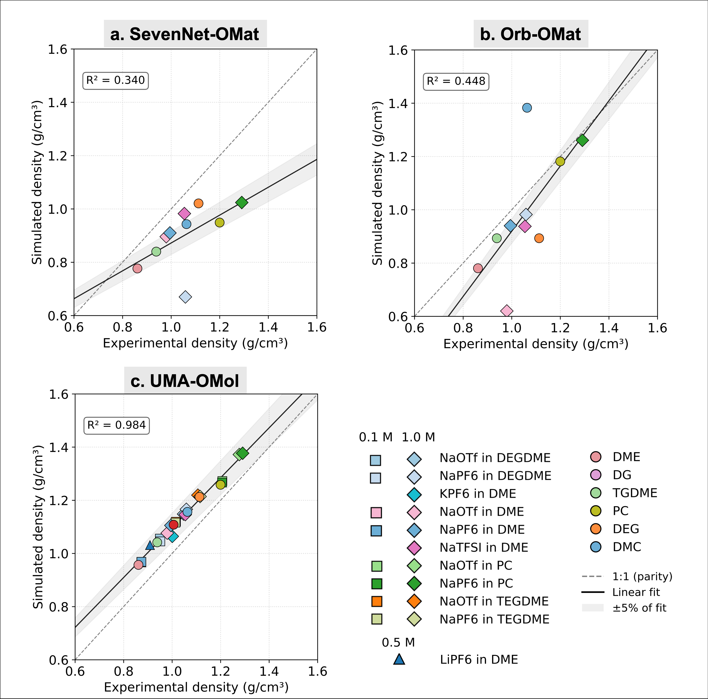
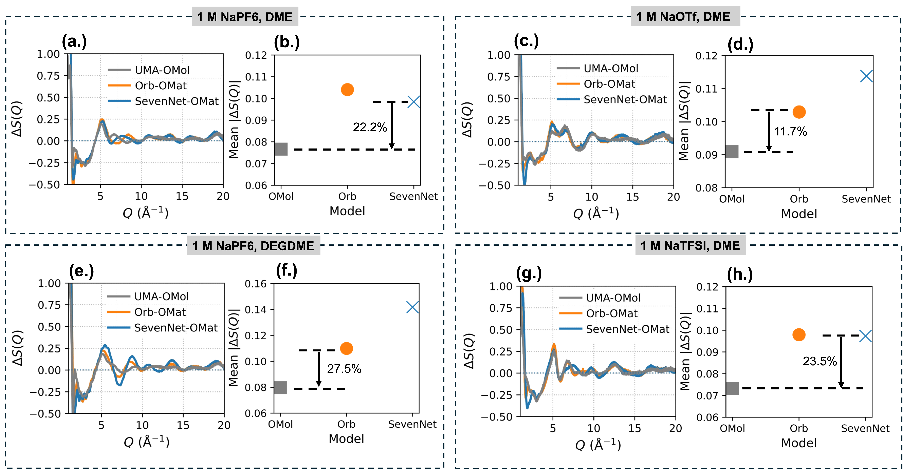
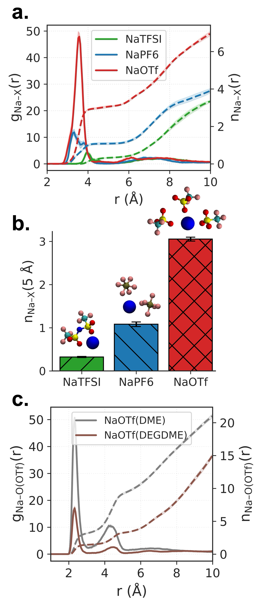
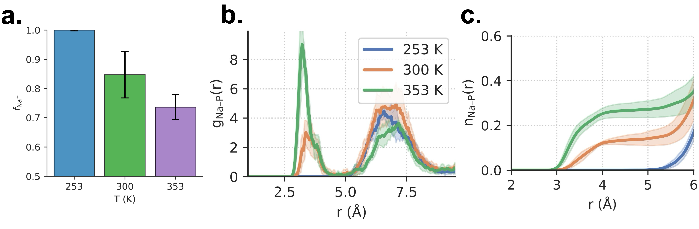
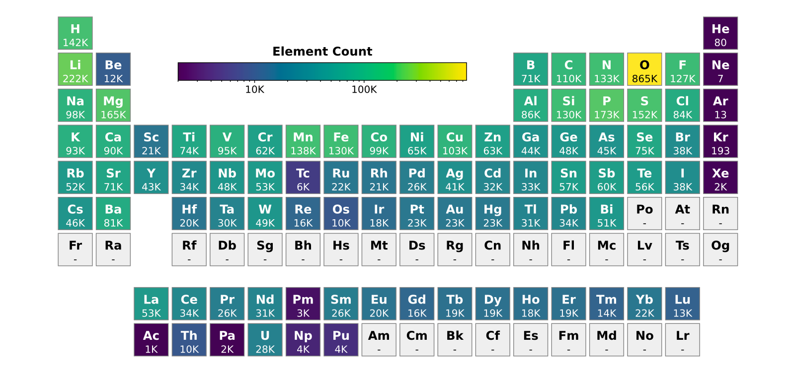
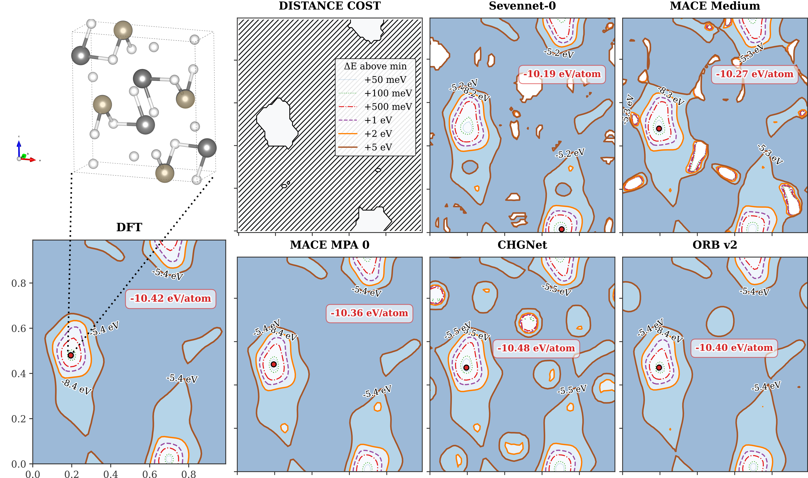
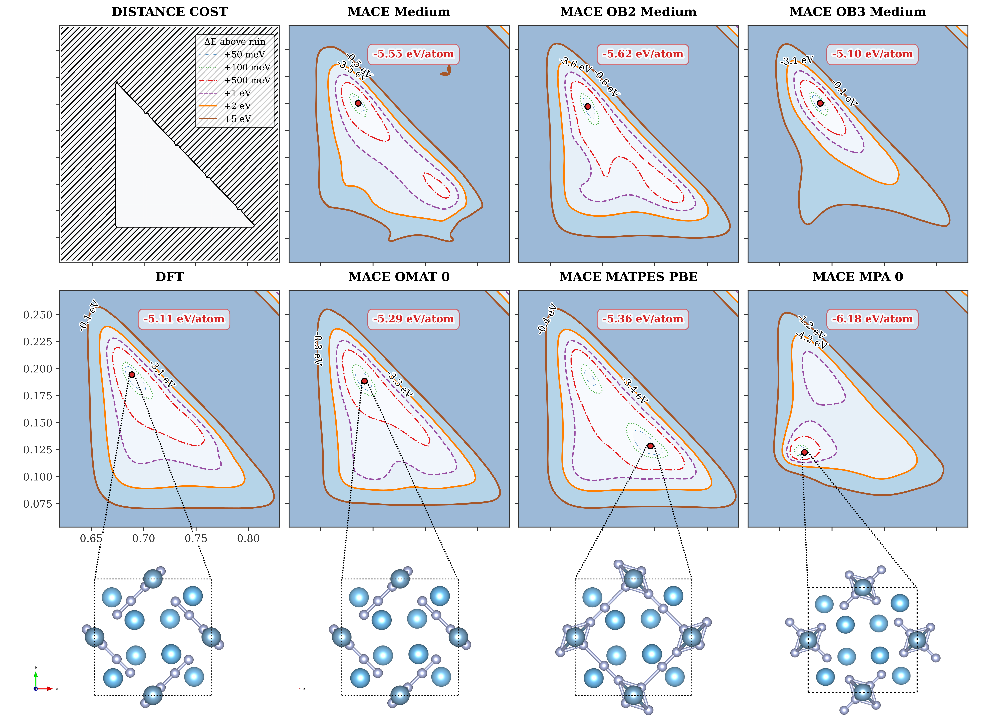

# ユニバーサル機械学習ポテンシャルの汎用性と実験検証：OMol25が切り拓く原子スケールシミュレーションの新展開

- **執筆日**: 2026-03-24
- **トピック**: ユニバーサル機械学習ポテンシャル（Universal MLIP）の汎用性評価と実験検証
- **注目論文**: arXiv:2603.20183
- **参照した関連論文数**: 8本

---

## 1. 導入：なぜ今ユニバーサル機械学習ポテンシャルが問われるのか

材料シミュレーションの世界では長年、精度とスピードのトレードオフが根本的な制約だった。密度汎関数理論（DFT）は原子間の相互作用を量子力学的に記述できるが、計算コストは原子数 $N$ に対して $O(N^3)$ 程度でスケールし、数百原子規模が限界に近い。一方、古典的な分子動力学（MD）は大規模系・長時間スケールを扱えるが、経験的なポテンシャル関数の精度は本質的に限られる。

この両者のギャップを埋めようとして登場したのが、**機械学習ポテンシャル（Machine-Learned Interatomic Potential, MLIP）**である。MLIPは大量のDFT計算データを教師として原子間ポテンシャルエネルギー曲面（PES）を学習し、DFT並みの精度を持ちながら計算速度は数桁速いという特性を持つ。近年の進歩は著しく、2023〜2024年にかけて「無機材料全般に適用できる」ユニバーサルMLIP——MACE-MP-0、CHGNet、M3GNet、SevenNet、Orbなど——が相次いで公開された。これらは数万種の結晶構造から学習し、元素表の広い範囲をカバーする。

しかし、ここで根本的な問いが生じる。「ユニバーサル」とは何を意味するのか。これらのモデルは主に**無機固体の周期系**で学習されている。電池電解質のような**分子系・溶液系**では通用するのだろうか。また、モデルはDFT計算に対してフィットされているが、DFTそのものには汎関数依存の系統誤差がある。**実験測定値**に対してどれほど正確なのか。

2026年3月、Meta FAIRのグループが公開した論文（arXiv:2603.20183）は、この問いに対して直截な答えを提示した。Open Molecules 2025（OMol25）データセット——1億点を超えるDFT計算からなる大規模分子データセット——で学習したユニバーサルMLIPが、ナトリウムイオン電池電解質の密度やX線構造因子を**実験精度で再現**することを示したのである。本稿では、この成果を核として、ユニバーサルMLIPの「汎用性とは何か」「どこが限界で、どう乗り越えるのか」という問いを、複数の周辺研究とあわせて多角的に解説する。

---

## 2. 解決すべき問い

### 2-1. 「汎用性」の壁：無機系と分子系の間

既存のユニバーサルMLIPが学習するデータセットの代表は、Materials Project（MP）から抽出された約400万〜1000万構造の**無機固体**である。これらは結晶の平衡構造付近のデータが中心であり、「分子間相互作用が支配的な溶液系」や「反応性を持つ有機分子系」は本質的に分布外（out-of-distribution, OOD）となる。

電解質溶液の構造を正確に記述するには、以下がすべて要求される。

1. **イオン-溶媒の配位構造**（短距離の静電的・配位共有結合的相互作用）
2. **アニオンの柔軟性**（PF₆⁻やTFSI⁻などのコンフォメーション）
3. **溶媒の水素結合・双極子相互作用**
4. **溶液の密度**（状態方程式的な精度）

無機系で学習したモデルがこれらを正しく再現できるとは限らない。実際、X線・中性子散乱による実験検証と計算の比較は、材料設計において本質的な検証ステップである。

### 2-2. DFT汎関数の選択が「精度の天井」を決める

MLIPはDFTデータをフィットするため、その精度はDFT計算そのものの精度を上限とする。最も広く使われるPBE（GGA）汎関数は、水素結合の記述が弱く、固体の格子定数や融点に系統的な誤差を持つ。

2026年3月に公開されたMatlantis社のPFP v8（arXiv:2603.11063）は、学習データをPBEからr2SCAN（meta-GGA）に切り替えることで、融点の予測誤差を平均130 K（PBEベースの約半分）まで改善したと報告している。これは「MLIPの汎関数依存性」という問題が非常に現実的であることを示している。

### 2-3. モデルのバイアスとファインチューニング

ユニバーサルMLIPはその定義上、特定の系に特化していない。このため、特定のタスク——電気化学界面の挙動、高圧下での状態方程式など——では「平均的には正しいが、細部で系統的にずれる」という問題が起きうる。この「モデルバイアス」の問題と、それをファインチューニングで解消する戦略は、2025〜2026年の重要な研究テーマとなっている（arXiv:2603.10159、arXiv:2506.21935）。

---

## 3. 注目論文は何を新しく示したのか

### 3-1. UMA-OMol：分子系に特化した学習データが劇的な改善をもたらす

Kumar ら（arXiv:2603.20183, CC BY 4.0）は、**UMA-OMol**（Universal Model of Atoms trained on OMol25）と呼ばれるMLIPを用いて、ナトリウムイオン電池電解質の構造を系統的に調べた。

注目すべき最初の結果は**密度の再現性**である。図1に示すように、SevenNet-OMat（無機系学習、R²=0.340）とOrb-OMat（同、R²=0.448）は実験密度との相関が低い。これに対し、UMA-OMol（OMol25学習）は**R²=0.984**という著しく高い相関を示す。電解質の種類（NaOTf、NaPF₆、KPF₆、NaTFSI）、溶媒（DME、DEG、PC、TEGDME）、塩濃度（0.1〜1.0 M）という多様な条件で、わずか1本のモデルが実験密度を定量的に再現したのである。

**図1**: 電解質溶液の密度（実験値 vs シミュレーション値）。(a) SevenNet-OMat（R²=0.340）、(b) Orb-OMat（R²=0.448）、(c) UMA-OMol（R²=0.984）。OMol25による学習が決定的な精度改善をもたらすことが明確に示される。（出典: arXiv:2603.20183, CC BY 4.0）

### 3-2. X線構造因子による精密な検証

密度は巨視的な熱力学量であり、モデルの「大まかな正しさ」を示す。より精密な検証として著者らが用いたのが、**X線構造因子** $S(Q)$ の比較である。$S(Q)$ は液体の構造を逆空間で表現したもので、X線散乱実験（SAXS/WAXS）から直接測定できる。

図2は、4種の電解質系における差構造因子 $\Delta S(Q) = S_\text{sim}(Q) - S_\text{exp}(Q)$ を示している。UMA-OMolは全散乱ベクトル $Q$ の範囲で $\Delta S(Q)$ がゼロ付近に収まり、平均絶対偏差が22〜27.5%程度、SevenNetやOrbと比べて明確に小さい。これは、電解質の**原子スケール相関**を正確に再現していることを意味する。

**図2**: 4種の電解質系における差構造因子 $\Delta S(Q)$。UMA-OMol（青）はSevenNet-OMat（緑）やOrb-OMat（橙）と比べてゼロ付近への収束が格段に優れる。右の棒グラフは平均絶対偏差。（出典: arXiv:2603.20183, CC BY 4.0）

### 3-3. アニオン種・温度・溶媒組成の依存性

このモデルの有用性は精度に留まらない。著者らは様々な条件でのシミュレーションを展開し、**電解質の物理化学的機構**を解明した。

図3にアニオン種依存性を示す。**NaOTf**（トリフルオロメタンスルホナート）は他のアニオン（NaTFSI、NaPF₆）と比べてNa⁺への配位数が著しく高い（積分配位数 $n_{Na-X}(5Å) \approx 3$）。これは、OTf⁻がより強くNa⁺を溶媒和する（ないし接触イオン対を形成しやすい）ことを示している。このような差は実験単独では直接見えにくい原子スケール情報であり、MLIPシミュレーションの強みを体現している。

**図3**: アニオン種（NaTFSI、NaPF₆、NaOTf）ごとのNa⁺周辺の動径分布関数 $g_{Na-X}(r)$（実線）と積分配位数 $n_{Na-X}(r)$（破線）。NaOTfが著しく高い配位数を持つことがわかる。（出典: arXiv:2603.20183, CC BY 4.0）

温度依存性も興味深い（図4）。253 K, 300 K, 353 K の3温度で、温度上昇とともにNa⁺の溶媒和分率 $f_{Na-s}$ が減少し（つまり接触イオン対が増加）、$g_{Na-k}(r)$ の第一ピークが低下する。これは電解質の伝導率や電気化学的挙動に直結する情報である。

**図4**: 温度（253 K, 300 K, 353 K）依存のNa⁺溶媒和分率（a）と動径分布関数（b、c）。温度上昇が接触イオン対形成を促進することが示される。（出典: arXiv:2603.20183, CC BY 4.0）

---

## 4. 背景と文脈：OMol25データセットとユニバーサルMLIPの系譜

### 4-1. なぜ「大規模分子データセット」が必要だったのか

OMol25（arXiv:2505.08762、Meta FAIR、2025年5月）は、約1億点のDFT計算（ωB97M-V/def2-TZVPD レベル）を含む大規模データセットであり、83元素、約8300万の独立した分子系をカバーする。特筆すべきは、**明示的溶媒和構造**、**可変電荷・スピン状態**、**反応性中間体**が含まれている点だ。このような多様性こそが、電解質溶液のような複雑な分子系でも正確な予測を可能にする鍵となっている。

比較のため、無機系の主要データセットを整理すると：

- **Materials Project (MP)**: 約13万〜40万結晶構造、PBEベース（固体の平衡構造中心）
- **OMat24**: ~110万構造、PBEベース（無機固体、Meta FAIR）
- **MatPES**（arXiv:2503.04070）: ~40万構造（2.81億MDスナップショットから厳選）、r²SCANベース、「質より量」の逆を実践した高品質セット

これらのデータセットはすべて固体・無機系に特化している。OMol25はその「分子側の空白」を大規模に埋める役割を果たした。

### 4-2. ユニバーサルMLIPの「ファミリーツリー」

現在のユニバーサルMLIPは大きく2系統に分かれる（図5を参照）。

**アーキテクチャによる分類**：

- **等変グラフニューラルネットワーク（E(3)-equivariant GNN）系**: MACE（Message Passing Atomic Cluster Expansion）、NequIP、SEVENNet
- **不変特徴量 + スカラーNN 系**: CHGNet、M3GNet、Orb（Transformerベース）

MACE系は原子環境を球面調和関数展開で表現し、回転・反転対称性を厳密に保つ（等変性）。これにより少ない学習データで高精度を達成できる反面、計算コストが相対的に高い。Orbはヴァニラなトランスフォーマーで等変性を明示的には持たないが、データ拡張（回転のランダムサンプリング）によって学習し、推論速度が速い（arXiv:2410.22570では既存ユニバーサルMLIPの3〜6倍速と報告）。

### 4-3. ファインチューニングという「最後の一手」

ユニバーサルMLIPを特定の系に適用する際、ゼロショット（追加学習なし）でそのまま使う方法と、対象系のDFTデータで**ファインチューニング**（微調整）する方法がある。Liu ら（arXiv:2506.21935, CC0）は、MACE-MP-0をベースモデルとして、固体電解質・金属欠陥・半導体・固液界面など多様な系でファインチューニングのプロセスを詳細に示した（図5）。

**図5**: MACE-MP-0ベースのファインチューニングで扱われた元素の学習データ数（周期表表示）。酸素（865K件）、炭素（133K件）など有機・分子系に関連する元素が豊富であることがわかる。（出典: arXiv:2506.21935, CC0）

重要な発見は、「ファインチューニングしたモデルは、明示的な長距離補正なしでも長距離物理を部分的に学習できる」という点だ。有機-無機界面やヘテロ接合では、局所的な電荷移動や分散力が本質的な役割を果たすが、十分なデータがあればMLIPがこれを暗黙的に取り込める。

---

## 5. メカニズム・解釈・比較：MLIPは本当にPESを「理解」しているか

### 5-1. 対称性制約エネルギー地形ベンチマーク

MLIPの精度評価には様々な指標があるが、Parackal ら（arXiv:2602.02237, CC BY 4.0）は特に刺激的な方法を提案した。「**結晶対称性を固定したまま、ワイコフ位置パラメータに沿って2次元エネルギー地形を描く**」というものだ。この方法は、

1. 局所エネルギー極小の位置が正しいか
2. 鞍点（遷移状態）のエネルギーを正確に再現できるか
3. 平坦な方向（ソフトモード）を正しく識別できるか

を視覚的に評価できる優れた方法である。

**図6**: SiO₂系における2次元対称性制約エネルギー地形。左上がDFT基準、他はSevenNet-0、MACE Medium、MACE MPA 0、CHGNet、ORB v2。ほとんどのモデルはエネルギー極小位置（赤点）を正確に再現するが、鞍点付近のトポロジーに差が見られる。（出典: arXiv:2602.02237, CC BY 4.0）

図6は非常に示唆的だ。MACE MediumやMACE MPA 0はDFT地形に非常に近いコンター構造を持つ。CHGNetとORBは大まかには正しいが、鞍点エネルギーや地形の細かい曲率で差が生じる。これは「RMSEが小さくても、PESのトポロジーに差がある場合がある」ことを示す。

**図7**: 酸素/水系における対称性制約エネルギー地形。DFT（下段左）と複数のMACEモデル（上段・中段）の比較。MACE-MP-0（OMat24学習）はエネルギー極小値が-6.18 eV/atomとDFT（-5.11 eV/atom）から乖離しているが、MACE中レンジのモデルは改善されている。学習データセットの差が系統的な誤差に直結することが見て取れる。（出典: arXiv:2602.02237, CC BY 4.0）

### 5-2. DFT汎関数の選択とMLIPの系統誤差

上述の通り、Matlantis社のPFP v8（arXiv:2603.11063）はPBEからr2SCANに切り替えることで融点精度を大幅改善した。この効果は単なる定数シフトではなく、**van der Waals相互作用と短距離交換相関の同時改善**によるものだ。r2SCANはキネティックエネルギー密度を追加の変数として使う meta-GGA 汎関数であり、固体・分子系の双方でPBEより実験値に近い記述を与えることが知られている。

MatPES（arXiv:2503.04070）もr²SCANベースであり、「量より質」の方針で選定した40万構造で、数百万構造のPBEデータセットと同等以上の精度を示した。これは学習データの多様性（MDから幅広い構造を取り込む）と品質（汎関数の選択）の両方が重要であることを示している。

### 5-3. バイアス問題と周期的ファインチューニング

Wong と Yang（arXiv:2603.10159）は、ユニバーサルMLIPのバイアスとファインチューニング戦略の詳細な分析を行った。彼らは「ナイーブなファインチューニング」（並列MDで複数軌跡を生成して学習）と「周期的ファインチューニング」（1本の軌跡を走らせながら反復的にモデルを更新）を比較した。

ナイーブな方法では、分布が偏った構造が大量に生成されてしまい、モデルがOOD空間の物理を学習できない。周期的ファインチューニングでは、モデルが実際に訪れる構造空間を順次学習するため、汎化性能が高くなる。この「iterative active learning」の概念は、データ生成戦略として現在のMLIPコミュニティで広く採用されつつある。

### 5-4. 物理インフォームドPretraining

Zheng と Fung（arXiv:2602.19592, CC BY 4.0）は異なるアプローチを提案した。**埋め込み原子法（Embedded Atom Method, EAM）**のような古典的ポテンシャルで事前学習してから、量子力学（DFT）データでファインチューニングするというものだ。

**図8**: SiO₂系のEAMポテンシャルを構成するMorseポテンシャル（二体項）、電子密度、原子エネルギーの各成分。このような「物理的に意味のある初期値」でMLIPを事前学習することで、MD安定性と精度が向上する。（出典: arXiv:2602.19592, CC BY 4.0）

EAM事前学習の効果は、MLIPがOOD構造（圧縮・膨張が大きな構造）に遭遇した際の**発散回避**に特に顕著だった。3種類の材料系（リン、シリカ、Materials Projectサブセット）と3種類のMLIPアーキテクチャ（CGCNN、M3GNet、TorchMD-NET）の全組み合わせで一貫した改善が確認された。この結果は、「物理的な前知識（古典ポテンシャル）を活用することで、少ないDFTデータでもロバストなMLIPが作れる」という可能性を示している。

---

## 6. 材料・手法・応用への広がり

### 6-1. 電気化学界面——短距離MLIPの限界と突破口

電解質研究における次の難関は、**固体/液体界面**の記述だ。電極表面での電気二重層、電荷移動反応、SEI（Solid Electrolyte Interphase）形成は電池性能を左右する。

de Kam ら（arXiv:2602.22931）は、Au/水界面のシミュレーションにおいてDeep Potential（DP）、ACE、MACEを比較した。注目すべき発見は、**表面電荷（counterion数）は局所的には記述できないグローバルな変数**であり、複数の電荷状態を混ぜたデータで学習させると予測が不整合になるという問題だ。一方、単一の電荷状態に絞ったデータで学習すると整合的な界面構造が得られる。この研究はまた、Open Catalyst 2025（OC25）データで学習したeSENモデルも評価しており、MLIPの電気化学への適用における根本的な課題を浮き彫りにした。

UMA-OMolの電解質成功（注目論文）と、このde Kamらの界面問題を並べて考えると、「分子系バルク構造の記述」と「荷電界面での電子的応答の記述」の間には質的な壁があることがわかる。前者はMLIPで解決されつつあるが、後者はより難しく、長距離クーロン相互作用やポーラロン効果の適切な扱いが今後の課題として残る。

### 6-2. アニオン交換膜——工業的マクロ現象を原子スケールから理解する

Hänserothら（arXiv:2603.13705）は、商用アニオン交換膜（AEM）の水酸化物イオン輸送を、ファインチューニングしたMLIPによるナノ秒規模のMDシミュレーションで研究した。主要な発見は、**水分含量が増加するにつれて孤立した水クラスターが接続した水素結合ネットワークへと転移し、プロトンのグロッタス型輸送が可能になる**というものだ。乾燥状態ではイオンが荷電サイト付近に固定されてしまう。この微視的メカニズムを実験単独で明らかにするのは困難であり、DFT直接計算では扱える時間・長さスケールが全く足りない。MLIPシミュレーションによってはじめて、ナノ〜マイクロ秒、ナノメートルスケールでの輸送過程が追えるようになったのである。

### 6-3. 高圧中性子分光——最も過酷な「外挿テスト」

Armstrong ら（arXiv:2603.05442）は、高圧下非弾性中性子散乱（INS）をMLIPの新しい検証手法として提案した。2,5-ジヨードチオフェン（有機結晶）において、常圧と1.5 GPaでのINSスペクトルをMACEモデルが精度よく再現することを示した。

これは特筆すべき成果だ。高圧環境は学習データに含まれていない可能性が高く、モデルの**外挿性能**を直接テストしている。MLIPが圧力誘起の周波数シフト（立体効果と分子間相互作用の両方に由来）を正確に捉えられたことは、MACEアーキテクチャの汎化性能の高さを示す証拠だ。

### 6-4. 高スループットスクリーニングへの統合

UniMatSim（arXiv:2603.15294）は、CHGNet、M3GNet、MACE などの複数ユニバーサルMLIPを統合し、DFT検証まで含めた高スループットワークフローを実装したPythonフレームワークである。著者らはこれを用いて1176種の2次元Lieb格子構造候補をスクリーニングし、目的の磁気特性を持つ59種に絞り込んだ。このような「マテリアルズ・インフォマティクス（MI）と機械学習ポテンシャルの統合」は、将来の材料発見においてますます重要な役割を果たすだろう。

---

## 7. 基礎から理解する

### 7-1. ポテンシャルエネルギー曲面（PES）とは

$N$ 個の原子から成る系の全エネルギー $E$ は、原子座標 $\mathbf{R} = \{\mathbf{r}_1, \mathbf{r}_2, \ldots, \mathbf{r}_N\}$ の関数として定義される：

$$E = E(\mathbf{R})$$

この関数 $E(\mathbf{R})$ が**ポテンシャルエネルギー曲面（PES）**である。原子 $i$ に作用する力は：

$$\mathbf{F}_i = -\nabla_{\mathbf{r}_i} E(\mathbf{R})$$

で与えられる。ニュートンの運動方程式 $m_i \ddot{\mathbf{r}}_i = \mathbf{F}_i$ に従ってPESの上を原子が運動する様子を追うのが分子動力学（MD）シミュレーションだ。

### 7-2. 機械学習ポテンシャルのアーキテクチャ

MLIPの基本的なアイデアは、全系のエネルギーを原子エネルギーの和に分解することだ（Behler-Parrinello分解）：

$$E(\mathbf{R}) = \sum_{i=1}^N \epsilon_i(\mathcal{N}_i)$$

ここで $\epsilon_i$ は原子 $i$ の局所エネルギー、$\mathcal{N}_i$ は原子 $i$ のカットオフ半径 $r_c$ 以内の**局所環境**（隣接原子の種類と相対位置）を表す。$\epsilon_i$ をニューラルネットワークで表現したものがニューラルネットワークポテンシャル（NNP）であり、多項式展開で表現したものがACE（Atomic Cluster Expansion）やGAP（Gaussian Approximation Potential）の系譜に連なる。

**等変性（Equivariance）**とは、入力に回転・反転を施した場合、出力（力）が同じ変換を受けるという性質だ：

$$\mathbf{F}_i(R \cdot \mathbf{R}) = R \cdot \mathbf{F}_i(\mathbf{R}) \quad (R \in O(3))$$

MACEはこの等変性を球面調和関数 $Y_\ell^m(\hat{\mathbf{r}})$ を用いたメッセージパッシングで厳密に満たす。これにより、回転・反転に関するデータ拡張が不要になり、学習効率が高まる。

### 7-3. 動径分布関数（RDF）と配位数

液体・溶液構造を記述する最も基本的な量が**動径分布関数** $g(r)$ である：

$$g_{AB}(r) = \frac{\langle \delta(r - |\mathbf{r}_A - \mathbf{r}_B|) \rangle}{4\pi r^2 \rho_B}$$

ここで $\rho_B$ は種 $B$ の数密度、$\langle \cdot \rangle$ はアンサンブル平均を表す。$g_{AB}(r)$ は、ある原子 $A$ から距離 $r$ の位置に原子 $B$ を見出す確率を平均密度で規格化したものだ。第一ピークの位置が平均結合長（または配位距離）、そのピーク高さが構造の鮮明さを示す。

**積分配位数** $n_{AB}(r_{\max})$ は：

$$n_{AB}(r_{\max}) = 4\pi \rho_B \int_0^{r_{\max}} g_{AB}(r) r^2 \, dr$$

で定義され、原子 $A$ から距離 $r_{\max}$ 以内に存在する原子 $B$ の平均個数を表す。図3で見たように、この量がアニオン種によって大きく異なることがわかる。

### 7-4. X線構造因子 $S(Q)$ とRDFの関係

X線散乱で測定される**構造因子** $S(Q)$ は、液体の電子密度の逆空間表現であり：

$$S(Q) - 1 = \rho \int_0^\infty 4\pi r^2 [g(r) - 1] \frac{\sin(Qr)}{Qr} dr$$

RDFのフーリエ変換として書ける（$\rho$ は数密度、$Q = 4\pi \sin\theta / \lambda$ は散乱ベクトルの大きさ）。これはMLIPシミュレーションによって得られた $g(r)$ から $S(Q)$ を計算し、X線散乱実験と直接比較できることを意味する。注目論文（2603.20183）ではこの比較によってUMA-OMolの精度を厳密に検証したわけだ。

### 7-5. 接触イオン対（CIP）とsolvent-separated ion pair（SSIP）

電解質溶液では、陽イオンと陰イオンが溶媒分子を介さずに直接接触した状態を**接触イオン対（Contact Ion Pair, CIP）**と呼ぶ。これに対して溶媒分子が1層以上介在した状態が**溶媒分離イオン対（Solvent-Separated Ion Pair, SSIP）**である。

CIPの形成割合は温度・塩濃度・溶媒の誘電率に依存し、イオン輸送数や電池の充放電効率に直接影響する。低誘電率溶媒（例：DME、ジメトキシエタン）ではCIPが形成されやすく、高誘電率溶媒（例：PC、プロピレンカーボネート）ではSSIPが優先される。この微妙な競合はDFTや古典MDでは精度良く再現しにくく、MLIPシミュレーションが真価を発揮する場面の一つだ。

---

## 8. 重要キーワード10個の解説

### 1. 機械学習ポテンシャル（MLIP）

原子間のポテンシャルエネルギー曲面（PES）を機械学習モデルで近似する手法の総称。第一原理計算（DFT）の精度を保ちつつ、計算コストを数桁削減できる。「ニューラルネットワークポテンシャル（NNP）」「Gaussian Approximation Potential（GAP）」「ACEポテンシャル」「Deep Potential（DP/DeepMD）」「MACEポテンシャル」などが代表例。

### 2. ユニバーサルMLIP（U-MLIP）

元素表の広い範囲をカバーし、特定の材料系に特化せずに汎用的に使えるMLIP。MACE-MP-0、CHGNet、M3GNet、SevenNet、Orb などが代表例。数万〜数百万構造の大規模DFTデータセットで学習する。単一の固定された（pre-trained）モデルを様々な系にそのまま適用できる点が強みで、「元素の周期表全体に対応したDFT計算代替エンジン」と捉えられる。

### 3. OMol25（Open Molecules 2025）

Meta FAIRが2025年5月に公開した大規模分子DFTデータセット。1億点超のDFT計算（ωB97M-V/def2-TZVPD レベル）、約8300万独立分子系、83元素をカバー。無機固体データに特化していた既存のデータセット群に対し、分子・溶液・有機系を大規模に補完する。UMA-OMolはこのデータセットで学習したユニバーサルMLIPであり、電解質シミュレーションにおいて無機系学習モデルを大幅に上回る精度を示した。

### 4. 等変性（Equivariance）

物理量の変換に対する対称性。スカラー量（エネルギー）は座標系の回転 $R$ に対して**不変**（invariant）でなければならない：$E(R \cdot \mathbf{R}) = E(\mathbf{R})$。ベクトル量（力）は**等変**（equivariant）でなければならない：$\mathbf{F}(R \cdot \mathbf{R}) = R \cdot \mathbf{F}(\mathbf{R})$。MACEはこの等変性を球面調和関数 $Y_\ell^m$ を用いたメッセージパッシングで厳密に満たす。等変性を明示的に保つことで、回転に関するデータ拡張を省きつつ高い表現能力を持てる。

### 5. ファインチューニング（Fine-tuning）

大規模データで学習した基盤モデル（ユニバーサルMLIP）を、対象とする特定系の追加データで再学習すること。転移学習（transfer learning）の一形態。目的の材料・系のDFTデータを少量（数百〜数千点）追加するだけで、ゼロショット予測よりも大幅に精度が向上する。MACE-MP-0のファインチューニングでは、固体電解質・欠陥・半導体・界面など多様な系での改善が報告されている（arXiv:2506.21935）。

### 6. r2SCAN汎関数

Jacob's ladder の3段目に位置する meta-GGA 汎関数の一つ。GGA（PBE）では扱えないキネティックエネルギー密度 $\tau$ を追加変数として用いる：$E_{xc}[\rho, \nabla\rho, \tau]$。PBEと比べて水素結合・分散相互作用・固体の格子定数・融点などで実験値に近い精度を示す。計算コストはPBEの約2〜5倍だが、MLIPの学習データとして用いることで、その精度改善効果をMDシミュレーションに伝播させることができる。

### 7. 動径分布関数 $g(r)$

液体・溶液構造を特徴づける基本的な統計量。ある原子 $A$ を原点に置いたとき、距離 $r$ の球殻に原子 $B$ を見出す確率密度を平均密度で規格化したもの：$g_{AB}(r) = \rho_{AB}(r) / \rho_B$。完全ランダム（理想気体）では $g(r) = 1$。液体では第一ピーク（最近接距離）が顕著に立ち上がり、遠距離で1に漸近する。X線・中性子散乱の構造因子 $S(Q)$ とはフーリエ変換対の関係にある。

### 8. 接触イオン対（CIP）

電解質溶液において、陽イオンと陰イオンが溶媒分子を介さずに直接隣接した状態。$g_{+/-}(r)$ の第一ピーク内に存在するイオン対がCIPに相当する。CIPの割合は溶媒誘電率・塩濃度・温度に依存し、高いほど陽イオンの移動度が下がる。ナトリウムイオン電池では電解質のCIP分率がレート特性に影響する重要なパラメータ。

### 9. 物理インフォームドPretraining

機械学習モデルの初期学習に「物理的に意味のある知識（古典ポテンシャルや対称性など）」を取り込む手法。MLIPへの適用例として、EAM（埋め込み原子法）ポテンシャルで生成したエネルギー・力データで事前学習してから、DFTデータでファインチューニングする方法がある（arXiv:2602.19592）。OOD構造でのMD発散（数値爆発）を大幅に抑制し、少ないDFTデータでもロバストなMLIPを作ることができる。

### 10. Active Learning（能動学習）

機械学習モデルが「自分が最も不確かな」データを選び出し、そのデータについてのみラベル（DFT計算）を取得して学習するアプローチ。MLIPの文脈では、MDシミュレーション中に予測不確かさ（例：committee-based query-by-committee または深層アンサンブルのばらつき）が大きい構造を検出し、DFTで再計算してデータセットを拡充する。これにより、少数のDFT計算で広いPES空間をカバーするMLIPが構築できる。OMol25もその構築においてactive learningを活用している。

---

## 9. まとめと今後の論点

### 何が示されたか

注目論文（arXiv:2603.20183）は、「大規模な分子DFTデータセット（OMol25）で学習したユニバーサルMLIPは、無機系特化モデルが苦手としていた電解質溶液の密度・X線構造因子を、実験精度で定量的に再現できる」ことを明確に示した。この成果は、単なる精度改善を超えて、**「どのデータで学習するかがMLIPの汎用性を決める」**という根本原理を実験で実証したものだ。

周辺研究はこれを多角的に支えている。対称性制約エネルギー地形ベンチマーク（arXiv:2602.02237）は既存のユニバーサルMLIPがPESトポロジーを正確に再現できているかを厳密にチェックし、一部のモデルに系統的偏差があることを示した。Matlantis PFP v8（arXiv:2603.11063）はDFT汎関数の選択（r2SCAN vs PBE）が実験精度への架け橋になることを示した。物理インフォームドpretraining（arXiv:2602.19592）とファインチューニングチュートリアル（arXiv:2506.21935）は、ユニバーサルMLIPをより特定の系に適応させるための実践的方法論を提供した。

### 今後の論点と課題

**長距離相互作用の問題**は依然として重要だ。短距離カットオフ（通常5〜12 Å）に基づく局所近似MLIPは、表面電荷、ポーラロン、長距離クーロン相互作用を原理的に記述できない。これはKumarら（2603.20183）の成功が「バルク電解質の構造記述」にとどまり、固液界面の電子的応答（SEI形成など）には直ちに適用できない理由でもある。長距離MLIPの開発（charge-equilibration schemes、スクリーニングされたクーロン補正など）は今後の重要課題だ。

**不確かさ定量化**もまだ発展途上だ。MLIPが「自分がどこで間違えるか」を自律的に判断できれば、active learningが効率化し、シミュレーション中の発散予防も可能になる。Evidential Deep Learning（arXiv:2602.10419）やベイズ手法など、不確かさをシングルモデルで定量化する試みが増えているが、計算コストと精度のバランスが課題として残る。

**磁性材料へのMLIPの適用**はもう一つの frontier だ。催化反応（arXiv:2512.16702）を対象としたMLIPのベンチマークでは、磁性材料への適用が「壊滅的に失敗する」ことがあると報告されており、スピン自由度の陽な記述や非コリニア磁性を扱える次世代MLIPの開発が期待される。

**マテリアルズ・インフォマティクスとの統合**という観点でも展望は明るい。UniMatSim（arXiv:2603.15294）のような高スループット自動化フレームワークとMLIPを組み合わせることで、「候補物質を数千種スクリーニングし、有望なものだけDFT/実験に進む」という発見加速のサイクルがより現実的になる。

OMol25の公開と、それを活用した注目論文の成功は、「汎用性の限界はデータの限界である」という教訓を与えている。今後は固体・分子・反応・界面・磁性を統一的にカバーするデータセットの整備と、それに対応したアーキテクチャの開発が、ユニバーサルMLIPの次のフロンティアとなるだろう。

---

## 10. 参考にした論文一覧

| # | arXiv ID | タイトル（要旨） | 役割 | ライセンス |
|---|----------|-----------------|------|------------|
| 1 | 2603.20183 | Prediction and Experimental Verification of Electrolyte Solvation Structure from an OMol25-Trained Interatomic Potential | **注目論文**（anchor） | CC BY 4.0 |
| 2 | 2505.08762 | The Open Molecules 2025 (OMol25) Dataset, Evaluations, and Models | OMol25データセットの詳細 | arXiv nonexclusive |
| 3 | 2602.02237 | Symmetry-restricted energy landscapes as a benchmark for machine learned interatomic potentials | PES地形ベンチマーク | CC BY 4.0 |
| 4 | 2602.19592 | Improving Reliability of Machine Learned Interatomic Potentials With Physics-Informed Pretraining | 物理インフォームドpretraining | CC BY 4.0 |
| 5 | 2506.21935 | Fine-Tuning Universal Machine-Learned Interatomic Potentials: A Tutorial on Methods and Applications | ファインチューニングチュートリアル | CC0 |
| 6 | 2603.11063 | Matlantis-PFP v8: Universal Machine Learning Interatomic Potential with Better Experimental Agreements via r2SCAN Functional | r2SCAN汎関数の効果 | arXiv nonexclusive |
| 7 | 2603.10159 | Bias in Universal Machine-Learned Interatomic Potentials and its Effects on Fine-Tuning | バイアスとファインチューニング戦略 | arXiv nonexclusive |
| 8 | 2602.22931 | Benchmarking short-range machine learning potentials for atomistic simulations of metal/electrolyte interfaces | 電気化学界面ベンチマーク | arXiv nonexclusive |
| 9 | 2603.13705 | Revealing Hydroxide Ion Transport Mechanisms in Commercial Anion-Exchange Membranes at Nano-Scale from Machine-learned Interatomic Potential Simulations | AEM輸送のMLIP解析 | arXiv nonexclusive |

---

*本記事で使用した図は、各論文のライセンスに基づき適切に利用しています。図1〜4：arXiv:2603.20183（CC BY 4.0）、図6〜7：arXiv:2602.02237（CC BY 4.0）、図8：arXiv:2602.19592（CC BY 4.0）、図5：arXiv:2506.21935（CC0）。arXiv nonexclusive licenseのみの論文（arXiv:2505.08762, 2603.11063, 2603.10159, 2602.22931, 2603.13705）については図の再掲載は行っていません。*
