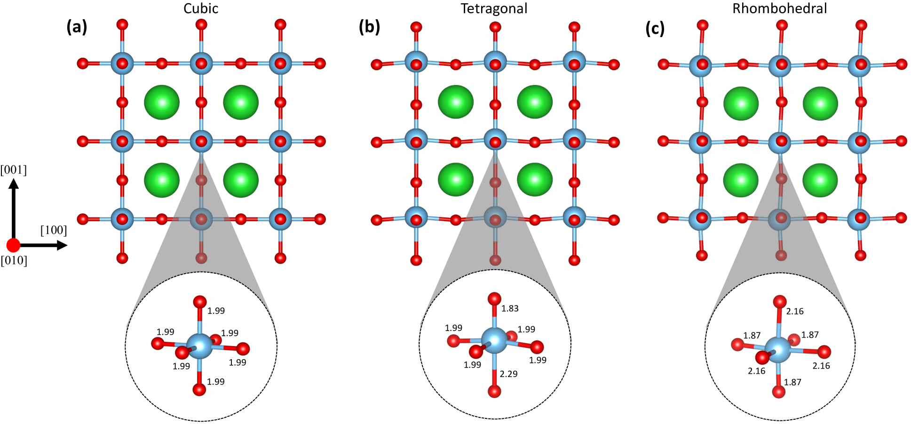
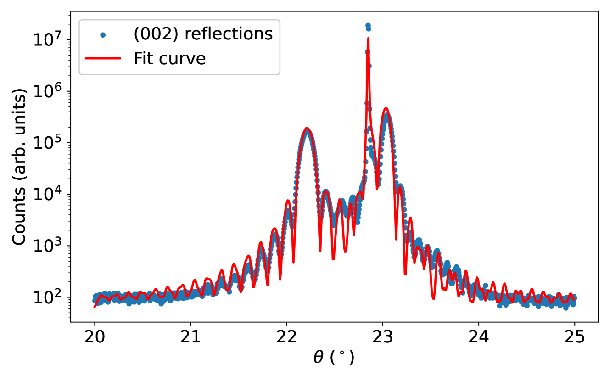
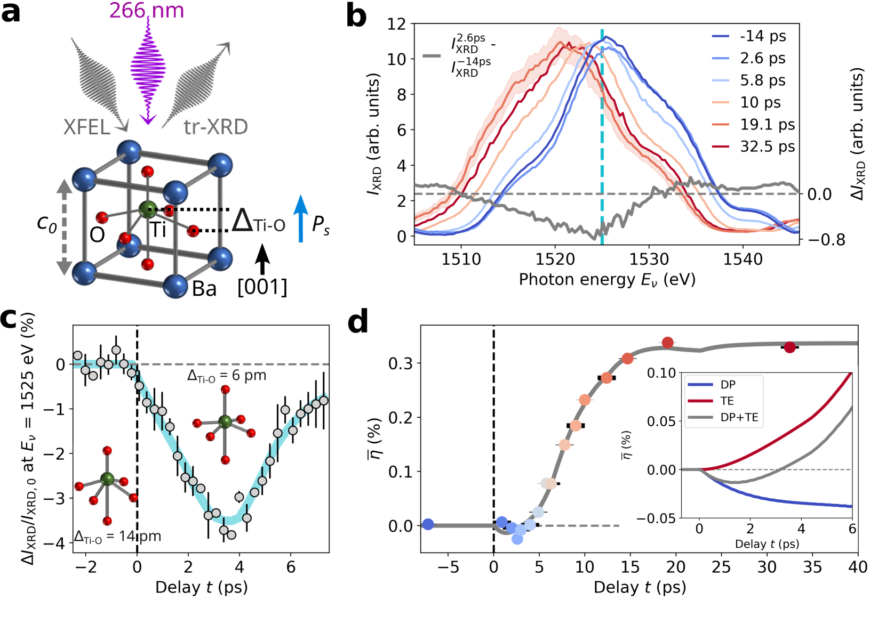

# 強誘電体の光応答を分子スケールで見る——BaTiO₃における異方的電子-フォノン結合と超高速キャリア分離

- **執筆日**: 2026-03-28
- **トピック**: ferroelectric-ultrafast-carrier
- **注目論文**: Swain et al., arXiv:2603.25521 (2026) — "Anisotropic light-electron-phonon coupling and ultrafast carrier separation in ferroelectric BaTiO₃"
- **参照関連論文数**: 6

---

## 1. 導入：なぜ今この話題か

「フォトボルタイクス」という言葉を聞くと、多くの人はシリコン太陽電池を思い浮かべるだろう。しかし近年、強誘電体（ferroelectric）材料が「光エネルギー変換」のまったく異なる舞台として注目を集めている。強誘電体とは、外部電場をかけなくても自発的な電気分極（spontaneous polarization）を持ち、しかもその向きを電場で反転できる誘電体の総称だ。代表例であるチタン酸バリウム（BaTiO₃）は、100年近い研究の歴史を持ちながら、今もなお新しい物理を提供し続けている。

なぜ今また BaTiO₃なのか。その鍵は「超高速電子-フォノン結合」と「偏極場によるキャリア分離」にある。光を照射するとフェムト秒（fs = 10⁻¹⁵秒）のタイムスケールで電子と正孔が生成されるが、それが実際にどのように分離・熱化していくかは、太陽電池・光触媒・非線形光学デバイスの効率に直結する基本問題だ。ところが従来の光学的プローブ手法では、強誘電体内部の分極場のどの向きに対して電子が緩和しているかまでは分からなかった。

2026年3月、Peter Baum（ドイツ、コンスタンツ大学）グループが arXiv に投稿した論文（2603.25521）は、超高速電子回折と超高速電子電気測定（electron electrometry）という二つの電子線技術を駆使して、この問いに初めて直接的な答えを与えた。実験が明らかにしたのは、強誘電分極の向きと光のポラリゼーションの向きが一致するとき、電子はフォノンにより速く緩和すること、そして分極の内部電場が電子-正孔対をリアルタイムで分離する様子を直接映像化できたという事実だ。この成果は、光励起を超高速で制御するという「フォト-フォノニクス」の新しい研究潮流に位置づけられる。

本記事では、強誘電体 BaTiO₃ における光励起ダイナミクスの最新知見を中心に、関連するポーラロン物理・量子幾何・超高速分極制御の研究を絡めながら、「なぜ分極が電子-フォノン結合を変えるのか」という核心的な問いを学部4年生向けに解説する。

---

## 2. 解決すべき問い

光を当てたとき、強誘電体の内部では何が起きているのか。この問いを分解すると、以下の三つの問いに行き着く。

**問い1：電子-フォノン結合は分極の向きに依存するか？**

電子-フォノン結合（electron-phonon coupling; EPC）は、光で励起された電子がどのくらい早く格子振動（フォノン）へエネルギーを渡すかを決める量である。結晶の対称性が低ければ低いほど、電子が感じるポテンシャルは方向によって異なる。強誘電体はまさに対称性が破れた系であるため、分極の向きによってEPCが異なるはずだという予想があった。しかし、それを実験で直接観測した例はなかった。

**問い2：強誘電体内部の built-in 電場は光生成キャリアをどのように動かすか？**

強誘電体の自発分極 $\mathbf{P}$ に伴う内部電場 $\mathbf{E}_{\rm dep}$（脱分極場, depolarization field）は、半導体の p-n 接合のような「内蔵電位」の役割を果たす。理論的には光で生成された電子・正孔がこの電場で引き離されるはずだが、それをフェムト秒精度で直接観測することは技術的に極めて困難だった。

**問い3：分極とひずみは光励起のタイムスケールで連動するのか？**

通常、強誘電体において電気分極 $\mathbf{P}$ と格子ひずみ $\eta$ は強く結合している（電気機械効果）。しかし光励起直後の非平衡状態では、両者が切り離されて独立に運動する可能性がある。この「脱結合」が起きるか否かは、超高速光スイッチングの原理として重要だ。

これら三つの問いは相互に絡み合っており、それを一挙に解明しようとしたのが今回紹介する一連の研究である。

---

## 3. 注目論文の新規性

### 超高速電子回折による「異方的 EPC」の直接証明

Swain et al.（arXiv:2603.25521）の核心は、**超高速電子回折（ultrafast electron diffraction; UED）** を用いて、BaTiO₃ における電子-フォノン結合が強誘電分極の方向に依存することを初めて直接示したことだ。

実験の設定はシンプルに説明できる。フェムト秒レーザーパルス（ポンプ）で BaTiO₃ 薄膜を励起し、それに続く超短時間後（遅延時間 $\Delta t$）に電子パルス（プローブ）を照射して回折パターンの変化を追う。デバイ-ワラー因子（Debye-Waller factor）の時間変化が格子温度の上昇、すなわちフォノン数の増加に対応するため、格子への熱化（thermalization）速度を定量的に追跡できる。

実験で鍵を握るのは、ポンプ光の偏光方向を強誘電分極 $\mathbf{P}$ に対して「平行」にした場合と「垂直」にした場合を比較することだ。結果として、**光の電場が $\mathbf{P}$ に平行なとき、電子はフォノンへ約30%速く緩和**することが示された。これが「異方的電子-フォノン結合」の実験的証拠である。

なぜこうなるのか。BaTiO₃ の伝導帯底はチタン (Ti) の 3d 軌道に由来する。強誘電相では Ti が O₆ 八面体の中心からずれており（図1）、このずれの方向と励起電子の運動量空間分布が相互作用する。分極方向と平行な光の電場は、その方向に沿った電子-イオン相互作用を増強し、結果としてフォノンへのエネルギー移動が加速される。

### 超高速電子電気測定によるキャリア分離の可視化

さらに Swain et al. は**超高速電子電気測定（ultrafast electron electrometry）** を用いて、強誘電体内部の内部電場による電子-正孔対の分離をリアルタイムで可視化した。

電子電気測定では、試料近傍を通過する電子パルスの偏向角を時間分解で測定する。強誘電体の脱分極場 $\mathbf{E}_{\rm dep}$ がキャリア分離によって変化すると、外部に漏れ出す電場も変化し、これが通過電子の偏向として検出される。つまり、直接的に分極場の時間変化（光によって引き起こされるキャリア移動）を観測できる。

実験の結果、バンドギャップ以上の光照射後、数ピコ秒（ps = 10⁻¹²秒）のタイムスケールで電子と正孔が分極場によって空間的に分離されることが確認された。これは強誘電体バルク光起電力効果（bulk photovoltaic effect; BPVE）の微視的描像を初めてフェムト秒精度で捉えたものであり、従来の光学的手法では到達できなかった知見である。

---

## 4. 背景と文脈

### BaTiO₃の強誘電性——古典的材料の量子的深み

BaTiO₃ はペロブスカイト構造（ABO₃ 型）を持ち、1940年代に強誘電性が発見された歴史ある材料だ。室温では正方晶相（4mm 対称性）をとり、Ti が酸素八面体の中心から約 0.01 nm ずれることで自発分極 $P_s \approx 27 \, \mu \rm{C/cm^2}$ が生じる。120℃以上では対称性の高い立方晶（常誘電相）、~0℃では斜方晶、~-90℃では菱面体晶へと相転移する。

$$
P_s = \frac{1}{V}\sum_i q_i^* \Delta z_i
$$

ここで $q_i^*$ は Born 有効電荷（Born effective charge）、$\Delta z_i$ は Ti や O の変位、$V$ は単位格子体積だ。この表式は分極が電荷と変位の積の和として表されることを示しており、光励起によって電荷分布が変わると分極もただちに変化することを意味する。

光エネルギーが約3.2 eV（バンドギャップ、UV 光）を超えると、酸素の 2p 軌道に起因する価電子帯からチタンの 3d 軌道に起因する伝導帯へ電子が励起される。この O→Ti の電荷移動は Born 有効電荷を変化させ、分極を変調する。これが後述する「分極とひずみの脱結合」の微視的起源だ。

### ポーラロン：格子に捕らわれた電子

強誘電体中では、光励起された電子や正孔が格子変形を伴って局在化することがある。このような「格子変形と電荷のカップリングによる準粒子」をポーラロン（polaron）と呼ぶ。特に変形が局所的なものを小ポーラロン（small polaron）と言う。

Joseph & Franchini（arXiv:2503.12693）は HSE06 混成汎函数を用いた第一原理計算で、BaTiO₃ の各結晶相における小ポーラロンの安定性を系統的に調べた。

*図1: BaTiO₃ の三つの結晶相と Ti の変位方向（arXiv:2503.12693, CC BY 4.0）*

結果として、電子ポーラロン（Ti 3d に局在）の安定化エネルギー（formation energy）は立方晶 < 正方晶 < 菱面体晶の順に大きくなることが示された。菱面体晶では Ti の変位が [111] 方向を向いており、これがポーラロンの格子変形と**建設的（constructive）に結合**するため、最も安定になる。

$$
E_{\rm POL} = E_{\rm dist}^{\rm loc} - E_{\rm unif}^{\rm deloc}
$$

これはポーラロン形成エネルギーであり、局在状態の格子変形エネルギー $E_{\rm dist}^{\rm loc}$ と、均一電子の脱局在エネルギー $E_{\rm unif}^{\rm deloc}$ の差として定義される。値が負のとき、ポーラロン形成が有利となる。

重要な点は、**ポーラロンの局在が局所的な強誘電変形を15〜68%変調する**一方、巨視的な自発分極には大きな影響を与えないことだ。この「局所的な非線形応答」が超高速励起後の電子-フォノン結合異方性の一端を担っている可能性がある。

### 超高速電子回折技術の発展

UED は「電子版の X 線パルス実験」と言える。X 線に比べて電子はサンプルとの散乱断面積が約10万倍大きいため、ナノメートル厚の薄膜でも十分な回折信号が得られる。フェムト秒レーザーを光陰極に照射して電子バンチを生成し、磁気レンズで集束してサンプルへ入射する。遅延時間を変えながら回折パターンを記録することで、原子変位の時間発展をサブ・ピコ秒精度で追跡できる。

電子電気測定はこれをさらに発展させたもので、試料近傍を通過する電子パルスが「電場プローブ」として機能する。分極電場の変化がパルスの偏向角に変換されるため、格子構造の変化（回折）と電荷分布の変化（電場）を同時に計測できる。この二種類の信号を組み合わせることで、格子・分極・電荷のダイナミクスを「三者同時観測」する道が開けた。

一方、BaTiO₃ の先行研究では時間分解第二高調波発生（tr-SHG）や時間分解X線回折（tr-XRD）が主要な手法として使われてきた。tr-SHGはSHG強度が $|P_s|^2$ に比例することを利用して分極を光学的に追跡する手法であり、サブ・ピコ秒の時間分解能を達成できる。tr-XRDはシンクロトロン放射光や自由電子レーザーを用いて格子ひずみを直接計測する。これらの光学・X線手法はサンプルの電荷分布（内部電場）には直接アクセスできない。電子線を用いた UED と電子電気測定の登場によって初めて、「電荷の動き」を格子情報と同時に計測できるようになったのだ。

---

## 5. メカニズム・比較・解釈

### 光励起後の BaTiO₃：5段階シナリオ

Schütz et al.（arXiv:2503.19808; *Nature Communications* 2025）は、時間分解 X 線回折（tr-XRD）と時間分解第二高調波発生（tr-SHG）を組み合わせて、BaTiO₃ の光励起後のダイナミクスを詳細に解析した。

$$
I_{\rm SHG} \propto |\chi^{(2)}_{ijk}|^2 \propto |P_s|^2
$$

SHG 強度が自発分極の二乗に比例する関係を利用して分極の時間発展を計測し、同時に X 線回折でひずみ $\eta$ を追跡した。結果として、次の5段階のシナリオが提案された。

*図2: 光励起後の5段階ダイナミクス（Schütz et al., arXiv:2503.19808, CC BY 4.0）*

1. **ステージ1（基底状態）**: 分極とひずみが平衡的に結合。
2. **ステージ2（0〜350 fs）**: 光励起キャリアが最大密度に達し、O→Ti 電荷移動が Born 有効電荷を変化させ、分極が約10%低下。格子はまだ動いていない。
3. **ステージ3（350 fs〜3.5 ps）**: 分極とひずみが**逆方向**に変化。電子-フォノン結合でエネルギーが格子に移り、ひずみが増大する一方、分極は回復し始める。
4. **ステージ4（3.5〜7 ps）**: 格子変位が部分的に回復、熱弾性効果でひずみが拡大。
5. **ステージ5（≥20 ps）**: 準安定状態。ひずみ成分よりも電子的な寄与が分極を支配しており、「分極とひずみの脱結合」が完結。

特筆すべきは、ステージ2〜3における「分極-ひずみ脱結合」だ。通常の平衡状態では電気機械効果によって $P \propto \eta$ が成り立つが、非平衡な光励起状態ではこの比例関係が崩れる。この脱結合を利用すれば、**ひずみに依存しない分極制御**——すなわち基板拘束の影響を受けない超高速光スイッチング——が原理的に実現できる。

*図3: tr-XRD（格子ひずみ）と tr-SHG（分極）の時間発展の比較（Schütz et al., arXiv:2503.19808, CC BY 4.0）*

### 電子-フォノン結合異方性の物理的起源

なぜ分極方向と平行な光照射で EPC が強まるのか。この問いに対する微視的答えは、**電子-フォノン結合シフトベクトル（EPC shift vector）** の概念を通じて理解できる。

Fan et al.（arXiv:2508.03257）は、フェインマン図に基づく量子力学的形式論を構築し、光による整合フォノン（coherent phonon）生成のカーネル $\Gamma_s^{\alpha\beta}(\omega_s;\omega_1,-\omega_1)$ を導いた。このカーネルの実体は次のように書ける：

$$
R_{mn}^{s;\beta} = -\partial_\beta \arg(g_{mn}^s) + r_{mm}^\beta - r_{nn}^\beta
$$

ここで $g_{mn}^s$ は電子-フォノン行列要素、$r_{mn}^\beta$ は位置行列の非対角要素（Berry 接続に相当）だ。$R_{mn}^{s;\beta}$ は「電子-フォノン結合によって生じる電子電荷中心のシフト量」を意味し、光学遷移に伴う電子の空間的再分配がどのフォノンモードを選択的に励起するかを決める。

非中心対称な系（強誘電体はその典型例）ではこのシフトベクトルが非ゼロになり、**光のポラリゼーションの向きによって励起するフォノンモードが変わる**。BaTiO₃ の場合、分極方向（$c$ 軸方向）と平行な光は、$c$ 軸に沿ったソフトモード（ferroelectric mode）および LO フォノンを優先的に励起する。これらのモードは格子の熱化に大きく寄与するため、EPC が実効的に強くなるという解釈が得られる。

### 二次元強誘電体での類似現象

同様の超高速ダイナミクスは、ファン・デル・ワールス強誘電体 NbOI₂ でも観測されている。Wang et al.（arXiv:2504.08089; *Nature Communications* 2025）は femtosecond UED と電子偏向法を用いて、NbOI₂ ナノ結晶の分極ダイナミクスを計測した。UV パルス照射後、分極は約2 ps で一時的に抑制され、その後回復・オーバーシュートして 200 ps 以上持続する増強状態が現れた。この回復は音響フォノンの生成（圧電応答）と密接に関係している。

BaTiO₃（三次元ペロブスカイト）と NbOI₂（二次元ファン・デル・ワールス層状構造）では、強誘電分極の起源が異なる：BaTiO₃ は Ti の変位モードによるイオン性分極が主体であるのに対し、NbOI₂ では Nb の面内変位が主体だ。それでも両者に共通するのは「光励起→電荷移動→Born 有効電荷変化→分極変調」という一連のメカニズムであり、強誘電体一般に普遍的なプロセスであることが示唆される。

Chu et al.（arXiv:2602.11504）は超高速電子顕微鏡と回折を組み合わせたナノスケール空間マッピングにより、NbOI₂ 中に三つの音響フォノンモード（2つの横波剪断モードと1つの縦波呼吸モード）が共存し、分極方向に垂直な横波モードが支配的であることを示した。これは分極-ひずみ結合の空間的不均一性を示しており、BaTiO₃ の場合と比較すると、二次元系では格子の異方性がより顕著に現れることが分かる。

---

## 6. 材料・手法・応用への広がり

### バルク光起電力効果への接続

強誘電体における光励起キャリアの非対称分離は、バルク光起電力効果（BPVE）として長年研究されてきた。BPVE は p-n 接合を必要とせず、材料の破れた反転対称性だけで光電流を生み出す効果であり、理論的には熱力学的上限（Shockley-Queisser 限界）を超える開放電圧が得られる可能性が指摘されている。BaTiO₃ の BPVE は1970年代から知られていたが、そのキャリア分離がどのようなタイムスケールと微視的メカニズムで起きるかは長らく謎だった。

BPVE の中心的な機構の一つがシフト電流（shift current）だ。シフト電流は光吸収に伴い電子の波束中心が実空間でシフトすること、すなわち前述の EPC シフトベクトルと類似した幾何学的量（Berry 位相的な寄与）から生じる。今回の Swain et al. が超高速電子電気測定で観測したキャリア分離の実時間追跡は、シフト電流の微視的起源を「動画」として捉えることに相当する。特に、分極方向に沿って電子と正孔が分離する様子は、シフトベクトルの主成分が分極方向（$c$ 軸）に沿っているという理論的予想と整合している。

二次元強誘電体 Nb₃X₈（X = Cl, Br, I）では、フラットバンド構造に由来する「純モメンタムシフト電流」という新しいメカニズムが理論的に予言されており（arXiv:2502.04624）、トポロジカル平坦バンドを持つ強誘電体における BPVE の新展開として注目される。このメカニズムでは実空間シフトではなくモメンタム空間のシフトが光電流を駆動するため、バンド分散が小さい（= 有効質量が大きい）フラットバンド系でも大きな光電流が期待できる。

### 超高速分極制御と光スイッチング

光で分極を制御するという発想は「フォトフェロエレクトリクス（photovoltaic ferroelectrics）」と呼ばれる新興分野を形成しつつある。Gu & Tangney（arXiv:2312.01446）は機械学習力場を用いた分子動力学シミュレーションにより、BaTiO₃ においてゾーン中心フォノン（強誘電モード）と高非調和な中心モードを選択的に励起することで、数百フェムト秒以内に分極方向を完全に反転できることを示した。これは10²テラヘルツクロックを目指した超高速メモリへの応用と直結する。

ここで重要なのは、光励起による分極制御が「外部電場による分極反転」とは本質的に異なる点だ。従来の強誘電体メモリではコイルや電極から電場をかけて分極を反転させる。この操作は最速でナノ秒オーダーであり、さらに持続的な電場印加が必要だ。対してフォトン励起では、材料固有のフォノン共鳴（ソフトモード周波数）に同期したパルスを用いることで、フェムト秒〜ピコ秒の時間スケールで非熱的な分極操作が可能になる。

さらに Schütz et al.（arXiv:2503.19808）が実証した「分極-ひずみ脱結合」は、基板拘束（substrate clamping）の問題を回避する新しい設計原理を提供する。強誘電体薄膜を基板上に形成すると、格子ミスマッチによるひずみが分極の大きさや安定性を変える。しかし超高速光励起を用いれば、ひずみが追いつく前（サブピコ秒）に分極を変調できる。圧電デバイスの文脈では、ひずみと分極の独立制御は機能設計の自由度を大幅に広げる。

### フォノニクスと情報処理

「フォノニクス」は熱的フォノン（拡散）ではなく、整合フォノン（コヒーレントな波）を信号キャリアとして使う考え方だ。Fan et al.（arXiv:2508.03257）が提案したEPC シフトベクトルの量子幾何的起源は、特定のフォノンモードを選択的に光励起する新たな手段を示しており、BaTiO₃ のような強誘電体を光-フォノン変換素子として使う道を開く。

また Tang & Bauer（arXiv:2510.18588）は、強誘電体中に「マルチフェロン（multiferron）」と呼ぶ準粒子——電気双極子と磁気双極子を同時に持つ——が存在し得ることを理論的に予言した。このマルチフェロンが実験的に確認されれば、強誘電体単体で多強誘電的機能（magneto-electric coupling）を発現させることが可能になり、スピントロニクスとの融合が期待できる。

---

## 7. 基礎から理解する

### 電子-フォノン相互作用の基礎

電子-フォノン相互作用は固体中の電子と格子振動の間のカップリングであり、電気抵抗・超伝導・光吸収後の緩和など、様々な現象の基礎にある。ハミルトニアンは一般的に次のように書ける：

$$
H_{\rm el-ph} = \sum_{k,k',\lambda} g_{k',k}^{\lambda} \, c_{k'}^\dagger c_k (b_{-\lambda,k-k'} + b_{\lambda,k'-k}^\dagger)
$$

ここで $c_k$（$c_k^\dagger$）は電子の消滅（生成）演算子、$b_\lambda$（$b_\lambda^\dagger$）はフォノンの消滅（生成）演算子、$g_{k',k}^{\lambda}$ は電子-フォノン結合行列要素だ。$g$ の大きさが大きいほど電子は格子に速くエネルギーを渡し、「格子温度の上昇」として観測される。

超高速電子回折では、デバイ-ワラー因子 $e^{-2W(t)}$（$W$ は平均二乗変位に比例）の時間変化を回折強度の減少として観測する。格子温度 $T_{\rm lat}(t)$ が上昇するほど $W$ が増大し、回折スポットが弱まる。この減少率の速さが電子から格子への熱移動速度、すなわち $g$ の強さに対応する。

### 強誘電性の軟モード理論

強誘電相転移は「軟モード（soft mode）」理論で理解できる。立方晶から正方晶への転移温度（キュリー点 $T_c \approx 120$°C）に近づくにつれ、Ti の振動周波数 $\omega_{\rm TO}$ が次のようにゼロへ向かって「軟化」する：

$$
\omega_{\rm TO}^2 \propto (T - T_c)
$$

転移点以下では $\omega_{\rm TO}^2 < 0$ となり（不安定モード）、Ti が自発的にオフセンター変位して安定化する。光励起によって電子分布が変化すると、この軟モードの周波数が一時的に変化し、分極の大きさと安定性に影響する。これが「分極の超高速変調」の根本的なメカニズムだ。

### バルク光起電力効果のシフト電流描像

通常の太陽電池では p-n 接合の空乏層電場によってキャリアが分離される。BPVEではこの接合が不要で、材料の空間反転対称性の破れ自体が光電流を生む。

シフト電流密度は次のように書ける：

$$
j_{\rm shift}^\gamma = \sigma_{\rm shift}^{\gamma;\alpha\beta} E_\alpha E_\beta^*
$$

ここで $\sigma_{\rm shift}^{\gamma;\alpha\beta}$ はシフト電流コンダクタンステンソルで、波動関数の Berry 位相（具体的にはシフトベクトル $R_{mn}^\gamma$）と光学的遷移確率の積として表される：

$$
\sigma_{\rm shift}^{\gamma;\alpha\beta}(\omega) = \frac{\pi e^3}{\hbar^2} \sum_{n \neq m,k} f_{nm} |r_{mn}^\alpha|^2 R_{mn}^\gamma \, \delta(\varepsilon_{mk} - \varepsilon_{nk} - \hbar\omega)
$$

$r_{mn}^\alpha$ は運動量行列要素、$R_{mn}^\gamma = -\partial_\gamma \arg(r_{mn}^\alpha) + A_{mm}^\gamma - A_{nn}^\gamma$ がシフトベクトル（$A$ は Berry 接続）だ。対称性の破れが大きいほどシフトベクトルが大きくなり、BPVE が増強される。今回の研究で直接観測されたキャリア分離の実時間ダイナミクスは、この式が記述する光電流生成の「瞬間」を可視化したものと解釈できる。

### 超高速計測の時間・空間スケール

本稿で登場する現象のタイムスケールを整理しておこう。

| 過程 | 典型的時間スケール |
|---|---|
| 光子吸収（電子励起） | < 1 fs |
| 電子-電子散乱（キャリア熱化） | 10〜100 fs |
| 電子-フォノン散乱（格子加熱） | 0.1〜1 ps |
| 音響フォノン伝播（ひずみ波） | 1〜10 ps |
| キャリア再結合（輻射） | 10 ps〜1 ns |
| 分極緩和（ドメイン反転） | ns〜μs |

注目論文が明らかにしたEPC の異方性は「電子-フォノン散乱」のタイムスケールに現れ、その後のキャリア分離は「音響フォノン伝播」のタイムスケールで進行する。これらの過程が分離して観測できたのは、UED と電子電気測定の組み合わせによって「格子（回折）」と「電荷（電場）」を独立に追跡できたからに他ならない。

### 二温度モデルと電子-格子エネルギー交換

超高速レーザー励起後の金属や半絶縁体では、「二温度モデル（two-temperature model; TTM）」がしばしば使われる。

$$
C_e \frac{dT_e}{dt} = -G(T_e - T_l) + S(t), \quad C_l \frac{dT_l}{dt} = G(T_e - T_l)
$$

$T_e$・$T_l$ は電子温度・格子温度、$C_e$・$C_l$ はそれぞれの熱容量、$G$ は電子-フォノン結合係数、$S(t)$ は光の吸収ソース項だ。パルス照射直後は $T_e \gg T_l$ となり、時定数 $\tau_{el} \approx C_e/G$ で格子へエネルギーが移動する。BaTiO₃ の場合、この $G$ が分極方向に対して約30%変化することが今回の実験で示された。つまり、強誘電体における TTM は**方向依存性を持つ結合係数 $G(\hat{P})$ を導入した「異方的二温度モデル」** として修正する必要があることを、今回の研究は暗示している。この修正は、圧電デバイスの熱設計・光吸収体の性能予測など応用計算にも影響を与え得る重要な示唆だ。

---

## 8. 重要キーワード10個

1. **強誘電体（ferroelectric）**: 外部電場なしで自発的な電気分極を持ち、その向きを電場で反転できる誘電体。BaTiO₃ が典型例。

2. **電子-フォノン結合（electron-phonon coupling; EPC）**: 電子と格子振動の間の相互作用。電気抵抗・超伝導・光励起後の緩和速度を決定する本質的パラメータ。

3. **超高速電子回折（ultrafast electron diffraction; UED）**: フェムト秒電子パルスを用いた時間分解回折法。格子変位のダイナミクスをサブ・ピコ秒精度で追跡する。

4. **電子電気測定（electron electrometry）**: 電子パルスの偏向を測定して電場の変化を検出する手法。強誘電体のキャリアダイナミクスや分極変化の直接計測に適用される。

5. **自発分極（spontaneous polarization）**: 外部電場なしで結晶中に生じる巨視的電気分極。対称性の破れとBorn有効電荷の積として記述される。

6. **バルク光起電力効果（bulk photovoltaic effect; BPVE）**: p-n 接合なしで非中心対称材料が光電流を生む現象。シフト電流とボリスティック電流が主な機構。

7. **シフト電流（shift current）**: バルク光起電力効果の機構の一つ。光吸収に伴う電子の波束中心の実空間シフト（Berry位相的な幾何学量）から生じる。

8. **デバイ-ワラー因子（Debye-Waller factor）**: 格子振動による原子の平均二乗変位に起因して回折強度が低下する効果を表す因子。超高速電子回折で格子温度の時間変化を追う際の主要な観測量。

9. **小ポーラロン（small polaron）**: 電子（または正孔）が格子変形を伴って局在化した準粒子。BaTiO₃ では Ti 3d 軌道に局在し、強誘電変位と建設的に結合する。

10. **EPC シフトベクトル（EPC shift vector）**: 電子-フォノン結合による電子電荷中心の移動量を記述する幾何学的量。光照射によってどのフォノンモードが選択的に励起されるかを決定し、シフト電流との類似性を持つ。

---

## 9. まとめと今後の論点

### まとめ

Swain et al.（arXiv:2603.25521）は、超高速電子回折と電子電気測定の組み合わせによって、BaTiO₃ の強誘電分極が電子-フォノン結合の異方性を生み出すことを初めて直接実証した。光の偏光が強誘電分極方向と平行のとき、電子からフォノンへのエネルギー移動が約30%加速され、さらに脱分極場が光励起キャリアをフェムト秒精度で分離させる様子がリアルタイムで観測された。

これはバルク光起電力効果の微視的動画というべき成果であり、シフト電流の起源（EPC シフトベクトル）と光励起後の5段階ダイナミクス（分極-ひずみ脱結合）と合わせると、強誘電体における光-電子-フォノン相互作用のコンプリートな描像が見えてくる。

関連研究（arXiv:2503.19808, 2503.12693, 2504.08089, 2602.11504, 2508.03257）を俯瞰すると、二次元ファン・デル・ワールス強誘電体から古典的ペロブスカイトまで、「超高速光照射→非平衡電荷移動→フォノン選択励起→分極変調」というシーケンスが共通のパラダイムとして浮かび上がる。

### 今後の論点

**論点1：EPC 異方性の定量的理論モデルは？**
今回の実験から得られた「30%速い緩和」の数値的説明には、BaTiO₃ のソフトモード・LO フォノン・電子バンド構造を自己無撞着に組み合わせた ab initio 計算が必要だ。特に Ti 3d の軌道対称性がどのようにEPC 行列要素に反映されるかを定量化する理論研究が期待される。

**論点2：ポーラロンはキャリア分離を遅らせるか？**
Joseph & Franchini の研究が示すように、光励起電子は格子変形を伴った小ポーラロンとして局在化し得る。ポーラロンの形成時定数が EPC よりも速ければ、キャリア分離効率が下がる「ポーラロントラップ」が問題になる。超高速電子電気測定の感度でポーラロン形成を直接観測できるかが鍵だ。

**論点3：二次元系では異方的 EPC はどう発現するか？**
NbOI₂ での実験（arXiv:2504.08089）では分極ダイナミクスは観測されているが、EPC の偏光依存性は未計測だ。二次元材料では層間ファン・デル・ワールス力が弱いため、面内・面外の EPC 異方性がより顕著に現れると予想される。

**論点4：超高速光スイッチングへの応用可能性**
Gu & Tangney（arXiv:2312.01446）が理論的に示した「フェムト秒分極スイッチング」を実験的に実証するには、Swain et al. が開発した電子電気測定が最適のプローブになり得る。分極方向が100 fs スケールで反転する「超高速不揮発性メモリ」の概念実証が視野に入ってきた。

**論点5：マルチフェロンの実験的検証**
Tang & Bauer（arXiv:2510.18588）が予言したマルチフェロン（電気・磁気双極子の合成準粒子）は、テラヘルツ光で励起・検出できる可能性がある。BaTiO₃ のような強誘電体でテラヘルツ応答の非線形測定を行い、マルチフェロンのシグネチャーを探索することが次の実験課題となるだろう。

---

*本記事は以下のプレプリントおよび論文の内容を統合して執筆した。arXiv:2603.25521 (CC BY 4.0)、arXiv:2503.19808 / Nat. Commun. 16, 7966 (2025) (CC BY 4.0)、arXiv:2503.12693 (CC BY 4.0)、arXiv:2504.08089、arXiv:2602.11504、arXiv:2508.03257。図はライセンスを確認のうえ使用した（CC BY 4.0 のみ使用）。*
