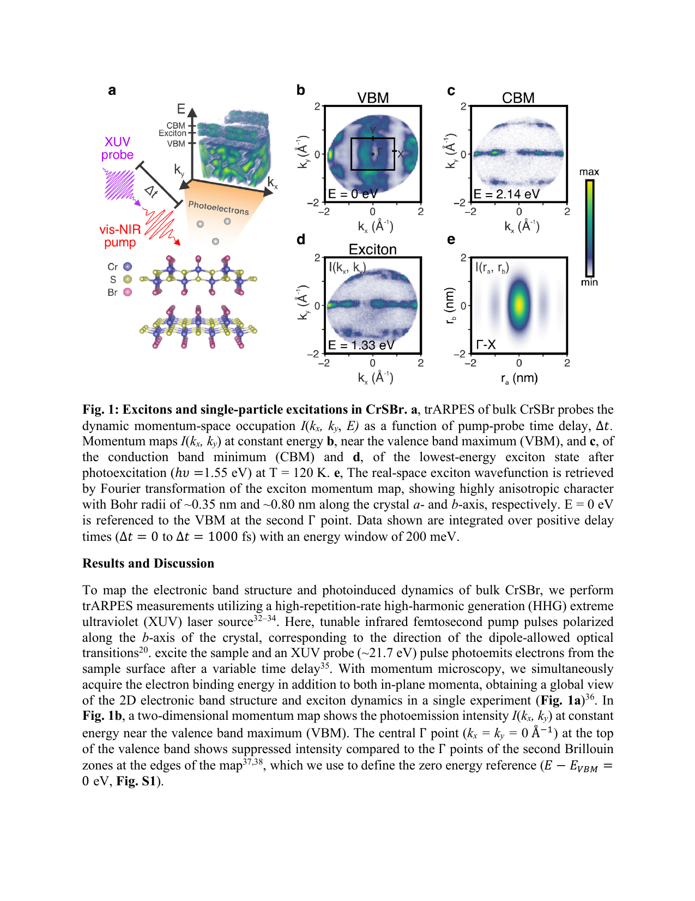
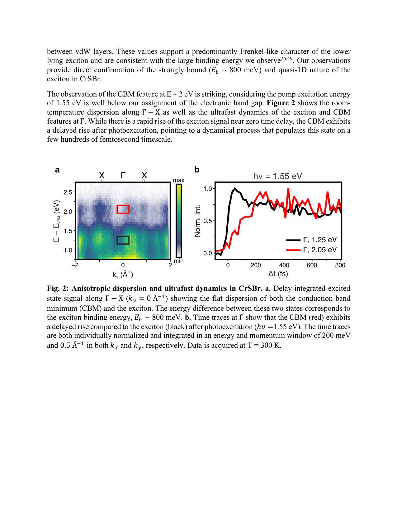
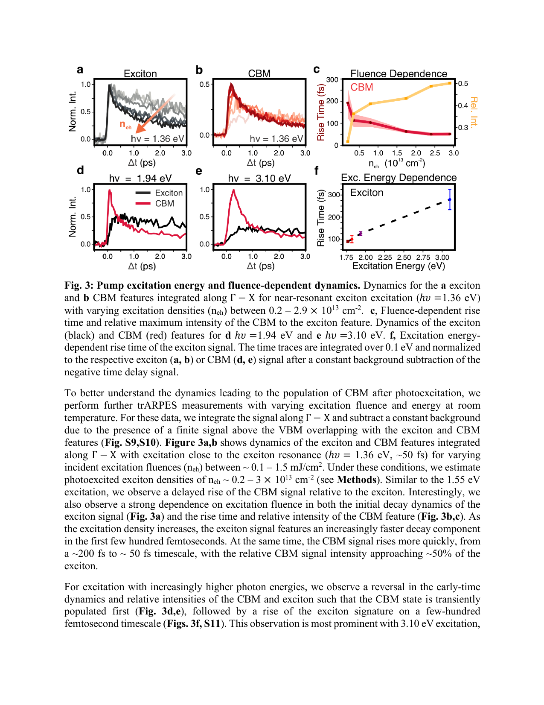
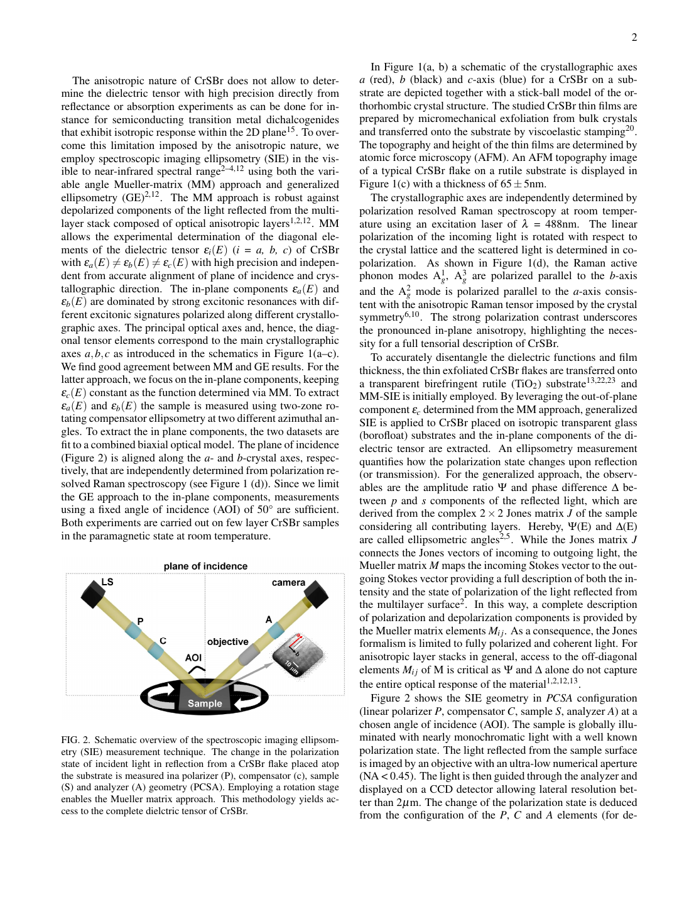
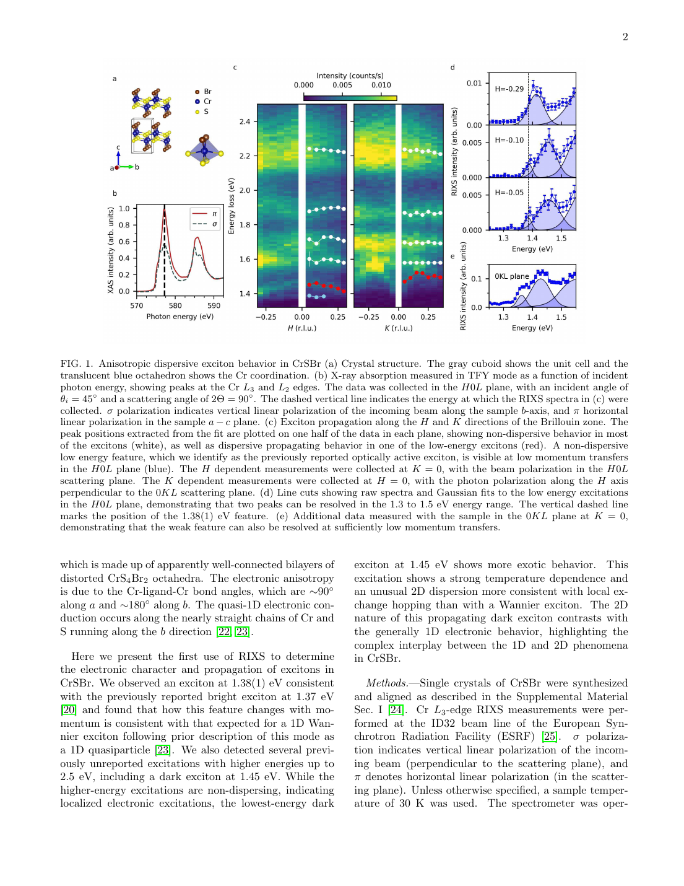
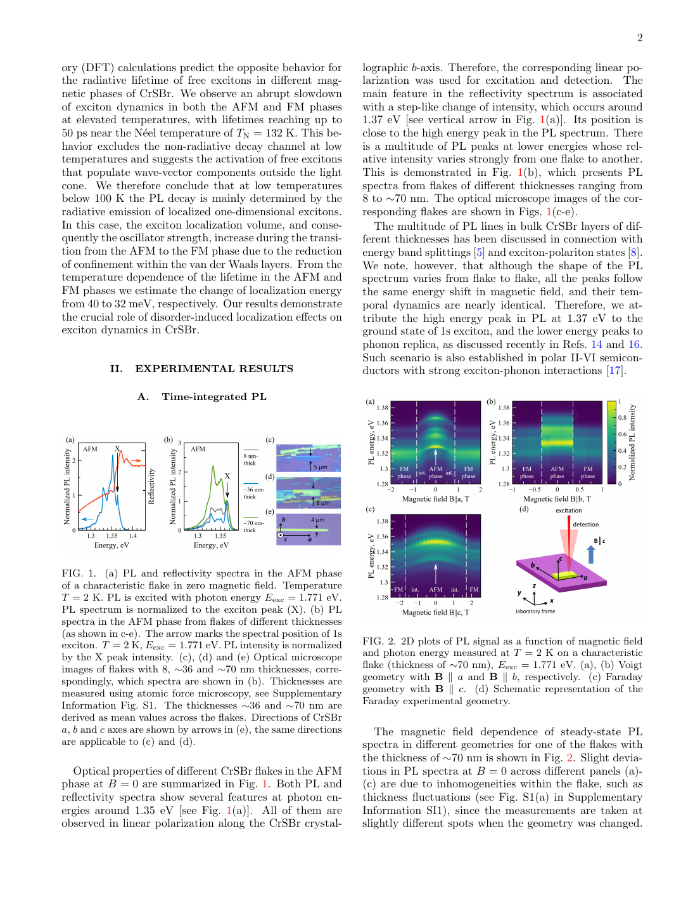
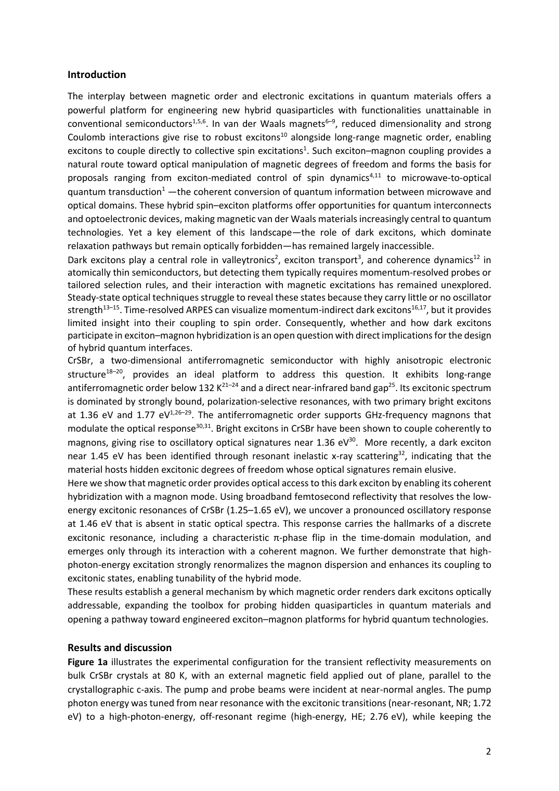
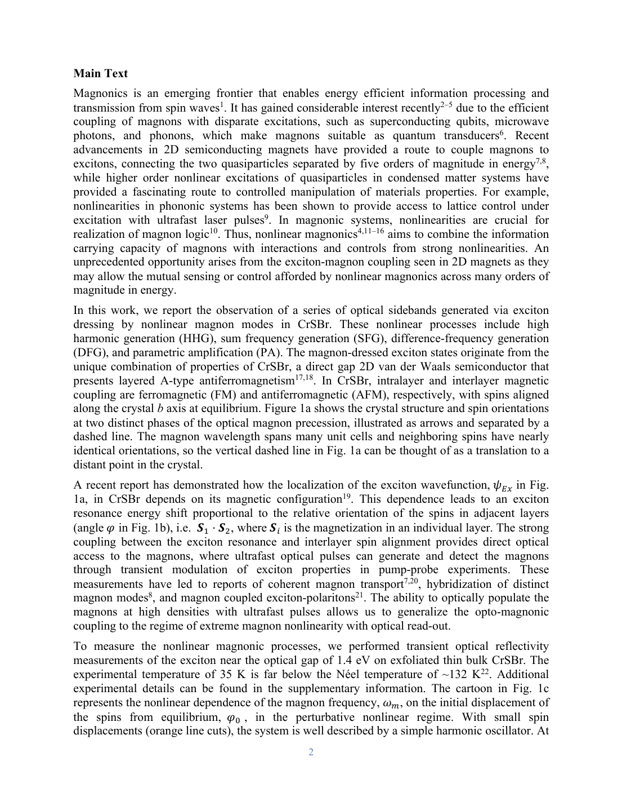

# 磁性van der Waals半導体CrSBrにおける超強束縛励起子の超高速ダイナミクス：時間分解ARPESが切り開く運動量空間描像

- **執筆日**: 2026-03-31
- **トピック**: CrSBr 磁性van der Waals半導体 / 超強束縛励起子 / 時間分解ARPES（tr-ARPES）/ 励起子–マグノン結合
- **タグ**: Nonequilibrium and Dynamic Response / Excitons and Photoinduced Response; Magnons and Spin Dynamics / Pump-Probe Measurements
- **注目論文**: arXiv:2603.26294 — *Ultrafast Formation and Annihilation of Strongly Bound, Anisotropic Excitons*, Lloyd et al. (2026)
- **参照関連論文数**: 7本

---

## 1. なぜ今この話題なのか

凝縮系物理の世界で、「励起子」が再び熱い視線を浴びている。励起子とは、光によって電子が価電子帯から伝導帯に励起されたとき、抜け穴（ホール）と電子がクーロン力で引き合ってできる束縛状態のことだ。分子のように振る舞うこの準粒子は、半導体の光吸収・発光過程を決定づけ、かつレーザー発振やトランジスタ動作に深く関わる。古くから研究されてきた励起子物理だが、2010年代以降に爆発的に注目を集めたのが、グラフェンに代表される二次元van der Waals（vdW）物質群の台頭である。単原子層あるいは数原子層に量子閉じ込めされた励起子は、バルク半導体のそれより桁違いに大きな結合エネルギーを持ち、室温でも安定に存在できる。

その流れの中で、磁気秩序を持つvdW物質が新たな「場」として浮上してきた。磁性と励起子物理が共存する系では、磁気励起（マグノン）と励起子が絡み合い、まったく新しい非平衡現象が現れる。代表選手のひとつが**CrSBr**——クロム硫黄臭素化物からなる積層型反強磁性半導体である。CrSBrは光学的には大きな異方性を持ち、光吸収スペクトルにくっきりした励起子ピークを示す。しかしその励起子が実際どんな空間的・運動量的構造を持ち、光励起後どのような時間発展をたどるのかは、長らく詳細不明のままだった。

そこに突破口を開いたのが、**時間分解角度分解光電子分光（tr-ARPES; time- and angle-resolved photoemission spectroscopy）**という手法だ。ARPESはもともと物質の電子バンド構造を運動量分解で直接可視化する分光法だが、超短パルスレーザーと組み合わせた時間分解版では、光励起直後から始まる電子系の超高速ダイナミクスをフェムト秒の時間分解能でスナップショット撮影できる。単に「励起子ができた・消えた」を光学的に追うだけでなく、励起子や自由キャリアが**運動量空間のどこに居て、どう動くか**を直接マッピングできる点が革命的だ。

2026年3月末に arXiv に投稿された Lloyd et al. の論文（arXiv:2603.26294）は、まさにこのtr-ARPESをバルクCrSBrに適用し、約800 meVという桁違いに大きな励起子結合エネルギーを直接測定するとともに、フェムト秒スケールの形成・消滅ダイナミクスを詳細に解明した。本記事では、この注目論文を軸に据え、CrSBrの励起子物理をめぐる研究の全体像を整理する。

---

## 2. この分野で何が未解決なのか

CrSBrの励起子研究は急速に発展しているが、以下の根本的な問いが積み残されていた。

**問い①：励起子の「性格」は何か——Frenkel型かWannier-Mott型か**

励起子は結合エネルギーと空間的広がりで、二つの極限に分類される。一方は有機結晶に典型的な**Frenkel励起子**で、電子とホールがほぼ同一格子点に局在し、結合エネルギーが～eV、ボーア半径が原子スケールにとどまる。他方は無機半導体に多い**Wannier-Mott励起子**で、誘電遮蔽が強いため電子とホールが広く離れ、結合エネルギーは数十meVに抑えられる。CrSBrの励起子は結合エネルギーが数百meV級と光学実験から示唆されていたが、その真の空間的性格——つまりどれほどの広がりを持ち、どの軸方向に異方性があるのか——は間接的な推測の域を出ていなかった。

**問い②：光励起直後、系はどんな経路をたどるか——励起子か自由キャリアか**

フォトルミネセンスや反射スペクトルは「定常状態」の励起子を記述するが、光励起の「直後」に系がどのように緩和するかは別問題だ。光子を吸収した系が最初に自由キャリア（バンド間遷移）を形成し、その後励起子へと変換されるのか、それとも最初から励起子として生成されるのか。この時間的経路の違いは、デバイス動作や非平衡物性を理解する上で本質的に重要だが、実験的検証は困難だった。

**問い③：マグノンと励起子の絡み合いはどの程度深いか**

CrSBrは反強磁性転移温度（ネール温度）T_N ≈ 132 Kを境に磁気秩序が変化する。励起子エネルギーや寿命が磁気秩序に依存することは光学実験で示されていたが（arXiv:2601.05413）、暗励起子がマグノンとの混成によって光学的に可視化されるという報告（arXiv:2511.20268）や、マグノンの非線形励起による光サイドバンドの生成（arXiv:2411.14943）など、マグノン–励起子結合の深さは想像以上であることが次々と判明しつつある。この結合の微視的機構と、それが超高速ダイナミクスに与える影響は未解明だ。

**問い④：次元性の矛盾——準1D電子構造なのに2D励起子伝播？**

CrSBrのバンド分散はb軸方向に一次元的な特徴を持ち、電気伝導率も強い異方性を示す。ところが最近のRIXS実験（arXiv:2501.06372）は、暗励起子がa-b面内を等方的に伝播するという驚くべき事実を明らかにした。明るい励起子の準1D性と暗励起子の2D伝播という対照的なふるまいの起源は何なのか？

---

## 3. 注目論文の核心：何が前進し、何がまだ仮説か

### tr-ARPESという測定の新鮮さ

Lloyd et al. (arXiv:2603.26294) の最大の貢献は、「tr-ARPESをバルクCrSBrに適用した」という事実それ自体に宿っている。

ARPESでは、紫外線（UV）や極端紫外線（XUV）フォトンを物質表面に照射し、光電効果で飛び出した電子のエネルギーと運動量を同時計測する。これにより電子のバンド分散 $E(k_{\parallel})$ を直接得ることができる。時間分解版では、まず**可視・近赤外（vis-NIR）ポンプパルス**で物質を光励起し、変化した電子状態を一定の時間遅延（Δt）ののちに**XUVプローブパルス**で光電子分光する（Fig.1a）。XUVプローブは高エネルギー高調波生成（HHG）光源から得られ、Δtをフェムト秒精度で変化させることで、励起後の電子ダイナミクスをスナップショット的に追う。

**Fig. 1**: tr-ARPESの実験配置と運動量空間マップ（arXiv:2603.26294 Fig.1, CC BY 4.0）。(a) XUVプローブ・vis-NIRポンプを用いたtr-ARPES配置の模式図とCrSBr結晶構造。(b, c) 光励起前の価電子帯最大点（VBM）と伝導帯最小点（CBM）の二次元運動量マップ。(d) 光励起後に現れる励起子の運動量マップ。(e) Fourier変換によって得られた実空間の励起子波動関数。

この手法で得られる二次元運動量マップ $I(k_x, k_y)$ は、VBM・CBM・励起子それぞれの「在処」を運動量空間で区別できる。さらにそのFourier変換を取れば、実空間での励起子波動関数の形状も抽出できる。これが従来の光学測定に対してtr-ARPESが持つ圧倒的なアドバンテージだ。

### 約800 meVという桁違いの結合エネルギー

T = 120 K でポンプ光を照射すると、VBM（Γ点付近）から約2.14 eVのCBMとは別に、約1.33 eVのエネルギーに新たな光電子シグナルが現れる。CBMと励起子シグナルのエネルギー差から直接結合エネルギーを読み取ると、$E_b \approx 2.14 - 1.33 = 0.81$ eV という値が得られる（**Fig. S2–S6**も参照）。

この数字は驚異的だ。典型的な無機半導体のWannier-Mott励起子の結合エネルギーは数十meV程度であり、3Dバルク材料ではこれほど大きな値は通常見られない。単層MoS₂など2D遷移金属ダイカルコゲナイド（TMD）では誘電遮蔽の低下から500 meV程度の結合エネルギーが報告されているが、それはあくまで2D極限の話だ。CrSBrはvan der Waals積層構造を持つとはいえ、今回測定されたのはバルク試料である。にもかかわらず～800 meVに達する結合エネルギーが観測された背景には、CrSBrの特異な電子構造——低い誘電定数と強い異方性——が関与していると考えられる。

### 準1次元的な励起子波動関数

励起子の運動量マップ $I(k_x, k_y)$ をFourier変換すると、実空間での相対波動関数 $\psi(r)$ の二乗が得られる（**Fig. 1e**）。これを見ると、a軸方向のBohr半径は約0.35 nm、b軸方向は約0.80 nmと、二軸で倍以上の差がある。この空間的異方性は、CrSBrのバンド分散が主としてb軸に沿った伝導チャンネルを持ち、b軸方向に大きな有効質量を持つa軸と対称性が破れていることと整合する。電子とホールがb軸に沿って広がり、a軸では局在している——これはFrenkelとWannier-Mottの中間に位置するような「準一次元的」励起子である。下層vdW層間でのクーロン遮蔽は限定的で、各層内の1D鎖が励起子の規定する舞台となっていると考えられる。

先行研究（arXiv:2403.10867）のARPES測定は、CrSBrの交換分裂を伴う電子構造（主にBrとSの寄与で形成される交換分裂したバンド対）を明らかにしていたが、実空間での励起子波動関数の直接抽出は今回が初めてである。DFT計算（arXiv:2603.13494）もこの描像を支持しており、誘電感受率の異方性からBr-S軌道の混成が支配的なことを確認している。

### 超高速形成・消滅ダイナミクス

時間分解測定（Fig. 2）では、ポンプ光の波長（エネルギー）と励起密度を系統的に変えながら、励起子（exciton）とCBM（free carrier/conduction band minimum）のシグナル強度の時間発展を比較した。

**Fig. 2**: 励起子とCBMの超高速ダイナミクス（arXiv:2603.26294 Fig.2, CC BY 4.0）。(a) Γ–X方向での光励起状態のARPES強度マップ。励起子は平坦な分散（赤枠）、CBMは約800 meV上に位置する（黒枠）。(b) Γ点での励起子（黒）とCBM（赤）の時間プロファイル比較。CBMのシグナルには数百フェムト秒の遅延が観測される。

**共鳴励起（hν ≈ 1.36 eV）**では、励起子とCBMのシグナルがほぼ同時に立ち上がる。励起子エネルギー付近の光子を吸収した系は、まず励起子として生成され、一部が自由キャリアへと「昇温（電離）」することを示唆する。

一方、**上部励起（hν = 1.94 eV や 3.10 eV）**では状況が逆転する。CBMのシグナルが先に急峻に立ち上がり、励起子のシグナルはそれより数百フェムト秒遅れて現れる（**Fig. 3**）。これは光子を吸収した系がまず自由な電子–ホールペア（自由キャリア）として生成され、その後クーロン相互作用によって結合して励起子を形成するという、**励起子の遅延形成**シナリオを強く支持する。

**Fig. 3**: ポンプ光エネルギーと励起密度に対する励起子とCBMのダイナミクス依存性（arXiv:2603.26294 Fig.3, CC BY 4.0）。(a–e) 異なるポンプ波長における励起子（黒）とCBM（赤）の時間プロファイル。(f) 励起エネルギーに対するCBM立ち上がり時間のプロット。エネルギーが高いほどCBMが先行して励起子の形成が遅れる。

さらに重要なのは**励起密度依存性**だ。低密度領域では励起子シグナルが明瞭に観測されるが、励起密度を $N_0 \approx 4 \times 10^{13}$ cm$^{-2}$ 付近（**Mott密度**付近）まで上げると、励起子シグナルが抑制されCBMシグナルが卓越してくる。この転換は、励起子が電子–ホールプラズマへと溶けて行く量子臨界現象——**励起子Mott転移**——の端緒とも解釈できる。また、高励起密度でのエクシトン消滅は**励起子–励起子消滅（EEA; exciton-exciton annihilation）**のメカニズムが支配的であることも、動力学的解析から示されている。

### 何がまだ仮説か

この論文の限界点もいくつか指摘しておく必要がある。第一に、今回の測定は主に $T = 120$ K（反強磁性秩序相）と$T = 300$ K（常磁性相）に限定されており、磁気転移をまたぐ連続的な温度依存性は取得されていない。第二に、tr-ARPESのプローブはXUVを試料表面から放出させるため、「表面敏感」である可能性がある。バルク内部の励起子ダイナミクスと表面のそれが一致しているかは保証されない。第三に、励起子のMott転移については密度の閾値推定があくまで間接的であり、厳密な理論との比較が必要だ。

---

## 4. 背景と研究史：この論文はどこに位置づくか

### CrSBrの物性的背景

CrSBrは直方晶系（Pmmn空間群）の積層半導体で、各層内でCr³⁺イオンが強磁性的に揃い、層間では反強磁性的に結合した「A型反強磁性体」として$T_N \approx 132$ K以下で秩序化する（磁化容易軸はb軸）。電気的には半導体であり、計算上の直接バンドギャップは約2 eV前後とされていたが、実験値は測定手法によって揺らいでいた。この揺らぎの原因のひとつは、光学スペクトルが本当の「一粒子ギャップ」ではなく「励起子ピーク」を反映しているためだ。Lloyd et al. の今回の測定は、ARPESによってCBMを独立に同定し（約2.14 eV at Γ）、かつ励起子シグナルを同時に同定することで、結合エネルギーを「直接差し引き」として決定するという画期的な方法を取った。

楕円偏光解析による誘電テンソルの精密測定（arXiv:2603.10698）は、CrSBrの光学的異方性を三方向の誘電関数テンソル成分として明らかにしている（Fig. 2参照）。A励起子が約1.3 eVでb軸偏光に対応し、B励起子が約1.7 eVで二つの直交する面内偏光成分を持つことが分かった。これはCrSBrの結晶構造が持つ直方晶対称性——a軸とb軸が非等価——を直接反映している。

**Fig. 4**: 楕円偏光解析によるCrSBrの誘電テンソル測定（arXiv:2603.10698 Fig.2, CC BY 4.0）。b軸偏光（赤）とa軸偏光（青）に対応するε成分の実部が、A励起子（1.3 eV）とB励起子（1.7 eV）の光学異方性を示す。

### DFTによる理論的背景

第一原理計算（DFT+U、GW法など）はCrSBrの電子構造計算において長年の課題を抱えてきた。磁性と相関電子系が絡む上、バンドギャップや励起子エネルギーの正確な予測には高精度の多体手法が要求される。arXiv:2603.13494 では、チューン済みハイブリッド密度汎関数にオンサイト補正を加えた計算法が提案された。この手法はGW+BSE（Bethe-Salpeter方程式）に匹敵する精度を、その百分の一の計算コストで達成できるとされ、得られる励起子結合エネルギーや分散の温度依存性が実験とよく一致している。この計算的ブレークスルーは、今後の磁性半導体の光学設計を加速する可能性がある。

### 光学的手法による先行研究との比較

光ルミネセンス（PL）、反射・透過スペクトル、四光波混合など光学手法によるCrSBrの励起子研究は2022年以降に急増した。これらは励起子エネルギー（1.3-1.4 eV付近）や磁場・温度依存性を精度よく測定できる一方、**運動量分解能**を持たない。tr-ARPESはその欠点を正確に補う手法として位置づけられる。

一方、RIXS（共鳴非弾性X線散乱）は少し異なる角度から励起子を見る技術だ。arXiv:2501.06372 のRIXS実験（PRL掲載）は、バルクCrSBrにおける**暗励起子（dark exciton）**の存在を明らかにした。暗励起子とは、光学選択則によって通常の光学測定では直接観測できない励起子状態で、スピン構造などが原因で遷移双極子モーメントがゼロになる状態だ。

**Fig. 5**: CrSBrの暗励起子の異方的分散（arXiv:2501.06372 Fig.1, CC BY 4.0）。(a) 結晶構造とRIXS散乱配置。(b) RIXSスペクトルの運動量依存性：1.45 eVの暗励起子は1D鎖に直角なH方向でも有限の分散を持ち、準1D電子構造とは対照的に2D的伝播を示す。

この実験が示した驚くべき事実は、暗励起子が結晶のa-b面内で**等方的に分散**することだ。b軸に沿って電子が優先的に動く単粒子電子構造の1D性とは全く異なる挙動であり、励起子の多体的性格（特に電子–ホールペアの「対称性」）が次元性を変える重要な証拠となっている。

---

## 5. どの解釈が最も妥当か：証拠・比較・限界

### 励起子のFrenkel的性格——どこまで確かか

今回の実験が示す~800 meVの結合エネルギーと~0.35 nm（a軸）程度のBohr半径は、通常のWannier-Mott的な大半径励起子の描像とは相容れない。CrSBrの誘電定数はおよそε ≈ 7–10 程度とされており、この値を単純なWannier-Mott公式に代入すると、

$$E_b^{\rm WM} = \frac{m^*_r e^4}{2\hbar^2 \varepsilon^2} \approx \frac{m^*_r}{m_e \varepsilon^2} \times 13.6 \text{ eV}$$

有効質量を大きく見積もっても（$m^*_r \sim 0.5 m_e$, $\varepsilon \sim 7$）$E_b \sim 140$ meV程度にしかならず、800 meVには遠く及ばない。これは、単純な平均場的誘電遮蔽では励起子の強束縛を説明できないことを意味する。

そこで鍵となるのが**局所的な誘電遮蔽の不均一性**と、CrSBrが持つ**準1D電子構造による有効次元性の低下**だ。1D系では誘電遮蔽の効果が弱く、クーロン相互作用が相対的に強くなる。加えて、低エネルギー光子に対してCrSBrの誘電定数は光学的に測定された値よりさらに小さい可能性がある（高周波極限）。DFT計算（arXiv:2603.13494）もWannier-Mott描像を超えた多体補正が必要であることを示している。

現状の最有力解釈は、CrSBrの最低エネルギー励起子がFrenkelとWannier-Mottの**中間的性格**を持つという「自己捕捉的（self-trapped）」あるいは「局在化したWannier励起子」の描像だ。電子とホールが有機物ほどは近接していないが、無機半導体ほどは広がってもいない——その空間規模を直接実測したことが今回の最大の成果である。

### 励起子–マグノン結合の証拠の重み

磁気秩序が励起子に与える影響は、arXiv:2601.05413 の時間分解PL実験によって鮮明に示された。

**Fig. 6**: CrSBrにおける励起子寿命の磁気切替え（arXiv:2601.05413 Fig.1, CC BY 4.0）。(a) 定常PLスペクトルと楕円偏光反射スペクトル（T=2 K）。(b) 磁場を加えてAFM相からFM相へ転換すると、励起子寿命が11 psから7 psへと短縮する。(c) 磁場方向と磁気構造の模式図。

反強磁性相（AFM）では励起子の輻射寿命が約11 ps、外部磁場を印加して強磁性相（FM）に転換すると約7 psへと短縮する。著者らはこの短縮の原因として、FM相では励起子局在体積が増大し、振動子強度が増加するためと解釈した。局在体積の増大はFM相でのバンド分散の変化と整合する。この実験は、「励起子の時間的ダイナミクスが磁気構造に直結している」ことを決定的に示したという意味で重要だ。

さらに踏み込んだ結合は、arXiv:2511.20268 の超高速分光が明らかにした。**磁気秩序が確立すると、本来は「暗い」励起子がマグノンと混成して光学的に可視になる**というのだ。

**Fig. 7**: 磁気秩序が暗励起子の光学的観測を可能にするメカニズム（arXiv:2511.20268, CC BY 4.0）。磁気秩序が確立することで、1.46 eVの暗励起子がマグノンモードと結合し、コヒーレントな量子混成状態が形成される。高エネルギー光子照射でこの混成状態を能動的に制御できることが示された。

この「励起子–マグノン混成」は、理論的にはスピン反転を伴う交換相互作用が励起子の面内輸送チャンネルを開くことで説明される。実験的にはT_N以下の温度でのみ観測され、高温でマグノン自体が消えると暗励起子の光学シグナルも消える。このことは、磁気秩序が励起子の光学的「可視性」を切り替えるスイッチとして機能することを意味する——デバイス応用上、きわめて魅力的な性質だ。

非線形領域まで踏み込んだのが arXiv:2411.14943 の実験で、マグノンと励起子の**非線形結合**によって光学スペクトルに**マグノンの高調波成分（最大20次）**が現れることを報告した。

**Fig. 8**: 非線形マグノンによる励起子ドレッシング（arXiv:2411.14943, CC BY 4.0）。超短パルス励起で生成された極端非線形マグノン振動が、励起子状態を最大20次の高調波でドレスし、光学スペクトルに縦縞状のサイドバンドを作り出す。マグノン差周波が基本マグノンモードと共鳴すると、パラメトリック増幅が起きる。

これは従来の励起子–フォノン結合（主に1-3次程度）と比べて桁違いに強い結合であり、CrSBrでの磁気–光学結合の特異な深さを示している。

### 未解決：Mott転移の実態と高励起密度域

Lloyd et al. が示したMott密度付近での励起子–自由キャリア転換は定性的に説得力があるが、精密なMott密度の決定は今後の課題だ。理論的なMott基準は、励起子ボーア半径 $a_B$ と励起子密度 $n_{ex}$ の積 $(n_{ex} a_B^3)$ が約1になる点だが、準1D的な励起子では3D, 2D, 1D版のMott基準が混在する。さらに、EEAの速度定数の精密な決定や、Mott転移域での量子統計（ボーソン？フェルミオン？）の詳細も未解明のままだ。

---

## 6. 何が一般化できるのか：材料・手法・応用への広がり

### 他のvdW磁性半導体への展開

CrSBrで得られた知見は、一般的な磁性vdW半導体に対して重要な指針を与える。Cr₂Ge₂Te₆、CrI₃、NiPS₃など多くの磁性vdW物質が類似の励起子的光学応答を示すことが分かっており、それぞれの磁気構造（フェロ、反フェロ、ジグザグ）に応じた励起子–マグノン結合様式の違いが期待される。特にCrSBrと同じCr系のCr₂X₂Te₆（X = Si, Ge）は、より高いT_Nを目指す材料として研究が進んでいる。

### ヘテロ構造への展開

arXiv:2603.06096 が示した Janus MoTe₂/CrSBr ヘテロ構造は、タイプII型バンドアラインメントによる長寿命（18–45 ps）の層間励起子（interlayer exciton）を予測している。層間励起子では電子と正孔が空間的に分離されるため、電気的なゲート電圧で励起子の局所電場を操作できる。これをCrSBrの磁気秩序切り替えと組み合わせれば、光→スピン→電気の変換素子が原理的に実現できる。さらに、単層または数層CrSBrを金属電極で挟んだデバイスでは、電界によって励起子密度を制御し、Mott転移付近での非線形光学応答を外部から操作できる可能性がある。

### tr-ARPESの方法論的意義

今回の実験で示されたもう一つの重要な成果は、**tr-ARPESが励起子波動関数の実空間形状を直接抽出できる**という方法論的原理だ。Fourier変換による波動関数抽出は、CrSBrに固有の手法ではなく、他のvdW物質やトポロジカル半導体にも汎用的に適用できる。今後の励起子研究において、「光学スペクトルから間接推定する」のではなく「運動量空間で直接見る」アプローチが標準化されれば、励起子の性格分類そのものが刷新される可能性がある。

---

## 7. 基礎から理解する

### 7.1 ARPES（角度分解光電子分光）の原理

ARPESは「光電効果を測定する」分光法だが、その現代版では「**どの方向に**光電子が飛び出したか」まで計測する。これが「角度分解」の意味だ。

光電効果の基本式：

$$E_{\rm kin} = h\nu - \phi - E_B$$

ここで $E_{\rm kin}$ は光電子の運動エネルギー、$h\nu$ は入射光子エネルギー、$\phi$ は試料の仕事関数、$E_B$ は電子の結合エネルギー（フェルミ準位から測った深さ）だ。光電子の飛び出し角度を $\theta$（表面法線からの角度）とすると、表面に平行な運動量成分（これがバンド構造の$k_\parallel$に対応する）は、

$$k_\parallel = \frac{1}{\hbar}\sqrt{2m_e E_{\rm kin}} \sin\theta$$

によって求まる。これにより、ARPESはバンド分散 $E(k)$ を実験的に決定できる。

**時間分解版（tr-ARPES）**では、超短パルスの可視〜近赤外レーザーを「ポンプ」として物質を光励起し、その後高次高調波生成（HHG）で生成したXUVパルスを「プローブ」として光電子を放出させる。ポンプとプローブの時間差 Δt をフェムト秒精度で制御することで、光励起直後の非平衡電子分布を運動量分解で追跡できる。XUVプローブを用いる利点は、光子エネルギーが高いため（~21 eV程度）、VBM以下だけでなく伝導帯側に励起された電子も光電子として検出できる点だ。

通常のARPESでは試料を暗状態（基底状態）で測定するが、tr-ARPESは「ポンプ後の非平衡状態」を見る。光励起によって伝導帯に入った自由電子、あるいは励起子として束縛された電子–ホールペアからも光電子が放出され、これらを区別してスペクトルに映すことが原理的に可能だ。

### 7.2 励起子物理の基礎

**励起子**とは、半導体中で光励起によって生じた電子とホールがクーロン力で束縛された複合準粒子だ。水素原子の電子と陽子の対になぞらえてよく理解される。水素原子のエネルギー準位は

$$E_n^H = -\frac{m_e e^4}{2\hbar^2} \cdot \frac{1}{n^2} = -\frac{13.6 \text{ eV}}{n^2}$$

これに対して半導体中の励起子（Wannier-Mott励起子）のエネルギー準位は、電子質量を換算有効質量 $\mu$ に、誘電定数 $\varepsilon$ による遮蔽を考慮して

$$E_n^{\rm exc} = -\frac{\mu e^4}{2\hbar^2\varepsilon^2} \cdot \frac{1}{n^2} = -\frac{E_b}{n^2}$$

の形になる。ここで$E_b$（$n=1$の結合エネルギー）は「水素の13.6 eVを換算質量比と誘電率で補正したもの」だ。$\mu/m_e \sim 0.1$、$\varepsilon \sim 10$ とすれば $E_b \sim 13 \text{ meV}$ 程度となる。これが典型的なGaAsなどの3D無機半導体励起子だ。

しかしCrSBrの場合は800 meVという値が直接測定されており、通常のWannier-Mott公式では説明できない。これは誘電遮蔽が弱く（小さいε）、かつ準1D電子構造が有効次元性を下げていることで、クーロン相互作用が非常に強く効いているためだ。一次元系でのクーロン相互作用は三次元系より遅く減衰し（1Dでは $\sim 1/r$ のままスクリーニングされにくい）、これが結合エネルギーを劇的に高める。

**マグノン**は磁気秩序の集団的励起の量子——スピン波の量子だ。反強磁性体では反強磁性マグノンが支配的で、そのエネルギーは通常数meV～数十meV（テラヘルツ域）に位置する。励起子エネルギー（eV域）に比べてはるかに小さいが、光照射によって励起子が生成されると、スピン–軌道結合や交換相互作用を介してマグノンと結合する。この結合の強さが大きいほど、励起子スペクトルにはマグノン側帯（sideband）が生じ、暗励起子の「明るさ」が増す。

### 7.3 光電子分光で励起子を見る：いくつかの注意点

tr-ARPESで励起子を直接「見る」ことには原理的な注意が必要だ。通常ARPESで測定されるのは「単粒子」スペクトル関数——コヒーレントなクォーテイパーティクルとしての電子の状態密度——だ。一方、励起子は電子とホールの**二体束縛状態**であり、その光電子シグナルは「束縛状態として存在する電子が光電子として放出されるとき」に対応する。理論的には、時間分解光電子スペクトルは時間依存グリーン関数から計算され、励起子状態からの光電子はその「電子成分」の結合エネルギーに相当するエネルギーに現れる。

Lloyd et al. の解釈では、励起子シグナルの位置（~1.33 eV）はVBMを基準としたCBMの位置（~2.14 eV）よりも低いエネルギーに現れており、その差が結合エネルギーに対応する。これは、励起子を構成するホールはVBMから動けないのに対し、束縛された電子の有効エネルギーがクーロン引力分だけCBMより下がっていると理解できる。

---

## 8. 重要キーワード10個

**① 時間分解角度分解光電子分光（tr-ARPES）**
ポンプ光で試料を光励起し、XUVプローブ光電子で超高速に変化する電子バンド構造を時間・運動量分解で計測する手法。フェムト秒の時間分解能と逆格子空間での運動量分解を同時に持ち、非平衡電子ダイナミクスを直接可視化できる。通常のARPES（定常測定）と異なり、「動いている最中の電子系」のスナップショットを撮影できる点が革命的だ。

**② Wannier-Mott励起子とFrenkel励起子**
励起子の二つの極限的性格。Wannier-Mott型は無機半導体に典型で、誘電遮蔽が強く電子–ホール間距離（ボーア半径）が大きい（数nm）、結合エネルギーは数十meV程度。Frenkel型は有機結晶に典型で、同一格子点に局在し結合エネルギーが～eV。CrSBrの励起子はその中間——「自己捕捉型」あるいは「準一次元的Wannier励起子」——に位置すると解釈される。

**③ 励起子結合エネルギー $E_b$**
励起子を形成する電子とホールを引き離すのに必要なエネルギー。$E_b = E_{\rm gap} - E_{\rm exciton}$ で定義される。大きいほど励起子が安定に存在でき、室温での励起子物性が利用しやすい。CrSBrの$E_b \approx 800$ meVはバルク半導体としては記録的であり、高温スピントロニクス素子への応用可能性を示唆する。

**④ A型反強磁性体とネール温度**
A型反強磁性とは、各vdW層内では強磁性秩序を持ち、層間では反強磁性的に結合した磁気構造を指す。CrSBrでは$T_N \approx 132$ Kがネール温度で、これ以下で反強磁性秩序が確立する。$T_N$を超えると常磁性相となり、励起子の振る舞い（寿命、スペクトル形状）が変化する。

**⑤ マグノン（磁気的集団励起）と励起子–マグノン結合**
マグノンは磁気秩序の集団的スピン波の量子化準粒子。エネルギーはメV〜十meV（THz域）で励起子（eV域）より遙かに小さいが、磁気交換相互作用を介して励起子と結合する。この結合が強いと、励起子は「マグノンで被服された状態（dressed state）」となり、スペクトルにサイドバンドが現れる（arXiv:2411.14943）。さらに磁気秩序によって暗励起子が光学的に可視化される（arXiv:2511.20268）。

**⑥ 暗励起子（dark exciton）**
光学選択則によって一光子過程では直接励起・発光できない励起子状態。スピン三重項状態や面外偏光の励起子が該当する。CrSBrでは最低励起子の下に暗励起子（~1.46 eV）が存在し、通常は光学的に不可視だが、磁気秩序の確立によってマグノンと混成し観測可能となる（arXiv:2511.20268）。暗励起子はスピン緩和が遅く、量子情報の担体として期待される。

**⑦ 高次高調波生成（HHG）XUV光源**
フェムト秒近赤外レーザーをガスに照射すると、非線形光学効果によって極端紫外域（XUV; ~10–100 eV）の高次高調波が生成される。このXUV光はtr-ARPESのプローブ光源として最適であり、高光子エネルギー（伝導帯上の電子まで観測可能）・超短パルス幅（フェムト秒）・高コヒーレンスを兼ね備える。研究室サイズで実現できる点が大型放射光施設に頼る必要がなく、普及を促進している。

**⑧ 励起子–励起子消滅（EEA; Exciton-Exciton Annihilation）**
励起子密度が高くなると、二つの励起子が衝突してひとつがより高いエネルギー状態に遷移し、もう一方が消えるオージェ過程的な二体消滅。速度定数は励起子密度の二乗に比例するため、高密度励起では励起子の損失メカニズムとして支配的になる。Lloyd et al. の実験では、高励起密度での励起子シグナルの速い消滅がEEAによると解析されている。デバイスで高密度励起を利用する際の重要な制限要因だ。

**⑨ 励起子Mott転移**
励起子密度を増加させると、電子–ホールプラズマ（自由キャリア）が安定な相になる臨界密度（Mott密度）が存在する。密度が高くなるほど励起子のスクリーニングが増加し、結合エネルギーが実効的にゼロに近づく。CrSBrでは$N_{\rm Mott} \approx 4 \times 10^{13}$ cm$^{-2}$ 付近でこの転換が示唆されている。Mott転移は励起子の量子統計（ボーソン→フェルミオン系）の変化を伴い、高密度光励起デバイスの動作を左右する。

**⑩ ボーア半径と実空間波動関数の直接抽出**
励起子の空間的広がりを特徴づけるパラメータ。tr-ARPESで測定した励起子の運動量空間分布 $I(k_x, k_y)$ をFourier変換することで、実空間での励起子相対波動関数の形状を直接得られる。Lloyd et al. はこの手法で、CrSBrのa軸方向ボーア半径~0.35 nm、b軸~0.80 nmという異方的な値を決定した。この直接抽出法は従来の間接推定を大きく超える情報量を提供し、他材料への汎用的応用が期待される。

---

## 9. おわりに：何が分かり、何がまだ残っているのか

Lloyd et al. （arXiv:2603.26294）が今回tr-ARPESで示した成果によって、CrSBrのバルク励起子に関するいくつかの点がかなり確かになった。まず、結合エネルギーが~800 meVという巨大な値を持つことが、光電子スペクトルにおけるCBMと励起子シグナルの直接比較から決定された。次に、励起子が準一次元的なボーア半径（a軸~0.35 nm, b軸~0.80 nm）を持つことが、運動量空間から実空間へのFourier変換によって直接抽出された。また、光励起エネルギーが励起子共鳴を上回る場合には自由キャリア（CBMシグナル）が先行して生成され、その後数百フェムト秒で励起子が形成されるという「遅延形成」シナリオも実験的に支持されている。これらは磁性vdW半導体における励起子物理の理解を大きく前進させる結果だ。

一方で、依然として未確定な点も多い。励起子–マグノン結合が超高速ダイナミクスに与える具体的な影響（特にフェムト秒スケールでの磁気秩序と励起子形成の絡み合い）は、今回の測定では限定的な範囲しか追跡できていない。Mott転移の臨界密度の精密な決定、特に一次転移か連続転移かという問いも未解決だ。また、今回の測定はバルク試料の表面敏感な実験であり、層数や積層秩序に対する依存性（薄層や単層で同様の結合エネルギーが観測されるか）は今後の重要な課題だ。

今後1〜3年で特に注目すべき論点は二つある。一つは、**磁気転移を横断した連続的なtr-ARPES測定**——$T_N$をまたいで励起子波動関数の異方性や寿命がどう変化するかを精密に追うことで、マグノン–励起子結合の温度・磁場依存性が明らかになる。もう一つは、**薄層・単層CrSBrへのtr-ARPES適用**だ。表面敏感なARPESと超薄膜試料の組み合わせによって、次元性の低下（バルク→数層→単層）に伴う励起子束縛エネルギーの変化を系統的に追跡できる。これらが揃えば、「磁性vdW半導体における励起子の次元性・磁性・多体効果の三体問題」に対する包括的な答えが得られるだろう。

---

## 参考論文一覧

1. **arXiv:2603.26294** — L. T. Lloyd et al., "Ultrafast Formation and Annihilation of Strongly Bound, Anisotropic Excitons," *cond-mat.mtrl-sci* (2026). [**注目論文**] CC BY 4.0

2. **arXiv:2603.13494** — A. Ramasubramaniam et al., "Accurate electronic and optical properties of bulk antiferromagnet CrSBr via a tuned hybrid density functional with on-site corrections," *cond-mat.mtrl-sci* (2026). CC BY-NC-ND 4.0

3. **arXiv:2603.10698** — P.-M. Piel et al., "Dielectric Tensor of CrSBr from Spectroscopic Imaging Ellipsometry," *cond-mat.mtrl-sci* (2026). CC BY 4.0

4. **arXiv:2603.06096** — M. A. Mohebpour et al., "Long-Lived Interlayer Excitons and Type-II Band Alignment in Janus MoTe₂/CrSBr van der Waals Heterostructures," *cond-mat.mtrl-sci* (2026). CC BY 4.0

5. **arXiv:2601.05413** — I. V. Kalitukha et al., "Magnetic switching of exciton lifetime in CrSBr," *cond-mat.mes-hall* (2026). CC BY 4.0

6. **arXiv:2511.20268** — S. Bork et al., "Magnetic Order Unlocks Optical Access to Dark Excitons in CrSBr," *cond-mat.mtrl-sci* (2025). CC BY 4.0

7. **arXiv:2501.06372** — J. Sears et al., "Observation of anisotropic dispersive dark exciton dynamics in CrSBr," *cond-mat.str-el* (2025); *Phys. Rev. Lett.* **135**, 146503 (2025). CC BY 4.0

8. **arXiv:2411.14943** — G. M. Diederich et al., "Exciton Dressing by Extreme Nonlinear Magnons in a Layered Semiconductor," *cond-mat.mes-hall* (2024). CC BY 4.0
