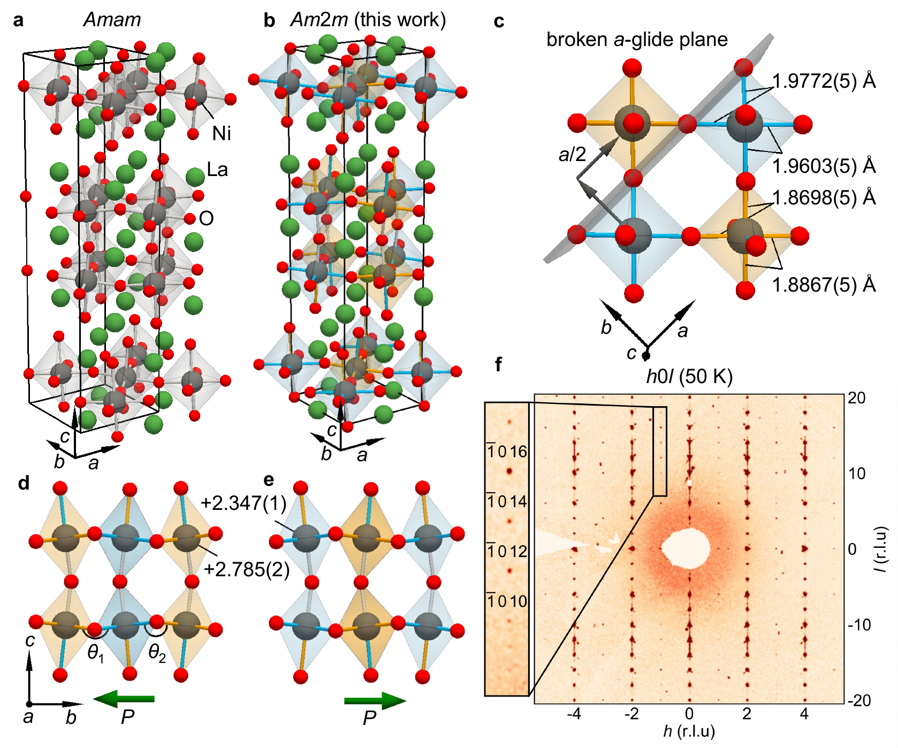
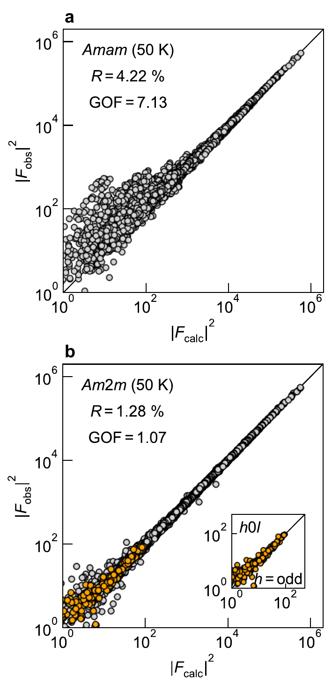

# La₃Ni₂O₇の「隠れた秩序」――極性チェッカーボード電荷秩序が問い直す高温超伝導の起源

- **執筆日**: 2026-03-28
- **トピック**: La₃Ni₂O₇ における極性チェッカーボード電荷秩序と圧力誘起高温超伝導の競合
- **注目論文**: R. Misawa et al., "Polar, checkerboard charge order in bilayer nickelate La₃Ni₂O₇", arXiv:2603.25119 (2026)
- **参照関連論文数**: 7

---

## 1. 導入：なぜ今この話題か

高温超伝導の謎を解く鍵は「競合する秩序相」にある――この認識は、銅酸化物（キュプレート）超伝導体の研究が積み上げてきた核心的な教訓である。電荷秩序やスピン密度波が超伝導と同じ温度・圧力スケールで現れる事実は、これらの秩序が単なる「邪魔者」ではなく、超伝導ペアリングを生み出す電子的不安定性と共通の根を持つことを示唆している。

2023年、Sun らは層状ニッケレート La₃Ni₂O₇ の単結晶に約 14 GPa の圧力をかけると、転移温度 $T_c \approx 80$ K に達する高温超伝導が出現することを報告し、凝縮系物理・材料科学のコミュニティに衝撃を与えた[^sun2023]。この値は液体窒素温度（77 K）を超え、キュプレート以外の酸化物系としては異例の高さである。ニッケル（Ni）は銅（Cu）の隣にある $3d$ 遷移金属であり、「ニッケレートはキュプレートの類似体か」という問いは長年の懸案だった。La₃Ni₂O₇ の発見は、その答えが予想以上に「イエス」に近い可能性を示しつつ、しかし本質的に異なる物理も内包することを予告した。

では、超伝導が現れる以前の常圧での La₃Ni₂O₇ はどのような電子状態にあるのか。この問いに対して、2026 年 3 月、東京大学の Misawa らは SPring-8 シンクロトロン放射光を用いた高精度 X 線回折によって驚くべき答えを提示した: 従来「中心対称」だと考えられていた常圧構造は実は**極性**をもち、Ni サイトに**チェッカーボード（市松模様）型の電荷秩序**が形成されているというのである（arXiv:2603.25119）[^misawa2026]。この発見は、常圧相の電子状態に関する従来の描像を根底から改訂し、圧力誘起超伝導のメカニズム解明に新たな視点を提供するものである。

本稿では、この注目論文を軸に、La₃Ni₂O₇ の構造・電子・磁気秩序に関する最近の研究群を文脈的に統合し、「電荷秩序はなぜ生じ、超伝導とどのように競合するのか」という論点を中心に解説する。

---

## 2. 解決すべき問い：常圧の La₃Ni₂O₇ は何者か

La₃Ni₂O₇ に圧力をかけると超伝導が現れる。では、圧力をかける前――常圧での基底状態は何か。この問いは単純そうに見えて、実は多くの謎を孕んでいた。

**結晶構造の問題**: 常圧での La₃Ni₂O₇ の結晶構造は、長らく直方晶 $Amam$（空間群 No.63、中心対称）だと考えられてきた。この構造では Ni サイトは 1 種類しかなく、Ni の形式価数は $2.5+$（つまり Ni²⁺ と Ni³⁺ の中間）とみなされる。加圧すると約 10–14 GPa で正方晶 $I4/mmm$ 構造（空間群 No.139）へ転移し、その付近で超伝導が出現する。したがって、当初は「$I4/mmm$ 正方晶構造こそが超伝導の舞台」と解釈されていた。

**磁気秩序の問題**: 約 150 K 以下で磁気的な転移が観測されており、これがスピン密度波（SDW）秩序か、それとも単純な反強磁性かを巡って議論が続いていた。中性子回折や共鳴 X 線散乱が示す像は、層内での磁気ストライプと層間での反強磁性的積層であり、スピンと電荷が絡み合った密度波的描像を支持していた。

**根本的な問い**: 超伝導のペアリング対称性は何か（$s$波か $d$波か）。超伝導の前提条件は構造転移（正方晶化）なのか、それとも SDW 転移なのか。常圧相の正確な電子状態——特に Ni サイトの電荷分布——は何か。

Misawa らの研究は、これら全ての問いに対する答えを塗り替える「土台」として機能する発見をもたらした。それが「極性チェッカーボード電荷秩序」である。

---

## 3. 注目論文の新規性：4桁弱い反射が明かした対称性の破れ

### 「消えているはずの反射」が存在した

Misawa らが行ったのは、La₃Ni₂O₇ の高品質単結晶（サイズ約 50 μm）に対する、SPring-8 ビームライン BL02B1 でのシンクロトロン X 線回折（XRD）測定である。装置の要は検出器のダイナミックレンジ $10^6$――つまり、主要なブラッグ反射から 100 万倍弱い信号まで同時検出できる点にある。

従来の実験室 X 線回折では見過ごされてきたが、Misawa らは逆格子空間の $h0l$ 面に「ある種の反射が系統的に存在する」ことを見出した（Fig. 1f）。具体的には、$h0l$（$h$ = 奇数）の反射群である。$Amam$ 空間群においてはこれらの反射は $a$ グライド面の消滅則により**存在してはいけない**反射である。それが実際に観測された。これは、$Amam$ の仮定するグライド鏡映対称性が実際には**破れている**ことを意味する。

問題の反射は主要ブラッグ反射より約 4 桁（$10^4$ 倍）弱い。通常の実験室線源では検出不可能であり、だからこそ 30 年以上見逃されてきた。シンクロトロン放射光の高輝度と大ダイナミックレンジが、この「隠れた秩序」の存在を初めて可視化した。

### 新しい空間群 $Am2m$ の決定

$a$ グライド面の不在から、考えられる最高対称空間群は親構造 $I4/mmm$ の部分群として一意に**極性直方晶 $Am2m$**（空間群 No.38）に定まる。この空間群は反転対称性を持たない——すなわち「極性」である。

Misawa らは $Am2m$ を仮定して XRD 強度の精密化（リートベルト解析の単結晶版）を行った（Fig. 2）。その結果:

- $Amam$ モデルでの信頼度因子: $R = 4.22\%$、GOF（適合度） $= 7.13 \gg 1$（適合不良）
- $Am2m$ モデルでの信頼度因子: $R = 1.28\%$、GOF $= 1.07 \approx 1$（良好な適合）

また、単結晶中で反転対称性の破れた 2 種類のドメインが $0.63:0.37$ の比で共存するという Flack パラメータ（極性の直接指標）も得られた。これは「極性」であることの直接的な証拠である。

### Ni サイトの電荷秩序と極性の起源

$Am2m$ 構造では、Ni サイトが 2 種類の不等価な位置（以下 Ni(1) と Ni(2) と呼ぶ）に分裂する（Fig. 1b, c）。精密化から得られた Ni–O 結合長の差は約 0.1 Å と際立って大きく、これは電荷秩序の直接的な証拠である。ボンドバレンスサム（BVS）法により見積もった Ni の原子価は:

$$
\text{Ni(1): } +2.785(1), \quad \text{Ni(2): } +2.347(1)
$$

2 つのサイトが各層内でチェッカーボード状に交互に配列しており、これが「チェッカーボード電荷秩序」である。さらに重要なのは、この電荷秩序だけでは極性は生じないという点だ。単一層内でチェッカーボード状に分布した正電荷は、上下方向に見れば対称的であるため巨視的な分極を生まない。しかし La₃Ni₂O₇ では**酸素八面体の傾き（チルティング）**が $b$ 軸方向の結合交代を生み出す。この結合交代の方向が電荷交代の方向と一致するとき、対称性のキャンセルが破れ、巨視的な電気分極 $P$ が発生する（Fig. 1d, e）。

この構造は、双層マンガン酸化物 Pr(Sr$_{1-x}$Ca$_x$)₂Mn₂O₇ の電荷・結合交代による極性と類似しており、$3d$ 遷移金属酸化物に共通するメカニズムの一例と見なすことができる。

*Fig. 1: La₃Ni₂O₇ の常圧における極性電荷秩序。(a) 従来報告の $Amam$ 構造（単一 Ni サイト）。(b) 本研究が提案する極性 $Am2m$ 構造（2 種類の Ni サイト）。(d) 電荷交代と八面体傾きが生み出す極性 $P$。(f) $h0l$ 面の XRD パターン（黒枠内：$a$ グライド面破れに対応する反射）。Misawa et al., arXiv:2603.25119 (2026), CC BY 4.0 より。*

*Fig. 2: $Amam$（上）と $Am2m$（下）モデルによる XRD 強度精密化の比較。$Am2m$ モデルでは観測値（$|F_\text{obs}|^2$）と計算値（$|F_\text{calc}|^2$）が良く一致する（$R = 1.28\%$、GOF $= 1.07$）。Misawa et al., arXiv:2603.25119 (2026), CC BY 4.0 より。*

---

## 4. 背景と文脈：ニッケレート高温超伝導はなぜ重要か

### ルッデルスデン・ポパー型ニッケレートの基礎

La₃Ni₂O₇ は**ルッデルスデン・ポパー（RP）型**の層状ペロブスカイトである。一般式 $\text{La}_{n+1}\text{Ni}_n\text{O}_{3n+1}$ で表され、$n=2$ の場合が La₃Ni₂O₇ に相当する。結晶構造は NiO₆ 八面体が 2 層（ビレイヤー）連なったブロックを LaO 岩塩層が挟む積層構造をとる。$n=1$ は La₂NiO₄（単層）、$n=3$ は La₄Ni₃O₁₀（三層）に対応し、三層系も加圧下で超伝導を示すことが知られている。

La₃Ni₂O₇ の常圧での電子構造を粗く見積もると、La³⁺、O²⁻ が安定価数をとると仮定すれば Ni の平均価数は $2.5+$ となる。$3d$ 軌道の占有状態で言えば、Ni²⁺ は $3d^8$、Ni³⁺ は $3d^7$ であり、混合原子価系である。ここで関連する軌道は主に $3d_{x^2-y^2}$（面内方向に広がる）と $3d_{3z^2-r^2}$（$c$ 軸方向に広がる）であり、後者がビレイヤー間の結合を支配する。

### 超伝導の「前史」と発見の文脈

ニッケレート超伝導の前史として、2019 年に Li らが無限層型 NdNiO₂ 薄膜で $T_c \approx 15$ K の超伝導を報告したことが挙げられる。NdNiO₂ では Ni は形式的に $1+$（$3d^9$）であり、Cu の $3d^9$ 状態と同一電子数を持つことから、キュプレートとの類似性が強く意識されてきた。

一方、La₃Ni₂O₇ の高圧超伝導は全く異なる文脈から登場した。$T_c \sim 80$ K という値はキュプレートの最高値（HgBa₂Ca₂Cu₃O₈ の $\sim 135$ K）には及ばないものの、発見以降わずか 2〜3 年で国際的な研究競争が巻き起こり、2026 年現在に至るまで毎月のように新しい実験・理論論文が発表されている。

### 薄膜研究が示す常圧超伝導の可能性

加圧実験が示すのは高圧環境が必要という制約であるが、エピタキシャル薄膜として基板に乗せれば格子歪（ストレイン）によって類似の効果が得られうる。2025 年には引張歪を最適化した La₃Ni₂O₇ 薄膜が高温超伝導候補として注目され（arXiv:2509.13820 など）、電子構造や界面効果の観点からも研究が拡大している。Ren らの X 線吸収分光・共鳴 X 線散乱実験（arXiv:2409.04121）は薄膜での反強磁性スピン秩序と電荷秩序が同一周期で共存することを示し、バルク単結晶でも類似の電子状態が予想されることを示唆していた[^ren2024]。

---

## 5. メカニズム・比較・解釈：電荷・スピン・軌道が絡み合う物理

### スピン密度波（SDW）秩序と電荷秩序の関係

常圧での La₃Ni₂O₇ では、約 150 K 以下でいくつかの物性異常が観測されている。Plokhikh らの中性子粉末回折・μSR 実験（arXiv:2503.05287）は、$\sim 150$ K 以下で磁気散乱が出現し、層内では磁気モーメントがストライプ状に交互配列し、層間で反強磁性的に積層するという秩序構造を明らかにした（CC BY 4.0）[^plokhikh2025]。これは**スピン密度波（SDW）**と解釈される。

SDW とは何か。自由電子系でも Fermi 面のネスティング（対向する部分が平行になること）が良ければ、波数 $\mathbf{q}$ のスピン揺らぎが増強され、

$$
\chi(\mathbf{q}) = -\frac{1}{V} \sum_\mathbf{k} \frac{f(\varepsilon_{\mathbf{k}}) - f(\varepsilon_{\mathbf{k}+\mathbf{q}})}{\varepsilon_{\mathbf{k}+\mathbf{q}} - \varepsilon_{\mathbf{k}}}
$$

のスピン感受率 $\chi(\mathbf{q})$ がある $\mathbf{q}$ で発散する。この不安定性が凍結したのが SDW 秩序である。電荷密度波（CDW）も同様のメカニズムで生じ、スピン変調と電荷変調が同時に起きる場合もある。La₃Ni₂O₇ の 150 K 転移は、Misawa らが発見したチェッカーボード電荷秩序と深く関連している可能性が高い。電荷秩序の波数と SDW の波数の整合性を精密に決定することが今後の課題の一つである。

### 軌道の役割

Su らの光学スペクトロスコピー研究（arXiv:2411.10786）は、La₃Ni₂O₇ 単結晶の電荷ダイナミクスが面内方向と $c$ 軸方向で大きく異なる「強異方性」を示すことを明らかにした。$c$ 軸方向では 150 K 付近でコヒーレントからインコヒーレントへのクロスオーバーが起きており、これは SDW 転移と一致する。一方、面内では比較的安定した金属的挙動が維持される。この異方性の起源は、$3d_{3z^2-r^2}$ 軌道による層間結合の強さと、$3d_{x^2-y^2}$ 軌道による層内伝導の違いに帰着する。

Li らの X 線吸収微細構造（XANES）実験（arXiv:2502.10962）は、SDW 転移以下で Ni の $d_{3z^2-r^2}$ と $d_{x^2-y^2}$ 軌道の占有率が変化することを示し、軌道秩序が密度波転移に関与していることを示唆している[^li2025]。Pr で La を一部置換（La₂PrNi₂O₇）すると、これらの軌道間の相互作用が活性化され、加圧下での超伝導が増強されるというデータも得られており、軌道自由度の制御が超伝導増強の鍵になりうることを示している。

### 二層系と三層系の比較が与える知見

Shu らのラマン散乱研究（arXiv:2602.02174、CC0）は、二層（La₃Ni₂O₇）と三層（La₄Ni₃O₁₀）ニッケレートの SDW ギャップを偏光分解ラマン分光で直接比較した[^shu2026]。三層系では Brillouin ゾーン中心付近の $\alpha$ ポケットと $\beta$ ポケットの両方に $\sim 55$ meV のギャップが開く（ただし $\beta$ ポケットの対角方向ではギャップが小さい）。これに対して二層系では $\beta$ ポケットのみにギャップが形成される。

この比較は「どの Fermi 面がネスティングに関与しているか」を実験的に特定する上で重要である。Ni の $d_{3z^2-r^2}$ バンドが作る「バレル型」の $\alpha$ ポケットが三層系での SDW に主要な役割を果たすとすれば、二層系との違いは層の枚数が増えることで $d_{3z^2-r^2}$ バンドの分散が変化することで説明できる。この多バンド的な理解は、超伝導ペアリングの波数依存性の解釈にも直結する。

### 「正方晶構造が超伝導の前提」という通説への反証

Zhang らの高圧ラマン分光・第一原理計算研究（arXiv:2511.15265、CC BY 4.0）は、加圧下の構造転移を精密に追跡し、4 GPa で $Amam$（正確には今回の改訂では $Am2m$）と $Fmmm$ の混相が出現し、14.5 GPa で完全に $I4/mmm$ 正方晶に転移することを示した[^zhang2025]。このとき Raman スペクトルのソフトモードが $I4/mmm$ への転移点付近で顕著に変化し、構造不安定性と超伝導の出現が同じ圧力スケールで起きることを示唆している。この結果は、超伝導が $I4/mmm$ 相の出現と対応するという当初の解釈を支持するように見える。

しかし Shi らは根本的な異議を唱えた（arXiv:2501.14202、CC BY 4.0）[^shi2025]。彼らは常圧合成で意図的に $I4/mmm$ 正方晶の La₃Ni₂O₇ を作製した。しかしこの正方晶結晶を 70 GPa まで加圧しても超伝導は全く現れなかった。一方、通常の直方晶（$Am2m$）結晶では加圧とともに SDW 転移が消失し、その後に超伝導が現れる。つまり、**超伝導の前提条件は正方晶構造への転移ではなく、SDW 転移の存在**なのかもしれない。このことは Misawa らの発見——常圧では電荷秩序（と関連する SDW）が存在する——という描像と整合的であり、電荷秩序・SDW の抑制が超伝導発現の引き金になるという競合シナリオを強く支持する。

この議論の本質を整理すると: （i）常圧では $Am2m$ 極性構造 + チェッカーボード電荷秩序 + SDW が共存する；（ii）加圧するとこれらの秩序相が次第に抑制され、ある臨界圧力で超伝導が発現する；（iii）超伝導が安定するのは電荷秩序・SDW との競合に打ち勝てる状況、すなわち Ni の $d_{3z^2-r^2}$ 軌道による層間ホッピングが十分に大きくなって（加圧による Ni–O–Ni の角度・距離変化が鍵）電荷不均化の利得よりもパイアリングの利得が大きくなる転換点である、という解釈が現在有力である。

---

## 6. 材料・手法・応用への広がり

### $d$波超伝導の実験的証拠

超伝導ペアリングの対称性は、超伝導の機構論的分類において最も重要な情報の一つである。BCS 超伝導では $s$ 波（等方的ギャップ）が典型的だが、キュプレートでは $d_{x^2-y^2}$ 対称性（ノードを持つ非等方的ギャップ）が確立している。

Cao らの点接触分光実験（arXiv:2509.12606、CC BY 4.0）は、真の静水圧環境下での La₃Ni₂O₇ 単結晶に対してトンネル分光的手法を適用し、**$d$ 波様のギャップ対称性**を直接観測した[^cao2025]。超伝導ギャップ $\Delta$ と $T_c$ の比は $\Delta / k_B T_c = 4.2(5)$ であり、これは強結合超伝導体の特徴を示す値（BCS 弱結合では $2\Delta / k_B T_c = 3.52$）である。ノード構造（ギャップがゼロになる方向）の存在は、スピン揺らぎ媒介型のペアリングと整合的であり、SDW 秩序と超伝導の競合という描像に力を与える。

ここで簡単に $d$ 波超伝導のギャップ関数を復習しておこう。$d_{x^2-y^2}$ 対称性のギャップは、運動量空間で

$$
\Delta(\mathbf{k}) = \Delta_0 (\cos k_x a - \cos k_y a)
$$

と書ける。$k_x = \pm k_y$ の方向（Brillouin ゾーンの対角方向）でゼロになるノードを持ち、ノード近傍では状態密度が線形に変化する。これがキュプレートの $d$ 波超伝導のトレードマークであり、La₃Ni₂O₇ での類似の振る舞いは物理的な機構の共通性を示唆するが、確定的な結論にはさらなる検証が必要である。

### 薄膜・界面工学への展開

加圧実験が必要という制約を克服するために、エピタキシャル薄膜化が有力な戦略として追求されている。格子定数の異なる基板上に薄膜を成長させることで、バイアクシャル歪（面内引張 or 圧縮）を印加できる。引張歪は $c/a$ 比を増大させて $I4/mmm$ 的な電子構造を誘起し、圧縮歪は逆の効果をもたらす。

重要なのは、エピタキシャル薄膜での電荷秩序の挙動が単結晶とは異なりうる点である。基板との格子整合や薄膜の界面近傍では対称性が基板の影響を受けて変化し、Am2m の極性電荷秩序が誘起・抑制・修飾されうる。今回の発見——常圧バルクが極性構造を持つ——を踏まえると、薄膜での超伝導が報告されているケースでは「電荷秩序が歪によって抑制されているから超伝導が現れやすい」という解釈も可能になる。

常圧での超伝導が可能になれば、高圧セルなしに測定・応用できるため材料工学的な価値は大きい。またヘテロ構造化による界面への電荷移動、薄膜でのキャリアドーピング制御なども探索されており、「界面エンジニアリング」の観点からの研究が急速に発展している。キャリアをドープすることで、電荷秩序が壊れて超伝導が現れる、いわゆる「ドーピング相図」を描けるかどうかが今後の焦点の一つである。これはキュプレートの相図——アンドープ反強磁性絶縁体からドーピングとともに擬ギャップ相・超伝導相・金属相が出現する——との対応を念頭に置くと、ニッケレート物理の深みをより理解する鍵になる。

### La₃Ni₂O₇ 以外のニッケレート系への波及

今回の発見——「常圧相に電荷秩序が隠れている」——は La₃Ni₂O₇ に限らず、関連するニッケレート系全般への研究視点を更新する。三層系 La₄Ni₃O₁₀ でも SDW 秩序と高圧超伝導が報告されており（$T_c \sim 80$ K）、各層数における電荷秩序の有無と超伝導との関係を系統的に調べることが今後の重要課題となる。また、La を Pr や Nd で置換した系（La₂PrNi₂O₇ など）では超伝導 $T_c$ の増強が報告されており、軌道・スピン自由度の化学的チューニングが有効であることも示唆されている。

---

## 7. 基礎から理解する

### 空間群と対称性の破れ

この研究のコアは「空間群の同定」である。空間群とは、結晶の対称性を記述する群論的な枠組みで、並進操作に加えて回転・鏡映・グライド・らせん軸などの操作を含む。地球上には 230 種類の空間群が存在し、それぞれに国際記号と番号が与えられている。

$Amam$（No.63）と $Am2m$（No.38）の違いはまさに「$a$ グライド面の有無」にある。グライド面とは、鏡映操作に $a/2$ の並進を組み合わせた対称操作で、$Amam$ はこの操作を持つが $Am2m$ は持たない。$Am2m$ はまた反転中心を持たない（非中心対称）点でも $Amam$ と本質的に異なる。非中心対称な構造では巨視的な電気分極が許容され、圧電性・焦電性・強誘電性などの機能が発現しうる。

X 線回折における「系統消滅則（systematic absences）」は空間群の同定に不可欠なツールである。グライド面 $a$ が存在すれば $h0l$（$h$ = 奇数）の反射は消滅する（$F_{hkl} = 0$）。これを「禁制反射」と呼ぶ。Misawa らが観測したのはまさにこの「禁制反射」の存在であり、$a$ グライド面が実際には存在しないことの直接証拠である。

### ボンドバレンスサム（BVS）法

BVS 法は、原子間距離から形式原子価（酸化数）を推定する経験則であり、Ni のような混合価数系の研究で広く用いられる。基本式は

$$
V_i = \sum_j \exp\left(\frac{R_0 - R_{ij}}{B}\right)
$$

ここで $V_i$ はサイト $i$ の原子価、$R_{ij}$ は結合距離、$R_0$ と $B$ は元素ペアごとに決まる経験定数（通常 $B = 0.37$ Å）である。Misawa らがこの方法で Ni(1) に $+2.79$、Ni(2) に $+2.35$ を得たことは、2 つの Ni サイトが約 0.44 の価数差を持つことを意味し、これは電荷秩序が真に「電荷の不均化（charge disproportionation）」によって生じていることを示す。なお、電荷の差が整数に近いほど「実質的な Ni²⁺/Ni³⁺ 混合」、小さいほど「電子密度のわずかな揺らぎ」とみなせる。$0.44$ という値は中間的だが、Ni–O 結合長差が 0.1 Å に達する点を踏まえると、かなり本質的な電荷分離が起きていると解釈できる。

### 強相関電子系における競合する秩序

La₃Ni₂O₇ の Ni–O–Ni の角度や Ni–O 結合長は、Mott-Hubbard 的な電子間相関が重要な「強相関電子系」の範疇に入る。強相関系では、電子間クーロン斥力（Hubbard $U$）が運動エネルギーと競合し、電荷・スピン・軌道の各自由度が複雑に絡み合う。

一般に強相関系では複数の「競合する秩序」が同じエネルギースケールに存在する。La₃Ni₂O₇ で確認されているだけでも、常圧で電荷秩序（今回の発見）と SDW（～150 K）が存在し、加圧によって超伝導が出現する。これらの競合秩序が存在するということは、系が複数の「極小」を持つエネルギー地形（free energy landscape）上にあることを意味し、わずかな外部パラメータ（圧力・ドーピング・歪）によって秩序の主役が入れ替わる「フラストレーション」の構造が内在している。

### チェッカーボード電荷秩序とマンガン酸化物との類似

Misawa らが着目したのは、La₃Ni₂O₇ の電荷秩序が双層マンガン酸化物 Pr(Sr$_{1-x}$Ca$_x$)₂Mn₂O₇ の秩序と類似するという点である。後者では、Mn³⁺ と Mn⁴⁺ が $ab$ 面内でチェッカーボード状に配列し、ジャーン・テラー効果による軌道秩序とも連動して極性を生み出す。この種の電荷秩序は、混合価数遷移金属酸化物において電荷の不均化が起きやすいという一般的な傾向を反映しており、ニッケレートでの発現は「物質横断的な普遍性」を示す例として注目に値する。

同様の論点は他のルッデルスデン・ポパー系でも見られている。Sr₃Fe₂O₇ では共鳴 X 線回折によってチェッカーボード電荷秩序が同定されており、Sr₃Co₂O₇ でも理論的に電荷秩序による out-of-plane 極性が予測されている。La₃Ni₂O₇ での発見は、RP 型酸化物において「$n=2$ 双層系での電荷不均化→極性電荷秩序」が広く成立するメカニズムである可能性を示唆し、材料設計の観点からは「電荷秩序を利用した機能性（圧電・焦電・強誘電）と超伝導の競合を制御する」という新たな材料探索軸を提案している。

---

## 8. 重要キーワード

1. **ルッデルスデン・ポパー型ニッケレート (Ruddlesden-Popper nickelate)**: $\text{La}_{n+1}\text{Ni}_n\text{O}_{3n+1}$ の一般式で記述される層状ペロブスカイト酸化物。$n=2$ が La₃Ni₂O₇ に対応し、双層の NiO₆ 八面体ブロックを持つ。

2. **極性空間群 (polar space group)**: 反転対称性を持たない空間群の一種。電気分極が許容され、圧電性・焦電性が現れうる。本研究での $Am2m$（No.38）がこれに相当する。

3. **チェッカーボード電荷秩序 (checkerboard charge order)**: 遷移金属サイト上の電荷（電子密度）が、市松模様（チェッカーボード）状に交互に高・低を繰り返す空間変調秩序。混合価数系での電荷不均化によって生じる。

4. **$a$ グライド面 (a-glide plane)**: 鏡映操作に $a/2$ の並進を組み合わせた空間群の対称操作。その存在は XRD の系統消滅則として現れ、Misawa らが「禁制反射」の存在によりその不在を実証した。

5. **スピン密度波 (spin density wave, SDW)**: 電子スピンの密度が空間的に正弦波状に変調した秩序相。Fermi 面のネスティングによって生じることが多く、La₃Ni₂O₇ では約 150 K 以下で出現する。

6. **ボンドバレンスサム (bond valence sum, BVS)**: 結合長から形式原子価を推定する経験則。電荷秩序の強度や Ni サイトの酸化状態を定量的に評価するために使われる。

7. **$d$ 波超伝導 (d-wave superconductivity)**: 超伝導ギャップ関数が $d_{x^2-y^2}$ 対称性を持ち、特定の波数方向でゼロになるノードを持つ超伝導。キュプレートで確立しており、La₃Ni₂O₇ でも実験的証拠が得られつつある。

8. **Flack パラメータ**: 非中心対称結晶において、反転対称性を破ったドメイン（エナンチオモルフ）の存在比を表すパラメータ。$0$ または $1$ なら純粋な一方のドメイン、$0.5$ なら等量混合を意味する。極性の直接指標となる。

9. **電荷不均化 (charge disproportionation)**: 名目上同じ価数の金属イオンが 2 種以上の異なる価数に分裂する現象。La₃Ni₂O₇ では名目 Ni$^{2.5+}$ が Ni$^{2.785+}$ と Ni$^{2.347+}$ に分裂している。

10. **競合秩序相 (competing orders)**: 強相関電子系において超伝導・電荷秩序・スピン秩序・軌道秩序などが同等のエネルギースケールで拮抗する状況。La₃Ni₂O₇ では常圧での電荷秩序・SDW が圧力下の超伝導と競合している。

---

## 9. まとめと今後の論点

Misawa らの研究（arXiv:2603.25119）が示したのは、La₃Ni₂O₇ の常圧結晶構造が「中心対称の $Amam$」ではなく「極性の $Am2m$」であり、Ni サイトにチェッカーボード型の電荷秩序が存在するという事実である。主要ブラッグ反射より 4 桁弱い「禁制反射」をシンクロトロン放射光によって初めて検出し、精密な構造解析によって Ni(1) $\approx +2.8$ と Ni(2) $\approx +2.3$ の電荷不均化を定量化した。この発見は、30 年以上にわたって使われてきた構造モデルの根本的な改訂であり、圧力誘起高温超伝導との競合・連関を新たな視点から論じる出発点となる。

**今後の重要な論点**は以下の通りである。

**電荷秩序と SDW の関係**: 約 150 K で観測されている SDW 転移と今回の電荷秩序の波数・対称性の関係は何か。電荷秩序が先行して SDW を誘起するのか、それとも両者は独立した不安定性から生じるのか。中性子回折や共鳴 X 線散乱による波数空間での精密測定が必要である。

**加圧下での電荷秩序の消失過程**: 超伝導が出現する圧力（～14 GPa）付近で電荷秩序はどのように変化するか。Zhang らの構造研究は $I4/mmm$ への構造転移を追跡したが、今回明らかになった極性電荷秩序が圧力とともにどのように変化・消滅するかはまだ分かっていない。シンクロトロン高圧 XRD による追跡が求められる。

**超伝導ペアリングの起源**: Cao らによる $d$ 波様ギャップの観測は示唆的だが、確定的な証拠とするには対称性の完全な決定が必要である。電荷秩序・SDW の揺らぎがペアリングのグルーになるという理論的枠組み（スピン揺らぎ機構や電荷揺らぎ機構）を実験と定量的に突き合わせることが重要課題である。

**薄膜での電荷秩序の再現性**: エピタキシャル薄膜では基板歪が電子状態を大きく変化させうる。薄膜においても今回と同様の極性チェッカーボード電荷秩序が存在するかどうか、また歪によってどのように変化するかを調べることは、常圧超伝導実現への道筋を描く上で不可欠である。

**関連二次元系・ヘテロ構造への波及**: 超薄膜極限やヘテロ界面での電荷移動によって電荷秩序が修飾される可能性がある。近年、酸化物ヘテロ構造では界面近傍での新奇電子相が多数発見されており、La₃Ni₂O₇ 系でも同様の「界面物理」が展開されうる。

La₃Ni₂O₇ は、「なぜ高温超伝導は生まれるのか」という半世紀以上にわたる問いに、また新たな実験事実を提示した。電荷秩序という「隠れた秩序」の発見は、この物質が単純な金属や単純な超伝導体ではなく、電荷・スピン・軌道が複雑に絡み合う強相関系の典型例であることを確認し、同時にその複雑さゆえの豊かさを改めて示している。

---

### 参考文献（arXiv プレプリント）

[^misawa2026]: R. Misawa, S. Kitou, J.-P. Sun, et al., arXiv:2603.25119 (2026). CC BY 4.0.
[^sun2023]: H. Sun, M. Huo, X. Hu, et al., *Nature* **621**, 493 (2023).
[^zhang2025]: H. Zhang, J. Zhang, M. Huo, et al., arXiv:2511.15265 (2025). CC BY 4.0.
[^cao2025]: Z.-Y. Cao, D. Peng, S. Choi, et al., arXiv:2509.12606 (2025). CC BY 4.0.
[^plokhikh2025]: I. Plokhikh, T. J. Hicken, L. Keller, et al., arXiv:2503.05287 (2025). CC BY 4.0.
[^shu2026]: J. Shu, J. Shen, X. Zhou, et al., arXiv:2602.02174 (2026). CC0.
[^ren2024]: X. Ren, R. Sutarto, X. Wu, et al., arXiv:2409.04121 (2024). CC BY 4.0.
[^shi2025]: M. Shi, D. Peng, Y. Li, et al., arXiv:2501.14202 (2025). CC BY 4.0.
[^li2025]: M. Li, M. Zhang, Y. Wang, et al., arXiv:2502.10962 (2025). CC BY-NC-SA 4.0.
