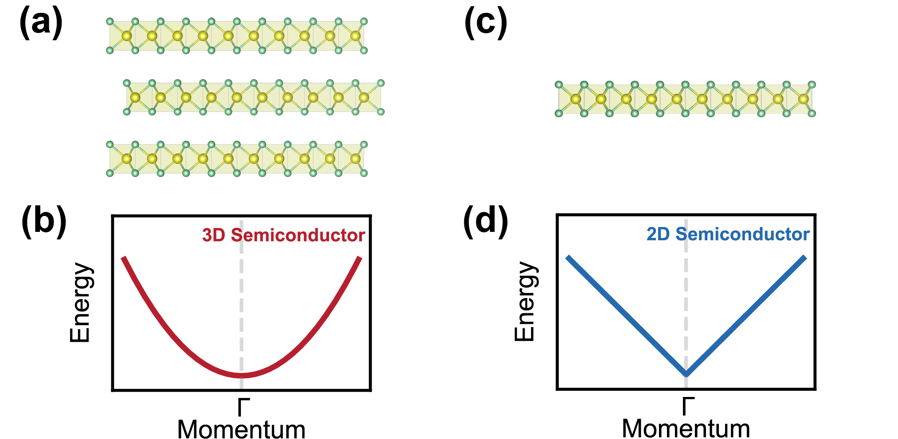
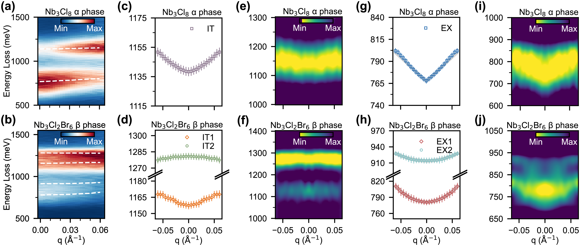
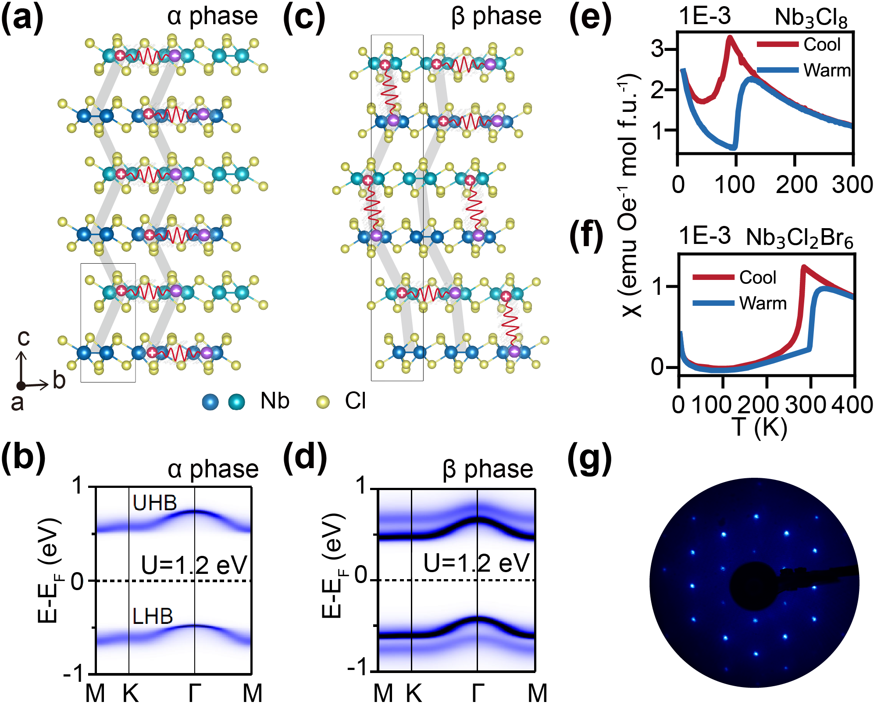
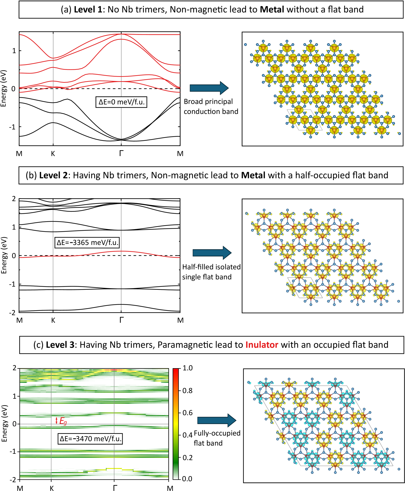
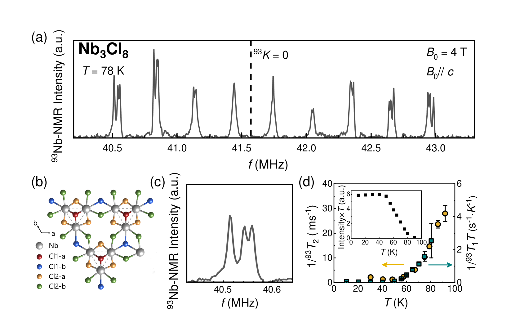

# Nb₃Cl₈に宿る励起子を追う：クラスターモット絶縁体における次元性と光学応答の新展開

- **執筆日**: 2026-03-29
- **トピック**: クラスターモット絶縁体Nb₃Cl₈における励起子の次元性依存分散——フラットバンド・強相関・層間結合が織りなす異常な光学応答
- **タグ**: Superconductivity and Strongly Correlated Systems / Excitons and Photoinduced Response; Low-Dimensional Materials / Measurement and Spectroscopy; First-Principles Calculations
- **注目論文**: Z. Su et al., "Dimensionality-Dependent Exciton Dispersion in a Single-Band Mott Insulator," *Phys. Rev. Lett.* **136**, 106502 (2026); arXiv:2603.22695
- **参照関連論文数**: 8本

---

## 1. なぜ今この話題なのか

電子が強く相互作用する「強相関電子系」の物理は、長年にわたって凝縮系物理学の中心課題であり続けてきた。その象徴的な概念がモット絶縁体である。単純なバンド理論では金属になるはずの材料が、電子間の強いクーロン反発によって絶縁体になる——この現象はモット絶縁状態と呼ばれ、高温超伝導、量子スピン液体、多体局在といった現代の最先端物理と深く関わっている。

一方、半導体の光学応答の中心概念は励起子である。光を吸収した際に電子と正孔が静電引力によって束縛された状態であり、太陽電池、LED、レーザーのような光デバイスの性能を本質的に決める。特に近年、グラフェンやMoS₂、WSe₂などのvan der Waals積層材料（ヴァン・デル・ワールス積層材料）が次々と合成されるようになり、次元性が励起子の性質をどのように変えるかが盛んに研究されてきた。二次元（2D）系では励起子の結合エネルギーが三次元（3D）に比べて格段に大きくなり、励起子の分散関係も定性的に異なることが理論的には予測されていたが、同一材料で次元性を連続的に制御しながら励起子分散を直接測定することは実験的に極めて困難だった。

ここに両者の交点が現れる。モット絶縁体が励起子を持つとしたら、その励起子はどのような性質を示すのか。電子間の強い相互作用は、電子-正孔対の束縛状態をどう変えるのか。そして次元性が変化したとき、モット励起子の分散はどう変わるのか。これらの問いはどれも未解決だった。

2026年3月、中国科学院物理研究所の朱雪涛（Xuetao Zhu）らのグループは、van der Waals型クラスターモット絶縁体Nb₃Cl₈において、温度誘起の次元性交差に伴う励起子分散の劇的な変化を、高分解能電子エネルギー損失分光（HREELS）によって直接観測したと報告した。高温相では準2D的な「質量ゼロの線形分散」、低温相では準3D的な「放物線分散」という、全く異なるモードを同一材料で捉えたこの結果は、モット物理と励起子物理の接続という新しいパラダイムを具体化するものとして注目を集めている。

本記事では、この注目論文を核として、Nb₃Cl₈研究の流れと「クラスターモット励起子」という概念の意義を深く掘り下げる。この材料が単純な半導体でも単純なモット絶縁体でもない、何か新しいカテゴリーに属することを多角的な証拠から明らかにしていく。

---

## 2. この分野で何が未解決なのか

このトピックには、独立しているようで深く絡み合った四つの中心問題がある。

**第一の問い：Nb₃Cl₈の絶縁機構は何か。** 絶縁体になる理由には複数の可能性がある。バンドギャップ（バンド絶縁体）、電子間反発（モット絶縁体）、格子のゆがみによる対称性の破れ（対称性破れ絶縁体）などだ。Nb₃Cl₈の場合、ARPESが大きなギャップを確認しているが、理論的にはDFT計算（密度汎関数理論）では金属と予測されてしまう。当初は電子相関が必要なモット機構が有力視されてきたが、ユニバーシティ・オブ・カリフォルニアのAlexander Zungerらは2024年、特定の対称性破れ（構造的・磁気的）を組み合わせればDFTの枠内でも絶縁状態を再現できると主張した。どちらが「本物の」絶縁機構かは、単に理論の問題だけでなく、励起子の性質を理解する上でも決定的に重要だ。

**第二の問い：モット絶縁体の励起子は半導体の励起子と何が違うのか。** 半導体の励起子は、有効質量近似とハイドロゲン様モデルで比較的よく記述できる。しかしモット絶縁体では、電子と正孔はそれぞれ「ダブロン（二重占有）」と「ホロン（欠陥）」という、電子相関によって強く変形された準粒子である。スピノンとの絡み合いも発生し、励起子は単純なバンドの枠組みで捉えられない複雑な多体励起になりうる。1次元系での理論研究（arXiv:2603.18982）は、このような強相関励起子が光電子スペクトルにどう現れるかを精緻に予測しているが、実験的に直接検証された例は少なかった。

**第三の問い：次元性はどのように励起子の分散を変えるのか。** 理論的には、2D系では長距離交換相互作用が支配的になり励起子分散が線形になる（いわば「光速ゼロのフォトン」のような振る舞い）ことが知られている。一方、3D系では短距離交換が重要になり放物線分散になる。しかし、同一材料の中で温度変化だけによってこの転換を実現し、かつ実験的に確認した例は報告されていなかった。

**第四の問い：この材料は何に使えるのか。** 強相関材料のデバイス応用は、通常の半導体とは異なる原理に基づく可能性がある。特に、絶縁体的な障壁層として機能するモット絶縁体を超伝導接合に組み込んだ場合に何が起きるかは、最近の興味ある研究方向だ。

---

## 3. 注目論文の核心：何が前進し、何がまだ仮説か

### 3-1. HREELS が開いた窓

注目論文（arXiv:2603.22695）の方法論の核心は、高分解能電子エネルギー損失分光（HREELS）の2次元運動量-エネルギーマッピングにある。HREELSは低エネルギーの電子を試料表面に入射し、反射電子のエネルギー損失と平行運動量移動を同時計測することで、表面・バルクの光学励起の分散関係を実空間的な制約なしに直接追う技術だ。エネルギー分解能3.0 meV、運動量分解能0.005 Å⁻¹という高精度で実施されたこの実験は、励起子分散を波数空間でトレースすることを可能にした。

測定対象は、α相（高温相、室温）とβ相（低温相、100 K以下）の二種類のNb₃Cl₈クリスタルである。α相ではNb₃Cl₈層が弱いvan der Waals力で積み重なった準2D構造を取るのに対し、β相では温度低下に伴う層内Nb₃トライマーの滑り変位（interlayer sliding）によって隣接層のNb₃クラスター同士が直上に整列し、層間結合が著しく強化された準3D構造になる。この転移温度は約100 Kだ。

### 3-2. α相：質量ゼロの励起子

*図1. 典型的な3D半導体（上段）と2D半導体（下段）における励起子分散の模式図（左：結晶構造、右：励起子バンド構造）。3D系では放物線的分散、2D系では線形（Dirac的）分散が現れる。© Z. Su et al. (CC BY 4.0)*

α相でのHREELS測定は、ブリルアンゾーン中心（Γ̄点）付近での励起子ピークがV字型の明確な線形分散を示すことを明らかにした。群速度は0.51 eV/Åに達する。励起子の結合エネルギーは0.37 eVで、光学バンドギャップ（0.77 eV）の約半分もの大きさを持つ。さらに、電子バンドギャップ（光学ギャップと結合エネルギーの和）は1.14 eVと推定される。

この線形分散は、2次元系の励起子に特徴的な長距離クーロン交換相互作用の支配を意味する。標準的な有効質量近似で書かれた励起子ハミルトニアンを分析すると、2D極限では交換相互作用項が|q|に比例するため、全体として励起子エネルギーが|q|に比例する線形分散になる。Nb₃Cl₈の呼吸型カゴメ格子構造では電子-正孔波動関数の重なりが特に大きいため、クーロン遮蔽が抑制され、交換相互作用の効果がいっそう強調されている。

### 3-3. β相：分裂した放物線励起子

β相では全く異なる描像が現れる。単一だった励起子ピークが、低エネルギーのEX1バンドと高エネルギーのEX2バンドに明確に分裂する。両バンドともΓ̄点付近で放物線的（二次関数的）な分散を示す。これは3D系的な挙動だ。

この分裂の起源は、层間結合の強化によって価電子帯と伝導帯にそれぞれボンディング-アンチボンディング分裂が発生することにある。α相での一本の励起子が、β相では（価電子帯の分裂）×（伝導帯の分裂）= 4本の遷移に分裂し得るが、実験的には選択則や振動子強度の大小によってEX1とEX2の二本が支配的に観測される。

*図4. α相（左、300 K）とβ相の代替材料Nb₃Cl₂Br₆（右、106 K）におけるHREELSマッピング。α相では明確なV字型線形分散（1本の励起子）、低温相では放物線的な2本の励起子バンド（EX1, EX2）が観測される。© Z. Su et al. (CC BY 4.0)*

### 3-4. 何がまだ仮説段階か

注目論文の解釈の中で最も重要な仮定は、「線形分散は長距離クーロン交換相互作用に由来する」という点だ。これ自体は理論的に良く確立した描像だが、Nb₃Cl₈の具体的な系では、以下の点がまだ完全には解明されていない。

第一に、モット絶縁体特有の電子相関（強相関効果）が励起子の結合エネルギー（0.37 eV）や群速度（0.51 eV/Å）の大きさにどの程度寄与しているかは定量的に未確定だ。ハイドロゲン類似モデルや誘電関数を用いた標準的な扱いでは、これだけの大きな結合エネルギーを説明できるかどうかは慎重に評価する必要がある。第二に、励起子がモット絶縁体特有の「ダブロン-ホロン対」として理解すべきか、それとも単純なバンド絶縁体の励起子として扱ってよいのか、実験では区別できていない。第三に、1次元モット絶縁体で予測されているスピノン-ホロン分離（arXiv:2603.18982）のような極端な描像がNb₃Cl₈の2D系でどこまで適用可能かは未解決だ。

---

## 4. 背景と研究史：この論文はどこに位置づくか

### 4-1. Nb₃Cl₈の発見史

Nb₃Cl₈が注目を浴びるようになったのは、2019年頃にvan der Waals磁性体の研究が加速した時期と重なる。当初この材料は、ニオブ（Nb）原子が三角形のクラスター（Nb₃トライマー）を形成した「呼吸型カゴメ格子」を持つレイヤー状半導体として認識されていた。結晶構造的には、各Nb₃トライマーの内側Nb-Nb距離が外側より短く、まるでカゴメ格子が「呼吸」するような変調を持つことからこの名称が付いている。

*図2. Nb₃Cl₈の結晶構造と電子バンド構造。（a）α相の結晶構造（側面図）と励起子分布の模式図。（b）α相の電子バンド構造。フェルミ準位近傍に孤立した半充填フラットバンドが見える。© Z. Su et al. (CC BY 4.0)*

決定的な転換点は2022年、Gao et al. によるARPES（角度分解光電子分光）研究（*Phys. Rev. X* **13**, 041049 (2023); arXiv:2205.11462）だった。DFT計算はNb₃Cl₈がフェルミ準位に半充填のフラットバンドを持つ金属と予測するが、ARPESは大きなギャップを実測した。単独の 2a₁ 軌道から成る1本のフラットバンドが半充填になっているこの系は、単一バンドのハバード模型（Hubbard model）の理想的な実現と捉えられ、動的平均場理論（DMFT）計算によってモット絶縁状態が確認された。van der Waals材料の中で「教科書的な単一バンドモット絶縁体」が実現した——これは強相関物理学において極めて珍しい発見だった。

この発見以後、Nb₃Cl₈の研究は急速に発展した。ラマン分光による格子振動の研究（arXiv:2306.11905）は12本の光学フォノンモードを同定し、P3m1→R3m の相転移が約100 Kで生じることを示した。NMRによる磁気特性の研究（arXiv:2503.12903）は、約97 Kの構造相転移以下でNb NMRスペクトルが3本のピークに分裂することを発見し、Nb₃トライマー内のボンド長の不均一化を実証した。また、薄膜の輸送測定（arXiv:2506.08730）は双極性半導体的挙動と100 Kで1.10 eV、室温で0.63 eVという温度依存的なギャップを確認した。さらにSTM（走査トンネル顕微鏡）測定（arXiv:2505.04400, *Phys. Rev. Lett.* **135**, 076503 (2025)）は、単層まで下げてもモットギャップが消えず、しかも偶数層と奇数層で局所状態密度（LDOS）が交互振動する「層パリティ振動」を発見した。

### 4-2. 励起子物理との接続

励起子の次元性研究は、2D半導体の隆盛と共に発展してきた。MoS₂やWS₂、WSe₂などの遷移金属ダイカルコゲナイド（TMD）では、モノレイヤー化によって励起子結合エネルギーが0.5 eVを超えることが報告され、2D励起子の独特の性質が注目されてきた。理論的には、Wannier-Mott励起子の框組みで、2D極限と3D極限での分散形状の違い（線形対放物線）は1990年代から知られていたが、同一材料内で温度変化だけによってこの転換を実現した例はなかった。

*同上（再掲）。Nb₃Cl₈は、α相とβ相でそれぞれ2D的線形分散と3D的放物線分散を示す。これは同一材料における次元性依存励起子の「実験室」となっている。*

Nb₃Cl₈の注目点は、この次元性転換が「温度制御の層間結合変化」によって実現されることだ。一般的な2D TMDでは積層数を物理的に変えることで次元性を変えるが、Nb₃Cl₈では温度を変えるだけで層間結合の強弱——ひいては励起子の次元性——が切り替わる。単一試料で次元性の影響を完全に「対照実験」できる系が初めて得られたと言える。

---

## 5. どの解釈が最も妥当か：証拠・比較・限界

### 5-1. 「モット励起子」対「バンド励起子」

注目論文の最大の問いは、Nb₃Cl₈で観測された励起子が、強相関電子系（モット絶縁体）に特有の性質を持つのか、それとも結果的にはバンド絶縁体の励起子と大差ないのか、という点だ。

観測された励起子の結合エネルギー（0.37 eV）と光学ギャップ（0.77 eV）の比率（E_B/E_G ≈ 0.48）は、2D TMD系（例えばMoS₂では E_B/E_G ≈ 0.5 程度）と比べても遜色ない水準だ。しかし、Nb₃Cl₈のバンドギャップ（1.14 eV）の絶対値と遮蔽のされ方は通常の半導体とは異なる。電子相関が強い（U/t が大きい）系では、ハバードバンド間の光学遷移の振動子強度（oscillator strength）が通常の半導体と比べて著しく抑制される傾向がある。今回の観測ではこの点の定量的評価は行われておらず、Mott性の直接的証拠という意味では補強的な論証が必要だ。

一方で、「線形分散の原因は長距離クーロン交換相互作用だ」という解釈の正当性は、理論的にかなり確立している。呼吸型カゴメ格子上のNb₃トライマーは電子-正孔波動関数の空間的重なりを大きくし、モデル的にも交換相互作用の強化を促す。この機構はモット絶縁体に限らず、バンド絶縁体でも成立する可能性があるが、Nb₃Cl₈の場合、その極端に大きな結合エネルギーはモット相関の寄与なしには説明しにくいというのが現時点での優勢な解釈だ。

### 5-2. 絶縁機構論争：モット対対称性破れ

Nb₃Cl₈の絶縁機構に関して、2024年以降の重要な論争がZunger（アリゾナ州立大）らとの間で展開されている。彼らの主張（arXiv:2408.00145）は、非磁性状態でのNb₃トライマー形成（構造的対称性破れ）と、Nb₃クラスター上の局在磁気モーメントの無秩序（パラマグネティックゆらぎ）を組み合わせた「広義の対称性破れ」だけで、DFTの枠内でも絶縁状態を再現できるというものだ。

*図. モノレイヤーNb₃Cl₈の3段階の理論的取り扱い。レベル1（非磁性・トライマーなし）は金属、レベル2（非磁性・トライマーあり）は半充填フラットバンドを持つ金属、レベル3（パラマグネット・トライマーあり）は絶縁体になる。対称性破れだけで絶縁状態が実現できると主張。© J.-X. Xiong, X. Zhang, A. Zunger (CC BY 4.0)*

しかし、この主張には重要な反論がある。第一に、ARPESで観測された大きなギャップ（1.14 eV）を「対称性破れ」だけで説明するためには、DFT計算の磁気モーメント分布に非物理的な程度の不均一性を仮定する必要があるという批判だ。第二に、NMR測定（arXiv:2503.12903）がスピン格子緩和時間の温度依存性に特徴的なモット系的な挙動を示していることだ。

*図. ⁹³Nb NMRスペクトル（78 K）とNb₃Cl₈のカゴメ格子構造（b）。1/T₁T（スピン格子緩和率を温度で割った量）の温度依存性は、低温での磁気相関の強化を示している（右下）。これはモット絶縁体に特有の振る舞いと整合する。© Y.Z. Zhou et al. (CC BY-NC-ND 4.0)*

NMR研究では、97 K以下の低温相でNbスペクトルが3本に分裂し、Nb₃トライマー内の三つのNb原子が化学的に非等価になることが分かった。これはトライマー内のNb-Nbボンド長に不均一性が生じることを意味し、第一原理計算が予測するβ相の構造変化と整合する。さらに重要なのは、高温領域での¹/T₁Tの振る舞いだ。通常の金属では¹/T₁T = const（Korringa則）、通常の半導体では活性化型の減少を示すが、Nb₃Cl₈では低温に向かって¹/T₁Tが増大する傾向があり、これは低エネルギー磁気ゆらぎ（反強磁性スピンゆらぎ）の強化を示しており、モット絶縁体として期待される挙動と整合する。

第三の証拠は、STM実験（arXiv:2505.04400）が見つけた層パリティ振動だ。偶数層と奇数層でLDOSパターンが交互に変化するこの現象は、単純な対称性破れ絶縁体では自然には説明しにくく、電子相関（モット機構）と層積み変化の協働として理解するのが自然だ。

総合すると、純粋な対称性破れ機構（Zunger説）は完全には否定できないが、実験証拠の整合性としては電子相関駆動のモット機構のほうが広範に支持されている。ただし「対称性破れ+相関効果の両方が重要」という中間的な立場も有力であり、モット対非モットの議論は決着していない。

### 5-3. 励起子分散の解釈の根拠と限界

線形分散の観測自体は非常に明確であり、実験の信頼性は高い。励起子ハミルトニアンの解析から、2D系での長距離交換相互作用がこの線形分散の起源であるという理論的説明も十分な蓋然性がある。

ただし、以下の点で不確定さが残る。まず、測定が行われたモメンタム領域（|q| ∼ 0.025 Å⁻¹付近）は非常に小さく、線形分散の「線形性」がどこまで続くかは確認されていない。大きなqでは放物線的になることが予想されるが、その転換点はどこかが不明だ。次に、β相で観測されたEX1とEX2の二本の励起子バンドの帰属は、価電子帯・伝導帯の分裂によるボンディング-アンチボンディング対という解釈に依拠しているが、他の解釈（例えばトライオン、エキシトン多体効果）が完全に排除されているわけではない。

---

## 6. 何が一般化できるのか：材料・手法・応用への広がり

### 6-1. 「相関励起子材料」という新しいカテゴリー

Nb₃Cl₈の研究が示す最も重要な一般的知見は、強相関電子系と励起子物理の交差点に「相関励起子材料」という新しい設計空間が存在することだ。これまで励起子の設計は主に半導体の誘電率と有効質量の最適化という観点で行われてきたが、Mott絶縁体では「U/tのチューニング」という全く異なる設計パラメータが加わる。U（クーロン反発エネルギー）とt（電子のホッピング積分）の比率を制御することで、励起子の結合エネルギー、寿命、群速度を独立に調節できる可能性がある。

この観点では、Nb₃X₈（X = Cl, Br, I）の三種類が特に興味深い。ClからIに変えるほど格子定数が大きくなり、ホッピング積分tが小さくなりU/tが増加するため、クーロン相関の強度を組成で調節できる。この「Mott強度の連続調整」は、励起子を含む光学応答がU/tとともにどう変化するかを系統的に研究する格好の実験台を提供する。

### 6-2. 超伝導接合への応用

Mott絶縁体としてのNb₃Cl₈は、超伝導-絶縁体-超伝導（SIS）ジョセフソン接合の障壁層として機能できる。2025年の報告（arXiv:2512.17099）は、Nb₃Cl₈（相関強度：大）をジョセフソン障壁に使うと磁場なしでジョセフソンダイオード効果が実現し、その整流効率は約48%に達することを示した。一方、Nb₃Br₈（相関弱め）では約6%、Nb₃I₈（最弱）ではほぼゼロだったという系統的な結果は、「電子相関の強度がダイオード効果の効率を直接決める」という新しい物理的知見を提供している。

この発見は、励起子の次元性依存分散という本記事の主題とは異なる文脈だが、Nb₃Cl₈の特性が単に学術的な物理の問題にとどまらず、超伝導量子デバイスの設計原理につながることを示している。

### 6-3. 測定手法としてのHREELSの可能性

注目論文が実証した2D-HREELSは、励起子の運動量空間分散を直接測定できる実験技術として今後重要性が増す可能性がある。従来の光学測定（反射率・透過率・フォトルミネッセンス）はk = 0（光の波数）付近しか見えないのに対し、HREELSは非ゼロの運動量を持つ励起子分散を直接追跡できる。これは、励起子の拡散、エネルギー輸送、多体相互作用を理解する上で非常に強力だ。特に、モット絶縁体や量子スピン液体候補材料など「非自明な絶縁体」における光学励起の全波数依存性は、ほとんど未開拓の研究領域だ。

---

## 7. 基礎から理解する

### 7-1. カゴメ格子とフラットバンド

カゴメ格子は、日本の伝統的なかご編み（六角形の交点を頂点とする三角形の連鎖）の模様に由来する二次元格子だ。この格子の特徴は、最近接ホッピングのみを考えたタイトバインディング（tight-binding）モデルで計算すると、バンド構造に「フラットバンド」（エネルギーが波数に依存しないバンド）が必ず現れることだ。

エネルギー分散は次のように書ける：

$$E_\pm(\mathbf{k}) = t(1 \pm \sqrt{4\cos^2(k_xa/2)\cos^2(k_ya/2) + ...})$$

フラットバンドでは$E_\text{flat} = -2t$（最近接ホッピングのみの場合）となり、k依存性が消える。フラットバンドでは電子の群速度がゼロになるため、電子は空間的に局在化（compact localized state）し、運動エネルギーが抑制される。すると、電子間クーロン反発エネルギー U が運動エネルギー t より相対的に大きくなり（U/t が実効的に増大）、電子間反発が支配的になりやすい。これが「フラットバンドはモット絶縁化しやすい」という直感的理解だ。

Nb₃Cl₈では、Nb₃トライマーが形成する呼吸型カゴメ格子の中で、3個のNb原子の 2a₁ 軌道が組み合わさって1本の孤立したフラットバンドを作る。この1本のバンドが電子1個で半充填されているため、ハバード模型の最もシンプルな実現系になっている。

### 7-2. モット絶縁体とハバード模型

モット絶縁体は、バンド理論では金属と予測されるにもかかわらず、電子間の強いクーロン反発によって絶縁体になる物質状態だ。これを記述する最も基本的なモデルはハバード模型（Hubbard model）で、次のように書ける：

$$H = -t\sum_{\langle i,j\rangle,\sigma} c^\dagger_{i\sigma}c_{j\sigma} + U\sum_i n_{i\uparrow}n_{i\downarrow}$$

第一項はホッピング項で電子が格子上を移動するエネルギー（∝ t）、第二項は同一サイトに2個の電子が乗った場合のクーロン反発（∝ U）を表す。U/t ≫ 1 の極限では電子が各サイトに1個ずつ固定され、電荷の流れ（電流）が抑制されてモット絶縁体になる。

モット絶縁体の電子構造は、「下部ハバードバンド（LHB：1電子状態）」と「上部ハバードバンド（UHB：2電子状態）」の2つに分裂し、その間の Mott ギャップ（~ U − bandwidth）が絶縁体的挙動を生む。バンドギャップの起源が結晶場や軌道構造（バンド絶縁体）ではなく、電子間反発（U）にある点が本質的に異なる。

Nb₃Cl₈では電子バンドギャップが1.14 eV（室温）と推定されており、典型的なワイドバンドギャップ半導体（Si: 1.1 eV、GaAs: 1.4 eV）と比べても遜色ない大きさのギャップを持つ。しかし、その起源がUに由来するモット機構であるため、このギャップは電場や磁場、キャリアドーピングによって「通常の半導体」とは異なる応答を示す。

### 7-3. 励起子と交換相互作用

励起子は、光（フォトン）が半導体やモット絶縁体に吸収されたとき、価電子帯から励起された電子と、価電子帯に残った正孔（ホール）がクーロン引力で束縛された状態だ。エネルギー的には、電子-正孔対のバンドギャップエネルギー（$E_g$）から結合エネルギー（$E_B$）を引いた値（$E_g - E_B$）に光学遷移ピークが現れる：

$$E_\text{exciton} = E_g - E_B$$

励起子の分散（励起子が波数 **q** を持つときのエネルギー）を決める重要な要因が「交換相互作用」だ。電子と正孔は互いに異なるスピンを持つことができ（スピン一重項励起子）、このスピン一重項励起子に対しては、以下の二種類の交換項が重要になる。

短距離交換相互作用（short-range exchange）は電子と正孔の波動関数が同一サイトに重なる部分から生じ、エネルギー的に励起子バンドを一定値（波数によらない）だけシフトさせる。一方、長距離交換相互作用（long-range exchange）は電子-正孔対の双極子遷移から生じ、波数に依存する異方的な寄与をもたらす。特に光学遷移に有効な（電気双極子許容の）励起子では、2D系ではこの長距離交換項が波数 q に比例した形になり、

$$\Delta E_\text{LR}^\text{2D}(\mathbf{q}) \propto |\mathbf{q}| \cdot \cos^2\theta_q$$

となる。ここで $\theta_q$ は励起子の波数ベクトルの方向角だ。これが励起子分散を「線形」にする原因だ。3D系では同じ長距離交換項が波数に依存しない定数になり、代わりに kinetic エネルギー項（∝ q²）が支配的になるため、放物線分散になる。

Nb₃Cl₈の α 相が準2D的挙動を示すのは、各Nb₃Cl₈層が弱いvan der Waals力でのみ結合しているため、励起子が実質的に1層内に閉じ込められているからだ。β 相では層間のNb₃トライマーが直上に整列することで層間ホッピングが大幅に増加し、励起子が三次元的に拡がるため長距離交換の次元性が変わる。この「層間結合のオン/オフ」が、励起子分散の次元性転換の制御弁になっているというのが注目論文の核心的洞察だ。

### 7-4. HREELSとは何か

高分解能電子エネルギー損失分光（HREELS: High-Resolution Electron Energy Loss Spectroscopy）は、低エネルギー（数eV〜数十eV程度）の電子を試料表面に入射し、非弾性散乱によってエネルギーを失った反射電子を検出する手法だ。エネルギー損失量 ΔE が試料中の励起（フォノン、プラズモン、励起子など）のエネルギーに対応し、散乱の平行運動量変化（Δk‖）が励起の運動量（波数 q‖）に対応する。これにより、励起の運動量-エネルギー関係（分散関係）を直接測定できる。

光学測定（フォトルミネッセンス、反射差分光）は原理的に k ≈ 0 の励起しか観測できないが、HREELSは有限の波数（q > 0）における励起を見られるため、励起子の分散曲線の全体像を追跡できる。注目論文ではエネルギー分解能 3.0 meV、運動量分解能 0.005 Å⁻¹ という世界最高水準の分解能を達成した2次元型HREELSを使用した。

---

## 8. 重要キーワード10個

**1. 呼吸型カゴメ格子（Breathing Kagome Lattice）**
カゴメ格子の変種で、三角形の「内側」と「外側」のボンド長が異なる格子構造。内側Nb-Nb距離が短く外側が長いNb₃Cl₈では、Nb₃トライマーが孤立化し、分子軌道（2a₁）が1本の孤立バンドを形成する。トライマー内の強い結合がクラスター自由度を作り出し、単一バンドのモット絶縁状態を可能にする本質的構造因子。

**2. フラットバンド（Flat Band）**
バンド計算において、エネルギーが波数に依存しない分散のないバンド。カゴメ格子の最近接ホッピング模型で必然的に現れる。フラットバンドでは電子の有効質量が無限大で群速度がゼロになり、電子が局在化しやすい。U > W（バンド幅）が成り立てばモット絶縁化が非常に容易になり、相互作用効果が増幅される舞台を提供する。

**3. クラスターモット絶縁体（Cluster Mott Insulator）**
通常のモット絶縁体は「各原子1個の格子サイトで電子が局在」するが、クラスターモット絶縁体では「複数原子からなるクラスター（ここではNb₃）を一つの実効的サイトとみなし、そのクラスター軌道上でモット局在が起きる」系。1クラスターあたりの電子数が半整数の場合、単一バンドのハバード模型が実現する。Nb₃Cl₈は最もシンプルなクラスターモット絶縁体の一つ。

**4. 励起子結合エネルギー（Exciton Binding Energy）**
電子-正孔対を「自由な電子と正孔」に解離させるために必要なエネルギー。単純なハイドロゲン類似モデルでは E_B = μe⁴/(2ε²ℏ²)（μは換算質量、εは誘電率）。2D極限では同じ誘電定数でも3Dの4倍以上大きくなる（E_B^{2D} = 4E_B^{3D}）。Nb₃Cl₈のα相では E_B = 0.37 eV と非常に大きく、2D励起子の典型的な値（TMD材料の0.3〜0.7 eV）に匹敵する。

**5. 長距離クーロン交換相互作用（Long-Range Coulomb Exchange Interaction）**
電子-正孔対（励起子）の交換相互作用の成分で、電子と正孔が空間的に離れていても有効な長距離部分。電気双極子転移行列要素の二乗に比例し、2D系では励起子エネルギーを ∝|q| で変化させる（線形分散の起源）。3D系では長距離交換は分散に依存しない定数となり、運動エネルギー（∝ q²）が分散を支配するため放物線分散になる。次元性によって励起子分散の定性的形状を変える決定的因子。

**6. HREELS（High-Resolution Electron Energy Loss Spectroscopy）**
高分解能電子エネルギー損失分光法。低エネルギー電子の非弾性散乱を検出し、試料の表面・バルク励起の運動量-エネルギー分散（励起子分散、フォノン分散など）を直接測定する。光学測定と異なりゼロ以外の波数も測定でき、分散曲線の全体像を追跡できる。本注目論文ではエネルギー分解能3.0 meV、運動量分解能0.005 Å⁻¹の2次元マッピングが実現された。

**7. ダイナミカル平均場理論（DMFT: Dynamical Mean-Field Theory）**
強相関電子系を理論的に扱う計算手法。サイトの自己エネルギーを周囲の有効媒質で置き換え、問題を1サイトのアンダーソン不純物問題に帰着させる。バンド構造計算（DFT）と組み合わせたDFT+DMFT法では、非局所的な電子相関を取り入れながら実材料の電子構造を計算できる。Nb₃Cl₈のモット絶縁状態の確認にも使われ、半充填フラットバンドにU > 0を与えることでモットギャップが出現することを示した。

**8. 層間結合とボンディング-アンチボンディング分裂（Interlayer Coupling and Bonding-Antibonding Splitting）**
van der Waals積層材料では、各層は弱いvan der Waals力で結合しているが、隣接層の軌道が直上に整列すると軌道の重なり積分（transfer integral）が増大し、層間のボンディング（結合）軌道とアンチボンディング（反結合）軌道が形成される。Nb₃Cl₈のβ相ではこのボンディング-アンチボンディング分裂が価電子帯と伝導帯の両方で起き、励起子が2本に分裂する。この効果が励起子の次元性を2Dから3Dへと変化させる機構だ。

**9. スピン格子緩和率（Spin-Lattice Relaxation Rate, 1/T₁）**
NMR（核磁気共鳴）測定で得られる量で、核スピンが外部磁場方向に熱平衡状態に戻る速度。周囲の電子スピン（磁気）ゆらぎを敏感に反映し、1/T₁T（温度で規格化）は電子系の低エネルギー磁気励起スペクトルを反映する。金属ではKorringa則（= 一定）、単純絶縁体では温度低下で指数関数的減少、モット絶縁体では反強磁性相関の発達によって低温へ向かって増大する傾向がある。Nb₃Cl₈のNMR測定はこの増大傾向を示し、モット状態の磁気的証拠となっている。

**10. ジョセフソンダイオード効果（Josephson Diode Effect）**
超伝導接合（ジョセフソン接合）において、電流の流れる方向に依存して超伝導電流の大きさが異なる（非相反性）現象。通常のジョセフソン接合は方向対称だが、時間反転対称性と空間反転対称性が同時に破れた系では非対称になりうる。Nb₃Cl₈を障壁層としたSIS接合では、クーロン相関の強い絶縁体障壁を通じた量子効果により、外部磁場なし（field-free）でジョセフソンダイオード効果が発現し、Nb₃Cl₈で約48%という高い整流効率が得られた。

---

## 9. おわりに：何が分かり、何がまだ残っているのか

2026年3月の注目論文が最も確かに示したのは、「同一材料の温度変化だけで励起子分散の次元性（線形⇔放物線）が切り替わる」という実験事実だ。Nb₃Cl₈という呼吸型カゴメ格子のクラスターモット絶縁体において、約100 Kを境に層間結合が急変し、励起子が準2D的（線形分散、E_B = 0.37 eV）から準3D的（二本の放物線）へと転換する。このことを高分解能HREELSが運動量空間で直接捉えたのは、実験技術的にも物理的にも重要な前進だ。さらにNMR、STM、輸送測定、第一原理計算が積み重なった「多角的証拠の一致」は、この系をモット絶縁体として理解することが正当であるという蓋然性を高めている。Mott絶縁体に本格的な励起子分散が観測されたこと自体、今後の「相関励起子材料」という研究方向を開く節目の発見といえる。

他方で、未確定な問題も多い。絶縁機構（モット対対称性破れ）の議論は決着しておらず、励起子の結合エネルギーや群速度への「Mott性」の定量的寄与は不明のままだ。スピノン-ホロン分離のような1次元系で予測される分数化した励起が2次元系でどの程度現れるかも、実験的には未検証だ。また、u/tを組成（Nb₃Cl₈/Nb₃Br₈/Nb₃I₈）で連続変化させたときに励起子分散がどう変わるか、そしてキャリアドーピングによってモット絶縁状態から金属相へ転移させたときに励起子はどう消えるか（あるいは変容するか）は次の重要な実験課題だ。1〜3年内に特に注目されるのは、β相よりさらに低温で発現するかもしれない磁気秩序相や量子スピン液体的な状態が、励起子の光学応答にどう現れるかという問いだ。NMRが示唆する反強磁性スピンゆらぎが強まり磁気秩序が出現すれば、励起子-マグノン結合という新しい問題が浮上する。材料・手法・理論の三つが連動して発展する現在のNb₃Cl₈研究の加速度は、今後数年でこれらの問いのいくつかに具体的な答えをもたらすだろう。

---

## 参考論文一覧

1. **Z. Su et al.**, "Dimensionality-Dependent Exciton Dispersion in a Single-Band Mott Insulator," *Phys. Rev. Lett.* **136**, 106502 (2026). [arXiv:2603.22695] — **注目論文（CC BY 4.0）**

2. **S. Gao et al.**, "Discovery of a Single-Band Mott Insulator in a van der Waals Flat-Band Compound," *Phys. Rev. X* **13**, 041049 (2023). [arXiv:2205.11462] — 背景：Nb₃Cl₈のモット絶縁体発見（CC BY 4.0）

3. **J.-X. Xiong, X. Zhang, A. Zunger**, "Energy-lowering symmetry breaking creates a flat-band insulator in paramagnetic Nb₃Cl₈," [arXiv:2408.00145] (2024). — 対照：対称性破れ機構の主張（CC BY 4.0）

4. **Y.Z. Zhou et al.**, "Antiferromagnetic Spin Fluctuations and Structural Transition in Cluster Mott Insulator Candidate Nb₃Cl₈," [arXiv:2503.12903] (2025). — 支持：NMRによるスピン相関と構造転移の証拠（CC BY-NC-ND 4.0）

5. **Q. Yang et al.**, "Evidence of Mott Insulator with Thermally Induced Melting Behavior in Kagome Compound Nb₃Cl₈," *National Science Review* **12**, nwaf464 (2025). [arXiv:2506.08730] — 支持：輸送測定によるモットギャップの熱的融解（arXiv nonexclusive）

6. **H. Liu et al.**, "Direct evidence of intrinsic Mott state and its layer-parity oscillation in a breathing kagome crystal," *Phys. Rev. Lett.* **135**, 076503 (2025). [arXiv:2505.04400] — 支持：STMによるモット状態の直接観測と層パリティ振動（arXiv nonexclusive）

7. **M. Nakamoto, Y. Murakami, N. Tsuji**, "Photoemission Signatures of Photoinduced Carriers and Excitons in One-Dimensional Mott Insulators," [arXiv:2603.18982] (2026). — 関連：1次元モット絶縁体における励起子の光電子スペクトル理論（arXiv nonexclusive）

8. **M.P. Dubbelman et al.**, "Driving the field-free Josephson diode effect using Kagome Mott insulator barriers," [arXiv:2512.17099] (2025). — 応用：Nb₃X₈をMott障壁とするジョセフソンダイオード効果（CC BY 4.0）

9. **D.A. Jeff et al.**, "Raman Study of Layered Breathing Kagome Lattice Semiconductor Nb₃Cl₈," [arXiv:2306.11905] (2023). — 背景：フォノン構造と相転移の特性（CC BY 4.0）
