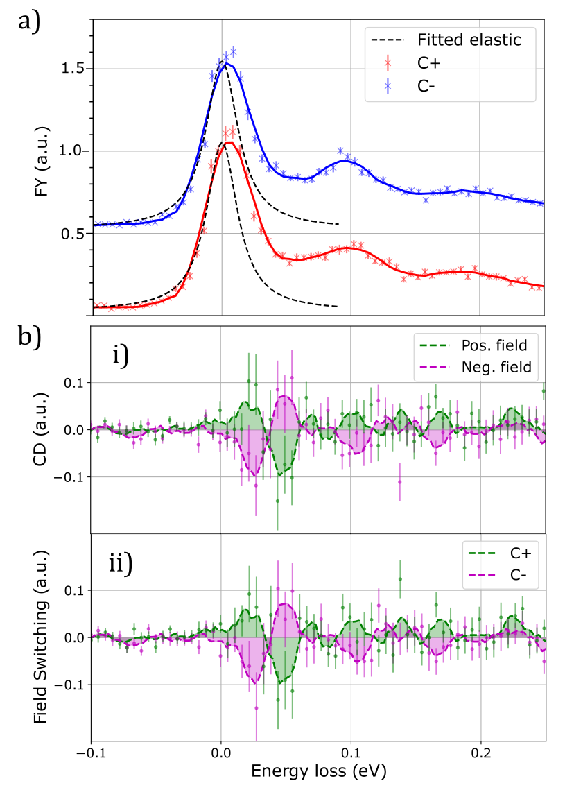
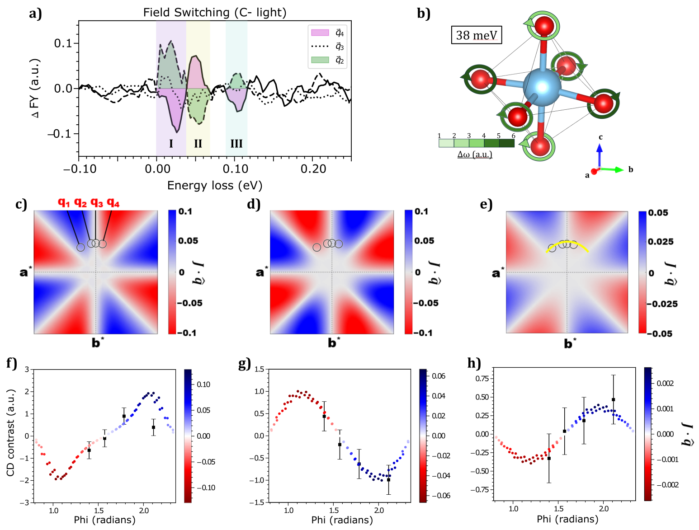
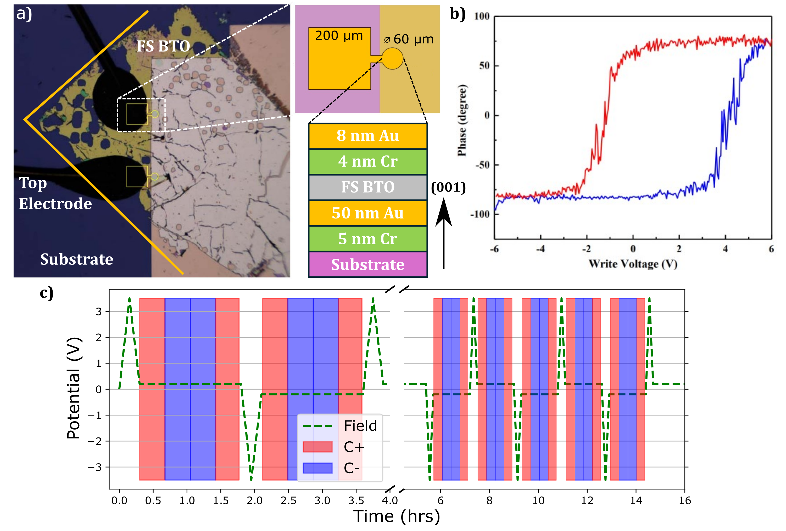

# 電場が変える格子の「手」：CD-RIXSで切り拓くカイラルフォノン制御の新展開

- **執筆日**: 2026-03-31
- **トピック**: フォノン角運動量の電場制御と円偏光 RIXS（CD-RIXS）によるカイラルフォノンの直接観測
- **タグ**: Phonons and Thermal Properties / Nonequilibrium and Dynamic Response / Excitons and Photoinduced Response / Coupled-Field Response / Synchrotron Measurements
- **注目論文**: Grimes et al., "Electric field switching of chiral phonons," arXiv:2603.06144 (2026)
- **参照関連論文数**: 7

---

## 1. なぜ今この話題なのか

物性物理学はこの十数年、「自由度の追加」によって驚くべき発展を遂げてきた。電子のスピン、トポロジカル相の量子数、あるいは谷（バレー）自由度と、各時代の「隠れた次元」を発見することが新機能材料設計の突破口となってきた。では次の自由度は何か、という問いへの有力な回答として近年浮上してきたのが、フォノン、すなわち格子振動の「カイラリティ（手性）」である。

フォノンは長らく「振動エネルギーの搬送体」として熱物性の文脈で語られてきたが、カイラルフォノンという概念は、格子振動を「向き」のある角運動量まで持つ実体として捉え直す。左巻きに回転しながら伝播するフォノンと右巻きに回転するフォノンは、対称性が破れた系では異なるエネルギーを持ち、外場に対して異なる応答を示す。これはちょうど、電子のスピン自由度が磁気的応答や磁気抵抗の源泉となったのと同じ論理で、フォノンの「手」を外部から制御できれば、フォノン角運動量を利用した情報記録や変換の新パラダイムが生まれうる。

この分野に向けて技術的な追い風が生じたのが、**共鳴非弾性 X 線散乱（Resonant Inelastic X-ray Scattering：RIXS）**の目覚ましい進展である。RIXS は、共鳴励起されたコア電子と格子・スピン・軌道励起との結合を利用してフォノンスペクトルを運動量分解で測定できる手法であり、特に軟 X 線領域での円偏光 RIXS（CD-RIXS）は、フォノンの角運動量に直接感応できる世界唯一の定量的手法として近年急速に整備されてきた。

2023年にUedaらがα石英において RIXS でカイラルフォノンを初めて観測して以来 [2302.03925]、CD-RIXS によるフォノンカイラリティの研究は急速に広がりを見せている。しかし「見えた」だけでは十分ではない。実用に向けて決定的に重要なのは「制御できるか」という問いへの答えである。2026年3月、Grimesらは BaTiO₃ 強誘電体において電場パルス一つでフォノン角運動量を可逆的にスイッチできることを CD-RIXS によって直接実証し [2603.06144]、「フォノン手性工学」の扉を開いた。本記事はこの成果を核として、カイラルフォノンを巡る物理的な問いと実験・理論的な現況を俯瞰する。

---

## 2. この分野で何が未解決なのか

フォノンのカイラリティを巡る問いは、数学的定義の問題から実験的検出の問題、さらにはその制御・応用の問題まで多層的に絡み合っている。特に重要な論点を整理すると以下のようになる。

第一の問いは「フォノン角運動量とは何であり、どの材料で現れるか」である。フォノン角運動量（phonon angular momentum：PAM）は、原子がその平衡位置の周りを円軌道状に変位するときに発生する機械的角運動量として定義される。しかしどういう結晶対称性があればカイラルフォノンが許容されるのかは、意外に微妙な問題である。直感的には「結晶が手性を持つ（鏡映対称性がない）こと」が必要に思われるが、Huang らの研究 [2503.22794] は、PAM と擬角運動量（pseudo-angular momentum）の関係が結晶対称性とウィコフ位置の両方に依存することを示しており、単純な「非中心対称なら OK」という理解では不十分なことを明らかにしている。さらに 2512.22050 では、空間反転と時間反転の双方を保つ MnTiO₃ においてさえも非相反 CD-RIXS 信号が観測されるという、この直感に反する結果が示されており、「どの対称性がカイラルフォノンを許容するか」という問いはいまだ完全には解決されていない。

第二の問いは「CD-RIXS は本当にフォノン角運動量を直接測定しているのか」という検証問題である。CD-RIXS でフォノン信号に円偏光二色性が現れたとしても、その信号源が真にフォノン PAM であるかどうかは慎重に確認しなければならない。複屈折（birefringence）を持つ異方性結晶では、入射 X 線の偏光状態が試料中を伝播する間に変化し、見かけ上 CD が生じることがある。Nag らはこの問題を CuO で詳しく調べ、磁気・軌道励起に顕著な CD 信号が複屈折に由来する人工信号（アーティファクト）として生じうることを実証した [2501.16034]。石英やBaTiO₃の実験ではこのアーティファクトを回避するための幾何学的設計が施されているが、複屈折問題は CD-RIXS 実験全体にとって依然として注意が必要な落とし穴である。

第三の問いは「フォノン PAM をどのように制御できるか」である。磁場による制御 [2501.10650]、電場による制御 [2603.06144]、磁気秩序との結合による増強 [2512.00388] などが実証されつつあるが、それぞれのメカニズム、効率、安定性は大きく異なる。非揮発的（non-volatile）制御を達成できるのはどのシステムか、また逆に超高速スイッチングが可能なのはどのシステムか、という問いに対する包括的な答えはまだ出ていない。

---

## 3. 注目論文の核心：BaTiO₃での電場スイッチングを実証した CD-RIXS

### 何がわかっていたか

注目論文 [2603.06144] が登場する前、カイラルフォノンの外場による制御については、磁場を用いた間接的な制御例 [2501.10650] や、フォノン角運動量の光学的ポンプによる一時的な生成の報告が存在していた。しかし「静的かつ電場のみで、フォノンの角運動量の向きを安定に反転させ、それを超高分解能の X 線散乱で定量的に確認する」という実験は存在しなかった。特に強誘電体の分極反転によってカイラルフォノンが制御できるという物理的直感は早くから指摘されていたが、その実験的証明は CD-RIXS の技術的難易度の高さから実現していなかった。

### 何を、どのように明らかにしたか

Grimes らは強誘電体 BaTiO₃ の自立薄膜（フリースタンディング膜）を Au/Cr 電極でサンドイッチした試料を作製し、ESRF のビームライン ID32 において酸素 K 端（約 531.25 eV）の円偏光 X 線を用いた CD-RIXS 測定を行った。自立薄膜を採用した理由は基板歪みを排除してBaTiO₃本来の強誘電特性を引き出すためである。

実験の核心は「電場パルスで分極を反転させる前後で CD-RIXS スペクトルがどう変化するか」を系統的に調べることにある。測定プロトコルは「右円偏光（C+）→ 左円偏光（C−）→ 右円偏光（C+）→ 左円偏光（C−）」と交互に切り替えながらスペクトルを取得し、C+ スペクトルと C− スペクトルの差分（二色性コントラスト）を検出する。これを電場 +3.5 V と −3.5 V それぞれで書き込んだ状態で行い、コントラストの符号が反転するかを調べた。

*図1（[2603.06144] Fig. 3）：BaTiO₃の電場スイッチングによる CD-RIXS の反転。上パネルが +極性状態、下パネルが −極性状態でのスペクトル。赤と青の線がそれぞれ右円偏光・左円偏光による測定。約 11, 38, 100 meV 付近に現れる差分（灰色）が符号を逆転させており、フォノン角運動量の反転を示している。この状態が少なくとも 15 時間安定であることも確認された。*

### 主要結果と新規性

結果は明快である。BaTiO₃の分極を電場で反転させると、3 つの異なるエネルギー（約 11 meV、38 meV、100 meV）に現れるフォノンモードの CD コントラストがすべて符号を逆転する。これはフォノンの「手」が電場に追従して反転したことの直接証拠である。さらに重要なのは、この状態が少なくとも 15 時間にわたって安定に保持されたことだ。これは非揮発的なメモリ動作を意味しており、単なる光学的な一時効果とはまったく異なる。

この実験の物理的なメカニズムは以下のように理解できる。強誘電体 BaTiO₃では Ti⁴⁺ イオンが酸素 8 面体の中心からわずかにずれた位置に安定に位置しており、この変位が自発分極の源泉である。Ti のずれは周囲の O²⁻ イオンに働く力定数の非対称性を生み、特定の k 点において酸素イオンが円形軌道を描いて振動するモード（カイラルフォノン）が生じる。電場で Ti の変位方向を反転させると、この力定数の非対称性も反転し、酸素イオンの回転方向が逆転する。すなわちフォノン PAM の符号が反転する、という連鎖である。

理論的には、ジャイロ電気テンソル $g_{ij}$ と自発分極 $P_s$ の線形関係

$$g_{ij} = \gamma_{ijv} P_s$$

が正四方晶（C₄v 対称）の BaTiO₃ では成立し、$P_s$ の符号反転がそのままフォノン PAM の符号反転をもたらすことが示されている。ここでジャイロ電気効果（gyroelectric effect）とは、電場で誘起されたものではなく自発分極に由来する光学旋光の効果であり、カイラルフォノンとのこの結びつきは本論文が初めて明示した点の一つである。

*図2（[2603.06144] Fig. 4）：4 つの逆格子空間点での CD コントラストと第一原理計算（DFT）によるフォノン螺旋性の予測値の比較。実験値（点）と計算値（線）が定量的に一致しており、CD-RIXS が真にフォノン角運動量を測定していることが確認される。また q₂ と q₄ でコントラストが符号反転する点が、理論的な J·q 依存性と整合している。*

もう一つの重要な検証は、**CD コントラストの q 依存性**である。逆空間の 4 点（q₁ 〜 q₄）での測定を比較すると、符号が反転した点（q₂ と q₄）が存在した。これは理論的に予測される「フォノン螺旋性 $\mathbf{J} \cdot \mathbf{q}$ （角運動量と波数ベクトルの内積）が q を反転させると符号が逆転する」という性質と完全に一致する。第一原理計算（DFT）によるフォノン螺旋性の予測も実験コントラストと良好な定量的一致を示した。

### まだ仮説の段階にあること

ただし全てが解明されたわけではない。CD-RIXS の信号強度の絶対値と、DFT が予測するフォノン PAM の大きさの間の定量的な対応関係のキャリブレーションは、まだ確立されていない部分がある。また本実験では自立膜という特殊な試料形態を用いており、電極との界面効果や薄膜の厚さ依存性については検討の余地が残る。さらに約 100 meV の高エネルギーモードについては信号対雑音比が低く、スイッチング挙動の信頼性は低エネルギーモードほど高くない。

---

## 4. 背景と研究史：この論文はどこに位置づくか

カイラルフォノンという概念の歴史は比較的浅い。格子振動がスピンと同様に「右巻き・左巻き」という自由度を持ちうるという理論的提唱は 2010 年代後半にさかのぼる。Zhang らは三回回転対称性を持つ六方晶系において、K 点のフォノンが有限の PAM を持つことを第一原理計算で示し、それが電子スピンと結合しうることを指摘した（Phys. Rev. Lett. 2014）。続く数年でフォノン PAM の理論的枠組みが整備されていった。

しかし長らく問題であったのは実験的証拠の乏しさであった。カイラルフォノンを直接観測する手法として候補に挙がっていたのがラマン散乱と RIXS であるが、ラマン散乱ではフォノンの符号を識別するための円偏光の選択則が結晶構造によって大きく制限される。この壁を突破したのが Ueda らによる 2023 年の Nature 論文である [2302.03925]。

Ueda らは α石英を試料として選び、酸素 K 端での CD-RIXS 測定によって、石英の左右手性に対応してカイラルフォノンの CD コントラストが符号反転することを示した。石英が正三方晶に属する典型的なキラル結晶であることが実験設計を明確にしており、この「概念実証」は CD-RIXS という測定手法の有効性を強く確立した。重要なのは、RIXS は**運動量分解が可能**という点である。逆格子空間の一般点（high-symmetry line 上ではない一般的な q 点）でカイラルフォノンを観測することが原理的には可能であり、これがラマン散乱との大きな優位性をなす。

Ueda らの石英実験の後、CD-RIXS を使ったカイラルフォノン研究は急速に発展した。Huang らのグループは MnTiO₃ において「フェロ回転秩序（ferro-rotational order）」のある材料でも CD-RIXS 信号が検出されることを報告し [2512.22050]、Okamoto らのグループは (Mn,Ni)₃TeO₆ というらせんスピン相を持つ材料において、ヘリカルスピン状態に入るとカイラルフォノンの CD 信号がおよそ 10 倍に増強されることを報告した [2512.00388]。

一方、Grimes と Ueda が所属する研究グループは 2603.06144 で BaTiO₃ を対象に選ぶことで、「観測」から「制御」への質的な転換を達成した。試料をキラル石英固定の結晶から強誘電体に変えたことで、分極方向という制御可能な変数がカイラルフォノンと直接結びつく系を作ることができた。この選択は明らかに戦略的であり、先行する Ueda らの石英実験の「次の問い」（手性は変えられるか？）に対して正面から答えたものといえる。

---

## 5. どの解釈が最も妥当か：証拠・比較・限界

### CD-RIXS シグナルが確かにフォノン PAM を反映しているという根拠

2603.06144 の最大の貢献は、単に信号が見えただけでなく、その解釈の確度を多角的に検証した点にある。

まず、**q 依存性の対称性**という検証がある。フォノン PAM を起源とする CD-RIXS コントラストは、$\mathbf{J} \cdot \mathbf{q}$ に比例すべきであり、$\mathbf{q}$ を逆転させると符号が反転する。Fig. 4 ではこれが実験的に確認されており（q₂ と q₄ で符号反転）、これは複屈折アーティファクトによる信号では容易に実現しないパターンである。

次に、**電場反転による符号反転**という検証がある。BaTiO₃ の分極を +3.5 V と −3.5 V で書き込んだ状態でそれぞれ CD を測定し、全フォノンモードで符号が逆転した。偶然の一致や系統誤差がこのパターンを生み出すのは考えにくい。

また、**DFT との定量的一致**という検証もある。第一原理計算で計算したフォノン PAM の q 依存性（螺旋性 $\mathbf{J} \cdot \mathbf{q}$）と、実験で得られた CD コントラストの q 依存性が定量的に一致することが Fig. 4 で示されている。これは CD-RIXS クロスセクションが正しく計算・解釈されていることの独立した確認となっている。

### 競合する解釈と懸念点

とはいえ、いくつかの懸念は検討が必要である。第一は複屈折問題である。Nag ら [2501.16034] が CuO で示したように、光学的に異方性の高い材料では複屈折が CD アーティファクトを引き起こしうる。2603.06144 の著者らは、正入射ジオメトリ（X 線ビームを光学的 c 軸に平行に入射する）を採用して複屈折の影響を最小化しており、この点については一定の対処がなされている。ただし BaTiO₃ の電場印加時に生じる歪みや、試料内の分域（ドメイン）構造のランダム性がわずかな複屈折効果を残す可能性は、完全には排除できていない。

第二の懸念は「フォノン PAM の大きさの絶対評価」が未確立な点である。CD コントラストの比（$(I_{C+} - I_{C-})/(I_{C+} + I_{C-})$）が何パーセントになるかは、どのフォノンモードがどれだけの PAM を持つかを定量化する指標として重要だが、この比をフォノン PAM の絶対量（$\hbar$ 単位で何か）に換算するキャリブレーションファクターはまだ標準化されていない。Ueda の石英実験でも同様の問題は意識されており、今後の測定標準の確立が求められる。

### 磁場スイッチングとの比較

[2501.10650] は Fe₁.₇₅Zn₀.₂₅Mo₃O₈という強磁性絶縁体において、磁化の反転に伴ってカイラルフォノンの回転方向が追従することをラマン散乱で示した。この系では磁場数十〜数百 mT のオーダーでフォノン PAM のスイッチングが可能であり、さらにドメイン境界での位相巻き付きによるトポロジカルに保護されたフォノンエッジモードの存在を示唆する証拠も得られた。電場スイッチング [2603.06144] と磁場スイッチング [2501.10650] は相補的な関係にあり、電場制御は CMOS 技術との親和性が高く集積回路への応用に有利だが、磁場制御は超高速スイッチング（フェムト秒レーザーによる磁化反転のアナロジー）に対して別のルートを提供しうる。

一方、[2512.00388] が示したように、らせんスピン秩序（helical spin order）はカイラルフォノンを「増幅」する作用を持つ。(Mn,Ni)₃TeO₆ では常磁性相から反強磁性相、そしてヘリカルスピン相と秩序が発展するにつれてフォノンの CD 信号が段階的に増大し、ヘリカルスピン相では約 10 倍の増強が確認された。この「磁気秩序によるカイラルフォノン増幅」という現象は、電場制御と組み合わせた多機能性につながるかもしれない。

### MnTiO₃ の非相反性：対称性の議論に残る謎

もっとも概念的に興味深い問いを投げかけているのが [2512.22050] の MnTiO₃ の結果である。MnTiO₃ はイルメナイト構造を持つ材料で、バルクの空間群はマクロな意味で中心対称（ $S_6$ 対称）であり、また測定温度での常磁性相は時間反転対称性を保つ。通常の CD は空間反転と時間反転の少なくとも一方が破れることを要求されるが、この系では両方が保たれているにもかかわらず非相反な CD-RIXS 信号が観測された。著者らはこれを「フェロ回転的なフォノン凝縮体」が形成するアキシャル電気トロイダルモーメントによるものと解釈しているが、この解釈は既存の対称性理論の枠組みを拡張するものであり、Huang ら [2503.22794] の対称性制約の理論と突き合わせながらさらに精査が必要である。この問いに答えることは、「何が本当にカイラルフォノンを生み出すか」という基本問題の理解を深める。

---

## 6. 何が一般化できるのか：材料・手法・応用への広がり

### 強誘電体全般への展開

2603.06144 が示した BaTiO₃ での成功は、強誘電体という材料クラス全体でのカイラルフォノン電場制御の可能性を示唆する。これと並行して同月に報告された [2603.15325] では、分子強誘電体であるトリグリシン硫酸塩（triglycine sulfate：TGS）において、円偏光ラマン散乱と時間分解磁気光学カー効果（MOKE）を用いてフォノンカイラリティの電場スイッチングが実証された。BaTiO₃（酸化物ペロブスカイト）と TGS（分子性強誘電体）という物質クラスの異なる系で同じ物理が成り立つことは、「強誘電秩序 → フォノン PAM」という因果関係の汎用性を裏付けている。

ただし両者で用いられた実験手法が異なることは注目に値する。BaTiO₃ では酸素 K 端の CD-RIXS を用いており、TGS ではラマン散乱と MOKE が使われた。RIXS は放射光施設を必要とする反面、運動量分解能と化学選択性（どのイオンのどの軌道に対する測定か）という点で圧倒的に優れており、フォノン PAM の定量的評価という観点では現時点で最も信頼性の高い手法といえる。ラマン散乱は実験室系で行える利便性があるが、一般の q 点へのアクセスが制限される。

### 磁気秩序との組み合わせ

磁気秩序がカイラルフォノンと本質的に結合することは複数のシステムで示されている。[2501.10650] の強磁性絶縁体や [2512.00388] のらせん磁性体の例に加え、Weißenhofer ら [2411.03879] は体心立方鉄（bcc-Fe）において磁気励起（マグノン）とフォノンの選択的結合によってカイラルフォノンが生成されること、そしてこの機構が多くの磁性材料に普遍的に当てはまりうることを第一原理計算で示した。これらを総合すると、「スピン秩序 + 強誘電秩序」を組み合わせたマルチフェロイクス材料では、磁場と電場の双方でフォノン PAM を操作できるというハイブリッド系の設計が原理的に可能であることが示唆される。

### フォノン角運動量のデバイス応用

より広い視点から見ると、フォノン角運動量の制御が可能になったことの意義は、熱流に「向き」の概念を付加できる可能性にある。一般にフォノンは電気的に中性であるため磁場への直接応答はなく、熱流の方向制御は難しい。しかしフォノン PAM という自由度を持つフォノンを選択的に励起・伝播させることができれば、カイラルフォノン流による角運動量輸送（フォノンスピントロニクスのアナロジー）や、フォノンの手性を利用したエネルギー変換（フォノンゼーベック効果のカイラル版）が考えられる。2026 年時点ではこれはまだ遠い展望だが、電場スイッチング [2603.06144] という実証は、そのための基盤材料科学の第一歩を踏み出したものと評価できる。

---

## 7. 基礎から理解する

### RIXSとは何か

共鳴非弾性 X 線散乱（RIXS）は、特定のコアレベルのしきいエネルギー付近（共鳴条件）で入射 X 線エネルギーを調整した際に、試料中の電子がコアレベルから伝導帯に励起されて「中間状態」を経由した後、別のエネルギーで X 線を放出する二光子過程を利用した分光法である。

プロセスを段階的に説明すると次のようになる。まず入射 X 線（エネルギー $\omega_i$、波数 $\mathbf{k}_i$）が試料に当たり、コア電子（例えば酸素 1s）を近傍の空軌道（O 2p）へと共鳴的に励起する。この励起状態（コアホールを持つ中間状態）は非常に不安定（寿命 $\sim$数フェムト秒）であり、すぐに電子がコアホールに落ちて X 線を放出（散乱 X 線：エネルギー $\omega_f$、波数 $\mathbf{k}_f$）する。この際、エネルギー保存則と運動量保存則が要求されることから、

$$\hbar\omega = \hbar\omega_i - \hbar\omega_f, \quad \hbar\mathbf{q} = \hbar\mathbf{k}_i - \hbar\mathbf{k}_f$$

で定義される「エネルギー損失 $\hbar\omega$」と「運動量移送 $\hbar\mathbf{q}$」を持つ素励起（フォノン、マグノン、プラズモンなど）が試料中に残されたことを意味する。RIXS の特長は、この二次過程が共鳴条件によって特定の化学元素・軌道成分を選んで増強できること（化学選択性）と、$\mathbf{q}$ をビーム幾何によって制御できること（運動量分解能）の二点にある。

*図3（[2603.06144] Fig. 2）：CD-RIXS 実験のセットアップ。（a）電極付き自立 BaTiO₃ 薄膜の模式図。（b）圧電力顕微鏡（PFM）による強誘電ドメインの確認（コーシビティ約 3 V）。（c）測定プロトコル：C+ と C− の測定を交互に行いながら、電場書き込みをはさむ手順。*

### 円偏光 X 線とフォノン角運動量の選択則

通常の RIXS（線形偏光を用いる場合）では、散乱クロスセクションにおいてフォノンの角運動量に関する情報は平均化されてしまう。円偏光を使うことで初めて、右回り（C+）と左回り（C−）のフォノンに対して異なる散乱強度が生じ、その差（円偏光二色性：circular dichroism、CD）がフォノン PAM の直接プローブとなる。

具体的には、酸素 K 端での RIXS の CD コントラストは次のような形で記述される：

$$A_m \propto \langle m | \boldsymbol{\varepsilon}_c^{\prime *} \cdot \begin{pmatrix} 0 & e^{-2i\phi} \\ e^{2i\phi} & 0 \end{pmatrix} \cdot \boldsymbol{\varepsilon}_c | 0 \rangle$$

ここで $\boldsymbol{\varepsilon}_c$ と $\boldsymbol{\varepsilon}_c^{\prime}$ はそれぞれ入射・散乱 X 線の偏光ベクトル（円偏光基底で表現）、$\phi$ は波数ベクトルと面内方向のなす角、$|m\rangle$ と $|0\rangle$ はそれぞれ終状態と基底状態である。この表式の鍵は「非対角成分（off-diagonal terms）」にある。この部分は酸素 2p 軌道が回転運動（角運動量を持つ運動）をしている場合にのみゼロでなく、これがフォノン PAM への感応性の根拠となっている。つまり CD-RIXS は、酸素 K 端を通じて「酸素イオンの円軌道運動」を X 線の偏光状態の差分で読み出す測定法だといえる。

### フォノンの角運動量：何が「回転」しているのか

フォノンの角運動量（PAM）は、ブロッホ関数として記述されるフォノンモードにおいて各原子の変位ベクトルが「回転成分」を持つときに定義される。具体的に、$n$ 番目の原子のフォノン変位 $\mathbf{u}_n(\mathbf{k})$ が、波数 $\mathbf{k}$ において複素振幅を持つ場合、PAM の $z$ 成分は

$$J_z(\mathbf{k}) = \sum_n m_n \mathrm{Im}\left[ u_{n,x}^*(\mathbf{k}) u_{n,y}(\mathbf{k}) \right]$$

と書ける。ここで $m_n$ は原子 $n$ の質量、$u_{n,x}$ と $u_{n,y}$ はそれぞれ変位ベクトルの $x$・$y$ 成分である。この式を見ると、$J_z$ が有限の値を持つためには $u_{n,x}$ と $u_{n,y}$ が互いに位相がずれている（複素数的に独立している）こと、すなわち原子が平衡点を中心に楕円（特に円）軌道を描くことが必要だとわかる。これが「カイラルフォノン」のミクロな実体である。

さらに重要な点として、PAM は結晶の全対称性によって許容されるかどうかが決まる。BaTiO₃の場合、常誘電相（立方晶、$O_h$ 対称）ではすべてのフォノンに対して PAM はゼロに要求されるが、強誘電相（正方晶、$C_{4v}$ 対称）では特定の高対称線上から外れた一般的 k 点において PAM が許容される。つまり強誘電相転移という「対称性破れ」そのものが、カイラルフォノンの「スイッチオン」を担っているともいえる。

### BaTiO₃の強誘電性の基礎

BaTiO₃ は典型的なペロブスカイト型強誘電体であり、$T_C \approx 130\ ^\circ$C 以上では立方晶（$Pm\bar{3}m$）の常誘電相をとる。冷却するとまず正方晶（$P4mm$）の強誘電相に転移し、Ti⁴⁺ が O²⁻ 8 面体の中心から [001] 方向（または等価な 3 方向）にわずか（約 0.12 Å）ずれた位置に安定に位置する。この変位は 2 つの等価なエネルギー最小位置（+z と −z）の間のビスタブルポテンシャルを形成しており、電場印加によって一方から他方へと遷移させることが強誘電スイッチングである。

この「+z」状態と「−z」状態は力定数の符号が逆転しているため、先述のメカニズムでフォノン PAM の向きも逆転する。本質的にはこれは「フォノン手性のビット」であり、電場パルスによって 0→1、1→0 のように書き換えられるフォノン情報単位として機能しうる。

---

## 8. 重要キーワード10個

**1. カイラルフォノン（chiral phonon）**
原子が平衡位置の周りを螺旋状（円形〜楕円形）に変位しながら伝播するフォノン。左巻きと右巻きの変位パターンを持つフォノンが区別され、それぞれ逆符号の角運動量を持つ。対称性が破れた系（非中心対称結晶や磁気秩序体）の特定の k 点で許容される。スピンや谷（バレー）に続く「フォノン内の自由度」として注目されている。

**2. フォノン角運動量（phonon angular momentum：PAM）**
フォノンが持つ機械的角運動量であり、原子変位の回転成分から定義される量 $J_z = \sum_n m_n \mathrm{Im}[u_{n,x}^* u_{n,y}]$。スピン角運動量の類似物として、磁性体において電子スピンに移行できることが示されており（phonon-magnon coupling）、熱流の角運動量輸送という観点から材料設計の新しい指針となりうる。

**3. 共鳴非弾性 X 線散乱（RIXS）**
二次光学過程を利用してエネルギー損失と運動量移送を同時計測する X 線分光法。特定の吸収端（コアレベル励起）に共鳴させることで化学選択的・軌道選択的な素励起測定が可能。フォノン・マグノン・プラズモンなどの測定に用いられ、現代の強相関電子系研究において不可欠のツールとなっている。

**4. 円偏光二色性 RIXS（CD-RIXS）**
右円偏光と左円偏光を交互に入射して RIXS スペクトルの差分を取る手法。磁気励起に限らず、フォノンの角運動量にも感応するという特性が近年発見され、カイラルフォノン研究の主力手法となった。酸素 K 端では O 2p 軌道の回転運動に対して感度を持つ。

**5. ジャイロ電気効果（gyroelectric effect）**
光が自発電気分極を持つ誘電体を伝播する際に光学旋光が生じる現象。通常の光学活性（空間分散由来）と異なり、自発分極の存在そのものが旋光の原因となる。2603.06144 では、このジャイロ電気テンソルとカイラルフォノンの螺旋性が線形関係にあることが示され、フォノン PAM の電気的制御の理論的根拠を与えた。

**6. 強誘電スイッチング**
外部電場によって強誘電体の自発分極の向きを反転させる操作。電場のしきい値（矯頑電場）を超えることでドメインが形成・成長し、分極反転が完了する。BaTiO₃ では約 3.5 V の電場パルスで完全なスイッチングが可能であり、これがフォノン PAM の反転と直接結びついた。この操作の非揮発性（電場を取り除いても状態が保持される）がデバイス応用にとって本質的に重要である。

**7. フェロ回転秩序（ferro-rotational order）**
結晶内の酸素 8 面体などの多面体が、隣接サイトで同じ向きに回転変位した状態。スペース群の軸方向の対称性を破るが、全体として空間反転対称性を保つ場合もある。MnTiO₃（イルメナイト構造）では菱面体歪みに伴ってこの秩序が存在し、フォノンの円偏光二色性という形でカイラル応答を生じさせることが [2512.22050] で報告された。

**8. 複屈折アーティファクト（birefringence artifact）**
光学的に異方性の高い結晶において、入射 X 線の偏光状態が試料中の伝播中に変化することで、真の磁気・軌道・フォノン信号が存在しなくても見かけの CD 信号が生じる現象。CuO での研究 [2501.16034] でその重大性が示され、CD-RIXS 実験の解釈に際して必ず考慮すべき系統誤差の源泉となっている。

**9. 非相反光学応答（non-reciprocal optical response）**
試料に対する X 線（または光）の伝播方向を逆転させると応答が変わる現象。一般に時間反転対称性と空間反転対称性の少なくとも一方が破れた系で現れると考えられるが、MnTiO₃ での結果 [2512.22050] はこの規則の例外的事例として注目を集めている。非相反性はアイソレータや不揮発性スイッチなどの応用に直結する。

**10. フォノン螺旋性（phonon helicity）**
フォノン角運動量ベクトルと伝播方向（波数ベクトル $\mathbf{k}$）の内積 $\mathbf{J} \cdot \mathbf{k}$ で定義される量。電子の helicity（スピンと運動量の内積）と類比的な量であり、トポロジカル絶縁体表面状態やらせん結晶において「ロッキング（locking）」が生じうる。CD-RIXS の信号強度が $\mathbf{J} \cdot \mathbf{q}$ に比例することが実験・理論双方から確認されており [2603.06144]、この量の測定が CD-RIXS の本質的な役割であることが明確になった。

---

## 9. おわりに：何が分かり、何がまだ残っているのか

2603.06144 の最大の貢献は、「カイラルフォノンは電場で制御できる」という命題を実験的に確立したことである。BaTiO₃ における電場スイッチングの実証、DFT との定量的一致、q 依存性の対称性検証、そして少なくとも 15 時間の非揮発安定性という複数の証拠の束は、この結論を強く支持している。さらに同月の TGS での並行報告 [2603.15325] が「強誘電体一般への汎用性」を示し、先行する石英実験 [2302.03925] からの一連の発展として、CD-RIXS によるカイラルフォノン研究は「観測・理論・制御・安定性評価」という科学的サイクルの一回転目を完了したといえる。磁気秩序によるフォノン PAM のスイッチング [2501.10650] や増強 [2512.00388] の報告も加わり、フォノン手性という概念は複数の物質クラスと複数の制御手段に支えられた、物性物理学の新たな地平線として確立しつつある。

一方で、未解決の問いも多い。MnTiO₃ での非相反 CD の解釈は対称性理論と整合しない側面があり [2512.22050]、「カイラルフォノンを許容する対称性条件」の完全な理解はまだ途上にある。フォノン PAM の絶対量を標準的なキャリブレーションなしに決定する方法論も確立されていない。また、カイラルフォノンが電子スピンや電荷、あるいは他のフォノンモードとどのように相互作用するかという輸送論的研究も緒についたばかりである。今後 1〜3 年で特に重要になると思われる論点は、まずは超高速時間分解 CD-RIXS によるカイラルフォノンのダイナミクス測定（フェムト秒〜ピコ秒の時間スケールで「手」がどう変化するか）、次に強誘電体+磁性体のマルチフェロイクス系でのフォノン PAM の磁電制御（電場だけでなく磁場でも変えられるか）、そして室温でのフォノン PAM スイッチングを可能にする新材料探索、の三点である。測定技術のさらなる高度化と材料科学の連携によって、フォノン角運動量を基軸とした新しい機能物性の設計が現実味を帯びてくるだろう。

---

## 参考論文一覧

1. **[2603.06144]** M. Grimes, C. J. Allington, H. Ueda, C. P. Romao, K. Kummer, P. Kaur, L.-S. Wang, Y.-W. Chang, J.-C. Yang, S.-W. Huang, U. Staub, "Electric field switching of chiral phonons," arXiv:2603.06144 (2026). **[注目論文]**

2. **[2302.03925]** H. Ueda, M. García-Fernández, S. Agrestini, et al., "Chiral phonons probed by X rays," arXiv:2302.03925; *Nature* 618, 946 (2023). **[背景：CD-RIXS によるカイラルフォノンの初実証]**

3. **[2603.15325]** X.-B. Han et al., "Coupled Ferroelectricity and Phonon Chirality," arXiv:2603.15325 (2026). **[比較：異材料（TGS）での電場スイッチングの並行報告]**

4. **[2512.22050]** H. Y. Huang et al., "Non-reciprocal circular dichroism of ferro-rotational phonons in MnTiO₃," arXiv:2512.22050 (2025). **[比較・拡張：RIXS による非相反 CD と対称性の謎]**

5. **[2512.00388]** J. Okamoto et al., "Altermagnetic boosting of chiral phonons," arXiv:2512.00388 (2025). **[拡張：らせん磁性によるカイラルフォノン増強]**

6. **[2501.10650]** F. Wu et al., "Magnetic switching of phonon angular momentum in a ferrimagnetic insulator," arXiv:2501.10650; *Phys. Rev. Lett.* 134, 236701 (2025). **[比較：磁場によるフォノン PAM スイッチング]**

7. **[2503.22794]** Zhang et al., "Comprehensive Study of Phonon Chirality under Symmetry Constraints," arXiv:2503.22794 (2025). **[理論背景：対称性によるフォノンカイラリティの制約]**

8. **[2501.16034]** A. Nag et al., "Circular dichroism in resonant inelastic x-ray scattering from birefringence in CuO," arXiv:2501.16034 (2025). **[方法論的批判：CD-RIXS における複屈折アーティファクトの問題]**
