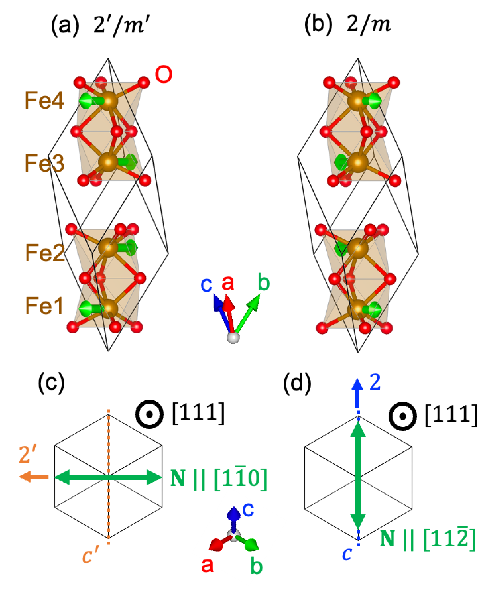
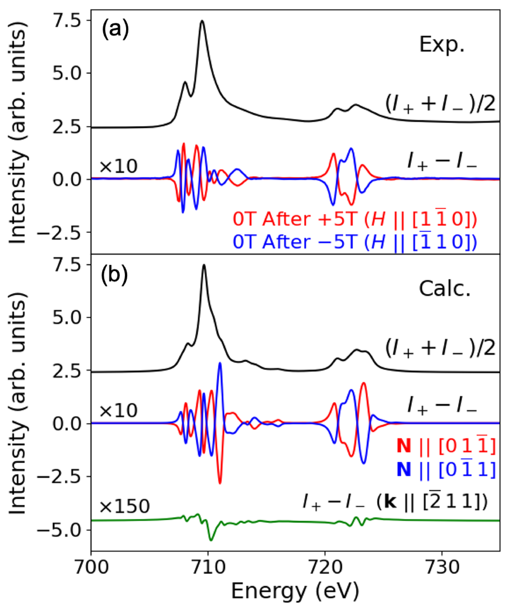
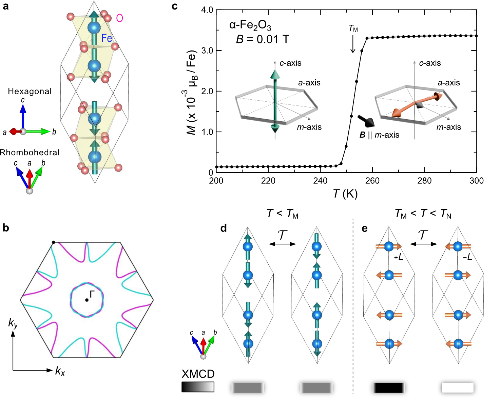
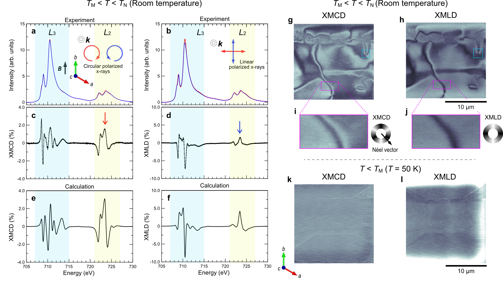
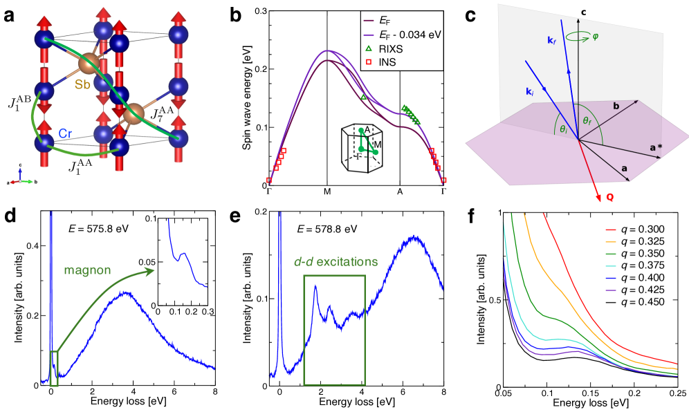
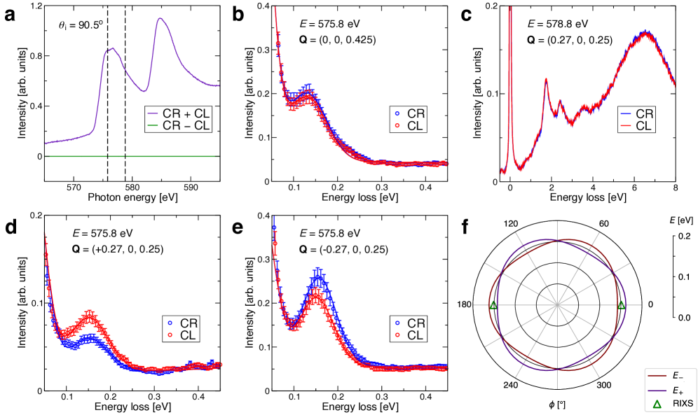
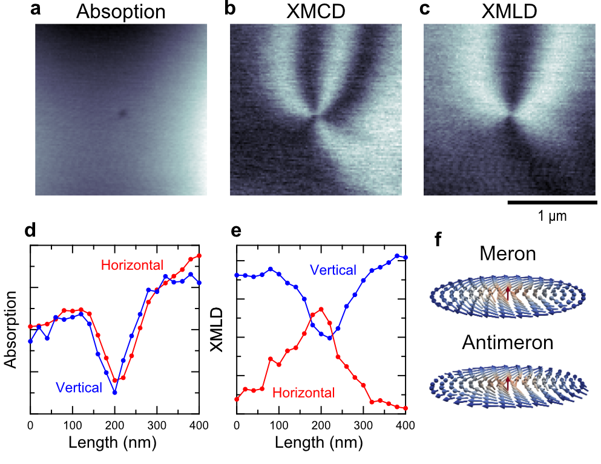

# XMCDが照らし出す交替磁性——補償磁石における磁気円二色性の新展開

- **執筆日**: 2026-03-31
- **トピック**: X線磁気円二色性（XMCD）・X線磁気線形二色性（XMLD）による交替磁性の実験検証
- **タグ**: Magnetism and Spin / Charge, Orbital, and Spin Order; Spin-Orbit Interaction / Synchrotron Measurements; First-Principles Calculations
- **注目論文**: Zezhong Li et al., "X-ray magnetic circular dichroism evidence of intrinsic d-wave altermagnetism in rutile-structure NiF₂," arXiv:2603.03694 (2026)
- **参照関連論文数**: 8

---

## 1. なぜ今この話題なのか

磁性体の研究は長年にわたり、強磁性体（ferromagnet）と反強磁性体（antiferromagnet）という二大陣営を軸に展開されてきた。強磁性体はスピンが一方向にそろい、巨大な自発磁化を生じる。反強磁性体はスピンが交互に反転し、正味の磁化はゼロになる——そのように長く考えられてきた。ところが2020年代に入って、この単純な二項対立を根本から揺るがす概念が急速に注目を集めている。「交替磁性（altermagnetism）」と呼ばれる第三の磁気相の発見だ。

交替磁性は一見したところ反強磁性体に見える。正味の磁化はゼロで、隣接する磁気副格子のスピンは互いに相殺する。しかし結晶の対称性が特別な形で低下しているために、エネルギーバンドは運動量空間で大きくスピン分裂し、輸送特性や光学応答において強磁性体に匹敵する現象——異常ホール効果、磁気光学カー効果、そしてXMCD（X-ray Magnetic Circular Dichroism; X線磁気円二色性）——が現れる。純粋な反強磁性体なら原則として現れるはずのないこれらの現象が、なぜ交替磁性では許容されるのか。その答えは、時間反転対称性（TRS: time-reversal symmetry）の破れ方の「質」にある。

2021年にŠmejkalらが理論的な枠組みを確立し[2105.05820]、以来、α-MnTeやα-Fe₂O₃（ヘマタイト）、CrSb、RuO₂など多数の候補物質が提案されてきた。しかし理論予測は先行しても、実験的な検証は一歩遅れがちだった。特に「XMCD信号が本当に交替磁性固有のものか、それとも微小な弱強磁性や不純物に由来するのではないか」という根本的な疑義を払拭することが大きな課題だった。

2025〜2026年にかけてその壁を突き破る実験論文が相次いで現れた。本記事が核に据えるのは、2026年3月に公開されたLiらの研究だ[2603.03694]。彼らはルチル構造のNiF₂において、XMCDの測定と理論計算を組み合わせることで、d波交替磁性の「内在的な」信号を弱強磁性成分から明確に分離し、初めて実験的証拠を提示した。このブレークスルーは単なる一物質の話にとどまらない。XMCD・XMLDという確立された放射光分光手法が、交替磁性の普遍的な実験プローブになりえることを示したという意味で、分野全体にとって転換点となる仕事だ。

---

## 2. この分野で何が未解決なのか

交替磁性研究において現在最も議論を呼んでいる問題は、大きく分けて四つある。

第一は「いかにして真の交替磁性信号を同定するか」という問題だ。交替磁性は正味の磁化がゼロのはずだが、現実の物質には必ずスピン軌道相互作用が存在し、ジャロシンスキー–守谷（DM）相互作用などに起因する微弱な弱強磁性（weak ferromagnetism）が混在する。XMCD信号はこの弱強磁性にも敏感で、両者の寄与を分離しなければ交替磁性固有のシグナルを確定できない。α-MnTeのような「g波」交替磁性ではDM相互作用が禁止されているために弱強磁性が現れず分離は容易だが、ルチル構造の「d波」交替磁性では両者の共存が避けられない。

第二は「XMCDの起源となる物理機構」の問題だ。強磁性体でのXMCDは、軌道磁気モーメントとスピン磁気モーメントへの感度を記述する「総和則（sum rules）」として整理されている。しかし交替磁性では正味の磁化はゼロにもかかわらずXMCDが現れる。この信号は何に比例しているのか。異方的磁気双極子モーメント（anisotropic magnetic dipole moment）、あるいは磁気多極子（magnetic multipole）の概念が鍵だが、従来の総和則ではこれらを十分に記述できない。2025年にYamasakiらが磁気多極子の完全基底に基づく一般化総和則を提案したが[2504.16461]、実験との定量的対応はまだ発展途上だ。

第三は「空間分解能」の問題だ。交替磁性の巨視的な計測が可能になっても、ナノスケールでの磁区構造や磁区壁の性質はほとんど理解されていなかった。ドメインの向きによってXMCD信号の符号が変わるため、平均化されたバルク測定では本質的な情報が失われてしまう。

第四は「交替磁性の普遍性とその限界」だ。現在知られている交替磁性候補は材料によってスピン分裂の波形（d波、g波、i波など）が異なり、XMCD信号の大きさや形状も大きく異なる。どのような結晶・磁気対称性を持つ系でXMCDが現れ、どのような系では消えるのか。その系統的理解はまだ構築途上にある。

---

## 3. 注目論文の核心：何が前進し、何がまだ仮説か

### それ以前には何が分かっていたか

NiF₂はニッケルと弗素からなるルチル型構造の絶縁体で、ネール温度は73.2 Kだ。結晶構造はTiO₂と同型で、Ni²⁺イオンが酸素六配位の環境に置かれている。理論的には、ルチル構造の2つの格子サイトが互いに90度回転した環境に置かれているため、反強磁性秩序と組み合わさることで「d波」交替磁性が生まれると予想されていた。

しかし実験的な確認は困難だった。NiF₂では弱強磁性が〜0.03 μ_B/Ni程度存在し、これがXMCDに対しても有限の寄与を持つ。交替磁性固有の信号が弱強磁性由来の信号に埋もれてしまうのではないかという懸念が常にあった。また、かつてd波交替磁性の代表例と目されていたRuO₂については、近年の研究によって磁気秩序そのものの存在が疑問視されるようになり、ルチル構造系でのd波交替磁性の実験的実証は宙に浮いた状態にあった。

### 今回どの点で前進したか

Liらの研究[2603.03694]は、NiF₂の単結晶試料に対してDiamond Light Sourceの放射光施設でNi L₂,₃端XMCDを測定した。同時に、イオン性Ni²⁺モデルに結晶場パラメータ・スピン軌道結合・多重項相互作用を組み込んだ理論計算を行い、実験スペクトルと比較した。

鍵となる方法論は、XMCD信号の「場依存性」と「温度依存性」という二つの独立したアプローチによる分解だ。交替磁性由来の信号 Δ_ALT(ω) は、ネール温度以下で磁場によらず存在する内在的な寄与であるのに対し、弱強磁性由来の信号 Δ_FM(ω) は磁気モーメント m_FM(B) に比例して変化する。したがって全XMCD信号は次式で記述できると著者らは議論した：

$$
\Delta(\omega; B) = \Delta_{\rm ALT}(\omega) + \Delta_{\rm FM}(\omega) \cdot m_{\rm FM}(B)
$$

ここで Δ_ALT(ω) は交替磁性固有の周波数依存寄与、Δ_FM(ω) は単位弱強磁性モーメントあたりの寄与、m_FM(B) は印加磁場Bに対する弱強磁性モーメントの大きさだ。

**方法1（磁場依存性）** : 同一試料に対して0.1 Tと6 Tの磁場下でXMCDを測定し、その差分をとることで弱強磁性成分を抽出し、差し引きによって交替磁性成分を求めた。

**方法2（温度依存性）** : 220 K（ネール温度以上）と2 K（ネール温度以下）でのXMCDを比較した。ネール温度以上では長距離磁気秩序がないため交替磁性成分はゼロになり、残るのは常磁性成分と弱強磁性成分のみだ。この差分によって交替磁性成分が得られる。

両方法が一致したXMCDスペクトルを与えた。このスペクトルは理論計算とも良く一致しており、「内在的なd波交替磁性」の信号として帰属された。注目すべきは、XMCD信号がL₂端とL₃端でそれぞれ符号反転を含む特徴的な振動構造を持つ点だ。これは強磁性体のXMCDとはまったく異なる形状であり、交替磁性固有の指紋と見なせる。

また、理論計算によって非立方対称の e_g 軌道分裂パラメータ（Δ_eg ≈ −32 meV）が初めて実験的に決定された。このパラメータはXMCDスペクトルの形状に大きく影響し、理論と実験の良い一致を実現するために不可欠な役割を果たしている。

### 何がまだ仮説段階か

重要な留保点として、著者らはXMCDの「線形分解」が対称性によって必ずしも保証されるものではないと明確に述べている。実験的に検証した結果として両者の独立性が極めて良い近似で成立しているが、一般的な磁場・温度条件でこれが成立する理論的保証は弱い。さらに、XMCD信号の大きさを左右するパラメータとして e_g 分裂以外にも多体効果や軌道分極の寄与が考えられるが、これらの定量的な切り分けは今後の課題だ。また本研究は単結晶の「平均」としてのXMCDを測定しており、磁区構造の影響は議論されていない。

---

## 4. 背景と研究史：この論文はどこに位置づくか

### XMCDの歴史と総和則

XMCD自体は1987年にSchlüterらが理論予言し、その後1990年代に放射光を用いた実験が急速に発展した確立された技術だ。軟X線をL端に照射したとき、左・右円偏光でそれぞれ異なる吸収率が得られる。その差 I₊ − I₋ がXMCDだ。

1992年にTholeらが、そして1993年にCarraらが提案した「総和則」により、XMCDスペクトルを積分することで原子あたりの軌道磁気モーメント ⟨L_z⟩ とスピン磁気モーメント ⟨S_z⟩ を別々に求められるようになった：

$$
m_L = -\frac{4}{3} \frac{\int_{L_3+L_2} \Delta \sigma \, d\omega}{\int_{L_3+L_2} (\sigma^+ + \sigma^-) \, d\omega} \cdot n_h
$$

$$
m_S + 7 \langle T_z \rangle = -\frac{6\int_{L_3}\Delta\sigma\,d\omega - 4\int_{L_3+L_2}\Delta\sigma\,d\omega}{\int_{L_3+L_2}(\sigma^+ + \sigma^-)d\omega} \cdot n_h
$$

ここで n_h はd殻の正孔数、Δσ = σ₊ − σ₋ がXMCDスペクトル、⟨T_z⟩ は異方的磁気双極子モーメント（「磁気スター」とも呼ばれる）だ。後者の ⟨T_z⟩ 項はしばしば「補正項」として扱われてきたが、交替磁性ではこの項がXMCDの主たる起源となりうることが近年明らかになりつつある。

### 交替磁性の理論的枠組みと先駆的実験

2021年のŠmejkalらの論文[2105.05820]は、スピン群（spin group）対称性を用いて交替磁性を系統的に分類し、数多くの候補材料を提示した。交替磁性の本質は、「時間反転 × 非磁気的な結晶対称操作（並進・回転・鏡映など）」という複合対称性（T̃ = TRS ⊗ g_crystal）の破れにある。隣り合う副格子のスピンは反平行でも、T̃ が破れていることで時間反転の偶奇に関連した物理量——異常ホール効果、XMCDなど——が有限値を持つ。

XMCD研究での先駆的な一歩は、2023〜2024年にかけてHarikらによって踏み出された[2305.03588]。彼らはg波交替磁性のα-MnTeを対象に、理論・実験の両面からXMCDを研究した。結論は驚くべきものだった：k⊥Lの配置（X線の進行方向がネール軸に垂直）では、2つの副格子からのXMCD寄与が「同符号で足し合わさる」ために有限のXMCDが出現する、というのだ。ところがその信号が強磁性体のXMCDとは違う形状を持ち、かつ通常の意味での軌道モーメントとは結び付かないことも示された。このメカニズムは「コアホールを含む励起状態での電子密度の非等方性」にあり、特に「コアバレンス多極子相互作用」が本質的な役割を担う。

これに続いたのがヘマタイト（α-Fe₂O₃）での実験だ。ヘマタイトは空間群 R3̄c のg波交替磁性候補で、ネール温度は955 Kと高く、室温で交替磁性を扱える系だ。ただしモリン転移（Morin transition）と呼ばれる約260 Kでのスピン再配向転移があり、ネール軸の向きが温度によって変化する。2023〜2025年の複数の研究（Galindez-Rualesら[2310.16907]など）がヘマタイトを交替磁性として同定し、XMCD測定を試みたが、弱強磁性（DM相互作用由来）からのXMCD信号を交替磁性固有の信号から区別することが課題として残っていた。

このような状況の中でLiらのNiF₂研究[2603.03694]が登場した。α-MnTeではDM相互作用が禁止されているために問題はなかったが、ルチル構造系では必ず弱強磁性が伴う。NiF₂で分解に成功したことは、ルチル型d波交替磁性全体——理論的に最も重要なクラスの一つ——への扉を開いた。

---

## 5. どの解釈が最も妥当か：証拠・比較・限界

### 交替磁性固有のXMCDの起源

交替磁性におけるXMCDの起源について、現在最も整合した描像は「励起状態における異方的電子密度」だ。基底状態では補償磁性体として磁気モーメントの和はゼロに近い。しかし、X線が吸収されてコアホール状態（2p→3d遷移）が作られると、コア-バレンス間のクーロン相互作用が「コアホールのある格子サイト」の電子密度を非対称に再分布させる。この非対称分布がサイトごとに異なる（副格子Aと副格子Bで逆符号）にもかかわらず、特定のX線入射配置によっては両サイトのXMCD寄与が同符号で足し合わさる。

Harikらのα-MnTe研究[2305.03588]はこのメカニズムを明確にし、「価電子系のスピン軌道結合は微小な役割しか持たず、コアレベルのスピン軌道結合がXMCDの本質的な起源」であることを示した。これはAHE（異常ホール効果）の起源とは全く異なる点だ。AHEはベリー曲率を介して価電子系のスピン軌道結合が支配的な役割を果たすが、XMCDはコアホール多極子相互作用が鍵を握る。したがって「XMCDとAHEは同じ対称性ルールに従うが、互いにスケールしない」という理論予言が実験的に検証された意義は大きい。

Ishiiらのヘマタイト研究[2603.00442]は異なる戦略で分離問題に挑んだ。彼らはX線入射方向を弱強磁性モーメントと直交させるという幾何学的な工夫によって、弱強磁性からの寄与を実験的にゼロにする測定配置を実現した。この配置で観測されたXMCDは、計算によれば弱強磁性からのXMCDの10倍以上の大きさを持ち、交替磁性固有の信号と結論づけた。さらに彼らは面内磁場を回転させることで異なる磁気点群（2′/m′ と 2/m）を持つ2つのアルターマグネティック状態を可逆的に切り替え、XMCD信号が符号反転することも確認した。この「スイッチング実験」は、XMCDが交替磁性秩序パラメータ——ネールベクトルの向き——に直接感応することを実証した点で非常に説得力が高い。

2025年にYamasakiら[2504.16461]が整備した一般化総和則の枠組みは、こうした実験的知見の理論的基盤を与える。彼らは「スピンのない（spinless）多極子」と「スピンを持つ（spinful）多極子」の完全基底を用いてXMCDとXMLDの総和則を再定式化した。この枠組みによれば、従来の総和則における ⟨T_z⟩ 項（異方的磁気双極子）は磁気多極子展開の中で自然に導出され、交替磁性のXMCDは「励起状態の磁気双極子モーメント」として表現できる。これはXMCDが「基底状態の正味の磁化」ではなく「励起状態の磁気多極子」を測定していることを意味する。

*図1：ヘマタイトα-Fe₂O₃の結晶構造と磁気構造。ネールベクトルの向きの違い（N∥[1̄10]とN∥[11̄2]）に対応して異なる磁気点群（2′/m′と2/m）を持つ。（出典：Ishiiら[2603.00442], CC BY 4.0）*

*図2：ヘマタイトのFe L₂,₃端でのXASおよびXMCDスペクトル。特徴的な振動構造が交替磁性固有の信号であることを示す。（出典：Ishiiら[2603.00442], CC BY 4.0）*

### 複数の物質系での整合性と矛盾点

Xieらの理論研究[2512.11664]はヘマタイトに対して密度汎関数理論（DFT+U）とDFT+DMFTを組み合わせ、スピン軌道結合（SOC）と温度効果のもとでのXMCDを計算した。彼らの結論は「ヘマタイトのアルターマグネティックスピン分裂はSOCや温度効果によっても壊れない」というものだ。計算されたXMCDスペクトルは、ネールベクトルの方向とX線の入射方向の組み合わせに応じて特徴的な形状を持ち、弱強磁性由来の信号と明確に区別できる。この計算はLiら[2603.03694]やIshiiら[2603.00442]の実験結果と整合した解釈を与える。

一方、Mn₃Snを対象としたBirchらの研究[2510.08998]は、「非コリニアAFM＋TRS破れ」という異なる機構でのXMCDを示している。Mn₃Snはカゴメ格子上でMnが120°スピン配置をとり、その結果「磁気八極子（octupole）」が形成されてTRSを破る。これは交替磁性の典型的なコリニア二副格子描像とは異なるが、やはりTRS破れを持ちXMCDが現れる。BirchらはSTXM（走査透過X線顕微鏡）を使ってオクトポール磁区を実空間でイメージングし、0.02%以下という高い感度でドメインコントラストを実現した。XMCD信号が印加磁場に対してヒステリシスを示し、異常ホール効果と相関することも確認された。これは「TRS破れを持つAFMなら原理的にXMCDが使える」という一般化を示唆し、交替磁性を超えた汎用性を見せている。

しかし整合しない点も残る。理論的には一般化総和則によってXMCDを磁気多極子と結び付けられるが、複数の物質系で実験的に確認されているわけではない。また、α-MnTe、α-Fe₂O₃、NiF₂のXMCDスペクトルの形状や大きさが大きく異なり、その物質依存性を定量的に説明する統一的な理論はまだ確立されていない。

### ナノスケールでの新発見

Yamamotoらの研究[2603.09934]はXMCDのナノイメージング応用として特に印象的な成果を示している。STXM（走査透過X線顕微鏡）によって、ヘマタイトの磁区をナノスケールで分解したとき、モリン転移（〜260 K）前後でXMCDコントラストがほぼゼロになるバルク磁区内でも、磁区壁ではXMCDが有限値を持つことが発見された。これは磁区壁内でネールベクトルが面内方向を向き、局所的な交替磁性応答が「オン」になるためだ。

さらに特筆すべきは、メロン（meron）トポロジカルスピンテクスチャの発見だ。メロンはスカーミオン数Q = ±1/2を持つトポロジカルスピン構造で、コア部分ではネールベクトルが面外を向き（XMCDが消える）、周辺ではネールベクトルが面内を回転する（XMCDが現れる）という空間的に変調した応答を示す。この「局所的に異なる交替磁性応答」をXMCDイメージングで可視化できたことは、スピントロニクスデバイスへの応用可能性を強く示唆している。

*図3：ヘマタイトのスピン再配向転移前後の磁気構造と、アルターマグネティックXMCDコントラストの模式図。モリン転移を挟んで信号のオン/オフが切り替わる。（出典：Yamamotoら[2603.09934], CC BY 4.0）*

*図4：ヘマタイトのXAS・XMCD・XNMLDスペクトルと対応する磁区イメージング。交替磁性磁区がX線コントラストで可視化されている。（出典：Yamamotoら[2603.09934], CC BY 4.0）*

---

## 6. 何が一般化できるのか：材料・手法・応用への広がり

### 波形対称性による分類の普遍性

交替磁性のXMCDは、スピン分裂の対称性——d波、g波、i波など——と密接に関係している。d波のNiF₂でLiらが示した「磁場/温度による信号分解」の手法、g波のα-MnTeでHarikらが示した「k⊥L配置での信号加算」の機構、そしてg波のα-Fe₂O₃でIshiiらが示した「幾何学的直交化」の戦略は、それぞれ対象物質の対称性に応じてカスタマイズされている。この意味で「一つの万能な測定プロトコル」は存在しないが、各物質の磁気対称性を理解すれば適切な測定配置と解釈が可能、という原則は普遍的に成立する。

XMLDについても新展開がある。Sanabeら[2603.09074]は圧電磁性（piezomagnetic）効果——歪みによってサブレンジの磁化が有限になる現象——が交替磁性でXMLDにどのような特徴的なシグネチャをもたらすかを理論的に調べた。α-MnTe、MnF₂、CrSbを対象に「磁気四極子と磁気双極子の線形結合」として現れるXMLDの場依存性を計算し、これがひずみ印加に対してどう変化するかを予言した。XMCDがTRS破れを検出するのに対し、XMLDはより広い対称性の低下——歪みや磁場印加による対称性変化——に感応し、磁気多極子秩序の「元素選択的プローブ」となりうることが示された。

### ナノスケールへの展開

ヘマタイトで示されたXMCDナノイメージング[2603.09934]は、交替磁性の磁区工学（domain engineering）の可能性を示す。これはナノスケールのスピン機能性——トポロジカルスピンテクスチャや磁区壁の電気的制御——を実現するうえで重要な研究基盤になる。同様のSTXM-XMCDアプローチがMn₃Snでも成功を収めており[2510.08998]、今後は多様な交替磁性候補材料でのドメインイメージングが加速するだろう。

### RIXS-CDへの発展：マグノンへの感度

X線磁気円二色性の概念はフォノンやマグノンなどの素励起の測定にも展開できる。Biniskosら[2503.02533]はCrSbを対象に、共鳴非弾性X線散乱（RIXS）に円偏光を組み合わせたRIXS-CDを実演した。交替磁性特有のマグノン分裂——上向きスピンと下向きスピンのマグノンがエネルギー的にずれる——は、CrSbでg波対称性に起因した方位角依存性（cos(3φ) パターン）を示すことが実験的に確認された。さらに正反対のAFM磁区では信号の符号が反転する。これはRIXS-CDが交替磁性のマグノン特性を磁区分解で測定できる唯一に近い手段であることを示す。XMCD（弾性散乱）からRIXS-CD（非弾性散乱）への展開は、交替磁性のダイナミクスへのX線プローブを大きく広げる。

*図5：CrSbの結晶・磁気構造と計算マグノン分散。交替磁性特有のマグノン分裂がg波対称性に起因することを示す。（出典：Biniskosら[2503.02533], CC BY 4.0）*

*図6：CrSbのRIXS円偏光二色性スペクトル。左右円偏光でのRIXSスペクトルの差異がマグノンのキラリティに対応する。（出典：Biniskosら[2503.02533], CC BY 4.0）*

### スピントロニクス・デバイスへの接続

交替磁性が注目されるもう一つの理由はスピントロニクス応用の潜在力だ。正味の磁化がゼロなので外部磁場への感受性が小さく、高速・高密度なスピン情報記録の担体として有望視されている。XMCDナノイメージングがその「読み出し技術」の候補となるだけでなく、XMCD信号の符号変化が磁区スイッチングと対応することから（Ishiiら[2603.00442]のスイッチング実験）、XMCDを用いた「光で書く・X線で読む」形式の記録素子への発展も考えられる。

---

## 7. 基礎から理解する

### X線磁気円二色性（XMCD）とは何か

XMCDを直感的に理解するには、まず「光のヘリシティ（helicity）」と「電子のスピン」の相互作用から始めよう。

X線は電磁波だ。左円偏光（L-CPL）では電場ベクトルが進行方向に対して左巻きに回転し、右円偏光（R-CPL）では右巻きに回転する。この「回転の向き」が光子の角運動量——量子力学的には光子のスピン m_s = ±1——を決める。

物質に吸収されると光子の角運動量は電子に移される。X線のエネルギーがちょうど内殻電子（コアレベル）を外殻（バレンス）に励起するエネルギーに一致するとき、吸収が共鳴的に起こる。このとき、コアレベルのスピン軌道結合が存在すると、励起電子はスピン方向に偏りを持つ（「スピン分極した光電子」）。

磁性体の場合、外殻のd軌道はスピン方向によって電子の占有率が異なる（スピン分極している）。「スピン分極した光電子」が「スピン分極した外殻電子状態」に入れるかどうかはパウリの排他原理に依存するため、左右の円偏光で吸収強度が異なる——これがXMCDだ。

より正確に言えば、XMCD強度の符号と大きさはスピン磁気モーメント ⟨S_z⟩ と軌道磁気モーメント ⟨L_z⟩ に比例する。前節で示した「総和則」を積分することで、各モーメントを定量的に抽出できる。

### 交替磁性でのXMCDの発生機構

では、正味の磁化がゼロの交替磁性でなぜXMCDが現れるのか。これを理解するには、2つの副格子からの寄与を別々に考える必要がある。

コリニアな反強磁性体（通常のAFM）では、副格子Aから得るXMCDと副格子Bから得るXMCDは大きさが等しく符号が逆なので、和を取るとゼロになる。しかし交替磁性では、副格子AとBが「非磁気的な結晶対称操作」（例えば90°回転）によって互いに変換される。この回転は軌道の形（結晶場の環境）を変えるが、スピンはそのままにする。その結果、コアホールが作られた励起状態での電子密度分布が副格子Aと副格子Bで非等方的に、かつ異なる仕方で変化する。

特定のX線入射方向（k）とネールベクトル（L）の配置では、この非等方性が両副格子で「同符号のXMCD」を生じさせる。Harikらが示したように、k⊥Lの配置で吸収の非対角テンソル成分σ_yx が副格子Aと副格子Bから同符号の寄与を持つことが鍵だ。

数式で表すと、吸収テンソルの非対角成分（XMCD信号に直結）は：

$$
\Delta \sigma = \sigma^+ - \sigma^- \propto \text{Im}[\sigma_{yx}]
$$

交替磁性では、時間反転対称性が破れているにもかかわらず正味磁化がゼロなので、上式の右辺は「磁化」には比例しない。代わりに「磁気多極子」——特に異方的磁気双極子テンソル ⟨T_ij⟩ や磁気四極子モーメント——に比例する。Yamasakiらの一般化総和則[2504.16461]はまさにこれを定式化したものだ：

$$
\langle T_z \rangle_{\rm alter} \neq 0 \quad (\text{even if } \langle S_z \rangle_{\rm net} = 0)
$$

つまり正味のスピン磁化はゼロでも、異方的な磁気双極子テンソルの対角成分が有限になることができ、これがXMCDとして観測される。

### 交替磁性とは何か：対称性の言語で

交替磁性を対称性の言語で定義すると：「スピン群（spin group）の操作の中で、非磁気的な結晶操作 g_crystal（並進・回転・鏡映）と時間反転 T の組み合わせ T ∘ g_crystal が対称操作として許されない系」だ。

より平易に言えば、反強磁性体の中でも、副格子間の交換が「並進対称性のみ」で結ばれている場合（通常のAFM）は時間反転結合対称操作が成立してXMCDはゼロになる。しかし副格子間が「回転対称性」で結ばれている交替磁性では、この対称性が保存されず、TRS破れの効果が現れる。

ルチル構造のNiF₂では、2つのNi²⁺サイトが互いに90°回転した正方晶対称環境に置かれており、反強磁性秩序と組み合わさることでまさにこのd波の状況が生まれる。ヘマタイトα-Fe₂O₃はR3̄cの空間群を持ち、6つのFeサイトが3回回転で結ばれたg波交替磁性だ。

### XMLD：線形偏光で見る磁気秩序

XMCDの「兄弟」としてXMLD（X線磁気線形二色性）も重要だ。これは左右円偏光の差ではなく、直線偏光の向きによる吸収の違いを利用する：

$$
\text{XMLD} = I_{\parallel} - I_{\perp}
$$

XMCDがTRS破れに感応するのに対し、XMNLDはネールベクトルの向き（磁気四極子秩序）に感応する。特に重要なのは、XMNLDは時間反転対称性が保たれた通常の反強磁性体でも現れる点だ（磁気四極子が必要なだけで、TRS破れは不要）。したがってXMCDとXMLDを組み合わせることで、「TRS破れているか否か」と「磁気秩序の向き」を独立に判断できる。Yamamotoらのヘマタイト研究[2603.09934]では、XMCD・XMNLDのナノイメージングを同時に行い、両信号の組み合わせがメロンのコア部分と外縁部分を区別することを示した。

*図7：ヘマタイトのナノスケール磁気テクスチャ。XMCDとXMLDのコントラストによりメロン（meron）トポロジカルスピン構造が可視化された。コア（暗）と外縁（明）でネールベクトルの向きが異なる。（出典：Yamamotoら[2603.09934], CC BY 4.0）*

---

## 8. 重要キーワード10個

**① 交替磁性（altermagnetism）**

強磁性体でも通常の反強磁性体でもない「第三の磁気相」。補償スピン構造を持ち正味の磁化はゼロだが、時間反転対称性は破れている。スピン分裂したエネルギーバンドが生じ、異常ホール効果・XMCD・磁気光学カー効果などが現れる。スピン群対称性の非磁気的な結晶操作（回転・鏡映など）と時間反転の組み合わせ T̃ が保存されないことが本質だ。d波・g波など波形対称性による分類がある。

**② X線磁気円二色性（XMCD: X-ray Magnetic Circular Dichroism）**

左・右円偏光X線の吸収強度の差 ΔI = I₊ − I₋ を測定する分光法。磁性体に対して、コアレベル端（例：遷移金属L端）で共鳴を利用する。強磁性体ではスピン/軌道磁気モーメントを元素選択的に定量できる（総和則）。交替磁性では異方的磁気双極子テンソルや磁気多極子への感度を持ち、TRS破れの指標となる。

**③ X線磁気線形二色性（XMLD: X-ray Magnetic Linear Dichroism）**

直線偏光X線の吸収強度の偏光方向依存性 ΔI = I_∥ − I_⊥ を測定する分光法。通常の反強磁性体でも現れ（TRS破れ不要）、ネールベクトルの向きに感応する。交替磁性ではXMCDと組み合わせることで「TRS破れ」と「磁気秩序の向き」の独立した情報が得られる。ピエゾ磁性効果と組み合わせた磁気多極子検出にも応用される。

**④ スピン群（spin group）**

磁性体の対称性を記述するための群論的枠組みの一つ。従来の「磁気点群・空間群」ではスピン操作と空間操作が連動しているが、スピン群ではスピン回転と空間操作を独立に扱う。これによって、従来は単純な反強磁性体に見えた物質が「スピン軌道相互作用なしにスピン分裂する」ことを系統的に同定できる。交替磁性の理論的基盤として重要。

**⑤ 磁気多極子（magnetic multipole）**

磁気モーメント分布を多極子展開したときに現れるモーメント（磁気双極子・四極子・八極子など）。正味の磁化（=磁気双極子モーメント）がゼロでも、磁気四極子以上の高次モーメントは有限値を持てる。交替磁性でのXMCDは「磁気多極子（特に異方的磁気双極子 ⟨T_z⟩）への感度」として理解される。Mn₃Snの磁気八極子秩序のように、非コリニアAFMでも重要。

**⑥ 総和則（sum rules）**

XMCDスペクトルの積分から軌道磁気モーメント ⟨L_z⟩ とスピン磁気モーメント（と異方的磁気双極子 ⟨T_z⟩ の混合）を抽出する関係式。Tholeら（1992）とCarraら（1993）が導いた。交替磁性では正味の磁化はゼロだが、多極子基底を用いた一般化総和則を使えばXMCDから磁気多極子を定量できることが最近示された。

**⑦ コアホール多極子相互作用（core-valence multipole interaction）**

X線吸収でコア電子が励起されて作られるコアホール（正孔）と、それが残した外殻電子の間の相互作用。この相互作用は励起状態での電子密度分布を非等方的にし、XMCD信号の本質的な源となる。交替磁性では「価電子系スピン軌道結合」ではなくこの「コアホール多極子相互作用」がXMCDを支配することが、α-MnTe[2305.03588]やNiF₂[2603.03694]の研究で示された。

**⑧ モリン転移（Morin transition）**

ヘマタイト（α-Fe₂O₃）で約260 Kに起こる磁気相転移。これより高温（室温相）ではネールベクトルが六方晶のab面内方向を向き（ムーサウアー効果で確認）、これより低温ではc軸方向（面外）を向く。アルターマグネティックXMCDはネールベクトルの向きに依存するため、モリン転移によってXMCD信号のオン/オフが切り替わる——これをYamamotoら[2603.09934]がナノスケールで可視化した。

**⑨ 走査透過X線顕微鏡（STXM: Scanning Transmission X-ray Microscopy）**

ゾーンプレートで収束した放射光X線でサンプルを走査し、各点での透過強度を測定することで実空間像を取得する顕微鏡技術。空間分解能は通常10〜50 nm程度。XMCD・XMNLDコントラストと組み合わせることで、磁区のナノスケールイメージングが可能。交替磁性研究では磁区の可視化（ヘマタイト[2603.09934]、Mn₃Sn[2510.08998]）に活躍。

**⑩ 弱強磁性（weak ferromagnetism）**

反強磁性秩序に伴って現れる微小な正味磁化。主にジャロシンスキー–守谷（DM）相互作用——スピン軌道結合に起因した反対称交換——によって反強磁性スピンが少し傾くことで生じる。通常は本来の反強磁性磁化の1/100〜1/1000程度。ルチル構造交替磁性（NiF₂など）ではDM相互作用が許容されるため弱強磁性が生じ、XMCD測定において「交替磁性信号」との重畳が課題になる。

---

## 9. おわりに：何が分かり、何がまだ残っているのか

2025〜2026年初頭にかけての一連の研究が明確にしたことは、まず「XMCDが交替磁性の有力な実験プローブである」という事実だ。α-MnTeでの先駆的な予言・実証[2305.03588]から出発し、ヘマタイトでの幾何学的分離[2603.00442]、NiF₂での磁場/温度依存性を利用した二成分分解[2603.03694]という流れで、弱強磁性との重畳という最大の技術的障壁が乗り越えられつつある。ナノスケールではSTXM-XMCDによってメロントポロジカルテクスチャが初めて可視化され、局所的に変調した交替磁性応答という概念が実験的に確立された[2603.09934]。さらにRIXS-CDによるアルターマグネティックマグノンの観測[2503.02533]は、XMCD系の測定が静的な磁気秩序にとどまらず動的な磁気励起にも感度を持つことを示した。理論面でも磁気多極子に基づく一般化総和則[2504.16461]が整備され、これらの実験結果の解釈に統一的な枠組みを与えつつある。

しかしなお多くの問題が未解決だ。第一に、NiF₂[2603.03694]で示された「交替磁性成分と弱強磁性成分の線形分解」の正当性を理論的に保証する条件の解明が残されている。第二に、一般化総和則から得られる磁気多極子の定量値が物質間でどのようにスケールし、どのような物理量（スピン分裂量など）と対応するのかを複数の物質系で系統的に検証する実験がまだ不十分だ。第三に、ナノスケールでのXMCDイメージングはまだ少数の物質に限られており、交替磁性磁区の電気的・光学的操作とのカップリングを実証する実験が待たれる。今後1〜3年では、「電気電場・ひずみ印加下でのXMCD/XMLDのin-situ測定」——すなわち制御可能な交替磁性応答の実時間観察——と、「時間分解XMCD（ポンプ–プローブ配置）による交替磁性秩序のダイナミクス」が特に注目される課題となるだろう。交替磁性のXMCDは、材料科学と放射光科学の交差点に生まれた新しい研究領域であり、今後もその展開から目が離せない。

---

## 参考論文一覧

| 番号 | arXiv ID | タイトル | 役割 |
|------|----------|----------|------|
| [2603.03694] | 2603.03694 | X-ray magnetic circular dichroism evidence of intrinsic d-wave altermagnetism in rutile-structure NiF₂ | 注目論文（anchor） |
| [2603.00442] | 2603.00442 | Altermagnetic XMCD in Hematite Distinct from Weak Ferromagnetic Contributions | 関連：比較系での幾何学的分離 |
| [2603.09934] | 2603.09934 | Nanoscale imaging of spin textures with locally varying altermagnetic response in α-Fe₂O₃ | 関連：ナノXMCDイメージング |
| [2512.11664] | 2512.11664 | X-ray magnetic circular dichroism of altermagnet α-Fe₂O₃ based on multiplet ligand-field theory using Wannier orbitals | 関連：理論計算（DFT+DMFT） |
| [2504.16461] | 2504.16461 | Sum rules for x-ray circular and linear dichroism based on complete magnetic multipole basis | 関連：一般化総和則の理論的枠組み |
| [2305.03588] | 2305.03588 | X-ray Magnetic Circular Dichroism in Altermagnetic α-MnTe | 関連：先駆的予言と実証（g波系） |
| [2510.08998] | 2510.08998 | X-ray imaging of antiferromagnetic octupole domains in Mn₃Sn | 関連：非コリニアAFMでのXMCDイメージング |
| [2503.02533] | 2503.02533 | Systematic Mapping of Altermagnetic Magnons by Resonant Inelastic X-Ray Circular Dichroism | 関連：RIXS-CDによるマグノン観測 |
| [2603.09074] | 2603.09074 | Spectral Indicators of Piezomagnetically Induced Symmetry Breaking in Altermagnets | 関連：XMLDによるピエゾ磁性的対称性破れ |
| [2105.05820] | 2105.05820 | Altermagnetism: spin-momentum locked phase protected by non-relativistic symmetries | 関連：交替磁性の理論的基盤 |

---

*© 2026 arXiv-Review. 本記事は各論文著者の公開プレプリントに基づき執筆された。図版のライセンスは各図のキャプションに明記。*
