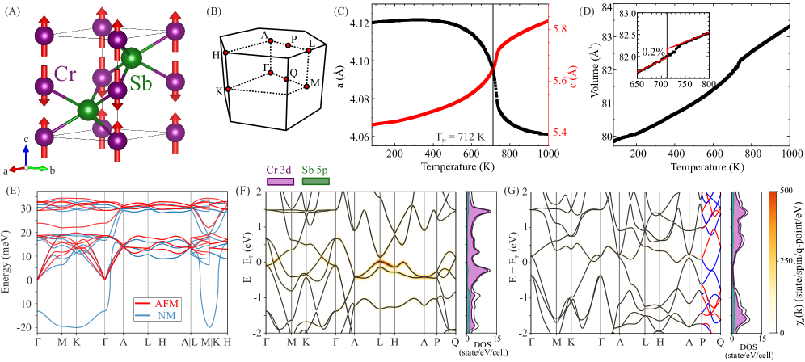
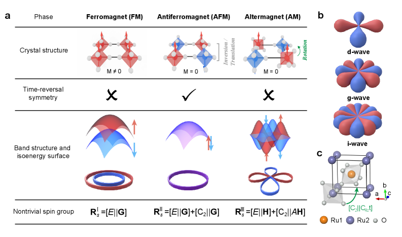
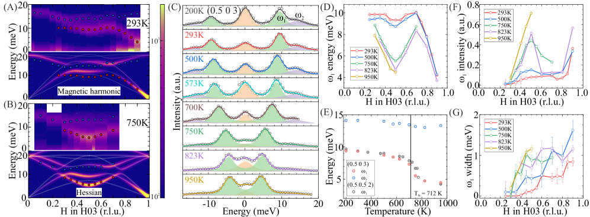
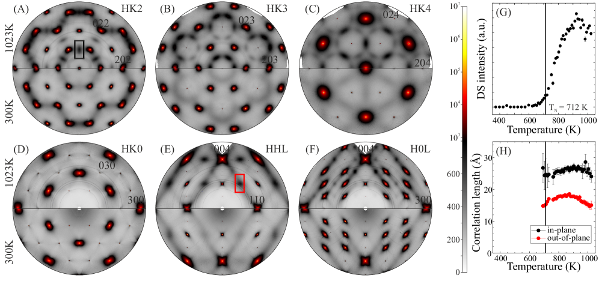

# 交替磁性 CrSb における巨大スピン-フォノン結合

- **執筆日**: 2026-03-28
- **トピック**: 交替磁性・電荷-スピン秩序競合・フラットバンド・スピン-フォノン結合
- **注目論文**: A. Korshunov et al., "Flat band driven competing charge and spin instabilities in the altermagnet CrSb," arXiv:2603.25317 (2026)
- **参照関連論文数**: 9 本

---

## 1. 導入：なぜ今この話題か

磁性研究の世界に，2022年ごろから「第三の磁気秩序相」として*交替磁性*（altermagnetism）という概念が急速に浸透している。従来，磁性材料は大きく二種類に分類されてきた。ひとつは鉄（Fe）やニッケル（Ni）に代表される**強磁性体**（ferromagnet）で，隣り合うスピンが同じ向きに揃い，巨視的な自発磁化を持つ。もうひとつは**反強磁性体**（antiferromagnet）で，隣り合うスピンが互いに逆向きに並んで正味の磁化がゼロになる。反強磁性体では慣習的に「スピン分裂がない」，すなわち上向きスピンと下向きスピンのバンドが完全に縮退していると考えられてきた。

ところがŠmejkal, Sinova, Jungwirth ら（arXiv:2105.05820; Phys. Rev. X **12**, 031042, 2022）は，結晶対称性を詳細に解析した結果，反強磁性秩序を持ちながらも**運動量空間でスピン分裂したバンド**を持つ新しい相が存在しうることを理論的に示した。この相が交替磁性である。アルターマグネットでは正味の磁化はゼロ（反強磁性的）でありながら，各スピンサブバンドが運動量に依存した特徴的なパターンで分裂する。このスピン分裂は，相対論的なスピン軌道相互作用ではなく，**非相対論的な結晶場と磁気副格子の幾何学的配置の非等価性**から生じるという点が革新的だ。

六方晶構造を持つ**CrSb**（クロムアンチモン化物）は，そのアルターマグネット候補材料の代表格として急速に注目を集めている。CrSbはネール温度 $T_\mathrm{N} \approx 700\text{ K}$（常温をはるかに超える！）という実用的な特性を持ち，フェルミ面近傍で約1 eVにも及ぶ巨大なスピン分裂がARPES（角度分解光電子分光）実験によって直接観測されている（Yang et al., arXiv:2405.12575; Nat. Commun. 2025）。交替磁性の「教科書的実例」として，理論・実験の両面から精力的に研究が進んでいる材料だ。

しかし，CrSbの物理はスピン分裂だけに留まらない。2026年3月に投稿されたKorshunov らの論文（arXiv:2603.25317）は，CrSbのフォノン（格子振動）と電子構造を放射光X線散乱で精密に調べた結果，それまで見過ごされていた驚くべき現象を報告している。ネール温度以上の常磁性相でも**短距離電荷秩序揺らぎ**が存在し，磁気転移によって突如消滅する，というのだ。さらに磁気転移点では**過去最大級のスピン-フォノン結合**（約6 meVのフォノン硬化）が観測されたと主張している。

このような「電荷秩序とスピン秩序が競合する」ダイナミクスは，銅酸化物高温超伝導体や強相関電子系でしばしば見られる現象であり，アルターマグネットにおける発見は研究コミュニティに新鮮な驚きをもたらした。しかも，その背後には**フラットバンド**（平坦なエネルギーバンド）という普遍的な物理機構が潜んでいる，というのが本論文の核心的主張である。本稿では，この最新の発見を中心に，交替磁性の基礎から実験的証拠，そして応用への展望まで，体系的に解説する。

---

## 2. 解決すべき問い

CrSbのアルターマグネット相はよく理解されているように見えた。高い $T_\mathrm{N}$，g波対称性のスピン分裂，Weyl半金属的なトポロジカル特性——これらはすでに実験で確認されていた。ではなぜ，今さら新しい謎が生まれるのだろうか？

本論文が提起する問いを整理すると，次の三つに集約される。

**問い① 磁気秩序が形成される前に，電子系はすでに「相転移を予感」しているのか？**
通常の反強磁性体では，常磁性相での電子状態はほぼ自由電子的であり，ネール温度での転移は本質的にスピン自由度だけが関与する。だがCrSbでは常磁性相でもなんらかの電荷構造（電荷秩序揺らぎ）が存在するのではないか，という問いが生じる。もしそうなら，スピン秩序と電荷秩序は互いにどのような関係（競合か，協調か）にあるのか。

**問い② CrSbの格子ダイナミクスに，電子構造の特異性が反映されているか？**
一般に，電子-フォノン結合が強い系では，特定の波数ベクトルでフォノンが「軟化」するコーン異常（Kohn anomaly）が現れる。CrSbではフェルミ面近傍にどのような電子構造が存在し，それがフォノン分散にどう影響するのか？実験的なフォノン分散の精密測定と理論計算が必要だ。

**問い③ 磁気秩序形成がフォノンダイナミクスを劇的に変える機構は何か？**
実験で観測された~6 meVの巨大スピン-フォノン結合は，既知のどの系よりも大きい。この記録的な結合定数は偶然なのか，CrSbの電子構造の何か本質的な特徴に根ざしているのか？

これらの問いに答えるには，散漫X線散乱（diffuse scattering）・非弾性X線散乱（IXS）という放射光実験技術と，第一原理計算の組み合わせが必要となる。

---

## 3. 注目論文の新規性

**Korshunov et al., arXiv:2603.25317 (2026)**
Korshunov，Alkorta，Errea，Blanco-Canosaらは，スペインのサンセバスティアンとフランスのグルノーブルにある欧州放射光研究所（ESRF）のビームラインを使って，CrSbの高分解能X線散乱実験を行った。その結果，以下の三点が主要な新発見として報告されている。

**① 電荷秩序揺らぎの発見と競合の実証**
散漫X線散乱（DS）実験では，$T > T_\mathrm{N}$（約700 K以上）の常磁性相において，ブリルアンゾーンのM点 $\mathbf{q}^* = (1/2\ 0\ 0)$に向けた**非弾性散漫散乱強度の増大**が観測された（図2参照）。これは短距離電荷秩序揺らぎの存在を示す直接的証拠である。注目すべきは，磁気転移温度 $T_\mathrm{N}$を下回ると，この散漫散乱強度が急激に消失することだ。電荷秩序とスピン秩序が同じ波数ベクトル $\mathbf{q}^*$をめぐって直接競合しており，スピン秩序が勝利することで電荷揺らぎが抑制されるという構図が浮かび上がる。

**② 記録的なスピン-フォノン結合**
非弾性X線散乱（IXS）によってフォノン分散を精密に測定した結果，M点付近の音響フォノンモード（$\omega_1$）が $T_\mathrm{N}$近傍で**~6 meV のエネルギー硬化**を示すことが判明した（図3参照）。論文中では「過去に報告された中で最大のスピン-フォノン結合」と主張されている。比較のために述べると，典型的なスピン-フォノン結合は0.1〜1 meV程度であり，今回の値はその5〜60倍に相当する。

**③ フラットバンドが媒介する機構の解明**
第一原理計算（Density Functional Theory; DFT）によれば，常磁性状態のCrSbのフェルミ準位近傍には，$k_z = \pi$面に沿って**ほぼ分散のない（フラットな）電子バンド**が二本存在する（図1参照）。このフラットバンドは大きな状態密度と，特定の波数ベクトルでのフェルミ面ネスティングを生み出す。磁気秩序が形成されると，これらのフラットバンドはフェルミ面から1.5〜2 eV押し下げられ，ネスティング条件が解消されて格子も安定化する。フラットバンドの「フェルミ面への露出」こそが，電荷秩序揺らぎと巨大スピン-フォノン結合の根本原因だという主張だ（図4参照）。

*図1（arXiv:2603.25317 より，CC BY 4.0）：CrSbの結晶・磁気構造とDFT計算。常磁性相のフォノン分散（磁気相との比較），および常磁性相でフェルミ準位近傍に存在するフラットバンドを示す状態密度。磁気秩序形成によりフラットバンドはフェルミ面から大きく下方にシフトする。*

---

## 4. 背景と文脈

### 4-1. 交替磁性とは何か

交替磁性の核心は，「磁気副格子の非等価性」にある。CrSbを例に取ろう（図1左）。CrSbは六方晶NiAs型構造を持ち，Crイオンが二種類の副格子（A副格子とB副格子）を形成する。A副格子のCrイオンは上向きスピン（↑），B副格子のCrイオンは下向きスピン（↓）を持ち，正味の磁化はゼロ——これは通常の反強磁性体と同じだ。

しかし通常の反強磁性体との違いは，A副格子とB副格子を結ぶ対称操作に，時間反転対称性（$\mathcal{T}$）**単独**ではなく，**空間回転との組み合わせ**（$\mathcal{T}\cdot C_{6z}$のような複合操作）が必要になる点だ。この結果，電子のエネルギーバンドは：

$$E_\uparrow(\mathbf{k}) \neq E_\downarrow(\mathbf{k}), \quad \text{ただし} \quad \int_\mathrm{BZ} [E_\uparrow(\mathbf{k}) - E_\downarrow(\mathbf{k})] d\mathbf{k} = 0$$

という性質を持つ。すなわち，各波数点では上向きと下向きのバンドが分裂するが，ブリルアンゾーン全体で積分するとスピン分裂は相殺される。このような運動量空間でのスピン分裂パターンを「g波」「d波」「i波」などと対称性で分類する（Liu et al., arXiv:2602.13590）。CrSbはg波アルターマグネットに分類される。

g波という呼称は，スピン分裂が運動量空間で六回対称（$C_6$対称）のパターンを持つことに由来する。CrSbの場合，フェルミ面近傍で最大~1 eVの巨大な非相対論的スピン分裂が生じる（Yang et al., arXiv:2405.12575）。これは従来のラシュバ効果（スピン軌道相互作用由来）の数百倍に相当する大きさであり，スピントロニクス応用の観点から革命的な特性といえる。

*図2（arXiv:2602.13590 より，CC BY 4.0）：強磁性体（FM），反強磁性体（AFM），アルターマグネット（AM）の結晶構造，バンド分散，スピン群の比較。アルターマグネットでは正味の磁化がゼロでありながら，運動量依存のスピン分裂が生じる。*

### 4-2. CrSbの実験的確立

CrSbのアルターマグネット性は，複数の独立した実験によって確認されている。Yangら（arXiv:2405.12575）は軟X線・硬X線ARPESを組み合わせた三次元フェルミ面マッピングにより，予測されたg波スピン分裂を直接観測した。また，高品質単結晶を用いた高磁場量子振動測定（Terashima et al., arXiv:2601.19105）では，スピン非縮退の四本のバンドが同定され，体積敏感な証拠としてアルターマグネット的フェルミ面を確認した。

熱力学・輸送特性の面では，Paul らが高品質CrSb単結晶（残留抵抗比 RRR≈11）の測定から，3.5 Kで80%に達する顕著な正の磁気抵抗，Debye温度321 K，マグノンギャップ~16 meVを報告している（arXiv:2603.02835）。ゾマーフェルト係数 $\gamma = 4.0$ mJ mol$^{-1}$ K$^{-2}$ は弱い電子相関を示すが，ネール温度以上でもマグノン的な熱的揺らぎが比熱に残ることも示された。

---

## 5. メカニズム・比較・解釈

### 5-1. フラットバンドとは何か，なぜ重要か

**フラットバンド**（flat band）とは，エネルギーが波数 $\mathbf{k}$ にほとんど依存しない，つまり $\partial E / \partial \mathbf{k} \approx 0$ となるバンドのことだ。バンドの傾きは有効質量 $m^*$ に反比例する（$\partial^2 E / \partial k^2 = \hbar^2 / m^*$）ため，フラットバンドは$m^* \to \infty$ に対応する。電子の運動エネルギーが「凍結」された状態ともいえる。

フラットバンドが持つ重要な性質の一つが，**巨大な状態密度**（density of states; DOS）だ。状態密度 $D(E)$ はエネルギー $E$ 付近のバンド数に比例するが，バンドが平坦なほど同じエネルギー幅に多くの状態が詰まる。このためフラットバンドはファンホーフ特異点（van Hove singularity）に似た状況をつくり出し，電子間相互作用，電子-フォノン相互作用，あるいは様々な電子不安定性（電荷密度波，磁気秩序，超伝導など）を大幅に増強する。

CrSbの常磁性相では，DFT計算によれば $k_z = \pi$ 面に沿ったフェルミ準位近傍に二本のほぼ完全にフラットなバンドが存在する（図1）。これらはCrの $3d_{xz}$ および $3d_{yz}$ 軌道から由来し，Sb イオンを介したスーパーエクスチェンジ相互作用の特殊な相殺によって平坦化される。

### 5-2. フェルミ面ネスティングとコーン異常

フラットバンドがフェルミ準位に露出すると，もう一つの重要な現象「**フェルミ面ネスティング**」が強調される。ネスティングとは，フェルミ面の一部が特定の波数ベクトル $\mathbf{q}^*$ だけ平行移動すると，別の部分に重なって「入れ子状」になる性質だ。ネスティング波数ベクトル $\mathbf{q}^*$ での**一般化感受率**（Lindhard susceptibility）：

$$\chi_0(\mathbf{q}) = -\sum_{\mathbf{k}} \frac{f(E_{\mathbf{k}+\mathbf{q}}) - f(E_\mathbf{k})}{E_{\mathbf{k}+\mathbf{q}} - E_\mathbf{k}}$$

が発散（またはその近傍まで増大）すると，フォノンのエネルギーが $\mathbf{q}^*$ で大きく軟化する——これが「**コーン異常**（Kohn anomaly）」である。コーン異常はフォノン分散 $\omega(\mathbf{q})$ に鋭い「くぼみ」として現れる。

Korshunov らの IXS 実験（図3）は，M点 $\mathbf{q}^* = (1/2\ 0\ 0)$ の音響モードが $T_\mathrm{N}$ 直上で顕著なコーン型の異常を示すことを高分解能で実証した。フォノン線幅の拡大（非弾性散乱ピークの幅増大）も確認されており，フォノンが格子的不安定性に向かって「揺れている」状態にあることが示唆される。

*図3（arXiv:2603.25317 より，CC BY 4.0）：IXSによるCrSbのフォノン異常。M点付近の音響モードがネール温度近傍で著しいエネルギー硬化を示す（コーン様異常）。赤丸（$T < T_\mathrm{N}$）と青丸（$T > T_\mathrm{N}$）の比較から，磁気転移によって約6 meVのフォノン硬化が生じることが読み取れる。*

### 5-3. 電荷秩序とスピン秩序の競合

電荷密度波（charge density wave; CDW）は，フェルミ面ネスティングが格子変形と結合することで生じる。波数 $\mathbf{q}^*$ でのネスティングが十分強ければ，電荷密度に $\rho(\mathbf{r}) \propto \cos(\mathbf{q}^* \cdot \mathbf{r} + \phi)$ のような空間変調が生じる（ペールス転移）。しかし同じ $\mathbf{q}^*$ において磁気秩序（スピン密度波）が形成されることもある。この場合，電荷秩序とスピン秩序は同じ電子的不安定性を「原動力」として奪い合う競合関係にある。

CrSbでは，フラットバンドが $\mathbf{q}^* = (1/2\ 0\ 0)$ でのネスティングを大幅に増強する結果，常磁性相でも短距離的な電荷秩序揺らぎ（CDW的揺らぎ）が存在する。ところが $T_\mathrm{N}$ を下回ると，アルターマグネット的スピン秩序が優先的に確立し，フラットバンドがフェルミ面から押し出される。これにより，電荷不安定性の「燃料」であったフェルミ面ネスティングが解消され，CDW揺らぎが急激に消滅する（図2参照）。

この描像を支持するのが，散漫散乱の相関長の温度依存性だ。$T > T_\mathrm{N}$ では電荷揺らぎの空間相関は有限だが短距離（コーン振動が数格子定数程度まで伸びる）であり，$T_\mathrm{N}$ をまたいで長距離秩序には成長しない——むしろ消滅するのである。この挙動は電荷秩序とスピン秩序が本質的に競合していることを示す，非常に印象的な実験的証拠といえる。

*図4（arXiv:2603.25317 より，CC BY 4.0）：散漫X線散乱マップ。300 K（$T < T_\mathrm{N}$）とネール温度以上における複数ブリルアンゾーン面での強度分布。M点周辺に高温相でのみ見られる散漫散乱強度が観測されており，常磁性相に電荷秩序揺らぎが存在することを示す。温度低下（磁気転移）とともにこの強度は急減する。*

### 5-4. 計算・実験の整合性

第一原理計算は，この全体像を裏付ける。常磁性状態でのDFTでは，フラットバンドがフェルミ面上に乗り，$\mathbf{q}^*$ での電子-フォノン結合 $\lambda(\mathbf{q})$ が突出して大きい。磁気秩序相のDFTでは，フラットバンドがギャップを開けてフェルミ面から遠ざかり，$\lambda(\mathbf{q}^*)$ が大幅に減少する（図4）。フォノンの周波数繰り込みを定式化すると：

$$\omega^2(\mathbf{q}) = \omega_0^2(\mathbf{q}) - 2\omega_0(\mathbf{q}) \cdot \Pi(\mathbf{q}, \omega)$$

ここで $\Pi(\mathbf{q}, \omega)$ はフォノン自己エネルギーであり，電子-フォノン頂点とフェルミ面の感受率 $\chi_0(\mathbf{q})$ に比例する。フラットバンドが $\chi_0(\mathbf{q}^*)$ を爆発的に増大させることが，~6 meVという異常に大きいフォノン硬化の直接原因だ。

---

## 6. 材料・手法・応用への広がり

### 6-1. 対称性工学による異常ホール効果の実現

純粋なCrSbでは，六回回転対称性（$C_{6z}$）が全体の結晶対称性に存在するため，異常ホール効果（AHE）は禁止されている（$\sigma_{xy} = 0$）。これは厄介な制約だが，同時に「対称性を壊せばAHEが生じる」という設計指針も与える。

Fischerら（arXiv:2602.06173）は，CrSbにMnを部分的に置換した薄膜 $\mathrm{Cr}_{0.75}\mathrm{Mn}_{0.25}\mathrm{Sb}$ を合成した結果，Mn置換が六回対称性を下げ，室温で有限の異常ホール効果が出現することを示した。理論的にはランダウ理論でネールベクトルの方向が変わることが鍵であり，薄膜のエピタキシャル歪みによるネールベクトル配向制御との組み合わせが有力な手段とされる。

Dasら（arXiv:2602.21135）はCrSbへの空孔・不純物導入による対称性低下を系統的に計算し，六回対称性が二回対称性に低下した場合に「断片化ノーダル曲線」（fragmented nodal curves; FNC）という新しいバンド構造特徴が生じ，これが多様な方向のネールベクトルに対してAHE応答をもたらすことを理論的に予言した。

### 6-2. 輸送測定による交替磁性の同定

AHEが禁止されているCrSbをはじめとする一部のアルターマグネットでは，輸送測定によるアルターマグネット性の確認が難しいという問題があった。Dasら（arXiv:2603.12692）はこの問題に対し，**線形磁気抵抗（LMR）のバタフライ型ヒステリシス**がネールベクトル検出の有力なプローブになると提案した。LMRはゼロ磁場近傍で磁場に線形に依存し，ネールベクトルの方向に敏感なため，AHEが消える対称性の高い系でも磁気的秩序の証拠として機能する。

Paulらの単結晶輸送測定（arXiv:2603.02835）でも，低温での80%超の顕著な正の磁気抵抗が観測されており，CrSbの電気伝導がスピン散乱によって強く影響されることが明らかだ。残留抵抗比RRR~11という高品質結晶での測定は，今後の精密実験基盤となる。

### 6-3. 2D系への展開：軌道秩序による交替磁性

Janaら（arXiv:2603.25426）は，二次元単層物質 YbMn$_2$Ge$_2$ で，電子相関とフェルミ面ネスティングが自発的な軌道秩序を引き起こし，これがアルターマグネット的スピンテクスチャを生み出すことを理論的に示した。$d_{xz}$と $d_{yz}$ 軌道間の反強軌道秩序が磁気副格子の対称性を破る機構は，三次元CrSbでのフラットバンド機構と本質的に類似しており，2D系への普遍的な拡張可能性を示唆している。また同材料では~1 eVのスピン分裂とゲート電圧で制御可能な横スピン伝導度（transverse spin conductivity）が予言されており，2Dスピントロニクスへの展開が期待される。

### 6-4. MnTeとの比較

CrSbと並ぶアルターマグネット候補がMnTeだ。MnTeはg波アルターマグネットで，ARPESにより最大約370 meVのスピン分裂が確認されている（Liu et al., arXiv:2602.13590）。一方でMnTeは半導体的バンドギャップを持ち，スピン縮退の緩やかな解消が高温でも観測されるなど，金属的なCrSbとは異なる挙動を示す。Woodgateら（arXiv:2603.15035）の計算では，CrSbでは $T_\mathrm{N}$ に近づく前からスピン分裂が消え始めるのに対し，MnTeではギャップが安定化剤として機能し，$T_\mathrm{N}$ まで分裂が維持されることが示されている。この対比は，CrSbにおける電荷-スピン競合がMnTeには存在しない（あるいは弱い）可能性を示唆し，CrSbの「フラットバンド由来の特殊性」をあらためて際立たせる。

---

## 7. 基礎から理解する

### 7-1. 交替磁性の群論的基礎

現代磁性の分類には，**磁気空間群**（magnetic space group）あるいは**スピン空間群**（spin space group）の概念が用いられる。スピン空間群は，実空間での結晶対称操作に加えて，スピン空間での回転（時間反転も含む）まで独立に扱う拡張的な対称性の枠組みだ。

通常の反強磁性体では，A副格子とB副格子を結ぶ操作として時間反転（$\mathcal{T}$）と半格子並進（$\mathbf{t}$）の組み合わせ $\mathcal{T}\cdot\mathbf{t}$ が存在する。この複合対称性は全ての波数点で$E_\uparrow(\mathbf{k}) = E_\downarrow(\mathbf{k})$を保証するため，スピン分裂はゼロだ（クラマース縮退の拡張版）。

一方，CrSbのような六方晶アルターマグネットでは，A副格子→B副格子への対称操作が $\mathcal{T}\cdot C_{6z}$（時間反転＋六回回転）という複合操作にしかならない。この場合，特定の高対称点（$\Gamma$点，K点など）以外のk点では $\mathcal{T}\cdot C_{6z}$ 対称性がバンドに課す縮退条件が緩和されるため，スピン分裂が生じうる。Sm Webejkalらのスピン空間群分類（Phys. Rev. X 2022）は，このような対称性に基づいてアルターマグネット候補材料を系統的に同定する枠組みを提供した。

### 7-2. 電子-フォノン結合の基礎：エリアシュベルグ関数

電子-フォノン結合の強さを総合的に表す量として**エリアシュベルグ関数**：

$$\alpha^2 F(\omega) = \frac{1}{N(E_F)} \sum_{\mathbf{q},\nu} |g_{\mathbf{q}\nu}|^2 \delta(\omega - \omega_{\mathbf{q}\nu}) \delta(\varepsilon_{\mathbf{k}} - E_F) \delta(\varepsilon_{\mathbf{k}+\mathbf{q}} - E_F)$$

が使われる。ここで $g_{\mathbf{q}\nu}$ は波数 $\mathbf{q}$，枝 $\nu$ のフォノンと電子のスカラー結合頂点，$\omega_{\mathbf{q}\nu}$ はフォノン振動数，$N(E_F)$ はフェルミ準位の状態密度だ。$\alpha^2 F$ の第一モーメントが無次元電子-フォノン結合定数 $\lambda = 2 \int \alpha^2 F(\omega)/\omega \, d\omega$ を与え，$\lambda \gg 1$ は強結合を意味する。

CrSbの常磁性相では，フラットバンドが $N(E_F)$ を劇的に増大させるとともに，M点での $|g_{\mathbf{q}^*\nu}|^2$ も電荷秩序とのカップリングによって増強される。その結果，M点近傍の特定フォノンモードで $\alpha^2 F$ が集中し，実効的な $\lambda(\mathbf{q}^*)$ が他の波数の10倍以上になりうる，という第一原理計算の結果は，観測された~6 meVのフォノン硬化と定量的に整合する。

### 7-3. 競合秩序の現象論的記述

電荷秩序（CO）とスピン秩序（SO）が同じ波数ベクトル $\mathbf{q}^*$ をめぐって競合する状況は，結合ランダウ理論で記述できる。二つの秩序変数 $\psi_\mathrm{CO}$（電荷振幅）と $\mathbf{m}$（反強磁性的スピン密度）に対して：

$$F = \frac{a_1}{2}|\psi_\mathrm{CO}|^2 + \frac{b_1}{4}|\psi_\mathrm{CO}|^4 + \frac{a_2}{2}|\mathbf{m}|^2 + \frac{b_2}{4}|\mathbf{m}|^4 + \gamma |\psi_\mathrm{CO}|^2 |\mathbf{m}|^2 + \cdots$$

ここで $\gamma > 0$ の場合，電荷秩序とスピン秩序は競合（同時に大きな値を取ることが自由エネルギー的に不利）になる。CrSbでは $a_2 < 0$（スピン秩序の自発的発展の駆動力）かつ $|a_1|$ が小さい（電荷秩序は亜安定）という状況にあり，スピン秩序が確立すると $\gamma |\mathbf{m}|^2$ の項が $a_1 \to a_1 + \gamma|\mathbf{m}|^2 > 0$ と等価に働いて電荷秩序揺らぎを抑制する，という定性的描像が自然に導かれる。この描像は，$T_\mathrm{N}$ での電荷揺らぎの急滅を説明している。

---

## 8. 重要キーワード10個

1. **交替磁性（altermagnetism）**
正味磁化がゼロで時間反転対称性が破れているが，磁気副格子間を結ぶ対称操作に結晶回転を必要とすることで，運動量依存の非相対論的スピン分裂が生じる磁気秩序相。強磁性・反強磁性に次ぐ「第三の磁気秩序」として2022年以降急速に認知されている。

2. **フラットバンド（flat band）**
エネルギーが波数にほとんど依存しないバンド。実効質量が無限大に相当し，状態密度が巨大になる。電子間相互作用や電子-フォノン結合を著しく増強し，電荷秩序・磁気秩序・超伝導などの電子相転移の温床となる。

3. **フェルミ面ネスティング（Fermi surface nesting）**
フェルミ面の一部が特定の波数ベクトル $\mathbf{q}^*$ だけシフトすると別の部分に重なる性質。ネスティングが強いと $\mathbf{q}^*$ での感受率が増大し，電荷密度波や磁気秩序などの不安定性を引き起こす。

4. **コーン異常（Kohn anomaly）**
金属のフォノン分散において，フェルミ面ネスティング波数ベクトル $\mathbf{q}^*$ でフォノンが軟化する（エネルギーが低下する）現象。フェルミ面の電子によってフォノンが遮蔽される効果の突然の変化から生じる。

5. **スピン-フォノン結合（spin-phonon coupling）**
スピン秩序と格子振動（フォノン）が相互に作用する結合。磁気転移によってフォノン分散が変化（硬化または軟化）することで顕在化する。CrSbでは~6 meVというこれまでで最大の値が報告された。

6. **電荷密度波（charge density wave; CDW）**
電子密度が空間的に周期的に変調した状態。ペールス不安定性によって生じ，格子変形を伴う。フェルミ面ネスティングが強いほど発達しやすい。CrSbでは完全なCDW長距離秩序は生じないが，短距離的な揺らぎが $T > T_\mathrm{N}$ で観測された。

7. **g波スピン分裂（g-wave spin splitting）**
アルターマグネットにおけるスピン分裂パターンの一種で，運動量空間で六回対称（$C_6$対称）のパターンを示す。CrSbとMnTeはともにg波アルターマグネットに分類される。球面調和関数の角度依存性 $Y_6^0 \propto \cos\theta(231\cos^6\theta - \cdots)$ に類似したパターン。

8. **非弾性X線散乱（inelastic X-ray scattering; IXS）**
放射光X線をエネルギー分解して散乱させ，フォノンのエネルギーと運動量を直接測定する手法。meV分解能でフォノン分散を測定でき，コーン異常のような繊細な特徴の観測に適している。

9. **散漫散乱（diffuse scattering）**
Bragg反射位置以外に広がった弱いX線散乱強度。局所的な原子変位相関や短距離秩序（電荷秩序揺らぎなど）に由来する。長距離秩序が存在しない短距離的な電子不安定性の前兆的証拠として重要。

10. **競合秩序（competing orders）**
異なる種類の電子秩序（電荷秩序・スピン秩序・超伝導など）が同一の電子的不安定性を「原動力」として競い合う現象。強相関電子系（銅酸化物超伝導体など）でよく見られ，各秩序の確立がもう一方を抑制する。

---

## 9. まとめと今後の論点

今回紹介した Korshunov らの研究（arXiv:2603.25317）は，アルターマグネット CrSb に対して三つの重要な新知見をもたらした。

まず，CrSbのアルターマグネット相転移は単純なスピン秩序化ではなく，電荷自由度との**競合を通じた複雑な電子相転移**であることが明らかになった。常磁性相での短距離電荷秩序揺らぎが，スピン秩序確立によって突如消滅するという観測は，CrSbが「チューナブルな量子臨界性」に近い状況にある可能性を示唆する。

次に，その機構がフラットバンドによる電子-フォノン結合増強であるという描像は，CrSb固有の現象を超えた**普遍的な設計原理**を提供する。フラットバンドを持つアルターマグネットでは一般に電荷秩序揺らぎやスピン-フォノン結合の増大が期待され，他の材料への展開が可能だ。

さらに，~6 meVという記録的スピン-フォノン結合は，磁気秩序とフォノン工学の交差点として**マグノン-フォノン変換デバイス**や**スピンカロリトロニクス**への新たな可能性を示す。スピン自由度を格子振動に変換し制御するための媒体として，アルターマグネットが有望なプラットフォームであることが示された。

**今後の論点**としては，次の問いが残る。

まず，**CrSbが加圧や組成変調によって完全な電荷密度波長距離秩序に転移するか**という問いは重要だ。圧力下でフラットバンドのフェルミ準位との距離を変化させることで，スピン秩序とCDW秩序の「どちらが勝つか」を制御できる可能性がある。

また，**超薄膜（10 nm以下）においてフラットバンドとフォノン異常がどう変化するか**は応用上も重要だ。Santhoshらはすでに10 nm CrSb薄膜でバルクと同等のスピン分裂を観測しているが，フォノン特性は界面効果で大きく変わる可能性がある。

さらに，**2Dアルターマグネット系（Jana らの YbMn₂Ge₂ など）でも類似の競合秩序が生じるか**，という問いは2D量子材料研究のフロンティアと直結する。単層系ではフォノン物理が三次元系と異なり，フレキシブルな基板との結合が付加的な制御パラメータになりうる。

交替磁性は「第三の磁気秩序」として確立されつつあるが，今回の発見は，その相転移ダイナミクスがいかに豊かで複雑かを示した。CrSbは，フラットバンドと競合秩序という現代物性物理の核心的概念が交差する，極めて魅力的な舞台であり続けるだろう。

---

### 使用論文一覧（内部参照用）

| arXiv ID | タイトル（略） | ライセンス | 役割 |
|---|---|---|---|
| 2603.25317 | Flat band driven competing order in CrSb | CC BY 4.0 | 注目論文 |
| 2603.02835 | Thermodynamic/transport of CrSb crystals | CC BY 4.0 | 背景・支持 |
| 2602.21135 | Symmetry breaking in CrSb | CC BY 4.0 | 波及 |
| 2602.13590 | Altermagnetism ARPES review | CC BY 4.0 | 背景 |
| 2405.12575 | 3D mapping of spin splitting in CrSb | nonexcl. | 背景 |
| 2601.19105 | Quantum oscillations in CrSb | nonexcl. | 支持 |
| 2603.25426 | 2D metallic altermagnetism via orbital order | nonexcl. | 波及 |
| 2603.12692 | Linear MR as Néel vector probe | nonexcl. | 異手法 |
| 2602.06173 | Cr₁₋ₓMnₓSb AHE engineering | CC BY-NC-ND | 応用 |
| 2105.05820 | Šmejkal altermagnetism (seminal) | nonexcl. | 背景 |
