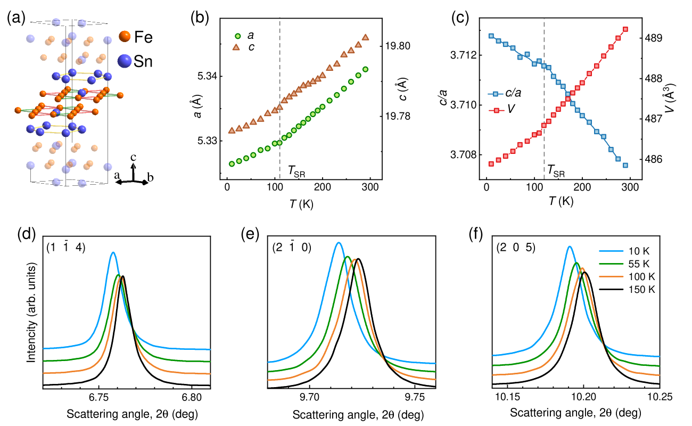
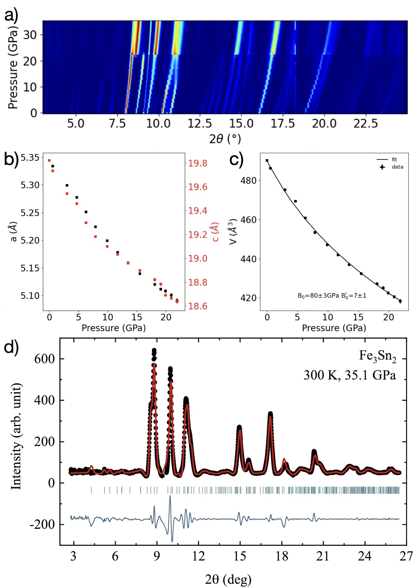
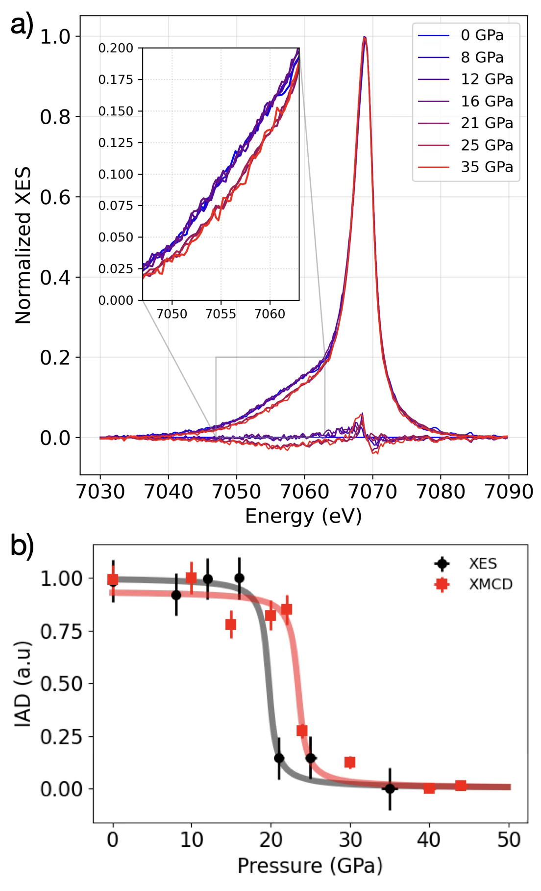
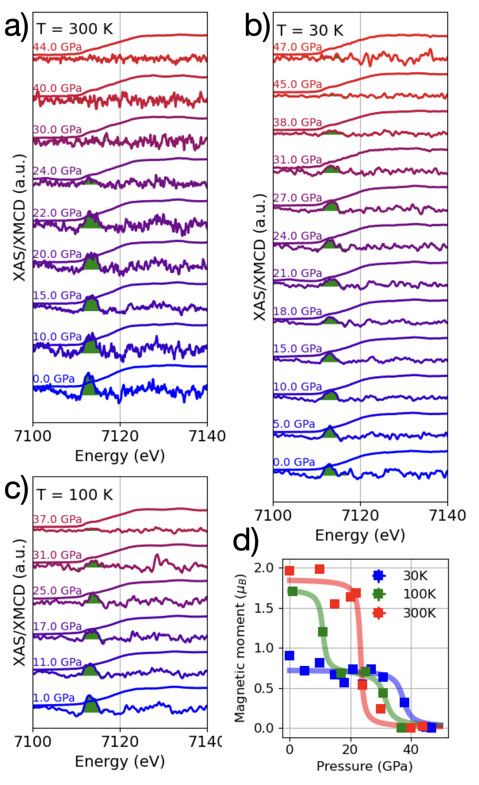
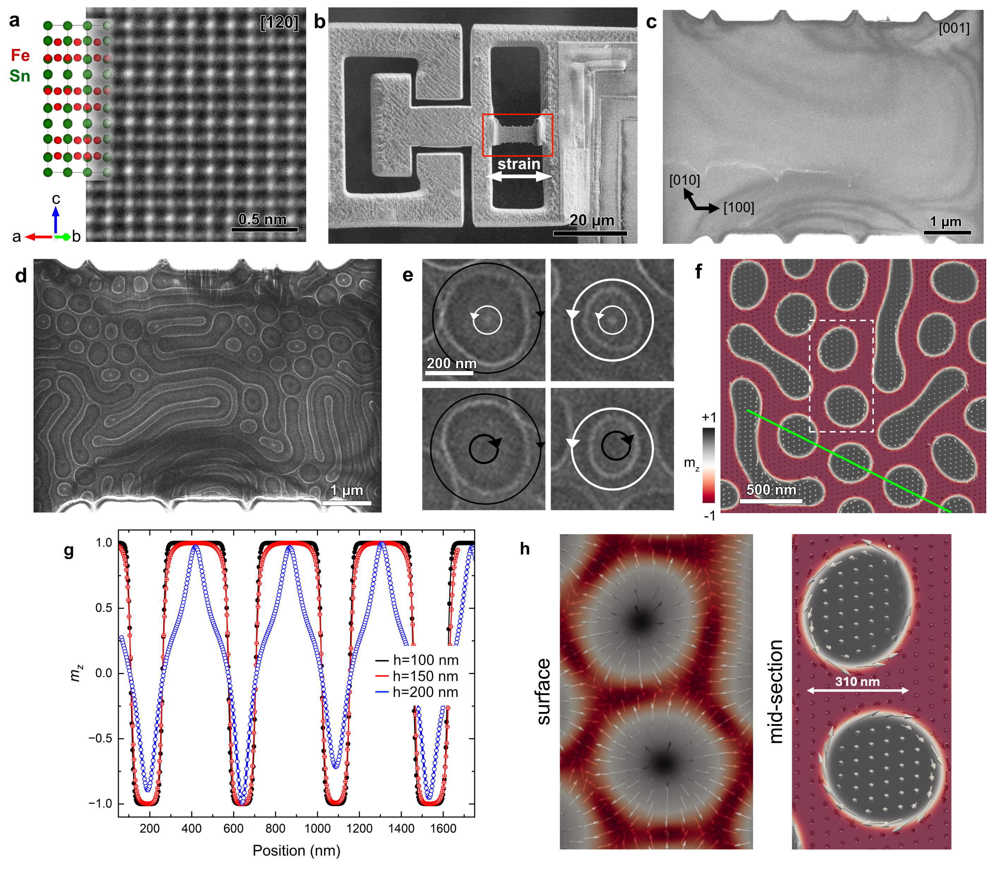
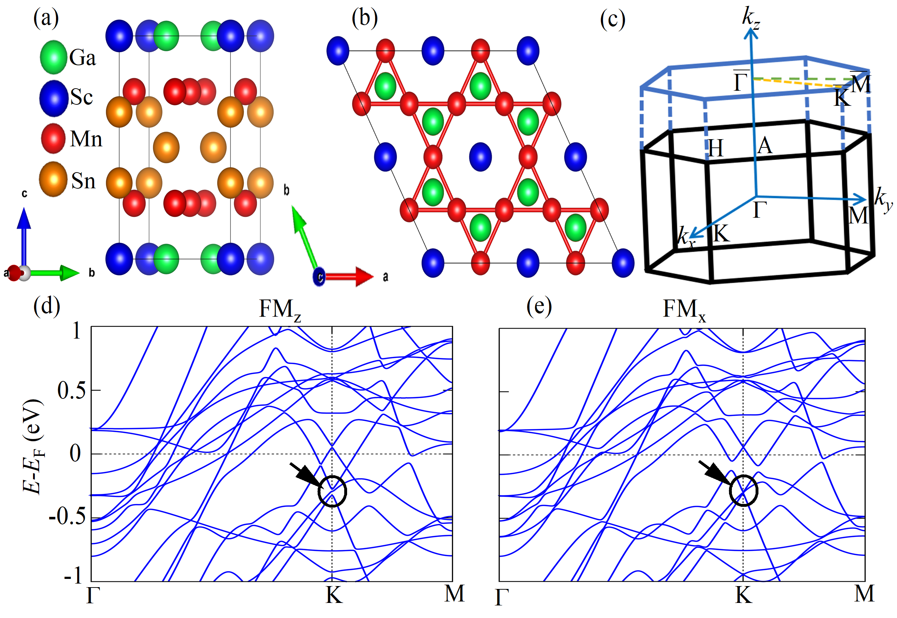
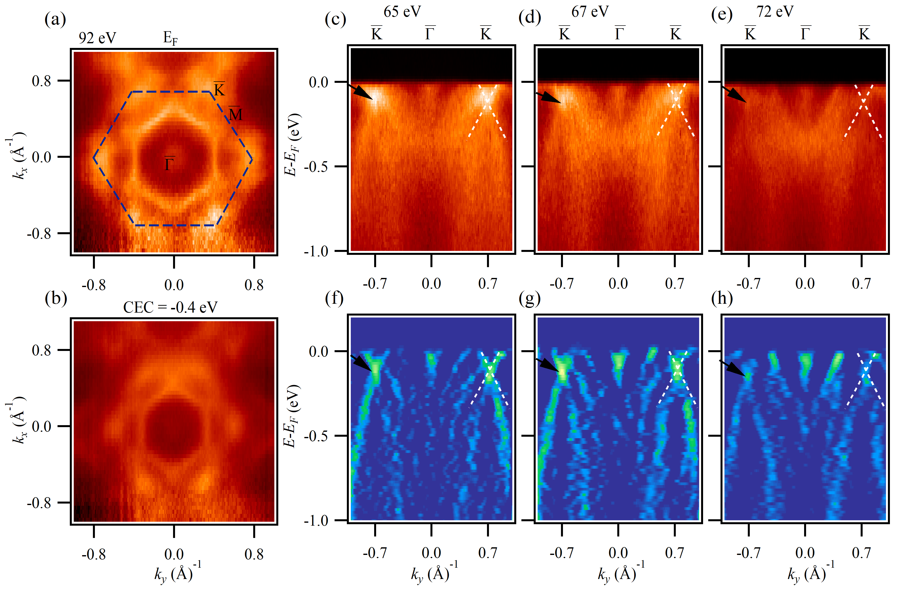
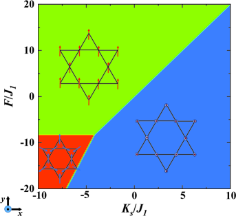

# カゴメ強磁性体 Fe₃Sn₂ の圧力下磁気相図――格子対称性の破れ・スピン状態転移・相対論的相互作用の連鎖

- **執筆日**: 2026-03-29
- **トピック**: カゴメ強磁性体 Fe₃Sn₂ における圧力誘起構造相転移・スピン状態変化・ DMI 増強と磁気トポロジー制御の展望
- **タグ**
  - main-area: Magnetism and Spin
  - sub-area: Topological Properties / High-Magnetic-Field Properties
  - method-tag: Synchrotron Measurements / First-Principles Calculations
- **注目論文**: S. Chattopadhyay et al., "Structural and magnetic phases of topological kagome metal Fe₃Sn₂ under pressure," arXiv:2603.25271 (2026)
- **参照関連論文数**: 6 本

---

## 1. なぜ今この話題なのか

「磁性とトポロジーを同時に操れる材料」は、現代の凝縮系物理において最も求められているプラットフォームの一つである。磁性がバンド構造に開くギャップと、それに伴うベリー曲率の分布が異常ホール効果や軸性ホール効果を生み出す。もし磁気秩序の向きや大きさを外部から制御できるなら、電子のトポロジカル状態そのものをオンデマンドで切り替えることができる——この夢のようなシナリオを最も現実的な形で体現しているのが、カゴメ格子強磁性体 Fe₃Sn₂ である。

Fe₃Sn₂ は、鉄（Fe）原子がカゴメ格子を形成する層状強磁性体で、高い磁気転移温度（キュリー温度 $T_C \approx 657$ K）をもちながら、フラットバンド、massive Dirac fermion、Weyl フェルミオンという三種の「トポロジカルなバンド特徴」を同時に示す希少な材料である。常圧・低温では磁気モーメントが面内方向を向き（easy-plane）、高温では面外（easy-axis）を向くという温度誘起スピン再配向が知られており、この方向変化に連動して異常ホール伝導度や Dirac ギャップのサイズが大きく変化することが ARPES 実験と輸送測定によって示されてきた。

しかし圧力という外部自由度を使って Fe₃Sn₂ の磁気・構造状態をどこまで制御できるのか、その全体像は2026年3月まで実験的に明らかにされていなかった。2026年3月26日に arXiv に公開された Chattopadhyay らの研究（arXiv:2603.25271）は、放射光 X 線回折（XRD）・X 線発光分光（XES）・X 線磁気円二色性（XMCD）を組み合わせた多技法高圧実験と第一原理計算によって、Fe₃Sn₂ が圧力下で示す構造相転移・高スピン–低スピン転移・スピン再配向相図を初めて一貫した形で描き出した。この発見は単なる「圧力チューニングの成功例」にとどまらず、スピン軌道結合（SOC）の圧力増強がジャロシンスキー–守谷相互作用（DMI）を倍増させ、非コリニア磁気配置を安定化させるという機構を明確にした点で、磁気トポロジーの能動的制御という文脈で極めて重要な意味をもつ。

本稿では、この注目論文を軸に、常圧でのスピン再配向研究（arXiv:2502.03239）、歪みによる磁気異方性制御（arXiv:2412.12684）、隣接カゴメ系での磁気モーメント方向と Dirac ギャップの関係（arXiv:2505.09891）、カゴメ強磁性体のマグノントポロジー（arXiv:2512.20297）を有機的に織り込みながら、「格子・スピン状態・相対論的相互作用の三角関係をいかに圧力が書き換えるか」という論点を深く掘り下げていく。

---

## 2. この分野で何が未解決なのか

Fe₃Sn₂ という材料系は長年研究されてきたにもかかわらず、以下の核心的な問いが未解明のまま残っていた。

第一に、**スピン再配向の微視的起源は何か**、という問いがある。Fe₃Sn₂ では約 40–130 K にわたってスピンが easy-plane から easy-cone を経て easy-axis へと回転するが、この競合する異方性定数 $K_1$ と $K_2$ の符号反転がどの電子軌道・格子モードから生じるかは依然として一致した解釈がない。

第二に、**圧力によってどの物理量がどのように連動して変化するか**、という問いがある。格子の圧縮、局所磁気モーメントの変化、交換相互作用、SOC の強化——これらは独立に変化するのではなく、互いに結合しているはずだが、圧力 20 GPa 以上の領域での実験データは2026年まで欠落していた。

第三に、**圧力誘起構造相転移後の電子トポロジーはどうなるか**、という問いがある。22 GPa 付近での結晶対称性の変化（三方晶から斜方晶へ）が Dirac 点やWeyl 点の存在条件を根本的に変えうるにもかかわらず、高圧相でのバンド計算は注目論文においても限定的にしか行われておらず、実験的な電子状態測定はまだ実現されていない。

第四に、**DMI の増強はマグノン・バンドのトポロジーに何をもたらすか**、という問いがある。Fe₃Sn₂ のような kagome 強磁性体では DMI がマグノンのベリー曲率を生み出し、熱ホール効果を引き起こすことが理論的に予測されているが、圧力によって DMI が増大した場合にどのようなトポロジー相転移が起こりうるかは未検証である。

---

## 3. 注目論文の核心：何が前進し、何がまだ仮説か

### 出発点：分かっていたこと

注目論文（arXiv:2603.25271）が発表される以前、Fe₃Sn₂ の圧力研究として最も近いのは Gonçalves-Faria らの2025年の仕事（arXiv:2502.02123）である。彼らは赤外分光を用いて15 GPa 付近で「breathing 歪み」——二つのカゴメ三角形の辺長の差——が消失し、さらに高圧では符号が反転することを見いだし、これが連続的なリフシッツ転移（フェルミ面トポロジーの変化）を引き起こすことを示した。ただし彼らの研究では磁気状態の直接測定が行われておらず、構造変化が磁気秩序に与える影響は推測の域を出なかった。

また、同様の空白は温度方向にも存在した。Prodan らのグループ（arXiv:2502.03239）は2025年2月、放射光 X 線回折・中性子回折・SQUID 磁気測定・磁気力顕微鏡（MFM）を駆使して常圧での Fe₃Sn₂ のスピン再配向過程を精密に解明し、40 K と 130 K という二つの転移温度の間に「easy-cone 状態」が介在することを発見した（図1）。easy-cone とは磁気モーメントが面外方向（$c$ 軸）に対して傾いた状態であり、異方性定数 $K_1$ と $K_2$ の競合から生じる。この研究は温度スケールでのスピン再配向を正確に捉えたが、圧力がどちらの異方性定数をより強く変調するかは未解明のまま残された。

*図1：Fe₃Sn₂ の結晶構造（左）とスピン再配向を示す磁化・格子定数の温度依存性（右）。40–130 K の範囲で easy-cone 状態が安定に存在し、磁化容易軸が段階的に回転することが示されている。(出典: Prodan et al., arXiv:2502.03239, CC BY 4.0)*

### 圧力下の構造相転移：X 線回折が示したこと

Chattopadhyay らはまず、ダイヤモンドアンビルセルを用いて Fe₃Sn₂ に 0〜40 GPa の静水圧を印加し、放射光 X 線回折を行った（図2）。結果はきわめて明快だった。0〜22 GPa の範囲では三方晶構造（空間群 R$\bar{3}$m）が維持され、格子定数 $a$ と $c$ は単調に圧縮される。このデータをビルヒ–マーナガン状態方程式

$$P = \frac{3B_0}{2}\left[\left(\frac{V_0}{V}\right)^{7/3} - \left(\frac{V_0}{V}\right)^{5/3}\right]\left\{1 + \frac{3}{4}(B_0'-4)\left[\left(\frac{V_0}{V}\right)^{2/3}-1\right]\right\}$$

にフィットすると、体積弾性率 $B_0 = 79 \pm 5$ GPa、その圧力微分 $B_0' = 7 \pm 1$ が得られ、Fe₃Sn₂ が比較的軟らかい層状構造であることと整合する。

*図2：（a）圧力に伴う XRD パターンのカラーマップ。22 GPa 以上で新たなピークが出現し、構造相転移を示す。（b）格子定数の圧力依存性。（c）体積の圧力依存性と Birch-Murnaghan 状態方程式フィット。（d）35.1 GPa での回折パターンとPnma 空間群によるル・ベイルフィット（赤線）。(出典: Chattopadhyay et al., arXiv:2603.25271, CC BY 4.0)*

約 22 GPa を境に、XRD パターンに新たなブラッグピークが出現し、低温での第一原理構造探索と組み合わせることで、高圧相が斜方晶（空間群 Pnma）であることが同定された。この構造相転移は Fe₃Sn₂ において初めて実験的に確認されたものであり、三方晶対称性の破れが結晶場環境と磁気状態に与える影響を考える上での新たな出発点となる。

### 局所磁気モーメントの圧壊：X 線発光分光が示したこと

構造相転移と同じ圧力域で、局所磁気モーメントの大きさも劇的に変化する。X 線発光分光（XES）では、Fe の $K\beta$ 蛍光スペクトル（$3p \rightarrow 1s$ 遷移）の線形を解析することで局所スピン状態を圧力の関数として追跡できる。「積分振幅差（IAD）」法では、試料スペクトルと基準スペクトルの差の積分値が磁気モーメントの相対的大きさに比例する。

*図3：（a）Fe の $K\beta$ X 線発光スペクトルの圧力変化。10 GPa 前後から変化が始まり 22 GPa 付近で急激にスペクトル形状が変化する。（b）XES の IAD（黒）と XMCD によるダイポール信号（赤）の圧力依存性。両指標はほぼ同期して 20–25 GPa で急落し、高スピン–低スピン転移と強磁性の消失が連動していることを示す。(出典: Chattopadhyay et al., arXiv:2603.25271, CC BY 4.0)*

図3から読み取れる重要な点は二つある。一つは、XES の IAD と XMCD の強磁性信号が 20–25 GPa の同じ圧力域で急落することであり、構造相転移・高スピン–低スピン転移・強磁性の消失が相互に連動していることを示している。もう一つは、XES 信号が IAD〜0 まで落ちることであり、鉄の局所スピンが実質的に消失（非磁性に近い低スピン状態へ転移）することを示す。これは磁気秩序の単なる抑制ではなく、電子配置の変化——Fe の $3d$ 電子が高スピン配置から低スピン配置へ移行——を反映しており、格子圧縮が Fe-$d$ 軌道の結晶場分裂を強め、ホント則が敗れる典型的な高スピン–低スピン転移の様相を示す。

### 温度×圧力の磁気相図：XMCD が示したこと

XMCD（X 線磁気円二色性）は Fe の $K$ 端における左右円偏光 X 線の吸収差から強磁性成分を定量化する手法である。Chattopadhyay らは 30 K・100 K・300 K の三温度でこの測定を行い、圧力に伴う強磁性成分の変化を温度ごとに追跡した（図4）。

*図4：（a–c）300 K・30 K・100 K における X 線吸収スペクトルと XMCD シグナルの圧力依存性。シグナルの変化はスピン方向の圧力誘起変化を示す。（d）三温度での $c$ 軸方向強磁性成分の正規化圧力依存性。300 K では 20 GPa 付近で急落するが、30 K では 40 GPa を超えても有限値を保つ。(出典: Chattopadhyay et al., arXiv:2603.25271, CC BY 4.0)*

この図が示す最も重要な発見は、**温度によって磁気秩序の消失圧力が大きく異なる**ことである。300 K では 20–25 GPa で $c$ 軸強磁性成分がほぼゼロになるのに対し、30 K では 40 GPa を超えても有限の XMCD 信号が残り、傾いた（tilted）非コリニア磁気配置が安定して存在することを示す。100 K の場合はその中間的な挙動を示し、10 GPa 程度の圧力で低温安定相（傾き配置）への転移が誘起される。この温度–圧力の磁気相図は Fe₃Sn₂ において初めて実験的に確立されたものであり、圧力が「温度でのスピン再配向」と同じ効果を低温で誘起できることを明確に示している。

### 計算が明かした機構：SOC 増強と DMI 倍増

実験で観測されたこれらの変化の微視的起源を明らかにするため、Chattopadhyay らはスピン分極第一原理計算を行った。交換相互作用 $J_1$（最近接 Fe-Fe 間）・$J_2$（次近接）・$J_3$（層間）、磁気結晶異方性エネルギー（MAE）、ジャロシンスキー–守谷相互作用（DMI）を圧力の関数として計算した結果、以下の機構が浮かび上がった。

等方的な強磁性交換相互作用 $J_1$・$J_2$ は圧力下でも本質的に変化しない——これは強磁性秩序そのものが圧力に頑健である（少なくとも低スピン転移前まで）という事実と整合する。一方、SOC 由来の相互作用は圧力によって顕著に増強される。磁気結晶異方性エネルギーは 21.7 GPa で 0 GPa 時の約 1.5 倍（0.86 → 1.32 meV）に増大する。さらに DMI のベクトル成分 $|D_y|$ は次近接 Fe-Fe 間で 0.42 から 0.83 meV へとほぼ倍増する。

DMI の物理的意味は、隣接するスピン $\mathbf{S}_i$ と $\mathbf{S}_j$ 間に働くベクトル積的な相互作用
$$\mathcal{H}_{\rm DMI} = -\mathbf{D}_{ij} \cdot (\mathbf{S}_i \times \mathbf{S}_j)$$
であり、コリニアなスピン配置を不安定化させて傾いた（canted）または螺旋状の非コリニア配置を好む。DMI の増大は、ゼーマンエネルギーや等方的交換エネルギーがコリニア状態を安定化しようとする力に抗い、より多くの「傾き」を許容するエネルギー景観を作り出す。これが、低温高圧相で非コリニア磁気配置が生き残る理由である。

この解釈が仮説段階にとどまる点もある。第一に、実験データ（XMCD）が観測するのは $c$ 軸方向の強磁性成分であり、非コリニア配置の具体的な傾き角や磁気構造は直接決定されていない。中性子回折の高圧実験が実現すれば、より直接的な検証が可能になるだろう。第二に、高圧相（Pnma 対称性）でのバンド構造計算が限定的であり、構造相転移後にトポロジカルな電子状態がどのように変化するかは未解明である。

---

## 4. 背景と研究史：この論文はどこに位置づくか

Fe₃Sn₂ の研究史において最初の大きなマイルストーンは、2018年の Ye らによる ARPES 実験（*Science* 2018）である。彼らは Fe₃Sn₂ のフェルミ準位近傍に、30 meV のギャップをもつ massive Dirac fermion が存在することを発見し、このギャップが強磁性秩序による時間反転対称性の破れとスピン軌道結合の組み合わせから生じることを示した。Berry 曲率のホットスポットが Dirac ギャップ付近に集中し、これが 異常ホール伝導度 $\sigma_{xy} \sim 500\,\Omega^{-1}{\rm cm}^{-1}$ という大きな値を生み出すことが明確にされた。同年、Liu らは $\sigma_{xy}$ の飽和値がカゴメ格子のバンド計算から期待される intrinsic 寄与と一致することを示し、Fe₃Sn₂ がベリー曲率起源の「真の intrinsic 異常ホール金属」であることを確立した。

次のマイルストーンは 2022年の Ren らの STM 研究（arXiv:2202.04177）であり、薄膜 Fe₃Sn₂ において磁場によってスピンを面外から面内に回転させると、フェルミ準位付近の多数の分光特徴が系統的にエネルギー移動することを発見した。これは Weyl 点の密な分布が磁気モーメント方向に感受性をもつことを示し、「スピン方向でトポロジーを書き換える」コンセプトの先駆的実証となった。しかし薄膜系では基板歪みや表面効果が絡み合うため、バルク系での清明な実験が求められていた。

2024年末から2025年にかけて、二つの重要な展開があった。一つは Kong らの歪みエンジニアリング研究（arXiv:2412.12684）で、透過型電子顕微鏡試料上でその場引張歪みを印加し、Fe₃Sn₂ の磁気テクスチャがリアルタイムで変化する様子をフレスネル像と電子ホログラフィーで可視化した（図5）。双極子スカイルミオン同士の合体・分裂がテンソル歪みに応じて制御でき、磁化方向も面外から面内へと切り替わることが実証された。

*図5：引張歪みを印加した Fe₃Sn₂ の TEM 像と磁気構造。（a）カゴメ格子の原子分解能 HAADF-STEM 像と結晶構造。（b）その場歪み TEM 試料の走査電子顕微鏡像。（d）フレスネル・デフォーカス像で観察される磁区パターン。（e–f）双極子スカイルミオンの MFM コントラストと磁化マップ。歪みによって磁化方向が面外から面内へ切り替わる。(出典: Kong et al., arXiv:2412.12684, CC BY 4.0)*

もう一つは Prodan らによる easy-cone 状態の発見（arXiv:2502.03239）である。彼らは精密な中性子回折と SQUID 磁気測定によって、Fe₃Sn₂ の常圧スピン再配向が単純な easy-plane ↔ easy-axis の一段転移ではなく、$T_{\rm SR1} \approx 40$ K と $T_{\rm SR2} \approx 130$ K を臨界点とする二段階転移であることを確立した。40〜130 K の中間域では磁気モーメントが傾いた「easy-cone 状態」にあり、これは二次の異方性定数 $K_2$ が $K_1$ と同程度の大きさをもつことで生じる。磁気弾性効果も弱ながら伴われており、格子と磁気秩序の微妙な結合が示唆される。この知見は、圧力がどちらの異方性定数を優先的に変調するかを理解する上で重要な背景を提供する。

以上の研究史を踏まえると、Chattopadhyay らの注目論文は「外部自由度（温度・磁場・歪み）による Fe₃Sn₂ 制御の探索」という文脈において、初めて高圧という連続的チューニングパラメーターを 40 GPa 超の広い圧力域にわたって系統的に適用し、構造相転移・スピン状態転移・磁気相図を統合的に明らかにした研究として位置づけられる。

---

## 5. どの解釈が最も妥当か：証拠・比較・限界

### 圧力による SOC 増強：なぜ起きるか

注目論文の中心的主張は「圧力が SOC 由来の相互作用（MAE・DMI）を選択的に増強する」というものである。この機構を理解するには、SOC の強さが局所的な Fe-$3d$ 軌道のエネルギー構造にどう依存するかを考える必要がある。SOC ハミルトニアンは $\mathcal{H}_{\rm SOC} = \lambda \mathbf{L} \cdot \mathbf{S}$ の形をとり、$\lambda$ は原子的な SOC 定数である。鉄（Fe）の場合、$\lambda \approx 50$ meV 程度だが、これが電子バンド構造に与える有効な影響は $d$ バンドの幅に反比例する。圧力によって格子が圧縮されると、Fe-Fe 間の $d$ 軌道の重なりが増大してバンド幅が広がる一方、ホッピング積分の変化が $d$ バンドの平均エネルギーを変化させ、フェルミ準位近傍での軌道縮退に近い状態が生じやすくなる。縮退した軌道間での SOC の有効作用が大きくなるため、MAE や DMI が増強されると考えられる。

計算が示す MAE の 1.5 倍増・DMI の 2 倍増は、この機構と定性的に一致している。ただし精密な数値については、交換-相関汎関数の選択（GGA vs. GGA+U）や投影原子軌道基底の取り方に依存性があり、計算値と実験観測量（実際の傾き角、MAE から予測される再配向温度）の定量的対応は今後の課題として残る。

### 磁気モーメント方向が Dirac ギャップを制御する：比較材料からの示唆

注目論文では高圧相でのトポロジカルな電子状態の変化は直接測定されていないが、「磁気モーメント方向 → Dirac ギャップ」という連動が類似カゴメ系で定量的に確認されている。Sakhya らの2025年の研究（arXiv:2505.09891）は、ScMn$_6$(Sn$_{0.78}$Ga$_{0.22}$)$_6$ という面内強磁性カゴメ金属において、ARPES と DFT を組み合わせてこの関係を精密に測定した（図6）。

*図6：ScMn₆(Sn,Ga)₆ の結晶構造と DFT バンド計算。（d）磁気量子化方向が面外（FM$_z$）の場合：Brillouin 帯端 K 点付近に有限ギャップをもつ Dirac 点（矢印）が見える。（e）面内（FM$_x$）の場合：同じ Dirac 点がギャップレス（半金属的）になる。スピン方向の変化が Dirac ギャップの開閉を直接制御していることを示す。(出典: Sakhya et al., arXiv:2505.09891, CC BY 4.0)*

この研究では、面外磁化（FM$_z$）では Dirac ギャップが $\sim 15$ meV 開くが、面内磁化（FM$_x$）ではギャップが消失してグラフェン的な線形バンド交叉が復活することが計算で示され、ARPES 実験でも確認された。Fe₃Sn₂ に置き換えると、常圧低温では easy-plane（面内）配置でギャップは小さく、高温では easy-axis（面外）でギャップが開く、というシナリオと整合する。圧力が磁気モーメントを「傾き方向」に追い込む場合、Dirac ギャップは中間的な値をとることになり、圧力そのものがトポロジカル状態の連続的チューニングパラメーターとして機能しうる。

*図7：（a–b）ScMn₆(Sn,Ga)₆ のフェルミ面と定エネルギー面の ARPES 像（光子エネルギー 92 eV および 65–72 eV）。（c–e）Γ̄–K̄ 方向の分散関係：K̄ 点付近に Dirac コーン構造（矢印）が見える。（f–h）二次微分像：ギャップ付近の分散がより明確に観察できる。このDirac コーンのギャップサイズが磁化方向に敏感であることが鍵である。(出典: Sakhya et al., arXiv:2505.09891, CC BY 4.0)*

### breathing 歪みの反転との関係：何がどこまで分かったか

Gonçalves-Faria らの2025年の研究（arXiv:2502.02123）が示したように、Fe₃Sn₂ は 15 GPa 付近で「breathing 歪み」（二つのカゴメ三角形の辺長の非等価性）が消失し、さらに高圧では逆符号になる。この変化は光学伝導度でのスペクトル重みの再分配として観測され、連続的なリフシッツ転移の系列（フェルミ面の接続性変化）を生む。Chattopadhyay らの構造相転移（22 GPa）はこの「breathing 歪み反転」の直後に起こっており、二つの現象が連動している可能性が高い。しかし Gonçalves-Faria らの研究は磁気測定を含まず、Chattopadhyay らの研究は詳細なフォノン・電子構造の変化を追っていないため、圧力下での「構造変化 → electronic structure → 磁気秩序」という連鎖の中間段階はまだ実験的に空白のままである。

ここに重要な解釈上の問いがある：22 GPa での構造相転移（R$\bar{3}$m → Pnma）は高スピン–低スピン転移の原因か結果か、それとも単なる共存か。XES と XRD の信号が同じ圧力域で急変することは相関を示すが、因果関係の方向は確定していない。Pnma 相のエネルギー安定性は非磁性の計算でも低温で確認されていることから、構造相転移は磁気変化なしに独立しても起こりうる可能性がある。一方、高スピン–低スピン転移が d バンドを大きく再配置することで Pnma 相を安定化させる、という逆向きの機構も排除できない。このどちらが正しいかを決するには、高圧相（Pnma）の単独安定性を磁性を排除した条件下で確かめる実験、あるいは強磁性を抑制した（磁場印加での）圧力構造相図の測定が必要になるだろう。

---

## 6. 何が一般化できるのか：材料・手法・応用への広がり

### カゴメ強磁性体における DMI とマグノントポロジー

圧力による DMI 増強という注目論文の発見は、カゴメ強磁性体における「マグノントポロジー」の能動的制御という新たな展望を開く。Ni らの2025年の理論研究（arXiv:2512.20297）は、二次元カゴメ強磁性体において DMI（$D_z$）と擬双極子異方性交換相互作用（$F$）が協働して高チャーン数のマグノン位相を生み出すことを示した（図8）。

*図8：カゴメ強磁性体のマグノン位相図（$K_s/J_1$ vs $F/J_1$）。赤・緑・青の領域はそれぞれ異なる古典スピン配置（コリニア強磁性・傾き状態・非コリニア状態）に対応し、各領域内でマグノンのチャーン数が異なるトポロジー相が実現する。DMI $D_z$ の増大は相図のどの領域を占めるかに直接影響し、マグノン熱ホール効果の符号反転さえ引き起こしうる。(出典: Ni et al., arXiv:2512.20297, CC BY 4.0)*

Fe₃Sn₂ の場合、DMI が 2 倍になるという計算結果をこの位相図に照らすと、圧力前後でマグノンのチャーン数が変化し、スピン流熱ホール効果の向きが逆転する可能性がある。これはまだ実験的に確認されていないが、検証可能な予測として次の実験ターゲットになりうる。高圧下での熱輸送測定（熱ホール係数の測定）は技術的に困難だが、最近の高圧熱輸送セルの進歩を考えると 5〜10 年以内に実現可能な課題となりつつある。

### TbMn₆Sn₆ や Fe₃Ge：他のカゴメ磁性体への展開

圧力による磁気・トポロジー制御の観点は Fe₃Sn₂ に限定されない。Xia らの2024年の研究（arXiv:2405.15210）は、TbMn₆Sn₆ の Mn を Cr で部分置換することで Mn カゴメ格子の対称性を破り、「台地状」（plateau-like）のトポロジカルホール効果を誘起することを示した。この台地状ホール効果は格子対称性の破れによって生じるスカラースピンカイラリティの周期的変化から来ており、記録的な抵抗率（19.1 Ω cm）を達成している。これは化学的な置換（静的な対称性破れ）によるアプローチだが、圧力（動的で可逆的な対称性変調）という視点を加えれば、より普遍的なトポロジー制御の原理として発展しうる。

また、Fe₃Ge という隣接材料（arXiv:2509.18590）でも spin reorientation に伴う Dirac ギャップの変化と大きな異常ホール効果（$\sigma_{xy} \sim 1500\,\Omega^{-1}{\rm cm}^{-1}$）が報告されており、Fe カゴメ系全体として「磁気モーメント方向 → 電子トポロジー → 輸送特性」という制御連鎖が共通の設計原理として機能しうることが見えてきた。

### デバイス応用への示唆

圧力チューニングは実験室ではきわめて有用だが、デバイス応用では「可逆的・電気的な磁気状態制御」が求められる。Kong らの歪みエンジニアリング研究（arXiv:2412.12684）が示したように、引張歪みが同等の磁化方向スイッチングを引き起こすなら、圧電体との複合化によって電場で磁気状態を制御するマルチフェロイック的アプローチが現実的となる。また、注目論文が確立した「圧力下磁気相図」は、スピントロニクスデバイスの動作条件（応力・温度・磁場）マッピングの参照データとして直接役立つ。特に高チャーン数マグノンを利用したマグノニクスデバイスや、スピン Seebeck 効果を用いた熱電変換素子において、DMI の大きさが中核的な設計パラメーターとなる。

---

## 7. 基礎から理解する

### カゴメ格子とは何か：フラストレーションとフラットバンド

カゴメ（kagome）格子は、日本の伝統的な竹細工「籠目模様」に由来する名称で、正三角形が頂点共有して並ぶ二次元格子構造である。各サイトに等確率で到達できる最短ホッピング経路の数が同じになるため、電子は「どこにも偏れない」干渉性の量子効果を受ける。この結果、分散関係 $E(\mathbf{k})$ が $\mathbf{k}$ に依存しない「フラットバンド」が必ず一つ現れる。フラットバンドでは群速度 $v = \nabla_{\mathbf{k}} E = 0$ となり、電子の運動エネルギーは消滅して相関効果が支配的になる。実際 Fe₃Sn₂ では、フラットバンドがフェルミ準位の約 0.3 eV 下にあることが ARPES で確認されている。

カゴメ格子のもう一つの特徴は、ブリルアン帯の K 点で Dirac コーンが形成されることである。カゴメ格子の最小単位胞は 3 原子を含み、そのタイトバインディングモデルからは 3 本のバンドが得られる：フラットバンド 1 本とディラック的な 2 本（線形交叉）。強磁性秩序が時間反転対称性を破り、かつ SOC が空間反転対称性を実効的に破れば、この Dirac 点に質量ギャップ $\Delta$ が開く：

$$E_{\pm}(\mathbf{k}) = \pm\sqrt{(v_F k)^2 + \Delta^2}$$

ここで $v_F$ はフェルミ速度、$\Delta \propto \lambda_{\rm SOC} \cdot M$ は磁化 $M$ と SOC 定数 $\lambda_{\rm SOC}$ の積に比例するギャップである。このギャップが Berry 曲率のホットスポットを生み出し、異常ホール効果を支配する。

### ベリー曲率と異常ホール効果

ブロッホバンドの Berry 曲率（ベリー曲率）$\boldsymbol{\Omega}_n(\mathbf{k})$ は、$n$ 番目のバンドのブロッホ関数 $|u_{n\mathbf{k}}\rangle$ を用いて

$$\boldsymbol{\Omega}_n(\mathbf{k}) = -2 \,{\rm Im} \sum_{m \neq n} \frac{\langle u_{n\mathbf{k}} | \hat{v}_x | u_{m\mathbf{k}} \rangle \langle u_{m\mathbf{k}} | \hat{v}_y | u_{n\mathbf{k}} \rangle}{(E_m - E_n)^2}$$

と定義される。ここで $\hat{v}_\alpha$ は速度演算子であり、分母に $(E_m - E_n)^2$ があるため、バンドが近接して「擬縮退」する Dirac ギャップ付近で $|\boldsymbol{\Omega}|$ が急激に大きくなる。異常ホール伝導度は Fermi 面以下の全バンドにわたる Berry 曲率の積分

$$\sigma_{xy} = -\frac{e^2}{\hbar} \int_{\rm BZ} \frac{d^2\mathbf{k}}{(2\pi)^2} \sum_{n : E_n < E_F} \Omega_n^z(\mathbf{k})$$

として与えられる（二次元の場合）。この式が示す重要な点は、$\sigma_{xy}$ がフェルミ面上の電子状態だけでなく、Fermi 準位以下の全バンド構造の「幾何学的性質」によって決まるということである。つまり、Dirac ギャップ $\Delta$ の大きさが変われば Berry 曲率の分布が変わり、$\sigma_{xy}$ が変化する。Fe₃Sn₂ でのスピン再配向が異常ホール効果に与える巨大な影響はまさにこのメカニズムによる。

### 磁気結晶異方性とスピン再配向

磁気結晶異方性（MCA）は、スピンが特定の結晶軸方向（容易軸または容易面）を好む傾向を表す。三方晶または六方晶対称性をもつ系では、異方性エネルギーは

$$E_{\rm aniso} = K_1 \sin^2\theta + K_2 \sin^4\theta + \ldots$$

と展開できる（$\theta$ はスピンと $c$ 軸のなす角）。$K_1 > 0, K_2 > 0$ のとき easy-axis（$\theta = 0$: $c$ 軸方向）、$K_1 < 0$ のとき easy-plane（$\theta = \pi/2$: $ab$ 面内）が安定となる。しかし Fe₃Sn₂ のように $|K_2| \gtrsim |K_1|$ となる場合には、中間の傾き角 $\theta_0 = \arcsin\sqrt{-K_1/2K_2}$ が最安定になる easy-cone 状態が現れる。

圧力下での MAE の増大（$K_1$ の増大）はこの相図を変化させる。計算が示す MAE の 1.5 倍増は、0 GPa で易面的（$K_1 < 0$）だった状態が圧力によって徐々に易軸的（$K_1 > 0$）に変化することに対応し、スピン再配向温度 $T_{\rm SR}$ が圧力とともに上昇することを予測する。実験観測された「高圧・低温では easy-cone ないし easy-axis が安定」というデータと定性的に一致する。

### ジャロシンスキー–守谷相互作用（DMI）の基礎

DMI は逆対称な交換相互作用であり、反転対称性のない系でスピン軌道結合によって生じる。その起源はモリヤが1960年に示したように、超交換経路の中に非磁性イオンが介在する場合の SOC の二次過程（スーパー交換の SOC 補正）にある。Fe₃Sn₂ のカゴメ格子では、隣接する二つの Fe サイトをつなぐ経路がつねに幾何学的に非等価であるため（SnもFeも含む複雑な経路をもつ）、各 Fe-Fe 対に DMI ベクトル $\mathbf{D}_{ij}$ が存在する。

このベクトルの方向と大きさが、圧力下でどのように変化するかを Chattopadhyay らは計算した。結果として、次近接 Fe-Fe 間の $|D_y|$ 成分が 0.42 から 0.83 meV へと倍増することが分かった。この増大は格子の圧縮によって Fe-Sn-Fe の結合角や Fe-Sn 距離が変化し、超交換経路の幾何学が変わることで SOC の有効結合が増強されると解釈できる。ただし、三次元的な DMI ベクトルの完全な変化（$x, y, z$ 成分それぞれ）はまだ理論的に不完全な形でしか報告されておらず、中性子散乱によるスピン波測定を通じた実験的な DMI 決定が求められる。

### X 線磁気円二色性（XMCD）の原理

XMCD は、左右円偏光 X 線の磁気感受性の差を利用した元素選択的な磁気測定手法である。Fe の K 端（7.1 keV 付近）では、$1s$ コア電子が空の $4p$ 状態へ励起されるが、左右円偏光では光電子のスピン分極が逆転するため、強磁性サンプルでは吸収スペクトルに差（XMCD 信号）が生じる。この信号強度は $c$ 軸方向（光の伝播方向）の磁気モーメント成分に比例するため、圧力下でスピンが傾くと XMCD 信号が減少する。注目論文ではこれを利用して、スピン方向の変化を $c$ 軸強磁性成分の残存比として定量化した。

高圧 XMCD の困難は、ダイヤモンドアンビルセルのダイヤモンドが X 線を大きく散乱・吸収するため、シグナル/ノイズ比が常圧測定に比べて大幅に低下することにある。それでも Chattopadhyay らが三温度での完全な圧力依存性を取得できたのは、放射光の高輝度・高偏光度と、最適化されたダイヤモンドアンビルセル設計の成果である。この技術的成熟が、今後の高圧磁気研究の標準的手法として定着しつつある。

---

## 8. 重要キーワード 10 個

**（1）カゴメ格子（kagome lattice）**
正三角形が頂点共有して並ぶ二次元格子。幾何学的フラストレーションにより電子のホッピングが干渉的に相殺され、分散を持たない「フラットバンド」と Brillouin 帯の K 点に現れる「Dirac コーン」という二種の特徴的なバンド構造が共存する。Fe₃Sn₂ ではこのカゴメ格子を Fe 原子が形成し、強磁性秩序と組み合わさることでトポロジカルな電子状態を実現する。

**（2）massive Dirac fermion**
強磁性秩序（時間反転対称性の破れ）とスピン軌道結合の協働によって Dirac コーンにギャップ $\Delta$ が開いたとき、この質量をもった Dirac 粒子を massive Dirac fermion と呼ぶ。ギャップ $\Delta$ は磁化の大きさと方向に敏感であり、Fe₃Sn₂ では ARPES によって $\Delta \approx 30$ meV と測定されている。ギャップ付近に Berry 曲率のホットスポットが集中するため、巨大な異常ホール伝導度を生み出す。

**（3）ベリー曲率（Berry curvature）と異常ホール効果（AHE）**
ブロッホ電子の運動量空間における「波動関数の幾何学的ひずみ」を表す擬ベクトル量で、Berry 曲率の Fermi 面以下での積分が異常ホール伝導度を与える。磁性トポロジカル材料では、Dirac コーン付近でこの量が非常に大きくなり、外部磁場なしに巨大な横方向電流を生み出す（intrinsic AHE）。Fe₃Sn₂ では $\sigma_{xy} \sim 500\,\Omega^{-1}{\rm cm}^{-1}$ と報告されており、これは Berry 曲率起源の intrinsic 寄与によるものとされている。

**（4）スピン再配向転移（spin reorientation transition, SRT）**
温度や外部刺激（磁場・歪み・圧力）によって磁化容易方向が変化する現象。Fe₃Sn₂ では $T_{\rm SR1} \approx 40$ K と $T_{\rm SR2} \approx 130$ K という二段階転移が存在し、中間温度域に磁気モーメントが $c$ 軸から傾いた「easy-cone 状態」が現れる（arXiv:2502.03239）。異方性定数 $K_1$ と $K_2$ の競合から生じ、この転移に伴って異常ホール伝導度が大きく変化する。

**（5）磁気結晶異方性（magnetocrystalline anisotropy, MCA）**
結晶の対称性とスピン軌道結合によって磁化方向が特定の結晶軸に固定されようとするエネルギーコスト。一次異方性定数 $K_1$ と二次異方性定数 $K_2$ で記述される。Fe₃Sn₂ では圧力により MAE が増大し（0 GPa: 0.86 meV → 21.7 GPa: 1.32 meV）、非コリニア傾き配置がより広い温度域で安定となる。スピン再配向の臨界圧力を予測するために不可欠な量である。

**（6）ジャロシンスキー–守谷相互作用（Dzyaloshinskii-Moriya interaction, DMI）**
反転対称性のない系でスピン軌道結合の二次過程として生じる逆対称な交換相互作用 $\mathbf{D}_{ij} \cdot (\mathbf{S}_i \times \mathbf{S}_j)$。コリニアスピン配置を不安定化させ、傾いた（canted）または螺旋的な非コリニア配置を安定化させる。カゴメ格子では DMI がマグノンのバンド構造に Berry 曲率を誘起し、熱ホール効果の起源となる。Fe₃Sn₂ では圧力によって次近接 DMI が約2倍に増大することが計算で示された。

**（7）X 線磁気円二色性（X-ray magnetic circular dichroism, XMCD）**
左右円偏光 X 線の吸収スペクトルの差から元素選択的に磁気モーメント（スピン・軌道）を定量化する実験手法。高圧下でも適用可能で、Fe の K 端または L 端でのXMCD 信号が $c$ 軸方向の磁化成分に比例するため、圧力下でのスピン再配向を定量的に追跡できる。注目論文では放射光施設（ESRF）での高圧 XMCD が中核的測定手法として用いられた。

**（8）ビルヒ–マーナガン状態方程式（Birch-Murnaghan equation of state）**
圧力 $P$ を体積 $V$（または格子定数）の関数として記述する半経験的状態方程式で、体積弾性率 $B_0$ とその圧力微分 $B_0'$ をパラメーターとして用いる。高圧 X 線回折データのフィッティングに広く使われ、Fe₃Sn₂ では $B_0 = 79 \pm 5$ GPa が得られた。この値は Fe₃Sn₂ が典型的な層状遷移金属化合物の硬さを持つことを示し、20 GPa 程度の圧力が十分に格子構造を変形させることを意味する。

**（9）高スピン–低スピン転移（high-spin to low-spin transition）**
遷移金属錯体・酸化物・金属間化合物において、圧力や化学的置換によって結晶場分裂エネルギーがフント則交換エネルギーを超えたとき、$3d$ 電子が高スピン配置（フント則に従い軌道を均等に占有）から低スピン配置（下側の軌道に対電子を作って占有）に移行する現象。Fe₃Sn₂ では 20–25 GPa の圧力でこの転移が起こり、局所磁気モーメントが急激に消失する。XES の IAD（積分振幅差）が直接的な実験プローブとなる。

**（10）マグノントポロジー（magnon topology）**
磁性体のスピン波（マグノン）の分散関係にバンドトポロジーの概念を適用したもの。DMI がマグノンのバンドに Berry 曲率を誘起し、マグノン帯にチャーン数が付与されると、エッジモードが現れ（マグノン版バルク-端対応）、熱ホール効果（熱流に垂直なエネルギー流）が現れる。カゴメ強磁性体では DMI の大きさと方向がマグノン・バンドのチャーン数を決め、圧力による DMI 増強が「マグノン位相図の書き換え」をもたらしうることが、arXiv:2512.20297 の理論によって示されている。

---

## 9. おわりに：何が分かり、何がまだ残っているのか

Chattopadhyay らの注目論文（arXiv:2603.25271）は、カゴメ強磁性体 Fe₃Sn₂ の圧力下の振る舞いについて、以下の点をかなりの確実性で確立した。第一に、22 GPa 付近での構造相転移（R$\bar{3}$m → Pnma）と高スピン–低スピン転移が同じ圧力域で起こること。第二に、温度と圧力による二次元的な磁気相図が存在し、低温では圧力下でも非コリニア磁気配置が生き残ること。第三に、等方的交換相互作用が圧力に頑健な一方、SOC 由来の MAE と DMI が圧力によって選択的に増強されること——これらは複数の独立した実験手法（XRD・XES・XMCD）と第一原理計算の整合から比較的強く支持されている。

一方、まだ確定していない問いも多く残る。高圧相（Pnma）でのバンド構造と Berry 曲率の変化は計算でも実験でも未解明であり、圧力による「電子トポロジーの書き換え」が実際に起きているかどうかは今後 10 年の研究課題となる。高圧相での ARPES や STM 測定は技術的限界があるため、近い将来に取り組みやすいアプローチとしては、高圧輸送測定（異常ホール抵抗の圧力依存性）や共鳴 X 線散乱によるマグノン励起の圧力変化測定が有望である。また、圧力下での DMI の直接的な実験決定（非弾性中性子散乱や STS によるマグノン分散測定）は、理論予測を検証する上で決定的なデータを与えるだろう。

今後 1〜3 年で特に注目すべき論点は二つある。一つは、高圧相（Pnma 対称性）が本当に新しいトポロジカル相を許容するかどうか——Pnma は中心対称群であるため、Fe₃Sn₂ の非中心対称性に依存する一部の相互作用（特定の DMI 成分）が変化するはずであり、この対称性解析と新相でのトポロジー計算が急がれる。もう一つは、歪み・電場・磁場・圧力という複数のチューニングパラメーターの**組み合わせ**が、単独の自由度では届かない磁気・トポロジー状態空間を開けるかどうかである。Fe₃Sn₂ はすでに歪み制御（arXiv:2412.12684）と圧力制御（本論文）で大きな進歩があり、これら二つを同時に適用した「マルチ外場チューニング」の実現が、磁気トポロジー材料の能動的制御における次のフロンティアになると考えられる。

---

## 参考論文一覧

1. **[anchor]** S. Chattopadhyay, L. Thomarat, C.S. Ong, K. Kargeti, et al., "Structural and magnetic phases of topological kagome metal Fe₃Sn₂ under pressure," arXiv:2603.25271 (2026).  [CC BY 4.0]

2. **[related: background]** L. Prodan, D.M. Evans, A.S. Sukhanov, et al., "Easy-cone state mediating the spin reorientation in topological kagome magnet Fe₃Sn₂," arXiv:2502.03239 (2025).  [CC BY 4.0]

3. **[related: comparison/strain]** D. Kong, A. Kovács, M. Charilaou, et al., "Strain engineering of magnetic anisotropy in the kagome magnet Fe₃Sn₂," arXiv:2412.12684 (2024).  [CC BY 4.0]

4. **[related: Dirac cone]** A.P. Sakhya, R.P. Madhogaria, B. Ghosh, et al., "Complex electronic topography and magnetotransport in an in-plane ferromagnetic kagome metal," arXiv:2505.09891 (2025).  [CC BY 4.0]

5. **[related: magnon topology]** J.-Y. Ni, X.-M. Zheng, P.-T. Wei, D.-Y. Liu, L.-J. Zou, "Multiple topological phases of magnons induced by Dzyaloshinskii-Moriya and pseudodipolar anisotropic exchange interactions in Kagome ferromagnets," arXiv:2512.20297 (2025).  [CC BY 4.0]

6. **[related: other kagome/application]** W. Xia, A. Wang, J. Yuan, et al., "Giant plateau-like topological Hall effect controlled by tailoring the magnetic exchange stiffness in a kagome magnet," arXiv:2405.15210 (2024).  [CC BY 4.0]

7. **[related: background/electronic structure]** Z. Ren, H. Li, S. Sharma, et al., "Plethora of tunable Weyl fermions in kagome magnet Fe₃Sn₂ thin films," arXiv:2202.04177 (2022).  [CC BY 4.0]

8. **[related: prior pressure study]** M.V. Gonçalves-Faria, M. Wenzel, Y.T. Chan, et al., "High-pressure modulation of breathing kagome lattice: Cascade of Lifshitz transitions and evolution of the electronic structure," arXiv:2502.02123 (2025).  [nonexclusive license, no figures used]
