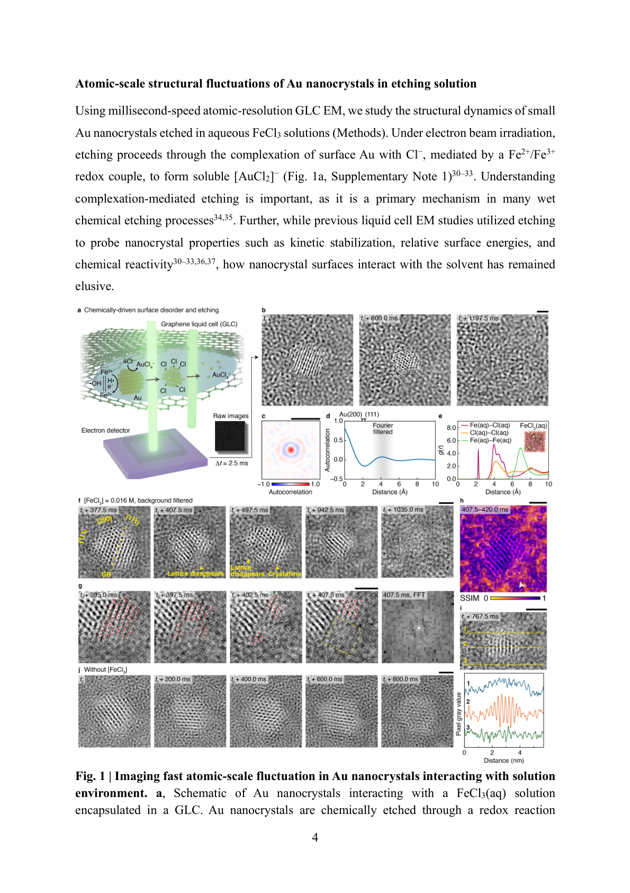
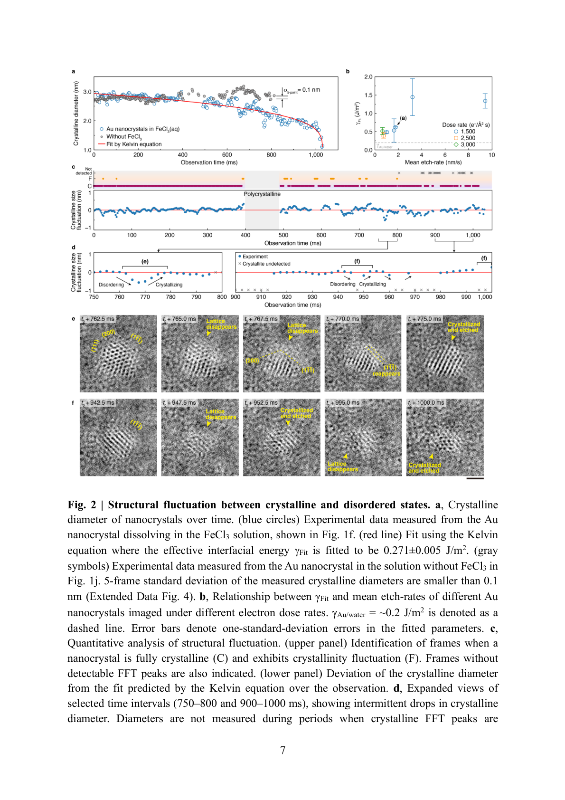
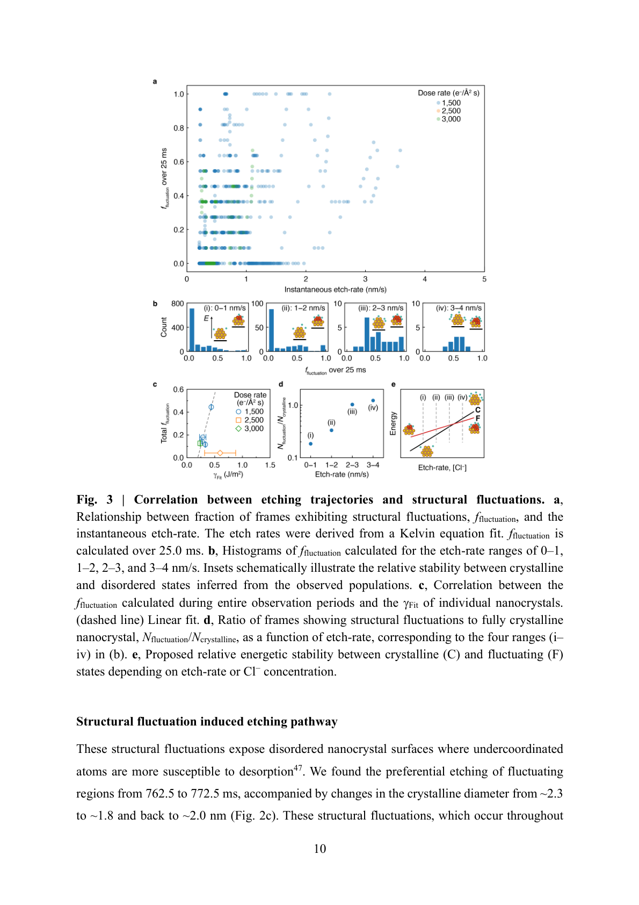
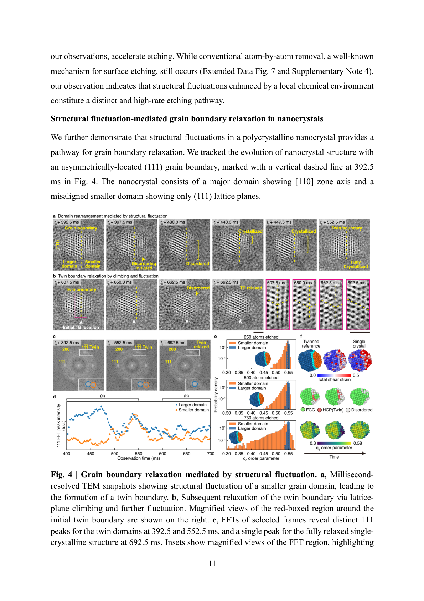
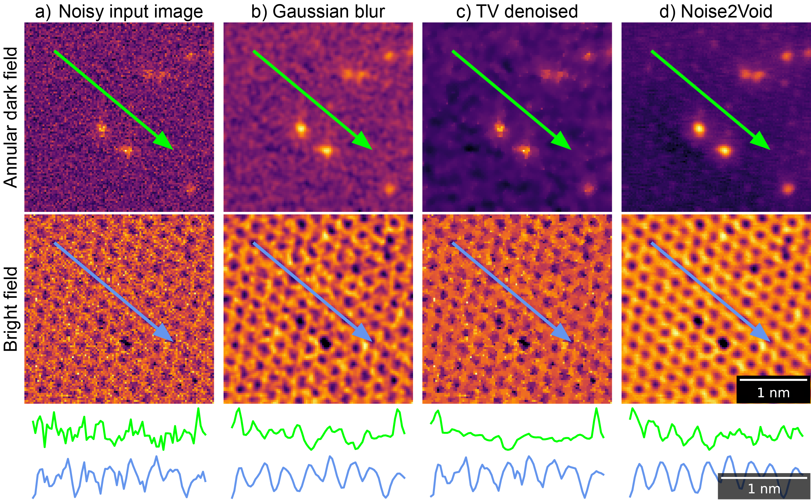

# ナノ結晶の「生きている」表面──液中ミリ秒電子顕微鏡と深層学習が明かす可逆的結晶化揺らぎ

- **執筆日**: 2026-03-29
- **トピック**: 液中電子顕微鏡・深層学習ノイズ除去・ナノ結晶動的構造・可逆的結晶化揺らぎ・溶解ダイナミクス
- **タグ**: Measurement and Spectroscopy / Nanostructures; Nonequilibrium and Dynamic Response / TEM; Machine Learning
- **注目論文**: S. Kang et al., "Visualizing Millisecond Atomic Dynamics of Nanocrystals in Liquid," arXiv:2603.24776 (2026)
- **参照関連論文数**: 5本

---

## 1. なぜ今この話題なのか

ナノ結晶は現代テクノロジーの縁の下の力持ちである。触媒反応の活性点として、がん治療の薬物運搬体として、半導体デバイスの量子ドットとして、ナノメートルスケールの微細粒子は産業・医療・エネルギー分野を広く支えている。しかし、これらのナノ結晶がどのようにして溶液中で溶解・成長し、あるいは変形するのかという動的な過程については、実は驚くほどわかっていないことが多い。

その理由の一つは、測定の根本的な難しさにある。ナノ結晶の「今この瞬間の姿」を原子スケールで観察するためには、透過電子顕微鏡（TEM）による高分解能イメージングが不可欠だ。ところがTEMは超高真空中で動作するため、通常は乾燥した状態の試料しか観察できない。ナノ結晶が実際に働く環境、すなわち水溶液中や有機溶媒中での姿は見ることができなかった。

この壁を打ち破ったのが「液中電子顕微鏡（液中TEM）」技術である。2012年ごろから普及したグラフェン液中セル（GLC: Graphene Liquid Cell）を使えば、グラフェン薄膜で液体を封入したままTEM観察ができる。実際に、金ナノ結晶の成長や形状変化、白金ナノ粒子の形成過程など、多くの動的過程が液中TEMによって可視化されてきた。

しかし液中TEMにはもう一つの壁があった。それは時間分解能と空間分解能のトレードオフである。原子分解能を達成するためには多くの電子をナノ結晶に照射する必要があるが、そうすると試料が電子線ダメージを受けてしまう。逆に、ダメージを抑えるために照射量を下げると信号対雑音比（SNR）が悪化し、ノイズに埋もれて何も見えなくなる。結果として、既存の液中TEM研究の多くは数百ミリ秒から数秒の時間分解能にとどまっており、ナノ結晶表面で起きる速い動的変化を捉えるには不十分だった。

この状況を一変させたのが、深層学習（DL）によるリアルタイム画像ノイズ除去と液中TEMの組み合わせである。2026年3月にarXivに投稿されたSungsu Kangら（Alivisatos・Ercius・Park グループ）による注目論文[arXiv:2603.24776]は、ミリ秒速グラフェン液中TEMとDLノイズ除去を組み合わせることで、溶液中の金ナノ結晶の原子スケール動的構造を初めてミリ秒時間分解能で可視化することに成功した。そしてこの手法によって、ナノ結晶の表面が実は刻々と「結晶性」と「非晶質的状態」の間を行き来していることが発見された。この可逆的結晶化揺らぎは、溶解速度や粒界緩和という巨視的な現象を左右する根本的な因子であることが明らかになった。

このトピックは材料科学と計測技術の交差点に位置する。深層学習が測定を支援し、それにより初めて見えてきた物理現象がある——まさにマテリアルズ・インフォマティクスの精神が結実した成果といえる。

---

## 2. この分野で何が未解決なのか

ナノ結晶の溶液中ダイナミクスには、いくつかの根本的な未解決問題がある。

第一の問題は、**ナノスケールでの溶解速度論が古典理論とどこまで一致するか**という問いだ。古典的なオストワルド熟成理論によれば、小さいナノ結晶は大きいものより速く溶ける。この「溶解率の粒径依存性」はケルビン方程式（またはギブス-トムソン方程式）で記述される。しかし、数ナノメートルの粒子ではそもそも「界面エネルギー」を巨視的な量として扱えるのか？ また、表面が動的に乱れているとしたら、定常的な界面エネルギーという概念は成り立つのかという疑問がある。

第二の問題は、**ナノ結晶表面の微細構造が溶解ダイナミクスにどう影響するか**だ。ナノ結晶の表面原子は内部とは異なる環境に置かれており、化学吸着分子や溶媒和層の影響を強く受ける。しかし、これまでの実験では表面の瞬間的な原子配置と溶解速度を同時に測定することが困難で、両者の因果関係は不明確だった。

第三の問題は、**多結晶性ナノ結晶の粒界がどのように緩和するか**である。コロイド合成で得られるナノ結晶の多くは、複数の結晶ドメインが接合した多結晶粒子を含む。こうした粒界は熱力学的に不安定であり、最終的には単結晶状態へ緩和するはずだが、そのメカニズムは原子スケールで実証されていなかった。粒界の移動が原子の一つひとつの滑り（格子面すべり）によるのか、あるいは一時的な構造の乱れを経由した再配列なのか、実験的証拠が乏しかった。

第四の問題は、**液中TEMにおける電子線効果の切り分け**だ。液中TEM観察では、照射電子が液体分子（水）をラジオリシス（放射線分解）して過酸化水素やヒドロキシルラジカルなどの活性種を生成する。これらが試料と反応するため、「見えている現象が本当に本来の化学環境で起きているものか、それとも電子線が誘起した人工物（アーティファクト）か」という問いは常につきまとう。

これら四つの問いに対して、注目論文は鮮やかな回答の端緒を開いた。

---

## 3. 注目論文の核心：何が前進し、何がまだ仮説か

### ミリ秒速グラフェン液中TEMと深層学習ノイズ除去

注目論文の技術的核心は、二つのアプローチの組み合わせにある。

一つ目は**グラフェン液中セル（GLC）による高解像度液中TEM**だ。グラフェン薄膜（厚さ1〜数原子層）で水溶液を封入し、TEMの超高真空中で観察する手法で、グラフェンが電子線を透過しやすいことから原子分解能に近い観察が可能になる。本研究では塩化鉄（III）水溶液（FeCl₃ 0.016 M）中の金（Au）ナノ結晶（直径〜3 nm）を観察対象とした。FeCl₃はAu表面にCl⁻を吸着させ、Fe³⁺/Fe²⁺のレドックスカップルを通じてAuを酸化・エッチングする反応媒体となる（Fe³⁺ + Au → [AuCl₂]⁻ + Fe²⁺）。

しかし、毎フレーム2.5 msという高速撮影では一枚あたりの電子照射量が少なく、生の画像は非常にノイズが多い。そこで二つ目のアプローチが不可欠となる。

二つ目は**ブラインドスポット畳み込みニューラルネットワークによる自己教師ありノイズ除去**だ。これはNoise2Voidなど自己教師あり学習の考え方をベースにしたDLノイズ除去で、クリーンな参照画像がなくてもノイズの多い画像群だけから訓練できる。具体的には、各ピクセルを予測する際に対象ピクセル自身の値を入力に使わない（ブラインドスポット）設計にすることで、ノイズを「信号」として学習してしまうことを防ぐ。さらに研究グループはバターワースバンドパスフィルターをGLCの背景信号除去に組み合わせることで、GLCバックグラウンドの長周期成分（グラフェンのうねりなど）を効果的に除去した。

この処理によって、SNRは平均14.2 dBから14.4 dBへと向上し（生画像から約2倍のコントラスト改善）、2.5 ms/フレームという高速撮影でありながら原子スケールの格子縞（FCC Auの {1 1 1} および {2 0 0} 面間隔）を各フレームで識別できるようになった。

*図1（arXiv:2603.24776 Fig. 1より）: a) FeCl₃溶液中のAuナノ結晶とグラフェン液中セルの概略図。b) 2.5 ms/フレームでのTEM像（上：生画像、下：DLノイズ除去後）。c) FFT（高速フーリエ変換）自己相関像。d) 背景フィルタリングされた像の放射状分布関数 g(r)。e) バックグラウンド除去後のTEM像。f) 格子縞可視化と格子縞強度プロファイル（FeCl₃あり）。g-h) ミリ秒スケールでの結晶性揺らぎを示す一連の像。i) FeCl₃なしの対照条件での像。j) デノイズされた像（FeCl₃なし）の一連比較。CC BY 4.0 Kang et al. (2026)*

### 可逆的結晶化揺らぎの発見

最も重要な発見は、FeCl₃溶液中のAuナノ結晶が**結晶性（格子縞が明瞭）と非晶質的状態（格子縞が消える）の間を可逆的に行き来すること**だ。図1(g-h)に示すように、ある瞬間には明瞭な格子縞が見えているナノ結晶が、数ミリ秒後には格子縞を失い、さらに数ミリ秒後には再び格子縞が現れる。

一方、FeCl₃を含まないバッファ溶液中では同様の揺らぎは観察されなかった（図1 i-j）。これは揺らぎが電子線の人工物ではなく、**FeCl₃の化学環境、とりわけCl⁻イオンのAu表面への配位**によって誘起されていることを示す重要な対照実験である。

### 溶解軌跡の定量解析

各フレームのFFTから最強回折ピークを抽出し、逆FFTで「結晶性成分」の実空間像を再構築することで、各フレームにおける「結晶性の直径」を定量化した。この結晶性直径の時系列追跡（図2参照）から三つの重要な知見が得られた。

第一に、FeCl₃溶液中のナノ結晶の溶解軌跡は時間平均的にはケルビン方程式でよく記述される。ケルビン方程式は

$$\frac{dr}{dt} = -k S_0 \exp\!\left(\frac{2\gamma V_{\rm m}}{R T r}\right)$$

の形で表される（$r$: 粒子半径、$k$: 速度定数、$S_0$: バルク溶解度、$\gamma$: 固液界面エネルギー、$V_{\rm m}$: モル体積、$R$: 気体定数、$T$: 温度）。フィットから得られた有効界面エネルギーは $\gamma_0 = 0.271 \pm 0.005$ J/m² であり、Au/水界面エネルギーの計算値（約−0.2 J/m²）より若干高い。この差異が揺らぎによる表面乱れを反映していることは、後述する解析で裏付けられる。

第二に、FeCl₃溶液中では±0.1 nm未満の短時間（10-20 ms）の結晶性直径の急激な低下が頻繁に観察される。これが「結晶化揺らぎ」の定量的な現れである。SSIM（構造的類似性指標）解析でも、隣接フレーム間の構造変化が格子縞の消失と一致することが確認されている。

第三に、FeCl₃を含まない条件では、5フレーム標準偏差（揺らぎの指標）が0.1 nm未満にとどまり、揺らぎはほとんど見られない。

*図2（arXiv:2603.24776 Fig. 2より）: a) 各ナノ結晶の結晶性直径の時系列（青丸：FeCl₃あり、灰色記号：なし）とケルビン方程式フィット（赤線）。b) 電子線照射量と平均エッチング速度の関係。c) 構造揺らぎの定量化：上パネルは完全結晶性フレームと揺らぎフレームの識別、下パネルは25 ms間の結晶性直径偏差。d) 結晶性直径と揺らぎのフレーム系列（拡大表示）。e, f) 742〜1000 ms区間の選択フレーム：揺らぎ発生（750-800 ms）と再結晶化（800-1000 ms）の様子。CC BY 4.0 Kang et al. (2026)*

### 揺らぎ頻度と溶解速度の相関——化学環境が表面エネルギーを変える

さらに本研究の核心となるのが、**構造揺らぎ頻度と溶解速度の定量的相関**である。研究グループは7つのAuナノ結晶の溶解軌跡を追跡し、各ナノ結晶の「観察全時間中に揺らぎ状態にある時間割合」$f_{\rm fluctuation}$ と、ケルビン方程式から得られるナノ結晶ごとの有効界面エネルギー $\gamma_0$ を計算した。

$f_{\rm fluctuation}$ は FeCl₃濃度（Cl⁻濃度）が高い局所環境に置かれたナノ結晶ほど大きく、また$f_{\rm fluctuation}$が大きいナノ結晶ほど$\gamma_0$が大きいという正の相関が見出された（図3）。

$f_{\rm fluctuation}$をゼロに外挿すると$\gamma \to -0.2$ J/m²（Au/水計算値）に一致するという結果は、**揺らぎが界面エネルギーを見かけ上引き上げ、溶解を促進する**というモデルを強く支持する。

なぜ揺らぎが溶解を加速するのか？研究グループは以下のメカニズムを提唱している。FeCl₃溶液中のCl⁻イオンはAu表面原子と錯体を形成し（[AuCl₂]⁻形成）、Au-Au結合を弱める。これにより表面原子がより容易に格子から離脱できるようになり、表面に「アンダーコーディネーション（配位不足）」の乱れた原子配列が形成される。この乱れた状態では表面自由エネルギーが増大し、なおかつ原子の溶液への放出確率も高まる。同時に、Cl⁻が外れれば一時的に格子が回復できる——これが「可逆的な」揺らぎになる。

また、エネルギー障壁の推定から、3-4 nm の小さいナノ結晶では結晶性と揺らぎ状態のエネルギー差が小さく（ $\sim k_{\rm B}T$ 程度）、熱揺動だけで頻繁に状態を行き来できることも示されている。大きな（5 nm以上の）ナノ結晶では揺らぎは観察されにくく、小さいほど揺らぎやすいという粒径依存性も見出された。

*図3（arXiv:2603.24776 Fig. 3より）: a) 揺らぎフレーム割合 $f_{\rm fluctuation}$ と瞬間エッチング速度の関係（各ナノ結晶について観察全期間）。b) エッチング速度レンジ0-1, 1-2, 2-3, 3-4 nm/sごとの$f_{\rm fluctuation}$ヒストグラム。c) 観察全期間の $f_{\rm fluctuation}$ と個々のナノ結晶の$\gamma_0$ の相関（破線：線形フィット）。d) エネルギー景観：ナノ結晶の結晶性(C)状態と揺らぎ(F)状態の相対安定性を、エッチング速度区間ごとに示す。CC BY 4.0 Kang et al. (2026)*

### 粒界緩和のメカニズム——揺らぎが「通路」を開く

第四の主要発見は、多結晶ナノ結晶における**粒界緩和が構造揺らぎを介して起きる**ことの実証である。

研究グループは、小さな結晶ドメインと大きな結晶ドメインが{1 1 1}双晶界面で接合したAuナノ結晶の緩和過程を追跡した（図4）。観察開始時、小さいドメインは[1 1 0]帯軸と[1 1 1]帯軸の2方位を示す非整合な双晶構造をもっていた。

397 msから552.5 msの間に小さいドメインに構造揺らぎが生じ、格子縞が消える期間が観察された。揺らぎの後（692.5 ms時点）、小さいドメインは大きいドメインの方位に整合した完全単結晶構造へと変化した——双晶界面が消えたのである。

このプロセスは、従来想定されてきた「格子面すべり（disconnection）による逐次的粒界移動」とは異なり、**一時的な構造無秩序化を経由した協同的な再配列（再結晶化）**によるものだと解釈される。ドメインが一時的に非晶質的状態になることで、個々の原子が格子拘束から解放され、より安定な配置へ協同的に再編できるわけだ。

*図4（arXiv:2603.24776 Fig. 4より）: a) 小ドメインの構造揺らぎを示すミリ秒分解TEM像（400-650 ms）。右パネルは初期の双晶構造のFFT。b) 格子面すべりと揺らぎの両過程を示す一連の像（600-1000 ms）。c) 392.5 ms（双晶状態）と552.5 ms（揺らぎ状態）、692.5 ms（単結晶化後）のFFT比較。拡大インセットはFFT解析領域の格子縞の変化を示す。CC BY 4.0 Kang et al. (2026)*

### 未解決な点：何がまだ仮説か

本研究の核心的な主張、すなわち「Cl⁻配位が揺らぎを引き起こす」という分子スケールのメカニズムは、分子動力学（MD）シミュレーションの示唆によるものであり、原子レベルでの直接観察ではない。MDシミュレーションでは確かにFeCl₃溶液が存在する場合のAu表面原子の乱れが計算されているが、電子線照射下の実際の溶液環境との対応がどこまで正確かは慎重に評価する必要がある。また、電子線ラジオリシスによる局所的な化学環境（過酸化水素濃度など）の変化が揺らぎに寄与している可能性を完全には排除できていない。ただし、FeCl₃なしの対照実験における揺らぎの消失は、電子線効果だけでは説明できないことを強く示唆している。

---

## 4. 背景と研究史：この論文はどこに位置づくか

### 液中電子顕微鏡の歴史と進展

液中TEM自体の歴史は1960年代にさかのぼるが、原子分解能での動的観察が可能になったのは比較的最近のことだ。2000年代には液体封入のための薄いSi₃N₄窓付きチップが開発され、また2012年にはグラフェン薄膜を用いたグラフェン液中セルが登場した。グラフェン（厚さ約0.35 nm）はSi₃N₄膜（数十nm）に比べて格段に薄く、電子の散乱を最小限にできるため、サブナノメートルからほぼ原子スケールの分解能が実現した。

Kisuk Kang, Ulrich Dahmen, Paul Alivisatos、Jungwon Park らのグループによる一連の研究（2012〜2020年代）は、グラフェン液中セルを使ってAuナノ結晶の形状変換、成核、エッチング過程を原子スケールで観察してきた。とくに2019年のJACS論文（Park et al.）では、FeCl₃を用いたAuナノ結晶のエッチングを液中TEMで観察し、局所化学環境の不均一性が溶解速度のばらつきを生むことが示された。注目論文はこの一連の研究の流れを継承しつつ、時間分解能を劇的に向上させることで、「揺らぎ」という新現象を発見した。

また、2024年には「Time-resolved atomic-resolution Brownian tomography of single nanocrystals reveals size-dependent dynamics」（Science Advances）が発表され、サイズ依存の熱揺動が原子分解能でとらえられた。本論文はその延長線上に、化学環境誘起の構造揺らぎというさらに新しい現象を加えた位置づけにある。

### 深層学習と電子顕微鏡の融合

深層学習による電子顕微鏡ノイズ除去の研究は2017年以降急速に発展してきた。当初はU-Netのような教師あり学習が主流だったが、これにはノイズのない参照画像（グラウンドトゥルース）が必要であり、実験データには適用しにくかった。

この問題を解決したのが自己教師あり学習アプローチだ。Noise2Void（2019年提案）はブラインドスポット方策により、ノイズのある画像だけを使って訓練できる手法で、電子顕微鏡画像への適用が進んでいる。最近、William Thornley ら（Manchester 大, 2026年）は2601.07699においてNoise2Voidをグラフェン液中セルの原子分解能STEM動画に適用し、Au原子のSNRを2から12へと改善することに成功した。彼らの手法は22 ms/フレームで動作し（45 fps対応）、液中TEM動画のリアルタイム処理に向けた技術的基盤となっている。

さらに2505.01789では、Ivan Pinto-Huguetら（ICN2, 2025年）が逆空間（フーリエ空間）でノイズ除去を行うU-Net型ネットワークを提案し、GaAs・WS₂など実験的に挑戦的な試料でも結晶構造を正確に復元できることを示した。Brian Leeら（2512.04045, 2025年）は、in-situ HRTEM時系列に特化した自己教師あり学習パイプラインを開発し、ミリ秒推論速度を実現した。これら三つのDL手法はそれぞれ、使用するアーキテクチャや入力空間（実空間 vs. 逆空間）、訓練データの生成方法は異なるが、いずれも「参照なしでの自己教師あり学習でリアルタイム処理が可能」という点で一致しており、注目論文の基盤となった技術群を構成している。

*図5（arXiv:2601.07699 Fig. 3より）: a) 生のノイズあり画像。b) ガウシアンぼかし処理後。c) 全変分（TV）ノイズ除去後。d) Noise2Voidによるノイズ除去後。上段はADF（環状暗視野）チャンネル、下段はBF（明視野）チャンネル。下部のグラフは各画像の輝度プロファイル。Noise2Voidのみが格子縞構造を正確に保持しながらノイズを除去できることが分かる。スケールバー 1 nm。CC BY-NC-ND 4.0 Thornley et al. (2026)*

---

## 5. どの解釈が最も妥当か：証拠・比較・限界

### 揺らぎの実在性の根拠

観察された結晶化揺らぎが本物の構造変化であることを支持する証拠は複数ある。第一に、**SSIM（構造的類似性指標）解析**では、揺らぎを示すフレームで結晶性の隣接フレームとの類似性が大きく低下しており、格子縞の消失が統計的に有意であることが確認されている。第二に、**ピクセル強度解析**によって揺らぎ状態のフレームでも液体部分との強度差が維持されており、物質（Auの質量）そのものはその場に留まっていることが示されている。つまり溶解によってナノ結晶が完全に消えているのではなく、結晶格子配置だけが乱れているのだ。第三に、**FeCl₃なしの対照実験**で同じ条件（電子線照射量、液体封入）でも揺らぎが観察されないことから、電子線ラジオリシスによるアーティファクトではないことが強く示唆される。

### ケルビン方程式の適用可能性と限界

溶解速度論への適用について、ケルビン方程式（ギブス-トムソン方程式）は各ナノ結晶の時間平均的な溶解軌跡をよく再現する。得られた有効界面エネルギー$\gamma_0 = 0.271 \pm 0.005$ J/m²は、DFT計算によるAu/水界面エネルギーの理論値（$\sim -0.2$ J/m²）と大きくは外れていないが、揺らぎ頻度との相関から「見かけ上の界面エネルギーが揺らぎで引き上げられている」という解釈が支持されている。

一方、3 nm程度の小さいナノ結晶において「界面エネルギー」という巨視的な熱力学量を定義することへの根本的な疑問もある。ケルビン方程式はバルク熱力学を点欠陥スケールまで外挿したものであり、数十個程度の原子からなるクラスターでどこまで有効かは不明だ。今回の研究では時間平均としての整合性が示されたが、揺らぎ状態での瞬時的な界面エネルギーの変化を直接測定することはできていない。

### 電子線効果の可能性

最も重要な対立仮説は「観察された揺らぎが電子線誘起の人工物ではないか」というものだ。電子線はラジオリシスによって液体中に活性酸素種（・OH、H₂O₂など）を生成し、これらがAu表面を酸化して構造を乱す可能性がある。

研究グループはこの懸念を三つの方法で反証しようとしている：(1) FeCl₃なしの対照実験での揺らぎ消失、(2) 異なる電子線照射量での揺らぎ頻度比較（照射量依存性が揺らぎ頻度と相関しない）、(3) MDシミュレーションでのFeCl₃存在効果の再現。ただし、照射量依存性の実験には液中の局所ラジオリシス産物濃度の制御が難しく、完全な反証にはさらなる実験が望まれる。例えば、FeCl₃の代わりに類似濃度の電気的に不活性な塩（例：NaCl）を使った比較実験があればより説得力が高まるだろう。

### 粒界緩和メカニズムの解釈

粒界緩和については、従来のdisconnection（格子面すべり）モデルとの競合という観点から注意深い解釈が必要だ。disconnectionモデルでは、粒界は一つひとつの原子移動ステップを通じて徐々に移動すると考える。一方、本研究で観察された粒界消滅は、100 ms程度の「揺らぎ状態」（全域的な構造乱れ）の後に突然起きており、協同的な再配列と解釈された。ただし、この解釈を確定させるためには、揺らぎ中の各原子の位置を追跡するより高い空間分解能か、より詳細なMDシミュレーションが必要だ。

---

## 6. 何が一般化できるのか：材料・手法・応用への広がり

### 液中TEMの守備範囲の拡大

本研究が示した「液体中での材料の動的挙動」を原子スケールで追跡するアプローチは、金ナノ結晶の溶解にとどまらない。

液晶分子の相転移においても、LP-STEM（液相STEM）が重要な知見をもたらしている。Kaczmarczykaら（arXiv:2512.23588, 2025年）はLP-STEMを用いて8CB液晶がSmectic A → Nematic → Isotropicへと段階的に相転移する過程を直接観察した。特筆すべきは、これが液中TEMを用いた液晶相転移の初の詳細研究であることだ。電子線照射による局所加熱が相転移の駆動力となっており、バルクとは異なる相転移挙動（温度差の圧縮など）がナノコンファインメント環境で現れることが示されている。このように、軟らかい物質（ソフトマター）でも液中TEMが活躍の場を広げつつある。

### 原子プローブ断層法（APT）との相補性

金属の腐食や固液界面の化学的変化を理解するために、TEM以外のアプローチも重要だ。Bhaskarら（arXiv:2603.25556, 2026年）は3D印刷のマイクロ腐食セルと極低温原子プローブ断層法（cryo-APT）を組み合わせることで、0.1 M H₂SO₄中の銅腐食を原子スケールで「凍結捕捉」して解析した。この手法では液体を高速凍結して固化し、FIB（集束イオンビーム）加工してAPT針を作製することで、固液界面近傍のイオン分布（硫酸銅クラスターの形成、温度依存的なイオンペアリング、炭素系過渡錯体など）を三次元的かつ原子スケールで可視化した。

液中TEM（動的・リアルタイム）とcryo-APT（化学的・三次元）は相補的な手法であり、両者を組み合わせることで固液界面の完全な理解に近づけると期待される。TEM観察で「揺らぎ状態でどんな元素分布が生じているか」をAPTで静的に捉えるという実験設計は、今後の研究の自然な方向性の一つだ。

### DLノイズ除去のさらなる発展

今回の液中TEMの成功を支えたDLノイズ除去技術は、電子顕微鏡全般に広く応用できる。Pinto-Huguetら（2505.01789）の逆空間DL除去法はGe量子井戸のひずみ定量や電子線感受性のWS₂モノレイヤーの解析に有効であることが示されており、半導体デバイス材料や二次元材料研究への応用が期待される。また、Leeら（2512.04045）の自己教師ありパイプラインはバッテリー電極材料のin-situ観察など、幅広い材料系・観察条件への適応性を示している。

マテリアルズ・インフォマティクスの観点から見ると、これらのDLノイズ除去手法は「生の顕微鏡データから高品質の構造情報を自動的に抽出する」基盤技術であり、高スループット材料評価や自動構造同定への統合が期待される。今後は、ノイズ除去と構造解析（原子位置同定、ひずみマッピング、欠陥検出など）をエンドツーエンドで行うAI駆動型の電子顕微鏡解析パイプラインの構築が重要な方向性となるだろう。

### 触媒・薬物運搬・合成設計への示唆

本研究の最も重要な応用的示唆は、**ナノ結晶の表面結晶性が溶解安定性の決定因子である**という知見だ。ナノ粒子触媒では、活性点（表面原子）の配置が反応選択性を決め、かつ触媒は反応中に溶解や変形を繰り返している。もしCl⁻や他の配位子の濃度が局所的に高い環境では表面揺らぎが増大して溶解が加速するとすれば、触媒設計においてリガンド選択が安定性に大きく影響することを意味する。

薬物運搬用の金ナノ粒子（AuNP）においては、生体内環境（塩化物イオン濃度〜100 mM、たんぱく質による表面配位など）での挙動が問題となる。本研究の知見は、そのような環境での溶解・再結晶ダイナミクスを理解する枠組みを提供する。

合成の観点では、多結晶ナノ粒子が単結晶化するときに構造揺らぎが「通路」となるという知見は、低温・マイルドな条件での熟成（Ostwald ripening）や形状制御の合理的設計に役立てられるかもしれない。

---

## 7. 基礎から理解する

### 透過電子顕微鏡（TEM）の原理

TEMは電子の波として振る舞う性質を利用した顕微鏡だ。光の波長が可視光（約400-700 nm）であるのに対し、100 kV加速された電子の德Broglie波長は約3.7 pm（$\lambda = h/p$, $p = mv$, $m$は相対論的質量）と非常に短い。この短波長のため、TEMは光学顕微鏡よりはるかに高い空間分解能を実現できる。

試料を透過した電子は、原子核の近くでクーロン力によって散乱される。散乱の強さは原子番号（Z）の約2乗に比例するため（Z-コントラスト）、重い原子のある部分が暗く見える（暗視野像）か、または位相コントラストとして可視化される（明視野像）。

結晶性試料では、規則正しく並んだ原子面が電子線を強く回折する（ブラッグ回折）。結晶中で隣接する原子面の間隔を $d$、電子線の入射角を $\theta$、波長を $\lambda$ とすると、ブラッグの条件

$$2d\sin\theta = n\lambda$$

を満たすときに強い回折が起きる。TEM像ではこの回折による干渉縞（格子縞）として結晶構造が可視化される。注目論文でも、Au の {1 1 1} 面（$d = 2.36$ Å）の格子縞が観察されており、この縞が見えるか見えないかで「結晶性か非晶質的か」を判断している。

### グラフェン液中セル（GLC）

通常のTEMでは試料は真空中に置く必要があり、液体は蒸発してしまう。グラフェン液中セルは、原子1〜数層のグラフェン薄膜の間に液体をナノメートルスケールの「池」として閉じ込めることで、液中試料の観察を可能にする。

グラフェンは炭素の六方晶格子から成り、厚さは約0.35 nm（炭素原子1層）と極めて薄い。このため電子は大きな散乱を受けずに透過でき、電子顕微鏡像のバックグラウンドが低く保たれる。ただし、グラフェン自身の格子縞もバックグラウンドに現れるため、注目論文ではバターワースバンドパスフィルターでこれを除去している（グラフェンの {1 0 0} 面間隔〜2.1 Å をターゲットとしている）。

液体の厚さは使用するグラフェン薄膜の凸凹やコンタミネーションにより場所によって異なり、最も薄い部分（液体厚さ $\sim 1 \, \rm nm$）での観察が最高分解能を与える。また電子ビームが液体を照射するとラジオリシスが起き、H₂O₂、・OH、H₂などが生成する。これがAuナノ結晶の酸化還元に影響する可能性があるため、本研究でも照射量の管理と対照実験が重視されている。

### 深層学習ノイズ除去：Noise2Voidとブラインドスポット方策

深層学習（DL）によるノイズ除去は、いくつかの仮定に基づく。電子顕微鏡像のノイズはポアソン統計的であり（入射電子数の平方根に比例する揺動）、信号（真の構造）は空間的に相関している（隣接ピクセルが似た値をもつ）のに対し、ノイズは各ピクセルで独立している。

**Noise2Void**はこの「ノイズの独立性」を利用する。ネットワークの学習時、あるピクセルの値を予測する際にそのピクセル自身の値を入力として使わない（ブラインドスポット）ようにする。こうすると、ノイズ成分（隣接ピクセルと相関しない）は予測できず、信号成分（隣接ピクセルから推定できる）だけを学習できる。このアイデアにより、ノイズのある画像だけから訓練が可能（自己教師あり学習）となる。

数式で整理すると、入力画像 $\hat{x}$ はノイズのない真の画像 $x$ とノイズ $n$ の重ね合わせ：$\hat{x} = x + n$。Noise2Voidは次の損失関数を最小化する：

$$\mathcal{L} = \mathbb{E}_{i} \left[ \left( f_\theta(\hat{x}; {\rm blind}\ i) - \hat{x}_i \right)^2 \right]$$

ここで $f_\theta(\hat{x}; {\rm blind}\ i)$ はピクセル $i$ を使わずにそれ以外のピクセルから $x_i$ を推定した値だ。$\hat{x}_i = x_i + n_i$ において、$n_i$ は独立なので推定では予測できない。結果的にネットワークは $x_i$（信号）の推定を学習する。

注目論文の改良点の一つは、この原理を2チャンネル（ADF・BFの同時撮影）に拡張したことで、2チャンネル間の相関も情報として使えるようにした点だ（Thornley et al. 2601.07699）。

### ケルビン方程式（ギブス-トムソン方程式）

ケルビン方程式は、半径 $r$ の球状粒子の溶解率を記述する熱力学的関係式だ。小さな粒子ほど表面曲率が大きく、表面エネルギー（単位面積あたりの過剰自由エネルギー）の寄与が溶解度に大きく影響する。

溶解平衡では、半径 $r$ の粒子の溶液中飽和濃度 $S(r)$ は：

$$S(r) = S_\infty \exp\!\left( \frac{2\gamma V_{\rm m}}{R T r} \right)$$

ここで $S_\infty$ はバルク溶解度、$\gamma$ は固液界面エネルギー、$V_{\rm m}$ はモル体積、$R$ は気体定数、$T$ は絶対温度。指数部が「余剰化学ポテンシャル」に相当し、小さいナノ結晶（$r$ が小さい）では飽和濃度が高くなる、すなわちより溶けやすくなる。

溶解速度はこの余剰飽和度に比例し、$dr/dt = -kS_0 \exp(2\gamma V_{\rm m}/RTr)$ と書ける。本研究では7つのナノ結晶の溶解軌跡をこの式でフィットして $\gamma_0$ を求めた。$\gamma_0 = 0.271$ J/m² という結果は、揺らぎが大きいナノ結晶が見かけ上より高い界面エネルギーをもつという形でケルビン方程式を満たすことを意味している。

### 粒界と双晶境界

多結晶材料では、異なる方位の結晶ドメインが接する「粒界（grain boundary）」が存在する。粒界の原子配列は完全な結晶格子から乱れており、過剰な自由エネルギー（粒界エネルギー）をもつため、結晶は時間とともに粒界を少なくする方向（粒成長・粒界移動）へ緩和しようとする。

「双晶境界（twin boundary）」は特殊な粒界で、左右の結晶がある反射面に関して鏡像関係になっているものだ（特に FCC 金属では {1 1 1} 双晶が多い）。双晶境界はエネルギーが比較的低く、一般の粒界より安定だが、それでも完全な単結晶より高エネルギーだ。

通常の粒界移動は、粒界面に沿った「disconnection」（らせん状転位の対、粒界の局所的ステップ）の滑りによって起きる。注目論文では、これとは別に表面の構造揺らぎ（局所的非晶質化）を経由した、より協同的な再配列プロセスが観察された。このメカニズムは、ナノスケールでのみ起きうる特有の経路と考えられる（表面積対体積比が大きく、表面揺らぎのエネルギーコストがより低いため）。

---

## 8. 重要キーワード10個

### 1. グラフェン液中セル（Graphene Liquid Cell, GLC）
グラフェン薄膜（炭素原子1〜数層、厚さ 0.35〜1 nm）を窓材として液体をナノメートルスケールで封入するTEM試料ホルダー技術。グラフェンの電子透過率の高さを生かして、ほぼ原子分解能での液中観察が可能。電子線照射によるラジオリシスが避けられないため、照射量の管理と対照実験が不可欠。

### 2. 自己教師ありノイズ除去（Self-supervised Denoising）
正解（クリーン）画像なしに、ノイズのある観察画像だけで深層学習モデルを訓練するアプローチ。代表的手法にNoise2Void（ブラインドスポット方策）がある。電子顕微鏡観察では参照となるクリーン画像が原理的に得られないため、この方法が重要。信号の空間相関とノイズの非相関性を利用して信号だけを学習する。

### 3. 可逆的結晶化揺らぎ（Reversible Crystallinity Fluctuations）
ナノ結晶の局所的な結晶性が、外部刺激（化学環境、熱揺動など）に応じて可逆的に増減する現象。本研究では金ナノ結晶がFeCl₃水溶液中でミリ秒スケールで結晶格子を失い・回復することが初めて実証された。表面原子の配位環境の変化（Cl⁻吸着によるAu-Au結合弱体化）が引き金と考えられる。

### 4. ケルビン方程式（Kelvin Equation）/ ギブス-トムソン方程式
小粒子の溶解度がバルクより高まることを記述する熱力学式。$S(r) = S_\infty \exp(2\gamma V_{\rm m}/RTr)$。表面曲率（$1/r$）が大きいほど表面の余剰化学ポテンシャルが大きく、溶解しやすくなる。ナノ結晶のオストワルド熟成（大粒子成長・小粒子溶解）の基本式でもある。

### 5. ラジオリシス（Radiolysis）
電離放射線（電子線、X線など）が液体（特に水）に当たることで分子結合が切断される現象。液中TEM中では H₂O → e⁻aq, ・OH, H₂O₂, H₂ などの活性種が生成される。これら活性種がナノ結晶の溶解や形状変化に影響するため、液中TEMの解釈において重要な補正・制御対象。照射量を下げるか（低SNRとのトレードオフ）、DLノイズ除去で補う戦略が有効。

### 6. ブラインドスポット畳み込みニューラルネットワーク（Blind-spot CNN）
予測対象ピクセルの値を入力情報から排除することで、自己教師あり学習を実現するニューラルネットワーク設計。各ピクセルの値 $\hat{x}_i$ を予測する際、$i$ 以外の周囲ピクセルだけを入力として使う。これにより、空間的に相関する信号成分は周囲ピクセルから予測できるが、独立なノイズ成分は予測できないため、ノイズのある観察データだけから有効な訓練が可能になる。

### 7. 粒界緩和（Grain Boundary Relaxation）
多結晶材料中の粒界（異なる方位の結晶ドメインの境界面）が、エネルギーを最小化する方向に移動・消滅・再配列する過程。通常はdisconnection（らせん転位対）の移動で説明されるが、本研究では表面の一時的な非晶質化（構造揺らぎ）を経由した協同的再配列という新たなメカニズムが提案されている。

### 8. SNR（信号対雑音比, Signal-to-Noise Ratio）
測定データにおける信号強度とノイズ強度の比。電子顕微鏡では ${\rm SNR} = \mu_{\rm signal}/\sigma_{\rm noise}$ と定義されることが多い（$\mu$: 平均強度差、$\sigma$: ノイズの標準偏差）。SNRが低いと構造情報が雑音に埋もれる。DLノイズ除去により注目論文ではSNR約2（原理的限界付近）から約4.2 dBへ改善が達成されている。

### 9. FFT（高速フーリエ変換）/ 逆空間解析
TEM像の格子縞を抽出・定量するための変換法。実空間像 $I(x,y)$ の2次元FFTを計算すると、各結晶格子間隔に対応したスポットが逆空間（回折スポット）に現れる。特定のFFTピークをマスクして逆FFTすることで、そのスポットに対応する格子縞成分の実空間像だけを取り出せる。本研究では各フレームのFFTで最強スポットを抽出し、逆FFTで結晶性の空間分布と大きさを定量化した。

### 10. 原子プローブ断層法（Atom Probe Tomography, APT）
材料中の原子を一つひとつ電界蒸発させ、飛行時間型質量分析で元素を同定しながら三次元空間位置を再構築する手法。原子スケールの三次元化学マッピングが可能。通常は固体試料（針形状）に適用されるが、cryo-APT（極低温APT）では液体を高速凍結した試料にも適用でき、固液界面の三次元化学分布を捉えられる。TEM（動的・リアルタイム観察）との相補性が高い。

---

## 9. おわりに：何が分かり、何がまだ残っているのか

本研究によって確からしくなったことがいくつかある。ミリ秒速グラフェン液中TEMとDLノイズ除去の組み合わせが、溶液中ナノ結晶の原子スケール動的観察に実用的な解を与えることは明らかだ。また、FeCl₃水溶液中の金ナノ結晶（〜3 nm）がミリ秒スケールで可逆的な結晶性揺らぎを示し、その頻度が溶解速度と強く相関するという観察事実は説得力をもって示されている。溶解軌跡がケルビン方程式に従い、揺らぎが見かけ上の界面エネルギーを高めるというモデルも、7粒子の定量解析から支持されている。さらに、多結晶ナノ結晶の粒界が一時的な構造揺らぎを通じて緩和するという新たな粒界緩和経路も、ミリ秒分解観察によって初めて捉えられた。

一方でまだ不確定なことも多い。最も重要な課題は、Cl⁻吸着がどのように正確に表面原子の結晶性を乱すのか、という分子スケールの反応メカニズムの実証だ。MDシミュレーションは示唆を与えるが、実験的な直接証拠——たとえばEELS（電子エネルギー損失分光）や、ラジカル種の定量、環境ガスを変えた体系的比較など——はまだ不十分だ。また、電子線によるラジオリシスが揺らぎへ与える寄与の定量的切り分けも未解決のままだ。加えて、本研究の知見がどこまで他の金属（Pt、Pd、Ag）や他の配位子系（チオール、タンパク質など）に一般化できるかは、今後の検証が必要だ。

今後1〜3年で特に注目すべき論点は三つある。第一は、DLを組み込んだ自動化リアルタイム解析パイプラインの構築だ——ノイズ除去から格子縞抽出、溶解軌跡追跡、揺らぎ検出まで自動的に行えれば、統計的に十分な粒子数の解析が可能になる。第二は、cryo-APTやEELSとの組み合わせによる化学情報の取得だ——揺らぎ状態でのナノ結晶表面の元素分布を同時に知ることができれば、メカニズムの解明が大きく進む。第三は、生体内環境（生理食塩水、タンパク質溶液など）や触媒反応環境（水素・酸素雰囲気など）での観察への展開だ。これらが実現すれば、「動く材料の動く原子」を見ながら設計するという物質科学の夢がより現実に近づく。

---

## 参考論文一覧

| # | arXiv ID | タイトル | 役割 |
|---|----------|----------|------|
| 1 | [2603.24776](https://arxiv.org/abs/2603.24776) | Visualizing Millisecond Atomic Dynamics of Nanocrystals in Liquid (Kang et al., 2026) | 注目論文（anchor） |
| 2 | [2601.07699](https://arxiv.org/abs/2601.07699) | Noise2Void for Denoising Atomic Resolution Scanning Transmission Electron Microscopy Images (Thornley et al., 2026) | 関連（DLノイズ除去・液中GLC） |
| 3 | [2505.01789](https://arxiv.org/abs/2505.01789) | Enhancing atomic-resolution in electron microscopy: A frequency-domain deep learning denoiser (Pinto-Huguet et al., 2025) | 関連（DL逆空間除去） |
| 4 | [2512.04045](https://arxiv.org/abs/2512.04045) | Machine Learning Pipeline for Denoising Low SNR and Out-of-Distribution TEM Datasets (Lee et al., 2025) | 関連（in-situ TEM用ML） |
| 5 | [2512.23588](https://arxiv.org/abs/2512.23588) | Exploring phase transitions and thermal dynamics in nanoconfined liquid crystals using liquid-phase TEM (Kaczmarczyk et al., 2025) | 関連（LP-STEM応用） |
| 6 | [2603.25556](https://arxiv.org/abs/2603.25556) | Atomic-Scale Insights into Copper Corrosion via Cryogenic Atom Probe Tomography (Bhaskar et al., 2026) | 関連（cryo-APT腐食解析） |
