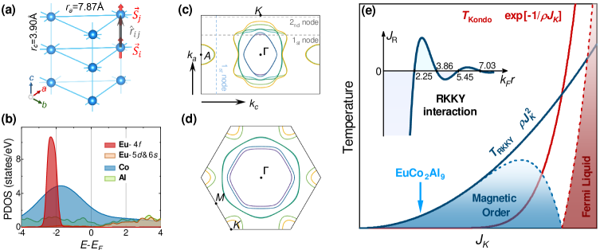
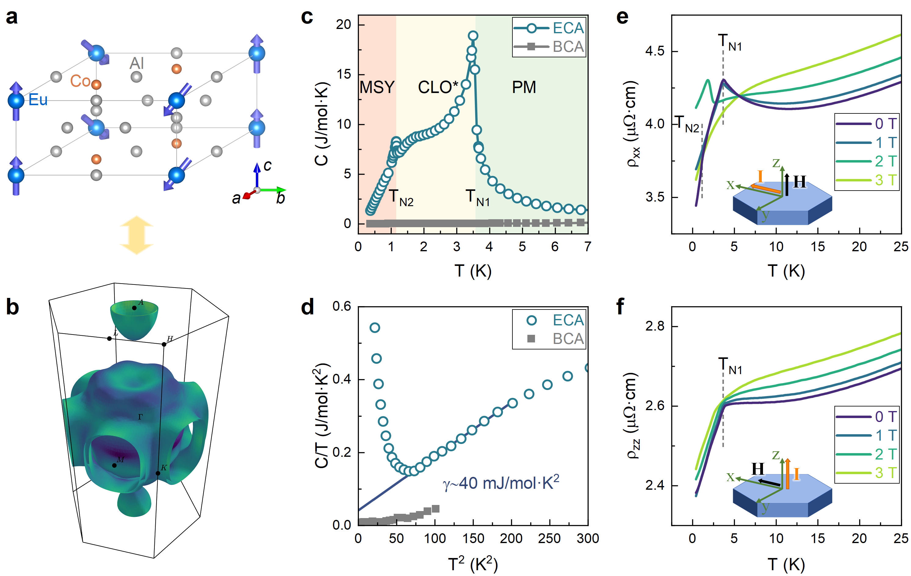
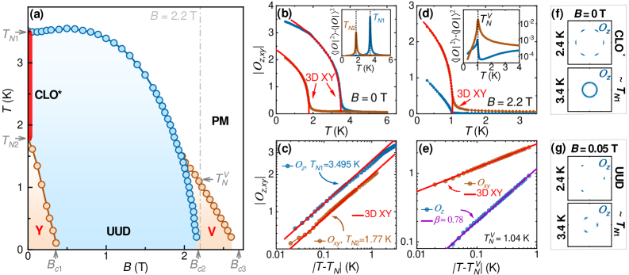
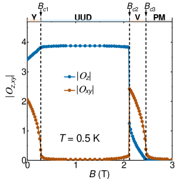
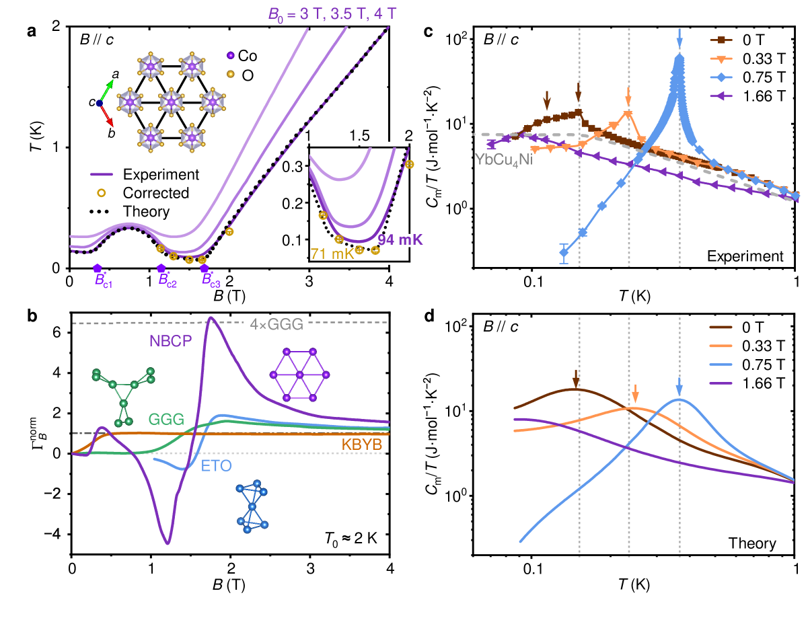
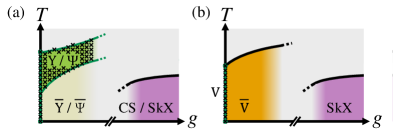

# スピン超固体が拓く金属系磁気冷媒：EuCo₂Al₉の巨大磁気熱量効果

- **執筆日**: 2026-03-31
- **トピック**: スピン超固体相における巨大磁気熱量効果と金属系固体冷媒への展開
- **タグ**: Magnetism and Spin / Phase Transitions; Spin Liquids and Quantum Many-Body Systems / Monte Carlo; Neutron Scattering
- **注目論文**: Xi et al., "RKKY-dipolar Interactions and 3D Spin Supersolid on Stacked Triangular Lattice," arXiv:2603.24446 (2026)
- **参照関連論文数**: 8本

---

## 1. なぜ今この話題なのか

サブケルビン（1 K 以下）の温度域は、量子コンピューティング、量子センシング、暗黒物質探索実験、そして基礎物性研究のほぼすべてにとって不可欠な舞台である。超伝導量子ビットは 20 mK 以下で安定して動作し、ジョセフソン接合を使った標準電圧源や超伝導転移端センサー（TES）などの先端デバイスも同様の極低温環境を要求する。これほど低い温度を達成するための現在の主役は、希ガスの同位体 ³He と ⁴He を使った希釈冷凍機であるが、地球上のヘリウム資源は再生不能であり、近年その供給逼迫と価格高騰が世界中の研究機関を悩ませている。冷凍機の運転コストとメンテナンスの複雑さも問題だ。

こうした背景から、ヘリウムを使わない代替サブ K 冷却技術として **断熱消磁冷凍（Adiabatic Demagnetization Refrigeration, ADR）** が改めて注目されている。ADR は磁性体（固体冷媒）をまず強磁場中で等温的に磁化し、スピン系のエントロピーを取り除いた後、断熱的に磁場をゼロに戻す。このとき磁性体は周囲から熱を吸収してさらに冷却する—原理は理想気体の断熱膨張の磁気版である。ADR 自体は 1930 年代から知られており、宇宙望遠鏡（例えば NASA の Astro-H/ひとみ衛星）にも搭載実績があるが、繰り返し使用可能な高性能冷媒材料の乏しさが普及を妨げてきた。

これまで ADR 用固体冷媒として標準的に使われてきたのは、ガーネット型酸化物の Gd₃Ga₅O₁₂（GGG）や、銅・カリウム塩などの希釈塩（dilute paramagnets）である。しかしこれらは電気絶縁体であるため、熱伝導率が金属に比べて一桁以上低く、冷却のサイクルを速くするうえで本質的な制約となる。金属系材料は原理的に電子系を介した高い熱伝導率を持ち、断熱消磁サイクルにおいて冷媒内部の熱平衡が格段に速く確立される。加えて機械的強度が高く、複雑な多段 ADR システムへの加工も容易である。したがって「高性能かつ金属系」の ADR 冷媒材料の開発は、長年にわたる未解決課題だった。

この文脈において、2026 年初頭に Nature 誌に発表された Shu らの研究は驚くべき報告をもたらした。稀土類金属間化合物 **EuCo₂Al₉**（ECA）が初めて「金属スピン超固体（metallic spin supersolid）」として同定され、しかも極めて大きな磁気熱量効果（MCE）によって約 106 mK という温度まで冷却できることが実証されたのである [Shu et al., Nature 651, 61 (2026)]。スピン超固体とは、磁気秩序のある「固体」と、磁気超流動のような「超流動」が共存する量子多体相であり、その独特な量子揺らぎが巨大なエントロピーを低エネルギー領域に蓄積させる。この相が金属系で初めて実現されたことは、固体冷媒の概念を根本的に塗り替える可能性を秘めている。

本記事では、この EuCo₂Al₉ の発見を軸に、スピン超固体の物理と金属系磁気冷媒への展開を詳しく解説する。注目論文として arXiv:2603.24446 [Xi et al.] を取り上げる。これは EuCo₂Al₉ の発見に触発された理論研究であり、RKKY 相互作用と双極子相互作用の競合という金属特有の機構によって三次元スピン超固体が安定化されることを Monte Carlo 計算で示したものだ。

---

## 2. この分野で何が未解決なのか

EuCo₂Al₉ の発見は重要な一歩だが、この材料と分野が抱える本質的な問いはいくつも残っている。

第一の問いは、**何が良い ADR 冷媒材料を決定づけるか**である。磁気熱量効果の大きさは等温エントロピー変化 ΔS と断熱温度変化 ΔT_ad で評価されるが、これらを最大化するには磁気相転移の近傍で大きなスピン揺らぎが存在し、かつ小さな磁場変化に対して敏感に応答することが求められる。スピン超固体はまさにその条件を満たすが、どのような結晶構造・イオン価数・格子対称性を持つ材料がスピン超固体を実現するかという設計指針はまだ体系化されていない。

第二の問いは、**スピン超固体はなぜ巨大な磁気熱量効果をもたらすのか**という機構論的な問いである。スピン超固体は長距離秩序をもちながら連続対称性の破れ（U(1) 対称性）を同時に持つため、低エネルギーにゴールドストーンモードが存在し、熱容量が異常に大きくなる。これが高密度のエントロピーを担う源であると考えられているが、金属系での電子との結合がこの機構にどう影響するかは未解明である。

第三の問いは、**金属系でスピン超固体を安定化する機構は何か**という点である。絶縁体での先行例（Na₂BaCo(PO₄)₂、K₂Co(SeO₃)₂ など）では、スピン軌道相互作用（SOC）から生じる single-ion 異方性や、XXZ 型の交換相互作用がスピン超固体を安定化する。一方 EuCo₂Al₉ では Eu²⁺ の軌道角運動量がゼロ（L = 0、S = 7/2 の純スピン系）であるため SOC 由来の異方性は小さく、別の機構—金属特有の RKKY 相互作用と磁気双極子相互作用の組み合わせ—が超固体を安定化すると提案されている。この機構の検証は非常に重要な論点である。

第四の問いは、**スピン超固体相はスピン軌道結合に対して安定か**という問いである。実際の材料では弱い SOC が常に存在し、これがゴールドストーンモードにギャップを開けてスピン超固体を破壊しうる。最近の研究（2601.20963）は、有限温度では熱揺らぎが SOC の影響を打ち消して超固体が安定化されることを示唆しているが、EuCo₂Al₉ のような三次元金属での検証は課題として残っている。

---

## 3. 注目論文の核心：何が前進し、何がまだ仮説か

### EuCo₂Al₉の発見とスピン超固体の確認

2026 年初頭の Nature 論文（Shu et al.）は、金属間化合物 EuCo₂Al₉ が初めての「金属スピン超固体」であることを、実験的・理論的に総合的に実証した。EuCo₂Al₉ は Eu²⁺（S = 7/2）イオンが三次元的に積層した三角格子を形成する六方晶系の金属である（空間群 P6₃/mmc）。電気抵抗率は低温で数 μΩ·cm という極めて高い導電率を示し（2603.24445 では 3.5 μΩ·cm を報告）、フォノン系だけでなく電子系による高い熱伝導率が期待できる点がこれまでの絶縁体 ADR 冷媒と本質的に異なる。

比熱測定では、約 7 K（T_N1）と約 1.5 K（T_N2）の二段の磁気転移が確認され、低温相が金属スピン超固体（Metallic Spin-Y state, MSY）に同定された。中性子回折によって面外スピン長距離秩序（spin solid order）と面内スピンの U(1) 自発的対称性の破れ（spin superfluid order）が共存することが確認され、これがスピン超固体の直接証拠である（図1 左）。

*図1: 2603.24446 より。左：EuCo₂Al₉ の結晶構造と Eu²⁺ の三角格子（積層型）。中：Fermi 面の形状。右：金属中のRKKY 相互作用の空間依存性と Kondo 温度スケールの概略。Eu²⁺ の L=0 特性から SOC 異方性は小さく、RKKY と双極子の競合が支配的となる。(CC BY 4.0, Xi et al.)*

### 巨大磁気熱量効果と 106 mK への冷却

Shu らが報告した最も重要な結果は、断熱消磁実験による **106 mK** への冷却達成である。磁場変化 B = 0–4 T に対して得られるエントロピー変化 ΔS は、EuCo₂Al₉ において比較用絶縁体試料（BaCo₂Al₉）を大きく上回り、しかもスピン超固体相の磁場範囲内（B = 0 ～ B_c1 ≈ 0.25 T）で急峻に増大する特徴的な「谷型」の断熱冷却曲線を示す。この谷型構造は2024年の Na₂BaCo(PO₄)₂ の発見（2504.11298）でも報告されており、スピン超固体相特有の低エネルギー励起密度の高さを反映している。

また、EuCo₂Al₉ の電子比熱係数 γ は約 40 mJ/(mol·K²) であり（2603.24445 の C/T vs T² 解析）、低温における電子の寄与が比較的小さいことから、磁気エントロピーが冷媒性能を支配しており、金属性が MCE を妨げていないことが分かる。これは重要な点で、金属では電子比熱が大きく磁気冷却効率を希薄化するリスクがあったが、EuCo₂Al₉ では Eu²⁺ の 4f 局在スピンが大きなエントロピー源となり電子系寄与を凌駕している。

*図1b: 2603.24445 より（CC BY-NC-ND）。(a)EuCo₂Al₉ の結晶構造と Fermi 面（DFT）。(c)比熱 C vs T：MSY（磁気超固体 Y 相）と CLO*（中間相）の二段転移が明確。(d) C/T vs T²：電子比熱係数 γ ≈ 40 mJ/mol·K²、比較用 BaCo₂Al₉ と比較して磁気エントロピーが支配的。(e)(f)電気抵抗率の低温異常。*

### RKKY＋双極子機構：理論の核心（注目論文 2603.24446 の貢献）

Xi ら（2603.24446）は、EuCo₂Al₉ における金属スピン超固体の実現機構を理論的に解明するため、積層三角格子上のスピンモデルを構築した。このモデルの特徴は、通常の交換相互作用に加えて（1）RKKY 相互作用と（2）磁気双極子相互作用を明示的に取り込んだ点にある。

RKKY 相互作用は、金属中の伝導電子が媒介する局在スピン間の長距離相互作用であり、スピン間距離 r に対して J_RKKY(r) ∝ cos(2k_F r)/r³ という振動的な依存性を持つ（k_F はフェルミ波数）。EuCo₂Al₉ では Eu²⁺ 間の距離が約 3.86 Å、5.45 Å、7.03 Å のピークに対応する RKKY 相互作用が最近接・次近接磁気結合として機能する。このような振動的な相互作用が三角格子の幾何学的フラストレーションと組み合わさり、単純な強磁性・反強磁性秩序を妨げる。

双極子相互作用は長距離かつ異方的であり、三角格子内でのスピン配向の方向依存性を引き起こす。Xi らは RKKY と双極子の比を変えた場合の相図を Monte Carlo 計算で求め、**Y 相**（超固体的性質を持つ UUD 変形相）と **V 相**（別の超固体相）という二つのスピン超固体相が、純粋な Ising 型モデルや XY モデルでは得られない領域に安定化されることを示した。

$$J_{\text{RKKY}}(\mathbf{r}) \propto \frac{\cos(2k_F r)}{r^3}$$

$$H_{\text{dip}} = \frac{\mu_0 g^2 \mu_B^2}{4\pi} \sum_{i \neq j} \frac{\mathbf{S}_i \cdot \mathbf{S}_j - 3(\mathbf{S}_i \cdot \hat{r}_{ij})(\mathbf{S}_j \cdot \hat{r}_{ij})}{r_{ij}^3}$$

ここで注目すべきは、**双極子相互作用なしの RKKY のみの積層三角格子**では超固体相が出現しないことを著者らが示した点である。双極子相互作用が層間の three-dimensionalization に決定的な役割を果たしており、その比例係数の最適範囲が EuCo₂Al₉ の実験パラメータと一致する。これは「なぜ EuCo₂Al₉ が超固体を示すのか」という問いへの最初の定量的な回答である。

*図3: 2603.24446 より（CC BY 4.0）。T-B 相図（Monte Carlo）：Y 相（スピン超固体）、UUD 相、V 相（別のスピン超固体）、CLO*（長距離秩序相）が現れる。臨界点付近での 3D XY 臨界挙動が赤線で示され、U(1) 対称性の自発的破れを特徴付ける。*

*図5: 2603.24446 より（CC BY 4.0）。T = 0.5 K における磁場依存の秩序変数。縦軸の Oz（面外成分）は Y 相で有限、Oxy（面内成分）は V 相境界付近で急激に立ち上がる。B_c1 ≈ 0.25 T と B_c2 ≈ 2 T に相境界が対応し、実験観測と整合する。*

### まだ仮説段階にあること

重要な留保として、RKKY + 双極子モデルは EuCo₂Al₉ の定性的な振る舞いを再現するが、実際のパラメータ（J_RKKY の大きさ、双極子定数）の定量的な第一原理からの導出はまだ完成していない。Xi らが用いた RKKY 相互作用の形は Eu²⁺ 格子の DFT 電子構造から推定しており、Eu-4f 電子の強相関効果や多体補正は近似的に扱われている。また、Y 相と CLO*（低磁場長距離秩序相）の区別、特に T_N2 以下での正確な磁気構造の決定には、より精密な中性子散乱実験が必要である。

---

## 4. 背景と研究史：この論文はどこに位置づくか

### スピン超固体という概念

スピン超固体（spin supersolid）の概念は、物性物理の「超固体（supersolid）」という理論概念に由来する。超固体とは、長距離固体秩序と超流動性が共存する相である。ボース–アインシュタイン凝縮体では理論的に予言されていたが、ヘリウム固体での実現については長い論争の歴史がある。磁性体においては、磁場方向のスピン成分が「固体秩序」（密度波）を担い、面内スピン成分が連続的な位相の自由度（U(1) 対称性）を持ってボース–アインシュタイン凝縮するという描像が成立する。

三角格子反強磁性体でのスピン超固体は、1/3 磁化プラトー（UUD: up-up-down 相）の両端に出現することが理論的に知られていた（Nikuni and Shiba, 1995; Momoi and Suzuki, 2007）。磁場 B_c1 < B < B_c2 の間で出現する Y 相と V 相がそれにあたり、この範囲でスピン成分の「固体」と「超流動」が共存する。この理論予言の実験的検証は長らく困難だったが、2024 年に Na₂BaCo(PO₄)₂ で初めて決定的な実験証拠が得られた。

### Na₂BaCo(PO₄)₂：最初の実験的確証（2024年）

Na₂BaCo(PO₄)₂（NBCP）における発見（Xiang et al., 2504.11298; Nature 625, 270 (2024)）は、スピン超固体研究の転換点だった。この材料は三角格子を持つ絶縁体であり、Co²⁺（有効 S = 1/2）の easy-axis 型 Heisenberg 交換相互作用がスピン超固体を安定化する。特筆すべきは以下の三点である。

第一に、断熱消磁実験において71 mK という極低温が達成され、しかも冷却曲線に「二つの谷」（B ≈ B_c1 と B ≈ B_c2 の近傍）が現れることが観測された。これはスピン超固体の相転移エネルギースケールと一致し、スピン超固体の量子揺らぎが低エネルギースピン励起密度を増大させた直接的証拠とされた（図2）。第二に、低温中性子回折によって Y 相での三副格子秩序（1/3 磁化に対応）と面内非公約ピークが同時観測され、固体+超流動共存が証明された。第三に、MCE の大きさがそれまでの ADR 冷媒（GGG：ガドリニウムガーネット等）の 4 倍以上であることが示された。

*図2: 2504.11298 より（arXiv v1; © 著者, Nature 625 掲載）。(上左) B₀ = 3, 3.5, 4 T からの断熱消磁曲線。71 mK まで冷却、特徴的な「谷型」構造が明確。(下左) 代表的 ADR 冷媒との MCE 比較：NBCP（Na₂BaCo(PO₄)₂）は GGG の約 4 倍のエントロピー変化を示す。*

この成果は、スピン超固体の量子揺らぎが実際に ADR 冷媒として機能することを示した最初の例として高く評価され、その後の EuCo₂Al₉ 研究への直接の動機となった。

### 磁気熱量効果の材料比較

従来の ADR 冷媒材料と EuCo₂Al₉ の位置を整理しておく。常磁性絶縁体では Ce₂Mg₃(NO₃)₁₂·24H₂O（CMN）が最低温 ～1 mK を達成できる優れた冷媒であるが、水和塩であるため機械的強度が低く、取り扱いが難しい。GGG（Gd₃Ga₅O₁₂）は固体のガーネット型酸化物で ADR 冷媒として最も広く使われるが、最低到達温度は ～350 mK に限られる。2024 年の NBCP（Na₂BaCo(PO₄)₂）は 71 mK を達成したが絶縁体である。EuCo₂Al₉ は 106 mK を達成しながら高導電率金属という点で質的に異なる。

一方で、別の金属系磁気冷媒として Nd を含む金属間化合物 NdT₄B（T = Fe, Co, Ni）の系統的研究（Fruhling et al., 2511.18195）も進んでいる。この系はカゴメ格子を持つ強磁性金属であり、T の組成を最適化することで 10 K ～ 650 K という広い温度範囲にわたる MCE を示し、多段冷却系への応用が期待される。ただしこれは量子臨界的なスピン超固体相を利用した機構ではなく、強磁性転移に伴う通常の MCE である。スピン超固体 MCE との定量的比較は今後の課題だ。

### フラストレーション磁性体と磁気冷媒

フラストレーションを持つ磁性体は一般に低温まで磁気秩序を示さず、大きなエントロピーを低エネルギー域に保持するため、ADR 冷媒として優れた性質を持つことが古くから注目されてきた。三角格子反強磁性体、カゴメ格子、パイロクロア格子などがその典型例であり、スピン液体的な揺らぎが冷媒性能を向上させる。EuCo₂Al₉ における発見は、フラストレーション効果を金属系で初めて活かせることを示したという意味で、この文脈でも革新的な位置を占める。

---

## 5. どの解釈が最も妥当か：証拠・比較・限界

### RKKY＋双極子対 SOC＋XXZ：機構の比較

スピン超固体を安定化する機構として、これまで主に提案されてきたのは SOC 起源の single-ion 異方性（SIA）と XXZ 型交換相互作用の組み合わせである。Na₂BaCo(PO₄)₂ でも K₂Co(SeO₃)₂ でも、Co²⁺ の SOC が easy-axis 型異方性を提供し、そのゼーマン効果の差異がスピン超固体の相境界を決める。これに対して EuCo₂Al₉ では Eu²⁺ が L = 0 の純スピン系（Hund 則第三法則）であり、SOC 由来の SIA は原理的に小さい。

Xi ら（2603.24446）はこの違いに着目し、RKKY 相互作用が Eu²⁺ の三角格子に「実効的な異方性」を生み出すかどうかを検討した。計算では純粋な Heisenberg RKKY モデルでは超固体相が得られず、**双極子相互作用を加えて初めて安定なスピン超固体**が現れることを示した。これは物理的に明快な結論であり、双極子相互作用の空間異方性（Hzz ≠ Hxx）が易軸異方性と同等の役割を果たすという解釈を支持する。

定量的には、Xi らが用いる双極子結合定数 D = μ₀(gμ_B)²/(4π r³) は近接 Eu²⁺ 間距離（約 3.86 Å）を代入すると D/k_B ≈ 0.06 K 程度である。この値は RKKY 相互作用の典型的なエネルギースケール（J_RKKY ≈ 0.1–1 K）に対して小さいが、三角格子での幾何学的フラストレーション下では小さな異方性が相図を大きく変える「弱い perturbation」として機能することが理論的に知られている。

### Y 相と V 相：どちらが真のスピン超固体か

2603.24446 の Monte Carlo 相図（図3参照）では、低磁場側に Y 相、高磁場側に V 相という二つのスピン超固体相が現れる。Y 相は三副格子秩序（↑↑↓）の傾いた版で、U(1) 位相の自発的対称性の破れを示す。V 相はより対称性の高い秩序を持ち、臨界磁場 B_c2 付近で急峻な転移を示す。実験（Shu et al.）では T_N2 以下に相転移が観測されるものの、Y 相と CLO*（intermediate long-range order 相）の区別は比熱だけでは難しい。中性子散乱での面内非公約ブラッグピーク観測が鍵となる。

2509.26151 の Rb₂Co(SeO₃)₂（K₂Co(SeO₃)₂ の Rb 版）では高磁場 NMR によってスピン超固体相内でのゴールドストーン的なスピン揺らぎを直接観測しており、Na₂BaCo(PO₄)₂ の neutron diffraction と合わせて絶縁体系では証拠が充実してきた。EuCo₂Al₉ の金属版では NMR は伝導電子からのナイト・シフトにマスクされる可能性があり、μSR やメスバウアー分光が有力な代替手法として提案されている。

### 有限温度での超固体安定性：SOC の影響

EuCo₂Al₉ の Eu²⁺ は SOC が小さいとはいえ完全にゼロではなく、またコバルト（Co）の d 電子からの間接的な SOC 寄与も無視できない可能性がある。Park ら（2601.20963）は、三角格子の XXZ モデルにおいて無限小の SOC が T = 0 でスピン超固体のゴールドストーンモードにギャップを開け、厳密には超固体を「壊す」ことを iDMRG で示した。しかし同時に、有限温度では熱揺らぎが SOC の影響を**逆方向に（超固体安定化の方向に）打ち消す**という驚くべき機構を発見した。この「熱揺らぎによる超固体の安定化」は EuCo₂Al₉ において約 1–7 K という比較的高い温度での超固体相形成を説明するうえで重要な視点を提供する。

*図5: 2601.20963 より（CC BY 4.0）。(a) SOC パラメータ g の増加に伴う Y/Ψ 相（スピン超固体）の相境界変化。有限温度では Y 相が SOC 値が大きい領域まで存在し（緑のハッチング領域）、(b) V 相でも同様に有限温度安定化が確認される。*

定量的比較という観点では、2603.24446 で導出された相図が実験の T-B 相図（MSY 相 ≈ 0.25–2 T, T_N2 ≈ 1.5 K）とかなり良い一致を示す一方、Y 相と CLO* の転移温度（T_N2 ≈ 1.5 K, T_N1 ≈ 7 K）の精密な再現には次近接 RKKY 結合と双極子定数の微調整が必要である。転移のクリティカリティ（3D XY 的 vs. 他のユニバーサリティクラス）については Monte Carlo データから Bc1 付近で 3D XY 的なスケーリングが支持されているが、実験での臨界指数測定はまだ行われていない。

### MCE の大きさ：どの要因が効くか

EuCo₂Al₉ の MCE の大きさは GGG や他の ADR 冷媒と比較する上で重要なベンチマークである。Shu らの実験では磁場 0–4 T での ΔS は約 14 J/(kg·K) であり、これは GGG の約 2 倍、NBCP（Na₂BaCo(PO₄)₂）の約 1/4 という位置にある。この相対的に低い値は、Eu²⁺ の磁気モーメント（g = 2, S = 7/2）は大きいが磁気転移温度（T_N1 ≈ 7 K）が比較的高いため、エントロピー変化が分散していることに起因する。スピン超固体相での「谷型」構造は低磁場での選択的冷却を可能にし、B < 1 T でも有効なエントロピー変化が得られるという実用的優位性がある。Eu₂MgSi₂O₇（Shastry–Sutherland 格子、2602.08497）の ΔS ≈ 55 J/(kg·K) と比較すると絶対値は小さいが、EuCo₂Al₉ の熱伝導率優位性が等価な冷却サイクル時間の短縮として現れる。この「実効的性能」の定量評価は今後の重要課題である。

---

## 6. 何が一般化できるのか：材料・手法・応用への広がり

### 金属系スピン超固体の一般化：どんな材料に期待できるか

EuCo₂Al₉ の成功から導かれる設計原理は、「RKKY + 双極子機構によるスピン超固体」を他の金属間化合物に展開できる可能性を示す。Xi ら（2603.24446）のモデルが示す相図の観点から見ると、以下の条件を満たす材料が候補となる。

（1）**高スピン・球対称イオン**: Eu²⁺（S = 7/2, L = 0）のように SOC が小さく純スピン的なイオンが好ましい。類似の候補として Gd³⁺（S = 7/2, L = 0）が挙げられる。Gd 系金属間化合物（例：GdCo₂Al₈ など）は EuCo₂Al₉ の等電子類似体として探索価値が高い。（2）**三角格子フラストレーション**: 幾何学的フラストレーションが磁気秩序を抑制し、大きなスピン揺らぎが保持される構造が必要。三角格子を含む層状六方晶系が有利。（3）**適切な RKKY/双極子比**: これは伝導電子のキャリア密度と Fermi 波数 k_F によって制御できる。ドーピングや化学的置換によるフェルミ面エンジニアリングが有効な手段となりうる。

2603.14682 が報告した EuCo₂Al₉ の巨大異常ホール効果（AHC ≈ 31,000 Ω⁻¹cm⁻¹）は、スピンカイラリティ散乱とフラストレーションの相乗効果として理解でき、スピン超固体状態の電気伝導測定による検出を可能にする。この知見は「電気的手段によるスピン超固体状態の同定」という新しい実験手法論へと発展する可能性がある。

### 絶縁体スピン超固体との相補的な役割

絶縁体系（Na₂BaCo(PO₄)₂、Rb₂Co(SeO₃)₂）は MCE の絶対値では EuCo₂Al₉ を凌ぐが、熱伝導率の低さが ADR 冷凍機の性能を制限する。一方 EuCo₂Al₉ は熱平衡の速さを活かして高サイクルレートの ADR を実現できる可能性がある。実際の宇宙・量子コンピュータ応用では、単なる最低温度達成よりも「一定温度を長時間維持できるか」「速い温度制御が可能か」が重要な要素であり、金属冷媒の優位性は冷却サイクルの設計と不可分である。

多段 ADR システムの設計においても、EuCo₂Al₉ は 0.1–7 K レンジの冷媒として、高温側（1–10 K）でパラメトリック磁性体（例：GGG）と組み合わせることで連続冷却サイクルを構成できる。NdT₄B 系（2511.18195）が 10 K 以上の温度領域で大きな MCE を持つことと合わせると、広温度域を複数の金属系冷媒でカバーする全固体冷凍系というコンセプトが現実味を帯びてくる。

### スピントロニクスへの接続

2601.01890（Huang et al.）のレビュー論文は、スピン超固体の「超流動」成分が「散逸なきスピン流」（dissipationless spin supercurrent）を支持する可能性を指摘している。金属スピン超固体 EuCo₂Al₉ においてもこの可能性があり、スピン流デバイスとしての応用も視野に入る。ただしこれはまだ理論的示唆の段階であり、金属中での散乱・減衰効果を考慮した詳細な検討が必要である。

---

## 7. 基礎から理解する

### 7.1 磁気熱量効果（MCE）の物理

磁気熱量効果とは、磁場の変化に応じて磁性体の温度が変化する現象である。熱力学的に最も本質的な表現は、全エントロピー S をスピン系（磁気）成分 S_mag と格子成分 S_lat に分けることで理解できる。

等温過程（T = 一定）で磁場を B₀ から B₁ に変化させると、等温エントロピー変化

$$\Delta S_{\text{iso}} = S_{\text{mag}}(T, B_1) - S_{\text{mag}}(T, B_0)$$

が生じる。磁場の増大によってスピン系が揃えられるとスピンのエントロピーが減り、この「乱雑さの減少」が格子系へ伝達されて試料が温まる（磁化発熱）。逆に断熱条件（外部との熱交換ゼロ）で磁場を下げると

$$\Delta T_{\text{ad}} = -\frac{T}{C} \left(\frac{\partial M}{\partial T}\right)_B \cdot \Delta B$$

という断熱温度変化が生じ、試料は冷却される。ここで C は定磁場下の熱容量、M は磁化である。大きな ΔT_ad を得るには（∂M/∂T）_B が大きいこと、つまり磁場に対する磁化の温度感受性が高い領域—磁気相転移の近傍—を利用することが鍵である。

スピン超固体の場合、低エネルギーのゴールドストーンモードが U(1) 対称性の自発的破れに起因して存在し、これが低温での大きな磁気熱容量を生み出す。具体的には S_mag(T) ∝ T（スピン波エントロピー）が相転移温度 T_c のはるか下まで維持されることで、比較的高い温度から断熱消磁冷却が効果的に機能する温度範囲が広くなる。

### 7.2 スピン超固体とは何か：量子多体状態の直感的理解

「スピン超固体」という名称は直感的でないかもしれないので、段階を追って説明しよう。

まず、通常の反強磁性体（スピン固体）から出発する。三角格子上のスピン系に外部磁場 B を加えると、磁場なしでは長距離反強磁性秩序（↑↓↑↓…）または三副格子秩序（↑↑↓など）をとる。磁場を増やしていくと 1/3 磁化プラトー（↑↑↓ の UUD 構造）が現れ、ここで磁化 M = M_sat/3 に対応する。

このとき各スピンを「スピンアップ励起（マグノン）」の占有数 n_i で表すと、UUD 相は n_i が 0 か 1 の二値をとる周期的なパターン（Wigner 結晶のような「固体」）に相当する。

磁場をさらに増やすと UUD 相の「↑↓ 境界」でマグノンが励起でき、マグノン密度が増大する。この際、マグノンが Bose 統計に従う（スピンの上げ下げを Bose 演算子で表した場合）ならば、ある臨界温度以下でマグノンがボース–アインシュタイン凝縮（BEC）を起こし得る。この BEC の相は「超流動的」であり、全スピンの位相が揃う。

スピン超固体は、この Wigner 結晶的な「固体秩序」（磁化の空間周期パターン: <S_z> が波数 Q で振動する）と BEC の「超流動秩序」（<S_+> ≠ 0 の U(1) 対称性の自発的破れ）が同時に存在する相であり、UUD 相とポーラライズド相（すべて↑）の境界領域に相当する。

$$\langle S_z(\mathbf{r}) \rangle = m + A\cos(\mathbf{Q} \cdot \mathbf{r} + \phi) \quad \text{(solid order)}$$
$$\langle S_+(\mathbf{r}) \rangle = \Delta e^{i\theta} \neq 0 \quad \text{(superfluid order, U(1) broken)}$$

ここで Q は格子の逆格子ベクトル、m は一様磁化、A は振動振幅、Δ と θ はそれぞれ「マグノン凝縮の振幅」と「位相」である。θ が空間的に一定であることが超流動秩序（U(1) 対称性の破れ）の意味であり、このモードがゴールドストーンモード（位相の低エネルギー揺らぎ）を生む。

### 7.3 RKKY 相互作用と金属磁性体

RKKY（Ruderman–Kittel–Kasuya–Yosida）相互作用は、金属中の局在スピン間の相互作用として理解される。自由電子ガスに局在スピンが埋め込まれると、一方のスピンが伝導電子を偏極させ（Friedel 振動）、その偏極がもう一方の局在スピンと作用することで間接的な交換相互作用が生じる。

その形式的表現は

$$J_{\text{RKKY}}(r) = J_0 \frac{2k_F r \cos(2k_F r) - \sin(2k_F r)}{(2k_F r)^4}$$

であり、距離 r の増大に伴って符号が振動しながら r⁻³ で減衰する。この振動のため、近接・次近接スピン間の相互作用が強磁性的になったり反強磁性的になったりする。三角格子では、最近接・次近接の RKKY の符号と大きさの比が相図を決定的に左右し、EuCo₂Al₉ では k_F と Eu²⁺ 間距離の組み合わせが偶然（あるいは電子構造として必然的に）フラストレーション域に入っている。

### 7.4 断熱消磁の実際：冷凍機の動作原理

断熱消磁冷凍（ADR）は以下のサイクルで動作する。①「プリクール」：冷媒試料を熱浴（例: 1 K の He 予冷槽）と熱的に接続した状態で磁場を 0 から B_max まで増大させる（等温磁化、スピンエントロピーが減少して熱浴に熱が流れる）。②「断熱消磁」：試料を熱的に絶縁したまま磁場を 0 に戻す（断熱 → スピンエントロピーが増大して磁気温度が下降する）。③「冷却保持」：試料の低温状態を維持しながら熱負荷を除去する。④「再磁化」：使用後、再び熱浴と接続して熱を捨て、サイクルを繰り返す。

EuCo₂Al₉ のような高熱伝導率金属冷媒では、サイクル①と④での熱交換が速く完了するため、サイクルのスループット（単位時間当たりの冷却熱量）が大きい。これは宇宙用 ADR のような長時間・遠隔操作条件では特に重要な優位性である。

---

## 8. 重要キーワード 10 個

**1. 磁気熱量効果（Magnetocaloric Effect, MCE）**
磁場変化によって磁性体の温度またはエントロピーが変化する現象。等温エントロピー変化 ΔS と断熱温度変化 ΔT_ad で評価される。相転移の近傍でとくに大きな効果が得られる。固体冷媒による断熱消磁冷凍（ADR）の物理的基盤となる現象。

**2. スピン超固体（Spin Supersolid）**
磁性体において、周期的な磁化パターン（スピン「固体」秩序）と U(1) 位相の自発的対称性の破れ（スピン「超流動」秩序）が共存する量子多体相。三角格子反強磁性体の 1/3 磁化プラトー近傍に出現する Y 相や V 相が典型例。低エネルギーゴールドストーンモードが大きなエントロピー蓄積をもたらし、巨大な磁気熱量効果の起源となる。

**3. RKKY 相互作用**
金属中の伝導電子が媒介する局在スピン間の間接交換相互作用。スピン間距離 r に対して cos(2k_F r)/r³ で振動・減衰する。フェルミ波数 k_F によって相互作用の符号（強磁性/反強磁性）が距離で変わり、フラストレーションを生む起源となりうる。EuCo₂Al₉ での金属スピン超固体の主要な安定化機構の一つとされる。

**4. 双極子相互作用（Dipolar Interaction）**
磁気双極子間の長距離・異方的相互作用。H_dip ∝ [S_i·S_j - 3(S_i·r̂)(S_j·r̂)]/r³ の形をとる。その空間異方性が easy-axis 型の異方性として機能し、SOC の小さい EuCo₂Al₉ においてスピン超固体を安定化する役割を持つ（2603.24446 の理論的主張）。

**5. 断熱消磁冷凍（Adiabatic Demagnetization Refrigeration, ADR）**
磁性体を等温磁化した後、断熱的に消磁することで極低温を達成する冷凍技術。理論的に絶対零度に近い温度まで冷却可能。現行の ADR 冷媒は電気絶縁体が多く、熱伝導率の低さが課題。EuCo₂Al₉ はこの問題を解決しうる金属系 ADR 冷媒の候補として注目される。

**6. フラストレーション（Frustration）**
格子の幾何学的制約（三角格子など）または複数の競合する相互作用のせいで、すべての相互作用を同時に満足する磁気秩序が存在できない状況。フラストレーションは長距離磁気秩序を抑制し、大きなスピン揺らぎとエントロピーを低温まで保持させる。ADR 冷媒として有利な特性につながる。

**7. 異常ホール効果（Anomalous Hall Effect, AHE）**
時間反転対称性の破れた磁性体において、ゼロ磁場でも現れるホール効果。ベリー位相機構（内因的）またはスピン散乱機構（外因的）によって引き起こされる。EuCo₂Al₉ では AHC ≈ 31,000 Ω⁻¹cm⁻¹ という巨大な AHE が報告され（2603.14682）、スピンカイラリティ揺らぎと RKKY 相互作用の相乗効果として解釈されている。スピン超固体状態の電気的検出手段としても機能しうる。

**8. ゴールドストーンモード（Goldstone Mode）**
連続対称性が自発的に破れた場合に必然的に出現する低エネルギー励起（質量ゼロのボソン）。スピン超固体では U(1) 位相対称性の破れに対応するゴールドストーンモード（位相モード）が存在し、これが低温での熱容量と MCE の異常な増大の主因となる。スピン超固体の「磁気超流動的」成分を担う集団励起でもある。

**9. Shubnikov–de Haas 振動（SdH Oscillation）**
高磁場下で電気抵抗率が磁場の逆数 1/B に対して周期的に振動する現象（量子振動）。ランダウ準位の離散化によって生じ、その振動周波数から Fermi 面の断面積が決定できる。2603.24445 では EuCo₂Al₉ において 35 T までの SdH 振動を観測し、三つの Fermi 面軌道（α₁、α₂、β）を同定、DFT+U 計算と良い一致を示している。磁気秩序によるバンド分裂の電子構造証拠となる。

**10. モンテカルロシミュレーション（Monte Carlo Simulation）**
確率的サンプリングによって統計力学的な期待値（相図、秩序変数、熱容量など）を数値的に計算する手法。スピン系では Metropolis アルゴリズムや並列焼きなまし（Parallel Tempering）法が多用される。2603.24446 では RKKY + 双極子相互作用モデルの温度-磁場相図を求め、Y・V 超固体相の存在と相転移のユニバーサリティクラス（3D XY）を決定するために用いられた。

---

## 9. おわりに：何が分かり、何がまだ残っているのか

EuCo₂Al₉ の発見（Shu et al., Nature 2026）とその理論的解明（Xi et al., arXiv:2603.24446）は、磁気固体冷媒の研究に二つの新しい局面を開いた。第一に、金属系材料でも絶縁体系に匹敵するスピン超固体的な量子揺らぎを実現できること、そしてそれが高い熱伝導率という工学的優位性と同居できることが示された。これはヘリウム代替 ADR 冷媒として「高性能かつ扱いやすい」金属冷媒の設計可能性を初めて原理的に実証したものである。また、RKKY と双極子相互作用が金属スピン超固体の主要な安定化機構であるという理論的提案は、Eu²⁺ 系以外の高スピン金属間化合物への一般化の指針を与える。

しかし残された課題も多い。EuCo₂Al₉ の低温相の精密な磁気構造（Y 相 vs. CLO*）は中性子散乱による決着が待たれており、転移のユニバーサリティクラス（3D XY 的かどうか）の実験的検証も未完である。MCE の絶対値では絶縁体系に及ばないため、冷凍機全体のシステム性能（冷却サイクル速度、熱負荷除去効率、最低到達温度）の定量評価が必要だ。また、RKKY + 双極子モデルのパラメータを第一原理から精密に導出する理論的取り組みが進めば、Gd³⁺ 系や他の L = 0 高スピン希土類を含む金属間化合物の設計・探索が体系的に可能になるだろう。今後 1〜3 年の注目点は、EuCo₂Al₉ の高磁場中性子・μSR 実験による磁気構造確定、類似構造をもつ Gd 系・Sm 系金属間化合物の系統的な MCE 評価、そして実際の ADR 冷凍機への実装試験である。量子コンピューティングの急速な発展が下支えとなり、金属系固体冷媒の研究は物性物理の基礎と低温工学の応用が交差する最前線であり続けるだろう。

---

## 参考論文一覧

1. **[anchor]** Ning Xi et al., "RKKY-dipolar Interactions and 3D Spin Supersolid on Stacked Triangular Lattice," arXiv:2603.24446 [cond-mat.str-el] (2026). (CC BY 4.0)

2. M. Shu, X. Xu, N. Xi et al., "Giant magnetocaloric effect and spin supersolid in a metallic dipolar magnet," *Nature* **651**, 61–67 (2026). DOI: 10.1038/s41586-026-10144-z

3. Xitong Xu, Yonglai Liu et al., "Electrical Transport and Quantum Oscillations in the Metallic Spin Supersolid EuCo₂Al₉," arXiv:2603.24445 [cond-mat.str-el] (2026). (CC BY-NC-ND 4.0)

4. Sheng Xu et al., "Giant anomalous Hall conductivity in frustrated magnet EuCo₂Al₉," arXiv:2603.14682 [cond-mat.str-el] (2026). (Accepted, *Materials Today*)

5. Seongjun Park, Sung-Min Park, Yun-Tak Oh, Hyun-Yong Lee, Eun-Gook Moon, "Spin-orbit-induced Instability and Finite-Temperature Stabilization of a Triangular-lattice Supersolid," arXiv:2601.20963 [cond-mat.str-el] (2026). (CC BY 4.0)

6. Yixuan Huang, Seiji Yunoki, Sadamichi Maekawa, "Emergent Spin Supersolids in Frustrated Quantum Materials," arXiv:2601.01890 [cond-mat.str-el] (2026). (CC BY-NC-SA 4.0)

7. Yi Cui et al., "Spin-supersolidity induced quantum criticality and magnetocaloric effect in Rb₂Co(SeO₃)₂," arXiv:2509.26151 [cond-mat.str-el] (2025). (CC BY-NC-ND 4.0)

8. Junsen Xiang et al., "Giant Magnetocaloric Effect in Spin Supersolid Candidate Na₂BaCo(PO₄)₂," arXiv:2504.11298 [cond-mat.str-el] (2025); *Nature* **625**, 270–275 (2024).

9. Kyle W. Fruhling et al., "Engineering the Magnetocaloric Effect in NdT₄B," arXiv:2511.18195 [cond-mat.mtrl-sci] (2025). (CC BY 4.0)
