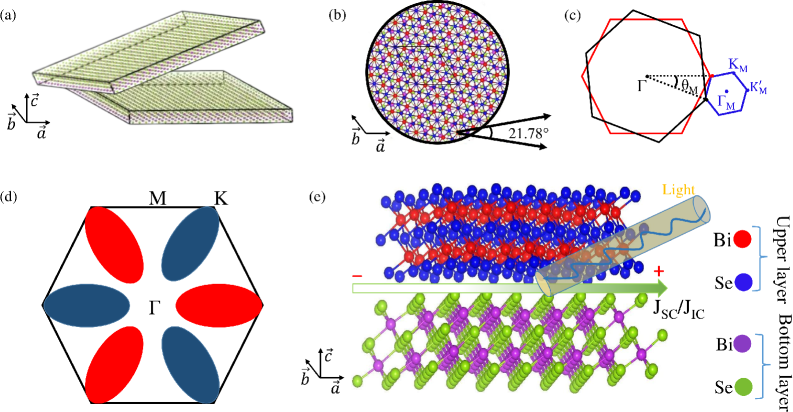
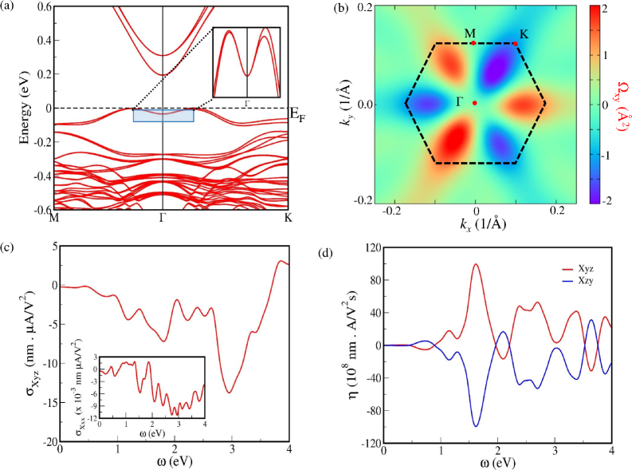
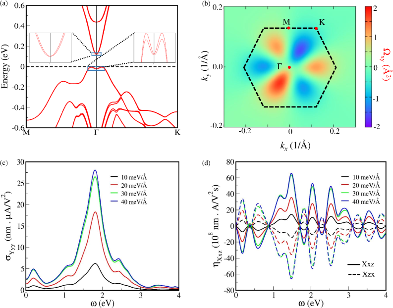
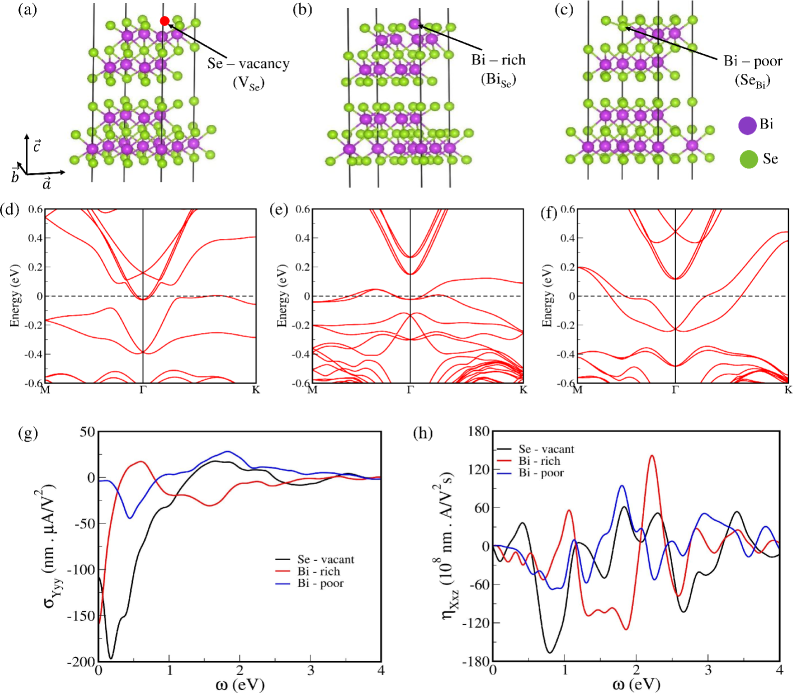
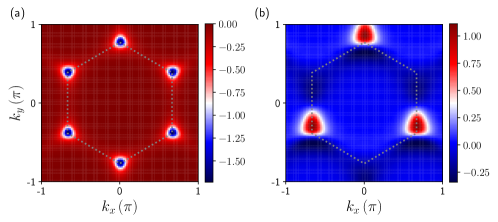
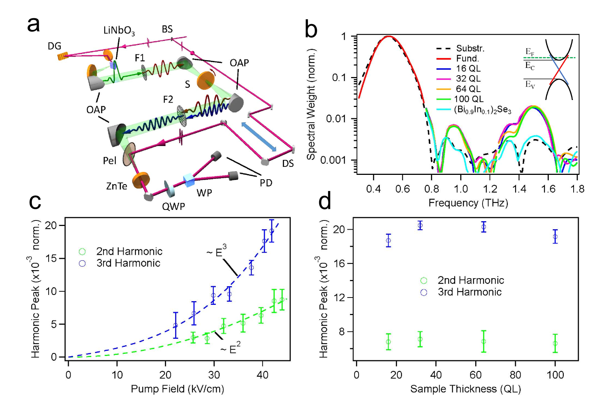

# 反転対称性の工学的破れと非線形光誘起電流：トポロジカル絶縁体Bi₂Se₃二層膜が拓くバルク光起電力効果の新地平

- **執筆日**: 2026-03-29
- **トピック**: 非線形光誘起電流（シフト電流・注入電流）のトポロジカル絶縁体二層膜における設計制御
- **タグ**: Electronic Structure / Nonlinear Response; Topological Properties / First-Principles Calculations
- **注目論文**: Vineet Kumar Sharma et al., "Engineering Nonlinear Optical Responses via Inversion Symmetry Breaking in Bilayer Bi₂Se₃," arXiv:2603.24834 (2026)
- **参照関連論文数**: 6本

---

## 1. なぜ今この話題なのか

太陽光発電の効率は、半導体 p-n 接合の設計が半世紀以上改良され続けてきたにもかかわらず、「Shockley-Queisser 限界」と呼ばれる理論的な壁（単接合で約 33%）を超えることができない。これは電子と正孔が界面で再結合する速さと、接合における内部電場の有限さによる本質的な制約だ。ところが近年、全く異なる原理に基づく光起電力メカニズムが強い注目を集めている。それが**バルク光起電力効果**（bulk photovoltaic effect; BPVE）である。BPVE では、材料内部の電子状態が持つ量子幾何学的な性質――より正確にはベリー位相に由来するシフトベクトルとベリー曲率の非対称性――が直接電流を生み出す。界面も接合も必要とせず、均一な光照射だけで直流電流が流れる。理論的な効率限界はShockley-Queisser を大幅に上回る可能性があり、新型光電変換材料の設計指針として脚光を浴びている。

BPVE の実現には一つの条件がある。材料が**反転対称性**を持たないこと、すなわち点群に反転操作 $i$ が含まれないことが必要である。なぜなら、反転対称性が存在すると2次非線形光学応答のテンソルが恒等的にゼロになってしまうからだ（後述の「基礎から理解する」節を参照）。この制約は材料選択の幅を大幅に狭める。自然界に存在する非中心対称結晶は限られており、しかも BPVE が十分大きく、かつ薄膜・デバイス実装に適した材料はさらに少ない。

ここに2D 材料・ファン・デル・ワールス（vdW）物質の視点が加わる。2D 材料は単層では積層に依存した対称性を持つが、二層・多層になると**積層方式によって対称性が劇的に変化する**ことが知られている。さらに最近、二つの層を相対的にひねって重ねる「モワレ工学」や、欠陥の導入、ゲート電場印加といった手法で、もともと中心対称な材料であっても反転対称性を破ることができると理解されてきた。2D 材料の BPVE研究は、MoS₂ や WS₂ などの遷移金属ダイカルコゲナイドを中心に急速に発展し、2025 年以降には理論・実験の両面で成果が相次いでいる。

そこにトポロジカル絶縁体（TI）の視点が加わると、さらに豊かな物理が現れる。Bi₂Se₃ に代表される TI は、バルクはバンドギャップを持つ絶縁体でありながら、表面にはトポロジーに保護されたディラック型のギャップレス状態が存在する。この表面ディラックフェルミオンは強いスピン軌道相互作用を持ち、量子幾何学的な性質が特に豊かである。バルク Bi₂Se₃ は空間群 $R\bar{3}m$（中心対称）であるが、**表面では反転対称性が自然に破れており**、非線形光応答が期待される。実際、2024 年に発表された実験研究（arXiv:2301.05271）は、Bi₂Se₃ 薄膜から THz 第二高調波が発生することを世界で初めて実証し、その起源が表面のディラックフェルミオンにあることを明らかにした。

しかし問題が残る。表面状態からの寄与はバルクの体積に比べて薄く、デバイスとして実用化するには出力が限られる。もしバルク全体に反転対称性の破れを誘起できれば、光応答を格段に増強できるはずだ。しかも Bi₂Se₃ の **二層膜**は電荷電荷の層間相互作用を保ちながら、その積層構造を操作することで対称性を系統的に制御できる良好なプラットフォームとなる。今回の注目論文（arXiv:2603.24834）は、まさにこの問いに正面から取り組み、三つの異なる手法で二層 Bi₂Se₃ の反転対称性を破り、シフト電流・注入電流の両者が既存のベンチマーク 2D 材料に匹敵する大きさになることを第一原理計算で示した。

---

## 2. この分野で何が未解決なのか

**問い①：中心対称な材料からどうやって BPVE を引き出すか**

自然界に存在する多くの結晶は反転対称性を持つ。MoS₂ 単層は非対称だが、二層にすると中心対称となる。Bi₂Se₃ も同様に、バルクでは中心対称だ。これらの「本来は BPVE が禁止されている材料」から非線形光応答を引き出す戦略が緊急に求められている。モワレ工学（ひねり角度制御）、ゲート電場印加、欠陥エンジニアリングが候補として挙げられているが、それぞれの有効性や実装可能性は材料ごとに大きく異なる。どのアプローチが最も有望かは、まだ統一的な理解がない。

**問い②：シフト電流と注入電流はどちらが支配的か、どう制御できるか**

BPVE には大きく分けてシフト電流と注入電流の二成分がある（詳細は第7節）。シフト電流は直線偏光で誘起され、ベリー接続のシフトベクトルに起源を持つ。注入電流は円偏光で誘起され、ベリー曲率の非対称性から生まれる。これらは異なる偏光状態に応答し、異なる材料パラメータで制御される。実際のデバイスではどちらが支配的かを正確に分離して把握することが、設計上不可欠だが、実験的に両者を分離することは難しい場合が多い。第一原理計算が果たす役割が大きい。

**問い③：トポロジカルな表面状態はバルクの BPVE にどの程度寄与するか**

Bi₂Se₃ の非線形応答の起源として、表面ディラック状態とバルクの寄与の割合は未解決問題である。実験（arXiv:2301.05271）は表面起源の証拠を示したが、二層膜では層間トンネルによってトポロジカル表面状態のギャップが開く場合がある。ひねりや欠陥を導入すると電子構造がさらに複雑になる。計算と実験の両面から、トポロジーと BPVE の関係を丁寧に紐解く必要がある。

**問い④：モワレ構造の電子物性をどこまで第一原理計算で信頼できるか**

ひねり二層（ツイスト二層）のモワレ超格子は、典型的に数百個のスーパーセル原子を含む大系になる。DFT 計算のコストが急増し、計算精度も落ちる。また、強い相関効果（Mott 絶縁体、強結合超伝導）が存在する系では DFT 自体の限界が顕在化する。Bi₂Se₃ はフェルミ流体として記述できる系ではあるが、ひねり角度によっては平坦バンドが現れ、相関効果の重要性が増す。計算精度の担保が今後の課題となっている。

---

## 3. 注目論文の核心：何が前進し、何がまだ仮説か

### 問いの設定

Sharma らの研究（arXiv:2603.24834）は、第一原理計算（DFT）と実空間ワニエ関数を用いて、**二層 Bi₂Se₃ における三通りの反転対称性破れ手法**を系統的に比較した最初の研究である。計算には Vienna ab-initio Simulation Package（VASP）を用い、非線形伝導度テンソルの計算には WannierBerri コードを使っている。スピン軌道相互作用（SOC）は全ての計算に含まれている。

今回の問いは明快だ：「もともと中心対称な二層 Bi₂Se₃ の反転対称性を三つの手法（ひねり、電場、点欠陥）で破ったとき、シフト電流・注入電流はどの程度の大きさになり、それぞれの特徴はどう異なるか？」

*図1：（上段）ひねり二層 Bi₂Se₃ のモワレ超格子構造。ひねり角 21.78° では √7 倍の超格子が形成され、70 個の原子を含む非中心対称空間群 P312（D₃点群）になる。（下段）ベリー曲率双極子（BCD）の概念図と光起電力電流の模式図。反転対称性の破れにより BCD が有限となり、円偏光（注入電流）および直線偏光（シフト電流）に応答した直流電流が生じる。[arXiv:2603.24834, CC BY 4.0]*

### 三つの対称性破れ手法と主要結果

**手法①：ひねり二層（モワレ工学）**

21.78° のコンメンシュレートひねり角（整数ペア n=21, m=−20）では、ユニットセルが元の格子定数の √7 倍に拡大し、点群は D₃（空間群 P312 #149）に属する。これは非中心対称であるため BPVE が許容される。バンドギャップは 0.18 eV（間接バンドギャップ）で、Γ 点付近に **Rashba 型のスピン分裂**が出現する。これは反転対称性の破れによってスピン軌道相互作用がバンドを持ち上げる現象であり、有限のベリー曲率双極子（BCD）の存在を示す。

非線形光電流テンソルの対称性から、3 回回転対称（C₃z）により $\sigma_{Xxx} = -\sigma_{Xxy} = -\sigma_{Xyx} = -\sigma_{Xyy}$ といった等価関係が成立する。計算結果として：
- シフト電流：$|\sigma_{Xyz}|$ のピーク値 **14 nm·μA/V²**（光子エネルギー約 3 eV 付近）
- 注入電流：$|\eta_{Xyz}|$ のピーク値 **104 × 10⁸ nm·A/V²·s⁻¹**（約 1.7 eV 付近）

特に注入電流については $\eta_{Xyz} = -\eta_{Xzy}$ の関係が成り立ち、左右円偏光を切り替えることで電流の向きが反転する「らせん依存電流」が実現する。これは光の角運動量で電流の方向を制御できることを意味し、光スイッチとしての応用が期待される。

*図2：（a）ひねり角 21.78° の二層 Bi₂Se₃ バンド構造。Γ 点付近の Rashba 型スプリッティングが明瞭。（b）ベリー曲率 Ω_xy の分布。（c）シフト電流伝導度スペクトル。峰値は $-14$ nm·μA/V²。（d）注入電流伝導度スペクトル。峰値は $104 \times 10^8$ nm·A/V²·s⁻¹。[arXiv:2603.24834, CC BY 4.0]*

**手法②：外部電場印加**

c 軸方向に電場 $E_z$ を印加することで空間群が P3m1（#156）に変化し、中心対称性が破れる。電場は 10 meV/Å から 40 meV/Å まで系統的に変化させた。Rashba 型スプリッティングと有限 BCD が電場の増加とともに強くなる。

非線形応答は電場依存性を示し、$E_z = 40$ meV/Å において：
- シフト電流：$|\sigma_{Yyy}|$ のピーク値 **28 nm·μA/V²**（約 1.7 eV）
- シフト電流：$|\sigma_{Zxx}|$ のピーク値 **27 nm·μA/V²**
- 注入電流：$|\eta_{Xxz}|$ のピーク値 **64 × 10⁸ nm·A/V²·s⁻¹**

特に重要な特性として、**シフト電流の符号は電場の向きに依存して反転する**が、**注入電流の符号は電場方向に依存しない**という非対称な対称性を持つことが明らかにされた。これはシフト電流と注入電流がそれぞれ時間反転（T）と空間反転（P）に対して異なる変換性を持つことの帰結であり、電場方向を切り替えることで両者の寄与を実験的に分離できる可能性を示す。

*図3：（a）$E_z = 40$ meV/Å でのバンド構造と Rashba スプリッティング。（b）ベリー曲率双極子の分布。（c）各電場強度でのシフト電流スペクトル。電場増大とともに応答が強くなる。（d）注入電流スペクトルの二重ピーク構造（赤外域 1.4〜2.2 eV）。[arXiv:2603.24834, CC BY 4.0]*

**手法③：点欠陥導入**

2×2×1 スーパーセルに三種類の点欠陥を導入した。Se 空孔（V_Se）、SeBi 反サイト（Se 位置を Bi が占有）、BiSe 反サイト（Bi 位置を Se が占有）であり、欠陥濃度はいずれも 4〜6% 程度だ。全ての欠陥タイプで空間群は P3m1（#156）となり、Rashba スプリッティングと有限 BCD が出現する。さらに驚くべきことに、全欠陥ケースで**半導体から金属へのキャリア充填変化（金属化）** が起きる。

金属的な電子構造にもかかわらず、BPVE は消えない。実際、Se 空孔（V_Se）のケースでは最も大きな応答が得られた：
- シフト電流：$|\sigma_{Yyy}|$ のピーク値 **190 nm·μA/V²**（約 0.2 eV、赤外域）
- 注入電流：$|\eta_{Xxz}|$ のピーク値 **170 × 10⁸ nm·A/V²·s⁻¹**

V_Se が最大の応答を示す理由は、Se 空孔がフェルミ準位付近の電子構造を特に大きく変形させ、複数の価電子帯→伝導帯間の光学遷移が広いエネルギー範囲にわたって有限の BPVE 応答に寄与するためと解釈されている。ただしこの解釈はまだ定性的な理解であり、欠陥濃度・配置による応答の変動幅については今後の計算・実験が必要である。

*図4：（a〜c）三種類の欠陥超格子構造。（d〜f）対応するバンド構造（全てのケースで金属化と Rashba スプリッティングを確認）。（g）シフト電流スペクトルの比較。V_Se（赤）が最大応答を示す。（h）注入電流スペクトルの比較。[arXiv:2603.24834, CC BY 4.0]*

### ベンチマークとの比較と意義

論文中の Table 1 では、三手法の結果を GeS のデータ（$\sigma \approx 100$ nm·μA/V²、$\eta \approx 100$〜$1000 \times 10^8$ nm·A/V²·s⁻¹）と比較している。GeS は 2D BPVE 材料のベンチマークとして広く参照される天然非中心対称半導体である。ひねり二層（14 nm·μA/V²）と電場印加（28 nm·μA/V²）は GeS のシフト電流より小さいが、欠陥導入（190 nm·μA/V²）は GeS に迫る値となっている。注入電流については全ての手法が GeS の下端範囲（$100 \times 10^8$ nm·A/V²·s⁻¹）と同等かそれ以上の値を示す。

この結果が前進を意味する点は三つある。第一に、単一材料系（Bi₂Se₃ 二層）で三手法を同一条件で系統比較した初めての理論研究であること。第二に、ひねり・電場・欠陥というまったく異なる機構が同じ物理的原理（反転対称性の破れ → Rashba 分裂 → 有限 BCD）につながることを示した点。第三に、欠陥導入が金属化を伴いながらも BPVE を減じないことを明示し、欠陥エンジニアリングを新たな設計自由度として提示した点である。

一方、まだ仮説段階にあることも多い。欠陥配置の均一性や相互作用効果、実際の成長過程で生じる欠陥分布は計算よりはるかに複雑だ。ひねり二層については、ひねり角度の精密制御がどこまで実験室で実現可能かという問題も残る。また、BaTiO₃ での研究（arXiv:2601.01059）が示すように、フォノン散乱が shift current に対して同等かそれ以上の寄与をする場合があるが、今回の計算はそのような非調和散乱を含んでいない。

---

## 4. 背景と研究史：この論文はどこに位置づくか

### バルク光起電力効果の理論的基盤

BPVE の概念自体は 1970 年代に遡る。強誘電体 BaTiO₃ や LiNbO₃ で「バルクから直流光電流が流れる」現象が観測され、p-n 接合によらない光起電力効果として注目された。しかし理論的な土台が整備されたのはずっと後のことだ。2000 年代以降、シフト電流がベリー接続（Berry connection）とその k 空間微分であるシフトベクトルによって書けることが明らかになり（Sipe & Shkrebtii 2000 年の理論）、注入電流がベリー曲率の対称性破れに起因することが示された。これにより BPVE が量子幾何学の言葉で統一的に記述できるようになった。

Haldane モデル（ハニカム格子のトポロジカルモデル）での BPVE の計算（arXiv:2508.12414）は、この幾何学的理解を最も端的に示す。Lin と Hsu は、シフト電流がトポロジカル相転移点で**符号反転する**のに対し、注入電流は符号を変えないことを示した。さらに、BZ（ブリルアンゾーン）中のシンプレクティック接続のベクトル場がトポロジカル相では渦構造を持つのに対し、トリビアル相では持たないことを発見した。これは BPVE が量子トポロジーの直接プローブになりうることを示唆する重要な結果である。二層 Bi₂Se₃ もトポロジカル絶縁体であり、この文脈に自然に位置づく。

*図：Haldane モデルにおけるシフト電流伝導度（青：トポロジカル相、橙：トリビアル相）。位相境界を越えるとシフト電流が符号反転する一方、注入電流は符号を変えない。この振る舞いはシンプレクティック接続のトポロジーと直結している。[arXiv:2508.12414, CC BY 4.0]*

### Bi₂Se₃ 表面状態での実験的証拠

トポロジカル絶縁体での非線形光応答の実験的基盤を提供したのが、Stensberg らの研究（arXiv:2301.05271、Phys. Rev. B 2024）である。彼らは Bi₂Se₃ 薄膜（100 QL）に対して THz 発光分光（THz emission spectroscopy）と時間領域 THz 分光法（TDTS）を組み合わせ、変換効率約 0.005% の THz 第二高調波発生（THz-SHG）を世界で初めて確認した。

重要な知見は三つある。第一に、この SHG 信号が**膜厚に依存しない**ことで、バルクではなく表面からの寄与であることが確認された。第二に、In ドープにより表面状態を消したサンプルでは信号がゼロになり、ディラックフェルミオンの表面状態が SHG の起源であることが実証された。第三に、信号は「ドメインの非対称性」（約 1.5:1〜1.8:1 のドメイン比率）によって生じており、完全に均質なサンプルでは SHG がキャンセルしてしまうことを意味する。

*図：Bi₂Se₃（青）と In ドープ Bi₂Se₃（橙）の THz-SHG スペクトル比較。表面状態を抑制した In ドープサンプルでは信号がゼロになり、THz-SHG の起源がトポロジカル表面のディラックフェルミオンであることを実証している。[arXiv:2301.05271, CC BY 4.0]*

この実験結果と今回の理論論文（2603.24834）との関係は補完的である。Stensberg らの実験は表面状態が BPVE の起源となることを示したが、その応答量はデバイス応用には小さい。Sharma らの計算は、二層膜のバルク全体に対称性破れを導入することで応答をはるかに増強できることを理論的に示した。次のステップとして、対称性を工学的に破った二層 Bi₂Se₃ で THz-SHG や光電流を実験測定することが自然な展開となる。

### 第一原理計算の方法論的進化

非線形光応答の第一原理計算は近年急速に高精度化している。従来の手法は光励起だけを考慮していたが、Yu らの研究（arXiv:2601.01059）は**実時間密度行列（FPDMD）法**を用いてフォノン散乱をその中に取り込んだ。この手法を BaTiO₃ に適用したところ、フォノン媒介のシフト電流が励起電流と同等かそれ以上になることが示された。さらに実験観測との一致が向上した。

今回の Sharma らの計算はこの散乱効果を含んでいないため、欠陥ケースや金属状態での結果の定量的信頼性にはまだ改善の余地がある。特に金属的なV_Se ドープ系では、キャリア散乱が非線形応答を抑制する可能性が無視されている。フォノン・不純物散乱を含む計算との比較が今後必要だ。

---

## 5. どの解釈が最も妥当か：証拠・比較・限界

### Rashba 分裂 → BCD → BPVE の因果連鎖

三つのアプローチに共通して現れるメカニズムは、「反転対称性の破れ → Rashba スピン分裂 → ベリー曲率双極子（BCD）の有限化 → BPVE」という因果連鎖である。この連鎖の物理的妥当性は高い。Rashba 効果はスピン軌道相互作用と反転対称性の破れが共存するとき、$k$ 空間でスピン縮退がリフトされる現象で、Bi₂Se₃ のような重元素系では SOC が強く効く。BCD は k 空間でのベリー曲率の「重心のずれ」を表し、これが有限であることが第二次非線形Hall 効果や注入電流の必要条件となる。

計算では全ての手法で BCD が有限の値を持つことが確認されており、それぞれの手法でバンド構造が変化しながらも共通の物理機構が働いていることが示されている。この解釈を支持するさらに強い証拠として、電場方向を反転させるとシフト電流の符号が入れ替わる（B-field reversal behavior に類似）という結果がある。これはシフト電流が時間反転対称性を保ちながら空間反転 P 対称性を要求する現象であることと整合する。

### B 場制御との比較：異なるアプローチが同じ材料で

Li らの研究（arXiv:2602.12553）は、Bi₂Se₃ 表面状態に垂直磁場を印加し Landau 準位が形成される状況でのシフト電流を計算した。興味深いことに、純粋な円偏光では C₃ 対称性の制約によりシフト電流がゼロになり、楕円偏光が必要となる。また応答のピーク位置は磁場 $B$ に対して $\sqrt{B}$ でスケールし（サイクロトロンエネルギーに比例）、磁場強度で周波数を調整できる「チューナブル」な性質を持つ。

今回の注目論文（Sharma ら）との対比で言えば、磁場制御は外部自由度（B）を使って応答を連続的に調整できる一方、工学的対称性破れ（ひねり・電場・欠陥）は**材料自体の対称性を固定的に変える**アプローチである。応用の観点からは後者の方が電力消費が少なくコンパクトなデバイスに適しているが、製造精度の要求も高い。どちらが最終的に実用的かは、要求されるデバイス特性による。

### PT 対称反強磁性体の「隠れた BCD」との比較

Chen らの研究（arXiv:2510.23971）は、PT 対称の反強磁性絶縁体（層状 AFM）において「隠れた BCD」が存在し、非線形層ホール効果を生じることを予測した。この系では全体の BCD がゼロでも（PT 対称性から）、個々の層では BCD が有限で向きが逆に揃っている。垂直電場をかけることで PT 対称性を破り、その隠れた BCD が顕在化する。

Bi₂Se₃ 二層膜との類似点と相違点を整理すると：
類似点は「電場印加で PT 類似の対称性を破り BPVE が現れる」という機構的な共通性にある。相違点は、Chen らの系は絶縁性 AFM で純粋なバルク効果を議論しているのに対し、Bi₂Se₃ 二層はトポロジカル絶縁体であり表面/バルクの両方の寄与が絡み合う点だ。また Chen らの研究は BCD 起源の注入電流と量子距離双極子（QMD）起源の項を区別する方法論を提示しており、Bi₂Se₃ 系でも将来的に同様の分離が重要になると考えられる。

### 限界と未解決点

最も大きな限界は**欠陥系の定量的信頼性**である。4〜6% の高濃度欠陥を単純なスーパーセルでモデル化した場合、欠陥間の相互作用やランダム分布の効果が無視されている。現実の薄膜では欠陥の分布は一様でなく、クラスタリングも起こりうる。実験的には、MBE 成長した Bi₂Se₃ 薄膜での Se 空孔濃度の精密制御は難しく、計算と実験を定量的に比較することは現時点では容易でない。

もう一つの未解決点はトポロジカル保護との関係だ。二層 Bi₂Se₃ は層間トンネルによって表面ディラック状態にギャップが開く可能性がある。ひねり二層ではどうか？ 欠陥があるときのトポロジカル表面状態の安定性は？ これらの問いは計算では部分的に答えられるが、STM/STS による実験での確認が最終的な証拠となる。

---

## 6. 何が一般化できるのか：材料・手法・応用への広がり

### 磁性 2D 材料への展開：非揮発的な制御

Zhou らの研究（arXiv:2603.03670）は、CrNBr₂ 単層マルチフェロイクス材料において BCD が強誘電分極の反転で非揮発的にスイッチできることを計算で示した。CrNBr₂ は強磁性と強誘電性を同時に持ち、強誘電分極の向きを変えることで非線形ホール効果と円二色性光誘起電流（circular photogalvanic current）を電気的に制御できる。これは Bi₂Se₃ 二層での電場制御と概念的に類似しているが、強誘電的な双安定性により外部電場を切ってもスイッチ状態が保持される点が大きな違いだ。

Bi₂Se₃ の場合は、現時点では電場を常時印加し続ける必要があり、非揮発性がない。しかし、BaTiO₃ などの強誘電体の薄膜とヘテロ構造を形成することで強誘電近接効果によって Bi₂Se₃ に反転対称性破れを導入できる可能性があり、この方向の研究が期待される。

### 設計原理の一般化

今回の研究から引き出せる設計指針は次のように一般化できる。まず、**中心対称な vdW 二層を出発点として、ひねり・電場・欠陥の三手法で反転対称性を破ることは普遍的な戦略**である。Bi₂Se₃ に限らず、MoS₂ 二層、MnBi₂Te₄ 二層など他の vdW 材料でも同じ手法が適用できる。次に、**Rashba 分裂の強さ（SOC の大きさと反転対称性破れの大きさの積）が BPVE の大きさを決める**という定性的規則がある。重元素系（Bi, Pb, Sn を含む系）は SOC が強く、有利である。

計算方法論としては、今後 Yu らの FPDMD 法（arXiv:2601.01059）のような散乱効果を含む第一原理計算との統合が必須となる。また、機械学習ポテンシャルを活用してより大きな欠陥スーパーセルを扱う計算も有望な方向性だ。

### THz デバイスと光起電力への波及

注入電流が THz 域に強い応答を持つことは（特に電場印加ケース）、Bi₂Se₃ 二層膜が超高速 THz フォトディテクタや THz 発振器の材料候補になることを示す。従来の THz デバイスには InGaAs などの III-V 族半導体が多く使われるが、vdW 材料は原子層の厚さとゲート制御性が優位性となりうる。さらに、ひねり角度を変えることでバンドギャップと光吸収端を調整できるため、広帯域な光応答のチューニングが原理的に可能だ。

---

## 7. 基礎から理解する

### 反転対称性と非線形光学応答の関係

光電場 $\mathbf{E}(\omega)$ に対する電流応答を次数展開で書くと、

$$J_a(\omega) = \sigma^{(1)}_{ab}(\omega) E_b(\omega) + \sigma^{(2)}_{abc}(\omega, \omega') E_b(\omega) E_c(\omega') + \cdots$$

第一項が線形光学（通常の光吸収・反射）、第二項が二次の非線形光学応答（SHG、シフト電流、注入電流など）に対応する。ここで重要な対称性の制約がある。材料が反転対称性 $\mathbf{r} \to -\mathbf{r}$ を持つとき、電流は奇数ランクのテンソル量であり、$J_a \to -J_a$ となる。一方、電場も $E_b \to -E_b$ と変換される。これを $\sigma^{(2)}_{abc}$ の変換に代入すると、$\sigma^{(2)}_{abc} = -\sigma^{(2)}_{abc}$ となり、**結果として $\sigma^{(2)} = 0$** が要求される。つまり**反転対称性のある系では二次非線形光学応答は恒等的にゼロ**である（電気双極子近似の範囲）。

これが Bi₂Se₃ 二層の問題の出発点だ。バルク二層は D₃d 点群（中心対称）に属し、BPVE がゼロ。反転対称性を何らかの手段で破ることで初めて有限の BPVE が現れる。

### シフト電流：ベリー接続と「電荷の実空間シフト」

直線偏光に応答する定常直流電流（shift current）は次式で与えられる：

$$J_a^{\rm shift}(\omega) = \sigma^S_{abc}(\omega) E_b E_c^*$$

ここで shift current 伝導度テンソルは

$$\sigma^S_{abc}(\omega) = -\frac{\pi e^3}{\hbar^2} \sum_{nm,\mathbf{k}} f_{nm} R_{mn}^a(\mathbf{k}) |r_{mn}^b|^2 \delta(\varepsilon_{mn} - \hbar\omega)$$

と書ける。$f_{nm} = f_m - f_n$ はフェルミ因子の差、$r_{mn}^b = \langle m | \hat{r}_b | n \rangle / i(\varepsilon_m - \varepsilon_n) \cdot \hbar$ は遷移行列要素（ベリー接続）、$R_{mn}^a(\mathbf{k}) = \partial_a \phi_{mn}(\mathbf{k}) - A_m^a(\mathbf{k}) + A_n^a(\mathbf{k})$ が**シフトベクトル**である。

シフトベクトルの物理的意味は「光吸収によって電子が価電子帯から伝導帯へ遷移するときに、実空間で波束の重心がどれだけシフトするか」を表す量だ。このシフトは可逆でなく、系全体として電荷の偏りを生み出す。反転対称性があるとシフトベクトルが k について奇関数になり BZ 積分がキャンセルするが、反転対称性が破れると有限の積分値が残る。

この「電荷シフト」の描像は、光が照射されると電子が一方向に実空間を移動するというイメージで理解しやすい。太陽光が当たると電子が「流れる」わけで、これは p-n 接合の界面電場による分離と根本的に異なるメカニズムである。

### 注入電流：ベリー曲率とらせん光

円偏光に応答する注入電流（injection current）は、光子のエネルギーと角運動量によって電子が特定のバンドに選択的に注入され、速度の非対称性が電流を生む現象だ。その伝導度テンソルは：

$$\partial_t J_a^{\rm inj} = \eta_{abc}(\omega) E_b E_c^*$$

となり、実際は定常ではなく**電流が時間とともに成長する**（ゆえに "injection" と呼ばれる）。$\eta_{abc}$ はベリー曲率 $\Omega_n^a(\mathbf{k})$ の不均等分布（非対称性）に由来する：

$$\eta_{abc}(\omega) \propto \sum_{nm,\mathbf{k}} f_{nm} \left( v_{mm}^a - v_{nn}^a \right) \Omega_{nm}^a \delta(\varepsilon_{mn} - \hbar\omega)$$

ここで $v_{nn}^a$ はバンド $n$ の群速度、$\Omega_{nm}^a$ は遷移に関連したベリー曲率的量だ。左右円偏光では $\eta_{abc}$ の符号が反転し、電流の向きが逆転する（ヘリシティ依存性）。これが二層 Bi₂Se₃ で観測された $\eta_{Xyz} = -\eta_{Xzy}$ 関係の物理的意味だ。

### ベリー曲率双極子（BCD）と非線形ホール効果

時間反転対称性を持ちながら空間反転対称性がない系（例：Rashba 系）では、ベリー曲率 $\Omega_n(\mathbf{k})$ が $\mathbf{k}$ 空間で一様でなく分布する。その「重心のずれ」を表す量がベリー曲率双極子：

$$D_{ab} = \int \frac{d^k k}{(2\pi)^d} \sum_n f_n \partial_{k_a} \Omega_n^c(\mathbf{k})$$

である。BCD が有限のとき、直流電場 $E_b$ の二乗に比例した横方向電流（非線形ホール電流）$J_a \propto D_{ab} E_b^2$ が流れる。これは非線形ホール効果の起源であり、BCD の存在は「注入電流が流れうること」の指標にもなる。

Rashba 系では $\Omega_n(\mathbf{k})$ が $\mathbf{k}$ 空間で非対称（$-\mathbf{k}$ 点では符号が反転）になるため BCD が有限となる。今回の計算で全ての対称性破れ手法でRashba 分裂が確認され、それに対応して BCD が有限になることが電子構造計算で示されている。

### Bi₂Se₃ のトポロジカル表面状態と BPVE の接点

Bi₂Se₃ は $\mathbb{Z}_2$ トポロジカル絶縁体の代表例で、バルクバンドギャップ約 0.3 eV を持ち、表面には Γ 点を中心とするディラック型の表面状態が存在する。表面ハミルトニアンは単純化して

$$H_{\rm surf} = \hbar v_F (\mathbf{k} \times \hat{z}) \cdot \boldsymbol{\sigma} + m(k) \hat{\sigma}_z$$

と書ける（$v_F$：フェルミ速度、$m(k)$：k 依存質量）。 $m=0$ のとき完全なディラック点が現れる。この表面状態はスピン方向と運動量方向が固定（スピン-運動量ロッキング）されており、強い非線形光学応答の源泉となる。特に時間反転が破れていない状態でも、**表面の反転対称性の欠如**が二次非線形応答を許容する。

バルク二層膜に対称性破れを導入した場合、バルク全体の BPVE が表面状態起源の BPVE を圧倒する可能性が高い。Sharma らの計算は全体（バルク+表面合計）の応答を評価しており、その結果の大きさ（V_Se で 190 nm·μA/V²）はほぼバルク起源と理解されている。実験では、欠陥なしサンプルと欠陥ありサンプルを比較することで表面とバルクの寄与を分離できる可能性がある。

---

## 8. 重要キーワード 10 個

**① バルク光起電力効果（Bulk Photovoltaic Effect, BPVE）**
均一な光照射のみで、p-n 接合なしに直流電流が生じる現象。材料の非中心対称性が条件で、シフト電流と注入電流の二成分からなる。Shockley-Queisser 限界に縛られず、理論的には高効率光電変換が可能。

**② シフト電流（Shift Current）**
直線偏光光の照射下で生じる光誘起定常電流。光遷移における電子の実空間シフト（シフトベクトル $R_{mn}^a$）に起因する。ベリー接続の変化から計算できる量で、フェルミ面より内側の電子状態全体の幾何学を反映する。金属・半導体の両方で現れうる。

**③ 注入電流（Injection Current）**
円偏光（または楕円偏光）の照射下で生じる光誘起電流。左右円偏光を切り替えると電流の向きが反転する「ヘリシティ依存性」が特徴。ベリー曲率の k 空間非対称分布から生まれ、励起電子の群速度の不均衡が電流の起源となる。

**④ ベリー曲率双極子（Berry Curvature Dipole, BCD）**
$D_{ab} = \int \frac{d^dk}{(2\pi)^d} \sum_n f_n \partial_{k_a} \Omega_n^c(\mathbf{k})$ で定義される。時間反転対称性がある非中心対称系でゼロでない値をとり、非線形ホール効果や注入電流の大きさを決める重要指標。WTe₂ での非線形ホール効果観測（2019年、Science）で注目が集まった。

**⑤ ラシュバ効果（Rashba Effect）**
スピン軌道相互作用（SOC）と反転対称性の破れが共存する系で、$\mathbf{k}$ 点でのスピン縮退がリフトされ、スピン方向と運動量方向が対応する現象。ハミルトニアンは $H_R = \alpha_R (\hat{z} \times \mathbf{k}) \cdot \boldsymbol{\sigma}$ で表される。$\alpha_R$ がラシュバパラメータで、原子番号の大きい元素系（Bi、Pb 等）では大きい。有限 BCD の発現に直接関係する。

**⑥ モワレ工学（Moiré Engineering）**
van der Waals 二層の相対ひねり角を制御して、長周期のモワレ超格子を形成する手法。ひねり角によって対称性、バンド構造（平坦バンドの出現など）、電子相関が劇的に変化する。魔法角ツイスト二層グラフェン（MATBG）での強い相関超伝導の発見（2018年）以来、急速に発展した。

**⑦ ベリー接続とシフトベクトル（Berry Connection and Shift Vector）**
ブロッホ波動関数 $|u_{n\mathbf{k}}\rangle$ に対してベリー接続は $A_n^a(\mathbf{k}) = -i \langle u_{n\mathbf{k}} | \partial_{k_a} u_{n\mathbf{k}} \rangle$ で定義される。シフトベクトル $R_{mn}^a = \partial_{k_a} \phi_{mn} - A_{mm}^a + A_{nn}^a$（$\phi_{mn}$：遷移行列要素の位相）は、バンド間遷移において電子波束が実空間で移動する距離を表す。シフト電流の強度は $|R_{mn}|^2$ に比例する。

**⑧ 量子幾何テンソル（Quantum Geometric Tensor）**
$Q_{ab}^n(\mathbf{k}) = \langle \partial_{k_a} u_{n\mathbf{k}} | (1 - P_n) | \partial_{k_b} u_{n\mathbf{k}} \rangle$ で定義される量。実部が量子距離（量子メトリック）$g_{ab}^n = \text{Re}[Q_{ab}^n]$、虚部がベリー曲率 $\Omega_{ab}^n = -2 \text{Im}[Q_{ab}^n]$ となる。量子幾何テンソルは超伝導超流体剛性、非線形ホール効果、シフト電流のいずれにも関与し、「量子幾何による物性統一理解」の基盤となっている。

**⑨ トポロジカル絶縁体（Topological Insulator, TI）**
時間反転対称性で保護された $\mathbb{Z}_2$ トポロジカル不変量を持つ絶縁体。バルクはバンドギャップを持ちながら、表面（または端）に時間反転対称性で保護されたギャップレスの金属状態が存在する。Bi₂Se₃ は代表例で、表面のディラックコーンはスピン-運動量ロッキングを持つ。非線形光学応答の文脈では、表面ディラック状態が強い BPVE の起源となりうる。

**⑩ 第一原理（DFT）+ ワニエ関数法**
密度汎関数理論（DFT）計算で電子構造を求め、それをワニエ関数基底に射影して最局在ワニエ関数（MLWF）を構成する手法。ワニエ基底に変換することで $\mathbf{k}$ 空間内の細密なメッシュ計算が可能になり、ベリー曲率・シフトベクトルなどの非線形応答テンソルを高精度で計算できる。本研究では VASP → VASP2WANNIER90 → WannierBerri のパイプラインが用いられた。

---

## 9. おわりに：何が分かり、何がまだ残っているのか

今回の研究（arXiv:2603.24834）によって確度高く言えることは、「二層 Bi₂Se₃ という中心対称な系に三つの手法（ひねり・電場・欠陥）のいずれかで反転対称性を破ると、シフト電流・注入電流ともに既存の2Dベンチマーク材料（GeS）と同等以上の BPVE 応答が計算で得られる」という点だ。特に Se 空孔欠陥系のシフト電流（190 nm·μA/V²）と注入電流（170 × 10⁸ nm·A/V²·s⁻¹）は実用的な光電変換デバイスへの道を示している。また、電場方向によるシフト電流の符号反転、円偏光によるヘリシティ制御という機能的特性は、単なる光起電力材料を超えた「光スイッチ」や「THz 素子」としての可能性を示唆する。

一方、確定していないことも多い。第一に、欠陥エンジニアリングの実験的実現：計算では理想的な単一欠陥タイプを仮定しているが、現実の薄膜では多種欠陥の共存と不均一分布が避けられず、それが BPVE に与える影響は未評価だ。第二に、フォノン散乱の寄与：Yu らの FPDMD 法が示すようにフォノン媒介シフト電流が無視できない場合があり、金属化した欠陥系での散乱効果の評価が必須となる。第三に、トポロジカル表面状態との役割分担：対称性を工学的に破ったときの表面状態の安定性と、バルク BPVE との相互作用は STM/STS 実験で検証が必要だ。今後 1〜3 年で最も注目すべき展開は、制御された Se 空孔濃度を持つ Bi₂Se₃ 二層薄膜の合成と、それを用いた光電流・THz 発光実験の実施だろう。また、強誘電薄膜との複合ヘテロ構造で非揮発的な BPVE スイッチングが実現できるかどうかも重要な論点になる。

---

## 参考論文一覧

1. **[anchor]** Vineet Kumar Sharma, Alana Okullo, Barun Ghosh, Arun Bansil, and Sugata Chowdhury, "Engineering Nonlinear Optical Responses via Inversion Symmetry Breaking in Bilayer Bi₂Se₃," arXiv:2603.24834 (2026). [CC BY 4.0]

2. Jonathan Stensberg et al., "Observation of terahertz second harmonic generation from Dirac surface states in the topological insulator Bi₂Se₃," arXiv:2301.05271; Phys. Rev. B **109**, 245112 (2024). [CC BY 4.0] — 実験的背景：Bi₂Se₃ 表面での THz-SHG 初観測

3. Bo-Xin Lin and Hsiu-Chuan Hsu, "Bulk photovoltaic effects in the Haldane model," arXiv:2508.12414 (2025). [CC BY 4.0] — 背景・理論：トポロジカル相転移とシフト電流の符号反転

4. Junting Yu, Andrew Grieder, Jacopo Simoni, Ravishankar Sundararaman, Aris Alexandradinata, and Yuan Ping, "Photogalvanic currents from first-principles real-time density-matrix dynamics," arXiv:2601.01059 (2026). [CC BY 4.0] — 方法論比較：フォノン散乱を含む第一原理フレームワーク

5. Haoyu Li, Kainan Chang, Wang-Kong Tse, and Jin Luo Cheng, "Photogalvanic Effects in Surface States of Topological Insulators under Perpendicular Magnetic Fields," arXiv:2602.12553 (2026). [CC BY 4.0] — 比較：磁場制御による Bi₂Se₃ 表面 BPVE のチューニング

6. Zhuo-Hua Chen, Hou-Jian Duan, Ming-Xun Deng, and Rui-Qiang Wang, "Nonlinear Layer Hall Effect and Detection of the Hidden Berry Curvature Dipole in PT-Symmetric Antiferromagnetic Insulators," arXiv:2510.23971 (2025). [CC BY 4.0] — 比較：PT 対称系の隠れた BCD と非線形層ホール効果

7. Wenzhe Zhou, Dehe Zhang, Guibo Zheng, Yinheng Li, and Fangping Ouyang, "Nonvolatile Control of Nonlinear Hall and Circular Photogalvanic Effects via Berry Curvature Dipole in Multiferroic Monolayer CrNBr₂," arXiv:2603.03670 (2026). [CC BY-NC-ND 4.0] — 波及：強誘電制御による非揮発的 BCD スイッチング
