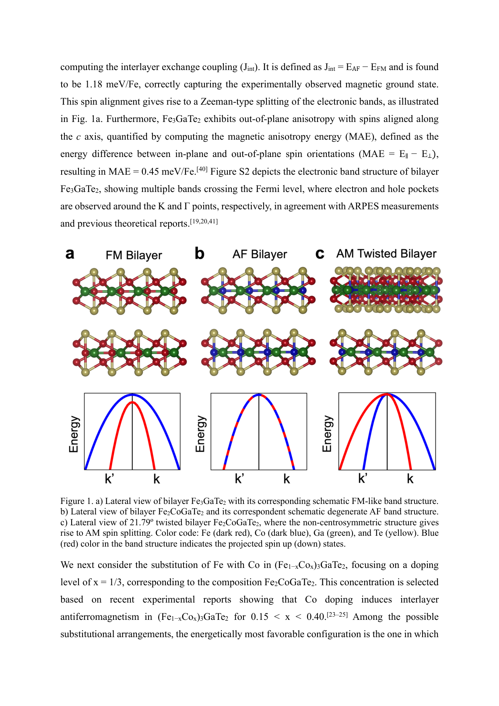
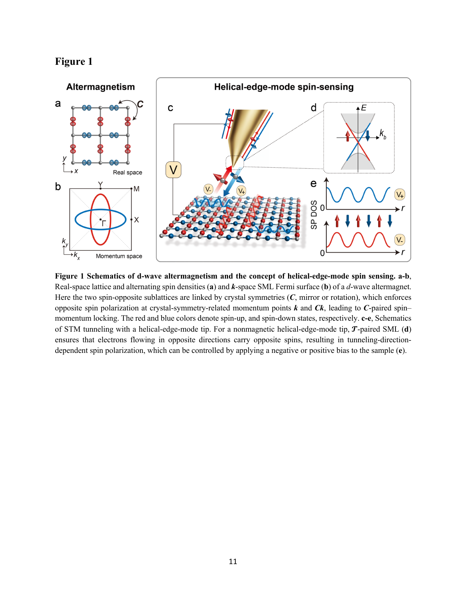
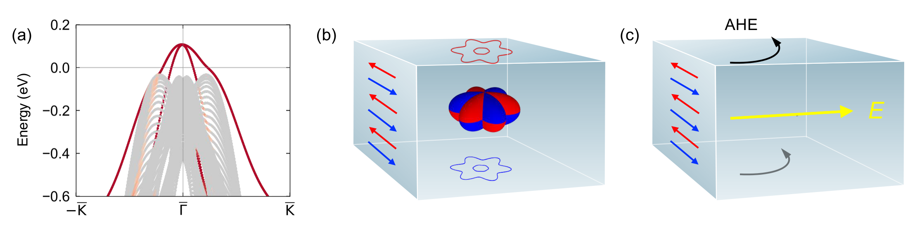
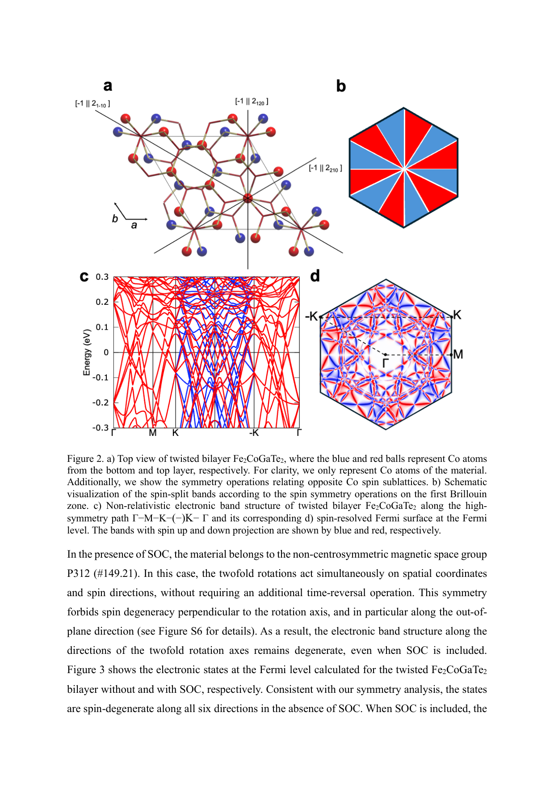

# 相関駆動軌道秩序が拓く2次元金属アルター磁性：スピン縮退を自発的に解く新機構

- **執筆日**：2026-03-29
- **トピック**：軌道秩序によって自発的に発現するアルター磁性の新機構と、単層YbMn₂Ge₂における大きなスピン分裂および電気的に制御可能なスピン伝導
- **タグ**：Electronic Structure / Orbital Physics; Charge, Orbital, and Spin Order / First-Principles Calculations; Monte Carlo
- **注目論文**：Nirmalya Jana, Atasi Chakraborty, Anamitra Mukherjee, Amit Agarwal, "Correlation-Driven Orbital Order Realizes 2D Metallic Altermagnetism," arXiv:2603.25426 (2026)
- **参照関連論文数**：6本

---

## 1. なぜ今この話題なのか

磁性体のスピン自由度を情報担体として利用するスピントロニクスは、従来の電荷に基づくエレクトロニクスを大きく超える可能性を秘めた研究分野だ。特に、ゼロ磁場かつゼロ正味磁化の条件でスピン分極したキャリアを生み出せる物質は、磁気ノイズへの耐性が高く、超高速・超低消費電力の磁気デバイスへの応用が期待されている。こうした観点から近年、**アルター磁性（altermagnetism）** という新しい磁気秩序相が注目を集めている。

アルター磁性体は、反強磁性体でありながらスピン縮退が解けた電子バンド構造を持つ。すなわち、正味の磁化はゼロであるにもかかわらず、運動量空間において上向きスピンと下向きスピンのバンドが大きく分離している。この性質は通常の強磁性体とも従来の反強磁性体とも異なる第三のカテゴリーを形成する。2022年以降の理論的整理（Šmejkal ら）に続き、MnTeやCrSbなど複数の材料での実験的確認が相次ぎ、分野は急速に拡大している。

しかしながら、既知のアルター磁性体が示すスピン分裂の発現メカニズムは、大半が「配位子環境による機構」に基づいている。これは、磁性イオンを取り巻く非磁性配位子の幾何学的な非対称性が、ホッピング積分に異方性を与え、結果としてスピン分裂を引き起こすという機構だ。言い換えれば、アルター磁性はほぼ「結晶構造の中に書き込まれた」性質として捉えられてきた。

2次元材料の観点から見ると、この状況は特に問題となる。2次元系では、ゲート電圧による電子密度チューニング、ヘテロ構造による界面エンジニアリング、ツイスト角による対称性制御など、豊富な自由度が利用できる。したがって、もし電子相関によって「自発的に」アルター磁性が発現する機構が存在すれば、外部制御性が格段に高まる新しい設計原理となる。しかし、強い相関を持つ2次元金属でアルター磁性が実現した例は、2026年初頭の時点でも一つも報告されていなかった。

この空白を埋めようとする研究が、2026年3月にIITカーンプール・JGUマインツ・NISERの共同研究グループから報告された。彼らは、電子相関とフェルミ面ネスティングによって自発的に発生する**反強軌道秩序（antiferro-orbital order, AFO）**が、配位子環境に依存することなく2次元金属アルター磁性を実現する一般的な機構を提案し、単層YbMn₂Ge₂を具体的な候補材料として同定した（arXiv:2603.25426）。本記事では、この研究を核として、アルター磁性の研究最前線を多角的に論じる。

---

## 2. この分野で何が未解決なのか

アルター磁性研究の最前線には、いくつかの本質的な未解決問題が横たわっている。

**（1）スピン分裂の微視的起源と設計原理の汎用化**

現在のアルター磁性体のほとんどは、特定の結晶構造においてのみ発現する「結晶構造依存型」の機構に基づいている。配位子が磁性サイトを非等価に取り囲む場合にのみスピン分裂が生まれるため、新材料の探索は結晶学的なデータベース検索に依存せざるを得ない。これを超えて、電子間相互作用や軌道自由度などの「内部自由度」から自発的にアルター磁性が生まれる一般機構は、まだほとんど解明されていない。

**（2）2次元金属でのアルター磁性の実現**

既知のアルター磁性体の大半は3次元バルク物質か絶縁体・半導体である。2次元金属においてアルター磁性を実現することは、ゲート電圧による電子密度チューニング（化学ポテンシャル制御）、外部電場によるスピン伝導の符号反転、ヘテロ構造との組み合わせを通じた新奇デバイス創出という観点から、本質的な研究ターゲットである。しかし、強い電子相関を持ちながら金属的なアルター磁性を示す2次元材料の実例はこれまで存在しなかった。

**（3）スピン伝導率の大きさと制御可能性**

アルター磁性体では、横方向スピン伝導率（スピンホール効果や異常ホール効果に類似する量）が非ゼロになりうる。この量の大きさとその電気的制御可能性は、デバイス応用の観点から決定的に重要だが、2次元金属系ではほとんど理論的予測すら存在しなかった。どのような材料でどれだけ大きなスピン伝導が達成できるか、また外部電圧でその符号や大きさを変調できるかという問題は、未解決のままであった。

**（4）多体効果と単一粒子描像の整合性**

DFTなどの第一原理計算は一粒子近似に基づく。電子相関の強い系（ハバード的系）では、軌道秩序のような相関誘起現象は多体手法なしには正確に記述できない。したがって、相関駆動の軌道秩序とアルター磁性が共存する状態を実材料で検証するには、DFT+UやDynamical Mean Field Theory（DMFT）などの多体計算と、実験的なバンド構造観測の整合性を丁寧に確認する必要がある。

---

## 3. 注目論文の核心：何が前進し、何がまだ仮説か

### 従来の理解と残された問い

これまでに知られていたアルター磁性体では、スピン分裂は結晶構造に「埋め込まれた」性質だった。例えばMnTeでは、Mn²⁺の磁気モーメントがTeイオンを介して次近接超交換相互作用をすることで、反平行スピンを持つMnサイト間に実質的な非等価性が生まれ、d波型のスピン分裂が発現する。CrSbも同様の機構による。このような系では、スピン分裂のパターンは結晶群の対称性から決まり、材料合成の段階で基本的に決定してしまう。

相関効果によってアルター磁性が自発的に発現するという考え方はいくつかの理論研究で提案されていたが（Wu らの2007年の予備的提案、Leebらの2024年のフェルミ面不安定性の解析、Kaushaltらの2026年の多軌道Mott絶縁体研究など）、現実の2次元金属材料でこれが実現することを示した例は皆無だった。

### 注目論文が明らかにしたこと

Janaら（2026）の論文は、以下の三段階の論証によって新機構を確立した。

**第一段階：反強軌道秩序がアルター磁性を生む一般機構の提示**

著者らは、まず模型レベルで核心的な物理を明らかにした。2副格子の正方格子上に、dxzとdyzという二つの軌道自由度を持つスピンを置く。純粋な反強磁性（AFM）状態では、二つのMnサブラティス（Mn₁とMn₂）は同じ軌道占有を持ち、PT対称性が両スピンチャンネルのバンドを縮退させる。ところが、反強軌道秩序（AFO）が発展すると、Mn₁はdxzを優先的に占有し、Mn₂はdyzを優先的に占有する（あるいはその逆）という（π,π）秩序が生まれる。dxzとdyzは互いに直交する異方的な軌道であるため、各軌道のホッピング積分はx方向とy方向で異なる値を持つ。

スピンはサブラティスに束縛されているため（反強磁性体では常にそうなる）、AFOが発現すると、アップスピンのキャリアはdxzを通じて主にx方向にホッピングし、ダウンスピンのキャリアはdyzを通じてy方向に主にホッピングする。この等価性の破れがスピン分裂を引き起こす。

このメカニズムを式で表すと、サブラティスの軌道分極を $\Delta_i = n_i^{xz} - n_i^{yz}$ として、

$$\Delta(\mathbf{k}) = E_{\uparrow}(\mathbf{k}) - E_{\downarrow}(\mathbf{k}) = \Delta_0 [E_{xz}(\mathbf{k}) - E_{yz}(\mathbf{k})]$$

となる。正方格子上でのホッピングを具体的に代入すると、

$$\Delta(\mathbf{k}) = \Delta_0(t_1 - t_2)[\cos(k_x a) - \cos(k_y a)]$$

これは d波スピン分裂（$k_x = \pm k_y$ の対角線方向でゼロ、ブリルアンゾーンを90°回転すると符号反転）を示す。重要なのは、このスピン分裂の大きさは「軌道分極の強さ $\Delta_0$」と「軌道ごとのホッピング差 $t_1 - t_2$」の積で決まるという点だ。配位子幾何学が決定した固定値ではなく、相関の強さによって調整可能なパラメータに依存している。

**第二段階：単層YbMn₂Ge₂での第一原理的実証**

モデルの普遍的主張を実材料で確認するため、著者らは単層YbMn₂Ge₂（YMG）を選んだ。バルクYbMn₂Ge₂は層状のI4/mmm構造を持ち、単一の四重極層（QL）を剥離することで2次元化できる。剥離エネルギーは～90 meV/単位胞であり、実験的に孤立可能な2D材料の経験的しきい値を下回ることが確認された。フォノンスペクトルを計算したところ虚数モードがなく、動力学的安定性も保証された。

DFT+U計算によるバンド構造は、X-Γ-Y経路に沿って1 eVを超える巨大なスピン分裂を示した。特筆すべきは、この分裂がスピン軌道結合（SOC）なしでも生じており、SOCを含めても主要な分裂パターンはほぼ変わらないことだ。これは、スピン分裂がスピン軌道結合ではなく、軌道秩序という相関効果から来ることを証明している。フェルミ面を見ると、アップスピンとダウンスピンのフェルミ等高線が対角線で交差し、特徴的なd波パターンを示す。

軌道分解バンド構造を見ると、スピンアップサブラティス（Mn₁）のフェルミ面近傍はdxzが主体であり、スピンダウンサブラティス（Mn₂）はdyzが主体である。これはモデルで予測した（π,π）反強軌道秩序が実材料でも実現していることを示す。

**第三段階：相関によるAFO安定化のモンテカルロ検証**

DFT+Uは一粒子近似の枠組みで相関をある程度取り込むが、真の多体効果を確認するためには多体計算が必要だ。著者らは二軌道ハバード-カナモリハミルトニアン（U～1 eV、ハンド結合JH=U/4）を設定し、半古典モンテカルロ法で解いた。この手法は相互作用による補助場を自己無撞着に扱いながら遍歴フェルミオンを保持できるため、金属状態でのAFOの安定化を議論するのに適している。

計算の結果、（π,π）反強磁性秩序と（π,π）反強軌道秩序が同時に発展することが確認された。特に重要なのは、フェルミ準位での状態密度が有限であり続けること——すなわちAFOを持った相関アルター磁性体が金属状態を保つことが確認された点だ。また、AFOの起源として、フェルミ面の（π,π）ネスティングが軌道擬スピン感受率に極大を与えることが示された。ネスティングによる相互作用誘起不安定性がAFOを駆動するというシナリオが、フェルミ面解析と整合している。

**第四段階：スピン伝導率の予測**

この巨大なd波スピン分裂がもたらす物理的効果として、著者らは横方向スピン伝導率 $\sigma_\perp^z$ を計算した。結果は $\sigma_\perp^z(\varphi) \propto \sin(2\varphi)$ というd波角度依存性を示し（φは電場の方向）、その最大値は約 $5\times10^{-2}$ (ℏ/e)Sに達する。さらに重要なのは、化学ポテンシャル（ゲート電圧）の変化によって符号と大きさが劇的に変化する点だ。フェルミ面からの寄与とフェルミ海（全バンドの和）からの寄与が競合し、互いに補い合うことで化学ポテンシャルに対して非常に敏感な応答が生まれる。これはゲート電圧一つでスピン伝導の符号を制御できることを意味し、スピントロニクスデバイスへの応用として際立った特徴となる。

### まだ仮説段階にあること

注目論文が示した機構は理論的・計算的には良く確立されているが、以下の点はまだ仮説段階にある。

- 単層YbMn₂Ge₂を実際に剥離し、アルター磁性を実験的に観測した報告はまだない。
- 相関パラメータU、JHの値は、DFT+Uの汎関数の選択に依存しており、実験と比較して精密化が必要だ。
- d波スピン分裂の大きさ（~1 eV）はDFT+Uに基づく値であり、クロス検証のためにはQSGW（準粒子自己無撞着GW）やDMFTなどのより精密な多体計算や、ARPESなどによる実験確認が望まれる。
- スピン伝導率の予測は一粒子バンド構造の範囲内での計算であり、相互作用の頂点補正（vertex correction）は含まれていない。

---

## 4. 背景と研究史：この論文はどこに位置づくか

### アルター磁性概念の確立

アルター磁性という概念が整理・命名されたのは2022年のŠmejkalらの仕事（Physical Review Xに掲載）によるものが大きい。それ以前にも「変則的な反強磁性体」として断片的に研究された系はあったが、「配位子場の非等価性が結晶内の磁気副格子に方向依存ホッピングを与え、クラマース縮退を解く」という統一的な理解が与えられたことで、これを新しい磁気秩序相として体系的に扱える枠組みが整った。

実験的確認としては、MnTeでのARPES測定がスピン分裂を直接可視化し（Krempaský ら、2024年、Nature掲載）、CrSbでは量子振動によるフェルミ面のスピン分裂が確認された（Longら、arXiv:2601.14526）。CrSbにおけるg波対称性のアルター磁性は特に印象的で、球面調和関数Y₄⁻³に対応するモーメンタム空間パターンが直接観測された。こうした実験的進展がアルター磁性研究を急速に押し進めた。

### 2次元系への展開と既存アプローチの限界

2次元van der Waals磁性体の研究は、CrI₃やCr₂Ge₂Te₆での強磁性の発見（2017年、Science掲載）以降、急速に展開した。2次元系ではメルミン-ワグナー定理に基づけば長距離磁気秩序は安定でないはずだが、磁気異方性があれば2次元でも長距離秩序は実現できる（その実験的証明がCrI₃/Cr₂Ge₂Te₆だった）。

2次元系でのアルター磁性研究は、2024年前後から活発化した。一方で、既存のアプローチは主に二つの方向性に分かれていた。一つは、バルクのアルター磁性体を薄膜化・単層化する方向（MnTeやRuO₂の薄膜化など）。もう一つは、van der Waals磁性体の結晶構造を利用してアルター磁性を設計する方向だ。後者の例として、**ツイスト工学によるアルター磁性の誘起**が注目されている。

Ruiz らのグループ（arXiv:2602.19734、CC BY）は、Fe₂CoGaTe₂の積層構造において、二層をツイスト角21.79°で積み重ねることで、もとの非アルター磁性の反強磁性体からi波のアルター磁性状態が生まれることを第一原理計算で示した。この機構は「ツイストがPT対称性（空間反転×時間反転の複合対称）を破ることで、スピン分裂が許容される」というものだ。ツイスト角がなければ逆スピンサブラティスはPTで結ばれており、バンドは縮退している。ツイストによるPT破れが138 meVのスピン分裂を生む（図：2602.19734 Fig.1参照）。

このツイスト工学アプローチは巧みだが、スピン分裂の大きさ（138 meV）はJanaらの単層YMGで報告された~1 eVより一桁小さい。また、ツイスト角の精密制御という実験的困難が伴う。Janaらの相関駆動機構は、結晶構造の操作なしに、電子間相互作用という内部自由度からスピン分裂を生み出す点で本質的に異なる。

### 多軌道系での自発的アルター磁性の理論的先駆け

Kaushallら（arXiv:2602.23522）は、t₂g²の2軌道を持つ2次元系においてMott絶縁体的なアルター磁性が自発的に発現しうることを示した。グッデナウ-カナモリ則を多軌道系において迂回する機構を識別し、自発的アルター磁性体において特有のカイラルマグノン-オービトン混成モードが生まれることを予測した。この仕事はJanaらの仕事と同時期・独立に進行しており、両者は相補的な関係にある。Kaushallらが主にMott絶縁体に焦点を当てたのに対し、Janaらは金属的な2次元系での実現という、より実験的に扱いやすい系を対象にした。

また、Dongら（arXiv:2507.00837）は単一軌道の拡張ハバード模型（t-U-Vモデル）でも半フィリングから少しドープした条件でd波アルター磁性が自発的に生まれることを平均場理論で示し、多軌道系に限らない普遍性を示唆した。ただし、この仕事は単一軌道という簡略化に基づいており、現実材料の軌道自由度の豊かさを十分に反映していない。

---

## 5. どの解釈が最も妥当か：証拠・比較・限界

### 注目論文の主張を支える証拠の質

Janaらの主張——相関駆動反強軌道秩序がアルター磁性を生む——は、複数の独立した計算手法の整合によって強く支持されている。DFT+U計算がスピン分裂と軌道分極を示し、線形応答理論による軌道擬スピン感受率がフェルミ面ネスティングによる（π,π）不安定性を示し、さらに半古典モンテカルロシミュレーションが多体効果を含めてAFOの安定化を確認した。この三段階の整合は単なる偶然とは考えにくく、機構の妥当性を強く支持する。

特にモンテカルロ計算が金属的な密度状態を確認したことは重要だ。通常、相関駆動の秩序はバンドギャップを開いてMott絶縁体化する可能性があるが、YMGの場合はフェルミ準位で状態密度が有限であり続ける。これはスピンおよび軌道秩序が十分に弱く（バンド幅と比べてUが適度に小さい範囲にある）、金属状態が保たれることを示している。

### 実験的証拠との比較：KV₂Se₂Oのケース

単層YMGの実験データはまだ存在しないが、2次元d波アルター磁性体の実験的証拠として、KV₂Se₂Oのケースが注目に値する。Wangら（arXiv:2512.23290、CC BY）は、**位相的絶縁体の螺旋エッジモードをSTMの「スピンセンサー」として利用する**という独創的な手法を開発し、KV₂Se₂O表面の原子スケールのスピン秩序を直接可視化した。

KV₂Se₂OはV₂Se₂Oの層とKが交互に積層した四方晶材料で、V₂サブラティスが形成する反強磁性秩序がd波の対称性を持つと予測されていた。STM-dI/dVマッピングでは、２×√2の周期を持つ格子変調と、反対バイアスでの電流の方向反転が観測され、原子スケールのスピン偏極が逆の向きで交互に並んでいることが示された（図：2512.23290 Fig.1参照）。さらに、準粒子干渉（QPI）パターンの解析から、X方向とY方向の谷に位置するフェルミ面近傍の状態が逆のスピン偏極を持つことが直接確認された。

このKV₂Se₂Oの実験は、Janaらの提案する機構とは別の材料での証拠だが、2次元d波アルター磁性の実験的実現可能性を強く示す。特に、螺旋エッジモードセンサーによる直接スピンイメージングという手法は、将来単層YMGのアルター磁性を検証する際にも適用可能な方法論を提供している。

ただし、KV₂Se₂Oのアルター磁性発現機構はJanaらの提案とは異なる。KV₂Se₂Oは結晶構造に由来する非等価配位子環境によるものと考えられており、相関駆動型の証拠が明示されているわけではない。したがって、KV₂Se₂Oの実験はd波アルター磁性の実現を示す傍証ではあるが、相関駆動軌道秩序機構の直接証明ではない。

### 関連研究との比較：何が一致し、何がずれているか

Kaushallら（arXiv:2602.23522）の多軌道Mott絶縁体でのアルター磁性と比べると、Janaらの研究は「金属性を保つ」点で明確に優れている。Kaushallらの系は相関が強い（Mott絶縁体）側にあり、その系でのカイラルマグノン-オービトン励起の予測は重要だが、金属的なスピン伝導には直接結びつかない。一方、JanaらのYMGはU/W（ハバードUとバンド幅Wの比）が適度な値にあり、金属状態でAFOが安定化する。

ツイスト工学（Ruizら）との比較では、スピン分裂の大きさが決定的に異なる（138 meV vs ~1 eV）。ツイスト系はスピン軌道結合なしには分裂しない（非相対論的分裂がゼロで、SOCのみで分裂が生じる）とされているが、Janaらの系はSOCなしで主要な分裂が生じる。これは相関駆動軌道秩序という機構が持つ本質的な強みを示している。

MnTe薄膜でのAHEの実験（Zhao ら、arXiv:2603.12259、CC BY）は、アルター磁性体で「見かけの」ホール効果が生じる際に表面状態が支配的役割を果たしうることを示した（図：2603.12259 Fig.1参照）。この知見は、アルター磁性体の輸送測定の解釈に重要な教訓を与える。単にホール抵抗を測定しても、それがバルクの非相対論的スピン分裂に由来するのか、表面状態の特異な電子構造に由来するのかの区別が必要だ。

特に注目されるのは、表面終端の化学的状態（Te終端かIn終端か）によってホール効果の符号が逆転するという発見だ。これはアルター磁性体の輸送実験を設計・解釈する際に、表面・界面の制御が不可欠であることを示している。2次元材料としてのYMGでは、全体が表面に近いため、この効果がさらに顕著になりうる。

### 限界と未確定要素

**計算手法の限界：** DFT+Uに含まれる経験的なUパラメータの選択によって、軌道分極の大きさやスピン分裂の数値は変わりうる。モンテカルロ計算も半古典近似を使っており、量子ゆらぎを完全には取り込んでいない。YMGに対してDMFTや量子モンテカルロ（QMC）を適用してどの程度の結果が変わるかは未検討だ。

**実験的未確認：** 剥離エネルギーと動力学安定性の計算からYMGは単層化可能と予測されるが、実際の合成・剥離はまだ報告されていない。単層YMGが理論通りの磁気秩序とスピン分裂を持つかは、今後のARPES測定や磁気輸送測定によって検証される必要がある。

**他材料への一般化：** YMGはdxz/dyz軌道とMn²⁺の特定の電子配置を持つが、このような軌道自由度とフェルミ面ネスティングの組み合わせが他の材料でも実現するかは、系統的なマテリアルズインフォマティクス的探索が必要だ。

---

## 6. 何が一般化できるのか：材料・手法・応用への広がり

### 設計原理の普遍性

Janaらが提示した機構は、以下の条件が揃えば一般的に適用できる。

1. 2副格子の反強磁性体で、各サイトが縮退した（あるいは軌道的に近縮退した）軌道自由度を持つ
2. 軌道間のホッピング積分が方向によって異なる（軌道の異方性）
3. ハバード型の相互作用が（π,π）反強軌道秩序を安定化するのに十分な強さを持つ
4. 2次元系において、面内磁気異方性が熱ゆらぎによる磁気秩序の崩壊（メルミン-ワグナー問題）を抑制している

候補となる材料クラスとして、Mn系の層状ゲルマナイドや他の遷移金属ジャーマナイドや周期表でMnと近い位置にあるV、Fe、Cr系のvan der Waals磁性体が挙げられる。特に、d-shell電子が4個前後の3d遷移金属（MnやFe）は、t₂g/eg軌道の縮退が解ける条件が整いやすく、フェルミ面ネスティングが促進されやすい傾向がある。

### 2次元Janus材料との接続

Yaoら（arXiv:2601.19560）が示したVOClBr（Janus型2次元フェロ電気アルター磁性体）の研究は、2次元系でのアルター磁性と他の秩序（強誘電性）を組み合わせる方向性を示している。電場によって強誘電分極を反転させると、スピン空間のアルター磁性テクスチャも完全反転する。この多機能性は、スピン偏極キャリアのオール電気的書き込みと光学的読み出しを組み合わせたメモリデバイスへの応用を示唆している。YMGのような相関駆動型アルター磁性体をJanus構造や非中心対称基板上に配置すれば、同様の多機能制御が可能になるかもしれない。

### スピンホール効果・スピンゼーベック効果との接続

d波スピン分裂を持つアルター磁性体では、スピンホール伝導率だけでなく、スピンゼーベック効果（温度勾配によるスピン流生成）も非ゼロになりうる。YMGが示すような角度依存性 $\sigma_\perp^z(\varphi) \propto \sin(2\varphi)$ は、電場方向に対して純粋なスピン電流方向を選択できることを示している。これは、磁場なしで純粋スピン流を特定方向に流せるスピン電流源として機能しうることを意味する。スピン流の方向が電場方向によって決まるため、配線設計の段階でスピン流方向を制御する素子として有望だ。

### マテリアルズインフォマティクスへの示唆

相関駆動型の軌道秩序→アルター磁性という機構が確立されたことで、マテリアルズインフォマティクス的なスクリーニング戦略が変わる。従来の配位子環境に基づく探索では、結晶構造から直接スピン分裂の対称性を読み取ることができた。しかし、相関駆動型の場合は「軌道縮退の近さ」「相互作用の強さ」「フェルミ面ネスティングベクトル」という三つの条件を同時に評価する必要があり、より高度なスクリーニング戦略が求められる。第一原理計算＋モデルハミルトニアン解析の組み合わせによる探索が、今後の重要な研究方向となる。

### 測定手法への示唆

d波スピン分裂の検証には、スピン分解ARPESが最も直接的だが、KV₂Se₂Oの例が示すように、螺旋エッジモードSTMスピンセンサーも非常に有効だ。単層YMGの場合、全体が表面のような状態なので、この手法は原理的に強力なツールとなりうる。また、スピン伝導率のd波角度依存性は、電流と熱流を交差させた配置での非線形スピン輸送測定（第二調波ホール測定など）によっても捉えられる可能性がある。

---

## 7. 基礎から理解する

### アルター磁性とは何か：三種類の磁性の整理から

磁性体は古典的に「強磁性体」「反強磁性体」「フェリ磁性体」に分類されてきた。強磁性体（例：鉄）は磁気モーメントが揃っており、スピンアップとスピンダウンの電子は異なるエネルギーに置かれる（交換スプリッティング）。反強磁性体（例：NiO）は隣接するスピンが逆向きに揃い、正味の磁化はゼロだ。通常の反強磁性体では、$\mathcal{PT}$（空間反転×時間反転）という複合対称性が両スピンのバンドを縮退させ、スピン分裂は生じない。

アルター磁性体はこの分類に収まらない第三のカテゴリーだ。正味磁化はゼロ（反強磁性的）だが、スピン分裂は生じている（強磁性的な性質）。どのようにして両立するのか？答えは、「スピン分裂がスピン軌道結合ではなく、交換相互作用と軌道の非等価性の組み合わせから生まれる」という点にある。具体的には、逆スピンのサブラティス間の等価性を結ぶ対称性が、$\mathcal{PT}$でも$t_{1/2}\mathcal{T}$でもなく、それら以外の結晶対称性（鏡映+時間反転など）に変わっている場合に生じる。

### クラマース縮退とその解除

量子力学的に、時間反転対称性$\mathcal{T}$と空間反転対称性$\mathcal{P}$が両方存在するとき、ブリルアンゾーン中の任意の$\mathbf{k}$点でのエネルギー固有状態はスピン縮退する（クラマース縮退）。$\mathcal{PT}$が存在すると $E_\uparrow(\mathbf{k}) = E_\downarrow(\mathbf{k})$ が保証される。

反強磁性体では、時間反転$\mathcal{T}$はスピンを反転させるが、逆スピンのサブラティスを交換しないので対称性ではない。しかし、$\mathcal{T}$に空間反転$\mathcal{P}$や格子並進$t_{1/2}$を組み合わせた複合対称性が存在する場合、クラマース縮退が維持される。アルター磁性体ではこれらの複合対称性が破れており、スピン縮退が解かれる。

**通常の反強磁性体：** $\mathcal{PT}$ または $t_{1/2}\mathcal{T}$ が存在 → $E_\uparrow(\mathbf{k}) = E_\downarrow(\mathbf{k})$（縮退あり）

**アルター磁性体：** これらの複合対称性が破れ、かわりに点群対称性（$C_{4z}\mathcal{T}$など）のみが存在 → $E_\uparrow(\mathbf{k}) \neq E_\downarrow(\mathbf{k})$、ただし$\sum_\mathbf{k}[E_\uparrow(\mathbf{k}) - E_\downarrow(\mathbf{k})] = 0$（正味磁化ゼロ）

### d波スピン分裂の直感的理解

「d波」という言葉は超伝導のd波対称性と同じ意味で使われる。ブリルアンゾーン全体で見たとき、スピン分裂 $\Delta(\mathbf{k})$ が4回回転対称性を持ち、対角線方向（$k_x = \pm k_y$）でゼロになり、軸方向（kx軸またはky軸方向）で極大になる形状を「d波」と呼ぶ。数式では、

$$\Delta(\mathbf{k}) = \Delta_0(t_1 - t_2)[\cos(k_x a) - \cos(k_y a)]$$

この式を見ると：
- $k_x = k_y$ のとき $\Delta(\mathbf{k}) = 0$（対角線でゼロ）
- $k_x = \pi/a, k_y = 0$ のとき $\Delta(\mathbf{k}) = -2\Delta_0(t_1-t_2)$（X点で最大）
- $k_x = 0, k_y = \pi/a$ のとき $\Delta(\mathbf{k}) = +2\Delta_0(t_1-t_2)$（Y点で最大・逆符号）
- ブリルアンゾーン全体で積分するとゼロ（正味磁化なし）

この形はd₃₂-r² または $d_{x^2-y^2}$ の軌道の角度依存性 $\cos(2\varphi)$ に対応しており、そこから「d波」と呼ばれる（図：2602.19734 Fig.2参照）。

### 軌道秩序とは何か

軌道秩序（orbital order）は、遷移金属の3d電子が複数の縮退した軌道を占有する場合に、電子間のクーロン反発（ハバード相互作用）によってどの軌道を優先的に占有するかが規則的に決まる現象だ。有名な例はLaMnO₃のマンガン酸化物で、Mn³⁺（d⁴配置、t₂g³e¹g）のeₘ軌道（$d_{3z^2-r^2}$と$d_{x^2-y^2}$）が交互に向きを変えて並ぶ「軌道秩序」が低温で現れ、磁気秩序や構造変化と密接に連動する。

YMGの場合、軌道自由度はMn²⁺のt₂g副殻のdxzとdyzだ（dzxとdyzは四方対称の結晶場では縮退が解けていないか、あるいは僅かに分裂しているが、この近縮退が軌道秩序の舞台となる）。通常の反強磁性状態では、Mn₁とMn₂のdxz/dyz占有は同じ（正確に縮退）であるため、「軌道秩序なし」の状態だ。相互作用が（π,π）フェルミ面ネスティングを介して増幅されると、一方のサブラティス（Mn₁）がdxzを優先的に占有し、他方（Mn₂）がdyzを優先的に占有する「反強軌道秩序（AFO）」が自発的に生まれる。

### フェルミ面ネスティングと相関不安定性

フェルミ面ネスティング（Fermi surface nesting）とは、フェルミ面上の一部の領域が、特定の波数ベクトル$\mathbf{q}$を引くと別の部分のフェルミ面に（ほぼ）重なる性質を指す。この性質があると、$\mathbf{q}$の波数を持つ電子-正孔対の励起が特別に安定になり、$\chi(\mathbf{q})$（電荷/軌道感受率）が$\mathbf{q}$で発散的に増大する。これが電子-格子相互作用や電子-電子相互作用と組み合わさると、電荷密度波（CDW）、スピン密度波（SDW）、軌道秩序などが生まれる。

YMGでは、dxzとdyzのフェルミ面が（π,π）ネスティングを持っている。この波数で軌道擬スピン感受率（$\chi_\text{orb}(\mathbf{q})$）が大きくなるため、ハバード相互作用の助けを借りて（π,π）AFOが安定化する。これが「フェルミ面ネスティングによる相関誘起軌道秩序」という機構の本質だ。

### ハバード-カナモリモデルとモンテカルロ

実際の多体計算で用いられたハバード-カナモリハミルトニアンは、

$$H = H_\text{TB} + U\sum_{i\alpha} n_{i\alpha\uparrow} n_{i\alpha\downarrow} + (U'-J_H)\sum_{i,\alpha<\beta,\sigma} n_{i\alpha\sigma}n_{i\beta\sigma} - J_H \sum_{i,\alpha<\beta}(\vec{S}_{i\alpha}\cdot\vec{S}_{i\beta} - \frac{1}{4}n_{i\alpha}n_{i\beta})$$

という形を持つ。ここで$U$は軌道内クーロン反発、$U' = U-2J_H$は軌道間クーロン反発、$J_H$はハンド結合（同一サイト異軌道間の交換相互作用）だ。$H_\text{TB}$はDFTで決定したタイトバインディングモデルだ。

半古典モンテカルロ法は、補助場（AFMスピン秩序パラメータとAFO秩序パラメータ）を古典変数として扱い、それらをモンテカルロサンプリングしながら遍歴フェルミオンの自由エネルギーを最小化する手法だ。完全な量子モンテカルロに比べて量子ゆらぎが過小評価されるが、金属的な遍歴磁性体における相秩序の定性的な描像を与えるのに有効で、かつ計算コストが現実的であるという利点がある。

---

## 8. 重要キーワード10個

**1. アルター磁性（Altermagnetism）**

正味磁化はゼロ（反強磁性的）でありながら、スピン軌道結合に依存しない非相対論的なスピン分裂を示す磁気秩序相。クラマース縮退を解く複合対称性（$\mathcal{PT}$や$t_{1/2}\mathcal{T}$）が破れているが、それ以外の結晶対称性（鏡映面と時間反転の複合など）は保たれる。スピン分裂のパターンは結晶対称性によって分類され、d波・g波・i波などがある。

**2. 反強軌道秩序（Antiferro-Orbital Order, AFO）**

隣接するサイトが異なる軌道を優先的に占有する状態。強磁性的軌道秩序（全サイトが同じ軌道）の対語。本論文では、Mn₁がdxz、Mn₂がdyzを優先的に占有する（π,π）AFOが、相関効果によって自発的に発展し、d波スピン分裂を生む。軌道秩序の大きさは$\Delta_i = n_i^{xz} - n_i^{yz}$で定量化される。

**3. d波スピン分裂（d-wave spin splitting）**

ブリルアンゾーン内でのスピン分裂$\Delta(\mathbf{k}) = E_\uparrow(\mathbf{k}) - E_\downarrow(\mathbf{k})$が、$\cos(k_xa) - \cos(k_ya)$に比例する四回回転対称性を持つ形状。対角線方向（$k_x = \pm k_y$）でゼロ、軸方向で最大値を取る。d軌道の$d_{x^2-y^2}$波の角度分布に類似することから「d波」と呼ばれる。

**4. クラマース縮退（Kramers degeneracy）**

時間反転対称性と空間反転対称性の複合$\mathcal{PT}$が存在する系では、任意の波数$\mathbf{k}$においてスピンアップとスピンダウンのバンドが縮退する。アルター磁性体ではこの縮退が、スピン軌道結合なしに解けており、これが大きな非相対論的スピン分裂を可能にする。

**5. フェルミ面ネスティング（Fermi surface nesting）**

特定の波数ベクトル$\mathbf{q}$を引いたフェルミ面の一部が、別の部分のフェルミ面とよく重なる性質。この性質があると電荷・スピン・軌道密度波などの秩序が安定化されやすい。YMGでは（π,π）ネスティングが軌道感受率を増幅し、AFOを駆動する。

**6. ハバード-カナモリハミルトニアン（Hubbard-Kanamori Hamiltonian）**

遷移金属の多軌道系での電子間相互作用を記述する模型。同一軌道でのクーロン反発$U$、異なる軌道間のクーロン反発$U'=U-2J_H$、ハンド結合$J_H$から構成される。強相関電子系の磁気秩序・軌道秩序・超伝導などを議論する基礎的ハミルトニアンだ。

**7. 横方向スピン伝導率（Transverse spin conductivity）**

電場$E$に垂直な方向に流れるスピン流を記述する線形応答係数。スピンホール効果の強さに対応する。Janaらの計算では、$\sigma_\perp^z(\varphi) \propto \sin(2\varphi)$というd波角度依存性を示し、化学ポテンシャルによって符号と大きさが大きく変化する。電気的に制御可能なスピン伝導を実現する指標だ。

**8. 半古典モンテカルロ法（Semiclassical Monte Carlo）**

遍歴フェルミオンと古典的な秩序パラメータ場の相互作用を扱う数値手法。秩序パラメータ（スピン・軌道）をIsingまたはHeisenber的な古典変数として扱い、それらの配置をモンテカルロサンプリングしながら遍歴電子の自由エネルギーを自己無撞着に評価する。量子モンテカルロより計算コストが低く、強相関金属の相図探索に有効だ。

**9. DFT+U法**

密度汎関数理論（DFT）に電子相関のための有効ハバード$U$項を追加した計算手法。通常のDFAではd電子やf電子の強い局在相関を正確に扱えないが、DFT+Uでは軌道分極や磁気モーメントをより現実的に記述できる。Uパラメータは実験や線形応答理論から決定するが、選択に依存する不確実性がある。

**10. 2次元van der Waals磁性体（2D van der Waals magnet）**

層間がファンデルワールス力で弱く結合した層状磁性体。機械的剥離によって原子層レベルまで薄膜化でき、2次元磁性の研究に好適。CrI₃やCr₂Ge₂Te₆での強磁性発見（2017年）以来急速に発展。Fe₃GaTe₂（磁気ランダムアクセスメモリへの応用）やNiPS₃（スピン液体候補）など多彩な物性を示す系が見出されている。YbMn₂Ge₂は、この文脈で2次元金属アルター磁性体の候補として位置づけられる。

---

## 9. おわりに：何が分かり、何がまだ残っているのか

Janaら（2026）の論文が確立したことは、**相関電子系の多軌道物理が、結晶構造の設計に依存することなくアルター磁性スピン分裂を自発的に生み出す一般的機構を持つ**という点だ。この機構の鍵は、反強磁性秩序とフェルミ面ネスティングが共謀して（π,π）反強軌道秩序を誘起し、逆スピンサブラティス間の等価性を自発的に破るという点にある。単層YbMn₂Ge₂という具体的な候補材料で、DFT+U・タイトバインディング解析・モンテカルロの三段階で整合的に機構が実証された。~1 eVという巨大な非相対論的スピン分裂と、ゲート電圧で符号と大きさを制御できるスピン伝導率の予測は、実験コミュニティへの明確な研究課題を提示している。

今後の研究で特に重要になるのは、第一に単層YbMn₂Ge₂の合成と磁気的・電子的性質の直接測定だ。KV₂Se₂Oの例で示されたように、螺旋エッジモードSTMスピンセンシングやスピン分解ARPESは、d波スピン分裂を直接可視化できる手法として有力だ。第二に、この機構が他の材料系でどれほど汎用的かを系統的に調べるマテリアルズインフォマティクス的探索が必要だ。「軌道縮退の近さ・フェルミ面ネスティング強度・相互作用の強さ」という三つの指標に基づくスクリーニングが有望な方向性となる。第三に、多体計算の高精度化（DMFT、QMC、QSGW）によって予測されたスピン分裂の定量的値を精密化し、実験と直接比較できる基準を確立することが求められる。

1〜3年のスパンで特に注目すべき論点として、「単層YMGの実験的合成と磁気秩序の観測」「d波スピン分裂の直接観測（スピン分解ARPES/STM）」「ゲート電圧によるスピン伝導率制御の実証」「同機構による新材料の予測と合成」がある。アルター磁性は急速に拡大する分野であり、相関効果という新たな設計原理の導入によって、今後さらに多様な材料・現象・デバイスへの展開が期待される。

---

## 参考論文一覧

1. **[注目論文]** Nirmalya Jana, Atasi Chakraborty, Anamitra Mukherjee, Amit Agarwal, "Correlation-Driven Orbital Order Realizes 2D Metallic Altermagnetism," *arXiv:2603.25426* (2026).

2. Nitin Kaushal, Adarsh S. Patri, Marcel Franz, "Spontaneous altermagnetism in multi-orbital correlated electron systems," *arXiv:2602.23522* (2026). 【役割：背景・支持—多軌道Mott絶縁体での自発的アルター磁性と特異な集団励起の理論】

3. Zhuying Wang et al., "Atomic-scale spin sensing of a 2D d-wave altermagnet via helical tunneling," *arXiv:2512.23290* (2025). 【役割：比較・実験—KV₂Se₂Oでの原子スケールd波スピン分裂の直接観測】

4. Alberto M. Ruiz, Andrei Shumilin, Rafael González-Hernández, José J. Baldoví, "Twist-induced altermagnetism in a metallic van der Waals antiferromagnet," *arXiv:2602.19734* (2026). 【役割：異手法—ツイスト工学によるアルター磁性誘起という対照的アプローチ】

5. Zhao et al., "Emergent Anomalous Hall Effect from Surface States in the Altermagnet MnTe Thin Films," *arXiv:2603.12259* (2026). 【役割：波及—表面状態がAHEを支配するという、薄膜輸送測定解釈への重要な教訓】

6. Yao et al., "All-electrical switching of spin texture in a strain-tunable 2D Janus ferroelectric altermagnet," *arXiv:2601.19560* (2026). 【役割：応用—VOClBrにおける電気的スピンテクスチャ反転とデバイス提案】

7. Dong et al., "Spontaneous emergence of altermagnetism in the single-orbital extended Hubbard model," *arXiv:2507.00837* (2025). 【役割：背景—単一軌道拡張ハバード模型でも自発的アルター磁性が生まれるという補完的理論】
