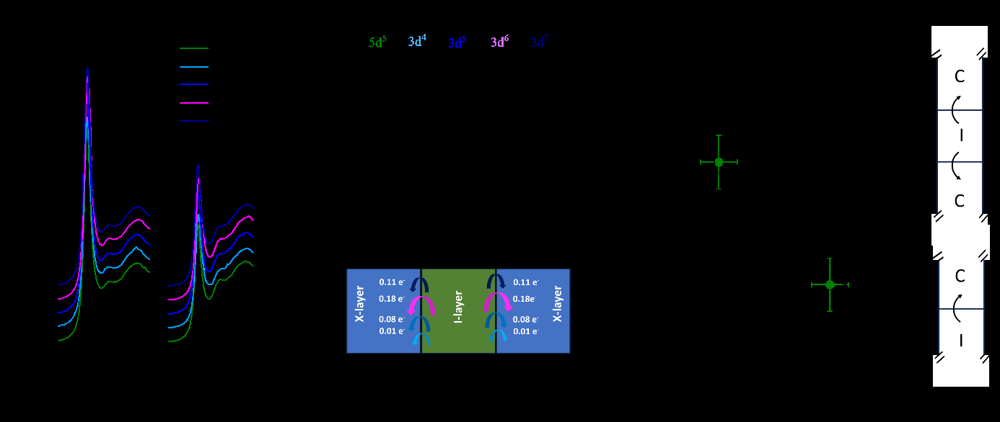
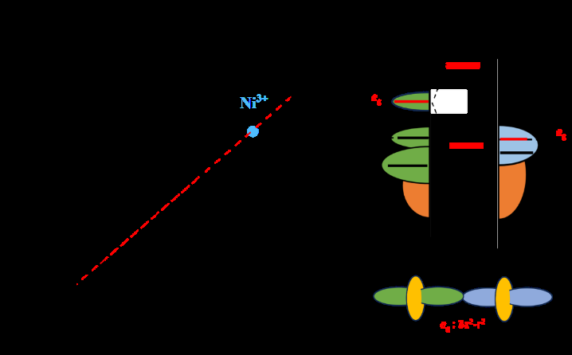
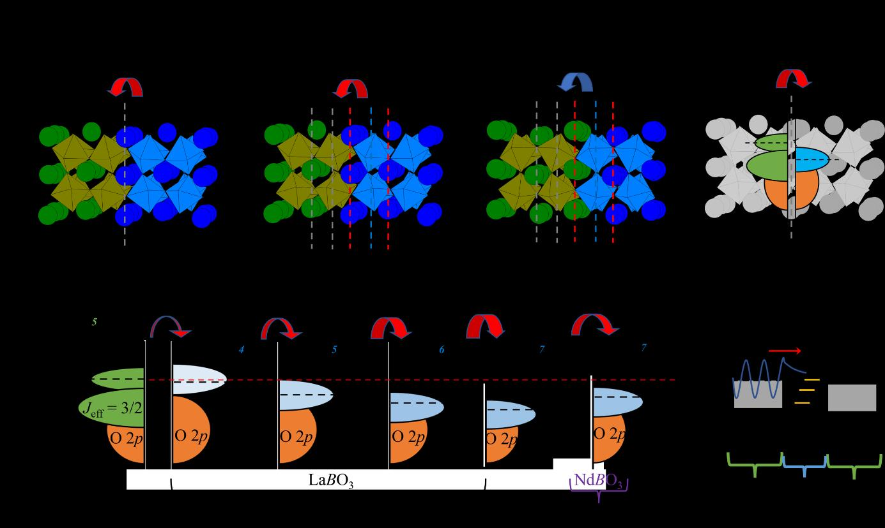

# 3d/5d複合酸化物ヘテロ界面における電荷移動と電子状態制御——電気陰性度が拓く新しい界面物性工学

- **執筆日**: 2026-03-28
- **トピック**: 3d/5d酸化物ヘテロ界面・界面電荷移動・スピン状態制御・スピン軌道結合
- **タグ**
  - main-area: 電子構造
  - sub-area: ヘテロ構造 / 薄膜・界面
  - method-tag: 放射光計測 / 第一原理計算
- **注目論文**: A. K. Jaiswal et al., "Interfacial charge-transfer in 3d/5d complex oxide heterostructures," arXiv:2603.25514 (2026)
- **参照関連論文数**: 5 本

---

## 1. 導入：なぜ今「酸化物ヘテロ界面」か

固体材料の研究で，「バルクには存在しない性質が界面に生まれる」という発見が相次いでいる。典型例は2004年にOhtomo と Hwang が報告した LaAlO₃/SrTiO₃（LAO/STO）界面の二次元電子ガス（two-dimensional electron gas; 2DEG）である。この界面では，どちらの母材料も絶縁体であるにもかかわらず，界面近傍に金属的な伝導層が出現する。この発見以降，「ペロブスカイト型複合酸化物（complex perovskite oxide）のヘテロ構造は，電荷・スピン・軌道の自由度が再構成される『実験室』である」という認識が物性物理・材料科学のコミュニティに広まった。

その中でも近年とくに注目されているのが，**5d 遷移金属酸化物**を一方の層に持つヘテロ構造である。5d 電子系の代表である**イリジウム酸化物** SrIrO₃（SIO）は，強いスピン軌道相互作用（spin-orbit coupling; SOC）を持ち，「ディラック半金属」として機能する特殊な電子状態を有する。その SOC エネルギーは 3d 酸化物（例: LaMnO₃，LaCoO₃）の 10 倍以上（Ir の場合 ~ 400 meV）にも及び，通常の 3d 酸化物とはまったく異なる電子状態が実現される。

こうした 3d/5d 系を異種積層した「複合酸化物スーパーラティス」（superlattice; SL）では，**界面電荷移動**（interfacial charge transfer; ICT）が起きることが知られている。ICT とは，二種類の層の化学ポテンシャル差を補償するために，界面近傍で電子が一方から他方へ移動する現象である。ICT によって層の電子密度が変化し，その結果として磁性，電気伝導，さらには光学的性質まで変化しうる。

しかし，これまでの研究では「どの材料の組み合わせでどれだけ電荷が移動するか」という**定量的・普遍的な設計指針**が確立されていなかった。界面の原子配列，格子歪み，分極の不整合，電気陰性度差など，複数の要因が複雑に絡み合い，材料を選んで積層してみるまで ICT の大きさを事前予測することは難しかった。

2026 年 3 月，ドイツ・カールスルーエ工科大学（KIT）と欧州放射光施設（ESRF）の共同研究グループが arXiv に投稿した論文（Jaiswal et al., 2603.25514）は，4 種類の 3d ペロブスカイト酸化物と SrIrO₃ を組み合わせた SL について，XAS（X 線吸収分光）と EELS（電子エネルギー損失分光）を駆使して ICT を系統的かつ定量的に明らかにした。そして，ICT の大きさが**電気陰性度差**（electronegativity difference）と線形に相関することを発見した。さらに，LaCoO₃ との界面では電荷移動だけでなく，**スピン状態の完全変換**（低スピン → 高スピン）が起きることも示した。

この「電気陰性度を使った設計指針」と「化学的置換なしのスピン状態制御」という二つの発見は，複合酸化物界面工学に新しい可能性をもたらす。本稿では，これらの成果を中心に，5d 酸化物の基礎物理から最新の応用研究まで，体系的に解説する。

---

## 2. 解決すべき問い

複合酸化物ヘテロ界面の ICT を理解・制御するうえで，以下の三つの問いが本質的である。

**問い①：ICT の大きさを決める主要因は何か？**

界面で電荷移動が起きるためには，二つの層の間で電気化学ポテンシャル（Fermi 準位）に差がなければならない。しかし，その差を生む要因としては，(i) B サイトイオンの価数不整合，(ii) 層の極性不整合（polarity mismatch），(iii) 電気陰性度差，の少なくとも三つが提唱されてきた。どれが支配的かは，系によって異なる可能性があり，普遍的な理解が欠けていた。

**問い②：ICT は電荷だけを移動させるのか，それともスピン状態も変えるのか？**

電荷が一方の層から他方に移ると，3d TM（遷移金属）イオンの平均価数が変化する。例えば Co³⁺（3d⁶）に電子が加わると Co²⁺（3d⁷）的な状態になる。しかし，問題はそれだけではない。界面での軌道混成（hybridization）が強い場合，結晶場分裂のバランスが崩れ，低スピン（low-spin; LS）状態から高スピン（high-spin; HS）状態への転移が起きる可能性がある。この「スピン状態変換」が，化学的ドーピングなしに界面制御で誘起できるかどうかが問われている。

**問い③：ICT の大きさを事前に設計できるか？**

もし ICT と電気陰性度差の間に定量的な相関があるならば，異なる 3d 酸化物と 5d 酸化物の電気陰性度を参照するだけで，ICT の大きさを予測し，材料を合理的に設計できる。これは「材料インフォマティクス的アプローチ」とも整合する普遍的な設計則の確立を意味する。

これら三つの問いに対して，今回の注目論文が明確な答えを提示した。

---

## 3. 注目論文の新規性

### 実験の設計：系統的な 3d/5d SL の比較

Jaiswal らは，SrIrO₃（I = Ir 層）と 4 種類の 3d ペロブスカイト（X 層：M = LaMnO₃，F = LaFeO₃，C = LaCoO₃，N = NdNiO₃）を交互に積層したスーパーラティス [I₄X₄]₅（各層 4 単位胞 (monolayer; ML)，繰り返し 5 回）を，パルスレーザー堆積法（PLD）で SrTiO₃（STO）基板上にエピタキシャル成長させた（図 1）。

4 種の 3d 酸化物を選んだことで，3d 電子数を d⁴（Mn³⁺）から d⁷（Ni³⁺）まで系統的に変化させることができ，電気陰性度の効果を分離して評価できる。

![図1: [I₄X₄]₅ スーパーラティスの構造解析](figures/2603.25514/page4_img1.jpeg)
*図 1. 3d/5d 超格子の構造特性評価。左：XRD パターン（主ブラッグピークとサテライトピーク）。右：各系統の HAADF-STEM 像と STEM-EELS 元素マップ（Ir：緑，Sr：橙，Mn/Fe/Co/Ni：青，La/Nd：赤）。© 2026 Jaiswal et al. CC BY 4.0*

HAADF-STEM 像と EELS 元素マップを見ると，各層は明確に分離しており，界面は原子スケールで急峻（atomically sharp）であることが確認できる。NdNiO₃ 系のみ，Ruddlesden-Popper 型の積層欠陥が小さなドメイン状に見られたが，他の系では高品質なエピタキシャル成長を達成している。

### Ir L端 XANES による電荷移動の定量化

ICT の定量測定には，放射光 X 線吸収分光（XAS）を用いた**Ir L₂,₃端のXANES（X線吸収端近傍構造）**分析が核となる（図 2）。

*図 2. Ir L₂,₃ 端 XANES スペクトル（左）と各 SL での Ir サイトのホール数および電荷移動量（右）。内挿図は SL 内の電荷移動の空間分布を示す。© 2026 Jaiswal et al. CC BY 4.0*

XANES の吸収端（「白線 (white line)」）の強度は，その遷移金属の 5d 空準位数，すなわちホール数 $n_h$ に比例する。参照試料（SrIrO₃単層: I₂₀）では Ir⁴⁺（5d⁵）を仮定して $n_h = 5$ とし，各 SL でのスペクトルと比較することで，Ir からの電子移動量 $\Delta n_e = \Delta n_h$ を定量した。

結果は明確だった。SrIrO₃ 単層と比較して，すべての SL で Ir サイトのホール数が増加しており，「電子が Ir 層から 3d 酸化物層へ移動している」ことが確認された。特に **LaCoO₃ との SL [I₄C₄]₅ では最大 $n_e \approx 0.35$ e/unit cell** という大きな電荷移動が観測された。移動量は X 層の 3d 電子数（d 殻の充填度）に依存し，M（0.02 e/uc），F（0.16 e/uc），C（0.35 e/uc）の順に増大する一方，N（NdNiO₃，3d⁷）では C より小さくなるという，非単調な依存性も明確にされた。

また，Ir 層の厚みを変えた系統実験（Ni = 4, 10 ML；NIF = 1〜5 インターフェイス）では，$\Delta n_h \propto N_\mathrm{IF}/N_i$（インターフェイス数 / Ir 層厚さ）という比例関係が成立することを確認した。これは，ICT が界面固有の現象（界面から 1〜2 UC 程度に局在）であることを意味する。

### 電気陰性度差との線形相関と設計指針

最も重要な発見は，4 種の系統データを統合したときに現れる**電気陰性度差 $\Delta\chi$ と電荷移動量 $n_e$ の線形相関**である（図 3）。

*図 3. 電荷移動量 $n_e$ と 3d/5d 遷移金属間の電気陰性度差 $\Delta\chi$ の相関（左：線形フィット）と LaCoO₃ 界面での軌道混成によるスピン状態変換の模式図（右）。© 2026 Jaiswal et al. CC BY 4.0*

電気陰性度（Pauling スケール）は，元素が電子を引き付ける能力の指標である。ペロブスカイト酸化物では，O 2p 準位が界面を横断して整合し（O 2p aligns），TM の d 電子準位が電気陰性度に応じて相対的にシフトする。その結果，電気陰性度が高い 3d TM（より電子を引き付ける）が Ir から電子を「奪う」という機構が働く。

図 3 左では，Ni³⁺ を除く 3 種のデータが $n_e$ 対 $\Delta\chi$ の直線上によく乗っており（傾き方向の線形回帰は点線で示される），**電気陰性度差が ICT 量を予測する実用的なスケーリング則**を提供することがわかる。NiO₃ 系のみが外れるのは，Ni の 3d-O 2p 混成が強く「有効電気陰性度」を下げるためと解釈された。

### スピン状態の完全変換：LaCoO₃ 界面での驚き

LaCoO₃ は，Co³⁺（3d⁶）の低スピン（LS：$t_{2g}^6 e_g^0$，$S=0$）状態と高スピン（HS：$t_{2g}^4 e_g^2$，$S=2$）状態のエネルギー差が小さいため，温度や歪みによって容易にスピン状態が変わる「スピン状態が不安定な酸化物」として知られている。

[I₄C₄]₅ SL では，EELS の分岐比（branching ratio; BR）分析から，通常の LaCoO₃ エピタキシャル薄膜（HS : LS ≈ 3 : 1）とは異なり，**LS 状態の Co³⁺ が完全に HS に転換した**という結果が得られた（図 2 右パネルの BR ≈ 4.0 が HS Co³⁺ と HS Co²⁺ の混合に対応）。

この変換の駆動力は，電荷移動のみならず，5d の eg 軌道（$d_{z^2-r^2}$；c 軸に配向）と 3d の eg 軌道との**界面軌道混成**にある（図 3 右）。混成によって Co の $e_g$–$t_{2g}$ 分裂エネルギー（結晶場分裂 10Dq）が実効的に減少し，HS 状態が安定化される。このメカニズムは，電荷移動（ドーピング）と軌道混成（hybridization）の相乗効果による「スピン状態の界面工学」を意味する。

---

## 4. 背景と文脈

### ペロブスカイト酸化物界面の研究史

複合ペロブスカイト酸化物のヘテロ界面研究が爆発的に展開したのは，2004年の LAO/STO 界面 2DEG の発見を契機とする。この界面は，極性不整合（polarity mismatch）によって界面に電荷が再構成され，電子が界面に集積することで金属的伝導が生まれることが後に明らかにされた。

その後，LaMnO₃/SrMnO₃，SrRuO₃/SrMnO₃ など，様々な 3d 酸化物同士の界面で界面電荷移動，磁気近接効果（magnetic proximity effect），軌道再構成が報告された。共通するテーマは，「二つの異なる電子相が境界を接すると，境界近傍では新しい電子状態が生まれる」というものである。

3d/5d ヘテロ界面が注目されたのは，より最近のことだ。5d 酸化物の代表である**SrIrO₃ (SIO)**は，5d⁵ 電子配置を持つ Ir⁴⁺ イオンを含み，強い SOC によって通常の強相関 Mott 絶縁体ではなく，「$J_\mathrm{eff} = 1/2$ Mott 絶縁体」や「ディラック半金属」という特殊な状態を持つことが知られている（詳細は §7 で解説）。

先行研究では，SrIrO₃ と強磁性体 La₀.₇Sr₀.₃MnO₃（LSMO）の界面で磁気近接効果（Ir が LSMO の磁気秩序の影響を受ける）が観測されたほか，SrIrO₃/SrCoO₃ SL でバンドアライメント由来の電荷移動が報告されていた（Ahammad et al., arXiv:2511.04513）。しかし，どの 3d 酸化物と組み合わせるかによって ICT がどう変わるか，そしてその物理的機構は何かは未解明のままだった。

### 類似研究との比較

今回の注目論文に密接に関連する別の最近の研究として，LaCoO₃ の軌道占有とスピン状態を界面制御した研究（Kiens et al., arXiv:2512.03785）がある。この研究では，LaCoO₃/LaTiO₃，LaCoO₃/LaMnO₃，LaCoO₃/LaNiO₃，そして LaCoO₃/LaAlO₃/LaNiO₃ というスペーサー挿入系など，様々な界面材料を変えて LaCoO₃ の Co 3d 軌道占有とスピン状態がどう変わるかを XAS で詳細に調べた。その結果，「どの材料を隣接させるか」によって Co の価数（d⁵〜d⁷）とスピン状態（LS，IS，HS）を精密に調整できることが示された。

Jaiswal らの研究との違いは，「5d 系である SrIrO₃ との組み合わせ」という点と，「電気陰性度差というシンプルなパラメータで ICT を統一的に記述できる」という普遍的な設計原理の確立にある。

また，SrIrO₃/SrRuO₃ SL でも非常に興味深い現象が報告されている（Lu et al., arXiv:2503.21093）。SrIrO₃ も SrRuO₃ も単独では反強磁性絶縁体（SIO は Mott 絶縁体的挙動を示す薄膜状態）であるにもかかわらず，SL にすると**創発的金属性（emergent metallicity）**が出現し，同時に強磁性が誘起されるという。これは界面での磁気再構成（magnetic reconstruction）がDzyaloshinskii-Moriya 相互作用（DMI）によって強磁性を安定化し，電子状態が金属化するという機構で説明された。この「絶縁体 + 絶縁体 → 金属」という劇的な創発現象は，ICT を含む複数の界面効果の複合的な結果であり，3d/5d ヘテロ構造の豊富な可能性を示している。

---

## 5. メカニズム・比較・解釈

### 界面電荷移動を駆動する三つのシナリオ

ICT を引き起こす機構として，Jaiswal らは図 4 のように三つのシナリオを整理した。

*図 4. ペロブスカイト酸化物界面での電荷移動機構の概念図。（a）B サイト価数差，（b）極性不整合（n 型 / p 型），（c）電気陰性度差によるバンドアライメント。© 2026 Jaiswal et al. CC BY 4.0*

**機構（i）価数不整合型**：もし隣り合う層で B サイトイオンの価数が異なる（例：B³⁺ と B⁴⁺）場合，価数の不連続性を均すために電子が B³⁺ → B⁴⁺ 方向に移動する。しかし今回の系では，実験で観測された ICT の方向は Ir⁴⁺ → 3d TM³⁺ 方向，すなわち価数的には逆方向であるため，この機構は支配的でないと判断された。

**機構（ii）極性不整合型**：LAO/STO 系の 2DEG のように，層の [AO]⁻/[BO₂]⁺ 積層の電荷（極性）の不連続が駆動力になる。[I₄X₄]₅ SL では，HAADF-STEM 解析により，I 層は SrO 終端（p 型界面）と IrO₂ 終端（n 型界面）の両方が SL 内に存在し，これらの電場効果が互いに打ち消し合うことが示された。そのため，極性不整合機構は本系では抑制されていると結論された。

**機構（iii）電気陰性度差型（支配的）**：ペロブスカイト酸化物では，界面を横断して酸素 2p 準位が整合する（O 2p states align）。このとき，遷移金属の電気陰性度（d 電子と O 2p の混成の強さを反映）の差が，直接的に TM の化学ポテンシャルの差に変換される。電気陰性度の高い 3d TM（例：Co，電気陰性度 χ ≈ 1.88）は，電気陰性度の低い 5d Ir（χ ≈ 2.2 だが，d 殻充填度の影響で有効陰性度は変化）との界面で電子を「引き込む」力が強く，結果として大きな ICT が起きる。

次に示す簡単な論理で理解できる：
$$
\mu_\mathrm{3d} - \mu_\mathrm{5d} \propto \Delta\chi = \chi_\mathrm{3dTM} - \chi_\mathrm{5dTM}
$$
化学ポテンシャル差 $\Delta\mu$ が電荷移動のドライビングフォースとなり，電荷移動が起きて両層の Fermi 準位が整合するまで続く。最終的な電荷移動量 $n_e$ は $\Delta\mu$，すなわち $\Delta\chi$ に線形比例する，という機構だ。

### 電気陰性度スケーリングが意味するもの

Co の場合，$\Delta\chi$ が最大になるのは，Co の d 殻の充填度が 3d⁶ に対応し，電気陰性度が比較的高いためだ。一方，Ni³⁺（3d⁷）では，電子が多く入ることで 3d–O 2p 混成が強まり，有効電気陰性度が下がる（共有結合的な効果）ため，単純な原子電気陰性度からの予測を下回る ICT になる。

このスケーリング則は，異なる 5d 酸化物（例：Os 酸化物，Re 酸化物）と組み合わせる設計にも応用できる可能性がある。電気陰性度表（Pauling スケール）はすべての元素に対して既知であるため，「どの 3d と 5d を組み合わせるかで ICT の大きさを事前見積もりできる」という，実用的な指針が得られたことになる。

### スピン状態変換：3d-5d 軌道混成の役割

LaCoO₃ との界面で観測された LS → HS 変換（図 3 右）は，電荷移動だけでは説明できない。計算によれば，0.35 e の電子追加のみでは Co³⁺ の LS→HS 転換には不十分だからだ。

決め手は**界面方向（c 軸方向）の $e_g$ 軌道混成**にある。SrIrO₃ の Ir $e_g$（特に $d_{z^2-r^2}$）と LaCoO₃ の Co $e_g$ が，界面の酸素を介して強く混成すると，Co 側の $e_g$–$t_{2g}$ エネルギー差（結晶場 10Dq）が実効的に減少する。その結果，10Dq < Hund 結合エネルギー（Hund's coupling $J_H$）という条件が満たされ，HS 状態が安定化される。

この「界面における軌道混成によるスピン状態の設計」は，化学的なドーピング（例：Sr の La への置換による Co の価数変化）に頼らずに，積層する材料の選択だけでスピン状態を制御できることを意味する。これは，スピントロニクスデバイスの微細化・精密化において革命的な意義を持ちうる。

---

## 6. 材料・手法・応用への広がり

### スピン電流源としての SrIrO₃/マンガナイト界面

スピントロニクス（spintronics）の観点から，SrIrO₃ の最も魅力的な応用の一つが**スピン電流源**としての利用だ。Ulev ら（arXiv:2310.10297）は，SrIrO₃/La₀.₇Sr₀.₃MnO₃（LSMO）ヘテロ界面において，マイクロ波照射下で強磁性共鳴（ferromagnetic resonance; FMR）を誘起することで純スピン電流を発生させ，SrIrO₃ の逆スピンホール効果（inverse spin-Hall effect; ISHE）によってこれを電荷電流として検出することに成功した。

この実験は，強 SOC を持つ SrIrO₃ が「スピン-電荷変換効率（spin-Hall angle）」の高い材料として機能することを実証した。電荷移動によって SrIrO₃ 層の電子密度が変化すると，スピンホール角も変化すると予想されるため，今回明らかにされた ICT の制御可能性は，スピン電流変換効率のチューニングに直結する。

### 電場による非揮発性磁気制御

Jaiswal ら自身の以前の研究（arXiv:2307.06064，CC BY 4.0）では，SrIrO₃ / SrTiO₃ バックゲート構造において，ゲート電圧によって異常ホール伝導度 $\sigma_\mathrm{AHE}$ と異常ホール角 $\theta_\mathrm{AHE}$ を最大 **700%** も変化させることに成功している。しかも 60 K 以下では**非揮発性**（電圧を切っても状態が保持される）というスイッチング挙動が観測された。これは SrTiO₃ の強誘電体的な分極状態が SrIrO₃ の電子密度を固定するためと解釈された。

ゲート電圧による ICT 制御と，今回報告された材料選択による ICT 設計則を組み合わせれば，「どの材料で界面を作るかで ICT 量のベースラインを決め，さらにゲート電圧でそれをリアルタイムに調整する」という二段階設計が可能になる。これは，低消費電力の不揮発性スピントロニクスデバイスへの応用につながる。

### SrRuO₃/SrIrO₃ 系での創発金属性：ICT を超えた界面現象

Lu ら（arXiv:2503.21093）が報告した SrIrO₃/SrRuO₃ SL での創発金属性は，ICT の概念をさらに広げる事例だ。この系では，SIO と SRO 両者が独立には（薄膜状態で）絶縁体的挙動を示すにもかかわらず，界面での磁気再構成によって金属状態が生まれる。

輸送測定，磁気特性，ARPES（角度分解光電子分光）による実験と DFT 計算が組み合わさり，「交互反強磁性絶縁体 × 反強磁性絶縁体 = 強磁性金属」という驚くべき創発が，DMI 安定化強磁性 + バンド再構成によることが解明された。

今回の注目論文で確立した電気陰性度的視点からみると，Ir（χ ≈ 2.2）と Ru（χ ≈ 2.2，ほぼ同じ）では $\Delta\chi \approx 0$ となり，電荷移動は小さいことが予想される（実際 SIO/SRO 系での ICT は報告されていない）。スピン状態を変えずに，純粋に磁気近接効果と界面 DMI 効果が際立って現れるという意味で，この系は電気陰性度 ICT の「対照実験」とも言える。

### LaCoO₃ 系の界面スピン状態制御：多様な 3d 酸化物への展開

Kiens ら（arXiv:2512.03785）の系統研究は，LaCoO₃ を様々な 3d ペロブスカイトと界面接触させることで，Co の価数（3d⁵〜3d⁷）とスピン状態（LS から HS まで）を精密に調整できることを示した。XAS による Co L 端分析，N K 端分析，そして Co L 端 XMCD（X 線磁気円二色性）を組み合わせ，LaCoO₃ 層の磁気応答まで評価している。

この研究で注目されるのは，LaAlO₃ スペーサーを挟むことで「電荷移動を遮断し，純粋に格子歪みだけの効果」を切り出せたことだ。格子歪みのみでは LS → HS 転換は完全には起きず，電荷移動と軌道混成が不可欠であることが，Jaiswal らの結論を支持する。

---

## 7. 基礎から理解する

### ペロブスカイト構造と遷移金属 d 電子系

ペロブスカイト酸化物 ABO₃ では，A サイトに Ba，La，Sr などのアルカリ土類・希土類金属，B サイトに Fe，Co，Mn，Ir などの遷移金属が入り，B イオンを頂点共有した BO₆ 正八面体が三次元的に連結している。この構造では，B サイト TM の d 電子が酸素の 2p 電子と強く混成し，複雑な相関電子系を形成する。

B サイト TM の d 軌道（5 重縮退）は，BO₆ 八面体の立方対称性の結晶場（crystal field）によって，

$$
t_{2g}\ (d_{xy}, d_{yz}, d_{zx}) \quad \text{と} \quad e_g\ (d_{3z^2-r^2}, d_{x^2-y^2})
$$

に分裂する。分裂エネルギーを 10Dq（または $\Delta_\mathrm{CF}$）と呼び，これが正（立方場では常に正）であることで，$t_{2g}$ の方が $e_g$ より低エネルギーになる。

低スピン（LS）と高スピン（HS）の選択は，Hund 結合エネルギー $J_H$ と 10Dq の競合で決まる。

- **$10Dq > J_H$**（強結晶場）→ 電子は $t_{2g}$ を先に埋める（LS状態，全スピン $S$ は小さい）
- **$10Dq < J_H$**（弱結晶場）→ Hund 則に従って全スピンを最大化する（HS状態）

LaCoO₃ では $10Dq$ と $J_H$ が拮抗しており，温度や歪み，そして今回のような界面軌道混成によって，LS と HS の間で転換が起きうる。

### 5d 酸化物と Jeff = 1/2 状態

SrIrO₃ の主役である Ir⁴⁺ は，5d⁵ 電子配置，すなわち 5 個の d 電子を持つ。通常の 3d 系なら $t_{2g}^3 e_g^2$ の HS（$S = 5/2$）か $t_{2g}^5$ の LS（$S = 1/2$）になるが，5d 系では強 SOC がゲームチェンジャーになる。

立方結晶場分裂した $t_{2g}$ 軌道（擬角運動量 $L_\mathrm{eff} = 1$）に SOC $\lambda \mathbf{L}\cdot\mathbf{S}$ を作用させると，$t_{2g}$ は $j_\mathrm{eff} = 1/2$ と $j_\mathrm{eff} = 3/2$ の多重項に分裂する。

$$
\hat{H}_\mathrm{SOC} = \lambda\, \mathbf{L}_\mathrm{eff} \cdot \mathbf{S}
$$

5d⁵ 系では，$j_\mathrm{eff} = 3/2$ バンドが 4 電子で完全に占有され，残る 1 電子が $j_\mathrm{eff} = 1/2$ バンドに入る。この「半充填 $j_\mathrm{eff} = 1/2$ バンド」が，電子相関 $U$ によって Mott ギャップを開けやすく，Sr₂IrO₄ のような層状 Ir 酸化物では $j_\mathrm{eff} = 1/2$ Mott 絶縁体を実現する。

SrIrO₃ の場合は三次元的なペロブスカイト構造のため，バンド幅 $W$ が大きく，Mott 絶縁体にはなりきれずに半金属（semimetal）またはディラック半金属的な電子構造を持つ。この「金属に近い強 SOC 系」という特性が，隣接する 3d 酸化物との電荷・スピン移動において独自の役割を果たす。

### X 線吸収分光（XANES・XMCD）の原理

**XANES（X-ray Absorption Near-Edge Structure）**は，X 線が物質に照射されたとき，内殻電子（K, L 端）を空の外殻準位（伝導帯）へ励起する過程の断面積を，X 線エネルギーの関数として測定する手法だ。TM の L 端（2p → 3d/5d 遷移）では，

$$
I_\mathrm{L} \propto \text{(遷移行列要素)}^2 \times N_\mathrm{empty}(E)
$$

で，吸収強度は空の d 状態数 $N_\mathrm{empty}$ に比例する。「白線（white line）」と呼ばれる吸収ピークの強度を積分すると，d 空準位数（＝ホール数 $n_h$）の変化が定量化できる。

Ir の L₂（2p₁/₂ → 5d₅/₂）と L₃（2p₃/₂ → 5d₅/₂，5d₃/₂）の白線強度の和は，5d 殻のホール数の変化を反映する。Jaiswal らは，各 SL で L₂ と L₃ の白線面積を SrIrO₃ 参照試料と比較し，$\Delta n_h$ を定量化した（図 2）。

**XMCD（X-ray Magnetic Circular Dichroism）**は，左右円偏光 X 線の吸収差を取ることで，磁気モーメント（スピン + 軌道）を直接測定できる。総和則（sum rule）を使えば，スピン磁気モーメント $m_s$ と軌道磁気モーメント $m_l$ を分離評価できる。Jaiswal らは XMCD を Ir 端と 3d TM 端で行い，ICT によって 5d 層に誘起される磁気モーメントと，3d 層の磁気状態変化を追跡した。

### バンドアライメントと電気陰性度の関係

ペロブスカイト酸化物界面でのバンドアライメントを理解するうえで，「酸素 2p 準位整合（O 2p alignment）」という概念が鍵になる。ペロブスカイト ABO₃ では，O 2p バンドは格子定数が近い場合，界面を横切って（連続する O サブラティスを通して）ほぼ整合する。

一方，各酸化物の TM d バンドの位置は，TM の電気陰性度によって O 2p バンドに対して相対的に上下する。電気陰性度の高い TM ほど，d バンドが O 2p に近いエネルギー（低エネルギー側）に位置する。

界面で O 2p が整合したとき，電気陰性度の高い TM 層の d バンド（≈ Fermi 準位）の方が相対的に下がっており，向かい側の電気陰性度の低い TM 層の d バンドよりも空の d 準位が多い（あるいは Fermi 準位が低い）。この化学ポテンシャル差が電荷移動の駆動力になる：

$$
\Delta\mu \approx \Delta(E_F) \propto \Delta\chi = \chi_\mathrm{3d} - \chi_\mathrm{5d}
$$

電荷が移動して Fermi 準位が整合した後，$\Delta\mu \approx 0$ となり平衡が成立する。最終的な電荷移動量 $n_e$ は $\Delta\chi$ と材料のスクリーニング長（Thomas-Fermi 長）の積に比例する。この線形関係が，図 3 に示された実験結果と整合する。

---

## 8. 重要キーワード 10 個

1. **ペロブスカイト酸化物（perovskite oxide）**: ABO₃ 型結晶構造を持つ酸化物の総称。TM の種類・価数によって様々な電子状態（金属，絶縁体，超伝導体，磁性体）を実現する。

2. **スピン軌道結合（spin-orbit coupling; SOC）**: 電子の軌道運動によって生じる有効磁場とスピンの相互作用。5d 系では大きく（〜400 meV），電子バンド構造を根本から変える。

3. **$J_\mathrm{eff} = 1/2$ 状態**: 強 SOC によって $t_{2g}$ 軌道が分裂した結果生まれる有効スピン $j_\mathrm{eff} = 1/2$ の量子状態。Sr₂IrO₄ や SrIrO₃ などのイリジウム酸化物を特徴づける。

4. **界面電荷移動（interfacial charge transfer; ICT）**: 二種類の酸化物層の界面で，化学ポテンシャル差を補償するために起きる電子移動現象。界面近傍の 1〜2 単位胞に局在する。

5. **XANES（X-ray absorption near-edge structure）**: X 線吸収分光の一手法。吸収端近傍のスペクトルから，TM の価数（d 空状態数）や配位環境を定量的に評価できる。

6. **XMCD（X-ray magnetic circular dichroism）**: 左右円偏光 X 線の吸収差。総和則から TM のスピン・軌道磁気モーメントを分離して定量できる。

7. **電気陰性度（electronegativity）**: 原子・イオンが電子を引き付ける能力の指標（Pauling スケール）。O 2p 整合を前提とすると，電気陰性度差が界面 ICT のドライビングフォースとなる。

8. **スピン状態変換（spin-state conversion）**: 結晶場と Hund 結合のバランスの変化によって生じる低スピン（LS）⇔ 高スピン（HS）間の転移。LaCoO₃（Co³⁺）ではエネルギー的に不安定で，界面制御によって誘起できる。

9. **異常ホール効果（anomalous Hall effect; AHE）**: 電流に垂直な方向に，磁場なしで生じる横電圧。Berry 曲率（トポロジカルな波動関数の幾何学的特性）とスキュー散乱の二つが主な起源。強 SOC 材料で特に顕著。

10. **逆スピンホール効果（inverse spin-Hall effect; ISHE）**: スピン電流が流れたとき，SOC によって電荷電流（横方向電圧）に変換される現象。スピン-電荷変換の検出手段として利用される。

---

## 9. まとめと今後の論点

本稿では，Jaiswal らの最新研究（arXiv:2603.25514）を核に，3d/5d 複合酸化物ヘテロ界面における界面電荷移動（ICT）の物理を解説した。この研究の本質的な貢献は，次の三点に集約される。

**① 電気陰性度差が ICT の主駆動力**：SrIrO₃ と 4 種の 3d ペロブスカイトの系統比較から，ICT 量が電気陰性度差 $\Delta\chi$ と線形に相関することを初めて実験的に実証した。これにより，材料テーブルを参照するだけで ICT の大きさを事前予測できる「材料設計指針」が確立された。

**② スピン状態の界面制御**：LaCoO₃ との界面では，電荷移動と eg 軌道混成の相乗効果によって，低スピン Co³⁺ が高スピン状態に完全変換されることを示した。化学的ドーピングなしに積層構造の選択だけでスピン状態を制御できることは，スピン状態多重度を利用する「マルチフェロイクス的」なデバイス設計の新しい手法として位置づけられる。

**③ 電荷移動は界面近傍に局在**：ICT が界面から 1〜2 UC の範囲に閉じ込められていることを定量的に示した。これは，1〜4 UC という極めて薄い層でも ICT を制御できることを意味し，原子スケールの機能設計を可能にする。

### 今後の論点

**論点①：電気陰性度則の適用範囲は？**

今回確立した線形スケーリングは，3d / 5d 系の特定の組み合わせで示された。この則が，4d 酸化物（Ru, Mo, Rh）との組み合わせや，より複雑な多元系酸化物に対しても成立するか検証が必要だ。また，A サイトの違い（La, Nd, Sr, Ca）がどの程度 ICT に影響するかも未解決問題である。

**論点②：ICT の動的制御は可能か？**

Jaiswal ら自身が先に示した電場による非揮発性スイッチング（arXiv:2307.06064）と，今回の設計指針を組み合わせることで，ICT をゲート電圧でリアルタイム制御するデバイスが想定される。問題は，ゲート電圧による電荷密度変化が，電気陰性度由来の ICT とどのように干渉するか（加算するか減算するか）の理解を深めることだ。

**論点③：SrIrO₃ 以外の 5d 酸化物への展開**

Os（オスミウム）酸化物（SrOsO₃）や Re（レニウム）酸化物も強 SOC を持つ 5d 系として注目されている。電気陰性度を異なる 5d 元素に変えることで，ICT の方向（Ir → 3d か，3d → 5d か）や大きさを意図的に逆転できる可能性がある。これにより，「ICT の符号（方向）の設計」まで可能になるかもしれない。

**論点④：5d 酸化物をベースとした Mott-ICT 設計**

本研究では SrIrO₃ が半金属的であることを前提としているが，強い格子歪みや低次元化（単原子層 SIO など）によって SIO 自体を Mott 絶縁体化した状態に近づけると，ICT が電子相転移（金属-絶縁体転移）と連動するというシナリオが考えられる。Lu ら（arXiv:2503.21093）の SIO/SRO 系での創発金属性はその一例であり，ICT を引き金とした「電子相転移工学」という新しい研究方向性が開かれつつある。

---

酸化物界面は，単に「薄膜を積み重ねただけ」の系ではない。電気陰性度という熱力学的なドライビングフォースによって電荷が再分布し，その結果としてスピン・軌道状態が書き換えられる。今回の研究が確立した設計指針は，この「界面を原子レベルで設計する」という材料工学の目標に向けた，明確な一歩である。放射光計測・第一原理計算・精密薄膜成長技術の三本柱が揃ったことで，今後さらに複雑な多層系，酸化物 / 磁性体 / 超伝導体の三者界面，あるいは酸化物 / トポロジカル材料界面へと展開することが期待される。

---

> **ライセンス表記（図について）**: 注目論文 arXiv:2603.25514 の図は Creative Commons Attribution 4.0 International (CC BY 4.0) ライセンスの下で使用。© 2026 A. K. Jaiswal et al.
