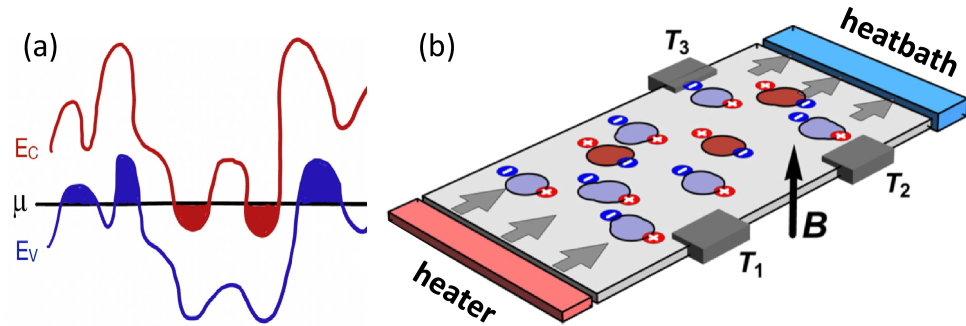
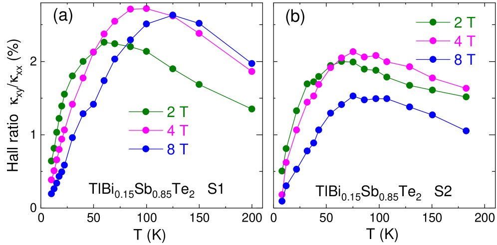
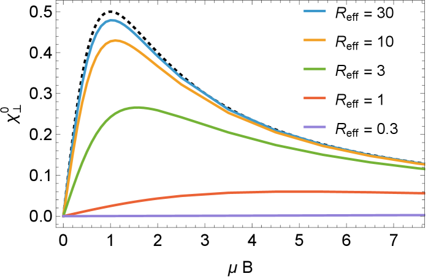
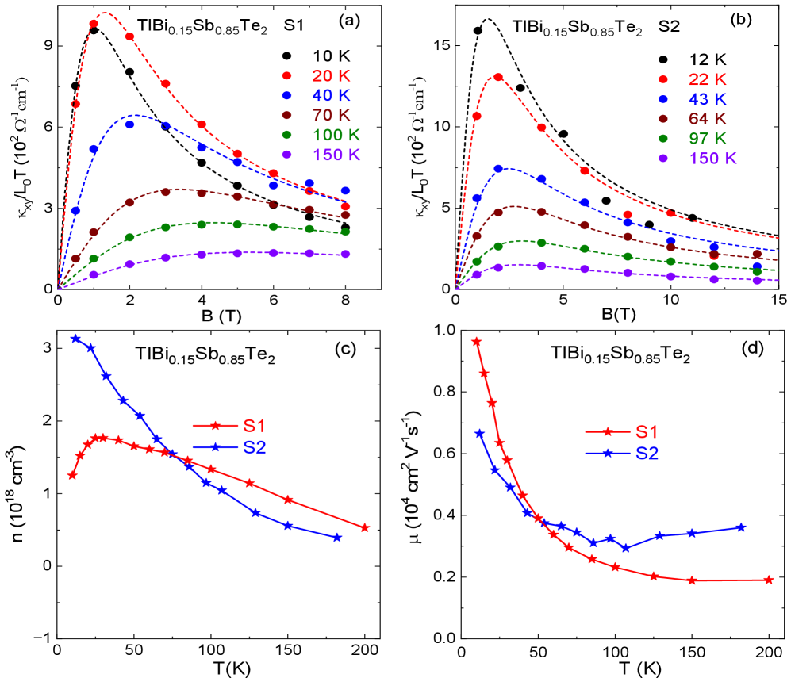
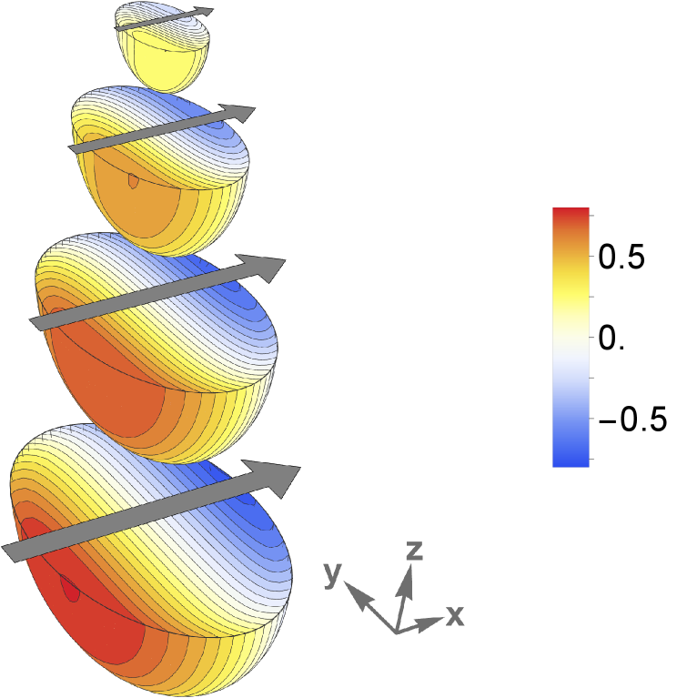
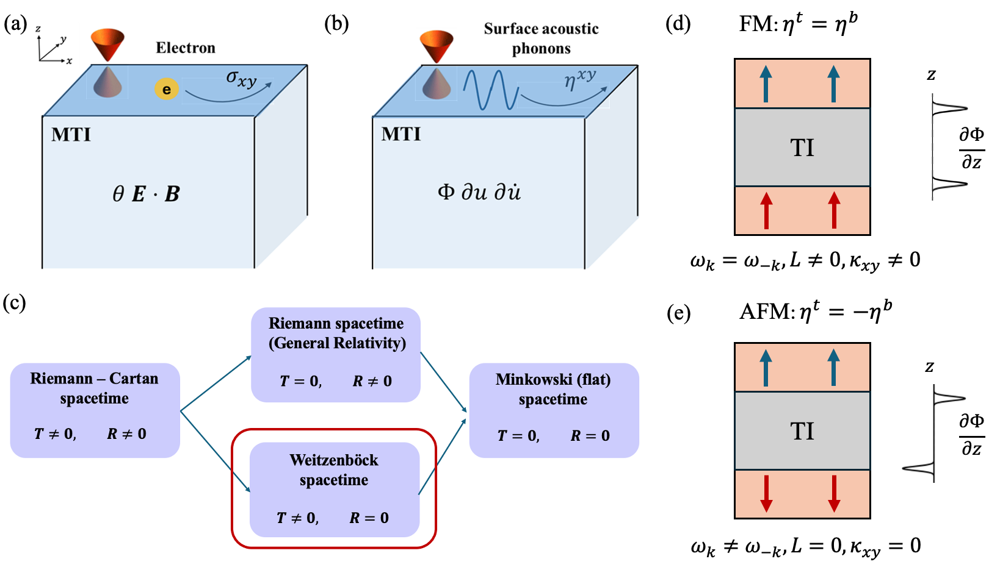

# フォノンはなぜ横に曲がるのか——トポロジカル絶縁体における電荷パドルが解き明かす巨大フォノン熱ホール効果

- **執筆日**: 2026-03-29
- **トピック**: フォノン熱ホール効果・電荷パドル・トポロジカル絶縁体
- **タグ**: Phonons and Thermal Properties / Thermal Transport; Topological Properties / Transport Measurements
- **注目論文**: R. Sharma, Y. Wang, Y. Ando, A. Rosch, T. Lorenz, "Microscopic origin of an exceptionally large phonon thermal Hall effect from charge puddles in a topological insulator," arXiv:2602.05569 (2026)
- **参照関連論文数**: 7

---

## 1. なぜ今この話題なのか

熱の流れが磁場のもとで「横向き」にも曲がる——「熱ホール効果」と呼ばれるこの奇妙な現象が、ここ15年ほどの間に絶縁体の世界で次々と発見され、凝縮系物理の大きな謎として注目されている。

電子の運ぶ電気ホール効果は1879年以来よく知られている。電荷をもつ電子はローレンツ力によって磁場に垂直な方向へ曲げられ、横方向の電圧が生じる。これを熱輸送に類比したのが熱ホール効果だ。しかし、絶縁体において熱を運ぶ主役は電気的に中性なフォノン（格子振動の量子）である。中性粒子がなぜ磁場で横方向に散乱されるのか——この素朴な疑問が、研究者たちを長年にわたって悩ませてきた。

問題をより深刻にしているのは、「説明しなければならない実験事実」が一つではないことだ。希土類ガーネット、銅酸化物高温超伝導体（その絶縁相でさえも）、パイロクロア酸化物、反強磁性絶縁体 Cu₃TeO₆、そしてトポロジカル絶縁体——これらすべてで大きな熱ホール効果が観測されているが、材料によって振る舞いが大きく異なり、一つの機構ですべてを説明できる理論はまだない。それどころか、近年の研究は「フォノン熱ホール効果には複数の独立した機構が存在し、材料ごとに異なる機構が支配的である」という複雑な絵を示しつつある。

この状況に新たな一石を投じたのが、2026年2月にケルン大学・東京大学・ケルン大学の国際グループが発表した論文（arXiv:2602.05569）だ。彼らはトポロジカル絶縁体 TlBi₀.₁₅Sb₀.₈₅Te₂ において、非磁性絶縁体としては前例のない熱ホール比 κₓᵧ/κₓₓ ≈ 2% を観測し、「電荷パドル」という新しい機構でその起源を説明することに成功した。この発見は、フォノン熱ホール効果の謎解きに向けた重要な一歩であるとともに、トポロジカル絶縁体を用いた熱制御デバイスへの新たな視点も拓く。

本稿では、この注目論文を核に、フォノン熱ホール効果をめぐる現在の研究状況を俯瞰する。フォノンが「なぜ曲がるのか」という問いに対して、どのような機構が提案され、どこまで検証されているのか——実験・理論・計算の接続を意識しながら丁寧に追っていこう。

---

## 2. この分野で何が未解決なのか

フォノン熱ホール効果の研究が難しい理由の一つは、「何が問題か」の設定自体が多層的であることだ。中心的な未解決問題を整理すると、以下の4点に集約される。

**（1）微視的機構：内因性か外因性か**

フォノン熱ホール効果の機構の候補は大きく二種類に分けられる。一つは「内因性機構」で、フォノンのバンド構造に宿るベリー曲率（Berry curvature）に起因する。フォノンもクリスタル運動量空間でバンドをもち、そのバンドが非自明なトポロジカル構造をもてば、電子系のアノマラスホール効果と類比的に横方向の熱流が生じうる。もう一つは「外因性機構」で、フォノンが磁場中でさまざまな散乱体（不純物、スピン、電荷）によって非対称に散乱されることで生じる。散乱体の種類によって「スキュー散乱」「サイドジャンプ」「ホール粘性」などの副機構がある。どの材料でどの機構が支配的かは、いまだ活発に議論されている。

**（2）効果の大きさの多様性——なぜある材料では巨大か**

熱ホール比 κₓᵧ/κₓₓ の大きさは材料によって数桁以上の差がある。通常の磁性絶縁体では 0.01% 程度であることが多い一方、銅酸化物では観測値がその数十倍に達し、今回の注目論文の TlBi₀.₁₅Sb₀.₈₅Te₂ では 2% という桁違いの値が報告された。この多様性の原因は何か——材料の電子構造・フォノンバンド・不純物の種類や濃度・誘電率などのどのパラメータが効果の大きさを決めているのかが未解明である。

**（3）各機構の実験的識別方法**

異なる機構は実験でどう見分けられるか。磁場依存性・温度依存性・試料依存性の違いが理論的には予測されるが、実験データの解析は難しい。たとえば内因性機構なら磁場に対して線形的に増加するはずだが、外因性のスキュー散乱も低磁場では同様の挙動を示しうる。「動かぬ証拠」となる実験的特徴を同定することが課題だ。

**（4）カップル材料——銅酸化物の謎は残ったまま**

銅酸化物高温超伝導体の熱ホール効果は特別に大きく、絶縁相でも存在するという衝撃的な事実が数年前から報告されている。Boltzmann 解析によってフォノンのスキュー散乱でおおむね説明できるという提案もあるが（arXiv:2207.02240）、磁子（マグノン）・スピン励起・電子の寄与をどう切り分けるかという問題が残っており、銅酸化物の謎は独立した未解決問題として続いている。

---

## 3. 注目論文の核心：何が前進し、何がまだ仮説か

### これまで分かっていたこと

2024年、同じグループ（Sharma, Lorenz らケルン大学グループ）は、電荷補償されたトポロジカル絶縁体 Bi₂₋ₓSbₓTe₃₋ySey 系の結晶において、明瞭なフォノン熱ホール効果を観測した（arXiv:2401.03064）。この系では熱ホール比が約 10⁻³（0.1%）程度であり、ウィーデマン-フランツ則（後述）を用いた解析で電子の寄与が無視できることを確認した上で、横方向熱伝導度が帯磁場に対してほぼ線形に増加することを示した。機構としては「荷電欠陥によるフォノンのスキュー散乱」が提案されたが、より大きな効果が得られる材料や、機構をより決定的に同定する実験的証拠は不十分だった。

### 今回何が前進したか

注目論文 (arXiv:2602.05569) では、同グループが TlBi₀.₁₅Sb₀.₈₅Te₂（以下 TBST と記す）という異なる化合物に注目した。この材料は Bi₁₋ₓSbₓ 系の5族合金に近い組成をもち、比較的大きな誘電率（ε ≈ 100 程度）と高い移動度をもつことが特徴だ。

**観測された特異な現象（三つの"普通でない"ふるまい）**

TBST の熱ホール効果には、従来の系とは明確に異なる三つの特徴があった。

① **桁違いの熱ホール比**：50〜150 K の広い温度範囲にわたって κₓᵧ/κₓₓ ≈ 2% が実現した。同様の非磁性絶縁体で通常見られる値（0.01〜0.1%）と比べ、100 倍以上大きい。

② **非単調な磁場依存性**：従来の系では κₓᵧ は磁場 B に対してほぼ線形（κₓᵧ ∝ B）に増加するか、あるいは単調に飽和していく。TBST では、κₓᵧ が中程度の磁場（数テスラ）で極大をもち、より強い磁場では減少するという非単調な振る舞いが観測された。

③ **κₓₓ と κₓᵧ の温度ピークのズレ**：縦方向の熱伝導度 κₓₓ のピーク温度と、横方向熱伝導度 κₓᵧ のピーク温度が一致しない。多くの材料では両者が同じ温度でピークをもつことが知られており、これも異常なパターンだ。

**電荷パドル機構：提案されたメカニズム**

これら三つの特異性を一貫して説明するために、著者らは「電荷パドル」（charge puddle）という概念を導入した。これは、結晶中の微量な荷電不純物が局所的に電子（または正孔）の高密度領域（「パドル」＝水たまりのイメージ）を生み出す現象だ。トポロジカル絶縁体は本来バルクが絶縁体だが、電荷補償が不完全な場合には電子型と正孔型の両方のパドルが共存する。これらのパドルは局所的には金属的で、印加した磁場のもとでローレンツ力によって電子が横方向に曲げられ、各パドル内で電子ホール効果が生じる。

このパドル内の電子ホール効果が、電子-フォノン結合を通じてフォノンに「刻印」される——これが電荷パドル機構の核心だ。具体的には、熱流が流れると各パドルの電子が加熱・冷却され、そのパドル内で横方向の温度勾配が電子ホール効果によって生じ、これがフォノンを介して巨視的な横方向熱流につながる。著者らは二温度モデル（後述）でこの結合を定式化し、解析的には球形のパドルの横方向加熱感受率が

$$\chi_\perp^0 \propto \frac{\mu B}{1 + (\mu B)^2}$$

という形をとることを示した。ここで μ はパドル中のキャリア移動度、B は磁束密度だ。この式は、μB = 1 のとき（μB のオーダーを 1 にする磁場）で最大となり、その後減少するという非単調な磁場依存性を自然に説明する。

実験の磁場依存性のフィットから、パドル中のキャリア（正孔）の移動度として μ ≈ 5000 cm²V⁻¹s⁻¹、有効密度として n ≈ 10¹⁸ cm⁻³ が抽出された。この移動度は通常の不純物伝導に比べて非常に高い値であり、TBST の特徴——大きな誘電率 ε ≈ 100 によって不純物ポテンシャルが大幅に遮蔽され、パドル内のキャリアが高移動度を保てる——と整合している。

**何がまだ仮説段階か**

電荷パドル機構は定性的・定量的に実験データをよく説明しているが、いくつかの点はまだ仮説の段階にある。

第一に、パドルの空間分布（サイズ・密度・形状）が直接観測されたわけではない。著者らはホール伝導度の磁場依存性を二バンドモデルでフィットして電子・正孔パドルの密度と移動度を間接的に推定しているが、実空間でパドルを可視化した実験はない。

第二に、電子-フォノン結合定数（モデル中の結合パラメータ α）については理論的予測はあるものの、独立した測定によって検証されていない。

第三に、この機構が同様のトポロジカル絶縁体や類似の材料系にどこまで一般化できるかは未確認だ。

---

---

## 4. 背景と研究史：この論文はどこに位置づくか

### フォノン熱ホール効果の発見

熱ホール効果が絶縁体で初めて明確に観測されたのは、2005年から2010年頃にかけての希土類ガーネット（Tb₃Ga₅O₁₂など）での研究だ。これらの材料では磁性イオンのスピンとフォノンがカップリングすることで横方向熱流が生じると解釈されたが、詳細な機構は長く不明だった。

2019〜2020年頃、銅酸化物高温超伝導体の強相関絶縁相（モット絶縁体）でも大きな熱ホール効果が発見されると、議論は一気に過熱した。Ong グループ（プリンストン大）をはじめとするいくつかのグループが La₂CuO₄ などの化学量論的な銅酸化物絶縁体でさえも熱ホール効果が観測されると報告し、「これはスピノン（スピン液体の励起）によるものではないか」という仮説が提案された。一方で、Lyu と Witczak-Krempa（arXiv:2207.02240）は Boltzmann 解析によってフォノンのスキュー散乱だけで銅酸化物の熱ホール効果を説明できると主張し、エキゾチックな励起（スピノンなど）は必要ないかもしれないという見方を示した。この銅酸化物の謎については現在も議論が続いている。

### 反強磁性絶縁体での大きな効果

2021年、Chen らは反強磁性絶縁体 Cu₃TeO₆ において、それまでで最大のフォノン熱ホール伝導率を観測した（arXiv:2110.13277）。この材料はレアアースイオンも鉄族磁性イオンも含まない単純な立方晶系反強磁性体だが、磁気秩序温度（ネール温度、约61 K）を超えた高温でも熱ホール効果が持続し、それがフォノン起源であることを示した。この結果は「フォノン熱ホール効果が特殊な材料にのみ現れる例外的現象ではなく、多くの絶縁体で起こりうる普遍的な現象である」という重要なメッセージを発した。機構としてはスピン-フォノン結合に基づくスキュー散乱が議論されたが、定量的な説明はなお課題だった。

同時期に SrTiO₃ における熱ホール効果も議論の的となった。SrTiO₃ はペロブスカイト型酸化物で、量子常誘電体（低温まで強誘電転移しない強誘電揺らぎをもつ系）として知られている。2025年後半の研究（arXiv:2511.08932）では、SrTiO₃ の熱ホール効果がサンプルの結晶品質に著しく依存することが示された——高品質結晶では 0.3% にも達する熱ホール角が観測されるが、乱れたサンプルではほぼゼロになる。さらに空気中でアニール処理すると縦方向の熱伝導率をほとんど変えずに熱ホール効果が部分的に回復するという予想外の結果も得られた。これは熱ホール効果の大きさがフォノン平均自由行程とは独立に決まりうることを示しており、強誘電性や局所的な格子歪みが熱ホール効果の機構に関与しているという解釈が議論されている。SrTiO₃ での機構が TBST と同じ「電荷パドル」なのか、それとも別の機構（強誘電ソフトモードとフォノンの結合など）なのかは、未解決の問題として残されている。

### トポロジカル絶縁体での先行研究

同グループによる 2024 年の研究（arXiv:2401.03064）では、Bi₂₋ₓSbₓTe₃₋ySey 系の電荷補償されたトポロジカル絶縁体（cTI）において、フォノン主体の熱ホール効果が明確に観測された。この系は電荷キャリア密度が非常に低く抑えられているため（電子・正孔が補償し合って本体が絶縁的）、WF 則解析でフォノン熱ホールであることを確認しやすい。機構の提案として荷電欠陥によるスキュー散乱が挙げられ、この cTI での効果（κₓᵧ/κₓₓ ≈ 0.1%）は Cu₃TeO₆ や SrTiO₃ などと同程度だった。今回の注目論文はこの延長線上にあるが、材料を TBST に変えることで 20 倍以上大きな効果を得た点が決定的に新しい。

### 近年の理論的展開

フォノン熱ホール効果の理論はここ数年で急速に発展した。磁性トポロジカル絶縁体フィルムにおいては、表面フォノンが「表面フォノンホール粘性」（surface phonon Hall viscosity）を通じてカイラルになる（一方向にのみ伝播する）という新しい機構も提案されている（arXiv:2601.13283）。この機構はニー-ヤン（Nieh-Yan）位相幾何学的作用に由来するもので、トポロジカル絶縁体の歪み応答がビアベイン場として記述できることに基づく。この機構では熱ホール伝導率が温度に対して T² の依存性を示すと予言されており、通常の T³ 依存性（フォノン比熱由来）と区別できる。また、スピン動力学シミュレーションを用いて熱ホール伝導率を計算する手法も開発されており（arXiv:2603.08777）、カイラル強磁性体や Kitaev 磁石における熱ホール効果の理解に役立っている。さらに、ボゾン系の非線形熱伝導率の量子幾何学的起源を量子運動方程式から定式化する研究（arXiv:2603.10605）も、より高次の熱輸送現象の理解へ向けた理論的基盤を固めつつある。

---

## 5. どの解釈が最も妥当か：証拠・比較・限界

本章が本記事の核心である。電荷パドル機構はどこまで確かで、どこに不確かさが残るのかを検証する。

### 電荷パドル機構を支持する証拠

**（i）非単調な磁場依存性の再現**

最も説得力のある証拠は磁場依存性だ。理論の予言する χ⊥⁰ ∝ μB/(1+(μB)²) というロレンツ型の磁場依存性が、実験データと定量的に一致する。この非単調性（あるピーク磁場での極大）は他のどの機構でも自然には説明しにくい。スキュー散乱機構なら B に対して線形で単調増加、Berry 曲率機構なら磁場でのフォノン占有数の変化を通じて温度にのみ依存し磁場変化が小さいなど、それぞれ異なる予言をするが、いずれも非単調磁場依存性を予測しない。

---

---

---

---

**（ii）移動度から見た一貫性**

磁場依存性フィットから抽出した移動度 μ ≈ 5000 cm²V⁻¹s⁻¹ は、電気的ホール測定から直接測定した正孔パドルの移動度と整合する。これは同一のパドルが電気ホール効果と熱ホール効果の両方で同じ役割を担っているという解釈の一貫性を支持する。比較として、Bi₂₋ₓSbₓTe₃₋ySey 系（2401.03064）では同様のパドルの移動度がずっと低く（約100 cm²V⁻¹s⁻¹ 程度）、それが熱ホール効果のより小さな原因の一端だと解釈できる。

**（iii）ウィーデマン-フランツ則の確認**

電子の熱ホール効果への寄与は WF 則を使って推定できる。電子の熱伝導率 κₑ ≈ L₀T σ（ただし L₀ はローレンツ数）から予測されるホール成分は、実測の κₓᵧ より 1〜2 桁小さく、電子の寄与は無視できる。これにより、観測された大きな熱ホール効果がフォノン起源であることが確認された。

**（iv）温度依存性の特徴**

κₓᵧ のピーク温度は κₓₓ のそれよりも高温側にあるという「ズレ」も電荷パドル機構から説明される。この機構では、パドル中の移動度（温度に依存する）が最適化される温度で κₓᵧ が最大となるが、それは必ずしも κₓₓ のピーク（フォノン散乱が特定の温度で最小になる条件）と一致しない。

---

---

### 競合解釈との比較

**スキュー散乱（荷電欠陥による）**との比較を考えると、2401.03064 で提案されたこの機構はトポロジカル絶縁体のフォノン熱ホールを説明する別候補だ。しかしスキュー散乱機構は磁場に対して線形の κₓᵧ を予言するため、TBST の非単調性は説明できない。また、κₓᵧ の大きさも電荷パドル機構のほうがより自然に再現できる。

**磁性絶縁体（Cu₃TeO₆ 等）での知見との比較**では、Cu₃TeO₆（2110.13277）の熱ホール効果はスピン-フォノン結合に関連する可能性が高く、磁気秩序温度付近での特徴的な振る舞いが観測された。TBST は非磁性なのでスピン-フォノン機構は関与しない。つまり、同じ「フォノン熱ホール効果」という言葉で呼ばれていても、TBST と Cu₃TeO₆ では本質的に異なる機構が働いており、これは「フォノン熱ホール効果の機構は材料固有である」という重要な示唆を与える。

**磁性トポロジカル絶縁体での表面フォノン機構**（2601.13283）は、TBST（非磁性）では直接は関係しないが、より一般的な原理として重要だ。この機構では磁化のある表面でのみフォノンがカイラルになる（片方向にのみ伝播する）ため、T² 温度依存性が予言される。TBST のデータとは直接比較しにくいが、将来的に磁性 TI 薄膜でのフォノン熱ホール測定を行えば、この機構の検証が可能だ。

---

---

### 限界と未確認事項

電荷パドル機構の仮定でまだ独立に検証されていない点が三つある。

第一に、パドルの実空間構造（サイズ・密度）の直接観測。電気的ホール測定からパドルの移動度と密度を間接推定しているが、SQUID 磁気顕微鏡や STM による空間分解測定で直接確認することが望ましい。

第二に、電子-フォノン結合定数 α の独立測定。理論モデルでは α が自由パラメータとして入っており、フォノン分散・電子-フォノン散乱時間の測定（超高速分光など）による決定が必要だ。

第三に、「パドルが十分大きい」という近似（Reff >> 1）の妥当性。実際の TBST でのパドルサイズが理論の予測と一致するかどうかは、実空間での測定がないと確認できない。

一方で、現時点で「最も強く支持される解釈」は明確だ：非単調な磁場依存性とその定量的フィット、電子ホール測定との一貫性、WF 則による電子寄与の排除——これらが揃っており、電荷パドル機構は確かな実験的基盤をもつ。

---

## 6. 何が一般化できるのか：材料・手法・応用への広がり

### 材料系への一般化

電荷パドル機構が大きな熱ホール効果を生む条件は以下のように整理できる。

① 大きな誘電率 ε → 不純物ポテンシャルが遮蔽され、パドル内のキャリアが高移動度を実現しやすい
② 適度な不純物濃度 → パドルが形成されるが、互いに percolate（連結）しない程度
③ キャリア非補償 → 電子型・正孔型のパドルのどちらかが多い（純粋補償の場合は打ち消しが起きる）
④ 強い電子-フォノン結合 → パドル内の熱 Hall 信号がフォノンに効率的に伝達される

これらの条件はトポロジカル絶縁体に特有ではなく、一般のドープ半導体（SrTiO₃、Ge、Si の高ドープ領域など）や遷移金属酸化物にも当てはまりうる。実際、SrTiO₃ でもサンプル質に依存した熱ホール効果が観測されており（arXiv:2511.08932）、この材料のフォノン熱ホールにも類似した機構が関与しているかもしれないと考えられている。

### 磁性 TI フィルムとの組み合わせ

---

---

Chatterjee と Liu が提案した磁性 TI フィルムでの表面フォノン Hall 粘性機構（arXiv:2601.13283）は、電荷パドル機構とは独立だが、どちらもトポロジカル絶縁体を舞台にしている。磁性 TI フィルムに意図的に電荷パドルを導入（doping）したらどうなるか——両機構が競合・協調する領域——は未踏の研究フロンティアだ。

また、この機構は磁場を制御パラメータとして熱ホール効果の「オン/オフ」を切り替える可能性を示唆する。μB ≈ 1 のピーク磁場付近では熱ホール効果が最大となり、ゼロ磁場では消える。これを利用した磁場制御型の熱制御デバイス（横方向への熱の振り分け）が原理的に構想できる。

### 熱輸送の「スピントロニクス的」理解

電子スピントロニクスでは、スピン流を電荷流とは独立に制御することが目標だ。同様に、フォノン熱ホール効果は「熱流の方向制御」という文脈で理解できる。磁場・磁化・電場などを用いてフォノンの横方向散乱を制御することで、フォノンを「横方向」に誘導するフォノトロニクス（phononics）が将来の一方向として注目される。

### 測定手法の観点から

本研究でキーとなった手法は、縦・横両方向の熱輸送を同時に精密測定する技術と、WF 則を用いて電子寄与を分離する解析だ。今後は：
- 超高速（ポンプ-プローブ）分光による電子-フォノン結合の直接測定
- 磁力顕微鏡・熱顕微鏡（局所熱源を使った走査熱伝導顕微法）によるパドルの実空間観測
- 中性子散乱によるフォノンの分散と群速度の精密測定
- 高磁場（20〜45 T）での測定による μB >> 1 領域での検証

が次の重要な実験として挙げられる。

---

## 7. 基礎から理解する

### 熱ホール効果とは何か

「ホール効果」と聞いたとき、多くの人が思い浮かべるのは電流の話だ。金属や半導体に電流 Jₓ を流し、垂直に磁場 B を加えると、ローレンツ力によって電子が横方向に押され、横方向の電圧（ホール電圧）が生じる。これが電気ホール効果だ。

熱ホール効果は、これに類比した現象を熱流で考えたものだ。縦方向に温度勾配 ∂T/∂x を与えたとき（熱流 Jₓ が流れる）、磁場 B のもとで横方向にも温度勾配（∂T/∂y）が生じる現象を指す。縦方向・横方向の熱伝導率をそれぞれ κₓₓ、κₓᵧ として、フーリエの法則を行列形式で書くと：

$$\begin{pmatrix} J_x \\ J_y \end{pmatrix} = -\begin{pmatrix} \kappa_{xx} & \kappa_{xy} \\ -\kappa_{xy} & \kappa_{xx} \end{pmatrix} \begin{pmatrix} \partial T/\partial x \\ \partial T/\partial y \end{pmatrix}$$

ここで κₓᵧ が熱ホール伝導率（熱ホール効果の強さを表す量）だ。熱ホール比 κₓᵧ/κₓₓ は、熱流の「横曲がり具合」を示す無次元量で、数パーセントを超えることはまれだ。

### フォノンが中性でも曲がりうる理由

電荷をもつ電子はローレンツ力 F = qv × B によって磁場で偏向される。中性のフォノンには直接ローレンツ力は働かないが、以下のような間接的な機構によって熱ホール効果が生じうる。

**機構①：フォノンのベリー曲率（内因性機構）**

バンド理論において、結晶運動量空間でのブロッホ波の「位相のねじれ」がベリー位相として蓄積する。電子では、このベリー曲率（Berry curvature）Ωₙ(k) がアノマラスホール伝導率に寄与することが知られている。フォノンでも同様に、フォノンバンドのベリー曲率を通じて横方向の熱流が生じうる。ただし、非相対論的なフォノンの場合、この効果は通常非常に小さい（磁場依存性ではなく磁化依存性）。

**機構②：スキュー散乱（外因性機構）**

フォノンが不純物・スピン・その他の散乱体によって非対称に散乱されると、散乱の前後で横方向成分が不均衡になる。これをスキュー散乱という。荷電不純物の場合、ローレンツ散乱の寄与が磁場に線形に依存するため、κₓᵧ ∝ B の線形則が得られる。

**機構③：電荷パドルを介した間接機構（本論文の提案）**

中性のフォノン自体は磁場で曲がらないが、局所的に金属的な領域（電荷パドル）との電子-フォノン結合を通じて、電子のホール効果がフォノンに「転写」される。パドル内の電子が磁場でローレンツ偏向されると、パドル内に横方向の温度勾配が生じ、これがフォノンを介して外部に熱ホール効果として現れる。

### 二温度モデル

電荷パドル機構を定式化するために、著者らは「二温度モデル」を用いた。これは、ある空間位置でフォノン温度 Tph(r) と電荷キャリア温度 Tch(r) が独立に定義され、電子-フォノン結合を通じて緩和するモデルだ：

$$-\kappa^{\rm ph} \nabla^2 T^{\rm ph} = \alpha(\mathbf{r})(T^{\rm ch} - T^{\rm ph})$$
$$\nabla \cdot \left[ \overleftrightarrow{\sigma}(\mathbf{r}) \cdot (-\nabla T^{\rm ch}) \right] = \alpha(\mathbf{r})(T^{\rm ph} - T^{\rm ch})$$

ここで κph はフォノンの熱伝導率、α(r) は電子-フォノン結合係数（パドル内のみ非ゼロ）、σ(r) は局所電気伝導率テンソル（Hall 成分を含む）だ。この連立方程式を解くことで、巨視的な横方向熱流を計算できる。

**このモデルの重要性は何か：** フォノンは本来独立に熱を運ぶが、この方程式はフォノン温度場がパドルを通じてキャリア温度場と「対話」することを表している。パドル内でキャリアが電子ホール効果によって横方向に温度を偏らせると（Tch に横勾配が生じると）、電子-フォノン結合 α を通じてフォノン温度も横方向の偏りをもち、それが熱ホール伝導率 κₓᵧ として観測される。

**近似と適用範囲：** このモデルはパドルが互いに離れていてエネルギーが独立に散逸する「希薄パドル」の近似だ。パドルが percolate する（連結する）ほど高密度になると、電子の直接的な熱輸送が無視できなくなり、モデルの前提が崩れる。

### ウィーデマン-フランツ則とその役割

WF 則は「電気的に良導な材料では電気伝導率 σ と電子熱伝導率 κₑ の比が温度に比例する」という法則だ：

$$\frac{\kappa_e}{\sigma T} = L_0 = \frac{\pi^2}{3} \left(\frac{k_B}{e}\right)^2 \approx 2.44 \times 10^{-8} \text{ W}\Omega\text{K}^{-2}$$

ここで L₀ はローレンツ数、kB はボルツマン定数、e は素電荷だ。この法則を使うことで、測定した縦方向の電気抵抗率 ρₓₓ から電子の熱伝導率の上限を推定し、それと実測の κₓₓ を比較することで「どれだけがフォノン起源か」を分離できる。TBST では電子の熱伝導率が全体の 1% 以下であることが確認され、フォノン熱ホール効果の証拠が強化された。

---

## 8. 重要キーワード10個

**① 熱ホール効果（Thermal Hall effect）**

縦方向の温度勾配（熱流）に対して、直交する方向に横方向の温度勾配が生じる現象。磁場 B のもとで観測される。熱伝導率テンソルの非対角成分 κₓᵧ で定量化される。電気ホール効果のアナロジーだが、電荷ではなくエンタルピー（熱）の流れが「曲がる」。

**② フォノン熱ホール効果（Phonon thermal Hall effect）**

電気的に絶縁的な材料において、フォノンが主体となって生じる熱ホール効果。電子の直接的な寄与が排除できる場合、WF 則を使って確認される。非磁性・非金属の絶縁体でも発生することが多くの材料で確認されており、その微視的機構は活発に議論されている。

**③ 電荷パドル（Charge puddles）**

不純物によって乱れた系に生じる局所的な電子・正孔の高密度領域。特にトポロジカル絶縁体やバンドギャップの小さい半導体では、荷電不純物（例えばドナーや受容体）がバンドエッジを局所的にシフトさせ、本来は絶縁体であるバルクの中に島状の伝導性領域を作り出す。パドル内のキャリアは通常より高い移動度をもつことができる（誘電率が大きい材料では不純物ポテンシャルが遮蔽される）。

**④ ベリー曲率（Berry curvature）**

量子力学的な波動関数の位相の「空間的ねじれ」を表す幾何学的量。クリスタル運動量空間において

$$\Omega_n(\mathbf{k}) = -2 \text{Im} \sum_{m \neq n} \frac{\langle n\mathbf{k}|\partial H/\partial k_x|m\mathbf{k}\rangle \langle m\mathbf{k}|\partial H/\partial k_y|n\mathbf{k}\rangle}{(E_m - E_n)^2}$$

と定義される（H はハミルトニアン）。電子系ではアノマラスホール効果や量子ホール効果の起源。フォノンにも類似の量が定義でき、内因性フォノン熱ホール効果の起源として提案されている。

**⑤ スキュー散乱（Skew scattering）**

不純物や磁性イオンによる散乱において、散乱の確率（散乱断面積）が散乱方向によって左右非対称になる現象。電荷キャリアのホール効果（外因性）の一機構。フォノンでも荷電不純物とのラマン-ローレンツ散乱の干渉項によって生じうるとされ、磁場に対して線形な熱ホール効果の原因として提案されている。

**⑥ ウィーデマン-フランツ則（Wiedemann-Franz law）**

金属や半導体において、電子の電気伝導率 σ と熱伝導率 κₑ が普遍的なローレンツ数 L₀ を通じて

$$\kappa_e = L_0 \sigma T$$

と関係するという経験則（フェルミ液体近似で成立）。この関係を利用すれば、電気測定から電子の熱輸送を推定し、実測の熱伝導率との差からフォノン成分を抽出できる。フォノン熱ホール効果の実験的証明に必須の解析ツールだ。

**⑦ トポロジカル絶縁体（Topological insulator）**

バルクはバンドギャップをもつ絶縁体だが、表面（または端）では時間反転対称性に守られたゼロギャップのディラックコーン状の表面状態が存在する物質。スピン-軌道結合が大きい材料で実現する。Bi₂Se₃、Bi₂Te₃、TlBiSeTe 系などが代表的。バルクの電荷中性化が難しく（微量な不純物でキャリアが生じやすい）、電荷パドルが形成されやすい背景がある。

**⑧ 電子-フォノン結合（Electron-phonon coupling）**

電子（またはフォノン）の状態が格子振動（またはフォノン散乱）と相互作用する結合。超伝導のBCS機構、通常金属の電気抵抗の温度依存性、超高速分光での「ホット電子の冷却」など多くの物理現象の根本にある。電荷パドル機構では、パドル内の電子が加熱されたとき、この結合を通じてフォノン場を局所的に加熱（または冷却）することがカギとなる。

**⑨ 二温度モデル（Two-temperature model）**

電子系とフォノン系が互いに異なる温度をもつとして、その相互緩和を電子-フォノン結合 α で記述するモデル。

$$C_e \frac{\partial T_e}{\partial t} = \nabla(\kappa_e \nabla T_e) - \alpha(T_e - T_{\rm ph}) + S$$
$$C_{\rm ph} \frac{\partial T_{\rm ph}}{\partial t} = \nabla(\kappa_{\rm ph} \nabla T_{\rm ph}) + \alpha(T_e - T_{\rm ph})$$

超高速レーザー加熱実験（ポンプ-プローブ分光）での電子冷却の解析に広く使われる。本論文では定常状態版を用い、パドル内の電子温度場とバルクのフォノン温度場の結合を記述した。

**⑩ ホール移動度（Hall mobility）**

磁場中でのキャリアの輸送効率を示す量 μH = σₓᵧ/(nₑ) (nₑ は有効キャリア密度)。本研究では μ ≈ 5000 cm²V⁻¹s⁻¹ という値が電荷パドル内の正孔の移動度として見積もられた。通常の不純物伝導の移動度（~100 cm²V⁻¹s⁻¹）より 50 倍大きいこの高移動度が、μB ≈ 1 が達成しやすい数テスラ程度の磁場で熱ホール効果を最大にし、>2% という大きな熱ホール比の鍵となる。

---

## 9. 何が分かり、何がまだ残っているのか

### このトピックでかなり確からしくなったこと

**電荷パドルによる巨大フォノン熱ホール効果の実証：**
TlBi₀.₁₅Sb₀.₈₅Te₂ において κₓᵧ/κₓₓ ≈ 2% という前例のない大きさのフォノン熱ホール効果が観測され、その起源として電荷パドル機構が定量的に裏付けられた。非単調磁場依存性・移動度・WF 則分離という複数の独立した証拠が整合しており、この解釈の確度は高い。

**大きな誘電率が巨大効果を可能にする：**
ε ≈ 100 という誘電率が不純物ポテンシャルを遮蔽し、パドル内のキャリアを高移動度に保つ。この「誘電遮蔽が高移動度パドルを生む」という設計原理は、より大きな熱ホール効果を示す材料探索への指針を与える。

**フォノン熱ホール効果に複数の独立した機構が存在する：**
TBST（電荷パドル）・Cu₃TeO₆（スピン-フォノン結合）・SrTiO₃（強誘電揺らぎ？）・銅酸化物（スキュー散乱）など、材料ごとに異なる機構が支配的であることが明確になってきた。一つの「普遍的機構」は存在しない可能性が高い。

### まだ未確定なこと

**電荷パドルの実空間構造：** パドルのサイズ・密度・形状は電気ホール測定から間接推定されているが、直接の実空間観測（STM・SQUID 顕微法・走査型熱伝導顕微法）は未実施だ。

**電子-フォノン結合定数の独立測定：** 二温度モデルの根幹をなす α の独立な実験的決定（超高速分光など）が必要だ。

**銅酸化物の熱ホール効果の真の起源：** スキュー散乱説（フォノン）とエキゾチック励起説（スピノン等）のどちらが正しいのか、あるいは両者が共存するのかはまだ解決していない。Lyu と Witczak-Krempa の Boltzmann フォノン解析（arXiv:2207.02240）は複数の銅酸化物材料で逆熱ホール比の温度依存性を統一的に再現したが、これは必要条件に過ぎず十分条件ではない。スピノン説を完全に排除するには、フォノンとスピン励起の寄与を独立に分離する精密実験（たとえば中性子散乱や同位体置換）が不可欠だ。

**他の材料系への一般化：** この機構が GeTe、SnTe、SrTiO₃:La などの関連系でも働くかどうか。

### 次に重要になる実験・理論・計算

1. **走査プローブ熱顕微法（SThM）によるパドルの実空間検出：** 局所的な温度分布を 10〜100 nm の空間分解能で測定すれば、パドルの存在を直接確認できる。

2. **超高速分光によるフォノン-電子間エネルギー移動の測定：** ポンプ-プローブ実験で電子の冷却ダイナミクスを計測し、電子-フォノン結合定数 α を独立に決定する。

3. **同位体置換実験：** 構成元素（Tl, Bi, Sb, Te）の同位体を変えてフォノンの質量を変えた試料での測定。フォノン熱ホール効果なら同位体依存性がはっきり現れるはずだ。

4. **高磁場（20〜45 T）での測定：** μB >> 1 の領域では電荷パドル機構の理論がχ⊥⁰ ∝ 1/(μB) の減少を予言するが、これを実験的に確認することで機構の一層強固な証拠が得られる。

5. **磁性 TI への応用：** 磁性元素をドープした TI（例：Cr-doped Bi₂Te₃）に電荷パドルを制御導入し、電荷パドル機構と表面フォノン Hall 粘性機構（arXiv:2601.13283）の競合・協調を探る。

### 今後 1〜3 年で特に注目すべき論点

- **「設計原理」の検証：** 誘電率・移動度・不純物密度をパラメータとして系統的に変化させ、熱ホール効果の大きさを予測・制御できるかどうか。
- **2D トポロジカル絶縁体（量子スピンホール系）での検証：** WTe₂ や InAs/GaSb ヘテロ構造などの 2D TI では表面・バルクの物理がさらに豊かで、電荷パドルの役割が 3D とは異なる可能性がある。
- **フォノン熱ホール効果の材料データベース化：** 多様な絶縁体・半導体で系統的に κₓᵧ を測定し、材料パラメータとの相関をマシンラーニングで分析することで、巨大効果をもつ材料の高速スクリーニングが可能になるだろう。
- **応用への評価：** 横方向への熱制御デバイス（熱ダイオード・熱ロジック）として現実的な応用可能性があるかどうかの工学的評価。

---

*本稿の注目論文 arXiv:2602.05569 の図は CC BY-NC-ND 4.0 ライセンスに基づき、原図のまま使用。arXiv:2601.13283 の図は CC BY 4.0 に基づく。*

