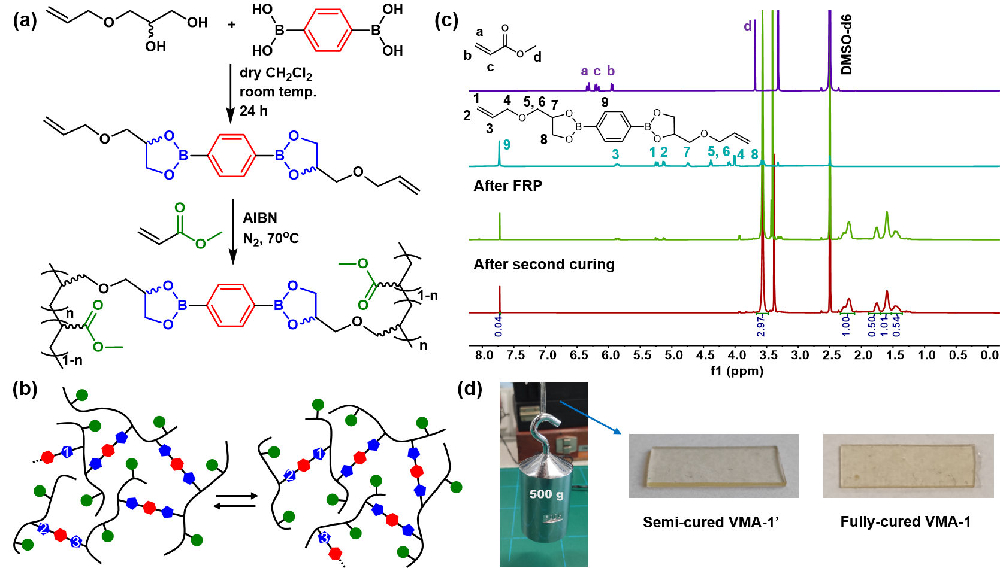
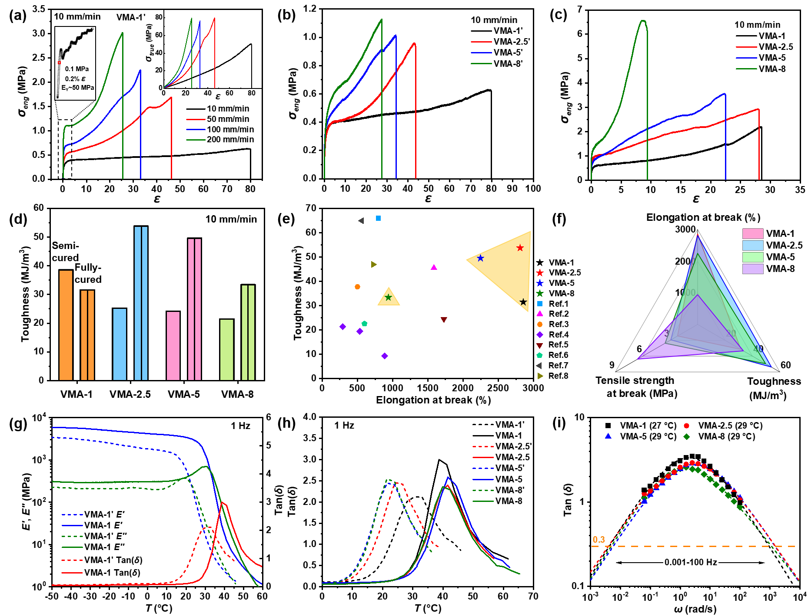
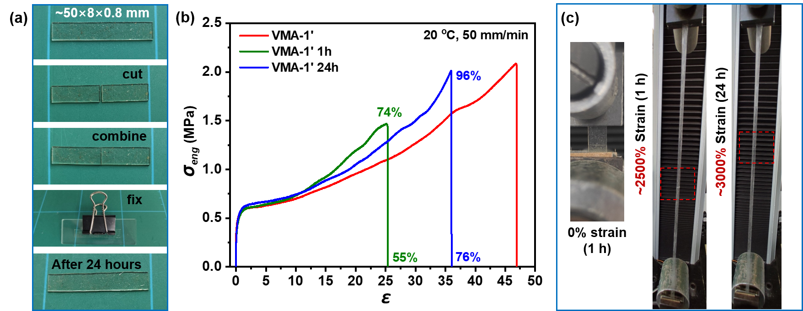
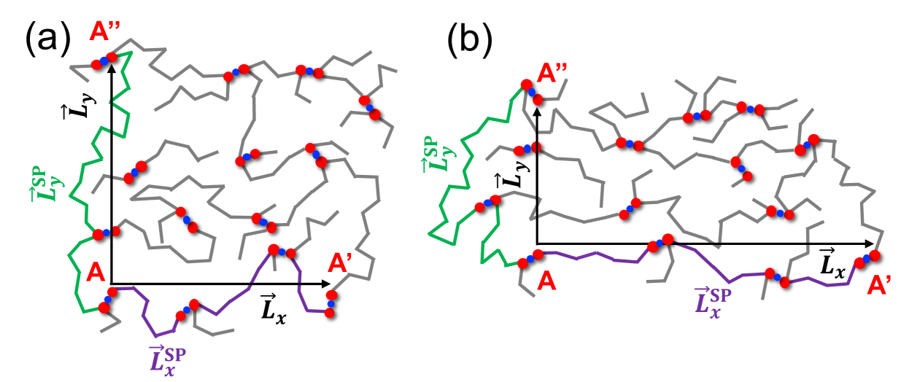
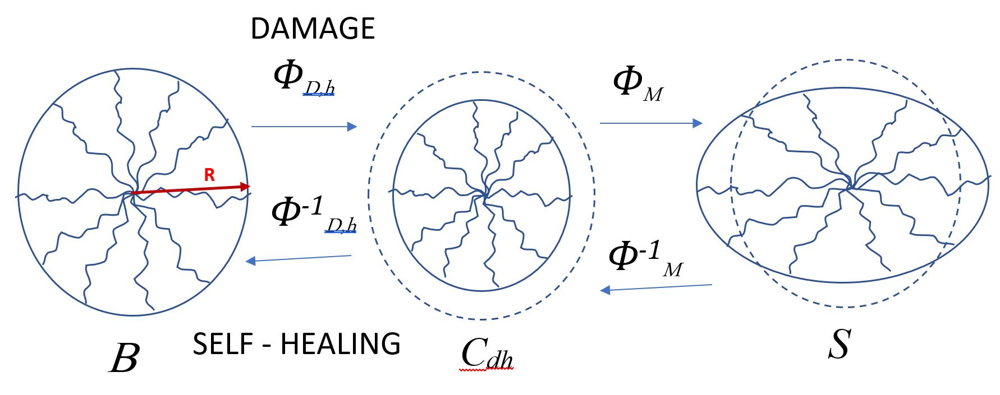

# 自己修復ビトリマー：動的共有結合が拓く超延伸・回復性高分子の物理

- **執筆日**: 2026-03-31
- **トピック**: 自己修復材料 / ビトリマー / 動的共有結合高分子
- **タグ**: Materials Synthesis and Processing / Phase Transitions; Energy-Efficient Functionality / Molecular Dynamics; Machine Learning
- **注目論文**: Zhao et al., *Ultra-stretchable and Self-Healable Vitrimers with Tuneable Damping and Mechanical Response*, arXiv:2503.03701 (2025)
- **参照関連論文数**: 6本

---

## 1. なぜ今この話題なのか

物質が傷を自ら治すという「自己修復」の概念は、生物学では当たり前のことだ。皮膚は切り傷を修復し、骨は骨折しても時間とともに癒合する。では、工業材料はどうだろうか。従来の高分子材料——ゴム、プラスチック、繊維——は一度破断すると回復しない。この「修復不可能性」は、材料の寿命を縮め、製品廃棄を加速し、資源の無駄遣いを招く一因となってきた。

この状況を根本的に変える可能性を持つ材料が「自己修復高分子」であり、なかでも近年急速に注目されているのが**ビトリマー（vitrimer）** と呼ばれる高分子ネットワークである。ビトリマーは、架橋された熱硬化性樹脂（エポキシやゴムなど）が持つ機械的強度・耐溶剤性と、熱可塑性樹脂が持つ加熱による成形性・リサイクル性を、動的共有結合というメカニズムを通じて両立させることに成功した材料クラスである。2011年にLiobelらによってコンセプトが提案されて以来、ビトリマー研究はポリマー科学・材料科学・軟性物質物理の交差領域で爆発的に発展してきた。

この研究潮流を後押しする社会的背景として、二つの大きな流れが挙げられる。一つは**サステナビリティへの要求**である。従来の架橋高分子は「サーモセット（熱硬化性樹脂）」と呼ばれ、一度硬化させると再成形も再利用もできない。世界的なプラスチック廃棄問題が深刻化するなか、修復・再利用可能な高分子ネットワークの開発は急務とされている。もう一つは**ソフトロボティクス・ウェアラブルデバイスの発展**である。人工皮膚・フレキシブルセンサ・弾性アクチュエータなどの次世代デバイスには、「壊れにくく、壊れても直る」材料が不可欠であり、超延伸性と自己修復性の両立が求められている。

2025年、英国リーズ大学の Zhao らは、これらすべての要件——超延伸性、機械的タフネス、自己修復性、室温での修復、再加工性、広帯域の機械的減衰——を単一の材料系において実現したビトリマーを報告し（arXiv:2503.03701）、大きな注目を集めた。本記事ではこの論文を核に据えながら、ビトリマーという材料クラスの物理的本質と、自己修復メカニズムをめぐる現在の研究の最前線を解説する。

---

## 2. この分野で何が未解決なのか

ビトリマーをはじめとする自己修復高分子の研究が活発に展開される一方で、いくつかの本質的な未解決問題が残っている。ここでは四つの中心的な論点を整理しておこう。

**問題1：「強さ」と「修復性」のトレードオフはどこまで解消できるのか？**
自己修復高分子の設計において長らく立ちはだかってきた壁が、「強さと修復性のトレードオフ」である。ネットワーク中の結合を強固にすれば機械的強度や弾性率は高まるが、損傷した際に界面が再会合しにくくなり修復性が低下する。逆に修復しやすくするために結合を弱くすれば、材料としての力学的性能が犠牲になる。ビトリマーはこの問題への一つの答えを提示しているが、「室温で自発的に完全修復し、かつ高強度・高タフネスを維持する」という究極の設計はまだ達成されていない。

**問題2：動的架橋交換反応のメカニズムと速度は何で決まるのか？**
ビトリマーの機能の中心にある「架橋交換反応（bond exchange reaction）」の速度・活性化エネルギー・温度依存性は、高分子の実用特性（加工温度、修復速度、応力緩和時間など）を直接左右する。しかし、その分子レベルのメカニズム——反応経路、触媒の役割、架橋密度依存性、ネットワーク構造の不均一性——について、実験と理論の間にはまだ大きなギャップがある。

**問題3：ネットワークのトポロジーは自己修復の動態をどう制御するのか？**
高分子ネットワークの自己修復は、破断した結合の再会合という化学的プロセスと、鎖の拡散・絡み合いという物理的プロセスが組み合わさった複雑な現象である。ネットワークの連結性（架橋密度・鎖長分布・欠陥構造）が修復速度や最終的な修復率にどう影響するかは、近年ようやく計算科学的に解析が始まった段階である。

**問題4：ビトリマーの混合・相挙動をどう制御するか？**
ビトリマー単体としての物性理解が進む一方で、ビトリマーをより安価な熱可塑性樹脂と混合して用いたい場合（コスト低減、機能付与）に、相分離が問題になることが最近明らかになってきた。2026年にはビトリマーと通常ポリマーのブレンドにおいてエントロピー駆動の相分離が起きることが理論・シミュレーションで示された（arXiv:2603.25532）。これは実用的な材料設計に重要な制約を与える。

---

## 3. 注目論文の核心：何が前進し、何がまだ仮説か

### これ以前に何が分かっていたか

ビトリマーの原型として最も広く研究されてきたのは、**ヒドロキシエステル交換反応**（transesterification）を動的架橋機構として用いるエポキシベースのビトリマーである。これらは一般に150〜200℃以上の高温で応力緩和・加工が可能であるが、室温での自己修復は難しかった。一方、室温修復が可能な系として水素結合や金属配位結合を用いた超分子ポリマーが知られていたが、これらは剛性や強度が低く、機械的性能の点でビトリマーに劣ることが多かった。

**ホウ酸エステル（boronic ester）を用いたビトリマー**は、その高い交換速度（室温付近でも活性）と反応選択性から注目されてきた。特に**ジオキサボロラン（dioxaborolane）交換反応**はルイス酸（ホウ素）を介した速い会合/解離反応であり、触媒なしで室温付近でも機能することが2019年頃から明らかになりつつあった。しかし、このメカニズムを実際に高分子に組み込んだ際に、超延伸性（1000%超の伸び）・高タフネス・広帯域減衰性・自己修復性を**同時に**達成した例は報告されていなかった。

### 今回どの点で前進したか

Zhao ら（2025）は、ポリ(メチルアクリレート)（PMA）をバックボーン高分子として、ジオキサボロラン架橋剤（diallyl dioxaborolane crosslinker）による架橋ネットワークを構築した（Figure 1）。架橋剤量（「硬化度」）を系統的に変えることで、半硬化（semi-cured）から完全硬化（fully-cured）まで、物性を連続的にチューニングできる設計を採用した点が第一の新規性である。

*Figure 1: ビトリマーの合成スキームとジオキサボロランの会合型架橋交換（associative bond exchange）メカニズム。半硬化サンプルは500gの重りを支えることができる（写真中央）。(Zhao et al. 2025, arXiv:2503.03701, CC BY 4.0)*

半硬化サンプル（VMA-1'）では、ガラス転移温度 $T_g$ が室温（20℃付近）に近く、ネットワークが比較的柔軟であるため、伸び率が最大**8000%**（最低ひずみ速度条件）に達した。これは既報の延伸性エラストマーの中でも際立って高い値であり、かつ応力-ひずみ曲線がひずみ硬化を示す（一般のゴムで見られるひずみ軟化とは対照的）ため、機械的タフネスが 40 MJ/m³ 前後と非常に高い。完全硬化サンプルでも1000〜3000%の伸び率と高い引張強度を示した（Figure 5）。

*Figure 5: 各硬化度のビトリマーにおける応力-ひずみ曲線（a-c）・タフネス比較（d-e）・物性レーダーチャート（f）・DMAおよびレオロジーによる損失係数 tan(δ)（g-i）。(Zhao et al. 2025, arXiv:2503.03701, CC BY 4.0)*

動的力学分析（DMA）とレオロジー測定から得られた損失係数 tan(δ) は最大値が2〜3と非常に高く、さらに0.001〜100 Hz の5桁に及ぶ広い周波数域にわたって tan(δ) > 0.3 を維持する。これは高分子材料の中でも例外的な「広帯域減衰性」であり、防振・吸音・衝撃吸収材料への応用が見込める。

自己修復性については、半硬化サンプルを完全切断した後、室温24時間後に接触界面を確認したところ、破断面が「もはや視認できないほど」癒合し、修復後の引張試験では元の伸び率の76%・引張強度の96%が回復した（Figure 6）。

*Figure 6: 切断・室温24時間放置後の自己修復。写真は修復前後の外観変化を示し、修復後の引張試験では元の破断強度の96%が回復された。(Zhao et al. 2025, arXiv:2503.03701, CC BY 4.0)*

さらに、熱機械的再加工（ホットプレス）または化学的再加工（加水分解によるホウ酸エステル切断→再硬化）のいずれによっても、引張強度・伸び率がほぼ完全に回復した。これはビトリマーとしてのリサイクル性を直接実証するものである。

### 何がまだ仮説段階か

この研究の最も重要な未解決点は、「なぜこの材料系が超延伸性と自己修復性を同時に実現できるのか」のミクロな分子レベルの理解である。著者らはジオキサボロランの会合型交換反応が室温でも活性であることを原因として挙げているが、その反応速度や活性化エネルギーのネットワーク構造依存性、ネットワーク内の架橋点分布の不均一性、ホウ素サイトと高分子鎖の動力学的結合がどのように集団的な緩和挙動を生み出すか、といった詳細は実験的に未確認である。また、長期の繰り返し修復（疲労耐久性）や湿潤環境下でのホウ酸エステルの安定性（ホウ酸エステルは水により加水分解されやすい）についての系統的なデータも示されておらず、実用デバイスへの適用可能性を評価するには今後の研究が必要である。

---

## 4. 背景と研究史：この論文はどこに位置づくか

### ビトリマーの誕生と分類

「ビトリマー」という概念を提唱したのは、2011年の Leibler グループの研究である。彼らはエポキシ樹脂にヒドロキシ基を持つ化合物を加え、触媒の存在下でトランスエステル化反応が進行することを示した。この材料は「Tg 以上では流動するが、ネットワークは切断されずにトポロジーが保たれる」という新しい挙動を示した。これは「ガラス（vitreous）」と「エラストマー（elastomer）」の融合から「vitrimer」と命名された。

ビトリマーの動的結合機構は大別して二種類に分類できる。**会合型（associative）交換**では、古い結合が切れる前に新しい結合が形成され（置換反応型）、ネットワークのトポロジーが保たれながら架橋点が移動する。これに対して**解離型（dissociative）交換**では、まず結合が切れて一時的なゲル-ゾル転移的な状態を経てから再結合する（脱重合→再重合型）。Zhao らの用いたジオキサボロラン交換は**会合型**に分類され、ネットワーク密度を保ちながら高速の架橋交換を可能にするという利点がある。

### エントロピー的cohesionとネットワーク密度

Karmakar ら（arXiv:2402.16226, 2024）は、MD シミュレーションを用いてビトリマーの基礎物性を調べ、**動的架橋がポリマー密度に直接影響する**という興味深い結果を報告している。動的に交換される架橋点は、鎖の構成エントロピーを変化させることで「エントロピー的な凝集力（entropic cohesion）」を生み出し、バルクの密度を通常の非動的架橋ネットワークよりも高くすることが示された。また架橋点はネットワーク内部では比較的均一に分布するが、高分子-空気界面付近では枯渇することも分かった。この知見は、ビトリマーの表面特性（接着性、修復に必要な界面接触）を理解する上で重要な背景を与える。すなわち、ビトリマーを切断した際、切断面には架橋点が少なく、表面近傍の高分子鎖は架橋に縛られていないため、室温でも鎖の拡散・再接触が比較的容易であることが示唆される。

### 動的高分子ネットワークにおけるトポロジーと修復の連結

同年（2024年）、Yin ら（arXiv:2401.11087）はコースグレインド分子動力学（CGMD）シミュレーションを通じて、動的高分子ネットワーク（Dynamic Polymer Network, DPN）の力学挙動を「ネットワークグラフのトポロジー」の観点から記述することに成功した。彼らが着目したのは、ネットワーク中の遠隔二点間を結ぶ「最短経路（Shortest Path, SP）」の長さである。

*Figure 3: ひずみ前（左）とひずみ後（右）の高分子ネットワークスナップショット。ひずみ方向の最短経路（SP）が伸長し、横断方向のSPが短縮する様子が模式的に示されている。(Yin et al. 2024, arXiv:2401.11087, CC BY 4.0)*

ひずみが加わるとSPはひずみ方向に伸長し、鎖切断は「SPを通る鎖」に集中する。一方、ひずみが除去されて自由になると、再形成・再分配によってSPは徐々に回復していく。Yin らはこの「SP 進化」が3つの経験則に従うことを明らかにした。この枠組みは、Zhao らのビトリマーにおける「ひずみ誘起損傷と自己修復」を微視的に理解するための重要な手がかりを与える。特に、会合型交換反応がネットワークのSPを動的に再分配し続けることが、超延伸の際の突発的な破断を防ぎ、「均一な応力分散→ひずみ硬化」という挙動につながっているという解釈は、この文脈で整合的である。

---

## 5. どの解釈が最も妥当か：証拠・比較・限界

### 注目論文の解釈を支える根拠

Zhao らの主要な解釈は「ジオキサボロランの会合型交換反応が、室温での架橋点動力学を可能にし、これが超延伸性・自己修復性・広帯域減衰性を同時に実現する」というものである。この解釈を支える最も直接的な証拠は次の二点だ。

第一に、**小振幅振動ずり（SAOS）測定から得たマスターカーブ**（Figure 4の概要）が、低周波数側に明確な「架橋交換に帰属される第二の緩和モード」を示している点である。α-緩和（高分子主鎖の協同運動）よりも長時間スケールのこの緩和は、架橋交換の交換反応速度と定量的に対応しており、その温度依存性がアレニウス的であることで活性化エンタルピー ΔH‡ ≈ 80 kJ/mol が得られている。これは既報のジオキサボロランビトリマー系と整合する。

第二に、**半硬化サンプルのガラス転移温度（$T_g$）が20℃付近にある**ことが、室温での自己修復に決定的な役割を果たしているという解釈である。$T_g$ 以下では高分子セグメントの大規模運動が凍結されるため、界面での鎖拡散・再絡み合いが極めて遅い。$T_g$ が室温付近であれば、室温環境でも鎖が動き、界面を超えた絡み合いが形成され、物理的な癒合が促進される。DSCによる $T_g$ 測定がこれを支持している。

さらに、Karmakar ら（2402.16226）の「界面近傍での架橋点枯渇」という知見も、この解釈を間接的に補強する。修復の「第一段階」として、界面近傍の架橋点が少ない領域でまず鎖の拡散・接触が起き（物理的修復）、次に架橋交換反応による化学的再結合が続く（化学的修復）という二段階の修復機構が想定される。

### 他の可能な解釈とその限界

一方、批判的な視点として指摘されるのは、**「超延伸性」の起源が架橋交換に本当に帰属されるのか、それとも単なるバックボーン高分子（PMA）の粘弾性特性に帰属されるのか**という問いである。PMA は $T_g$ が低いエラストマーの一種であり、架橋なしでも高い伸び率を示す。Zhao らは非架橋の PMA との比較実験を行っていないため、この点を完全には解明していない。ただし、架橋密度を変えることで物性が系統的にチューニングできることは示されており、架橋構造がある程度の役割を果たしていることは間違いない。

次に、**連続修復耐久性**の問題がある。Figure 6 が示すのは「一回の切断→修復」という一サイクルの結果のみであり、繰り返し切断・修復（例えば10回、100回）した場合の性能維持については報告がない。修復のたびに残留ひずみや架橋点の再分布が蓄積すれば、修復率は次第に低下すると予想されるが、これを定量的に検討した実験は今後の課題である。

また、**湿度依存性**も重要な問題である。ホウ酸エステル結合は一般に加水分解されやすく、高湿度環境下では架橋点の解離が促進されて材料が軟化・溶解する可能性がある。Zhao らは TGA による熱安定性（〜250℃）は確認しているが、湿度・水環境に対する安定性データは示していない。実際、dioxaborolane はより加水分解安定性が高い（一般のビニルボロネートよりは安定）とされているが、この系での系統的な検討は今後必要だ。

### 他材料系・他手法との比較

Das と Kumari（arXiv:2503.18771）の連続体力学モデルは、ビトリマーに限らない広義の自己修復エラストマー全般を対象とした損傷-修復の constitutive framework（構成方程式的枠組み）を提供している。

*Figure 1: 「未損傷のユークリッド多様体」→「損傷したリーマン多様体」→「変形後の配置」という三段階の幾何学的配置スキーム。損傷が幾何学的不適合として記述される。(Das & Kumari 2025, arXiv:2503.18771, CC BY 4.0)*

このモデルが採用する「損傷はユークリッド多様体からリーマン多様体への変換として現れる」という幾何学的解釈は、断面破断面を横断する高分子鎖密度の減少（架橋点の解離）を、リッチ曲率として符号化することで統一的に記述する。同モデルは実験的に得られたビトリマーの破壊靭性回復曲線を再現できることが示されており、Zhao らのシステムにも適用可能な枠組みを提供している。ただし、このモデルは連続体近似であり、個々の架橋交換反応や鎖拡散といったミクロな描像とを直接結ぶものではない点に注意が必要である。

Cohen ら（arXiv:2603.23881, 2026）は高分子ネットワークの「破断」を統計力学的に定式化し、一本の高分子鎖の破断確率をその張力の関数として計算する framework を構築した。これは Zhao らのビトリマーにおける「ひずみ硬化」との関連で興味深い。ひずみ硬化は、破断に近い鎖が少ない（全体として鎖に均一に力が分配されている）ことの帰結として理解できるが、架橋交換によるトポロジーの動的再分配がどのように破断確率の分布を平滑化するかは、理論的に追求すべき問いとして残っている。

---

## 6. 何が一般化できるのか：材料・手法・応用への広がり

### 動的共有結合の化学多様性

Zhao らが採用したジオキサボロラン交換は、ビトリマーを構成できる動的共有結合のほんの一例に過ぎない。現在研究されている主要な動的共有結合を挙げると、エステル交換（transesterification）、ジスルフィド交換、ビニルスルフィド-ジエン交換（Diels-Alder型）、イミン（シッフ塩基）交換、ウレタン交換、シロキサン交換などがある。それぞれ交換速度、温度依存性、触媒依存性、加水分解安定性が異なり、用途に応じた選択が必要になる。

これらの多様な化学系の性能を比較・最適化するために、マテリアルズ・インフォマティクスのアプローチが有効性を示しつつある。Zheng ら（arXiv:2503.20956, 2025）は、分子動力学（MD）シミュレーションデータを使って機械学習モデルを訓練し、ビトリマーのガラス転移温度（$T_g$）を化学構造から予測することに成功した。彼らのアプローチは、実験データが少ない高分子材料系において MD シミュレーションで合成的にデータを拡張し、そこに機械学習を組み合わせることで新規材料の設計を加速するという方向性を示しており、Zhao らが実験的に探索したような「架橋剤の分子設計 → 最適な $T_g$・修復速度・タフネスの実現」というサイクルの自動化・加速に直結する。

### 材料ブレンドの問題：エントロピー相分離

実際の製品化においては、ビトリマー単体ではなく、より安価な熱可塑性樹脂（例えばポリエチレン、ポリプロピレン）とブレンドしたい場合がある。しかし 2026 年に発表された Constantinou ら（arXiv:2603.25532）の研究は、この試みに対して重要な警告を発している。

彼らはポリマー-ビトリマーブレンドの理論的な相図を解析し、エネルギー的相互作用がゼロであっても（すなわち化学的に相性がよくても）、**エントロピーだけで相分離が起きうる**ことを示した。このエントロピー相分離は、ビトリマーが持つ「交換可能な架橋点」という特殊な統計力学的性質に由来している。解離性ポリマー系（一端が会合型架橋に参加する鎖）と類似した相図が成立し、架橋点の密度が高いほど相分離が起きやすくなる。この知見は、Zhao らのビトリマーを他の熱可塑性材料と混合・複合化する際に、相均一性の確保が非自明であることを示しており、材料系の実用化設計において重要な制約条件となる。

### 生物材料・デバイスへの波及

ビトリマーが示す「超延伸性＋タフネス＋自己修復」という組み合わせは、生体軟組織（筋肉・腱・軟骨）の力学的特性と方向性が一致している。生体組織も「高タフネスかつ大変形可能」であり、かつ損傷を自己修復できる。従って、ビトリマーは生体適合性を持たせることができれば、人工靭帯・生体模倣皮膚・インプラント材料の候補になりうる。ただし、現行のジオキサボロランビトリマーは生体適合性や毒性が未検討であり、この方向への応用には化学的設計の改良が不可欠である。

電子・センサデバイス分野においては、伸縮可能な配線・電極への応用が考えられる。高い tan(δ) は振動エネルギーの吸収を意味し、振動の多い環境での電気部品保護や、体動に追従するウェアラブルセンサの基材として有望である。修復性は、微細な亀裂が生じた際にも電気的接続を維持し、デバイス寿命を延長する効果が期待される。

---

## 7. 基礎から理解する

### 高分子ネットワークとは何か

高分子（ポリマー）とは、小さな分子（モノマー）が共有結合で数千〜数百万個つながった長い分子である。天然ゴムのように長い鎖が絡み合っているだけの「非架橋」状態では、引っ張ればいくらでも伸び（流動し）、元には戻らない。ところが、鎖と鎖の間に「架橋（cross-link）」と呼ばれる共有結合の橋を架けると、ネットワーク構造が形成され、引っ張っても元の形に戻るゴム弾性が現れる。

架橋密度が低い（架橋点が少ない）ほど「柔らかく、よく伸びる」材料になり、高いほど「硬く、伸びにくい」材料になる。熱硬化性樹脂（エポキシ接着剤など）は非常に高い架橋密度を持ち、剛性・耐溶剤性に優れるが、「硬化したら再成形不可」である。熱可塑性樹脂（ポリエチレン袋など）は架橋がなく加熱で流動するため再成形可能だが、強度に上限がある。

ビトリマーはこの二者の中間に位置し、「架橋されているが、架橋点が動的に交換できる」という新しいクラスである。

### ゴム弾性と自由エネルギー

ゴムが弾性を示す物理的本質は「エントロピー弾性」にある。ひとつの高分子鎖を考えよう。長い鎖がとりうる配置（コンフォメーション）の数は非常に多いが、それが引き延ばされた「直線的な状態」は配置の数が少ない。つまり、引き伸ばされた状態は**エントロピーが低い**。エントロピーが低い状態は熱力学的に不安定であるため、力を除くとエントロピーを回復しようとして元の形に戻る。これがゴム弾性の本質である。

定量的には、末端間距離が $\mathbf{r}$ の鎖の自由エネルギー（ガウス鎖近似）は

$$
F(\mathbf{r}) = \frac{3 k_B T}{2 N b^2} |\mathbf{r}|^2
$$

と表される。ここで $k_B$ はボルツマン定数、$T$ は温度、$N$ はセグメント数、$b$ はセグメント長である。このばね定数 $k = 3k_BT/(Nb^2)$ は温度に比例し（より熱いほど弾性率が高い！）、これがゴムの弾性率が加熱すると増加する「ゴム的挙動」の原因だ。

ゴムの平衡弾性率（貯蔵弾性率 $G'_0$、ゴム弾性域）はネットワーク理論から

$$
G'_0 = \nu k_B T
$$

と表される。ここで $\nu$ は有効ネットワーク鎖密度（単位体積あたりの架橋点間の鎖の数）である。ビトリマーでは動的架橋交換によって $\nu$ が外力や温度に応じて再分配されるため、この $G'_0$ が時間・温度・変形に依存するというのが「通常のゴムとの本質的な違い」である。

### 粘弾性と Arrhenius 型応力緩和

固体（弾性体）と液体（粘性体）の中間的な性質を持つ材料を**粘弾性体**という。高分子材料は全般にこの性質を示し、「速い変形（高周波数）」に対しては固体的に（弾性的に）応答し、「遅い変形（低周波数）」に対しては液体的に（粘性的に）流れる。これを周波数域で表したのが損失係数 tan(δ) であり、$tan(\delta) = G''/G'$（G'' は損失弾性率、G' は貯蔵弾性率）で定義される。

ビトリマーが示す Arrhenius 型の応力緩和時間 $\tau$ は

$$
\tau = \tau_0 \exp\!\left(\frac{\Delta H^\ddagger}{k_B T}\right)
$$

と書ける。$\Delta H^\ddagger$ は架橋交換反応の活性化エンタルピー、$\tau_0$ は前因子である。Zhao らが求めた $\Delta H^\ddagger \approx 80 \text{ kJ/mol}$ は、dioxaborolane 交換反応としては標準的な値であり、この反応が室温付近でも緩和を駆動できることを意味する（比較として水素結合による修復では $\Delta H^\ddagger \sim 10〜30 \text{ kJ/mol}$ と低い）。

架橋交換が起きると、架橋点の「アイデンティティ（どの鎖とどの鎖が架橋されているか）」が変わるが、**ネットワーク密度（架橋点数）は変わらない**。これが「会合型交換」の特徴であり、これにより溶解せずに流動する「固体のまま形を変えられる」という独特の性質が実現される。

### ガラス転移温度と自己修復の関係

高分子の $T_g$ はセグメント運動が凍結される温度である。$T < T_g$ ではガラス状態で材料は硬く脆い。$T > T_g$ ではゴム状態・流動状態となり、鎖運動が活発になる。自己修復には界面を越えた高分子鎖の拡散と絡み合いが必要だが、$T_g$ が室温より高い場合、室温では鎖が動けず自己修復は起きない。

Zhao らの半硬化 PMA ビトリマーが $T_g \approx 20\text{°C}$ を示したことは、室温が $T_g$ 付近（わずかに高い側）にあることを意味する。この条件下では鎖の拡散係数が適度に大きく、24時間という現実的な時間スケールで修復が完了する。完全硬化サンプルでは $T_g$ が上昇して室温での鎖運動が制限されるため、自己修復は起きにくい。これは、「$T_g$ をチューニングすることで修復速度を制御できる」という設計指針を示している。

---

## 8. 重要キーワード10個

**1. ビトリマー（Vitrimer）**
動的共有結合を架橋に用いた高分子ネットワーク。加熱や刺激により架橋点が交換反応を起こし、材料を溶解させずにトポロジーを変化させることができる。熱硬化性樹脂の強度・耐溶剤性と、熱可塑性樹脂の成形性・リサイクル性を両立する「第三の高分子」として位置づけられる。"Glass（vitreous）"と"Elastomer"を組み合わせた造語。

**2. 共有結合適応型ネットワーク（Covalent Adaptable Network, CAN）**
共有結合により架橋されているが、その架橋が何らかの刺激（熱・光・pH）に応答して切断・再形成できるネットワークの総称。会合型（associative）と解離型（dissociative）の二種類があり、ビトリマーは会合型 CAN に分類される。CANは自己修復・形状記憶・リサイクル性の基盤となる。

**3. 会合型交換反応（Associative Bond Exchange）**
古い共有結合が切れる前に新しい結合が形成される「置換反応型」の架橋交換。反応の遷移状態において古い結合・新しい結合の両方が存在するため、ネットワーク密度が常に保たれ（ゾル転移を経ない）、形状保持と流動性が両立できる。ジオキサボロラン交換はこの典型例。

**4. ガラス転移温度（$T_g$, Glass Transition Temperature）**
高分子セグメントの大規模な協同運動が凍結される温度。$T > T_g$ では「ゴム状態」、$T < T_g$ では「ガラス状態」。自己修復には $T > T_g$ での鎖運動が必要であるため、$T_g$ は修復速度の設計パラメータとなる。DSC（示差走査熱量計）で測定される。

**5. 損失係数・tan(δ)（Loss Tangent）**
粘弾性材料の「エネルギー散逸効率」を表す無次元数。$\tan(\delta) = G''/G'$（損失弾性率 / 貯蔵弾性率）。$\tan(\delta)$ が大きいほど振動エネルギーを熱として吸収する能力が高く、防振材や吸音材として有用。Zhao らの材料は $\tan(\delta)_{max} \approx 2\text{〜}3$ という極めて高い値を示す。

**6. ホウ酸エステル交換（Boronic Ester Exchange / Dioxaborolane Metathesis）**
ホウ素（B）原子を含む動的共有結合の一種。ホウ素はルイス酸として隣接するアルコキシ基やフェノキシ基と可逆的に結合でき、触媒なしで温和な条件下（室温付近）で交換反応が進む。dioxaborolane（環状ジオールとのホウ酸エステル）は安定性が高く、交換速度も適度に高いため、室温修復型ビトリマーの架橋点として特に有用。

**7. タフネス（Toughness, 破壊靭性）**
材料が破断するまでに吸収できるエネルギー量（応力-ひずみ曲線の面積）であり、単位 J/m³ または MJ/m³ で表される。タフネスが高い材料は「強くてよく伸びる」。一般に強度（引張強さ）と延伸性（破断伸び）はトレードオフにあり、両方が高い材料は珍しい。Zhao らのビトリマーは引張強度と伸び率をともに高いレベルで達成し、タフネスが 40 MJ/m³ に達した。

**8. エントロピー相分離（Entropic Phase Separation）**
化学的相互作用がゼロであっても、混合エントロピーと配置エントロピーのバランスによって混合物が相分離する現象。通常の混合では「混合エントロピーが増えるから混ざる」と理解されるが、ビトリマーと通常ポリマーのブレンドでは、ビトリマーの架橋点が占める自由度の分だけ混合エントロピーが下がるため、純粋にエントロピー的な理由で相分離しうることが 2026 年に示された（Constantinou et al., 2603.25532）。

**9. コースグレインド分子動力学（Coarse-Grained Molecular Dynamics, CGMD）**
全原子 MD シミュレーションでは扱いにくい「大きな時間・空間スケール」での高分子挙動を解析するために、複数の原子をひとつの「ビーズ（coarse grain）」にまとめて計算する手法。高分子鎖の形状変化・ネットワーク進化・自己修復ダイナミクスの解析に適している。Yin ら（2401.11087）が動的高分子ネットワークの損傷・修復を解析するのに用いた。

**10. マスターカーブ（Master Curve）**
粘弾性データに「時間-温度重ね合わせ原理（Time-Temperature Superposition, TTS）」を適用し、異なる温度で測定した周波数応答曲線を基準温度に換算して重ね合わせた広帯域データ。これによって実測困難な超低周波・超高周波域の物性を間接的に評価できる。ビトリマーでは、架橋交換緩和が高分子鎖の構造緩和と異なる温度依存性（TTS が厳密には成立しない場合あり）を持つため、マスターカーブ構築には注意が必要だが、Zhao らは適切な補正を行ってアレニウスプロットから $\Delta H^\ddagger$ を求めた。

---

## 9. おわりに：何が分かり、何がまだ残っているのか

Zhao ら（2025）の研究が示したことは、ジオキサボロランという特定の動的共有結合化学を選択することで、従来不可能だった「超延伸性・高タフネス・自己修復・広帯域減衰・リサイクル性」の同時実現が可能であるという事実である。この成果は、材料化学・軟性物質物理・マテリアルズ・インフォマティクスの三分野が交差する地点における重要な前進であり、ビトリマーが「超分子自己修復高分子（水素結合系）」でも「単純なゴム弾性体」でもない、独自の性能空間を開拓できることを説得力を持って示した。理論的に見ても、Yin ら（2401.11087）のネットワークトポロジー解析、Karmakar ら（2402.16226）のエントロピー的凝集力の研究、Das & Kumari（2503.18771）の幾何学的 constitutive モデルなど、この結果を支える多層的な理論基盤が同時期に整備されつつある点は、分野全体の成熟を示している。

一方、依然として残る主要な未解決問題は大きく二つに整理できる。一つは「ミクロな分子設計と室温修復速度の定量的な関係の未解明」である。今後1〜3年で重要になるのは、CGMDや粗視化シミュレーションと機械学習ポテンシャルを組み合わせた大規模シミュレーションによる架橋交換反応のネットワーク内ダイナミクス解析、ならびに中性子散乱・X線光子相関分光（XPCS）などを用いた nanoscale での鎖拡散・架橋点移動のリアルタイム計測である。もう一つは「ビトリマーの複合化・実用化における相分離問題」であり、Constantinou ら（2603.25532）が示したエントロピー相分離のメカニズムを踏まえた上で、相均一なビトリマー複合材料をどう設計するかが、材料工学的に最も緊急の課題となっている。機械学習を用いた高分子設計（Zheng ら, 2503.20956）のような材料インフォマティクス的アプローチが、この問題解決においても鍵を握ることが予想される。

---

## 参考論文一覧

1. **[arXiv:2503.03701]** Jiaxin Zhao, Nicholas J. Warren, Richard Mandle, Peter Hine, Daniel J Read, Andrew J. Wilson, Johan Mattsson. "Ultra-stretchable and Self-Healable Vitrimers with Tuneable Damping and Mechanical Response." *arXiv* (2025). [CC BY 4.0] **【注目論文】**

2. **[arXiv:2603.25532]** A. A. Rispo Constantinou, B. Magyari, G. Ianniruberto, E. van Ruymbeke, D. J. Read. "Entropic phase separation in polymer--vitrimer melts." *arXiv* (2026). [CC BY-SA 4.0]

3. **[arXiv:2503.20956]** Yiwen Zheng et al. "Toward Sustainable Polymer Design: A Molecular Dynamics-Informed Machine Learning Approach for Vitrimers." *arXiv* (2025). [arXiv license]

4. **[arXiv:2401.11087]** Yikai Yin, Shaswat Mohanty, Christopher B. Cooper, Zhenan Bao, Wei Cai. "Network evolution controlling strain-induced damage and self-healing of elastomers with dynamic bonds." *arXiv* (2024). [CC BY 4.0]

5. **[arXiv:2503.18771]** Sanhita Das, Nivedita Kumari. "A geometrically inspired constitutive framework for damage and intrinsic self-healing of elastomers." *arXiv* (2025). [CC BY 4.0]

6. **[arXiv:2402.16226]** Rahul Karmakar, Himanshu, Srikanth Sastry, Sanat K Kumar, Tarak K Patra. "Entropic Cohesion in Vitrimers." *arXiv* (2024). [CC BY 4.0]

7. **[arXiv:2603.23881]** Noy Cohen, Nikolaos Bouklas, Chung-Yuen Hui. "Rethinking failure in polymer networks: a probabilistic view on progressive damage." *arXiv* (2026). [arXiv license]
