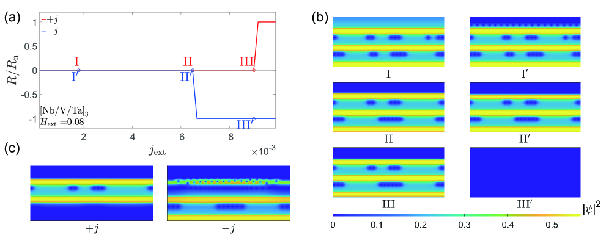
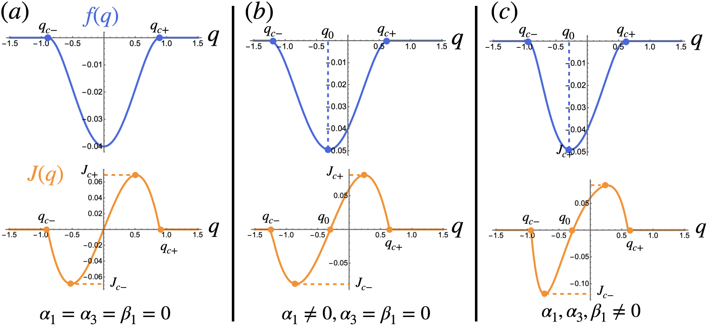
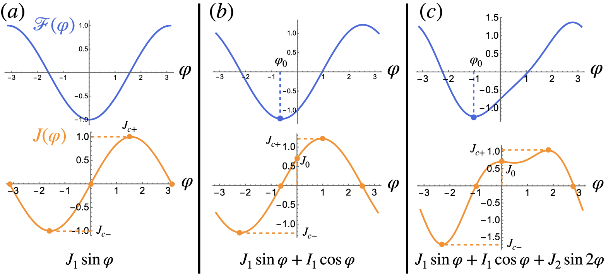
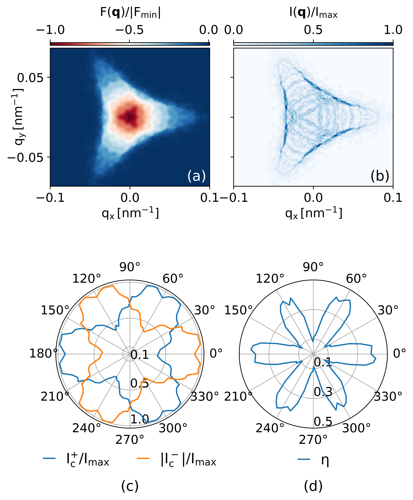
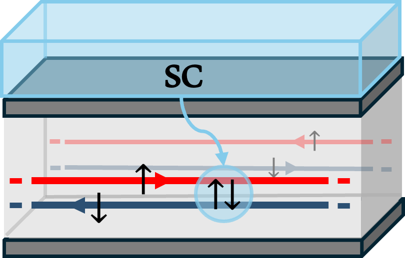

# 超伝導ダイオード効果——渦糸ダイナミクスが拓く非相反輸送の物理と多様なメカニズムの統一的理解

- **執筆日**: 2026-03-29
- **トピック**: 超伝導ダイオード効果（SDE）における渦糸機構と内因性機構の比較・統合
- **タグ**: Superconductivity and Strongly Correlated Systems / Nonequilibrium and Dynamic Response; Devices and Functional Materials / Phase-Field Method
- **注目論文**: Jiong Li, Ji Jiang, Qing-Hu Chen, "Vortex-driven superconducting diode effect in asymmetric multilayer heterostructures," *Communications Physics* **9**, 49 (2026). [arXiv:2603.25147]
- **参照関連論文数**: 6本

---

## 1. なぜ今この話題なのか

電気ダイオードは現代のエレクトロニクスの基本部品であり、電流を一方向にしか流さないという非相反性を利用して整流・スイッチング動作を実現する。これと同じ概念を超伝導体に持ち込んだのが「超伝導ダイオード効果（Superconducting Diode Effect、SDE）」である。通常の超伝導体では、臨界電流は電流の方向に依存しない。すなわち正方向の電流でも負方向の電流でも、絶対値が同じであれば同じ超伝導状態が保たれる。これは時間反転対称性と空間反転対称性がどちらも保たれているためである。

しかし、これら二つの対称性が同時に破れると、正方向の臨界電流 $J_c^+$ と負方向の臨界電流 $|J_c^-|$ が異なる、すなわち $J_c^+ \neq |J_c^-|$ となる状況が生じる。これが超伝導ダイオード効果の本質であり、ある電流値の範囲内では正方向にのみ超伝導（無抵抗）状態が成立し、逆方向では抵抗状態になる。理想的には、通常のp-n接合ダイオードと同様に超伝導体がゼロ抵抗の整流素子として機能することになる。この効果が実現すれば、エネルギー損失のない超伝導回路素子、量子コンピューターのクロック回路、高感度センサーなど多様な応用への道が開ける。

研究史的には、超伝導薄膜における非対称臨界電流は1960年代にも一部の実験で観察されていた。しかし、それが「非相反輸送」という枠組みで再解釈され、材料設計の観点から体系的に研究されるようになったのは2020年のAndoらの発見以降のことである。彼らは[Nb/V/Ta]₃₀という人工超格子において、外部磁場存在下での明確なSDEを報告し、この話題に対する世界的な関心を呼び起こした[Ando et al., *Nature* (2020)]。それ以来わずか数年で、スピン軌道結合・磁場効果・渦糸ダイナミクス・位相的電子状態・FFLO状態など、多様なメカニズムが次々と提案・実証され、理論と実験の両面でこのテーマは急速に発展している。

2026年現在、SDEの研究が一段と重要性を増している理由は、「メカニズムの多様性と複雑な絡み合い」にある。単に現象を観察するだけでなく、どのメカニズムが支配的で、材料設計上どの変数を制御すれば効率を高められるかが問われている段階に入ってきた。本記事が中心的に取り上げる2603.25147の論文は、まさにこの問いに正面から向き合い、[Nb/V/Ta]多層膜における渦糸ダイナミクスをTDGL（時間依存Ginzburg-Landau）シミュレーションで精密に追い、「どの積層順でどれだけの効率が得られ、なぜ積層順を変えると効果が消えるか」を初めて系統的に解明した研究である。

---

## 2. この分野で何が未解決なのか

SDEの分野において現在最も重要な未解決問題を整理すると、主に四つの論点に集約される。

**第一の問い：どのメカニズムが実際の材料で支配的か。**
SDEが発現する理論的メカニズムは現在いくつか知られている。スピン軌道結合と時間反転対称性の破れ（外部磁場など）が組み合わさる機構、渦糸（アブリコソフ渦糸）の非対称ダイナミクスに起因する機構、有限運動量ペアリング（FFLO）状態に起因する機構、そしてトポロジカルな端状態に由来する内因性機構などである。実際の実験系ではこれらが複合的に現れる場合が多く、どれが主役かを特定することは容易でない。さらに、渦糸による外因性の効果が本質的な（内因性の）SDEを隠してしまうという問題も指摘されている（Shaffer & Levchenko, arXiv:2510.25864）。

**第二の問い：整流効率 η をどこまで高められるか、そして完全ダイオード（η = 1）は可能か。**
整流効率は一般に $\eta = (J_c^+ - |J_c^-|) / (J_c^+ + |J_c^-|)$ と定義される。通常の材料系で報告される効率は5〜35%程度にとどまることが多い。一方で、Josephsonダイオード系では50%を超える値も報告されており、理論的には特定の条件下（位相転移点近傍のFFLO、多端子回路）で η → 1 が実現し得ると示されている。しかし、実験的に高効率SDEを安定・再現性よく実現する材料・構造設計指針は未確立である。

**第三の問い：外部磁場なしで（内因性に）SDEを実現できるか。**
実験的に有用なSDE素子を考えると、外部磁場の印加は素子の小型化・集積化の障害となりやすい。スピン軌道結合と時間反転対称性の両方を内因的に破る材料系（非中心対称超伝導体、ヴァレー分極状態、量子スピンホール系など）での内因性SDE実現は、理論的に提案されているものの、実験的実証はまだ限られている。

**第四の問い：SDEはトポロジカル超伝導の指標として利用できるか。**
近年、マヨラナ準粒子を持つトポロジカル超伝導体のプラットフォームとしてRascha型ナノワイヤが研究されているが、SDEとFFLO状態の共存によってトポロジカル相が安定化されるという理論的提案（2603.01207など）が登場している。SDEの非相反電流特性がトポロジカル相転移の指標になりうるという可能性は魅力的であるが、実験的検証はこれからである。

---

## 3. 注目論文の核心：渦糸が方向を選ぶ理由

### 先行研究で何が分かっていたか

[Nb/V/Ta]₃₀人工超格子でのSDE発見（Ando 2020）は、超伝導研究コミュニティに大きなインパクトを与えた。しかし当初の解釈はスピン軌道結合と時間反転対称性の破れ（Rashba-Zeeman機構）を中心としたものであった。その後、「渦糸ダイナミクスがSDEに寄与しているのではないか」という指摘がなされるようになった。GutfreundらはNb/EuS二層膜でのSOTIP顕微鏡（SQUID-on-tip）と輸送測定を組み合わせ、磁化した強磁性層（EuS）が超伝導層（Nb）の渦糸分布に非対称性を生み出すことを直接観測し、「超伝導渦糸ダイオード（Superconducting Vortex Diode）」を提唱した[Gutfreund et al., *Nat. Commun.* 14, 2531 (2023)]。しかしこの系では強磁性体を用いており、スピン軌道起源の効果と渦糸起源の効果を完全に分離することが難しかった。

Andoらのオリジナル系（[Nb/V/Ta]₃₀）についても、渦糸効果が果たす役割は長らく不明確なままであった。この問いに対して正面から取り組んだのが、今回の注目論文（Li, Jiang, Chen, 2026）である。

### 今回どこが前進したか

Li らは時間依存Ginzburg-Landau（TDGL）理論を用いて、[Nb/V/Ta]多層膜の超伝導ダイオード効果を系統的にシミュレートした（図1）。TDGL理論とは、超伝導秩序パラメータ $\psi$ の時間発展を記述する現象論的方程式であり、渦糸の生成・移動・消滅といった非平衡ダイナミクスを直接追うことができる。

$$\frac{\partial \psi}{\partial t} = -\frac{\delta F}{\delta \psi^*}, \quad F = \int d^3r \left[ a|\psi|^2 + \frac{b}{2}|\psi|^4 + \frac{1}{2m^*}\left|\left(-i\hbar\nabla - \frac{e^*}{c}\mathbf{A}\right)\psi\right|^2 + \frac{B^2}{8\pi} \right]$$

ここで $a = a_0(T - T_c)$、$b > 0$ はGL係数、$\mathbf{A}$ はベクトルポテンシャル、$e^* = 2e$ はCooper対の電荷、$m^*$ は有効質量である。このフリーエネルギー $F$ を最小化する定常解が通常のGL方程式であるが、TDGLではその過渡的な時間発展まで追える。

![図1：[Nb/V/Ta]₃ 多層膜の3次元構造模式図。青色がTa、黄色がV、赤色がNb。外部磁場$H_\mathrm{ext}$はy方向、外部電流$j_\mathrm{ext}$はx方向に印加される。](figures/2603.25147/Figure_1.jpg)
*図1：注目論文の対象系。[Nb/V/Ta]₃多層膜の3次元構造。青がTa（最も弱い超伝導体）、黄がV、赤がNb（最も強い超伝導体）。(Li et al., arXiv:2603.25147, CC BY 4.0)*

この研究の巧みな点は、各層の厚みを意図的に10倍のコヒーレンス長（$10\xi_0$）と厚くしたことである。層が十分に厚ければ、スピン軌道結合や Zeeman 分裂の効果は無視できるほど小さく、渦糸ダイナミクスのみを単離して調べることができる。これは実験系の複雑な絡み合いを理論的に解きほぐす重要な設計選択である。

### 渦糸が一方向を選ぶ物理

SDEの起源を理解するカギは「渦糸の自由エネルギー」にある（図2右パネル）。Nb・V・Taはそれぞれ超伝導転移温度や上部臨界磁場が異なる。この差異が各層における渦糸の自由エネルギー密度の違いを生み出す。計算によると、Nb層が最も低いエネルギー（安定）、次いでV、Taが最も高いエネルギー（不安定）となる。これはNbが最も強い超伝導体であることに対応している。

この自由エネルギー差により、渦糸は自発的にTa→V→Nbという方向に移動しようとする傾向がある。ここにローレンツ力が加わると、電流方向によって渦糸の動きが助長されるか抑制されるかが決まる。

外部磁場 $H_\mathrm{ext}$ 存在下では、渦糸は層の法線方向（y方向）に沿って存在する。電流 $j$ がx方向に流れると、渦糸は $\mathbf{F}_L = j \times \mathbf{\Phi}_0$ というローレンツ力（z方向成分）を受ける。

- **正電流（$+j$）の場合**：ローレンツ力の方向が、渦糸の自発的移動傾向（Ta→Nb方向）と逆向きになる。渦糸はTa層内に留まりやすく、Jouleふく射が小さい。臨界電流は大きく保たれる（$J_c^+$ が大きい）。
- **負電流（$-j$）の場合**：ローレンツ力が自発的移動傾向（Ta→Nb方向）と同じ向きに加わる。渦糸が盛んにNb側へ移動し始め、Joule発熱が増大する。臨界電流は早く下がる（$|J_c^-|$ が小さい）。

その結果として $J_c^+ > |J_c^-|$ という非相反性、すなわちSDEが発現する。

![図2：[Nb/V/Ta]₃ における外部磁場依存の臨界電流と整流効率 η。(a) 正・負方向の臨界電流 $|j_c|$ の磁場依存性。(b) 整流効率 η のピーク値は $H_\mathrm{ext} \approx 0.08\,H_{c2}$ 付近で約31.8%に達する。](figures/2603.25147/x1.png)
*図2：整流効率のピークは η ≈ 31.8%（3サイクル積層）。(Li et al., arXiv:2603.25147, CC BY 4.0)*

### シミュレーション結果の詳細

3サイクル積層（[Nb(10ξ₀)/V(10ξ₀)/Ta(10ξ₀)]₃）では最大効率 η ≈ 31.8% が得られた。特に印象的なのは、$H_\mathrm{ext} = 0.08H_{c2}$（第1マッチング磁場）と $0.32H_{c2}$（第2マッチング磁場）で効率が顕著に高くなるという「マッチング効果」である。マッチング磁場とは、渦糸の周期的配列が多層膜の周期と整合するときに生じる特異点であり、このとき渦糸の移動に対するポテンシャル障壁が最小化されて非対称ダイナミクスが最も鮮明に現れる。

図3は$H_\mathrm{ext} = 0.08H_{c2}$での電流-抵抗（R-j）曲線と超伝導秩序パラメータ密度（CPD）のスナップショットを示している。正電流では渦糸がTa層に閉じ込められたまま安定しているのに対し、負電流では渦糸がTa→V→Nbへと活発に移動してJoule発熱を生み出す様子が視覚的に確認できる。この「動く渦糸」と「留まる渦糸」の非対称性が、臨界電流の非対称性の直接的な起源である。

*図3：正・負電流でのR-j曲線と渦糸分布の非対称性。(Li et al., arXiv:2603.25147, CC BY 4.0)*

### 積層順逆転で効果が消える理由

注目論文のもう一つの重要な知見は、積層順序を[V/Nb/Ta]ₙと変えると SDEが完全に消滅することである（図4）。[V/Nb/Ta]ₙではV層が一方の界面に、Ta層が他方の界面にあるため、渦糸の自発移動傾向が[Nb/V/Ta]ₙとは逆方向になる。結果として、ローレンツ力との関係が逆転し、二つの相反する効果が互いに打ち消し合って $J_c^+ \approx |J_c^-|$、つまり η ≈ 0 となる。これは積層順という単純なパラメータでSDEのオンオフを切り替えられることを意味しており、デバイス設計上きわめて示唆的な知見である。

![図4：積層順を[V/Nb/Ta]ₙと変えた場合のR-j曲線とCPDスナップショット。正・負電流での臨界電流がほぼ一致し、SDEが消滅していることがわかる。](figures/2603.25147/x9.png)
*図4：積層順[V/Nb/Ta]ₙでのR-j曲線。SDEが消滅し、$J_c^+ \approx |J_c^-|$ となる。(Li et al., arXiv:2603.25147, CC BY 4.0)*

さらに15サイクル薄層（[Nb(2ξ₀)/V(2ξ₀)/Ta(2ξ₀)]₁₅）ではη ≈ 35%と若干高い効率が得られた。薄層化によって渦糸が複数の層をまたぐ「複合渦糸」として振る舞い、各層間の自由エネルギー勾配をより効率的に感じるためと解釈されている。ただし、この系では各層の厚みがコヒーレンス長に近くなるため、スピン軌道や Zeeman 効果が実験では無視できない可能性も残り、実験との定量比較には注意が必要である。

### まだ仮説段階のこと

本研究が示したのは「渦糸ダイナミクスのみでSDEが再現できる」という理論的証拠であり、実験的な[Nb/V/Ta]系でも同じ機構が支配的かどうかは確定していない。実際の実験試料では層が薄く（数nm）、スピン軌道結合・界面効果・微細構造による渦糸ピンニングなど、本研究が意図的に排除した効果が無視できないかもしれない。また、TDGLは現象論的方程式であり、各材料の微視的な電子構造を直接反映するわけではないため、第一原理計算との接続も今後の課題として残っている。

---

## 4. 背景と研究史：この論文はどこに位置づくか

### 非相反輸送の枠組み

SDEを理解するための基礎的な枠組みは「非相反輸送（Nonreciprocal Transport）」の理論である。非相反性が生じるためには、系の対称性が特定の方法で破れていなければならない。時間反転対称性（TRS: $\mathcal{T}$）と空間反転対称性（IS: $\mathcal{P}$）の両方が同時に破れるとき、正・負の電流に対する系の応答が異なることが許される。

これは、磁気・電気的な非相反性を統一的に扱う枠組みとして2018年にTokura & Nagaosaが整理したものである。超伝導においても同様に、両対称性が同時に欠けた系でのみ $J_c^+ \neq |J_c^-|$ が成立する。

### Ando らの実験的発見（2020年）

超伝導ダイオード効果の研究に決定的な転換点をもたらしたのは2020年のAndoらの実験である。彼らは非中心対称の人工超格子[Nb/V/Ta]₃₀を成膜し、その中の軽い金属Nb、V と重い金属Taを組み合わせることでスピン軌道結合を人工的に強め、外部磁場との組み合わせによってTRSとISを同時に破ることに成功した。観測された整流効率は一桁の%程度であったが、超伝導系での内因性の非相反臨界電流として初めて明確に実証された点に意義がある。

ただし、このAndoらの実験では「なぜ[Nb/V/Ta]という非対称な積層が必要か」が明確でなく、スピン軌道起源の説明が主流であった。注目論文（Li et al.）はこれに対し「渦糸起源でも同程度の効率が再現できる」と明示することで、Andoらの実験結果の解釈を更新した。

### Ginzburg-Landau理論とSDEの対称性分析

理論的な枠組みとしては、GL自由エネルギーの展開が基礎となる。Shaffer & Levchenko（2510.25864）によるレビューは、この分野の理論的基盤を詳細に整理した重要な参考文献である。彼らは以下の重要な点を明示した：

まず、TRSB（時間反転対称性の破れ）とISB（空間反転対称性の破れ）は必要条件であるが、それだけでは不十分である。SDEの発現には「少なくとも二つの電流チャンネルまたはバンド間の非自明な干渉」も必要である。

また、GL展開で有名な「Lifshitz不変量」（$\alpha_1 q$ 項）は有限運動量ペアリングを引き起こすが、それ単独ではSDEを生み出さない（図5）。SDEの発現には、自由エネルギーを Cooper 対の重心運動量 $q$ の4次項（$\alpha_3 q^3$, $\alpha_4 q^4$）あるいはβ項の非対称修正まで考慮する必要がある。

*図5：Lifshitz不変量のみではSDEは生じないことを示す概念図。高次の対称性破れ項が必要。(Shaffer & Levchenko, arXiv:2510.25864, CC BY 4.0)*

### 渦糸ダイオード効果の実験的直接観察

渦糸がダイオード効果を引き起こすことを直接可視化した実験として、Gutfreundら（2023年）のNb/EuS二層膜研究が重要である[Gutfreund et al., *Nat. Commun.* **14**, 2531 (2023); arXiv:2301.07121]。彼らはnanoscale-SQUID-on-tip顕微鏡で超伝導層内の渦糸分布を実空間で撮影し、強磁性EuS層からの漏れ磁場によって渦糸の核形成位置と移動方向が左右非対称になっていることを確認した。この研究は「渦糸ダイオード効果（Vortex Diode Effect, VDE）」という概念を確立し、今回の注目論文の動機付けとなった。

---

## 5. どの解釈が最も妥当か：証拠・比較・限界

### 三つの主要メカニズムとその証拠強度

SDEが生じるメカニズムは現在、大きく三つに分類できる。それぞれの証拠の強さと限界を整理する。

**① スピン軌道 + 磁場（Rashba-Zeeman）機構**
Rashba型スピン軌道結合と外部磁場（またはZeeman効果）が共存する系では、バンドの重心運動量が方向によって異なり、有効的にISBとTRSBが同時に達成される。この機構は理論的に最もよく理解されており、微視的なBogoliubov-de Gennes計算や現象論的GL理論の両方で扱われている。実際に多くの薄膜や2次元材料で実験的に確認されている。ただしこの機構は一般に外部磁場を必要とし、また効率は5〜30%程度にとどまることが多い。

**② 渦糸ダイナミクス（Vortex）機構**
今回の注目論文が示した機構である。外部磁場により渦糸が導入された系において、層構造の非対称性が渦糸の自発移動方向を決め、電流のローレンツ力との組み合わせで非相反臨界電流が生じる。この機構は非中心対称な積層が必要であり、スピン軌道結合の有無には依存しない。証拠としては、TDGL計算で積層順変更によって効果がオンオフできることが示されており、理論的一貫性は高い。

実験との比較において重要な注意点は、実際の[Nb/V/Ta]実験試料では層厚が数nmと薄く（Rashba+Zeeman機構が無視できないスケール）、渦糸機構だけで定量説明できるとは限らないことである。今回の理論研究は「渦糸だけでSDEは生じうる」という可能性の証明であり、実験系では両者の複合効果が支配的である可能性が残る。

**③ FFLO状態・内因性機構**
磁場なしでも時間反転対称性と空間反転対称性が内因的に破れる物質（非中心対称超伝導体、ヴァレー分極した二次元材料、量子スピンホール系など）では、外因性の効果なしにSDEが生じる。この方向は応用上特に魅力的である。図6はFFLO状態と完全ダイオード効果の概念的関係を示している。

*図6：Josephsonダイオード効果の発現条件を示す概念図。第2高調波（J₂）が加わって初めてダイオード効果が生じる。(Shaffer & Levchenko, arXiv:2510.25864, CC BY 4.0)*

### 整合点と不一致点

注目論文が示す渦糸機構で整合する点は、(1) 積層順の変更によるSDEの消滅が理論的に説明できること、(2) マッチング磁場でのピーク効率が自然に出てくること、の二つである。一方、不一致または未解明の点は、(1) Andoらの実験で観測された温度依存性・磁場依存性をTDGL計算が定量的に再現できているかどうか（論文内では詳細比較はない）、(2) 薄膜実験で渦糸ダイナミクスと Rashba-Zeeman 機構を分離する実験が不足していること、(3) 渦糸のピンニング（欠陥・不純物）の影響がTDGL計算でどこまで正確に扱えるかの不確かさ、である。

Shaffer & Levchenko（2510.25864）は「VDEが内因性SDEを隠す（obscure）ことがある」と注意喚起しているが、逆に今回の論文は「渦糸効果を一因として積極的に利用できる」という視点を提供している。この両者の立場は、"何を制御したいか"という設計意図によって補完的に使い分けられるべきものである。

### 内因性SDEとの比較

内因性SDEの実現という点では、ロンボヘドラル4層グラフェン（RTLG）における最近の研究（Chen, Scheurer, Schrade, 2503.16391）が示唆的である（図7）。RTLGはヴァレー分極した正常状態からKohn-Luttinger機構によるカイラルな超伝導が生じ、外部磁場なしで内因的にSDEを示す。計算による整流効率は最大約30%であり、変位電場で連続的に調整可能である。フェルミ面の角度依存する臨界電流の形状がフェルミ面のトポロジーを反映しているという、興味深い相関も示された。

*図7：RTLG における内因性SDE。フェルミ面のトポロジーを反映した臨界電流の角度依存性。(Chen et al., arXiv:2503.16391, CC BY 4.0)*

このグラフェン系との比較で注目論文の位置づけが明確になる。グラフェン系は内因性メカニズムを持つが、実験的実現はまだ限られている。注目論文の[Nb/V/Ta]系は従来型（s波）超伝導体の多層膜であり、既存の薄膜技術で作製可能という実験的アクセシビリティがある。ただしその分、外部磁場が必要で内因性ではない。

---

## 6. 何が一般化できるのか：材料・手法・応用への広がり

### トポロジカル超伝導体へのSDEの展開

SDEとトポロジカル超伝導の接続は、2603.01207（Santra, Samanta, Ghosh, 2026）によって新たな段階に進んだ。この研究では多チャンネルRashbaナノワイヤを舞台に、スピン軌道結合と磁場によって誘起されるFulde-Ferrell（FF）状態がSDEを生じさせると同時に、マヨラナ零モード（Majorana Zero Mode, MZM）を支持するトポロジカル超伝導相を安定化することを示した。注入する超伝導電流の大きさでCooper対の重心運動量が直接制御でき、それによってトポロジカル相転移を誘導できるという点が特に新しい。

実験的なInSbやInAsナノワイヤ系への直接的な適用可能性も論じられており、SDEを単なる整流現象としてではなく「トポロジカル相制御のツール」として活用できるという視点は、量子情報処理への接続という観点で今後の発展が期待される。

### 量子スピンホール系でのユニット効率SDE

Fracassiら（2512.02575）は超伝導体と量子スピンホール（QSH）絶縁体のヘテロ構造でのSDEを理論的に調べ、条件によっては $\eta \to 1$（完全な整流）が実現し得ることを示した（図8）。大きな量子井戸では磁場・電場による外因的チューニングで単位効率に達し、狭い量子井戸ではエッジ再構成によって内因的に時間反転対称性が破れ、外部磁場なしで整流効果が現れる。QSH系の「電流はエッジを伝わり上スピンと下スピンが逆向きに流れる」というトポロジカル保護された性質が、SDE発現に本質的な役割を担っている。

*図8：QSH/超伝導ヘテロ構造の模式図。トポロジカルエッジ状態と超伝導の組み合わせが内因性SDEを生む。(Fracassi et al., arXiv:2512.02575, CC BY 4.0)*

この研究が注目論文と対照的なのは、注目論文が「古典的な渦糸物理」を利用した「通常型超伝導体の多層膜」でのSDEを扱っているのに対し、こちらはトポロジカルに保護されたエッジ状態を利用した「量子論的メカニズム」によるSDEである点である。前者は実験的に実現しやすく大規模集積に向いているが、後者は原理的により高い効率とトポロジカル保護という優位性を持つ可能性がある。

### ジョセフソンダイオード効果（JDE）との関係

SDEと密接に関連する現象として「ジョセフソンダイオード効果（JDE）」がある。JDEは弱連結（Josephson接合）を持つ系での非相反超伝導電流を指し、Josephson電流の電流-位相関係（CPR）が第2高調波以上の成分を持つことで生じる。SDEが超伝導体のバルクまたは薄膜での現象であるのに対し、JDEは接合界面での量子干渉効果が本質的役割を担う点で異なる。

実際には、多くの実験系でSDEとJDEの両方が混在しており、それらを区別するには周波数応答やAC測定、温度・磁場依存性の詳細分析が必要である。注目論文のTDGL計算はバルク渦糸ダイナミクスを対象としており、JDE機構とは独立した計算である。しかし実際の多層膜デバイスでは、層間の弱連結的カップリングがJDE様の効果をもたらすこともあり、両者の総合的な理解が実験解釈には不可欠である。

### 応用展望：超伝導エレクトロニクス

SDEが実用化されれば、以下のような応用が考えられる。(1) 超伝導整流回路：超伝導回路内でエネルギー損失なく整流動作が可能になる。(2) 超伝導クロック生成：マイクロ波帯での無抵抗整流は量子コンピューターの制御回路効率向上に寄与する。(3) 超伝導単一光子検出器（SNSPD）の高感度化：非相反特性を利用した方向選択的検出。(4) トポロジカル量子情報処理との融合：マヨラナ準粒子の生成・操作にSDEを活用する。

現在の課題は、(a) 外部磁場なしでの高効率SDEの実現、(b) 動作温度の向上（現状は4K以下が多い）、(c) 効率の更なる向上（50%以上を目指す）、(d) 他の超伝導素子との集積化、の四点である。注目論文の研究は、渦糸機構を利用した多層膜設計という具体的な方向性を示しており、積層順・厚さ・材料組合せという設計パラメータが整流効率に直結することを定量的に示した点で、今後の実験的最適化に直接活用できる知見を提供している。

---

## 7. 基礎から理解する

### 超伝導の基礎：Cooper対とコヒーレンス長

超伝導は金属・合金・酸化物などの一部の物質が、臨界温度 $T_c$ 以下で示す巨視的な量子状態である。BCS理論によれば、格子振動（フォノン）を媒介とした弱い引力相互作用により、電子が「Cooper対」を形成する。Cooper対は整数スピン（スピン0またはスピン1）を持つボソンとして振る舞い、ボース-アインシュタイン凝縮的な巨視的量子状態（超伝導凝縮体）を形成する。

超伝導状態は複素数の秩序パラメータ $\psi(\mathbf{r}) = |\psi(\mathbf{r})|e^{i\theta(\mathbf{r})}$ で記述される。$|\psi|^2$ はCooper対の局所密度に対応し、$\theta$ は位相である。コヒーレンス長 $\xi$ はこの秩序パラメータが空間的に変化できる最小の長さスケールであり、材料によって数nm〜数百nmの範囲で変化する。ロンドン侵入長 $\lambda$ は磁場が超伝導体内に侵入できる深さである。

Ginzburg-Landau（GL）理論はこれらを現象論的に記述する枠組みで、自由エネルギー密度を $\psi$ のべき級数として展開する：

$$f_{GL} = f_n + a|\psi|^2 + \frac{b}{2}|\psi|^4 + \frac{\hbar^2}{2m^*}\left|\left(\nabla - \frac{2ei}{\hbar}\mathbf{A}\right)\psi\right|^2 + \frac{B^2}{2\mu_0}$$

ここで $f_n$ は常伝導状態のエネルギー密度、$a = \alpha(T - T_c)$（$\alpha > 0$）、$b > 0$ はGL係数である。$T < T_c$ では $a < 0$ となり、有限の $|\psi|$ で自由エネルギーが極小をとる（超伝導状態が安定）。$T > T_c$ では $a > 0$ でエネルギー極小は $|\psi| = 0$（常伝導状態）になる。

このGLモデルをどう「動的に」扱うかが、TDGL方程式のポイントである。TDGL方程式は、秩序パラメータが自由エネルギーを最小化する方向にゆっくりと緩和するという過程を記述する：

$$\Gamma\left(\frac{\partial}{\partial t} + \frac{2ei}{\hbar}\phi\right)\psi = -\frac{\delta F}{\delta \psi^*} = -\left(a + b|\psi|^2 - \frac{\hbar^2}{2m^*}\left(\nabla - \frac{2ei}{\hbar}\mathbf{A}\right)^2\right)\psi$$

ここで $\Gamma$ は緩和係数（ゆっくりさのスケール）、$\phi$ はスカラーポテンシャルである。注目論文はこの方程式をNb・V・Taそれぞれの材料定数（$T_c$、$\kappa = \lambda/\xi$、コンダクタンスなど）を用いて数値的に解き、渦糸の運動を直接追った。

### アブリコソフ渦糸とは何か

第二種超伝導体（$\kappa = \lambda/\xi > 1/\sqrt{2}$）では、外部磁場 $H_{c1} < H < H_{c2}$ の範囲で磁束が「渦糸（vortex）」として量子化された形で侵入する。各渦糸が持つ磁束は磁束量子 $\Phi_0 = h/(2e) \approx 2.07 \times 10^{-15}$ Wb に等しい。渦糸の芯（直径 $\sim 2\xi$）では超伝導秩序パラメータがゼロになっており、その周囲を超伝導電流が渦巻き状に流れる（図3参照）。

渦糸に電流を印加すると、ローレンツ力 $\mathbf{f}_L = \mathbf{J} \times \mathbf{\Phi}_0$ が働く。渦糸が動くとエネルギー散逸が生じ（フラックスフロー抵抗）、これが臨界電流を超えた後の抵抗の原因となる。渦糸を止める「ピンニング」の強さが材料・微細構造に依存するため、実際の臨界電流は単純なデペアリング電流（Cooper対を壊す電流）より一般にずっと小さい。

### 時間反転対称性・空間反転対称性と非相反性

SDEの発現条件を対称性の言葉で整理する。時間反転操作 $\mathcal{T}$ は $\mathbf{k} \to -\mathbf{k}$, $\mathbf{S} \to -\mathbf{S}$, $t \to -t$, $\mathbf{B} \to -\mathbf{B}$ を引き起こす。空間反転操作 $\mathcal{P}$ は $\mathbf{r} \to -\mathbf{r}$, $\mathbf{k} \to -\mathbf{k}$, $\mathbf{B} \to +\mathbf{B}$ を引き起こす。

もし $\mathcal{T}$ が保たれていれば、電流方向を反転したときの系は元の系の時間反転に等しいから、臨界電流の大きさは変わらない（$|J_c^+| = |J_c^-|$）。$\mathcal{P}$ が保たれていれば、空間的に反転した系で電流方向を反転しても同じであるから、やはり $|J_c^+| = |J_c^-|$ となる。両方の対称性が破れて初めて $|J_c^+| \neq |J_c^-|$ が許される。

渦糸機構では、多層膜の積層構造の非対称性がISBを提供し（[Nb/V/Ta]は空間反転しても同じ構造にならない）、外部磁場の印加がTRSBを提供する。スピン軌道機構では、Rashba型SOCがISBを内因的に持ち、外部磁場がTRSBを提供する。内因性機構（グラフェン、QSH系）では両者が内因的に存在する。

### 整流効率の定義と物理的意味

整流効率は以下で定義される：

$$\eta = \frac{J_c^+ - |J_c^-|}{J_c^+ + |J_c^-|}$$

$J_c^+ = |J_c^-|$ なら $\eta = 0$（通常の超伝導体）、$J_c^+ = 2|J_c^-|$ なら $\eta = 1/3 \approx 33\%$（参考値）、$|J_c^-| = 0$ なら $\eta = 1$（完全な整流）となる。注目論文での最大値 η ≈ 35% は、TDGL計算で渦糸機構のみから達成された値として比較的高い部類に入る。

---

## 8. 重要キーワード10個

**① 超伝導ダイオード効果（SDE, Superconducting Diode Effect）**
超伝導体において、正方向の臨界電流 $J_c^+$ と負方向の臨界電流 $|J_c^-|$ が異なる現象。$|J_c^-| < I < J_c^+$ の電流範囲では、正方向にのみ無抵抗の超伝導輸送が成立し、逆方向では抵抗状態になる。時間反転対称性と空間反転対称性が同時に破れた系でのみ発現し得る。整流効率 η = (J_c^+ − |J_c^-|)/(J_c^+ + |J_c^-|) で定量化される。

**② アブリコソフ渦糸（Abrikosov Vortex）**
第二種超伝導体（Ginzburg-Landauパラメータ $\kappa > 1/\sqrt{2}$）に磁場を印加したとき、量子化された磁束 $\Phi_0 = h/2e$ が「渦糸」として侵入する微細構造。芯の直径は約 $2\xi$（コヒーレンス長）で、中心でのみ超伝導秩序パラメータがゼロとなり、周囲を渦巻き状の遮蔽電流が取り囲む。電流を印加するとローレンツ力で渦糸が動き、それがエネルギー散逸（フラックスフロー抵抗）の原因となる。

**③ 時間依存Ginzburg-Landau（TDGL）理論**
超伝導秩序パラメータ $\psi(\mathbf{r}, t)$ の非平衡な時間発展を記述する現象論的方程式。$\partial \psi/\partial t \propto -\delta F/\delta\psi^*$ という形をとり、自由エネルギーを最小化する方向への緩和を記述する。渦糸の生成・移動・消滅といった動的過程を直接シミュレートでき、超伝導多層膜の応答解析に有力な手法。注目論文では各材料の $T_c$、 $\kappa$、$\xi$ などの実験値を入力として数値的に解かれた。

**④ 整流効率（Diode Efficiency）η**
$\eta = (J_c^+ - |J_c^-|) / (J_c^+ + |J_c^-|)$ で定義される無次元の指標。η = 0 が非相反性なし、η = 1 が理想的な完全整流（$|J_c^-| = 0$）に対応する。渦糸機構での典型的な値は10〜35%、スピン軌道機構では5〜30%、FFLO機構を利用した理論では原理的にη → 1 が可能。量子スピンホール系との組み合わせでも単位効率に近い値が理論的に示されている。

**⑤ 時間反転対称性（TRS）と空間反転対称性（IS）の同時破れ**
SDEの発現に必要な二つの対称性の破れ。時間反転 $\mathcal{T}$: $t \to -t$, $\mathbf{B} \to -\mathbf{B}$（磁場の存在でTRS破れる）。空間反転 $\mathcal{P}$: $\mathbf{r} \to -\mathbf{r}$（積層の非対称性や Rashba 型スピン軌道結合がISを破る）。どちらか一方だけでは $J_c^+$ と $|J_c^-|$ の差は生じない。両者が揃ってかつ多重チャンネルの干渉がある場合にのみSDE が発現する。

**⑥ マッチング効果（Matching Effect）**
磁場の強さが多層膜の周期と渦糸間隔が整合するときに生じる特異点。このとき渦糸の配列が多層周期と共鳴し、渦糸の移動に対するポテンシャル障壁の非対称性が最も鮮明に現れる。注目論文では、$H_\mathrm{ext} = 0.08H_{c2}$（第1マッチング磁場）と $0.32H_{c2}$（第2マッチング磁場）で整流効率 η がピークになることが示された。

**⑦ FFLO（Fulde-Ferrell-Larkin-Ovchinnikov）状態**
外部磁場や時間反転対称性の破れがある超伝導体で生じる、有限の重心運動量を持つCooper対による超伝導状態。通常のBCS超伝導では Cooper 対の重心運動量はゼロ（$q = 0$）だが、FFLO状態では $q = q_0 \neq 0$ となり、空間的に振動する秩序パラメータが出現する。SDEとの関係では、$+q_0$ と $-q_0$ のFFLO状態が縮退が解けると $J_c^+ \neq |J_c^-|$ となり、理論的に高いηが可能。Rashbaナノワイヤでの多チャンネルFF状態がSDEとトポロジカル超伝導の両立を可能にすることが示されている（2603.01207）。

**⑧ ジョセフソンダイオード効果（JDE, Josephson Diode Effect）**
Josephson接合（超伝導/弱連結/超伝導）での非相反超伝導電流。Josephson電流の電流-位相関係 $I(\phi) = J_1\sin\phi + J_2\sin2\phi + \ldots$ において第2高調波以上の成分が加わると、順・逆方向の臨界電流が異なるJDEが発現する。SDEとは異なり、バルクの渦糸ではなくJosephson接合界面での量子干渉効果が本質的役割を担う。実験的には50%を超える高い効率が報告されており、SDEより高効率化が達成しやすいとされる。

**⑨ ローレンツ力（Lorentz Force on Vortex）**
超伝導体に電流 $\mathbf{J}$ を印加したとき、磁束量子 $\mathbf{\Phi}_0$ を持つ渦糸が受ける力 $\mathbf{F}_L = \mathbf{J} \times \mathbf{\Phi}_0$（単位体積あたり）。この力が渦糸ピンニング力を超えると渦糸が移動し始め、エネルギー散逸が生じて抵抗が現れる。渦糸SDEでは、電流方向によってこのローレンツ力が「渦糸の自発移動方向を助長するか抑制するか」が変わり、それが臨界電流の非対称性の直接的な原因となる。

**⑩ 量子スピンホール（QSH）絶縁体と超伝導近接効果**
QSH絶縁体は、内部がバルクギャップを持ちながら端（エッジ）にトポロジカルに保護された導電チャンネルを持つ物質状態。このエッジ状態は上スピンと下スピンの電子が逆向きに流れる「ヘリカルエッジ状態」として知られる。これに超伝導体を近接させると（超伝導近接効果）、エッジ状態にも超伝導ペアリングが誘起される。エッジの再構成（スピン反転トンネリング）が内因的な時間反転対称性の破れを生み出し、外部磁場なしでのSDE（η → 1 まで可能）の実現につながる（2512.02575）。

---

## 9. おわりに：何が分かり、何がまだ残っているのか

Li, Jiang, Chen（2026）の研究が確かに示したことは、「渦糸ダイナミクスそれ自体がSDEの完全な原因たりうる」という理論的事実である。スピン軌道結合やZeeman分裂がなくとも、超伝導特性の異なる材料を非対称に積み重ねるだけで、渦糸の自由エネルギー差と電流のローレンツ力の組み合わせによって η ≈ 30〜35% のSDEが生じる。さらに、積層順という一つのパラメータを変えるだけで効果がオンオフできるという設計指針は、実験・デバイス研究者にとって直接的に有用な知見である。同時に、Shaffer & Levchenko（2510.25864）のレビューが整理したように、SDEには多様なメカニズムが存在し、渦糸機構はその一つであって、実際の材料ではスピン軌道機構・FFLO・内因性機構との複合効果が支配的かもしれないことも念頭に置く必要がある。

残された重要な問いは大きく二つある。第一に、実験的な[Nb/V/Ta]系での渦糸機構と Rashba-Zeeman 機構の相対的な寄与を、実験的に分離・定量化できるか。これには、試料の積層順・層厚・ピンニング強度を系統的に変えた比較実験に加え、渦糸分布の実空間観察（SOT顕微鏡等）と輸送測定の組み合わせが有力な手段となろう。第二に、外部磁場なしでの高効率SDEの実現という内因性機構の開拓である。ロンボヘドラルグラフェン（2503.16391）やQSH/SC系（2512.02575）といった2次元系での理論的提案が実験的に検証されれば、それは「超伝導エレクトロニクスの新たな設計パラダイム」の確立を意味する。今後1〜3年で最も注目すべきは、これら新規材料系での内因性SDEの実験的実証と、複数メカニズムを統一的に扱える定量理論の構築である。マヨラナ準粒子とSDEを結びつけたトポロジカル超伝導デバイスの方向性も、長期的なフロンティアとして見逃せない。

---

## 参考論文一覧

1. **[anchor]** Jiong Li, Ji Jiang, Qing-Hu Chen, "Vortex-driven superconducting diode effect in asymmetric multilayer heterostructures," *Communications Physics* **9**, 49 (2026). [arXiv:2603.25147]

2. **[related / background]** Daniel Shaffer, Alex Levchenko, "Theories of superconducting diode effects," arXiv:2510.25864 (2025). [review, CC BY 4.0]

3. **[related / comparison]** Yinqi Chen, Mathias S. Scheurer, Constantin Schrade, "Intrinsic superconducting diode effect and nonreciprocal superconductivity in rhombohedral graphene multilayers," *Physical Review B* **112**, L060505 (2025). [arXiv:2503.16391]

4. **[related / topological]** Samuele Fracassi et al., "Intrinsic and Tunable Superconducting Diode Effect in Quantum Spin Hall Systems," arXiv:2512.02575 (2025). [CC BY 4.0]

5. **[related / extension]** Sagar Santra, Dibyendu Samanta, Sudeep Kumar Ghosh, "Superconducting diode effect in multichannel Majorana wires," arXiv:2603.01207 (2026). [CC BY 4.0]

6. **[related / background]** Jiajun Ma, Ruiya Zhan, Xiao Lin, "Superconducting Diode Effects: Mechanisms, Materials and Applications," *Advanced Physics Research*, 2400180 (2025). [arXiv:2502.11717]

7. **[related / experimental]** Alon Gutfreund et al., "Direct Observation of a Superconducting Vortex Diode," *Nature Communications* **14**, 2531 (2023). [arXiv:2301.07121]
