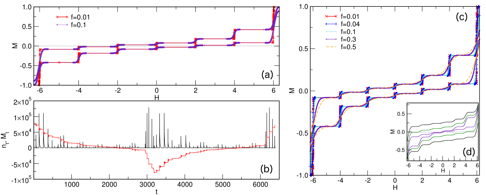
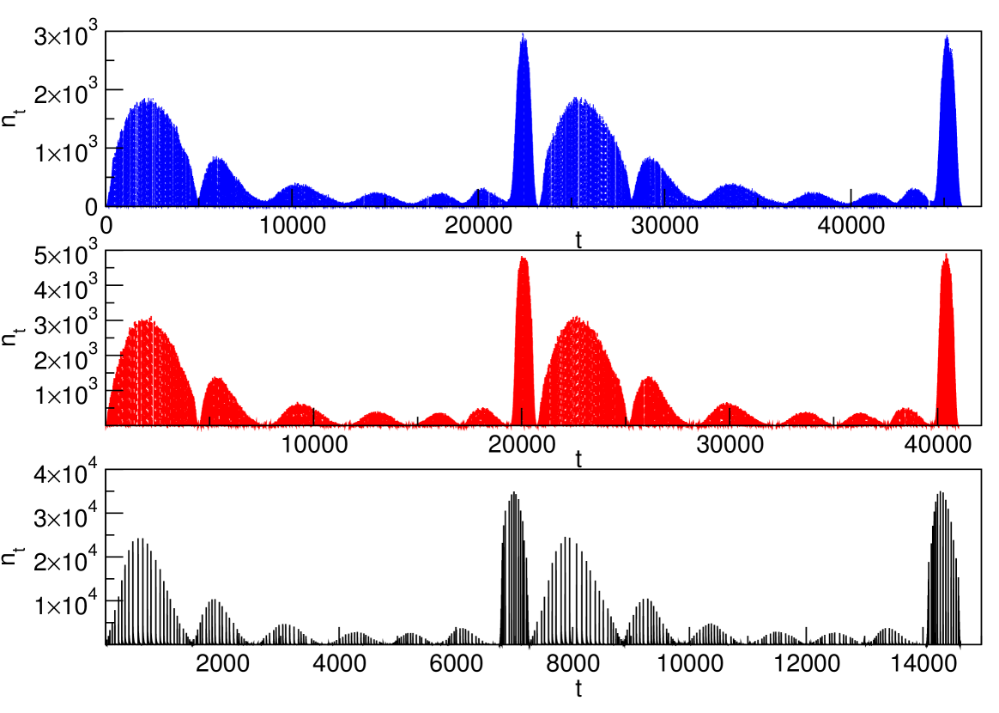
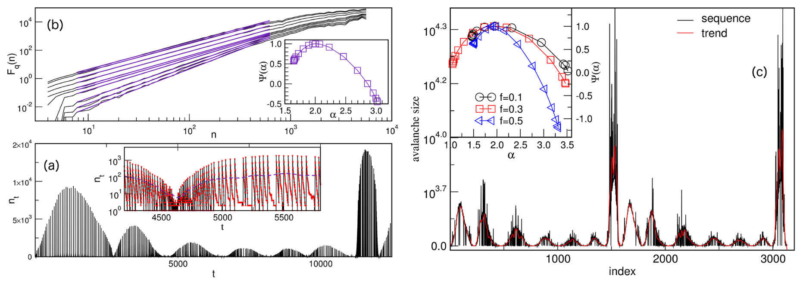
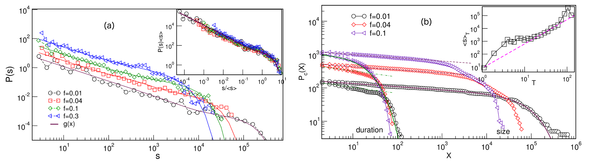

# 反強磁性体のバルクハウゼンノイズ：ランダム場無秩序が引き起こすアバランシュと多重フラクタル揺動

- **執筆日**: 2026-04-21
- **トピック**: 反強磁性体におけるバルクハウゼンノイズ——弱いランダム場無秩序が誘起する磁化バーストのスケール不変性と多重フラクタル動力学
- **タグ**: Magnetism and Spin / Magnetic Domains and Domain Walls; Nonequilibrium and Dynamic Response / Monte Carlo
- **注目論文**: arXiv:2602.14713 — B. Tadić, "Antiferromagnetic Barkhausen noise induced by weak random-field disorder", *Phys. Rev. B* **113**, 104201 (2026)
- **参照論文数**: 7

---

## 1. なぜ今この話題なのか

1919年、ハインリヒ・バルクハウゼンは軟鉄のコイルにアンプとスピーカーを繋ぎ、ゆっくりと磁場を変化させた。スピーカーから聴こえてきたのはノイズのようなパチパチという断続的な音であった。これが**バルクハウゼン効果**（Barkhausen effect）の最初の観測であり、磁壁が不純物に引っかかりながら跳び跳びに動く——すなわち磁化が連続的にではなく「アバランシュ（雪崩）状」に反転する——ことを示す現象である。以来100年以上にわたり、バルクハウゼンノイズは軟磁性体の品質評価から地震のモデルまで、多彩な系に共通するアバランシュ動力学の研究の場となってきた。

バルクハウゼン研究の中心的な問いは「アバランシュのサイズ分布はどのべき乗則に従うか」、そして「それは臨界点の近傍でのみ成立するのか、それとも系が自発的に臨界状態に組織化されるのか（自己組織化臨界性, SOC）」という点にある。強磁性体のバルクハウゼンノイズについては、1990年代以降、ランダム場イジングモデル（RFIM）や反磁界を取り込んだ動的モデルによって理論的・数値的研究が大きく進み、普遍性クラスと臨界指数がかなり明確になってきた。

しかし、磁性体のもう一つの主要なカテゴリである**反強磁性体**（antiferromagnet, AFM）では状況がまったく異なる。磁気副格子が互いに逆向きに揃うため、巨視的な磁化はほぼゼロに抑えられ、外部磁場に対して格子の局所的な反転が複雑なパターンで生じる。反強磁性体でのバルクハウゼン的な磁化バーストについては実験・理論ともにほとんど研究されてこなかった。

状況を変えたのがアルター磁性体（altermagnet）研究の勃興、トポロジカル反強磁性体の機能探索、そしてスピントロニクスへの反強磁性体応用である。これらの文脈で、反強磁性体の磁化反転過程の微視的機構——どのような場合にアバランシュが生じ、どのような統計則に従うか——が問われるようになった。さらに、有機強誘電体や量子磁性体など、古典的強磁性とは異なる系においてもバルクハウゼン的ノイズの観測・理論化が進み、バルクハウゼン現象の「普遍性」が真剣に問われるようになっている。

2026年2月にPhysical Review Bに掲載されたBosiljka Tadićによる数値研究（arXiv:2602.14713）は、この問いに正面から取り組んだ。3次元反強磁性イジングモデルに弱いランダム場無秩序を加えた系で、磁化バーストがどのように発生し、どのような統計的特徴を持つかを系統的に明らかにしたのである。その結果は、古典的強磁性のバルクハウゼンノイズとは質的に異なる新しい動力学を示しており、反強磁性体研究に新たな問いを投げかけている。

---

## 2. 未解決問題は何か

この分野には以下のような本質的問いが積み残されている。

**問い①：反強磁性体でバルクハウゼンノイズは生じるか、生じるとすれば何が「引き金」になるか**。強磁性体では磁壁のデピニング（固定点からの離脱）が主因であるが、反強磁性体では巨視的磁壁が存在しないか、または安定性が大きく異なる。ランダム場の導入がなければ理想的反強磁性体はプラトーを持つ階段状のヒステリシスを示し、アバランシュではなく一斉フリップが起きる。では、どの程度の無秩序がノイズ様ダイナミクスを誘起するのか？

**問い②：反強磁性バルクハウゼンノイズのスケーリング指数は何によって決まるか**。強磁性体では、試料の幾何形状（バルク／薄膜）、反磁界の強さ、ピニングの種類によって指数が変わり、「普遍性クラス」の議論が続いている。反強磁性体では局所的なクラスター形成が主役であり、強磁性とは本質的に異なるクラスに属するのかどうかが問われる。

**問い③：バルクハウゼン現象は古典・量子・強誘電体系をまたいで「普遍的」に記述できるか**。2024年にはLiHoF₄（希土類強磁性体）において量子コトンネリングによる磁壁の協調的トンネリングが「量子バルクハウゼンノイズ」として観測された（arXiv:2309.01799）。また有機強誘電体P(VDF:TrFE)でもバルクハウゼンノイズが初めて観測されている（arXiv:2412.12671）。これらはすべて「アバランシュ動力学」という共通の枠組みで理解できるのか、それとも系ごとに本質的に異なる機構があるのか。

これら三つの問いは互いに絡み合っており、注目論文はそのうち特に①と②に踏み込んでいる。

---

## 3. 注目論文の核心

### 3.1 モデルと手法

Tadićが採用したのは、3次元単純立方格子上の100万スポン（$10^6$格子点、周期境界条件）からなるイジングスピン系である。ハミルトニアンは

$$\mathcal{H} = J \sum_{\langle ij \rangle} S_i S_j - \sum_i (H + h_i) S_i$$

ここで $J > 0$（反強磁性結合）、$H$ は一様外部磁場、$h_i$ は各格子点に独立に与えられたガウス型ランダム場（平均ゼロ、分散 $f$）である。スピンは $S_i = \pm 1$。ゼロ温度・断熱駆動のもと（磁場をごく僅かずつ増加させながら各ステップでエネルギーを最小化）、確定論的な更新則（反転条件：$S_i (H + h_i - J\sum_j S_j) < 0$ なら $S_i$ を反転）を用いた。

反強磁性の場合、隣接スポンは逆向きが基底状態なので、完全秩序状態では外部磁場に対して「スタガー磁化（副格子磁化の差）」が変化するが「全磁化」は小さい。弱いランダム場が加わると、局所的に同じ向きのスポンが偶然集まった「強磁性的クラスター」が形成され、これが外部磁場に応答してアバランシュ的に反転するというシナリオが生じる。

### 3.2 ヒステリシスのプラトー構造

*図1. 反強磁性イジングモデルのヒステリシスループ（Tadić, PRB 2026、CC BY-NC-ND 4.0）。(a) 無秩序 $f=0.01$（非常に弱い）での磁化 $M$ 対磁場 $H$ の曲線。$H=\pm 2, \pm 4, \pm 6$を境界とする6段のプラトーが明瞭に現れる。(b) $f=0.01$における磁化バーストの時系列。(c) 無秩序強度を変えたときのヒステリシスループ比較。*

無秩序が非常に弱い（$f=0.01$）場合、ヒステリシスループには$H=\pm 2, \pm 4, \pm 6$を区切りとする合計6段のプラトーが現れる。これは反強磁性格子において、逆転済み隣接スポン数 $k=1, 2, \ldots, 5$ を持つスポンが外部磁場の閾値$H=2(k-\text{const})$でそれぞれ一斉に反転することに対応している。この「プラトー ‒ジャンプ」構造は強磁性体では見られない、反強磁性体特有のトポロジーである。

無秩序が強まると（$f \to 0.5$）、プラトーは幅が広くなり、段差は滑らかになる。ランダム場が隣接環境の一様性を壊すためである。しかし無秩序が「弱い」範囲では、プラトー構造が保たれたまま各プラトー周辺での磁化バーストが増加するという「弱無秩序反強磁性バルクハウゼンノイズ」（AF-BHN）が現れる。

### 3.3 バルクハウゼンノイズの構造

*図2. ヒステリシスループ1周にわたる磁化バーストの時系列（Tadić, PRB 2026、CC BY-NC-ND 4.0）。無秩序強度 $f=0.04$（上）、$0.3$（中）、$0.5$（下）。各枝に7本のピーク群（$k=0$ から $k=6$ の反転に対応）が見える。$f$ が増すにつれてピークは広がりと重なりを増す。*

外部磁場を1サイクル走査したときの磁化バースト時系列（AF-BHN信号）は、各ヒステリシス枝に沿って7本のピーク群に分かれる。これらは $k=0, 1, 2, \ldots, 6$ 個の反転済み隣接スポンを持つスポン群が、対応する閾値磁場で一斉反転することに由来する。

この「7ピーク構造」は強磁性バルクハウゼンノイズ——連続した磁壁移動が生むランダムなパルス列——とは根本的に異なる。反強磁性体では磁化反転の「場所」と「磁場値」が格子構造によって強く規格化され、ノイズは離散的なピーク群に組織化される。無秩序が増すとピークが広がって互いに重なり合うが、$f \leq 0.3$ 程度では依然として識別可能な構造が残る。

### 3.4 多重フラクタル解析と周期的トレンド

*図3. AF-BHN信号の多重フラクタル解析（Tadić, PRB 2026、CC BY-NC-ND 4.0）。(a) $f=0.1$ でのノイズ信号と周期的トレンド解析。(b) 多重フラクタル変動関数 $F_q(\tau)$ の $q$ 依存性。(c) アバランシュサイズ系列と特異スペクトル $\Psi(\alpha)$（内挿）。無秩序強度が増すとスペクトル幅が狭まる。*

AF-BHN信号の最も特徴的な性質の一つは、単純な1/$f$型ノイズでも単一フラクタルでもなく、**多重フラクタル**（multifractal）的な変動を示すことである。著者はMFDFA（多重フラクタル除トレンド変動解析）を用い、異なる $q$ 次モーメントに対する変動関数 $F_q(\tau)$ の $\tau$ 依存性から、スケーリング指数スペクトルを導いた。

特異スペクトル $\Psi(\alpha)$ の幅は無秩序強度 $f$ に依存し、$f$ が大きくなるとスペクトル幅が**狭まる**。これは無秩序が強くなるほど、異なるスケールのアバランシュの間の「不均一さ」が減少し、ダイナミクスが比較的均一に近づくことを意味する。逆に言えば、弱い無秩序の反強磁性体では強い「アバランシュの多様性」が存在し、これが多重フラクタル性の起源となっている。

### 3.5 アバランシュサイズ分布とスケーリング

*図4. アバランシュ統計（Tadić, PRB 2026、CC BY-NC-ND 4.0）。(a) アバランシュサイズ分布 $P(S)$：2段スロープ構造と指数関数的カットオフ。内挿：スケーリングコラプス。(b) アバランシュサイズ（青）と持続時間（赤）の累積分布、および平均サイズ対持続時間（内挿）。*

アバランシュサイズ分布 $P(S)$ は、2段階のべき乗則構造を示す：

$$P(S, f) = \frac{R}{\langle S \rangle} \mathcal{P}\!\left(\frac{S}{\langle S \rangle}\right)$$

ここで $R$ は全バースト数、$\langle S \rangle$ は平均アバランシュサイズ、$\mathcal{P}$ は無秩序依存のスケーリング関数である。注目すべきは、スケーリングが通常の臨界点（特定の無秩序強度 $f_c$ での発散）を伴わず、**任意の $f$** で成立することである。これは系が「自己組織化臨界性（SOC）」的な振る舞いを示すことを示唆する。

アバランシュサイズ指数は $\tau_S \approx 1.09 \pm 0.06$、持続時間指数は $\tau_t \approx 1.15 \pm 0.06$、中間スケーリング指数は $\gamma_{st} \approx 1.9$ と得られた。これらは強磁性体のバルクハウゼン臨界指数（通常 $\tau_S \approx 1.5$）と比べて著しく小さい。換言すれば、反強磁性体では**大きいアバランシュがより頻繁に**起きる——あるいは小さいアバランシュが相対的に少ない——分布を持つ。

---

## 4. 背景と研究史

### 4.1 強磁性バルクハウゼンノイズの確立

1990年代に Zapperi, Cizeau, Durin, Stanley（arXiv:cond-mat/9803253; PRB 1998）は、長距離双極子相互作用を含む動的ランダム場モデルを用いてバルクハウゼンノイズの理論を確立した。磁壁が外部磁場によってゆっくり駆動されると、ピニング欠陥に引っかかりながらアバランシュ状に進む。反磁界（試料形状によって定まる内部磁場）が弱いバルク試料では平均場的臨界指数（$\tau_S \approx 1.5$）が、反磁界が強い薄膜では異なる指数（$\tau_S \approx 1.27$）が得られることが理論と実験で確認された。

この「普遍性クラスの切り替え」は、バルクハウゼンノイズが単純なSOCではなく、むしろヒステリシスループの臨界点近傍（臨界無秩序強度 $f_c$）に近い状態で観測されることを示唆している。Dhar と Sabhapandit（arXiv:2509.08536; EPJ B 2025）は最近のレビュー論文で、ランダム場イジングモデルのベーテ格子上でジャンプサイズ分布を解析的に導き、ヒステリシスと臨界無秩序の関係を整理している。

### 4.2 実験的検証の発展

実験系では、金属ガラス（VITROPERM等）や珪素鋼板などの軟磁性体で詳細な計測が行われてきた。Spasojevic らの研究（arXiv:2309.11873; 2023）は、金属ガラス試料のバルクハウゼンノイズを低周波数領域で精密測定し、RFIMシミュレーションと比較することで、モデルと実験の対応条件を定量的に示した。こうした実験との比較研究は、数値モデルの有効範囲を明確にする上で重要である。

### 4.3 量子バルクハウゼンノイズの発見

古典的な文脈を超えて、2024年には希土類強磁性体 LiHo$_{0.4}$Y$_{0.6}$F$_4$ において**量子バルクハウゼンノイズ**が観測された（arXiv:2309.01799; PNAS 2024）。Simon, Silevitch, Stamp, Rosenbaum のグループは、極低温（30〜900 mK）でこの希土類フッ化物を磁化測定し、磁化反転が量子スポン集団の協調的コトンネリング——すなわち「磁壁が対を成して同時に量子トンネルする」——によって駆動されることを発見した。

興味深いのは、このプロセスが**非臨界的**なアバランシュ統計を示す点である。古典的強磁性バルクハウゼンノイズの普遍クラスに収まらず、通常の繰り込み群的アプローチでは説明できない。実験グループは「2つの磁壁が双極子相互作用を介して互いを感知し、協調してトンネルする」プラケット対コトンネリング機構を提唱している。この量子コトンネリングは磁場横成分（イジング軸に垂直な磁場）によって抑制されることが確認されており、量子効果の直接証拠となっている。

### 4.4 有機強誘電体へのバルクハウゼン概念の拡張

バルクハウゼン現象は磁性体に限らない。2024年末、Butkevich らは有機強誘電体コポリマー P(VDF:TrFE)（arXiv:2412.12671）において電気的バルクハウゼンノイズの**最初の実験観測**を報告した。この系では分極反転が電気的アバランシュとして起き、べき乗則分布が観測された。ただし驚くべきことに、最大電場や上昇速度を変えると指数が変化し、強い駆動・高速条件でべき乗則指数が $\approx 1.5$ に収束するような振る舞いが見られた。これは自己組織化臨界性ではなく、「外部駆動条件に依存した準普遍的」な振る舞いである。

比較のため、同グループが実施したBTA（ベンゼン-1,3,5-トリカルボキサミド）有機強誘電体の研究（arXiv:2412.12666）では、キネティックモンテカルロシミュレーションが175 K以下の低温・十分な構造無秩序条件でSOC的振る舞いを予測したが、実験ではバルクハウゼンノイズが検出されなかった。これはBTAの分極反転が六方液晶格子の1次元カラム方向に進み、カラム間の協調が起きないためと解釈される。「同じバルクハウゼン」でも、次元性と構造の違いが検出可否を左右するという教訓である。

---

## 5. どの解釈が最も妥当か

### 5.1 AF-BHNの機構：局所強磁性クラスターのアバランシュ

Tadićの提唱するメカニズムは以下の通りである。反強磁性体に弱いランダム場が加わると、格子の局所的な位置でランダム場が隣接スポンの一部と同じ向きを向き、「局所的な強磁性クラスター」が発生する。このクラスターは孤立しているが、外部磁場が閾値に達すると一斉に反転（アバランシュ）する。このアバランシュが磁化バーストとして観測されるのがAF-BHNである。

この機構が古典的強磁性BHNと根本的に異なるのは、**磁壁の移動ではなく孤立クラスターの集団的反転**が主役であるためだ。強磁性体では磁壁という拡張した界面が存在し、その界面が不純物を乗り越える際にアバランシュが生じる。一方、反強磁性体では界面の概念が薄れ、「どこに強磁性クラスターが存在するか」という局所的な無秩序配置が動力学を規定する。

### 5.2 スケーリング指数の解釈

アバランシュ指数 $\tau_S \approx 1.09$ は既知の様々な系と比較して理解できる。

強磁性BHNでは通常 $\tau_S \approx 1.5$（平均場）または $1.27$（薄膜・反磁界あり）であり、AF-BHNの値は著しく小さい。これはAF-BHNでは大きなアバランシュが相対的に多く発生することを意味する。

量子BHN（LiHoF₄）では非臨界的な分布が報告されており、直接の指数比較は難しいが、著者は「AF-BHNの自己組織化臨界性はSOC型ではあるが、強磁性臨界点とは異なる普遍性クラスに属する」と解釈している。また、Tadićは無限範囲スピングラスやソーシャルシステムのグループ活動モデルと類似したスケーリング関数の形を指摘しており、反強磁性クラスター機構がこれらの系と同じ統計クラスに属する可能性を示唆している。

有機強誘電体のBHN（$\tau \approx 1.5$ に向かう収束）は、1次元コラム構造という特殊な幾何学が反映されている可能性が高く、3次元反強磁性体の結果と直接比較するには注意が必要だ。

### 5.3 多重フラクタル性の意味

最も新規性の高い知見の一つは、AF-BHN信号が多重フラクタル的変動を示すことである。これは単純なSOC（単一フラクタル）とは異なり、異なるスケールのアバランシュが**互いに異なる局所スケーリング指数**を持つことを意味する。無秩序強度が増すとスペクトル幅が狭まる（均質化）という結果は、「より強い無秩序が、逆にダイナミクスを単純化する」という直観に反した振る舞いである。

この解釈として著者は次のように考える。弱い無秩序では局所強磁性クラスターのサイズ分布が広く、小さなクラスターから大きなクラスターまで共存するため多重フラクタル性が高い。無秩序が強まるとクラスターが全体的に細分化・均一化し、アバランシュサイズの多様性が減少する——これがスペクトル幅の収縮として現れる。

しかしながら、この解釈にはまだ検証が必要な点が多い。特に、3次元系と2次元系での多重フラクタル指数の比較、温度効果の影響（ゼロ温度モデルの限界）、実際の反強磁性物質での対応実験が求められる。

### 5.4 アルター磁性体Mn₅Si₃でのバルクハウゼン観測

実験的な観点から興味深いのは、アルター磁性体候補Mn₅Si₃薄膜でのバルクハウゼン効果の観測（arXiv:2506.05926; 2025）である。100 nm幅のホールバーデバイスで測定したホール電圧に、Barkhausenジャンプに相当する離散的電圧ステップが観測され、バルクハウゼン長として約18 nmが推定された。

この結果は、アルター磁性体という新しいカテゴリの磁性体でも磁化反転が磁壁的な離散ジャンプを含むことを示し、Tadićの数値研究が指摘する「反強磁性的な環境での局所的磁化バースト」と概念的に対応する。ただしMn₅Si₃は完全な反強磁性体ではなく、アルター磁性（時間反転対称性が結晶対称性によって破れた特殊な反強磁性）であり、モデルと実験の対応関係には慎重な検討が必要だ。

### 5.5 メゾスケールデバイスへの波及

バルクハウゼン的なジャンプはスピントロニクスデバイスにとって重要なノイズ源でもある。InAs/Al ナノワイヤ型ジョセフソン接合での切り替え電流ジャンプ（arXiv:2603.29757; 2026）は、接合周辺の磁気テクスチャのメタ安定状態間のアバランシュ的切り替えとして解釈されており、バルクハウゼン現象の「メゾスケール版」といえる。このような応用的な文脈でも、反強磁性体の磁化ダイナミクスの理解が重要になってきた。

---

## 6. 何が一般化できるのか

### 6.1 「クラスター型アバランシュ」という設計原理

Tadićの研究が示す「孤立クラスターの集団的反転」というメカニズムは、反強磁性体に限らず、より広いクラスの系——例えば無秩序なフラストレート磁性体、反強磁性秩序を持つトポロジカル絶縁体、あるいは無秩序な強誘電体——に一般化できる可能性がある。ランダム場が局所クラスターを形成し、そのクラスターのアバランシュが多重フラクタルノイズを生む、という構造は、次元性と相互作用の種類を変えても保たれうる。

### 6.2 普遍性クラスの再定義

バルクハウゼンノイズは長年「強磁性磁壁動力学の普遍クラス」として研究されてきたが、本研究が示すように、反強磁性体では質的に異なる指数と構造が現れる。さらに量子BHN（非臨界的）、有機強誘電体BHN（外部駆動依存）を合わせて考えると、「バルクハウゼン現象」というラベルの下に複数の本質的に異なる普遍性クラスが存在することが見えてくる。この分類を整理することが今後の課題である。

### 6.3 多重フラクタル解析の方法論的価値

AF-BHNに適用されたMFDFAは、ノイズ信号から無秩序強度や磁化ダイナミクスの情報を非破壊的に取り出す手法として有望だ。実際の材料では無秩序強度を直接計測することは難しいが、磁化ノイズの多重フラクタルスペクトルがその代替指標になり得る。これは磁気的非破壊検査（NDE）の精度向上に直接つながる応用である。

---

## 7. 基礎から理解する

### 7.1 イジングモデルとランダム場

スピン $S_i = \pm 1$ が格子点 $i$ に置かれた系を考える。**イジングモデル**（Ising model）の最も基本的なハミルトニアンは

$$\mathcal{H} = -J \sum_{\langle ij \rangle} S_i S_j - H \sum_i S_i$$

$J > 0$ なら強磁性（隣接スピンは揃いたい）、$J < 0$ なら反強磁性（交互に並びたい）。外部磁場 $H$ はスピンをある方向に揃えようとする。

**ランダム場イジングモデル（RFIM）** は各スピンに局所的なランダム磁場 $h_i$（例：ガウス分布に従う確率変数）を加えたもの：

$$\mathcal{H} = J \sum_{\langle ij \rangle} S_i S_j - \sum_i (H + h_i) S_i$$

反強磁性（$J > 0$）の場合、$J$の符号の扱いに注意が必要で、上のハミルトニアンでは $J > 0$ のとき隣接スピンを逆向きに揃えようとする引力として働く。

### 7.2 ゼロ温度ダイナミクスとデピニング

温度がゼロの系では熱揺動がなく、スピンは「今エネルギーを下げるか否か」の確定論的ルールに従う。スピン $i$ の局所有効場は $h_i^{\text{eff}} = H + h_i - J \sum_{j \in \text{nn}(i)} S_j$（反強磁性の場合は符号に注意）であり、$S_i \cdot h_i^{\text{eff}} < 0$ のとき $S_i$ を反転する。

外部磁場をゆっくり増加させながらこのルールを適用すると、一度に複数のスピンが連鎖的に反転する「アバランシュ」が起きる。これが磁化のジャンプ——すなわちバルクハウゼンノイズの単一パルス——に対応する。

### 7.3 アバランシュとべき乗則

アバランシュのサイズ $S$（反転スピン数）の確率分布 $P(S)$ が

$$P(S) \propto S^{-\tau}$$

というべき乗則に従うとき、系は**スケール不変**であるという。スケール不変性は、系にある特定の「典型スケール」が存在しないことを意味し、小さいアバランシュから大きいアバランシュまで自己相似的に分布する。

**自己組織化臨界性（SOC）**（Bak, Tang, Wiesenfeld, 1987）は、特別なパラメータ調整なしに系が自発的にスケール不変状態に組織化される現象である。砂山モデルが代表例であり、砂を一粒ずつ加えていくと崩れ（アバランシュ）が自然にべき乗則分布を示す。Tadićの研究では、AF-BHNが臨界無秩序点を必要とせずスケール不変性を示すため、SOC的振る舞いと解釈される。

### 7.4 多重フラクタルとは

単純なフラクタルは「どのスケールを見ても同じ自己相似性」を持つ。これに対し**多重フラクタル**（multifractal）は、局所によって異なるスケーリング指数（Hölder指数 $\alpha$）を持つ。信号の強い部分（大きなアバランシュ）と弱い部分（小さなアバランシュ）で異なるスケーリングが共存する状況であり、それを記述する道具が**特異スペクトル** $f(\alpha)$（または $\Psi(\alpha)$）である。

MFDFA（Multifractal Detrended Fluctuation Analysis）は時系列のトレンドを除きながら多重フラクタルスペクトルを推定する手法で、心拍変動、地震系列、経済時系列など様々な「生きたノイズ」に適用されている。AF-BHN信号もこの枠組みで解析できることが本研究で示されたことは、将来的に実験信号の解析にも直接応用できることを示唆する。

### 7.5 ヒステリシスと反強磁性プラトー

理想的な反強磁性体（ランダム場なし）では外部磁場を増加させると「スピンフロップ」や「飽和磁化」まで磁化がほぼゼロを保つ。しかし弱いランダム場があると、前述の通り $H = 2(k-k_0)$ の各閾値で離散的な磁化ジャンプ（プラトー間遷移）が起きる。これが「バルクハウゼンのプラトー構造」であり、強磁性磁壁の連続移動とは本質的に異なるダイナミクスである。この離散性が AF-BHN の「7ピーク構造」の起源であり、論文の最も重要な物理的洞察の一つである。

---

## 8. 専門用語の解説

**バルクハウゼン効果**（Barkhausen effect）
外部磁場をゆっくり変化させたとき、磁化が連続的ではなく離散的・階段状に変化する現象。磁壁が不純物を乗り越える際のスナップによって生じる。1919年に発見。

**アバランシュ**（avalanche）
磁場の微小増加に対してスピン集団が連鎖的・爆発的に反転する現象。地震の断層崩壊や砂山の崩れと同じ数学的構造を持つ。アバランシュのサイズ分布がべき乗則に従うときスケール不変という。

**ランダム場イジングモデル（RFIM）**
各格子点に局所的なランダム磁場を持つイジングスピン系。磁気的な不純物・欠陥を模した最も基本的な無秩序磁性モデル。ヒステリシスとバルクハウゼンノイズの理論的基盤。

**自己組織化臨界性（SOC）**
外部パラメータを特定の値に合わせなくても、ゆっくりした駆動のもとで系が自発的にスケール不変（臨界）状態に組織化される現象。バルクハウゼン研究では「SOCか臨界点近傍か」が長年の論争点。

**多重フラクタル**（multifractal）
時系列や空間分布が局所によって異なるスケーリング指数を持つ構造。特異スペクトル $f(\alpha)$ の幅がゼロでない場合を多重フラクタルという。単純なべき乗則（単一フラクタル）より豊かな情報を持つ。

**MFDFA**（Multifractal Detrended Fluctuation Analysis）
時系列信号から多重フラクタルスペクトルを推定する数値解析手法。トレンドを除いてから変動関数の $q$ 次スケーリングを求める。心拍変動、地震、株価など様々な「揺らぎ」に応用される。

**デピニング転移**（depinning transition）
界面や磁壁が固定点（ピニングサイト）から外れる臨界転移。駆動力（外部磁場）がある閾値を超えると磁壁が滑らかに動き始める。バルクハウゼン効果の古典的描像の中心。

**量子コトンネリング**（quantum cotunneling）
二つの量子系が独立ではなく協調的に量子トンネリングする現象。量子バルクハウゼンノイズでは、双極子相互作用で結合した磁壁対が同時にトンネルすることで非臨界的アバランシュが生じる。

**アルター磁性体**（altermagnet）
時間反転対称性が結晶対称性によって破れた特殊なタイプの反強磁性体。巨視的磁化はゼロだが、スピン分裂したバンド構造を持ち、スピンホール効果などの機能性を示す。Mn₅Si₃、MnTe などが候補。

**スケーリングコラプス**（scaling collapse）
異なるパラメータ（ここでは無秩序強度 $f$）での分布曲線が、適切なスケーリング変換によって一本の普遍曲線に重なる（コラプスする）こと。スケーリング関数の存在を直接示す証拠。

---

## 9. 今後の展望

反強磁性体のバルクハウゼンノイズ研究は、本論文によって数値的基盤が確立された段階である。今かなり確からしくなったこととして、「弱いランダム場を持つ反強磁性体では、磁壁デピニングとは異なる機構——孤立強磁性クラスターの集団的反転——によってアバランシュが生じ、その統計はSOC的スケーリングを示す」という描像がある。また、AF-BHN信号が多重フラクタル特性を持ち、その特異スペクトル幅が無秩序強度の指標になる可能性も示された。これらの知見は、アルター磁性体や反強磁性スピントロニクスの文脈で磁化反転ノイズを理解するための理論的枠組みを提供する。

一方で、多くの不確定な点が残されている。まず、Tadićのモデルはゼロ温度・最近傍相互作用・単純立方格子という理想化された設定であり、有限温度効果、長距離相互作用（双極子力）、異方性、さらには非コリニア反強磁性体への拡張が必要である。また、実験的検証がほぼ皆無であるため、どの反強磁性物質でAF-BHNが観測できるかが最大の問いである。Mn₅Si₃でのバルクハウゼン観測（arXiv:2506.05926）はその先行事例として重要だが、アルター磁性的な特徴との関係は未解明だ。今後1〜3年で注目すべき論点として、①ナノスケールホールバーによる反強磁性体の磁化ノイズ精密測定、②低温・量子効果が卓越する系での古典／量子BHNの競合、③多重フラクタル解析の非破壊検査への実応用、の三点が挙げられる。古典バルクハウゼン、量子バルクハウゼン、有機強誘電体BHN、そして今回の反強磁性BHNを統合する「アバランシュ現象の一般理論」の構築は、次世代の挑戦として残されている。

---

## 参考論文一覧

1. **[arXiv:2602.14713](https://arxiv.org/abs/2602.14713)** — B. Tadić, "Antiferromagnetic Barkhausen noise induced by weak random-field disorder", *Phys. Rev. B* **113**, 104201 (2026).  
   3次元反強磁性イジングモデルに弱いランダム場を加えた系で磁化バーストのアバランシュ統計と多重フラクタル特性を初めて数値的に解明した注目論文。

2. **[arXiv:2309.01799](https://arxiv.org/abs/2309.01799)** — C. Simon, D.M. Silevitch, P.C.E. Stamp, T.F. Rosenbaum, "Quantum Barkhausen Noise Induced by Domain Wall Co-Tunneling", *PNAS* **121**, e2315598121 (2024).  
   LiHo₀.₄Y₀.₆F₄において磁壁の量子コトンネリングによる非臨界アバランシュ（量子バルクハウゼンノイズ）を初めて観測した実験研究。

3. **[arXiv:2412.12671](https://arxiv.org/abs/2412.12671)** — A.A. Butkevich, M. Hecker, T. Seiler, M. Kemerink, "Barkhausen noise in the organic ferroelectric copolymer P(VDF:TrFE)" (2024).  
   有機強誘電体コポリマーP(VDF:TrFE)において電気的バルクハウゼンノイズを初めて実験観測し、べき乗則指数の外部駆動依存性を明らかにした論文。

4. **[arXiv:2412.12666](https://arxiv.org/abs/2412.12666)** — A.A. Butkevich, F.T. Thome, T. Seiler, M. Hecker, M. Kemerink, "Barkhausen noise in the columnar hexagonal organic ferroelectric BTA" (2024).  
   1次元カラム構造を持つ有機強誘電体BTAのキネティックMCシミュレーションが低温・十分な無秩序でSOC挙動を予測するが実験では検出されないことを示した論文。

5. **[arXiv:2506.05926](https://arxiv.org/abs/2506.05926)** — G. Skobjin et al., "Magnetic aftereffect and Barkhausen effect in thin films of the altermagnetic candidate Mn₅Si₃" (2025).  
   アルター磁性体候補Mn₅Si₃薄膜のナノスケールホールバーでバルクハウゼンジャンプを観測しバルクハウゼン長 ≈ 18 nm を推定した実験論文。

6. **[arXiv:2603.29757](https://arxiv.org/abs/2603.29757)** — O. Durante et al., "Magnetically Induced Switching-Current Jumps in InAs/Al Josephson Junctions" (2026).  
   InAs/Alナノワイヤジョセフソン接合で切り替え電流のバルクハウゼン様不連続ジャンプを観測し、局所磁気テクスチャのアバランシュ的切り替えとして解釈した論文。

7. **[arXiv:2509.08536](https://arxiv.org/abs/2509.08536)** — D. Dhar, S. Sabhapandit, "Hysteresis in magnets", *Eur. Phys. J. B* **98**, 230 (2025).  
   ランダム場イジングモデルのベーテ格子上でヒステリシスループ形状・バルクハウゼンジャンプサイズ分布を解析的に導いたレビュー兼新研究論文。
