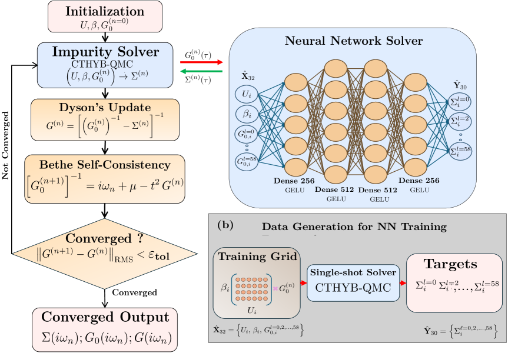
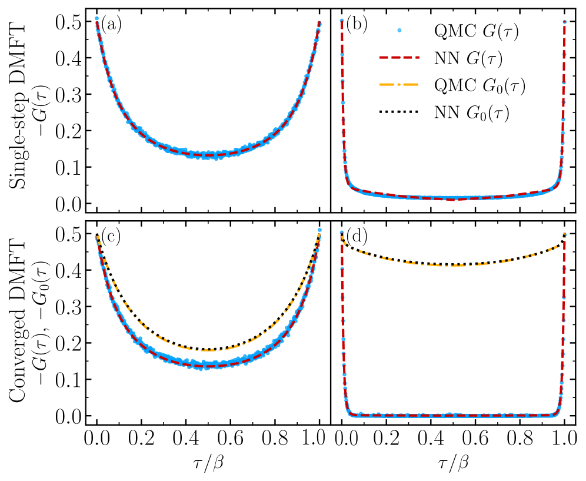
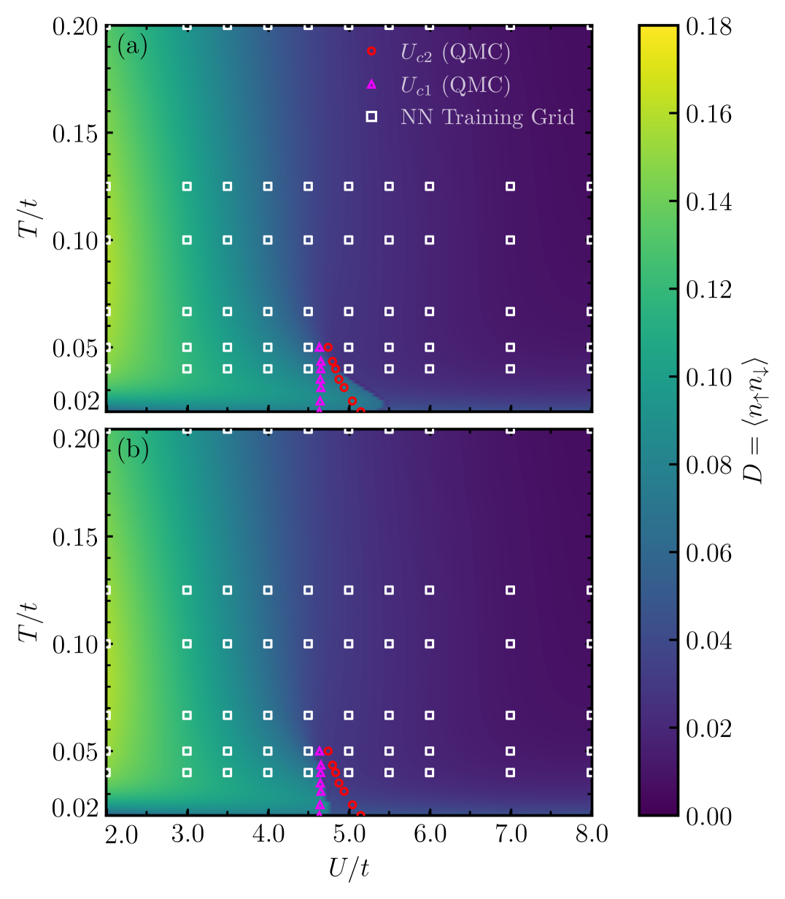
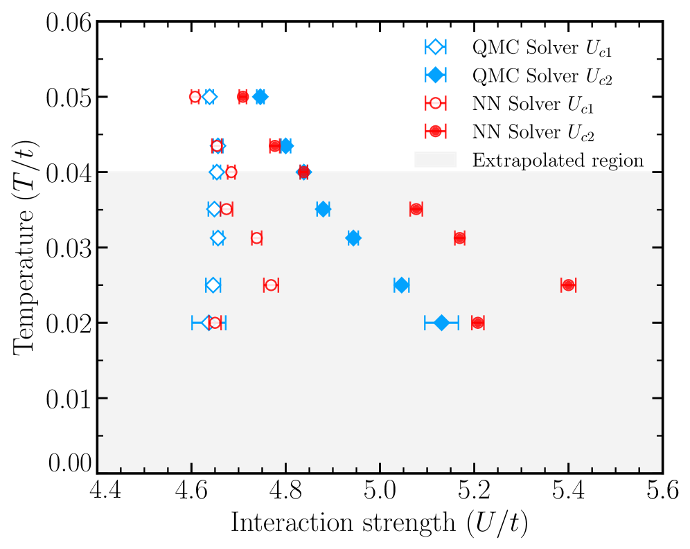
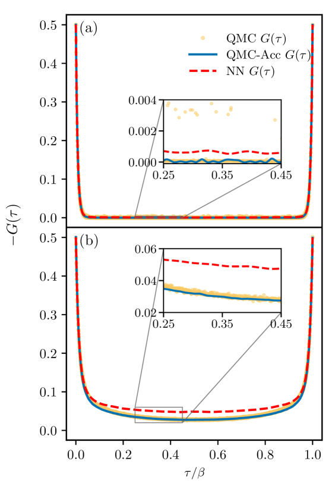
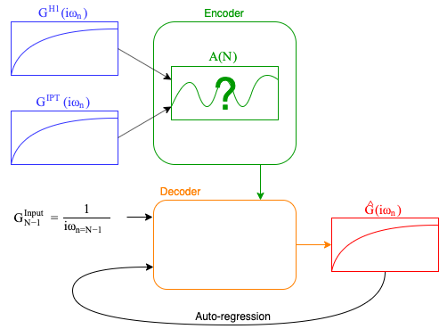
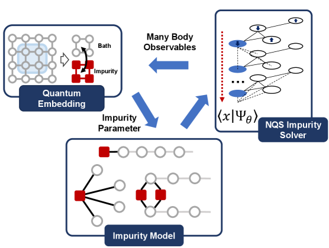

# ニューラルネットワークサロゲートソルバー——DMFTの量子インピュリティ問題に機械学習が挑む

- **執筆日**: 2026-04-01
- **トピック**: DMFTインピュリティソルバーのニューラルネットワークサロゲート
- **タグ**: Computation and Theory / Spin Liquids and Quantum Many-Body Systems; Phase Transitions / Machine Learning; Surrogate Modeling
- **注目論文**: Nain et al., "Neural network as low-cost surrogates for impurity solvers in quantum embedding methods," arXiv:2603.25557 (2026)
- **参照関連論文数**: 6

---

## 1. なぜ今この話題なのか

遷移金属酸化物、ランタノイド化合物、高エントロピー合金など、現代材料科学の最前線にある物質の多くは、電子間のクーロン反発が特に強い「強相関電子系」に分類される。これらの物質では、ほんのわずかな組成や温度の変化が金属–絶縁体転移（モット転移）、超伝導、巨大磁気抵抗効果といった劇的な物性変化を引き起こす。その物理を第一原理から理解し設計へ繋げることは、次世代のエネルギー変換デバイスや情報記憶素子の開発において根本的な課題となっている。

しかし強相関電子系は、バンド理論（密度汎関数理論、DFT）が本質的に苦手とする領域である。電子の局所的な量子揺らぎと相互作用を同時に扱うには、より精緻な多体理論が必要であり、1990年代に確立された動的平均場理論（DMFT）が現在の実用的標準手法となっている。DMFTは格子問題を局所的な「アンダーソンインピュリティ問題」に変換して解く自己無撞着な枠組みであり、その中心的な計算ステップは「インピュリティソルバー」によるグリーン関数の数値解である。

問題は、最も信頼性の高いインピュリティソルバーである連続時間量子モンテカルロ法（CT-QMC）の計算コストが極めて大きいことだ。1回のDMFT反復に必要なCT-QMCの計算時間は数十分から数時間に及ぶことがあり、DFT+DMFTを用いた実材料の位相図探索や高スループット計算は依然として困難を極める。この「計算ボトルネック」こそが、強相関電子系の第一原理的理解を阻む最大の障壁の一つである。

そこに浮上してきたのが、機械学習を用いた「サロゲートソルバー（代理ソルバー）」という発想だ。ニューラルネットワークがQMCの入出力関係を学習し、推論時間を数秒以下に圧縮できるなら、位相図全体を高密度に探索したり、大量の材料候補を一気に評価したりすることが可能になる。この方向性は近年急速に注目を集めており、2025年から2026年初頭にかけて複数のグループが独立した成果を発表している。2026年3月に投稿されたNainらの論文（arXiv:2603.25557）は、特に少数のデータから高精度なサロゲートを構築できることを示し、このフィールドに明確な新しいマイルストーンを打ち立てた。

---

## 2. この分野で何が未解決なのか

ニューラルネットワークサロゲートをDMFTに適用するという方向性自体は研究者の間で認識されていたが、実用化には複数の根本的な問いが立ちはだかっていた。以下に4つの主要な論点を整理する。

**問い1：どれほどの訓練データが必要か？** CT-QMCの計算コストが高い以上、訓練データ生成自体にも計算資源が費やされる。数千〜数万点の高精度データを集めることは現実的でない場合も多い。少数サンプルで精度の高いサロゲートを構築できるかどうかが、実用性を左右する。

**問い2：補間と補外の問題をどう扱うか？** ニューラルネットワークは一般に訓練データの分布内（補間域）では精度が高いが、未学習のパラメータ領域（補外域）では信頼性が低下する。DMFT計算では、磁気転移・モット転移の相境界付近という、しばしば未踏のパラメータ点が最も重要であることが多い。この補外問題をどう克服するかが問われている。

**問い3：物理的な正しさをどう保証するか？** グリーン関数や自己エネルギーには、因果性（ヘルゴッツ条件）やある種の対称性（粒子-正孔対称性、低周波数での特定の漸近挙動）が課されている。単純なニューラルネットワークはこれらを自動的には満たさない。物理的に無意味な解を出力するリスクをどう低減するかは設計上の核心的問題である。

**問い4：多軌道系や実材料への汎化はできるか？** モデル系（一軌道ハバードモデル）での成功を、複数の軌道が絡み合うリアルな遷移金属酸化物（SrVO₃、VO₂、SrMnO₃など）へどう拡張するかは別個の難題だ。軌道数が増えると入出力空間の次元が爆発的に増大し、訓練も推論も困難になる。

---

## 3. 注目論文の核心：何が前進し、何がまだ仮説か

### 論文の問いと新規性

Nainら（arXiv:2603.25557）が問うたのは、「ごく少数の合成訓練データから、量子インピュリティ問題のサロゲートソルバーを構築できるか」という点である。従来の先行研究と比較して特徴的なのは、訓練サンプル数をわずか500点（従来研究の100〜200分の1程度）に絞り込んだにもかかわらず、高い精度を達成したことだ。

### アーキテクチャと訓練

著者たちが採用したのは4層の全結合ニューラルネットワーク（活性化関数GELU）という、現代の深層学習から見れば比較的シンプルなアーキテクチャである。入力は、ハバード相互作用強度$U$、逆温度$\beta = 1/T$、そしてワイス平均場のグリーン関数$\mathcal{G}_0$のルジャンドル展開係数30個（合計32次元）。出力は自己エネルギー$\Sigma$のルジャンドル展開係数30個である。

$$
\text{入力}: (U, \beta, \{c_l^{\mathcal{G}_0}\}_{l=0}^{29}) \longrightarrow \text{NN} \longrightarrow \text{出力}: \{c_l^{\Sigma}\}_{l=0}^{29}
$$

グリーン関数をMatsubara周波数$i\omega_n$の直接値ではなくルジャンドル多項式基底$\{P_l\}$で展開する手法は、高周波数成分の数値ノイズを大幅に抑制し、低次係数に物理的に重要な情報を集中させるという利点がある。粒子-正孔対称性によってさらに次元は半減し、実質30個の係数から自己エネルギー全体を再構成できる。

訓練データの生成に際して著者たちが採った戦略は「合成ワイス場」の利用である。CT-QMCをそのまま走らせる前に、有限個の極を持つ解析的なワイス場を人工的に生成し、それを入力としてCT-QMCで対応する自己エネルギーを計算する。このアプローチにより、実際のDMFT自己無撞着ループの内部で出現するワイス場の多様性を効率的にカバーできる。また損失関数にはルジャンドル係数の低次成分を重み付けする物理インフォームド項と、高周波数の非物理的な係数の増大を防ぐ減衰正則化項が組み込まれており、これが物理的な正しさを担保する重要な設計要素となっている。

*図1（arXiv:2603.25557 Fig.1より、CC BY 4.0）: 左：DMFT自己無撞着ループ。各反復でインピュリティソルバーがワイス場から自己エネルギーを計算する。右：ニューラルネットワークサロゲートの入出力構造。$U$、$\beta$、$\mathcal{G}_0$のルジャンドル係数を入力とし、$\Sigma$の係数を出力する。*

### 主要結果

**補間域での高精度**：訓練データの$U/t$と$\beta t$のグリッド内部（補間域）では、CT-QMCとNNのグリーン関数が統計誤差の範囲で一致する。DMFT完全収束後の比較でも同様であり、金属相（$U/t = 2.5$、$\beta t = 6$）と絶縁相（$U/t = 9.0$、$\beta t = 30$）の双方で精度が確認された。計算時間は1回の収束でCT-QMCの約2,100秒に対し、NNは約0.16秒と実に13,000倍の差がある。

*図2（arXiv:2603.25557 Fig.2より、CC BY 4.0）: 補間域（訓練データ内）における虚時間グリーン関数$G(\tau)$の比較。金属相（上段）と絶縁相（下段）の両方で、NNソルバー（青）がCT-QMCソルバー（赤）と誤差範囲内で一致している。*

**位相図の連続的描画**：1万点ものパラメータ格子点（$U/t$-$T/t$平面）にわたって自己エネルギーを素早く計算することで、モット転移の共存領域（スピノーダル点$U_{c1}$と$U_{c2}$で囲まれた領域）を含む位相図を高密度に描画することができた。これはCT-QMCのみでは到底達成できないスケールである。

*図5（arXiv:2603.25557 Fig.5より、CC BY 4.0）: NN予測によって1万点で計算した位相図。金属枝（上）と絶縁枝（下）の二重占有率$\langle n_\uparrow n_\downarrow\rangle$を色で示す。白い正方形は訓練データ点。共存領域のスピノーダル境界（黒実線・破線）がNNとCT-QMCで概ね一致する。*

*図6（arXiv:2603.25557 Fig.6より、CC BY 4.0）: スピノーダル点$U_{c1}$（下側）と$U_{c2}$（上側）の温度依存性の比較。NNは補間域（白）では精度が高いが、補外域（灰色）では若干のズレが現れる。*

**ハイブリッドアプローチ（QMC-Acc）**：補外域（特に低温）では、NNの予測精度が低下する。この問題に対して著者たちが提案したのが、NN収束解をCT-QMCの初期推測として与える「QMC-Acc」ハイブリッド手法である。NNが粗い初期解を提供することでQMCのマルコフ連鎖が良い出発点から始まり、収束に必要な反復回数が大幅に減少する。低温域（$\beta t = 32$）での実証では3.4〜5.7倍の計算高速化が得られた。

*図7（arXiv:2603.25557 Fig.7より、CC BY 4.0）: 訓練外の低温域（$\beta t = 32$）でのグリーン関数。NN単独（橙）では若干のズレがあるが、NN収束解を初期推測として用いたQMC-Acc（青）は正確なQMC（赤）に短い計算時間で収束する。*

### 何がまだ仮説段階か

この論文で示された結果は主として一軌道ハバードモデルに限定されており、半充填（1電子/サイト）かつ均一な格子に限られている。DFT+DMFTを用いた実材料への適用、多軌道への拡張、非半充填のドーピング系での検証はまだ行われていない。また補外域での精度低下は根本的な問題として残っており、QMC-Accはその「回避策」ではあるが、NN自体が外挿する能力を持つわけではない。

---

## 4. 背景と研究史：この論文はどこに位置づくか

### 強相関電子系の計算科学史

強相関電子系の記述において、DFTは根本的な限界を持つ。局所密度近似（LDA）や一般化勾配近似（GGA）は電子相関を平均場的に扱うため、ハーフフィリング近傍の強相関絶縁体を金属と誤って予測することがしばしばある。1990年代にGeorges、Kotliar、Metzner、Vollhardtらによって開発されたDMFTは、この問題を格子問題と等価な量子インピュリティ問題に変換することで局所的な量子揺らぎを正確に取り込む方法論を与えた。理論的には$d=\infty$の極限で厳密となるこの枠組みは、空間相関を無視するかわりに時間的（動的）相関を精確に扱う。

1990年代後半から2000年代に登場したCT-QMC法（特にHirose-Mishchenko-Ono型のCTHYB）は、ベータ関数の積分を確率的にサンプリングすることで限りなく厳密に近いグリーン関数を与えるが、逆温度$\beta$の3乗程度に計算コストが増大する。低温・強相関領域（物理的に最も興味深い領域）では、1回の計算に数時間を要することも珍しくない。

機械学習をDMFTに組み込む試みは、2020年代初頭から散発的に現れ始めた。先行する代表的研究としてLeeらが2023年に提案したSCALINN（arXiv:2306.06975）がある。SCALINNは自然言語処理で開発されたTransformerアーキテクチャをDMFTに適用したもので、安価なソルバー（Hubbard-IやIPT）の出力を入力とし、より高精度な結果を予測するデコーダ-エンコーダ構造を採用している。

*図（arXiv:2306.06975 Fig.3より、CC BY 4.0）: SCALINNが用いるTransformerベースのアーキテクチャ。エンコーダ（緑）が入力グリーン関数の系列を符号化し、デコーダ（橙）が自己回帰的に予測を生成する。*

SCALINNは$\beta=100$での平均二乗誤差約$10^{-7}$という高い精度を示したが、モデルが比較的大きく、多数の訓練サンプルを前提とする。一方でNainら（2603.25557）の論文は、はるかに小さなネットワーク（4層全結合）と少数のデータ（500点）で同等以上の実用性を達成したことで、「小さなモデルで十分か？」という問いに肯定的な答えを示した。

2024年11月に投稿されたAgapovら（arXiv:2411.13644）も独立に類似の問題設定に取り組み、オートエンコーダで多様なバンド構造を生成したうえで、相互作用するグリーン関数を予測するアーキテクチャを提案した。これらの研究は、基底の選び方（ルジャンドル多項式 vs. 直接松原周波数）、入力の与え方（ワイス場 vs. 非相互作用グリーン関数）、アーキテクチャ（全結合 vs. Transformer vs. オートエンコーダ）という設計選択において互いに異なっており、どのアプローチが最も汎用的であるかはいまだ議論中の問いである。

こうした設計上の差異の背景には、DMFTの計算サイクルをどこで「分割」するかという哲学的な違いがある。Nainら（2603.25557）はDMFTの内側ループ（ワイス場→自己エネルギー）だけを学習させる局所的なサロゲートを構築し、残りの自己無撞着ループは通常通り走らせる。これに対してValentiら（2603.15741）や一部の先行研究では、DMFTループ全体（あるいは収束後の出力）を直接予測しようとする「グローバルなサロゲート」も試みられている。局所サロゲートは物理的な自己無撞着性を損なわないという利点があるが、反復数は通常通り必要である。一方グローバルサロゲートは反復コストも省けるが、精度の保証と外挿問題がより深刻になる可能性がある。この「局所 vs. グローバル」の設計トレードオフは、ML-DMFTフィールドの今後の重要な論点である。

### 松原周波数から実周波数へ

ここまでで紹介した手法はいずれも松原周波数（虚時間）でのグリーン関数を扱う。しかし実験（光電子分光など）と直接対比できるのは実周波数軸上のスペクトル関数$A(\omega)$であり、これを得るためには解析接続（アナリティック・コンティニュエーション）という難しい数値問題を解かなければならない。2025年11月に投稿されたDengら（arXiv:2511.14505）はマルチヘッドクロスアテンションを用いて直接実周波数のスペクトル関数を予測するNNソルバーを開発し、解析接続に頼らずに実験と比較可能な物理量を得ることを試みた。この方向性は実験との接続の観点から重要である。

---

## 5. どの解釈が最も妥当か：証拠・比較・限界

### 補間域の精度：強く支持される結論

Nainら（2603.25557）が示した補間域での高精度は、複数の独立したエビデンスによって強く支持されている。金属相・絶縁相の双方でのグリーン関数一致（図2）、DMFT自己無撞着ループの収束挙動の再現（図3）、そして二重占有率・準粒子重みなどの積分量の一致はいずれも量的に確認されている。訓練データ数の少なさを考えると、この精度はサロゲート研究コミュニティにとって重要な驚きであり、「ルジャンドル基底表現と物理インフォームド損失関数の組み合わせが本質的」であるというのが著者たちの主張である。この設計哲学は合理的であり、先行研究のSCALINNやAgapovら（2411.13644）とも整合する。

一方、Valentiら（arXiv:2603.15741）の同時期の研究も、独立に同様のアプローチが機能することを実材料（SrVO₃、SrMnO₃）で確認しており、「NN-DMFT」の有効性は複数グループが同独立に確認した形となっている。ただしValentiらの論文はarXivデフォルトライセンスのため図の転用には制約がある。その研究では合成データによる訓練で実材料の電子構造（特にSrVO₃の3d$t_{2g}$バンドの詳細）を再現できることが示され、材料依存のデータを収集しなくても汎化できるという重要な主張を含んでいる。

### 補外域の精度低下：現在の最大の課題

補外問題は全てのサロゲート研究が共有する最大の弱点である。Nainら自身が図6において、訓練グリッド外の低温域でNNの相境界がCT-QMCからズレることを示している。この問題に対してQMC-Accハイブリッドは実践的な解決策であるが、「外挿できるサロゲート」を作ることはまだ未解決の課題だ。

この点でNQS（ニューラル量子状態）ベースのアプローチ（arXiv:2509.12431、Zhouら）は異なる哲学を持つ。NQSはNNを用いて量子多体波動関数を直接表現し、変分的に最適化する。このアプローチは物理的に正確なWavefunction Ansatzを内在しており、原理的に外挿の問題を回避できる可能性があるが、計算コストはNainらのシンプルなサロゲートより高い。NQSとサロゲート学習のアプローチは「精度・コスト・汎化能力」のトレードオフの異なるポイントに位置する。

*図（arXiv:2509.12431 Fig.1より、CC BY-NC-SA 4.0）: ニューラル量子状態（NQS）をインピュリティソルバーとして組み込んだ量子埋め込みループ。NQSが多体Hamiltonianを波動関数レベルで表現し、変分的に自己無撞着解を求める。*

### 訓練データ数の問題

Nainらの500点という訓練データ数は、合成的に生成されたワイス場を用いた点が鍵だ。実DMFTの自己無撞着ループの内部でしか現れないような「リアルな」ワイス場ではなく、有限個の極を持つ解析的なワイス場を人工的に生成した多様なサンプルを使ったことで、物理的に意味のある入力空間を効率よく被覆できた。この「合成データ生成の賢さ」こそが従来研究との決定的な差であるという解釈は説得力があるが、同時に「合成データが実際のDMFT軌道を本当にうまくカバーしているか」という問いも生む。より複雑な材料系では、実際のDMFT軌道が合成データの分布から外れる可能性があり、そのような場合に精度が保証されるかは今後の検証が必要である。

訓練データのカバレッジ問題に対する一つの解決策は「能動学習（active learning）」の組み込みである。DMFTループを走らせながら、現在のNNが苦手としている入力点（不確かさが大きい点）を検出し、そこでのみCT-QMCを実行して訓練データに追加するという反復的改善が考えられる。不確かさの推定にはベイズニューラルネットワークやアンサンブル法が使われることが多く、ML-DMFT分野への導入はまだほとんど手つかずの領域である。こうした「能動的なデータ収集とサロゲートの更新」を組み合わせたオンライン学習フレームワークの構築が、今後の重要な研究課題として浮かび上がる。

### 物理制約の組み込み

自己エネルギーが因果律（虚部が負定値）を満たさない解は物理的に無意味だが、Nainらのモデルはこれを損失関数に陽に組み込んでいない。補間域では実際に因果律を満たす解が得られているが、補外域や極端なパラメータでは違反の可能性がある。SCALINN（2306.06975）や実周波数NN（2511.14505）でも類似の問題がある。物理制約の厳密な組み込みはまだ発展途上であり、一つの有望な方向はHerglotzニューラルネットワーク（物理的に正しい構造を持つアーキテクチャ）の利用だが、DMFT文脈での実装はまだ初期段階にある。

---

## 6. 何が一般化できるのか：材料・手法・応用への広がり

### 多軌道・実材料への拡張

一軌道ハバードモデルでの成功を実材料へ拡張する際の課題は多軌道化にある。実際の遷移金属酸化物（例えばSrVO₃の場合$t_{2g}$の3軌道）では、軌道自由度に加えてフント結合（Kanamori相互作用）が入り出力空間の次元が劇的に増加する。Valentiら（2603.15741）はこの課題に正面から取り組み、SrVO₃（1サイト3軌道DMFT）とSrMnO₃（4軌道）で成功を報告しており、NN-DMFTの多軌道系への拡張可能性に強い証拠を提供している。

VO₂（二酸化バナジウム）は温度誘起金属–絶縁体転移を示す代表的な強相関物質であり、スイッチング素子への応用で注目されている。Mlkvikら（arXiv:2603.26452）は同時期に、DFT+DMFTを用いてVO₂の主要な結晶相（金属ルチル相R、絶縁体単斜晶M1・M2相、三斜晶T相）を一貫した記述で解析し、各相の電子的特性の違いが結晶構造の対称性（ジグザグ歪み）と密接に関係することを明らかにした。この研究は直接NNサロゲートを用いたものではないが、DFT+DMFTが実材料の複雑な相図を理解する上で不可欠な役割を持つことを示しており、NNサロゲートがVO₂のような物質の高スループット計算に役立てられる将来の動機づけとなる。

### 非ML的アプローチとの相補性

機械学習以外のDMFT高速化戦略として、安価な量子埋め込み手法（Hartree-Fock、Hubbard-I近似、回転不変スレーブ・ボゾン法g-RISB）で事前に良い初期解を得てからCT-QMCに移行する「前処理（preconditioning）」アプローチがある。Makaresz ら（arXiv:2601.16401）は複数の前処理手法を比較し、g-RISBが最も効果的で反復数を最大10分の1に削減できることを示した。この方法はNNサロゲートと直接競合するが、補完的でもある。実際NainらのQMC-AccはNNを「最善の初期推測を提供するモジュール」として位置づけており、従来の前処理の考え方をML版に置き換えたとも解釈できる。これら二つのアプローチを組み合わせること（ML前処理 + 非ML前処理）は自然な発展方向である。

### 計算科学ライフサイクルへの統合

さらに広い視野で見れば、NNサロゲートDMFTは高スループット計算科学のパイプラインへの統合という観点から重要な意義を持つ。従来のDFTベースの高スループット計算（MIPEPやAFLOWなど）は強相関物質を苦手としてきたが、DFT+DMFT(NN)の組み合わせが実用的な計算時間で動くようになれば、従来見過ごされてきた強相関化合物のデータベースを整備できる可能性がある。マテリアルズ・インフォマティクスの観点からは、強相関物質の「記述子」設計やデータ駆動発見にとっての基盤インフラとなることが期待される。

---

## 7. 基礎から理解する

### ハバードモデルとモット転移

このトピックを理解するための出発点はハバードモデルである。格子上の電子系を記述するハバードモデルのハミルトニアンは次の形をとる。

$$
\hat{H} = -t \sum_{\langle i,j\rangle, \sigma} \hat{c}^\dagger_{i\sigma} \hat{c}_{j\sigma} + U \sum_i \hat{n}_{i\uparrow} \hat{n}_{i\downarrow}
$$

ここで$t$は隣接サイト間のホッピング（運動エネルギー）、$U$は同一サイトに2電子が占有した時のクーロン斥力（相関エネルギー）、$\hat{c}_{i\sigma}$は$\sigma$スピンの消滅演算子、$\hat{n}_{i\sigma} = \hat{c}^\dagger_{i\sigma}\hat{c}_{i\sigma}$は数演算子である。$U/t \ll 1$の弱相関極限ではバンド理論が成立し、半充填（1電子/サイト）でも金属相が現れる。しかし$U/t$が増大すると電子は格子サイトに局在し、モット絶縁体（ハーフフィリング絶縁体）へ転移する。これがモット転移であり、バンド理論では理解できない電子相関起因の絶縁化の典型例だ。

モット転移の特徴の一つは低温での「共存領域（coexistence region）」の存在である。特定の$U$範囲では、金属解と絶縁体解が共存する一次転移的な構造を持ち、温度上昇とともにメタステーブルな解が消滅するスピノーダル点（$U_{c1}$と$U_{c2}$）が存在する。この共存領域の精密な決定は物性物理学の基本問題であり、Nainらの論文（2603.25557）の図5と図6で高密度に計算されている位相図がまさにこの領域を描いている。

### DMFT：格子問題からインピュリティ問題へ

DMFT（動的平均場理論）の核心は、「周囲の電子を自己無撞着な平均場に置き換えることで、格子問題を一サイトの量子インピュリティ問題に写像する」ことである。写像後の有効インピュリティ問題はアンダーソンインピュリティモデル（AIM）と呼ばれ、相互作用を持つ「インピュリティ」サイトが、相互作用のない「バス」電子と結合した形をとる。このAIMの有効媒体（ワイス平均場$\mathcal{G}_0$）は自己無撞着条件：

$$
\mathcal{G}_0^{-1}(i\omega_n) = G_{\text{loc}}^{-1}(i\omega_n) + \Sigma(i\omega_n)
$$

によって決まる。ここで$G_{\text{loc}}$は局所グリーン関数（格子グリーン関数の$k$積分）、$\Sigma$は自己エネルギーである。DMFT計算の各反復では、このワイス場$\mathcal{G}_0$と相互作用パラメータ$U$を与えて自己エネルギー$\Sigma$を求める——これが「インピュリティソルバー」の役割であり、計算全体のボトルネックである。

### グリーン関数と松原周波数

グリーン関数$G(i\omega_n)$は、温度$T$の電子系において電子を一つ加えたり取り除いたりする応答を記述する。松原周波数$i\omega_n = i(2n+1)\pi T$（フェルミオン系、$n$は整数）上で定義される松原グリーン関数は、有限温度の多体摂動論の自然な言語である。自己エネルギー$\Sigma(i\omega_n)$はグリーン関数に対する相関効果の補正項であり、金属–絶縁体転移の識別にはその低周波挙動（$\Sigma(i\omega_n \to 0)$の発散の有無）が決定的な役割を果たす。

ルジャンドル基底への展開は：

$$
G(\tau) = \sum_{l=0}^{\infty} \frac{\sqrt{2l+1}}{\beta} P_l(x(\tau)) c_l
$$

と書ける（$x(\tau) = 2\tau/\beta - 1$、$P_l$はルジャンドル多項式）。この表現では、高周波数の統計ノイズが低次係数への影響を最小化し、物理的情報が低次（$l=0, 1, 2...$）に集約される。30次程度の係数でグリーン関数全体を高精度に表現できることが、Nainらのアーキテクチャ設計の基礎となっている。

### CT-QMCの計算コスト

連続時間量子モンテカルロ法（CT-QMC、特にCTHYB）は、松原グリーン関数を確率的サンプリングで計算する。計算コストは逆温度$\beta$（$\propto \beta^3$）と相互作用の強さ$U$に強く依存し、低温（大$\beta$）・強相関（大$U$）の組み合わせで特に重くなる。例えば$\beta t = 32$（Nainらの論文での「補外域」の代表点）では、収束したDMFT解を得るために数時間の計算時間が必要となりうる。NNサロゲートが一般化できれば、このボトルネックを解消し低温強相関領域の系統的探索が可能になる。

---

## 8. 専門用語の解説

**動的平均場理論（DMFT）**：強相関電子系を解析するための多体理論の枠組み。格子問題を局所的なインピュリティ問題に写像し、動的（周波数依存の）自己エネルギーを自己無撞着に決定する。1990年代初頭にMetzner、Vollhardt、Georges、Kotliarらによって開発され、現在最も重要な強相関電子系の計算手法のひとつ。

**アンダーソンインピュリティモデル（AIM）**：バス電子（非相互作用の連続自由度）に結合した単一の「インピュリティ」格子点（クーロン相互作用あり）からなる量子多体モデル。DMFTの各反復でこのモデルを解くことが中心計算となる。P. W. Andersonが1961年に磁性不純物問題として導入した。

**モット転移**：電子間のクーロン反発が運動エネルギーを上回ることで引き起こされる金属–絶縁体転移。バンド理論（DFT）では記述できず、強相関多体効果の典型例。VO₂やNiO、タイタン酸塩、コバルト酸塩などで実験的に観測される。一次転移的な共存領域（金属解と絶縁体解の共存）を示すことが多い。

**量子モンテカルロ（QMC）**：量子多体問題を確率的なサンプリングで解くアルゴリズムの総称。DMFT文脈ではCT-QMC（連続時間量子モンテカルロ）が標準的に用いられ、限りなく厳密に近い結果を与えるが計算コストが高い。

**グリーン関数**：量子場理論における伝播関数で、電子（フェルミ粒子）の場合「一電子を加えて時間$\tau$後に同じ場所で取り除く確率振幅」を記述する。松原グリーン関数（虚時間or虚周波数で定義）とスペクトル関数（実周波数）の二つの表現があり、スペクトル関数が実験（光電子分光）と直接対比できる。

**自己エネルギー$\Sigma$**：電子が他の電子との相互作用によって受けるエネルギーシフトと散乱を表す複素関数。$G(i\omega_n) = [(i\omega_n + \mu) - \epsilon_k - \Sigma(i\omega_n)]^{-1}$（非相互作用エネルギーを$\epsilon_k$、化学ポテンシャルを$\mu$として）と書ける。自己エネルギーの低周波部分（$\Sigma(i\omega_n \to 0)$）が発散するか有限値に留まるかが、モット転移の指標となる。

**ワイス平均場$\mathcal{G}_0$**：DMFT自己無撞着ループでインピュリティソルバーへの入力として与えられる「有効媒体」。周囲の格子電子がインピュリティに与える影響を平均場として記述し、具体的には相互作用のないグリーン関数（Weiss場）として表現される。DMFTの各反復で$\mathcal{G}_0$が更新されることで自己無撞着性が保たれる。

**ルジャンドル展開（Legendre basis expansion）**：松原グリーン関数$G(\tau)$をルジャンドル多項式の係数列$\{c_l\}$として表す数値技法。Boehnke、Hafermann、Aichhorn、Lechermayerらが2011年に提案した。高周波数のノイズが低次係数に影響しにくいため、QMCの統計誤差の伝播を抑制できる。Nainら（2603.25557）は入力$\mathcal{G}_0$と出力$\Sigma$の双方をこの表現で扱うことで、NN入出力の次元を30次元程度に圧縮した。

**サロゲートモデル（代理モデル）**：計算コストの高い数値計算（ここではCT-QMC）の入出力関係を近似的に学習した計算モデル。推論時には元の高コスト計算を行わず、サロゲートの順伝播だけで近似結果を得る。材料科学では機械学習ポテンシャル（原子間力の機械学習）が最も普及した例であり、DMFT文脈への応用は近年注目を集めている。

**ハイブリッドアクセラレーション（QMC-Acc）**：Nainらが提案した、NNサロゲートとCT-QMCを組み合わせて計算を高速化する戦略。補間域ではNNを直接使用し、補外域ではNNの出力をCT-QMCの初期推測（ウォームスタート）として使う。外挿精度の問題を回避しながら実用的な高速化を達成する。

---

## 9. おわりに：何が分かり、何がまだ残っているのか

Nainら（arXiv:2603.25557）が示した成果を一言でまとめると、「ごく少量の合成訓練データ（500点）と物理インフォームドな損失関数で、DMFTのインピュリティソルバーを置き換えるニューラルネットワークを構築でき、補間域では実用的な精度が保証される」という事実の確立である。この結果はValentiら（2603.15741）の実材料研究や、SCALINNの先行研究、NQSベースアプローチとも整合的であり、ML-DMFTという方向性が単なる概念実証段階を超え、実用計算への道筋が見え始めたことを示している。ハイブリッドQMC-Accアプローチは補外域での限界を実践的に回避する方法として有効であり、計算現場への導入障壁を下げる。さらにはMakareszらが示した前処理戦略（2601.16401）とNNサロゲートを組み合わせることで、さらなる加速が期待できる。

一方で、残された課題は山積みである。まず補外の問題は根本的には未解決であり、相転移境界や未知の物理相の付近（実用上最も重要な領域）でのNNの信頼性は保証されていない。多軌道系・ドーピング系・低対称性材料への汎化も、Valentiらの初期成果はあるものの系統的な検証はこれからだ。また物理制約（因果律など）の厳密な組み込み、不確かさ定量化（uncertainty quantification）の開発、そして能動学習（active learning）との統合は次のステップとして重要である。とりわけ今後1〜3年で注目されるのは、(1) 普遍的な（材料によらない）NNインピュリティソルバーの構築——Valentiらの合成データ戦略がどこまで汎化するかの系統的検証、(2) 実周波数での直接予測（2511.14505の方向性）と実験（ARPES、光電子分光）との定量比較、(3) DFT+DMFT高スループット計算への組み込みによる強相関物質データベースの整備、の3点であろう。量子コンピュータによるインピュリティ求解（2508.05738）など他のアプローチとの競合・融合も含め、DFTの次の標準ツールとしてDMFTが普及するかどうかを左右する鍵が、この1〜2年のNNサロゲート研究の進展にある。

---

## 参考論文一覧

1. **arXiv:2603.25557** — Nain, Dee, Barros, Johnston, Maier, "Neural network as low-cost surrogates for impurity solvers in quantum embedding methods" (2026) [[link](https://arxiv.org/abs/2603.25557)]
   **【注目論文】** 500点の合成訓練データによりDMFTインピュリティソルバーを置き換えるNN（全結合4層、ルジャンドル基底）を構築し、補間域での高精度と補外域でのQMC-Accハイブリッド高速化を実証した。

2. **arXiv:2603.15741** — Valenti, Park, Georges, Millis, Parcollet, "Neural-Network Quantum Embedding Solvers for Correlated Materials" (2026) [[link](https://arxiv.org/abs/2603.15741)]
   **【比較・波及】** 合成・材料非依存データで訓練したNNがSrVO₃・SrMnO₃の電子構造を高精度で再現でき、多軌道実材料へのNN-DMFTの実用性を示した。

3. **arXiv:2306.06975** — Lee, Zhao, Booth, Ge, Weber, "A language-inspired machine learning approach for solving strongly correlated problems with dynamical mean-field theory" (SCALINN, 2023/2025) [[link](https://arxiv.org/abs/2306.06975)]
   **【背景・先行研究】** Transformerアーキテクチャを活用した先行NN-DMFTアプローチSCALINNで、低コストソルバーの出力を高品質予測に変換する手法を提案した。

4. **arXiv:2509.12431** — Zhou, Lee, Chen, Lanatà, Guo, "Neural-Quantum-States Impurity Solver for Quantum Embedding Problems" (2025) [[link](https://arxiv.org/abs/2509.12431)]
   **【異手法】** グラフTransformerを用いたNQS（ニューラル量子状態）でインピュリティ問題を変分的に解く手法で、波動関数レベルの精度と外挿可能性を目指す。

5. **arXiv:2511.14505** — Deng, Lu, Cao, Zhong, "Neural network impurity solver for real-frequency dynamical mean-field theory" (2025) [[link](https://arxiv.org/abs/2511.14505)]
   **【異手法・実験接続】** マルチヘッドクロスアテンション機構で実周波数スペクトル関数を直接予測するNNソルバーで、解析接続不要の実験比較可能な物理量取得を目指す。

6. **arXiv:2603.26452** — Mlkvik, Spaldin, Ederer, "Towards a unified first-principles-based description of VO₂ using DFT+DMFT with bond-centered orbitals" (2026) [[link](https://arxiv.org/abs/2603.26452)]
   **【応用・材料背景】** DFT+DMFTでVO₂の金属・絶縁体複数相を統一的に記述し、結晶構造の対称性変化（ジグザグ歪み）とモット絶縁相の関係を明らかにした。

7. **arXiv:2601.16401** — Makaresz, Gingras, Lee, Lanatà, Powell, Nourse, "Accelerating dynamical mean-field theory convergence by preconditioning with computationally cheaper quantum embedding methods" (2026) [[link](https://arxiv.org/abs/2601.16401)]
   **【比較・競合アプローチ】** g-RISBなど安価な量子埋め込み手法でDMFT初期解を前処理することで最大10分の1の反復削減を達成し、MLによらないDMFT高速化の方向性を示した。
