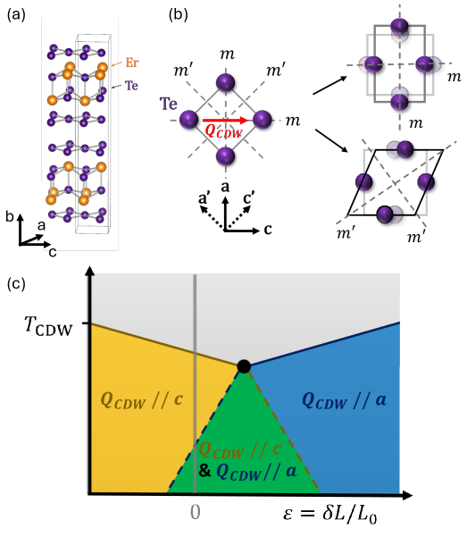
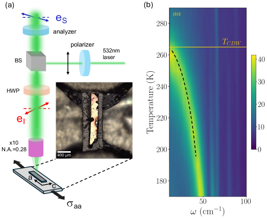
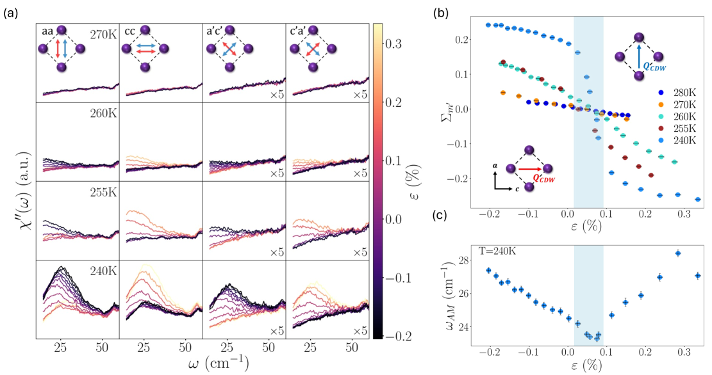
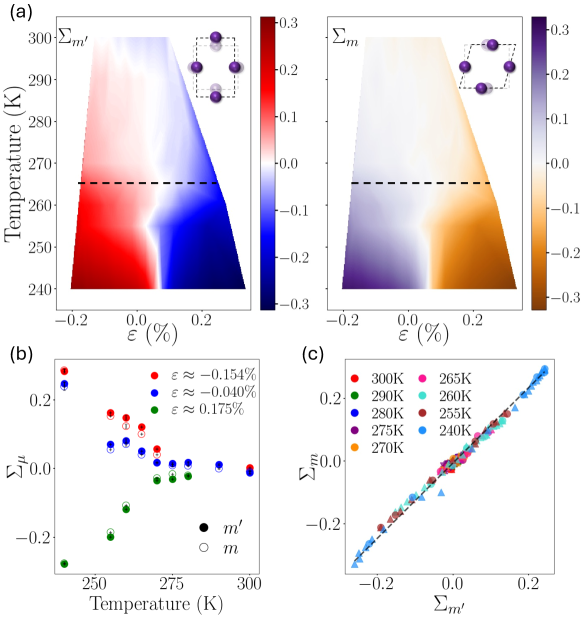
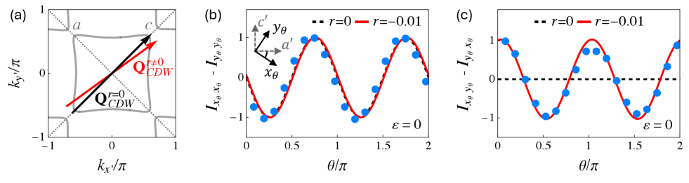
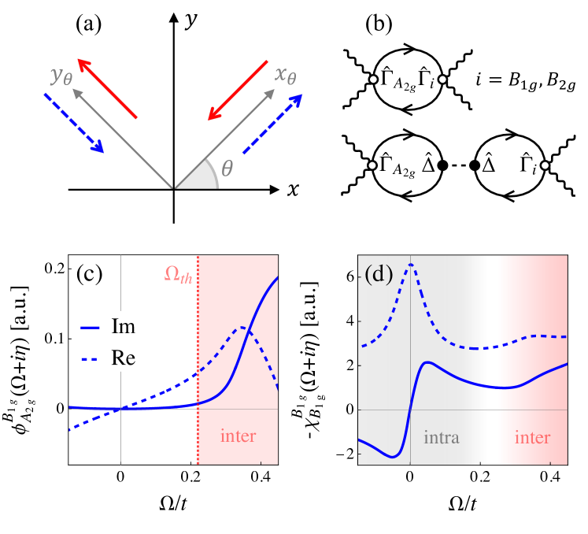

# 電荷密度波の対称性の謎を解く——ErTe₃における「傾いた波数ベクトル」説の実験的検証

- **執筆日**: 2026-04-11
- **トピック**: 希土類三テルル化物 ErTe₃ における電荷密度波秩序の本質：ひずみ下ラマン散乱による対称性論争の決着
- **タグ**: Electronic Structure / Charge, Orbital, and Spin Order; Low-Dimensional Materials / Synchrotron Measurements; Extreme Condition Measurements
- **注目論文**: Freitas et al., arXiv:2604.08440 (2026) — "Revealing the nature of the charge density wave order of ErTe₃ via Raman scattering under anisotropic strain"
- **参照関連論文数**: 7本

---

## 1. なぜ今この話題なのか

電子が自発的に空間的な周期パターンを形成する「電荷密度波 (charge density wave; CDW)」は、強相関電子系物理学における中心的な現象の一つである。CDWは単に電子密度が周期的に変調するだけでなく、結晶が本来持つ対称性の一部を破るという点で、秩序変数の対称性の理解が物理の核心をなす。希土類三テルル化物 *R*Te₃ (*R* = 希土類元素) は、このCDW物理を研究するうえで世界中で最もよく研究されてきた材料のひとつである。Te原子による正方形格子が二次元的な電子構造を生み出し、複数のCDW転移が観測される理想的な舞台となっている。

しかし2022年、この系に関して「常識を覆す」発見がなされた。Wang ら (arXiv:2112.02454; *Nature* 2022) は、RTe₃ のCDW振幅モード（Higgs モード）が「軸性 (axial)」の性格を持つことを初めて実証した。通常のHiggsモードはスカラー (scalar) であり、振幅が単純に大小するだけだが、軸性Higgsモードは擬角運動量（疑似軸性ベクトル）としての変換性を持ち、これはCDWの秩序変数がより複雑な内部構造を持つことを示唆する。この発見は「RTe₃ のCDW秩序の本質とは何か？」という根本的な問いを再び提起した。

さらに2024年末、Singh らによる精力的な多手法研究 (arXiv:2411.08322) が、この問いに対し大胆な解を提示した。彼らは ErTe₃ と HoTe₃ において、高温CDW相が通常よりも多くの対称性—平行鏡面 (*m*) と対角鏡面 (*m'*) の両方—を破ることをラマン分光、収束電子線回折 (LACBED)、回転異方性第二高調波発生 (RA-SHG)、ミュオンスピン緩和 (μSR) の組み合わせにより実証し、「フェロアキシャル密度波 (ferroaxial density wave)」という新しい概念を提唱した。彼らの解釈では、電荷秩序と軌道秩序が絡み合った多成分秩序変数が存在し、その多成分性こそが軸性Higgsモードと追加的な対称性破れの源であるという。

しかしこの解釈には反論がある。2026年4月、Freitas, Gallais らのパリ大学グループ (arXiv:2604.08440) は、ひずみ (strain) をパラメータとした偏光分解ラマン散乱の精密測定を通じて、「*m'* 対称性破れと *m* 対称性破れは独立ではなく、同一の単一成分秩序変数から生じる」という証拠を提示した。彼らの結論はフェロアキシャルモデルとは相容れず、代わりに「CDW波数ベクトルが高対称方向からわずかに傾いている」という幾何学的描像を支持する。

このトピックは、CDW物理の基礎——秩序変数の対称性分類、ラマン分光による対称性検出、そして多成分秩序の探索——が交わる最前線であり、現在進行形の論争が展開されている。学部4年生にとっても、「実験的に何をどう測れば秩序変数の多成分性を判断できるか」という問いは、凝縮系物理の本質を学ぶうえで非常に刺激的な題材である。

---

## 2. この分野で何が未解決なのか

**問い1：ErTe₃ のCDW秩序変数は一成分なのか多成分なのか？**

CDW秩序変数は、Landau理論の枠組みでは「どの既約表現に属するスカラーか複素数か」で分類される。単純なPeierls型CDWであれば複素スカラー（振幅と位相）だが、軌道自由度が絡む場合は複数の成分を持ちうる。ErTe₃ では TCDW ~ 265 K 付近に一次のCDW転移があり、低温では TCDW2 ~ 157 K に二次のCDW転移が続く。高温CDW相において、その秩序変数が単一成分か多成分かは未解決のままである。

**問い2：なぜ高温CDW相は「余分な」対称性破れを示すのか？**

RTe₃ の結晶格子は直方晶系 (orthorhombic) であり、*a-c* 面内には2本の鏡面——*a* 軸に垂直な鏡面 (*m*) と対角方向の鏡面 (*m'*)——が存在する。CDW波数ベクトル QCDW が *c* 軸方向を向いているとすれば、*c* 軸を含む鏡面は破れるが *m* と *m'* の一方は保たれると予想される。ところが実験は *m* と *m'* の両方が破れることを示しており、この「余分な」対称性破れの起源が論争の的である。

**問い3：軸性Higgsモードの起源は何か？**

通常、CDW振幅モード（Higgsモード）は対称ラマン応答（A₁g チャンネル）にのみ現れるスカラーモードである。しかし Wang ら (2022) は、RTe₃ の振幅モードが反対称ラマン応答（B₁g や B₂g チャンネルとの混合）にも現れることを示し、これを「軸性Higgsモード」と名付けた。この軸性性格が多成分秩序変数から生じるのか、それとも波数ベクトルの幾何学的傾きによる単純な効果なのかが問われている。

**問い4：ひずみはCDW秩序にどう作用するのか？**

外部ひずみはCDW秩序変数に直接結合することができ、これは秩序変数の変換性を調べる有力なプローブとなる。一般に、ひずみ *εᵢⱼ* は特定の既約表現に属し、それと同じ表現の秩序変数とのみ線形結合する。したがって、ひずみ下での秩序変数の挙動を観察することで、秩序変数の対称性を直接判定できるはずである。

---

## 3. 注目論文の核心：何が前進し、何がまだ仮説か

### 3.1 実験の設計：なぜ「ひずみ + ラマン」なのか

Freitas らの戦略の核心は、「ひずみを用いて *m'* と *m* の対称性破れを独立に制御できるか試す」という点にある。直方晶系 ErTe₃ に *a* 軸方向の一軸性ひずみ *σ_aa* を加えた場合、結晶の対称性分析から *σ_aa* は対角鏡面 *m'* の破れとのみ線形結合し、平行鏡面 *m* の破れとは直接結合しないことが分かる。

- **フェロアキシャルモデルの予測**：*m'* と *m* の破れは独立な秩序変数成分に起源を持つため、*σ_aa* を変えると *m'* 破れ（Σ_m'）は変化するが *m* 破れ（Σ_m）はほぼ変化しないはずである。
- **単一成分・傾きモデルの予測**：*m'* と *m* の両方の破れが同一の波数ベクトル傾きから生じるため、Σ_m' と Σ_m は互いに比例関係を維持するはずである。

*図1 (arXiv:2604.08440 より, CC BY 4.0): (a) ErTe₃の結晶構造。Te原子の正方格子層が層状構造を形成する。(b) 直方晶系の鏡面対称性の模式図。*m* は *a* 軸に垂直、*m'* は対角方向の鏡面。(c) 温度–ひずみ相図の模式図。赤・青で示す2つのCDWドメインが競合し、臨界点付近でドメインの再配向が起きる。*

### 3.2 実験手法：ピエゾひずみセルと偏光分解ラマン

実験では、ErTe₃ 単結晶をチタン製のプラットフォームに接着し、ピエゾ素子で制御されたひずみセルに取り付けた。*a* 軸方向に応力 *σ_aa* を印加しながら、532 nm レーザーを用いた背面散乱ラマン分光を行った。4種類の偏光配置—*aa*, *cc*, *a'c'*, *c'a'*—を使い分けることで、各偏光の組み合わせに対応するラマン応答 *χ''(ω)* を測定した。

CDWの振幅モード（AM-CDW）は、TCDW 以下の温度では低周波（~ 25–60 cm⁻¹）に鋭いピークとして現れる。このピークの強度を偏光配置ごとに比較することで、2つの対称性破れ指標を定義する：

$$\Sigma_{m'} = \frac{I_{aa} - I_{cc}}{I_{aa} + I_{cc}}, \quad \Sigma_m = \frac{I_{a'c'} - I_{c'a'}}{I_{a'c'} + I_{c'a'}}$$

ここで *I_aa* は *aa* 偏光配置における AM-CDW の強度積分値を表す。Σ_m' は対角鏡面 *m'* の破れを、Σ_m は平行鏡面 *m* の破れを定量的に測定する。

*図2 (arXiv:2604.08440 より, CC BY 4.0): (a) 実験セットアップ。ErTe₃結晶（中央写真）がひずみセルに固定されており、*σ_aa* のひずみが印加される。偏光制御のためのビームスプリッタ (BS)、半波長板 (HWP)、偏光子が配置されている。(b) *aa* 偏光での温度依存ラマンスペクトル（疑似カラーマップ）。TCDW ≈ 265 K（黄色の横線）以下でAM-CDWが急激に成長する（破線）。*

### 3.3 主要結果：Σ_m' と Σ_m の線形相関

図3に示すように、4種類の偏光配置でのラマン応答は、ひずみと温度の関数として大きく変化する。特に *a'c'* と *c'a'* 配置の間の差（Σ_m の信号）は、ひずみが増加するにつれて変化し、同時に Σ_m' も変化する。

*図3 (arXiv:2604.08440 より, CC BY 4.0): (a) 4温度・4偏光配置でのラマン応答のひずみ依存性（カラーバーはひずみ値）。*a'c'* と *c'a'* の間の差が Σ_m を反映する。(b) 5温度での Σ_m' のひずみ依存性。ε ≈ 0.1% 付近（青色領域）でCDWドメインの再配向が起きる。(c) T = 240 K でのAM-CDWエネルギーのひずみ依存性。*

図4(c) が本研究の中心的な結果を示している。ひずみ *ε* と温度 *T* を独立パラメータとして変化させたときの (Σ_m', Σ_m) の軌跡を二次元プロットすると、すべてのデータ点が一本の直線 $\Sigma_m = \alpha \Sigma_{m'}$（*α* は比例係数）の上に乗る。これは、異なる温度・異なるひずみにわたる全データにわたって成立する。

*図4 (arXiv:2604.08440 より, CC BY 4.0): (a) 温度–ひずみ空間での Σ_m'（左）と Σ_m（右）のカラーマップ。両者は定性的に酷似した空間分布を示す。(b) 3種類のひずみ値での Σ_m' (黒丸) と Σ_m (白丸) の温度依存性の比較。(c) Σ_m' を横軸、Σ_m を縦軸にとった散布図。全データ点が一本の直線上に乗る（実線）。これが本研究の核心的証拠である。*

この線形相関は以下のことを意味する：*σ_aa* のひずみは Σ_m' と直接結合するが Σ_m とは直接結合しない。それにもかかわらず Σ_m が Σ_m' と比例して動く事実は、両者が独立でないことを示す。フェロアキシャルモデルのように *m'* 破れと *m* 破れが独立な成分に由来するなら、ひずみで *m'* 破れだけを変えても *m* 破れはほぼ変化しないはずであり、散布図は直線ではなく複雑な軌跡を描くはずである。観測された線形相関はフェロアキシャルモデルと矛盾し、単一成分秩序変数モデルを支持する。

### 3.4 理論的説明：傾いた波数ベクトルモデル

論文はタイト結合計算を用いて、「QCDW が *c* 軸から微小角度 *θ* だけ傾いた場合」のラマン応答を計算した。傾きパラメータ *r* ≠ 0 の場合、*a'c'* と *c'a'* の間に差が生まれ、Σ_m が有限になることが確認された。

*図5 (arXiv:2604.08440 より, CC BY 4.0): (a) タイト結合モデルのフェルミ面。黒矢印は QCDW が *c* 軸方向の場合、赤矢印は傾いた場合を示す。(b)(c) 偏光角度に対するラマン強度差の角度依存性。実験データ（点）は *r* = 0（破線）では説明できず、*r* = −0.01（実線）で良く再現される。*

この描像では、QCDW の傾きは結晶の軌道整合性（*Fermi surface nesting*）の微妙な非対称性によって決まると考えられ、傾き量 *r* は非常に小さい（0.01 程度）。したがって直接的な波数ベクトルの測定で検出するのは困難だが、ラマン散乱の対称性感度によって間接的に検出できるのである。

### 3.5 何がまだ仮説段階か

現時点でまだ仮説にとどまる点として、以下がある。第一に、波数ベクトルの傾きの微視的起源は特定されていない。どの軌道の混合がどの程度 *r* に寄与するかは未解明である。第二に、「ひずみ下での線形相関」はフェロアキシャルモデルを否定する証拠ではあるが、単一成分モデルを一意に決定するものではない（他の多成分モデルも線形相関を生む可能性を厳密には排除できない）。第三に、低温CDW（CDW2）との関係——なぜ低温相のHiggsモードはスカラーに戻るのか——は本論文の範囲外であり未解決である。

---

## 4. 背景と研究史：この論文はどこに位置づくか

### 4.1 RTe₃ 系のCDW研究の歴史

希土類三テルル化物 *R*Te₃ は1990年代から電荷密度波の研究対象として知られていた (DiMasi et al., 1995; Ru et al., 2008)。これらの材料は *Cmcm* 空間群の直方晶構造を持ち、Te原子の正方形格子が二次元的電子構造をもたらす。フェルミ面ネスティング (Fermi surface nesting) によって、Te層内の電子系はCDW不安定性を持ちやすい。

重要なのは「なぜ2回CDW転移が起きるのか」という点である。*R* が軽い（La, Ce, ...）系ではCDW1のみが観測されるが、*R* が重くなる（Nd, Sm, ...）につれてCDW2も出現する。一般に、CDW1は *c* 軸方向の QCDW₁ によるもので高温に現れ、CDW2は *a* 軸方向の QCDW₂ によるもので低温に出現する。この競合するCDW秩序の近縮退性は、Kim ら (arXiv:2401.17437) が TbTe₃ の超高速実験で示したように、両CDW相のエネルギーが近いことに対応している。彼らはひずみ下での超高速反射率測定により、*a* 軸ひずみも *c* 軸ひずみも同様にCDW1を安定化することを見出し、2つの競合秩序が本質的に等価なエネルギー地形の上にあることを示した。

また、ErTe₃ において CDW1 を *c* 軸から *a* 軸方向に実験的に再配向させられること——つまり、ひずみでドメインの向きを変えられること——は、Straquadine ら (PRX 2022) による弾性カロリー測定・弾性抵抗率測定によって実証されており、本研究のひずみセル実験の背景をなす重要な先行研究である。

### 4.2 軸性Higgsモードの発見と衝撃（2022年）

Wang ら (arXiv:2112.02454; *Nature* 2022) は、LaTe₃ と GdTe₃ のラマン散乱で、CDW振幅モード（Higgsモード）が「反対称」ラマン応答を持つことを「量子経路干渉」の手法で検出した。具体的には、*a'c'* 配置と *c'a'* 配置のラマン信号の差（反対称成分）にHiggsモードが現れ、これが擬角運動量 ℓ = 1 を持つ軸性ベクトルとして変換することを示した。

通常のCDW（例えばNbSe₂ などのものを含む）ではHiggsモードはスカラー（A₁g 対称性）にしか現れない。しかし RTe₃ では Higgsモードが B₁g および B₂g チャンネルとの間に混合する。Wang らはこれを「軸性Higgsモード」と名付け、CDW秩序変数が複数の既約表現を混合した「軸性」性格を持つ証拠と解釈した。

ここで軸性ラマン応答に関する理論的背景を補足する。Udina と Paul (arXiv:2507.07189; *PRL* 2026) は「反対称ラマン応答 (antisymmetric Raman response)」の一般理論を構築した。この理論によると、交差した偏光ジオメトリー（*a'c'* vs. *c'a'*）の差は、バンド間（interband）エネルギースケールとフェルミ面の対称性に鋭敏な測定量である。

*図6 (arXiv:2507.07189 より, CC BY 4.0): (a) ラマン散乱における偏光幾何学。入射偏光 (赤) と散乱偏光 (青) の組み合わせが反対称応答を決める。(b) 反対称ラマン応答に寄与するファインマン図。A₂g チャンネルと B₁g/B₂g チャンネルとの間のクロス感受率を表す。下段：CDW秩序変数 Δ̂ の挿入を含む項。(c)(d) 反対称応答のバンド内・バンド間寄与の区別。*

Udina-Paul 理論の核心は、「反対称ラマン応答 ∝ $I_{a'c'} - I_{c'a'}$ はバンド内項を含まず、バンド間項のみから成る」という点である。これにより、フェルミ面の非対称性（対称性破れ）やバンド間エネルギースケールを選択的に測定できる。RTe₃ のような CDW 系では、QCDW が高対称方向からずれることで反対称応答が有限になり、その大きさはずれ量に比例する。

### 4.3 フェロアキシャル解釈の台頭（2024年）

2024年末、Singh ら (arXiv:2411.08322) はフェロアキシャル密度波 (FAD) という新しい解釈を提唱した。彼らは ErTe₃ と HoTe₃ に対して4種類の独立な実験手法を適用し、高温CDW相が *m* と *m'* の両方の鏡面対称性を同時に破ることを確認した。彼らの解釈では：

1. CDW秩序変数はスカラーの電荷成分 $\phi_c$ と擬ベクトルの軌道成分 $\phi_o$ の2成分からなる。
2. 2成分の絡み合いによってフェロアキシャル秩序が生まれ、これが *m* と *m'* の破れを引き起こす。
3. 軸性Higgsモードは $\phi_c$ の振動モードが $\phi_o$ との結合によって軸性性格を獲得したものである。

また、Alekseev ら (arXiv:2404.17635) の理論研究も、RTe₃ の多軌道モデルから出発したGinzburg-Landau (GL) 理論を展開し、軌道テクスチャを持つ CDW 状態として複数の相が競合することを予言した。この理論的枠組みはフェロアキシャル解釈を支持するものであった。

このように、2024年末の時点では「フェロアキシャル解釈」が有力と見られていた。しかし2026年4月の Freitas ら (2604.08440) の結果はこれに真っ向から反論するものである。

---

## 5. どの解釈が最も妥当か：証拠・比較・限界

### 5.1 単一成分・傾き波数ベクトルモデルを支持する証拠

**最強の証拠**は図4(c) に示す Σ_m' と Σ_m の線形相関である。この相関は以下の点で決定的である。

（i）ひずみ *σ_aa* は Σ_m' と直接結合するが Σ_m とは結合しない（対称性分析より）。

（ii）フェロアキシャルモデルでは、*m'* と *m* の破れが独立な成分 $\phi_c, \phi_o$ に由来するため、*σ_aa* がΣ_m' を変えてもΣ_m はほとんど変化しないはずである。

（iii）しかし観測では Σ_m は Σ_m' に比例して動く。

（iv）これはひずみ・温度の広い範囲にわたって成立し、単なる偶然の一致ではないことは明らかである。

タイト結合計算（図5）も傾きモデルを定量的に支持する。実験で観測されたラマン強度の角度依存性は、*r* = 0（QCDW 完全に *c* 軸方向）のモデルでは再現されず、*r* = −0.01 程度の微小傾きを導入すると著しく改善される。

また、Udina-Paul 理論 (arXiv:2507.07189) の枠組みでは、単一成分 CDW に QCDW の傾きがあれば反対称ラマン応答が有限になることが解析的に示されており、これは Freitas らの結果と整合的である。

### 5.2 フェロアキシャルモデルとの比較と矛盾点

Singh ら (arXiv:2411.08322) は LACBED、RA-SHG、μSR という独立な手法で *m* と *m'* の同時破れを確認しており、そのデータ自体は十分に信頼性が高い。問題は「その破れがなぜ起きるか」の解釈にある。

Freitas らが指摘するように、フェロアキシャルモデルが *m* 破れと *m'* 破れが独立な成分から来ると主張するなら、ひずみ実験はその独立性を検証できる理想的な舞台となる。観測された線形相関はこの独立性を否定している。

Singh らのモデルでも、$\phi_c$ と $\phi_o$ が強く結合している場合は Σ_m と Σ_m' が比例する可能性はある。しかしその場合、「なぜフェロアキシャル秩序という別の概念を導入する必要があるのか」という疑問が生じる。強結合の多成分モデルと単一成分の傾き波数ベクトルモデルを実験的に区別するためには、より精密な実験や理論計算が必要になる。

実験・理論・計算の整合：

| 証拠 | 傾き波数ベクトルモデル | フェロアキシャルモデル |
|:---|:---|:---|
| Σ_m'・Σ_m の線形相関（本研究） | ○（直接説明できる） | △（強結合なら可能）|
| 軸性Higgsモードの存在（Wang 2022） | ○（波数ベクトルの傾きから説明可） | ○（多成分順序変数から説明可） |
| LACBED, RA-SHG の結果（Singh 2024）| ○（単一成分でも m と m' は同時に破れる）| ○ |
| μSR（Singh 2024）| ○（磁気秩序なし確認は両モデルで同様） | ○ |
| Σ_m' と Σ_m の独立変化 | × | ○（独立成分なら予測される） |

この整理から、**傾き波数ベクトルモデルがすべての実験事実を矛盾なく説明できる**のに対し、フェロアキシャルモデルは「Σ_m'とΣ_mが連動して動く理由」を追加仮定なしに説明するのが難しいことがわかる。

### 5.3 trARPES による補完的視点

Su ら (arXiv:2503.13936) は、超短パルスレーザーで ErTe₃ を励起した後の CDW 回復を trARPES（時間分解角度分解光電子分光）で追跡し、一次（主）CDW と二次（副）CDW では異なるダイナミクスを示すことを見出した。特に二次CDW（低温相）が「核生成型」の成長機構を持つことは、低温CDW秩序の形成がより競争的で非自明であることを示唆する。この結果は直接フェロアキシャル vs. 傾き波数ベクトルの議論に決着をつけるものではないが、高温・低温CDW相の異なる性格を非平衡的視点から明らかにした点で補完的価値がある。

### 5.4 現時点での弱い結論と未解決問題

比較的強く支持される結論として：RTe₃ 高温CDW 相の *m'* 破れと *m* 破れは独立でなく連動している。これは単一成分の秩序変数——あるいは強く結合した多成分秩序——に起源を持つことを示唆する。

まだ弱い結論として：QCDW の傾きが具体的にどの軌道成分の混成から生じるかは未特定である。傾き量が小さすぎて X 線回折や ARPES での直接観測は困難であり、計算による裏付けが必要である。

今後必要な検証として、(i) DFT + 強相関計算によるフェルミ面ネスティングの精密計算と最適 QCDW の特定、(ii) ErTe₃ 以外の RTe₃ 化合物（HoTe₃、TbTe₃ など）における同様のひずみ下ラマン測定との比較、(iii) 磁場下でのラマン測定（Wulferding ら, *Nature Commun.* 2025 が示したような） が挙げられる。

---

## 6. 何が一般化できるのか：材料・手法・応用への広がり

### 6.1 他のRTe₃ 化合物への展開

RTe₃ 系は希土類 *R* の種類によってCDW転移温度や競合CDW相の有無が体系的に変化する。これは「化学圧力」の効果（*R* が重くなると格子定数が変化）に対応する。Singh ら (2024) が HoTe₃ でも同様のフェロアキシャル的特徴を報告したことは、本現象が ErTe₃ 固有でないことを示す。今後 SmTe₃ や GdTe₃ など、CDW2 の有無が入れ替わる境界付近での系統的なひずみラマン測定が、「傾き波数ベクトル」描像の普遍性を検証するうえで重要となる。

また、PdxErTe₃ のような Pd インターカレーション系（2412.20706）は、disorder がCDW臨界点に与える影響を調べる系として機能する。Pd インターカレーションは CDW2 を抑制しながらも CDW1 付近の臨界挙動を維持し、超伝導も誘起することが知られている。disorder 下でどの程度 QCDW の傾きが維持されるかは、傾き起源の理解に直結する問いである。

### 6.2 CDW対称性検出の手法論的意義

本研究の真の革新性は「ひずみを対称性プローブとして使う」という方法論にある。ひずみテンソルの各成分は既知の対称性変換性を持つため、ひずみへの応答を調べることで秩序変数の既約表現を判定できる。Straquadine ら (PRX 2022) の弾性抵抗率測定もこの精神の流れを汲むが、Freitas らはラマン散乱の偏光分解能の高さを活かして「2つの対称性破れの相関」を直接測定するという新しい次元を開いた。

この手法は RTe₃ 系に限らず、複数の対称性が同時に破れる系——例えばカゴメ超伝導体 AV₃Sb₅ での CDW + 時間反転対称性破れの議論、あるいはネマティック超伝導体での対称性の問題——に原理的に適用できる。ひずみ下ラマン分光は汎用的な「対称性バイオプシー」ツールとして注目されるべきである。

### 6.3 軸性Higgs modeの一般性と応用

Wang ら (2022) が発見した軸性HiggsモードはRTe₃ 特有の現象ではなく、より一般的な概念の現れである可能性がある。Udina-Paul 理論 (2507.07189) は、反対称ラマン応答が「バンド間エネルギースケールと対称性破れの共鳴探針」として機能することを示し、励起子絶縁体 Ta₂NiSe₅ にも同様の解析が適用できることを示した。

この視点からすると、軸性Higgsモードの存在は必ずしも「多成分秩序変数の証拠」ではなく、「波数ベクトルの幾何学的非対称性の証拠」かもしれない。この区別は、他の材料でHiggsモードの軸性性格が観測された際の解釈に根本的に影響する。とくに超伝導体でのHiggsモード（Cu酸化物超伝導体で議論されている）においても、同様の考慮が必要になりうる。

---

## 7. 基礎から理解する

### 7.1 電荷密度波（CDW）とは何か

金属中の電子は通常、均一なフェルミ海を形成している。しかし、ある種の準一次元・準二次元金属では、電子の周期的再配列が自発的に起き、電子密度が空間的に変調する。これが電荷密度波 (CDW) である。密度変調の波長を λ = 2π/|QCDW| とすると、QCDW はCDWの波数ベクトルである。

CDW 不安定性の最もシンプルな理解は「Peierls 不安定性」である。一次元金属でフェルミ波数 k_F を持つ電子系を考えると、周期 λ = π/k_F の格子歪みを導入することでバンド端 ±k_F においてギャップが開き、電子エネルギーを下げることができる。この格子歪みに伴って電子密度も空間周期 λ で変調する。この状態がCDWである。

RTe₃ の場合はより複雑で、Te層の正方格子が形成する二次元フェルミ面の特定の部分（ネスティングベクトル QCDW に対応する部分）が CDW によってギャップアウトされる。このフェルミ面ネスティングの度合いが CDW の安定性を決める。

CDWの秩序変数は複素スカラー $\Delta = |\Delta| e^{i\phi}$ で書かれることが多い。振幅モード（Higgsモード）は $|\Delta|$ の振動に対応し、位相モード（Goldstoneモード、フォノン）は $\phi$ の振動に対応する。

### 7.2 ラマン散乱の基礎

ラマン散乱は、入射光が物質中の格子振動（フォノン）や電子的励起と相互作用して、異なる周波数で散乱される現象である。散乱光と入射光の周波数差 *ω* が物質の励起モードのエネルギーを与える。

ラマン散乱強度は「ラマン散乱テンソル（ラマン行列要素）」の絶対値二乗に比例する。散乱テンソルの成分は、入射偏光 *e_i* と散乱偏光 *e_s* のどの組み合わせを選ぶかによって異なる成分を選択的に測定できる。具体的には：

$$I_{e_i, e_s} \propto |e_s \cdot R \cdot e_i|^2$$

ここで *R* はラマン散乱テンソルである。*R* は結晶の対称性によって許される成分が制限される（選択則）。例えば、A₁g 対称性の振動は *aa*, *cc* などの偏光配置（「平行偏光」）で選択的に観測できる。B₁g や B₂g 対称性の振動は「交差偏光」配置で観測できる。

**反対称ラマン応答**（本論文の核心概念）は：

$$I_{a'c'} - I_{c'a'} \propto |\text{(antisymmetric part of } R\text{)}|$$

のように、2つの交差偏光配置（入射と散乱の偏光を交換した配置）の差として定義される。通常のフォノン（時間反転対称性を持ちバンド内遷移が支配的）は反対称応答に寄与しないが、CDW振幅モードのような「バンド間結合を伴う集団励起」は反対称応答を持ちうる。Udina-Paul (2507.07189) の理論によれば、反対称ラマン応答はバンド内項を含まずバンド間項のみからなり、これが対称性破れに対して非常に鋭敏である理由である。

### 7.3 Higgsモードとその対称性

超伝導体でのHiggsモードはよく知られているが、CDW系でも類似の集団モードが存在する。CDWのHiggsモード（AM-CDW: CDW amplitude mode）は、CDW秩序変数の振幅 $|\Delta|$ が平衡値周りで振動するモードである。このモードのエネルギーは転移温度に近づくにつれてゼロに近づく「ソフトモード」的振る舞いを示し、転移温度以下で有限エネルギーに硬化する。

通常のCDW Higgsモードはスカラー（A₁g）対称性を持つが、RTe₃ では軸性（B₁g/B₂g との混合）成分を持つ。この軸性成分が生じる理由として：

- **多成分説**：秩序変数が $(\phi_c, \phi_o)$ のような複数成分を持ち、両成分の間に「混合項」が存在することで軸性応答が生まれる（Singh ら, 2024）。

- **傾きベクトル説**：秩序変数は単一成分だが、QCDW が高対称方向からずれることで平行偏光と交差偏光の間の「混合行列要素」が生まれる（Freitas ら, 2026; Udina-Paul, 2026）。

数式的には、傾きを持つ QCDW = (Q₀ + δq_a, Q₀ + δq_c) の場合、ラマンテンソルの *A₂g* チャンネルと *B₁g* チャンネルを繋ぐ off-diagonal 要素が δq によって誘起され、これが反対称ラマン応答を生み出す。

### 7.4 ひずみと対称性——秩序変数の直接プローブとして

結晶にひずみ *εᵢⱼ* を加えることは、自由エネルギーに $-\sum_{ij} \sigma_{ij} \varepsilon_{ij}$ の項を付加することに等しい。秩序変数 *η* との結合は一般に $f_{couple} = \sum g \cdot \varepsilon \cdot \eta$ のような形で書かれるが、この結合が許されるためには *ε* と *η* が同じ既約表現を持つ必要がある（あるいはその積が完全対称になる必要がある）。

直方晶系 (*Cmcm*) において：
- *a-a* ひずみ成分 *εaa* は A₁g（完全対称）表現に属し、すべての A₁g 型秩序変数と結合する。また B₂g 表現にも寄与し、この成分が *m'* 対称性破れに線形結合する。
- *B₂g* 型ひずみは *m'* 鏡面を破る対称性変換性を持つ。

したがって *σ_aa* ひずみは Σ_m'（B₂g 型の対称性破れ）と線形結合するが、Σ_m（A₂g 型の対称性破れ）とは直接結合しない。この「対称性ルール」を活用して、Freitas らは二つの対称性破れの独立性を直接検証した。

---

## 8. 専門用語の解説

**電荷密度波 (charge density wave; CDW)** は、金属中の電子が自発的に周期的な密度変調を形成する現象である。フェルミ面の「ネスティング」条件が満たされると電子系が不安定になり、特定の波数ベクトル QCDW で電子密度が変調する。エネルギーギャップの形成を通じてフェルミ面の一部が消え、金属から半金属・半導体的な状態に変化する場合が多い。

**フェルミ面ネスティング (Fermi surface nesting)** とは、フェルミ面の一部の形状が、ある波数ベクトル QCDW だけシフトしたときに別の部分と重なる（ネストする）幾何学的状況を指す。この条件が成立するとCDW不安定性の感受率（Lindhard関数）が発散し、CDW形成が促進される。RTe₃ では準二次元的なフェルミ面の形状がネスティングを容易にする。

**軸性Higgs モード (axial Higgs mode)** は、CDW の振幅モード（Higgsモード）が擬角運動量 ℓ = 1 を持つ軸性ベクトルとして変換する変わったモードである。通常のCDW Higgsモードはスカラー (ℓ = 0) だが、RTe₃ では反対称ラマン応答に現れる軸性成分を持つ。これは秩序変数の内部対称性（または波数ベクトルの幾何学）を反映する。

**フェロアキシャル秩序 (ferroaxial order)** とは、自発的な「軸性ベクトル（擬ベクトル）」の秩序を指す。空間反転に対して奇の変換性を持つ軸性ベクトルが自発的に一方向に揃う状態である。構造のフェロアキシャル秩序は格子の回転的歪みに対応し、電子的フェロアキシャル秩序は軌道角運動量の整列などに対応する。RTe₃ で Singh ら (2024) が提唱したのは後者（電子的フェロアキシャル）の例である。

**反対称ラマン応答 (antisymmetric Raman response)** は、互いに偏光を交換した2つのラマン散乱配置（例：*a'c'* と *c'a'*）の信号の差として定義される量である。時間反転対称性が保たれ、バンド内遷移が支配的な場合はゼロになる。対称性が破れたCDW相や特定の多体系ではゼロにならず、秩序変数の性格を直接反映する。

**弾性カロリー効果 (elastocaloric effect)** とは、断熱的にひずみを変化させたときの温度変化 $\Delta T = -(T/C) (\partial S/\partial \varepsilon)|_T \Delta\varepsilon$ として現れる熱力学的効果である。CDW転移に関連したエントロピー変化がひずみに敏感であるため、弾性カロリー測定はCDW転移温度のひずみ依存性を鋭敏に検出できる。Straquadine ら (PRX 2022) はこれを用いて ErTe₃ の CDW ドメインのひずみによる再配向を実証した。

**ラマン散乱の選択則 (Raman selection rules)** は、結晶の空間群（点群）の対称性から導かれる「どの振動モードがどの偏光配置で観測されるか」の規則である。ラマン活性なモードはフォノン変換表現と散乱テンソルの行列要素が非零であるもので、偏光配置（*aa*, *cc*, *a'c'*, *c'a'* など）を変えることで異なる既約表現のモードを選択的に測定できる。

**Ginzburg-Landau 理論 (Ginzburg-Landau theory)** は、相転移近傍での秩序変数 *η* の空間・時間的ふるまいを記述する唯象論的理論である。自由エネルギーを *η* のべき級数として展開し、係数が実験から決まる。CDW では秩序変数の振幅（Higgsモード）と位相（Goldstoneモード）が独立な動力学を持ち、外部ひずみとの結合も GL 理論内で自然に記述される。

**大角度収束電子線回折 (LACBED: Large-Angle Convergent Beam Electron Diffraction)** は、収束電子線をディスク状に広げて照射し、高次のラウエゾーン反射を含む幅広い回折パターンを取得する電子顕微鏡技術である。結晶の空間群判定や対称性の微細な破れの検出に優れており、Singh ら (2024) はこれを用いて ErTe₃ の低対称性（単斜晶的）の電子的応答を確認した。

**時間分解角度分解光電子分光 (trARPES: time-resolved ARPES)** は、ポンプ光で材料を励起した後、プローブ光（通常は真空紫外光）で電子のエネルギー・運動量分布を時間分解で測定する手法である。CDW の形成・消失ダイナミクスをフェルミ面上の電子状態の変化として直接観測できる。Su ら (arXiv:2503.13936) はこれを用いて ErTe₃ の主次2つのCDWの回復ダイナミクスを区別した。

**波数ベクトルの傾き (tilted ordering wavevector)** とは、CDWの波数ベクトル QCDW が結晶の高対称方向（例えば *c* 軸）から微小角度 *θ* だけずれている状況を指す。傾きが微小でも、ラマン散乱や他の対称性感度の高い実験では有限の反対称信号を生じさせる。本論文 (Freitas ら, 2026) では、タイト結合計算で *r* ~ −0.01 程度の傾きパラメータが観測を再現することを示した。

---

## 9. おわりに：何が分かり、何がまだ残っているのか

2026年4月の Freitas らの研究 (arXiv:2604.08440) は、ErTe₃ の電荷密度波秩序の本質について新たな答えを提示した。ひずみをかけながら偏光分解ラマン散乱を行うことで、二種類の対称性破れ（Σ_m' と Σ_m）が独立でなく線形的に連動することを実証し、「単一成分CDWで波数ベクトルが高対称方向から微小にずれている」という描像を支持した。この結果は、2024年末に提唱されたフェロアキシャル密度波モデル（多成分秩序変数の独立成分を仮定）と矛盾する。あわせて Udina-Paul の反対称ラマン理論（arXiv:2507.07189）が提供する理論的枠組みは、この結論に強固な理論的基礎を与えている。比較的確かになったのは、「*m'* 破れと *m* 破れは同一起源から来ており、外場（ひずみ）に対して独立に応答しない」という事実であり、これは今後の材料解釈に重要な制約を与える。

一方で、未解決の課題も山積している。QCDW の傾きの微視的起源——どの軌道の混成がどの程度の傾きを生み出すか——は第一原理計算による検証を待っている。また、RTe₃ 系の多くが示す「軸性Higgsモードがなぜ低温CDW2相ではスカラーに戻るのか」という問いも、傾き波数ベクトルモデルでは直感的な説明が難しい点として残る。今後1〜3年で決定的になりうる論点として、(i) DFT + 乱雑位相近似 (RPA) による QCDW の精密決定と傾き量の予測、(ii) 他の RTe₃ メンバー（特に CDW1/CDW2 の境界付近の組成）でのひずみ下ラマン測定、(iii) 磁場下での反対称ラマン応答の温度・磁場依存性（Wang 2022 や Wulferding 2025 の路線）が挙げられる。「電荷密度波の対称性の謎」はまだ終わっていない。

---

## 参考論文一覧

1. **arXiv:2604.08440** | Freitas et al. (2026) — [Revealing the nature of the charge density wave order of ErTe₃ via Raman scattering under anisotropic strain](https://arxiv.org/abs/2604.08440)
   ひずみ下の偏光分解ラマン散乱により、ErTe₃の2種類の対称性破れが連動することを実証し、単一成分CDWの傾き波数ベクトルモデルを支持した注目論文。

2. **arXiv:2112.02454** | Wang et al. (*Nature* 2022) — [Axial Higgs Mode Detected by Quantum Pathway Interference in RTe₃](https://arxiv.org/abs/2112.02454)
   RTe₃のCDW振幅モードが軸性ベクトルの性格を持つことを量子経路干渉ラマン分光で初めて発見した。

3. **arXiv:2411.08322** | Singh et al. (2024) — [Uncovering the Hidden Ferroaxial Density Wave as the Origin of the Axial Higgs Mode in RTe₃](https://arxiv.org/abs/2411.08322)
   多手法実験によりErTe₃とHoTe₃に「フェロアキシャル密度波」を提唱し、電荷・軌道秩序の絡み合いを主張した——本注目論文が反論を示す競合解釈。

4. **arXiv:2507.07189** | Udina & Paul (*PRL* 2026) — [Antisymmetric Raman Response](https://arxiv.org/abs/2507.07189)
   反対称ラマン応答の一般理論を構築し、RTe₃などのCDW系への適用を示した——注目論文の実験解析を支える理論的基盤。

5. **arXiv:2503.13936** | Su et al. (2025) — [Time-domain identification of distinct mechanisms for competing charge density waves in a rare-earth tritelluride](https://arxiv.org/abs/2503.13936)
   trARPESでErTe₃の主次CDWが異なる動力学（異なる形成機構）を持つことを示した。

6. **arXiv:2401.17437** | Kim et al. (2024) — [Ultrafast measurements under anisotropic strain reveal near equivalence of competing charge orders in TbTe₃](https://arxiv.org/abs/2401.17437)
   TbTe₃でのひずみ下超高速測定により、互いに競合する2つのCDW秩序のエネルギーがほぼ縮退していることを示した。

7. **arXiv:2404.17635** | Alekseev et al. (2024) — [Charge density-waves with non-trivial orbital textures in rare earth tritellurides](https://arxiv.org/abs/2404.17635)
   多軌道模型に基づくGinzburg-Landau理論から、RTe₃の軌道テクスチャを持つCDW相の理論的枠組みを構築した——フェロアキシャル解釈を理論的に裏付ける研究。
