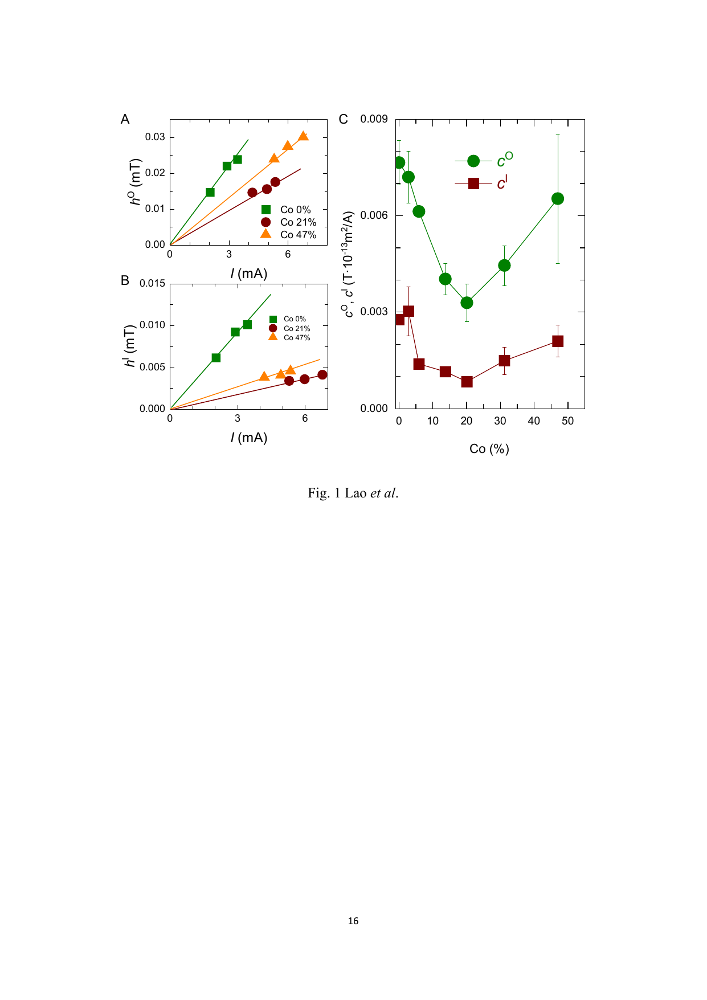
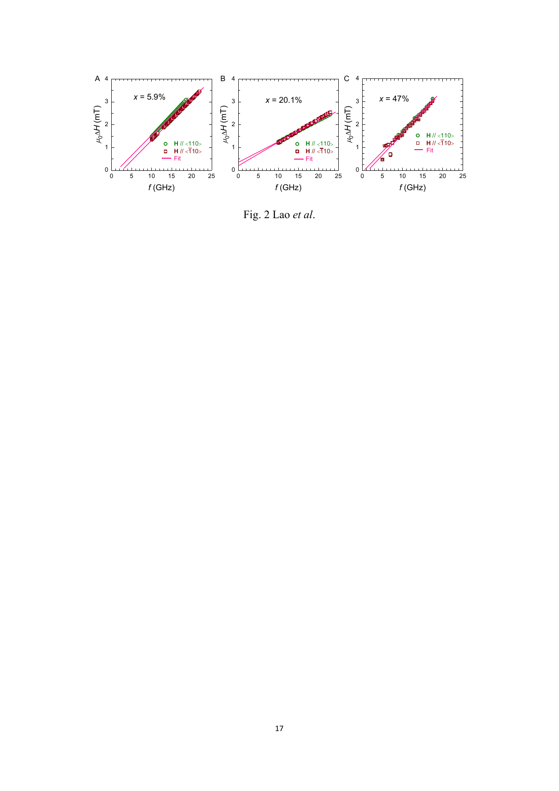
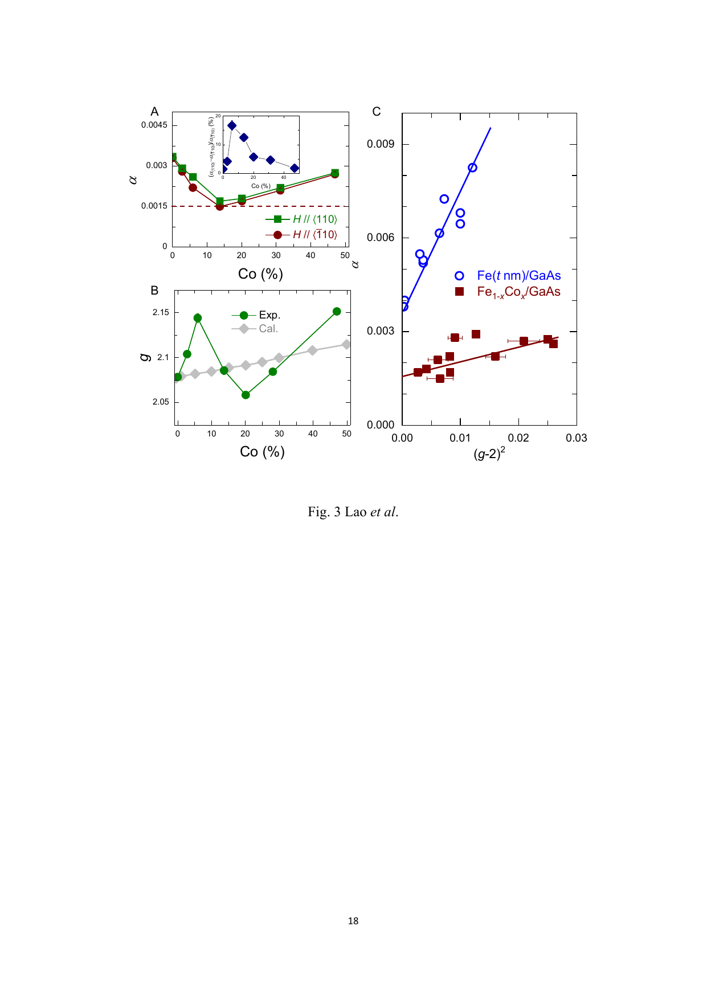
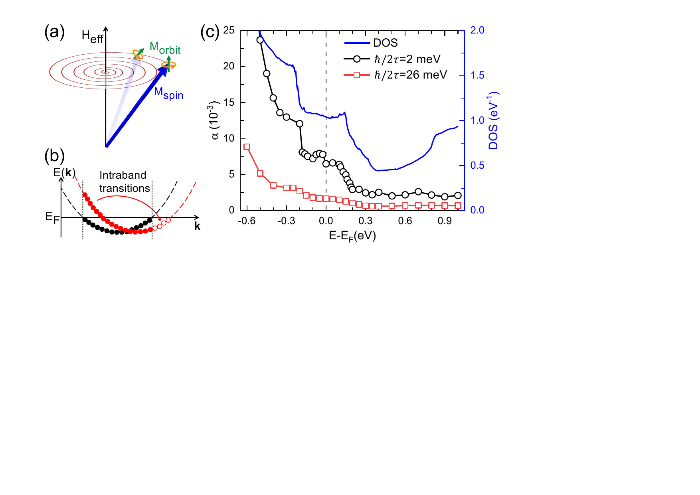
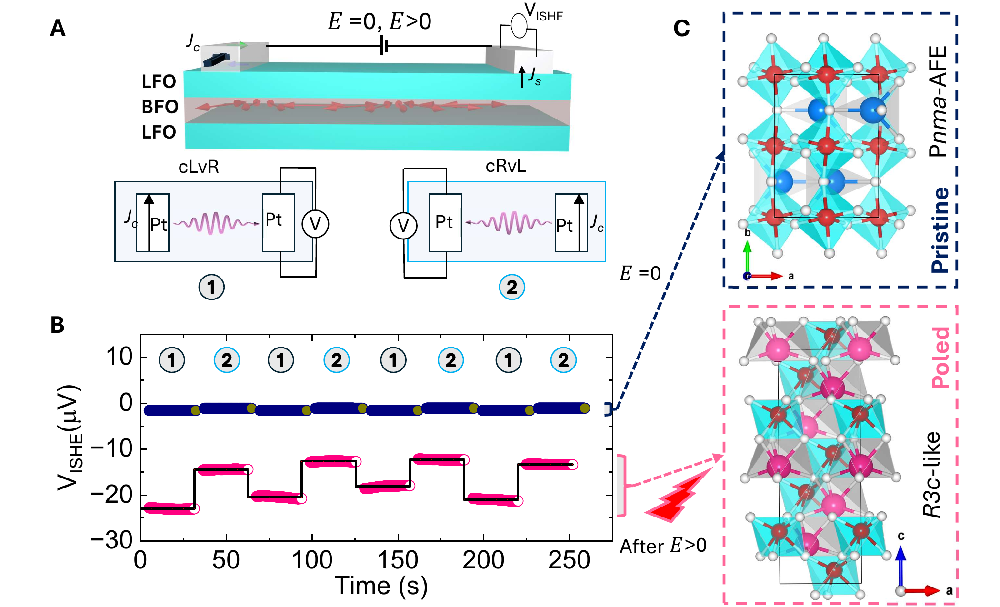

# 金属強磁性体における超低ギルバートダンピング：界面スピン軌道相互作用の制御と低損失磁気デバイスへの道

- 執筆日：2026-04-14
- トピック：FeCo合金の合金化によるインターフェース・スピン軌道相互作用のチューニングと超低磁気ダンピングの実現
- タグ：Magnetism and Spin / Thin Films and Interfaces / Spin-Orbit Interaction / Iron Loss and Energy Dissipation / Transport Measurements / First-Principles Calculations
- 注目論文：Lao et al., "Alloying Controlled Tuning of Interfacial Spin Orbit Interaction and Magnetic Damping in Crystalline FeCo Alloys," arXiv:2603.27307 (2026)
- 参照論文数：6

---

## 1. なぜ今この話題なのか

情報処理の消費エネルギーが急増するなか、磁気スピン波（マグノン）を信号担体として利用する「マグノニクス（magnonics）」が、次世代低消費電力コンピューティングの有力候補として注目されている。スピン波は電荷を運ばないためジュール熱が原理的に生じず、同じ情報処理をはるかに少ないエネルギーで実現できる可能性を持つ。スピントロニクス分野でも、スピン軌道トルク（SOT）による磁化反転やスピンポンピングを応用したデバイスの実現が進んでいるが、これらの性能を左右する根本的な物質定数が**ギルバートダンピング定数 α**（Gilbert damping parameter）である。

ダンピング定数 α は、磁化歳差運動が減衰する速さを表す無次元量であり、小さいほど磁気損失が低いことを意味する。αが小さいと、(1) スピン波伝播距離が長くなり低損失なマグノンデバイスが作れる、(2) 磁化反転のためのスピン電流閾値（クリティカルカレント）が下がり省エネルギーなSOT-MRAMが実現できる、(3) マグノン-フォトン結合の品質因子が向上し量子情報処理への応用が広がる、といった恩恵がある。

これまで低損失磁性材料の代表格は**イットリウム鉄ガーネット（YIG: Y₃Fe₅O₁₂）** であった。YIGは α ～ 10⁻⁵という桁違いに低い値を示し、スピン波の伝播距離はミリメートル以上に及ぶ。しかし YIG は絶縁体であり、エピタキシャル成長にガドリニウムガリウムガーネット（GGG）などの特殊基板を必要とするため、シリコン半導体プロセスとの統合が難しい。一方、金属強磁性体は高い飽和磁化と大きなスピン波群速度（YIG の 10 倍以上）を持ち、半導体基板への製膜が容易という利点があるが、αが典型的に 10⁻³ ～ 10⁻² 程度と大きく、スピン波の伝播距離はマイクロメートル程度に制限されてきた。

この状況を打破したのが、**Co₂₅Fe₇₅合金薄膜**の発見である。2016年以降の研究で α ～ 10⁻⁴ という金属系では記録的な低ダンピングが達成され、スピン波伝播距離 > 20 μm が実証された。しかし、その物理的起源については「フェルミ準位の電子状態密度の最小化か」「スピン軌道相互作用の関与か」「電子–フォノン散乱の温度依存性か」と議論が続いていた。また、異なる系（半導体基板、界面）での同様の達成が可能かどうかも未解明であった。

2026年3月、慕尼黒工科大学・レーゲンスブルク大学・復旦大学の共同研究グループ（Lao et al.）は、**単結晶 FeCo 薄膜/GaAs(001)** 系に対し、Co 濃度を系統的に変えることで、界面スピン軌道相互作用（SOI）・Landé g因子・ギルバートダンピングを一体的かつ連続的にチューニングできることを示した。そして α と (g-2)² の間の線形関係を実証し、「界面SOIがダンピングの独立した追加ソースである」という新しい描像を提示した。この成果は、金属強磁性体における低損失磁気デバイス実現に向けた材料設計指針を大きく前進させるものである。

---

## 2. 未解決問題は何か

**問い1：金属強磁性体のギルバートダンピングを最終的に制限するものは何か？**

金属系における α のミクロな起源は、Kamberský（カンベルスキー）が 1976 年に提唱した機構が基礎となっている。スピン軌道相互作用が存在するとき、磁化歳差運動によりフェルミ面上の電子状態の占有が変化し、電子がフォノン（あるいは不純物）で散乱されることでスピン角運動量が失われる。この機構によると α はフェルミ準位における電子状態密度 N(E_F) とスピン軌道結合の強さの二乗に比例するはずだが、実験データとの定量的な一致は FeCo 合金でも依然として完全ではない。界面由来のSOIの寄与、電子–フォノン散乱の精緻化、軌道励起（orbital excitation）の役割など、複数の機構が競合するため、「どれが支配的か」はまだ決着していない。

**問い2：界面や次元性・対称性は α をどこまで下げられるか？**

バルクの金属強磁性体では電子のバンド間遷移（interband）とバンド内遷移（intraband）がともに α に寄与するが、2D強磁性体（例えばファンデルワールス強磁性体 Fe₃GaTe₂ など）では鏡映対称性がバンド内遷移を禁止し、α が散乱率の減少とともに単調に低下することが理論的に示されている。一方、薄膜における量子井戸状態が α に振動を引き起こすという実験・理論的報告もある。薄膜化・積層・界面エンジニアリングが α の下限をどこまで押し下げるかは未解明である。

**問い3：化学的短距離秩序（SRO）や不純物は α にどの程度影響するか？**

FeCo合金は同じ組成でも局所的な Co 原子の配置（化学秩序）によって α が最大 10 倍変わりうることが第一原理計算で示されている。実際のデバイスでは成膜条件・熱処理・界面混合が局所構造を変える。「バルクの組成が同じでも、局所構造が違えばα は大きく異なる」という問題は、低損失材料の再現性・スケーラビリティに関わる重要未解決問題である。

---

## 3. 注目論文の核心

### 実験の舞台設定

Lao et al.（2026, arXiv:2603.27307）の実験系は、GaAs(001) 基板上に分子線エピタキシー（MBE）で成長した単結晶 Fe₁₋ₓCoₓ（x = 0 ～ 0.5）5 nm 薄膜に、3 nm の Al キャッピング層を被せた構造である。フォトリソグラフィーと Ion Beam Etching を用いて 20 μm × 100 μm のマイクロバー（GaAs[100]方向）を作製し、**スピン軌道強磁性共鳴（SOFMR: spin-orbit ferromagnetic resonance）** 法による測定を行った。GaAs は絶縁性基板であるため、スピンホール効果の寄与が完全に排除されており、FeCo/GaAs 界面のSOIの純粋な効果のみを取り出せる「理想的なモデル系」として機能している。

SOFMRの原理は次の通りである。強磁性薄膜に交流マイクロ波電流を流すと、逆スピンガルバニック効果（iSGE）によって時間的に振動するスピン蓄積が生じ、これが時間的に振動する界面有効磁場（スピン軌道有効磁場 h_SOF）として作用し、磁化歳差運動を駆動する。磁化歳差運動は異方性磁気抵抗（AMR）を通じて時間平均の直流電圧として検出される。この1つの実験プラットフォームで、磁気異方性、Landé g因子、ギルバートダンピング α、界面SOFをすべて同時定量できる点が強みである。

### 主要発見1：合金組成による界面SOFの非単調チューニング

*図1. Lao et al. (2026) Fig. 1. (A) 面外SOF h⁰ の電流依存性（各Co濃度）。(B) 面内SOF h^I の電流依存性。(C) Co濃度に対する電荷–スピン変換効率 c^O、c^I の依存性。x = 0.2 付近で明確な極小が現れる。*
*(出典: arXiv:2603.27307, CC BY 4.0)*

面外SOF（hᴼ）と面内SOF（h^I）はいずれも電流 I に対して線形に増加し（図1A, B）、電荷–スピン変換効率 c^O, c^I として定量化できる。重要な発見は c^O, c^I の Co 濃度依存性（図1C）であり、どちらも x ~ 0.2 で極小を持つ非単調な振る舞いを示すことである。これは、FeCo 合金のフェルミ面近傍の電子状態が Co 濃度とともに非単調に変化し（Slater–Pauling曲線が示す通り）、有効的なSOI強度が最小になる組成が存在することを意味する。

### 主要発見2：ダンピングとg因子の非単調なCo濃度依存性

*図2. Lao et al. (2026) Fig. 2. 各Co濃度（x = 5.9%, 20.1%, 47%）における FMR 線幅 Δμ₀H の周波数 f 依存性。直線の傾きがギルバートダンピング α に対応する。x = 20.1% で傾きが最も小さく（α 最小）、かつ結晶軸方向間の異方性が現れることが分かる。*
*(出典: arXiv:2603.27307, CC BY 4.0)*

FMR線幅の周波数依存性（図2）から Gilbert ダンピング α を定量し、Co 濃度依存性を求めた（図3A）。

$$\Delta H = \frac{2\alpha f}{\gamma \mu_0} + \Delta H_0$$

（γ：磁気回転比、ΔH₀：不均一線幅）

x = 0 の純鉄では α ≈ 0.003 だが、x を増やすと減少し x ~ 0.15 で最小値 **α ~ 0.0015** に達し、さらに x を増やすと再び増加する。この **非単調な Co 濃度依存性は、界面SOFの変化と完全に対応している**。また、x ~ 0.1 でダンピング異方性（⟨110⟩方向と⟨1̄10⟩方向でαが異なる）が最大 17% 程度現れる点も注目に値する。Landé g因子も同様に非単調で、x ~ 0.2 で g ~ 2.05 という極小を示すが、これはバルクの FeCo の g 因子の単調な Co 濃度依存性（計算値）と矛盾しており、界面SOIが g 因子を変調していることを示唆する。

### 主要発見3：α と (g-2)² の線形関係

*図3. Lao et al. (2026) Fig. 3. (A) Co濃度に対する Gilbert ダンピング α（上）とダンピング異方性（挿入図）。(B) Co濃度に対する Landé g因子（実験値と計算値の比較）。(C) α を (g-2)² に対してプロットした図。Fe₁₋ₓCoₓ/GaAs（赤四角）と Fe(t nm)/GaAs（青丸）の両系で線形関係が成立している。*
*(出典: arXiv:2603.27307, CC BY 4.0)*

最も重要な発見が図3Cである。Landé g因子は軌道磁気モーメント μL とスピン磁気モーメント μS の比によって決まり（g = 2 + 2μL/μS）、(g-2) はスピン軌道相互作用による軌道モーメントの有限性の指標となる。Kamberský理論によれば α ∝ N(E_F) · A² であり（A: SOI強度）、g-2 ∝ A であるから、α と (g-2)² の間には理論的に比例関係が成立するはずである。

実験データは Fe₁₋ₓCoₓ/GaAs の組成を変えたシリーズと、Fe(t nm)/GaAs の膜厚 t を変えたシリーズの両方で、**α と (g-2)² が明確な線形関係を示す**ことを確認した（図3C）。後者は膜厚が小さいほど界面の寄与が大きくなるため g も α も増加するが、この傾向もまったく同じ直線上に乗る。この結果は、界面SOIがダンピングに対して独立した追加寄与を持つという解釈を強く支持し、従来の「フェルミ面の電子状態密度だけ」という説明では不十分であることを示す。

---

## 4. 背景と研究史

### 金属系低ダンピング材料の探索

金属強磁性体で超低ダンピングを達成しようという試みは、2010年代中頃から本格化した。Schoen et al.（2016, Nature Physics）は Co₂₅Fe₇₅ 多結晶薄膜で α₀ ≈ 5 × 10⁻⁴ を達成し、これが N(E_F) の最小化（スレーター–ポーリング曲線の谷）によるものと主張した。同グループは後の実験（Wei et al. 2021, Sci. Adv.）でエピタキシャル Co₂₅Fe₇₅ のより精密な測定を行い、α₀ ≲ 3.18 × 10⁻⁴ という記録的な値を報告した。

2025年初頭には、Herraiz-Cardona らのグループ（2501.08948）が、CoxFe1-x の組成を x = 0 から 0.5 まで系統的に変えながら面内・面外 FMR を精密測定し、x = 0.25 付近で最小ダンピングが得られることを確認した。この研究では Cu の粒界拡散がダンピングを最大 7 倍悪化させることも明らかにされ、製膜クオリティが α に決定的に影響することが示された。

### ダンピング機構の理論的理解の進展

Kamberský 機構の微視的な詳細については、長らく議論があった。2025年に Physical Review Letters に発表された Chen et al.（2502.20617）の研究は、単結晶 Fe(001) 薄膜を対象に第一原理計算と FMR 実験の両面から、バルク Fe の磁化緩和が**軌道励起（orbital excitation）** によって支配されることを明らかにした。

*図4. Chen et al. (2025) Fig. 1. (a) スピン→軌道角運動量変換による磁化緩和の模式図。(b) バンド内遷移（intraband transition）の概念図。(c) フェルミ準位移動に伴う α の Fermi面依存性（散乱率の異なる2系列）と状態密度（DOS）。E_F 付近の Δ₅↑ バンドが軌道励起の主役。*
*(出典: arXiv:2502.20617, CC BY 4.0)*

その機構は次の通りである。スピン軌道結合を通じて磁化歳差運動が「純スピン特性のエネルギーバンド内」の電子をバンド内遷移（intraband transition）で励起し、軌道角運動量を変化させる。変化した軌道角運動量は最終的に電子–フォノン散乱によって格子に散逸する。この機構が支配的なとき、α はフォノン散乱率に依存する「コンダクティビティ型」（α ∝ 1/τ の逆数）の温度依存性を示すのではなく、「レジスティビティ型」（α ∝ τ）とも「コンダクティビティ型」とも異なる複雑な依存性を示す。またこの研究では、**Fe膜の厚さを変えると量子井戸状態（quantum well state）の形成によって α が振動する**という驚くべき予測を第一原理計算で行い、実験的にも確認している（図5）。

一方、合金系の理論的研究として、Correa Santos et al.（2405.02494）は **「埋め込みクラスター—VCA」モデル**を用い、FeCo 合金の局所的な Co 配置がダンピングに大きく影響することを示した。中心原子の近傍に Co 原子が集まるほど N(E_F) が局所的に変わり、オンサイトダンピング α_ii が最大 4 倍から10倍変化しうる。重要なのは、この局所的な変動がマクロには VCA（仮想結晶近似）の値に平均化されるが、スピンダイナミクスのシミュレーションでは局所的な差異が磁化再磁化（remagnetization）プロセスに数百フェムト秒の差をもたらすことである。これは、実際の FeCo デバイスで低ダンピングを安定して実現するために短距離秩序（SRO）制御が重要であることを示す。

### 2D強磁性体における対称性保護された超低ダンピング

金属系のダンピングの別ルートとして、Chen, Zhang, Liu, Yuan（2411.12544）は 2D ファンデルワールス強磁性体（例: Fe₃GaTe₂ や Fe₃GaTe₂ 系）において鏡映対称性がバンド内遷移を禁止することで、α が散乱率の減少とともに**単調に** ゼロへ近づけることを第一原理計算で予測した。これはバルク金属では避けられない「conductivity-like」と「resistivity-like」の両寄与が競合してαに最小値が生じるのとは対照的な振る舞いである。鏡映対称性の破れ（磁化方向の変更・積層変化・構造相転移）は急激な α の上昇をもたらすため、「対称性で守られた低ダンピング」という概念は材料設計に新しい視点を与える。

---

## 5. どの解釈が最も妥当か

### α の起源：N(E_F) か界面SOI か、それとも両者か

従来の解釈（Schoen et al. 2016）では、Fe₁₋ₓCoₓ の α の非単調な組成依存性は Slater–Pauling 曲線によるフェルミ準位での電子状態密度 N(E_F) の最小化で説明されてきた。これは Kamberský 理論の最もシンプルな解釈であり、定量的にも概ね整合していた。

しかし今回の Lao et al. の研究が提示した証拠は、この描像を補完するものとして説得力がある。特に重要なのは以下の3点である。

1. **g因子の非単調な Co 依存性がバルク計算と合わない**：バルク FeCo の計算ではg因子は Co 濃度とともに単調増加するはずだが、実験では x ~ 0.2 で極小を示す。この差異は、「バルクSOIではなく界面SOIがg因子を変調している」とすれば自然に説明できる。

2. **α と (g-2)² の線形性が組成シリーズと膜厚シリーズの両方で成立する**：2 つの異なる方法で界面SOIを変えた（Co濃度変化と膜厚変化）両系で同一の線形関係が成り立つことは、「界面SOIとダンピングの間の因果関係」を強く示唆する。N(E_F) だけの効果なら、g因子の変調とダンピングの変調がこれほど完全に相関するとは考えにくい。

3. **SOFMR という界面SOI感受性の高い測定法を使った点の意義**：通常の広帯域FMR（BFMR）では界面SOIの寄与を直接抽出できないが、SOFMRは界面iSGEを駆動力として使うため、界面SOIの強度を独立に定量できる。これにより、α と界面SOI（SOFを通じて測定）の間の相関が直接確立できた。

### 競合する解釈と限界

一方、Chen et al. (2502.20617) が示した「軌道励起支配ダンピング」は、バルク Fe に関しては非常に説得力がある。しかし、FeCo 合金の界面では Lao et al. の描像の方が妥当に見える。これらは矛盾ではなく、「バルク軌道励起機構 + 界面SOI機構の二重寄与」として整合的に理解できる。

Correa Santos et al. (2405.02494) が示した局所化学環境の影響は、α ~ 0.0015 という値が「理想的な系での最低値」であり、化学無秩序がある実際の系ではこれより大きくなる可能性を示唆する。実際、2501.08948（Herraiz-Cardona ら）では Cu 拡散による劣化が確認されており、α の再現性・安定性は成膜条件に強く依存する。

**現時点で最も妥当な統合的解釈**は以下の通りである：

金属FeCo系の超低ダンピングは、(i) Slater–Pauling 曲線に沿った N(E_F) の最小化（バルク機構、Co ~ 20 % 近傍で最小）、(ii) スピン軌道結合を介した軌道励起（intraband 遷移）によるスピン角運動量散逸（バルク機構・薄膜で量子振動を示す）、(iii) 界面における Bychkov-Rashba/Dresselhaus型SOI（界面機構・薄膜系でg因子と相関）の三つの機構が競合・協調する結果として生じる。FeCo/GaAs 系では GaAs との界面SOIが追加的かつ独立な制御ノブとして働き、Co 濃度変化で (i)(iii) を同時に変調できることが今回明らかになった。

### まだ弱い結論と今後の検証

以下の点はまだ議論の余地がある：

- **電子–フォノン散乱の定量的寄与**：Mohan et al. の研究では電子–フォノン散乱が N(E_F) と同等以上の寄与を持つと主張されているが、今回の系では直接検証されていない。温度依存性の精密測定が必要である。
- **界面SOI機構とバルク N(E_F) 機構の定量的分離**：α と (g-2)² の線形関係は相関を示すが、因果関係の定量的分離には第一原理計算との組み合わせが必要である。

- **局所化学秩序の制御**：SRO を意図的に制御した試料での α 測定（例えば熱処理による長距離秩序の促進）が、化学秩序の寄与を定量する鍵となる。

---

## 6. 何が一般化できるのか

### スピン波伝播と磁気デバイスへの応用

超低ダンピングの直接的な応用は**マグノニクスデバイス**である。スピン波の減衰長 λ はダンピング定数 α と直接的に関係する。

$$\lambda = \frac{v_g}{\alpha \omega}$$

（v_g: スピン波群速度、ω: 角周波数）

Co₂₅Fe₇₅ では α ~ 3 × 10⁻⁴、v_g が YIG の 10 倍以上であるため、λ > 20 μm という値は実際の集積回路スケール（典型的なトランジスタや配線のスケールと同等）でスピン波信号処理が可能であることを意味する。Centała and Kłos（2501.01169）は Co₂₀Fe₆₀B₂₀ 薄膜を使った表面磁気異方性誘起 Bragg ミラーによるマグノニック導波路を提案し、YIG と同等以上の周波数選択性が金属系で達成できることを示した。

### 反強磁性体を使った低損失マグノン輸送の可能性

さらに根本的なエネルギー損失の低減を目指す方向として、反強磁性体（AFM）系の磁気輸送研究がある。Husain et al.（2503.23724）は、LaFeO₃/BiFeO₃/LaFeO₃ という全反強磁性ヘテロ構造において、超薄膜 AFM 内へのマグノン閉じ込めにより、逆スピンホール電圧を数桁向上できることを実証した。

*図5. Husain et al. (2025) Fig. 2. (A) LFO/BFO/LFO ヘテロ構造における磁気輸送デバイスの模式図。ビスマスフェライト（BFO）の分極電場制御によりマグノン輸送のオン/オフが切り替わる。(B) 2 種の測定配置（cLvR, cRvL）での V_ISHE 信号の時間変化。電場印加（E > 0）で信号が数十倍増大する。(C) BFO の構造変化（Pristine: Pnma-AFE → Poled: R3c-like）の模式図。*
*(出典: arXiv:2503.23724, CC BY 4.0)*

ここでの物理は以下の通りである。BFO 層への電場印加により AFE（反強誘電体）→ 強誘電体（FE）相転移が誘起され、磁気モーメントの秩序も変化する。この構造変化がマグノン輸送経路のコンダクタンスを劇的に変化させる。この系はフェロ磁性体とは異なりシャープな磁気共鳴線幅を持つ AFM ベースであり、磁気損失機構が本質的に異なる。AFM マグノンは THz 帯に自然共鳴周波数を持ち、次世代無線通信への応用も見込まれる。

### 設計原理の一般化

今回明らかになった「界面SOI制御によるダンピングチューニング」という概念は、FeCo/GaAs に限らず、より広い強磁性体/半導体ヘテロ構造に適用可能である。原理的な設計指針は：

1. **界面SOIを最小化する組成・界面を選ぶ**（Lao et al. の戦略）
2. **フェルミ面電子状態密度の最小化** （Schoen らの戦略）
3. **対称性によるバンド内遷移の禁止**（2D系の戦略）
4. **局所化学秩序の制御による非均一ダンピングの低減**（Correa Santos らの指摘）

の4方針が並立しており、それらを複合的に追求することが次世代超低損失磁性材料の実現につながると考えられる。

---

## 7. 基礎から理解する

### 磁化ダイナミクスとLandau-Lifshitz-Gilbert（LLG）方程式

磁性体の磁化ベクトル **M** の時間発展は、**Landau-Lifshitz-Gilbert（LLG）方程式** で記述される：

$$\frac{d\mathbf{M}}{dt} = -\gamma \mu_0 \mathbf{M} \times \mathbf{H}_{\text{eff}} + \frac{\alpha}{M_s} \mathbf{M} \times \frac{d\mathbf{M}}{dt}$$

第1項は有効磁場 **H_eff** まわりの磁化の歳差運動（Larmor歳差）を表し、第2項が磁化の減衰を表す。第2項の係数αがギルバートダンピング定数であり、αが小さいほど磁化歳差は長く持続する（磁気損失が小さい）。この式はジャイロスコープの運動方程式に非常に似ており、α ≠ 0 のとき磁化は螺旋を描きながら **H_eff** の方向に緩和していく。

### ギルバートダンピングの微視的起源

マクロなαの背後には量子力学的な散乱機構がある。強磁性金属の場合、電子がフェルミ面付近でスピン軌道相互作用（SOI）を通じて磁化の歳差運動に追随しようとするが、電子–フォノン散乱や電子–不純物散乱で完全な追随ができないことでスピン角運動量が失われる。これが **Kamberský 機構**である。

定量的には：

$$\alpha \propto N(E_F) \cdot \xi^2$$

ここで N(E_F) はフェルミ準位の電子状態密度、ξ はスピン軌道結合定数である。Fe Co 合金では組成変化で N(E_F) が変わることが Slater–Pauling 曲線に現れており、x ≈ 0.2（Co 20%）付近で N(E_F) が極小になる。これが基本的な「なぜ FeCo が低ダンピングか」の答えである。

しかし今回明らかになったように、この「バルク機構」に加えて界面の SOI も寄与する。界面では結晶の反転対称性が破れており、**Bychkov–Rashba 型**や **Dresselhaus 型**のスピン軌道相互作用が生じる。これらは界面での電子スピン蓄積を生み、g 因子を変調し、αに追加寄与する。

### スピン波と伝播長

スピン波（magnon）は、磁化の歳差運動が隣接スピン間の交換相互作用を通じて空間的に伝播する波である。角周波数ωのスピン波の波数 k は分散関係で決まり、その群速度 v_g = ∂ω/∂k が伝播速度となる。

スピン波の振幅は伝播距離 x とともに指数関数的に減衰する：

$$A(x) = A_0 \exp\left(-\frac{x}{\lambda}\right), \quad \lambda = \frac{v_g}{\alpha \omega}$$

αが 10 倍小さくなると伝播長 λ は 10 倍長くなる。Co₂₅Fe₇₅（α ~ 3×10⁻⁴）では室温で λ > 20 μm が実現している。これは例えばトランジスタゲート長（10～100 nm）の 100～200 倍に相当し、集積回路内の「スピン波バス」に十分な距離である。

### 強磁性共鳴（FMR）とダンピング定数の測定

実験でαを求める最も直接的な方法が**強磁性共鳴（FMR: Ferromagnetic Resonance）** である。外部磁場 H₀ の下で磁化はKittel共鳴周波数 f₀ で歳差する：

$$f_0 = \frac{\gamma \mu_0}{2\pi} \sqrt{H_0 (H_0 + M_s)}$$

（面内磁場の場合のKittel式）

共鳴のピーク線幅 ΔH は散乱周波数に依存し、均一モードでは：

$$\Delta H = \frac{2\alpha f}{\gamma \mu_0} + \Delta H_0$$

周波数 f に比例する成分の傾きからαが、切片からは不均一広がりΔH₀（膜質に依存）が求まる。Lao et al. の研究ではこの測定を SOFMR の枠組みで行うことで、通常の FMR では得られない界面SOFの情報も同時取得している。

---

## 8. 専門用語の解説

**ギルバートダンピング定数（Gilbert damping parameter, α）**
LLG 方程式中の磁化緩和の速さを表す無次元定数。YIG では α ~ 10⁻⁵、典型的な金属強磁性体では α ~ 10⁻³ ～ 10⁻²。FeCo 合金や YIG 薄膜の特定条件下では α ~ 10⁻⁴ が達成される。デバイス応用において磁気損失の直接指標となる。

**スピン軌道相互作用（SOI: Spin-Orbit Interaction）**
電子の軌道運動に起因する有効磁場が、電子自身のスピンに作用する相対論的効果。SOI はスピンと運動量を結びつけ、スピンホール効果・逆スピンガルバニック効果・Dzyaloshinskii-Moriya 相互作用などスピントロニクスの主要機能の源となる。SOI強度はフェルミ面近傍の d 電子の割合に大きく依存する。

**Kamberský 機構（Kamberský mechanism）**
1976年に Kamberský が提唱した金属強磁性体のダンピング機構。磁化歳差運動がフェルミ面の電子状態の占有を変化させ、スピン軌道結合を通じた電子散乱でスピン角運動量が散逸することで磁化緩和が生じる。α ∝ N(E_F)·ξ² と定式化される。

**Landé g因子（Landé g-factor）**
磁化の磁気回転比を規定する無次元定数。純スピン角運動量では g = 2.00 だが、スピン軌道相互作用による軌道角運動量の有限寄与により g ≠ 2.00 となる。(g-2) はSOI強度の指標として使われ、今回の研究では α ∝ (g-2)² の関係が実験的に確認された。

**スピン軌道強磁性共鳴（SOFMR: Spin-Orbit Ferromagnetic Resonance）**
逆スピンガルバニック効果（iSGE）を駆動力として用いる強磁性共鳴測定法。強磁性薄膜に交流電流を流すことで界面SOIが磁化歳差運動を直接励振し、異方性磁気抵抗を通じた電気的検出を行う。スピンホール効果の寄与を排除した界面SOI専用の測定プラットフォームとなる。

**バンド内遷移（Intraband transition）**
同一エネルギーバンド内でのフェルミ面近傍の電子遷移。スピン軌道結合があるとき、磁化歳差運動がこの遷移を誘起し軌道角運動量が変化することでダンピングが生じる。「コンダクティビティ型ダンピング」とも呼ばれ、散乱率 1/τ の増加でαが増大する。対照的にバンド間遷移（interband）はαが散乱率の減少で増大する「レジスティビティ型」となる。

**Slater–Pauling 曲線（Slater-Pauling curve）**
遷移金属合金の 3d 電子数（あるいは組成）に対する飽和磁化（または磁気モーメント）をプロットした経験則。FeCo 合金では Co 約 30% で最大磁化を示し、その近傍でフェルミ準位の電子状態密度 N(E_F) が最小になる。α の組成依存性を説明する基礎となる。

**マグノン（magnon）/ スピン波（spin wave）**
強磁性体または磁気秩序体中の磁化の集団的歳差振動の量子単位。磁化の局所的な傾きが隣接スピン間の交換相互作用を通じて空間的に伝播する。エネルギー散逸なしに信号を伝送できる可能性から次世代情報処理素子への応用が期待される。ダンピング α が小さいほど長距離伝播が可能。

**逆スピンホール効果（ISHE: Inverse Spin Hall Effect）**
スピン流（スピン角運動量の流れ）が重金属（Pt, Ta など）層を通過すると電荷流に変換される効果。スピン流の電気的検出に使われる。磁気輸送測定において出力電圧 V_ISHE が信号の指標となる。

**Bychkov–Rashba / Dresselhaus SOI（バイチコフ–ラシュバ/ドレスルハウス型スピン軌道相互作用）**
反転対称性の破れた系（表面・界面）に生じる2種の界面型スピン軌道相互作用。Rashba SOI は構造反転対称性の破れ（界面の内→外方向の電位勾配）から生じ、Dresselhaus SOI は結晶の格子点反転対称性の欠如（閃亜鉛鉱型GaAsなど）から生じる。両者は運動量空間でのスピン偏極の対称性が異なる。

**量子井戸状態（quantum well state, QWS）**
薄膜において垂直方向の量子閉じ込めにより生じる離散的なエネルギー固有状態。膜厚変化で量子井戸エネルギー準位がフェルミ準位を横切るたびに N(E_F) が変化し、その結果 α が膜厚に対して振動（量子振動）する。Chen et al. (2025) はこの振動を Fe(001) 薄膜で実験的に確認した。

---

## 9. 今後の展望

ここ数年の研究により、金属強磁性体における超低ダンピングの達成は「フェルミ面電子状態密度の最小化」という単純な原理に加えて、界面スピン軌道相互作用・軌道励起・化学短距離秩序という複数の要因が複雑に絡み合う問題であることが明確になった。特に Lao et al. (2026) の成果は、「界面SOIを合金化で連続的に制御でき、かつ α と g因子の間の線形関係 α ∝ (g-2)² が独立した物理的証拠となる」という新しい視点を提供した点で重要である。今後 1〜2 年での検証として特に重要なのは、第一原理計算による α と (g-2)² の比例係数の定量的再現・界面SOIの組成依存性の電子構造計算による理解・化学短距離秩序を意図的に制御した試料での実験である。また、FeCo/GaAs に限らず他の強磁性体/半導体界面（例: Fe/InAs, CoFe/Ge など）への展開が、この設計原理の一般性を検証するうえで重要な試金石となろう。

応用への道筋としては、マグノニクス集積回路での「スピン波バス」実現（伝播距離 > 50 μm の達成を目標とした α < 10⁻⁴ の金属薄膜の開発）と、SOT-MRAM における書き込みエネルギーの低減（αが小さいほどスイッチング電流閾値が下がる）の2方向が有力である。前者では Centała and Kłos らが提案した表面異方性 Bragg ミラーによる導波路設計との組み合わせが期待され、後者では Lao らが示した GaAs 界面での自己発生 SOT の効率が組成最適化により向上できることが示唆されている。理論面では、2D ファンデルワールス強磁性体で対称性による「ゼロ下限」超低ダンピングが実際に実現可能かどうか（Chen, Zhang et al. 2411.12544 の予測の実験的検証）、および AFM 系での超低損失マグノン輸送（2503.23724 の示した magnon confinement 機構の一般化）が今後 1〜3 年の重要論点となるだろう。最終的には、金属系・絶縁体系・2D系・反強磁性体系それぞれの強みを組み合わせたハイブリッドな低損失磁性デバイス設計が「低エネルギー損失磁気エレクトロニクス」の実現につながると考えられる。

---

## 参考論文一覧

1. **[注目論文]** H. Lao et al., "Alloying Controlled Tuning of Interfacial Spin Orbit Interaction and Magnetic Damping in Crystalline FeCo Alloys," arXiv:2603.27307 (2026). [https://arxiv.org/abs/2603.27307](https://arxiv.org/abs/2603.27307)
   — 単結晶 FeCo/GaAs 薄膜において合金化で界面SOI・g因子・ギルバートダンピングを連続チューニングし、α ∝ (g-2)² の線形関係を実証した論文。

2. X. Chen et al., "Orbital-excitation-dominated magnetization dissipation and quantum oscillation of Gilbert damping in Fe films," *Phys. Rev. Lett.* 134, 136701 (2025); arXiv:2502.20617. [https://arxiv.org/abs/2502.20617](https://arxiv.org/abs/2502.20617)
   — Fe 単結晶薄膜の第一原理計算と FMR 実験から、バルク Fe のダンピングが軌道励起（バンド内遷移）に支配され、膜厚変化で α が量子振動することを明らかにした論文。

3. F. Correa Santos et al., "Chemical disorder effects on the Gilbert damping of FeCo alloys," *Phys. Rev. B* 110, 174428 (2024); arXiv:2405.02494. [https://arxiv.org/abs/2405.02494](https://arxiv.org/abs/2405.02494)
   — 埋め込みクラスター–VCA モデルを用いた第一原理計算により、FeCo 合金の局所 Co 配置（化学短距離秩序）がオンサイトダンピングを最大10倍変化させうることを示した論文。

4. J. Chen et al., "Symmetry-forbidden intraband transitions leading to ultralow Gilbert damping in van der Waals ferromagnets," arXiv:2411.12544 (2024). [https://arxiv.org/abs/2411.12544](https://arxiv.org/abs/2411.12544)
   — 2D ファンデルワールス強磁性体において鏡映対称性がバンド内遷移を禁止することで α が散乱率の減少とともに単調ゼロへ近づくという理論的予測を示した論文。

5. G. Herraiz-Cardona et al., "Co₂₅Fe₇₅ Thin Films with Ultralow Total Damping of Ferromagnetic Resonance," arXiv:2501.08948 (2025). [https://arxiv.org/abs/2501.08948](https://arxiv.org/abs/2501.08948)
   — CoxFe1-x 薄膜の面内・面外 FMR 系統測定により x=0.25 付近で α₀ ≲ 3.18×10⁻⁴ を記録し、Cu 拡散がダンピングを最大7倍悪化させることを示した実験論文。

6. S. Husain et al., "Colossal enhancement of spin transmission through magnon confinement in an antiferromagnet," arXiv:2503.23724 (2025). [https://arxiv.org/abs/2503.23724](https://arxiv.org/abs/2503.23724)
   — LaFeO₃/BiFeO₃/LaFeO₃ 全反強磁性ヘテロ構造において、電場によるBFO構造変化がマグノン閉じ込めを誘起し逆スピンホール電圧を数桁増強することを実験的に示した論文。
