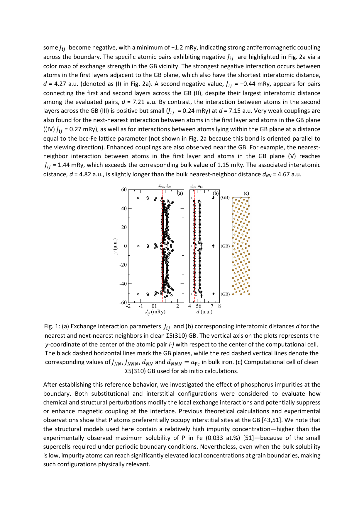
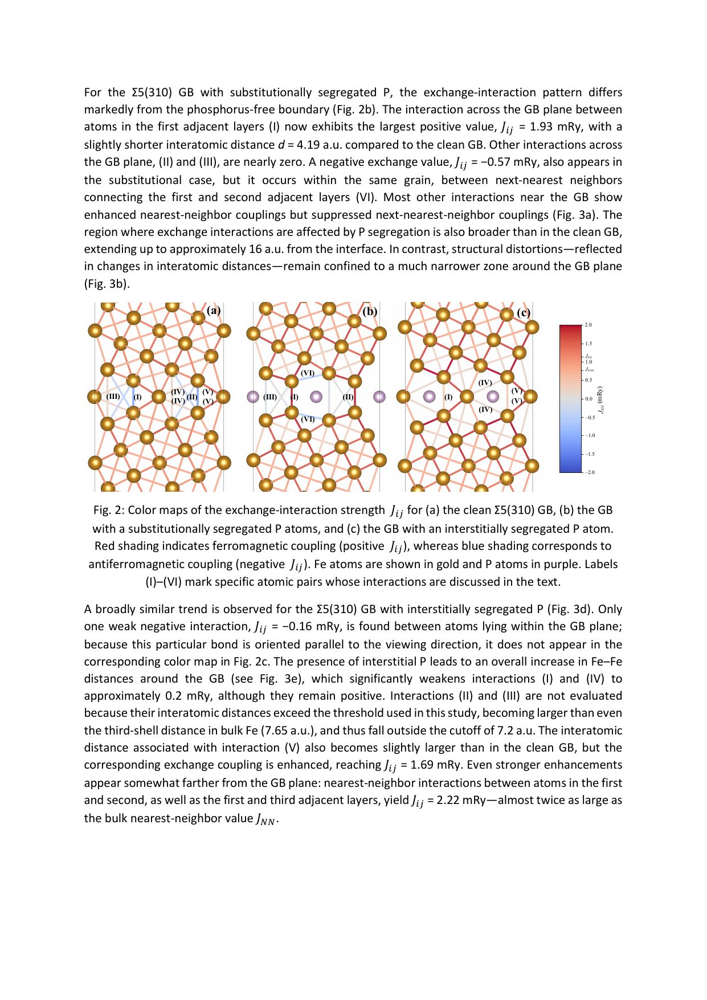
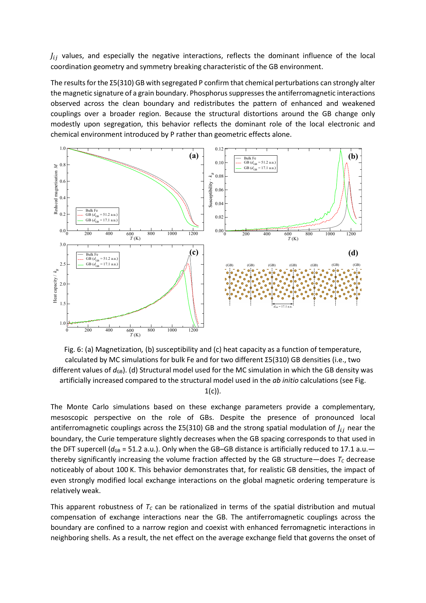
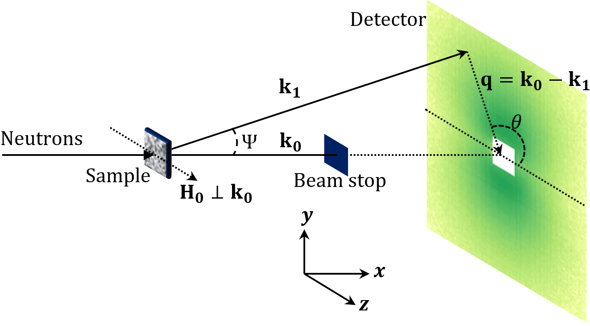

# 粒界が変える磁気交換相互作用：鉄系軟磁性材料の微視的基盤

- 執筆日：2026-04-14
- トピック：粒界の原子構造が磁気交換パラメータに与える影響と，鉄系軟磁性材料における保磁力・磁壁ピン止めへの示唆
- タグ：Magnetism and Spin / Magnetic Domains and Domain Walls; Iron Loss and Energy Dissipation / First-Principles Calculations; Monte Carlo
- 注目論文：arXiv:2604.10489 — "The effect of grain boundaries on magnetic exchange interactions in iron" (M. Zelený et al., 2026)
- 参照論文数：7本（注目論文1本 + 関連6本）

---

## 1. なぜ今この話題なのか

エネルギー変換の効率化が世界規模の課題となっている今，モーターやトランスの鉄心に使われる**軟磁性材料**の損失低減は喫緊の技術課題である。Fe-Si系電磁鋼板は自動車用モーターや産業用変圧器の鉄心として年間数百万トン以上が使用されており，そこで発生する**鉄損**（hysteresis loss + eddy current loss）は全世界の発電量の数パーセントに相当するエネルギーを熱として失わせている。ナノ結晶合金（FINEMETに代表されるFe-Si-B-Cu-Nb系）やSendust（Fe-Al-Si系）などの先進軟磁性材料は，粒径を10 nm程度に制御することで保磁力を1 A/m以下に抑えることに成功しており，インダクタやノイズフィルタとして広く普及している。

これらの材料における磁気特性の根幹を成す概念は，Herzer（1989）が提唱した**ランダム異方性モデル**である。粒径 $D$ が交換相関長 $L_\mathrm{ex}$（通常20〜30 nm）を下回ると，隣接する多数の結晶粒にわたって交換相互作用が磁気異方性を平均化し，実効的な磁気異方性 $\langle K \rangle$ が $K_1 (D/L_\mathrm{ex})^3$ に比例して急速に低下する。これが，ナノ結晶合金が極めて低い保磁力を示す主因である。しかし，このモデルが正確に成り立つためには，粒界を通じた**交換相互作用**が十分に均質で強いことが前提となる。実際の多結晶材料では，粒界には原子配列の乱れ，不純物の偏析，局所的な格子歪みが存在し，交換相互作用の空間分布は粒内と粒界とで大きく異なる可能性がある。

ところが，これほど重要な問いにもかかわらず，粒界の原子構造が磁気交換パラメータ $J_{ij}$ を具体的にどのように変化させるかについての**第一原理的な理解**は，長年にわたり欠如していた。粒界近傍の原子環境は複雑で非周期的であり，従来の第一原理計算では扱いにくかったからである。この空白を埋めるべく，Zelený らは2026年4月に bcc 鉄の代表的な傾角粒界を対象として，第一原理 DFT と Green's 関数法を組み合わせることで粒界全体にわたる $J_{ij}$ の空間分布を初めて系統的に明らかにした [arXiv:2604.10489]。この成果は，軟磁性材料の微視的設計に向けた方法論的基盤として大きな意義を持つ。

---

## 2. 未解決問題は何か

この分野における本質的な問いを三つに整理する。

**第一の問い**は，「粒界はなぜ磁気交換相互作用を変化させ，場合によっては反強磁性的な結合をもたらすのか」というものである。バルクの bcc 鉄では第1近接・第2近接の交換パラメータはいずれも正値（強磁性的）であり，Curie 温度を1043 K と高く保っている。しかし粒界近傍では原子間距離や配位数が変化するため，$J_{ij}$ が局所的に反転して反強磁性的になりうる。この変化が原子間距離だけで説明できるのか，それとも局所対称性の破れや電子構造の変化によるものなのかは，長い間明確でなかった。

**第二の問い**は，「リン（P）などの不純物偏析が粒界の磁気交換にどのような電子論的影響を与えるか」である。リンはbcc鉄の粒界に強く偏析することが知られており（最大 ~数 at%），粒界脆化（embrittlement）との関連で機械的特性への影響は広く研究されてきた。しかし磁気的側面，とりわけ交換相互作用への影響はほとんど定量的に評価されていなかった。軟磁性材料において不純物制御は日常的に行われており，偏析が交換相互作用にどう作用するかの理解は，材料設計に直結する問いである。

**第三の問い**は，「局所的な $J_{ij}$ の乱れが，巨視的な保磁力や鉄損に具体的にどのようなメカニズムで影響するか」である。磁壁エネルギー密度 $\gamma_\mathrm{DW} \propto \sqrt{AK}$（$A$ は交換スティフネス，$K$ は磁気異方性）が粒界で局所的に低下すれば磁壁はその場所に安定化（ピン止め）される。この配位論的なメカニズムはFleming–Kronmüller型ピン止めとして定性的には理解されているが，$J_{ij}$ の分布から定量的にピン止めポテンシャルを算出する枠組みが整っていなかった。この問いへの橋渡しが，今回の研究の核心的な将来展望となっている。

---

## 3. 注目論文の核心

Zelený ら（2026）[arXiv:2604.10489] は，bcc 鉄の三種の**対称傾角粒界（symmetric tilt grain boundary）** を対象として，密度汎関数理論（DFT）と Liechtenstein–Katsnelson–Antropov–Gubanov（LKAG）Green's 関数法を組み合わせた第一原理計算により，粒界近傍における Heisenberg 交換パラメータ $J_{ij}$ の空間分布を系統的に算出した。さらに，求めた $J_{ij}$ を用いた古典 Monte Carlo（MC）シミュレーションにより，有限温度での磁化挙動・帯磁率・比熱の温度依存性を評価した。

研究対象とした粒界は，Σ5(310)（超格子超格子超格子），Σ13(320)，Σ13(510) の三種類である。「Σ」は**一致格子点格子（CSL: coincidence site lattice）** の指標であり，たとえばΣ5では両粒の格子点のうち5個に1個が一致していることを意味する。これらは bcc 金属で実験的に頻繁に観察される低エネルギー傾角粒界であり，軟磁性材料の微細組織においても重要な役割を果たす。ab initio 計算には SIESTA パッケージ（局所基底関数），$J_{ij}$ 算出には TB2J パッケージを使用し，PBE-GGA 汎関数で評価した。MC シミュレーションは Σ5(310) のみを対象に 9600 原子の超格子セルで実施された。

*Fig. 1: (a) Σ5(310) クリーン粒界における交換パラメータ $J_{ij}$ の y 座標依存性，(b) 対応する原子間距離，(c) ab initio 計算に用いた超格子セル。粒界面に近い原子対では $J_{ij}$ がバルク値から大きく逸脱し，一部は負値（反強磁性）となる。© Zelený et al., arXiv:2604.10489, CC BY 4.0*

主要な結果は以下のように整理される。第一に，三種の粒界すべてにおいて，**粒界面をまたぐ原子対で反強磁性的な結合（$J_{ij} < 0$）が生じる**ことが確認された。Σ5(310) では粒界面の隣接第1層と第2層にわたる原子対で $J_{ij} = -1.2$ mRy という強い反強磁性結合が現れ，Σ13(510) でも $J_{ij} = -1.02$ mRy の反強磁性対が確認された。第二に，これらの反強磁性結合は原子間距離だけでは説明できず，**局所的な配位環境の変化と対称性の破れに起因する**ことが示された。同じ距離範囲のバルク値と粒界近傍値を比較すると，粒界近傍では大きな散らばりが見られ，距離との一対一対応が崩れている。第三に，**リン偏析（置換型・侵入型）は粒界面をまたぐ反強磁性結合を抑制し，交換景観を大きく再分配する**ことが明らかになった。置換型 P の場合，粒界面直近では強磁性結合が強化され（$J_{ij} = 1.93$ mRy），交換相互作用が影響を受ける領域も~16 a.u. まで拡大した。

*Fig. 2: (a) クリーンΣ5(310) 粒界，(b) 置換型P偏析，(c) 侵入型P偏析における交換相互作用強度 $J_{ij}$ のカラーマップ。赤は強磁性結合（$J_{ij} > 0$），青は反強磁性結合（$J_{ij} < 0$）。P偏析により粒界の反強磁性結合が抑制されていることが一目で分かる。© Zelený et al., arXiv:2604.10489, CC BY 4.0*

Monte Carlo シミュレーションの結果では，**現実的な粒界密度（粒界間距離 51.2 a.u.）ではCurie温度の低下はごくわずか**であり，粒界が存在しない完全なバルク鉄とほぼ同じ磁気転移温度が得られた。粒界間距離を人工的に 17.1 a.u. まで縮めると（これは実際の粒界密度をはるかに超える非現実的な値）初めて Curie 温度が約100 K 低下した。この結果は，局所的な $J_{ij}$ の乱れがどれほど顕著であっても，バルク領域が支配する大局的な磁気転移は頑健であることを意味する。

*Fig. 6: バルク鉄と二種の粒界密度（$d_\mathrm{GB}$ = 51.2 a.u. および 17.1 a.u.）に対する (a) 磁化，(b) 帯磁率，(c) 比熱の温度依存性。現実的な粒界密度では Curie 温度の変化は軽微であり，粒界体積分率が増大したときのみ顕著な低下が現れる。© Zelený et al., arXiv:2604.10489, CC BY 4.0*

---

## 4. 背景と研究史

軟磁性材料における粒界の役割を論じる上で，まず Herzer（1989）のランダム異方性モデルを振り返ることが不可欠である [Herzer, IEEE Trans. Magn. 25, 3327 (1989)]。このモデルは，結晶粒径 $D$ が交換相関長 $L_\mathrm{ex} = \sqrt{2A/(\mu_0 M_s^2)}$ よりも十分小さいとき，各粒のランダムな磁気異方性が交換相互作用によって統計的に平均化されることを示した。実効的な磁気異方性 $\langle K \rangle \propto K_1 (D/L_\mathrm{ex})^3$ は粒径の3乗に比例して減少し，結果として保磁力は $H_c \propto D^6$ という急峻な粒径依存性を示す。この予測は FINEMET（D~10 nm で $H_c < 1$ A/m）の実験と良く一致し，ナノ結晶軟磁性材料の設計指針として広く受け入れられている。

しかしこのモデルの前提に「粒界を通じた交換相互作用が均質で十分強い」という条件がある。現実の粒界では，原子間距離の変化，配位数の減少，さらには不純物偏析が $J_{ij}$ を局所的に変化させる。この問題を間接的に扱った実験的アプローチが**磁気小角中性子散乱（M-SANS: Magnetic Small-Angle Neutron Scattering）** である。Rai ら（2024）は Fe-Nb-B（Nanoperm型）ナノ結晶合金を対象に M-SANS と小角X線散乱を組み合わせて解析し，**粒子-マトリクス界面で有意な磁化不連続（spin misalignment）と交換スティフネスの局所的変化**を定量的に捉えた [arXiv:2405.14324]。交換相関長が試料によって10〜35 nm に分布することも明らかにされ，粒界の微細構造が交換相互作用に反映されていることが示唆された。

*Fig. 1: M-SANS 実験の概略。入射中性子ビームに対して磁場を垂直方向に印加し，2次元散乱パターンから磁化の空間相関を測定する。ナノ結晶軟磁性材料では粒子-マトリクス界面での磁化不連続が特徴的な散乱パターンを生む。© Rai et al., arXiv:2405.14324, CC BY-SA 4.0*

M-SANS理論の側面では，Metlov と Zaporozhets（2026）が粒界や粒子-マトリクス界面を持つナノ結晶強磁性体における交換相互作用の**異方性（anisotropic exchange）** を含む微小磁気 M-SANS 理論枠組みを展開した [arXiv:2602.21117]。交換相互作用を4階テンソルで表現し，等方成分と偏差成分に分解することで，異方的交換が散乱断面積にどのような特徴的シグネチャを残すかを解析的に導いた。この理論は，実験 M-SANS データから界面での交換異方性を抽出するための実用的ツールを提供するものであり，Zelený らの計算で示された $J_{ij}$ の空間異方性を実験的に検証する道を開く。

計算化学の観点からは，Yamashita と Sakuma（2024）が Sendust（Fe-Al-Si）合金の各結晶構造（A2, B2, DO3）について，有限温度での磁化と交換スティフネス定数を第一原理計算で系統的に評価している [arXiv:2403.14096]。特に B2 構造では，ゼロ温度での交換スティフネス定数が異常に小さく，かつ温度上昇とともに単調減少しないという特異な振る舞いが発見された。これは Heisenberg モデルの予測と相反するものであり，バンド電子（itinerant electron）の特性が交換相互作用に本質的に寄与することを示している。この知見は，bcc 鉄粒界での $J_{ij}$ の評価においても，電子状態の変化が支配的な役割を担う可能性を示唆しており，Zelený らの「反強磁性結合は距離ではなく電子状態の変化による」という結論を傍証する。

より長い歴史的文脈においては，Chapman ら（2020）が bcc 鉄の格子欠陥（点欠陥）近傍での非 Heisenberg 的交換相互作用を DFT で評価し，Landau 項の補正なしには欠陥エネルギーが正しく計算できないことを示した [arXiv:2004.00895]。粒界という面欠陥でも同様の非 Heisenberg 効果が起こりうるという点で，今回の Zelený らの研究の先駆的背景を成す。

---

## 5. どの解釈が最も妥当か

粒界近傍の反強磁性結合の起源について，最も支持される解釈は「**局所的な配位環境の変化と対称性の破れによる電子状態の変化**」というものである。この結論を支える根拠を以下に整理する。

まず，Fig. 7（論文中）に示された全粒界にわたる $J_{ij}$–距離 散布図を見ると，バルク鉄では $J_\mathrm{NN}$ が原子間距離とともに単調に変化する明確なトレンドを示すのに対して，粒界近傍の $J_{ij}$ は同じ距離範囲に非常に広い散らばりを持ち，最短距離の原子対でも最長距離の原子対でも負値が現れる。これは「短い距離 → 強磁性，長い距離 → 反強磁性」という単純な距離依存則では説明できず，**局所的な配位幾何学（配位数・結合角）が支配的因子である**ことを直接示している。Goodenough–Kanamori–Anderson（GKA）則の観点からも，粒界での原子配置が作る Fe–Fe–Fe の結合角が変化することで，交換相互作用の符号が反転しうるという解釈と整合する。

P偏析の効果については，「電子的・化学的効果が構造効果を上回る」という解釈が支持される。置換型 P 偏析では，構造歪みが及ぶ範囲（粒界面±数 a.u.）よりも $J_{ij}$ が影響を受ける範囲（~16 a.u.）の方がはるかに広い。これは，P の 3p 電子が Fe の 3d 電子雲を介して遠距離まで電子構造を変化させ，それが交換パラメータに反映されていることを意味する。なお，実験的に観察されるリン偏析の最大濃度は 0.033 at% に過ぎないため，本研究の高濃度モデルが定量的に実材料を反映するわけではないが，方向性（反強磁性結合の抑制）は物理的に信頼できると著者らは主張する。

一方，**Curie 温度の頑健性**についての解釈も重要である。局所的な $J_{ij}$ の乱れがいかに強くとも，粒界が現実的な密度であれば全スピン数の大部分はバルク的な環境にあり，大局的な磁気転移温度はほぼ変わらない。これは，粒界での反強磁性結合と強化された強磁性結合が部分的に相殺することにも起因する。この「局所的には大きな乱れがあるが，大局的には頑健」という解釈は，実際の軟磁性材料で粒密度が高くても比較的良好な磁気特性が維持される理由を説明する。

しかし，**保磁力と磁壁ピン止めへの影響は Curie 温度とは独立に大きい**という点が著者らの核心的な主張である。磁壁エネルギーは局所的な交換スティフネス $A_{ij} \propto J_{ij} S^2 / a$ と磁気異方性 $K$ の積の平方根に比例するため，$J_{ij}$ が局所的に減少（特に反強磁性化）した粒界では磁壁エネルギーが低下し，磁壁が安定化されるピン止めサイトが形成される。この機構は Salehi ら（2025）の微小磁気-原子スピン動力学ハイブリッドシミュレーション [arXiv:2504.14019] で示されたように，局所的な異方性や交換の乱れが磁壁変形やスキルミオン消滅といったダイナミクスを劇的に変化させることと直接対応する。

**まだ弱い部分**は，磁気異方性の粒界近傍での変化，磁歪（magnetoelastic coupling）効果，実際の多結晶ネットワークでの $J_{ij}$ 分布の集合的効果が本研究では扱われていない点である。単一粒界の DFT 計算からポリクリスタル全体の保磁力を予測するためには，これらの効果を統合した多スケール理論の構築が必要であり，その橋渡しとなる実験データとの比較も今後の課題として残る。

---

## 6. 何が一般化できるのか

今回 Zelený らが確立した「DFT + LKAG + MC によって粒界の $J_{ij}$ 分布を定量評価し，有限温度での磁気特性を予測する」という枠組みは，bcc 鉄をモデル系とした方法論的デモンストレーションであり，より複雑な応用系への拡張が明示的に意図されている。

最も直接的な応用対象は，**Fe-Si 電磁鋼板**と**ナノ結晶合金（FINEMET, Nanoperm, Sendust 等）** である。Fe-Si 系（Si 含有量 3〜6.5 wt%）は電磁鋼板の標準材料であり，Si 原子が粒界に偏析した場合の交換相互作用変化は保磁力の低減・増加に直接影響する。Yamashita と Sakuma（2024）[arXiv:2403.14096] による Fe-Al-Si（Sendust）の交換スティフネス研究は，このアプローチが Fe-Si 系に類似した三元合金系に適用可能であることを示している。FINEMET では粒界近傍に Cu クラスタと Nb リッチな非晶質相が存在し，これらが交換相互作用の「絶縁体的障壁」として機能するかどうかを，今回の方法論で評価することが次の課題となる。

実験との接続においては，M-SANS が強力なツールとなる。Fe-Nb-B 合金の M-SANS 解析（Rai ら, 2024）[arXiv:2405.14324] で得られた交換相関長の組成依存性は，粒界での $J_{ij}$ 変化が実際に試料スケールの交換相関長に反映されることを示している。Metlov–Zaporozhets（2026）[arXiv:2602.21117] の異方性交換 SANS 理論と組み合わせれば，計算で得た $J_{ij}$ の空間分布が実験散乱パターンにどのように現れるかを定量的に予測・比較することが可能になる。

計算の側面では，Ho ら（2026）による等変多体メッセージパッシング機械学習ポテンシャル（M3GNet/MACE型の磁性版）[arXiv:2604.08143] が粒界計算の規模を劇的に拡大する可能性を持つ。DFT は現状，数百原子の超格子セルが限界であるが，機械学習ポテンシャルを使えば数万〜数百万原子の現実的な粒界ネットワークのシミュレーションが可能となる。ただし，現時点では磁気自由度（スピン自由度）を正確に扱う機械学習ポテンシャルの開発は始まったばかりであり，$J_{ij}$ を正確に再現できるかどうかは今後の検証を要する。

応用寄りの方向では，Nachnani ら（2025）による機械学習を用いた Fe 系軟磁性合金の逆設計 [arXiv:2504.19787] においても，粒界交換の情報が組成最適化の制約条件として活用できる可能性がある。現状の ML モデルは飽和磁化と保磁力のバルク値を予測対象としているが，粒界 $J_{ij}$ を記述子（descriptor）に加えることで，粒界制御まで含めた軟磁性特性の予測精度向上が期待できる。

永久磁石（Nd-Fe-B 等）の粒界工学においても，同じ方法論が応用可能である。Nd-Fe-B では粒界相の組成制御（Dy 拡散，Cu 添加等）が保磁力増強の主要手段であり，その微視的機構の解明に DFT + LKAG アプローチが有効であることが本研究から示唆される。

---

## 7. 基礎から理解する

### Heisenberg 交換相互作用

磁気モーメントの間に働く量子力学的な力を記述する最も基本的な模型が**Heisenberg 模型**である。ハミルトニアンは，

$$H = -\sum_{\langle i,j \rangle} J_{ij} \, \vec{S}_i \cdot \vec{S}_j$$

と書かれる。$\vec{S}_i$ は格子点 $i$ のスピン演算子（単位長さに規格化），$J_{ij}$ は交換パラメータ（単位: mRy または meV），総和は着目する原子対にわたる。$J_{ij} > 0$ のとき，隣接スピンが平行配置（強磁性）を好む。$J_{ij} < 0$ のとき，反平行配置（反強磁性）が安定である。バルク bcc 鉄では第1近接（$J_1 \approx 1.15$ mRy）と第2近接（$J_2 \approx 0.78$ mRy）がともに正値であり，これが 1043 K という高い Curie 温度の起源である。

### bcc 鉄の結晶構造と粒界

**体心立方（bcc）構造**は Fe の常温相（$\alpha$-Fe）であり，格子定数 $a_0 = 2.87$ Å，第1近接原子間距離は $a_0\sqrt{3}/2 \approx 2.49$ Å（8個），第2近接は $a_0 \approx 2.87$ Å（6個）である。多結晶材料では，隣り合う粒が異なる結晶方位を持ち，その界面が粒界である。本研究で扱われた**対称傾角粒界**は，[001] 軸を回転軸として2つの bcc 格子を回転させることで構築される。指数 Σ は**一致格子点格子（CSL: Coincidence Site Lattice）** の指標で，両粒の格子点が重なる割合の逆数を表す。Σ5 は全格子点の1/5が一致するという比較的低エネルギーの粒界であり，実際のFe多結晶においてもよく観察される。

### LKAG公式と Green's 関数法

$J_{ij}$ の第一原理計算には，Liechtenstein–Katsnelson–Antropov–Gubanov（LKAG）公式が広く用いられる。この方法は，格子点 $i$ のスピンを微小角だけ回転させたときのエネルギー変化を，Green's 関数（電子状態の応答関数）から直接計算する「磁力定理（magnetic force theorem）」に基づく。数式的には，

$$J_{ij} = \frac{1}{4\pi} \mathrm{Im} \int_{-\infty}^{E_F} \mathrm{Tr} \left[ \Delta_i G_{ij}^{\uparrow}(\varepsilon) \Delta_j G_{ji}^{\downarrow}(\varepsilon) \right] d\varepsilon$$

と表される（$\Delta_i$ はスピン分裂に関連する演算子，$G_{ij}$ は格子点 $i$-$j$ 間のスピン分解 Green's 関数）。この公式の利点は，各 $J_{ij}$ を独立に局所的な電子状態から抽出できる点であり，粒界のように非周期的な環境でも局所基底関数（TB2J + SIESTA）を用いることで実用的に計算できる。

### 交換スティフネスと磁壁

個々の $J_{ij}$ から連続体的な磁気特性への橋渡しとなる重要な量が**交換スティフネス定数 $A$** である。簡単な推定では $A = J S^2 z / (2a)$（$J$ は近接交換パラメータ，$S$ はスピン量子数，$z$ は配位数，$a$ は格子定数）と表される。$A$ は磁壁幅 $\delta = \pi\sqrt{A/K}$ と磁壁エネルギー密度 $\gamma = 4\sqrt{AK}$ を規定する重要なパラメータで，バルク bcc 鉄では $A \approx 8$ pJ/m である。

粒界近傍で $J_{ij}$ が局所的に減少（特に反強磁性化）すると，その領域での局所的な交換スティフネスが低下し，磁壁エネルギーが減少する。これにより，**磁壁がその低エネルギー領域（粒界）に引き寄せられて安定化するピン止め**が起こる。この機構は軟磁性材料における残留保磁力の主因の一つであり，Zelený らの計算はその微視的根拠を初めて第一原理レベルで定量化した。

### Monte Carlo シミュレーションによる Curie 温度評価

有限温度の磁気挙動を評価するために用いられる**Monte Carlo（MC）法**は，ボルツマン分布に従う統計的サンプリングにより熱平衡状態を数値的に再現する。本研究では Metropolis アルゴリズムを用いて，各 MC ステップでランダムな方向に各スピンを試行的に回転させ，エネルギー差に基づいて採否を決定する。磁化 $M(T)$，帯磁率 $\chi(T)$，比熱 $C(T)$ を温度の関数として計算し，$\chi(T)$ のピーク位置から Curie 温度 $T_C$ を決定する。9600 原子の大規模セルを用い，熱化に $10^4$ ステップ，サンプリングに $4 \times 10^4$ ステップを費やすことで，有限サイズ効果を十分に抑えた結果を得ている。

### ランダム異方性モデルと粒径依存性

Herzer のランダム異方性モデルでは，交換相関長 $L_\mathrm{ex} = \sqrt{2A/(\mu_0 M_s^2)}$ を用いて，$L_\mathrm{ex}^3/D^3$ 個の粒の異方性がベクトル和としてキャンセルし，実効異方性が大幅に低下することを示す。バルク bcc 鉄で $A \approx 8$ pJ/m，$\mu_0 M_s \approx 2.15$ T とすれば $L_\mathrm{ex} \approx 3.8$ nm となるが，より一般的に軟磁性合金では $L_\mathrm{ex} \sim 20$–30 nm が典型値である。粒径 $D \sim 10$ nm で $D \ll L_\mathrm{ex}$ を満たせば $\langle K \rangle \propto D^6$ となり，FINEMET で達成される極めて低い保磁力が説明される。粒界での交換スティフネスの低下は，この式中の $A$ を実効的に減少させ，$L_\mathrm{ex}$ を短くする方向に作用するため，ランダム異方性モデルの成立条件を悪化させる可能性がある。

---

## 8. 専門用語の解説

**Heisenberg 交換相互作用（Heisenberg exchange interaction）**：量子力学的にスピン間に働く等価的な相互作用。パウリの排他原理と電子の静電エネルギーの組み合わせから生じ，$J \vec{S}_i \cdot \vec{S}_j$ の形で記述される。$J > 0$ で強磁性，$J < 0$ で反強磁性となる。軟磁性材料の高透磁率はこの正値 $J$ の寄与が本質的である。

**LKAG 公式（LKAG formula）**：Liechtenstein, Katsnelson, Antropov, Gubanov による，DFT の電子構造から交換パラメータ $J_{ij}$ を直接抽出する Green's 関数法。磁力定理に基づき，スピン分解 Green's 関数の積のトレースとエネルギー積分で表現される。TB2J などのコードで実装されている。

**対応格子点格子（CSL: Coincidence Site Lattice）**：二つの結晶格子を相対的に回転させたとき，両格子で共有される格子点の副格子のこと。指数Σは CSL の格子定数と元格子定数の比の3乗であり，Σが小さいほど粒界エネルギーが低くなる傾向がある。Σ5(310) は [001] 軸まわりに~36.9° 回転させた低エネルギー粒界である。

**反強磁性結合（antiferromagnetic coupling）**：$J_{ij} < 0$ に対応する，隣接スピンが反平行配置を好む磁気的状態。強磁性体中では通常見られないが，粒界近傍では配位幾何学の変化によって局所的に生じうる。このような局所的反強磁性結合は磁気フラストレーションを引き起こし，磁壁ピン止めの原因となる。

**交換スティフネス（exchange stiffness）** $A$：連続磁気弾性理論における，磁化の空間変化に抗するエネルギーを特徴付けるパラメータ（単位: pJ/m）。$A \propto J S^2/a$ で近似され，磁壁幅 $\delta \propto \sqrt{A/K}$ と磁壁エネルギー $\gamma \propto \sqrt{AK}$ を規定する。ナノ結晶合金では粒界や粒子-マトリクス界面での $A$ の低下が重要な問題となる。

**磁壁ピン止め（domain wall pinning）**：磁壁が格子欠陥（粒界，析出物，空孔等）に引き寄せられて局所的に安定化する現象。ピン止めを解除するには外部磁場によるエネルギー入力が必要であり，これが保磁力の起源の一つとなる。軟磁性材料での低コアロスを実現するには，ピン止めサイトを最小化・均質化することが重要である。

**ランダム異方性モデル（random anisotropy model）**：Herzer が提唱した，ナノ結晶強磁性体における実効的磁気異方性の理論。粒径 $D$ が交換相関長 $L_\mathrm{ex}$ を下回ると，隣接多粒子の異方性がランダムウォーク的に平均化され，$\langle K \rangle \propto K_1 (D/L_\mathrm{ex})^3$ となる。FINEMET の低保磁力の理論的根拠である。

**Curie 温度（Curie temperature）** $T_C$：強磁性体が加熱により常磁性体に転移する温度。$T_C$ はスピン間の平均交換相互作用の強さに支配され，$k_B T_C \approx \sum_{j} J_{ij} / 3$ （平均場近似）で推定される。Zelený らの MC 計算は，現実的な粒界密度では $T_C$ がほとんど変わらないことを示した。

**リン偏析（phosphorus segregation）**：リン（P）が bcc 鉄の粒界に選択的に濃化する現象。P の粒界エネルギー低下効果により，粒界での P 濃度はバルクより数十倍高くなりうる。これは粒界脆化の原因として知られるが，磁気交換相互作用への電子論的影響も今回初めて系統的に解析された。

**等変メッセージパッシング機械学習ポテンシャル（equivariant message-passing MLIP）**：原子・磁気モーメントをノード，原子間相互作用をエッジとするグラフ神経回路網で原子間ポテンシャルを学習する手法。Ho ら（2026）[arXiv:2604.08143] はスピン自由度を陽に含めた等変型を開発し，非共線的磁気構造や相転移の記述に DFT に近い精度を達成した。将来的には大規模粒界ネットワークの $J_{ij}$ シミュレーションへの応用が期待される。

**磁気小角中性子散乱（M-SANS）**：中性子の磁気モーメントと物質中のスピン密度との相互作用を利用して，ナノメートルスケールの磁気微細構造を非破壊で測定する手法。軟磁性ナノ結晶合金では粒子–マトリクス界面での磁化不連続や交換相関長の測定に威力を発揮する。Rai ら [arXiv:2405.14324]，Metlov–Zaporozhets ら [arXiv:2602.21117] の研究が示すように，計算で得た $J_{ij}$ 分布を実験的に検証する手段として最も有力である。

---

## 9. 今後の展望

今回の Zelený ら [arXiv:2604.10489] の研究で確かになったことは，bcc 鉄の代表的な傾角粒界すべてにおいて反強磁性的な交換結合が局所的に生じること，そしてリン偏析がこれを電子論的機構によって抑制することである。また，Monte Carlo シミュレーションによって，局所的な $J_{ij}$ の乱れが大局的な磁気転移温度にほとんど影響しない一方，磁壁ピン止めや保磁力への影響は大きいという二面性が定量的に示された。これらは，軟磁性材料の設計において「粒界の磁気交換を意識した微細組織制御」が重要であることを明確に示す。

今後 1〜3 年で最も重要になる論点として，以下が挙げられる。第一に，**磁気異方性と磁歪の粒界近傍分布の第一原理評価**である。本研究では $J_{ij}$ のみを対象としたが，磁壁ピン止めには異方性定数 $K$ と磁歪定数 $\lambda$ の空間分布も本質的である。これらを LKAG に類似した枠組みで粒界全体について評価することが次の課題となる。第二に，**Fe-Si 電磁鋼板や FINEMET，Sendust 等の実材料系への方法論的拡張**である。鉄損低減の産業的要求に直結するこれらの系では，粒界の化学的複雑さ（Si, B, Cu, Nb の偏析）がさらなる $J_{ij}$ の多様性をもたらすと予想され，M-SANS（[arXiv:2405.14324, 2602.21117]）との直接比較が実現可能になる。第三に，**機械学習ポテンシャル（[arXiv:2604.08143]）を用いた現実的粒界ネットワークのシミュレーション**である。現在の DFT アプローチは百原子程度が上限であるが，磁性対応の MLIP が成熟すれば数万原子のリアルな多結晶微細組織に対して $J_{ij}$ を計算し，微小磁気シミュレーション ([arXiv:2504.14019]) や M-SANS 理論 ([arXiv:2602.21117]) と結合することで，保磁力のボトムアップ予測が可能になる道が開かれる。これが実現すれば，不純物制御・粒径制御・粒界特性制御を統合した軟磁性材料の計算設計という，これまで経験則に頼ってきた領域を第一原理から系統的に攻略することができるようになるだろう。

---

## 参考論文一覧

1. **[arXiv:2604.10489]** M. Zelený, M. Heczko, P. Šesták, D. Ledue, R. Patte, M. Černý, "The effect of grain boundaries on magnetic exchange interactions in iron," submitted to J. Phys.: Appl. Phys. (2026). — bcc鉄の三種の対称傾角粒界において DFT+LKAG+MC により交換パラメータの空間分布を計算し，粒界近傍での反強磁性結合とリン偏析の効果を明らかにした注目論文。 [https://arxiv.org/abs/2604.10489]

2. **[arXiv:2602.21117]** K. L. Metlov, V. D. Zaporozhets, "Magnetic small-angle neutron scattering by a nanocrystalline ferromagnet with anisotropic exchange interaction," (2026). — 異方的交換相互作用を持つナノ結晶強磁性体の M-SANS 断面積を微小磁気理論で解析的に導いた理論論文。 [https://arxiv.org/abs/2602.21117]

3. **[arXiv:2405.14324]** V. Rai et al., "Magnetic microstructure of nanocrystalline Fe-Nb-B alloys as seen by small-angle neutron and X-ray scattering," (2024). — Nanoperm型 Fe-Nb-B ナノ結晶合金を M-SANS と SAXS で解析し，粒子-マトリクス界面での磁化不連続と交換スティフネスを定量化した実験論文。 [https://arxiv.org/abs/2405.14324]

4. **[arXiv:2403.14096]** S. Yamashita, A. Sakuma, "Magnetization and exchange-stiffness constants of Fe-Al-Si alloys at finite-temperatures: A first-principles study," (2024). — Sendust（Fe-Al-Si）合金の各結晶構造において，有限温度での磁化と交換スティフネス定数を第一原理で計算し，B2構造での異常な温度依存性を発見した論文。 [https://arxiv.org/abs/2403.14096]

5. **[arXiv:2504.14019]** N. Salehi, O. Eriksson, J. Hellsvik, M. Pereiro, "Micromagnetic-atomistic hybrid modeling of defect-induced magnetization dynamics," (2025). — 原子スピン動力学と微小磁気法のハイブリッドシミュレーションで欠陥（ダブルスリット，四面体クラスター）が磁壁やスキルミオンの動力学に与える影響を解析した論文。 [https://arxiv.org/abs/2504.14019]

6. **[arXiv:2504.19787]** M. Nachnani et al., "Interpretable machine learning-guided design of Fe-based soft magnetic alloys," (2025). — 機械学習モデルを用いて Fe-Si-B 系軟磁性合金の飽和磁化と保磁力を予測し，Co・Ni フリーの高性能組成を探索した論文。 [https://arxiv.org/abs/2504.19787]

7. **[arXiv:2604.08143]** C. H. Ho et al., "Equivariant Many-body Message Passing Interatomic Potentials for Magnetic Materials," (2026). — スピン自由度を陽に組み込んだ等変グラフ神経回路網ポテンシャルを開発し，磁性材料の相変態・有限温度磁気挙動・スピン軌道結合効果を DFT 精度で再現することを示した論文。 [https://arxiv.org/abs/2604.08143]
