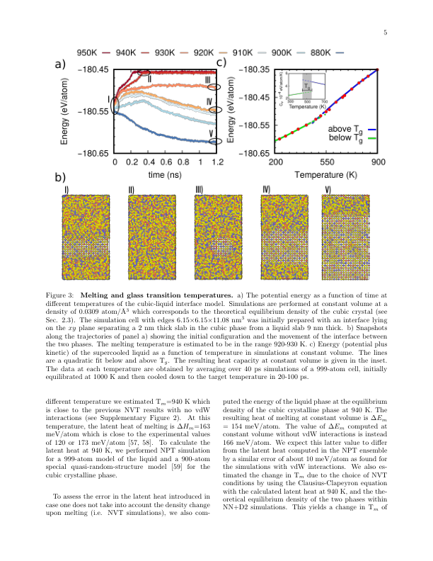
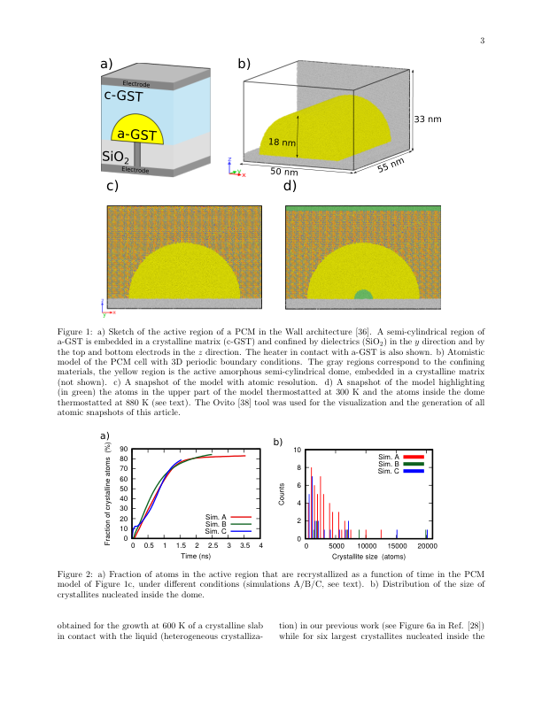
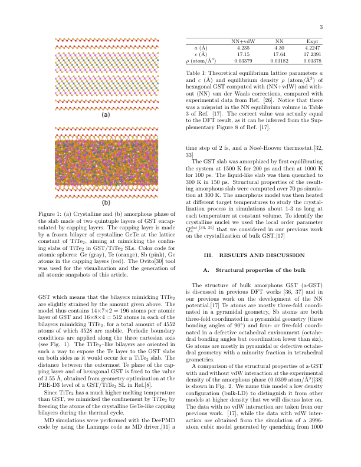
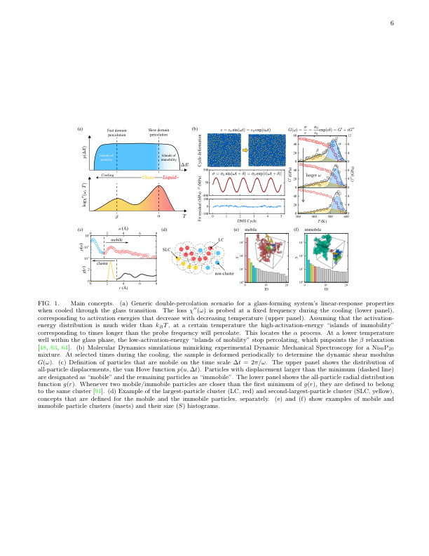
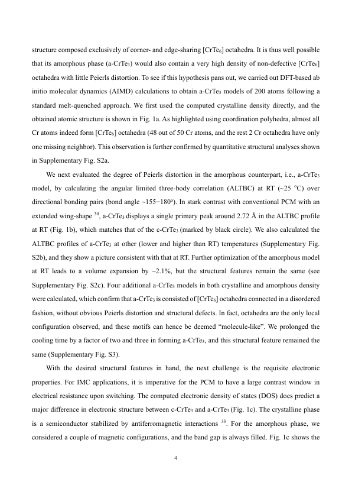

# GST系相変化材料における β 緩和のパーコレーション起源と結晶化ダイナミクスの制御

- **執筆日**: 2026-04-01
- **トピック**: GST系（Ge₂Sb₂Te₅）相変化材料のアモルファス緩和と結晶化機構
- **タグ**: Nonequilibrium and Dynamic Response / Phase Transitions; Nonequilibrium Phase Transitions / Molecular Dynamics; Machine Learning
- **注目論文**: arXiv:2603.01559 — *Percolation-driven β-relaxation enables resonant acceleration of crystallization in amorphous phase-change materials*, Liu, Gao, Jiang, Zhou, Luebben, Zhao, Lu, Müller, Boettger, Wang, Yu & Wei (2026)
- **参照関連論文数**: 8本

---

## 1. なぜ今この話題なのか

スマートフォン、データセンター、人工知能（AI）の普及に伴い、高速・低消費電力・大容量の不揮発性メモリへの需要が急増している。現在の主流であるフラッシュメモリは書き換え速度と耐久性に限界があり、次世代メモリ技術として**相変化メモリ（Phase-Change Memory, PCM）**が有力候補に挙がっている。さらに近年、ニューロモルフィック（神経模倣型）コンピューティングや**インメモリ演算**（記憶素子の中で直接演算を行う方式）への応用が注目され、PCM 研究はかつてないほど活発化している。

PCM の動作原理は単純明快だ。情報を格納する活性層には**相変化材料**—代表例が Ge₂Sb₂Te₅（GST）—が使われる。アモルファス（非晶質）相は電気抵抗が高く「0」、結晶相は低抵抗で「1」を表す。Joule 加熱で一瞬融解させて急冷すれば RESET（「1」→「0」）、低出力のパルスで 150〜200 °C 程度に加熱すれば SET（「0」→「1」）が実現する。GST はこの切り替えを**ナノ秒〜マイクロ秒**のオーダーで行える上、結晶とアモルファスで反射率も大きく異なるため光ディスク（DVD、Blu-ray）にも使われてきた実績がある。

しかし AI 応用を念頭に置くと、PCM の動作の「質」がより厳しく問われるようになった。ニューロモルフィック演算では、メモリセルが*連続的な抵抗値*を安定して保持することが必要なのだが、アモルファス相は時間とともに自発的に構造緩和し、抵抗値がじわじわと変化してしまう。この**抵抗ドリフト**は GST で典型的に $v_R \approx 0.1$ 程度のドリフト係数を持ち、多値記録の精度を著しく損なう。また、SET スイッチングの速度と安定性は**結晶化速度**に直結するが、その原子スケールの制御則はまだ経験則に頼る部分が大きかった。

こうした背景のもと、「アモルファス GST がなぜ・どのように結晶化するのか」という基礎的問いへの関心が高まっている。特に 2020 年代に入り、**β 緩和**（ベータ緩和）——ガラス中に潜む局所的な速い原子運動——が GST の結晶化を左右する重要因子であることが次々と明らかになってきた。そして 2026 年 3 月、Huazhong University of Science and Technology と RWTH Aachen、Aarhus University の共同グループが、β 緩和の起源を**原子パーコレーション**という枠組みで初めて統一的に説明し、さらに**超音波励起による結晶化の共鳴加速**という全く新しい制御手法を提案した。本稿ではこの注目論文（arXiv:2603.01559）を核に据え、周辺研究を文脈的に織り込みながら、GST 結晶化ダイナミクスの全体像を論じる。

---

## 2. この分野で何が未解決なのか

本トピックをめぐる中心的な問いは、以下の四点に集約できる。

**問い①：β 緩和の原子スケールの起源は何か？**

ガラスの緩和には、粘性流動を担う遅い **α 緩和**（主緩和）と、局所的な速い原子運動に由来する **β 緩和**（Johari-Goldstein 緩和とも呼ばれる）の二種類がある。金属ガラスでは β 緩和の存在とその構造的起源についての研究が蓄積されているが、GST のような共有結合性ガラスにおける β 緩和は 2020 年の Peng らの実験（Science Advances, eaay6726）によって初めて確認されたばかりで、その原子論的機構は解明されていなかった。

**問い②：β 緩和と結晶化はどう結びついているのか？**

2022 年の Cheng ら（Nature Communications）は、GST の β 緩和強度を化学組成（Peierls 型歪みの強さ）で制御することで結晶化速度が一桁変わることを示した。これは β 緩和が結晶化の「扉」を開く鍵であることを示唆するが、*なぜ* β 緩和が結晶化ダイナミクスに直結するのかという微視的機構は不明なままだった。

**問い③：拡散型と非拡散型の結晶化はどう使い分けられるのか？**

結晶化には、原子が比較的遠くまで拡散してから秩序形成する「拡散駆動（diffusion-driven）」機構と、ほぼ本来の位置に留まったまま秩序化する「非拡散（diffusionless）」機構がある。GST ではどちらが主役か、温度や条件によってどう変わるのかが明確ではなかった。

**問い④：外場によって結晶化を能動的に制御できるか？**

PCM デバイスの性能向上には、SET スイッチングをより速く・より確実にするための新たな制御手法が求められる。熱パルスの最適化にとどまらず、電場・光・力学的摂動など外部刺激を使って結晶化ダイナミクスを操る可能性は、ほとんど探索されていなかった。

---

## 3. 注目論文の核心：何が前進し、何がまだ仮説か

### β 緩和の発見以前と以後

まず背景を整理する。GST の粉末機械スペクトロスコピー実験（Peng et al., Science Advances 2020）は、ガラス転移温度 $T_g$ 以下のアモルファス GST で**損失係数の「過剰翼（excess wing）」**を観測した。これは β 緩和の特徴的なシグネチャーであり、GST においてこの種の局所的な速い緩和が存在することを初めて示した。さらに Cheng et al.（Nature Communications 2022）は、元素置換（GeSb 組成の変化）により Peierls 型歪みの強度が変わり、それに伴って β 緩和強度が変化し、結晶化速度に一桁のチューナビリティが生まれることを実験と第一原理計算で実証した。これらの研究は「β 緩和 ↔ 結晶化」の相関を確立したが、「なぜ β 緩和が存在し、どのような原子運動がそれを担うのか」という問いは未答のままだった。

### 注目論文の主張：パーコレーションが β 緩和を生む

arXiv:2603.01559（Liu, Gao et al., 2026）は、**DeepMD 型ニューラルネットワーク（NN）ポテンシャル**を用いた分子動力学（MD）シミュレーションにより、この問いに正面から答えた。

中心的な問いは「各原子の運動を監視したとき、β 緩和温度付近で何が起きているか？」である。著者らは**動的機械スペクトロスコピー（Dynamic Mechanical Spectroscopy, DMS）**をシミュレーション上で再現し（MD-DMS と呼ぶ）、温度を上げながら損失係数 $E''$ を追跡した。その結果、$\sim$ 410 K 付近に実験と一致する excess wing が再現された。

次に、各原子を「よく動く原子（移動度 $u > u_c$ の原子）」と「ほとんど動かない原子」に分類し、移動性の高い原子群どうしが距離 $r_c$ 以内で接続された**クラスター（連結成分）**を同定した（パーコレーション解析）。驚くべきことに、**最大クラスターのサイズが 410 K 付近で急増し、系全体に連絡するパーコレーション転移が β 緩和温度と一致した**（Fig. 1a）。つまり、移動性の高い原子群が系をまたいで連結した瞬間が β 緩和として現れるのである。

これを「**移動原子パーコレーション**」と呼ぶ。この概念自体は Gao, Yu, Schrøder, Dyre（Nature Physics 2025; arXiv:2411.02922）が金属ガラスや Kob-Andersen ガラス、Ni-P ガラスなどで提案した「α および β 過程の統一パーコレーションシナリオ」を拡張したものであるが、注目論文は**共有結合性 PCM における有効性**を初めて示した点に新規性がある。金属ガラスとはボンドの性質（方向性のない金属結合 vs. 方向性のある共有結合）が根本的に異なるにもかかわらず、同じパーコレーション描像が成立することは注目に値する。

### 結晶化経路の分類とパーコレーションの役割

パーコレーション転移の後、410 K 以上で結晶化が急速に進むことが確認された（Fig. 2a）。さらに著者らは**結晶化経路**を四種類に分類した。

1. **拡散駆動成長（DDG）**：移動性の高い原子が既存の結晶ドメインに接続して成長する
2. **拡散駆動核形成（DDN）**：移動性の高い原子が既存の結晶から離れた場所で新核を形成する
3. **非拡散成長（DLG）**：ほぼ元の位置に留まりながら近傍の結晶に取り込まれて成長する
4. **非拡散核形成（DLN）**：ほぼ元の位置で独立に秩序化して核を形成する

低温（410 K 以下）では DLN が主役であり、熱的起伏によって少量の核が散在する状態が続く。410 K の β 緩和・パーコレーション温度を超えると DDG と DDN が急増し、結晶化が加速する。これは**パーコレーションが「結晶化の扉を開く鍵」**であることを機構レベルで説明している。

### 超音波共鳴加速という新たな制御手法

最も創造的な貢献は、ここから先にある。著者らは「β 緩和周波数に共鳴する超音波を与えれば、パーコレーション経由で原子移動度が高まり、結晶化が加速するはず」という仮説を立てた。

MD シミュレーションでは 410 K に保持した GST に対し、0.1〜10 GHz の超音波（正弦波剪断歪み）を印加した。**結晶化速度の最大化は β 緩和周波数（1 GHz）でのみ起き**、他の周波数では効果が小さかった（Fig. 3b）。これは正に「共鳴」であり、超音波が β 緩和に関与する原子運動を選択的に励起していることを示す。

実験的検証として、著者らは**水晶振動子マイクロバランス（QCM）基板**上に成膜した GST 薄膜（100 nm 厚）に、5〜35 MHz の超音波を加えながらポンプレーザーで局所加熱する「超音波補助結晶化実験」を行った。**5 MHz 照射のみで反射率の増大（結晶化の促進）が観測され**、同じ結晶化度に到達するためのレーザーパルス幅が 2〜9 倍短縮された（Fig. 4）。シミュレーションの β 緩和周波数（1 GHz）と実験で最適な 5 MHz の間には三桁の差があるが、これはシミュレーションの系サイズや実験の昇温速度・スケール効果に起因するとされ、**周波数依存性の定性的傾向**（特定周波数での選択的加速）は整合している。

### 何がまだ仮説段階か

注目論文が切り開いた知見は多いが、まだ仮説・推測の域を出ない点もある。

- シミュレーションで使った NN ポテンシャルは特定の GST 組成に対して訓練されたものであり、他の PCM（GeTe 単体、Ge-rich GST など）への適用可能性は個別に検証が必要である。
- 超音波実験の最適周波数（5 MHz）とシミュレーション（1 GHz）の差の定量的説明が不十分であり、実験と理論の橋渡しとなる中間スケールのシミュレーションが求められる。
- 超音波が**アモルファス相の安定性（抵抗ドリフト）**に与える影響は未調査であり、デバイス動作中に常時超音波を加えるとデータ保持に悪影響が出ないかは不明である。
- β 緩和のパーコレーション起源という描像が**他の実験プローブ**（例えば X 線フォトン相関分光; XPCS）で直接検証されたわけではない。

---

## 4. 背景と研究史：この論文はどこに位置づくか

### 相変化材料の研究史

相変化材料の研究は 1960 年代の Ovshinsky によるカルコゲナイドガラスのスイッチング現象の発見に遡る。実用化が本格化したのは 1990 年代の光ディスク技術（DVD 等）であり、電子メモリへの応用（PCM デバイス）が進んだのは 2000 年代以降である。現在では Intel/Micron による 3D XPoint メモリ（商標名 Optane）などが実用化されており、組み込み用途（自動車、IoT）や AI 推論アクセラレータへの PCM 統合も注目されている。

GST の特異な性質——アモルファスと結晶の間の大きな反射率差・抵抗差、高速かつ可逆な相変化——の起源は「**メタ原子価結合（metavalent bonding）**」または「**多中心超原子価結合（multi-center hyperbonding）**」と呼ばれる独特な化学結合によることが明らかになっている。これは従来の共有結合でも金属結合でもイオン結合でもない中間的な状態であり、大きな Born 有効電荷、高い誘電定数、大きな Grüneisen パラメータなどの異常な物性を説明する。この結合特性はアモルファス相では相対的に弱まり（共有結合性が増す）、結晶化によって強まる（超原子価結合性が回復する）という変化が、アモルファス-結晶間の大きな物性コントラストの根拠となっている。

GST の結晶相には二種類ある。まず低温（約 150〜200 °C）で形成される**立方晶（ロックソルト型）**相は、Ge・Sb・Teが原子的無秩序を保ちながらもFCC格子点に分布する「乱れた岩塩型」構造を持ち、PCM デバイスで実際に使われる「結晶」相はこちらである。さらに高温（280 °C 以上）では**六方晶（trigonal）**相に転移するが、こちらは結晶化温度が高いため PCM 動作では通常現れない。アモルファス相の局所構造は四面体型 Ge-Te 結合と欠陥八面体型 Ge-Te、Sb-Te 結合が混在しており、結晶化に際して Ge のサイトが傾かずに秩序化する過程が「Ge の flip」として知られている。この Ge flip がどのタイミング・温度で起きるかは、結晶化ダイナミクスの核心的問いの一つである。

### ML ポテンシャルによるシミュレーションの進展

注目論文が DeepMD 型 NN ポテンシャルを使っているように、近年の GST 研究では**機械学習原子間ポテンシャル（MLIP）**の活用が急速に広まっている。従来の密度汎関数理論（DFT）計算は〜数百原子・数 ns が限界だったが、MLIP により同等の精度で数万〜数百万原子・数十〜数百 ns の MD シミュレーションが可能になった。

arXiv:2304.03109（Abou El Kheir et al., npj Computational Materials 2024）は、GST の DFT データベースに基づく深層ニューラルネットワークポテンシャルを開発し、融点・ガラス転移温度・結晶化速度の温度依存性を実験と定量的に比較した初の系統的研究の一つである。このポテンシャルは後に注目論文（2603.01559）の著者らも流用しており、「次世代 GST シミュレーションの基盤ツール」としての地位を確立している。

*図1: arXiv:2304.03109（CC BY 4.0）より。GST の融解およびガラス転移温度を DFT データに基づく NN ポテンシャルを用いた MD シミュレーションで再現した結果。実験値との定量的一致が確認されている。*

さらに arXiv:2501.07384（Abou El Kheir & Bernasconi, 2025）は、この NN ポテンシャルを使って**百万原子規模の PCM デバイス形状**（GST 薄膜を SiO₂ 電極で挟んだ構造）での SET プロセスをシミュレートした。加熱後の結晶核形成と成長が原子スケールで直接可視化され、デバイス内での結晶化がいかに不均一で多核的であるかが初めて定量的に明らかになった。

*図2: arXiv:2501.07384（CC BY 4.0）より。百万原子規模の GST デバイスシミュレーション。(a) デバイス構造（GST 薄膜を電極と SiO₂で挟む）、(b)〜(d) 結晶化スナップショット。複数の結晶核が同時に形成・成長する様子が見える。*

### ナノ閉じ込め効果

GST を超薄膜または超格子（スーパーラティス）構造の中に閉じ込めた場合の結晶化挙動は、バルクとは異なる可能性がある。arXiv:2501.18370（Acharya et al., 2025）は、Ge₂Sb₂Te₅/TiTe₂ 超格子を模した薄層構造内での GST 結晶化を MLIP-MD でシミュレートした。その結果、**バルクに比べて結晶成長速度はわずかに低下するが、異種界面からの不均一核形成により核形成速度は増大する**ことが示された。この知見は、超格子型 PCM（いわゆる「界面型 PCM」）がデータ保持特性に優れる理由の一端を説明しうる。

*図3: arXiv:2501.18370（CC BY 4.0）より。Ge₂Sb₂Te₅/TiTe₂ 超格子を模した GST スラブ構造。(a) 結晶相、(b) アモルファス相。TiTe₂ 界面からの不均一核形成が確認された。*

### β 緩和研究の流れ

PCM における β 緩和の発見（Peng et al. 2020）を皮切りとして、β 緩和の PCM 材料設計への活用が急速に進んだ。その中心的成果が Cheng et al.（Nature Communications 2022）であり、GeSb 系合金の Peierls 歪みを制御することで β 緩和強度を大きく変化させ、結晶化速度を一桁制御できることを示した。インサイチュ放射光 X 線散乱・誘電関数測定・第一原理計算の三者を組み合わせた実験は「局所的な Peierls 型歪みの強化 → ネットワーク剛性増大 → 動的不均一性低下 → β 緩和抑制 → 結晶化遅延」というメカニズムを指示した。しかしここには循環的な議論の危険性もある。「Peierls 歪みが β 緩和を制御する」というのはマクロな相関であり、「なぜ Peierls 歪みが原子の局所移動度（β 緩和）を変えるのか」という微視的な因果連鎖は注目論文が登場するまで不明だった。

注目論文（2603.01559）は、この間隙を「移動原子パーコレーション」という概念で埋めた。Peierls 歪みが強い（共有結合性が高い）と原子間ボンドがより方向性・剛性を持つため、「移動原子」が生まれにくく、その結果パーコレーション転移温度が上昇して β 緩和が高温側にシフトする——という定性的な絵が描ける。この解釈が正しければ、Peierls 歪みは「β 緩和の間接的制御パラメータ」であり、真の制御変数は「移動原子パーコレーション転移温度」であるということになる。

### パーコレーション理論のガラス物理への適用

注目論文の理論的背景をなすのが arXiv:2411.02922（Gao, Yu, Schrøder, Dyre, Nature Physics 2025）である。この論文は、**単純なガラス形成系（Kob-Andersen 混合液、金属ガラス、Ni-P ガラス）における α および β 緩和の両方が統一的なパーコレーション描像で理解できる**ことを示した。α 緩和は「動かない粒子」のパーコレーション温度に、β 緩和は「動く粒子」のパーコレーション温度に対応するという。ここで言う「α 緩和温度」とは「不動原子が系全体に連絡する（不動原子クラスターが無限大クラスターを形成する）温度」であり、「β 緩和温度」は「移動原子が系全体に連絡する温度」に対応する。両者が明確に分離しているとき（即ち α と β の温度が大きく離れているとき）、明確な β ピーク・翼が観測される、というのがこの統一描像の核心である。

*図4: arXiv:2411.02922（CC BY 4.0）より。単純なガラス形成系における α・β 緩和の統一パーコレーションシナリオ。移動性粒子（mobile particles）のパーコレーションが β 過程に対応する。*

注目論文（2603.01559）はこの枠組みを PCM という共有結合性ガラスに適用し、「パーコレーション描像は共有結合性ガラスにも成立する」という一般化を試みた。Gao et al.（2411.02922）では非方向性ボンドを持つ系のみを扱っていたため、方向性の強い共有結合 GST への拡張が正しいかどうかは自明ではなかったのだ。

---

## 5. どの解釈が最も妥当か：証拠・比較・限界

### 注目論文の主張の内部整合性と外部証拠

注目論文（2603.01559）が提示した全体像を改めて確認する。中心命題は「GST アモルファス相における β 緩和の出現温度は、移動原子クラスターが系全体に連絡するパーコレーション転移温度に等しい」である。この命題からの演繹として「パーコレーション転移以降に拡散型結晶化が加速する」「β 緩和周波数に共鳴する外部振動がパーコレーション経由で原子移動度を高め結晶化を加速する」という二つの予測が導かれ、前者は MD-DMS 内の結晶化経路分析で、後者はシミュレーションと超音波実験の双方で検証された。

### パーコレーションによる β 緩和の説明は妥当か

注目論文の中心的主張——「GST の β 緩和は移動性原子のパーコレーション転移に起源を持つ」——は、複数の独立した根拠によって支持されている。

第一に、**MD-DMS で再現した β 緩和温度（〜410 K）とパーコレーション転移温度が一致する**という内部的整合性がある。パーコレーション解析のパラメータ（移動度閾値 $u_c$、接続距離 $r_c$）は独立に決定（van Hove 関数の非ガウシアンパラメータの最大値、$g(r)$ の第一ミニマム）されており、恣意的なチューニングの余地は限られている。

第二に、同一の DeepMD ポテンシャルを用いた独立研究（Abou El Kheir et al., 2304.03109; 2501.07384）が GST のガラス転移・結晶化温度を実験と定量的に再現しており、「ポテンシャルが信頼できる」という前提が裏付けられている。

第三に、超音波共鳴加速の実験結果が理論予測と定性的に整合する。5 MHz（実験）での選択的結晶化加速は、「β 緩和周波数への共鳴」という解釈と矛盾しない。

一方で、いくつかの代替解釈や留意点がある。

**代替解釈①：単なる局所加熱効果か？**

超音波印加は試料全体を加熱するとも言える。5 MHz での優先的加速が「共鳴」ではなく「この周波数での機械的インピーダンスマッチングによる選択的エネルギー吸収」である可能性を完全には排除できない。著者らは超音波の振幅を変えた実験でも傾向が変わらないことを示しているが、より広い周波数範囲（例えば 1 MHz〜50 MHz での連続的な周波数掃引）での実験が求められる。

**代替解釈②：DLN（非拡散核形成）の役割の過小評価？**

注目論文は「β 緩和以下では DLN が主役」と述べるが、Abou El Kheir & Bernasconi（2501.07384）の百万原子シミュレーションは SET プロセス（より高温・高速のケース）を対象としており、そこではデバイス境界での不均一核形成が重要な役割を果たす可能性が示された。PCM デバイスの実動作（電流パルス印加による Joule 加熱）では、温度分布・電場分布の不均一性が結晶化メカニズムに影響するため、一様系での MD シミュレーションの知見を直接外挿することには注意が必要である。

**代替解釈③：β 緩和の性質の材料依存性**

Gao et al.（2411.02922）は、PCM が「β 緩和の分布が比較的狭い（流動エネルギー障壁の分散が小さい）」ため、β 緩和がα 緩和の「過剰翼」として現れると論じた。これに対し、La 系金属ガラスのように明確な β ピークを持つ材料では、パーコレーション転移温度の分離がより顕著になるはずである。「GST における β 緩和のパーコレーション起源」という主張は、この材料特性論とも整合的だが、定量的な比較検証は今後の課題として残る。

### 超音波制御の実用性と限界

超音波補助結晶化は理論的に魅力的だが、デバイス集積化への道のりは遠い。PCM セルはナノメートルスケールの微細構造を持ち、個々のセルに特定周波数の超音波を印加するアーキテクチャは現時点では実現困難である。しかし、ウェーハレベルでの一括熱アニールに超音波補助を組み合わせる用途（製造プロセスの効率化）であれば、近期に実用可能かもしれない。

より基礎科学的な観点では、この研究は「外部摂動によって β 緩和を選択的に励起する」という一般原理を示しており、超音波に限らず**電場、光パルス、THz 照射**など他の外場との組み合わせ可能性を示唆する。

### 抵抗ドリフト問題との接点

注目論文は抵抗ドリフトを直接扱っていないが、β 緩和は構造緩和（エイジング）と密接に関係している。アモルファス GST のドリフトは α 緩和（スケールは非常に遅い）ではなく、より速い β 緩和的な構造変化が関与していると考えられている。

この観点から arXiv:2503.21446（Wang et al., Nature Materials 2025）は重要な対比例を提供する。この研究は、CrTe₃ という材料が**事実上ドリフトゼロ**（$-200$〜$165$℃ の全温度域）であることを示した。CrTe₃ は [CrTe₆] 八面体が corner-sharing・edge-sharing で繋がった「分子類似的なモチーフ」を持ち、Peierls 歪みが最小化されているため、アモルファス化後もほとんど構造変化が生じないと解釈された。これは GST のドリフトが**Peierls 歪みの漸次的変化**に起因するという従来の解釈を強化する一方、「β 緩和を抑制する材料設計によってドリフトを本質的に除去できる」という設計指針を示す。

*図5: arXiv:2503.21446（CC BY 4.0）より。CrTe₃ の結晶構造。[CrTe₆] 八面体が連結した「分子類似的モチーフ」が、アモルファス相での構造安定性（ドリフトゼロ）の基盤となっている。*

GST（大きなドリフト、高速結晶化）と CrTe₃（ドリフトなし、中程度の結晶化速度）の対比は、β 緩和の大きさと結晶化速度・ドリフトの間のトレードオフを象徴している。「速い書き込み」を重視するなら GST 系が有利だが、「高精度な多値記録」には CrTe₃ 系のような安定材料が適していると言える。

### ML ポテンシャルエコシステムの成熟

ML ポテンシャルが PCM 研究のインフラとして機能し始めたのは 2020 年代前半であるが、2024〜2025 年にかけてエコシステムが急速に成熟した。注目論文（2603.01559）が使用したポテンシャルは、DeepMD 型の NN ポテンシャルとして arXiv:2304.03109（Abou El Kheir et al.）が開発したものをそのまま流用しており、独自のポテンシャル開発なしに「β 緩和・パーコレーション・結晶化」という新しい物理を議論できた。これは「再利用可能なポテンシャルの公共財化」という近年の計算科学のトレンドを体現している。

さらに arXiv:2411.08194（Dunton, Arbaugh, Starr, 2024）は、ACE（Atomic Cluster Expansion）フレームワークを用いた軽量・高速なポテンシャルを提案し、GAP 型に比べて数十〜数百倍の計算効率を達成した。このポテンシャルは GPU 加速と組み合わせることで、百万原子規模の GST デバイスシミュレーションを普通の計算機クラスタで実現できるとし、研究インフラのデモクラタイゼーション（民主化）を促進している。

### 2D 相変化材料への展開

二次元・超薄膜化は PCM をナノスケールデバイスに集積する上で避けられない方向性であり、arXiv:2512.10469（Zhang, Xing, Wang et al., 2025）はその課題に正面から向き合った。この研究は単体 Sb（アンチモン）の 2 nm 以下の極薄膜では光スイッチング特性が急激に低下することを予測・実験的に確認し、最小実用膜厚（〜2 nm）を明確に規定した。Sb は GST に比べ単純な単体金属であり、薄膜化の影響が「純粋な寸法効果」として現れやすいモデル系として価値がある。GST の 2D 極限への適用においても類似の問題が生じることが予想され、「パーコレーション描像が薄膜・ナノ構造でも成立するか」は重要な問いとなる。実際、Gao et al.（2411.02922）は 2 次元系ではモバイル粒子とイモバイル粒子のパーコレーション転移が同時に起こり、明確な β 緩和が見えなくなると予測しており、薄膜化に伴う β 緩和の消失は注目論文の枠組みと整合している。

---

## 6. 何が一般化できるのか：材料・手法・応用への広がり

### パーコレーション描像の一般性

「β 緩和 = 移動原子のパーコレーション転移」という描像は、GST を越えて**カルコゲナイドガラス一般**に適用できる可能性がある。ただし注目論文の議論によれば、強い共有結合性ガラス（GeSe、GeSe₂ など）では β 緩和がほとんど観測されない（excess wing が消える）が、これはエネルギー障壁の分布が非常に狭く、パーコレーション転移が鋭すぎて β ピーク・翼が見えなくなるためと解釈できる。逆に言えば、「β 緩和の顕著な PCM 系（GST, GeSb 系）≈ パーコレーション転移が観測しやすい系」という整理になり、β 緩和の有無を PCM 設計の指標とする考え方が強化される。

金属ガラス（La 系, Pd 系）での超音波加速結晶化の報告（Ichitsubo et al., PRL 2005; JCP 2006）は、注目論文に先行する現象論的観察として重要だが、そこには「なぜその周波数か」という微視的説明がなかった。注目論文はパーコレーション描像を通じてその説明を与えており、金属ガラスの超音波実験の再解釈にも道を開く。PCM と金属ガラスの違いは「超音波加速結晶化が目的（PCM）か障害（金属ガラス）か」である——金属ガラスでは結晶化は機械特性の劣化を意味するが、PCM では素早い結晶化こそがデバイス性能を決める。同じ物理（β 緩和-パーコレーション-超音波共鳴）が両分野を橋渡しするという洞察は、分野横断的な知識移転の好例として重要である。

### ML ポテンシャルのエコシステム

GST 研究は現在、複数のグループが競合する ML ポテンシャルを開発している。DeepMD 型（Abou El Kheir et al., 2304.03109; 同 2501.07384; Liu et al. 注目論文）、GAP 型、ACE 型（Dunton et al., 2411.08194）が共存し、それぞれ精度・計算効率・汎化性のトレードオフを持つ。注目論文の DeepMD ポテンシャルは Abou El Kheir らが訓練したものをそのまま使用しており、「再現可能な基盤ツール」として機能している。こうした共有インフラの整備は、異なる現象（β 緩和、結晶化、デバイス動作）を横断的に議論する土台を与えている。

ACE 型の arXiv:2411.08194（Dunton, Arbaugh, Starr, 2024）は、DeepMD に比べ**数十〜数百倍の計算効率**を達成しつつ同等の精度を持つとし、GPU 加速との組み合わせでデバイスサイズのシミュレーションを「軽量なコンピューティングリソース」で行えるようにした。これはβ 緩和の超音波共鳴実験のシミュレーション検証をより広い条件で行う上でも有用であり、将来的には「周波数-温度-材料組成の三次元スクリーニング」が計算で可能になるかもしれない。

### 応用への道筋

超音波補助 PCM スイッチングの実用化を考えるとき、最も可能性があるのは**ウェーハプロセス段階**への組み込みである。PCM セルの初期化（アモルファス膜を所定の抵抗レベルに整える工程）に超音波補助アニールを使えば、均一な初期化が低温・短時間で実現できると期待される。一方でセル動作中への超音波印加は、集積度・消費電力・クロストークの観点から課題が多い。

より長期的な視点では、β 緩和のパーコレーション描像が確立されることで「**β 緩和を in situ で監視しながら結晶化を制御する**」というフィードバック制御の概念が生まれる。例えば、電気インピーダンス測定によってアモルファス GST 中の β 緩和強度をリアルタイムに推定し、SET パルスのタイミングを最適化するという設計が将来的には考えられる。これはアナログ PCM ニューロモルフィックアーキテクチャにおける「書き込み正確性」の根本的な改善につながりうる。

---

## 7. 基礎から理解する

ここでは本トピックを理解するために必要な物理的概念を、学部 4 年生向けに丁寧に説明する。

### 7.1 相変化と自由エネルギー

相変化とは、系がある相（アモルファスや液体）から別の相（結晶）に転移する現象である。熱力学的には、ある温度 $T$ での**ギブス自由エネルギー** $G = H - TS$（$H$: エンタルピー、$S$: エントロピー）が最小の相が安定に存在する。GST のような相変化材料では、結晶相がアモルファス相よりもエネルギー的に安定（$\Delta G_{crys} < 0$）であるにもかかわらず、アモルファス相が室温では**準安定状態**として長時間持続できる。これは結晶化に必要な原子の再配列に高い活性化エネルギー障壁（$E_a \sim 2$〜3 eV）があるためだ。温度を上げると $k_B T$ が増大し、障壁を乗り越える確率が上がって結晶化が進む。

### 7.2 古典的核形成理論

結晶化の古典的理論（**古典的核形成理論, CNT**）では、液体やアモルファス中に結晶核が生成するとき、体積エネルギーゲイン（$\propto r^3$）と界面エネルギーコスト（$\propto r^2$）の競合から**臨界核半径** $r_c^*$ が定まる：

$$r_c^* = \frac{2\sigma}{\Delta G_v}$$

ここで $\sigma$ は界面エネルギー、$\Delta G_v$ は単位体積あたりの結晶化自由エネルギー変化（負の量）である。$r > r_c^*$ の核のみが自発的に成長する。核形成速度 $I$ はアレニウス的な温度依存性を持ち：

$$I \propto \exp\left(-\frac{\Delta G^* + E_{diff}}{k_B T}\right)$$

ここで $\Delta G^*$ は臨界核の活性化エネルギー、$E_{diff}$ は拡散の活性化エネルギーである。しかし CNT は均一系を仮定しており、注目論文が指摘するような「β 緩和に関与する局所移動性の空間分布（動的不均一性）」は取り入れられていない。

### 7.3 ガラス転移と α 緩和・β 緩和

融点 $T_m$ 以上では液体（高温液体）、$T_m$ 以下では通常は結晶化するが、急冷すると結晶化できずに粘度が上昇し続け、ある温度（ガラス転移温度 $T_g$）以下で**ガラス**（過冷却液体が凍結した状態）になる。

ガラス中の緩和を周波数 $\omega$ で調べると、**損失係数** $E'' = \sigma_A \sin\delta / \varepsilon_A$ を温度の関数として見ると：

- **α 緩和**（主緩和）：$T_g$ 付近に現れる最も大きな損失ピーク。系全体の粘性流動・再配列に対応。$T_g$ 以下ではフリーズアウトする。
- **β 緩和**（副緩和）：$T_g$ より低温に現れる、より小さな損失のピークまたは「翼（wing）」。局所的な原子・分子の運動に対応し、$T_g$ 以下でも活性である。

PCM の文脈では、β 緩和が $T_g$ 以下でも残存する「アモルファス相の原子移動度」を規定しており、これが結晶化の「点火剤」になるという点が重要だ。

### 7.4 パーコレーション理論の基礎

**パーコレーション理論**は、ランダムに結合されたネットワークがある結合密度（**パーコレーション閾値** $p_c$）を超えると「系をまたぐ連結成分（パーコレーションクラスター）」が初めて出現することを扱う理論である。最もシンプルな例は格子上のボンドパーコレーション：各ボンドを確率 $p$ で配置したとき、$p < p_c$ では有限サイズのクラスターしかないが、$p > p_c$ では無限大クラスターが出現する。

ガラスの原子パーコレーションへの応用では、「ある時間スケールで移動度が閾値 $u_c$ 以上の原子（移動原子）を接続距離 $r_c$ でつないだときに、移動原子クラスターが系全体に連絡するかどうか」を見る。Gao et al.（2411.02922）および注目論文（2603.01559）が示したのは、この**移動原子パーコレーション転移温度 = β 緩和温度**という関係である。

このアナロジーの鍵は「動的不均一性（dynamic heterogeneity）」にある。アモルファス固体は決して均一ではなく、ある原子は隣接原子から強く束縛されて動けない一方、別の原子は比較的自由に動ける。前者は「不動原子」、後者は「移動原子」に対応する。β 緩和が起きる温度帯では、移動原子の割合が増えてちょうどパーコレーション転移が起きる——これが注目論文の中心メッセージである。

### 7.5 DeepMD ニューラルネットワークポテンシャル

量子力学的な DFT 計算は正確だが計算コストが高く（$O(N^3)$ スケール）、〜数百原子・数 ps が限界である。機械学習ポテンシャル（特に DeepMD; Wang et al. CPC 2018）では、DFT で計算したエネルギー・力のデータセットを用いてニューラルネットワークを訓練し、**DFT 並みの精度で古典 MD に近い計算効率（$O(N)$）**を達成する。

訓練されたポテンシャルは、各原子 $i$ の局所環境（半径 $r_{cut}$ 以内の近傍原子配置）から原子エネルギー $\varepsilon_i$ を予測する：

$$E_{tot} = \sum_i \varepsilon_i = \sum_i \text{NN}_\theta(\{\mathbf{r}_{ij}\}_{j \in \mathcal{N}(i)})$$

ここで $\mathbf{r}_{ij}$ は原子 $i$ と $j$ の相対座標ベクトル、$\mathcal{N}(i)$ はカットオフ内の近傍原子集合、$\text{NN}_\theta$ は重み $\theta$ を持つニューラルネットワークである。GST に対しては、様々な相（液体・アモルファス・立方晶・六方晶）の DFT 計算データで訓練することで、相変化プロセス全体を記述できるポテンシャルが得られる。

---

## 8. 重要キーワード10個

**1. 相変化材料（Phase-Change Material, PCM）**
電気または光パルスによって、アモルファス（非晶質）相と結晶相の間で高速かつ可逆な相転移を示す材料。Ge-Sb-Te 系が代表例。アモルファス-結晶間の大きな電気抵抗差・光学反射率差を不揮発性メモリや光ディスクに利用する。

**2. Ge₂Sb₂Te₅（GST）**
GST は相変化メモリの「プロトタイプ材料」。アモルファス状態から約 150〜200 °C で立方晶（ロックソルト型）に、さらに 280 °C 以上で六方晶に相転移する。前者が PCM デバイスで使われる主要な相変化である。高い光コントラスト、大きな抵抗比（アモルファス:結晶 ≈ 10³〜10⁴）、ナノ秒オーダーの結晶化速度が特長。

**3. β 緩和（Johari-Goldstein 緩和）**
ガラス中でガラス転移温度 $T_g$ 以下でも見られる局所的な原子運動に由来する二次緩和。α 緩和（主緩和）よりも低温・高周波側に現れる。PCM では 2020 年に初めて実験確認され（Peng et al.）、結晶化速度と強く相関することが分かっている。

**4. 動的機械スペクトロスコピー（DMS）**
正弦波変形を試料に加え、応力と歪みの位相差から貯蔵弾性率 $E'$ と損失弾性率 $E''$ を周波数・温度の関数として測定する手法。損失弾性率 $E'' = \sigma_A \sin\delta / \varepsilon_A$ が大きな温度領域が緩和ピークに対応する。MD シミュレーションでも再現可能（MD-DMS）。

**5. パーコレーション転移（Percolation Transition）**
確率的に繋がれた要素のネットワークで、要素の割合（または結合確率）が臨界値 $p_c$ を超えると系全体を貫く連結成分（パーコレーションクラスター）が初めて出現する相転移様の現象。注目論文では「移動原子」間の接続がパーコレーション転移を示す温度が β 緩和温度に対応することを示した。

**6. 動的不均一性（Dynamic Heterogeneity）**
アモルファス固体や過冷却液体中で、あるメゾスケールの時空間領域では原子がよく動き、別の領域では動きにくいという空間的なゆらぎ。この不均一性が β 緩和の起源と考えられており、パーコレーション理論による記述と自然に結びつく。

**7. 抵抗ドリフト（Resistance Drift）**
アモルファス PCM の電気抵抗が時間とともに自発的に増大する現象。経験式 $R(t) = R_0 (t/t_0)^{v_R}$ で表され、$v_R \approx 0.1$ が典型値。アモルファス相の構造緩和（エイジング）に起因する。多値記録を用いるニューロモルフィックデバイスでは、異なる抵抗レベルが時間と共に変化するため、重大な誤動作要因となる。

**8. 機械学習原子間ポテンシャル（Machine-Learning Interatomic Potential, MLIP）**
第一原理計算（DFT）で生成したエネルギー・力のデータを用いてニューラルネットワーク等を訓練した原子間ポテンシャル。計算精度は DFT に近いが、計算コストは古典 MD と同程度で数百万原子規模の長時間シミュレーションが可能。DeepMD、GAP、ACE などの手法がある。

**9. メタ原子価結合（Metavalent Bonding）**
相変化材料に特有の、共有結合・イオン結合・金属結合のいずれとも異なる「第四の化学結合様式」。八面体配位の原子が半充電（half-filled）の共鳴結合を形成し、大きな Born 有効電荷・高誘電率・大きな Grüneisen パラメータ・大きな光学コントラストをもたらす。アモルファス相では共有結合的性格が強まり、結晶化によりメタ原子価結合が回復する。

**10. 界面型 PCM（Interfacial PCM / Superlattice PCM）**
GST 等の相変化層と TiTe₂ 等の「繋ぎ止め材料」を交互に積層した超格子構造を持つ PCM。バルク型 PCM に比べ書き込みエネルギーが小さく、データ保持特性が改善する場合がある。界面からの不均一核形成が促進される（Acharya et al., 2501.18370）一方、極薄化による β 緩和の変化や結晶成長速度の低下が生じる。

---

## 9. おわりに：何が分かり、何がまだ残っているのか

**かなり確からしくなったこと。** arXiv:2603.01559 が示したように、Ge₂Sb₂Te₅ アモルファス相の β 緩和は**移動原子のパーコレーション転移**に起源を持つ。これは金属ガラスや単純ガラス形成系（Gao et al., 2411.02922）で確立された描像を PCM に拡張するものであり、共有結合性ガラスにおけるパーコレーション描像の普遍性を示す重要な成果である。また、β 緩和が「拡散型結晶化」への転換点となること、および β 緩和周波数に共鳴する外場が結晶化を選択的に加速できることは、シミュレーションと実験の整合性から相当程度の確信を持って言えるようになった。ML ポテンシャルによる大規模シミュレーション（2304.03109; 2501.07384; 2501.18370）は、デバイスに近い条件での結晶化を原子レベルで描写することを初めて可能にした。

**まだ未確定なこと。** 超音波共鳴加速の最適周波数（シミュレーションの 1 GHz と実験の 5 MHz の差）の定量的な説明は不十分であり、実験-シミュレーション間のスケールギャップを埋める中間スケールのモデル（例えばメソスケール連続体モデルや系サイズ依存性の系統的シミュレーション）が必要である。また、β 緩和の抑制・増強が**抵抗ドリフトと結晶化速度の両方に同時にどう影響するか**というトレードオフの全貌は明らかでない。CrTe₃（ドリフトゼロ; 2503.21446）のような特殊設計材料が極端な一例として存在するが、GST 系に近い組成で「ドリフトが小さく、かつ高速書き込み可能」な材料が設計できるかはオープンな問いである。

**今後 1〜3 年で注目すべき論点。** 最も重要な実験的課題は、β 緩和のパーコレーション起源を**X 線フォトン相関分光（XPCS）**や中性子散乱（quasi-elastic neutron scattering, QENS）などで直接検証することである。これらは原子スケールの動的不均一性を実空間・時間域で測定できる手法であり、「移動原子クラスターの生成・成長」をリアルタイムで追跡できれば、パーコレーション転移の直接的証拠となる。計算面では、全周期（アモルファス化→結晶化→再アモルファス化）を ACE 型の高速ポテンシャルでデバイスサイズに展開した「フルサイクルシミュレーション」（cf. arXiv:2502.08393）が実現に近づいており、β 緩和・パーコレーション・抵抗ドリフトをデバイス動作の文脈で統一的に理解する基盤となるだろう。理論面では、β 緩和の強度と Peierls 歪みを材料設計変数として、「速い結晶化 vs. 小さいドリフト」のトレードオフを定量化する相図的整理が期待される。

---

## 参考論文一覧

1. **[anchor]** arXiv:2603.01559 — Y.-Y. Liu, L. Gao, J.-Y. Jiang, Y. Zhou, J. Luebben, D. Zhao, X. Lu, M. J. Müller, U. Boettger, J.-J. Wang, H.-B. Yu, S. Wei, *"Percolation-driven β-relaxation enables resonant acceleration of crystallization in amorphous phase-change materials"*, cond-mat.mtrl-sci (2026).

2. arXiv:2411.02922 — L. Gao, H.-B. Yu, T. B. Schrøder, J. C. Dyre, *"Unified percolation scenario for the α and β processes in simple glass formers"*, **Nature Physics** 21, 471 (2025). [CC BY 4.0]

3. arXiv:2304.03109 — O. Abou El Kheir, L. Bonati, M. Parrinello, M. Bernasconi, *"Unraveling the Crystallization Kinetics of the Ge₂Sb₂Te₅ Phase Change Compound with a Machine-Learned Interatomic Potential"*, **npj Computational Materials** 10, 33 (2024). [CC BY 4.0]

4. arXiv:2501.07384 — O. Abou El Kheir, M. Bernasconi, *"Million-atom simulation of the set process in phase change memories at the real device scale"*, cond-mat.mtrl-sci (2025). [CC BY 4.0]

5. arXiv:2501.18370 — D. Acharya, O. Abou El Kheir, S. Marcorini, M. Bernasconi, *"Simulation of the crystallization kinetics of Ge₂Sb₂Te₅ nanoconfined in superlattice geometries for phase change memories"*, cond-mat.mtrl-sci (2025). [CC BY 4.0]

6. arXiv:2503.21446 — X. Wang et al., *"Amorphous phase-change memory alloy with no resistance drift"*, **Nature Materials** (2025). [CC BY 4.0]

7. arXiv:2512.10469 — H. Zhang, X. Xing, J.-J. Wang et al., *"Atomistic understanding of two-dimensional monatomic phase-change material for non-volatile optical applications"*, cond-mat.mtrl-sci (2025). [CC0]

8. arXiv:2411.08194 — O. R. Dunton, T. Arbaugh, F. W. Starr, *"Computationally Efficient Machine-Learned Model for GST Phase Change Materials via Direct and Indirect Learning"*, cond-mat.mtrl-sci (2024). [CC BY-NC-SA 4.0]

9. (補足・非 arXiv) S.-X. Peng, Y. Cheng, J. Pries, S. Wei, H.-B. Yu, M. Wuttig, *"Uncovering β-relaxations in amorphous phase-change materials"*, **Science Advances** 6, eaay6726 (2020).

10. (補足・非 arXiv) Y. Cheng, Q. Yang, J. Wang et al., *"Highly tunable β-relaxation enables the tailoring of crystallization in phase-change materials"*, **Nature Communications** 13, 7352 (2022).
