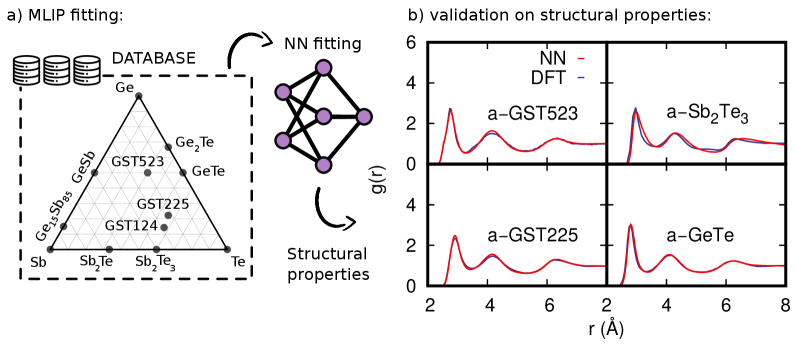
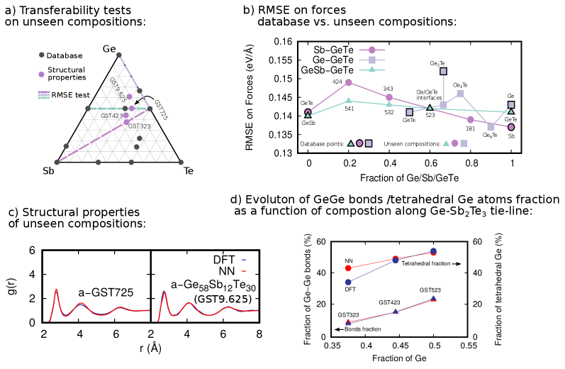
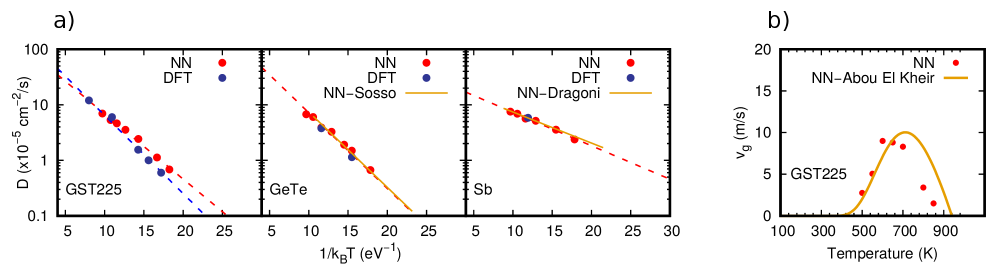
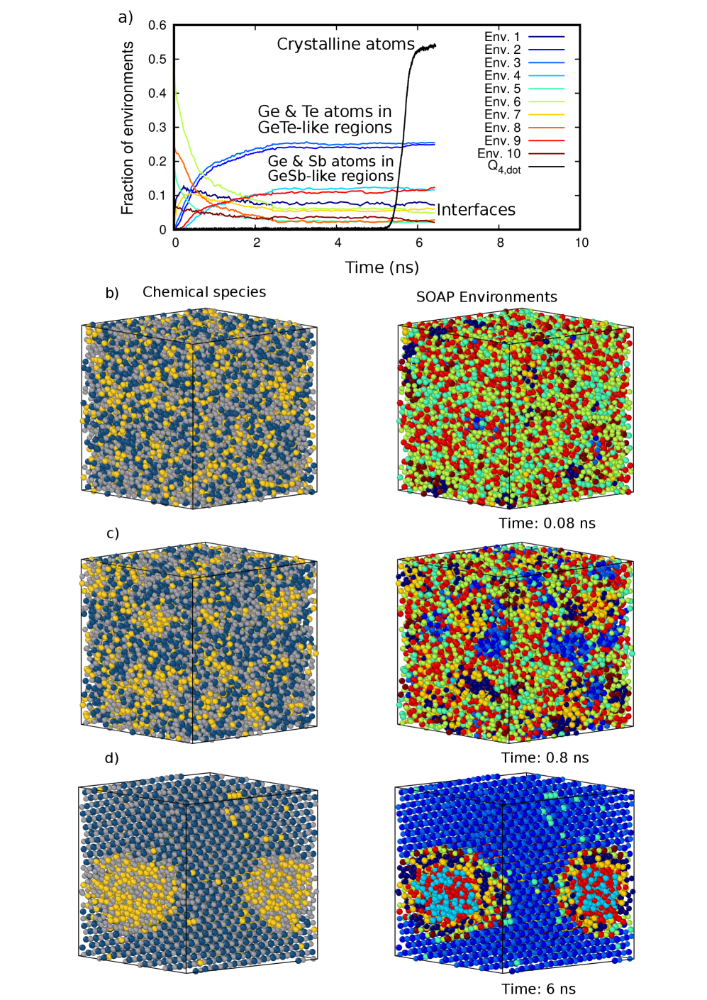
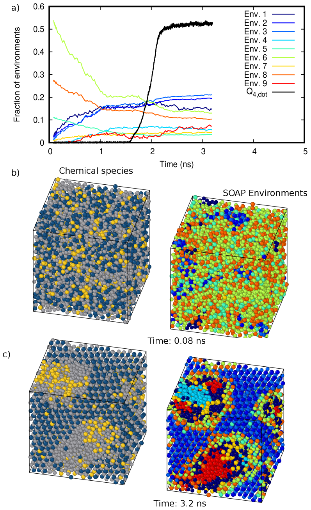

# Ge-rich GeSbTe相変化合金の結晶化：機械学習ポテンシャルが明かす準安定相分離の原子論的機構

- **執筆日**: 2026-04-25
- **トピック**: Ge-rich GeSbTe（GGST）相変化合金のセットプロセスにおける準安定相分離と結晶化機構の原子論的理解
- **タグ**: Devices and Functional Materials / Phase Transitions; Memory and Information Functionality / Machine Learning; Molecular Dynamics
- **注目論文**: O. Abou El Kheir, D. Baratella, M. Bernasconi, "On phase separation and crystallization of Ge-rich GeSbTe alloys from atomistic simulations with a machine learning interatomic potential," arXiv:2604.13843 (2026)
- **参照論文数**: 6本

---

## 1. なぜ今この話題なのか

相変化メモリ（Phase Change Memory; **PCM**）は、カルコゲナイド合金（硫黄族元素を含む化合物）の結晶相と非晶質相の間の可逆変換を利用した不揮発性メモリである。その主役を担ってきたのがゲルマニウム・アンチモン・テルル（Ge-Sb-Te, **GST**）合金であり、特にGe₂Sb₂Te₅（GST225）は「フラッグシップ材料」として20年以上にわたり研究・応用が積み重ねられてきた。PCMは現在、スタンドアロン型ストレージクラスメモリからニューロモーフィックコンピューティング、さらには自動車や産業機器向けのマイコン組込みフラッシュ代替まで、幅広い応用先を有している。

しかしここに来て、従来のGST225では対応できない用途が急拡大している。自動車向け電子制御ユニット（ECU）のように、高温環境下での長期動作が求められる組込み用途では、非晶質相がハンダリフロー工程（約550 Kに数分さらされる）に耐える必要がある。GST225の結晶化温度（$T_\mathrm{x}$）は420〜440 K程度であり、この要求を満たせない。そこで開発されたのが**Ge-rich GeSbTe（GGST）合金**であり、Ge-Sb₂Te₃タイライン上の組成では$T_\mathrm{x}$が600 Kを超える材料が実現している。GGSTはすでに28 nm MOSプロセスでの次世代マイコンへの採用が報告されており（Arnaud et al., 2018; 2020）、産業的意義が極めて高い。

GGSTの$T_\mathrm{x}$上昇はGe過剰分の偏析を伴う相分離と結晶化という複雑なプロセスに起因しているが、このプロセスの原子論的機構はいまだ十分に解明されていない。デバイス操作では、セットパルス（非晶質→結晶質化）はナノ秒スケールかつ600 K付近という過酷な条件下で行われる。このような実時間・実温度スケールでの相変化ダイナミクスを第一原理計算（DFT）だけで追うことは、計算コストの壁から事実上不可能であった。

この壁を突破する技術として近年急速に台頭してきたのが**機械学習原子間ポテンシャル（Machine Learning Interatomic Potential; MLIP）** である。DFTレベルの精度をニューラルネットワークで再現しながら、古典分子動力学の計算速度を実現するMLIPは、ナノ秒・数百万原子スケールのシミュレーションを初めて可能にした。GST225向けのMLIPは2024年に確立され（arXiv:2304.03109）、実デバイス規模に相当する百万原子クラスのセットプロセスシミュレーションも達成されている（arXiv:2501.07384）。しかし、Ge-rich組成域を包含する汎用MLIPはこれまで存在しなかった。今回注目するarXiv:2604.13843の論文は、この空白を埋め、GGSTの結晶化メカニズムをナノ秒スケールで初めて原子論的に解明したという点で、材料設計とデバイス工学の両面において重要な一歩を踏み出している。

## 2. 未解決問題は何か

GGSTの結晶化をめぐっては、少なくとも三つの本質的な問いが未解決のまま残されている。

**問い①：セットプロセスで実際に何相が形成されるのか？**　熱力学的平衡から見れば、Ge-GST225タイライン上のGGST合金の結晶化最終生成物は「純Ge＋GST225（あるいはSb₂Te₃）」であるべきだ。しかしデバイス操作のナノ秒スケールでは、系は熱力学的安定相に到達する時間がなく、動力学的に支配された準安定相が形成される可能性がある。実験的にはGeTe中間相の存在が観察されているものの（Privitera et al., 2020; Rahier et al., 2023）、どの相がいつ・どの順序で現れるかは原子論的には不明であった。

**問い②：相分離と結晶化の速度論的シーケンスはどうなっているのか？**　GGSTの$T_\mathrm{x}$が高い理由は「Ge偏析に伴う物質輸送がプロセスを遅くするから」というのが定性的な説明だが、原子スケールでどの原子がどのように動き、いつ結晶核が生まれ、どれだけの速度で成長するのか——その詳細は不明であった。自己拡散係数の組成依存性や温度依存性も定量的に知られていなかった。

**問い③：ナノ閉じ込め環境や電場・温度勾配は結晶化にどう影響するか？**　実デバイスでは、PCM活性層はナノスケールのヒータ構造に挟まれており、温度分布と電流分布が不均一である。さらに超格子（InterfacePCM; iPCM）構造のように、材料がナノ閉じ込め状態に置かれる場合もある。このような現実的条件下での相変化ダイナミクスは、均一バルクのシミュレーション結果からどれほど外れるのかも未解明である。

これら三つの問いは相互に絡み合っており、どれかひとつを解明するだけでは不十分である。今回の注目論文は、特に①と②に対して原子論的な答えを与え、③への糸口を示す。

## 3. 注目論文の核心

### MLIPの構築：Ge-rich組成空間への拡張

arXiv:2604.13843（Abou El Kheir, Baratella, Bernasconi, 2026）は、イタリア・ミラノ・ビコッカ大学のBernasconiグループが進めてきたGST系MLIP研究の発展形である。同グループはすでにGST225向けMLIP（arXiv:2304.03109）とGe-rich Ge₍ₓ₎Te合金向けMLIPを個別に開発していたが、今回はこれらを統合・拡張し、**Ge-Sb-Teの三元組成空間**を広くカバーする汎用MLIPを構築した。

MLIPの生成には**DeePMD**（Deep Potential Molecular Dynamics）フレームワークが用いられた。訓練データベースは約47万配置からなり、単元素（Ge, Sb, Te）、二元化合物（GeTe, Sb₂Te, Sb₂Te₃, Ge₂Te, Ge₁₅Sb₈₅, GeSb）、三元化合物（GST225, GeSb₂Te₄, GST523）、さらにGeTe-GST225などの超格子構造まで含む。これらの配置に対してDFT（PBE汎関数, TZVP基底, 400 Ry平面波カットオフ, 3×3×3以上のk点メッシュ）で精密にエネルギー・力・応力テンソルを計算し、ニューラルネットワークの教師データとした。

*図1：（a）Ge-Sb-Te三元相図上の訓練データベース組成（点）と主要タイライン。GST523、GST225、GeTe、Ge₂Teが頂点を成す三角領域が重点的にカバーされている。（b）各組成のアモルファス相における全ペア相関関数のMLIP（赤）とDFT（青）比較。*（arXiv:2604.13843, CC BY 4.0）

重要なのは、訓練セットに含まれていない組成への**転移性（transferability）** である。Figure 2に示す転移性テストでは、訓練データベースにない組成（Ge-GST225タイライン上の組成、Ge-Sb₂Te₃タイライン上のGST725など）に対しても、MLIPがDFTに匹敵する精度でエネルギーと力を再現することが確認された。この転移性は、相分離シミュレーション中に系が中間組成を経由することを考えると不可欠な性質である。

*図2：訓練データに含まれない組成に対する転移性の検証。MLIP計算と参照DFT計算の力・エネルギー比較。*（arXiv:2604.13843, CC BY 4.0）

### ナノ秒結晶化シミュレーション：動力学が支配する相形成

構築したMLIPを用いて、GST523（Ge₅Sb₂Te₃）、GST725（Ge₇Sb₂Te₅）、Ge₉.₆Sb₂Te₅の三組成について、**600 K・ナノ秒スケール**の結晶化シミュレーションを実施した。これはデバイスのセットプロセス条件（電流パルスによるジュール加熱後の温度・時間）に相当する。

シミュレーションの主要結果は衝撃的である。いずれの組成においても、相分離は**1〜3 ns以内**に完了し、（1）やや量のSbをドープした**立方晶GeTe様の結晶相**と、（2）GeSb**アモルファス相**が形成された。Ge₉.₆Sb₂Te₅のようにGeがより過剰な組成では、さらに純**アモルファスGe領域**も出現した。結晶相はGeTe様の領域から核生成し、シミュレーションセルを貫通するパーコレーションクラスターへと成長する。

この結果が示す核心的メッセージは：**ナノ秒スケールで熱力学的安定相（純Ge＋GST225またはSb₂Te₃）は形成されない**ということだ。系は動力学的に支配されており、最も速く核生成・成長できる相——立方晶Sb-doped GeTe——が「時間切れ」になる前に選ばれる。熱力学的安定相の形成には、より長い時間（あるいはより高い温度）が必要であり、デバイス動作の短い時間窓では実現しない。

Figure 3のアレニウスプロットは、各元素の自己拡散係数の温度依存性を示す。GST225では元素間の拡散係数に大きな差はないが、GGSTでは組成に応じて拡散係数の序列が変わる。これは、物質輸送の律速段階と相分離の速度論的シーケンスを決定する重要なデータである。

*図3：各組成アモルファス相における各元素の自己拡散係数の逆温度依存性（アレニウスプロット）。GST225との比較から、GGST合金での拡散の遅延が確認できる。*（arXiv:2604.13843, CC BY 4.0）

### SOAP解析：原子環境の時間発展を可視化する

結晶化の過程を原子論的レベルで追跡するため、注目論文では**SOAP（Smooth Overlap of Atomic Positions）記述子**を用いた構造解析を実施した。SOAP記述子は各原子の局所環境を高次元ベクトルで表現するもので、これを次元削減して可視化することで、原子環境がアモルファス・中間状態・結晶のどれに近いかを定量的に判定できる。

Figure 4（GST523の結晶化）とFigure 5（Ge₉.₆Sb₂Te₅の結晶化）は、時間の経過とともに各原子のSOAP環境がどのように変化するかを示している。

*図4：GST523の結晶化シミュレーション中のSOAP環境分布の時間発展。GeTe様結晶環境の出現と成長が原子スケールで可視化されている。*（arXiv:2604.13843, CC BY 4.0）

*図5：Ge₉.₆Sb₂Te₅の結晶化シミュレーション中のSOAP環境分布。より多くの純Geアモルファス領域が形成される様子が確認できる。*（arXiv:2604.13843, CC BY 4.0）

両図を通じて浮かび上がるのは、相分離と結晶化が明確な時間順序を持つということである。まず急速な相分離によってTe-rich（GeTe様）領域とGeSb/Ge-rich領域が空間的に分離し、その後GeTe様領域の内部で結晶核が生まれ成長する。GST225単体の結晶化（arXiv:2501.07384）と比べ、このシーケンスは二段階的であり、より複雑な物質輸送を必要とする。

## 4. 背景と研究史

### GST225からGGSTへ：産業的要求が材料を変える

相変化メモリの歴史はOvshinskyの1968年の先駆的研究に遡るが、材料としてGST225が確立されたのは1990年代である。GST225の結晶化速度は非常に速く（数十ns以下）、光ディスク（DVD, Blu-ray）やPCMへの応用を可能にした。結晶化温度$T_\mathrm{x} \approx 420\text{–}440$ Kというのは通常の動作温度よりは十分高く、かつ書き込みに必要な電流消費も許容範囲内という絶妙なバランスの産物である。

しかし組込み用途への展開が本格化した2010年代、ハンダリフロー耐性の問題が顕在化した。ハンダ付け工程で約550 Kの熱処理を受けても情報が保持される必要があるが、GST225の$T_\mathrm{x}$はこれより100 K以上低い。この技術的課題を解決するために開発されたGGSTは、Ge-Sb₂Te₃タイライン上の組成（例：GST523）で$T_\mathrm{x} > 600$ Kを達成し、28 nm MOSプロセスでの量産段階に入っている（Arnaud et al., 2018; 2020）。

GGSTの$T_\mathrm{x}$上昇のメカニズムは、単純なGe添加による相変化温度の上昇ではなく、**相分離に伴う物質輸送の律速化**である。Geの偏析と再配置には時間がかかるため、実効的な結晶化が遅れ、高い$T_\mathrm{x}$が実現する。さらに窒素ドーピングによってGe移動度を抑制することで$T_\mathrm{x}$をさらに高める手法も研究されている（Navarro et al., 2016; Remondina et al., 2025）。

### 計算手法の進化：第一原理からMLIPへ

GST系の計算研究は2000年代初頭から活発であったが、長らくDFT分子動力学（DFT-MD）に依存していた。DFT-MDは数百原子・数十ps程度が限界であり、デバイス動作の実時間スケール（ns）や実規模（数百万原子）には遠く及ばない。

転機となったのは2024年に発表されたGST225向けMLIP（arXiv:2304.03109）である。Abou El Kheirらはこの論文で、DeePMDフレームワークを用いて～47万DFT配置で訓練したMLIPを構築し、アモルファスGST225の構造・電子・熱的性質をDFT精度で再現することを示した。このMLIPにより、GST225のガラス転移・結晶化をns スケールで初めてシミュレートすることが可能になった。

さらにarXiv:2501.07384では、このMLIPを百万原子規模に適用し、実デバイスに近い条件でのセットプロセス（非晶質→結晶質化）を大規模シミュレーションで再現することに成功している。球状の結晶核が生まれ、放射状に成長してセルを貫通するというセットプロセスの巨視的像が、原子一粒一粒のレベルで初めて可視化された。今回のGGST向けMLIP（arXiv:2604.13843）はこの成果の直接的な延長線上にある。

### 実験との対話：GeTe中間相の証拠

計算研究と並行して、実験的な知見も積み上がっている。透過電子顕微鏡（TEM）観察では、GGSTフィルムを温度ランプ加熱した際にGeTe結晶が中間相として出現することが報告されている（Privitera et al., 2020; Rahier et al., 2023）。Rahier et al.（2023）によると、310°C以上でGeTe（Pnma準安定相）が先に析出し、純Geの結晶化を誘引し、その後410°C付近でSbが取り込まれてGST225組成の結晶が形成されるという序列が観測されている。

この実験知見は今回のシミュレーション結果と重要な対応関係を持つ。シミュレーションでGeTe様立方晶が最初に形成される知見は、TEM実験でのGeTe中間相検出と整合的だ。一方、実験ではPnma相（斜方晶GeTe）の関与も観測されているが、シミュレーションでは主に立方晶（cubic）GeTe様相が見られている。この違いは、シミュレーション条件（均一温度600 K）と実験条件（温度ランプ、電場あり）の差異、あるいはシミュレーション時間スケールの制限に起因する可能性がある。

## 5. どの解釈が最も妥当か

### 「動力学支配」という解釈の強度

今回の注目論文が提示する中心的解釈——GGSTの相変化はナノ秒スケールでは動力学的に支配されており、熱力学的安定相ではなく立方晶Sb-doped GeTe＋アモルファスGeSb/Geという準安定相混合物が生じる——はどの程度支持されるのか。

この解釈を支持する根拠は複数ある。第一に、Arrhenius則に従う拡散係数の解析から、GST225成分への再配置に必要なSbとTeの長距離拡散は600 KでのnsスケールではGeとTeの局所再配置より桁違いに遅いことが示唆される。第二に、SOAP解析により結晶化の時間発展が原子スケールで追跡され、GeTe様環境が先行して出現し、GeSb/Ge環境が後に残存するという序列が示された。第三に、独立したTEM実験（Ran et al., 2025）が、実メモリセルの動作後にGeTe様結晶の存在を直接確認しており、シミュレーション予測を支持している。

一方、この解釈には留意すべき限界もある。現在のシミュレーションは均一温度場・無電場条件を仮定しているが、実デバイスでは強い電場と温度勾配が存在する。Ran et al.（2025）のTEM観察では、Sb-rich領域やSb結晶の存在も報告されており、これらは均一温度シミュレーションでは再現されていない。電場や温度勾配がSb-rich中間相の形成にどう寄与するかは未解明であり、実デバイスの結晶化シーケンスはシミュレーションより複雑である可能性が高い。

### アモルファス相の電子構造：別の観点からの補完

GGSTのデバイス特性を理解するには、結晶化ダイナミクスだけでなく、非晶質相の電子構造も重要である。arXiv:2602.15446では、アモルファスGST225における**バンドギャップ内局在状態（in-gap states）**の起源と性質が理論的に詳細に調べられている。非晶質相では、Ge・Sb・Te原子の配位数の乱れに起因した局在電子状態が価電子帯直上のエネルギー領域に分布し、これが**Poole-Frenkel輸送機構**（電場誘起のバリア低減）や抵抗ドリフト（時間とともに抵抗が増加する現象）の主因であると示された。

この知見は、GGSTの文脈でも重要な含意を持つ。GGSTアモルファス相は組成が変化すること（Ge過剰分の存在）から、GST225とは異なるin-gap state分布を持つ可能性があり、抵抗ドリフト特性が材料組成に依存することが予想される。今回の注目論文はセットプロセス（結晶化）に焦点を当てているが、多段階記憶（アナログメモリ）やニューロモーフィックデバイスとしての実用化には、非晶質相の電子構造とその安定性の理解が不可欠だ。現時点では、arXiv:2602.15446のGST225の知見がGGSTにそのまま適用できるかは不明であり、GGST組成でのin-gap stateの研究は重要な課題として残っている。

### ナノ閉じ込めが相変化を変える

もう一つ重要な比較軸は**ナノ閉じ込め**の効果である。arXiv:2501.18370は、GeTe/Sb₂Te₃超格子（**InterfacePCM; iPCM**）構造において、材料がナノメートルスケールに閉じ込められることで結晶化機構が根本的に変化することを示している。超格子界面がテンプレートとなり、体積結晶化（bulk crystallization）ではなく界面誘起の結晶化が優先される。これにより、書き込みエネルギーの大幅な低減と多段階抵抗状態の実現が可能になり、ニューロモーフィックコンピューティングへの応用が開ける。

GGSTの場合、ナノ閉じ込めはさらに相分離機構を変える可能性がある。体積中での相分離には長距離拡散が必要だが、界面が相分離のシード（種）を提供するか、あるいは拡散経路を阻害するかによって、GGST薄膜の相変化特性は大きく変わりうる。現在のシミュレーションはバルク（周期境界条件）を仮定しており、ナノ閉じ込め効果は今後の重要研究課題として残る。

### 比較的強く支持される結論

以上を整理すると、現時点で比較的確からしい結論は：（1）GGSTのnsスケール結晶化では、立方晶Sb-doped GeTe＋アモルファスGeSbが主要な動力学的産物である、（2）このシーケンスは実験的TEM観察と整合する、（3）アモルファスGST225のin-gap statesが非晶質相の電気抵抗特性を決める——の三点である。一方、電場・温度勾配の影響、GGST特有の電子構造、ナノ閉じ込め条件下での相変化は、確定的な結論を出せる段階には至っていない。

## 6. 何が一般化できるのか

### ML電位戦略：多成分カルコゲナイドへの展開

arXiv:2604.13843が採用したMLIP構築戦略——既存の二元・三元データベースを段階的に統合・拡張して三元組成空間を広くカバーする——は、GeSbTe系に限らず多成分カルコゲナイド合金一般に適用できる汎用的アプローチである。例えばGe-Sb-Te系にNやOをドープした四元系（窒素ドープGGSTなど）へのMLIP拡張も、同様の戦略で原理的には可能だ。計算コストが依然として大きいという課題はあるものの、active learningや転移学習を組み合わせることで、訓練データの効率的な拡充が期待される。

より広くは、この研究は相変化材料のコンビナトリアル探索を計算主導で行うための基盤を与える。GGST組成空間全体の転移性が確認された今、シミュレーションによって新組成の候補の$T_\mathrm{x}$・結晶化速度・相変化特性を実験前に予測するというルートが現実的になりつつある。

### 準安定相形成という概念的枠組み

「熱力学的安定相ではなく動力学的に支配された準安定相が形成される」という知見は、PCM以外の材料系にも示唆的である。例えば金属ガラスの析出（devitrification）やペロブスカイト太陽電池の光誘起相変化など、急速な加熱・冷却を経る系では準安定相の出現が普遍的な現象である。GGSTの場合、この準安定相形成がデバイスの動作状態を決定するというのは、「材料設計において熱力学だけでなく速度論の制御が不可欠」という一般原則を鮮明に示している。

### ニューロモーフィックデバイスへの接続

相変化材料はニューロモーフィック（脳模倣型）コンピューティングの有力な候補デバイス材料でもある（Sebastian et al., 2020; arXiv:2501.18370）。シナプス可塑性を模倣するためには、多段階で安定した中間抵抗状態の実現が必要だが、GGSTのような組成依存の相分離は複数の結晶化段階を利用することで、多段階状態を実現する可能性がある。一方、arXiv:2602.15446が示すように、非晶質相のin-gap statesは抵抗ドリフトを引き起こし、これが多段階メモリの精度を低下させる要因でもある。ニューロモーフィック応用における信頼性確保には、結晶化ダイナミクスと非晶質相の電子構造の両方を制御することが求められる。

## 7. 基礎から理解する

### 相変化メモリの動作原理

相変化メモリは、材料の「速やかな可逆相変化」を情報記録に利用する不揮発性メモリである。GST系カルコゲナイドでは、結晶質と非晶質の電気抵抗値が3〜4桁（10³〜10⁴倍）異なる。この巨大な抵抗比が「0」（低抵抗＝結晶質）と「1」（高抵抗＝非晶質）の読み出しを可能にする。

書き込みには二種類のパルスを使う。**リセットパルス**（短く強い電流）は材料を融点以上に加熱してから急冷（クエンチ）し、非晶質状態（アモルファス）を形成する。**セットパルス**（長く弱い電流）は材料を$T_\mathrm{x}$以上かつ融点以下の温度に保ち、結晶化を誘導する。GGSTのような合金では、このセットパルス時に相分離が起こるため、応答が複雑になる。

### 結晶化の速度論：核生成と成長

アモルファス相から結晶相への転換は、**核生成（nucleation）** と**成長（growth）** という二段階のプロセスで進む。

核生成速度 $I$ はAvrami-Johnson-Mehl理論によれば、

$$I \propto \exp\left(-\frac{\Delta G^*}{k_\mathrm{B}T}\right)$$

と表される。ここで $\Delta G^*$ は臨界核形成のための活性化障壁、$k_\mathrm{B}$ はBoltzmann定数、$T$ は絶対温度である。$\Delta G^*$ は界面エネルギー $\gamma$ と液体-結晶間の自由エネルギー差 $\Delta G_\mathrm{v}$ を使って $\Delta G^* \propto \gamma^3/(\Delta G_\mathrm{v})^2$ と書けるため、過冷却度（融点からの温度差）が増えると $\Delta G_\mathrm{v}$ が増大して核生成が促進される。一方、低温では拡散速度が低下するため、核生成速度にも上限がある。

結晶成長速度 $u$ は原子の拡散係数 $D$ に比例し、

$$u \propto D \left[1 - \exp\left(-\frac{\Delta \mu}{k_\mathrm{B}T}\right)\right]$$

となる（$\Delta\mu$ は化学ポテンシャル差）。拡散係数 $D$ は Arrhenius 型の温度依存性 $D \propto \exp(-E_\mathrm{a}/k_\mathrm{B}T)$ に従う。これが、シミュレーションでArrheniusプロットが有効な理由である。GGSTでは相分離に伴い、各元素の有効拡散係数が組成・温度で大きく変化するため、成長速度が組成に依存する。

### 機械学習原子間ポテンシャルの仕組み

分子動力学シミュレーションでは、各タイムステップごとに全原子の位置から系のポテンシャルエネルギーを計算し、その力（エネルギーの位置微分）から各原子の加速度を求める。DFTではSchrodinger方程式を数値的に解くため精度は高いが計算コストが原子数の3乗以上でスケールする。古典力場は高速だが、化学結合の多様性（アモルファス・結晶・液体の混在など）を一つのモデルで再現するのは困難だ。

MLIPは、この両者の中間を占める。各原子サイトのエネルギーを

$$E_\mathrm{total} = \sum_i \epsilon_i(\mathbf{r}_{i,\mathrm{neighbor}})$$

と局所エネルギーの和で表し、$\epsilon_i$ をニューラルネットワーク（あるいはカーネル法）で表現する。入力特徴量（記述子）として、今回用いられるDeePMDでは**Smooth Edition（SE）**の原子環境記述子が使われ、原子座標の回転・並進・鏡映対称性が保証されている。DFT計算した大量の（エネルギー, 力）ペアでネットワークを訓練すれば、DFT精度を維持しながら古典MD並みの計算速度が得られる。

### SOAP記述子：構造の「指紋」

**SOAP（Smooth Overlap of Atomic Positions）** 記述子は、原子周囲の密度を球面調和関数展開で表現し、得られた展開係数の二乗積分からparaメトリックに原子環境を記述する。SOAPは回転・並進不変であり、同じ結晶環境の原子は同じSOAPベクトルを持つ。異なる相（アモルファス, cubic GeTe, GST225など）のSOAP空間での位置はそれぞれ固有のクラスターを形成するため、次元削減（UMAPやPCAなど）と組み合わせることで「この原子は今どの相の環境にいるか」を連続的に定量化できる。これがFigure 4, 5の可視化を可能にする技術的基盤だ。

## 8. 専門用語の解説

**相変化メモリ（Phase Change Memory; PCM）**
カルコゲナイド合金の結晶-非晶質相転移を利用した不揮発性メモリ。電気的なセット/リセットパルスで高速・可逆的に相変化させ、抵抗差を情報として記録する。光ディスク（CD/DVD/Blu-ray）から組込みフラッシュ代替、ニューロモーフィックデバイスまで幅広い応用がある。

**Ge-rich GeSbTe（GGST）合金**
Ge₂Sb₂Te₅（GST225）よりGeを多く含む非化学量論的GeSbTe合金（例：Ge₅Sb₂Te₃＝GST523）。Ge過剰分の偏析により結晶化温度$T_\mathrm{x}$が600 K超と高く、高温環境下の組込み用途（自動車ECUなど）に不可欠。

**機械学習原子間ポテンシャル（MLIP）**
DFTで計算したエネルギー・力のデータをニューラルネットワークで学習した原子間ポテンシャル。DFT精度を保ちながら、DFTの10⁴〜10⁶倍の計算速度を実現し、ナノ秒・百万原子規模のMDシミュレーションを可能にする。DeePMD、MACE、NequIPなど多様なフレームワークが存在する。

**DeePMD（Deep Potential Molecular Dynamics）**
ニューラルネットワーク型MLIPの主要フレームワークの一つ。原子環境記述子にSE-E2（Smooth Edition with two-body embedding）などを用い、大規模並列GPU計算に最適化されている。GST系への適用で数十ns・百万原子シミュレーションを実現した実績がある。

**SOAP記述子**
各原子の局所環境を球面調和関数展開で記述する高次元特徴ベクトル。回転・並進・鏡映対称性に不変で、DFTデータベース解析やMLIP訓練、相の分類・追跡に広く使われる。次元削減（UMAP, t-SNE, PCA）と組み合わせることで、相変化の時間発展を原子スケールで可視化できる。

**セットプロセス／リセットプロセス**
PCMの書き込み操作。セットは弱い電流パルスで結晶化温度以上に加熱し、非晶質→結晶質化させる操作（「0」書き込み）。リセットは強い電流パルスで融点以上に加熱してから急冷し、結晶→非晶質化させる操作（「1」書き込み）。GGSTのセットプロセスは相分離を伴うため、GST225より複雑で時間を要する。

**準安定相（metastable phase）**
熱力学的自由エネルギーが最小の「安定相」ではないが、局所的なエネルギー極小に対応し、短時間・特定条件下で安定して存在できる相。GGSTのセットプロセスで形成される立方晶Sb-doped GeTe＋アモルファスGeSbは、熱力学的安定相（純Ge＋GST225）に対する準安定相である。

**立方晶GeTe（cubic GeTe）**
GeTe結晶の高温相（NaCl型構造）。本来GeTe単体は室温で斜方晶（Pnma相）や菱面体晶（GeTe型）であるが、Sbなどのドーピングや高温で安定化するNaCl型（岩塩型）構造は、GSTシステムの共通の結晶構造モチーフである。今回のシミュレーションではSbを少量含むcubic GeTe様相が最初の結晶産物として現れる。

**バンドギャップ内局在状態（in-gap states）**
非晶質半導体のバンドギャップ内に存在する局在した電子状態。アモルファスGST225では、配位数の乱れに起因してGe・Sb・Te原子周囲に局在状態が生じる。これがPoole-Frenkel機構による電流輸送を可能にし、抵抗ドリフト（時間経過による抵抗増大）の原因となる。

**抵抗ドリフト（resistance drift）**
PCMの非晶質相で、書き込み後に時間とともに電気抵抗が単調増加する現象（$R(t) \propto t^\nu$、$\nu \approx 0.1$）。構造緩和（β緩和や$\alpha$緩和）に伴うin-gap statesの密度・分布変化が主因とされる。多段階（アナログ）メモリやニューロモーフィックデバイスでは、抵抗ドリフトが情報精度を劣化させる深刻な問題となる。

## 9. 今後の展望

GGSTの相変化機構について、今回の注目論文とその周辺研究によって「ナノ秒・600 Kのセットプロセスでは動力学的に支配された準安定相（cubic Sb-doped GeTe＋アモルファスGeSb/Ge）が形成される」という点は、シミュレーションと独立したTEM実験が整合する形でかなり確からしくなった。また、アモルファス相のin-gap statesが抵抗ドリフトの主因であるという理解も、理論的な基盤が固まりつつある（arXiv:2602.15446）。さらに、ナノ閉じ込め（iPCM構造）が結晶化を界面誘起型に切り替え、低エネルギー書き込みを可能にするという概念実証も得られている（arXiv:2501.18370）。MLIP手法の確立により、Ge-Sb-Te三元組成空間の広い領域での原子論的シミュレーションが可能になったことは、材料探索の加速という観点でも大きな進歩である。

一方、今後の研究が決定的に重要になる論点も複数残る。最優先の課題は、電場・温度勾配を取り込んだ現実的デバイス条件下でのGGST結晶化シミュレーションである。現在のMLIPは既にこの課題への適用が計画されており（注目論文の結論で言及）、電場誘起のSb偏析やSb-rich中間相の形成機構が明らかになれば、実デバイスのTEM観察との完全な整合が達成される可能性がある。また、窒素ドープGGSTや四元系材料への転移性の拡張は、実用上不可欠かつ計算科学的に挑戦的なテーマである。さらに1〜3年の時間軸では、GGSTのアモルファス相のin-gap state構造とその組成依存性の解明、ナノ閉じ込め条件下でのGGST相変化の原子論的理解、そしてニューロモーフィックデバイスにおける多段階中間状態の安定性設計、これらが中心的論点となるだろう。MLIPと実験（TEM, ARPES, X線散乱）の緊密な対話が、相変化メモリ材料科学の次なる章を開く。

---

## 参考論文一覧

1. **O. Abou El Kheir, D. Baratella, M. Bernasconi** (2026)  
   "On phase separation and crystallization of Ge-rich GeSbTe alloys from atomistic simulations with a machine learning interatomic potential"  
   arXiv:2604.13843 [cond-mat.mtrl-sci]  
   [https://arxiv.org/abs/2604.13843](https://arxiv.org/abs/2604.13843)  
   *【注目論文】Ge-rich GeSbTeのMLIPを新規構築し、セットプロセス条件（600 K, ns）での相分離・結晶化シミュレーションを行い、準安定相（cubic Sb-doped GeTe＋アモルファスGeSb）の形成を初めて原子論的に解明した論文。*

2. **O. Abou El Kheir et al.** (2024, npj Computational Materials)  
   "Unveiling the crystallization kinetics of the Ge₂Sb₂Te₅ phase change compound by large-scale atomistic simulations with a machine learned interatomic potential"  
   arXiv:2304.03109 [cond-mat.mtrl-sci]  
   [https://arxiv.org/abs/2304.03109](https://arxiv.org/abs/2304.03109)  
   *【背景】GST225向けの初のDeePMD型MLIPを構築し、ns・数万原子規模の結晶化シミュレーションを実現した先駆的論文。今回のGGST-MLIP構築の直接的な基盤。*

3. **O. Abou El Kheir et al.** (2025)  
   "Atomistic simulation of the set process in a phase change memory with a machine learned interatomic potential"  
   arXiv:2501.07384 [cond-mat.mtrl-sci]  
   [https://arxiv.org/abs/2501.07384](https://arxiv.org/abs/2501.07384)  
   *【支持】GST225 MLIPを百万原子規模に拡張し、実デバイス規模のセットプロセス（核生成→成長→パーコレーション）を大規模MDで初めて再現した論文。*

4. **A. Massaro et al.** (2026)  
   "In-gap states and Poole-Frenkel transport in amorphous Ge₂Sb₂Te₅"  
   arXiv:2602.15446 [cond-mat.mtrl-sci]  
   [https://arxiv.org/abs/2602.15446](https://arxiv.org/abs/2602.15446)  
   *【比較】アモルファスGST225のバンドギャップ内局在状態の起源と電気輸送への寄与を理論的に詳解し、抵抗ドリフトとPoole-Frenkel輸送機構の微視的理解を与えた論文。*

5. **G. Dalla Volta et al.** (2025)  
   "Nanoconfinement effects on the crystallization of GeTe/Sb₂Te₃ superlattices for neuromorphic devices"  
   arXiv:2501.18370 [cond-mat.mtrl-sci]  
   [https://arxiv.org/abs/2501.18370](https://arxiv.org/abs/2501.18370)  
   *【波及/応用】GeTe/Sb₂Te₃超格子（iPCM）のナノ閉じ込め効果による界面誘起結晶化を原子論的シミュレーションで解明し、ニューロモーフィックデバイスへの応用可能性を示した論文。*

6. **T. H. Lee, S. R. Elliott** (2024)  
   "Ab initio computer simulation of the early stages of crystallization: Two types of nucleation"  
   arXiv:2510.04783 [cond-mat.mtrl-sci]  
   [https://arxiv.org/abs/2510.04783](https://arxiv.org/abs/2510.04783)  
   *【異手法/比較】GST系の結晶化初期過程をDFT-MD（第一原理分子動力学）で解析し、均質核生成と不均質核生成の二種類の核生成機構を識別した論文（arXiv nonexclusive、図は不使用）。*
